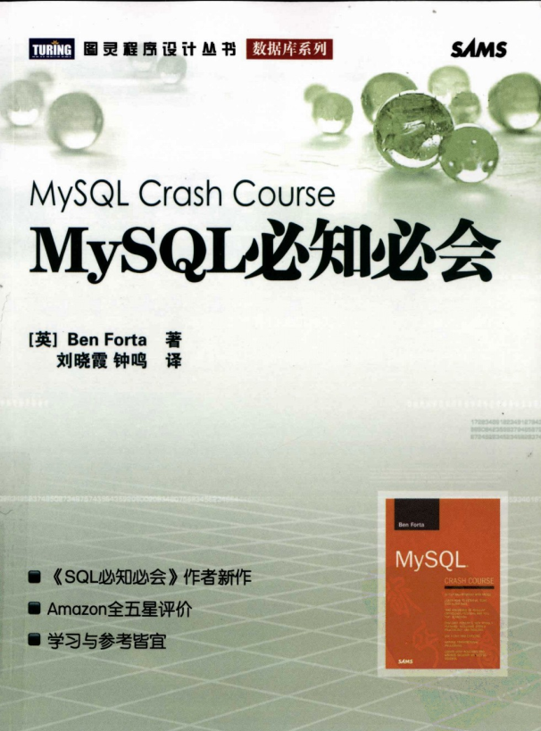
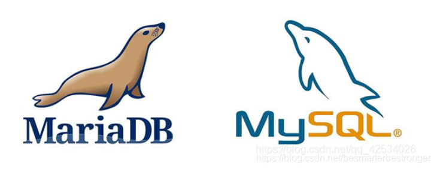
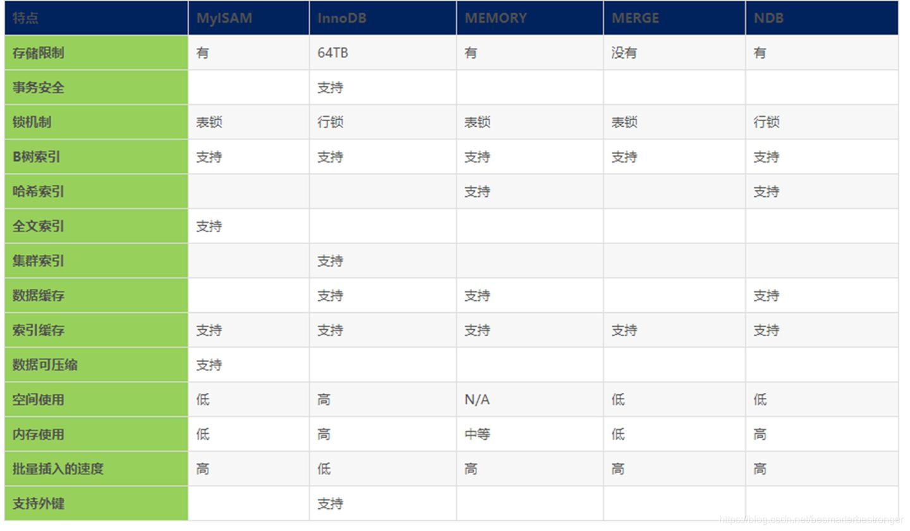

# 1. 数据库基础概念

**1.1 数据库（database）**

保存有组织的数据的容器（通常是一个文件或一组文件）。数据库软件应该称为`数据库管理系统（DBMS）`，而数据库是通过DBMS创建和操纵的容器。

**1.2 表（table）**

某种特定类型数据的结构化清单。如顾客表不应和订单表存储在同一个数据库的同一个表中。

**1.3 模式（schema）**

关于数据库和表的布局及特性的信息，即数据库和表的元数据信息。

**1.4 列（column）**

表由列组成，列中存储着表中某部分的信息。列是表中的一个字段。所有表都是由一个或多个列组成的。

**1.5 数据类型（datatype）**

所容许的数据的类型。每列都有相应的数据类型，它限制该列中存储的数据。

**1.6 行（row）**

表中的数据是按行存储的，一条记录就是一行。

**1.7 主键（primary key）**

表中的每一行都应该有可以标识自己的一列（或一组列），其值能够唯一地区分表中的每个行。

列要称为主键，需要满足以下条件：

1. 任意两行都不具有相同的主键值
2. 每行都必须具有一个主键值（主键列不允许NULL值）

好习惯：

1. 不更新主键列中的值
2. 不重用主键列的值
3. 不在主键列中使用可能会更改的值。

**1.8 SQL（Structure Query Language）**

结构化查询语言，专门用来与数据库通信的语言。

# 2. MySQL简介

MySQL是一种DBMS。DBMS分为两类：一类是基于共享文件系统的DBMS，另一类是基于客户机-服务器的DBMS（如MySQL、Oracle、Microsoft SQL Server等）。

客户机-服务器的数据库，即客户机软件发送关于数据的请求，然后由数据库服务器来处理这些请求。

## MySQL的版本

- 4 --- InnoDB引擎，增加事务处理、并、改进全文本搜索等的支持。
- 4.1 --- 对函数库、子查询、集成帮助等的支持。
- 5 --- 存储过程、触发器、游标、视图等的支持。
- 8 --- TODO

## MySQL 与MariaDB

[MySQL历史，名称由来及版本](https://blog.csdn.net/qq_42534026/article/details/105315731)

因为MySQL最初是由某开源公司发布的，但是最终落到了Oracle公司的手里，**MySQL的创始人麦克尔·维德纽斯**担心Oracle可能会不再支持MySQL社区版（MySQL唯一免费的版本），因此他以MySQL为基础，成立了分支计划MariaDB。




## MySQL的引擎
下面是MySQL常用的引擎对比。



## MySQL的工具

- **MySQL命令行**

- **MySQL Adiministrator**：一个图形交互客户机，用来简化MySQL服务器的管理。

- **MySQL Query Browser**：一个图形交互客户机，用来编写和执行MySQL命令。

# 3. 使用MySQL

按照惯例，SQL的关键字使用大写，表名列名使用小写，便于阅读和区分。

在处理SQL语句时，其中所有空格都会被忽略。SQL语句可以在一行上给出，也可以分成许多行。分成多行更容易阅读和调试。

**完全限定的表名和列名**

某些情况下可能会使用完全限定的名字来引用表或列，如：

```sql
SELECT products.prod_name
FROM products;

SELECT products.prod_name
FROM crashcourse.products;
```


## 3.1 检索数据

```sql
SELECT 列名, ...
FROM 表名, ...
[WHERE ...[=|<>|!=|<|<=|>|>=|BETWEEN ... AND ...|IS NULL|IN|NOT] [AND|OR] ...]
[UNION ...]
[GROUP BY ...]
[HAVING ...]
[ORDER BY 列1,... [ASC|DESC]]
[LIMIT start,n| LIMIT n OFFSET start];

# 使用通配符*，可以检索表中的所有列，但是检索不需要的列通常会降低检索和应用程序的性能。
SELECT * ...
# 去重
SELECT DISTINCT 列 FROM 表;
```

### 排序检索数据

`ORDER BY` 的使用，

## 3.2 过滤数据

单值匹配检查、不匹配检查、范围值检查、空值检查

### 3.2.1 组合多个WHERE子句

WHERE子句中同时出现AND和OR，那么检索的顺序是怎样的呢？

```sql
SLEECT prod_name,prod_price
FROM products
WHERE vend_id=1002 OR vern_id=1003 AND prod_price>=10;
# 实际效果为
SLEECT prod_name,prod_price
FROM products
WHERE vend_id=1002 OR (vern_id=1003 AND prod_price>=10);
```

从这个例子可知，AND优先级高于OR。

### 3.2.2 用通配符进行过滤

百分号(%)通配符，**表示任意字符出现任意次数（0次,1次，无数次）。注意，`LIKE '%' `不能匹配到`NULL`**

下划线(\_)通配符，与%用途类似，**但只匹配单个字符而不是多个字符**。

使用通配符搜索一般要花更长的时间，尽量少地使用。

```sql
-- 以jet开头的prod_name
SELECT prod_name FROM products WHERE prod_name LIKE 'jet%';
-- 以jet结尾的prod_name
SELECT prod_name FROM products WHERE prod_name LIKE '%jet';
-- 包含jet的prod_name
SELECT prod_name FROM products WHERE prod_name LIKE '%jet%';
-- 以j开头和t结尾的prod_name
SELECT prod_name FROM products WHERE prod_name LIKE 'j%t';

```


### 3.2.3 使用正则表达式进行搜索

MySQL仅支持正则表达式的一个很小的子集。

```sql
-- 基本字符串匹配
SELECT prod_name FROM products WHERE prod_name REGEXP '1000' ORDER BY prod_name;
-- 上面REGEXP和LIKE的区别在于，REGEXP只要包括1000就行，而LIKE要完全匹配
SELECT prod_name FROM products WHERE prod_name LIKE '1000' ORDER BY  prod_name;
-- 上面LIKE等价于
SELECT prod_name FROM products WHERE prod_name REGEXP '^1000$' ORDER BY  prod_name;

SELECT prod_name FROM products WHERE prod_name REGEXP '.000' ORDER BY prod_name;
SELECT prod_name FROM products WHERE prod_name REGEXP '1000|2000' ORDER BY prod_name;
SELECT prod_name FROM products WHERE prod_name REGEXP '[123]000' ORDER BY prod_name;
-- 区分大小写来匹配
SELECT prod_name FROM products WHERE prod_name REGEXP BINARY '.jet' ORDER BY prod_name;
-- 还有很多例子，就不一一列举了，实际用到再说
```

MySQL中的正则表达式匹配不区分大小写，要区分大小写需要使用`BINARY`关键字

### 3.2.4 创建计算字段

字段（field）与列（column）的意思相同。

```sql
-- 拼接字段，Concat()函数
SELECT Concat(vend_name, '(', vend_country, ')')
FROM vendors
ORDER BY vend_name;

-- 执行算术计算（+,-,*,/），使用别名，
SELECT prod_id, quantity, item_price, quantity*item_price AS expanded_price
FROM orderitems
WHERE order_num = 20005;
```

***通过省略FROM 语句，即只用SELECT语句来测试函数和计算***，如：

```sql
SELECT 3*2;
SELECT Trim('abc ');
SELECT Now();
-- 等等
```


### 3.2.5 使用函数

#### 3.2.5.1 常用文本处理函数

| 函数        | 说明                 |
| ----------- | -------------------- |
| Concat()    | 拼接字符串           |
| Trim()      | 去除字符串两边的空格 |
| LTrim()     | 去除字符串左边的空格 |
| RTrim()     | 去除字符串右边的空格 |
| Left()      | 返回字符串左边的字符 |
| Length()    | 返回串的长度         |
| Locate()    | 找出串的一个子串     |
| Lower()     | 将串转换为小写       |
| Right()     | 返回传右边的字符     |
| Soundex()   | 返回串的SOUNDEX值    |
| SubString() | 返回子串的字符       |
| Upper()     | 将串转换为大写       |

#### 3.2.5.2 常用日期和时间处理函数

| 函数          | 说明                           |
| ------------- | ------------------------------ |
| AddDate()     | 增加一个日期（天，周等）       |
| AddTime()     | 增加一个时间（时，分等）       |
| CurDate()     | 返回当前日期                   |
| CurTime()     | 返回当前时间                   |
| Date()        | 返回日期时间的日期部分         |
| DateDiff()    | 计算两个日期之差               |
| Date_Add()    | 高度灵活的日期运算函数         |
| Date_Format() | 返回一个格式化的日期或时间串   |
| Day()         | 返回一个日期的天数部分         |
| DayOfWeek()   | 对于一个日期，返回对应的星期几 |
| Hour()        | 返回一个时间的小时部分         |
| Minute()      | 返回一个时间的分钟部分         |
| Month()       | 返回一个日期的月份部分         |
| Now()         | 返回当前日期和时间             |
| Second()      | 返回一个时间的秒部分           |
| Time()        | 返回一个日期时间的时间部分     |
| Year()        | 返回一个日期的年份部分         |


#### 3.2.5.3 常用数值处理函数

| 函数   | 说明               |
| ------ | ------------------ |
| Abs()  | 返回一个数的绝对值 |
| Cos()  | 返回一个角度的余弦 |
| Exp()  | 返回一个数的指数值 |
| Mod()  | 返回除操作的余数   |
| Pi()   | 返回圆周率         |
| Rand() | 返回一个随机数     |
| Sin()  | 返回一个角度的正弦 |
| Sqrt() | 返回一个数的平方根 |
| Tan()  | 返回一个角度的正切 |

#### 3.2.5.4 聚集函数

| 函数    | 说明                                                         |
| ------- | ------------------------------------------------------------ |
| AVG()   | 返回某列的平均值，忽略列值为NULL的行                         |
| COUNT() | 返回某列的行数，COUNT(*)不忽略列值为NULL的行，COUNT(列)忽略列值为NULL的行 |
| MAX()   | 返回某列的最大值，忽略列值为NULL的行                         |
| MIN()   | 返回某列的最小值，忽略列值为NULL的行                         |
| SUM()   | 返回某列值之和，忽略列值为NULL的行                           |

对于聚集函数的，所有的行执行计算，默认是指定ALL参数的，使用DISTINCT可以让聚集函数只考虑不重复的行，如：

```sql
SELECT AVG(DISTINCT prod_price) AS avg_price
FROM products
WHERE vend_id = 1003;
```

### 3.2.6 分组数据

使用SELECT语句中 `GROUP BY`子句可以对数据进行分组。`GROUP BY`子句必须在`WHERE`子句之后，`ORDER BY`子句之前。

使用`HAVING`子句可以对分组后的数据进行过滤。

**HAVING子句和WHERE子句的区别**

> HAVING支持所有WHERE的操作符，区别是**HAVING过滤的是分组，WHERE过滤的是行。**


**SELECT子句的顺序**

| 函数     | 说明               | 是否必须使用             |
| -------- | ------------------ | ------------------------ |
| SELECT   | 要返回的列或表达式 | 是                       |
| FROM     | 从中检索数据的表   | 仅在从表中选择数据时使用 |
| WHERE    | 行级过滤           | 否                       |
| GROUP BY | 分组说明           | 仅在按组计算聚集时使用   |
| HAVING   | 组级过滤           | 否                       |
| ORDER BY | 输出排序顺序       | 否                       |
| LIMIT    | 要检索的行数       | 否                       |

### 3.2.7 使用子查询

子查询即嵌套在其他查询中的查询。

**利用子查询进行过滤**

例子如下：

```sql
SELECT cust_id
FROM orders
WHERE order_num IN (SELECT order_num
					FROM orderitems
                   WHERE prod_id = 'TNT2');
```

**作为计算字段使用子查询**

例子如下：

```sql
SELECT cust_nmae, cust_state,
		(SELECT COUNT(*)
        FROM orders
        WHERE orders.cust_id = customers.cust_id) AS orders
FROM customers
ORDER BY cust_name;
```


### 3.2.8 联结表

`外键`：为某表中的一列，它包含另一个表的主键值，定义了两个表之间的关系。

`笛卡尔积`：由于没有联结条件的表关系返回的结果为笛卡尔积。检索出的行的数目将是第一个表中的行数乘以第二个表中的行数。

**如果数据存在多个表中，如何用单条SELECT语句检索出数据**?
用联结。

简单地说，联结是一种机制，用来在一条SELECT语句中关联表，因此称之为联结。

联结分为五大类：**内联结（也叫等值联结）**，**叉联结**，**自联结**，**自然联结**和**外联结**。

**内联结**

```sql
-- 等值联结，也叫内联结
SELECT vend_name, prod_name, prod_price
FROM vendors, products
WHERE vendors.vend_id = products.vend_id
ORDER BY vend_name, prod_name;

-- 这个等价于上面的，最好显式地指明联结
SELECT vend_name, prod_name, prod_price
FROM vendors INNER JOIN products -- vendors表内联结products表
ON vendors.vend_id = products.vend_id; -- 联结的条件是 ...
```

**联结多个表**

```sql
SELECT prod_name, vend_name, prod_price, quantity
FROM orderitems, products, vendors
WHERE products.vend_id = vendors.vend_id
	AND orderitems.prod_id = products.prod_id
	AND order_num = 20005;
```

**叉联结**

返回笛卡尔积的联结为叉联结。

**自联结**

在单条SELECT语句中多次引用相同的表。有些时候，使用子查询能实现效果，也可以使用自联结，至于哪一种性能更好，需要实际测试。

```sql
SELECT p1.prod_id, p1prod_name
FROM products AS p1, products AS p2
WHERE p1.vend_id = p2.vend_id
	AND p2.prod_id = 'DTNTR';
```

**自然联结**

自然连接是一种特殊的[等值连接](https://www.baidu.com/s?wd=等值连接&tn=SE_PcZhidaonwhc_ngpagmjz&rsv_dl=gh_pc_zhidao)，它要求两个关系中进行比较的分量必须是相同的属性组，并且在结果中把重复的属性列去掉等值连接表示为RA=BS，自然连接表示为RS；自然连接是除去重复属性的等值连接。

```sql
SELECT c.* o.order_num, o.order_date,
		oi.prod_id, oi.quantity, oi.item_price
FROM customers AS c, orders AS o, orderitems AS oi
WHERE c.cust_id = o.cust_id
	AND oi.order_num = o.order_num
	AND prod_id = 'FB';
```

*这里不太明白，以后遇到再说吧。*

**外联结**

联结包含了那些在相关表中没有关联行的行，这种联结称为外联结。分为左外联结和右外联结。

```sql
SELECT customers.cust_id, orders.order_num
FROM customers LEFT OUTER JOIN orders
 ON customers.cust_id = orders.cust_id;
 
SELECT customers.cust_id, orders.order_num
FROM customers RIGHT OUTER JOIN orders
 ON customers.cust_id = orders.cust_id;
```
### 3.2.9 组合查询

使用`UNION`关键字可以连接多个`SELECT`子句。

```sql
SELECT vend_id, prod_id, prod_price
FROM products
WHERE prod_price <= 5
UNION
SELECT vend_id, prod_id, prod_price
FROM products
WHERE vend_id IN (1001,1002);
```

**UNION的规则**

- UNION必须有两条或以上的SELECT语句组成。
- UNION中的每个查询必须包含相同的列、表达式或聚集函数。
- 列数据类型必须兼容，类型不必完全相同。

`UNION`默认会去掉重复的行，使用`UNION ALL` 返回所有匹配的行（不去重的）。

### 3.2.10 全文本搜索

并非所有引擎都支持全文本搜索。两个最常使用的引擎是`MyISAM`和`InnoDB`，前者支持全文本搜索，而后者不支持。

```sql
-- 在创建表时指定FULLTEXT进行索引，在定义之后，MySQL自动维护该索引。
CREATE TABLE productnotes
(
	note_id int NOT NULL AUTO_INCREMENT,
    prod_id char(10) NOT NULL,
    note_date datetime NOT NULL,
    note_text text NULL,
    PRIMARY KEY(note_id),
    FULLTEXT(note_text)
) ENGINE=MyISAM;

-- 使用Match()和Against()实现全文搜索
-- Match()指定被搜索的列
-- Against() 指定要使用的搜索表达式，包含搜索表达式内容的行。
-- 搜索不区分大小写，除非使用BINARY关键字
SELECT note_text
FROM productnotes
WHERE Match(note_text) Against('rabbit');
```

**扩展查询**

==不太理解。==

```sql
SELECT note_text
FROM productnotes
WHERE Match(note_text) Against('anvils' WITH QUERY EXPANSION);
```

**布尔文本搜索**

==不太理解。==

```sql
-- 检索包含'heavy'的所有行。
SELECT note_text
FROM productnotes
WHERE Match(note_text) Against('heavy' IN BOOLEAN MODE);
```

## 3.3 表的常见操作

### 3.3.1 插入数据

```sql
-- 插入一行
INSERT INTO 表
VALUES(value1,value2,value3,...);

-- 插入一行
INSERT INTO 表(col1,col2,col3,...)
VALUES(value1,value2,value3,...);

-- 插入多行
INSERT INTO 表(col1,col2,col3,...)
VALUES(value1,value2,value3,...),
VALUES(value1,value2,value3,...),
VALUES(value1,value2,value3,...);

-- 插入检索出的数据
INSERT INTO 表1(col1, col2, col3,...)
SELECT 列, 列, 列, ... FROM 表2;
```


### 3.3.2 更新数据

```sql
UPDATE 表
SET col1 = 'value1',
	col2 = 'value2', 
	col3 = NULL, ...
WHERE col = 'value';
```

### 3.3.3 删除数据

```sql
DELETE FROM 表
WHERE col = 'value';
```

删除表中的所有行不要使用`DELETE`，可以使用`TRUNCATE TABLE`语句。`TRUNCATE`实际是删除原来的表并重新创建一个表，而不是逐行删除表中的数据。

### 3.3.4 创建和操纵表

#### 3.3.4.1 创建表

```sql
CREATE TABLE vendors
(	-- 每个表只允许一个AUTO_INCREMENT列，而且它必须被索引。
	vend_id int NOT NULL AUTO_INCREMENT,
    vend_name char(50) NOT NULL,
    vend_address char(50) NULL,
    vend_city char(50) NULL DEFAULT "设定默认值",
    vend_state char(5) NULL,
    vend_zip char(10) NULL,
    vend_country char(50) NULL,
    PRIMARY KEY (vend_id)
    -- 指定由多个列组成的主键
    -- PRIMARY KEY (vend_id, vend_name)
) ENGINE=InnoDB;
```

**外键不能跨引擎**。

#### 3.3.4.2 修改表

```sql
-- 增加一列
ALTER TABLE 表
ADD vend_phone CHAR(20);
-- 删除一列
ALTER TABLE 表
DROP COLUMN vend_phone;
-- 定义外键
ALTER TABLE orderitems
ADD CONSTRAINT fk_orderitems_orders
FOREIGN KEY (order_num) REFERENCES orders (order_num);
-- 其他
```

#### 3.3.4.3 删除表

```sql
DROP TABLE 表;
```

#### 3.3.4.4 重命名表

```sql
-- 重命名一个表
RENAME TABLE 旧表名 TO 新表名;
-- 重命名多个表
RENAME TABLE 表1 TO 表11,
			表2 TO 表22,
			...;
```


### 3.3.5 使用视图

视图是虚拟的表。与包含数据的表不一样，视图只包含使用时动态检索数据的查询。

```sql
-- 此查询用来检索订购了某特定产品的用户
SELECT cut_name, cust_contact
FROM customers, orders, orderitems
WHERE customers.cust_id = orders.cust_id
	AND orderimtes.order_num = orders.order_num
	AND prod_id = 'TNT2';
```

那么如果要查看订购了其他某特定产品的用户呢？难道要整个语句重写一遍，仅修改最后的WHERE子句吗，感觉有点麻烦啊。这时，就需要用到视图了。

我们把整个查询包装成一个名为productcustomers的虚拟表，就能更轻松地检索出数据了：

```sql
SELECT cust_name, cust_contact
FROM productcustomers
WHERE prod_id = 'TNT3';
```

上面的productcustomers就是一个视图，它**不包含任何列或数据，它包含的是一个SQL查询**。

视图的优点：

1. 重用SQL语句
2. 简化复杂的SQL操作
3. 使用表的组成部分而不是整个表
4. 保护数据
5. 更改数据格式和表示

#### 3.3.5.1 使用视图

常见的视图使用如下，自己去仔细摸索吧。

1. 利用视图简化复杂的联结
2. 用视图表示检索出的数据
3. 用视图过滤不想要的数据
4. 使用视图和计算字段

```sql
-- 创建一个视图
CREATE VIEW 视图;
-- 查看创建视图的语句
SHOW CREATE VIEW 视图;
-- 删除视图
DROP VIEW 视图;
-- 更新视图，先DROP再CREATE，或CREATE OR REPLACE VIEW 视图
DROP VIEW 视图;
CREATE VIEW 视图;
-- 或
CREATE OR REPLACE VIEW 视图;

-- 例子，创建了一个视图
CREATE VIEW productcustomers AS
SELECT cust_name, cust_contact, prod_id
FROM customers, orders, orderitems
WHERE customers.cust_id = orders.cust_id
	AND orderitems.order_num = orders.order_num;
```


### 3.3.6 使用存储过程

存储过程简单来说，就是为以后的使用而保存的一条或多条MySQL语句的集合。

```sql
-- 创建存储过程
CREATE PROCEDURE productpricing()
BEGIN
	SELECT Avg(prod_price) AS priceaverage
	FROM products;
END;

-- 使用存储过程,存储过程实际上是一种函数所以要有'()'
CALL productpricing();

-- 删除存储过程
DROP PROCEDURE productpricing；

-- 创建带参数的存储过程
CREATE PROCEDURE productpricing(
	IN ptype INT,
    OUT pl DECIMAL(8,2),
    OUT ph DECIMAL(8,2),
    OUT pa DECIMAL(8,2)
)
BEGIN
	SELECT Min(prod_price) INTO pl FROM products;
	SELECT Max(prod_price) INTO ph FROM products;
	SELECT Avg(prod_price) INTO pa FROM products WHERE prod_type=ptype;
END;

-- 使用带参数的存储过程
CALL productpricing(10,
                    @pricelow,
                   	@pricehigh,
                   	@priceaverage);
                   	
-- 接下来就可以使用这几个保存了数据的标量了。
SELECT @priceaverage;
SELECT @pricelow, @pricehigh, @priceaverage;


-- 检查存储过程
SHOW CREATE PROCEDURE productpricing;
-- 其他用法
```

### 3.3.7 使用游标

> 游标（cursor）是一个存储在MySQL服务器上的数据库查询，它不是一条SELECT语句，而是被该语句检索出来的结果集。
>
> 游标主要用于交互式应用，其中用户需要滚动屏幕上的数据，并对数据进行浏览或作出更改。

**MySQL中的游标只能作用域存储过程（和函数）**。

像我们在使用Python的pymysql包连接MySQL时，就会用到包里的游标对象，应该是和这个对应的。

**使用游标的步骤**：

1. 创建游标
2. 打开游标，以供使用
3. 获取游标中的数据
4. 关闭游标

```sql
CREATE PROCEDURE processorders()
BEGIN
	-- 声明一个本地变量
	DECLARE o INT;
	
	-- 创建游标
	DECLARE ordernumbers CURSOR
	FOR
	SELECT order_num FROM orders;
	
	-- 打开游标
	OPEN ordernumbers;
	
	-- 获取游标中的数据，还可以做其他操作。
	FETCH ordernumbers INTO o;
	
	-- 关闭游标
	CLOSE ordernumbers;
END;
```


### 3.3.8 使用触发器

想要某条（些）语句在事件发生时自动执行，该怎么办呢？

> 触发器就是MySQL响应一下任意语句而自动执行的一条MySQL语句（或位于BEGIN和END语句之间的一组语句）：
>
> - DELETE
>
> - INSERT
>
> - UPDATE
>
>   
>
> 其他语句不支持触发器。

触发器可在一个操作（DELETE, INSERT, UPDATE）之前或之后执行。只有表才支持触发器，视图不支持（临时表也不支持）。

触发器按每个表每个事件每次地定义，每个表每个事件（操作之后或操作之前）每次只允许一个触发器，因此，每个表最多支持6个触发器。单一触发器不能与多个事件或多个表关联。

```sql
-- 创建触发器,
-- AFTER INSERT，因此在INSERT语句执行成功后触发此触发器。
-- FOR EACH ROW，因此代码对每个插入行执行SELECT ’Product added'
CREATE TRIGGER newproduct AFTER INSERT ON products
FOR EACH ROW SELECT 'Product added';

-- 删除触发器
DROP TRIGGER newproduct;
```


### 3.3.9 管理事务处理

> 并非所有引擎都支持事务处理。MyISAM和InnoDB是两种MySQL最常用的引擎。前者不支持明确的事务处理，而后者支持。所以要根据实际需要选择引擎。

事务处理（transaction processing）可以用来维护数据库的完整性，它保证成批的MySQL操作要么全部执行，要么全部不执行。

事务的几个术语：

- 事务（transaction）指一组SQL语句
- 回退（rollback）指撤销指定SQL语句的过程
- 提交（commit）指将未存储的SQL语句结果写入数据库表
- 保留点（savepoint）指事务处理中设置的临时占位符，可以回退到此位置，实现部分回退。

```sql
-- 开启事务
START TRANSACTION;
-- 需要在事务中执行的SQL语句
DELETE FROM orderitems WHERE order_num=20010;
-- 使用保留点
SAVEPOINT delete1;

DELETE FROM order WHERE order_num=20010;
-- 回退事务最开始
ROLLBACK;
-- 回退到保留点
-- ROLLBACK TO delete1;
-- 提交事务，
COMMIT;
```

保留点在事务处理完成（执行一条ROLLBACK或COMMIT）后自动释放，也可使用`RELEASE SAVEPOINT`显式地释放保留点。

**当COMMIT或ROLLBACK语句执行后，事务会自动关闭**。

### 3.3.10 全球化和本地化

**字符集和校对顺序**

- 字符集：字母和符号的集合
- 编码：某个字符集成员的内部表示
- 校对：规定字符如何比较的指令，如`ORDER BY`的时候的排序规则是怎样的。

```sql
-- 查看所支持的所有字符集
SHOW CHARACTER SET;
-- 查看所支持的校对
SHOW COLLATION;

-- 确定当前所用的字符集和校对
SHOW VARIABLES LIKE 'character%';
SHOW VARIABLES LIKE 'collation%';

-- 创建表时，可以指定某列的字符集和校对，可以指定表的字符集和校对
CREATE TABLE mytable
(
	列1 INT,
    列2 VARCHAR(10),
    列3 VARCHAR(10) CHARACTER SET latin1 COLLATE latin1_general_ci
) DEFAULT CHARACTER SET hebrew COLLATE hebrew_general_ci;

-- 其他用法
```


### 3.3.11 安全管理

**访问控制**

为用户提供他们所需的访问权限，且仅提供他们所需的访问权限。这就是所谓的访问控制，管理访问控制需要创建和管理用户账号。尽量不要使用root用户，权限太大，不够安全。

在MySQL中的`用户名@主机名`，表示的是这个`主机名`的客户端使用此`用户名`登录MySQL，那么对应的权限等，就是`用户名@主机名`所拥有的权限了。

```shell
# 在linux的命令行使用mysql命令登录MySQL时，就会根据这里的主机名和用户名来确定权限。
mysql -h 主机名 -uroot -p你的密码
```


**管理用户**

```sql
-- 查看所有的用户，MySQL这个DBMS中有一个mysql数据库中有一个user表
USE mysql;
SELECT user FROM user;

-- 创建新用户账号
-- 指明用户名和密码
CREATE USER 用户名 IDENTIFIED BY '你的密码';
-- 仅指明用户名
CREATE USER 用户名;
-- 对用户密码加密
CREATE USER 用户名 IDENTIFIED BY PASSWORD '你的密码';

-- 重命名用户账号
RENAME 旧用户名 TO 新用户名;

-- 删除用户账号
DROP USER 用户名;
```

**设置访问权限**

新创建的用户账号没有访问权限。它们能登录MySQL，但不能看到数据，不能执行任何数据库操作。

```sql
-- 查看某用户的权限
SHOW GRANTS FOR 用户名;
-- 增加SELECT 某库.某表的权限
GRANT SELECT ON 库名.* TO 用户名;
-- 让用户在某库.某表上具有所有权限
GRANT ALL ON 库名.* TO 用户名;
-- 撤销用户的某权限
REVOKE SELECT ON 库名.* TO 用户名;

-- 刷新权限
FLUSH PRIVILEGES;

-- 权限有很多，根据实际情况来搞
```

**修改用户口令**

```sql
-- 修改某用户口令
SET PASSWORD FOR 用户名 = '新密码';
SET PASSWORD FOR 用户名 = Password('新密码');

-- 修改当前用户的口令
SET PASSWORD = '新密码';
SET PASSWORD = Password('新密码');

-- 直接UPDATE user表来修改用户口令
UPDATE user SET password=Password('新密码') WHERE user='root' AND host='localhost';
-- 刷新
FLUSH PRIVILEGES;
```


### 3.3.12 数据库维护

#### 3.3.12.1 备份数据

- 使用`mysqldump`命令行工具转储所有数据库内容到某个外部文件。
- 使用`mysqlhotcopy`命令行工具从一个数据库复制所有数据
- 使用MySQL的`BACKUP TABLE` 或 `SELECT INTO OUTFILE`转储所有数据到某个外部文件，使用`RESTORE TABLE`来恢复数据。

#### 3.3.12.2 进行数据库维护

MySQL提供了一系列的语句，可以用来保证数据库正确和正常运行。

- `ANALYZE TABLE 表`，用来检查表键是否正确。
- `CHECK TABLE 表`，针对许多问题对表进行检查。
- `REPAIR TABLE 表`，如果MyISAM表访问产生不正确和不一致的结果，可能要使用此命令来修复相应的表。
- `OPTIMIZE TALBE 表`，如果从一个表中删除大量数据，应该使用此命令来回收所用的空间，从而优化表的性能。

#### 3.3.12.3 诊断启动问题

- `mysqld --help`
- `mysqld --safe-mode`
- `mysqld --verbose`
- `mysqld --version`

#### 3.3.12.4 查看日志文件

主要日志文件有如下几种：

- 错误日志，通常为`主机名.err`
- 查询日志，通常为`主机名.log`
- 二进制日志，通常为`主机名-bin`
- 缓慢查询日志，通常为`主机名-slow.log`

### 3.3.13 改善性能

1. MySQL有一定的硬件要求
2. MySQL的设置是否合适
3. MySQL是一个多用户多线程的`DBMS`，即经常同时执行多个任务。如果其中一个任务执行缓慢，则所有请求都会执行缓慢。`SHOW PROCESSLIST;`显示所有活动进程，`kill`命令中介某个特定的进程。
4. 同一条`SELECT`语句，可能有多种写法，找出性能最佳的。
5. 使用`EXPLAIN`语句让MySQL解释他讲如何执行一条`SELECT`语句
6. 一般，存储过程执行得比一条一条地执行其中的各条MySQL语句快
7. 使用正确的数据类型
8. 必须索引数据库表以改善数据检索的性能，但损害数据插入、删除和更新的性能
9. 一系列复杂的`OR`条件，改写为`UNION`连接的多个`SELECT`语句，可能会更快
10. `LIKE`很慢，最好使用`FULLTEXT`而不是`LIKE`。
11. 其他

# 4. MySQL常用语句

## 查看库表相关信息

```sql
# 选择数据库
USE 数据库名;
# 列出所有数据库
SHOW DATABASES;
# 列出当前数据库下的所有表
SHOW tables;
# 列出某表的所有列和数据类型等
SHOW COLUMNS FROM 表名;
# 上一条的快捷方式
DESCRIBE 表名;
SHOW STATUS
SHOW CREATE DATABASE 库名
SHOW CREATE TABLE 表名
# 查看用户权限
SHOW GRANTS
SHOW ERRORS
SHOW WARNINGS
```


更新已存在表的模式（schema）

```sql
ALER TABLE 表名
(
    # 增加列
	ADD  列名 数据类型 [NULL|NOT NULL] [约束条件],
    # 修改字段类型
    MODIFY COLUMN 列名 字段类型;
    # 修改字段名，类型等
    CHANGE 旧列名 新列名 字段类型 [NULL|NOT NULL] [其他约束条件],
    # 删除列
  	DROP column 列名,
);
```

将事务处理写到数据库

```sql
commit;
```

创建索引

```sql
CREATE INDEX 索引名 ON 表名 (列名 [ASC|DESC], ...);
```

创建存储过程

```sql
CREATE PROCEDURE 过程名(参数列表)
BEGIN
...
END;
```

创建表

```sql
CREATE TABLE 表名
(
	列名 字段类型 [NULL|NOT NULL] [其他约束条件],
    列名 字段类型 [NULL|NOT NULL] [其他约束条件],
);
```

向系统添加新的用户

```sql
CREATE USER 用户名[@主机名] [IDENTIFIED BY [PASSWORD] '这是密码'];
```

创建一个或多个表上的新视图

```sql
CREATE [OR REPLACE] VIEW 视图名
AS
SELECT ...;
```

删除表中的一行或多行。

```sql
DELETE FROM 表名 [WHERE ...];
```

永久地删除数据库对象

```sql
DROP DATABASE|INDEX|PROCEDURE|TABLE|TRIGGER|USER|VIEW 名字;
```

给表增加一行或多行

```sql
INSERT INTO 表名 [(列名1, 列名2, ...)] VALUES(值1,值2);
```

插入select的结果到一个表

```sql
INSERT INTO 表名1 [(列1,列2,...)]
SELECT 列1,列2, ... FROM 表名2, ... [WHERE ...];
```

撤销一个事务处理块

```sql
ROLLBACK [TO 保留点的名字];
```

为使用ROLLBACK语句设立保留点

```sql
SAVEPOINT 保留点1;
```

从一个或多个表中检索数据

```sql
SELECT 列名, ...
FROM 表名, ...
[WHERE ...]
[UNION ...]
[GROUP BY ...]
[HAVING ...]
[ORDER BY ...]
[LIMIT n,m| LIMIT M OFFSET n];
```

开启一个新的事务块

```sql
START TRANSACTION;
```

更新表中的一行或多行

```sql
UPDATE 表名
SET 列1=值1, 列2=值2, ...
[WHERE ...];
```