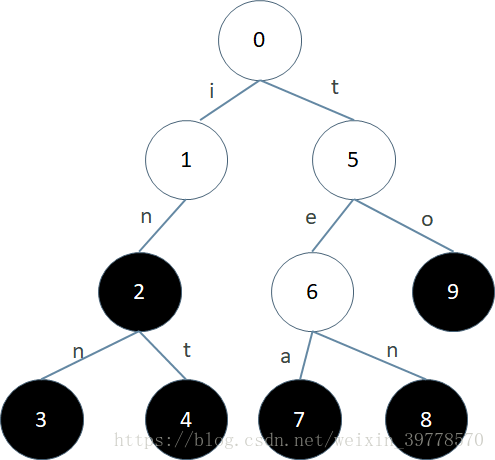
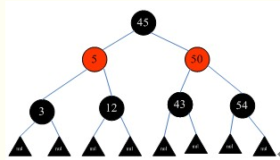
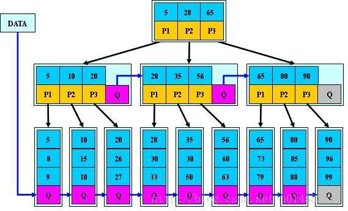

# 一、数据结构

## 1.1 数组

## 1.2 链表

## 1.3 栈

给定一个只包括 '('，')'，'{'，'}'，'['，']' 的字符串 s ，判断字符串是否有效。

有效字符串需满足：

左括号必须用相同类型的右括号闭合。
左括号必须以正确的顺序闭合。

```python
def func(string):
    stack = []
    d = {")": "(", "]": "[", "}": "{"}
    for s in string:
        if s in d.values():
            stack.append(s)
        else:
            if not stack or d.get(s) != stack.pop():
                return False

    return True
    
if __name__ == "__main__":
    arg = r"{([{}]}"
    print(func(arg))
```


## 1.4 队列

## 1.5 字符串

## 1.6 树

`树`：

- 有且仅有一个节点没有父节点，该节点为根节点
- 除根节点外，其他节点都有且只有一个父节点
- 每个节点都构成以它为根的树

`二叉树`：每个节点最多只有两棵子树

`完全二叉树`：除了最后一层，没一层都是填满的，最后一层从左向右开始填

`平衡二叉树（AVL树）`：在符合二叉查找树的条件下，还满足任何节点的左右子树高度差不超过1，左右子树也是平衡树

`满二叉树`：叶子节点都在同一层且除叶子节点外的所有节点都有两个子节点。

`二叉查找树/二叉排序树`

- 左子树不空，则左子树所有节点值均小于或等于该节点的值
- 右子树不空，则右子树所有节点值均大于或等于该节点的值
- 左右子树也是二叉查找树

`二叉堆`

	- 最大堆：各个父节点的值总是大于或等于子节点的值，最大的元素即为根节点
	- 最小堆：各个父节点的值总是小于或等于子节点的值，最小的元素即为根节点

`trie树/字典树/前缀树`



Trie又被称为前缀树、字典树，所以当然是一棵树。上面这棵Trie树包含的字符串集合是{in, inn, int, tea, ten, to}。每个节点的编号是我们为了描述方便加上去的。树中的每一条边上都标识有一个字符。这些字符可以是任意一个字符集中的字符。比如对于都是小写字母的字符串，字符集就是’a’-‘z’；对于都是数字的字符串，字符集就是’0’-‘9’；对于二进制字符串，字符集就是0和1。


`红黑树`

- 根节点只能是黑色
- 红黑树中所有的叶子节点后面再接上左右两个空节点，这样可以保持[算法](http://lib.csdn.net/base/datastructure)的一致性，而且所有的空节点都是黑色
- 其他的节点要么是红色，要么是黑色，红色节点的父节点和左右孩子节点都是黑色，及黑红相间
- 在任何一棵子树中，从根节点向下走到空节点的路径上**所经过的黑节点的数目相同**，从而保证了是一个平衡二叉树



`B-Tree（平衡多路查找树）`

一棵m阶的B-Tree有如下特性： 

1. 每个节点最多有m个孩子。 
2. 除了根节点和叶子节点外，其它每个节点至少有Ceil(m/2)个孩子。 
3. 若根节点不是叶子节点，则至少有2个孩子 
4. 所有叶子节点都在同一层，且不包含其它关键字信息 
5. 每个非终端节点包含n个关键字信息（P0,P1,…Pn, k1,…kn） 
6. 关键字的个数n满足：ceil(m/2)-1 <= n <= m-1 
7. ki(i=1,…n)为关键字，且关键字升序排序。 
8. Pi(i=1,…n)为指向子树根节点的指针。P(i-1)指向的子树的所有节点关键字均小于ki，但都大于k(i-1)

B-Tree中的每个节点根据实际情况可以包含大量的关键字信息和分支，如下图所示为一个3阶的B-Tree： 


`B+Tree`

B+Tree是在B-Tree基础上的一种优化，使其更适合实现外存储索引结构，InnoDB存储引擎就是用B+Tree实现其索引结构。


`B*Tree`



`霍夫曼树`

带权路径最短的二叉树称为哈夫曼树或最优二叉树

如果一棵二叉树有10个度为2的节点，5个度为1的节点，则度为0的节点有多少个？

> 需要知道的是，二叉树中：边的个数 = 节点个数 - 1。因为根节点没有父节点，所以没有指向根节点的边。
>
> 度为2，表示从该节点有两条指向子节点的边，即有两个子节点
>
> 度为1，表示从该节点有1条指向子节点的边，即有1个子节点
>
> 度为0，表示其为叶子节点
>
> 二叉树中边的个数 = 度为2的个数*2 + 度为1的个数 * 1 
>
> 二叉树中节点的个数 = 度为2的个数 + 度为1的个数 + 度为0的个数
>
> 所以，10 * 2 + 5 * 1 = 10 + 5 + x - 1，则x = 11

## 1.7 图

TODO

# 二、算法

## 2.1 排序

## 2.2 查找

## 2.3 经典算法


## 1. [1, 2018]找出能同时被2,3,5整除的数字的个数。

## 2. 一个大整数（字符串形式表示的），移动字符求比它大的数中最小的？

## 3. RMQ算法

RMQ（Range Minimum/Maximum Query），即区间最值查询。

## 4. 有序字典的实现

实际上，只要保证字典的key有序就行了，所以将key放入一个list中就可以了。

## 5. 优先队列的实现

堆

### 6. 将一根棍子折成三段，能够构成三角形的概率是多少？

TODO