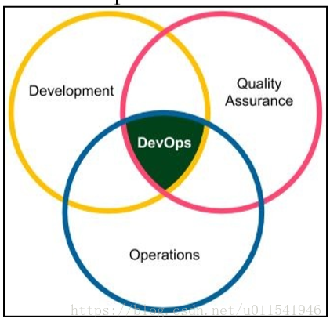
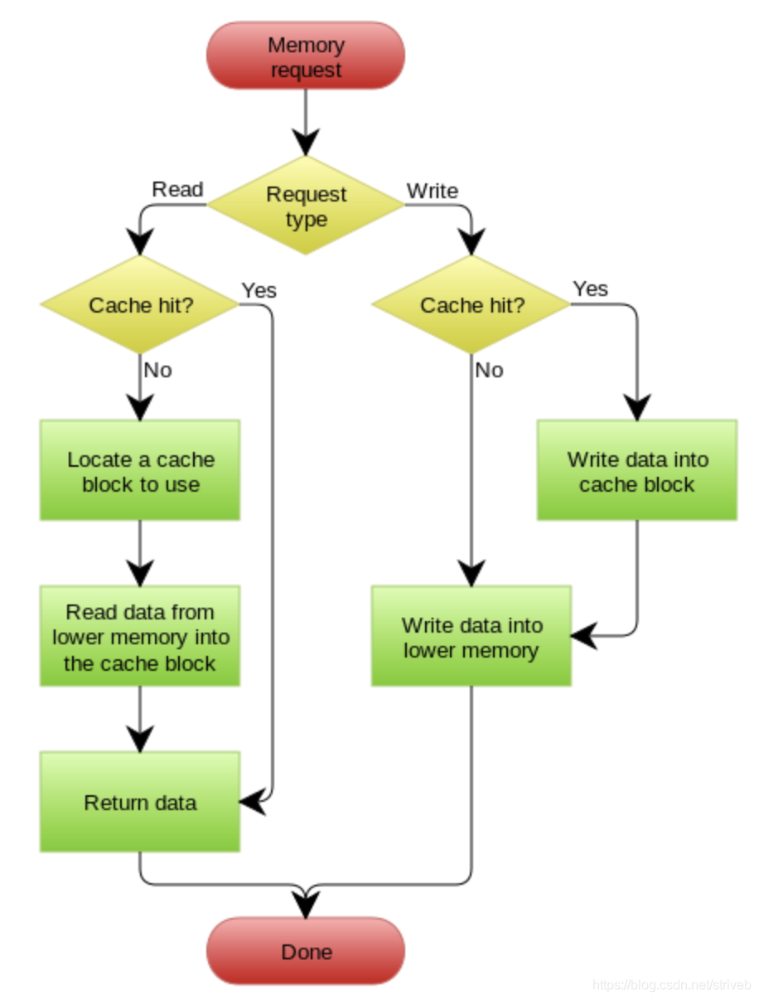

## 1. 主要的架构设计原则

1. `SRP 单一职责原则`。不应该有多个修改此类的原因
2. `OCP 开放封闭原则`。开放扩展，关闭修改。
3. `LSP 里氏替换原则`。所有用到基类的地方，都可以用子类替换
4. `ISP 接口隔离原则`。一个类与另一个类应依赖尽可能小的接口
5. `DSP 依赖反转原则`。依赖抽象，而不是具象。interface
6. `LKP 最少知识原则`。只与最直接的朋友交互。尽量减少对象间的交互，减少耦合。

## 2. 主备（主从）切换后，客户端如何知道新的master是谁？

[mongodb副本集模式（无分片）当主从节点发生变化，客户端怎么知道新的主节点是谁？](https://segmentfault.com/q/1010000022143836)

以MongoDB为例。MongoDB的副本集提供了主从模式和宕机投票重新调整主从机制。

假如有三台机器：

- **A（ip1），主节点 ***
- B（ip2），从节点
- C（ip3），从节点

客户端（即Web后端）数据库连接填写的是 A 的地址 ip1。

现在假设 A 宕掉，网络调整为：

- A（ip1），故障
- **B（ip2），主节点 ***
- C（ip3），从节点

但这个过程客户端并不知道吧，它依然连接着 A，无法读写。

为了适应网络变化，客户端需要手动改成连接 B 的地址？？？有没有类似于 mongos 路由的方式，能够在数据库实现自动的切换？


答案：

> 客户端为啥只连着A？不应该是A/B/C都连接吗？SDK自己内部选择哪个是可用的主，才会往里写数据。<br>
不知道你的客户端是啥语言，以Java为例，`new MongoClient(addrs) `的时候，第一个参数是一个数组，你应该吧这个副本集的所有节点都传进去。

## 3. 微服务和分布式

TODO

## 4. 什么是分布式事务？有何解决方案

TODO

一个分布式事务-》多个本地事务-》重试等方式达到最终一致性。

## 5. 什么是分布式锁？有何解决方案

TODO

分布式锁的定义：


分布式锁的出现解决了什么问题：


如何实现分布式锁：

- 数据库实现分布式锁
- Redis实现分布式锁
- Zookeeper实现分布式锁
- 

### 数据库实现分布式锁

### Redis 实现分布式锁

### Zookeeper 实现分布式锁

## 7. 为什么分布式高可用最少需要3个节点？选举相关？过半同意，过半存活？

TODO

## 8. 架构是怎么设计的？考虑了哪些因素？

[什么是架构设计的五个核心要素？](https://developer.51cto.com/art/201905/596762.htm)

架构中五个重要的核心指标：分别是

1. 性能
2. 可用性（冗余、集群化、分布式）
3. 伸缩性
4. 扩展性
5. 安全性。

## 9. xx项目为什么要设计成这样的架构？

结合具体情况。架构的本质是面向需求的。

## 10. 什么是架构？

描述了系统的要素组成，及要素之间的交互关系。常见的有哪些架构？


## Q. 瀑布式开发和敏捷式开发

答：

> **瀑布式开发**的流程：
>
> 需求分析 > 代码设计 > 代码开发 > 测试部署
>
> 瀑布式开发的特点：
>
> - 不可逆，前一个环节完成后才做下一个环节，要求每一个环节都尽善尽美
> - 环节之间通过文档驱动，代码设计时需要根据需求分析文档进行设计，代码开发又是根据代码设计文档进行开发，实现功能
> - 更适用于单体架构的应用。适合需求、功能变化不快的传统应用。
>
> **敏捷式开发**的流程：
>
> ```mermaid
> graph LR;
> 需求分析 --> 代码设计 --> 代码开发 --> 测试部署
> 测试部署 -.-> 代码开发
> 代码开发 -.-> 代码设计
> 代码设计 -.-> 需求分析
> 测试部署 -.-> 需求分析
> ```
>
> **敏捷式开发**的特点：
>
> - 迭代。先实现基本功能，不要求每个环节尽善尽美，不足的地方在下一次迭代的过程中解决
> - 小团队，高度协作沟通。敏捷式开发要求产品、开发、测试、运维团队高度协作沟通，目标是快速实现产品功能
> - 适用于分布式架构，微服务。每个小模块由一个小团队负责，实现功能的快速开发、上线和迭代。满足用户的需求。
>
> **两种开发方式的区别**：
>
> - 瀑布式开发以流程为核心。
> - 敏捷式开发以用户为核心。

## 11. 谈谈DevOps？

软件规划-代码开发-编译构建-软件测试-版本发布-软件部署-运维/运营-系统监控-软件规划….形成闭环。


`DevOps（Development和Operations的组合词）`是一组过程、方法与系统的统称，用于促进开发（应用程序/软件工程）、技术运营和质量保障（QA）部门之间的沟通、协作与整合。
它是一种重视“软件开发人员（Dev）”和“IT运维技术人员（Ops）”之间沟通合作的`文化、运动或惯例`(我把它理解为一种思想，一种想法，一种方法论)。

==它的目的：`透过自动化“软件交付”和“架构变更”的流程，来使得构建、测试、发布软件能够更加地快捷、频繁和可靠。`==
它的出现是由于软件行业日益清晰地认识到：`为了按时交付软件产品和服务，开发和运营工作必须紧密合作。`

`DevOps` 的概念在软件开发行业中逐渐流行起来。越来越多的团队希望实现产品的敏捷开发，`DevOps` 使一切成为可能。有了 `DevOps` ，`团队可以定期发布代码、自动化部署、并将持续集成 / 持续交付作为发布过程的一部分。`
[什么是DevOps？](https://blog.csdn.net/bjweimengshu/article/details/79031552)
我的理解，为了减少需求从提出到上线的时间，就必须加强开发和运维人员的沟通和合作，而持续集成/持续交付也是实现这一目的的其中一部分。

`DevOps只是一种理念，一种文化，一种规范，敏捷开发也是一种理念，一种文化，一种规范，它们与 CI/CD/CD 其实是类似，实际中用到DevOps工具，敏捷开发工具，CI/CD/CO工具，都只是理念的实现而已。`

## 6. DevOps的解决方案有哪些？

[DevOps基础-1.1-什么是DevOps以及概述](https://blog.csdn.net/u011541946/article/details/81161321?utm_medium=distribute.pc_relevant.none-task-blog-BlogCommendFromMachineLearnPai2-5.channel_param&depth_1-utm_source=distribute.pc_relevant.none-task-blog-BlogCommendFromMachineLearnPai2-5.channel_param)

DevOps是在软件生命周期内，从设计到编码，然后从开发环境部署到生产环境上，由开发人员和运维人员共同参与的软件迭代过程.

在之前的软件研发模型，大部分是这样的：开发组去写代码，另外一个组（比如测试）去进行测试，一个组负责部署到生产环境，还有一个组负责后期软件运营。这个生产方式，当今很多公司依然存在，而且是普遍现象。如下图所示。


在这里，DevOps就可以改变这个模型。如果采用DevOps就变成了两个组，或者DevOps本身就是一个组，里面的人员既要懂得开发，也要懂得运维，这个只是粗浅的解释，然后DevOps就变成下面这张图的样子。


上图中并不是说DevOps中就没有了测试和部署，只不过这两部分是高度自动化完成，任务量相对编程和运维是比较少的。其实真正的devops应该是以下图的范围。这里加了一个QA，也就是质量保证，包括QE，也就是一般我们叫软件测试工程师。



首先，要知道的是DevOps是一种思想理念，将开发人员和运维人员紧密联结在一起，其目的是：`为了按时交付软件产品和服务`。

### DevOps工具

[DevOps到底是什么鬼？DevOps介绍及工具推荐。](https://blog.csdn.net/youanyyou/article/details/78990260)

1. 监控工具

2. 性能分析/APM工具

3. 批量+自动化运维工具

4. 集中日志分析工具

5. 持续集成/发布工具

6. IaaS集成

## 12. 给你一套环境，你会如何设计高可用、高并发的架构？

TODO

> - 

## 13. CI、CD、CO？

企业 IT 应用的全生命周期可划分为研发、运维、运营三段，在各行业进行互联网化转型的过程中，融入敏捷思维，即形成持续集成、持续部署、持续运营的概念（`CI-CD-CO`）。

[腾讯这种级别的大厂是怎么做运维转型的？ ](https://www.sohu.com/a/275215574_355140)

从技术角度看，一个业务的全生命周期可以分为 CI-CD-CO 三段，

- CI 指的是持续集成，从研发团队提交代码作为起点，经过便以构建扫描测试等环节，以版本仓库为终点；

- CD 指的是持续部署，以版本仓库为起点，经过各模块自动化部署，到业务上线提供服务为终点；

- CO 指的是持续运营，从业务上线服务为起点，到业务下线终止服务为终点，期间包含各种运营事件。

  传统运维的定位主要在 CD 段，但由于微服务、虚拟化、容器化等技术的冲击之下，运维对 CD 段的把控在减弱，甚至有些公司直接按照 SRE 等理念从开发侧覆盖了运维团队的部分职能，从而使运维团队萎缩到了管理资产和成本的角色，丧失了精细化运营能力。

 [什么是 CI/CD？](https://www.cnblogs.com/chengkanghua/p/10702614.html)

就像现代化工厂中生产汽车一样，只需要各个车间将自己负责的组件提交之后，自动测试这些组件是否都是合格的，合格之后，通过传送带将组件传递过去，自动组装成完整产品，然后自动送到展厅，或者送给用户。

### 什么是“持续集成”？

持续集成（CI）是在源代码变更后`自动`检测、拉取、构建和（在大多数情况下）进行单元测试的过程。持续集成是启动管道的环节（尽管某些预验证 —— 通常称为上线前检查pre-flight checks —— 有时会被归在持续集成之前）。

持续集成的目标是快速确保开发人员新提交的变更是好的，并且适合在代码库中进一步使用。

### 持续集成是如何工作的？

持续集成的基本思想是让一个自动化过程监测一个或多个源代码仓库是否有变更。当变更被推送到仓库时，它会监测到更改、下载副本、构建并运行任何相关的单元测试。

### 什么是“单元测试”？

单元测试（也称为“提交测试”），是由开发人员编写的小型的专项测试，以确保新代码独立工作。“独立”这里意味着不依赖或调用其它不可直接访问的代码，也不依赖外部数据源或其它模块。如果运行代码需要这样的依赖关系，那么这些资源可以用模拟mock来表示。模拟是指使用看起来像资源的代码存根code stub，可以返回值，但不实现任何功能。

在大多数组织中，开发人员负责创建单元测试以证明其代码正确。事实上，一种称为测试驱动开发test-driven develop（TDD）的模型要求将首先设计单元测试作为清楚地验证代码功能的基础。因为这样的代码可以更改速度快且改动量大，所以它们也必须执行很快。

由于这与持续集成工作流有关，因此开发人员在本地工作环境中编写或更新代码，并通单元测试来确保新开发的功能或方法正确。通常，这些测试采用断言形式，即函数或方法的给定输入集产生给定的输出集。它们通常进行测试以确保正确标记和处理出错条件。有很多单元测试框架都很有用，例如用于 Java 开发的 [JUnit](https://junit.org/junit5/)。

### 什么是“持续交付”？

持续交付（CD）通常是指整个流程链（管道），它自动监测源代码变更并通过构建、测试、打包和相关操作运行它们以生成可部署的版本，基本上没有任何人为干预。

持续交付在软件开发过程中的目标是自动化、效率、可靠性、可重复性和质量保障（通过持续测试）。

持续交付包含持续集成（自动检测源代码变更、执行构建过程、运行单元测试以验证变更），持续测试（对代码运行各种测试以保障代码质量），和（可选）持续部署（通过管道发布版本自动提供给用户）。

### 什么是“持续部署”？

持续部署（CD）是指能够自动提供持续交付管道中发布版本给最终用户使用的想法。根据用户的安装方式，可能是在云环境中自动部署、app 升级（如手机上的应用程序）、更新网站或只更新可用版本列表。

这里的一个重点是，仅仅因为可以进行持续部署并不意味着始终部署来自管道的每组可交付成果。它实际上指，通过管道每套可交付成果都被证明是“可部署的”。这在很大程度上是由持续测试的连续级别完成的（参见本文中的持续测试部分）。

管道构建的发布成果是否被部署可以通过人工决策，或利用在完全部署之前“试用”发布的各种方法来进行控制。

## 14. 强一致性、弱一致性、最终一致性

~~强一致性：时时刻刻数据都是一致的。~~
~~弱一致性：数据会存在不一致的情况。~~
~~最终一致性：会存在某些时刻，数据不一致的情况，但是一段时间后，数据最终会是一致的。属于弱一致性的一种。~~

`弱一致性`：当数据更新后，后续对该数据的读取操作可能得到更新后的值，也可能是更改前的值。
`强一致性`：当更新操作完成之后，在任何时刻所有的用户或者进程查询到的都是最近一次成功更新的数据。强一致性是程度最高一致性要求，也是最难实现的。关系型数据库更新操作就是这个案例。
`最终一致性`：在某一时刻用户或者进程查询到的数据可能都不同，但是最终成功更新的数据都会被所有用户或者进程查询到。简单理解为，就是在一段时间后，数据会最终达到一致状态。
`顺序一致性`：简单理解为，就是程序的执行顺序和它编写的顺序一致。

## 15. 如何解决服务间的一致性问题

TODO

## 16. 如何解决缓存和数据库间的不一致性问题

TODO

[缓存与数据库一致性系列-序言](https://blog.kido.site/2018/11/24/db-and-cache-preface/)

### 为什么会出现缓存和数据库不一致呢？

[深入理解缓存之缓存和数据库的一致性](https://blog.csdn.net/striveb/article/details/95110502)

[redis系列之数据库与缓存数据一致性解决方案](https://blog.csdn.net/simba_1986/article/details/77823309?utm_medium=distribute.pc_relevant_t0.none-task-blog-BlogCommendFromMachineLearnPai2-1.channel_param&depth_1-utm_source=distribute.pc_relevant_t0.none-task-blog-BlogCommendFromMachineLearnPai2-1.channel_param)


通常造成缓存和数据库不一致有两种场景：

- 缓存和 DB 的操作，不在一个事务中，可能只有一个操作成功，而另一个操作失败，导致不一致。

- 并发的场景下，导致读取老的 DB 数据，更新到缓存中。A 先删除 缓存数据，然后修改DB数据，在DB数据修改成功这个过程中，B 查询同一数据，将旧数据又写入缓存中。

  

### 几个缓存更新的设计模式

#### （1）Cache Aside Pattern(旁路缓存)

标准的Pattern，facebook就是使用这种方式，具体流程图如下：

**失效**：应用程序先从cache取数据，没有得到，则从数据库中取数据，成功后，放到缓存中。

**命中**：应用程序从cache中取数据，取到后返回。

**更新**：先把数据存到数据库中，成功后，再让缓存失效。


一个是查询操作，一个是更新操作的并发，首先，没有了删除cache数据的操作了，而是先更新了数据库中的数据，此时，缓存依然有效，所以，并发的查询操作拿的是没有更新的数据，但是，更新操作马上让缓存的失效了，后续的查询操作再把数据从数据库中拉出来。而不会像文章开头的那个逻辑产生的问题，后续的查询操作一直都在取老的数据。

> **要么通过2PC或是Paxos协议保证一致性，要么就是拼命的降低并发时脏数据的概率，而Facebook使用了这个降低概率的玩法，因为2PC太慢，而Paxos太复杂。当然，最好还是为缓存设置上过期时间。**


**我有一个问题，在更新数据库数据后，再让缓存失效的过程中，会出现缓存失效失败的情况吗？如果出现这种情况，不是又不一致了吗？**

#### （2）Read/Write Through Pattern

在上面的Cache Aside套路中，我们的应用代码需要维护两个数据存储，**一个是缓存（Cache），一个是数据库（Repository）。**所以，应用程序比较啰嗦。而Read/Write Through套路是把更新数据库（Repository）的操作由缓存自己代理了，所以，对于应用层来说，就简单很多了。**可以理解为，应用认为后端就是一个单一的存储，而存储自己维护自己的Cache。**



Read Through

Read Through 套路就是**在查询操作中更新缓存**，也就是说，当缓存失效的时候（过期或LRU换出），Cache Aside是由调用方负责把数据加载入缓存，而Read Through则用缓存服务自己来加载，从而对应用方是透明的。

Write Through

Write Through 套路和Read Through相仿，**不过是在更新数据时发生。当有数据更新的时候，如果没有命中缓存，直接更新数据库，然后返回。如果命中了缓存，则更新缓存，然后再由Cache自己更新数据库（这是一个同步操作）**

#### （3）Write Behind Caching Pattern

Write Behind 又叫 Write Back。**write back就是Linux文件系统的Page Cache的算法**。

Write Back套路，一句说就是，在更新数据的时候，只更新缓存，不更新数据库，而我们的缓存会异步地批量更新数据库。

> 这个设计的好处就是让数据的I/O操作飞快无比（因为直接操作内存嘛 ），因为异步，write back还可以合并对同一个数据的多次操作，所以性能的提高是相当可观的。

但是，其带来的问题是，数据不是强一致性的，而且可能会丢失（我们知道Unix/Linux非正常关机会导致数据丢失，就是因为这个事）。在软件设计上，我们基本上不可能做出一个没有缺陷的设计，就像算法设计中的时间换空间，空间换时间一个道理，有时候，强一致性和高性能，高可用和高性性是有冲突的。软件设计从来都是取舍Trade-Off。

另外，Write Back实现逻辑比较复杂，因为他需要track有哪数据是被更新了的，需要刷到持久层上。操作系统的write back会在仅当这个cache需要失效的时候，才会被真正持久起来，比如，内存不够了，或是进程退出了等情况，这又叫lazy write。

在wikipedia上有一张write back的流程图，基本逻辑如下：


### 缓存架构设计：

#### 1.更新缓存 VS 淘汰缓存

#### 2.先操作数据库 vs 先操作缓存

#### 3.缓存架构优化


### 缓存和DB一致性的解决方案

#### 1）先淘汰缓存，再写数据库

因为先淘汰缓存，所以数据的最终一致性是可以得到有效的保证的。因为先淘汰缓存，即使写数据库发生异常，也就是下次缓存读取时，多读取一次数据库。

但是，这种方案会存在缓存和 DB 的数据会不一致的情况，参照[《缓存与数据库一致性优化》](https://www.w3cschool.cn/architectroad/architectroad-consistency-of-cache-with-database.html) 所说。

我们需要解决缓存并行写，实现串行写。比较简单的方式，引入分布式锁。

- 在写请求时，先淘汰缓存之前，获取该分布式锁。
- 在读请求时，发现缓存不存在时，先获取分布式锁。

这样，缓存的并行写就成功的变成串行写落。写请求时，是否主动更新缓存，根据自己业务的需要，是否有，都没问题。

#### 2）先写数据库，再更新缓存

按照“先写数据库，再更新缓存”，我们要保证 DB 和缓存的操作，能够在“同一个事务”中，从而实现最终一致性。

**基于定时任务来实现**

- 首先，写入数据库。
- 然后，在写入数据库所在的事务中，插入一条记录到任务表。该记录会存储需要更新的缓存 KEY 和 VALUE 。
- 【异步】最后，定时任务每秒扫描任务表，更新到缓存中，之后删除该记录。

**基于消息队列来实现**

- 首先，写入数据库。
- 然后，发送带有缓存 KEY 和 VALUE 的事务消息。此时，需要有支持事务消息特性的消息队列，或者我们自己封装消息队列，支持事务消息。
- 【异步】最后，消费者消费该消息，更新到缓存中。

这两种方式，可以进一步优化，**可以先尝试更新缓存，如果失败，则插入任务表，或者事务消息。**

#### 3) 基于数据库的 binlog 日志

### 再多唠叨一些

1）上面讲的这些Design Pattern，其实并不是软件架构里的mysql数据库和memcache/redis的更新策略，这些东西都是计算机体系结构里的设计，比如CPU的缓存，硬盘文件系统中的缓存，硬盘上的缓存，数据库中的缓存。**基本上来说，这些缓存更新的设计模式都是非常老古董的，而且历经长时间考验的策略**，所以这也就是，工程学上所谓的Best Practice，遵从就好了。

2）有时候，我们觉得能做宏观的系统架构的人一定是很有经验的，其实，宏观系统架构中的很多设计都来源于这些微观的东西。比如，云计算中的很多虚拟化技术的原理，和传统的虚拟内存不是很像么？Unix下的那些I/O模型，也放大到了架构里的同步异步的模型，还有Unix发明的管道不就是数据流式计算架构吗？TCP的好些设计也用在不同系统间的通讯中，仔细看看这些微观层面，你会发现有很多设计都非常精妙……所以，**请允许我在这里放句观点鲜明的话——如果你要做好架构，首先你得把计算机体系结构以及很多老古董的基础技术吃透了。**

3）在软件开发或设计中，我非常建议在之前先去参考一下已有的设计和思路，**看看相应的guideline，best practice或design pattern，吃透了已有的这些东西，再决定是否要重新发明轮子**。千万不要似是而非地，想当然的做软件设计。

4）上面，我们没有考虑缓存（Cache）和持久层（Repository）的整体事务的问题。比如，更新Cache成功，更新数据库失败了怎么吗？或是反过来。关于这个事，如果你需要强一致性，你需要使用“两阶段提交协议”——prepare, commit/rollback，比如Java 7 的XAResource，还有MySQL 5.7的 XA Transaction，有些cache也支持XA，比如EhCache。当然，XA这样的强一致性的玩法会导致性能下降，关于分布式的事务的相关话题，你可以看看《[分布式系统的事务处理](https://links.jianshu.com/go?to=https%3A%2F%2Fcoolshell.cn%2Farticles%2F10910.html)》一文。


## 17. 如何保证高可用（HA）？

衡量高可用：可用性=平均故障间隔/(平均故障间隔 + 故障恢复平均时间)
保证高可用就两点：`冗余`（副本，可以是数据，可以是服务等）+ `故障转移（failover）`。

如果当架构已经确定，而暂时不想更改架构的话，使用 `超时机制`、`降级`（某些业务功能暂时关闭，只支持核心业务）、`限流`。

## 18. 分布式架构如何保证数据一致性

TODO

## 19. 如何实现高并发？

`高并发`：通过设计保证系统能够并行处理很多请求。
`响应时间`：系统对请求作出响应的时间。
`吞吐量`：单位时间内处理的请求数量。
`QPS`：每秒响应请求数。
`HPS`：每秒http请求数。
`TPS`：每秒处理事务数。
`并发用户数`：同时承载正常使用系统功能的用户数量。

如何提高系统的并发能力？主要有两种：垂直扩展（提升单机处理能力。）和水平扩展（只要增加服务器数量，就能线性扩充系统性能。）

 


## 20. 百度搜索为什么能这么快？

TODO


## 22. 提升应用层高可用性的优化手段？

[如何保证应用层高可用](https://www.jianshu.com/p/73ad2e3b6534)

1)	通过负载均衡进行无状态服务的失效转移
2)	应用服务器集群的session管理

1. session复制

2. session绑定

3. 利用cookie记录session

4. session服务器

   

## 23. 什么是脑裂？如何解决？

脑裂：在集群选举时，分化成两个子集群，即有两个leader。

TODO


如何设计“找回密码”功能

[找回密码的功能设计](http://www.ruanyifeng.com/blog/2019/02/password.html)


## 24. 如何降低软件的复杂性？

阮一峰老师的博客[如何降低软件的复杂性？](http://www.ruanyifeng.com/blog/2018/09/complexity.html)

### 1. 什么是复杂性？

**复杂性的来源主要有两个：代码的含义模糊和互相依赖**

模糊指的是，代码里面的重要信息，看不出来。依赖指的是，某个模块的代码，不结合其他模块，就会无法理解。

复杂性的危害在于，它会递增。你做错了一个决定，导致后面的代码都基于前面的错误实现，整个软件变得越来越复杂。"我们先把产品做出来，后面再改进"，这根本做不到。

### 2. 如何降低复杂性？

降低复杂性的基本方法，就是把复杂性隔离。**"如果能把复杂性隔离在一个模块，不与其他模块互动，就达到了消除复杂性的目的。"**

改变软件设计的时候，修改的代码越少，软件的复杂性越低。

复杂性尽量封装在模块里面，不要暴露出来。如果多个模块耦合，那就把这些模块合并成一个。

### 3. 接口和实现

模块分成接口和实现。接口要简单，实现可以复杂。


好的 class 应该是**"小接口，大功能"**，糟糕的 class 是"大接口，小功能"。好的设计是，大量的功能隐藏在简单接口之下，对用户不可见，用户感觉不到这是一个复杂的 class。


### 4. 减少抛错 

有些软件设计者喜欢抛错，一遇到问题，就抛出一个 Exception。这也导致了复杂性，用户必须面对所有的 Exception。"反正我告诉你出错了，怎么解决是你的事。"

正确的做法是，除了那些必须告诉用户的错误，其他错误尽量在软件内部处理掉，不要抛出。


## 25. 找回密码的设计

源自阮一峰老师的博客 [找回密码的功能设计](http://www.ruanyifeng.com/blog/2019/02/password.html)


**第一条规则：密码永远都要哈希保存。**明文保存or密文保存or哈希保存，哈希是单向的，无法还原，更安全。

**第二条规则：找回密码就是让用户重置密码。**如果密码是哈希保存，用户一旦忘记密码，网站也无法知道原始密码是什么，只能让用户重置密码。

**第三条规则：重置密码的时候，要给出一个链接，让用户到网页上自己修改密码**重置密码又有两种做法。有的网站先自动改成一个随机密码，然后再让用户登录后自己改掉。这样做的风险在于，你必须把随机密码告知用户，通过邮件或短信，这个过程中就有可能泄漏。重置链接由于是明文传播，而且直接修改密码，所以必须有失效时间。一般来说，可以设成10分钟失效。

**第四条规则：重置密码之前，如果用户提供了错误的邮件地址，不要提示他。**重置密码之前，必须知道重置谁的密码。这时需要用户提供，注册时的邮件地址。这是因为如果提示了，数据库不包含某个邮件地址，就可能像下图那样，泄露用户的隐私，被钓鱼者利用。比如，如果提示的话，你可以知道你的朋友是否在PornHub上注册了（很大可能性是他本人注册使用的），这样就算隐私泄漏了吧。

**第五条规则：重置密码的时候，识别用户最好依靠邮件地址，而不是用户名。**如果不是采用邮件地址，而是根据用户名识别用户，就没有办法不提示，某个用户名是否存在。某些人的用户名非常特殊，一旦知道该用户名存在，就几乎可以肯定是该人注册的。

**第六条规则：如果条件允许，重置密码之前，最好请用户回答一些个人问题（证明重置密码的是本人），或者采用 [2FA 验证](http://www.ruanyifeng.com/blog/2017/11/2fa-tutorial.html)，比如短信验证码。**为了防止机器人攻击，进入重置密码之前，最好加上 CAPTCHA 识别。最后，不要忘了记录 IP 地址，在邮件里面告诉用户，哪个 IP 地址在申请重置你的密码。


## 26. 阿里巴巴为什么能抗住90秒100亿？

TODO

[阿里巴巴为什么能抗住90秒100亿？看完这篇你就明白了！](https://www.jianshu.com/p/9f985bbc9c70)

## 27. 互联网“三高”架构？

[三高系统常用架构模式](https://www.cnblogs.com/zgynhqf/p/9853591.html)

[互联网三高架构：高并发、高性能、高可用](https://www.jianshu.com/p/fd8ff58ba5d2)

面向互联网的三高系统，最关注的软件质量属性是：性能、可用性、伸缩性、扩展性、安全性。
 而构建此类系统，最常见的架构模式有：横向分层、纵向分割、分布式化、集群化、使用缓存、使用异步模式、使用冗余、自动化（发布、部署、监控）。
 具体来说，可以在不同层次常用的技术有：

**前端架构**

浏览器优化技术：合理布局，页面缓存，减少http请求数，页面压缩，减少 cookie 传输。
 1）CDN
 CDN的基本原理是广泛采用各种缓存服务器，将这些缓存服务器分布到用户访问相对集中的地区或网络中，在用户访问网站时，利用全局负载技术将用户的访问指向距离最近的工作正常的缓存服务器上，由缓存服务器直接响应用户请求。

2）DNS负载均衡
 3）动静分离，静态资源独立部署，动态图片独立提供服务

**应用层架构**

1）业务拆分
 2）负载均衡
 3）虚拟化服务器、容器化
 4）无状态（以及分布式 Session）
 分布式Session有如下几种实现方式。

1. Session复制机制

   在支持Session复制的Web服务器上，通过修改Web服务器的配置，可以实现将Session同步到其它Web服务器上，达到每个Web服务器上都保存一致的Session。

   优点：代码上不需要做支持和修改。

   缺点：需要依赖支持的Web服务器，一旦更换成不支持的Web服务器就不能使用了，在数据量很大的情况下不仅占用网络资源，而且会导致延迟。

   适用场景：只适用于Web服务器比较少且Session数据量少的情况。

   可用方案：开源方案tomcat-redis-session-manager，暂不支持Tomcat8。

2. Session粘滞机制

   将用户的每次请求都通过某种方法强制分发到某一个Web服务器上，只要这个Web服务器上存储了对应Session数据，就可以实现会话跟踪。

   优点：使用简单，没有额外开销。

   缺点：一旦某个Web服务器重启或宕机，相对应的Session数据将会丢失，而且需要依赖负载均衡机制。

   适用场景：对稳定性要求不是很高的业务情景。

3. Session集中管理机制

   在单独的服务器或服务器集群上使用缓存技术，如Redis存储Session数据，集中管理所有的Session，所有的Web服务器都从这个存储介质中存取对应的Session，实现Session共享。

   优点：可靠性高，减少Web服务器的资源开销。

   缺点：实现上有些复杂，配置较多。

   适用场景：Web服务器较多、要求高可用性的情况。

   可用方案：开源方案Spring Session，也可以自己实现，主要是重写HttpServletRequestWrapper中的getSession方法，博主也动手写了一个，github搜索joincat用户，然后自取。

4. 基于Cookie管理机制

   这种方式每次发起请求的时候都需要将Session数据放到Cookie中传递给服务端。

   优点：不需要依赖额外外部存储，不需要额外配置。

   缺点：不安全，易被盗取或篡改；Cookie数量和长度有限制，需要消耗更多网络带宽。

   适用场景：数据不重要、不敏感且数据量小的情况。

最后的总结

以上四种方式，相对来说，Session集中管理更加可靠，使用也是最多的。

5）分布式缓存
 分布式缓存的典型应用场景可分为以下几类:

1. 页面缓存.用来缓存Web 页面的内容片段,包括HTML、CSS 和图片等,多应用于社交网站等;
2. 应用对象缓存.缓存系统作为ORM 框架的二级缓存对外提供服务,目的是减轻数据库的负载压力,加速应用访问;
3. 状态缓存.缓存包括Session 会话状态及应用横向扩展时的状态数据等,这类数据一般是难以恢复的,对可用性要求较高,多应用于高可用集群;
4. 并行处理.通常涉及大量中间计算结果需要共享;
5. 事件处理.分布式缓存提供了针对事件流的连续查询(continuous query)处理技术,满足实时性需求;
6. 极限事务处理.分布式缓存为事务型应用提供高吞吐率、低延时的解决方案,支持高并发事务请求处理,多应用于铁路、金融服务和电信等领域.

异步、事件驱动架构、消息队列
 EDA是一种以事件为媒介，实现组件或服务之间最大松耦合的方式。传统面向接口编程是以接口为媒介，实现调用接口者和接口实现者之间的解耦，但是这种解耦程度不是很高，如果接口发生变化，双方代码都需要变动，而事件驱动则是调用者和被调用者互相不知道对方，两者只和中间消息队列耦合。

多线程
 动态页面静态化
 我们只需要编写这么一个HttpModule就可以了，当用户第一次请求asp处理时，我们可以在ihttpmodule中拦截到这个请求，然后获取到这次请求应该返回的html代码，然后我们返回这些html给用户，并保存刚才我们获取到的html到文件内，当用户下次请求时，我们只需要直接返回我们已经保存的html文件即可。

**服务层架构**

1）分布式微服务（分级管理，超时设置，异步调用，服务降级，幂等性设计。）
 同应用层架构

**存储层架构**

1）DFS（分布式文件存储）
 2）路由数据库
 3）No SQL 数据库
 4）数据同步
 5）数据冗余

**安全架构**

1）Web攻击（XSS、Sql Injection）
 2）数据加密
 3）密钥管理
 4）发布、运维

**自动化测试与发布**

1）灰度发布
 2）浏览器数据采集
 3）服务器业务数据采集
 4）服务器性能数据采集
 5）系统监控
 6）系统报警
 7）机房（散热、省电、定制服务器）


### 微服务的优缺点


### Docker微服务架构


### 设计一个权限系统 RBAC


### 如何设计一个高并发系统？高并发设计和实现经验？对分布式有什么了解？

那么人家一定会仔细盘问你的系统架构，你们系统啥架构？怎么部署的？部署了多少台机器？缓存咋用的？MQ 咋用的？数据库咋用的？就是深挖你到底是如何扛住高并发的。

 

可以分为以下 几点：

1. 系统拆分
2. 缓存
3. MQ
4. 分库分表
5. 读写分离


