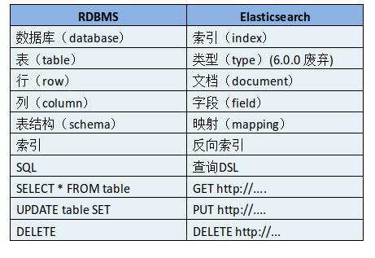

[全文搜索引擎 Elasticsearch 入门教程](https://www.ruanyifeng.com/blog/2017/08/elasticsearch.html)

[Elasticsearch: 权威指南](https://www.elastic.co/guide/cn/elasticsearch/guide/current/running-elasticsearch.html)

## ES常见概念

有一个megacorp索引（名词）

megacorp索引下有一个employee类型，有一个文档ID为1的文档。

```shell
# 检索一个文档，
# 方法 /索引/类型/文档ID
PUT /megacorp/employee/1

# 轻量搜索
# megacorp索引下employee下所有文档。
GET /megacorp/employee/_search
# 查询字符串
GET /megacorp/employee/_search?q=last_name:Smith
# 集群健康
GET /_cluster/health
# 查看gb索引下的tweet类型的映射
GET /gb/_mapping/tweet
```

**Elasticsearch与关系型数据库的对比**




## ES常用操作

TODO


## ES为什么能近实时？

https://www.elastic.co/guide/cn/elasticsearch/guide/current/near-real-time.html

随着按段（per-segment）搜索的发展，一个新的文档从索引到可被搜索的延迟显著降低了。新文档在几分钟之内即可被检索，但这样还是不够快。

磁盘在这里成为了瓶颈。提交（Commiting）一个新的段到磁盘需要一个 [`fsync`](http://en.wikipedia.org/wiki/Fsync) 来确保段被物理性地写入磁盘，这样在断电的时候就不会丢失数据。 但是 `fsync` 操作代价很大; 如果每次索引一个文档都去执行一次的话会造成很大的性能问题。

我们需要的是一个更轻量的方式来使一个文档可被搜索，这意味着 `fsync` 要从整个过程中被移除。

在Elasticsearch和磁盘之间是文件系统缓存。 像之前描述的一样， 在内存索引缓冲区（ [Figure 19, “在内存缓冲区中包含了新文档的 Lucene 索引”](https://www.elastic.co/guide/cn/elasticsearch/guide/current/near-real-time.html#img-pre-refresh) ）中的文档会被写入到一个新的段中（ [Figure 20, “缓冲区的内容已经被写入一个可被搜索的段中，但还没有进行提交”](https://www.elastic.co/guide/cn/elasticsearch/guide/current/near-real-time.html#img-post-refresh) ）。 但是这里新段会被先写入到文件系统缓存—这一步代价会比较低，稍后再被刷新到磁盘—这一步代价比较高。不过只要文件已经在缓存中， 就可以像其它文件一样被打开和读取了。


**`Lucene 允许新段被写入和打开—使其包含的文档在未进行一次完整提交时便对搜索可见。`** 这种方式比进行一次提交代价要小得多，并且在不影响性能的前提下可以被频繁地执行。


### refresh API

在 Elasticsearch 中，写入和打开一个新段的轻量的过程叫做 *refresh* 。 默认情况下每个分片会每秒自动刷新一次。这就是为什么我们说 Elasticsearch 是 *近* 实时搜索: 文档的变化并不是立即对搜索可见，但会在一秒之内变为可见。

这些行为可能会对新用户造成困惑: 他们索引了一个文档然后尝试搜索它，但却没有搜到。这个问题的解决办法是用 `refresh` API 执行一次手动刷新:

```json
# 刷新（Refresh）所有的索引。
POST /_refresh 
# 只刷新（Refresh） blogs 索引。
POST /blogs/_refresh 
```

==尽管刷新是比提交轻量很多的操作，它还是会有性能开销。当写测试的时候， 手动刷新很有用，但是不要在生产环境下每次索引一个文档都去手动刷新。 相反，你的应用需要意识到 Elasticsearch 的近实时的性质，并接受它的不足。==

并不是所有的情况都需要每秒刷新。可能你正在使用 Elasticsearch 索引大量的日志文件， 你可能想优化索引速度而不是近实时搜索， 可以通过设置 `refresh_interval` ， 降低每个索引的刷新频率：

```json
# 每30秒刷新 `my_logs` 索引。
PUT /my_logs
{
  "settings": {
    "refresh_interval": "30s" 
  }
}
```

`refresh_interval` 可以在既存索引上进行动态更新。 在生产环境中，当你正在建立一个大的新索引时，可以先关闭自动刷新，待开始使用该索引时，再把它们调回来：

```json
# 每秒自动刷新。
PUT /my_logs/_settings
{ "refresh_interval": -1 } 
# 关闭自动刷新。
PUT /my_logs/_settings
{ "refresh_interval": "1s" } 
```

==`refresh_interval` 需要一个 *持续时间* 值， 例如 `1s` （1 秒） 或 `2m`（2 分钟）。 一个绝对值 *1* 表示的是 *1毫秒* --无疑会使你的集群陷入瘫痪。==

## ES如何更新索引？

## ES如何实现数据的持久化？

https://www.elastic.co/guide/cn/elasticsearch/guide/current/translog.html

### 持久化变更

如果没有用 `fsync` 把数据从文件系统缓存刷（flush）到硬盘，我们不能保证数据在断电甚至是程序正常退出之后依然存在。为了保证 Elasticsearch 的可靠性，需要确保数据变化被持久化到磁盘。

在 [动态更新索引](https://www.elastic.co/guide/cn/elasticsearch/guide/current/dynamic-indices.html)，我们说一次完整的提交会将段刷到磁盘，并写入一个包含所有段列表的提交点。Elasticsearch 在启动或重新打开一个索引的过程中使用这个提交点来判断哪些段隶属于当前分片。

即使通过每秒刷新（refresh）实现了近实时搜索，我们仍然需要经常进行完整提交来确保能从失败中恢复。但在两次提交之间发生变化的文档怎么办？我们也不希望丢失掉这些数据。

Elasticsearch 增加了一个 *`translog`* ，或者叫`事务日志`，在每一次对 Elasticsearch 进行操作时均进行了日志记录。通过 `translog` ，整个流程看起来是下面这样：

1. 一个文档被索引之后，就会被添加到内存缓冲区，*并且* 追加到了 translog ，正如 [Figure 21, “新的文档被添加到内存缓冲区并且被追加到了事务日志”](https://www.elastic.co/guide/cn/elasticsearch/guide/current/translog.html#img-xlog-pre-refresh)描述的一样。

   

   Figure 21. 新的文档被添加到内存缓冲区并且被追加到了事务日志

2. 刷新（refresh）使分片处于 [Figure 22, “刷新（refresh）完成后, 缓存被清空但是事务日志不会”](https://www.elastic.co/guide/cn/elasticsearch/guide/current/translog.html#img-xlog-post-refresh) 描述的状态，分片每秒被刷新（refresh）一次：

   - 这些在内存缓冲区的文档被写入到一个新的段中，且没有进行 `fsync`操作。
   - 这个段被打开，使其可被搜索。
   - 内存缓冲区被清空。

   

   Figure 22. 刷新（refresh）完成后, 缓存被清空但是事务日志不会

3. 这个进程继续工作，更多的文档被添加到内存缓冲区和追加到事务日志（见 [Figure 23, “事务日志不断积累文档”](https://www.elastic.co/guide/cn/elasticsearch/guide/current/translog.html#img-xlog-pre-flush) ）。

   

   Figure 23. 事务日志不断积累文档

4. 每隔一段时间—例如 translog 变得越来越大—索引被刷新（flush）；一个新的 translog 被创建，并且一个全量提交被执行（见 [Figure 24, “在刷新（flush）之后，段被全量提交，并且事务日志被清空”](https://www.elastic.co/guide/cn/elasticsearch/guide/current/translog.html#img-xlog-post-flush) ）：

   - 所有在内存缓冲区的文档都被写入一个新的段。
   - 缓冲区被清空。
   - 一个提交点被写入硬盘。
   - 文件系统缓存通过 `fsync` 被刷新（flush）。
   - 老的 translog 被删除。

translog 提供所有还没有被刷到磁盘的操作的一个持久化纪录。当 Elasticsearch 启动的时候， 它会从磁盘中使用最后一个提交点去恢复已知的段，并且会重放 translog 中所有在最后一次提交后发生的变更操作。

translog 也被用来提供实时 CRUD 。当你试着通过ID查询、更新、删除一个文档，它会在尝试从相应的段中检索之前， 首先检查 translog 任何最近的变更。这意味着它总是能够实时地获取到文档的最新版本。


Figure 24. 在刷新（flush）之后，段被全量提交，并且事务日志被清空

### flush API

这个执行一个提交并且截断 translog 的行为在 Elasticsearch 被称作一次 *flush* 。 分片每30分钟被自动刷新（flush），或者在 translog 太大的时候也会刷新。请查看 [`translog` 文档](https://www.elastic.co/guide/en/elasticsearch/reference/2.4/index-modules-translog.html#_translog_settings) 来设置，它可以用来 控制这些阈值：

[`flush` API](https://www.elastic.co/guide/en/elasticsearch/reference/5.6/indices-flush.html) 可以被用来执行一个手工的刷新（flush）:

```json
POST /blogs/_flush 

POST /_flush?wait_for_ongoing 
```

|      | 刷新（flush） `blogs` 索引。                              |
| ---- | --------------------------------------------------------- |
|      | 刷新（flush）所有的索引并且并且等待所有刷新在返回前完成。 |

你很少需要自己手动执行 `flush` 操作；通常情况下，自动刷新就足够了。

这就是说，在重启节点或关闭索引之前执行 [flush](https://www.elastic.co/guide/cn/elasticsearch/guide/current/translog.html#flush-api) 有益于你的索引。当 Elasticsearch 尝试恢复或重新打开一个索引， 它需要重放 translog 中所有的操作，所以如果日志越短，恢复越快。


**Translog 有多安全?**

translog 的目的是保证操作不会丢失。这引出了这个问题： Translog 有多安全？

在文件被 `fsync` 到磁盘前，被写入的文件在重启之后就会丢失。默认 translog 是每 5 秒被 `fsync` 刷新到硬盘， 或者在每次写请求完成之后执行(e.g. index, delete, update, bulk)。这个过程在主分片和复制分片都会发生。最终， 基本上，这意味着在整个请求被 `fsync` 到主分片和复制分片的translog之前，你的客户端不会得到一个 200 OK 响应。

在每次请求后都执行一个 fsync 会带来一些性能损失，尽管实践表明这种损失相对较小（特别是bulk导入，它在一次请求中平摊了大量文档的开销）。

但是对于一些大容量的偶尔丢失几秒数据问题也并不严重的集群，使用异步的 fsync 还是比较有益的。比如，写入的数据被缓存到内存中，再每5秒执行一次 `fsync` 。

这个行为可以通过设置 `durability` 参数为 `async` 来启用：

```js
PUT /my_index/_settings
{
    "index.translog.durability": "async",
    "index.translog.sync_interval": "5s"
}
```

这个选项可以针对索引单独设置，并且可以动态进行修改。如果你决定使用异步 translog 的话，你需要 *保证* 在发生crash时，丢失掉 `sync_interval` 时间段的数据也无所谓。请在决定前知晓这个特性。

如果你不确定这个行为的后果，最好是使用默认的参数（ `"index.translog.durability": "request"` ）来避免数据丢失。
