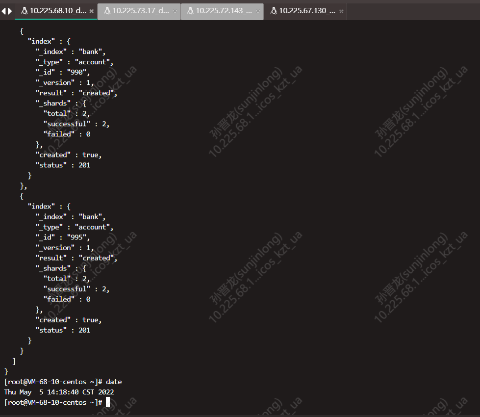
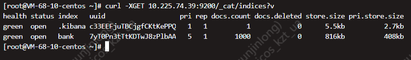

# 1. 目标

将源端es中的所有数据都迁移到目标端。

源端es数据量约2G左右。

源端：10.225.73.93:9200，腾讯云paas的elasticsearch

目标端：10.225.74.39:9200，腾讯云paas的elasticsearch

# 2. 方案

- `snapshot`方式
- `logstash`方式
- `elasticdump`方式

详细迁移说明见：[ElasticSearch数据迁移](https://cloud.tencent.com/document/product/845/35568)

3种迁移方式对比：

| 迁移方式           | 适用场景                                                     |
| :----------------- | :----------------------------------------------------------- |
| COS 快照           | 数据量大的场景（GB、TB、PB 级别）对迁移速度要求较高的场景    |
| logstash           | 迁移全量或增量数据，且对实时性要求不高的场景需要对迁移的数据通过 es query 进行简单的过滤的场景需要对迁移的数据进行复杂的过滤或处理的场景版本跨度较大的数据迁移场景，如 5.x 版本迁移到 6.x 版本或 7.x 版本 |
| elasticsearch-dump | 数据量较小的场景。专线带宽200Mbps（阿里云-腾讯云）实测2G数据量迁移时间约1小时 |

若要实现es数据的增量迁移，现有如下两种方案：

**1. 融合迁移（实时在线迁移）**，即给es集群加节点，平衡数据，再删除旧节点。

**2. cos快照（离线增量迁移）**

# 3. 测试

## 3.1 COS快照方式

TODO

## 3.2 logstash方式

logstash方式其实就两步：

- 使用elasticdump迁移源端es的settings和mapping
- 使用logstash迁移源端es的data

前提：

确认logstash所在网络与源端，目标端都是通的。

以阿里云es迁移到腾讯云es为例，购买在腾讯云es页面，购买一个logtash，

## 3.3 elasticdump方式

### 3.3.1 安装elasticdump

elasticdump所在机器**10.225.68.10**

`elasticdump`依赖于`nodejs`，因此我们要先安装`nodejs`

安装`nodejs`，`npm`是`nodejs`的包管理器

```shell
yum install -y npm
```


`npm`依赖 `brotli`、`libuv`、`nodejs`、`nodejs-libs`、`openssl11`、`openssl11-libs`

安装`elasticdump`

```shell
# 因为从官方仓库npm install 速度太慢，我们使用淘宝的镜像源来下载
npm install --registry=https://registry.npm.taobao.org elasticdump 
```

### 3.3.2 使用elaticdump进行数据迁移

**构造测试数据**

安装elasticdump的机器需要同时与源端es、目标端es网络打通。

a、从网上下载es测试的json文件，下载地址：[es测试数据.json](https://gitee.com/xlh_blog/common_content/blob/master/es%E6%B5%8B%E8%AF%95%E6%95%B0%E6%8D%AE.json#) ，重命名为test-data-for-es.json。将测试数据放在服务器的`/root`目录下。

b、将测试数据导入到源端elasticsearch中。

```shell
# es构造测试数据
curl -XPOST 10.225.73.93:9200/bank/account/_bulk?pretty --data-binary "@/root/test-data-for-es.json"
```



用时约5s。导入测试数据前源端只有`.kibana`这个索引，导入测试数据后es的数据量如下：


c、使用elasticdump将源端es中的bank索引的settings、mapping（表结构）、data依次迁移到目标端es。**顺序千万不能变**

```shell
cd /data/npmDir/node_modules/elasticdump/bin/

./elasticdump \
--input=http://10.225.73.93:9200/bank \
--output=http://10.225.74.39:9200/bank \
--type=settings

./elasticdump \
--input=http://10.225.73.93:9200/bank \
--output=http://10.225.74.39:9200/bank \
--type=mapping

```

查看目标端es有何变化，**可以看出只迁移了表结构，并没有迁移实际的数据。**


d、使用elasticdump将源端es中的bank索引的数据迁移到目标端es的bank索引

```shell
./elasticdump \
--input=http://10.225.73.93:9200/bank \
--output=http://10.225.74.39:9200/bank \
--type=data
```

上述命令输出如下所示：


*<font style="color:red;">注意：第一条命令先将索引的 settings 先迁移，如果直接迁移 mapping 或者 data 将失去原有集群中索引的配置信息如分片数量和副本数量等，当然也可以直接在目标集群中将索引创建完毕后再同步 mapping 与 data。</font>*

### 3.3.3 elasticdump数据迁移效率

> 数据量：700KB
>
> 迁移时间：10s，迁移settings+mapping + data
>
> 带宽：200Mbps专线

在实际生产数据迁移过程中的效率：

> 数据量：2G
>
> 迁移时间：1小时，迁移settings+mapping + data
>
> 带宽：200Mbps专线

### 3.3.4 源端es和目标端es数据一致性校验

**迁移前源端：**


**迁移前目标端：**

**迁移后目标端：**



验证总数据量是否一致

```shell
curl -X GET localhost:9200/_cat/indices?v
```

验证各index数据总条数是否一致

```shell
crul -X GET /bank/_count
```

# 4. 总结

1. elasticsearch-dump 和 logstash 做跨集群数据迁移时，都要求用于执行迁移任务的机器可以同时访问到两个集群，因为网络无法连通的情况下就无法实现迁移。而使用 snapshot 的方式则没有这个限制，因为 snapshot 方式是完全离线的。因此 elasticsearch-dump 和 logstash 迁移方式更适合于源 ES 集群和目标 ES 集群处于同一网络的情况下进行迁移。而需要跨云厂商的迁移，可以选择使用 snapshot 的方式进行迁移，例如从阿里云 ES 集群迁移至腾讯云 ES 集群，也可以通过打通网络实现集群互通，但是成本较高。
2. elasticsearch-dump 工具和 MySQL 数据库用于做数据备份的工具 mysqldump 类似，都是逻辑备份，需要将数据一条一条导出后再执行导入，所以适合数据量小的场景下进行迁移。
3. snapshot 的方式适合数据量大的场景下进行迁移。


# 参考文献