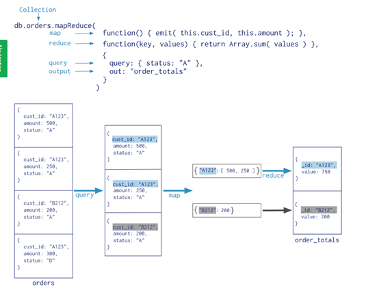

## 1. mysql用join来做连接，mongodb怎么做

`$lookup`

[在MongoDB中使用JOIN操作 ](https://www.cnblogs.com/duhuo/p/6068879.html)

 TODO

## 2. mongodb冗余字段的方式和mysql有啥不同，缺点

 TODO

## 4. mongodb里的aggragate使用过吗，举一个例子

 [mongodb高级聚合查询 ](https://www.cnblogs.com/zhoujie/p/mongo1.html)

| SQL 操作/函数 | mongodb聚合操作         |
| ------------- | ----------------------- |
| where         | $match                  |
| group by      | $group                  |
| having        | $match                  |
| select        | $project                |
| order by      | $sort                   |
| limit         | $limit                  |
| sum()         | $sum                    |
| count()       | $sum                    |
| join          | $lookup   （v3.2 新增） |

## 5. pipeline运行机制是什么，加入你来做mongodb执行引擎，自己设计一个方式来实现pipeline

mongodb有三种方式可以实现aggregation，分别是aggregation pipeline、map-reduce function、single purpose aggregation methods。

就跟linux的管道差不多，前一个输出作为后一个的输入。像上面的$match、$group 等等都是mongodb中的管道操作符。

map-reduce是通过自定义的JavaScript函数来实现map和reduce操作。

                      

单一目的的聚合操作。如：`db.collection.estimatedDocumentCount()`, `db.collection.count()` and `db.collection.distinct()`.
