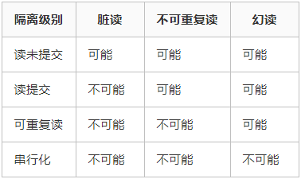

# 三、数据库

## 1. MySQL锁

TODO

[MySQL锁总结](https://zhuanlan.zhihu.com/p/29150809/)

[MySQL中的锁（表锁、行锁）](https://www.cnblogs.com/chenqionghe/p/4845693.html)

锁是计算机协调多个进程或线程并发访问某一资源的机制。锁保证数据并发访问的一致性、有效性；锁冲突也是影响数据库并发访问性能的一个重要因素。锁是Mysql在服务器层和存储引擎层的的并发控制。

加锁是消耗资源的，锁的各种操作，包括获得锁、检测锁是否是否已解除、释放锁等。

**锁机制**

​	**共享锁与排他锁**

- 共享锁（读锁）：其他事务可以读，但不能写。
- 排他锁（写锁） ：其他事务不能读取，也不能写。

**粒度锁**

MySQL 不同的存储引擎支持不同的锁机制，所有的存储引擎都以自己的方式显现了锁机制，服务器层完全不了解存储引擎中的锁实现：

- MyISAM 和 MEMORY 存储引擎采用的是表级锁（table-level locking）
- BDB 存储引擎采用的是页面锁（page-level locking），但也支持表级锁
- InnoDB 存储引擎既支持行级锁（row-level locking），也支持表级锁，但默认情况下是采用行级锁。

默认情况下，表锁和行锁都是自动获得的， 不需要额外的命令。

但是在有的情况下， 用户需要明确地进行锁表或者进行事务的控制， 以便确保整个事务的完整性，这样就需要使用事务控制和锁定语句来完成。

**不同粒度锁的比较：**

- 表级锁：开销小，加锁快；不会出现死锁；锁定粒度大，发生锁冲突的概率最高，并发度最低。

- - 这些存储引擎通过总是一次性同时获取所有需要的锁以及总是按相同的顺序获取表锁来避免死锁。
  - 表级锁更适合于以查询为主，并发用户少，只有少量按索引条件更新数据的应用，如Web 应用

- 行级锁：开销大，加锁慢；会出现死锁；锁定粒度最小，发生锁冲突的概率最低，并发度也最高。

- - 最大程度的支持并发，同时也带来了最大的锁开销。
  - 在 InnoDB 中，除单个 SQL 组成的事务外，
    锁是逐步获得的，这就决定了在 InnoDB 中发生死锁是可能的。
  - 行级锁只在存储引擎层实现，而Mysql服务器层没有实现。 行级锁更适合于有大量按索引条件并发更新少量不同数据，同时又有并发查询的应用，如一些在线事务处理（OLTP）系统

- 页面锁：开销和加锁时间界于表锁和行锁之间；会出现死锁；锁定粒度界于表锁和行锁之间，并发度一般。

## 2. MySQL索引

TODO

## 3. MySQL在commit之后还能回滚吗？

TODO

## 4. 数据库ACID

TODO

## 5. mysql和mongodb的优劣


### 优势

 

1. 在适量级的内存的MongoDB的性能是非常迅速的，它将热数据存储在物理内存中，使得热数据的读写变得十分快。

2. MongoDB的高可用和集群架构拥有十分高的扩展性。

3. 在副本集中，当主库遇到问题，无法继续提供服务的时候，副本集将选举一个新的主库继续提供服务。

4. MongoDB的Bson和JSon格式的数据十分适合文档格式的存储与查询。

### 劣势

1. 不支持事务操作。MongoDB本身没有自带事务机制，若需要在MongoDB中实现事务机制，需通过一个额外的表，从逻辑上自行实现事务。

2. 应用经验少，由于NoSQL兴起时间短，应用经验相比关系型数据库较少。

3. MongoDB占用空间过大。

### 应用场景

关系型数据库适合存储结构化数据，如用户的帐号、地址： 

1. 这些数据通常需要做结构化查询，比如join，这时候，关系型数据库就要胜出一筹

2. 这些数据的规模、增长的速度通常是可以预期的 

3. 事务性、一致性 

NoSQL适合存储非结构化数据，如文章、评论： 

1. 这些数据通常用于模糊处理，如全文搜索、机器学习 

2. 这些数据是海量的，而且增长的速度是难以预期的， 

3. 根据数据的特点，NoSQL数据库通常具有无限（至少接近）伸缩性 

4. 按key获取数据效率很高，但是对join或其他结构化查询的支持就比较差

主要还是看数据是结构化的还是非结构化的。

[Mysql和MongoDB性能对比及应用场景分析](https://blog.csdn.net/zombres/article/details/82020931)

 

## 1. mysql用join来做连接，mongodb怎么做

`$lookup`

[在MongoDB中使用JOIN操作 ](https://www.cnblogs.com/duhuo/p/6068879.html)

 TODO

## 2. mongodb冗余字段的方式和mysql有啥不同，缺点

 TODO

## 3. 信息变更了，name变了怎么处理这写冗余字段

 TODO 

## 4. mongodb里的aggragate使用过吗，举一个例子

 [mongodb高级聚合查询 ](https://www.cnblogs.com/zhoujie/p/mongo1.html)

| SQL 操作/函数 | mongodb聚合操作         |
| ------------- | ----------------------- |
| where         | $match                  |
| group by      | $group                  |
| having        | $match                  |
| select        | $project                |
| order by      | $sort                   |
| limit         | $limit                  |
| sum()         | $sum                    |
| count()       | $sum                    |
| join          | $lookup   （v3.2 新增） |


## 5. pipeline运行机制是什么，加入你来做mongodb执行引擎，自己设计一个方式来实现pipeline

mongodb有三种方式可以实现aggregation，分别是aggregation pipeline、map-reduce function、single purpose aggregation methods。

就跟linux的管道差不多，前一个输出作为后一个的输入。像上面的$match、$group 等等都是mongodb中的管道操作符。

map-reduce是通过自定义的JavaScript函数来实现map和reduce操作。

                               

单一目的的聚合操作。如：`db.collection.estimatedDocumentCount()`, `db.collection.count()` and `db.collection.distinct()`.

 

## 6. 数据库索引

[数据库索引原理，及MySQL索引类型](https://blog.csdn.net/weixin_42181824/article/details/82261988)

为什么会出现索引？提高查询速度。MySQL官方对索引的定义为：索引（Index）是帮助MySQL高效获取数据的数据结构。提取句子主干，就可以得到索引的本质：索引是数据结构。

### 索引分为单列索引和组合索引

1. 普通索引。最基本的索引，它没有任何限制。
2. 唯一索引。索引列的值必须唯一，但允许有空值。
3. 主键索引。是一种特殊的唯一索引，不允许有空值。
4. 组合索引。

建立索引的时机。一般来说，在WHERE和JOIN中出现的列需要建立索引，但也不完全如此，因为MySQL只对<，<=，=，>，>=，BETWEEN，IN，以及某些时候的LIKE才会使用索引。

### 索引的不足之处

1. 虽然索引大大提高了查询速度，同时却会降低更新表的速度，如对表进行INSERT、UPDATE和DELETE。因为更新表时，MySQL不仅要保存数据，还要保存一下索引文件。

2. 建立索引会占用磁盘空间的索引文件。一般情况这个问题不太严重，但如果你在一个大表上创建了多种组合索引，索引文件的会膨胀很快。

### 使用索引的注意事项

1. 索引不会包含有NULL值的列

2. 使用短索引

3. 索引列排序

4. like语句操作

 

索引的原理。想要理解索引原理必须清楚一种数据结构「平衡树」(非二叉)。

## 7. B树（B-tree）和B+树（B+Tree）？

TODO

## 8. MySQL原子性和持久性怎么保证？

为了实现事务的原子性和持久性，mysql引入了undo和redo日志（即undo log和redo log）。

undo日志记录的是修改前的值。用于保证原子性。

由于undo日志会被清理掉，不能保证事务的持久性，因此才需要引入redo日志来保证事务的持久性。

redo日志记录的是修改后最新的数据和冗余的undo日志。用于保证持久性。

[MySql 保证事务的原子性和持久性](https://blog.csdn.net/qq_41151659/article/details/99559397)

从数据库层面，数据库通过原子性、隔离性、持久性来保证一致性。也就是说ACID四大特性之中，C(一致性)是目的，A(原子性)、I(隔离性)、D(持久性)是手段，是为了保证一致性，数据库提供的手段。数据库必须要实现AID三大特性，才有可能实现一致性。例如，原子性无法保证，显然一致性也无法保证。

 

## 9. elasticsearch了解吗？

TODO

## 10. 数据库主从不一致的问题

[DB主从一致性架构优化4种方法](https://mp.weixin.qq.com/s?__biz=MjM5ODYxMDA5OQ==&mid=2651959442&idx=1&sn=feb8ff75385d8031386e120ef3535329&scene=21#wechat_redirect)

 业务采用 `一主多从，读写分离，冗余多个读库`


这种架构的一个潜在**缺点**是，业务方有可能读取到并不是最新的旧数据：


出现这个问题，原因是主从同步延时，导致并没有读取到最新的数据。

### 解决方案

#### 方案一（半同步复制）

**不一致是因为写完成后，主从同步有一个时间差，假设是500ms，这个时间差有读请求落到从库上产生的**。有没有办法做到，等主从同步完成之后，主库上的写请求再返回呢？答案是肯定的，就是大家常说的“半同步复制”semi-sync：


（1）系统先对DB-master进行了一个写操作，写主库

（2）等主从同步完成，写主库的请求才返回

（3）读从库，读到最新的数据（如果读请求先完成，写请求后完成，读取到的是“当时”最新的数据）

**方案优点**：利用数据库原生功能，比较简单

**方案缺点**：主库的写请求时延会增长，吞吐量会降低

#### 方案二（强制读主库）

如果不使用“增加从库”的方式来增加提升系统的读性能，完全可以读写都落到主库，这样就不会出现不一致了：


**方案优点**：“一致性”上不需要进行系统改造

**方案缺点**：只能通过cache来提升系统的读性能，这里要进行系统改造

#### 方案三（数据库中间件）

如果有了数据库中间件，所有的数据库请求都走中间件，这个主从不一致的问题可以这么解决：


（1）所有的读写都走数据库中间件，通常情况下，写请求路由到主库，读请求路由到从库

（2）记录所有路由到写库的key，在经验主从同步时间窗口内（假设是500ms），如果有读请求访问中间件，此时有可能从库还是旧数据，就把这个key上的读请求路由到主库

（3）经验主从同步时间过完后，对应key的读请求继续路由到从库

**方案优点**：能保证绝对一致

**方案缺点**：数据库中间件的成本比较高

#### 方案四（缓存记录写key法）

既然数据库中间件的成本比较高，有没有更低成本的方案来记录某一个库的某一个key上发生了写请求呢？很容易想到使用缓存，当写请求发生的时候：


（1）将某个库上的某个key要发生写操作，记录在cache里，并设置“经验主从同步时间”的cache超时时间，例如500ms

（2）修改数据库

 

而读请求发生的时候：


（1）先到cache里查看，对应库的对应key有没有相关数据

（2）如果cache hit，有相关数据，说明这个key上刚发生过写操作，此时需要将请求路由到主库读最新的数据

（3）如果cache miss，说明这个key上近期没有发生过写操作，此时将请求路由到从库，继续读写分离

**方案优点**：相对数据库中间件，成本较低

**方案缺点**：为了保证“一致性”，引入了一个cache组件，并且读写数据库时都多了一步cache操作

 

### 总结

为了解决主从数据库读取旧数据的问题，常用的方案有四种：

（1）半同步复制

（2）强制读主

（3）数据库中间件

（4）缓存记录写key


## 数据库表连接

[数据库表连接的简单解释](http://www.ruanyifeng.com/blog/2019/01/table-join.html)

表的连接分成好几种类型。

> - 内连接（inner join）
> - 外连接（outer join）
> - 左连接（left join）
> - 右连接（right join）
> - 全连接（full join）

**所谓"连接"，就是两张表根据关联字段，组合成一个数据集。**问题是，两张表的关联字段的值往往是不一致的，如果关联字段不匹配，怎么处理？比如，表 A 包含张三和李四，表 B 包含李四和王五，匹配的只有李四这一条记录。

很容易看出，一共有四种处理方法。

> - 只返回两张表匹配的记录，这叫内连接（inner join）。
> - 返回匹配的记录，以及表 A 多余的记录，这叫左连接（left join）。
> - 返回匹配的记录，以及表 B 多余的记录，这叫右连接（right join）。
> - 返回匹配的记录，以及表 A 和表 B 各自的多余记录，这叫全连接（full join）。

下图就是四种连接的图示。我觉得，这张图比维恩图更易懂，也更准确。


上图中，表 A 的记录是 123，表 B 的记录是 ABC，颜色表示匹配关系。返回结果中，如果另一张表没有匹配的记录，则用 null 填充。

这四种连接，又可以分成两大类：内连接（inner join）表示只包含匹配的记录，外连接（outer join）表示还包含不匹配的记录。所以，左连接、右连接、全连接都属于外连接。

这四种连接的 SQL 语句如下。

> ```sql
> SELECT * FROM A  
> INNER JOIN B ON A.book_id=B.book_id;
> 
> SELECT * FROM A  
> LEFT JOIN B ON A.book_id=B.book_id;
> 
> SELECT * FROM A  
> RIGHT JOIN B ON A.book_id=B.book_id;
> 
> SELECT * FROM A  
> FULL JOIN B ON A.book_id=B.book_id;
> ```


## 关系型数据库与非关系型数据库

TODO

## 为什么图数据库属于菲关系型数据库

TODO

## Neo4j

TODO

## Hugegraph

TODO

## 简述乐观锁和悲观锁

[面试必备之乐观锁与悲观锁](https://blog.csdn.net/qq_34337272/article/details/81072874)

#### 悲观锁

总是假设最坏的情况，每次去拿数据的时候都认为别人会修改，所以每次在拿数据的时候都会上锁，这样别人想拿这个数据就会阻塞直到它拿到锁（**共享资源每次只给一个线程使用，其它线程阻塞，用完后再把资源转让给其它线程**）。传统的关系型数据库里边就用到了很多这种锁机制，比如行锁，表锁等，读锁，写锁等，都是在做操作之前先上锁。Java中`synchronized`和`ReentrantLock`等独占锁就是悲观锁思想的实现。

#### 乐观锁

总是假设最好的情况，每次去拿数据的时候都认为别人不会修改，所以不会上锁，但是在更新的时候会判断一下在此期间别人有没有去更新这个数据，可以使用版本号机制和CAS算法实现。**乐观锁适用于多读的应用类型，这样可以提高吞吐量**，像数据库提供的类似于**write_condition机制**，其实都是提供的乐观锁。在Java中`java.util.concurrent.atomic`包下面的原子变量类就是使用了乐观锁的一种实现方式**CAS**实现的。


## MyISAM和InnoDB的区别

[MyISAM与InnoDB 的区别（9个不同点）](https://blog.csdn.net/qq_35642036/article/details/82820178)

> **1. InnoDB支持事务，MyISAM不支持，对于InnoDB每一条SQL语言都默认封装成事务，自动提交，这样会影响速度，所以最好把多条SQL语言放在begin和commit之间，组成一个事务；** 
>
> **2. InnoDB支持外键，而MyISAM不支持。对一个包含外键的InnoDB表转为MYISAM会失败；** 
>
> **3. InnoDB是聚集索引，使用B+Tree作为索引结构，数据文件是和（主键）索引绑在一起的（表数据文件本身就是按B+Tree组织的一个索引结构），必须要有主键，通过主键索引效率很高。但是辅助索引需要两次查询，先查询到主键，然后再通过主键查询到数据。因此，主键不应该过大，因为主键太大，其他索引也都会很大。**
>
> **4. InnoDB不保存表的具体行数，执行select count(\*) from table时需要全表扫描。而MyISAM用一个变量保存了整个表的行数，执行上述语句时只需要读出该变量即可，速度很快（注意不能加有任何WHERE条件）；**
>
> **5. Innodb不支持全文索引，而MyISAM支持全文索引，在涉及全文索引领域的查询效率上MyISAM速度更快高；PS：5.7以后的InnoDB支持全文索引了**
>
> **6. MyISAM表格可以被压缩后进行查询操作**
>
> **7. InnoDB支持表、行(默认)级锁，而MyISAM支持表级锁**
>
> **8、InnoDB表必须有唯一索引（如主键）（用户没有指定的话会自己找/生产一个隐藏列Row_id来充当默认主键），而Myisam可以没有**
>
> **9、Innodb存储文件有frm、ibd，而Myisam是frm、MYD、MYI**
>
> ​    **Innodb：frm是表定义文件，ibd是数据文件**
>
> ​    **Myisam：frm是表定义文件，myd是数据文件，myi是索引文件**


## SQL查询优化

[SQL查询优化](https://blog.csdn.net/weixin_38477351/article/details/89786763)

[Mysql的sql优化方法](https://blog.csdn.net/weixin_42047611/article/details/81772149?utm_medium=distribute.pc_relevant.none-task-blog-BlogCommendFromMachineLearnPai2-2.channel_param&depth_1-utm_source=distribute.pc_relevant.none-task-blog-BlogCommendFromMachineLearnPai2-2.channel_param)

> 1. 通过用户反馈获取存在性能问题的SQL
> 2. 通过慢查询日志获取存在性能问题的SQL
> 3. 实时获取存在性能问题的SQL

方法

> 1. ***选择最合适的字段属性***
> 2. ***尽量把字段设置为NOT NULL***
> 3. ***使用连接(JOIN)来代替子查询(Sub-Queries)***
> 4. ***使用联合(UNION)来代替手动创建的临时表***
> 5. ***事务***
> 6. ***锁定表***
> 7. ***使用外键***
> 8. ***使用索引***
> 9. ***优化de的查询语句***


## 列出常见的MySQL数据库引擎

[Mysql四种常见数据库引擎](https://www.jianshu.com/p/4bb9f78b4f6d)

> [**数据库**](http://lib.csdn.net/base/mysql)存储引擎是数据库底层软件组织，数据库管理系统（DBMS）使用数据引擎进行创建、查询、更新和删除数据。不同的存储引擎提供不同的存储机制、索引技巧、锁定水平等功能，使用不同的存储引擎，还可以 获得特定的功能。现在许多不同的数据库管理系统都支持多种不同的数据引擎。[**MySQL**](http://lib.csdn.net/base/mysql)**的核心就是存储引擎**。
>
> 
>
> - InnoDB。InnoDB是事务型数据库的首选引擎，支持事务安全表（ACID），支持行锁定和外键，上图也看到了，InnoDB是默认的MySQL引擎。
> - MYISAM。MyISAM基于ISAM存储引擎，并对其进行扩展。它是在Web、数据仓储和其他应用环境下最常使用的存储引擎之一。MyISAM拥有较高的插入、查询速度，但**不支持事务**。
> - Memory。MEMORY存储引擎将表中的数据存储到内存中，为查询和引用其他表数据提供快速访问。
> - Archive。


小结

> 如果要提供提交、回滚、崩溃恢复能力的事物安全（ACID兼容）能力，并要求实现并发控制，InnoDB是一个好的选择
>
> 如果数据表主要用来插入和查询记录，则MyISAM引擎能提供较高的处理效率
>
> 如果只是临时存放数据，数据量不大，并且不需要较高的数据安全性，可以选择将数据保存在内存中的Memory引擎，MySQL中使用该引擎作为临时表，存放查询的中间结果


## MySQL 4种事务隔离级别

[MySQL 四种事务隔离级的说明](https://www.cnblogs.com/zhoujinyi/p/3437475.html)

[MySQL事务隔离级别和实现原理（看这一篇文章就够了！）](https://zhuanlan.zhihu.com/p/117476959)

**脏读**

脏读指的是读到了其他事务未提交的数据，未提交意味着这些数据可能会回滚，也就是可能最终不会存到数据库中，也就是不存在的数据。读到了并一定最终存在的数据，这就是脏读。

**可重复读**

可重复读指的是在一个事务内，最开始读到的数据和事务结束前的任意时刻读到的同一批数据都是一致的。通常针对数据**更新（UPDATE）**操作。

**不可重复读**

对比可重复读，不可重复读指的是在同一事务内，不同的时刻读到的同一批数据可能是不一样的，可能会受到其他事务的影响，比如其他事务改了这批数据并提交了。通常针对数据**更新（UPDATE）**操作。

**幻读**

幻读是针对数据**插入（INSERT）**操作来说的。假设事务A对某些行的内容作了更改，但是还未提交，此时事务B插入了与事务A更改前的记录相同的记录行，并且在事务A提交之前先提交了，而这时，在事务A中查询，会发现好像刚刚的更改对于某些数据未起作用，但其实是事务B刚插入进来的，让用户感觉很魔幻，感觉出现了幻觉，这就叫幻读。


SQL 标准定义了四种隔离级别，MySQL 全都支持。这四种隔离级别分别是：

1. 读未提交（READ UNCOMMITTED）
2. 读提交 （READ COMMITTED）
3. 可重复读 （REPEATABLE READ）
4. 串行化 （SERIALIZABLE）




## MySQL操作

[编程网](http://c.biancheng.net/mysql/)

```sql
# 查询表中的所有字段
SELECT * FROM table_name  WHERE id=10;
# 使用DISTINCT过滤重复数据
SELECT DISTINCT name, age FROM table_name WHERE age=20;
SELECT COUNT(DISTINCT name,age) FROM table_name;
# 为表/字段 设置别名， AS 可以省略
SELECT name AS n, age AS a from table_name AS t WHERE id=10;
# 限定查询结果的条数和初始位置
SELECT * FROM table_name LIMIT 5;
SELECT * FROM table_name LIMIT 3,5;
SELECT * FROM table_name LIMIT 5 OFFSET 3;
# 对查询结果排序
SELECT * FROM table_name ORDER BY age DESC, name ASC;
# 条件查询
SELECT name, age, height FROM table_name WHERE age>21 AND height>=175;
# like模糊查询，%代表任何长度的字符串，字符串的长度可以为 0，但不能匹配NULL
SELECT name FROM table_name WHERE name LIKE 'T%';
SELECT name FROM table_name WHERE name NOT LIKE 'T%';
SELECT name FROM table_name WHERE name LIKE '%e%';
# like模糊查询，_代表单个字符，字符长度不能为0
SELECT name FROM table_name WHERE name LIKE '____y';
# like模糊查询，区分大小写
SELECT name FROM table_name WHERE name LIKE BINARY 't%';
# 范围查询
SELECT name FROM table_name WHERE age BETWEEN 20 AND 30;
# 空值查询
SELECT name FROM table_name WHERE height IS NULL;
SELECT name FROM table_name WHERE height IS NOT NULL;
# 对查询结果分组
SELECT name, sex FROM table_name GROUP BY sex;
SELECT sex, group_concat(name) FROM table_name GROUP BY sex;
SELECT sex, count(sex) FROM table_name GROUP BY sex;
SELECT sex, group_concat(name) FROM table_name GROUP BY sex WITH ROLLUP;
# 过滤，
# 一般情况下，WHERE 用于过滤数据行，而 HAVING 用于过滤分组。
# WHERE 根据数据表中的字段直接进行过滤，而 HAVING 是根据前面已经查询出的字段进行过滤。
SELECT name, sex, height FROM table_name HAVING height>150;
SELECT name, sex, height FROM table_name WHERE height>150;
SELECT name, sex height FROM table_name GROUP BY height HAVING avg(height)>170;
# 交叉连接，一般用来返回连接表的笛卡尔积。
SELECT * FROM table1 CROSS JOIN table2 WHERE table1.name=tabl2.tname;
# 等价于上一语句
SELECT * FROM table1, table2 WHERE table1.name=table2.tname;
# 内连接，如果没有连接条件，INNER JOIN 和 CROSS JOIN 在语法上是等同的，两者可以互换。
SELECT t1.name, t2.age FROM table1 t1 INNER JOIN table2 t2 ON t1.name=t2.tname;
# 外连接，左外连接/右外连接
# 左外连接又称为左连接，使用 LEFT OUTER JOIN 关键字连接两个表，并使用 ON 子句来设置连接条件。
# 右外连接又称为右连接，右连接是左连接的反向连接。使用 RIGHT OUTER JOIN 关键字连接两个表，并使用 ON 子句来设置连接条件。
SELECT t1.name, t2.course_name FROM table1 t1 LEFT OUTER JOIN table2 t2 ON t1.id=t2.course_id;
SELECT t1.name, t2.course_name FROM table1 t1 RIGHT OUTER JOIN table2 t2 ON t1.id=t2.course_id;
# 子查询，子查询指将一个查询语句嵌套在另一个查询语句中。
SELECT name FROM table1 WHERE course_id IN (SELECT id FROM table2 WHERE course_name="Java");
SELECT name FROM table1 WHERE course_id NOT IN (SELECT id FROM table2 WHERE course_name="Java");
SELECT name FROM table1 WHERE EXISTS(SELECT id FROM table2 WHERE course_name="Java");
# 插入数据
INSERT INTO table1 (course_id, course_name, course_grade, course_info) VALUES(1, "NETWORK", 3, "COMPUTER NETWORK");
# 从 tb_courses 表中查询所有的记录，并将其插入 tb_courses_new 表中
INSERT INTO table1 (course_id, course_name, course_grade, course_info) SELECT course_id, course_name, course_grade,course_info FROM table1_old;
# 修改数据
UPDATE table1 SET course_name="DB", course_grade=3.5 WHERE course_id=2;
# 删除数据，
DELETE FROM table1 WHERE course_id=4;
# 删除全表数据
DELETE FROM table1;
# TRUNCATE 关键字用于完全清空一个表
TRUNCATE table table1;
# 创建数据库
CREATE DATABASE IF NOT EXISTS test_db_char
	DEFAULT CHARACTER SET utf8
	DEFAULT COLLATE utf8_chinese_ci
# 删除数据库
DROP DATABASE IF EXISTS table_name;
# 创建一张表
CREATE table `table1` CHARACTER SET utf-8 (
	id INT(4) NOT NULL AUTO_INCREMENT;
    name VARCHAR(256) NOT NULL,
    PRIMARY KEY (id)
);
# 修改表名
ALTER TABLE student RENAME TO student_new;
ALTER TABLE student CHARACTER SET gb2312  DEFAULT COLLATE gb2312_chinese_ci;
# 修改字段名
ALTER TABLE <表名> CHANGE <旧字段名> <新字段名> <新数据类型>；
# 修改字段数据类型
ALTER TABLE <表名> MODIFY <字段名> <数据类型>；
# 删除某字段
ALTER TABLE <表名> DROP <字段名>；
```


### 数据库本身就有行锁，可以做并发的控制，为什么还需要分布式锁呢？


网上找了半天，自己也思考了很久，不知道原因是什么，但有这样一篇博客是这样讲的，暂且认为原因是这个吧。

[用了MQ，还有必要用分布式锁吗？](https://www.zhihu.com/question/358185176/answer/918820759)

> 分布式锁是为了获取资源的控制权独占权（增删改等），避免同时出现多个用户对同一资源的更新操作，以及一旦原分布式锁的获得者因故障失效后，可以自动失效并通知集群其他成员失效并争抢这个锁，最终一个胜出。因此分布式锁，一般用于维护一个集群的主节点，控制粒度更大，一般是数据集群级别。
>
> 而MQ是数据处理的一个串行化操作机制，是数据行级别的操作。是两个不同级别的处理

