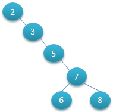

# 一、MySQL

[MySQL官方文档](https://dev.mysql.com/doc/refman/5.7/en/innodb-locking.html)


`DDL`语句：数据定义语言，可以理解成，修改库/表结构的语句，如：`ALTER`, `CREATE`, `DROP`, `RENAME`, `TRUNCATE`。

`DML`语句：数据操作语言，可以理解成，操作数据库/表中数据，但不造成库/表结构改变的语句，如：`CALL`, `DELETE`, `DO`, `HANDLER`, `INSERT`, `LOAD`, `REPLACE`, `SELECT`,` UPDATE`。

## 1. MySQL存储引擎

### MyISAM和InnoDB的区别

[MyISAM与InnoDB 的区别（9个不同点）](https://blog.csdn.net/qq_35642036/article/details/82820178)

> **1. InnoDB支持事务，MyISAM不支持，对于InnoDB每一条SQL语言都默认封装成事务，自动提交，这样会影响速度，所以最好把多条SQL语言放在begin和commit之间，组成一个事务；** 
>
> **2. InnoDB支持外键，而MyISAM不支持。对一个包含外键的InnoDB表转为MYISAM会失败；** 
>
> **3. InnoDB是聚集索引，使用B+Tree作为索引结构，数据文件是和（主键）索引绑在一起的（表数据文件本身就是按B+Tree组织的一个索引结构），必须要有主键，通过主键索引效率很高。但是辅助索引需要两次查询，先查询到主键，然后再通过主键查询到数据。因此，主键不应该过大，因为主键太大，其他索引也都会很大。**
>
> **4. InnoDB不保存表的具体行数，执行select count(\*) from table时需要全表扫描。而MyISAM用一个变量保存了整个表的行数，执行上述语句时只需要读出该变量即可，速度很快（注意不能加有任何WHERE条件）；**
>
> **5. Innodb不支持全文索引，而MyISAM支持全文索引，在涉及全文索引领域的查询效率上MyISAM速度更快高；PS：5.7以后的InnoDB支持全文索引了**
>
> **6. MyISAM表格可以被压缩后进行查询操作**
>
> **7. InnoDB支持表、行(默认)级锁，而MyISAM支持表级锁**
>
> **8、InnoDB表必须有唯一索引（如主键）（用户没有指定的话会自己找/生产一个隐藏列Row_id来充当默认主键），而Myisam可以没有**
>
> **9、Innodb存储文件有frm、ibd，而Myisam是frm、MYD、MYI**
>
> ​    **Innodb：frm是表定义文件，ibd是数据文件**
>
> ​    **Myisam：frm是表定义文件，myd是数据文件，myi是索引文件**


MySQL的存储引擎

| 存储引擎               | 描述                                                         |
| ---------------------- | ------------------------------------------------------------ |
| InnoDB                 | MySQL5.7默认的存储引擎。默认对一行加锁，开销大，加锁慢，会出现死锁，锁粒度小，发生锁冲突几率低，并发性高。 |
| MyISAM                 | 默认对整表加锁，开销小，加锁块，无死锁，锁力度大，发生锁冲突几率大，并发性低。 |
| MEMORY                 | 将所有数据存储在RAM中，以便在需要快速查找非关键数据的环境中进行快速访问。 该引擎以前称为HEAP引擎。 |
| CSV                    | 它的表实际上是带有逗号分隔值的文本文件。 CSV表允许您以CSV格式导入或转储数据，以便与读取和写入相同格式的脚本和应用程序交换数据。 由于CSV表未建立索引，因此通常在正常操作期间将数据保留在InnoDB表中，并且仅在导入或导出阶段使用CSV表。 |
| ARCHIVE                | 这些紧凑的，未索引的表旨在用于存储和检索大量很少参考的历史，存档或安全审核信息。 |
| BLACKHOLE              | Blackhole存储引擎可以接受但不存储数据，类似于Unix /dev/null设备。 查询总是返回一个空集。 这些表可用于将DML语句发送到副本服务器的复制配置中，但源服务器不保留其自己的数据副本。 |
| NDBCLUSTER(简写NDB)    | 该集群数据库引擎特别适合于需要尽可能高的正常运行时间和可用性的应用程序。 |
| MERGE                  | 使MySQL DBA或开发人员可以在逻辑上对一系列相同的MyISAM表进行分组并将它们作为一个对象引用。 适用于VLDB环境，例如数据仓库。 |
| FEDERATED              | 提供链接不同的MySQL服务器以从许多物理服务器创建一个逻辑数据库的功能。 非常适合于分布式或数据集市环境。 |
| EXAMPLE                | 该引擎用作MySQL源代码中的示例，该示例说明了如何开始编写新的存储引擎。 它主要是开发人员感兴趣的。 存储引擎是什么都不做的“存根”。 您可以使用此引擎创建表，但是不能将数据存储在表中或从表中检索数据。 |
| 其他存储引擎（第三方） | pass                                                         |
|                        |                                                              |

**Table 15.1 Storage Engines Feature Summary**

| Feature                                | MyISAM | Memory  | InnoDB | Archive | NDB   |
| :------------------------------------- | :----- | :------ | :----- | :------ | :---- |
| B-tree indexes                         | Yes    | Yes     | Yes    | No      | No    |
| Backup/point-in-time recovery (note 1) | Yes    | Yes     | Yes    | Yes     | Yes   |
| Cluster database support               | No     | No      | No     | No      | Yes   |
| Clustered indexes                      | No     | No      | Yes    | No      | No    |
| Compressed data                        | Yes    | No      | Yes    | Yes     | No    |
| Data caches                            | No     | N/A     | Yes    | No      | Yes   |
| Encrypted data                         | Yes    | Yes     | Yes    | Yes     | Yes   |
| Foreign key support                    | No     | No      | Yes    | No      | Yes   |
| Full-text search indexes               | Yes    | No      | Yes    | No      | No    |
| Geospatial data type support           | Yes    | No      | Yes    | Yes     | Yes   |
| Geospatial indexing support            | Yes    | No      | Yes    | No      | No    |
| Hash indexes                           | No     | Yes     | No     | No      | Yes   |
| Index caches                           | Yes    | N/A     | Yes    | No      | Yes   |
| Locking granularity                    | Table  | Table   | Row    | Row     | Row   |
| MVCC（多版本并发控制）                 | No     | No      | Yes    | No      | No    |
| Replication support                    | Yes    | Limited | Yes    | Yes     | Yes   |
| Storage limits                         | 256TB  | RAM     | 64TB   | None    | 384EB |
| T-tree indexes                         | No     | No      | No     | No      | Yes   |
| Transactions                           | No     | No      | Yes    | No      | Yes   |
| Update statistics for data dictionary  | Yes    | Yes     | Yes    | Yes     | Yes   |

## 列出常见的MySQL数据库引擎

[Mysql四种常见数据库引擎](https://www.jianshu.com/p/4bb9f78b4f6d)

> [**数据库**](http://lib.csdn.net/base/mysql)存储引擎是数据库底层软件组织，数据库管理系统（DBMS）使用数据引擎进行创建、查询、更新和删除数据。不同的存储引擎提供不同的存储机制、索引技巧、锁定水平等功能，使用不同的存储引擎，还可以 获得特定的功能。现在许多不同的数据库管理系统都支持多种不同的数据引擎。[**MySQL**](http://lib.csdn.net/base/mysql)**的核心就是存储引擎**。
>
> 
>
> - InnoDB。InnoDB是事务型数据库的首选引擎，支持事务安全表（ACID），支持行锁定和外键，上图也看到了，InnoDB是默认的MySQL引擎。
> - MYISAM。MyISAM基于ISAM存储引擎，并对其进行扩展。它是在Web、数据仓储和其他应用环境下最常使用的存储引擎之一。MyISAM拥有较高的插入、查询速度，但**不支持事务**。
> - Memory。MEMORY存储引擎将表中的数据存储到内存中，为查询和引用其他表数据提供快速访问。
> - Archive。


小结

> 如果要提供提交、回滚、崩溃恢复能力的事物安全（ACID兼容）能力，并要求实现并发控制，InnoDB是一个好的选择
>
> 如果数据表主要用来插入和查询记录，则MyISAM引擎能提供较高的处理效率
>
> 如果只是临时存放数据，数据量不大，并且不需要较高的数据安全性，可以选择将数据保存在内存中的Memory引擎，MySQL中使用该引擎作为临时表，存放查询的中间结果


## 2. MySQL锁

[MySQL锁详解](https://blog.csdn.net/qq_40378034/article/details/90904573)

[MySQL有哪些锁？](https://blog.csdn.net/j3T9Z7H/article/details/105780668)

[MySQL锁总结](https://zhuanlan.zhihu.com/p/29150809/)

[MySQL中的锁（表锁、行锁）](https://www.cnblogs.com/chenqionghe/p/4845693.html)

锁是计算机协调多个进程或线程并发访问某一资源的机制。锁保证数据并发访问的一致性、有效性；锁冲突也是影响数据库并发访问性能的一个重要因素。锁是Mysql在服务器层和存储引擎层的的并发控制。

加锁是消耗资源的，锁的各种操作，包括获得锁、检测锁是否是否已解除、释放锁等。

**对于不同的存储引擎，支持不同级别和模式的锁。下面讲得都是InnoDB。**

### 按加锁范围分类

InnoDB的默认事务隔离级别是`REPEATABLE READ(RR)`

#### 行锁（row-level locking）

在`InnoDB`中有两种行锁：共享锁（`shared locks`，简写为s）和排他锁（`exclusive locks`，简写为x）


共享锁允许持有该锁的事务读取该行，我们也常称共享锁为读锁。

排他锁允许持有该锁的事务更新/删除行，我们也常称排他锁为写锁。

==InnoDB的行锁是针对索引加的锁，不是针对记录加的锁 ,并且该索引不能失效，否则会从行锁升级为表锁 。==

如果事务T1在r行上已经持有了某种锁（S/X），则T2是否能够持有行锁，有如下几种情况：

| ---              | T2同时在r行持有s锁   | T2同时在r行持有x锁   |
| ---------------- | -------------------- | -------------------- |
| T1先在r行持有s锁 | 能                   | 不能，需等待T1释放锁 |
| T1先在r行持有x锁 | 不能，需等待T1释放锁 | 不能，需等待T1释放锁 |

#### 表锁（table-level locking）

pass


### 按锁的模式分类

#### 意向锁（Intention Locks）

`InnoDB`支持多种粒度锁定，允许行锁和表锁并存。 例如，诸如`LOCK TABLES ... WRITE`之类的语句对指定表采用排他锁（X锁）。

> **为什么要有意向锁呢？**
>
> 虽然表锁和行锁的锁定范围不同，但是可能会产生冲突。所以，当你要加表锁时，就需要先遍历该表的所有行，来判断其是否加了会产生冲突的锁。
>
> 这样的话，加锁的代价就太大了，因此才出现了意向锁这么个东西。
>
> 当事务要在记录上加S锁或X锁时，要现在表上加上对应的意向锁（IS锁或IX锁）。这样在后面，判断该表中是否有行锁就很简单了，只需要看下表上有哪些意向锁就可以了。

==意向锁的主要目的：告诉他人，该表有哪些行上有什么锁，或者在哪些行上将要有什么锁。==

`意向锁是表级锁`，它表示该事务对于此表中的行需要什么类型的行锁（S锁/X锁）。因此，有两种类型的意向锁：

1. 意向共享锁（Intension shared lock，简写IS）。表示某事务打算在该表中的行上设置S锁
2. 意向排他锁（Intension exclusive lock，简写IX）。表示某事物打算在该表中的行上设置X锁

```sql
-- 设置S锁
LOCK TABLES ... READ
-- 设置X锁
LOCK TABLES .. WRITE

-- 设置一个IS锁
SELECT ... LOCK IN SHARE MODE
-- 设置一个IX锁
SELECT ... FOR UPDATE
```

意向锁的规定如下：

- 在事务可以获取表中某行上的S锁之前，它必须首先获取该表上的IS锁或更强的锁（如IX锁）。
- 在事务可以获取表中某行的X锁之前，它必须首先获取该表中的IX锁。


锁的兼容性如下表所示：

|      | `X`      | `IX`       | `S`        | `IS`       |
| :--- | :------- | :--------- | :--------- | :--------- |
| `X`  | Conflict | Conflict   | Conflict   | Conflict   |
| `IX` | Conflict | Compatible | Conflict   | Compatible |
| `S`  | Conflict | Conflict   | Compatible | Compatible |
| `IS` | Conflict | Compatible | Compatible | Compatible |

如果某事务所需要的锁与当前已经存在的锁可以兼容的话，就可以马上获取到该锁，否则，需要等到产生冲突的锁释放掉才可以。因为，产生冲突的这些锁，可能会造成`死锁`。

> 死锁：指两个或两个以上事务在执行过程中因争抢锁资源而造成的互相等待的现象。
>
> 产生死锁的3个条件：
>
> 1. 2个或以上的事务
> 2. 不同方向
> 3. 锁定相同的资源
>
> 死锁的例子：
>
> ```sql
> -- 客户端A创建了表t，并插入了一行数据。
> mysql> CREATE TABLE t (i INT) ENGINE = InnoDB;
> Query OK, 0 rows affected (1.07 sec)
> 
> mysql> INSERT INTO t (i) VALUES(1);
> Query OK, 1 row affected (0.09 sec)
> 
> mysql> START TRANSACTION;
> Query OK, 0 rows affected (0.00 sec)
> -- 客户端A对t.i=1一行设置了S锁。
> mysql> SELECT * FROM t WHERE i = 1 LOCK IN SHARE MODE;
> +------+
> | i    |
> +------+
> |    1 |
> +------+
> 
> -- 客户端B，想要删除t.i=1这行，需要获取X锁，但是由于A持有了该行的S锁，
> -- 因此客户端B会阻塞在这里，等待A释放锁，将客户端B的X锁清秋加入锁请求队列中。
> mysql> START TRANSACTION;
> Query OK, 0 rows affected (0.00 sec)
> 
> mysql> DELETE FROM t WHERE i = 1;
> 
> -- 客户端A想要删除t.i=1的行，这时出现死锁。原因是，客户端A的事务要COMMIT后才能释放S锁，
> -- 这时客户端A获取不到X锁，因为客户端B已经在等待获取X锁了，这就出现了死锁。
> mysql> DELETE FROM t WHERE i = 1;
> ERROR 1213 (40001): Deadlock found when trying to get lock;
> try restarting transaction
> ```
>
> InnoDB有死锁检测，当出现死锁时，InnoDB会回滚某个/些造成死锁的事务来解决死锁问题。InnoDB会优先回滚代价较小的事务（即，INSERT,UPDATE,DELETE的行数较少的事务）

> 解决死锁的方法：
>
> 超时等待：即当两个事务互相等待时，当一个事务等待时间超过设置的阈值时，就将其回滚，另外事务继续进行。（缺点：如果回滚的事务更新了很多行，占用了较多的undo log，那么在回滚的时候花费的时间比另外一个正常执行的事务花费的时间可能还要多，就不太合适）；<br>
> wait-for graph（等待图）：死锁碰撞检测，是一种较为主动的死锁检测机制，要求数据库保存锁的信息链表和事务等待链表两部分信息，通过这两个部分信息构造出一张图，在每个事务请求锁并发生等待时都会判断是否存在回路，如果在图中检测到回路，就表明有死锁产生，这时候InnoDB存储引擎会选择回滚undo量最小的事务。
>
> 不要长时间地不提交事务，应该及时提交事务，减少死锁发生的概率。
>
> 尽量以固定的顺序访问表和行，交叉访问更容易造成死锁。如：
>
> ```sql
> -- 客户端A
> UPDATE t SET c1=10 WHERE c1=1;
> UPDATE t SET c1=20 WHERE c1=2;
> -- 客户端B
> UPDATE t SET c1=20 WHERE c1=2;
> UPDATE t SET c1=10 WHERE c1=1;
> 
> -- 这样的顺序更容易造成死锁！！！
> ```
>
> 
>
> 降低隔离级别。如果业务允许，将隔离级别调低也是较好的选择，比如将隔离级别从 RR 调整为 RC，可以避免掉很多因为 gap 锁造成的死锁。
>
> 为表添加合理的索引。防止没有索引出现表锁，出现死锁的概率会突增。


#### 记录锁（Record Locks）

记录锁，就是锁定某些行，是最简单的行锁，是在一个索引到的记录上的锁。如：

```sql
-- 对表t中的c1=10的这些行加锁。防止任何其他事务插入，更新或删除t.c1值为10的行。
SELECT c1 FROM t WHERE c1 = 10 FOR UPDATE;
```

记录锁总是会锁定所索引记录，即便是在该表中没有定义任何索引。

- 锁的是非主键索引，则会在索引记录上加锁后，再去主键索引上加锁
- 当表上没有索引时，会在隐藏的聚簇索引（某些情况下就是主键）上加锁
- 当要锁的列没有索引时，对进行全表记录加锁（==变为表锁？==[MySQL - 无索引行锁升级为表锁](https://blog.csdn.net/yangshangwei/article/details/107717345)），然后在释放哪些不满足过滤条件（如WHERE条件）的行上的锁，最终，只会对满足过滤条件的行加锁。**因此，在更新操作时，如果该列没有索引，会对全表进行加锁，然后再不断释放锁，这样会增加数据库的开销。**

#### 间隙锁（Gap Locks）

间隙锁是一种加在两个索引记录之间的锁，或者加在第一个索引记录之前，或最后一个索引记录之后的间隙。如：

```sql
-- 锁定t.c1 介于10~20之间的索引记录的间隙。
SELECT C1 FROM t WHERE c1 BETWEEN 10 AND 20 FOR UPDATE;

-- 如果id列没有索引或是非唯一索引，则下面的语句会锁定child.id在100之前的间隙。
-- 如果id列存在唯一索引，则下面的语句不会锁定间隙。
SELECT * FROM child WHERE id = 100;
```

这个间隙可以跨一个索引记录，多个索引记录，甚至是空的。

间隙锁是性能和并发性之间权衡的一部分，并且在某些事务隔离级别而其他级别中不能使用。

`InnoDB中的间隙锁的目的是防止其他事务插入到间隙`。间隙锁可以共存。一个事务持有了某间隙的间隙锁，并不会阻止另一事务对此间隙持有间隙锁（`只要他们插入的行不冲突的话`）。共享间隙锁和排他间隙锁是一样的，他们不冲突且效果相同。

间隙锁可以显式禁用。当事务级别为`READ COMMITTED(RC)`时，间隙锁会被禁用。


#### 临建锁（Next-Key Locks）

临建锁是在索引记录上的记录锁和索引记录之前的间隙的间隙锁的组合。效果是，在这些索引记录和索引记录前的间隙上加锁。

假设索引包含值10、11、13和20。此索引的可能的next-key锁涵盖以下间隔，其中，圆括号表示不包含该记录，方括号表示包含该记录：

```sql
(negative infinity, 10]
(10, 11]
(11, 13]
(13, 20]
(20, positive infinity)
```


#### 插入意向锁（Insert Intention Locks，简写II GAP）

插入意向锁是一种在插入新行之前，通过`INSERT`操作来设置的一种间隙锁。锁定插入行之前的所有行。

> 假设表中，有两条记录（4和7），事务T想插入一条记录（5），事务T'想插入一条记录（6），在获得各自所插入行上的X锁之前，这两个事务都会设置一个(4, 7)的插入意向锁，二者并不会冲突，因为操作的是不同的行，所以就不会两者不会相互阻塞。


例子：

客户端A创建了一个child表，并插入了两条索引记录（id为90和102）。

```sql
mysql> CREATE TABLE child (id int(11) NOT NULL, PRIMARY KEY(id)) ENGINE=InnoDB;
mysql> INSERT INTO child (id) values (90),(102);
-- 客户端A开启事务T1
mysql> START TRANSACTION;
-- 针对child.id > 10的间隙，设置了一个排他间隙锁。
mysql> SELECT * FROM child WHERE id > 100 FOR UPDATE;
+-----+
| id  |
+-----+
| 102 |
+-----+
-- 客户端B开启事务T2
mysql> START TRANSACTION;
-- 客户端B向之前的间隙中插入一条记录（id为101）。这个时候，事务T2设置了一个插入意向锁，
-- 然后，等待获取X锁。
mysql> INSERT INTO child (id) VALUES (101);
```


#### 自增锁（AUTO-INC Locks）

自增锁是一种特殊的表级锁，在事务插入行到具有自增列（通常是主键列）的表中时会进行锁定。锁定的是表。

> 当事务T1插入一行或多行到这样的表里时，其他事务会被阻塞，一遍让事务T1所插入的行拥有连续的主键值。

#### Predicate Locks for Spatial Indexes

谓词锁。不太明白


| 按模式分                            | 锁的级别 |                            |
| ----------------------------------- | -------- | -------------------------- |
| 意向锁                              | 表锁     | IS和IX                     |
| 记录锁                              | 行锁     | S和X                       |
| 间隙锁                              | 行锁     | S间隙锁和X间隙锁，效果相同 |
| 临建锁                              | 行锁     | 记录锁+间隙锁              |
| 插入意向锁                          | 行锁     | 特殊的间隙锁               |
| 自增锁                              | 表锁     |                            |
| Predicate Locks for Spatial Indexes | /        | /                          |


### 按锁的使用方式分类

1、**乐观锁（Optimistic Lock）**
乐观锁的特点先进行业务操作，不到万不得已不去拿锁。即“乐观”的认为拿锁多半是会成功的，因此在进行完业务操作需要实际更新数据的最后一步再去拿一下锁就好。
乐观锁是否在事务中其实都是无所谓的，其底层机制是这样：在数据库内部update同一行的时候是不允许并发的，即数据库每次执行一条update语句时会获取被update行的写锁，直到这一行被成功更新后才释放。因此在业务操作进行前获取需要锁的数据的当前版本号，然后实际更新数据时再次对比版本号确认与之前获取的相同，并更新版本号，即可确认这之间没有发生并发的修改。如果更新失败即可认为老版本的数据已经被并发修改掉而不存在了，此时认为获取锁失败，需要回滚整个业务操作并可根据需要重试整个过程。

2、**悲观锁（Pessimistic Lock）**
悲观锁的特点是先获取锁，再进行业务操作，即“悲观”的认为获取锁是非常有可能失败的，因此要先确保获取锁成功再进行业务操作。通常所说的“一锁二查三更新”即指的是使用悲观锁。通常来讲在数据库上的悲观锁需要数据库本身提供支持，即通过常用的select … for update操作来实现悲观锁。当数据库执行select for update时会获取被select中的数据行的行锁，因此其他并发执行的select for update如果试图选中同一行则会发生排斥（需要等待行锁被释放），因此达到锁的效果。select for update获取的行锁会在当前事务结束时自动释放，因此必须在事务中使用。
这里需要注意的一点是不同的数据库对select for update的实现和支持都是有所区别的，例如oracle支持select for update no wait，表示如果拿不到锁立刻报错，而不是等待，mysql就没有no wait这个选项。另外mysql还有个问题是select for update语句执行中所有扫描过的行都会被锁上，这一点很容易造成问题。因此如果在mysql中用悲观锁务必要确定走了索引，而不是全表扫描。

总结
乐观锁在不发生取锁失败的情况下开销比悲观锁小，但是一旦发生失败回滚开销则比较大，因此适合用在取锁失败概率比较小的场景，可以提升系统并发性能

乐观锁还适用于一些比较特殊的场景，例如在业务操作过程中无法和数据库保持连接等悲观锁无法适用的地方


[面试必备之乐观锁与悲观锁](https://blog.csdn.net/qq_34337272/article/details/81072874)

#### 悲观锁

总是假设最坏的情况，每次去拿数据的时候都认为别人会修改，所以每次在拿数据的时候都会上锁，这样别人想拿这个数据就会阻塞直到它拿到锁（**共享资源每次只给一个线程使用，其它线程阻塞，用完后再把资源转让给其它线程**）。传统的关系型数据库里边就用到了很多这种锁机制，比如行锁，表锁等，读锁，写锁等，都是在做操作之前先上锁。Java中`synchronized`和`ReentrantLock`等独占锁就是悲观锁思想的实现。

#### 乐观锁

总是假设最好的情况，每次去拿数据的时候都认为别人不会修改，所以不会上锁，但是在更新的时候会判断一下在此期间别人有没有去更新这个数据，可以使用版本号机制和CAS算法实现。**乐观锁适用于多读的应用类型，这样可以提高吞吐量**，像数据库提供的类似于**write_condition机制**，其实都是提供的乐观锁。在Java中`java.util.concurrent.atomic`包下面的原子变量类就是使用了乐观锁的一种实现方式**CAS**实现的。


[](https://blog.csdn.net/bjweimengshu/article/details/90056126)

> `加锁`只是解决并发事务执行过程中引起的`脏写`、`脏读`、`不可重复读`、`幻读`这些问题的一种解决方案（`MVCC`算是一种解决`脏读`、`不可重复读`、`幻读`这些问题的一种解决方案），一定要意识到`加锁`的出发点是为了解决这些问题，不同情景下要解决的问题不一样，才导致加的锁不一样，千万不要为了加锁而加锁，容易把自己绕进去。


|                                | READ UNCOMMITTED                                             | READ COMMITTED                                               | REPEATABLE READ                                              | SERIALIZABLE                                                 |
| ------------------------------ | ------------------------------------------------------------ | ------------------------------------------------------------ | ------------------------------------------------------------ | ------------------------------------------------------------ |
| 普通SELECT语句                 | 不加锁，直接读取最新版本，可能出现脏读、不可重复读、幻读     | 不加锁，在每次执行普通的`SELECT`语句时都会生成一个快照（一致性读起作用了），这样解决了`脏读`问题，但没有解决`不可重复读`和`幻读`问题。 | 不加锁，只在第一次执行普通的`SELECT`语句时生成一个快照（一致性读起作用了），这样把`脏读`、`不可重复读`和`幻读`问题都解决了。 | 禁用自动提交时，普通的`SELECT`语句会被转为`SELECT ... LOCK IN SHARE MODE`这样的语句，也就是在读取记录前需要先获得记录的`S锁`<br>启用自动提交时，普通的`SELECT`语句并不加锁，只是利用`MVCC`来生成一个快照去读取记录。==为啥不加锁呢？因为启用自动提交意味着一个事务中只包含一条语句，一条语句也就没有啥`不可重复读`、`幻读`这样的问题了。== |
| 锁定读语句,如下几种            | ==锁定读语句的加锁过程，还与索引类型有关，具体分析吧，这里不讲了。== | ==锁定读语句的加锁过程，还与索引类型有关，具体分析吧，这里不讲了。== | ==锁定读语句的加锁过程，还与索引类型有关，具体分析吧，这里不讲了。== | ==锁定读语句的加锁过程，还与索引类型有关，具体分析吧，这里不讲了。== |
| SELECT ... LOCK IN SHARE MODE; |                                                              |                                                              |                                                              |                                                              |
| SELECT ... FOR UPDATE;         |                                                              |                                                              |                                                              |                                                              |
| UPDATE ...                     |                                                              |                                                              |                                                              |                                                              |
| DELETE...                      |                                                              |                                                              |                                                              |                                                              |


### ==锁的是记录还是索引？==

根据这篇文章的说明[MySQL有哪些锁？](https://blog.csdn.net/j3T9Z7H/article/details/105780668)，行锁的锁的是索引。


```sql
UPDATE user SET age = 10 WHERE id = 49;
UPDATE user SET age = 10 WHERE name = 'Tom';
```

上面这两个`UPDATE`语句加锁的不同在于：

> 第一个SQL是通过主键索引来查询，因此只需要在id=49的主键索引上加上X锁就行。
>
> 第二个SQL是通过二级索引来查询，因此在二级索引上加了X锁后，还需要在主键索引上加X锁。

更新多行的加锁原理，如下图所示：


`在事务中，需要在事务COMMIT之后才能释放锁。`[MySQL锁释放时机(事务)](https://blog.csdn.net/wwd0501/article/details/85322142)


**如何上锁？**

分为显式加锁和隐式加锁。针对不同的事务隔离级别，SELECT语句可能会加锁，可能不加锁。看情况。

```sql
--隐式上写锁
INSERT ...;
UPDATE ...;
DELETE ...;


-- 显式读锁
SELECT ... LOCK IN SHARE MODE;
SELECT ... FOR UPDATE;

-- 只为t1中相关的行加锁，嵌套的子语句中的行不加锁
SELECT * FROM t1 WHERE c1 = (SELECT c1 FROM t2) FOR UPDATE;
-- t1和t2中相关的行都会加锁
SELECT * FROM t1 WHERE c1 = (SELECT c1 FROM t2 FOR UPDATE) FOR UPDATE;
```


## 3. MySQL索引

[数据库索引原理，及MySQL索引类型](https://blog.csdn.net/weixin_42181824/article/details/82261988)

https://www.jianshu.com/p/d90f6b028d0e

https://zhuanlan.zhihu.com/p/29118331

为什么会出现索引？提高查询速度。MySQL官方对索引的定义为：索引（Index）是帮助MySQL高效获取数据的数据结构。提取句子主干，就可以得到索引的本质：索引是数据结构。

### 索引分为单列索引和组合索引

1. 普通索引。最基本的索引，它没有任何限制。
2. 唯一索引。索引列的值必须唯一，但允许有空值。
3. 主键索引。是一种特殊的唯一索引，不允许有空值。
4. 组合索引。(col1, col2, col3)这样的组合索引，会建立(col1), (col1, col2), (col1, col2, col3)三个组合索引。如果存储引擎是InnoDB，那么会建立这三个非聚簇索引（B+Tree）。以(col1, col2, col3)为例，这个非聚簇索引的key是(value1, value2, value3)，值是id。其他也是类似。所以，如果通过SELECT *来查询的话，还需要回表（根据id查主键的聚簇索引），但若只需要id,col1,col2,col3则，直接查非聚簇索引就行了，不用回表。

==建立索引的时机。一般来说，在`WHERE`和`JOIN`中出现的列需要建立索引，但也不完全如此，因为MySQL只对<，<=，=，>，>=，BETWEEN，IN，以及某些时候的LIKE才会使用索引。==

### 索引的不足之处

1. 虽然索引大大提高了查询速度，同时却会降低更新表的速度，如对表进行`INSERT`、`UPDATE`和`DELETE`。因为更新表时，MySQL不仅要更新数据，还要更新索引文件。
2. 建立索引会占用磁盘空间的索引文件。一般情况这个问题不太严重，但如果你在一个大表上创建了多种组合索引，索引文件的会膨胀很快。
3. 如果某个数据列包含许多重复的内容，为它建立索引就没有太大的实际效果。
4. 对于非常小的表，大部分情况下简单的全表扫描更高效；

对于InnoDB而言，在磁盘中有两种文件`.frm`和`.ibd`，前者是表结构文件，后者是实际数据和索引。

对于MyISAM而言，在磁盘中有三种文件`.frm`，`MYI`和`.MYD`，分别是表结构文件，索引文件和数据文件。所以myISAM中的B+Tree最终指向的是数据的地址。

### 使用索引的注意事项

1. 索引不会包含有NULL值的列

   只要列中包含有NULL值都将不会被包含在索引中，复合索引中只要有一列含有NULL值，那么这一列对于此复合索引就是无效的。所以我们在数据库设计时不要让字段的默认值为NULL。应该用0、一个特殊的值或者一个空串代替空值。

2. 使用短索引

   例如，如果有一个CHAR(255)的列，如果在前10 个或20 个字符内，多数值是惟一的，那么就不要对整个列进行索引。短索引不仅可以提高查询速度而且可以节省磁盘空间和I/O操作。

3. 索引列排序

   mysql查询只使用一个索引，因此如果where子句中已经使用了索引的话，那么order by中的列是不会使用索引的。因此数据库默认排序可以符合要求的情况下不要使用排序操作；尽量不要包含多个列的排序，如果需要最好给这些列创建复合索引。

4. like语句操作

   一般情况下不鼓励使用like操作，如果非使用不可，如何使用也是一个问题。like“%aaa%” 不会使用索引而like“aaa%”可以使用索引。

5. 不使用NOT IN和操作

   ​    NOT IN和操作都不会使用索引将进行全表扫描。NOT IN可以NOT EXISTS代替，id3则可使用id>3 or id

 

索引的原理。想要理解索引原理必须清楚一种数据结构「平衡树」(非二叉)。


### MySQL索引原理及相关问题


image


几个概念：

- InnoDB的行锁是建立在索引的基础之上的，行锁锁的是索引，不是数据，所以提高并发写的能力要在查询字段添加索引
- 主索引和辅助索引：主索引就是主键索引，辅助索引就是根据业务需要，自己设置的普通的非主键的索引。这个在Myisam里面区别不大，但是在Innodb的时候差别很大
- 聚簇索引：Innodb的主索引采用的是聚簇索引，一个表只能有1个聚簇索引，因为表数据存储的物理位置是唯一的。聚簇索引的value存的就是真实的数据，不是数据的地址。主索引树里面包含了真实的数据。key是主键值，value值就是data，key值按照B+树的规则分散排布的叶子节点。
- 非聚簇索引：Myisam的主索引和辅助索引都采用的是非聚簇索引，索引和表数据是分离的，索引的value值指向的物理的存储地址。
- Innodb的索引：主索引采用聚簇索引，叶子节点的value值，直接存储的真实的数据。辅助索引是非聚簇索引，value值指向主索引的位置。所以Innodb中，根据辅助索引查询值需要遍历2次B+树，同时主键的长度越短越好，越短副主索引的value值就越小。但是Innodb中根据主键进行范围查询，会特别快。
- Myisam的索引：主索引和辅助索引都是非聚簇索引
- B+树：不管是什么索引，在mysql中的数据结构都是B+树的结构，可以充分利用数据块，来减少IO查询的次数，提升查询的效率，如图所示，一个数据块data里面，存储了很多个相邻key的value值，所有的非叶子节点都不存储数据，都是指针。
- Mysql采用B+树的优点：IO读取次数少（每次都是页读取），范围查找更快捷（相邻页之间有指针）

#### 聚集索引

1. 聚集索引就是叶子节点的顺序和物理存储的顺序是一样的，所以范围查找的时候效率很高，但是DML操作的时候，为了维护物理存储的顺序和叶子节点一样，涉及到大量的数据位移调整。
2. 聚簇索引的顺序就是数据的物理存储顺序，所以一个表最多只能有一个聚簇索引，因为物理存储只能有一个顺序。正因为一个表最多只能有一个聚簇索引，所以它显得更为珍贵，一个表设置什么为聚簇索引对性能很关键

举例：主键为id的表中，范围查找 where id<1000 and id>200
 则只需要找到ID=200和 ID=1000的叶子节点对应的位置，捞取数据块中间的所有的数据，就是要查找的范围数据了。但是如果以前没有ID=300这个数据，现在新增一个ID=300的数据，那么 ID>300的所有的数据都要往后挪一个位置。

#### 树形结构科普

https://blog.csdn.net/zwz2011303359/article/details/63262541

1. 传说中的叶子节点，指的是最外层的节点，就像一棵树，只有最外层的节点才长叶子
2. 二叉搜索树的特点：

- 所有结点至多拥有两个儿子（Left和Right）；
- 所有结点只存储一个关键字（可以理解为索引，比如ID值）；
- 非叶子结点的左指针指向小于其关键字的子树，右指针指向大于其关键字的子树；
- 二叉搜索树如果是满二叉树时，查找的性能逼近有序数组的二分查找，同时插入的性能远远高于有序数组，因为只需要再对应的节点添加引用，而不需要移动任何老的节点

1. B-Tree的特点

- 所有键值分布在整个树中（区别与B+树，B+树的值只分部在叶子节点上）
- 任何关键字出现且只出现在一个节点中（区别与B+树）
- 搜索有可能在非叶子节点结束（区别与B+树，因为值都在叶子节点上，只有搜到叶子节点才能拿到值）
- 在关键字全集内做一次查找，性能逼近二分查找算法

B+树的结构特点

1. B+树索引并不能找到一个给定键值的具体行，它找到的只是被查找数据行所在的页，接着数据库会把页读入到内存，再在内存中进行查找，最后得到要查找的数据。数据的读取是精确到页的，因为页是计算机管理存储器的逻辑块，IO的磁盘读取，每次都读取数据的大小是一个页大小的整数倍。
2. 假设B+Tree的高度为h，一次检索最多需要h-1次I/O（根节点常驻内存），复杂度O(h) = O(logmN)，m指的是一个节点存储的数据的个数。实际应用场景中，M通常较大，常常超过100，因此树的高度一般都比较小，通常不超过3。

1. B+树与B树的不同在于：

- 所有关键字存储在叶子节点，非叶子节点不存储真正的data
- 为所有叶子节点（左右相邻的节点之间）增加了一个链指针

1. 为什么数据库使用B+而不使用红黑树呢？

- 计算器在IO磁盘读取的时候，为了降低读取的次数，默认一次会读取一个页的数据量，MySQL(默认使用InnoDB引擎),将记录按照页的方式进行管理,每页大小默认为16K(这个值可以修改)。linux 默认页大小为4K。所以每次IO读取，都是读取一个页的数据量，所以B树的节点都是存储一个页的节点，这样的查询效率才是最高的
- 每次新建节点时，直接申请一个页的空间，这样就保证一个节点物理上也存储在一个页里，加之计算机存储分配都是按页对齐的，就实现了一个结点只需一次I/O。这样大大降低了树的高度

1. 为什么mysql的索引使用B+树而不是B树呢？

- 范围查找更快，mysql是关系型数据库，经常会按照区间来访问某个索引列，B+树的叶子节点间按顺序建立了链指针，加强了区间访问性，所以B+树对索引列上的区间范围查询很友好。而B树的数据有一部分存在在非叶子节点上面，而且默认的B树的相邻的叶子节点之间是没有指针的，所以范围查找相对更慢。

- 降低树的高度，但是最底下一层的节点会更多，因为所有的数据都堆积在最底下一层了，用空间换速度。B+树更适合外部存储(一般指磁盘存储),由于内节点(非叶子节点)不存储data，所以一个节点可以存储更多的内节点，每个节点能索引的范围更大更精确。也就是说使用B+树单次磁盘IO的信息量相比较B树更大，IO效率更高

#### B+树插入和删除的逻辑

https://blog.csdn.net/sunshine_lyn/article/details/82747596

1. 插入：和红黑树特别像，新数据插入到一个满了的节点中时，会优先进行左旋右旋，如果邻近的节点都满了的话,会取中间的一个key往上一个层级插入，直至到Root节点,树的高度的增加，都是通过根节点的拆分来完成的，这保证了所有左右节点的高度差不超过1
2. 删除：会进行调整优化树形结构，使树的数据更分散，以及降低树的高度。比如如果该节点的数据过少，可以从邻近的节点左旋 右旋数据来填充。可能的话，降低一个树的高度。

#### 为什么Mysql不选择Hash索引？

Hash索引的优势是精确查找的话，速度会更快，为什么不选择Hash索引

1. Hash索引不适合范围查找，而B+树特别适合范围查找（特别是聚簇索引的时候）
2. Hash索引每次查询要加载所有的索引数据到内存当中，而B+树只需要根据匹配规则选择对应的叶子数据加载即可
3. 另外B+树引入了缓存机制 和 数据页技术来提升性能（不过理论上来说，这两个特性Hash索引也可以实现）


### MySQL索引原理详解

[MySQL索引原理](https://blog.csdn.net/u013235478/article/details/50625677)

B+树索引是B+树在数据库中的一种实现，是最常见也是数据库中使用最为频繁的一种索引。B+树中的B代表平衡（balance），而不是二叉（binary），因为B+树是从最早的平衡二叉树演化而来的。在讲B+树之前必须先了解二叉查找树、平衡二叉树（AVLTree）和平衡多路查找树（B-Tree），B+树即由这些树逐步优化而来。

#### 二叉查找树

二叉树具有以下性质：左子树的键值小于根的键值，右子树的键值大于根的键值。 
如下图所示就是一棵二叉查找树， 


对该二叉树的节点进行查找发现深度为1的节点的查找次数为1，深度为2的查找次数为2，深度为n的节点的查找次数为n，因此其平均查找次数为 (1+2+2+3+3+3) / 6 = 2.3次

二叉查找树可以任意地构造，同样是2,3,5,6,7,8这六个数字，也可以按照下图的方式来构造： 



但是这棵二叉树的查询效率就低了。因此若想二叉树的查询效率尽可能高，需要这棵二叉树是平衡的，从而引出新的定义——平衡二叉树，或称AVL树。

#### 平衡二叉树（AVL Tree）

平衡二叉树（AVL树）在符合二叉查找树的条件下，还满足任何节点的两个子树的高度最大差为1。下面的两张图片，左边是AVL树，它的任何节点的两个子树的高度差<=1；右边的不是AVL树，其根节点的左子树高度为3，而右子树高度为1； 


如果在AVL树中进行插入或删除节点，可能导致AVL树失去平衡，这种失去平衡的二叉树可以概括为四种姿态：LL（左左）、RR（右右）、LR（左右）、RL（右左）。它们的示意图如下： 


这四种失去平衡的姿态都有各自的定义： 
LL：LeftLeft，也称“左左”。插入或删除一个节点后，根节点的左孩子（Left Child）的左孩子（Left Child）还有非空节点，导致根节点的左子树高度比右子树高度高2，AVL树失去平衡。

RR：RightRight，也称“右右”。插入或删除一个节点后，根节点的右孩子（Right Child）的右孩子（Right Child）还有非空节点，导致根节点的右子树高度比左子树高度高2，AVL树失去平衡。

LR：LeftRight，也称“左右”。插入或删除一个节点后，根节点的左孩子（Left Child）的右孩子（Right Child）还有非空节点，导致根节点的左子树高度比右子树高度高2，AVL树失去平衡。

RL：RightLeft，也称“右左”。插入或删除一个节点后，根节点的右孩子（Right Child）的左孩子（Left Child）还有非空节点，导致根节点的右子树高度比左子树高度高2，AVL树失去平衡。

AVL树失去平衡之后，可以通过旋转使其恢复平衡。下面分别介绍四种失去平衡的情况下对应的旋转方法。

LL的旋转。LL失去平衡的情况下，可以通过一次旋转让AVL树恢复平衡。步骤如下：

将根节点的左孩子作为新根节点。
将新根节点的右孩子作为原根节点的左孩子。
将原根节点作为新根节点的右孩子。
LL旋转示意图如下： 


RR的旋转：RR失去平衡的情况下，旋转方法与LL旋转对称，步骤如下：

将根节点的右孩子作为新根节点。
将新根节点的左孩子作为原根节点的右孩子。
将原根节点作为新根节点的左孩子。
RR旋转示意图如下： 


LR的旋转：LR失去平衡的情况下，需要进行两次旋转，步骤如下：

围绕根节点的左孩子进行RR旋转。
围绕根节点进行LL旋转。
LR的旋转示意图如下： 


RL的旋转：RL失去平衡的情况下也需要进行两次旋转，旋转方法与LR旋转对称，步骤如下：

围绕根节点的右孩子进行LL旋转。
围绕根节点进行RR旋转。
RL的旋转示意图如下： 

#### 平衡多路查找树（B-Tree）

B-Tree是为磁盘等外存储设备设计的一种平衡查找树。因此在讲B-Tree之前先了解下磁盘的相关知识。

系统从磁盘读取数据到内存时是以磁盘块（block）为基本单位的，位于同一个磁盘块中的数据会被一次性读取出来，而不是需要什么取什么。

InnoDB存储引擎中有页（Page）的概念，页是其磁盘管理的最小单位。InnoDB存储引擎中默认每个页的大小为16KB，可通过参数innodb_page_size将页的大小设置为4K、8K、16K，在MySQL中可通过如下命令查看页的大小：

```sql
mysql> show variables like 'innodb_page_size';
```


而系统一个磁盘块的存储空间往往没有这么大，因此InnoDB每次申请磁盘空间时都会是若干地址连续磁盘块来达到页的大小16KB。InnoDB在把磁盘数据读入到磁盘时会以页为基本单位，在查询数据时如果一个页中的每条数据都能有助于定位数据记录的位置，这将会减少磁盘I/O次数，提高查询效率。

B-Tree结构的数据可以让系统高效的找到数据所在的磁盘块。为了描述B-Tree，首先定义一条记录为一个二元组[key, data] ，key为记录的键值，对应表中的主键值，data为一行记录中除主键外的数据。对于不同的记录，key值互不相同。

一棵m阶的B-Tree有如下特性： 
1. 每个节点最多有m个孩子。 
2. 除了根节点和叶子节点外，其它每个节点至少有Ceil(m/2)个孩子。 
3. 若根节点不是叶子节点，则至少有2个孩子 
4. 所有叶子节点都在同一层，且不包含其它关键字信息 
5. 每个非终端节点包含n个关键字信息（P0,P1,…Pn, k1,…kn） 
6. 关键字的个数n满足：ceil(m/2)-1 <= n <= m-1 
7. ki(i=1,…n)为关键字，且关键字升序排序。 
8. Pi(i=1,…n)为指向子树根节点的指针。P(i-1)指向的子树的所有节点关键字均小于ki，但都大于k(i-1)

B-Tree中的每个节点根据实际情况可以包含大量的关键字信息和分支，如下图所示为一个3阶的B-Tree： 


每个节点占用一个盘块的磁盘空间，一个节点上有两个升序排序的关键字和三个指向子树根节点的指针，指针存储的是子节点所在磁盘块的地址。两个关键词划分成的三个范围域对应三个指针指向的子树的数据的范围域。以根节点为例，关键字为17和35，P1指针指向的子树的数据范围为小于17，P2指针指向的子树的数据范围为17~35，P3指针指向的子树的数据范围为大于35。

模拟查找关键字29的过程：

根据根节点找到磁盘块1，读入内存。【磁盘I/O操作第1次】
比较关键字29在区间（17,35），找到磁盘块1的指针P2。
根据P2指针找到磁盘块3，读入内存。【磁盘I/O操作第2次】
比较关键字29在区间（26,30），找到磁盘块3的指针P2。
根据P2指针找到磁盘块8，读入内存。【磁盘I/O操作第3次】
在磁盘块8中的关键字列表中找到关键字29。
分析上面过程，发现需要3次磁盘I/O操作，和3次内存查找操作。由于内存中的关键字是一个有序表结构，可以利用二分法查找提高效率。而3次磁盘I/O操作是影响整个B-Tree查找效率的决定因素。B-Tree相对于AVLTree缩减了节点个数，使每次磁盘I/O取到内存的数据都发挥了作用，从而提高了查询效率。

#### B+Tree

B+Tree是在B-Tree基础上的一种优化，使其更适合实现外存储索引结构，InnoDB存储引擎就是用B+Tree实现其索引结构。

从上一节中的B-Tree结构图中可以看到每个节点中不仅包含数据的key值，还有data值。而每一个页的存储空间是有限的，如果data数据较大时将会导致每个节点（即一个页）能存储的key的数量很小，当存储的数据量很大时同样会导致B-Tree的深度较大，增大查询时的磁盘I/O次数，进而影响查询效率。在B+Tree中，所有数据记录节点都是按照键值大小顺序存放在同一层的叶子节点上，而非叶子节点上只存储key值信息，这样可以大大加大每个节点存储的key值数量，降低B+Tree的高度。

B+Tree相对于B-Tree有几点不同：

非叶子节点只存储键值信息。
所有叶子节点之间都有一个链指针。
数据记录都存放在叶子节点中。
将上一节中的B-Tree优化，由于B+Tree的非叶子节点只存储键值信息，假设每个磁盘块能存储4个键值及指针信息，则变成B+Tree后其结构如下图所示： 


通常在B+Tree上有两个头指针，一个指向根节点，另一个指向关键字最小的叶子节点，而且所有叶子节点（即数据节点）之间是一种链式环结构。因此可以对B+Tree进行两种查找运算：一种是对于主键的范围查找和分页查找，另一种是从根节点开始，进行随机查找。

可能上面例子中只有22条数据记录，看不出B+Tree的优点，下面做一个推算：

InnoDB存储引擎中页的大小为16KB，一般表的主键类型为INT（占用4个字节）或BIGINT（占用8个字节），指针类型也一般为4或8个字节，也就是说一个页（B+Tree中的一个节点）中大概存储16KB/(8B+8B)=1K个键值（因为是估值，为方便计算，这里的K取值为〖10〗^3）。也就是说一个深度为3的B+Tree索引可以维护10^3 * 10^3 * 10^3 = 10亿 条记录。

实际情况中每个节点可能不能填充满，因此在数据库中，B+Tree的高度一般都在2\~4层。MySQL的InnoDB存储引擎在设计时是将根节点常驻内存的，也就是说查找某一键值的行记录时最多只需要1~3次磁盘I/O操作。

数据库中的B+Tree索引可以分为`聚集索引（clustered index）`和`辅助索引（secondary index）`。上面的B+Tree示例图在数据库中的实现即为聚集索引，聚集索引的B+Tree中的叶子节点存放的是整张表的行记录数据。==辅助索引与聚集索引的区别在于辅助索引的叶子节点并不包含行记录的全部数据，而是存储相应行数据的聚集索引键，即主键。当通过辅助索引来查询数据时，InnoDB存储引擎会遍历辅助索引找到主键，然后再通过主键在聚集索引中找到完整的行记录数据。==这个操作叫`回表`。


## 4. MySQL事务

[MySQL 四种事务隔离级的说明](https://www.cnblogs.com/zhoujinyi/p/3437475.html)

[MySQL事务隔离级别和实现原理（看这一篇文章就够了！）](https://zhuanlan.zhihu.com/p/117476959)

https://dev.mysql.com/doc/refman/5.7/en/innodb-transaction-isolation-levels.html

### 数据库ACID

[InnoDB和ACID模型](https://dev.mysql.com/doc/refman/5.7/en/mysql-acid.html)

ACID模型是一组数据库设计原则，强调了数据可靠性。

MySQL包含诸如InnoDB存储引擎之类的组件，这些组件与ACID模型紧密结合，从而不会损坏数据，并且不会因软件崩溃和硬件故障等异常情况而导致结果损坏。

- A：atomicity。原子性。与InnoDB事务（自动提交设置，COMMIT语句，ROLLBACK语句等）
- C：consistency。一致性。与InnoDB的数据保护机制有关（InnoDB的双写buffer，崩溃恢复）
- I：isolation。隔离性。与InnoDB事务有关，尤其是事务的隔离级别（自动提交设置，锁）
- D：durability。持久性。与实际的硬件配置有关（InnoDB双写buffer，MySQL配置，备份策略等）


事务隔离是数据库处理的基础之一。 隔离是缩写`ACID`中的`I`； 隔离级别是一种设置，用于在多个事务同时进行更改和执行查询时调整性能与结果的可靠性，一致性和可重复性之间的平衡。

InnoDB提供了 由`SQL:19924`标准所描述的4种事务隔离级别：

1. `读未提交（READ UNCOMMITTED）`

   `SELECT`语句以非锁定方式执行，但是可能会使用行的早期版本。 因此，使用此隔离级别，此类读取不一致。 这也称为`脏读`。 否则，此隔离级别的工作方式类似于READ COMMITTED。

2. `读已提交（READ COMMITTED）`

   一致性读，即使是在同一个事务中，每次的`consistent read`都会设置并读取它的新快照。

   锁定读（`SELECT ... FOR UPDATE`或`SELECT ... LOCK IN SHARE MODE`），`UPDATE`语句，`DELETE`语句，`locking read`只会锁定该索引记录，不会锁定该记录之前的间隙，可以插入新行（由于没有使用间隙锁，可能会出现幻读(`phanom row`)）。只有在外键约束检查和重复键检查时，才会使用间隙锁。

   `READ COMMITTED`隔离级别仅支持基于行的二进制日志。

   使用`READ COMMITTED`还有额外的影响。

   - 对于UPDATE语句和SELECT语句，InnoDB只持有要更新或删除的行的锁，不匹配的行的记录锁会被释放（先加锁，再释放不需要的）。
   - 对于UPDATE语句，如果某行已被锁定，则InnoDB执行“半一致”读取，将最新的提交版本返回给MySQL，以便MySQL可以确定该行是否与UPDATE的WHERE条件匹配。 如果该行匹配（必须更新），则MySQL会再次读取该行，这一次InnoDB将其锁定或等待对其进行锁定。

   例子：

   ```sql
   -- 创建一个表t，有几行数据，表t没有索引，因此在查询时会使用InnoDB的聚簇索引
   CREATE TABLE t (a INT NOT NULL, b INT) ENGINE = InnoDB;
   INSERT INTO t VALUES (1,2),(2,3),(3,2),(4,3),(5,2);
   COMMIT;
   
   -- 假设Session A执行如下的UPDATE语句
   START TRANSACTION;
   UPDATE t SET b = 5 WHERE b = 3;
   
   -- 假设Session B执行如下的UPDATE语句
   UPDATE t SET b = 4 WHERE b = 2;
   
   -- 在InnoDB执行这两个UPDATE语句时，会获取读到的每一行的X锁，
   -- 然后根据WHERE条件是否匹配，来释放不匹配的行的X锁。持有匹配的行的X锁，直到事务结束。
   -- 如果是REPEATABLE READ隔离级别
   -- 第一个UPDATE语句会获取读到每一行的X锁，且不管是否匹配一个X锁都不释放。
   x-lock(1,2); retain x-lock
   x-lock(2,3); update(2,3) to (2,5); retain x-lock
   x-lock(3,2); retain x-lock
   x-lock(4,3); update(4,3) to (4,5); retain x-lock
   x-lock(5,2); retain x-lock
   -- 第二个UPDATE语句在尝试获取X锁时，会被阻塞，因为第一个UPDATE获取了所有行的X锁。
   -- 等待第一个事务结束或回滚后，释放了X锁之后，才能继续执行。
   x-lock(1,2); block and wait for first UPDATE to commit or roll back
   
   -- 如果是READ COMMITTED隔离级别
   -- 第一个UPDATE语句会获取读到每一行的X锁，然后释放不匹配的行的X锁。
   x-lock(1,2); unlock(1,2)
   x-lock(2,3); update(2,3) to (2,5); retain x-lock
   x-lock(3,2); unlock(3,2)
   x-lock(4,3); update(4,3) to (4,5); retain x-lock
   x-lock(5,2); unlock(5,2)
   -- 第二个UPDATE语句，执行“半一致性”读取，将它读取的每一行的最新提交版本返回给
   -- MySQL，以便MySQL可以确定该行是否与UPDATE的WHERE条件匹配
   x-lock(1,2); update(1,2) to (1,4); retain x-lock
   x-lock(2,3); unlock(2,3)
   x-lock(3,2); update(3,2) to (3,4); retain x-lock
   x-lock(4,3); unlock(4,3)
   x-lock(5,2); update(5,2) to (5,4); retain x-lock
   
   ```

   

3. `可重复读（REPEATABLE READ(InnoDB默认)）`

   同一事务中的`Consistent read（一致性读取，也叫快照读）`，后面再读取读的是第一次读取时建立的快照（`snapshot`）。所以，在同一个事务中，执行多次普通`SELECT`语句（非锁定`SELECT`语句）的返回结果是一致的。

   对于`锁定读取（locking read）`（使用`SELECT ... FOR UPDATE`或`SELECT ... LOCK IN SHARE MODE`），`UPDATE`和`DELETE`语句，锁定读取决于该语句是使用具有唯一搜索条件的唯一索引还是范围类型搜索条件。

   - 对于唯一查询条件的唯一索引，InnoDB值锁定找到的索引记录，不会锁定该索引记录之前的间隙。
   - 对于其他搜索条件，InnoDB使用间隙锁或临建锁来锁定扫描到的索引范围，以阻止其他会话在此间隙中插入，更新，删除行。

4. `串行化（SERIALIZABLE）`

   此级别类似于`REPEATABLE READ`，但如果禁用了自动提交，则InnoDB会将所有普通的`SELECT`语句隐式转换为`SELECT ... LOCK IN SHARE MODE`。 如果启用了自动提交，则`SELECT`是它自己的事务。 因此，它被认为是只读的，如果作为`Consistent read`执行且不会阻塞其他事务，则可以序列化。 

用户可以使用`SET TRANSACTION`语句修改单个会话或后序所有连接的隔离级别。在命令行或选项文件中使用`--transaction-isolation`选项，可以修改默认隔离级别。

InnoDB通过使用不同的锁，来实现这4种事务隔离级别。

[MySQL 一致性读 深入研究](https://www.cnblogs.com/digdeep/p/4947694.html)

> `consistent read`，一致性读，非锁定读。
>
> 一致性读意味着InnoDB使用`多版本`来呈现某一时间点数据库的查询快照。该查询将看到在该时间点之前提交的事务所做的更改，而看不到以后或未提交的事务所做的更改。
>
> ==`consistent read`是InnoDB在`READ COMMITTED`和`REPEATABLE READ`隔离级别下，处理SELECT语句的默认模式。`consistent read`并不会在所访问的表上加上任何锁，因此，可以在执行`consistent read`的同时修改锁访问的表。==
>
> 如果你插入或修改一些行，然后提交该事务，则从另一个并发的`REPEATABLE READ`事务发出的`DELETE`或`UPDATE`语句可能会影响那些刚刚提交的行，虽然在这个事务中通过SELECT并查看不到另一个事务所做的变化。  例如：
>
> ```sql
> SELECT COUNT(c1) FROM t1 WHERE c1 = 'xyz';
> -- Returns 0: no rows match.
> DELETE FROM t1 WHERE c1 = 'xyz';
> -- Deletes several rows recently committed by other transaction.
> 
> SELECT COUNT(c2) FROM t1 WHERE c2 = 'abc';
> -- Returns 0: no rows match.
> UPDATE t1 SET c2 = 'cba' WHERE c2 = 'abc';
> -- Affects 10 rows: another txn just committed 10 rows with 'abc' values.
> SELECT COUNT(c2) FROM t1 WHERE c2 = 'cba';
> -- Returns 10: this txn can now see the rows it just updated.
> ```
>
> ```sql
>              Session A              Session B
> 
>            SET autocommit=0;      SET autocommit=0;
> time
> |          SELECT * FROM t;
> |          empty set
> |                                 INSERT INTO t VALUES (1, 2);
> |
> v          SELECT * FROM t;
>            empty set
>                                   COMMIT;
> 
>            SELECT * FROM t;
>            empty set
> 
>            COMMIT;
> 
>            SELECT * FROM t;
>            ---------------------
>            |    1    |    2    |
>            ---------------------
> ```
>
> 如果想要在该事务中查看最新的数据库中该表的状态，则可以使用`READ COMMMITTED`或读锁（S锁）：
>
> ```sql
> SELECT * FROM t LOCK IN SHARE MODE;
> ```
>
> `consistent read`在下面这些DDL语句中不起作用：
>
> - `DROP TABLE`语句，当删除了该表之后，MySQL就已经不能在使用这个表了
>
> - `ALTER TABLE`语句，会创建原始表的一个副本，并在修改后删除原始表，让副本表称为新的原始表。即使在该事务中再重新进行`consistent read`也看不到新表中的行。
>
>   


| 隔离级别        | 一致性读的情况                                               |
| --------------- | ------------------------------------------------------------ |
| REPEATABLE READ | 同一事务中的所有`consistent read`将读取该事务中**第一个读取时**所建立的快照。 可以通过提交当前事务并在此之后发出新查询来获取新的快照。在此事务时间点之后对此表的修改，在这个事务中是看不见（只针对`SELECT`）的。 |
| READ COMMITTED  | 事务中的每一次的`consistent read`都会建立一个新快照并读取该新快照。 |


在InnoDB中，所有用户活动都在事务内部进行。 ==如果启用了自动提交模式，则每个SQL语句将自己形成一个事务。 默认情况下，MySQL在启用了自动提交的情况下为每个新连接启动会话，因此如果该SQL语句未返回错误，则MySQL在每个SQL语句之后执行一次提交。==

如果禁用了自动提交的会话在没有显式提交最终事务的情况下结束，则MySQL将回滚该事务。当然，某些语句隐式结束事务，就像您在执行该语句之前执行了COMMIT一样。

COMMIT表示在当前事务中所做的更改将永久化，并在其他会话中可见。 另一方面，ROLLBACK语句取消当前事务所做的所有修改。 COMMIT和ROLLBACK都释放在当前事务期间设置的所有InnoDB锁。

```sql
mysql> CREATE TABLE customer (a INT, b CHAR (20), INDEX (a));
-- 自动提交了这个事务
Query OK, 0 rows affected (0.00 sec)
mysql> -- Do a transaction with autocommit turned on.
-- 开启事务
mysql> START TRANSACTION;
Query OK, 0 rows affected (0.00 sec)
mysql> INSERT INTO customer VALUES (10, 'Heikki');
Query OK, 1 row affected (0.00 sec)
mysql> COMMIT;
Query OK, 0 rows affected (0.00 sec)

mysql> -- Do another transaction with autocommit turned off.
mysql> SET autocommit=0;
Query OK, 0 rows affected (0.00 sec)
mysql> INSERT INTO customer VALUES (15, 'John');
Query OK, 1 row affected (0.00 sec)
mysql> INSERT INTO customer VALUES (20, 'Paul');
Query OK, 1 row affected (0.00 sec)
mysql> DELETE FROM customer WHERE b = 'Heikki';
Query OK, 1 row affected (0.00 sec)
mysql> -- Now we undo those last 2 inserts and the delete.
mysql> ROLLBACK;
Query OK, 0 rows affected (0.00 sec)
mysql> SELECT * FROM customer;
+------+--------+
| a    | b      |
+------+--------+
|   10 | Heikki |
+------+--------+
1 row in set (0.00 sec)
mysql>
```

 **脏读**

脏读指的是读到了其他事务未提交的数据，未提交意味着这些数据可能会回滚，也就是可能最终不会存到数据库中，也就是不存在的数据。

**可重复读**

可重复读指的是在一个事务内，最开始读到的数据和事务结束前的任意时刻读到的同一批数据都是一致的。通常针对数据**更新（UPDATE）**操作。

**不可重复读**

对比可重复读，不可重复读指的是在同一事务内，不同的时刻读到的同一批数据可能是不一样的，可能会受到其他事务的影响，比如其他事务改了这批数据并提交了。

通常针对数据**更新（UPDATE）**操作。

**幻读**

幻读就是，当同一查询在不同时间返回不同的结果集。 幻读是针对数据**插入（INSERT）**操作来说的。

```sql
-- child表中有两行数据，id分别为90,102

-- 首先，事务A读取一次child.id>100，获取到结果集result1
START TRANSACTION;
SELECT * FROM child WHERE id > 100 FOR UPDATE;

-- 与此同时，事务B插入了一条新数据，并提交了
START TRANSACTION;
INSERT INTO child (id, name, gender, age) VALUES(101, "Tom", "male", 18);
COMMIT;

-- 然后，事务A再一次读取child.id>100，获取到结果集result2，与result1不同
SELECT * FROM child WHERE id > 100 FOR UPDATE;

```


### MySQL在commit之后还能回滚吗？

当然不能了。想啥呢，傻孩子。


### MVVC(multiversion concurrency control，多版本并发控制)

[深入理解 MySQL—锁、事务与并发控制](http://blog.itpub.net/31556440/viewspace-2642668/)

MVCC是“多版本并发控制”的缩写。 这种技术可以使具有==特定隔离级别的InnoDB事务==(RC和RR级别)执行一致性读取操作。 也就是说，查询正在由其他事务更新的行，并查看发生在这些更新之前的值。 通过允许查询继续进行而不会由于其他事务持有的锁而等待，这是一种增强并发性的强大技术。

**INNODB 的 MVCC 通常是通过在每行数据后边保存两个隐藏的列来实现(其实是三列，第三列是用于事务回滚，此处略去)，**一个保存了行的创建版本号，另一个保存了行的更新版本号（上一次被更新数据的版本号） 这个版本号是每个事务的版本号，递增的。这样保证了 innodb 对读操作不需要加锁也能保证正确读取数据。

## 5. mysql和mongodb的优劣


### 优势

 

1. 在适量级的内存的MongoDB的性能是非常迅速的，它将热数据存储在物理内存中，使得热数据的读写变得十分快。

2. MongoDB的高可用和集群架构拥有十分高的扩展性。

3. 在副本集中，当主库遇到问题，无法继续提供服务的时候，副本集将选举一个新的主库继续提供服务。

4. MongoDB的Bson和JSon格式的数据十分适合文档格式的存储与查询。

### 劣势

1. 不支持事务操作。MongoDB本身没有自带事务机制，若需要在MongoDB中实现事务机制，需通过一个额外的表，从逻辑上自行实现事务。

2. 应用经验少，由于NoSQL兴起时间短，应用经验相比关系型数据库较少。

3. MongoDB占用空间过大。

### 应用场景

关系型数据库适合存储结构化数据，如用户的帐号、地址： 

1. 这些数据通常需要做结构化查询，比如join，这时候，关系型数据库就要胜出一筹

2. 这些数据的规模、增长的速度通常是可以预期的 

3. 事务性、一致性 

NoSQL适合存储非结构化数据，如文章、评论： 

1. 这些数据通常用于模糊处理，如全文搜索、机器学习 

2. 这些数据是海量的，而且增长的速度是难以预期的， 

3. 根据数据的特点，NoSQL数据库通常具有无限（至少接近）伸缩性 

4. 按key获取数据效率很高，但是对join或其他结构化查询的支持就比较差

主要还是看数据是结构化的还是非结构化的。

[Mysql和MongoDB性能对比及应用场景分析](https://blog.csdn.net/zombres/article/details/82020931)

 

## 8. MySQL原子性和持久性怎么保证？

为了实现事务的原子性和持久性，mysql引入了`undo log(撤销日志，用于回滚)`和`redo log(重做日志)`日志（即undo log和redo log）。

[详细分析MySQL事务日志(redo log和undo log)](https://www.cnblogs.com/f-ck-need-u/p/9010872.html)

innodb事务日志包括redo log和undo log。redo log是重做日志，提供前滚操作，undo log是回滚日志，提供回滚操作。

undo log不是redo log的逆向过程，其实它们都算是用来恢复的日志：
**1.redo log通常是物理日志，记录的是数据页的物理修改，而不是某一行或某几行修改成怎样怎样，它用来恢复提交后的物理数据页(恢复数据页，且只能恢复到最后一次提交的位置)。**

redo log包括两部分：一是内存中的日志缓冲(redo log buffer)，该部分日志是易失性的；二是磁盘上的重做日志文件(redo log file)，该部分日志是持久的。

在概念上，innodb通过***force log at commit\***机制实现事务的持久性，即在事务提交的时候，必须先将该事务的所有事务日志写入到磁盘上的redo log file和undo log file中进行持久化。

**2.undo用来回滚行记录到某个版本。undo log一般是逻辑日志，根据每行记录进行记录。**

> `undo log`
>
> undo log是与单个读写事务关联的undo log记录的集合。 undo log记录包含有关如何撤消事务对聚簇索引记录的最新更改的信息。
>
> undo log有两个作用：提供回滚和多个行版本控制(MVCC)。
>
> 在数据修改的时候，不仅记录了redo，还记录了相对应的undo，如果因为某些原因导致事务失败或回滚了，可以借助该undo进行回滚。
>
> undo log和redo log记录物理日志不一样，它是逻辑日志。**可以认为当delete一条记录时，undo log中会记录一条对应的insert记录，反之亦然，当update一条记录时，它记录一条对应相反的update记录。**
>
> 当执行rollback时，就可以从undo log中的逻辑记录读取到相应的内容并进行回滚。有时候应用到行版本控制的时候，也是通过undo log来实现的：当读取的某一行被其他事务锁定时，它可以从undo log中分析出该行记录以前的数据是什么，从而提供该行版本信息，让用户实现非锁定一致性读取。
>
> **undo log****是采用段(segment)****的方式来记录的，每个undo****操作在记录的时候占用一个undo log segment****。**
>
> 另外，**undo log****也会产生redo log****，因为undo log****也要实现持久性保护。**
>
> 一个事务最多可以分配四个撤消日志，以下每种操作类型都可以分配一个：
>
> 1. 在用户定义的表上执行INSERT操作
> 2. 用户定义表上的UPDATE和DELETE操作
> 3. 在用户定义的临时表上执行INSERT操作
> 4. 用户定义的临时表上的UPDATE和DELETE操作
>
> 撤消日志根据需要分配。 例如，对常规表和临时表执行INSERT，UPDATE和DELETE操作的事务需要完全分配四个撤消日志。 仅对常规表执行INSERT操作的事务需要单个撤消日志。
>
> 

undo日志记录的是修改前的值。用于保证原子性。

由于undo日志会被清理掉，不能保证事务的持久性，因此才需要引入redo日志来保证事务的持久性。

redo日志记录的是修改后最新的数据和冗余的undo日志。用于保证持久性。

[MySql 保证事务的原子性和持久性](https://blog.csdn.net/qq_41151659/article/details/99559397)

从数据库层面，数据库通过原子性、隔离性、持久性来保证一致性。也就是说ACID四大特性之中，C(一致性)是目的，A(原子性)、I(隔离性)、D(持久性)是手段，是为了保证一致性，数据库提供的手段。数据库必须要实现AID三大特性，才有可能实现一致性。例如，原子性无法保证，显然一致性也无法保证。

 


## 10. 数据库主从不一致的问题

[DB主从一致性架构优化4种方法](https://mp.weixin.qq.com/s?__biz=MjM5ODYxMDA5OQ==&mid=2651959442&idx=1&sn=feb8ff75385d8031386e120ef3535329&scene=21#wechat_redirect)

 业务采用 `一主多从，读写分离，冗余多个读库`


这种架构的一个潜在**缺点**是，业务方有可能读取到并不是最新的旧数据：


出现这个问题，原因是主从同步延时，导致并没有读取到最新的数据。

### 解决方案

#### 方案一（半同步复制）

**不一致是因为写完成后，主从同步有一个时间差，假设是500ms，这个时间差有读请求落到从库上产生的**。有没有办法做到，等主从同步完成之后，主库上的写请求再返回呢？答案是肯定的，就是大家常说的“半同步复制”semi-sync：


（1）系统先对DB-master进行了一个写操作，写主库

（2）等主从同步完成，写主库的请求才返回

（3）读从库，读到最新的数据（如果读请求先完成，写请求后完成，读取到的是“当时”最新的数据）

**方案优点**：利用数据库原生功能，比较简单

**方案缺点**：主库的写请求时延会增长，吞吐量会降低

#### 方案二（强制读主库）

如果不使用“增加从库”的方式来增加提升系统的读性能，完全可以读写都落到主库，这样就不会出现不一致了：


**方案优点**：“一致性”上不需要进行系统改造

**方案缺点**：只能通过cache来提升系统的读性能，这里要进行系统改造

#### 方案三（数据库中间件）

如果有了数据库中间件，所有的数据库请求都走中间件，这个主从不一致的问题可以这么解决：


（1）所有的读写都走数据库中间件，通常情况下，写请求路由到主库，读请求路由到从库

（2）记录所有路由到写库的key，在经验主从同步时间窗口内（假设是500ms），如果有读请求访问中间件，此时有可能从库还是旧数据，就把这个key上的读请求路由到主库

（3）经验主从同步时间过完后，对应key的读请求继续路由到从库

**方案优点**：能保证绝对一致

**方案缺点**：数据库中间件的成本比较高

#### 方案四（缓存记录写key法）

既然数据库中间件的成本比较高，有没有更低成本的方案来记录某一个库的某一个key上发生了写请求呢？很容易想到使用缓存，当写请求发生的时候：


（1）将某个库上的某个key要发生写操作，记录在cache里，并设置“经验主从同步时间”的cache超时时间，例如500ms

（2）修改数据库

 

而读请求发生的时候：


（1）先到cache里查看，对应库的对应key有没有相关数据

（2）如果cache hit，有相关数据，说明这个key上刚发生过写操作，此时需要将请求路由到主库读最新的数据

（3）如果cache miss，说明这个key上近期没有发生过写操作，此时将请求路由到从库，继续读写分离

**方案优点**：相对数据库中间件，成本较低

**方案缺点**：为了保证“一致性”，引入了一个cache组件，并且读写数据库时都多了一步cache操作

 

### 总结

为了解决主从数据库读取旧数据的问题，常用的方案有四种：

（1）半同步复制

（2）强制读主

（3）数据库中间件

（4）缓存记录写key


## 数据库表连接

[数据库表连接的简单解释](http://www.ruanyifeng.com/blog/2019/01/table-join.html)

表的连接分成好几种类型。

> - 内连接（inner join）
> - 外连接（outer join）
> - 左连接（left join）
> - 右连接（right join）
> - 全连接（full join）

**所谓"连接"，就是两张表根据关联字段，组合成一个数据集。**问题是，两张表的关联字段的值往往是不一致的，如果关联字段不匹配，怎么处理？比如，表 A 包含张三和李四，表 B 包含李四和王五，匹配的只有李四这一条记录。

很容易看出，一共有四种处理方法。

> - 只返回两张表匹配的记录，这叫内连接（inner join）。
> - 返回匹配的记录，以及表 A 多余的记录，这叫左连接（left join）。
> - 返回匹配的记录，以及表 B 多余的记录，这叫右连接（right join）。
> - 返回匹配的记录，以及表 A 和表 B 各自的多余记录，这叫全连接（full join）。

下图就是四种连接的图示。我觉得，这张图比维恩图更易懂，也更准确。


上图中，表 A 的记录是 123，表 B 的记录是 ABC，颜色表示匹配关系。返回结果中，如果另一张表没有匹配的记录，则用 null 填充。

这四种连接，又可以分成两大类：内连接（inner join）表示只包含匹配的记录，外连接（outer join）表示还包含不匹配的记录。所以，左连接、右连接、全连接都属于外连接。

这四种连接的 SQL 语句如下。

> ```sql
> SELECT * FROM A  
> INNER JOIN B ON A.book_id=B.book_id;
> 
> SELECT * FROM A  
> LEFT JOIN B ON A.book_id=B.book_id;
> 
> SELECT * FROM A  
> RIGHT JOIN B ON A.book_id=B.book_id;
> 
> SELECT * FROM A  
> FULL JOIN B ON A.book_id=B.book_id;
> ```


## 关系型数据库与非关系型数据库

TODO


## MySQL优化

[Chapter 8 Optimization](https://dev.mysql.com/doc/refman/5.7/en/optimization.html)

- 对单个SQL语句的优化

- 对整个数据库应用程序的优化
- 对单个MySQL数据库服务器的优化
- 多个联网的MySQL数据库服务器优化


数据库的性能取决于几个因素，如：表、查询和配置设置。

典型的用户旨在从其现有的软件和硬件配置中获得最佳的数据库性能。 高级用户会寻找机会改进MySQL软件本身，或者开发自己的存储引擎和硬件设备来扩展MySQL生态系统。

**使数据库应用程序快速运行的优化思路**：

- 表的结构是否正确？ 特别是，这些列是否具有正确的数据类型？ 例如，执行频繁更新的应用程序通常有许多表，但表的列数很少，而分析大量数据的应用程序通常有很少的表，表中的列数很多。
- 是否有索引，索引类型是否正确？
- 您是否为每个表使用了适当的存储引擎，并利用了所使用的每个存储引擎的优势和功能？ 特别是，选择事务存储引擎（例如InnoDB）或非事务存储引擎（例如MyISAM）对于性能和可伸缩性可能非常重要。
- 每个表都使用适当的行格式吗？ 该选择还取决于表使用的存储引擎。 特别是，压缩表使用较少的磁盘空间，因此需要较少的磁盘I / O来读取和写入数据。 压缩可用于带有InnoDB表的所有类型的工作负载以及只读的MyISAM表。
- 应用程序是否使用适当的锁定策略？ 例如，通过在可能的情况下允许共享访问，以便数据库操作可以同时运行，并在适当的时候请求独占访问，以使关键操作获得最高优先级。 同样，存储引擎的选择很重要。
- 用于缓存的所有内存区域大小是否正确？ 也就是说，足够大以容纳经常访问的数据，但又不能太大以至于它们会使物理内存过载并导致分页。 要配置的主要内存区域是InnoDB缓冲池，MyISAM密钥缓存和MySQL查询缓存。


**数据库硬件层面的优化**：

- 磁盘搜索，disk seek。 磁盘查找数据需要花费时间。 对于现代磁盘，此操作的平均时间通常小于10毫秒，因此理论上1秒钟能执行100次 disk seek。 这段时间随着新磁盘的使用而缓慢改善，并且很难为单个表进行优化。 优化寻道时间的方法是将数据分发到多个磁盘上。
- 磁盘读写，disk read and writing。 当磁盘位于正确的位置时，我们需要读取或写入数据。 对于现代磁盘，一个磁盘至少可提供10–20MB / s的吞吐量。 相比于disk seek优化起来更容易，因为您可以从多个磁盘并行读取。
- CPU周期。 当数据位于主存储器中时，我们必须对其进行处理以获得结果。 与内存量相比，拥有较大的表是最常见的限制因素。 
- 内存带宽。 当CPU需要的数据超出CPU缓存的容量时，主内存带宽将成为瓶颈。 


### 优化SQL语句

SQL查询优化的思路：

- `SELECT ... WHERE `语句，是否使用了正确的索引，为`WHERE`子句中的列上设置索引能够加快查询、过滤。通过`EXPAIN`语句来看应该为`SELECT`语句使用什么索引。
- 找出查询中花费时间最多的部分，进行优化。
- 减少全表扫描的次数。
- 通过定期使用`ANALYZE TABLE`语句使表统计信息保持最新，因此优化器具有构造有效执行计划所需的信息。
- 了解每个表的存储引擎特定的调整技术，索引技术和配置参数。 InnoDB和MyISAM都有一套准则，用于启用和维持查询的高性能。
- “优化InnoDB只读事务”中的技术优化InnoDB表的单查询事务。
- 避免以难以理解的方式转换查询，尤其是在优化程序自动执行某些相同转换的情况下
- 调整MySQL用于缓存的内存区域的大小和属性。 由于有效地使用了InnoDB缓冲池，MyISAM键高速缓存和MySQL查询高速缓存，重复查询的运行速度更快，因为第二次及以后都从内存中检索了结果。
- 即使对于使用缓存区域快速运行的查询，您仍可能会进一步优化，以使它们需要更少的缓存，从而使您的应用程序更具可伸缩性。 可伸缩性意味着您的应用程序可以处理更多的同时用户，更大的请求等，而不会导致性能大幅下降。
- 处理锁定问题，其中其他会话同时访问表可能会影响查询速度。

官方文档里，写得太多了，没看完，有需要的时候再看吧。TODO

#### SQL查询优化

[SQL查询优化](https://blog.csdn.net/weixin_38477351/article/details/89786763)

[Mysql的sql优化方法](https://blog.csdn.net/weixin_42047611/article/details/81772149?utm_medium=distribute.pc_relevant.none-task-blog-BlogCommendFromMachineLearnPai2-2.channel_param&depth_1-utm_source=distribute.pc_relevant.none-task-blog-BlogCommendFromMachineLearnPai2-2.channel_param)

> 1. 通过用户反馈获取存在性能问题的SQL
> 2. 通过慢查询日志获取存在性能问题的SQL
> 3. 实时获取存在性能问题的SQL

方法

> 1. ***选择最合适的字段属性***
> 2. ***尽量把字段设置为NOT NULL***
> 3. ***使用连接(JOIN)来代替子查询(Sub-Queries)***
> 4. ***使用联合(UNION)来代替手动创建的临时表***
> 5. ***事务***
> 6. ***锁定表***
> 7. ***使用外键***
> 8. ***使用索引***
> 9. ***优化de的查询语句***

### 优化索引

改善SELECT操作性能的最佳方法是在查询中测试的一个或多个列上创建索引。 索引条目的作用类似于指向表行的指针，从而使查询可以快速确定哪些行与WHERE子句中的条件匹配，并检索这些行的其他列值。 所有MySQL数据类型都可以建立索引。

尽管可能会为查询中使用的每个可能的列创建索引，但是不必要的索引会浪费空间和时间，使MySQL难以确定要使用的索引。 索引还会增加插入，更新和删除的成本，因为必须更新每个索引。 您必须找到适当的平衡，才能使用最佳索引集来实现快速查询。

MySQL如何使用索引？

如果没有索引，那么每次查询MySQL都需要扫描全表，如果有索引则可以直接跳到匹配的数据所在的位置，不必进行全表扫描。

大多数MySQL索引（PRIMARY KEY，UNIQUE，INDEX和FULLTEXT）存储在B树中。 例外：空间数据类型的索引使用R树； MEMORY表还支持哈希索引。 InnoDB对FULLTEXT索引使用反向列表。

看官网吧。。。


https://blog.csdn.net/qq_35642036/article/details/82820129

在开始介绍如何优化sql前，先附上mysql内部逻辑图让大家有所了解


### ① SQL语句及索引的优化

SQL语句的优化：
**1、尽量避免使用子查询**


**2、避免函数索引**


**3、用IN来替换OR**


    另外，MySQL对于IN做了相应的优化，即将IN中的常量全部存储在一个数组里面，而且这个数组是排好序的。但是如果数值较多，产生的消耗也是比较大的。再例如：select id from table_name where num in(1,2,3) 对于连续的数值，能用 between 就不要用 in 了；再或者使用连接来替换。

**4、LIKE前缀%号、双百分号、_下划线查询非索引列或*无法使用到索引，如果查询的是索引列则可以**


**5、读取适当的记录LIMIT M,N，而不要读多余的记录**

```sql
select id,name 
from table_name limit 866613, 20
```


使用上述sql语句做分页的时候，可能有人会发现，随着表数据量的增加，直接使用limit分页查询会越来越慢。

优化的方法如下：可以取前一页的最大行数的id，然后根据这个最大的id来限制下一页的起点。比如此列中，上一页最大的id是866612。sql可以采用如下的写法：

```sql
select id,name from table_name 
where id> 866612 limit 20
```

**6、避免数据类型不一致**

**7、分组统计可以禁止排序sort，总和查询可以禁止排重用union all**


union和union all的差异主要是前者需要将结果集合并后再进行唯一性过滤操作，这就会涉及到排序，增加大量的CPU运算，加大资源消耗及延迟。当然，union all的前提条件是两个结果集没有重复数据。所以一般是我们明确知道不会出现重复数据的时候才建议使用 union all 提高速度。

另外，如果排序字段没有用到索引，就尽量少排序；

 

**8、避免随机取记录**


**9、禁止不必要的ORDER BY排序**


**10、批量INSERT插入**


**11、不要使用NOT等负向查询条件**
你可以想象一下，对于一棵B+树，根节点是40，如果你的条件是等于20，就去左面查，你的条件等于50，就去右面查，但是你的条件是不等于66，索引应该咋办？还不是遍历一遍才知道。

 

12、尽量不用select *
SELECT *增加很多不必要的消耗（cpu、io、内存、网络带宽）；增加了使用覆盖索引的可能性；当表结构发生改变时，前者也需要经常更新。所以要求直接在select后面接上字段名。

 

**13、区分in和exists**

```sql
select * from 表A 
where id in (select id from 表B)
```


上面sql语句相当于

```sql
select * from 表A 
where exists(select * from 表B where 表B.id=表A.id)
```


区分in和exists主要是造成了驱动顺序的改变（这是性能变化的关键），如果是exists，那么以外层表为驱动表，先被访问，如果是IN，那么先执行子查询。所以IN适合于外表大而内表小的情况；EXISTS适合于外表小而内表大的情况。

 

**14、优化Group By语句**
如果对group by语句的结果没有排序要求，要在语句后面加 order by null（group 默认会去排序）；

尽量让group by过程用上表的索引，确认方法是explain结果里没有Using temporary 和 Using filesort；

如果group by需要统计的数据量不大，尽量只使用内存临时表；也可以通过适当调大tmp_table_size参数，来避免用到磁盘临时表；

如果数据量实在太大，使用SQL_BIG_RESULT这个提示，来告诉优化器直接使用排序算法（直接用磁盘临时表）得到group by的结果。

 

索引的优化：
**1、Join语句的优化**
Join 性能点

当我们执行两个表的Join的时候，就会有一个比较的过程，逐条比较两个表的语句是比较慢的，因此可以把两个表中数据依次读进一个内存块中，在Mysql中执行：show variables like 'join_buffer_size'，可以看到join在内存中的缓存池大小，其大小将会影响join语句的性能。在执行join的时候，数据库会选择一个表把他要返回以及需要进行和其他表进行比较的数据放进join_buffer。

假设有表如右边： t1与t2表完全一样，a字段有索引，b无索引，t1有100条数据，t2有1000条数据

若被驱动表有索引，那么其执行算法为：Index Nested-Loop Join（NLJ），示例如下：

1. **执行语句**：select * from t1 straight_join t2 on (t1.a=t2.a)；由于被驱动表t2.a是有索引的，其执行逻辑如下：

从表t1中读入一行数据 R；

从数据行R中，取出a字段到表t2里去查找；

取出表t2中满足条件的行，跟R组成一行，作为结果集的一部分；

重复执行步骤1到3，直到表t1的末尾循环结束。

     如果一条join语句的Extra字段什么都没写的话，就表示使用的是NLJ算法


​      

若被驱动表无索引，那么其执行算法为：Block Nested-Loop Join（BLJ）（Block 块，每次都会取一块数据到内存以减少I/O的开销），示例如下：

2. **执行语句**：select * from t1 straight_join t2 on (t1.a=t2.b)；由于被驱动表t2.b是没有索引的，其执行逻辑如下：

把驱动表t1的数据读入线程内存join_buffer（无序数组）中，由于我们这个语句中写的是select *，因此是把整个表t1放入了内存；

顺序遍历表t2，把表t2中的每一行取出来，跟join_buffer中的数据做对比，满足join条件的，作为结果集的一部分返回。


3. **另外还有一种算法为Simple Nested-Loop Join（SLJ）**，其逻辑为：顺序取出驱动表中的每一行数据，到被驱动表去做全表扫描匹配，匹配成功则作为结果集的一部分返回。

 

另外，Innodb会为每个数据表分配一个存储在磁盘的 表名.ibd 文件，若关联的表过多，将会导致查询的时候磁盘的磁头移动次数过多，从而影响性能

所以实践中，尽可能减少Join语句中的NestedLoop的循环次数：“永远用小结果集驱动大的结果集”

用小结果集驱动大结果集，将筛选结果小的表（在决定哪个表做驱动表的时候，应该是两个表按照各自的条件过滤，过滤完成之后，计算参与join的各个字段的总数据量，数据量小的那个表，就是“小表”）首先连接，再去连接结果集比较大的表，尽量减少join语句中的Nested Loop的循环总次数
优先优化Nested Loop的内层循环（也就是最外层的Join连接），因为内层循环是循环中执行次数最多的，每次循环提升很小的性能都能在整个循环中提升很大的性能；
对被驱动表的join字段上建立索引；
当被驱动表的join字段上无法建立索引的时候，设置足够的Join Buffer Size。
尽量用inner join(因为其会自动选择小表去驱动大表).避免 LEFT JOIN (一般我们使用Left Join的场景是大表驱动小表)和NULL，那么如何优化Left Join呢？
1、条件中尽量能够过滤一些行将驱动表变得小一点，用小表去驱动大表 
2、右表的条件列一定要加上索引（主键、唯一索引、前缀索引等），最好能够使type达到range及以上（ref,eq_ref,const,system） 
适当地在表里面添加冗余信息来减少join的次数
使用更快的固态硬盘
           性能优化，left join 是由左边决定的，左边一定都有，所以右边是我们的关键点，建立索引要建在右边。当然如果索引是在左边的，我们可以考虑使用右连接，如下

select * from atable
left join btable on atable.aid=btable.bid;//最好在bid上建索引
（Tips：Join左连接在右边建立索引；组合索引则尽量将数据量大的放在左边，在左边建立索引）

2、**避免索引失效**
**1.最佳左前缀法则**

       如果索引了多列，要遵守最左前缀法则，指的是查询从索引的最左前列开始并且不跳过索引中的列。Mysql查询优化器会对查询的字段进行改进，判断查询的字段以哪种形式组合能使得查询更快，所有比如创建的是(a,b)索引，查询的是(b,a)，查询优化器会修改成(a,b)后使用索引查询。

**2.不在索引列上做任何操作**

       (计算、函数、(自动or手动)类型转换)，会导致索引失效而转向全表扫描。

**3.存储引擎不能使用索引中范围条件右边的列。**

        如这样的sql: select * from user where username='123' and age>20 and phone='1390012345',其中username, age, phone都有索引，只有username和age会生效，phone的索引没有用到。

**4.尽量使用覆盖索引(只访问索引的查询(索引列和查询列一致))**

       如select age from user减少select *

**5.mysql在使用不等于(!= 或者 <>)的时候无法使用索引会导致全表扫描。**

**6.is null, is not null 也无法使用索引，在实际中尽量不要使用null。**

**7.like 以通配符开头(‘%abc..’)mysql索引失效会变成全表扫描的操作。**

       所以最好用右边like 'abc%'。如果两边都要用，可以用select age from user where username like '%abc%',其中age是必须是索引列，才可让索引生效
    
        假如index(a,b,c), where a=3 and b like 'abc%' and c=4，a能用，b能用，c不能用，类似于不能使用范围条件右边的列的索引
    
       对于一棵B+树来讲，如果根是字符def，如果通配符在后面，例如abc%，则应该搜索左面，例如efg%，则应该搜索右面，如果通配符在前面%abc，则不知道应该走哪一面，还是都扫描一遍吧。

**8.字符串不加单引号索引失效**

**9.少用or，用它来连接时会索引失效**

**10.尽量避免子查询，而用join**

**11、在组合索引中，将有区分度的索引放在前面**

       如果没有区分度，例如用性别，相当于把整个大表分成两部分，查找数据还是需要遍历半个表才能找到，使得索引失去了意义。

**12、避免在 where 子句中对字段进行 null 值判断**

       对于null的判断会导致引擎放弃使用索引而进行全表扫描。

 

### ② 数据库表结构的优化：使得数据库结构符合三大范式与BCNF

### ③ 系统配置的优化

### ④ 硬件的优化


## 如何避免`UNION ALL`?


## MySQL操作

[编程网](http://c.biancheng.net/mysql/)

```sql
# 查询表中的所有字段
SELECT * FROM table_name  WHERE id=10;
# 使用DISTINCT过滤重复数据
SELECT DISTINCT name, age FROM table_name WHERE age=20;
SELECT COUNT(DISTINCT name,age) FROM table_name;
# 为表/字段 设置别名， AS 可以省略
SELECT name AS n, age AS a from table_name AS t WHERE id=10;
# 限定查询结果的条数和初始位置
SELECT * FROM table_name LIMIT 5;
SELECT * FROM table_name LIMIT 3,5;
SELECT * FROM table_name LIMIT 5 OFFSET 3;
# 对查询结果排序
SELECT * FROM table_name ORDER BY age DESC, name ASC;
# 条件查询
SELECT name, age, height FROM table_name WHERE age>21 AND height>=175;
# like模糊查询，%代表任何长度的字符串，字符串的长度可以为 0，但不能匹配NULL
SELECT name FROM table_name WHERE name LIKE 'T%';
SELECT name FROM table_name WHERE name NOT LIKE 'T%';
SELECT name FROM table_name WHERE name LIKE '%e%';
# like模糊查询，_代表单个字符，字符长度不能为0
SELECT name FROM table_name WHERE name LIKE '____y';
# like模糊查询，区分大小写
SELECT name FROM table_name WHERE name LIKE BINARY 't%';
# 范围查询
SELECT name FROM table_name WHERE age BETWEEN 20 AND 30;
# 空值查询
SELECT name FROM table_name WHERE height IS NULL;
SELECT name FROM table_name WHERE height IS NOT NULL;
# 对查询结果分组
SELECT name, sex FROM table_name GROUP BY sex;
SELECT sex, group_concat(name) FROM table_name GROUP BY sex;
SELECT sex, count(sex) FROM table_name GROUP BY sex;
SELECT sex, group_concat(name) FROM table_name GROUP BY sex WITH ROLLUP;
# 过滤，
# 一般情况下，WHERE 用于过滤数据行，而 HAVING 用于过滤分组。
# WHERE 根据数据表中的字段直接进行过滤，而 HAVING 是根据前面已经查询出的字段进行过滤。
SELECT name, sex, height FROM table_name HAVING height>150;
SELECT name, sex, height FROM table_name WHERE height>150;
SELECT name, sex height FROM table_name GROUP BY height HAVING avg(height)>170;
# 交叉连接，一般用来返回连接表的笛卡尔积。
SELECT * FROM table1 CROSS JOIN table2 WHERE table1.name=tabl2.tname;
# 等价于上一语句
SELECT * FROM table1, table2 WHERE table1.name=table2.tname;
# 内连接，如果没有连接条件，INNER JOIN 和 CROSS JOIN 在语法上是等同的，两者可以互换。
SELECT t1.name, t2.age FROM table1 t1 INNER JOIN table2 t2 ON t1.name=t2.tname;
# 外连接，左外连接/右外连接
# 左外连接又称为左连接，使用 LEFT OUTER JOIN 关键字连接两个表，并使用 ON 子句来设置连接条件。
# 右外连接又称为右连接，右连接是左连接的反向连接。使用 RIGHT OUTER JOIN 关键字连接两个表，并使用 ON 子句来设置连接条件。
SELECT t1.name, t2.course_name FROM table1 t1 LEFT OUTER JOIN table2 t2 ON t1.id=t2.course_id;
SELECT t1.name, t2.course_name FROM table1 t1 RIGHT OUTER JOIN table2 t2 ON t1.id=t2.course_id;
# 子查询，子查询指将一个查询语句嵌套在另一个查询语句中。
SELECT name FROM table1 WHERE course_id IN (SELECT id FROM table2 WHERE course_name="Java");
SELECT name FROM table1 WHERE course_id NOT IN (SELECT id FROM table2 WHERE course_name="Java");
SELECT name FROM table1 WHERE EXISTS(SELECT id FROM table2 WHERE course_name="Java");
# 插入数据
INSERT INTO table1 (course_id, course_name, course_grade, course_info) VALUES(1, "NETWORK", 3, "COMPUTER NETWORK");
# 插入多行数据，以`,`分隔
INSERT INTO table1 (course_id, course_name, course_grade, course_info) VALUES(1, "NETWORK", 3, "COMPUTER NETWORK"),
(2, "yoga", 1, "for health"),
(3, "math", 2, "for you count");

# 从 tb_courses 表中查询所有的记录，并将其插入 tb_courses_new 表中
INSERT INTO table1 (course_id, course_name, course_grade, course_info) SELECT course_id, course_name, course_grade,course_info FROM table1_old;
# 修改数据
UPDATE table1 SET course_name="DB", course_grade=3.5 WHERE course_id=2;
# 删除数据，
DELETE FROM table1 WHERE course_id=4;
# 删除全表数据
DELETE FROM table1;
# TRUNCATE 关键字用于完全清空一个表
TRUNCATE table table1;
# 创建数据库
CREATE DATABASE IF NOT EXISTS test_db_char
	DEFAULT CHARACTER SET utf8
	DEFAULT COLLATE utf8_chinese_ci
# 删除数据库
DROP DATABASE IF EXISTS table_name;
# 创建一张表
CREATE table `table1` CHARACTER SET utf-8 (
	id INT(4) NOT NULL AUTO_INCREMENT;
    name VARCHAR(256) NOT NULL,
    PRIMARY KEY (id)
);
# 修改表名
ALTER TABLE student RENAME TO student_new;
ALTER TABLE student CHARACTER SET gb2312  DEFAULT COLLATE gb2312_chinese_ci;
# 修改字段名
ALTER TABLE <表名> CHANGE <旧字段名> <新字段名> <新数据类型>；
# 修改字段数据类型
ALTER TABLE <表名> MODIFY <字段名> <数据类型>；
# 删除某字段
ALTER TABLE <表名> DROP <字段名>；
```


### 数据库本身就有行锁，可以做并发的控制，为什么还需要分布式锁呢？


网上找了半天，自己也思考了很久，不知道原因是什么，但有这样一篇博客是这样讲的，暂且认为原因是这个吧。

[用了MQ，还有必要用分布式锁吗？](https://www.zhihu.com/question/358185176/answer/918820759)

> 分布式锁是为了获取资源的控制权独占权（增删改等），避免同时出现多个用户对同一资源的更新操作，以及一旦原分布式锁的获得者因故障失效后，可以自动失效并通知集群其他成员失效并争抢这个锁，最终一个胜出。因此分布式锁，一般用于维护一个集群的主节点，控制粒度更大，一般是数据集群级别。
>
> 而MQ是数据处理的一个串行化操作机制，是数据行级别的操作。是两个不同级别的处理


# 二、MongDB

## 1. mysql用join来做连接，mongodb怎么做

`$lookup`

[在MongoDB中使用JOIN操作 ](https://www.cnblogs.com/duhuo/p/6068879.html)

 TODO

## 2. mongodb冗余字段的方式和mysql有啥不同，缺点

 TODO

## 4. mongodb里的aggragate使用过吗，举一个例子

 [mongodb高级聚合查询 ](https://www.cnblogs.com/zhoujie/p/mongo1.html)

| SQL 操作/函数 | mongodb聚合操作         |
| ------------- | ----------------------- |
| where         | $match                  |
| group by      | $group                  |
| having        | $match                  |
| select        | $project                |
| order by      | $sort                   |
| limit         | $limit                  |
| sum()         | $sum                    |
| count()       | $sum                    |
| join          | $lookup   （v3.2 新增） |


## 5. pipeline运行机制是什么，加入你来做mongodb执行引擎，自己设计一个方式来实现pipeline

mongodb有三种方式可以实现aggregation，分别是aggregation pipeline、map-reduce function、single purpose aggregation methods。

就跟linux的管道差不多，前一个输出作为后一个的输入。像上面的$match、$group 等等都是mongodb中的管道操作符。

map-reduce是通过自定义的JavaScript函数来实现map和reduce操作。

                               

单一目的的聚合操作。如：`db.collection.estimatedDocumentCount()`, `db.collection.count()` and `db.collection.distinct()`.

 

# 三、Elasticsearch

[全文搜索引擎 Elasticsearch 入门教程](https://www.ruanyifeng.com/blog/2017/08/elasticsearch.html)

[Elasticsearch: 权威指南](https://www.elastic.co/guide/cn/elasticsearch/guide/current/running-elasticsearch.html)

## ES常见概念

有一个megacorp索引（名词）

megacorp索引下有一个employee类型，有一个文档ID为1的文档。

```shell
# 检索一个文档，
# 方法 /索引/类型/文档ID
PUT /megacorp/employee/1

# 轻量搜索
# megacorp索引下employee下所有文档。
GET /megacorp/employee/_search
# 查询字符串
GET /megacorp/employee/_search?q=last_name:Smith
# 集群健康
GET /_cluster/health
# 查看gb索引下的tweet类型的映射
GET /gb/_mapping/tweet
```

**Elasticsearch与关系型数据库的对比**


## ES常用操作

TODO


## ES为什么能近实时？

https://www.elastic.co/guide/cn/elasticsearch/guide/current/near-real-time.html

随着按段（per-segment）搜索的发展，一个新的文档从索引到可被搜索的延迟显著降低了。新文档在几分钟之内即可被检索，但这样还是不够快。

磁盘在这里成为了瓶颈。提交（Commiting）一个新的段到磁盘需要一个 [`fsync`](http://en.wikipedia.org/wiki/Fsync) 来确保段被物理性地写入磁盘，这样在断电的时候就不会丢失数据。 但是 `fsync` 操作代价很大; 如果每次索引一个文档都去执行一次的话会造成很大的性能问题。

我们需要的是一个更轻量的方式来使一个文档可被搜索，这意味着 `fsync` 要从整个过程中被移除。

在Elasticsearch和磁盘之间是文件系统缓存。 像之前描述的一样， 在内存索引缓冲区（ [Figure 19, “在内存缓冲区中包含了新文档的 Lucene 索引”](https://www.elastic.co/guide/cn/elasticsearch/guide/current/near-real-time.html#img-pre-refresh) ）中的文档会被写入到一个新的段中（ [Figure 20, “缓冲区的内容已经被写入一个可被搜索的段中，但还没有进行提交”](https://www.elastic.co/guide/cn/elasticsearch/guide/current/near-real-time.html#img-post-refresh) ）。 但是这里新段会被先写入到文件系统缓存—这一步代价会比较低，稍后再被刷新到磁盘—这一步代价比较高。不过只要文件已经在缓存中， 就可以像其它文件一样被打开和读取了。


**`Lucene 允许新段被写入和打开—使其包含的文档在未进行一次完整提交时便对搜索可见。`** 这种方式比进行一次提交代价要小得多，并且在不影响性能的前提下可以被频繁地执行。


### refresh API

在 Elasticsearch 中，写入和打开一个新段的轻量的过程叫做 *refresh* 。 默认情况下每个分片会每秒自动刷新一次。这就是为什么我们说 Elasticsearch 是 *近* 实时搜索: 文档的变化并不是立即对搜索可见，但会在一秒之内变为可见。

这些行为可能会对新用户造成困惑: 他们索引了一个文档然后尝试搜索它，但却没有搜到。这个问题的解决办法是用 `refresh` API 执行一次手动刷新:

```json
# 刷新（Refresh）所有的索引。
POST /_refresh 
# 只刷新（Refresh） blogs 索引。
POST /blogs/_refresh 
```

==尽管刷新是比提交轻量很多的操作，它还是会有性能开销。当写测试的时候， 手动刷新很有用，但是不要在生产环境下每次索引一个文档都去手动刷新。 相反，你的应用需要意识到 Elasticsearch 的近实时的性质，并接受它的不足。==

并不是所有的情况都需要每秒刷新。可能你正在使用 Elasticsearch 索引大量的日志文件， 你可能想优化索引速度而不是近实时搜索， 可以通过设置 `refresh_interval` ， 降低每个索引的刷新频率：

```json
# 每30秒刷新 `my_logs` 索引。
PUT /my_logs
{
  "settings": {
    "refresh_interval": "30s" 
  }
}
```

`refresh_interval` 可以在既存索引上进行动态更新。 在生产环境中，当你正在建立一个大的新索引时，可以先关闭自动刷新，待开始使用该索引时，再把它们调回来：

```json
# 每秒自动刷新。
PUT /my_logs/_settings
{ "refresh_interval": -1 } 
# 关闭自动刷新。
PUT /my_logs/_settings
{ "refresh_interval": "1s" } 
```

==`refresh_interval` 需要一个 *持续时间* 值， 例如 `1s` （1 秒） 或 `2m`（2 分钟）。 一个绝对值 *1* 表示的是 *1毫秒* --无疑会使你的集群陷入瘫痪。==

## ES如何更新索引？

## ES如何实现数据的持久化？

https://www.elastic.co/guide/cn/elasticsearch/guide/current/translog.html

### 持久化变更

如果没有用 `fsync` 把数据从文件系统缓存刷（flush）到硬盘，我们不能保证数据在断电甚至是程序正常退出之后依然存在。为了保证 Elasticsearch 的可靠性，需要确保数据变化被持久化到磁盘。

在 [动态更新索引](https://www.elastic.co/guide/cn/elasticsearch/guide/current/dynamic-indices.html)，我们说一次完整的提交会将段刷到磁盘，并写入一个包含所有段列表的提交点。Elasticsearch 在启动或重新打开一个索引的过程中使用这个提交点来判断哪些段隶属于当前分片。

即使通过每秒刷新（refresh）实现了近实时搜索，我们仍然需要经常进行完整提交来确保能从失败中恢复。但在两次提交之间发生变化的文档怎么办？我们也不希望丢失掉这些数据。

Elasticsearch 增加了一个 *`translog`* ，或者叫`事务日志`，在每一次对 Elasticsearch 进行操作时均进行了日志记录。通过 `translog` ，整个流程看起来是下面这样：

1. 一个文档被索引之后，就会被添加到内存缓冲区，*并且* 追加到了 translog ，正如 [Figure 21, “新的文档被添加到内存缓冲区并且被追加到了事务日志”](https://www.elastic.co/guide/cn/elasticsearch/guide/current/translog.html#img-xlog-pre-refresh)描述的一样。

   

   Figure 21. 新的文档被添加到内存缓冲区并且被追加到了事务日志

2. 刷新（refresh）使分片处于 [Figure 22, “刷新（refresh）完成后, 缓存被清空但是事务日志不会”](https://www.elastic.co/guide/cn/elasticsearch/guide/current/translog.html#img-xlog-post-refresh) 描述的状态，分片每秒被刷新（refresh）一次：

   - 这些在内存缓冲区的文档被写入到一个新的段中，且没有进行 `fsync`操作。
   - 这个段被打开，使其可被搜索。
   - 内存缓冲区被清空。

   

   Figure 22. 刷新（refresh）完成后, 缓存被清空但是事务日志不会

3. 这个进程继续工作，更多的文档被添加到内存缓冲区和追加到事务日志（见 [Figure 23, “事务日志不断积累文档”](https://www.elastic.co/guide/cn/elasticsearch/guide/current/translog.html#img-xlog-pre-flush) ）。

   

   Figure 23. 事务日志不断积累文档

4. 每隔一段时间—例如 translog 变得越来越大—索引被刷新（flush）；一个新的 translog 被创建，并且一个全量提交被执行（见 [Figure 24, “在刷新（flush）之后，段被全量提交，并且事务日志被清空”](https://www.elastic.co/guide/cn/elasticsearch/guide/current/translog.html#img-xlog-post-flush) ）：

   - 所有在内存缓冲区的文档都被写入一个新的段。
   - 缓冲区被清空。
   - 一个提交点被写入硬盘。
   - 文件系统缓存通过 `fsync` 被刷新（flush）。
   - 老的 translog 被删除。

translog 提供所有还没有被刷到磁盘的操作的一个持久化纪录。当 Elasticsearch 启动的时候， 它会从磁盘中使用最后一个提交点去恢复已知的段，并且会重放 translog 中所有在最后一次提交后发生的变更操作。

translog 也被用来提供实时 CRUD 。当你试着通过ID查询、更新、删除一个文档，它会在尝试从相应的段中检索之前， 首先检查 translog 任何最近的变更。这意味着它总是能够实时地获取到文档的最新版本。


Figure 24. 在刷新（flush）之后，段被全量提交，并且事务日志被清空

### flush API

这个执行一个提交并且截断 translog 的行为在 Elasticsearch 被称作一次 *flush* 。 分片每30分钟被自动刷新（flush），或者在 translog 太大的时候也会刷新。请查看 [`translog` 文档](https://www.elastic.co/guide/en/elasticsearch/reference/2.4/index-modules-translog.html#_translog_settings) 来设置，它可以用来 控制这些阈值：

[`flush` API](https://www.elastic.co/guide/en/elasticsearch/reference/5.6/indices-flush.html) 可以被用来执行一个手工的刷新（flush）:

```json
POST /blogs/_flush 

POST /_flush?wait_for_ongoing 
```

|      | 刷新（flush） `blogs` 索引。                              |
| ---- | --------------------------------------------------------- |
|      | 刷新（flush）所有的索引并且并且等待所有刷新在返回前完成。 |

你很少需要自己手动执行 `flush` 操作；通常情况下，自动刷新就足够了。

这就是说，在重启节点或关闭索引之前执行 [flush](https://www.elastic.co/guide/cn/elasticsearch/guide/current/translog.html#flush-api) 有益于你的索引。当 Elasticsearch 尝试恢复或重新打开一个索引， 它需要重放 translog 中所有的操作，所以如果日志越短，恢复越快。


**Translog 有多安全?**

translog 的目的是保证操作不会丢失。这引出了这个问题： Translog 有多安全？

在文件被 `fsync` 到磁盘前，被写入的文件在重启之后就会丢失。默认 translog 是每 5 秒被 `fsync` 刷新到硬盘， 或者在每次写请求完成之后执行(e.g. index, delete, update, bulk)。这个过程在主分片和复制分片都会发生。最终， 基本上，这意味着在整个请求被 `fsync` 到主分片和复制分片的translog之前，你的客户端不会得到一个 200 OK 响应。

在每次请求后都执行一个 fsync 会带来一些性能损失，尽管实践表明这种损失相对较小（特别是bulk导入，它在一次请求中平摊了大量文档的开销）。

但是对于一些大容量的偶尔丢失几秒数据问题也并不严重的集群，使用异步的 fsync 还是比较有益的。比如，写入的数据被缓存到内存中，再每5秒执行一次 `fsync` 。

这个行为可以通过设置 `durability` 参数为 `async` 来启用：

```js
PUT /my_index/_settings
{
    "index.translog.durability": "async",
    "index.translog.sync_interval": "5s"
}
```

这个选项可以针对索引单独设置，并且可以动态进行修改。如果你决定使用异步 translog 的话，你需要 *保证* 在发生crash时，丢失掉 `sync_interval` 时间段的数据也无所谓。请在决定前知晓这个特性。

如果你不确定这个行为的后果，最好是使用默认的参数（ `"index.translog.durability": "request"` ）来避免数据丢失。

# 四、图数据库

## 为什么图数据库属于非关系型数据库

TODO

## Neo4j

TODO

## Hugegraph

TODO