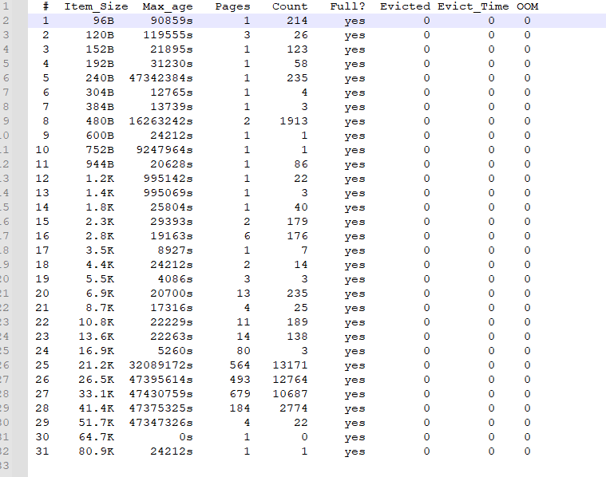

1、目标

# 1. 目标

迁移memcached中的状态性缓存数据，并进行数据一致性校验。

# 2. 方案

使用`memcached-tool`工具将`memcached`数据`dump`下来，然后使用`nc`命令导入到目标端

```shell
source_ip=10.2.68.10
dest_ip=10.2.68.10
#获取统计信息
memcached-tool $source_ip:11211 > slab-$source_ip.txt
#dump导出数据
memcached-tool 10.2.68.10:11211 dump > data-$dest_ip.txt
nc $dest_ip 11211 < data-$dest_ip.txt
```


# 3. 测试


源端：10.2.68.10:11211

​			memcached版本version 1.4.15

​			memcached中的缓存的数据量约900M

目标端：10.2.73.34:11211

​			memcached版本version 1.4.15

 			memcached中没有缓存数据。

迁移前，通过下面的命令收集源端的slabs等信息，用于迁移前后的一致性对比。

```shell
source_ip=10.2.68.10
memcached-tool $source_ip:11211 > slab-$source_ip.txt
```

使用如下命令导出源端的memcached缓存数据

```shell
memcached-tool 10.2.68.10:11211 dump > data-$source_ip.txt
```

使用如下命令将导出数据导入到目标端的memcached

```shell
dest_ip=10.2.73.34
#若没有nc命令的话，需要先安装一下
yum install -y nc
nc dest_ip 11211 < data-xxx.txt
```

在目标端导入完成后，使用如下命令收集目标端的slab信息，与源端对比。

```shell
memcached-tool $dest_ip:11211 > slab-$dest_ip.txt
```


**数据一致性校验**




 


可以看出迁移后，源端`memcached`和目标端`memcached`的数据量差异较大，通过源目`memcached`的内存占用也能看出问题。

在网上查找了相关的一些材料，发现`memcached-tool`、 `memdump`工具底层都是用的`stats cachedump`

[论——memcached真的有工具可以dump出所有key嘛？](https://blog.csdn.net/chengouza3763/article/details/100834562?spm=1001.2101.3001.6650.6&utm_medium=distribute.pc_relevant.none-task-blog-2%7Edefault%7EBlogCommendFromBaidu%7ERate-6.pc_relevant_paycolumn_v3&depth_1-utm_source=distribute.pc_relevant.none-task-blog-2%7Edefault%7EBlogCommendFromBaidu%7ERate-6.pc_relevant_paycolumn_v3&utm_relevant_index=11)

> **cachedump每次返回的数据只有2M；**
>
> **而且在memcached源码中是写死的数值。**


*目前还没找到在不修改memcached服务端源码的前提下，能够将memcached中数据都dump出来的方案。*

[memcached数据迁移问题及解决方案](https://www.cnblogs.com/shrewdlin/archive/2013/03/27/2985167.html)

TODO

参考文献：

[论——memcached真的有工具可以dump出所有key嘛？](https://blog.csdn.net/chengouza3763/article/details/100834562?spm=1001.2101.3001.6650.6&utm_medium=distribute.pc_relevant.none-task-blog-2%7Edefault%7EBlogCommendFromBaidu%7ERate-6.pc_relevant_paycolumn_v3&depth_1-utm_source=distribute.pc_relevant.none-task-blog-2%7Edefault%7EBlogCommendFromBaidu%7ERate-6.pc_relevant_paycolumn_v3&utm_relevant_index=11)

[memcached数据迁移问题及解决方案](https://www.cnblogs.com/shrewdlin/archive/2013/03/27/2985167.html)

[memcached的一些简单使用](https://blog.51cto.com/zero01/2055498)