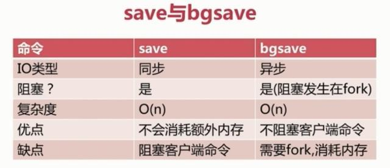

[Redis 设计与实现（第一版）](https://redisbook.readthedocs.io/en/latest/index.html)

## 1. 常见的缓存方式

缓存是高并发场景下提高热点数据访问性能的一个有效手段，在开发项目时会经常使用到。

缓存的类型分为：**本地缓存**、**分布式缓存**和**多级缓存**。

### 本地缓存：

**本地缓存**就是在进程的内存中进行缓存，比如我们的 **JVM** 堆中，可以用 **LRUMap** 来实现，也可以使用 **Ehcache** 这样的工具来实现。

本地缓存是内存访问，没有远程交互开销，性能最好，但是受限于单机容量，一般缓存较小且无法扩展。

### 分布式缓存：

**分布式缓存**可以很好得解决这个问题。

分布式缓存一般都具有良好的水平扩展能力，对较大数据量的场景也能应付自如。缺点就是需要进行远程请求，性能不如本地缓存。

### 多级缓存：

为了平衡这种情况，实际业务中一般采用**多级缓存**，本地缓存只保存访问频率最高的部分热点数据，其他的热点数据放在分布式缓存中。

在目前的一线大厂中，这也是最常用的缓存方案，单考单一的缓存方案往往难以撑住很多高并发的场景。

## 2. Redis宕机之后，该如何处理？

 首先要清楚Redis是什么架构部署的，不同部署架构，处理方法不一样。

## 3. 读写分离，读库延时同步，如何保证Redis的缓存一致性？

同 Redis主从同步

## 4. Redis持久化机制

提供了持久化的机制，分别是RDB(Redis DataBase)和AOF(Append Only File)。

**一、持久化流程**

既然redis的数据可以保存在磁盘上，那么这个流程是什么样的呢？

要有下面五个过程：

（1）客户端向服务端发送写操作(数据在客户端的内存中)。

（2）数据库服务端接收到写请求的数据(数据在服务端的内存中)。

（3）服务端调用write这个系统调用，将数据往磁盘上写(数据在系统内存的缓冲区中)。

（4）操作系统将缓冲区中的数据转移到磁盘控制器上(数据在磁盘缓存中)。

（5）磁盘控制器将数据写到磁盘的物理介质中(数据真正落到磁盘上)。

这5个过程是在理想条件下一个正常的保存流程，但是在大多数情况下，我们的机器等等都会有各种各样的故障，这里划分了两种情况：

（1）Redis数据库发生故障，只要在上面的第三步执行完毕，那么就可以持久化保存，剩下的两步由操作系统替我们完成。

（2）操作系统发生故障，必须上面5步都完成才可以。

在这里只考虑了保存的过程可能发生的故障，其实保存的数据也有可能发生损坏，需要一定的恢复机制，不过在这里就不再延伸了。现在主要考虑的是redis如何来实现上面5个保存磁盘的步骤。它提供了两种策略机制，也就是RDB和AOF。

RDB持久化是指在指定的时间间隔内将内存中的数据集快照写入磁盘。也是默认的持久化方式，这种方式是就是将内存中数据以快照的方式写入到二进制文件中,默认的文件名为dump.rdb。

在我们安装了redis之后，所有的配置都是在redis.conf文件中，里面保存了RDB和AOF两种持久化机制的各种配置。

既然RDB机制是通过把某个时刻的所有数据生成一个快照来保存，那么就应该有一种触发机制，是实现这个过程。对于RDB来说，提供了三种机制：save、bgsave、自动化。我们分别来看一下：

既然RDB机制是通过把某个时刻的所有数据生成一个快照来保存，那么就应该有一种触发机制，是实现这个过程。对于RDB来说，提供了三种机制：save、bgsave、自动化。


Redis 会根据redis.conf配置文件中的相关配置，定期进行RDB持久化。




**RDB 的优势和劣势**

①、优势

（1）RDB文件紧凑，全量备份，非常适合用于进行备份和灾难恢复。

（2）生成RDB文件的时候，redis主进程会fork()一个子进程来处理所有保存工作，主进程不需要进行任何磁盘IO操作。

（3）RDB 在恢复大数据集时的速度比 AOF 的恢复速度要快。

②、劣势

RDB快照是一次全量备份，存储的是内存数据的二进制序列化形式，存储上非常紧凑。当进行快照持久化时，会开启一个子进程专门负责快照持久化，子进程会拥有父进程的内存数据，父进程修改内存子进程不会反应出来，所以在快照持久化期间修改的数据不会被保存，可能丢失数据。

**AOF机制**

全量备份总是耗时的，有时候我们提供一种更加高效的方式AOF，工作机制很简单，redis会将每一个收到的写命令都通过write函数追加到文件中。通俗的理解就是日志记录。

**1、持久化原理**

他的原理看下面这张图：


**2、文件重写原理**

AOF的方式也同时带来了另一个问题。持久化文件会变的越来越大。为了压缩aof的持久化文件。redis提供了bgrewriteaof命令。将内存中的数据以命令的方式保存到临时文件中，同时会fork出一条新进程来将文件重写。


重写aof文件的操作，并没有读取旧的aof文件，而是将整个内存中的数据库内容用命令的方式重写了一个新的aof文件，这点和快照有点类似。请看下面的例子。[Redis之AOF重写及其实现原理](https://blog.csdn.net/hezhiqiang1314/article/details/69396887)

```
 # 假设服务器对键list执行了以下命令s;
127.0.0.1:6379> RPUSH list "A" "B"
(integer) 2
127.0.0.1:6379> RPUSH list "C"
(integer) 3
127.0.0.1:6379> RPUSH list "D" "E"
(integer) 5
127.0.0.1:6379> LPOP list
"A"
127.0.0.1:6379> LPOP list
"B"
127.0.0.1:6379> RPUSH list "F" "G"
(integer) 5
127.0.0.1:6379> LRANGE list 0 -1
1) "C"
2) "D"
3) "E"
4) "F"
5) "G"
127.0.0.1:6379> 
```

当前列表键list在数据库中的值就为`["C", "D", "E", "F", "G"]`。要使用尽量少的命令来记录list键的状态，最简单的方式不是去读取和分析现有AOF文件的内容，，而是直接读取list键在数据库中的当前值，然后用一条`RPUSH list "C" "D" "E" "F" "G"`代替前面的6条命令。


==其实我的一个疑问是，当同时启用了RDB和AOF持久化，那么在BGREWRITEAOF之后，这个新的AOF文件和之前的AOF文件的状态是一致的吗？==

正如上面AOF重写的原理所讲，AOF重写并没有读取当前的AOF文件，而是直接将当前数据库的状态用命令的方式重写，然后生成一个新的AOF文件。

## SAVE 、 BGSAVE 、 AOF 写入和 BGREWRITEAOF

除了了解 RDB 文件的保存方式之外， 我们可能还想知道， 两个 RDB 保存命令能否同时使用？ 它们和 AOF 保存工作是否冲突？

本节就来解答这些问题。

### SAVE

前面提到过， 当 [SAVE](http://redis.readthedocs.org/en/latest/server/save.html#save) 执行时， Redis 服务器是阻塞的， 所以当 [SAVE](http://redis.readthedocs.org/en/latest/server/save.html#save) 正在执行时， 新的 [SAVE](http://redis.readthedocs.org/en/latest/server/save.html#save) 、 [BGSAVE](http://redis.readthedocs.org/en/latest/server/bgsave.html#bgsave)或 [BGREWRITEAOF](http://redis.readthedocs.org/en/latest/server/bgrewriteaof.html#bgrewriteaof) 调用都不会产生任何作用。

只有在上一个 [SAVE](http://redis.readthedocs.org/en/latest/server/save.html#save) 执行完毕、 Redis 重新开始接受请求之后， 新的 [SAVE](http://redis.readthedocs.org/en/latest/server/save.html#save) 、 [BGSAVE](http://redis.readthedocs.org/en/latest/server/bgsave.html#bgsave) 或 [BGREWRITEAOF](http://redis.readthedocs.org/en/latest/server/bgrewriteaof.html#bgrewriteaof)命令才会被处理。

另外， 因为 AOF 写入由后台线程完成， 而 [BGREWRITEAOF](http://redis.readthedocs.org/en/latest/server/bgrewriteaof.html#bgrewriteaof) 则由子进程完成， 所以在 [SAVE](http://redis.readthedocs.org/en/latest/server/save.html#save) 执行的过程中， AOF 写入和 [BGREWRITEAOF](http://redis.readthedocs.org/en/latest/server/bgrewriteaof.html#bgrewriteaof) 可以同时进行。

### BGSAVE

在执行 [SAVE](http://redis.readthedocs.org/en/latest/server/save.html#save) 命令之前， 服务器会检查 [BGSAVE](http://redis.readthedocs.org/en/latest/server/bgsave.html#bgsave) 是否正在执行当中， 如果是的话， 服务器就不调用 `rdbSave`， 而是向客户端返回一个出错信息， 告知在 [BGSAVE](http://redis.readthedocs.org/en/latest/server/bgsave.html#bgsave) 执行期间， 不能执行 [SAVE](http://redis.readthedocs.org/en/latest/server/save.html#save) 。

这样做可以避免 [SAVE](http://redis.readthedocs.org/en/latest/server/save.html#save) 和 [BGSAVE](http://redis.readthedocs.org/en/latest/server/bgsave.html#bgsave) 调用的两个 `rdbSave` 交叉执行， 造成竞争条件。

另一方面， 当 [BGSAVE](http://redis.readthedocs.org/en/latest/server/bgsave.html#bgsave) 正在执行时， 调用新 [BGSAVE](http://redis.readthedocs.org/en/latest/server/bgsave.html#bgsave) 命令的客户端会收到一个出错信息， 告知 [BGSAVE](http://redis.readthedocs.org/en/latest/server/bgsave.html#bgsave) 已经在执行当中。

[BGREWRITEAOF](http://redis.readthedocs.org/en/latest/server/bgrewriteaof.html#bgrewriteaof) 和 [BGSAVE](http://redis.readthedocs.org/en/latest/server/bgsave.html#bgsave) 不能同时执行：

- 如果 [BGSAVE](http://redis.readthedocs.org/en/latest/server/bgsave.html#bgsave) 正在执行，那么 [BGREWRITEAOF](http://redis.readthedocs.org/en/latest/server/bgrewriteaof.html#bgrewriteaof) 的重写请求会被延迟到 [BGSAVE](http://redis.readthedocs.org/en/latest/server/bgsave.html#bgsave) 执行完毕之后进行，执行 [BGREWRITEAOF](http://redis.readthedocs.org/en/latest/server/bgrewriteaof.html#bgrewriteaof) 命令的客户端会收到请求被延迟的回复。
- 如果 [BGREWRITEAOF](http://redis.readthedocs.org/en/latest/server/bgrewriteaof.html#bgrewriteaof) 正在执行，那么调用 [BGSAVE](http://redis.readthedocs.org/en/latest/server/bgsave.html#bgsave) 的客户端将收到出错信息，表示这两个命令不能同时执行。

[BGREWRITEAOF](http://redis.readthedocs.org/en/latest/server/bgrewriteaof.html#bgrewriteaof) 和 [BGSAVE](http://redis.readthedocs.org/en/latest/server/bgsave.html#bgsave) 两个命令在操作方面并没有什么冲突的地方， 不能同时执行它们只是一个性能方面的考虑： 并发出两个子进程， 并且两个子进程都同时进行大量的磁盘写入操作， 这怎么想都不会是一个好主意。

## 5. Redis 主从同步

[Redis设计与实现](https://redisbook.readthedocs.io/en/latest/internal/aof.html)

[Redis 的主从同步，及两种高可用方式](https://blog.csdn.net/weixin_42711549/article/details/83061052)

[Redis主从复制原理总结](https://www.cnblogs.com/daofaziran/p/10978628.html)

两种同步方式：`RDB`和`AOF`。

**全量同步**

`RDB`是全量同步，Redis 定期 使用`save`或`bgsave`（bgsave fork一个子进程来生成RDB快照，不阻塞Redis）生成当时这一时刻的所有数据的快照.。RDB是压缩文件，不符合人类阅读。


Redis全量复制一般发生在Slave初始化阶段，这时Slave需要将Master上的所有数据都复制一份。具体步骤如下： 

   1. 从服务器连接主服务器，发送SYNC命令； 
1. 主服务器接收到SYNC命名后，开始执行BGSAVE命令生成RDB文件并使用缓冲区记录此后执行的所有写命令； 
   1. 主服务器BGSAVE执行完后，向所有从服务器发送快照文件，并在发送期间继续记录被执行的写命令； 
1. 从服务器收到快照文件后丢弃所有旧数据，载入收到的快照； 
   1. 主服务器快照发送完毕后开始向从服务器发送缓冲区中的写命令；
1. 从服务器完成对快照的载入，开始接收命令请求，并执行来自主服务器缓冲区的写命令； 

完成上面几个步骤后就完成了从服务器数据初始化的所有操作，从服务器此时可以接收来自用户的读请求。

**增量同步**
　　Redis增量复制是指Slave初始化后开始正常工作时主服务器发生的写操作同步到从服务器的过程。 

增量复制的过程主要是主服务器每执行一个写命令就会向从服务器发送相同的写命令，从服务器接收并执行收到的写命令。

**Redis主从同步策略**
　　主从刚刚连接的时候，进行全量同步；全量同步结束后，进行增量同步。当然，如果有需要，slave 在任何时候都可以发起全量同步。redis 策略是，无论如何，首先会尝试进行增量同步，如不成功，要求从机进行全量同步。

**注意点**
==如果多个Slave断线了，需要重启的时候，因为只要Slave启动，就会发送sync请求和主机全量同步，当多个同时出现的时候，可能会导致Master IO剧增宕机。==

`AOF（Append Only File）`是增量同步，是将后续的写命令追加到AOF文件中，就像一个日志文件，没有压缩，一看就知道执行了什么写命令，可以设置每一个命令就flush到AOF文件，or 每一秒flush到AOF文件，或由操作系统来决定。

写命令追加到`aof_buf缓冲区` => 将`aof_buf缓冲区`数据`flush`到磁盘 => 同步给slave，定期重写AOF文件。

`append` => `write` => `rewrite`

文件重写能够压缩AOF，更恰当应该是合并。可以将多条命令合并为一个。文件重写的触发分为：

- 手动触发（直接调用bgrewriteaof命令，该命令的执行与bgsave有些类似：都是fork子进程 进行具体的工作，且都只有在fork时阻塞，两者不同时进行，因为有大量磁盘I/O影响性能）
- 自动触发（根据`auto-aof-rewrite-min-size`和 `auto-aof-rewrite-percentage`参数，以及 `aof_current_size`和`aof_base_size`状态确定触发时机。 ）


## 6. Redis故障转移

两种failover方式：手动和自动。部署方式不同故障转移的方式就不同。

Redis的部署方式：

- 单机部署
- 主从部署
- 主从部署 + sentinel哨兵
- 分布式集群部署，见Redis分布式集群

## 7. Redis分布式集群

[Redis 集群教程](http://redis.cn/topics/cluster-tutorial.html)

[Redis 集群规范](http://redis.cn/topics/cluster-spec.html)

[初识 Redis 数据分区](https://blog.csdn.net/besmarterbestronger/article/details/106983208)

Redis集群是一个提供在多个Redis节点间共享数据的程序集。

`Redis集群并不支持处理多个keys的命令,因为这需要在不同的节点间移动数据，从而达不到像Redis那样的性能，在高负载的情况下可能会导致不可预料的错误。`

Redis 集群通过分区来提供一定程度的可用性,在实际环境中当某个节点宕机或者不可达的情况下继续处理命令. 

Redis 集群 的优势: 

- 自动分割数据到不同的节点上。 

- 整个集群的部分节点失败或者不可达的情况下能够继续处理命令。

### Redis 集群的数据分片

Redis 集群没有使用`一致性hash`, 而是引入了` 哈希槽`的概念.

Redis 集群有16384（2^14）个哈希槽,每个key通过CRC16校验后对16384取模来决定放置哪个槽.集群的每个节点负责一部分hash槽,举个例子,比如当前集群有3个节点,那么:

- 节点 A 包含 0 到 5500号哈希槽.
- 节点 B 包含5501 到 11000 号哈希槽.
- 节点 C 包含11001 到 16384号哈希槽.

这种结构很容易添加或者删除节点. 比如如果我想新添加个节点D, 我需要从节点 A, B, C中移动部分槽到D上. 如果我想移除节点A,需要将A中的槽移到B和C节点上,然后将没有任何槽的A节点从集群中移除即可. 由于从一个节点将哈希槽移动到另一个节点并不会停止服务,所以无论添加删除或者改变某个节点的哈希槽的数量都不会造成集群不可用的状态.

### Redis 集群的主从复制模型

为了使在部分节点失败或者大部分节点无法通信的情况下集群仍然可用，所以==集群使用了主从复制模型,每个节点都会有N-1个复制品.==

在我们例子中具有A，B，C三个节点的集群,在没有复制模型的情况下,如果节点B失败了，那么整个集群就会以为缺少5501-11000这个范围的槽而不可用.

然而如果在集群创建的时候（或者过一段时间）我们为每个节点添加一个从节点A1，B1，C1,那么整个集群便有三个master节点和三个slave节点组成，这样在节点B失败后，集群便会选举B1为新的主节点继续服务，整个集群便不会因为槽找不到而不可用了

不过当B和B1 都失败后，集群是不可用的.

### Redis 一致性保证

==Redis 并不能保证数据的**强一致性**. 这意味这在实际中集群在特定的条件下可能会丢失写操作.==

第一个原因是因为集群是用了`异步复制写`操作过程:

- 客户端向主节点B写入一条命令.
- 主节点B向客户端回复命令状态.
- 主节点将写操作复制给他得从节点 B1, B2 和 B3.

主节点对命令的复制工作发生在返回命令回复之后， 因为如果每次处理命令请求都需要等待复制操作完成的话， 那么主节点处理命令请求的速度将极大地降低 —— ==我们必须在性能和一致性之间做出权衡==。 注意：Redis 集群可能会在将来提供`同步写`的方法。 Redis 集群另外一种可能会丢失命令的情况是集群出现了`网络分区`， 并且一个客户端与至少包括一个主节点在内的少数实例被孤立。

举个例子 假设集群包含 A 、 B 、 C 、 A1 、 B1 、 C1 六个节点， 其中 A 、B 、C 为主节点， A1 、B1 、C1 为A，B，C的从节点， 还有一个客户端 Z1 假设集群中发生网络分区，那么集群可能会分为两方，大部分的一方包含节点 A 、C 、A1 、B1 和 C1 ，小部分的一方则包含节点 B 和客户端 Z1 .

Z1仍然能够向主节点B中写入, 如果网络分区发生时间较短,那么集群将会继续正常运作,如果分区的时间足够让大部分的一方将B1选举为新的master，那么Z1写入B中得数据便丢失了.

注意， 在网络分裂出现期间， 客户端 Z1 可以向主节点 B 发送写命令的最大时间是有限制的， 这一时间限制称为节点超时时间（node timeout）， 是 Redis 集群的一个重要的配置选项.

Redis 集群实现了所有在非分布式 Redis 版本中的处理单一键值（key）的命令。那些使用多个键值的复杂操作， 比如 set 里的并集（unions）和交集（intersections）操作，只有在这些key是在同一哈希槽中才可用。

### Redis Cluster集群的master选举原理

https://baijiahao.baidu.com/s?id=1662783818493463629&wfr=spider&for=pc

Redis Cluster 不可用的情况：

- 集群master超过半数宕机
- 集群某一节点的主从全部宕机

**当某个master挂掉后，在cluster集群仍然可用的前提下，由于某个master可能有多个slave,某个salve将提升为master节点，那么就会存在竞争，那么此时它们的选举机制是怎样的呢？**

> 要理解下面的过程我们需要了解一些概念：
>
> currentEpoch：
>
> 这是一个集群状态相关的概念，可以当作记录集群状态变更的递增版本号。每个集群节点，都会通过 server.cluster->currentEpoch 记录当前的 currentEpoch。
>
> 集群节点创建时，不管是 master 还是 slave，都置 currentEpoch 为 0。当前节点接收到来自其他节点的包时，如果发送者的 currentEpoch（消息头部会包含发送者的 currentEpoch）大于当前节点的currentEpoch，那么当前节点会更新 currentEpoch 为发送者的 currentEpoch。因此，集群中所有节点的 currentEpoch 最终会达成一致，相当于对集群状态的认知达成了一致。
>
> 其过程如下：
>
> **1.slave发现自己的master变为FAIL**
>
> **2.发起选举前，slave先给自己的epoch（即currentEpoch）增一，然后请求其它master给自己投票。slave是通过广播FAILOVER_AUTH_REQUEST包给集中的每一个masters。**
>
> **3.slave发起投票后，会等待至少两倍NODE_TIMEOUT时长接收投票结果，不管NODE_TIMEOUT何值，也至少会等待2秒。**
>
> **4.master接收投票后给slave响应FAILOVER_AUTH_ACK，并且在（NODE_TIMEOUT\*2）时间内不会给同一master的其它slave投票。**
>
> **5.如果slave收到FAILOVER_AUTH_ACK响应的epoch值小于自己的epoch，则会直接丢弃。一旦slave收到多数master的FAILOVER_AUTH_ACK，则声明自己赢得了选举。**
>
> **6.如果slave在两倍的NODE_TIMEOUT时间内（至少2秒）未赢得选举，则放弃本次选举，然后在四倍NODE_TIMEOUT时间（至少4秒）后重新发起选举。**
>
> 只所以强制延迟至少**0.5秒**选举，是为确保master的fail状态在整个集群内传开，否则可能只有小部分master知晓，而master只会给处于fail状态的master的slaves投票。如果一个slave的master状态不是fail，则其它master不会给它投票，Redis通过八卦协议（即Gossip协议，也叫谣言协议）传播fail。而在固定延迟上再加一个随机延迟，是为了避免多个slaves同时发起选举。
>
> 延迟计算公式：
>
> DELAY = 500ms + random(0 ~ 500ms) + SLAVE_RANK * 1000ms
>
> SLAVE_RANK表示此slave已经从master复制数据的总量的rank。Rank越小代表已复制的数据越新。这种方式下，持有最新数据的slave将会首先发起选举（理论上）。 

## 9. Redis的数据类型

- `string`
- `list`
- `hash`
- `set`
- `sorted set`
- `bitmap`
-  `HyperLogLogs`
- `streams`

## 10. Redis的淘汰策略

==Redis有两种删除key的机制==：惰性删除和定期删除。除了这两种删除机制之外，还有几种淘汰策略。

惰性删除：

惰性删除指的是当我们查询key的时候才对key进行检测，如果已经达到过期时间，则删除。显然，他有一个缺点就是如果这些过期的key没有被访问，那么他就一直无法被删除，而且一直占用内存。


定期删除：

定期删除指的是redis每隔一段时间对数据库做一次检查，删除里面的过期key。由于不可能对所有key去做轮询来删除，所以redis会每次随机取一些key去做检查和删除。

==对于定期删除和惰性删除都没有删除的过期的key，就只能由内存淘汰策略进行清除。==

**那么什么时候才会触发淘汰策略呢？**

1、一个客户端执行指令，导致数据的增加时。

2、Redis检测到内存的使用已经达到上限。

3、Redis自身执行指令时，等等

------

**注意：**

Redis为了避免反复触发淘汰策略，每次会淘汰掉一批数据。

当Redis指令产生数据比较大时，淘汰掉的数据量也相应也比较大。

为了节省内存，LRU的策略并不是严格执行的，Redis是在整体中随机抽样取出一小部分数据，在这部分数据中严格执行LRU策略，在Redis3.0以后的版本对此算法做了改进，但仍然也是近似的LRU的策略，只是离真正的LRU更近了。

另外用户可以动态的设定随机抽取的样本数，例如：

```
maxmemory-samples 5
```


`LRU：Least Recently Use`

`LFU：Least Frequently Use`

- `noeviction` 默认策略，不驱逐，如果内存满了，添加数据报错。
- `allkeys-lru` 在所有key中进行lru删除
- `allkeys-lfu` 在所有key中进行lfu删除
- `allkeys-random` 在所有key中进行随机删除
- `volatile-lru` 在设置了过期时间的key中进行lru删除
- `volatile-lfu` 在设置了过期时间的key中进行lfu删除
- `volatile-random` 在设置了过期时间的key中进行随机删除
- `volatile-ttl` 在设置了过期时间的key中，根据ttl的大小进行删除

## 11. 缓存与数据库不一致

[深入理解缓存之缓存和数据库的一致性](https://blog.csdn.net/striveb/article/details/95110502#comments_13575017)

## **产生原因**

主要有两种情况，会导致缓存和 DB 的一致性问题：

1. 并发的场景下，导致读取老的 DB 数据，更新到缓存中。
2. 缓存和 DB 的操作，不在一个事务中，可能只有一个操作成功，而另一个操作失败，导致不一致。

当然，有一点我们要注意，缓存和 DB 的一致性，我们**指的更多的是最终一致性**。我们**使用缓存主要是提高读操作的性能，真正在写操作的业务逻辑，还是以数据库为准。**例如说，我们可能缓存用户钱包的余额在缓存中，在前端查询钱包余额时，读取缓存，在使用钱包余额时，读取数据库。

## 更新缓存的设计模式

### 1.Cache Aside Pattern(旁路缓存)

这是最常用最常用的pattern了。其具体逻辑如下：

- **失效**：应用程序先从cache取数据，没有得到，则从数据库中取数据，成功后，放到缓存中。

- **命中**：应用程序从cache中取数据，取到后返回。

- **更新**：先把数据存到数据库中，成功后，再让缓存失效。


一个是查询操作，一个是更新操作的并发，首先，没有了删除cache数据的操作了，而是先更新了数据库中的数据，此时，缓存依然有效，所以，并发的查询操作拿的是没有更新的数据，但是，更新操作马上让缓存的失效了，后续的查询操作再把数据从数据库中拉出来。而不会像文章开头的那个逻辑产生的问题，后续的查询操作一直都在取老的数据。

> **要么通过2PC或是Paxos协议保证一致性，要么就是拼命的降低并发时脏数据的概率，而Facebook使用了这个降低概率的玩法，因为2PC太慢，而Paxos太复杂。当然，最好还是为缓存设置上过期时间。**

### 2.Read/Write Through Pattern

在上面的Cache Aside套路中，我们的应用代码需要维护两个数据存储，**一个是缓存（Cache），一个是数据库（Repository）。**所以，应用程序比较啰嗦。而Read/Write Through套路是把更新数据库（Repository）的操作由缓存自己代理了，所以，对于应用层来说，就简单很多了。**可以理解为，应用认为后端就是一个单一的存储，而存储自己维护自己的Cache。**

Read Through

Read Through 套路就是**在查询操作中更新缓存**，也就是说，当缓存失效的时候（过期或LRU换出），Cache Aside是由调用方负责把数据加载入缓存，而Read Through则用缓存服务自己来加载，从而对应用方是透明的。

Write Through

Write Through 套路和Read Through相仿，**不过是在更新数据时发生。当有数据更新的时候，如果没有命中缓存，直接更新数据库，然后返回。如果命中了缓存，则更新缓存，然后再由Cache自己更新数据库（这是一个同步操作）**

下图自来Wikipedia的[Cache词条](https://en.wikipedia.org/wiki/Cache_(computing))。其中的Memory你可以理解为就是我们例子里的数据库。


### 3.Write Behind Caching Pattern

Write Behind 又叫 Write Back。**write back就是Linux文件系统的Page Cache的算法**。

Write Back套路，一句说就是，在更新数据的时候，只更新缓存，不更新数据库，而我们的缓存会异步地批量更新数据库。

> 这个设计的好处就是让数据的I/O操作飞快无比（因为直接操作内存嘛 ），因为异步，write backg还可以合并对同一个数据的多次操作，所以性能的提高是相当可观的。

但是，其带来的问题是，数据不是强一致性的，而且可能会丢失（我们知道Unix/Linux非正常关机会导致数据丢失，就是因为这个事）。在软件设计上，我们基本上不可能做出一个没有缺陷的设计，就像算法设计中的时间换空间，空间换时间一个道理，有时候，强一致性和高性能，高可用和高性性是有冲突的。软件设计从来都是取舍Trade-Off。

另外，Write Back实现逻辑比较复杂，因为他需要track有哪数据是被更新了的，需要刷到持久层上。操作系统的write back会在仅当这个cache需要失效的时候，才会被真正持久起来，比如，内存不够了，或是进程退出了等情况，这又叫lazy write。

在wikipedia上有一张write back的流程图，基本逻辑如下：

参照：左耳朵耗子[《缓存更新的套路》](https://coolshell.cn/articles/17416.html)

## 缓存架构设计：

### 1.更新缓存 VS 淘汰缓存

更新缓存：数据不但写入数据库，还会写入缓存；优点：缓存不会增加一次miss，命中率高

淘汰缓存：数据只会写入数据库，不会写入缓存，只会把数据淘汰掉；优点：简单

**这两者的选择主要取决于“更新缓存的复杂度”。**

> 例如，上述场景，只是简单的把余额money设置成一个值，那么：
>
> （1）淘汰缓存的操作为deleteCache(uid)
>
> （2）更新缓存的操作为setCache(uid, money)
>
> 更新缓存的代价很小，此时我们应该更倾向于更新缓存，以保证更高的缓存命中率
>
> 如果余额是通过很复杂的数据计算得出来的，例如业务上除了账户表account，还有商品表product，折扣表discount
>
> account(uid, money)
>
> product(pid, type, price, pinfo)
>
> discount(type, zhekou)
>
> 业务场景是用户买了一个商品product，这个商品的价格是price，这个商品从属于type类商品，type类商品在做促销活动要打折扣zhekou，购买了商品过后，这个余额的计算就复杂了，需要：
>
> （1）先把商品的品类，价格取出来：SELECT type, price FROM product WHERE pid=XXX
>
> （2）再把这个品类的折扣取出来：SELECT zhekou FROM discount WHERE type=XXX
>
> （3）再把原有余额从缓存中查询出来money = getCache(uid)
>
> （4）再把新的余额写入到缓存中去setCache(uid, money-price*zhekou)
>
> 更新缓存的代价很大，此时我们应该更倾向于淘汰缓存。

**总之，淘汰缓存操作简单，并且带来的副作用只是增加了一次cache miss，建议作为通用的处理方式。**

### 2.先操作数据库 vs 先操作缓存

当写操作发生时，假设淘汰缓存作为对缓存通用的处理方式，又面临两种抉择：

（1）先写数据库，再淘汰缓存

（2）先淘汰缓存，再写数据库

对于一个不能保证事务性的操作，一定涉及“哪个任务先做，哪个任务后做”的问题，解决这个问题的方向是：**如果出现不一致，谁先做对业务的影响较小，就谁先执行。**

由于写数据库与淘汰缓存不能保证原子性，谁先谁后同样要遵循上述原则。


假设先写数据库，再淘汰缓存：第一步写数据库操作成功，第二步淘汰缓存失败，则会出现DB中是新数据，Cache中是旧数据，数据不一致。


假设先淘汰缓存，再写数据库：第一步淘汰缓存成功，第二步写数据库失败，则只会引发一次Cache miss。

**结论：数据和缓存的操作时序：先淘汰缓存，再写数据库。**

### 3.缓存架构优化


上述缓存架构有一个**缺点**：业务方需要同时关注缓存与DB，主要有两种优化方案：


一种方案是服务化：加入一个服务层，向上游提供帅气的数据访问接口，向上游屏蔽底层数据存储的细节，这样业务线不需要关注数据是来自于cache还是DB。

另一种方案是**异步缓存更新**：业务线所有的写操作都走数据库，所有的读操作都总缓存，由一个异步的工具来做数据库与缓存之间数据的同步，具体细节是：

（1）要有一个init cache的过程，将需要缓存的数据全量写入cache

（2）如果DB有写操作，异步更新程序读取binlog，更新cache

在（1）和（2）的合作下，cache中有全部的数据，这样：

（a）业务线读cache，一定能够hit（很短的时间内，可能有脏数据），无需关注数据库

（b）业务线写DB，cache中能得到异步更新，无需关注缓存

这样将**大大简化业务线的调用逻辑**，存在的缺点是，如果缓存的数据业务逻辑比较复杂，async-update异步更新的逻辑可能也会比较复杂。

### 4.结论：

（1）淘汰缓存是一种通用的缓存处理方式

（2）**先淘汰缓存，再写数据库**

（3）服务化是向业务方屏蔽底层数据库与缓存复杂性的一种通用方式

参照：沈剑[《缓存架构设计细节二三事》](https://www.w3cschool.cn/architectroad/architectroad-cache-architecture-design.html)

## 缓存和DB一致性的解决方案

### 1）先淘汰缓存，再写数据库

因为先淘汰缓存，所以数据的最终一致性是可以得到有效的保证的。因为先淘汰缓存，即使写数据库发生异常，也就是下次缓存读取时，多读取一次数据库。

但是，这种方案会存在缓存和 DB 的数据会不一致的情况，参照[《缓存与数据库一致性优化》](https://www.w3cschool.cn/architectroad/architectroad-consistency-of-cache-with-database.html) 所说。

==我们需要解决缓存并行写，实现串行写。==比较简单的方式，引入分布式锁。

- 在写请求时，先淘汰缓存之前，获取该分布式锁。
- 在读请求时，发现缓存不存在时，先获取分布式锁。

这样，缓存的并行写就成功的变成串行写了。写请求时，是否主动更新缓存，根据自己业务的需要，是否有，都没问题。

### 2）先写数据库，再更新缓存

按照“先写数据库，再更新缓存”，我们要保证 DB 和缓存的操作，能够在“同一个事务”中，从而实现最终一致性。

**基于定时任务来实现**

- 首先，写入数据库。
- 然后，在写入数据库所在的事务中，插入一条记录到任务表。该记录会存储需要更新的缓存 KEY 和 VALUE 。
- 【异步】最后，定时任务每秒扫描任务表，更新到缓存中，之后删除该记录。

**基于消息队列来实现**

- 首先，写入数据库。
- 然后，发送带有缓存 KEY 和 VALUE 的事务消息。此时，需要有支持事务消息特性的消息队列，或者我们自己封装消息队列，支持事务消息。
- 【异步】最后，消费者消费该消息，更新到缓存中。

这两种方式，可以进一步优化，**可以先尝试更新缓存，如果失败，则插入任务表，或者事务消息。**

另外，极端情况下，如果并发写执行时，先更新成功 DB 的，结果后更新缓存：


 

- 理论来说，希望的更新缓存顺序是，线程 1 快于线程 2 ，但是实际线程1 晚于线程 2 ，导致数据不一致。
- 图中一直是基于定时任务或消息队列来实现异步更新缓存，如果网络抖动，导致【插入任务表，或者事务消息】的顺序不一致。
- 那么怎么解决呢？需要做如下三件事情：
  - 1、在缓存值中，拼接上数据版本号或者时间戳。例如说：`value = {value: 原值, version: xxx}` 。
  - 2、在任务表的记录，或者事务消息中，增加上数据版本号或者时间戳的字段。
  - 3、在定时任务或消息队列执行更新缓存时，先读取缓存，对比版本号或时间戳，大于才进行更新。 当然，此处也会有并发问题，所以还是得引入分布式锁或 CAS 操作。
    - 关于 Redis 分布式锁，可以看看 [《精尽 Redis 面试题》](http://svip.iocoder.cn/Redis/Interview) 的 [「如何使用 Redis 实现分布式锁？」](http://svip.iocoder.cn/Cache/Interview/#) 问题。
    - 关于 Redis CAS 操作，可以看看 [《精尽 Redis 面试题》](http://svip.iocoder.cn/Redis/Interview) 的 [「什么是 Redis 事务？」](http://svip.iocoder.cn/Cache/Interview/#) 问题。

### 3) 基于数据库的 binlog 日志

> **1、重客户端**

**写入缓存：**


- 应用同时更新数据库和缓存
- 如果数据库更新成功，则开始更新缓存，否则如果数据库更新失败，则整个更新过程失败。
- 判断更新缓存是否成功，如果成功则返回
- 如果缓存没有更新成功，则将数据发到MQ中
- 应用监控MQ通道，收到消息后继续更新Redis。

**问题点：**如果更新Redis失败，同时在将数据发到MQ之前的时间，应用重启了，这时候MQ就没有需要更新的数据，如果Redis对所有数据没有设置过期时间，同时在读多写少的场景下，只能通过人工介入来更新缓存。

**读缓存：**

如何来解决这个问题？那么**在写入Redis数据的时候，在数据中增加一个时间戳插入到Redis中。**在从Redis中读取数据的时候，首先要判断一下当前时间有没有过期，如果没有则从缓存中读取，如果过期了则从数据库中读取最新数据覆盖当前Redis数据并更新时间戳。具体过程如下图所示：


> **2、客户端数据库与缓存解耦**

上述方案对于应用的研发人员来讲比较重，需要研发人员同时考虑数据库和Redis是否成功来做不同方案，如何让研发人员只关注数据库层面，而不用关心缓存层呢？请看下图：

- 应用直接写数据到数据库中。
- 数据库更新binlog日志。
- 利用Canal中间件读取binlog日志。
- Canal借助于限流组件按频率将数据发到MQ中。
- 应用监控MQ通道，将MQ的数据更新到Redis缓存中。

可以看到这种方案对研发人员来说比较轻量，不用关心缓存层面，而且这个方案虽然比较重，但是却容易形成统一的解决方案。

参照： [《技术专题讨论第五期：论系统架构设计中缓存的重要性》](http://www.spring4all.com/question/177)

> PS：下面这两种比较实用
>
> - “**先淘汰缓存，再写数据库**”的方案，并且无需引入分布式锁。
> - “**先写数据库，再更新缓存**”的方案，并且无需引入定时任务或者消息队列。
>
> 使用缓存过程中，经常会遇到缓存数据的不一致性和脏读现象。一般情况下，采取缓存双淘汰机制，在更新数据库的**前**淘汰缓存。此外，设定超时时间，例如三十分钟。
>
> **极端场景下，即使有脏数据进入缓存，这个脏数据也最存在一段时间后自动销毁。**

另外，在 DB 主从架构下，方案会更加复杂。详细可以看看 [《主从 DB 与 cache 一致性优化》](https://www.w3cschool.cn/architectroad/architectroad-consistency-of-cache-with-master-and-slave-database.html) 。


[如何保持数据库和缓存的一致性](https://blog.csdn.net/sinat_16712671/article/details/76130829?utm_medium=distribute.pc_relevant.none-task-blog-BlogCommendFromMachineLearnPai2-2.channel_param&depth_1-utm_source=distribute.pc_relevant.none-task-blog-BlogCommendFromMachineLearnPai2-2.channel_param)

### 更新缓存策略

失效：应用程序从cache取数据，没有得到，则从数据库取数据，然后将数据放入cache 
命中：应用从cache取数据，若取到则返回 
更新：把数据更新到数据库，然后使cache失效 
借用网上两张图 
 


### 有没有其他策略？

读操作容易理解，现在讨论一下写的操作

#### 如果先使cache失效，后更新数据库，是否可行

这么做引发的问题是，如果A,B两个线程同时要更新数据，并且A,B已经都做完了删除缓存这一步，接下来，A先更新了数据库，C线程读取数据，由于缓存没有，则查数据库，并把A更新的数据，写入了缓存，最后B更新数据库。那么缓存和数据库的值就不一致了。

#### 如果先把数据库更新，然后把cache更新（不是失效），是否可行

这么做引发的问题是，如果A,B两个线程同时做数据更新，A先更新了数据库，B后更新数据库，则此时数据库里存的是B的数据。而更新缓存的时候，是B先更新了缓存，而A后更新了缓存，则缓存里是A的数据。这样缓存和数据库的数据也不一致。

#### 如果更新数据时，更新数据库成功，而失效cache时失败怎么解决？

1、对删除缓存进行重试，数据的一致性要求越高，我越是重试得快。 
2、定期全量更新，简单地说，就是我定期把缓存全部清掉，然后再全量加载。 
3、给所有的缓存一个失效期。（绝招，任何不一致，都可以靠失效期解决，失效期越短，数据一致性越高。但是失效期越短，查数据库就会越频繁。因此失效期应该根据业务来定）

**不要缓存那些对数据一致性要求很高的数据**


## 12. Redis的 LUA脚本

[Redis Lua实战](https://www.jianshu.com/p/366d1b4f0d13)

## Redis中使用Lua的好处

- `减少网络开销`。可以将多个请求通过脚本的形式一次发送，减少网络时延
- `原子操作`。redis会将整个脚本作为一个整体执行，中间不会被其他命令插入。因此在编写脚本的过程中无需担心会出现竞态条件，无需使用事务。
- `复用`。客户端发送的脚步会永久存在redis中，这样，其他客户端可以复用这一脚本而不需要使用代码完成相同的逻辑。

## Redis Lua脚本与事务

从定义上来说， Redis 中的脚本本身就是一种事务， 所以任何在事务里可以完成的事， 在脚本里面也能完成。 并且一般来说， 使用脚本要来得更简单，并且速度更快。

使用事务时可能会遇上以下两种错误：

- 事务在执行 [EXEC](https://link.jianshu.com?t=http%3A%2F%2Fredisdoc.com%2Ftransaction%2Fexec.html%23exec) 之前，入队的命令可能会出错。比如说，命令可能会产生语法错误（参数数量错误，参数名错误，等等），或者其他更严重的错误，比如内存不足（如果服务器使用 `maxmemory` 设置了最大内存限制的话）。
- 命令可能在 [EXEC](https://link.jianshu.com?t=http%3A%2F%2Fredisdoc.com%2Ftransaction%2Fexec.html%23exec) 调用之后失败。举个例子，事务中的命令可能处理了错误类型的键，比如将列表命令用在了字符串键上面，诸如此类。

对于发生在 [EXEC](https://link.jianshu.com?t=http%3A%2F%2Fredisdoc.com%2Ftransaction%2Fexec.html%23exec) 执行之前的错误，客户端以前的做法是检查命令入队所得的返回值：如果命令入队时返回 `QUEUED` ，那么入队成功；否则，就是入队失败。如果有命令在入队时失败，那么大部分客户端都会停止并取消这个事务。

不过，从 Redis 2.6.5 开始，服务器会对命令入队失败的情况进行记录，并在客户端调用 [EXEC](https://link.jianshu.com?t=http%3A%2F%2Fredisdoc.com%2Ftransaction%2Fexec.html%23exec) 命令时，拒绝执行并自动放弃这个事务。

在 Redis 2.6.5 以前， Redis 只执行事务中那些入队成功的命令，而忽略那些入队失败的命令。 而新的处理方式则使得在流水线（pipeline）中包含事务变得简单，因为发送事务和读取事务的回复都只需要和服务器进行一次通讯。

至于那些在 [EXEC](https://link.jianshu.com?t=http%3A%2F%2Fredisdoc.com%2Ftransaction%2Fexec.html%23exec) 命令执行之后所产生的错误， 并没有对它们进行特别处理： 即使事务中有某个/某些命令在执行时产生了错误， 事务中的其他命令仍然会继续执行。

> 经过测试lua中发生异常处理方式和redis 事务一致,可以说这两个东西是一样的，但是lua支持缓存，可以复用脚本，这个是原来的事务所没有的


## 13. Redis中的setnx是什么？

`setnx，即set if not exists`，只有当该key不存在时，才set它，成功返回1，失败返回0。==Redis实现分布式锁，就是利用这个功能来实现的。==

[分布式锁之Redis实现](https://www.jianshu.com/p/47fd7f86c848)

网上很多文章说采用setnx实现分布式锁，但是setnx命令无法原子性的设置锁的自身过期时间，也就是说执行setnx命令时我们无法同时设置其过期时间，那么就会出现死锁，例如：客户端A刚执行完setnx，这时候客户端A挂掉了，没有完成给锁设置过期时间，此时就产生了死锁，所有的客户端再也无法获得该锁，这种情况一般采用Lua脚本来实现（因为Redis执行Lua脚本是原子性的），其实从 Redis 2.6.12 版本开始set命令完全可以替代setnx命令，我们看官网的set命令参数

==SET key value [EX seconds] [PX milliseconds] [NX|XX]==

**参数说明：**

**EX second ：**设置键的过期时间为 second 秒。 SET key value EX second 效果等同于 SETEX key second value 。

**PX millisecond ：**设置键的过期时间为 millisecond 毫秒。 SET key value PX millisecond 效果等同于 PSETEX key millisecond value 。

**NX ：**只在键不存在时，才对键进行设置操作。 SET key value NX 效果等同于 SETNX key value 。

**XX ：**只在键已经存在时，才对键进行设置操作。

#### 1、加锁

加锁实际上就是在redis中，给Key键设置一个值，为避免死锁，并给定一个过期时间。

```
SET lock_key random_value NX PX 5000
```

值得注意的是：
 `random_value` 是客户端生成的唯一的字符串。
 `NX` 代表只在键不存在时，才对键进行设置操作。
 `PX 5000` 设置键的过期时间为5000毫秒。

这样，如果上面的命令执行成功，则证明客户端获取到了锁。

#### 2、解锁

解锁的过程就是将Key键删除。但也不能乱删，不能说客户端1的请求将客户端2的锁给删除掉。这时候`random_value`的作用就体现出来。

为了保证解锁操作的原子性，我们用LUA脚本完成这一操作。先判断当前锁的字符串是否与传入的值相等，是的话就删除Key，解锁成功。


```kotlin
if redis.call('get',KEYS[1]) == ARGV[1] then 
   return redis.call('del',KEYS[1]) 
else
   return 0 
end
```

## 14. 布隆过滤器的工作原理

[数学之美：布隆过滤器](https://zhuanlan.zhihu.com/p/72378274)


### **算法题目**

如果一个黑名单网站包含100亿个黑名单网页，每个网页最多占64B，设计一个系统，判断当前的URL是否在这个黑名单当中，要求额外空间不超过30GB，允许误差率为万分之一。

**解题思路：布隆过滤器**


**位图（bitmap）**

布隆过滤器其中重要的实现就是位图的实现，也就是位数组，并且在这个数组中每一个位置只占有1个bit，而每个bit只有0和1两种状态。如上图bitarray所示！bitarray也叫bitmap，大小也就是布隆过滤器的大小。

假设一种有k个哈希函数，且每个哈希函数的输出范围都大于m，接着将输出值对m取余（%m）,就会得到k个[0, m-1]的值，由于每个哈希函数之间相互独立，因此这k个数也相互独立，最后将这k个数对应到bitarray上并标记为1（涂黑）。

等判断时，将输入对象经过这k个哈希函数计算得到k个值，然后判断对应bitarray的k个位置是否都为1（是否标黑），**如果有一个不为黑，那么这个输入对象则不在这个集合中，也就不是黑名单了！如果都是黑，那说明在集合中，但有可能会误**，由于当输入对象过多，而集合也就是bitarray过小，则会出现大部分为黑的情况，那样就容易发生误判！因此使用布隆过滤器是需要容忍错误率的，即使很低很低！

### 布隆过滤器解决了什么问题？

> 布隆过滤器（Bloom Filter）是1970年由布隆提出的。它实际上是一个很长的二进制向量(位图)和一系列随机映射函数（哈希函数）。
> ==`布隆过滤器可以用于检索一个元素是否在一个集合中。`==它的优点是空间效率和查询时间都远远超过一般的算法，缺点是有一定的误识别率和删除困难。

## 15. 布隆过滤器的优缺点？

优点：

- 空间效率高，可以存储全局元素。
- 时间效率高，并行散列运算时间快。
- 不存储元素，不会泄露数据。

缺点：

- 会误判。有些没在集合中的，也会被误判为在集合中；但是在集合中的，一定不会被误判为不在
- 删除困难。一般情况下不能从布隆过滤器中删除元素。

## 16. 如何删除布隆过滤器中的一个元素呢？

TODO，查询了资料暂时深入研究了。


## 17. 高并发的情况下（100W）,数据先存在Redis保证快速响应，然后怎么往MySql里面写？

因为还没有写入MySQL，所以你在把数据写入Redis时，需要设计一个key来唯一标识一条数据。MySQL表中应该设置一个唯一字段用于存储这个key.

- 这个key可以是一个由程序即时生成的随机唯一值,比如可以取Linux提供的uuid: /proc/sys/kernel/random/uuid 

- 取到后用sadd添加到Redis的集合(元素唯一)里. 添加成功,表示集合中没有这个uuid,在集合里是唯一的. 

- 然后再把这个uuid用lpush添加到Redis的列表(元素有序)里. lpush入队后,当列表的长度大于等于N(自定义数值)时,Redis用lrange取出列表里的元素并批量写入 到MySQL,写入成功后用ltrim删掉列表中已经处理的元素. 

  

优化就体现在:原来的即时写入转变为批量写入. 风险是:Redis意外崩溃有可能丢数据. 比如你的Redis配置了 appendfsync everysec 那就有丢失前1秒数据的风险.

## 18. 查询数量上百万的mysql，是用redis缓存机制？还是优化数据库呢？

**问题：**

公司想在某款游戏页面，推荐名字最接近这款游戏的十款游戏，目前策略是匹配所有的游戏名字，给匹配度打分，取最高的十个，问题是mysql数据库中游戏这个表数据量极大，有上百万的游戏数据，查询起来特别费时间，导致网页打开慢，应该从哪方面优化呢？


**答案：**

根据你所描述的场景，特定的场景应该选用更为合适的工具来解决问题；

 mysql 如果按照innodb存储应该来说，它的优势在于提供了良好的事务管理、崩溃修复能力和并 发控制。 缺点是其读写效率稍差，占用的数据空间相对比较大。

 redis作为内存key-value数据库，支持多种数据结构；支持高并发，性能好。 目前你所遇到的问题： 

1. 大量的数据存储 
2. 游戏应用画像 
3. 数据模糊匹配 找到问题之后既可以对症下药

结合你自己的使用场景 推荐三个方案： 

- 方案1：用es，
  - （1）分布式的搜索引擎和数据分析引擎 
  - （2）全文检索，结构化检索，数据分析 
  - （3）对海量数据进行近实时的处理

- 方案二： 策略匹配部分做成后台任务，在Redis维护各个维度的应用队列，然后用后台任务去更新队列，接口读取的时候拿队列的前10
- 方案3：使用redis的有序集合

[缓存之redis面试题](https://zhuanlan.zhihu.com/p/264810341)

## 19. redis和memcached什么区别？为什么高并发下有时单线程的redis比多线程的memcached效率要高？

1、完全基于内存，绝大部分请求是纯粹的内存操作，非常快速。数据存在内存中，类似于HashMap，HashMap的优势就是查找和操作的时间复杂度都是O(1)；

2、数据结构简单，对数据操作也简单，Redis中的数据结构是专门进行设计的；

3、采用单线程，避免了不必要的上下文切换和竞争条件，也不存在多进程或者多线程导致的切换而消耗 CPU，不用去考虑各种锁的问题，不存在加锁释放锁操作，没有因为可能出现死锁而导致的性能消耗；

4、使用多路I/O复用模型，非阻塞IO；**这里“多路”指的是多个网络连接，“复用”指的是复用同一个线程**

5、使用底层模型不同，它们之间底层实现方式以及与客户端之间通信的应用协议不一样，Redis直接自己构建了VM 机制 ，因为一般的系统调用系统函数的话，会浪费一定的时间去移动和请求；

## 20. 在选择缓存时，什么时候选择redis，什么时候选择memcached

TODO

## 21. Redis相比memcached有哪些优势？

1. memcached所有的值均是简单的字符串，redis作为其替代者，支持更为丰富数据类型
2. Redis的速度比memcached快很多
3. redis可以持久化其数据

## 22. redis主从复制如何实现的？

[Redis主从复制原理总结](https://www.cnblogs.com/daofaziran/p/10978628.html)


全量同步：

> Redis全量复制一般发生在Slave初始化阶段，这时Slave需要将Master上的所有数据都复制一份。具体步骤如下： 
> \- 从服务器连接主服务器，发送SYNC命令； 
> \- 主服务器接收到SYNC命名后，开始执行BGSAVE命令生成RDB文件并使用缓冲区记录此后执行的所有写命令； 
> \- 主服务器BGSAVE执行完后，向所有从服务器发送快照文件，并在发送期间继续记录被执行的写命令； 
> \- 从服务器收到快照文件后丢弃所有旧数据，载入收到的快照； 
> \- 主服务器快照发送完毕后开始向从服务器发送缓冲区中的写命令； 
> \- 从服务器完成对快照的载入，开始接收命令请求，并执行来自主服务器缓冲区的写命令

增量同步：

> Redis增量复制是指Slave初始化后开始正常工作时主服务器发生的写操作同步到从服务器的过程。 
> 增量复制的过程主要是主服务器每执行一个写命令就会向从服务器发送相同的写命令，从服务器接收并执行收到的写命令。

**注意点**
如果多个Slave断线了，需要重启的时候，因为只要Slave启动，就会发送sync请求和主机全量同步，当多个同时出现的时候，可能会导致Master IO剧增宕机。

> ```
> 1）Redis使用异步复制。但从Redis 2.8开始，从服务器会周期性的应答从复制流中处理的数据量。
> 2）一个主服务器可以有多个从服务器。
> 3）从服务器也可以接受其他从服务器的连接。除了多个从服务器连接到一个主服务器之外，多个从服务器也可以连接到一个从服务器上，形成一个
>   ``图状结构。
> 4）Redis主从复制不阻塞主服务器端。也就是说当若干个从服务器在进行初始同步时，主服务器仍然可以处理请求。
> 5）主从复制也不阻塞从服务器端。当从服务器进行初始同步时，它使用旧版本的数据来应对查询请求，假设你在redis.conf配置文件是这么配置的。
>   ``否则的话，你可以配置当复制流关闭时让从服务器给客户端返回一个错误。但是，当初始同步完成后，需要删除旧的数据集和加载新的数据集，在
>   ``这个短暂的时间内，从服务器会阻塞连接进来的请求。
> 6）主从复制可以用来增强扩展性，使用多个从服务器来处理只读的请求（比如，繁重的排序操作可以放到从服务器去做），也可以简单的用来做数据冗余。
> 7）使用主从复制可以为主服务器免除把数据写入磁盘的消耗：在主服务器的redis.conf文件中配置“避免保存”（注释掉所有“保存“命令），然后连接一个配
>   ``置为“进行保存”的从服务器即可。但是这个配置要确保主服务器不会自动重启（要获得更多信息请阅读下一段）
> ```


## redis的集群模式如何实现？redis的key是如何寻址的？

redis的集群使用哈希槽的方式，将key分布在多个节点中。redis集群一共有16384个哈希槽。如果集群中节点发生变化，哈希槽会在集群节点之间移动。集群中节点通过集群总线（cluster bus)和二进制协议（gossip协议）进行通信。

redis集群中的每个节点都需要监听两个端口:

- 一个端口为客户端提供读写服务，假设此端口为6379
- 一个端口用于和集群中其他节点进行tcp连接，这个连接一直保持着，此端口应为16379（10000+6379）。

#### 分布式寻址算法有三种

[Redis集群模式的工作原理能说一下么？在集群模式下，Redis的key是如何寻址的？](https://blog.csdn.net/weixin_43145146/article/details/101065717)

https://www.pianshen.com/article/5107217237/


1. 哈希算法

   > 来了一个 key，首先计算 hash 值，然后对节点数取模。然后打在不同的 master 节点上。一旦某一个 master 节点宕机，所有请求过来，都会基于最新的剩余 master 节点数去取模，尝试去取数据。这会导致大部分的请求过来，全部无法拿到有效的缓存，导致大量的流量涌入数据库。

2. 一致性哈希算法

   > 就一致性哈希。虚拟节点。

3. 哈希槽算法

   > redis cluster 有固定的 16384 个 hash slot，对每个 key 计算 CRC16 值，然后对 16384 取模，可以获取 key 对应的 hash slot。
   >
   > redis cluster 中每个 master 都会持有部分 slot，比如有 3 个 master，那么可能每个 master 持有 5000 多个 hash slot。

   

## 23. 使用redis如何设计分布式锁？说一下实现思路？使用zk可以吗？如何实现？这两种有什么区别？

> ### redis 分布式锁
>
> 官方叫做 `RedLock` 算法，是 redis 官方支持的分布式锁算法。
>
> 这个分布式锁有 3 个重要的考量点：
>
> - 互斥（只能有一个客户端获取锁）
> - 不能死锁
> - 容错（只要大部分 redis 节点创建了这把锁就可以）
>
> redis 最普通的分布式锁
>
> 第一个最普通的实现方式，就是在 redis 里使用 `setnx` 命令创建一个 key，这样就算加锁。
>
> ```
> SET resource_name my_random_value NX PX 30000
> ```
>
> 执行这个命令就 ok。
>
> - `NX`：表示只有 `key` 不存在的时候才会设置成功。（如果此时 redis 中存在这个 key，那么设置失败，返回 `nil`）
> - `PX 30000`：意思是 30s 后锁自动释放。别人创建的时候如果发现已经有了就不能加锁了。
>
> 释放锁就是删除 key ，但是一般可以用 `lua` 脚本删除，判断 value 一样才删除：
>
> ```
> -- 删除锁的时候，找到 key 对应的 value，跟自己传过去的 value 做比较，如果是一样的才删除。
> if redis.call("get",KEYS[1]) == ARGV[1] then
>     return redis.call("del",KEYS[1])
> else
>     return 0
> end
> ```
>
> 为啥要用 `random_value` 随机值呢？因为如果某个客户端获取到了锁，但是阻塞了很长时间才执行完，比如说超过了 30s，此时可能已经自动释放锁了，此时可能别的客户端已经获取到了这个锁，要是你这个时候直接删除 key 的话会有问题，所以得用随机值加上面的 `lua` 脚本来释放锁。
>
> 但是这样是肯定不行的。因为如果是普通的 redis 单实例，那就是单点故障。或者是 redis 普通主从，那 redis 主从异步复制，如果主节点挂了（key 就没有了），key 还没同步到从节点，此时从节点切换为主节点，别人就可以 set key，从而拿到锁。

####  Redlock 算法

我们假定有N（令N=5）个`Redis masters`。这些节点之间相互独立（没有副本，或者协调系统，应该说的是`zookeeper`这类东西）。这5个`Redis masters`运行在不同的计算机或者虚拟机上。

获取锁的过程如下：

1. 获取当前时间戳的毫秒值。
2. 尝试依次在N个`Redis`实例中使用相同`key`名和随机值获取锁。`client`使用的超时时间要小于锁的自动释放时间（为了一定能释放锁）。
   3.`client`计算获取锁花费了多少时间（当前时间戳 - 第一步的时间戳）。只有当`client`获取到至少3个实例的锁（n/2 +1），并且获取锁花的时间小于锁的有效时间，才认为这个锁被此`client`获取了。
3. 如果这个锁被获取了，锁的剩余有效时间 = 初始有效时间 - 过去的时间。
4. 如果由于某些原因（没有获取到 n/2+1个`Redis`实例的锁，或者过了有效时间），`client` 获取锁失败了，应当尝试对所有`Redis`实例进行解锁（哪怕这个`Redis`实例并没有上锁）

#### zk 分布式锁

zk 分布式锁，其实可以做的比较简单，就是某个节点尝试创建临时 znode，此时创建成功了就获取了这个锁；这个时候别的客户端来创建锁会失败，只能**注册个监听器**监听这个锁。释放锁就是删除这个 znode，一旦释放掉就会通知客户端，然后有一个等待着的客户端就可以再次重新加锁。

#### redis 分布式锁和 zk 分布式锁的对比

- redis 分布式锁，其实**需要自己不断去尝试获取锁**，比较消耗性能。
- zk 分布式锁，获取不到锁，注册个监听器即可，不需要不断主动尝试获取锁，性能开销较小。

另外一点就是，如果是 redis 获取锁的那个客户端 出现 bug 挂了，那么只能等待超时时间之后才能释放锁；而 zk 的话，因为创建的是临时 znode，只要客户端挂了，znode 就没了，此时就自动释放锁。

redis 分布式锁大家没发现好麻烦吗？遍历上锁，计算时间等等......zk 的分布式锁语义清晰实现简单。

所以先不分析太多的东西，就说这两点，我个人实践认为 zk 的分布式锁比 redis 的分布式锁牢靠、而且模型简单易用。

## 24. 主从数据库不一致如何解决？

场景描述，对于主从库，读写分离，如果主从库更新同步有时差，就会导致主从库数据的不一致

1. 忽略这个数据不一致，在数据一致性要求不高的业务下，未必需要时时一致性
2. 强制读主库，使用一个高可用的主库，数据库读写都在主库，添加一个缓存，提升数据读取的性能。
3. 选择性读主库，添加一个缓存，用来记录必须读主库的数据，将哪个库，哪个表，哪个主键，作为缓存的key，设置缓存失效的时间为主从库同步的时间，如果缓存当中有这个数据，直接读取主库，如果缓存当中没有这个主键，就到对应的从库中读取。

## 25. Redis常见的性能问题和解决方案

1. master最好不要做持久化工作，如RDB内存快照和AOF日志文件
2. 如果数据比较重要，某个slave开启AOF备份，策略设置成每秒同步一次
3. 为了主从复制的速度和连接的稳定性，master和Slave最好在一个局域网内
4. 尽量避免在压力大得主库上增加从库
5. 主从复制不要米用网状结构，尽量是线性结构，Master<–Slave1<—Slave2…

## 26. 假如Redis里面有1亿个key，其中有10w个key是以某个固定的已知的前缀开头的，如果将它们全部找出来？

使用keys指令可以扫出指定模式的key列表。

对方接着追问：如果这个redis正在给线上的业务提供服务，那使用keys指令会有什么问题？

这个时候你要回答redis关键的一个特性：redis的单线程的。keys指令会导致线程阻塞一段时间，线上服务会停顿，直到指令执行完毕，服务才能恢复。这个时候可以使用scan指令，scan指令可以无阻塞的提取出指定模式的key列表，但是会有一定的重复概率，在客户端做一次去重就可以了，但是整体所花费的时间会比直接用keys指令长。

## 27. 使用Redis做过异步队列吗，是如何实现的

使用list类型保存数据信息，rpush生产消息，lpop消费消息，当lpop没有消息时，可以sleep一段时间，然后再检查有没有信息，如果不想sleep的话，可以使用blpop，在没有信息的时候，会一直阻塞，直到信息的到来。redis可以通过pub/sub主题订阅模式实现一个生产者，多个消费者，当然也存在一定的缺点，当消费者下线时，生产的消息会丢失。

## 28. Redis如何实现延时队列

使用sortedset，使用时间戳做score，消息内容作为key，调用zadd来生产消息，消费者使用zrangbyscore获取n秒之前的数据做轮询处理。

## 29. MySQL里有2000w数据，redis中只存20w的数据，如何保证redis中的数据都是热点数据？

redis内存数据集大小上升到一定大小的时候，就会施行数据淘汰策略。

## 30. Redis有哪些适合的场景？

1. 会话缓存(SessionCache)
   最常用的一种使用Redis的情景是会话缓存(sessioncache)。用Redis缓存会话比其他存储(如Memcached)的优势在于：Redis提供持久化。当维护一个不是严格要求一致性的缓存时，如果用户的购物车信息全部丢失，大部分人都会不高兴的，现在，他们还会这样吗？

幸运的是，随着Redis这些年的改进，很容易找到怎么恰当的使用Redis来缓存会话的文档。甚至广为人知的商业平台Magento也提供Redis的插件。

1. 全页缓存(FPC)
   除基本的会话token之外，Redis还提供很简便的FPC平台。回到一致性问题，即使重启了Redis实例，因为有磁盘的持久化，用户也不会看到页面加载速度的下降，这是一个极大改进，类似PHP本地FPC。

再次以Magento为例，Magento提供一个插件来使用Redis作为全页缓存后端。
此外，对WordPress的用户来说，Pantheon有一个非常好的插件wp-redis，这个插件能帮助你以最快速度加载你曾浏览过的页面。

1. 队列
   Reids在内存存储引擎领域的一大优点是提供list和set操作，这使得Redis能作为一个很好的消息队列平台来使用。Redis作为队列使用的操作，就类似于本地程序语言(如Python)对list的push/pop操作。

如果你快速的在Google中搜索"Redisqueues"，你马上就能找到大量的开源项目，这些项目的目的就是利用Redis创建非常好的后端工具，以满足各种队列需求。例如，Celery有一个后台就是使用Redis作为broker，你可以从这里去查看。

1. 排行榜/计数器
   Redis在内存中对数字进行递增或递减的操作实现的非常好。集合(Set)和有序集合(SortedSet)也使得我们在执行这些操作的时候变的非常简单，Redis只是正好提供了这两种数据结构。所以，我们要从排序集合中获取到排名最靠前的10个用户-我们称之为“user_scores”，我们只需要像下面一样执行即可：

当然，这是假定你是根据你用户的分数做递增的排序。如果你想返回用户及用户的分数，你需要这样执行：
ZRANGEuser_scores010WITHSCORES
AgoraGames就是一个很好的例子，用Ruby实现的，它的排行榜就是使用Redis来存储数据的，你可以在这里看到。

1. 发布/订阅
   最后(但肯定不是最不重要的)是Redis的发布/订阅功能。发布/订阅的使用场景确实非常多。我已看见人们在社交网络连接中使用，还可作为基于发布/订阅的脚本触发器，甚至用Redis的发布/订阅功能来建立聊天系统！

## 31. 说说Redis哈希槽的概念？

Redis集群没有使用一致性hash，而是引入了哈希槽的概念，Redis集群有16384个哈希槽，每个key通过CRC16校验后对16384取模来决定放置哪个槽，集群的每个节点负责一部分hash槽。

## 32. Redis集群的主从复制模型是怎样的？

为了使在部分节点失败或者大部分节点无法通信的情况下集群仍然可用，所以集群使用了主从复制模型，每个节点都会有N-1个复制品.

## 33. Redis集群会有写操作丢失吗？为什么？

Redis并不能保证数据的强一致性，这意味这在实际中集群在特定的条件下可能会丢失写操作。

## 34. Redis集群之间是如何复制的？

异步复制

## 35. Redis集群最大节点个数是多少？

16384个。

## 36. Redis集群如何选择数据库？

Redis集群目前无法做数据库选择，默认在0数据库。

## 37. 怎么测试Redis的连通性？

ping

## 38. Redis中的管道有什么用？

一次请求/响应服务器能实现处理新的请求即使旧的请求还未被响应。这样就可以将多个命令发送到服务器，而不用等待回复，最后在一个步骤中读取该答复。

这就是管道(pipelining)，是一种几十年来广泛使用的技术。例如许多POP3协议已经实现支持这个功能，大大加快了从服务器下载新邮件的过程。

## 39. Redis事务相关的命令有哪几个？

MULTI、EXEC、DISCARD、WATCH

## 40. Rediskey的过期时间和永久有效分别怎么设置？

EXPIRE和PERSIST命令。

## 41. Redis如何做内存优化？

尽可能使用散列表(hashes)，散列表(是说散列表里面存储的数少)使用的内存非常小，所以你应该尽可能的将你的数据模型抽象到一个散列表里面。比如你的web系统中有一个用户对象，不要为这个用户的名称，姓氏，邮箱，密码设置单独的key，而是应该把这个用户的所有信息存储到一张散列表里面。


## **42. Redis的并发竞争问题如何解决?**

单进程单线程模式，采用队列模式将并发访问变为串行访问。Redis本身没有锁的概念，Redis对于多个客户端连接并不存在竞争，利用setnx实现锁。

## 43. Redis各数据结构的底层实现

### 1.简单动态字符串

Redis 是一个键值对数据库（key-value DB）， 数据库的值可以是字符串、集合、列表等多种类型的对象， 而数据库的键则总是字符串对象。对于那些包含字符串值的字符串对象来说， 每个字符串对象都包含一个 sds （simple dynamic string）值。

sds是Redis的一种底层数据结构，类似于C语言中的char\*，char数组，但是比char\*的抽象级别要高。

```c
typedef char *sds;


struct sdshdr {

    // buf 已占用长度
    int len;

    // buf 剩余可用长度
    int free;

    // 实际保存字符串数据的地方
    char buf[];
};
```

### 2. 双端链表

双端链表还是 Redis 列表类型的底层实现之一， 当对列表类型的键进行操作 —— 比如执行 [RPUSH](http://redis.readthedocs.org/en/latest/list/rpush.html#rpush) 、 [LPOP](http://redis.readthedocs.org/en/latest/list/lpop.html#lpop)或 [LLEN](http://redis.readthedocs.org/en/latest/list/llen.html#llen) 等命令时， 程序在底层操作的可能就是双端链表。

Redis 列表使用两种数据结构作为底层实现：

1. 双端链表
2. 压缩列表

因为双端链表占用的内存比压缩列表要多， 所以当创建新的列表键时， 列表会优先考虑使用压缩列表作为底层实现， 并且在有需要的时候， 才从压缩列表实现转换到双端链表实现。


### 3. 字典

字典在 Redis 中的应用广泛， 使用频率可以说和 SDS 以及双端链表不相上下， 基本上各个功能模块都有用到字典的地方。

其中， 字典的主要用途有以下两个：

1. 实现数据库键空间（key space）；
2. 用作 Hash 类型键的底层实现之一；

Redis 是一个键值对数据库， 数据库中的键值对由字典保存： 每个数据库都有一个对应的字典， 这个字典被称之为键空间（key space）。

当用户添加一个键值对到数据库时（不论键值对是什么类型）， 程序就将该键值对添加到键空间； 当用户从数据库中删除键值对时， 程序就会将这个键值对从键空间中删除； 等等。

实现字典的方法有很多种：

- 最简单的就是使用链表或数组，但是这种方式只适用于元素个数不多的情况下；
- 要兼顾高效和简单性，可以使用哈希表；
- 如果追求更为稳定的性能特征，并希望高效地实现排序操作的话，则可使用更为复杂的平衡树；

在众多可能的实现中， Redis 选择了高效、实现简单的哈希表，作为字典的底层实现。

`next` 属性指向另一个 `dictEntry` 结构， 多个 `dictEntry` 可以通过 `next` 指针串连成链表， 从这里可以看出， `dictht`[使用链地址法来处理键碰撞](http://en.wikipedia.org/wiki/Hash_table#Separate_chaining)（有的书上也叫做拉链法，桶哈希法）： 当多个不同的键拥有相同的哈希值时，哈希表用一个链表将这些键连接起来。

下图展示了一个由 `dictht` 和数个 `dictEntry` 组成的哈希表例子：


如果再加上之前列出的 `dict` 类型，那么整个字典结构可以表示如下：


### 4. 跳跃表

跳跃表（[skiplist](http://en.wikipedia.org/wiki/Skip_list)）是一种随机化的数据， 由 William Pugh 在论文[《Skip lists: a probabilistic alternative to balanced trees》](http://www.cl.cam.ac.uk/teaching/0506/Algorithms/skiplists.pdf)中提出， 跳跃表以有序的方式在层次化的链表中保存元素， 效率和平衡树媲美 —— 查找、删除、添加等操作都可以在对数期望时间下完成， 并且比起平衡树来说， 跳跃表的实现要简单直观得多。

关于跳跃表的解释[漫画算法：什么是跳跃表？](https://www.jianshu.com/p/dc252b5efca6)

**强烈推荐** [面试准备 -- Redis 跳跃表](https://blog.csdn.net/weixin_41622183/article/details/91126155?utm_medium=distribute.pc_relevant.none-task-blog-BlogCommendFromBaidu-5.control&depth_1-utm_source=distribute.pc_relevant.none-task-blog-BlogCommendFromBaidu-5.control)

以下是个典型的跳跃表例子（图片来自[维基百科](http://en.wikipedia.org/wiki/File:Skip_list.svg)）：


#### 跳跃表的实现

为了满足自身的功能需要， Redis 基于 William Pugh 论文中描述的跳跃表进行了以下修改：

1. 允许重复的 `score` 值：多个不同的 `member` 的 `score` 值可以相同。
2. 进行对比操作时，不仅要检查 `score` 值，还要检查 `member` ：当 `score` 值可以重复时，单靠 `score` 值无法判断一个元素的身份，所以需要连 `member` 域都一并检查才行。
3. 每个节点都带有一个高度为 1 层的后退指针，用于从表尾方向向表头方向迭代：当执行 [ZREVRANGE](http://redis.readthedocs.org/en/latest/sorted_set/zrevrange.html#zrevrange) 或 [ZREVRANGEBYSCORE](http://redis.readthedocs.org/en/latest/sorted_set/zrevrangebyscore.html#zrevrangebyscore) 这类以逆序处理有序集的命令时，就会用到这个属性。

和字典、链表或者字符串这几种在 Redis 中大量使用的数据结构不同， `跳跃表在 Redis 的唯一作用， 就是实现有序集数据类型。`

跳跃表将指向有序集的 `score` 值和 `member` 域的指针作为元素， 并以 `score` 值为索引， 对有序集元素进行排序。

举个例子， 以下代码创建了一个带有 3 个元素的有序集：

```
redis> ZADD s 6 x 10 y 15 z
(integer) 3

redis> ZRANGE s 0 -1 WITHSCORES
1) "x"
2) "6"
3) "y"
4) "10"
5) "z"
6) "15"
```


### 5.整数集合

整数集合（intset）用于有序、无重复地保存多个整数值， 根据元素的值， 自动选择该用什么长度的整数类型来保存元素。

举个例子， 如果在一个 intset 里面， 最长的元素可以用 `int16_t` 类型来保存， 那么这个 intset 的所有元素都以 `int16_t` 类型来保存。

另一方面， 如果有一个新元素要加入到这个 intset ， 并且这个元素不能用 `int16_t` 类型来保存 —— 比如说， 新元素的长度为 `int32_t` ， 那么这个 intset 就会自动进行“升级”： 先将集合中现有的所有元素从 `int16_t` 类型转换为 `int32_t` 类型， 接着再将新元素加入到集合中。

根据需要， intset 可以自动从 `int16_t` 升级到 `int32_t` 或 `int64_t` ， 或者从 `int32_t` 升级到 `int64_t` 。


### 6. 压缩列表

Ziplist 是由一系列特殊编码的内存块构成的列表， 一个 ziplist 可以包含多个节点（entry）， 每个节点可以保存一个长度受限的字符数组（不以 `\0` 结尾的 `char` 数组）或者整数。

## 44. Redis是否可以作为分布式锁？用Redis实现分布式锁会存在哪些问题，以及为什么Redis会采用AP模型？

第一个问题，是否可以作为分布式锁？

> 答案是可以的，通过Redis的`setnx` 可以实现分布式锁（`setnx`存在的问题就是，设置key value和设置过期时间要分为两步进行，因此不是原子性的，就可能会出现没有设置上过期时间的情况，而造成死锁）。在Redis 2.6.12版本后可以通过set命令实现分布式锁。
>
> ==SET key value [EX seconds] [PX milliseconds] [NX|XX]==

第二个问题，Redis实现分布式锁可能会存在哪些问题？

> 可能会存在的问题：
>
> 1. 使用`setnx` 设置分布式锁（分为两步：`setnx` 和设置过期时间），由于操作是非原子性的，可能会存在设置过期时间失败的情况，造成死锁。通过LUA脚本或2.6.12版本后的`set`命令可以解决。
>
> 2. 由于单Redis实例存在单点故障，因此需要使用Redis集群。
>
>    Redis集群分为：Redis主从集群，Redis主从集群+sentinel，Redis cluster分布式集群。
>
>    由于要保证Redis集群的高可用性，因此Redis集群中的主从复制都是异步的，所以在单节点下可用的方案，放在集群环境中就可能会出现问题，在故障转移（failover）过程中丧生锁的安全性。
>
>    假设Master节点获取到锁后，在未完成数据同步的情况下，发生节点泵阔，此时在其它节点依然可以获取到锁，出现多个客户端同时获取到锁的情况。违反了==互斥性==
>
>    使用`Redlock`算法，以牺牲性能作为代价可以解决这个问题。

第三个问题，Redis为什么会采用AP模型？

> 首先，`CAP`理论大家都知道。
>
> C：Consistency，一致性
>
> A：Availability，可用性
>
> P：Partition tolerance，分区容错性。
>
> 由于，在互联网中，必须要保证P，因此，在P出现问题时，只能选择AP或者CP。而Redis分布式集群是一种AP模型，因此，无法保证在主节点宕机时自动完成数据一致性的同步操作，因此对于一致性要求较高的场景，不太适合Redis分布式集群。

TODO。


## Redis常见操作

## Redis常见面试题

[《进大厂系列》系列-Redis常见面试题（带答案）](https://zhuanlan.zhihu.com/p/91539644)

[Redis面试题总结](https://www.jianshu.com/p/65765dd10671)

[**史上最全Redis面试题及答案**](https://www.imooc.com/article/36399)

[Redis常见面试题](https://www.cnblogs.com/jasontec/p/9699242.html)

**[《吊打面试官》系列-Redis基础](https://link.zhihu.com/?target=https%3A//juejin.im/post/5db66ed9e51d452a2f15d833)**

**[《吊打面试官》系列-缓存雪崩、击穿、穿透](https://link.zhihu.com/?target=https%3A//juejin.im/post/5dbef8306fb9a0203f6fa3e2)**

**[《吊打面试官》系列-Redis哨兵、持久化、主从、手撕LRU](https://link.zhihu.com/?target=https%3A//juejin.im/post/5dc3a9fbf265da4d3c072eab)**

**[《吊打面试官》系列-Redis终章-凛冬将至、FPX-新王登基](https://link.zhihu.com/?target=https%3A//juejin.im/post/5dc850b4e51d452c2308ee27)**

# 我们一起进大厂》系列- Redis基础

> 你知道的越多，你不知道的越多
>
> 点赞再看，养成习惯
>
> **GitHub**上已经开源[github.com/JavaFamily](https://github.com/AobingJava/JavaFamily)，有一线大厂面试点脑图，欢迎Star和完善

### 面试开始

> 一个大腹便便，穿着格子衬衣的中年男子，拿着一个满是划痕的mac向你走来，看着快秃顶的头发，心想着肯定是尼玛顶级架构师吧！但是我们腹有诗书气自华，虚都不虚。


### 小伙子您好，看你简历上写了你项目里面用到了Redis，你们为啥用Redis？

心里忍不住暗骂，这叫啥问题，大家不都是用的这个嘛，但是你不能说出来。

认真回答道：**帅气迷人的面试官您好**，因为传统的关系型数据库如Mysql已经不能适用所有的场景了，比如秒杀的库存扣减，APP首页的访问流量高峰等等，都很容易把数据库打崩，所以引入了缓存中间件，目前市面上比较常用的缓存中间件有 **Redis** 和 **Memcached** 不过中和考虑了他们的优缺点，最后选择了Redis。

**至于更细节的对比朋友们记得查阅Redis 和 Memcached 的区别，比如两者的优缺点对比和各自的场景，后续我有时间也会写出来。**

### 那小伙子，我再问你，Redis有哪些数据结构呀？

**String**、**Hash**、**List**、**Set**、**SortedSet**。

**这里我相信99%的读者都能回答上来Redis的5个基本数据类型。如果回答不出来的小伙伴我们就要加油补课哟，大家知道五种类型最适合的场景更好。**

但是，如果你是Redis中高级用户，而且你要在这次面试中突出你和其他候选人的不同，还需要加上下面几种数据结构**HyperLogLog、Geo、Pub/Sub**。

如果你还想加分，那你说还玩过**Redis Module**，像**BloomFilter，RedisSearch，Redis-ML，**这个时候面试官得眼睛就开始发亮了，心想这个小伙子**有点东西啊**。

***\**\*注：本人在面试回答到Redis相关的问题的时候，经常提到BloomFilter（布隆过滤器）这玩意的使用场景是真的多，而且用起来是真的香，原理也好理解，看一下文章就可以在面试官面前侃侃而谈了，不香么？下方传送门 ↓\*\**\***

[避免缓存击穿的利器之BloomFilter](https://juejin.im/post/6844903982209449991)

### 如果有大量的key需要设置同一时间过期，一般需要注意什么？

如果大量的key过期时间设置的过于集中，到过期的那个时间点，**Redis**可能会出现短暂的卡顿现象。严重的话会出现缓存雪崩，我们一般需要在时间上加一个随机值，使得过期时间分散一些。

**电商首页经常会使用定时任务刷新缓存，可能大量的数据失效时间都十分集中，如果失效时间一样，又刚好在失效的时间点大量用户涌入，就有可能造成缓存雪崩**

### 那你使用过Redis分布式锁么，它是什么回事？

先拿**setnx**来争抢锁，抢到之后，再用**expire**给锁加一个过期时间防止锁忘记了释放。

### 这时候对方会告诉你说你回答得不错，然后接着问如果在setnx之后执行expire之前进程意外crash或者要重启维护了，那会怎么样？

这时候你要给予惊讶的反馈：唉，是喔，这个锁就永远得不到释放了。紧接着你需要**抓一抓自己得脑袋，故作思考片刻**，好像接下来的结果是你主动思考出来的，然后回答：我记得set指令有非常复杂的参数，这个应该是可以同时把**setnx**和**expire**合成一条指令来用的！

### 对方这时会显露笑容，心里开始默念：嗯，这小子还不错，开始有点意思了。假如Redis里面有1亿个key，其中有10w个key是以某个固定的已知的前缀开头的，如何将它们全部找出来？

使用**keys**指令可以扫出指定模式的key列表。

### 对方接着追问：如果这个redis正在给线上的业务提供服务，那使用keys指令会有什么问题？

这个时候你要回答Redis关键的一个特性：Redis的单线程的。keys指令会导致线程阻塞一段时间，线上服务会停顿，直到指令执行完毕，服务才能恢复。这个时候可以使用**scan**指令，**scan**指令可以无阻塞的提取出指定模式的key列表，但是会有一定的重复概率，在客户端做一次去重就可以了，但是整体所花费的时间会比直接用keys指令长。

**不过，增量式迭代命令也不是没有缺点的： 举个例子， 使用 SMEMBERS 命令可以返回集合键当前包含的所有元素， 但是对于 SCAN 这类增量式迭代命令来说， 因为在对键进行增量式迭代的过程中， 键可能会被修改， 所以增量式迭代命令只能对被返回的元素提供有限的保证 。**

### 使用过Redis做异步队列么，你是怎么用的？

一般使用list结构作为队列，**rpush**生产消息，**lpop**消费消息。当lpop没有消息的时候，要适当sleep一会再重试。

### 如果对方追问可不可以不用sleep呢？

list还有个指令叫**blpop**，在没有消息的时候，它会阻塞住直到消息到来。

### 如果对方接着追问能不能生产一次消费多次呢？

使用pub/sub主题订阅者模式，可以实现 1:N 的消息队列。

### 如果对方继续追问 pub/su b有什么缺点？

在消费者下线的情况下，生产的消息会丢失，得使用专业的消息队列如**RocketMQ**等。

### 如果对方究极TM追问Redis如何实现延时队列？


这一套连招下来，我估计现在你很想把面试官一棒打死（**面试官自己都想打死自己了怎么问了这么多自己都不知道的**），如果你手上有一根棒球棍的话，但是你很克制。平复一下激动的内心，然后神态自若的回答道：使用sortedset，拿时间戳作为score，消息内容作为key调用zadd来生产消息，消费者用**zrangebyscore**指令获取N秒之前的数据轮询进行处理。

**到这里，面试官暗地里已经对你竖起了大拇指。并且已经默默给了你A+，但是他不知道的是此刻你却竖起了中指，在椅子背后。**

### Redis是怎么持久化的？服务主从数据怎么交互的？

RDB做镜像全量持久化，AOF做增量持久化。因为RDB会耗费较长时间，不够实时，在停机的时候会导致大量丢失数据，所以需要AOF来配合使用。在redis实例重启时，会使用RDB持久化文件重新构建内存，再使用AOF重放近期的操作指令来实现完整恢复重启之前的状态。

**这里很好理解，把RDB理解为一整个表全量的数据，AOF理解为每次操作的日志就好了，服务器重启的时候先把表的数据全部搞进去，但是他可能不完整，你再回放一下日志，数据不就完整了嘛。不过Redis本身的机制是 AOF持久化开启且存在AOF文件时，优先加载AOF文件；AOF关闭或者AOF文件不存在时，加载RDB文件；加载AOF/RDB文件城后，Redis启动成功； AOF/RDB文件存在错误时，Redis启动失败并打印错误信息**

### 对方追问那如果突然机器掉电会怎样？

取决于AOF日志sync属性的配置，如果不要求性能，在每条写指令时都sync一下磁盘，就不会丢失数据。但是在高性能的要求下每次都sync是不现实的，一般都使用定时sync，比如1s1次，这个时候最多就会丢失1s的数据。

### 对方追问RDB的原理是什么？

你给出两个词汇就可以了，fork和cow。fork是指redis通过创建子进程来进行RDB操作，cow指的是**copy on write**，子进程创建后，父子进程共享数据段，父进程继续提供读写服务，写脏的页面数据会逐渐和子进程分离开来。

注：回答这个问题的时候，如果你还能说出AOF和RDB的优缺点，我觉得我是面试官在这个问题上我会给你点赞，两者其实区别还是很大的，而且涉及到Redis集群的数据同步问题等等。想了解的伙伴也可以留言，我会专门写一篇来介绍的。

### Pipeline有什么好处，为什么要用pipeline？

可以将多次IO往返的时间缩减为一次，前提是**pipeline**执行的指令之间没有因果相关性。使用**redis-benchmark**进行压测的时候可以发现影响redis的QPS峰值的一个重要因素是**pipeline**批次指令的数目。

### Redis的同步机制了解么？

Redis可以使用主从同步，从从同步。第一次同步时，主节点做一次**bgsave**，并同时将后续修改操作记录到内存buffer，待完成后将RDB文件全量同步到复制节点，复制节点接受完成后将RDB镜像加载到内存。加载完成后，再通知主节点将期间修改的操作记录同步到复制节点进行重放就完成了同步过程。后续的增量数据通过AOF日志同步即可，有点类似数据库的binlog。

### 是否使用过Redis集群，集群的高可用怎么保证，集群的原理是什么？

**Redis Sentinal** 着眼于高可用，在master宕机时会自动将slave提升为master，继续提供服务。

**Redis Cluster** 着眼于扩展性，在单个redis内存不足时，使用Cluster进行分片存储。

## 面试结束

### 小伙子你可以的，什么时候有时间来上班啊，要不明天就来吧？

你强装镇定，这么急啊我还需要租房，要不下礼拜一吧。

### 好的 心想这小子这么NB是不是很多Offer在手上，不行我得叫hr给他加钱。

能撑到最后，你自己都忍不住自己给自己点个赞了!

（**暗示点赞，每次都看了不点赞，你们想白嫖我么？你们好坏喲，不过我喜欢**）。

## 总结

**在技术面试的时候，不管是Redis还是什么问题，如果你能举出实际的例子，或者是直接说自己开发过程的问题和收获会给面试官的印象分会加很多，回答逻辑性也要强一点，不要东一点西一点，容易把自己都绕晕的。**

**还有一点就是我问你为啥用Redis你不要一上来就直接回答问题了，你可以这样回答：**

**帅气的面试官您好**，首先我们的项目DB遇到了瓶颈，特别是秒杀和热点数据这样的场景DB基本上就扛不住了，那就需要缓存中间件的加入了，目前市面上有的缓存中间件有 **Redis** 和 **Memcached** ，他们的优缺点……，综合这些然后再结合我们项目特点，最后我们在技术选型的时候选了谁。

如果你这样有条不紊，有理有据的回答了我的问题而且还说出这么多我问题外的知识点，我会觉得你不只是一个会写代码的人，你逻辑清晰，你对技术选型，对中间件对项目都有自己的理解和思考，说白了就是你的offer有戏了。

### 鸣谢

**老钱**：掌阅服务端技术专家，互联网分布式高并发技术十年老兵，现任字节跳动技术专家。

以Redis系列为开始是他给的建议，并且允许我以他其中一篇的风格和大部分内容为自己开始写博客的风格。

## 点关注，不迷路

好了各位，以上就是这篇文章的全部内容了，能看到这里的人呀，都是**人才**。

我后面会每周都更新几篇一线互联网大厂面试和常用技术栈相关的文章，非常感谢**人才**们能看到这里，如果这个文章写得还不错，觉得「敖丙」我**有点东西**的话 **求点赞👍** **求关注❤️** **求分享👥** 对暖男我来说真的 **非常有用**！！！

**白嫖不好，创作不易，**各位的支持和认可，就是我创作的最大动力，我们下篇文章见！

敖丙 | 文 【原创】

如果本篇博客有任何错误，请批评指教，不胜感激 ！

------

> 文章每周持续更新，可以微信搜索「 **三太子敖丙** 」第一时间阅读和催更（比博客早一到两篇哟），本文 **GitHub** [github.com/JavaFamily](https://github.com/AobingJava/JavaFamily) 已经收录，有一线大厂面试点思维导图，也整理了很多我的文档，欢迎Star和完善，大家面试可以参照考点复习，希望我们一起有点东西。


# Redis常用命令集

[Redis常用命令](https://blog.csdn.net/ithomer/article/details/9213185/)

## 1）连接操作命令

quit：关闭连接（connection）
auth：简单密码认证
help cmd： 查看cmd帮助，例如：help quit

## 2）持久化

save：将数据同步保存到磁盘
bgsave：将数据异步保存到磁盘
lastsave：返回上次成功将数据保存到磁盘的Unix时戳
shundown：将数据同步保存到磁盘，然后关闭服务

## 3）远程服务控制

info：提供服务器的信息和统计
monitor：实时转储收到的请求
slaveof：改变复制策略设置
config：在运行时配置Redis服务器

## 4）对value操作的命令

exists(key)：确认一个key是否存在
del(key)：删除一个key
type(key)：返回值的类型
keys(pattern)：返回满足给定pattern的所有key
randomkey：随机返回key空间的一个
keyrename(oldname, newname)：重命名key
dbsize：返回当前数据库中key的数目
expire：设定一个key的活动时间（s）
ttl：获得一个key的活动时间
select(index)：按索引查询
move(key, dbindex)：移动当前数据库中的key到dbindex数据库
flushdb：删除当前选择数据库中的所有key
flushall：删除所有数据库中的所有key

## 5）String

set(key, value)：给数据库中名称为key的string赋予值value
get(key)：返回数据库中名称为key的string的value
getset(key, value)：给名称为key的string赋予上一次的value
mget(key1, key2,…, key N)：返回库中多个string的value
setnx(key, value)：添加string，名称为key，值为value
setex(key, time, value)：向库中添加string，设定过期时间time
mset(key N, value N)：批量设置多个string的值
msetnx(key N, value N)：如果所有名称为key i的string都不存在
incr(key)：名称为key的string增1操作
incrby(key, integer)：名称为key的string增加integer
decr(key)：名称为key的string减1操作
decrby(key, integer)：名称为key的string减少integer
append(key, value)：名称为key的string的值附加value
substr(key, start, end)：返回名称为key的string的value的子串

## 6）List 

rpush(key, value)：在名称为key的list尾添加一个值为value的元素
lpush(key, value)：在名称为key的list头添加一个值为value的 元素
llen(key)：返回名称为key的list的长度
lrange(key, start, end)：返回名称为key的list中start至end之间的元素
ltrim(key, start, end)：截取名称为key的list
lindex(key, index)：返回名称为key的list中index位置的元素
lset(key, index, value)：给名称为key的list中index位置的元素赋值
lrem(key, count, value)：删除count个key的list中值为value的元素
lpop(key)：返回并删除名称为key的list中的首元素
rpop(key)：返回并删除名称为key的list中的尾元素
blpop(key1, key2,… key N, timeout)：lpop命令的block版本。
brpop(key1, key2,… key N, timeout)：rpop的block版本。
rpoplpush(srckey, dstkey)：返回并删除名称为srckey的list的尾元素，并将该元素添加到名称为dstkey的list的头部

## 7）Set

sadd(key, member)：向名称为key的set中添加元素member
srem(key, member) ：删除名称为key的set中的元素member
spop(key) ：随机返回并删除名称为key的set中一个元素
smove(srckey, dstkey, member) ：移到集合元素
scard(key) ：返回名称为key的set的基数
sismember(key, member) ：member是否是名称为key的set的元素
sinter(key1, key2,…key N) ：求交集
sinterstore(dstkey, (keys)) ：求交集并将交集保存到dstkey的集合
sunion(key1, (keys)) ：求并集
sunionstore(dstkey, (keys)) ：求并集并将并集保存到dstkey的集合
sdiff(key1, (keys)) ：求差集
sdiffstore(dstkey, (keys)) ：求差集并将差集保存到dstkey的集合
smembers(key) ：返回名称为key的set的所有元素
srandmember(key) ：随机返回名称为key的set的一个元素

## 8）Hash

hset(key, field, value)：向名称为key的hash中添加元素field
hget(key, field)：返回名称为key的hash中field对应的value
hmget(key, (fields))：返回名称为key的hash中field i对应的value
hmset(key, (fields))：向名称为key的hash中添加元素field 
hincrby(key, field, integer)：将名称为key的hash中field的value增加integer
hexists(key, field)：名称为key的hash中是否存在键为field的域
hdel(key, field)：删除名称为key的hash中键为field的域
hlen(key)：返回名称为key的hash中元素个数
hkeys(key)：返回名称为key的hash中所有键
hvals(key)：返回名称为key的hash中所有键对应的value
hgetall(key)：返回名称为key的hash中所有的键（field）及其对应的value


## Redis高级应用

### 1、安全性

​    设置客户端连接后进行任何操作指定前需要密码，一个外部用户可以再一秒钟进行150W次访问，具体操作密码修改设置redis.conf里面的requirepass属性给予密码，当然我这里给的是primos 
之后如果想操作可以采用登陆的时候就授权使用:
sudo /opt/java/redis/bin/redis-cli -a primos
或者是进入以后auth primos然后就可以随意操作了

### 2、主从复制

做这个操作的时候我准备了两个 虚拟机，ip分别是192.168.15.128和192.168.15.133
    通过主从复制可以允许多个slave server拥有和master server相同的 数据库副本
具体配置是在slave上面配置slave
slaveof 192.168.15.128 6379
masterauth primos
如果没有主从同步那么就检查一下是不是防火墙的问题，我用的是ufw，设置一下sudo ufw allow 6379就可以了
这个时候可以通过info查看具体的情况

### 3、事务处理

redis对事务的支持还比较简单，redis只能保证一个client发起的事务中的命令可以连续执行，而中间不会插入其他client的命令。当一个client在一个连接中发出multi命令时，这个连接会进入一个事务的上下文，连接后续命令不会立即执行，而是先放到一个队列中，当执行exec命令时，redis会顺序的执行队列中的所有命令。
比如我下面的一个例子
set age 100
multi
set age 10
set age 20
exec
get age --这个内容就应该是20
multi
set age 20
set age 10
exec 
get age --这个时候的内容就成了10，充分体现了一下按照队列顺序执行的方式
discard  取消所有事务，也就是事务回滚
不过在redis事务执行有个别错误的时候，事务不会回滚，会把不错误的内容执行，错误的内容直接放弃，目前最新的是2.6.7也有这个问题的
乐观锁
watch key如果没watch的key有改动那么outdate的事务是不能执行的

### 4、持久化机制 

redis是一个支持持久化的内存数据库
snapshotting快照方式，默认的存储方式，默认写入dump.rdb的二进制文件中，可以配置redis在n秒内如果超过m个key被修改过就自动做快照
append-only file aof方式，使用aof时候redis会将每一次的函 数都追加到文件中，当redis重启时会重新执行文件中的保存的写命
令在内存中。
5、发布订阅消息 sbusribe publish操作，其实就类似linux下面的消息发布
6、虚拟内存的使用
可以配置vm功能，保存路径，最大内存上线，页面多少，页面大小，最大工作线程
临时修改ip地址ifconfig eth0 192.168.15.129

### redis-cli参数

```shell
Usage: redis-cli [OPTIONS] [cmd [arg [arg ...]]]
  -h <hostname>    Server hostname (default: 127.0.0.1)
  -p <port>        Server port (default: 6379)
  -s <socket>      Server socket (overrides hostname and port)
  -a <password>    Password to use when connecting to the server
  -r <repeat>      Execute specified command N times
  -i <interval>    When -r is used, waits <interval> seconds per command.
                   It is possible to specify sub-second times like -i 0.1
  -n <db>          Database number
  -x               Read last argument from STDIN
  -d <delimiter>   Multi-bulk delimiter in for raw formatting (default: \n)
  -c               Enable cluster mode (follow -ASK and -MOVED redirections)
  --raw            Use raw formatting for replies (default when STDOUT is not a  tty)
  --latency        Enter a special mode continuously sampling latency
  --slave          Simulate a slave showing commands received from the master
  --pipe           Transfer raw Redis protocol from stdin to server
  --bigkeys        Sample Redis keys looking for big keys
  --eval <file>    Send an EVAL command using the Lua script at <file>
  --help           Output this help and exit
  --version        Output version and exit

Examples:
  cat /etc/passwd | redis-cli -x set mypasswd
  redis-cli get mypasswd
  redis-cli -r 100 lpush mylist x
  redis-cli -r 100 -i 1 info | grep used_memory_human:
  redis-cli --eval myscript.lua key1 key2 , arg1 arg2 arg3
  (Note: when using --eval the comma separates KEYS[] from ARGV[] items)
```

## 常用命令：

### 1） 查看keys个数

redis查看返回当前数据库的 key 的数量

```shell
r-bp1q30e0wcnmiobzus.redis.rds.aliyuncs.com:6379> dbsize
(integer) 636148
```

`info keyspace` 可以看到所有库key的数量

```shell
r-bp1q30e0wcnmiobzus.redis.rds.aliyuncs.com:6379> info keyspace
# Keyspace
db0:keys=636148,expires=0,avg_ttl=0
db1:keys=18843,expires=15999,avg_ttl=2606813236
r-bp1q30e0wcnmiobzus.redis.rds.aliyuncs.com:6379> 
```

***注：对于redis集群而言，info中keyspace显示的key的数量与dbsize显示的数量不同？***
***因为redis是一个集群，存在很多节点，keyspace显示的是一个节点（也就是redis集群的一个分片）的所有key的数量，而dbsize显示的是所有节点在当前db（如db0）的key的数量。通常，一个分片的key数量*分片 约= 整个redis集群的所有key数量。***

```shell
keys *      # 查询所有key （最好别使用，太影响性能了）
keys zhao*  # 查询以 zhao 开头的所有key 
keys *zhao  # 查询以 zhao 结尾的所有key
```

***数据量很小的时候可以使用，生产环境极不推荐。会引起阻塞，严重的话会引起应用程序出现雪崩。***


### 2） 清空数据库

```shell
flushdb   # 清除当前数据库的所有keys

flushall    # 清除所有数据库的所有keys
```


### 查看redis内存使用

```shell
info 

或

info memory
```


[Redis中info命令详解](https://blog.csdn.net/f_hello_world/article/details/103833691)

#### info

info命令从Server，Clients，Memory，Persistence，Stats，Replication，CPU，Cluster，Keyspace这9个维度告知使用者自己当前状态。

##### server

对于redis所在服务器的基础环境进行描述

| 参数              | 描述                                                         |
| ----------------- | ------------------------------------------------------------ |
| redis_version     | redis的版本。demo：5.0.4                                     |
| redis_git_sha1    | Git SHA1                                                     |
| redis_git_dirty   | Git dirty flag                                               |
| redis_build_id    | build id redis生成唯一id                                     |
| redis_mode        | redis部署模式(standalone、Sentinel、Cluster)默认：standalone |
| os                | 当前服务器的操作系统。demo：Linux 4.9.184-linuxkit x86_64    |
| arch_bits         | 当前操作系统是32位还是64位                                   |
| multiplexing_api  | redis使用的事件处理机制模式默认为epoll                       |
| atomicvar_api     | Redis使用的Atomicvar API                                     |
| gcc_version       | 编译redis的gcc编译器的版本号。demo：8.2.1                    |
| process_id        | 该服务在系统的进程id                                         |
| run_id            | redis服务器的随机id，此处作为(哨兵和集群)中的唯一标示        |
| tcp_port          | 使用tcp端口默认6379                                          |
| uptime_in_seconds | redis存活时间按秒计算                                        |
| uptime_in_days    | redis存活时间按天计算                                        |
| hz                | redis内部调度频率。（进行关闭timeout的客户端，删除过期key等等）频率，程序规定serverCron每秒运行次数。默认为10 |
| configured_hz     | todo                                                         |
| lru_clock         | 自增的时钟，用于LRU算法管理，该时钟为(1000/设置的值:执行一次定时任务serverCron)更新一次。默认10则100ms更新一次 |
| executable        | 执行启动文件在服务器路径信息                                 |
| config_file       | 配置文件在服务器路径信息                                     |

##### **Clients**

**对于客户端连接的一些信息**

| 参数                            | 描述                                                         |
| ------------------------------- | ------------------------------------------------------------ |
| connected_clients               | 当前所有客户端连接redis的连接数（不包括通过从属服务器连接的客户端） |
| client_recent_max_input_buffer  | 当前连接的客户端中最大输入                                   |
| client_recent_max_output_buffer | 当前连接的客户端中最大输出                                   |
| blocked_clients                 | 因执行一些命令(BLPOP、BRPOP、BRPOPLPUSH)而导致阻塞的客户端数 |


##### redis内存有关参数

在参数中存在一些技术点提前描述下：

redis中分配器(在编译的时候选择，可以是 libc 、 jemalloc 或者 tcmalloc 默认使用jemalloc)，使用内存分配器可以更好的管理和重复利用内存，分配内存一般采用固定范围的内存块进程分配。例如jemalloc分配器将内存分为：Small class(存放小对象区域)、Large class(存放大对象区域)、Huge class(存放巨大对象区域)。如下图所示是jemalloc分配器详细情况

 那么当redis需要存储对象为10kb对象时，内存分配将将该对象分配到12kb的Large区域中，那么还存在2kb的内存空间无法使用，那么这2kb的内存空间就变为了内存碎片了


| 参数                      | 描述                                                         |
| ------------------------- | ------------------------------------------------------------ |
| used_memory               | 由Redis分配器分配的内存总量，包括使用的虚拟内存（即swap），以字节(byte)单位显示数据 |
| used_memory_human         | 与used_memory作用一样只不过显示单位为G                       |
| used_memory_rss           | 从操作系统角度返回redis使用内存数，与linux中top，ps命令返回数据一致。除了分配器分配的内存之外，used_memory_rss还包括进程运行本身需要的内存、内存碎片等，但是不包括虚拟内存。以字节(byte)单位显示数据 |
| used_memory_rss_human     | 与used_memory_rss作用一样只不过显示单位为G                   |
| used_memory_peak          | redis的内存消耗峰值(redis内存使用的最大值)，以字节(byte)单位显示数据 |
| used_memory_peak_human    | 与used_memory_peak_human作用一样只不过显示单位为G            |
| used_memory_peak_perc     | (used_memory/used_memory_peak)*100%                          |
| used_memory_overhead      | redis维护整个内存数据集可用内部机制所需要的内存开销。包括维护内部数据结构，所有客户端输出缓冲区，AOF重写缓冲区，查询缓冲区，AOF写入缓冲区和主从复制的backlog。以字节(byte)单位显示数据 |
| used_memory_startup       | redis消耗的初始内存值，以字节(byte)单位显示数据              |
| used_memory_dataset       | redis中数据集所占内存数据大小(used_memory-used_memory_overhead)，以字节(byte)单位显示数据 |
| used_memory_dataset_perc  | (used_memory_dataset/(used_memory—used_memory_startup))*100%</br>used_memory_dataset在净内存（used_memory-used_memory_startup）使用量中所占的百分比 |
| allocator_allocated       | redis中分配器分配内存数，以字节(byte)单位显示数据            |
| allocator_active          | redis中分配器活跃内存数，以字节(byte)单位显示数据            |
| allocator_resident        | redis中分配器常驻内存数，以字节(byte)单位显示数据            |
| total_system_memory       | 系统内存总数，以字节(byte)单位显示数据                       |
| total_system_memory_human | 与total_system_memory作用一致只不过显示单位为G               |
| used_memory_lua           | lua引擎使用内存量，以字节(byte)单位显示数据                  |
| used_memory_lua_human     | 与used_memory_lua作用一致只不过显示单位为G                   |
| used_memory_scripts       |                                                              |
| used_memory_scripts_human |                                                              |
| number_of_cached_scripts  |                                                              |
| maxmemory                 | redis中可分配的最大内存数，默认为0不限制                     |
| maxmemory_human           | 与maxmemory作用一致只不过显示单位为G                         |
| maxmemory_policy          | 达到redis最大内存数maxmemory后的处理策略，默认为noeviction即后续所有申请都会引发异常 |
| allocator_frag_ratio      | 分配器碎片率                                                 |
| allocator_frag_bytes      | 分配器内存碎片大小，以字节(byte)单位显示数据                 |
| allocator_rss_ratio       | 分配器常驻内存比例                                           |
| allocator_rss_bytes       | 分配器常驻内存大小，以字节(byte)单位显示数据                 |
| rss_overhead_ratio        | 常驻内存开销比例                                             |
| rss_overhead_bytes        | 常驻内存开销大小，以字节(byte)单位显示数据                   |
| mem_fragmentation_ratio   | redis中内存碎片率 此值为 (used_memory_rss/used_memory)*100%  |
| mem_fragmentation_bytes   | redis中内存碎片大小，以字节(byte)单位显示数据                |
| mem_not_counted_for_evict | 被驱逐的内存大小                                             |
| mem_replication_backlog   | 从服务其中backlog内存大小                                    |
| mem_clients_slaves        |                                                              |
| mem_clients_normal        |                                                              |
| mem_aof_buffer            | redis使用aof持久化方式中aof_buffer缓冲区大小，以字节(byte)单位显示数据 |
| mem_allocator             | 内存分配器(在编译的时候选择，可以是 libc 、 jemalloc 或者 tcmalloc 默认使用jemalloc) |
| active_defrag_running     | 内存整理是否处于活动状态 0否 1是                             |
| lazyfree_pending_objects  | 等待释放对象数，此值只会在使用ASYNC选项并调用UNLINK或FLUSHDB和FLUSHALL时存在 |


##### 	Persistence

显示RDB和AOF相关信息，


| 参数                         | 描述                                                         |
| ---------------------------- | ------------------------------------------------------------ |
| loading                      | 当前redis服务是否在加载数据文件                              |
| loading_start_time           | 加载数据文件开始时间 格式时间戳 需要正在loading中时才会显示  |
| loading_total_bytes          | 加载文件总大小 需要正在loading中时才会显示                   |
| loading_loaded_bytes         | 已经加载的数据大小，以字节(byte)单位显示数据 需要正在loading中时才会显示 |
| loading_loaded_perc          | 已经加载的数据占比 需要正在loading中时才会显示               |
| loading_eta_seconds          | 预计剩余数据加载完成需要秒数 需要正在loading中时才会显示     |
| rdb_changes_since_last_save  | 上一次rdb后发生变化的key数量                                 |
| rdb_bgsave_in_progress       | 当前服务是否在进行rdb标志位 0否 1是                          |
| rdb_last_save_time           | rdb最后一次执行的时间 格式时间戳                             |
| rdb_last_bgsave_status       | rdb最后一次执行状态                                          |
| rdb_last_bgsave_time_sec     | rdb最后一次执行时间 单位秒                                   |
| rdb_current_bgsave_time_sec  | 正在执行的rdb持续时间 单位秒 不存在值为-1                    |
| rdb_last_cow_size            | 最后一次执行rdb操作期间copy-on-write分配的字节大小，以字节(byte)单位显示数据 |
| aof_enabled                  | aof持久化开启标准为 0未开启，1开启                           |
| aof_rewrite_in_progress      | aof文件重写是否正在进行标准为 0否 1是                        |
| aof_rewrite_scheduled        | 表示一旦进行中的RDB保存操作完成，就会安排进行AOF重写操作的标志 0否 1是，该值由redis服务设定。当出现RDB动作的同时也出现了自动aof重写操作，为了避免对磁盘造成压力，将改值改为1，将此次的aof重写动作推辞到rdb完成之后的下一次serverCron里才会触发。 |
| aof_last_rewrite_time_sec    | 最后一次aof重写执行时间 单位秒 不存在值为-1                  |
| aof_current_rewrite_time_sec | 正在执行aof重写持续时间 单位秒 不存在值为-1                  |
| aof_last_bgrewrite_status    | 最后一次aof重写是否成功                                      |
| aof_last_write_status        | 最后一次写入aof文件是否成功                                  |
| aof_last_cow_size            | 最后一次执行aof重写操作期间copy-on-write分配的字节大小       |
| aof_current_size             | 当前aof文件大小 需要开启aof持久化才会显示                    |
| aof_base_size                | 上次启动或重写的aof大小 需要开启aof持久化才会显示            |
| aof_pending_rewrite          | 指示AOF重写操作是否会在当前RDB保存操作完成后立即执行 0否 1是 需要开启aof持久化才会显示 |
| aof_buffer_length            | 当前aof_buffer缓冲区数据大小，以字节(byte)单位显示数据 需要开启aof持久化才会显示 |
| aof_rewrite_buffer_length    | 当前aof_rewrite_buffer缓冲区数据大小，以字节(byte)单位显示数据 需要开启aof持久化才会显示 |
| aof_pending_bio_fsync        | 在后台等待执行fsync（刷新内存缓冲区数据到磁盘）动作的任务数 需要开启aof持久化才会显示 |
| aof_delayed_fsync            | 延迟fsync计数器 此值用于aof写入磁盘策略为everysec，每执行一次aof同步使若出现一次阻塞(整个aof文件写入同步时间为2s，若因为数据太多超过2s则会阻塞主进程)则该值相对于加一需要开启aof持久化才会显示 |


##### Stats

系统中一些常规数据统计

| 参数                           | 描述                                                         |
| ------------------------------ | ------------------------------------------------------------ |
| total_connections_received     | 服务器启动以来接收到的连接总数(包含历史连接数) 服务器重启该值置空。 |
| total_commands_processed       | 服务器启动以来接收的命令总数  服务器重启该值置空。           |
| instantaneous_ops_per_sec      | redis服务吞吐量即每秒处理命令数                              |
| total_net_input_bytes          | redis服务接受输入总数据量，以字节(byte)单位显示数据          |
| total_net_output_bytes         | redis服务输出总数据量，以字节(byte)单位显示数据              |
| instantaneous_input_kbps       | 输入带宽，redis服务每秒读字节数                              |
| instantaneous_output_kbps      | 输出带宽，redis服务每秒写字节数                              |
| rejected_connections           | redis服务拒绝连接数                                          |
| sync_full                      | 与从服务器之间完全同步(SYNC)的次数                           |
| sync_partial_ok                | 从服务器接受PSYNC(部分同步)请求次数                          |
| sync_partial_err               | 从服务器未接受PSYNC(部分同步)请求次数，一旦从服务器无法进行部分同步时，强制会进行全量同步则sync_partial_err+1则sync_full+1 |
| expired_keys                   | redis服务启动以来中失效的key总数                             |
| expired_stale_perc             | 过期key占总key比率                                           |
| expired_time_cap_reached_count | 过期计数                                                     |
| evicted_keys                   | redis服务运行以来由于maxmemory限制而导致被驱逐(参考Redis中数据淘汰机制与缓存失效策略)的key的数量 |
| keyspace_hits                  | 缓存命中成功数 在redis服务中能成功查找到key的次数            |
| keyspace_misses                | 缓存命中失败数 在redis服务中不能成功查找到key的次数          |
| pubsub_channels                | redis提供mq功能中正在使用中的channel数                       |
| pubsub_patterns                | redis提供mq功能中正在使用的pattern数                         |
| latest_fork_usec               | 最后一次fork子进程所花费时间 单位微秒 该值不能过大           |
| migrate_cached_sockets         |                                                              |
| slave_expires_tracked_keys     | 从服务器中到期key数量                                        |
| active_defrag_hits             | 主动垃圾碎片整理命中次数 该值与ActiveDefrag机制中源码stat_active_defrag_hits相同，用于计算内存碎片率，当碎片率达到指定值范围开启自动整理功能 |
| active_defrag_misses           | 主动垃圾碎片整理未命中                                       |
| active_defrag_key_hits         | 主动垃圾碎片整理key命中次数                                  |
| active_defrag_key_misses       | 主动垃圾碎片整理key未命中次数                                |
|                                |                                                              |


##### Replication

主从复制信息统计


| 参数                            | 描述                                                         |
| ------------------------------- | ------------------------------------------------------------ |
| role                            | 当前实例的角色 master 或slave 单点默认为master               |
| connected_slaves                | 当前连接slave的个数                                          |
| master_replid                   | 主实例启动随机产生id                                         |
| master_replid2                  | 主实例启动随机产生id2                                        |
| master_repl_offset              | 主从同步偏移量                                               |
| second_repl_offset              | 主从同步偏移量2                                              |
| repl_backlog_active             | 复制积压缓冲区是否开启                                       |
| repl_backlog_size               | 复制积压缓冲区数据大小，以字节(byte)单位显示数据             |
| repl_backlog_first_byte_offset  | 复制缓冲区里偏移量的大小                                     |
| repl_backlog_histlen            | 此值等于 master_repl_offset - repl_backlog_first_byte_offset,该值不会超过repl_backlog_size的大小 |
| master_host                     | 主节点的Host名称或IP地址 如果该实例是从节点才会显示          |
| master_port                     | 主节点监听的TCP端口 如果该实例是从节点才会显示               |
| master_link_status              | 连接状态（up或者down）如果该实例是从节点才会显示             |
| master_last_io_seconds_ago      | 自上次与主节点交互以来，经过的秒数 如果该实例是从节点才会显示 |
| master_sync_in_progress         | 主节点正在与从节点是否正在同步 如果该实例是从节点才会显示    |
| master_sync_left_bytes          | 同步完成前剩余的字节数 如果Sync操作正在进行                  |
| master_sync_last_io_seconds_ago | 在SYNC操作期间自上次传输IO以来的秒数 如果Sync操作正在进行    |
| master_link_down_since_seconds  | 自连接断开以来，经过的秒数 如果主从节点之间断开              |
|                                 |                                                              |


##### CPU

当前服务器CPU信息统计

| 参数                   | 描述                                   |
| ---------------------- | -------------------------------------- |
| used_cpu_sys           | redis主进程在核心态所占用的CPU资源     |
| used_cpu_user          | redis主进程在用户态所占用的CPU资源     |
| used_cpu_sys_children  | redis中后台进程在核心态所占用的CPU资源 |
| used_cpu_user_children | redis中后台进程在用户态所占用的CPU资源 |
|                        |                                        |


##### Cluster

当前所属集群统计

| 参数            | 描述                 |
| --------------- | -------------------- |
| cluster_enabled | 实例是否启用集群模式 |


##### Keyspace

提供有关每个数据库的主字典的统计，统计信息是key的总数和过期的key的总数。

| 参数                           | 描述                                                         |
| ------------------------------ | ------------------------------------------------------------ |
| db0:keys=4,expires=0,avg_ttl=0 | 数据库0目前现有4个key，过期key总数为0 估计算设置生存时间键的平均寿命单位毫秒数 |


# redis-benchmark


## Redis配置解析

redis.conf

| 配置项                                       | 默认值                                                       | 描述                                                         |
| -------------------------------------------- | ------------------------------------------------------------ | ------------------------------------------------------------ |
| dbfilename dump.rdb                          | dump.rdb                                                     | RDB保存的文件名                                              |
|                                              |                                                              |                                                              |
| dir ./                                       | 默认为Redis启动时[命令行](https://so.csdn.net/so/search?q=命令行&spm=1001.2101.3001.7020)所在的目录下 | rdb文件的保存路径                                            |
| save 900 1<br/>save 300 10<br/>save 60 10000 |                                                              | rdb的保存策略                                                |
|                                              |                                                              |                                                              |
| stop-writes-on-bgsave-error yes              |                                                              | 当Redis无法写入磁盘的话，直接关掉Redis的写操作               |
|                                              |                                                              |                                                              |
| rdbcompression yes                           |                                                              | 进行rdb保存时，将文件压缩                                    |
|                                              |                                                              |                                                              |
| rdbchecksum yes                              |                                                              | 在存储快照后，还可以让Redis使用CRC64算法来进行数据校验，但是这样做会增加大约10%的性能消耗，如果希望获取到最大的性能提升，可以关闭此功能 |
|                                              |                                                              |                                                              |
|                                              |                                                              |                                                              |


**04、手动保存快照**
命令save: 只管保存，其它不管，全部阻塞
save vs bgsave

**08、rdb的备份**
先通过config get dir 查询rdb文件的目录
将*.rdb的文件拷贝到别的地方
**09、rdb的恢复**
关闭Redis
先把备份的文件拷贝到工作目录下
启动Redis, 备份数据会直接加载
10、rdb的优点
节省磁盘空间
恢复速度快
11、rdb的缺点
虽然Redis在fork时使用了写时拷贝技术,但是如果数据庞大时还是比较消耗性能；
在备份周期在一定间隔时间做一次备份，所以如果Redis意外down掉的话，就会丢失最后一次快照后的所有修改。


