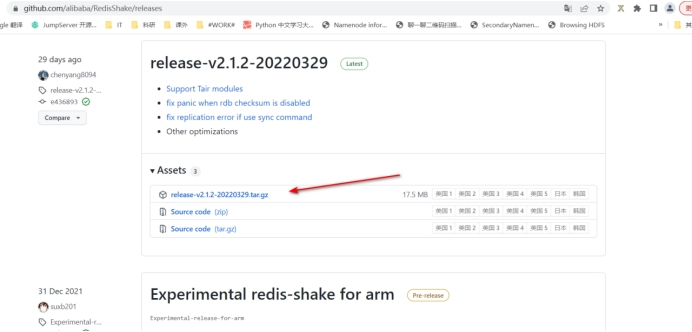
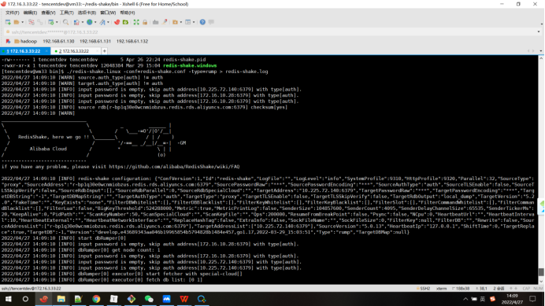
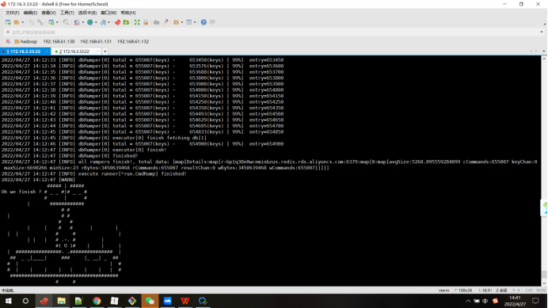
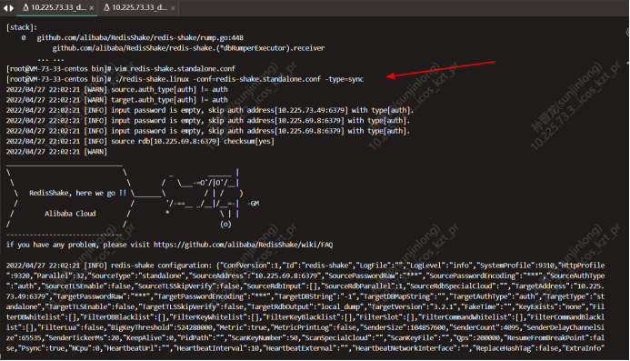
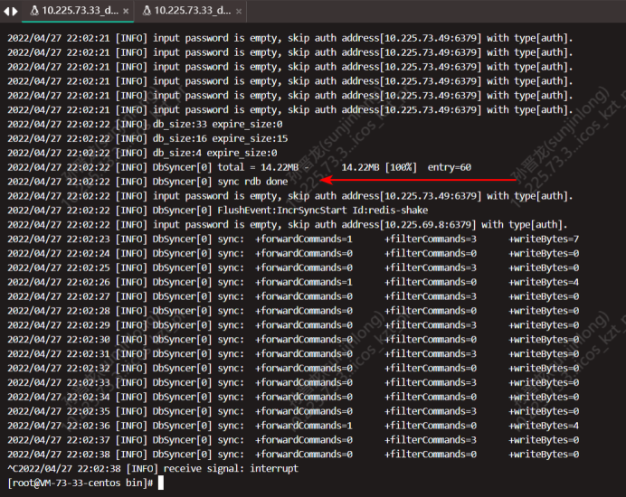

# 1. 目标

将源端`Redis`中的数据迁移到目标端，保证能迁移其中的状态性缓存数据（常驻内存的数据）。

- 源端`Redis`可以是**单机**、**主从**、**集群**模式的

- 目标端`Redis`可以是**单机**、**主从**、**集群**模式的。 

# 2. 方案

| 序号 | 方案                                                         | 可行性           | 描述                                                         |
| ---- | ------------------------------------------------------------ | ---------------- | ------------------------------------------------------------ |
| 1    | 阿里云`dts工具`对redis集群中的数据进行**全量+增量**迁移      | 集群不可行       | 阿里云dts不支持**阿里云redis集群->腾讯云redis集群**的全量迁移，云厂商一般不给开放redis集群的`psync/sync`权限，而dts正是基于此命令进行迁移。 |
| 2    | 腾讯云`dts工具`对redis集群中的数据进行**全量+增量**迁移      | 集群不可行       | 需要阿里云端redis集群开启psync/sync权限，阿里反馈不能开      |
| 3    | 阿里云控制台手动备份全量数据，然后`redis-shake`导入备份数据  | 理论可行，未验证 | 例子如果是8分片的redis集群，需要在阿里云控制台手动下载8个rdb文件，相对来说较麻烦。 |
| 4    | `redis-shake`使用`dump`模式导出数据，然后然后`redis-shake`导入备份数据 | 不可行           | 阿里云redis集群不支持`redis-shake`的`dump`（原理还是用的`sync`命令） |
| 5    | `redis-shake`使用`rump`模式直接进行全量迁移                  | 可行             | source.type=proxy </br> target.type=proxy                    |

*云厂商的dts工具参考其官网的dts文档，这里不过多介绍。*

**注：redis-shake支持`sync`, `restore`, `dump`, `decode`, `rump`这5种运行模式，经测试，阿里云redis集群 到 腾讯云redis集群的全量迁移不支持dump，支持rump模式。**

**sync、restore、decode模式还没有测试。**

# 3. 测试

## **3.1安装redis-shake**

[下载](https://github.com/alibaba/RedisShake/releases下载)redisShaeke的tar包：

https://github.com/alibaba/redis-shake/releases

 

选择地域为日本进行下载。

下载完成后，将`redis-shake`的tar上传到测试机，并使用如下命令解压。

```shell
[tencentdev@vm33 ~]tar -zxvf release-v2.1.2-20220329.tar.gzbin/redis-shake.confbin/redis-shake.darwinbin/redis-shake.linuxbin/redis-shake.windows
```

## 3.2 redis-shake迁移Redis集群

`redis-shake`使用文档(https://github.com/alibaba/RedisShake/wiki/第一次使用，如何进行配置？)

 进入`redis-shake`的bin目录，修改配置

```shell
cd bin/
cp redis-shake.conf redis-shake.conf.default
```

修改`redis-shake.conf`的对应内容如下：

```python
# the source address can be the following:
#   1. single db address. for "standalone" type.
#   2. ${sentinel_master_name}:${master or slave}@sentinel single/cluster address, e.g., mymaster:master@127.0.0.1:26379;127.0.0.1:26380, or @127.0.0.1:26379;127.0.0.1:26380. for "sentinel" type.
#   3. cluster that has several db nodes split by semicolon(;). for "cluster" type. e.g., 10.1.1.1:20331;10.1.1.2:20441.
#   4. proxy address(used in "rump" mode only). for "proxy" type.
# 源redis地址。对于sentinel或者开源cluster模式，输入格式为"master名字:拉取角色为master或者slave@sentinel的地址"，别的cluster
# 架构，比如codis, twemproxy, aliyun proxy等需要配置所有master或者slave的db地址。
# 源端 redis 的地址
#   1. standalone 模式配置 ip:port, 例如: 10.1.1.1:20331
#   2. cluster 模式需要配置所有 nodes 的 ip:port, 例如: source.address = 10.1.1.1:20331;10.1.1.2:20441
source.type = proxy
source.address = r-bp1q30e0wcnmiobzus.redis.rds.aliyuncs.com:6379
# 源端密码，留空表示无密码。源端免密 留空
source.password_raw =


# the type of target redis can be "standalone", "proxy" or "cluster".
#   1. "standalone": standalone db mode.
#   2. "sentinel": the redis address is read from sentinel.
#   3. "cluster": open source cluster (not supported currently).
#   4. "proxy": proxy layer ahead redis. Data will be inserted in a round-robin way if more than 1 proxy given.
# 目的redis的类型，支持standalone，sentinel，cluster和proxy四种模式。
target.type = proxy
target.address = 10.2.72.140:6379
# 目的端密码，留空表示无密码。目标端免密 留空
target.password_raw =
```

进入`redis-shake`的bin目录

```shell
./redis-shake.linux -conf=redis-shake.conf -type=rump
```

`redis-shake`运行截图如下所示：






迁移效率：

> 数据量：10G
>
> key数量：655007
>
> 迁移用时：217s

源端目标端的数据校验可以使用`redis-full-check`工具。

TODO

## 3.3 redis-shake迁移Redis单机/主从

`redis-shake`使用文档(https://github.com/alibaba/RedisShake/wiki/第一次使用，如何进行配置？)

 进入`redis-shake`的bin目录，修改配置

```shell
cd bin/
cp redis-shake.conf redis-shake.conf.default
```

修改`redis-shake.conf`的对应内容如下：

```python
# the source address can be the following:
#   1. single db address. for "standalone" type.
#   2. ${sentinel_master_name}:${master or slave}@sentinel single/cluster address, e.g., mymaster:master@127.0.0.1:26379;127.0.0.1:26380, or @127.0.0.1:26379;127.0.0.1:26380. for "sentinel" type.
#   3. cluster that has several db nodes split by semicolon(;). for "cluster" type. e.g., 10.1.1.1:20331;10.1.1.2:20441.
#   4. proxy address(used in "rump" mode only). for "proxy" type.
# 源redis地址。对于sentinel或者开源cluster模式，输入格式为"master名字:拉取角色为master或者slave@sentinel的地址"，别的cluster
# 架构，比如codis, twemproxy, aliyun proxy等需要配置所有master或者slave的db地址。
# 源端 redis 的地址
#   1. standalone 模式配置 ip:port, 例如: 10.1.1.1:20331
#   2. cluster 模式需要配置所有 nodes 的 ip:port, 例如: source.address = 10.1.1.1:20331;10.1.1.2:20441
source.type = standalone
source.address = 10.2.69.8:6379
# 源端密码，留空表示无密码。源端免密 留空
source.password_raw =


# the type of target redis can be "standalone", "proxy" or "cluster".
#   1. "standalone": standalone db mode.
#   2. "sentinel": the redis address is read from sentinel.
#   3. "cluster": open source cluster (not supported currently).
#   4. "proxy": proxy layer ahead redis. Data will be inserted in a round-robin way if more than 1 proxy given.
# 目的redis的类型，支持standalone，sentinel，cluster和proxy四种模式。
target.type = standalone
target.address = 10.2.73.49:6379
# 目的端密码，留空表示无密码。目标端免密 留空
target.password_raw =
```


进入`redis-shake`的bin目录

```shell
./redis-shake.linux -conf=redis-shake.conf -type=rump
```

`redis-shake`运行截图如下所示：



全量同步完成，进入增量同步。



迁移效率：

> 数据量：30.21M
>
> key数量：60
>
> 迁移用时；2s

源端目标端的数据校验可以使用`redis-full-check`工具。

TODO