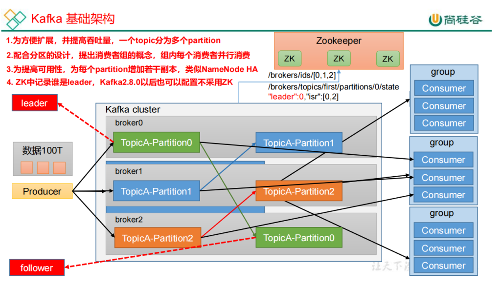

# 1. 概述

## 1.1 定义

## 1.2 消息队列

## 1.3 kafka基础架构



- **Producer**

  消息生产者，就是向kafka broker发送消息的客户端。

- **Consumer**

  消息消费者，就是向kafka broker获取消息的客户端。

- **Consumer Group（CG）**

  消费者组，由多个consumer构成。<font color="red">**消费者组内每个消费者负责消费同一个topic的不同分区的数据，一个分区只能由一个消费者组内的一个消费者消费；消费者组之间互不影响。**</font>所有消费者都属于某个消费者组，即消费者组是逻辑上的订阅者

- **Broker**

  一台kafka服务器就是一个broker。一个集群由多个broker组成，一个broker可以容纳多个topic。

- **Topic**

  可以理解为一个队列，生产者向topic中写消息，消费者从topic中读消息。

- **Partition**

  为了实现扩展性，能够将一个非常大的topic可以分布到多个broker上，<font color="red">**一个topic可以分为多个partition，每个partition是一个有序的队列。**</font>

- **Replica**

  副本。一个topic的每个partition都有若干个副本，一个<font color="red">Leader</font>和<font color="red">若干个Follower</font>。

- **Leader**

  **每个分区多个副本的"主"**，生产者发送数据的对象，以及消费者消费数据的对象都是Leader。即**生产者只会向Leader副本中写数据，消费者也只会从Leader副本中消费数据**。

  follower只是作为leader的数据备份而已，不产于实际的读写。

- **Follower**

  **每个分区多个副本中的"备"**，实时从leader中同步数据，保持和leader数据的同步。leader发生故障时，某个follower会成为新的leader。

# 2. 快速入门

## 2.1 部署

### 2.1.1 集群规划

### 2.1.2 集群部署

### 2.1.3 集群启停脚本

## 2.2 kafka命令行操作

### 2.2.1 topic操作

### 2.2.2 producer操作

### 2.2.3 consumer操作

## 3. Kafka生产者

TODO

# 4. Kafka Broker

TODO

# 5. Kafka消费者

TODO

# 6. Kafka-Edge监控

TODO

# 7. Kafka-kraft模式

TODO

# 8. Kafka集成

TODO

# 9. Kafka生产调优

TODO

# 10. Kafka源码解析

TODO

# Kafka常用命令

查看`kafka`版本

```shell
ps -ef|grep '/libs/kafka.\{2,40\}.jar'
```

前面的数字是`scala`版本，后面的数字是`kafka`版本