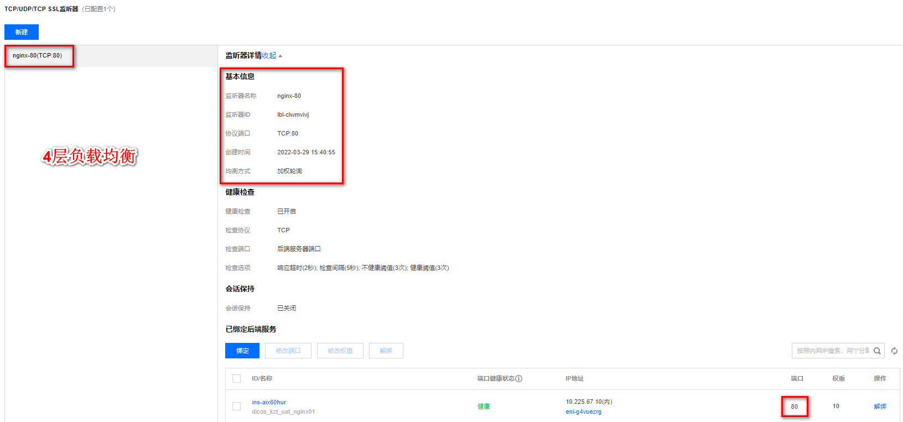

# 1. 介绍

## 1.1 haproxy概述

本节参考自[^1]：https://blog.csdn.net/yaya_12345678/article/details/88790235

一种高效、可靠、免费的高可用及负载均衡软件，非常适合于高负载站点的七层数据请求。客户端通过`Haproxy`代理服务器获得站点页面，而代理服务器收到客户请求后根据负载均衡的规则将请求数据转发给后端真实服务器

实现了一种`事件驱动`、`单一进程模型`，能支持非常大的并发连接数

同一客户端访问服务器，`Haproxy`保持会话的三种方案：
1) `Haproxy`将客户端ip进行`Hash`计算并保存，由此确保相同IP访问时被转发到同一真实服务器上。
2) `Haproxy`依靠真实服务器发送给客户端的`cookie`信息进行回话保持。
3) `Haproxy`保存真实服务器的`session`及服务器标识，实现会话保持功能

## 1.2 负载均衡的类型

本节参考自[^2]：https://blog.csdn.net/genglei1022/article/details/83374188

- **无负载均衡**

  没有负载均衡的简单Web应用程序环境可能如下所示：

  

  在此示例中，用户直接连接到您的Web服务器，在yourdomain.com上，并且没有负载均衡。如果您的单个Web服务器出现故障，用户将无法再访问您的Web服务器。此外，如果许多用户试图同时访问您的服务器并且无法处理负载，他们可能会遇到缓慢的体验，或者可能根本无法连接。

- **4层负载均衡**

  将网络流量负载均衡到多个服务器的最简单方法是使用**第4层（传输层）负载均衡**。以这种方式进行`负载均衡将根据IP范围和端口转发用户流量`（即，如果请求进入http://yourdomain.com/anything，则流量将转发到处理yourdomain.com的所有请求的后端。端口80）。

  

  用户访问负载均衡器，负载均衡器将用户的请求转发给后端服务器的Web后端组。无论选择哪个后端服务器，都将直接响应用户的请求。通常，Web后端中的所有服务器应该提供相同的内容 - 否则用户可能会收到不一致的内容。

  <font style="color:red">怎么理解`负载均衡将根据IP范围和端口转发用户流量`?</font>

  以腾讯云的clb（cloud load balance）为例，讲解**4层负载均衡**。

  

  从图中可知，**4层负载均衡监听的是协议+端口（如TCP:80），只要是访问此负载均衡器（如clb）的tcp协议的80端口就会转发到后端服务的某端口。**

- **7层负载均衡**

  **7层负载均衡**是更复杂的负载均衡网络流量的方法是使用**第7层（应用层）负载均衡**。使用第7层允许`负载均衡器根据用户请求的内容将请求转发到不同的后端服务器`。这种负载均衡模式允许您在同一域和端口下运行多个Web应用程序服务器。

  

  示例中，如果用户请求yourdomain.com/blog，则会将其转发到博客后端，后端是一组运行博客应用程序的服务器。其他请求被转发到web-backend，后端可能正在运行另一个应用程序。

  负载均衡设备在这种情况下，更类似于一个代理服务器。负载均衡和前端的客户端以及后端的服务器会分别建立 TCP 连接。
  所以从这个技术原理上来看，七层负载均衡明显地对负载均衡设备的要求更高，处理七层的能力也必然会低于四层模式的部署方式。

  <font style="color:red">怎么理解`负载均衡器根据用户请求的内容将请求转发到不同的后端服务器`?</font>

  以腾讯云的clb（cloud load balance）为例，讲解**7层负载均衡**。

  

  从图中可知，**7层负载均衡监听的是域名+协议+端口+内容（如HTTPS:443，根目录），只要是访问yourdomain.com/blog就会转发到后端服务的某端口，访问yourdomain.com/article又会将流量转发到另外的后端服务的某端口**


## 1.3 7层负载均衡与4层负载均衡的对比

7层负载均衡相较于4层负载均衡在更耗费性能的同时，也获得了更加智能的优点，由于在应用层进行识别，所以7层负载均衡可以基于不同的协议（如http、radius、dns等）进行负载，也可以根据应用层协议中有意义的内容来进行负载，如：除了根据IP加端口进行负载外，还可根据七层的URL、浏览器类别、语言来决定是否要进行负载均衡。

而4层负载均衡基本就是基于 IP + 端口进行负载均衡了。


# 2. 安装部署

本节参考自[^3]：[使用Haproxy代理rabbitmq集群，用keepalive保证haproxy高可用](https://www.jianshu.com/p/440b8e1d5339)

## 2.1 下载haproxy安装包

下载地址：https://www.haproxy.org/download/1.7/src/


上面是下载haproxy-1.7.x的示例，也可以回到https://www.haproxy.org/download选在其他版本的haproxy。

## 2.2 安装haproxy

安装gcc包

```shell
yum install -y gcc
```

上传tar包到服务器的指定目录

```shell
mkdir -p /opt/software && cd /opt/software
#上传
rz
```

解压haproxy的tar包

```shell
tar -zxvf haproxy-1.7.0.tar.gz
cd haproxy-1.7.0

sudo make TARGET=linux31 PREFIX=/usr/local/haproxy
sudo make install PREFIX=/usr/local/haproxy
cd /usr/local/haproxy
sudo vi haproxy-rabbitmq.cfg
```


# 3. 启停

```shell
# 检查配置文件语法
haproxy -c -f /etc/haproxy/haproxy.cfg

# 以daemon模式启动，以systemd管理的daemon模式启动
haproxy -D -f /etc/haproxy/haproxy.cfg [-p /var/run/haproxy.pid]
haproxy -Ds -f /etc/haproxy/haproxy.cfg [-p /var/run/haproxy.pid]

# 启动调试功能，将显示所有连接和处理信息在屏幕
haproxy -d -f /etc/haproxy/haproxy.cfg

# restart。需要使用st选项指定pid列表
haproxy -f /etc/haproxy.cfg [-p /var/run/haproxy.pid] -st `cat /var/run/haproxy.pid`

# graceful restart，即reload。需要使用sf选项指定pid列表
haproxy -f /etc/haproxy.cfg [-p /var/run/haproxy.pid] -sf `cat /var/run/haproxy.pid`

# 显示haproxy编译和启动信息
haproxy -vv
```


# 4. 配置

本节参考自[^2]：https://blog.csdn.net/genglei1022/article/details/83374188

`haproxy` 配置中分成五部分内容，分别如下：

`global`：  设置全局配置参数，属于进程的配置，通常是和操作系统相关。
`defaults`：配置默认参数，这些参数可以被用到frontend，backend，Listen组件；
`frontend`：接收请求的前端虚拟节点，Frontend可以更加规则直接指定具体使用后端的backend；
`backend`：后端服务集群的配置，是真实服务器，一个Backend对应一个或者多个实体服务器；
`Listen `：frontend和backend的组合体。

```shell
global   # 全局参数的设置
    log 127.0.0.1 local0 info
    # log语法：log <address_1>[max_level_1] # 全局的日志配置，使用log关键字，指定使用127.0.0.1上的syslog服务中的local0日志设备，记录日志等级为info的日志
    user haproxy
    group haproxy
    # 设置运行haproxy的用户和组，也可使用uid，gid关键字替代之
    daemon
    # 以守护进程的方式运行
    nbproc 16
    # 设置haproxy启动时的进程数，根据官方文档的解释，我将其理解为：该值的设置应该和服务器的CPU核心数一致，即常见的2颗8核心CPU的服务器，即共有16核心，则可以将其值设置为：<=16 ，创建多个进程数，可以减少每个进程的任务队列，但是过多的进程数也可能会导致进程的崩溃。这里我设置为16
    maxconn 4096
    # 定义每个haproxy进程的最大连接数 ，由于每个连接包括一个客户端和一个服务器端，所以单个进程的TCP会话最大数目将是该值的两倍。
    #ulimit -n 65536
    # 设置最大打开的文件描述符数，在1.4的官方文档中提示，该值会自动计算，所以不建议进行设置
    pidfile /var/run/haproxy.pid
    # 定义haproxy的pid 
defaults # 默认部分的定义
    mode http
    # mode语法：mode {http|tcp|health} 。http是七层模式，tcp是四层模式，health是健康检测，返回OK
    log 127.0.0.1 local3 err
    # 使用127.0.0.1上的syslog服务的local3设备记录错误信息
    retries 3
    # 定义连接后端服务器的失败重连次数，连接失败次数超过此值后将会将对应后端服务器标记为不可用
    option httplog
    # 启用日志记录HTTP请求，默认haproxy日志记录是不记录HTTP请求的，只记录“时间[Jan 5 13:23:46] 日志服务器[127.0.0.1] 实例名已经pid[haproxy[25218]] 信息[Proxy http_80_in stopped.]”，日志格式很简单。
    option redispatch
    # 当使用了cookie时，haproxy将会将其请求的后端服务器的serverID插入到cookie中，以保证会话的SESSION持久性；而此时，如果后端的服务器宕掉了，但是客户端的cookie是不会刷新的，如果设置此参数，将会将客户的请求强制定向到另外一个后端server上，以保证服务的正常。
    option abortonclose
    # 当服务器负载很高的时候，自动结束掉当前队列处理比较久的链接
    option dontlognull
    # 启用该项，日志中将不会记录空连接。所谓空连接就是在上游的负载均衡器或者监控系统为了探测该服务是否存活可用时，需要定期的连接或者获取某一固定的组件或页面，或者探测扫描端口是否在监听或开放等动作被称为空连接；官方文档中标注，如果该服务上游没有其他的负载均衡器的话，建议不要使用该参数，因为互联网上的恶意扫描或其他动作就不会被记录下来
    option httpclose
    # 这个参数我是这样理解的：使用该参数，每处理完一个request时，haproxy都会去检查http头中的Connection的值，如果该值不是close，haproxy将会将其删除，如果该值为空将会添加为：Connection: close。使每个客户端和服务器端在完成一次传输后都会主动关闭TCP连接。与该参数类似的另外一个参数是“option forceclose”，该参数的作用是强制关闭对外的服务通道，因为有的服务器端收到Connection: close时，也不会自动关闭TCP连接，如果客户端也不关闭，连接就会一直处于打开，直到超时。
    contimeout 5000
    # 设置成功连接到一台服务器的最长等待时间，默认单位是毫秒，新版本的haproxy使用timeout connect替代，该参数向后兼容
    clitimeout 3000
    # 设置连接客户端发送数据时的成功连接最长等待时间，默认单位是毫秒，新版本haproxy使用timeout client替代。该参数向后兼容
    srvtimeout 3000
    # 设置服务器端回应客户度数据发送的最长等待时间，默认单位是毫秒，新版本haproxy使用timeout server替代。该参数向后兼容
 
listen status # 定义一个名为status的部分
    bind 0.0.0.0:1080
    # 定义监听的套接字
    mode http
    # 定义为HTTP模式
    log global
    # 继承global中log的定义
    stats refresh 30s
    # stats是haproxy的一个统计页面的套接字，该参数设置统计页面的刷新间隔为30s
    stats uri /admin?stats
    # 设置统计页面的uri为/admin?stats
    stats realm Private lands
    # 设置统计页面认证时的提示内容
    stats auth admin:password
    # 设置统计页面认证的用户和密码，如果要设置多个，另起一行写入即可
    stats hide-version
    # 隐藏统计页面上的haproxy版本信息
 
frontend http_80_in # 定义一个名为http_80_in的前端部分
    bind 0.0.0.0:80
    # http_80_in定义前端部分监听的套接字
    mode http
    # 定义为HTTP模式
    log global
    # 继承global中log的定义
    option forwardfor
    # 启用X-Forwarded-For，在requests头部插入客户端IP发送给后端的server，使后端server获取到客户端的真实IP
    acl static_down nbsrv(static_server) lt 1
    # 定义一个名叫static_down的acl，当backend static_sever中存活机器数小于1时会被匹配到
    acl php_web url_reg /*.php$
    #acl php_web path_end .php
    # 定义一个名叫php_web的acl，当请求的url末尾是以.php结尾的，将会被匹配到，上面两种写法任选其一
    acl static_web url_reg /*.(css|jpg|png|jpeg|js|gif)$
    #acl static_web path_end .gif .png .jpg .css .js .jpeg
    # 定义一个名叫static_web的acl，当请求的url末尾是以.css、.jpg、.png、.jpeg、.js、.gif结尾的，将会被匹配到，上面两种写法任选其一
    use_backend php_server if static_down
    # 如果满足策略static_down时，就将请求交予backend php_server
    use_backend php_server if php_web
    # 如果满足策略php_web时，就将请求交予backend php_server
    use_backend static_server if static_web
    # 如果满足策略static_web时，就将请求交予backend static_server
 
backend php_server #定义一个名为php_server的后端部分
    mode http
    # 设置为http模式
    balance source
    # 设置haproxy的调度算法为源地址hash
    cookie SERVERID
    # 允许向cookie插入SERVERID，每台服务器的SERVERID可在下面使用cookie关键字定义
    option httpchk GET /test/index.php
    # 开启对后端服务器的健康检测，通过GET /test/index.php来判断后端服务器的健康情况
    server php_server_1 10.12.25.68:80 cookie 1 check inter 2000 rise 3 fall 3 weight 2
    server php_server_2 10.12.25.72:80 cookie 2 check inter 2000 rise 3 fall 3 weight 1
    server php_server_bak 10.12.25.79:80 cookie 3 check inter 1500 rise 3 fall 3 backup
    # server语法：server [:port] [param*] # 使用server关键字来设置后端服务器；为后端服务器所设置的内部名称[php_server_1]，该名称将会呈现在日志或警报中、后端服务器的IP地址，支持端口映射[10.12.25.68:80]、指定该服务器的SERVERID为1[cookie 1]、接受健康监测[check]、监测的间隔时长，单位毫秒[inter 2000]、监测正常多少次后被认为后端服务器是可用的[rise 3]、监测失败多少次后被认为后端服务器是不可用的[fall 3]、分发的权重[weight 2]、最后为备份用的后端服务器，当正常的服务器全部都宕机后，才会启用备份服务器[backup]
 
backend static_server
    mode http
    option httpchk GET /test/index.html
    server static_server_1 10.12.25.83:80 cookie 3 check inter 2000 rise 3 fall 3
```


# 5. 问题

本节参考自[^1]：https://blog.csdn.net/yaya_12345678/article/details/88790235

## 5.1 Nginx、LVS、Haproxy对比

| --   | Nginx（七层代理）                                            | LVS（四层代理）                                              | Haproxy（四层、七层）                                        |
| ---- | ------------------------------------------------------------ | ------------------------------------------------------------ | ------------------------------------------------------------ |
| 优势 | 1.跨平台性；<br>2.配置简单，容易上手；<br>3.非阻塞、高并发连接；<br>4.事件驱动：通信机制采用 epoll 模型，支持更大的并发连接Master/Worker 结构；<br>5.内存消耗小；6.内置的健康检查功能；<br>7.支持 GZIP 压缩；<br>8.稳定性高：用于反向代理，宕机的概率微乎其微；<br>9.会话保持：通过调度算法实现；<br>10.动静分离：基于location匹配正则； | 1.抗负载能力强，强大的四层代理，媲美F5硬件的四层代理；<br/>2.对内存和 cpu 资源消耗比较低；<br>3.配置性比较低；<br>4.工作稳定，自身有完整的双机热备方案如 LVS+Keepalived；<br>5.无流量，LVS 只分发请求，而流量并不从它本身出去，这点保证了均衡器 IO 的性能不会受到大流量的影响。<br>6.会话保持；<br> | 1.支持 Session 的保持，Cookie 的引导；同时支持通过获取指定的 url 来检测后端服务器的状态。<br>2.基于TCP协议的负载效率高于Nginx；<br>3.负载均衡策略非常多；<br>4.动静分离：支持acl规则匹配；<br>5.高效稳定；<br>6.节点健康检查：支持多种方式检测，如端口、url；<br> |
| 劣势 | 1.适用性低：仅能支 持http、https 和 Email 协议，这样就在适用范围上面小些；<br>2.对后端服务器的健康检查，只支持通过端口来检测，不支持通过 ur l来检测；<br>3.不支持 Session 的直接保持，但能通过 ip_hash 来解决；<br>4.不适用于高负载量的并发集群；<br> | 1.健康检查：无法检查后端节点的健康情况；<br>2.动静分离：不支持正则，无法区分请求；<br>3.实现比较麻烦；<br>4.网络环境依赖性较大；<br> | 1.扩展性差：添加新功能很费劲，对不断扩展的新业务，haproxy很难应对；<br>2.在四层代理时，仅支持tcp协议的代理；<br> |

**总结：**

> `大型网站架构`：对性能有严格要求的时候可以使用lvs或者硬件F5，单从负载均衡的角度来说，lvs也许会成为主流，更适合现在大型的互联网公司；
> `中型网站架构`：对于页面分离请求由明确规定，并且性能有严格要求时，可以使用haproxy
> `中小型网站架构`：比如日访问量小于1000万，需要进行高并发的网站或者对网络不太严格的时候，可以使用nginx

# 6. 参考文献

<div id="refer-anchor"></div>

[^1]: [Haproxy原理与配置讲解](https://blog.csdn.net/yaya_12345678/article/details/88790235)
[^2]:[HAProxy原理和基本概念](https://blog.csdn.net/genglei1022/article/details/83374188)
[^3]:[使用Haproxy代理rabbitmq集群，用keepalive保证haproxy高可用](https://www.jianshu.com/p/440b8e1d5339)
[^4]:[haproxy 配置文件说明和常用命令](https://www.jianshu.com/p/b5c0f5ec2968)
[^5]:[haproxy官网](https://www.haproxy.org/) 
[^6]:[haproxy-1.8下载地址](https://www.haproxy.org/download/1.8/src/haproxy-1.8.14.tar.gz)
[^7]:[haproxy-1.8文档](http://cbonte.github.io/haproxy-dconv/1.8/configuration.html)

