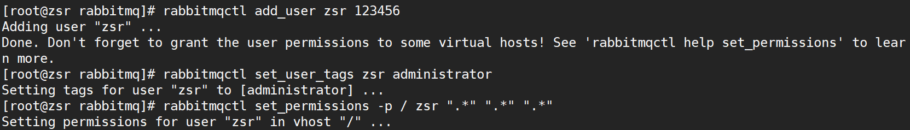

# 1. 介绍

参考自：https://blog.csdn.net/kavito/article/details/91403659

AMQP和JMS
MQ是消息通信的模型，并发具体实现。现在实现MQ的有两种主流方式：AMQP、JMS。

两者间的区别和联系：

JMS是定义了统一的接口，来对消息操作进行统一；AMQP是通过规定协议来统一数据交互的格式

JMS限定了必须使用Java语言；AMQP只是协议，不规定实现方式，因此是跨语言的。

JMS规定了两种消息模型；而AMQP的消息模型更加丰富

## 常见MQ产品

- ActiveMQ：基于JMS
- [RabbitMQ](https://so.csdn.net/so/search?q=RabbitMQ&spm=1001.2101.3001.7020)：基于AMQP协议，erlang语言开发，稳定性好
- RocketMQ：基于JMS，阿里巴巴产品，目前交由Apache基金会
- Kafka：分布式消息系统，高吞吐量

RabbitMQ是由erlang语言开发，基于AMQP（Advanced Message Queue 高级消息队列协议）协议实现的消息队列，它是一种应用程序之间的通信方法，消息队列在分布式系统开发中应用非常广泛。RabbitMQ官方地址：http://www.rabbitmq.com


# 2. 安装部署

本节参考自：[RabbitMQ超详细安装教程（Linux）](https://bareth.blog.csdn.net/article/details/116429302)

RabbitMQ由Erlang语言开发，需要安装与RabbitMQ版本对应的Erlang语言环境，具体的就不解释了，自行搜索教程。RabbitMQ官网下载地址：http://www.rabbitmq.com/download.html

## 2.1 下载RabbitMQ

**下载地址**：https://www.rabbitmq.com/download.html


选择对应的系统版本点击下载，下载后会得到`.rpm`文件


## 2.2 下载Erlang

> RabbitMQ是采用 Erlang语言开发的，所以系统环境必须提供 Erlang环境，需要是安装 Erlang


这里安装最新版本3.8.14的RabbitMQ，对应的Erlang版本推荐23.x，我们下载erlang-23.2.7-2.el7.x86_64.rpm

下载地址：https://packagecloud.io/rabbitmq/erlang/packages/el/7/erlang-23.2.7-2.el7.x86_64.rpm

## 2.3 安装Erlang


其中的`el7`表示Red Hat 7.x，即`CentOS 7.x`

点击右上角下载即可得到`.rpm`文件


首先将下载好的文件上传到服务器，创建一个文件夹用来存放文件

```shell
[root@zsr ~]# mkdir -p /usr/rabbitmq
```

再利用`xftp`工具将上述下载的两个`.rpm`文件上传到服务器的刚创建的文件夹中


然后切换到`/usr/rabbitmq`目录，解压安装`erlang`

```shell
# 解压
rpm -Uvh erlang-23.2.7-2.el7.x86_64.rpm

# 安装
yum install -y erlang
```


安装完成后输入如下指令查看版本号

```shell
erl -v
```


### 

## 2.4 安装RabbitMQ

在`RabiitMQ`安装过程中需要依赖`socat`插件，首先安装该插件

```shell
yum install -y socat
```


然后解压安装RabbitMQ的安装包

**解压**

```shell
rpm -Uvh rabbitmq-server-3.8.14-1.el7.noarch.rpm
```

**安装**

```shell
yum install -y rabbitmq-server
```

## 2.5 启动RabbitMQ服务

```shell
# 启动rabbitmq
systemctl start rabbitmq-server

# 查看rabbitmq状态
systemctl status rabbitmq-server
```

显示`active`则表示服务安装并启动成功


```shell
# 设置rabbitmq服务开机自启动
systemctl enable rabbitmq-server

# 关闭rabbitmq服务
systemctl stop rabbitmq-server

# 重启rabbitmq服务
systemctl restart rabbitmq-server
```


# 3. 常用命令

```shell
# 设置rabbitmq服务开机自启动
systemctl enable rabbitmq-server

# 关闭rabbitmq服务
systemctl stop rabbitmq-server

# 重启rabbitmq服务
systemctl restart rabbitmq-server


#rabbitmq的管理webui 
http://172.16.3.30:15672
默认账号/密码：guest/guest
rabbitmq集群间通信接口25672（=5672+200000）
rabbitmq提供给生产者/消费者的端口5672

#查看rabbitmq集群详情
rabbitmqctl cluster_status
#查看用户
rabbitmqctl list_users


rabbitmq-server -detached 后台启动
```


## 3.1 安装启动RabbitMQWeb管理界面

> 默认情况下，rabbitmq没有安装web端的客户端软件，需要安装才可以生效

```shell
# 打开RabbitMQWeb管理界面插件
rabbitmq-plugins enable rabbitmq_management
```


然后我们打开浏览器，访问`服务器公网ip:15672`（注意打开阿里云安全组以及防火墙的15672端口），就可以看到管理界面


`rabbitmq`有一个默认的账号密码`guest`，但该情况仅限于本机localhost进行访问，所以需要添加一个远程登录的用户

## 3.2 添加远程用户

```shell
# 添加用户
rabbitmqctl add_user 用户名 密码

# 设置用户角色,分配操作权限
rabbitmqctl set_user_tags 用户名 角色

# 为用户添加资源权限(授予访问虚拟机根节点的所有权限)
rabbitmqctl set_permissions -p / 用户名 ".*" ".*" ".*"
```

角色有四种：

`administrator`：可以登录控制台、查看所有信息、并对`rabbitmq`进行管理
`monToring`：监控者；登录控制台，查看所有信息
`policymaker`：策略制定者；登录控制台指定策略
`managment`：普通管理员；登录控制
这里创建用户zsr，密码123456，设置`adminstator`角色，赋予所有权限


创建完成后，访问`服务器公网ip:15672`进行登录，然后便可进入到后台


查看rabbitMQ版本：

```shell
rabbitmqctl status
```


其他指令：

```shell
# 修改密码
rabbitmqctl change_ password 用户名 新密码

# 删除用户
rabbitmqctl delete_user 用户名

# 查看用户清单
rabbitmqctl list_users
```

# 4. 配置

TODO

# 5. RabbitMQ的工作原理

下图是RabbitMQ的基本结构：


组成部分说明：

Broker：消息队列服务进程，此进程包括两个部分：Exchange和Queue
Exchange：消息队列交换机，按一定的规则将消息路由转发到某个队列，对消息进行过虑。
Queue：消息队列，存储消息的队列，消息到达队列并转发给指定的
Producer：消息生产者，即生产方客户端，生产方客户端将消息发送
Consumer：消息消费者，即消费方客户端，接收MQ转发的消息。
生产者发送消息流程：

1、生产者和Broker建立TCP连接。

2、生产者和Broker建立通道。

3、生产者通过通道消息发送给Broker，由Exchange将消息进行转发。

4、Exchange将消息转发到指定的Queue（队列）

消费者接收消息流程：

1、消费者和Broker建立TCP连接

2、消费者和Broker建立通道

3、消费者监听指定的Queue（队列）

4、当有消息到达Queue时Broker默认将消息推送给消费者。

5、消费者接收到消息。

6、ack回复

## 5.1 消息确认机制（ACK）

那么问题来了：RabbitMQ怎么知道消息被接收/消费了呢？

如果消费者领取消息后，还没执行操作就挂掉了呢？或者抛出了异常？消息消费失败，但是RabbitMQ无从得知，这样消息就丢失了！

因此，RabbitMQ有一个ACK机制。当消费者获取消息后，会向RabbitMQ发送回执ACK，告知消息已经被接收。不过这种回执ACK分两种情况：

- `自动ACK`：消息一旦被接收，消费者自动发送ACK
- `手动ACK`：消息接收后，不会发送ACK，需要手动调用

大家觉得哪种更好呢？

这需要看消息的重要性：

如果消息不太重要，丢失也没有影响，那么自动ACK会比较方便

如果消息非常重要，不容丢失。那么最好在消费完成后手动ACK，否则接收消息后就自动ACK，RabbitMQ就会把消息从队列中删除。如果此时消费者宕机，那么消息就丢失了。


### 5.2 六种消费模型

- 基本消息模型

  

  在上图的模型中，有以下概念：

  - P：生产者，也就是要发送消息的程序
  - C：消费者：消息的接受者，会一直等待消息到来。
  - queue：消息队列，图中红色部分。可以缓存消息；生产者向其中投递消息，消费者从其中取出消息。 

- work消息模型

  工作队列或者**竞争消费者**模式

  

  

  work queues与入门程序相比，多了一个消费端，两个消费端共同消费同一个队列中的消息，但是一个消息只能被一个消费者获取。

  这个消息模型在Web应用程序中特别有用，可以处理短的HTTP请求窗口中无法处理复杂的任务。

  接下来我们来模拟这个流程：

  P：生产者：任务的发布者

  C1：消费者1：领取任务并且完成任务，假设完成速度较慢（模拟耗时）

  C2：消费者2：领取任务并且完成任务，假设完成速度较快
  
- **Publish/subscribe（交换机类型：**Fanout，也称为广播 **）**

  Publish/subscribe模型示意图 ：

  

  生产者

  和前面两种模式不同：

  - 1） 声明Exchange，不再声明Queue
  - 2） 发送消息到Exchange，不再发送到Queue

- Routing 路由模型（交换机类型：direct）

  Routing模型示意图：

  

  P：生产者，向Exchange发送消息，发送消息时，会指定一个routing key。

  X：Exchange（交换机），接收生产者的消息，然后把消息递交给 与routing key完全匹配的队列

  C1：消费者，其所在队列指定了需要routing key 为 error 的消息

  C2：消费者，其所在队列指定了需要routing key 为 info、error、warning 的消息
  
- Topics 通配符模式（交换机类型：topics）

  Topics模型示意图：

  

   每个消费者监听自己的队列，并且设置带统配符的routingkey,生产者将消息发给broker，由交换机根据routingkey来转发消息到指定的队列。

  Routingkey一般都是有一个或者多个单词组成，多个单词之间以“.”分割，例如：inform.sms

  通配符规则：

  #：匹配一个或多个词

  *：匹配不多不少恰好1个词

- RPC

  RPC模型示意图：

  

  基本概念：

  Callback queue 回调队列，客户端向服务器发送请求，服务器端处理请求后，将其处理结果保存在一个存储体中。而客户端为了获得处理结果，那么客户在向服务器发送请求时，同时发送一个回调队列地址reply_to。

  Correlation id 关联标识，客户端可能会发送多个请求给服务器，当服务器处理完后，客户端无法辨别在回调队列中的响应具体和那个请求时对应的。为了处理这种情况，客户端在发送每个请求时，同时会附带一个独有correlation_id属性，这样客户端在回调队列中根据correlation_id字段的值就可以分辨此响应属于哪个请求。

  流程说明：

  当客户端启动的时候，它创建一个匿名独享的回调队列。
  在 RPC 请求中，客户端发送带有两个属性的消息：一个是设置回调队列的 reply_to 属性，另一个是设置唯一值的 correlation_id 属性。
  将请求发送到一个 rpc_queue 队列中。
  服务器等待请求发送到这个队列中来。当请求出现的时候，它执行他的工作并且将带有执行结果的消息发送给 reply_to 字段指定的队列。
  客户端等待回调队列里的数据。当有消息出现的时候，它会检查 correlation_id 属性。如果此属性的值与请求匹配，将它返回给应用

# 6. 问题

### rabbitmq一个节点无法加入集群的排查-（inconsistent_cluster）

参考自：

[rabbitmq一个节点无法加入集群的排查-（inconsistent_cluster）](http://wjhsh.net/360linux-p-13062109.html)

[RabbitMQ集群重启报错](https://blog.51cto.com/u_11676712/2461336)

**问题描述：**

客户侧反馈某个rabbitMQ集群无法访问了，查看发现有个节点无法启动rabbitMQ了，查看rabbitMQ日志` /var/log/rabbitmq/rabbit@VM-73-21-centos.log`报错如下：

```shell
{error,{inconsistent_cluster,"Node 'rabbit@VM-73-21-centos' thinks it's clustered with node 'rabbit@VM-74-6-centos', but 'rabbit@VM-74-6-centos' disagrees"}}
```


**问题原因：**

> 从VM-73-21-centos的启动报错来看，像是集群信息残留。在VM-74-6-centos上操作将VM-73-21-centos移除集群，VM-73-21-centos的rabbitmq服务已经down掉了，所以数据库无法同步更新，记载的仍是旧的集群信息(数据库记录里自身节点仍属于集群)，而VM-74-6-centos的数据库记录已经更新(数据库信息里面集群不包含VM-73-21-centos节点了)。

**解决方案：**

> a、停止VM-73-21-centos上的rabbitMQ
>
> ```shell
> rabbitmqctl stop
> rabbitmqctl stop_app
> #或
> systemctl stop rabbitmq-server
> ```
>
> b、删除VM-73-21-centos的数据库记录。
>
> ```shell
> mv /var/lib/rabbitmq/mnesia/* /tmp/
> ```
>
> c、重启VM-73-21-centos上的rabbitMQ
>
> ```shell
> systemctl start rabbitmq-server
> ```
>
> 此时，通过`rabbitmqctl cluster-status`查看发现VM-73-21-centos是自己在一个单独的rabbitMQ集群中。
>
> d、在VM-73-21-centos上，重新加入VM-74-6-centos的rabbitMQ集群
>
> ```shell
> rabbitmqctl join_cluster rabbit@VM-74-6-centos
> ```
>
> e、通过`rabbitmqctl cluster-status`验证，VM-73-21-centos是否成功加入VM-74-6-centos的rabbitMQ集群
>
> ```shell
> rabbitmqctl cluster_status
> ```

# 7. 参考文献

[^1]:[rabbitmq一个节点无法加入集群的排查-（inconsistent_cluster）](http://wjhsh.net/360linux-p-13062109.html)
[^2]:[现有rabbitmq集群添加新节点，移除旧节点(可以作为rabbitmq集群迁移使用) ](https://blog.51cto.com/u_15329153/4994240)