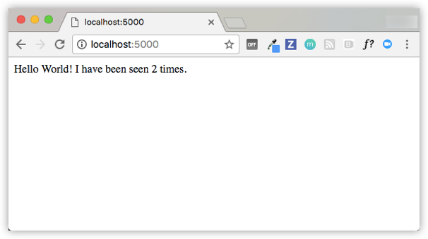
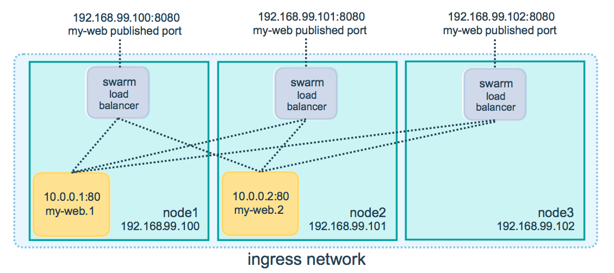
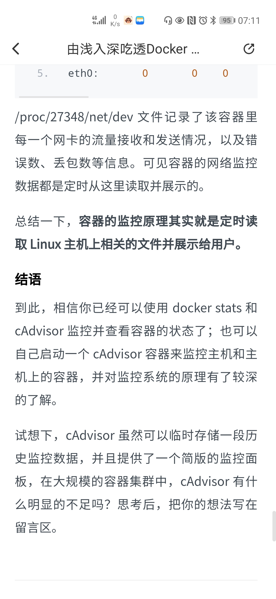
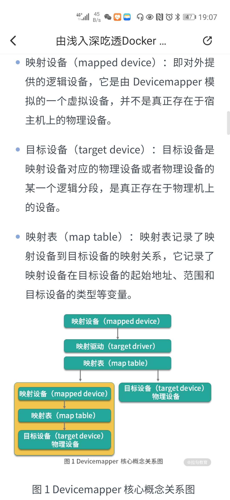

# 1. Docker


## 1.1 Docker安装

参考官网[Install Docker Engine](https://docs.docker.com/engine/install/)。注意，要修改仓库源为国内的镜像，否则，下载/上传都很慢。

主要是安装3个东西：docker-ce, docker-cli, containerd.io

以在CentoOS上安装Docker为例，进行介绍。

#### 先决条件

要安装Docker Engine需要CentOS版本为7或8，不支持测试或已归档的版本。

`centos-extras`仓库必须是启用状态。默认是启用的，如果你禁用了它，则必须先启用在安装Docker Engine。

#### 卸载旧版Docker

旧版的Docker通常被叫做`docker`或`docker-engine`，要先卸载旧版docker及其依赖。

```sh
$ sudo yum remove docker \
                  docker-client \
                  docker-client-latest \
                  docker-common \
                  docker-latest \
                  docker-latest-logrotate \
                  docker-logrotate \
                  docker-engine
```

在`/var/lib/docker/`目录中，包含了以前保留的images，containers，volumes，networks。新版的Docker Engine包名为`docker-ce`。

#### 安装方法

**使用仓库(repository)进行安装**

在一个新主机上第一次安装Docker之前，需要先设置Docker仓库。

*设置仓库*

安装`yum-utils`软件包（提供yum-config-manager实用程序）并设置稳定的仓库

```sh
$ sudo yum intall -y yum-utils
$ sudo yum-config-manager \
  --add-repo \
  https://download.docker.com/linux/centos/docker-ce.repo
  
# 使用国内的docker yum源
sudo yum-config-manager --add-repo http://mirrors.aliyun.com/docker-ce/linux/centos/docker-ce.repo
```

~~国内需要使用国内的镜像仓库，而不应该使用官方的镜像仓库。~~上面这个加的一个名为docker-ce.repo的yum源。而不是国内镜像加速。

[Docker国内Yum源和国内镜像仓库](https://blog.csdn.net/nklinsirui/article/details/80490537)

"http://hub-mirror.c.163.com"

"https://registry.docker-cn.com"

像nightly、test版也都包含在docker-ce.repo中了，但是并没有启用，使用如下命令可以启用或禁用这些仓库源

```sh
$ sudo yum-config-manager --enable docker-ce-nightly
$ sudo yum-config-manager --enable docker-ce-test
$ sudo yum-config-manager --disable docker-ce-nightly
$ sudo yum-config-manager --disable docker-ce-test
```

*安装Docker Engine*

1. 安装最新的稳定版的Docker Engine，containerd。Docker Engine是C/S架构的，它包括：Docker client，Docker daemon（作为server端）和REST API接口。

   ```sh
   $ sudo yum install docker-ce docker-ce-cli containerd.io
   ```

   此时，Docker已安装但为启用。`docker`组已经被创建了，但是该组中并没有任何用户。

2. 安装指定版本的Docker Engine，列出在仓库源中可用的版本，然后选择想要进行安装：

   - 列出并排序仓库源中可用的版本，下面的例子根据版本号进行排序，从高到低，部分输出结果如下

     ```sh
     $ yum list docker-ce --showduplicates | sort -r
     
     docker-ce.x86_64  3:18.09.1-3.el7                     docker-ce-stable
     docker-ce.x86_64  3:18.09.0-3.el7                     docker-ce-stable
     docker-ce.x86_64  18.06.1.ce-3.el7                    docker-ce-stable
     docker-ce.x86_64  18.06.0.ce-3.el7                    docker-ce-stable
     ```

   - 通过完整的软件包名进行安装。如docker-ce-18.09.1

     ```sh
     $ sudo yum install docker-ce-<VERSION_STRING> docker-ce-cli-<VERSION_STRING> containerd.io
     ```

     此时，Docker已安装但为启用。`docker`组已经被创建了，但是该组中并没有任何用户。

   - 启动Docker

     ```sh
     $ sudo systemctl start docker
     ```

   - 通过运行`hello-world`image来验证Docker Engine已经正确安装了。

     ```sh
     $ sudo  docker run hello-world
     ```

   目前非root用户需要使用sudo才能使用Docker，需要进行配置才能让非root用户使用docker。见[post-installation step for Linux](https://docs.docker.com/engine/install/linux-postinstall/)

   Docker daemon绑定到一个Unix套接字而不是TCP端口。默认地，这个Unix套接字的所有者是root用户，其他用户要访问，必须使用sudo前缀。通过创建`docker`用户组和向其中添加用户让非root用户也可直接访问该Unix套接字。

   1. 创建`docker`用户组
   
      ```sh
      $ sudo groupadd docker
      ```
   
   2. 将当前用户添加到`docker`用户组中
   
      ```sh
      $ sudo usermod -aG docker $USER
      ```
   
   3. 注销并重新登录，以便更新`docker`组的成员。在Linux中，你也可以使用如下命令来激活对`docker`用户组的改变
   
      ```sh
      $ newgrp docker
      ```
   
   4. 验证是否不用sudo就能运行docker命令了
   
      ```sh
      $ docker run hello-world
      ```
   
   **配置**Docker开机启动
   
   大多数Linux发行版（RHEL, CentOS，Fedora，Ubuntu16.04及以上）都使用`systemd`来管理那些在系统启动时需要启动的服务。Ubuntu 14.10及更低版本 仍然使用`upstart`来管理。
   
   ```sh
   # systemd
   $ sudo systemctl enable docker
   $ sudo systemctl disable docker
   
   # upstart,Docker被自动配置为在系统启动时使用upstart启动Docker，如下命令禁用此行为。
   $ echo manual | sudo tee /etc/init/docker.override
   
   # chkconfig
   $ sudo chkconfig docker on
   ```
   
   **使用阿里云的镜像加速器**
   
   https://cr.console.aliyun.com/
   
   示例如下：
   
   ```sh
   sudo mkdir -p /etc/docker
   sudo tee /etc/docker/daemon.json <<-'EOF'
   {
     "registry-mirrors": ["https://xxx.mirror.aliyuncs.com"]
   }
   EOF
   sudo systemctl daemon-reload
   sudo systemctl restart docker
   
   ```
   
   **添加其他仓库镜像**
   
   和使用阿里云镜像加速器类似，基本的步骤就是修改`/etc/docker/daemon.json` 来添加仓库镜像。
   示例：
   
   ```json
   {
     "registry-mirrors": ["https://xxx.mirror.aliyuncs.com"],
     "insecure-registries": ["192.168.37.170"]
   }
   1234
   
   # 国内加速站点
   https://registry.docker-cn.com
   http://hub-mirror.c.163.com
   https://3laho3y3.mirror.aliyuncs.com
   http://f1361db2.m.daocloud.io
   https://mirror.ccs.tencentyun.com
    
   ```
   
   再运行下面命令让docker重新加载daemon.json，并重启docker。
   
   ```
   systemctl daemon-reload
   systemctl restart docker
   ```

**使用软件包安装**

如果你不能使用Docker仓库来安装Docker，那么你可以下载Docker的`.rpm`软件包并手动安装。

1. 去这个网址 https://download.docker.com/linux/centos/ 进入到你的CentOS版本对应的目录，进入`x86_64/stable/Packages/`目录，下载所需版本的`.rpm`软件包。

2. 安装Docker Engine

   ```sh
   $ sudo yum install /path/to/package.rpm
   ```

   此时，Docker已安装但为启用。`docker`组已经被创建了，但是该组中并没有任何用户。

3. 启动Docker

   ```sh
   $ sudo systemctl start docker
   ```

   

4. 通过运行hello-world image来验证是否正确安装了Docker Engine

   ```sh
   $ sudo docker run hello-world
   ```

   

**使用脚本安装**

Docker在`get.docker.com`和`test.docker.com`上提供了便利脚本，用于将Docker Engine-Community的边缘版本和测试版本快速且非交互地安装到开发环境中。 脚本的源代码位于`docker-install`存储库中。 不建议在生产环境中使用这些脚本。

```sh
$ curl -fsSL https://get.docker.com -o get-docker.sh
$ sudo sh get-docker.sh

<output truncated>
```

以非root用户方式使用Docker

```sh
$ sudo usermod -aG docker your-user
```

记得，注销并重新登录，以使得新加入的用户生效。

#### 卸载Docker Engine

1. 卸载 Docker Engine, Docker CLI, Containerd。

   ```sh
   $ sudo yum remove docker-ce docker-ce-cli containerd.io
   ```

2. 在你的主机上的Docker 的 images, containers, volumes 以及一些自定义的配置文件，这些不会自动被删除。如果眼删除所有的images，containers，volumes，使用如下命令

   ```sh
   $ sudo rm -rf /var/lib/docker
   ```

   然后，手动删除你自定义的那些配置文件。

## 1.2 Docker常用术语介绍

| 术语                                                         | 描述                                                         |
| :----------------------------------------------------------- | :----------------------------------------------------------- |
| [amd64](https://docs.docker.com/glossary/#amd64)             | AMD64是AMD对Intel x86体系结构的64位扩展，也称为x86_64（或x86-64）。 |
| [aufs](https://docs.docker.com/glossary/#aufs)               | aufs（高级多层统一文件系统）是Docker支持的Linux [文件系统](https://docs.docker.com/glossary/#filesystem)。 它为Linux文件系统实现了[union mount](http://en.wikipedia.org/wiki/Union_mount)。 |
| [base image](https://docs.docker.com/glossary/#base-image)   | 它是使用带有FROM scratch指令的Dockerfile创建的。             |
| [btrfs](https://docs.docker.com/glossary/#btrfs)             | btrfs（B树文件系统）是Docker支持的Linux [文件系统](https://docs.docker.com/glossary/#filesystem)。 它是[copy-on-write](http://en.wikipedia.org/wiki/Copy-on-write)文件系统。 |
| [build](https://docs.docker.com/glossary/#build)             | build是使用[Dockerfile](https://docs.docker.com/glossary/#dockerfile)构建Docker image的过程。 该构建使用Dockerfile和context(上下文)。 上下文是构建image的目录中的文件集。 |
| [cgroups](https://docs.docker.com/glossary/#cgroups)         | cgroups是一种Linux内核功能，可限制，说明和隔离进程集合的资源使用情况（CPU，内存，磁盘I/O，网络等）。Docker依靠cgroup来控制和隔离资源限制。*也称为：控制组* |
| [cluster](https://docs.docker.com/glossary/#cluster)         | cluster是一组机器，它们一起工作以运行工作负载并提供高可用性。 |
| [Compose](https://docs.docker.com/glossary/#compose)         | [Compose](https://github.com/docker/compose)是用于使用Docker定义和运行复杂应用程序的工具。 使用Compose，您可以在一个文件中定义一个多容器应用程序，然后使用一个命令启动应用程序，该命令完成运行该程序所需的一切。 |
| [copy-on-write](https://docs.docker.com/glossary/#copy-on-write) | Docker为image和容器使用了[copy-on-write](https://docs.docker.com/engine/userguide/storagedriver/imagesandcontainers/#/the-copy-on-write-strategy)技术和[联合文件系统]( https://docs.docker.com/glossary/#union_file_system)，以优化资源并提高性能。实体的多个副本共享同一个实例，每个实例仅对其唯一层进行特定更改。<br>多个容器可以共享对同一image的访问，并在可写层上进行特定于容器的更改，该可写层在删除容器后即被删除。 |
| [container](https://docs.docker.com/glossary/#container)     | 容器是[docker image](https://docs.docker.com/glossary/#image)的运行时实例。Docker容器包含：<br>1. 一个Docker image<br>2. 一个执行环境<br>3. 一个标准指令集 |
| [Docker](https://docs.docker.com/glossary/#docker)           | 术语Docker可以指整个Docker项目，它是供开发人员和系统管理员开发，交付和运行应用程序的平台Docker守护进程在托管image和容器的主机上运行（也称为Docker Engine） |
| [Docker Desktop for Mac](https://docs.docker.com/glossary/#docker-desktop-for-mac) | [适用于Mac的Docker桌面](https://docs.docker.com/docker-for-mac/)是易于安装的轻型Docker开发环境，专门为Mac设计。 Docker Desktop for Mac是本机Mac应用程序，它使用macOS Hypervisor框架，网络和文件系统。 如果要在Mac上构建，调试，测试，打包和交付Dockerized应用程序，这是最佳解决方案。 |
| [Docker Desktop for Windows](https://docs.docker.com/glossary/#docker-desktop-for-windows) | [适用于Windows的Docker桌面](https://docs.docker.com/docker-for-windows/)是易于安装的轻型Docker开发环境，专门为支持Microsoft Hyper-V的Windows 10系统而设计（专业 ，企业和教育）。 Windows的Docker桌面使用Hyper-V进行虚拟化，并作为本机Windows应用程序运行。 它与Windows Server 2016一起使用，使您能够设置和运行Windows容器以及标准Linux容器，并且可以在两个容器之间进行切换。 如果要从Windows计算机构建，调试，测试，打包和交付Dockerized应用程序，则Docker for Windows是最佳解决方案。 |
| [Docker Hub](https://docs.docker.com/glossary/#docker-hub)   | [Docker Hub](https://hub.docker.com/)是用于处理Docker及其组件的集中资源。 它提供以下服务：<br>1. Docker image托管<br>2. 用户身份验证<br>3. 自动化的image构建和工作流程工具<br>4. 与GitHub和Bitbucket集成<br>我的理解，Github是存储和分发代码的，Docker Hub是存储和分发镜像的。 |
| [Dockerfile](https://docs.docker.com/glossary/#dockerfile)   | Dockerfile是一个文本文档，其中包含手动构建Docker image所要执行的所有命令。 Docker可以通过读取Dockerfile中的指令来自动构建image。 |
| [ENTRYPOINT](https://docs.docker.com/glossary/#entrypoint)   | 在Dockerfile中，`ENTRYPOINT`是要运行的命令的第一部分的可选定义。如果您想在不指定docker run命令附加参数的情况下运行Dockerfile，则必须指定ENTRYPOINT，CMD或两者，如果指定了ENTRYPOINT，则将其设置为单个命令。大多数官方Docker镜像的`ENTRYPOINT`是`/bin/sh`或`/bin/bash`。即使您未指定`ENTRYPOINT`，也可以使用Dockerfile中的`FROM`关键字从您指定的基本image继承它。要在运行时覆盖`ENTRYPOINT`，可以使用`--entrypoint`。 |
| [filesystem](https://docs.docker.com/glossary/#filesystem)   | 文件系统是操作系统用来命名文件并为其分配位置以进行有效存储和检索的方法。示例：<br>1. Linux：ext4，aufs，btrfs，zfs<br>2. Windows：NTFS<br>3. macOS：HFS + |
| [image](https://docs.docker.com/glossary/#image)             | Docker image是[容器](https://docs.docker.com/glossary/#container)的基础。 image是根文件系统更改和容器运行时中使用的相应执行参数的有序集合。 image通常包含一个堆叠在一起的分层文件系统的并集。 image没有状态，并且永远不会改变。 |
| [layer](https://docs.docker.com/glossary/#layer)             | 在image中，layer是对image的修改，由Dockerfile中的指令表示。 将layer按顺序应用于基本image以创建最终image。 当更新或重建image时，仅需要更新要更改的layer，而未更改的layer将在本地缓存。 这就是Docker image如此快速且轻巧的原因之一。 每层的大小加起来等于最终image的大小。 |
| [libcontainer](https://docs.docker.com/glossary/#libcontainer) | libcontainer提供了Go实现，用于创建具有命名空间，cgroup，capabilities和文件系统访问控制的容器。 在创建容器后，它使您可以管理执行其他操作的生命周期。 |
| [libnetwork](https://docs.docker.com/glossary/#libnetwork)   | libnetwork提供了Go实现，用于创建和管理容器网络命名空间和其他网络资源。 创建容器后，它管理容器执行附加操作的网络生命周期，。 |
| [link](https://docs.docker.com/glossary/#link)               | link提供了旧式接口(**link是单向的，其实就是在/etc/hosts文件中加了一条解析记录！**)，可将在同一主机上运行的Docker容器彼此连接，而不会暴露主机的网络端口。 现在通常改用Docker网络功能。 |
| [Machine](https://docs.docker.com/glossary/#machine)         | [Machine](https://github.com/docker/machine)是一个Docker工具，它非常容易在您的计算机，云提供商和您自己的数据中心内创建Docker主机。 它创建服务器，在其上安装Docker，然后配置Docker客户端与之通信。也称为：*docker-machine* |
| [namespace](https://docs.docker.com/glossary/#namespace)     | [Linux命名空间](http://man7.org/linux/man-pages/man7/namespaces.7.html)是一种Linux内核功能，用于隔离和虚拟化系统资源。 进程只能与属于相同命名空间的资源或进程进行交互。 命名空间是Docker隔离模型的重要组成部分。 每种资源类型都有命名空间，包括“ net”（网络），“ mnt”（存储），“ pid”（进程），“ uts”（主机名控件）和“ user”（UID映射）。 |
| [node](https://docs.docker.com/glossary/#node)               | [node](https://docs.docker.com/engine/swarm/how-swarm-mode-works/nodes/)是在`swarm模式`下运行Docker Engine实例的物理机或虚拟机。**管理器节点(manager)**执行集群管理和编排职责。 默认情况下，管理器节点也是工作程序节点。**工作程序节点(worker)**执行任务。 |
| [overlay network driver](https://docs.docker.com/glossary/#overlay-network-driver) | overlay网络驱动程序为集群中的Docker容器提供了开箱即用的多主机网络连接。 |
| [overlay storage driver](https://docs.docker.com/glossary/#overlay-storage-driver) | OverlayFS是Linux的[文件系统](https://docs.docker.com/glossary/#filesystem)服务，该服务为其他文件实现了[联盟挂载](http://en.wikipedia.org/wiki/Union_mount)系统。 Docker守护程序支持它作为存储驱动程序。 |
| [parent image](https://docs.docker.com/glossary/#parent-image) | image的“parent image”是image的Dockerfile中的“ FROM”指令中指定的image。 所有后续命令均基于该父image。 带有`FROM scratch`指令的Dockerfile不使用父image，并创建**基础image**。 |
| [persistent storage](https://docs.docker.com/glossary/#persistent-storage) | 持久存储或卷存储为用户提供了一种向运行中的容器的文件系统添加持久层的方法。 该持久层可以位于容器主机或外部设备上。 此持久层的生命周期并没有与容器的生命周期相关联(容器的停止，移除，通常不会影响此持久层)，从而允许用户保留状态。 |
| [registry](https://docs.docker.com/glossary/#registry)       | 注册表是一个托管服务，其中包含响应registry API的[images](https://docs.docker.com/glossary/#image)的[repository](https://docs.docker.com/glossary/#repository)。可以使用浏览器在[Docker Hub](https://docs.docker.com/glossary/#docker hub)上或使用“ docker search”命令来访问默认注册表。 |
| [repository](https://docs.docker.com/glossary/#repository)   | 仓库是一组Docker image（同一类image，只是tag不同而已）。 可以通过将仓库推送到[registry](https://docs.docker.com/glossary/#registry)服务器来共享仓库。 可以使用[tags](https://docs.docker.com/glossary/#tag)标记仓库中的不同image。 |
| [SSH](https://docs.docker.com/glossary/#ssh)                 | SSH（安全外壳）是用于访问远程计算机和应用程序的安全协议。 它提供身份验证并加密不安全网络（例如Internet）上的数据通信。 SSH使用公用/专用密钥对对登录进行身份验证。 |
| [service](https://docs.docker.com/glossary/#service)         | [service](https://docs.docker.com/engine/swarm/how-swarm-mode-works/services/)是您如何在集群中运行应用程序容器的定义。 在最基本的级别上，服务定义在集群中运行哪个容器image以及在容器中运行哪个命令。 为了进行编排，服务定义了“期望状态”，这意味着要运行多少个容器作为任务和部署这些容器的限制。通常，在某些较大的应用程序上下文中，服务是微服务。==服务的副本数即，task的个数。== |
| [service discovery](https://docs.docker.com/glossary/#service-discovery) | 集群模式[服务发现](https://docs.docker.com/engine/swarm/networking/#use-swarm-mode-service-discovery)是集群内部的DNS组件，可自动在overlay上分配每个服务 在集群中的网络中添加了VIP和DNS条目。 网络上的容器通过gossip共享服务的DNS映射，因此网络上的任何容器都可以通过其服务名称访问该服务。您无需公开特定于服务的端口即可使该服务可用于同一overlay上的其他服务 网络。 集群的内部负载平衡器会自动将请求分配给活动任务中的服务VIP。 |
| [swarm](https://docs.docker.com/glossary/#swarm)             | [swarm](https://docs.docker.com/engine/swarm/)是一个以[swarm模式](https://docs.docker.com/glossary/#swarm_mode)运行的一个或多个Docker Engine的集群。 |
| [Docker Swarm](https://docs.docker.com/glossary/#docker-swarm) | 请勿将[Docker Swarm](https://github.com/docker/swarm)与Docker Engine中的[swarm模式](https://docs.docker.com/glossary/#swarm_mode)功能混淆。 Docker Swarm是Docker中的一个集群工具。 Docker Swarm将多个Docker主机集中在一起，外界将它们看做单个个虚拟Docker主机。 它提供了标准的Docker API，因此任何已经可以与Docker配合使用的工具现在都可以透明地扩展到多个主机。*也称为：docker-swarm* |
| [swarm mode](https://docs.docker.com/glossary/#swarm-mode)   | [集群模式](https://docs.docker.com/engine/swarm/)是指嵌入在Docker Engine中的集群管理和编排功能。 当您初始化新的集群或将节点加入集群时，Docker Engine将以集群模式运行。 |
| [tag](https://docs.docker.com/glossary/#tag)                 | 标签是应用于[仓库](https://docs.docker.com/glossary/#repository)中的Docker image的标签。 标签用于区分仓库库中的各种image。 |
| [task](https://docs.docker.com/glossary/#task)               | [任务](https://docs.docker.com/engine/swarm/how-swarm-mode-works/services/#/tasks-and-scheduling)是集群内调度的基本单位。 任务包含一个Docker容器和在容器内运行的命令。==就可以将task认为是正在运行的容器即可。== 管理器节点根据服务规模中设置的副本数将任务分配给工作节点。下图说明了服务与任务和容器的关系。 |
| [Union file system](https://docs.docker.com/glossary/#union-file-system) | 联合文件系统实现了[union mount](https://en.wikipedia.org/wiki/Union_mount)并通过创建layer进行操作。 Docker将联合文件系统与[copy-on-write](https://docs.docker.com/glossary/#copy-on-write)技术结合使用，为容器提供了构建模块，从而使它们非常轻便，快速。 |
| [virtual machine](https://docs.docker.com/glossary/#virtual-machine) | 虚拟机是模拟完整计算机并模仿专用硬件的程序。 它与其他用户共享物理硬件资源，但隔离操作系统。 最终用户在虚拟机上的体验与在专用硬件上的体验相同。与容器相比，虚拟机运行更重，提供更多隔离，获取自己的资源集并进行最少的共享。 |
| [volume](https://docs.docker.com/glossary/#volume)           | 卷是绕过联合文件系统的一个或多个容器中的一个特别指定的目录。 卷旨在保留数据，而与容器的生命周期无关。 因此，Docker永远不会在您删除容器时自动删除卷，也不会“垃圾收集”不再由容器引用的卷。 *也称为：数据卷*<br>共有三种类型的卷：*主机卷，匿名卷和命名卷*：<br>1. **主机卷**位于Docker主机的文件系统上，可以在容器内访问。<br>2. **命名卷**是一个由Docker管理的在磁盘上创建的卷，它具有一个名称。<br>3. **匿名卷**与命名卷相似，要想在不同时间引用同一个匿名卷这比较困难。因为，根据同一个Dockerfile 构建的两个image，它们的匿名卷的名字是不一样的。 |
| [x86_64](https://docs.docker.com/glossary/#x86-64)           | x86_64（或x86-64）是指AMD发明的64位指令集，是Intel x86体系结构的扩展。 AMD将其x86_64架构称为AMD64，而英特尔将其实现称为Intel 64。 |

## 1.3 Docker 常用命令


```bash
# docker相关信息
docker info
docker version

# 从仓库源搜索某image
docker search <imageName>

# 构建image
docker image build
docker images 或 docker image ls
# 从仓库源拉取某image
docker pull <imageName>:<tag>
docker image pull <imageName>:<tag>
docker image push <username>/<repository>:<tag>
docker image tag <imageName>:<tag> <newImageName>:<newTag>


docker ps 
docker ps -a
# 启动一个已停止的容器
docker container start <containerID> # 简写为
docker start <containerID>
# 优雅地停止一个已启动的容器
docker container stop <containerID> # 简写为
docker stop <containerID>
# 停止一个已启动的容器
docker container kill <contianerID> # 简写为
docker kill <containerID>
# 重启一个已启动的容器
docker container restart <contianerID> # 简写为
docker restart <containerID>

# 删除某container
docker container rm <containerID>
docker rm <containerID>

# 删除某image
docker rmi <imageID>

# 创建一个container
docker container run xx


docker container logs
docker container exec
docker container cp <containID>:</path/to/file> .

# 导出/导入image
# 保存某image至tar文件
docker save -o images.tar image1 image2
# 导出某container至tar文件
docker export -o myContainner1.tar container1
# 加载之前保存的image.tar文件
docker load -i images.tar
# 创建与先前导出的容器相对应的文件系统image。
docker import -i myContainer1.tar

######################################## prune修剪 #####################
# prune image
# 清除未使用的image，默认地，prune只清除悬空的image（没有打标签且没有任何容器引用的image）
docker image prune
# 清除所有未使用的image
docker image prune -a
# 清除创建时间超过24h的未使用的image，--filter进行过滤
docker image prune -a --filter "until=24"

# prune container
# 清除已停止的容器
docker container prune
docker container prune --filter "until=24"

# prune volumes
# 清除未使用的卷
docker volume prune
docker volume prune --filter "label!=keep"

# prune network
# 清除未使用的network
docker network prune
docker network prune --filter "until=24"

# prune everything
# 清除已停止的容器，未使用的network，悬空的image，build缓存
docker system prune
# 清除未使用的卷
docker system prune --volumes
```

### Docker run参考

Docker在隔离的容器中运行进程。docker容器实际就是运行在宿主机上的一个进程。

这个宿主机可以是本地的，也可以是远程的。当使用`docker run`时，会创建一个隔离的运行在自己的文件系统，自己的网络，自己的进程树中的容器进程。

```sh
$ docker run [OPTIONS] IMAGE[:TAG|@DIGEST] [COMMAND] [ARG...]
```

**后台运行**

docker run 运行容器有两种模式（mode)：前台运行（默认）和后台运行。

```sh
# -d表示后台运行容器，--rm表示当该容器退出或daemon退出时，删除此容器。
# 以此命令启动nginx，但是却不可用
$ docker run -d --rm -p 80:80 my_image service nginx start
# 正确的例子
$ docker run -d --rm -p 80:80 my_image nginx -g 'daemon off;'
```

**前台运行**

```sh
# 有如下几个参数
# -a=[]           : Attach to `STDIN`, `STDOUT` and/or `STDERR`
# -t              : Allocate a pseudo-tty
# --sig-proxy=true: Proxy all received signals to the process (non-TTY mode only)
# -i              : Keep STDIN open even if not attached
# 将容器进程的标准输入、标准输出，附加到容器的控制台
docker run -a stdin -a stdout -i -t ubuntu /bin/bash
# 使用交互模式运行容器,对于交互式进程（如shell），必须一起使用-i -t以便为容器进程分配tty。当客户端从管道接收其标准输入时，禁止指定-t，
$ echo test | docker run -i busybox cat
```

**容器ID**

可以通过--name指定容器的ID，容器ID有3种类型：

| id类型                | 示例值                                                       |
| --------------------- | ------------------------------------------------------------ |
| UUID long identifier  | “f78375b1c487e03c9438c729345e54db9d20cfa2ac1fc3494b6eb60872e74778” |
| UUID short identifier | “f78375b1c487”                                               |
| Name                  | “evil_ptolemy”                                               |

UUID标识符来自Docker守护程序。 如果未使用--name选项分配容器名称，则守护程序将为您生成一个随机字符串名称。 定义名称是向容器添加含义的便捷方法。 如果指定名称，则可以在Docker网络中引用容器时使用它。 这适用于前台和后台的Docker容器。

**CID**

可以通过--cidfile选项，将容器ID写入某个文件中。

```sh
--cidfile="": Write the container ID to the file
```

**Image[:tag]**

指定创建该容器所使用的image和image的标签。

通过image的摘要创建一个容器。

```sh
docker run alpine@sha256:9cacb71397b640eca97488cf08582ae4e4068513101088e9f96c9814bfda95e0 date
```

**--pid**

指定该容器的进程命名空间。在某些情况下，您希望容器共享主机或其他容器的进程名称空间，允许容器内的进程查看系统/另外容器上的所有进程。

**--uts**

设置该容器的UTS命名空间。

**--ipc**

设置该容器的IPC模式，如"", "none", "private", "shareable", "container:<name or id>", "host"。

**网络设置**

网络相关选项如下：

```sh
--dns=[]           : Set custom dns servers for the container
--network="bridge" : Connect a container to a network
                      'bridge': create a network stack on the default Docker bridge
                      'none': no networking
                      'container:<name|id>': reuse another container's network stack
                      'host': use the Docker host network stack
                      '<network-name>|<network-id>': connect to a user-defined network
--network-alias=[] : Add network-scoped alias for the container
--add-host=""      : Add a line to /etc/hosts (host:IP)
--mac-address=""   : Sets the container's Ethernet device's MAC address
--ip=""            : Sets the container's Ethernet device's IPv4 address
--ip6=""           : Sets the container's Ethernet device's IPv6 address
--link-local-ip=[] : Sets one or more container's Ethernet device's link local IPv4/IPv6 addresses
```

| network                  | Description                                                  |
| :----------------------- | :----------------------------------------------------------- |
| **none                   | container不能访问外部网络                                    |
| **bridge** (default)     | 在宿主机上有一个bridge，通常命名为docker0（叫做网桥），使用此模式会为该容器创建一对veth接口。bridge是docker默认的网络模式，如果不指定类型，则这是您正在创建的网络类型，bridge模式会为每一个容器分配一个Network Namespace、IP等，并将容器的网络连接到一个网桥(docker0)上。特点：同一个宿主机上所有容器默认会在同一个网段(默认网段：172.17.0.0/16)下，且相互之间可以通信以及访问外部网络（前提是宿主机可以访问外部网络）。网桥就是在多个网段之间转发流量的链路层设备。网桥可以是运行在主机内核中的软件或者硬件设备。Docker使用的是软件网桥，允许连接在同一网桥的容器间进行通信，同时提供与未连接到网桥网络的容器进行隔离。Docker网桥会自动设置相关规则(用iptables)，不同网桥上的容器不能直接相互通信。 |
| **host**                 | Use the host's network stack inside the container.           |
| **container**:<name\|id> | Use the network stack of another container, specified via its *name* or *id*.如`docker run -d --name redis example/redis --bind 127.0.0.1`<br>`docker run --rm -it --network container:redis example/redis-cli -h 127.0.0.1` |
| **NETWORK**              | Connects the container to a user created network (using `docker network create` command)可以使用Docker网络驱动程序或外部网络驱动程序插件创建网络。`docker network create -d bridge my-net `<br>`docker run --network=my-net -itd --name=container3 busybox` |

管理 `/etc/hosts`

在容器中也会有`/etc/hosts`文件，定义了一些域名/IP的映射。可以使用`--add-host`为该容器添加一行/多行。

```sh
$ docker run -it --add-host db-static:86.75.30.9 ubuntu cat /etc/hosts

172.17.0.22     09d03f76bf2c
fe00::0         ip6-localnet
ff00::0         ip6-mcastprefix
ff02::1         ip6-allnodes
ff02::2         ip6-allrouters
127.0.0.1       localhost
::1	            localhost ip6-localhost ip6-loopback
86.75.30.9      db-static
```

**--restart**

在Docker运行时使用--restart标志，您可以指定重启策略，以指定容器在退出时应如何重启。

当容器上的重启策略处于活动状态时，它将在docker ps中显示为“启动”或“正在重启”。 使用docker事件查看生效的重启策略也可能很有用。支持如下几种重启策略

| Policy                       | Result                                                       |
| :--------------------------- | :----------------------------------------------------------- |
| **no**                       | 当容器退出时，并不自动重启。这是默认的策略                   |
| **on-failure**[:max-retries] | 只有当容器的退出状态（exit status）为非零时，才会重启。（可选）限制Docker守护进程尝试重新启动的重试次数。 |
| **always**                   | 无论退出状态如何，始终重新启动容器。 当指定为always时，Docker守护进程将尝试无限期重启容器。 无论容器的当前状态如何，该容器始终在守护程序启动时启动。 |
| **unless-stopped**           | 无论退出状态如何（包括守护进程启动时），无论退出状态如何，都应始终重新启动容器，除非容器在停止Docker守护进程之前已处于停止状态。 |

**--rm**

如果您希望Docker自动清理容器并在容器退出时删除文件系统，则可以添加--rm标志：

**--security-opt**

安全性相关配置

**--init**

指定在该容器中PID为的初始进程。

**--cgroup-parent**

表示该容器在此cgroup中运行。

**运行时的资源限制**

| Option                     | Description                                                  |
| :------------------------- | :----------------------------------------------------------- |
| `-m`, `--memory=""`        | Memory limit (format: `<number>[<unit>]`). Number is a positive integer. Unit can be one of `b`, `k`, `m`, or `g`. Minimum is 4M. |
| `--memory-swap=""`         | Total memory limit (memory + swap, format: `<number>[<unit>]`). Number is a positive integer. Unit can be one of `b`, `k`, `m`, or `g`. |
| `--memory-reservation=""`  | Memory soft limit (format: `<number>[<unit>]`). Number is a positive integer. Unit can be one of `b`, `k`, `m`, or `g`. |
| `--kernel-memory=""`       | Kernel memory limit (format: `<number>[<unit>]`). Number is a positive integer. Unit can be one of `b`, `k`, `m`, or `g`. Minimum is 4M. |
| `-c`, `--cpu-shares=0`     | CPU shares (relative weight)                                 |
| `--cpus=0.000`             | Number of CPUs. Number is a fractional number. 0.000 means no limit. |
| `--cpu-period=0`           | Limit the CPU CFS (Completely Fair Scheduler) period         |
| `--cpuset-cpus=""`         | CPUs in which to allow execution (0-3, 0,1)                  |
| `--cpuset-mems=""`         | Memory nodes (MEMs) in which to allow execution (0-3, 0,1). Only effective on NUMA systems. |
| `--cpu-quota=0`            | Limit the CPU CFS (Completely Fair Scheduler) quota          |
| `--cpu-rt-period=0`        | Limit the CPU real-time period. In microseconds. Requires parent cgroups be set and cannot be higher than parent. Also check rtprio ulimits. |
| `--cpu-rt-runtime=0`       | Limit the CPU real-time runtime. In microseconds. Requires parent cgroups be set and cannot be higher than parent. Also check rtprio ulimits. |
| `--blkio-weight=0`         | Block IO weight (relative weight) accepts a weight value between 10 and 1000. |
| `--blkio-weight-device=""` | Block IO weight (relative device weight, format: `DEVICE_NAME:WEIGHT`) |
| `--device-read-bps=""`     | Limit read rate from a device (format: `<device-path>:<number>[<unit>]`). Number is a positive integer. Unit can be one of `kb`, `mb`, or `gb`. |
| `--device-write-bps=""`    | Limit write rate to a device (format: `<device-path>:<number>[<unit>]`). Number is a positive integer. Unit can be one of `kb`, `mb`, or `gb`. |
| `--device-read-iops=""`    | Limit read rate (IO per second) from a device (format: `<device-path>:<number>`). Number is a positive integer. |
| `--device-write-iops=""`   | Limit write rate (IO per second) to a device (format: `<device-path>:<number>`). Number is a positive integer. |
| `--oom-kill-disable=false` | Whether to disable OOM Killer for the container or not.      |
| `--oom-score-adj=0`        | Tune container’s OOM preferences (-1000 to 1000)             |
| `--memory-swappiness=""`   | Tune a container’s memory swappiness behavior. Accepts an integer between 0 and 100. |
| `--shm-size=""`            | Size of `/dev/shm`. The format is `<number><unit>`. `number` must be greater than `0`. Unit is optional and can be `b` (bytes), `k` (kilobytes), `m` (megabytes), or `g` (gigabytes). If you omit the unit, the system uses bytes. If you omit the size entirely, the system uses `64m`. |

 **CMD**

在docker命令行调用命令行命令。可以覆盖Dockerfile中所写的CMD。

`如果image还指定了ENTRYPOINT，则CMD或COMMAND将作为参数附加到ENTRYPOINT。`

**ENTRYPOINT**

覆盖在image中设置的默认entrypoint。

image的ENTRYPOINT类似于COMMAND，也是指明在容器开启时应执行的命令及参数，但是ENTRYPOINT更难被覆盖。

```sh
# 容器启动后，执行/bin/bash
$ docker run -it --entrypoint /bin/bash example/redis
# 容器启动后，执行 /bin/bash ls -l
$ docker run -it --entrypoint /bin/bash example/redis -c ls -l
# 容器启动后，执行 /usr/bin/redis-cli --help
$ docker run -it --entrypoint /usr/bin/redis-cli example/redis --help
# 通过将--entrypoint的值设置为空字符串来重置entrypoint。

$ docker run -it --entrypoint="" mysql bash
```

**expose端口**

```sh
--expose=[]: Expose a port or a range of ports inside the container.
             These are additional to those exposed by the `EXPOSE` instruction
# 大写的P             
-P         : Publish all exposed ports to the host interfaces
-p=[]      : Publish a container's port or a range of ports to the host
               format: ip:hostPort:containerPort | ip::containerPort | hostPort:containerPort | containerPort
               Both hostPort and containerPort can be specified as a
               range of ports. When specifying ranges for both, the
               number of container ports in the range must match the
               number of host ports in the range, for example:
                   -p 1234-1236:1234-1236/tcp

               When specifying a range for hostPort only, the
               containerPort must not be a range.  In this case the
               container port is published somewhere within the
               specified hostPort range. (e.g., `-p 1234-1236:1234/tcp`)

               (use 'docker port' to see the actual mapping)

--link=""  : Add link to another container (<name or id>:alias or <name or id>)
```


**ENV环境变量**

在创建Linux容器时，Docker会自动设置一些环境变量，创建Windows容器则不会设置任何环境变量。

**HEALTHCHECK健康检查**

```sh
  --health-cmd            Command to run to check health
  --health-interval       Time between running the check
  --health-retries        Consecutive failures needed to report unhealthy
  --health-timeout        Maximum time to allow one check to run
  --health-start-period   Start period for the container to initialize before starting health-retries countdown
  --no-healthcheck        Disable any container-specified HEALTHCHECK
```


**TMPFS 挂载tmpfs文件系统**

```sh
--tmpfs=[]: Create a tmpfs mount with: container-dir[:<options>],
            where the options are identical to the Linux
            'mount -t tmpfs -o' command.
#下面的示例使用rw，noexec，nosuid和size = 65536k选项将空的tmpfs挂载到容器。           
docker run -d --tmpfs /run:rw,noexec,nosuid,size=65536k my_image
```


**VOLUME共享文件系统**

```sh
-v, --volume=[host-src:]container-dest[:<options>]: Bind mount a volume.
The comma-delimited `options` are [rw|ro], [z|Z],
[[r]shared|[r]slave|[r]private], and [nocopy].
The 'host-src' is an absolute path or a name value.

If neither 'rw' or 'ro' is specified then the volume is mounted in
read-write mode.

The `nocopy` mode is used to disable automatically copying the requested volume
path in the container to the volume storage location.
For named volumes, `copy` is the default mode. Copy modes are not supported
for bind-mounted volumes.

--volumes-from="": Mount all volumes from the given container(s)
```

这个选项比较复杂，所以有自己的文档。[Use volumes](https://docs.docker.com/storage/volumes/)

开发人员可以为image定义一个或多个卷，但是只有操作人员才可以授予从一个容器到另一个容器或从容器到宿主机 的卷的访问权限。

container-dest 必须是绝对路径。host-src可以是绝对路径或一个名称。如果提供了绝对路径，则Docker将绑定挂载到你指定的路径。 如果提供名称，则Docker将使用该名称创建一个命名卷。那么怎么分别是绝对路径还是一个名称呢。

> 命名卷的名称，只能以如下字符开头：`a-z0-9_.-`
>
> 绝对路径必须以斜杠 `/` 开头。
>
> 例子：
>
> /foo 会创建一个绑定的挂载点
>
> foo 会创建一个命名卷


**USER**

`root`(id = 0)是容器的默认用户。开发人员可以创建额外的用户。通过名称可以访问这些用户。当传递数字ID时，该用户可以不存在于容器中。

开发人员可以在Dockerfile中使用 `USR` 指令来指定容器的默认用户是谁。在启动容器时，操作人员可以在命令行中使用 `-u` 参数来覆盖Dockerfile中设置的默认用户。

**WORKDIR工作目录**

默认的工作目录是根目录`/`。开发者可以在Dcokerfile中使用 `WORKDIR`指令修改默认的工作目录，操作人员可以在命令行中通过`-w`覆盖Dockerfile中指定的工作目录。


## 1.4 Docker网络

Docker容器和Docker服务如此强大的原因之一是，你可以将它们连接在一起，或将它们连接到非Docker工作负载。 Docker容器和服务甚至不需要知道它们已部署在Docker上，也不必知道它们的对等对象是否也是Docker工作负载。 无论你的Docker主机运行Linux，Windows还是两者结合，你都可以使用Docker以与平台无关的方式管理它们。

本主题不会涉及在操作系统中有关Docker网络如何工作的详细信息，因此您将找不到有关Docker如何在Linux上操纵iptables规则或如何在Windows服务器上操纵路由规则的信息，也不会找到有关Docker如何工作的详细信息。 形成并封装数据包或处理加密。详情见[Docker和Iiptables](https://docs.docker.com/network/iptables/)

**网络驱动程序（network drivers）**

Docker的网络子系统是插拔的，使用驱动程序。 默认情况下存在多个驱动程序，它们提供核心网络功能：

- `bridge(网桥，桥接)`: 默认的网络驱动程序。 如果你未指定驱动程序，则这是你将要创建的网络类型。 当你的应用程序在需要通信的独立容器中运行时，通常会使用网桥。
- `host`:  对于独立容器，移除容器与Docker主机之间的网络隔离，然后直接使用主机的网络。
- `overlay(覆盖)`: overlay网络将多个Docker daemon连接在一起，并使swarm服务能够相互通信。 你还可以使用overlay网络来促进swarm服务和独立容器之间或不同Docker daemon上的两个独立容器之间的通信。 这种策略消除了在这些容器之间进行操作系统级路由的需要。
- `macvlan`:  macvlan网络允许您将MAC地址分配给容器，使其在网络上显示为物理设备。Docker daemon 通过其MAC地址将流量路由到容器。在处理希望直接连接到物理网络而不是通过Docker主机的网络堆栈进行路由的应用程序时，使用macvlan驱动程序是最佳选择。
- `none`:  对于此类容器，禁用所有联网。 通常与自定义网络驱动程序一起使用。 `none`不适用于swarm服务。
- 网络插件: 您可以在Docker中安装和使用第三方网络插件。 这些插件可从Docker Hub或第三方供应商处获得。 

**网络驱动程序总结**

- 在同一Docker主机上的多个容器需要通信时，使用用户自定义的bridge网络是最好的。
- 当网络不与Docker主机隔离而容器的其他方面隔离时，host网络是最佳选择。
- 当你需要在不同Docker主机上运行的容器进行通信时，或者当多个应用程序使用swarm服务一起工作时，overlay网络是最佳的。
- 从VM设置迁移或需要容器看起来像物理主机（在网络上）时，Macvlan网络是最好的，每个主机都有唯一的MAC地址。
- 第三方网络插件使你可以将Docker与特定的网络堆栈集成。

**Dcoker网络教程**

- [独立网络教程](https://docs.docker.com/network/network-tutorial-standalone/)

- [主机网络教程](https://docs.docker.com/network/network-tutorial-host/)

- [Overlay网络教程](https://docs.docker.com/network/network-tutorial-overlay/)

- [Macvlan 网络教程](https://docs.docker.com/network/network-tutorial-macvlan/)


### 使用bridge网络

在网络方面，桥接网络是在网段之间转发流量的链路层设备。 网桥可以是在主机内核中运行的硬件设备或软件设备。

就Docker而言，网桥使用的是软件网桥，该软件网桥允许连接到同一网桥网络的容器进行通信，同时与未连接到该网桥网络的容器隔离。 Docker网桥驱动程序会自动在宿主机中安装规则，以使不同网桥网络上的容器无法直接相互通信。

**容器与Docker主机之间通过`veth-pair`技术实现通信。**


桥接网络适用于在同一Docker daemon主机上运行的容器。 为了在不同Docker daemon主机上运行的容器之间进行通信，您可以在OS级别管理路由，也可以使用overlay网络。

启动Docker时，会自动创建一个默认的网桥网络（也称为网桥），除非另有说明，否则新启动的容器将连接到该网络。您还可以创建用户定义的自定义网桥网络。 用户定义的网桥网络优于默认网桥网络。


#### 用户自定的网桥和默认网桥的区别

- 用户定义的网桥可在容器之间提供自动DNS解析。

  > 连接到默认网桥的这些容器，只能通过IP地址来实现相互的访问，除非使用了`--link`。而连接到用户自定义的网桥的容器能够相互解析其他容器的名称或别名。假设，我们的应用有两个容器，一个前端（web），一个后端数据库（db）。使用用户自定义的网桥，则不用考虑这些容器是跑在哪个Docker主机上的。但是，如果使用的是默认网桥，则需要手动创建这两个容器的链接(使用`--link`)，必须两个方向都要进行链接。

- 用户定义的网桥可提供更好的隔离性。

  > 没有使用`--network`指明的容器都会使用默认的网桥。这可能有一定的风险，因为可以让不相关的容器/服务能够进行通信，隔离性不够好。这也就是为什么用户自定义的网桥的隔离性更好的原因了。

- 容器可以随时随地从用户定义的网络连接和分离。

  > 在容器的生命周期内，你可以随时随地连接或断开与用户自定义网桥的连接。要从默认网桥中移除某容器，需要先停止容器并使用不同的网络选项重新创建该容器。

- 每个用户定义的网络都会创建一个可配置的网桥。

  > 如果你使用的是默认网桥，你也可以配置它，但是所有连接此默认网桥的容器都使用相同的配置，如MTU何iptable规则。另外，配置默认桥接网络发生在Docker本身之外，并且需要重新启动Docker。
  >
  > 使用`docker network create`创建和配置用户定义的网桥。 如果不同的应用程序组具有不同的网络要求，则可以在创建时分别配置每个用户定义的网桥。

- 链接到默认网桥网络上的容器共享环境变量。

  > 最初，在多个容器键共享环境变量的唯一方法是使用`--link`标志。用户自定义的网络无法进行这种类型的变量共享。这种情况下，可以考虑如下几种共享环境变量的方法：
  >
  > 1. 多个容器使用Docker volume挂载包含共享信息的文件/目录
  > 2. 使用`docker-compose`同时启动多个容器，并且compose file定义了共享变量
  > 3. 使用swarm服务而不是独立容器，然后利用共享secrtes和configs

连接到同一用户定义网桥网络的容器可以有效地将所有端口彼此公开。 为了使容器或不同网络上的非Docker主机可以访问该端口，必须使用`-p`或`--publish`标志来发布该端口。

#### 管理用户自定义网桥

使用`docker network create`命令可以创建一个用户自定义的网桥。

```sh
$ docker network create my-net
```

你可以指明子网，IP地址范围，网关和其他一些选项。详情见`docker network create`的用法。

使用`docker network rm`命令可以移除一个用户自定义的网桥。如果容器已经连接到网络了，首先要断开连接。

```sh
$ docker network rm my-net
```

> 当创建或删除用户定义的网桥或将容器与用户定义的网桥连接或断开连接时，Docker使用特定于操作系统的工具来管理基础网络基础结构（例如，在Linux上添加或删除网桥设备或配置iptables规则）。 这些细节应视为实施细节。 让Docker为您管理用户定义的网络。

#### 将容器连接到用户自定义的网桥

当你创建了一个新容器，你可以指定一个或多个`--network`标志。下面的例子，将一个nginx容器连接到名为`my-net`的网络中。它还将容器中的80端口发布到Docker主机上的8080端口，以便外部客户端可以访问该端口。这样任何连接到`my-net`网络的容器，就都能够访问这个容器的所有端口了。

```sh
$ docker create --name my-nginx \
  --network my-net \
  --publish 8080:80 \
  nginx:latest
```

如果要将正在运行的容器连接到已经存在的用户自定义网桥，需要使用`docker network connect`命令。下面的例子，将my-nginx容器连接到my-net网络中。

```sh
$ docker network connect my-net my-nginx
```

#### 断开容器与用户自定义的网桥的连接

要断开正在运行的容器与用户自定义的网桥的连接，需要使用`docker network diconnect`命令。下面的例子，断开了my-nginx容器和my-net网络的连接。

```sh
$ docker network disconnect my-net my-nginx
```

#### 使用IPv6

如果你想要Docker容器支持IPv6，需要在创建任何IPv6网络或分配容器IPv6地址之前，在Docker daemon中启用对应的选项，并重新加载配置。

当你创建了你的网络，可以通过`--ipv6`标志来启用IPv6。您无法在默认网桥网络上有选择地禁用IPv6支持。

#### 启用从Docker容器到外界的转发

默认地，连接到默认网桥的容器的流量不会转发到外界。要启用转发，你需要修改两个设置。这些不是Docker命令，它们会影响Docker主机的内核。

1. 配置Linux内核，使其允许IP转发

   ```sh
   sysctl net.ipv4.conf.all.forwarding=1
   ```

2. 将`iptables` `FORWARD`策略的策略从`DROP`更改为`ACCEPT`。

这些设置在重启后不会保留，因此您可能需要将它们添加到启动脚本中。

#### 使用默认的网桥

默认桥接网络被认为是Docker的遗留细节，不建议用于生产环境。 对其进行配置是手动操作，存在技术缺陷。

**将容器连接到默认的网桥**

如果您未使用`--network`标志指定网络，而是指定了网络驱动程序，则默认情况下，您的容器将连接到默认网桥网络。除非使用旧版`--link`标志进行链接，否则连接到默认网桥网络的容器只能通过IP地址进行通信。

**配置默认的网桥**

要配置默认的桥接网络，请在daemon.json中指定选项。 这是一个daemon.json示例，其中指定了多个选项。 仅指定您需要自定义的设置。

```json
{
  "bip": "192.168.1.5/24",
  "fixed-cidr": "192.168.1.5/25",
  "fixed-cidr-v6": "2001:db8::/64",
  "mtu": 1500,
  "default-gateway": "10.20.1.1",
  "default-gateway-v6": "2001:db8:abcd::89",
  "dns": ["10.20.1.2","10.20.1.3"]
}
```

重启docker使得修改生效。

**在默认网桥中使用IPv6**

如果将Docker配置为支持IPv6，则默认网桥网络也将自动配置为IPv6。 与用户定义的网桥不同，您不能在默认网桥上有选择地禁用IPv6。

### 使用overlay网络

overlay网络驱动程序会在多个Docker daemon主机之间创建一个分布式网络。 该网络位于特定于主机的网络之上（（overlay）特定主机的网络），从而在启用加密后允许与其连接的容器（包括swarm服务容器）进行安全通信。 Docker透明地正确地处理Docker daemon主机和目标容器之间的路由。

初始化集群或将Docker主机加入现有swarm时，将在该Docker主机上创建两个新网络：

- 一个称为`ingress`的overlay网络，用于处理与swarm服务相关的控制和数据流量。 创建swarm服务并且不将其连接到用户定义的overlay网络时，它会默认连接到`ingress`网络。
- 一个名为`docker_gwbridge`的网桥网络，该网络将各个Docker daemon连接到该swarm(集群？)中的其他daemon。

#### 操作所有的overlay网络
**创建overlay网络**
==先决条件==

- 使用overlay网络的Docker daemon的防火墙规则
    你需要打开某些端口，从或到overlay网络上的Docker主机的流量的端口：
    
    - TCP的2377端口，用于集群管理
    - TCP和UDP的7946端口，用于集群节点间通信
- UDP端口4789，用于overlay网络
  
- 在创建overlay网络之前，你需要使用`docker swarm init`将Docker daemon初始化为swarm管理器，或者使用`docker swarm join`将其加入已存在的swarm。这两种方法均会创建默认的名为`ingress`的overlay网络，默认情况下，swarm服务会使用该`ingress`网络。

    

要创建用于swarm服务的overlay网络，请使用以下命令：
```sh
$ docker network create -d overlay my-overlay

```
要创建overlay网络，swarm服务或独立容器可以使用该overlay网络与在其他Docker daemon上运行的其他独立容器进行通信，请添加`--attachable`标志：

```sh
$ docker network create -d overlay --attachable my-attachable-overlay

```
您可以指定IP地址范围，子网，网关和其他选项。有关详细信息，请参阅`docker network create --help`。

**加密overlay网络上的流量**
默认情况下，在`GCM模式`下使用`AES算法`对所有swarm服务管理流量进行加密。swarm中的管理器节点每12小时轮转一次用于加密八卦数据的密钥。

要同时加密应用程序数据，请在创建overlay网络时添加`--opt encrypted`。 这样可以在`vxlan级别`启用`IPSEC加密`。这种加密对性能的影响是不可忽略的，因此在生产中使用此选项之前，应先对其进行测试。

启用overlay加密后，Docker会在所有计划为overlay网络上的服务安排任务的节点之间创建IPSEC隧道。这些隧道还在GCM模式下使用AES算法，并且管理器节点每12小时自动轮转一次密钥。

> 不要将Windows节点附加到加密的overlay网络。<br>
> Windows不支持overlay网络加密。如果Windows节点尝试连接到加密的overlay网络，则不会检测到错误，但是该节点无法通信。

**swarm模式overlay网络和独立容器**

您可以将overlay网络功能与`--opt encrypted --attachable`一起使用，并将未管理的容器附加到该网络
```sh
$ docker network create --opt encrypted --driver overlay --attachable my-attachable-multi-host-network
```

**自定义默认的`ingress`网络**
大多数用户不需要配置`ingress`网络，但是Docker允许您这样做。如果自动选择的子网与网络上已经存在的子网发生冲突，或者您需要自定义其他低级网络设置（例如MTU），这将很有用。

自定义`ingress`网络涉及移除和重建它。这通常需要在swarm中创建任何服务之前完成。 如果您存在已发布端口的服务，则需要先移除这些服务，然后才能移除`ingress`网络。

在不存在`ingress`网络的时间内，未发布端口的现有服务将继续运行，但负载不平衡。 这会影响发布端口的服务。

1. 使用`docker network inspect ingress`检查`ingress`入口网络，并移除与其连接的容器的所有服务。 如果未停止所有此类服务，则下一步将失败。
2. 移除现有的`ingress`网络
    ```sh
    $ docker network rm ingress

    WARNING! Before removing the routing-mesh network, make sure all the nodes
    in your swarm run the same docker engine version. Otherwise, removal may not
    be effective and functionality of newly created ingress networks will be
    impaired.
    Are you sure you want to continue? [y/N]
    ```
3. 使用`--ingress`标志以及要设置的自定义选项创建一个新的overlay网络。 本示例将`MTU`设置为1200，将子网设置为`10.11.0.0/16`，并将网关设置为`10.11.0.2`。
    ```sh
    $ docker network create \
      --driver overlay \
      --ingress \
      --subnet=10.11.0.0/16 \
      --gateway=10.11.0.2 \
      --opt com.docker.network.driver.mtu=1200 \
      my-ingress
    ```
    > 注意：您可以使用除`ingress`之外的其他名称来命名入口网络，但只能有一个入口网络。 尝试创建第二个失败。
4. 重新启动您在第一步中停止的服务。

**自定义`docker_gwbridge` 接口**
`docker_gwbridge`是一个虚拟网桥，用于将overlay网络（包括`ingress`网络）连接到单个Docker daemon的物理网络。当您初始化swarm或将Docker主机加入swarm时，Docker会自动创建它，但它不是Docker设备。 它存在于Docker主机的内核中。如果需要自定义其设置，则必须在将Docker主机加入swarm之前或从swarm中临时删除主机之后进行。

1. 停止Docker
2. 删除现有的`docker_gwbridge`接口
    ```sh
    $ sudo ip link set docker_gwbridge down
    
    $ sudo ip link del dev docker_gwbridge
    ```
3. 启动Docker，不要加入或初始化swarm。
4. 使用`docker network create`命令，使用自定义设置手动新建或重建`docker_gwbridge`网桥。 本示例使用子网`10.11.0.0/16`
    ```sh
    $ docker network create \
    --subnet 10.11.0.0/16 \
    --opt com.docker.network.bridge.name=docker_gwbridge \
    --opt com.docker.network.bridge.enable_icc=false \
    --opt com.docker.network.bridge.enable_ip_masquerade=true \
    docker_gwbridge
    ```
5. 初始化或加入swarm。由于该网桥已经存在，因此Docker不会使用自动设置来创建它。

#### swarm服务的操作

**在overlay网络上发布端口**

连接到同一overlay网络的swarm服务会将所有端口在彼此间公开。要让外部能够访问此服务的端口，需要使用`docker service create`或`docker service update` 加上`-p` 或`--publish`标志发布端口。

| Flag value                                                   | Description                                                  |
| :----------------------------------------------------------- | :----------------------------------------------------------- |
| `-p 8080:80` or `-p published=8080,target=80`                | 将服务上的TCP端口80映射到`routing mesh`上的端口8080。        |
| `-p 8080:80/udp` or `-p published=8080,target=80,protocol=udp` | 将服务上的UDP端口80映射到`routing mesh`上的端口8080。        |
| `-p 8080:80/tcp -p 8080:80/udp` or  `-p published=8080,target=80,protocol=tcp -p published=8080,target=80,protocol=udp` | 将服务上的TCP端口80映射到`routing mesh`上的TCP端口8080，并将服务上的UDP端口80映射到`routing mesh`上的UDP端口8080。 |

**绕过`routing mesh`以实现集群服务**

默认情况下，发布端口的swarm服务使用`routing mesh`进行发布。 当您连接到任何swarm节点上的已发布端口时（无论它是否正在运行给定服务），您都将透明地重定向到正在运行该服务的工作器。 实际上，Docker充当了swarm服务的负载平衡器。 使用`routing mesh`的服务以`虚拟IP（VIP）模式`运行。 甚至在每个节点上运行的服务（通过`--mode global`标志）也使用`routing mesh`。 使用`routing mesh`时，无法保证客户端请求哪些Docker节点服务。

要绕过`routing mesh`，可以通过将`--endpoint-mode`标志设置为`dnsrr`，使用`DNS Round Robin（DNSRR）模式`启动服务。 您必须在服务的前面运行自己的负载平衡器。 在Docker主机上对服务名称进行DNS查询会返回运行该服务的节点的IP地址列表。 配置您的负载均衡器以使用此列表并平衡节点之间的流量。

**控制流量和数据流量分开**

默认情况下，尽管swarm控制流量已加密，与swarm管理有关的控制流量以及与您的应用程序之间的流量都在同一网络上运行。 您可以将Docker配置为使用单独的网络接口来处理两种不同类型的流量。 初始化或加入swarm时，请分别指定`--advertise-addr`和`--datapath-addr`。 您必须对加入swarm的每个节点执行此操作。


#### overlay网络上的独立容器的操作

**将独立容器连接到overlay网络**

`ingress`网络是在没有`--attachable`标志的情况下创建的，这意味着只有swarm服务可以使用它，而独立容器则不能。 您可以将独立容器连接到使用`--attachable`标志创建的用户定义的overlay网络。 这使运行在不同Docker daemon上的独立容器能够进行通信，而无需在各个Docker daemon主机上设置路由。

**发布端口**

| Flag value                      | Description                                                  |
| :------------------------------ | :----------------------------------------------------------- |
| `-p 8080:80`                    | 将容器中的TCP的80端口映射为overlay网络中的TCP的8080端口      |
| `-p 8080:80/udp`                | 将容器中的UDP的80端口映射为overlay网络中的UDP的8080端口      |
| `-p 8080:80/sctp`               | 将容器中的SCTP 80端口映射到overlay网络上的8080端口。         |
| `-p 8080:80/tcp -p 8080:80/udp` | 将容器中的TCP 80端口映射到overlay网络上的TCP 8080端口，并将容器中的UDP 80端口映射到overlay网络上的UDP 8080端口。 |

**容器发现**

在大多数情况下，您应该连接到服务名称，该名称是负载均衡的，并由支持该服务的所有容器（“task”）处理。 要获取支持该服务的所有任务的列表，请对`task.<service-name>`进行DNS查找。


### 使用host网络（宿主机网络）

如果您对容器使用主机网络模式，则该容器的网络堆栈不会与Docker主机隔离（该容器共享主机的网络名称空间），并且该容器不会分配自己的IP地址。 例如，如果您运行一个绑定到端口80的容器，并且使用主机网络，则该容器的应用程序可在主机IP地址的端口80上使用。

> 注意，如果容器使用的是主机网络，那么此容器没有它自己的IP地址，端口映射也不会生效，`-p`，`--publish`, `-P`和`--publish-all`都会被忽略。

主机模式网络对于优化性能以及在容器需要处理大量端口的情况下很有用，因为它不需要网络地址转换（`NAT`），并且每个端口都不会创建`userland-proxy`。

主机网络驱动程序仅适用于Linux主机，而Mac的Docker Desktop，Windows的Docker Desktop或Windows Server的Docker EE不支持该主机网络驱动程序。

通过将`--network host`传递给`docker service create`命令，您还可以将主机网络用于swarm服务。 在这种情况下，控制流量（与管理swarm和服务有关的流量）仍会通过overlay网络发送，但是单个swarm服务容器会使用Docker daemon的主机网络和端口发送数据。 这带来了一些额外的限制。 例如，如果服务容器绑定到端口80，则在给定的swarm节点上只能运行一个服务容器。

### 使用macvlan网络

某些应用程序，尤其是旧版应用程序或监视网络流量的应用程序，期望直接连接到物理网络。 在这种情况下，您可以使用macvlan网络驱动程序为每个容器的虚拟网络接口分配MAC地址，使其看起来像是直接连接到物理网络的物理网络接口。在这种情况下，您需要在Docker主机上指定一个物理接口以用于macvlan，以及macvlan的子网和网关。 您甚至可以使用不同的物理网络接口隔离您的macvlan网络。 请记住以下几点：

- 由于IP地址耗尽或“ VLAN传播”，很容易无意间损坏您的网络，在这种情况下，您的网络中有大量不正确的唯一MAC地址。
- 您的网络设备需要能够处理“混杂模式”，在该模式下，可以为一个物理接口分配多个MAC地址。
- 如果您的应用程序可以使用网桥（在单个Docker主机上）或overlay（跨多个Docker主机进行通信）工作，那么从长远来看，这些解决方案可能会更好。

#### 创建macvlan网络

在创建macvlan网络时，可以使用`bridge模式`或`802.1q trunk bridge模式`。

- 在`bridge模式`中，macvlan流量通过主机上的物理设备。
- 在`802.1q trunk bridge模式`中，流量通过Docker动态创建的802.1q子接口进行传输。 这使您可以更精细地控制路由和过滤。

**bridge模式**

要创建与给定物理网络接口桥接的macvlan网络，需要在`docker network create`命令中使用`--driver macvlan`。 您还需要指定`parent`，`parent`是流量将在Docker主机上实际通过的接口。

```sh
$ docker network create -d macvlan \
  --subnet=172.16.86.0/24 \
  --gateway=172.16.86.1 \
  -o parent=eth0 pub_net
```

如果需要排除在macvlan网络中使用的IP地址，例如已经使用了给定IP地址，使用`--aux-addresses`：

```sh
$ docker network create -d macvlan \
  --subnet=192.168.32.0/24 \
  --ip-range=192.168.32.128/25 \
  --gateway=192.168.32.254 \
  --aux-address="my-router=192.168.32.129" \
  -o parent=eth0 macnet32
```

**802.1q trunk bridge模式**

如果你指定了包含`.`的`parent`接口名，例如`eth0.50`，Docker会将其解释为`eth0`的子接口，并自动创建这个子接口。

```sh
$ docker network create -d macvlan \
    --subnet=192.168.50.0/24 \
    --gateway=192.168.50.1 \
    -o parent=eth0.50 macvlan50
```


**使用ipvalan而不是macvlan**

在上面的例子汇总，你仍然可以使用L3 bridge。您可以改用ipvlan，并获得L2 bridge。 指定`-o ipvlan_mode = l2`。

```sh
$ docker network create -d ipvlan \
    --subnet=192.168.210.0/24 \
    --subnet=192.168.212.0/24 \
    --gateway=192.168.210.254 \
    --gateway=192.168.212.254 \
     -o ipvlan_mode=l2 ipvlan210
```


#### 使用IPv6

如果你配置了Docker daemon 允许IPv6，您可以使用双协议栈IPv4/IPv6 macvlan网络。

```sh
$ docker network create -d macvlan \
    --subnet=192.168.216.0/24 --subnet=192.168.218.0/24 \
    --gateway=192.168.216.1 --gateway=192.168.218.1 \
    --subnet=2001:db8:abc8::/64 --gateway=2001:db8:abc8::10 \
     -o parent=eth0.218 \
     -o macvlan_mode=bridge macvlan216
```

### 禁用网络

如果要完全禁用容器上的网络堆栈，可以在启动容器时使用`--network none`标志。 在容器内，仅创建回送设备。 以下示例说明了这一点。

1. 创建容器

	```sh
$ docker run --rm -dit \
    --network none \
    --name no-net-alpine \
    alpine:latest \
    ash
	```

2. 通过在容器中执行一些网络命令来检查容器的网络堆栈。注意并`eth0`没有被创建。

   ```sh
   $ docker exec no-net-alpine ip link show
   
   1: lo: <LOOPBACK,UP,LOWER_UP> mtu 65536 qdisc noqueue state UNKNOWN qlen 1
       link/loopback 00:00:00:00:00:00 brd 00:00:00:00:00:00
   2: tunl0@NONE: <NOARP> mtu 1480 qdisc noop state DOWN qlen 1
       link/ipip 0.0.0.0 brd 0.0.0.0
   3: ip6tnl0@NONE: <NOARP> mtu 1452 qdisc noop state DOWN qlen 1
       link/tunnel6 00:00:00:00:00:00:00:00:00:00:00:00:00:00:00:00 brd 00:00:00:00:00:00:00:00:00:00:00:00:00:00:00:00
   ```

   然后

   ```sh
   $ docker exec no-net-alpine ip route
   ```

   第二个命令返回空值，因为没有路由表。

3. 停止容器。该容器会被自动移除，因为它使用`--rm`创建的。

   ```sh
   $ docker stop no-net-alpine
   ```


### Docker网络教程

#### bridge网络

bridge用于同一Docker主机中的容器间相互通信，如果要使不同Docker主机中的容器相互通信，则需要使用overlay。当然，overlay也可用于独立容器间的通信。

对于bridge的使用分为：独立容器使用bridge，swarm服务使用bridge。而bridge又分为默认bridge（名字就叫bridge）和用户定义的bridge。生产环境中最好使用用户定义的bridge。

**使用默认的bridge**

1. 查看现有的网络。

   ```sh
   $ docker network ls
   
   NETWORK ID          NAME                DRIVER              SCOPE
   17e324f45964        bridge              bridge              local
   6ed54d316334        host                host                local
   7092879f2cc8        none                null                local
   ```

2. 创建并启动两个容器。

   ```sh
   $ docker run -dit --name alpine1 alpine ash
   
   $ docker run -dit --name alpine2 alpine ash
   
   # 检查容器是否都启动了
   $ docker container ls
   CONTAINER ID        IMAGE               COMMAND             CREATED             STATUS              PORTS               NAMES
   602dbf1edc81        alpine              "ash"               4 seconds ago       Up 3 seconds                            alpine2
   da33b7aa74b0        alpine              "ash"               17 seconds ago      Up 16 seconds                           alpine1
   ```

3. 检查默认的bridge网络

   ```sh
   $ docker network inspect bridge
   
   [
       {
           "Name": "bridge",
           "Id": "17e324f459648a9baaea32b248d3884da102dde19396c25b30ec800068ce6b10",
           "Created": "2017-06-22T20:27:43.826654485Z",
           "Scope": "local",
           "Driver": "bridge",
           "EnableIPv6": false,
           "IPAM": {
               "Driver": "default",
               "Options": null,
               "Config": [
                   {
                       "Subnet": "172.17.0.0/16",
                       "Gateway": "172.17.0.1"
                   }
               ]
           },
           "Internal": false,
           "Attachable": false,
           "Containers": {
               "602dbf1edc81813304b6cf0a647e65333dc6fe6ee6ed572dc0f686a3307c6a2c": {
                   "Name": "alpine2",
                   "EndpointID": "03b6aafb7ca4d7e531e292901b43719c0e34cc7eef565b38a6bf84acf50f38cd",
                   "MacAddress": "02:42:ac:11:00:03",
                   "IPv4Address": "172.17.0.3/16",
                   "IPv6Address": ""
               },
               "da33b7aa74b0bf3bda3ebd502d404320ca112a268aafe05b4851d1e3312ed168": {
                   "Name": "alpine1",
                   "EndpointID": "46c044a645d6afc42ddd7857d19e9dcfb89ad790afb5c239a35ac0af5e8a5bc5",
                   "MacAddress": "02:42:ac:11:00:02",
                   "IPv4Address": "172.17.0.2/16",
                   "IPv6Address": ""
               }
           },
           "Options": {
               "com.docker.network.bridge.default_bridge": "true",
               "com.docker.network.bridge.enable_icc": "true",
               "com.docker.network.bridge.enable_ip_masquerade": "true",
               "com.docker.network.bridge.host_binding_ipv4": "0.0.0.0",
               "com.docker.network.bridge.name": "docker0",
               "com.docker.network.driver.mtu": "1500"
           },
           "Labels": {}
       }
   ]
   ```

4. 进入容器，查看容器的网络接口信息

   ```sh
   $ docker attach alpine1
   
   / #
   
   # ip addr show
   
   1: lo: <LOOPBACK,UP,LOWER_UP> mtu 65536 qdisc noqueue state UNKNOWN qlen 1
       link/loopback 00:00:00:00:00:00 brd 00:00:00:00:00:00
       inet 127.0.0.1/8 scope host lo
          valid_lft forever preferred_lft forever
       inet6 ::1/128 scope host
          valid_lft forever preferred_lft forever
   27: eth0@if28: <BROADCAST,MULTICAST,UP,LOWER_UP,M-DOWN> mtu 1500 qdisc noqueue state UP
       link/ether 02:42:ac:11:00:02 brd ff:ff:ff:ff:ff:ff
       inet 172.17.0.2/16 scope global eth0
          valid_lft forever preferred_lft forever
       inet6 fe80::42:acff:fe11:2/64 scope link
          valid_lft forever preferred_lft forever
   ```

5. 验证该容器是否能正常连接上互联网。

   ```sh
   $ ping -c 2 google.com
   
   PING google.com (172.217.3.174): 56 data bytes
   64 bytes from 172.217.3.174: seq=0 ttl=41 time=9.841 ms
   64 bytes from 172.217.3.174: seq=1 ttl=41 time=9.897 ms
   
   --- google.com ping statistics ---
   2 packets transmitted, 2 packets received, 0% packet loss
   round-trip min/avg/max = 9.841/9.869/9.897 ms
   ```

6. 尝试ping另一个容器的ip和容器名。

   ```sh
   # ping -c 2 172.17.0.3
   
   PING 172.17.0.3 (172.17.0.3): 56 data bytes
   64 bytes from 172.17.0.3: seq=0 ttl=64 time=0.086 ms
   64 bytes from 172.17.0.3: seq=1 ttl=64 time=0.094 ms
   
   --- 172.17.0.3 ping statistics ---
   2 packets transmitted, 2 packets received, 0% packet loss
   round-trip min/avg/max = 0.086/0.090/0.094 ms
   ```

   但是，ping容器名则会失败。

   ```sh
   # ping -c 2 alpine2
   
   ping: bad address 'alpine2'
   ```

7.   CTRL` + `p` `CTRL` + `q退出容器。可以重复上面的4,5,6来验证alpine2

8. 停止并移除容器。

   ```sh
   $ docker container stop alpine1 alpine2
   $ docker container rm alpine1 alpine2
   ```

   
   

 **使用用户定义的bridge**

1. 创建一个名为alpine-net的网络。其中--driver bridge是默认的，因此可省略。

   ```sh
   $ docker network create --driver bridge alpine-net
   ```

2. 列出Docker中现有的所有网络。

   ```sh
   $ docker network ls
   NETWORK ID          NAME                DRIVER              SCOPE
   e9261a8c9a19        alpine-net          bridge              local
   17e324f45964        bridge              bridge              local
   6ed54d316334        host                host                local
   7092879f2cc8        none                null                local
   ```

   然后检查alpine-net网络

   ```sh
   $ docker network inspect alpine-net
   [
       {
           "Name": "alpine-net",
           "Id": "e9261a8c9a19eabf2bf1488bf5f208b99b1608f330cff585c273d39481c9b0ec",
           "Created": "2017-09-25T21:38:12.620046142Z",
           "Scope": "local",
           "Driver": "bridge",
           "EnableIPv6": false,
           "IPAM": {
               "Driver": "default",
               "Options": {},
               "Config": [
                   {
                       "Subnet": "172.18.0.0/16",
                       "Gateway": "172.18.0.1"
                   }
               ]
           },
           "Internal": false,
           "Attachable": false,
           "Containers": {},
           "Options": {},
           "Labels": {}
       }
   ]
   ```

3. 创建4个容器。

   ```sh
   $ docker run -dit --name alpine1 --network alpine-net alpine ash
   
   $ docker run -dit --name alpine2 --network alpine-net alpine ash
   
   $ docker run -dit --name alpine3 alpine ash
   
   $ docker run -dit --name alpine4 --network alpine-net alpine ash
   
   $ docker network connect bridge alpine4
   ```

   验证这些容器是否都运行了

   ```sh
   $ docker container ls
   
   CONTAINER ID        IMAGE               COMMAND             CREATED              STATUS              PORTS               NAMES
   156849ccd902        alpine              "ash"               41 seconds ago       Up 41 seconds                           alpine4
   fa1340b8d83e        alpine              "ash"               51 seconds ago       Up 51 seconds                           alpine3
   a535d969081e        alpine              "ash"               About a minute ago   Up About a minute                       alpine2
   0a02c449a6e9        alpine              "ash"               About a minute ago   Up About a minute                       alpine1
   ```

4. 检查默认的`bridge`和`alpine-net`网络

   ```sh
   $ docker network inspect bridge
   
   [
       {
           "Name": "bridge",
           "Id": "17e324f459648a9baaea32b248d3884da102dde19396c25b30ec800068ce6b10",
           "Created": "2017-06-22T20:27:43.826654485Z",
           "Scope": "local",
           "Driver": "bridge",
           "EnableIPv6": false,
           "IPAM": {
               "Driver": "default",
               "Options": null,
               "Config": [
                   {
                       "Subnet": "172.17.0.0/16",
                       "Gateway": "172.17.0.1"
                   }
               ]
           },
           "Internal": false,
           "Attachable": false,
           "Containers": {
               "156849ccd902b812b7d17f05d2d81532ccebe5bf788c9a79de63e12bb92fc621": {
                   "Name": "alpine4",
                   "EndpointID": "7277c5183f0da5148b33d05f329371fce7befc5282d2619cfb23690b2adf467d",
                   "MacAddress": "02:42:ac:11:00:03",
                   "IPv4Address": "172.17.0.3/16",
                   "IPv6Address": ""
               },
               "fa1340b8d83eef5497166951184ad3691eb48678a3664608ec448a687b047c53": {
                   "Name": "alpine3",
                   "EndpointID": "5ae767367dcbebc712c02d49556285e888819d4da6b69d88cd1b0d52a83af95f",
                   "MacAddress": "02:42:ac:11:00:02",
                   "IPv4Address": "172.17.0.2/16",
                   "IPv6Address": ""
               }
           },
           "Options": {
               "com.docker.network.bridge.default_bridge": "true",
               "com.docker.network.bridge.enable_icc": "true",
               "com.docker.network.bridge.enable_ip_masquerade": "true",
               "com.docker.network.bridge.host_binding_ipv4": "0.0.0.0",
               "com.docker.network.bridge.name": "docker0",
               "com.docker.network.driver.mtu": "1500"
           },
           "Labels": {}
       }
   ]
   
   $ docker network inspect alpine-net
   
   [
       {
           "Name": "alpine-net",
           "Id": "e9261a8c9a19eabf2bf1488bf5f208b99b1608f330cff585c273d39481c9b0ec",
           "Created": "2017-09-25T21:38:12.620046142Z",
           "Scope": "local",
           "Driver": "bridge",
           "EnableIPv6": false,
           "IPAM": {
               "Driver": "default",
               "Options": {},
               "Config": [
                   {
                       "Subnet": "172.18.0.0/16",
                       "Gateway": "172.18.0.1"
                   }
               ]
           },
           "Internal": false,
           "Attachable": false,
           "Containers": {
               "0a02c449a6e9a15113c51ab2681d72749548fb9f78fae4493e3b2e4e74199c4a": {
                   "Name": "alpine1",
                   "EndpointID": "c83621678eff9628f4e2d52baf82c49f974c36c05cba152db4c131e8e7a64673",
                   "MacAddress": "02:42:ac:12:00:02",
                   "IPv4Address": "172.18.0.2/16",
                   "IPv6Address": ""
               },
               "156849ccd902b812b7d17f05d2d81532ccebe5bf788c9a79de63e12bb92fc621": {
                   "Name": "alpine4",
                   "EndpointID": "058bc6a5e9272b532ef9a6ea6d7f3db4c37527ae2625d1cd1421580fd0731954",
                   "MacAddress": "02:42:ac:12:00:04",
                   "IPv4Address": "172.18.0.4/16",
                   "IPv6Address": ""
               },
               "a535d969081e003a149be8917631215616d9401edcb4d35d53f00e75ea1db653": {
                   "Name": "alpine2",
                   "EndpointID": "198f3141ccf2e7dba67bce358d7b71a07c5488e3867d8b7ad55a4c695ebb8740",
                   "MacAddress": "02:42:ac:12:00:03",
                   "IPv4Address": "172.18.0.3/16",
                   "IPv6Address": ""
               }
           },
           "Options": {},
           "Labels": {}
       }
   ]
   ```

5. 在用户定义的网络中，不仅能通过ip进行通信，还可以将容器名解析为ip（此功能叫做自动服务发现）。进入alpine1容器进行测试。

   ```sh
   $ docker container attach alpine1
   
   # ping -c 2 alpine2
   
   PING alpine2 (172.18.0.3): 56 data bytes
   64 bytes from 172.18.0.3: seq=0 ttl=64 time=0.085 ms
   64 bytes from 172.18.0.3: seq=1 ttl=64 time=0.090 ms
   
   --- alpine2 ping statistics ---
   2 packets transmitted, 2 packets received, 0% packet loss
   round-trip min/avg/max = 0.085/0.087/0.090 ms
   
   # ping -c 2 alpine4
   
   PING alpine4 (172.18.0.4): 56 data bytes
   64 bytes from 172.18.0.4: seq=0 ttl=64 time=0.076 ms
   64 bytes from 172.18.0.4: seq=1 ttl=64 time=0.091 ms
   
   --- alpine4 ping statistics ---
   2 packets transmitted, 2 packets received, 0% packet loss
   round-trip min/avg/max = 0.076/0.083/0.091 ms
   
   # ping -c 2 alpine1
   
   PING alpine1 (172.18.0.2): 56 data bytes
   64 bytes from 172.18.0.2: seq=0 ttl=64 time=0.026 ms
   64 bytes from 172.18.0.2: seq=1 ttl=64 time=0.054 ms
   
   --- alpine1 ping statistics ---
   2 packets transmitted, 2 packets received, 0% packet loss
   round-trip min/avg/max = 0.026/0.040/0.054 ms
   ```

6. 在alpine1容器中不能与alpine3通信

   ```sh
   # ping -c 2 alpine3
   
   ping: bad address 'alpine3'
   ```

   那么直接ping alpine3的ip能行吗? ==也不可以==

   ```sh
   # ping -c 2 172.17.0.2
   
   PING 172.17.0.2 (172.17.0.2): 56 data bytes
   
   --- 172.17.0.2 ping statistics ---
   2 packets transmitted, 0 packets received, 100% packet loss
   ```

7. 由于alpine4容器既连接了默认的`bridge`，也连接用户定义的alpine-net，来测试一下alpine4。

   ```sh
   $ docker container attach alpine4
   
   # ping -c 2 alpine1
   
   PING alpine1 (172.18.0.2): 56 data bytes
   64 bytes from 172.18.0.2: seq=0 ttl=64 time=0.074 ms
   64 bytes from 172.18.0.2: seq=1 ttl=64 time=0.082 ms
   
   --- alpine1 ping statistics ---
   2 packets transmitted, 2 packets received, 0% packet loss
   round-trip min/avg/max = 0.074/0.078/0.082 ms
   
   # ping -c 2 alpine2
   
   PING alpine2 (172.18.0.3): 56 data bytes
   64 bytes from 172.18.0.3: seq=0 ttl=64 time=0.075 ms
   64 bytes from 172.18.0.3: seq=1 ttl=64 time=0.080 ms
   
   --- alpine2 ping statistics ---
   2 packets transmitted, 2 packets received, 0% packet loss
   round-trip min/avg/max = 0.075/0.077/0.080 ms
   
   # ping -c 2 alpine3
   ping: bad address 'alpine3'
   
   # ping -c 2 172.17.0.2
   
   PING 172.17.0.2 (172.17.0.2): 56 data bytes
   64 bytes from 172.17.0.2: seq=0 ttl=64 time=0.089 ms
   64 bytes from 172.17.0.2: seq=1 ttl=64 time=0.075 ms
   
   --- 172.17.0.2 ping statistics ---
   2 packets transmitted, 2 packets received, 0% packet loss
   round-trip min/avg/max = 0.075/0.082/0.089 ms
   
   # ping -c 2 alpine4
   
   PING alpine4 (172.18.0.4): 56 data bytes
   64 bytes from 172.18.0.4: seq=0 ttl=64 time=0.033 ms
   64 bytes from 172.18.0.4: seq=1 ttl=64 time=0.064 ms
   
   --- alpine4 ping statistics ---
   2 packets transmitted, 2 packets received, 0% packet loss
   round-trip min/avg/max = 0.033/0.048/0.064 ms
   ```

8. 挨个测试这些容器是否都能访问互联网。

   ```sh
   # ping -c 2 google.com
   
   PING google.com (172.217.3.174): 56 data bytes
   64 bytes from 172.217.3.174: seq=0 ttl=41 time=9.778 ms
   64 bytes from 172.217.3.174: seq=1 ttl=41 time=9.634 ms
   
   --- google.com ping statistics ---
   2 packets transmitted, 2 packets received, 0% packet loss
   round-trip min/avg/max = 9.634/9.706/9.778 ms
   
   CTRL+p CTRL+q
   
   $ docker container attach alpine3
   
   # ping -c 2 google.com
   
   PING google.com (172.217.3.174): 56 data bytes
   64 bytes from 172.217.3.174: seq=0 ttl=41 time=9.706 ms
   64 bytes from 172.217.3.174: seq=1 ttl=41 time=9.851 ms
   
   --- google.com ping statistics ---
   2 packets transmitted, 2 packets received, 0% packet loss
   round-trip min/avg/max = 9.706/9.778/9.851 ms
   
   CTRL+p CTRL+q
   
   $ docker container attach alpine1
   
   # ping -c 2 google.com
   
   PING google.com (172.217.3.174): 56 data bytes
   64 bytes from 172.217.3.174: seq=0 ttl=41 time=9.606 ms
   64 bytes from 172.217.3.174: seq=1 ttl=41 time=9.603 ms
   
   --- google.com ping statistics ---
   2 packets transmitted, 2 packets received, 0% packet loss
   round-trip min/avg/max = 9.603/9.604/9.606 ms
   
   CTRL+p CTRL+q
   Stop and remove all containers and t
   ```

   

9. 停止并移除容器，然后移除用户定义的alpine-net网络。

   ```sh
   $ docker container stop alpine1 alpine2 alpine3 alpine4
   
   $ docker container rm alpine1 alpine2 alpine3 alpine4
   
   $ docker network rm alpine-net
   ```

#### host网络教程

使用此类网络的独立容器直接与Docker主机的网络绑定。因此，容器和Docker主机之间没有网络隔离！

本教程的目标是启动一个nginx容器，它直接绑定到Dcoker主机上的80端口。从网络的角度来看，这与nginx进程直接运行在Docker主机上而不是运行在容器中是相同的隔离级别。然而，在所有其他方式中，如存储、进程命名空间、用户命名空间，nginx进程是与Docker主机隔离的。

**先决条件**

- docker主机的80端口可用。如果要让nginx监听其他端口，则需要修改nginx配置。
- `host`网络驱动程序只能工作在Linux主机上，不适用于Mac的Docker Desktop、windows的Docker Desktop和Windows Server的Docker EE

**步骤**

1. 创建并启动一个容器（以分离进程模式，即后台运行）。

   ```sh
   $ docker run --rm -d --network host --name my_nginx nginx
   ```

2. 浏览器访问nginx http://localhost:80/

3. 使用如下命令检查网络堆栈

   - 检查所有的网络接口，并验证新的是否被创建了

       ```sh
       ip addr show
       ```

   - 使用`netstat`命令，验证哪一个进程绑定到了80端口。必须要用`sudo`，因为这个进程是属于Docker daemon用户的，不加sudo的话看不见名称和PID。

     ```sh
     sudo netstat -tulpn | grep :80
     ```

4. 停止容器

   ```sh
   docker container stop my_nginx
   ```


#### overlay 网络教程

overlay网络主要用于swarm服务。从以下4个部分进行讲解。

- `使用默认的overlay网络`  证明当初始化或加入swarm时，Docker是如何自动设置并使用默认的overlay网络的。==不推荐在生产环境使用默认的overlay网络。==
- `使用用户定义的overlay网络`  如何创建和使用用户定义的overlay网络，如何连接到服务。==推荐在生产环境中使用此类overlay网络。==
- `在独立容器中使用overlay网络` 展示不同Docker daemon上的独立容器之间是如何通过overlay通信的。
- `容器和swarm服务间的通信`  如何使用attachable的overlay网络实现独立容器和swarm服务间的通信

至少得有具有一个节点的swarm服务，启动Docker之后，需要运行`docker swarm init`

**使用默认的overlay**


*先决条件*

需要3个彼此之间能够相互通信的物理或虚拟的Docker主机。

这3个Docker主机将分别扮演：`manager`，`worker-1`和`worker-2`。` manager`主机既可以充当manager，也可以充当worker，这意味着它既可以运行服务任务，又可以管理集群。 `worker-1`和`worker-2`将仅充当worker，

*创建swarm（集群？*）

当下面的步骤都结束之后，这3个Docker主机都会加入swarm，并且使用名为`ingress`的默认overlay网络进行相互连接。

1. 在`manager`上。初始化swarm。如果主机只有一个网络接口，`--advertise-addr`标志是可选的。

   ```sh
   $ docker swarm init --advertise-addr=<IP-ADDRESS-OF-MANAGER>
   ```

   记下所打印的文本，因为其中包含将用于将worker-1和worker-2加入到群中的令牌。 将令牌存储在密码管理器中是个好主意。

2. 在`worker-1`上。加入swarm。如果主机只有一个网络接口，`--advertise-addr`标志是可选的。

   ```sh
   $ docker swarm join --token <TOKEN> \
     --advertise-addr <IP-ADDRESS-OF-WORKER-1> \
     <IP-ADDRESS-OF-MANAGER>:2377
   ```

   

3. 在`worker-2`上。加入swarm。如果主机只有一个网络接口，`--advertise-addr`标志是可选的。

   ```sh
   $ docker swarm join --token <TOKEN> \
     --advertise-addr <IP-ADDRESS-OF-WORKER-2> \
     <IP-ADDRESS-OF-MANAGER>:2377
   ```

   

4. 在`manager`上。列出所有节点。下面的命令仅在`manager`节点有效。

   ```sh
   $ docker node ls
   
   ID                            HOSTNAME            STATUS              AVAILABILITY        MANAGER STATUS
   d68ace5iraw6whp7llvgjpu48 *   ip-172-31-34-146    Ready               Active              Leader
   nvp5rwavvb8lhdggo8fcf7plg     ip-172-31-35-151    Ready               Active
   ouvx2l7qfcxisoyms8mtkgahw     ip-172-31-36-89     Ready               Active
   ```

   还可以使用`--filter`标志，根据节点的角色进行过滤。

   ```sh
   $ docker node ls --filter role=manager
   
   ID                            HOSTNAME            STATUS              AVAILABILITY        MANAGER STATUS
   d68ace5iraw6whp7llvgjpu48 *   ip-172-31-34-146    Ready               Active              Leader
   
   $ docker node ls --filter role=worker
   
   ID                            HOSTNAME            STATUS              AVAILABILITY        MANAGER STATUS
   nvp5rwavvb8lhdggo8fcf7plg     ip-172-31-35-151    Ready               Active
   ouvx2l7qfcxisoyms8mtkgahw     ip-172-31-36-89     Ready               Active
   ```

   

5. 列出在`manager`，`worker-1`和`worker-2`上的Docker网络。请注意，每个网络现在都有一个称为`ingress(入口)`的overlay网络和一个名为`docker_gwbridge`的桥接网络。 这里仅显示`manager`的输出：

   ```sh
   $ docker network ls
   
   NETWORK ID          NAME                DRIVER              SCOPE
   495c570066be        bridge              bridge              local
   961c6cae9945        docker_gwbridge     bridge              local
   ff35ceda3643        host                host                local
   trtnl4tqnc3n        ingress             overlay             swarm
   c8357deec9cb        none                null                local
   ```

   `docker_gwbridge`将`ingress`网络连接到Docker主机的网络接口，以便流量可以往返于swarm managers和workers。 如果创建了swarm服务但未指定网络，则它们将连接到`ingress`网络。 建议对将一起使用的每个应用程序或一组应用程序使用单独的overlay网络。 

*创建服务*

1. 在`manager`上。创建一个名为`nginx-net`的overlay网络。

   ```sh
   $ docker network create -d overlay nginx-net
   ```

   ==您无需在其他节点上创建overlay网络，因为当其中一个节点开始运行需要该服务的服务任务时，该网络会自动创建。==

2. 在`manager`上。创建连接到`nginx-net`的5个副本的Nginx服务。 该服务将向外界发布80端口。 所有服务任务容器都可以彼此通信，而无需打开任何端口。==注意，只有`manager`能够创建服务==

   ```sh
   $ docker service create \
     --name my-nginx \
     --publish target=80,published=80 \
     --replicas=5 \
     --network nginx-net \
     nginx
   ```

   当您未指定`--publish`标志时使用，默认的`ingress`发布模式，这意味着如果浏览到manager，worker-1或worker-2上的80端口，则将连接5个服务任务之一上的80端口 即使您浏览到的节点上没有任何任务在运行。 如果要使用`host`模式发布端口，则可以将`mode=host`添加到`--publish`输出中。 但是，在这种情况下，也应该使用`--mode global`而不是`--replicas=5`，因为只有一个服务任务可以绑定给定节点上的给定端口。

3. 

**使用用户定义的overlay**

步骤

1. 创建用户定义的overlay网络

   ```sh
   $ docker network create -d overlay my-overlay
   ```

   

2. 使用上一步创建的overlay网络启动服务，并发布80端口到Docker主机的8080端口

   ```sh
   $ docker service create \
     --name my-nginx \
     --network my-overlay \
     --replicas 1 \
     --publish published=8080,target=80 \
     nginx:latest
   ```

   

3. 运行`docker network inspect my-overlay`，验证`my-nginx`服务任务是否连接上该网络了，看此命令输出的Containers部分。

4. 移除服务和此overlay网络。

   ```sh
   $ docker service rm my-nginx
   $ docker network rm my-overlay
   ```

   

**在独立容器中使用overlay**

步骤

1. 设置swarm

   - 在`host1`上，初始化一个swarm

     ```sh
     $ docker swarm init
     Swarm initialized: current node (vz1mm9am11qcmo979tlrlox42) is now a manager.
     
     To add a worker to this swarm, run the following command:
     
         docker swarm join --token SWMTKN-1-5g90q48weqrtqryq4kj6ow0e8xm9wmv9o6vgqc5j320ymybd5c-8ex8j0bc40s6hgvy5ui5gl4gy 172.31.47.252:2377
     
     To add a manager to this swarm, run 'docker swarm join-token manager' and follow the instructions.
     ```

   - 在`host2`上，将`host2`加入此swarm

     ```sh
     $ docker swarm join --token <your_token> <your_ip_address>:2377
     This node joined a swarm as a worker.
     ```

2. 在`host1`上，创建一个attachable的overlay网络，名为`test-net`

   ```sh
   $ docker network create --driver=overlay --attachable test-net
   uqsof8phj3ak0rq9k86zta6ht
   ```

3. 在`host1`上，`-it`启动一个容器，容器名为`alpine1`，连接到`test-net`网络。

   ```sh
   $ docker run -it --name alpine1 --network test-net alpine
   / #
   ```

4. 在`host2`上，列出现有的可用的网络，由于`host2`还没有加入此网络，因此，是没有`test-net`的

   ```sh
   $ docker network ls
   NETWORK ID          NAME                DRIVER              SCOPE
   ec299350b504        bridge              bridge              local
   66e77d0d0e9a        docker_gwbridge     bridge              local
   9f6ae26ccb82        host                host                local
   omvdxqrda80z        ingress             overlay             swarm
   b65c952a4b2b        none                null                local
   ```

5. 在`host2`上，`-dit`启动一个容器`alpine2`，连接到`test-net`网络

   ```sh
   $ docker run -dit --name alpine2 --network test-net alpine
   fb635f5ece59563e7b8b99556f816d24e6949a5f6a5b1fbd92ca244db17a4342
   ```

6. 在`host2`上，验证`test-net`是否被创建了

   ```sh
    $ docker network ls
    NETWORK ID          NAME                DRIVER              SCOPE
    ...
    uqsof8phj3ak        test-net            overlay             swarm
   ```

7. 在`host1`上，的`alpine1`容器中ping `alpine2`容器

   ```sh
   / # ping -c 2 alpine2
   PING alpine2 (10.0.0.5): 56 data bytes
   64 bytes from 10.0.0.5: seq=0 ttl=64 time=0.600 ms
   64 bytes from 10.0.0.5: seq=1 ttl=64 time=0.555 ms
   
   --- alpine2 ping statistics ---
   2 packets transmitted, 2 packets received, 0% packet loss
   round-trip min/avg/max = 0.555/0.577/0.600 ms
   ```

   再新建一个容器alpine3，ping host1上的alpine1容器。

   ```sh
   $ docker run -it --rm --name alpine3 --network test-net alpine
   / # ping -c 2 alpine1
   / # exit
   ```

8. 在`host1`上，关闭`alpine1`会话

   ```sh
   / # exit
   ```

9. 清除你的容器和网络

   必须单独在每一个Docker主机上去停止和移除容器，因为这主机上的Docker daemon都是独立运行

   - 在`host2`上，停止alpine2容器，检查test-net已经被移除了，然后移除alpine2容器。
   
       ```sh
       $ docker container stop alpine2
       $ docker network ls
    $ docker container rm alpine2
       ```

   - 在`host1`上，移除alpine1和test-net网络
   
     ```sh
     $ docker container rm alpine1
    $ docker network rm test-net
     ```
   
     

**在容器和集群服务之间进行通信**

在同一个Docker主机上启动连个不同的alpine容器，并做一些测试，方便我们理解他们是如何通信的。

1. 打开一个terminal。列出当前所有的网络。因为我们还没有做任何操作，因此就只有Docker默认的一些网络。

   ```sh
   $ docker network ls
   
   NETWORK ID          NAME                DRIVER              SCOPE
   17e324f45964        bridge              bridge              local
   6ed54d316334        host                host                local
   7092879f2cc8        none                null                local
   ```

2. 启动两个alpine容器。由于没有指定`--network`标志，因此使用默认的网桥，即`bridge`.

   ```sh
   $ docker run -dit --name alpine1 alpine ash
   $ docker run -dit --name alpine2 alpine ash
   ```

   检查两个容器是否都启动了

   ```sh
   $ docker container ls
   
   CONTAINER ID        IMAGE               COMMAND             CREATED             STATUS              PORTS               NAMES
   602dbf1edc81        alpine              "ash"               4 seconds ago       Up 3 seconds                            alpine2
   da33b7aa74b0        alpine              "ash"               17 seconds ago      Up 16 seconds    
   ```

3. 检查`bridge`网络，看看有哪些容器连接到到此网络了。

   ```sh
   $ docker network inspect bridge
   
   [
       {
           "Name": "bridge",
           "Id": "17e324f459648a9baaea32b248d3884da102dde19396c25b30ec800068ce6b10",
           "Created": "2017-06-22T20:27:43.826654485Z",
           "Scope": "local",
           "Driver": "bridge",
           "EnableIPv6": false,
           "IPAM": {
               "Driver": "default",
               "Options": null,
               "Config": [
                   {
                       "Subnet": "172.17.0.0/16",
                       "Gateway": "172.17.0.1"
                   }
               ]
           },
           "Internal": false,
           "Attachable": false,
           "Containers": {
               "602dbf1edc81813304b6cf0a647e65333dc6fe6ee6ed572dc0f686a3307c6a2c": {
                   "Name": "alpine2",
                   "EndpointID": "03b6aafb7ca4d7e531e292901b43719c0e34cc7eef565b38a6bf84acf50f38cd",
                   "MacAddress": "02:42:ac:11:00:03",
                   "IPv4Address": "172.17.0.3/16",
                   "IPv6Address": ""
               },
               "da33b7aa74b0bf3bda3ebd502d404320ca112a268aafe05b4851d1e3312ed168": {
                   "Name": "alpine1",
                   "EndpointID": "46c044a645d6afc42ddd7857d19e9dcfb89ad790afb5c239a35ac0af5e8a5bc5",
                   "MacAddress": "02:42:ac:11:00:02",
                   "IPv4Address": "172.17.0.2/16",
                   "IPv6Address": ""
               }
           },
           "Options": {
               "com.docker.network.bridge.default_bridge": "true",
               "com.docker.network.bridge.enable_icc": "true",
               "com.docker.network.bridge.enable_ip_masquerade": "true",
               "com.docker.network.bridge.host_binding_ipv4": "0.0.0.0",
               "com.docker.network.bridge.name": "docker0",
               "com.docker.network.driver.mtu": "1500"
           },
           "Labels": {}
       }
   ]
   ```

4. 由于上面启动的容器是在后台运行的，使用`docker attach`命令进入alpine1容器内

   ```sh
   $ docker attach alpine1
   
   / #
   ```

   使用`ip addr show`命令查看alpine1容器的所有网络接口

   ```sh
   # ip addr show
   
   1: lo: <LOOPBACK,UP,LOWER_UP> mtu 65536 qdisc noqueue state UNKNOWN qlen 1
       link/loopback 00:00:00:00:00:00 brd 00:00:00:00:00:00
       inet 127.0.0.1/8 scope host lo
          valid_lft forever preferred_lft forever
       inet6 ::1/128 scope host
          valid_lft forever preferred_lft forever
   27: eth0@if28: <BROADCAST,MULTICAST,UP,LOWER_UP,M-DOWN> mtu 1500 qdisc noqueue state UP
       link/ether 02:42:ac:11:00:02 brd ff:ff:ff:ff:ff:ff
       inet 172.17.0.2/16 scope global eth0
          valid_lft forever preferred_lft forever
       inet6 fe80::42:acff:fe11:2/64 scope link
          valid_lft forever preferred_lft forever
   ```

   第一个是回传设备。

5. 在alpine1容器内，ping baidu.com来确定容器能够连接互联网。`-c 2` 表示值尝试ping两次

   ```sh
   # ping -c 2 google.com
   
   PING google.com (172.217.3.174): 56 data bytes
   64 bytes from 172.217.3.174: seq=0 ttl=41 time=9.841 ms
   64 bytes from 172.217.3.174: seq=1 ttl=41 time=9.897 ms
   
   --- google.com ping statistics ---
   2 packets transmitted, 2 packets received, 0% packet loss
   round-trip min/avg/max = 9.841/9.869/9.897 ms
   ```

6. 在alpine1容器内，ping 另一个容器的IP地址

   ```sh
   # ping -c 2 172.17.0.3
   
   PING 172.17.0.3 (172.17.0.3): 56 data bytes
   64 bytes from 172.17.0.3: seq=0 ttl=64 time=0.086 ms
   64 bytes from 172.17.0.3: seq=1 ttl=64 time=0.094 ms
   
   --- 172.17.0.3 ping statistics ---
   2 packets transmitted, 2 packets received, 0% packet loss
   round-trip min/avg/max = 0.086/0.090/0.094 ms
   ```

   直接ping容器名，试试

   ```sh
   # ping -c 2 alpine2
   
   ping: bad address 'alpine2'
   ```

7. `CTRL + p` `CTRL +q` 退出alpine1（扔在后台运行），可以在alpine2容器中重复4， 5， 6

8. 停止并移除这两个容器

   ```sh
   $ docker container stop alpine1 alpine2
   $ docker container rm alpine1 alpine2
   ```

   


#### Macvlan网络教程

连接到Macvlan网络的独立容器。在这种类型的网络中，Docker主机在其IP地址上接受对多个MAC地址的请求，并将这些请求路由到适当的容器。 

**目标**

此教程的目标是建立一个桥接的macvlan网络并为其附加一个容器，然后设置一个`802.1q中继的macvlan网络`并为其附加一个容器。

**先决条件**

- 大多数云供应商会阻塞`macvlan`网络，你可能需要物理访问网络设备。
- `macvlan`网络驱动程序只能工作在Linux主机上，Mac的Docker Desktop，windows的Docker Desktop和windows Server的Docker EE 都不支持`macvlan`驱动程序
- 要求Linux内核3.9版本以上，最好是4.0以上。
- 下面的示例，假设你的以太网接口是`eth0`。如果你的设备是其他名字，使用这个名字代替`eth0`即可。


**网桥示例**

Docker路由通过容器的MAC地址和`eth0`将你的流量路由到你的容器。对于网络上的设备，您的容器似乎已物理连接到网络。

1. 创建一个名为`my-macvlan-net`的`macvlan`网络。修改`subnet` `gateway` `parent`的值

   ```sh
   $ docker network create -d macvlan \
     --subnet=172.16.86.0/24 \
     --gateway=172.16.86.1 \
     -o parent=eth0 \
     my-macvlan-net
   ```

   然后，可以使用`docker network ls`和`docker network inspect my-macvlan-net`命令来验证创建的网络是否存在

2. 启动一个alpine容器，将其连接到`my-macvlan-net`网络。

   ```sh
    $ docker run --rm -dit \
      --network my-macvlan-net \
      --name my-macvlan-alpine \
      alpine:latest \
      ash
   ```

3. 检查`my-macvlan-alpine`容器，主要看`Networks`部分中的`MacAddress`部分。

   ```sh
   $ docker container inspect my-macvlan-alpine
   
   ...truncated...
   "Networks": {
     "my-macvlan-net": {
         "IPAMConfig": null,
         "Links": null,
         "Aliases": [
             "bec64291cd4c"
         ],
         "NetworkID": "5e3ec79625d388dbcc03dcf4a6dc4548644eb99d58864cf8eee2252dcfc0cc9f",
         "EndpointID": "8caf93c862b22f379b60515975acf96f7b54b7cf0ba0fb4a33cf18ae9e5c1d89",
         "Gateway": "172.16.86.1",
         "IPAddress": "172.16.86.2",
         "IPPrefixLen": 24,
         "IPv6Gateway": "",
         "GlobalIPv6Address": "",
         "GlobalIPv6PrefixLen": 0,
         "MacAddress": "02:42:ac:10:56:02",
         "DriverOpts": null
     }
   }
   ...truncated
   ```

4. 检查my-macvlan-alpine容器的网络接口

   ```sh
   $ docker exec my-macvlan-alpine ip addr show eth0
   
   9: eth0@tunl0: <BROADCAST,MULTICAST,UP,LOWER_UP,M-DOWN> mtu 1500 qdisc noqueue state UP
   link/ether 02:42:ac:10:56:02 brd ff:ff:ff:ff:ff:ff
   inet 172.16.86.2/24 brd 172.16.86.255 scope global eth0
      valid_lft forever preferred_lft forever
   ```

   ```sh
   $ docker exec my-macvlan-alpine ip route
   
   default via 172.16.86.1 dev eth0
   172.16.86.0/24 dev eth0 scope link  src 172.16.86.2
   ```

5. 停止容器

   ```sh
   $ docker container stop my-macvlan-alpine
   
   $ docker network rm my-macvlan-net
   ```

**802.1q trunked bridge(802.1q中继网桥？？)**

Docker路由通过容器的MAC地址和`eth0`的子接口(叫作`eth0.10`)将你的流量路由到你的容器。对于网络上的设备，您的容器似乎已物理连接到网络。

1. 创建一个名为`my-8021q-macvlan-net`的`macvlan`网络。修改`subnet` `gateway` `parent`的值

   ```sh
   $ docker network create -d macvlan \
     --subnet=172.16.86.0/24 \
     --gateway=172.16.86.1 \
     -o parent=eth0.10 \
     my-8021q-macvlan-net
   ```

   然后，可以使用`docker network ls `和`docker network inspect my-8021q-macvlan-net`命令来验证是否正确创建了该网络。可以在Docker主机中使用`ip addr show`来验证`eth0.10`网络接口是否存在，且是否是一个单独的IP。

2. 启动一个alpine的容器，并将其连接到`my-8021q-macvlan-net`网络

   ```sh
   $ docker run --rm -dit \
     --network my-8021q-macvlan-net \
     --name my-second-macvlan-alpine \
     alpine:latest \
     ash
   ```
   
3. 检查`my-second-macvlanalpine`容器，注意MacAddress部分中的Networks部分

   ```sh
   $ docker container inspect my-second-macvlan-alpine
   
   ...truncated...
   "Networks": {
     "my-8021q-macvlan-net": {
         "IPAMConfig": null,
         "Links": null,
         "Aliases": [
             "12f5c3c9ba5c"
         ],
         "NetworkID": "c6203997842e654dd5086abb1133b7e6df627784fec063afcbee5893b2bb64db",
         "EndpointID": "aa08d9aa2353c68e8d2ae0bf0e11ed426ea31ed0dd71c868d22ed0dcf9fc8ae6",
         "Gateway": "172.16.86.1",
         "IPAddress": "172.16.86.2",
         "IPPrefixLen": 24,
         "IPv6Gateway": "",
         "GlobalIPv6Address": "",
         "GlobalIPv6PrefixLen": 0,
         "MacAddress": "02:42:ac:10:56:02",
         "DriverOpts": null
     }
   }
   ...truncated
   ```

4. 检查该容器中的网络接口

   ```sh
   $ docker exec my-second-macvlan-alpine ip addr show eth0
   
   11: eth0@if10: <BROADCAST,MULTICAST,UP,LOWER_UP,M-DOWN> mtu 1500 qdisc noqueue state UP
   link/ether 02:42:ac:10:56:02 brd ff:ff:ff:ff:ff:ff
   inet 172.16.86.2/24 brd 172.16.86.255 scope global eth0
      valid_lft forever preferred_lft forever
   ```

   ```sh
   $ docker exec my-second-macvlan-alpine ip route
   
   default via 172.16.86.1 dev eth0
   172.16.86.0/24 dev eth0 scope link  src 172.16.86.2
   ```

5. 停止容器

   ```sh
   $ docker container stop my-second-macvlan-alpine
   $ docker network rm my-8021q-macvlan-net
   ```


### Docker 网络总结

| 网络类型    | 使用方式                                                     | 描述             |
| ----------- | ------------------------------------------------------------ | ---------------- |
| bridge 桥接 | `docker network create my-bridge`<br>`docker network connect my-bridge my-nginx`<br>`docker network disconnect my-bridge my-nginx`<br>或`docker run -dit --network my-bridge --name my-nginx nginx:latest /bin/bash` |                  |
| host        | `docker run -dit --network host --name my-nginx nginx:latest /bin/bash` |                  |
| overlay     | ``docker network create -d overlay my-overlay`<br/>`docker network connect my-overlay my-nginx`<br/>`docker network disconnect my-overlay my-nginx`<br/>或`docker run -dit --network my-overlay --name my-nginx nginx:latest /bin/bash` |                  |
| macvlan     | `docker network create -d macvlan --subnet=172.16.86.0/24 --gateway=172.16.86.1 -o parent=eth0 my_pub_net`<br>`docker run -dit --network my_pub_net --name my-nginx nginx:latest /bin/bash` |                  |
| none        | `docker run -dit --network none --name my-nginx nginx:latest /bin/bash` | 只有本地回环网卡 |


## 编排(Orchestration)

容器化过程的可移植性和可重复性意味着我们有机会跨云和数据中心移动和扩展容器化应用程序。容器有效地保证了这些应用程序可以在任何地方以相同的方式运行，从而使我们能够快速，轻松地利用所有这些环境。 此外，随着我们扩大应用程序的规模，我们将需要一些工具来帮助自动维护那些应用程序，能够自动替换发生故障的容器，并管理在这些容器的生命周期内推出的更新和重新配置。

用于管理，扩展和维护容器化应用程序的工具称为 *orchestrators*，其中最常见的示例是*Kubernetes*和*Docker Swarm*。 这两个*orchestrators*的开发环境部署由Docker Desktop提供，我们将在本指南中使用它来创建我们的第一个编排，容器化的应用程序。

1. [Set up and use a Kubernetes environment on your development machine](https://docs.docker.com/get-started/kube-deploy/)
2. [Set up and use a Swarm environment on your development machine](https://docs.docker.com/get-started/swarm-deploy/)


## 1.5 Docker数据挂载

volume挂载， -v 容器中的路径 或 -v 卷名:容器中的路径，--mount也可以

bind mount挂载， -v 宿主机中的路径:容器中的路径，--mount也可以

tmpfs挂载，--tmpfs 容器中的路径，--mount也可以


### 管理Docker中的数据

默认地，容器中的所有数据都被存储在容器的可写层中。啥意思呢？

- 当容器不存在的时候，容器内的数据不会保留。其他进程很难从容器外部获取容器内的数据。
- 容器的可写层与运行容器的主机紧密耦合。 你无法轻松地将数据移动到其他地方。
- 写入容器的可写层需要`存储驱动程序(storage driver)`来管理文件系统。 存储驱动程序使用Linux内核提供联合文件系统。 与使用直接写入主机文件系统的数据卷相比，这种额外的抽象降低了性能。

Docker使用volume或bind mount可将容器数据存储在宿主机中，即是在容器停止或移除，数据仍然可以存在。如果实在Linux中运行的Docker，还可以使用tmpfs，将数据保留在内存中，知道容器xxxxx。如果实在windows中运行的Docker，则可以使用`命名管道(named pipe)`

#### 选择正确的挂载类型

不管使用什么挂载类型，在容器内部看来都是一样的，只是容器文件系统的一个目录或文件。通过下面的图可以方便我们理解这三种挂载方式的不同，容器数据保留在宿主机中的不同地方。


**关于挂载类型的详细信息**


#### volume的用例

在Docker容器和Docker服务中，比较推荐使用volume的方式来保留数据。下面是用例：

- 在多个运行中的容器之间共享数据。
- 不保证Docker主机具有给定的目录或文件结构时。 卷可帮助你将Docker主机的配置与容器运行时解耦。
- 当你想要将容器数据存储在远程主机或云供应商，而不是存在本地。
- 当你需要从一个Docker主机备份、恢复或迁移数据到其他Docker主机时。
- 当你的应用需要在Docker Desktop上有高性能I/O时。volume是存储在Linux VM中，而不是宿主机中的，这意味着读写的延迟更低、吞吐量更高。
- 当您的应用程序需要在Docker Desktop上具有完全本机文件系统行为时。 例如，数据库引擎需要对磁盘刷新进行精确控制，以确保事务持久性。 volume存储在Linux VM中，可以保证这些性能，而bind mount远程到文件系统行为稍有不同的macOS或Windows。

#### bind mount的用例

通常情况下，你可能都会使用volume。但是，在一下几种情况，使用bind mount更加合适：

- 将配置文件从主机共享到容器。 默认情况下，这是Docker通过将`/etc/resolv.conf`从主机mount到每个容器中来为容器提供DNS解析的方式。

- 在Docker主机上的开发环境和容器之间共享源代码或构建工件。 例如，你可以将Maven 的`target/`目录挂载到容器中，并且每次在Docker主机上构建Maven项目时，容器都可以访问重建的工件。

  如果你以这种方式使用Docker进行开发，那么你的生产Dockerfile会将生产就绪的工件直接复制到image中，而不是依赖于bind mount。

- 当确保Docker主机的文件或目录结构与容器所需的绑bind mount一致时。

#### tmpfs的用例

当你不希望数据在主机上或容器内持久存在时，tmpfs挂载最适合使用。 当你的应用程序需要写入大量非持久状态数据时，这可能是出于安全原因或为了保护容器的性能。

#### 使用volume或bind mount的一些提示

如果使用bind mount或卷，请牢记以下几点：

- 如果将空卷装入存在文件或目录的容器中的目录中，则这些文件或目录将传播（复制）到该卷中（`意思是容器中挂载路径有文件，这些文件会复制到到刚刚的空volume中？`）。 同样，如果启动容器并指定尚不存在的卷，则会为你创建一个空卷。 这是预填充另一个容器所需数据的好方法。
- 如果将bind mount或非空卷挂载到存在某些文件或目录的容器中的目录中，则容器中的这些文件或目录会被挂载到容器的内容遮盖，就像你将文件保存到Linux主机上的/mnt中一样，然后 将USB驱动器安装到/mnt中。 在卸载USB驱动器之前，/mnt的内容将被USB驱动器的内容遮盖。 被遮盖的文件不会被删除或更改，但是在挂在了bind mount或卷时将无法访问。

**一些问题**

bind mount挂载，宿主机的目录/文件会覆盖容器中的挂载目录/文件。

volume挂载，宿主机的目录/文件不会覆盖容器中的挂载目录/文件。

tmpfs中，容器移除了，tmpfs挂载数据不再了， 那么容器stop，tmpfs挂载数据还在吗？

bind mount 多个容器挂载同一宿主机目录/文件，会怎样？

volume 多个容器挂载同一宿主机目录/文件，会怎样？

--volumes-from 的多个容器和volume的关系是什么样的？


### volume（卷）

volume是用于持久化由Docker容器生成和使用的数据的首选机制。 尽管绑定挂载点取决于主机的目录结构和操作系统，但是volume完全由Docker管理。 与绑定挂载点相比，卷具有几个优点：

- 与绑定安装相比，卷更易于备份或迁移。
- 可以使用Docker CLI命令或Docker API管理卷。
- 卷在Linux和Windows容器上均可工作。
- 可以在多个容器之间更安全地共享卷。
- 卷驱动程序使您可以将卷存储在远程主机或云上，以加密卷内容或添加其他功能。
- 新卷可以通过容器预先填充其内容。
- Docker Desktop上的卷比Mac和Windows主机上的绑定挂载点具有更高的性能。

与将数据持久化在容器的可写入层（writable layer）相比，使用volume更好，因为它不会增加容器的大小，并且卷的内容存在于该容器的生命周期之外（即就算该容器销毁了，这些数据仍然存在）。


`mount有三种类型：bind，volume和tmpfs。`

如果你的容器生成了非持久状态的数据，可以考虑使用`tmpfs挂载`以避免将数据永久存储，并通过避免写入容器的可写层（writable layer）来提高容器的性能。

卷使用`rprivate`绑定传播，并且无法为卷配置绑定传播。

#### 选择 -v 还是 --mount 标志

通常，--mount更为明确和详细。 最大的区别是-v语法在一个字段中将所有选项组合在一起，而--mount语法将它们分开。 这是每个标志的语法比较。

如果需要指定volume driver，那么必须使用 `--mount`。

- `-v `或 `--volume`：有三个冒号`:`分割的字段组成。这三字段的顺序不可变。
  - 对于命名卷，第一个字段是卷的名称，在给定的宿主机上是唯一的。 对于匿名卷，将省略第一个字段。
  - 第二个字段表示，将什么路径的文件或目录挂载到容器中。
  - 第三个字段是可选的，是逗号分隔的列表。
- `--mount`：由多个逗号`,`分割的键值对组成。--mount的语法比-v更详细冗长，而且键值对的顺序并不重要。
  - `type=x `表示mount的类型，可以是 bind, volume, tmpfs
  - `source=x`或`src=x` 表示mount的来源，对于命名卷而言，source是卷的名字；对于匿名卷而言，这个字段被忽略。
  - `destination=x`或`dst=x`或`target=x` 表示将什么路径的文件或目录挂载到容器中。
  - `readonly=x` 表示挂载到容器中的文件/目录是只读的。
  - `volume-opt=x` 可以指定多次。

```sh
$ docker service create \
    --mount 'type=volume,src=<VOLUME-NAME>,dst=<CONTAINER-PATH>,volume-driver=local,volume-opt=type=nfs,volume-opt=device=<nfs-server>:<nfs-path>,"volume-opt=o=addr=<nfs-address>,vers=4,soft,timeo=180,bg,tcp,rw"'
    --name myservice \
    <IMAGE>
```

#### 创建和管理volume

与绑定挂载点不同的是，我们可以在任何容器的范围之外创建和管理volume。

**创建volume**

```sh
$ docker volume create my-vol
```

**列出所有的volume**

```sh
$ docker volume ls
local               my-vol
```

**检查volume**

```sh
$ docker volume inspect my-vol
[
    {
        "Driver": "local",
        "Labels": {},
        "Mountpoint": "/var/lib/docker/volumes/my-vol/_data",
        "Name": "my-vol",
        "Options": {},
        "Scope": "local"
    }
]
```

**移除volume**

```sh
$ docker volume rm my-vol
```

#### 启动带有volume的容器

如果你启动带有不存在volume的容器，则docker会为你创建该volume。下面的例子，将volume `myvol2`挂载到了容器中的`/app/`。

下面的-v和--mount示例产生相同的结果。 除非在运行第一个容器后删除devtest容器和myvol2卷，否则它们都无法运行。

```sh
$ docker run -d \
  --name devtest \
  -v myvol2:/app \
  nginx:latest
```


```sh
$ docker run -d \
  --name devtest \
  --mount source=myvol2,target=/app \
  nginx:latest
```

使用 docker inspect 检查挂载是否正确，输出结果中的 mounts部分如下：

docker inspect 既可以检查image，也可以检查容器

```sh
"Mounts": [
    {
        "Type": "volume",
        "Name": "myvol2",
        "Source": "/var/lib/docker/volumes/myvol2/_data",
        "Destination": "/app",
        "Driver": "local",
        "Mode": "",
        "RW": true,
        "Propagation": ""
    }
],
```

从上面的输出，我们可知，上面的命令挂载的是一个卷（而不是bind或tmpfs）。而且，是将外部的`/var/lib/docker/volumes/myvol2/_data` 挂载到容器的`/app`。

使用如下步骤停止容器并移除volume。

```sh
$ docker container stop devtest

$ docker container rm devtest

$ docker volume rm myvol2
```

#### 在docker-compose中使用卷

具有一个volume的单个docker compose服务如下所示：

```yml
version: "3.8"
services:
  frontend:
    image: node:lts
    volumes:
      - myapp:/home/node/app
volumes:
  myapp:
```

在第一次调用`docker-compose up`时，将创建该卷。 在随后的调用中将复用相同的卷。

可以使用`docker volume create`命令在compose之外直接创建一个volume，然后在`docker-compose.yml`文件中引用该volume即可：

```yml
version: "3.8"
services:
  frontend:
    image: node:lts
    volumes:
      - myapp:/home/node/app
volumes:
  myapp:
    external: true
```

**启动带有卷的服务**

当你启动了一个定义了一个卷的服务时，该服务的每一个容器都会使用它们自己的本地卷。如果你使用的是 `local`volume driver（其他有些volume driver支持共享存储），那么这些容器之间并不能共享数据。适用于AWS的Docker和适用于Azure的Docker均使用Cloudstor插件支持持久存储。

下面的例子启动了一个 带有4个副本的`nginx`服务，每一个都使用名为myvol2的本地卷。

```sh
$ docker service create -d \
  --replicas=4 \
  --name devtest-service \
  --mount source=myvol2,target=/app \
  nginx:latest
```

使用`docker service ps devtest-service`验证该nginx服务是否启动了：

```sh
$ docker service ps devtest-service

ID                  NAME                IMAGE               NODE                DESIRED STATE       CURRENT STATE            ERROR               PORTS
4d7oz1j85wwn        devtest-service.1   nginx:latest        moby                Running             Running 14 seconds ago
```

**移除此服务**

```sh
$ docker service rm devtest-service
```

注意，移除此服务之后，由此服务所创建的volume并没哟被移除，需要额外的命令移除这些volume。

`docker service create` 命令不支持 `-v `或`--volume`，因此要在一个服务的容器中挂载volume必须使用`--mount`标志。

**使用容器填充volume**

如果你启动一个创建新的卷的容器，该容器在被挂载的目录（前面例子中的`/app`）中有文件/目的话，这些文件和目录也会被复制到该容器所创建的volume中。然后，该容器将挂载并使用该volume，使用该volume的其他容器也可以访问这些文件和目录。

下面，来验证这一行为。启动一个 `nginx`容器，然后使用容器中的`/usr/share/nginx/html`目录来填充该`nginx`容器所创建的新volume `nginx-vol`。

下面使用 -v 或 --mount来创建并挂载volume是一样的。

```sh
$ docker run -d \
  --name=nginxtest \
  -v nginx-vol:/usr/share/nginx/html \
  nginx:latest

```
或

```sh
$ docker run -d \
  --name=nginxtest \
  --mount source=nginx-vol,destination=/usr/share/nginx/html \
  nginx:latest
```

使用如下命令移除容器和volume。

```sh
$ docker container stop nginxtest

$ docker container rm nginxtest

$ docker volume rm nginx-vol
```

#### 使用只读volume

对于某些开发应用程序，容器需要写入绑定挂载，以便将更改传回Docker主机。 在其他时候，容器仅需要对数据的读取访问权限。 请记住，多个容器可以挂载相同的卷，并且可以同时对其中一些容器进行读写挂载，而对其他容器则同时进行只读挂载。

本示例修改了上面的示例，-v中的ro表示只读，--mount中的readonly也是同样的效果。

```sh
$ docker run -d \
  --name=nginxtest \
  -v nginx-vol:/usr/share/nginx/html:ro \
  nginx:latest
```

或

```sh
$ docker run -d \
  --name=nginxtest \
  --mount source=nginx-vol,destination=/usr/share/nginx/html,readonly \
  nginx:latest
```

通过`docker inspect nginxtest`验证只读挂载是否正确创建了。

```sh
"Mounts": [
    {
        "Type": "volume",
        "Name": "nginx-vol",
        "Source": "/var/lib/docker/volumes/nginx-vol/_data",
        "Destination": "/usr/share/nginx/html",
        "Driver": "local",
        "Mode": "",
        "RW": false,
        "Propagation": ""
    }
],
```

使用如下命令，移除容器和volume

```sh
$ docker container stop nginxtest

$ docker container rm nginxtest

$ docker volume rm nginx-vol
```


#### 机器之间共享数据

在构建容错应用程序时，您可能需要配置同一服务的多个副本，这些副本能够访问相同的文件。


开发应用程序时，有几种方法可以实现此目的。

- 一种是向您的应用程序添加逻辑，以将文件存储在像Amazon S3这样的云对象存储系统上。 
- 另一个方法是使用支持将文件写入外部存储系统（例如NFS或Amazon S3）的驱动程序来创建卷。

volume driver使你可以从应用程序逻辑中抽象底层存储系统。 例如，如果你的服务使用带有NFS驱动程序的卷，你可以更新服务，让该服务使用其他驱动程序（例如，将数据存储在云中），而无需更改应用程序逻辑。

#### 使用volume driver

使用`docker volume create`创建卷时，或者启动使用尚未创建的卷的容器时，可以指定卷驱动程序(volume driver)。 以下示例使用`vieux/sshfs`卷驱动程序，首先在创建独立卷时使用，然后在启动创建新卷的容器时使用。

**初始化设置**
本示例假定您有两个节点，其中第一个是Docker主机，并且可以使用SSH连接到第二个。

在Docker主机上，安装vieux/sshfs插件：

```sh
$ docker plugin install --grant-all-permissions vieux/sshfs
```

**使用卷驱动程序创建卷**

此示例指定了SSH密码，但是如果两个主机都配置了共享密钥，则可以省略该密码。 每个卷驱动程序可能具有零个或多个可配置选项，每个选项均使用-o标志指定。

```sh
$ docker volume create --driver vieux/sshfs \
  -o sshcmd=test@node2:/home/test \
  -o password=testpassword \
  sshvolume
```

**启动一个使用卷驱动程序创建卷的容器**

此示例指定了SSH密码，但是如果两个主机都配置了共享密钥，则可以省略该密码。 每个卷驱动程序可能具有零个或多个可配置选项。 如果卷驱动程序要求您传递选项，则必须使用--mount标志挂载卷，而不是-v。

```sh
$ docker run -d \
  --name sshfs-container \
  --volume-driver vieux/sshfs \
  --mount src=sshvolume,target=/app,volume-opt=sshcmd=test@node2:/home/test,volume-opt=password=testpassword \
  nginx:latest
```

**创建创建NFS卷的服务**

本示例说明了创建服务时如何创建NFS卷。 本示例使用10.0.0.10作为NFS服务器，并使用/ var/docker-nfs作为NFS服务器上的导出目录。 请注意，指定的卷驱动程序是本地的。

**NFSV3**

```sh
$ docker service create -d \
  --name nfs-service \
  --mount 'type=volume,source=nfsvolume,target=/app,volume-driver=local,volume-opt=type=nfs,volume-opt=device=:/var/docker-nfs,volume-opt=o=addr=10.0.0.10' \
  nginx:latest
```

**NFSV4**

```sh
docker service create -d \
    --name nfs-service \
    --mount 'type=volume,source=nfsvolume,target=/app,volume-driver=local,volume-opt=type=nfs,volume-opt=device=:/var/docker-nfs,"volume-opt=o=addr=10.0.0.10,rw,nfsvers=4,async"' \
    nginx:latest
```

#### 备份，还原或迁移数据卷

volume在备份，还原和迁移中十分有用。使用`--volumes-from`标志可以创建一个新容器来挂载此卷。

**备份容器**

```sh
$ docker run -v /dbdata --name dbstore ubuntu /bin/bash
```

下面我们要做三件事：

1. 运行一个新容器，并且挂载dbstore容器中的卷。
2. 挂载本地主机目录为 /backup
3. 通过CMD命令将 dbdata卷的内容打包到/ backup目录中的backup.tar文件中。

```sh
$ docker run --rm --volumes-from dbstore -v $(pwd):/backup ubuntu tar cvf /backup/backup.tar /dbdata
```

当命令完成并且容器停止时，我们将保留dbdata卷的备份。

**从备份还原容器**

使用刚刚创建的备份，可以将其还原到同一容器或在其他位置创建的另一个容器。

例如，创建一个名为dbstore2的新容器：

```sh
$ docker run -v /dbdata --name dbstore2 ubuntu /bin/bash
```

然后，解压新容器数据卷中的备份文件。

```sh
$ docker run --rm --volumes-from dbstore2 -v $(pwd):/backup ubuntu bash -c "cd /dbdata && tar xvf /backup/backup.tar --strip 1"
```

您可以使用首选工具使用上述技术来自动执行备份，迁移和还原测试。

#### 移除volume

删除容器后，Docker数据卷仍然存在。 有两种类型的卷需要考虑：

- 命名卷具有来自容器外部的特定来源，例如awesome:/bar。
- 匿名卷没有特定来源，因此在删除容器时，告诉Docker Engine守护程序将其删除。

**移除匿名卷**

使用 --rm 选项可以在容器退出时，自动移除卷。下面创建了一个匿名卷/foo，命名卷awesome（不存在的话，也会创建，存在则复用）。当此容器被移除后，匿名卷会自动被移除，但命名卷仍然会存在。

```sh
$ docker run --rm -v /foo -v awesome:/bar busybox top
```


**移除所有卷**

```sh
$ docker volume prune
```


### bind mounts

自Docker诞生以来，bind mounts就已经存在。 与卷相比，bind mounts的功能有限。 使用bind mounts时，宿主机上的文件或目录将挂载到容器中。文件或目录由宿主机上的绝对路径引用。 相比之下，当使用卷时，将在宿主机上Docker的存储目录中创建一个新目录，并且由Docker管理该目录的内容。

该文件或目录不需要在Docker宿主机上已经存在。 如果尚不存在，则按需创建。 bind mounts 性能非常好，但是它们依赖于具有特定目录结构的宿主机的文件系统。 如果要开发新的Docker应用程序，请考虑使用命名卷。 您不能使用Docker CLI命令直接管理bind mounts。


#### 选择使用-v还是--mount标志

通常，--mount更为明确和详细。 最大的区别是-v语法在一个字段中将所有选项组合在一起，而--mount语法将它们分开。 这是每个标志的语法比较。

如果需要指定volume driver，那么必须使用 `--mount`。

- -v或--volume：由以`:`分隔的三个字段组成。这三个字段的出现顺序是固定的。
  - 对于bind mount，第一个字段是宿主机上的某文件/目录的路径。
  - 第二个字段是这些文件/目录挂载到容器中的什么路径。
  - 第三个字段是可选的，`,`分隔的列表，如ro, z, Z
- --mount：由`,`分隔的多个键值对组成。--mount语法比-v更详细冗长，而且键值对的顺序并不重要。
  - type=x 挂载的类型，可以是bind, volume 或 tmpfs
  - source=x或src=x 对于bind mount而言，是宿主机上的文件/目录的路径
  - destination=x或dest=x或target=x 挂载在容器中的什么路径。
  - readonly 表明挂载在容器中的文件/目录，对于容器而言只读
  - bind-propagation 修改 bind propagation，可以是rprivate, private, rshared, shared, rshare, slave.
  - --mount标志 支持用于修改selinux标签的z或Z选项。

**-v和--mount行为之间的区别**
由于-v和--volume标志很长一段时间已成为Docker的一部分，因此它们的行为无法更改。 这意味着-v和--mount之间存在一种不同的行为。

如果您使用-v或--volume bind mount Docker主机上尚不存在的文件或目录，`则-v为您创建端点。 始终将其创建为目录。`

如果使用--mount绑定安装Docker主机上尚不存在的文件或目录，`则Docker不会自动为您创建文件或目录，但会生成错误。`

#### 启动一个bind mount的容器

这是-v的三种用法中的`-v 主机文件或目录:容器文件或目录`.

```sh
$ docker run -d \
  -it \
  --name devtest \
  -v "$(pwd)"/target:/app \
  nginx:latest
```

或

```sh
$ docker run -d \
  -it \
  --name devtest \
  --mount type=bind,source="$(pwd)"/target,target=/app \
  nginx:latest
```

使用 `docker inspect devtest`验证bind mount是否正确。

```sh
"Mounts": [
    {
        "Type": "bind",
        "Source": "/tmp/source/target",
        "Destination": "/app",
        "Mode": "",
        "RW": true,
        "Propagation": "rprivate"
    }
],
```

从输出可知，使用的是bind mount，且挂载的内容对容器而言是可读写的。

停止容器。

```sh
$ docker container stop devtest

$ docker container rm devtest
```


#### 使用只读的bind mount

`如果你bind mount到容器中的一个非空目录，则该目录的现有内容会被bind mount覆盖。如果是挂载的volume则不会覆盖！`

Docker中volume和bind mount的一个区别就是上面的行为。

这一行为到底是好是坏要看情况，某些情况这可能是好的，例如当你要测试应用程序的新版本而不构建新image时。 


```sh
$ docker run -d \
  -it \
  --name devtest \
  -v "$(pwd)"/target:/app:ro \
  nginx:latest
```

或

```sh
$ docker run -d \
  -it \
  --name devtest \
  --mount type=bind,source="$(pwd)"/target,target=/app,readonly \
  nginx:latest
```

使用`docker inspect devtest`验证bind mount是否正确。输出中的`Mounts`部分如下：

```sh
"Mounts": [
    {
        "Type": "bind",
        "Source": "/tmp/source/target",
        "Destination": "/app",
        "Mode": "ro",
        "RW": false,
        "Propagation": "rprivate"
    }
],
```

停止容器

```sh
$ docker container stop devtest

$ docker container rm devtest
```

#### 配置bind propagation

bind 传播？？

对于bind mounts 和 volume 的bind propagation的默认值都是`rprivate`。它仅对于bind mounts是可配置的，而且只能在Linux主机上配置。

bind propagation是指是否可以将在指定bind mount 或命名volume中创建的挂载传播到该挂载的副本。如果，主机某目录有两个挂载点，/mnt 和 /tmp。 propagation设置控制在 /tmp/中的挂载是否可以在 /mnt/a上可用。每个propagation设置都有一个递归对点（countpoint）。在递归的情况下，也可以将 /tmp/a 挂载为 /foo。propagation 设置控制 /mnt/a 和/或 /tmp/a是否存在。

如下所示，bind propagation是控制，/mnt 和 /tmp这两个挂载点中的内容如何传播的问题。

```py
host中的某路径:/mnt
host中的某路径:/tmp
```


下表中的r表示recursion（递归）

| ropagation setting | Description                                                  |
| :----------------- | :----------------------------------------------------------- |
| `shared`           | 原始挂载的子挂载会暴露给副本挂载，副本挂载的子挂载也会传播到原始挂载。 |
| `slave`            | 与shared挂载相似，但只是单向的。如果原始挂载暴露了子挂载，则副本挂载可见。然而，副本挂载暴露子挂载，原始挂载是不可见的。 |
| `private`          | 挂载是private的。 其中的子挂载不暴露给副本挂载，副本挂载的子挂载也不会暴露给原始挂载。 |
| `rshared           | 与share相同，但是传播也会扩展到原始挂载点的嵌套挂载点或副本挂载点 |
| `rslave`           | 与slave相同，但是传播也会扩展到原始挂载点的嵌套挂载点或副本挂载点 |
| `rprivate`         | 默认。与private相同，意味着原始或副本挂载点中的任何位置都不会在任何方向传播。 |

在设置一个挂载点的bind propagation之前，宿主机的文件系统需要支持bind propagation才行。

下面的例子，将 target/目录两次挂载到容器，第二次挂载使用了`ro`和`rslave`选项 。

```sh
$ docker run -d \
  -it \
  --name devtest \
  -v "$(pwd)"/target:/app \
  -v "$(pwd)"/target:/app2:ro,rslave \
  nginx:latest
```

或

```sh
$ docker run -d \
  -it \
  --name devtest \
  --mount type=bind,source="$(pwd)"/target,target=/app \
  --mount type=bind,source="$(pwd)"/target,target=/app2,readonly,bind-propagation=rslave \
  nginx:latest
```

现在，你创建 /app/foo/，则/app2/foo/也会存在。


#### 配置 selinux label

如果你使用`selinux`，你可以使用z或Z选项来修改宿主机挂载在容器中的文件/目录的selinux label。这会影响主机本身上的文件或目录，并可能导致超出Docker范围的后果。

- z选项，表明bind mount的内容在多个容器中共享。
- Z选项，表明bind mount的内容是私有且不共享的。

在使用这些选项时一定要小心。如果bind mount 使用Z选项挂载了宿主机的系统目录，如/home或/usr，可能会使得宿主机无法操作，需要重新为宿主机打标签。？

下面的例子，使用z选项来指明多个容器共享bind mount的内容。不能使用--mount标志来修改selinux标签。

```sh
$ docker run -d \
  -it \
  --name devtest \
  -v "$(pwd)"/target:/app:z \
  nginx:latest
```


### tmpfs挂载

volume和bind mount使你可以在主机和容器之间共享文件，以便即使容器停止后也可以保留数据。

如果你在Linux上运行Docker，则还有第三种选择：`tmpfs挂载`。 `当你创建带有tmpfs挂载的容器时，该容器可以在该容器的可写层之外创建文件。`

与volume和bind mount相反的是，tmpfs挂载是暂时的，仅仅保留在宿主机的内存中。当容器停止时，tmpfs会被移除，写入其中的文件不会保留。


#### tempfs挂载的限制

- 与volume和bind mount不同，你不能在两个容器之间共享 tmpfs 挂载。
- 仅当在Linux上运行Docker时，此功能才可用。

#### 选择 --tmpfs或者--mount 标志

通常，--mount更为明确和详细。最大的区别是--tmpfs不支持任何的配置选项。

- --tmpfs:  挂载tmpfs挂载而不允许指定任何可配置的选项，并且只能与独立容器一起使用。
- --mount:  由多个逗号`,`分隔的key=value，键值对组成。--mount的语法比--tmpfs更冗长。
  - `type=x` 指明挂载的类型，可以是bind, volume或tmpfs。
  - `destination=x或dst=x或target=x` 指明挂载到容器的那个路径。
  - `tempfs-size`和`tmpfs-mode`选项。

**`--tmpfs`和`--mount`行为上的不同**

- `--tmpfs` 不允许使用任何配置项。
- `--tmpfs`不能被swarm服务使用，swarm服务只能使用`--mount`。


#### 在容器中使用tmpfs挂载

下面分别使用--tmpfs，--mount指定type=tmpfs来实现tmpfs挂载。下面的例子中，在nginx容器中创建了一个tmpfs挂载在/app目录下。

```sh
$ docker run -d \
  -it \
  --name tmptest \
  --tmpfs /app \
  nginx:latest
```

或

```sh
$ docker run -d \
  -it \
  --name tmptest \
  --mount type=tmpfs,destination=/app \
  nginx:latest
```

使用`docker container inspect tmptest`来验证tmpfs挂载。输出中部分如下：

```sh
"Tmpfs": {
    "/app": ""
},
...
"Mounts":[]
```

移除容器

```sh
$ docker container stop tmptest

$ docker container rm tmptest
```

**指定tmpfs选项**

通过--mount来实现tmpfs挂载，可以配置两个配置选项`tmpfs-size`和`tmpfs-mode`。

- `tmpfs-size` tmpfs挂载的大小（单位为字节），默认不限。
- `tmpfs-mode` tmpfs的文件模式（八进制）。 例如700或0770。默认值为1777或世界可写。

例子，下面设置`tmpfs-mode`为1770，因此，并不是全世界都可对其tmpfs可写。

```sh
docker run -d \
  -it \
  --name tmptest \
  --mount type=tmpfs,destination=/app,tmpfs-mode=1770 \
  nginx:latest
```


### Docker挂载总结

在Docker挂载中，`run`命令常用的配置选项为: 

`--mount` 具有`-v`和`--tmpfs`的所有功能，但是用起来复杂点，没有-v简洁。

`-v`可以挂载`volume`或`bind mount`。

`--tmpfs`是专门用于挂载`tmpfs`的


-v 有三种用法：

- -v 容器目录 这是匿名卷挂载

- -v 卷名:容器目录 这是命名卷挂载

- -v 主机目录:容器目录 这是bind mount挂载

简单总结下这三种挂载方式：

- volume（卷挂载）如果是在Linux系统中，则Docker的这些卷通常都在`/var/lib/docker/volumes`目录下，卷的名字就是这下边的目录的名字。

  - 匿名卷 使用`-v或--volume或--mount`，然后只写该卷在容器中的挂载路径即可

    ```sh
    docker run -dit --name myContainer -v /the/mount/path/in/container imageName /bin/bash
    docker run -dit --name myContainer --mount distination=x imageName /bin/bash
    ```

    

  - 命名卷 使用`-v或--volume或--mount` 然后，需要`卷名:在容器中的挂载路径`。==注意与 `-v /path/in/host:/path/in/container`格式的区别，以`/`开头的卷名会被Docker认定为是一个路径，则会变为bind mount挂载了。==

    ```sh
    docker run -dit --name myContainer -v myVolumeName:/the/mount/path/in/container imageName /bin/bash
    docker run -dit --name myContainer --mount source=myVolumeName,distination=/the/mount/path/in/container imageName /bin/bash
    ```

  下图中创建了两个匿名卷，一个命名卷

  

  使用`docker volume inspect volumeName`来检查某volume，可以看到my-first-volume这个命名卷其实就在`/var/lib/docker/volumes/my-first-volume`目录下。

  

- bind mount 将主机某目录/文件挂载到容器中的某目录/文件。

  ```sh
  docker run -dit --name devtest -v "$(pwd)"/target:/app nginx:latest
  docker run -dit --name devtest --mount type=bind,source="$(pwd)"/target,target=/app nginx:latest
  ```

  

- tmpfs(临时文件系统) 不将数据写入image的可写层，而是临时性地写入内存中，容器删除，则数据也删除。

  ```sh
  docker run -dit --name devtest --tmpfs /app nginx:latest
  docker run -dit --name devtest --mount type=tmpfs,target=/app nginx:latest
  ```

  


卷挂载，删除卷中文件，容器中对应的文件也会被删除；删除容器中文件，卷中对应的文件也会被删除。添加也是一样的。

|                                |                    |                                            |                                                            |
| ------------------------------ | ------------------ | ------------------------------------------ | ---------------------------------------------------------- |
|                                |                    |                                            |                                                            |
| 匿名卷中无文件                 | 容器挂载点中无文件 | 当然啥都没                                 | 当然啥都没                                                 |
| 匿名卷中无文件                 | 容器挂载点中有文件 | 卷中和容器挂载点目录中都是仅有容器中的文件 | 容器删除后，卷也被自动删除，除非还有有其他容器挂载了这个卷 |
| 匿名卷中有文件                 | 容器挂载点中无文件 | 不存在这种情况，除非`--volumes-from`       | --volumes-from，则使用都是同样名字的容器挂载点             |
| 匿名卷中有文件                 | 容器挂载点中有文件 | 不存在这种情况，除非`--volumes-from`       | --volumes-from，则使用都是同样名字的容器挂载点             |
| 命名卷中无文件                 | 容器挂载点中无文件 | 当然啥都没                                 | 当然啥都没                                                 |
| 命名卷中无文件                 | 容器挂载点中有文件 | 容器挂载点中内容==覆盖了 !!==卷中内容      | 容器删除后，卷中仍有文件                                   |
| 命名卷中有文件                 | 容器挂载点中无文件 | 卷中内容==覆盖了 !!==容器挂载点目录的内容  | 容器删除后，卷中仍有文件                                   |
| 命名卷中有文件                 | 容器挂载点中有文件 | 卷中内容==覆盖了 !!==容器挂载点目录的内容  | 容器删除后，卷中仍有文件                                   |
|                                |                    |                                            |                                                            |
| bind mount挂载，主机目录无文件 | 容器挂载点中无文件 | 当然啥都没                                 | 当然啥都没                                                 |
| bind mount挂载，主机目录无文件 | 容器挂载点中有文件 | 主机目录==覆盖==容器挂载点                 | 啥都没了                                                   |
| bind mount挂载，主机目录有文件 | 容器挂载点中无文件 | 主机目录==覆盖==容器挂载点                 |                                                            |
| bind mount挂载，主机目录有文件 | 容器挂载点中有文件 | 主机目录==覆盖==容器挂载点                 |                                                            |


## 1.6 Docker Desktop

Docker Desktop常用在windows或者Mac OS系统中。以windows为例，安装完之后，在cmd或powershell中就可以像在Linux系统中一样使用docker了。

安装之后，在系统托盘中会有一个小鲸鱼的图标，表示docker desktop正在运行中。然后，可以在Docker Desktop中对Docker进行相关配置。


特别是，对于我们中国用户来讲，必须修改的就是仓库源了，（要不下载image慢出屎）。


让我们打开cmd/powershell，来使用Docker吧。


## 1.7 Dockerfile

有道云中写了，这里不写了

Dockerfile中的`CMD` `ENTRYPOINT`最好使用`exec`的格式，即`["program", "arg1", "arg2"]`， 而不是`"program arg1 arg2"`。在`Docker Compose`中也是推荐Dockerfile中的`CMD` `ENTRYPOINT`等命令这样来写。原因是，使用字符串形式的`CMD` 或`ENTRYPOINT`的话，是使用`bash`来运行我们的进程，可能会存在无法正确传递`SIGTERM`信号给容器的情况。

### 1. 前言
之所以，要写这篇博客，基于如下三个问题。
1. 什么是`Dockerfile`？
2. 怎么使用`Dockerfile`？
3. 怎么写`Dockerfile`？
4. `Dockerfile` 是一个指令构建一个`layer`，即新的`image`，后面的指令是在此新的`image`上调用的吗？

5. `Dockerfile`的`FROM`能用本地`image`吗？

### 2. 什么是Dockerfile？
`Docker` 通过读取`Dockerfile`中的指令来自动构建 image。
`Dockerfile是一个文本文档，其中包含了用户在组装一个image时，需要在命令行调用的所有命令。`用户通过使用 `docker build`可以自动构建。

`docker build` 根据Dockerfile和context来构建image。构建上下文(`build's context`)是指定位置（PATH或URL）的文件集合。PATH是本地文件系统中的一个目录，URL是一个Git仓库。

### 3. 怎么使用Dockerfile？
下面的例子，使用当前目录作为构建上下文来build。

```py
docker build .

Sending build context to Docker daemon  6.51 MB
...
```
实际的构建工作是由`Docker daemon`来执行的，而不是`Docker Cli`。Docker daemon在执行Dockerfile中的命令之前，会先验证命令是否有效。

build的第一步，是将整个上下文（递归）发送到守护程序。 在大多数情况下，最好以空目录作为上下文，并将Dockerfile保留在该目录中。 仅添加构建Dockerfile所需的文件。

`注意，不要将根目录/用作PATH，因为它会在build的时候将硬盘驱动器的全部内容传给Docker daemon。`

在构建上下文的目录中创建一个.dockerignore，用来表明在build的过程中，哪些文件和目录需要忽略。

使用docker build -f 来指明Dockerfile文件所在的位置。

```py
docker build -f /path/to/a/Dockerfile .
```
还有其他使用，这里就不讲了，挺多的，需要的直接去看官方文档比较好，翻译这么老半天，一会儿就忘了，也没有意义。

Docker daemon逐一运行Dockerfile中的指令，如有必要，将每个指令的结果提交到新image，然后最终输出新image的ID。
Docker daemon将自动清理您发送的上下文


`请注意，每条指令都是独立运行的，并会创建新的image。`

Docker将尽可能重用中间image（缓存），以显著加快Docker构建过程。 从控制台输出中的“Using cache”消息可看出，是否使用了中间image。 

```py
$ docker build -t svendowideit/ambassador .

Sending build context to Docker daemon 15.36 kB
Step 1/4 : FROM alpine:3.2
 ---> 31f630c65071
Step 2/4 : MAINTAINER SvenDowideit@home.org.au
 ---> Using cache
 ---> 2a1c91448f5f
Step 3/4 : RUN apk update &&      apk add socat &&        rm -r /var/cache/
 ---> Using cache
 ---> 21ed6e7fbb73
Step 4/4 : CMD env | grep _TCP= | (sed 's/.*_PORT_\([0-9]*\)_TCP=tcp:\/\/\(.*\):\(.*\)/socat -t 100000000 TCP4-LISTEN:\1,fork,reuseaddr TCP4:\2:\3 \&/' && echo wait) | sh
 ---> Using cache
 ---> 7ea8aef582cc
Successfully built 7ea8aef582cc
```

从 Docker 18.09版本开始，可以使用新的构建工具 buildkit 来构架image。它相对于以前的构建方式有如下的优点：
- 检查并跳过执行无用的构建阶段
- 并行构建独立的构建阶段
- 在两次构建中，只增量传输在构建上下文中已经改变的文件
- 检查并跳过传输在构建上下文中无用的文件
- 使用具有许多新功能的外部Dockerfile实现
- 避免其他API（中间image和容器）的副作用
- 优先考虑构建缓存以进行自动修剪

要使用BuildKit，您需要在调用docker build之前在CLI上设置环境变量DOCKER_BUILDKIT = 1。

### 4. 怎么写Dcokerfile？
`Dockerfile`的书写格式如下：

```py
# Comment
INSTRUCTION arguments
```
该指令（Instruction）不区分大小写。 但是，约定将它们大写，以便更轻松地将它们与参数区分开。

Docker会顺序运行Dockerfile中的指令。

除 `parser directives`, `comments`, and `globally scoped ARGs`之外，Dockerfile文件必须从FROM指令开始。FROM 指令指明了Docker应基于哪个image（称之为，父image）进行构建。

Docker 只会将开头的`#`认定为注释。注释中不支持换行符(`\`)。
```py
# Comment
RUN echo 'we are running some # of cool things'
```

#### Parser directives(解析器指令)
解析器指令是可选的，并且会影响Dockerfile中后续行的处理方式。 解析器指令不会在构建中添加layer，也不会显示为构建步骤。 解析器指令以`＃directive=value `的形式写为特殊类型的注释。 单个指令只能使用一次。

`所有解析器指令必须位于Dockerfile的最顶部。`不写在顶部，只会将其当做是注释。

Docker中支持两种解析器指令：syntax 和 escape。

#### syntax 解析器指令
只有在使用 BuildKit 才生效。syntax定义了用于构建Dockerfile的Dockerfile构建器的位置。

```py
# syntax=[remote image reference]

举个例子：

# syntax=docker/dockerfile
# syntax=docker/dockerfile:1.0
# syntax=docker.io/docker/dockerfile:1
# syntax=docker/dockerfile:1.0.0-experimental
# syntax=example.com/user/repo:tag@sha256:abcdef...

```
#### escape
escape解析器指令，指明了在Dockerfile中用什么字符来进行转义。默认使用`\`进行转义。
```py
# escape=\ (backslash)
Or

# escape=` (backtick)

```
#### 环境变量
在`Dockerfile`中的指令中可以使用环境变量（`$variable_name` 或 `${variable_name`}）。

```py
FROM busybox
ENV foo /bar     # 声明 foo 的值为 /bar
WORKDIR ${foo}   # WORKDIR /bar
ADD . $foo       # ADD . /bar
COPY \$foo /quux # COPY $foo /quux，\对$转义了
```
[Dockerfile中的ENV指令详解](https://blog.csdn.net/taiyangdao/article/details/73196424?locationNum=10&fps=1)
```py
ENV abc=hello
ENV abc=bye def=$abc
ENV ghi=$abc
```
上面这个例子中，`def`的值是`hello`， `ghi` 的值是 `bye`。原因是，`Docker` 执行`Dockerfile`中的指令是一个个依次执行的，而且每执行依次都会形成一个`layer`，因此，`ENV`定义的环境变量在后续的`layer`中才能够被应用。
#### .dockerignore文件
在`docker CLI`将上下文发送给`docker daemon`之前，它会在上下文根目录中搜索一个名为 `.dockerignore`的文件。如果这个文件存在，`docker CLI`会将匹配`.dockerignore`的文件和目录从上下文中剔除掉。这有助于避免将不必要的大文件或敏感文件和目录发送到`docker daemon`，并避免使用`ADD`或`COPY`将它们添加到映像中。

上下文的根目录被认定为工作目录和根目录。即在`.dockerignore` 中，`/foo/bar` 和 `foo/bar`所匹配到的都是 `PATH` 目录下的`foo`目录下的`bar`（文件或目录）。

一个 `.dockerignore`文件的例子：
```py
# comment     # 注释
*/temp*       # 排除上下文根目录直接子目录中以temp开头的文件或目录
*/*/temp*     # 排除上下文根目录前两级子目录中以temp开头的文件或目录
temp?         # 排除上下文根目录中以temp加另外一个字符命名的文件或目录
**/*.go       # 排除所有目录（包括构建上下文的根目录）中所有以.go结尾的文件。

*.md         
!README.md    # 这两行表示，构建上下文不应该包含除README.md外其它.md文件。

*.md
!README*.md
README-secret.md # 这三行表示，构建上下文中应该包含README*.md，排除其他.md文件和README-secret.md

*.md
README-secret.md
!README*.md      # 这三行表示，构建上下文中应包含README*.md，排除其他的.md文件，
                    虽然上一行要求排除README-secret.md，但最新的要求是!README*.md,以新的为准。

```
 甚至可以用来排除Dockerfile和.dockerignore文件，但仍然会被发送给docker daemon，只不过使用`ADD`和`COPY`指令无法将它们放进image中了。

 还可以使用 `*` 和 `!`来直接指明构建上下文中应该包含文件或目录，而不是指明应该排除的文件或目录
 ```py
 *       # 表示构建上下文中不包含任何文件或目录
 !xx     # 表示应该包含xx
 !xxxx   # 表示应该包含xxx
 ```

#### Dockerfile中的指令
- FROM。初始化一个新的`build`阶段，为后序指令设置 `Base Image`。因此，Dockerfile需要以FROM开头(除`parser directives`、注释和ARG外)。FROM可以在一个Dockerfile中出现多次。`<>`的内容是必须的，`[]`的内容是可选的。
    ```py
    FROM [--platform=<platform>] <image> [AS <name>]
    FROM [--platform=<platform>] <image>[:<tag>] [AS <name>]
    FROM [--platform=<platform>] <image>[@<digest>] [AS <name>]
    ```
- RUN。构建`image`时执行的命令。RUN执行完后会提交一个新的image被用于Dockerfile中的下一步指令。
    ```py
    # shell格式，在shell中运行，默认Linux中是 /bin/sh -c，windows中是 cmd /S /C
    RUN <command> 
    
    RUN ["executable", "param1", "param2"] # exec格式
    
    例子，
    RUN /bin/bash -c 'source $HOME/.bashrc; \
    echo $HOME'
    # 在shell格式可以使用\作为续航符，这两者等价的
    RUN /bin/bash -c 'source $HOME/.bashrc; echo $HOME'
    # exec 格式，这种格式会被解析成JSON数组，因此必须使用双引号而不能是单引号
    RUN ["/bin/bash", "-c", "echo hello"]
    ```
- CMD。构建容器后调用，也就是在容器启动时才进行调用。如有多个CMD指令，仅最后一个生效。使用 docker run 加参数，会覆盖CMD。
    ```py
    CMD ["executable","param1","param2"] # exec form，推荐使用
    CMD ["param1","param2"] # 只指定参数，这些参数用作 ENTRYPOINT 的参数
    CMD command param1 param2  # shell form
    
    例子：
    FROM ubuntu
    CMD wc --help
    
    FROM ubuntu
    CMD ["/usr/bin/wc", "--help"] # 必须使用完整路径
    ```
- LABEL。为image添加元数据。使用`docker image inspect`命令可查看image的labels。
    ```py
    LABEL <key>=<value> <key>=<value> <key>=<value> ...
    
    LABEL "com.example.vendor"="ACME Incorporated" # 如果值中含有空格，需要使用双引号
    LABEL com.example.label-with-value="foo"
    LABEL version="1.0"
    LABEL description="This text illustrates \ # 使用\ 续行符
    that label-values can span multiple lines."
    LABEL multi.label1="value1" multi.label2="value2" other="value3" # 与下面等价
    LABEL multi.label1="value1" \
      multi.label2="value2" \
      other="value3"
      
    docker image inspect --format='' myimage   # 查看image的labels, --format只显示labels
    ```
- MAINTAINER。维护者，设置是谁生成了这个image，不推荐使用。常用LABEL替代它。
    ```py
    MAINTAINER <name>
    LABEL maintainer="SvenDowideit@home.org.au"
    ```
- EXPOSE。此指令告诉Docker，该容器在runtime(运行时)会监听哪个端口，还可指定监听协议（TCP和UDP），默认是TCP。`EXPOSE`指令仅仅是声明容器打算使用什么端口而已，并不会自动在宿主进行端口映射。要在运行容器时实际发布端口，请在`docker run`时使用`-p`发布并映射一个或多个端口，或使用`-P`发布所有公开的端口并将其映射到高阶端口。
    ```py
    EXPOSE <port> [<port>/<protocol>...]
    
    # 例子，
    EXPOSE 80/udp # 暴露UDP的80端口
    
    EXPOSE 80/tcp
    EXPOSE 80/udp # 同时暴露TCP和UDP的80端口。
    
    # 在运行docker 容器时，使用-p 可以覆盖EXPOSE的设置
    docker run -p 80:80/tcp -p 80:80/udp ...
    ```
- ENV。设置环境变量。此值将在构建阶段中所有后续指令的环境中使用。
    ```py
    # 一次只能设置一个环境变量，空格也会被认为是<value>的一部分
    ENV <key> <value> # 这一层设置的环境变量，在后面的指令中才可用。
    # 可以一次设置多个环境变量。
    ENV <key>=<value> ...
    ```
- ADD。ADD指令从<src>复制新文件，目录或URL远程文件，并将它们添加到image的文件系统中的路径<dest>。将本地文件添加到容器中，tar类型文件会自动解压(网络压缩资源不会被解压)，可以访问网络资源，类似wget。
    ```py
    ADD [--chown=<user>:<group>] <src>... <dest>
    ADD [--chown=<user>:<group>] ["<src>",... "<dest>"] # 包含空格的路径需要用这种格式。
    # 例子
    ADD hom* /mydir/
    ADD hom?.txt /mydir/
    ADD test.txt relativeDir/
    ADD test.txt /absoluteDir/
    ADD arr[[]0].txt /mydir/
    ADD --chown=55:mygroup files* /somedir/
    ADD --chown=bin files* /somedir/
    ADD --chown=1 files* /somedir/
    ADD --chown=10:11 files* /somedir/
    ```
- COPY。ADD指令从<src>复制新文件，目录，并将它们添加到image的文件系统中的路径<dest>。功能类似ADD，但是是不会自动解压文件，也不能访问网络资源。
    ```py
    COPY [--chown=<user>:<group>] <src>... <dest>
    COPY [--chown=<user>:<group>] ["<src>",... "<dest>"] # 包含空格的路径需要用这种格式。
    
    COPY hom* /mydir/
    COPY hom?.txt /mydir/
    COPY test.txt relativeDir/
    COPY test.txt /absoluteDir/
    COPY arr[[]0].txt /mydir/
    COPY --chown=55:mygroup files* /somedir/
    COPY --chown=bin files* /somedir/
    COPY --chown=1 files* /somedir/
    COPY --chown=10:11 files* /somedir/
    ```
- ENTRYPOINT。配置容器启动后执行的命令。使用exec格式的ENTRYPOINT，docker run 的参数会添加在exec格式的参数后面，而CMD的参数会被docker run 的参数覆盖。配合CMD可省去"executable"的参数。如有多个ENTRYPOINT指令，仅最后一个生效。docker run 加参数不会覆盖ENTRYPOINT（与CMD的区别）。
    ```py
    ENTRYPOINT command param1 param2    # shell格式
    ENTRYPOINT ["executable", "param1", "param2"]   # exec格式
    ```
- VOLUME。创建一个指定名称的挂载点。是将外部（宿主机或其他container）卷（volume）挂载在container的文件系统中。挂载之后，会用宿主机的目录覆盖container中文件系统的目==录(待定)==。
`这里VOLUME指令声明的是，外部的文件/目录会挂载到容器的的那些路径，并没有指明外部的路径。`
  
    ```py
    VOLUME ["/data"]
    VOLUME /var/log /var/db      # 可以使用多个参数的纯字符串
    VOLUME ["/var/log", "/var/db", ...] # 也可以是JSON数据（必须用双引号）
    ```
- USER。设置容器运行时的用户名或UID，也可以设置用户组或GID，在执行此Dockerfile中后序的RUN，CMD，ENTRYPOINT指令时，会使用指定的用户名或用户组。
    ```py
    USER <user>[:<group>]
    USER <UID>[:<GID>]
    
    FROM microsoft/windowsservercore
    # Create Windows user in the container
    RUN net user /add patrick
    # Set it for subsequent commands
    USER patrick
    ```
- WORKDIR。工作目录，类似于cd命令。为此Dockerfile中后序的RUN, CMD, ENTRYPOINT, COPY 和 ADD 指令设置工作目录。使用多个WORKDIR指令，若后序指令的参数是相对路径，则是相对于之前的WORKDIR指定路径的相对路径。
    ```py
    WORKDIR /path/to/workdir
    
    WORKDIR /a   # 绝对路径
    WORKDIR b    # 相对路径
    WORKDIR c    # 相对路径
    RUN pwd      # 结果为 /a/b/c
    ```
- ARG。用于指定传递给构建运行时的变量。
    ```py
    ARG <name>[=<default value>]
    ```
    
- ONBUILD。设置当此image成为 docker build的基础image时，所需要的执行的指令。
    ```py
    ONBUILD <INSTRUCTION>
    
    ONBUILD ADD . /app/src
    ONBUILD RUN /usr/local/bin/python-build --dir /app/sr
    ```
- STOPSIGNAL。设置当容器退出时发送给该容器的系统调用信号。
- HEALTHCHECK。HEALTHCHECK指令告诉Docker如何测试容器以检查其是否仍在工作。
    ```py
    HEALTHCHECK [OPTIONS] CMD command (check container health by running a command inside the container)
    HEALTHCHECK NONE (disable any healthcheck inherited from the base image)
    
    HEALTHCHECK --interval=5m --timeout=3s \
    CMD curl -f http://localhost/ || exit 1
    ```
- SHELL。指定用于覆盖默认shell的shell命令。在linux中默认的shell是`["/bin/sh", "-c"]` 和 windows中默认的shell是 `["cmd", "/S", "/C"]`。SHELL指令可以出现多次。 每个SHELL指令将覆盖所有先前的SHELL指令，并影响所有后续的指令。
    ```py
    SHELL ["executable", "parameters"]
    
    # 例子
    FROM microsoft/windowsservercore

    # Executed as cmd /S /C echo default
    RUN echo default

    # Executed as cmd /S /C powershell -command Write-Host default
    RUN powershell -command Write-Host default

    # Executed as powershell -command Write-Host hello
    SHELL ["powershell", "-command"]
    RUN Write-Host hello

    # Executed as cmd /S /C echo hello
    SHELL ["cmd", "/S", "/C"]
    RUN echo hello
    ```
### 4. Dockerfile 是一个指令构建一个layer，即新的image，后面的指令是在此新的image上调用的吗？
对于某些指令来说是这样的，如`RUN`等。

### 5. Dockerfile的FROM能用本地image吗？
官方文档里没看见，网上搜了搜也没结果，哪天试一试。

当然可以，只需要修改FROM 的值是本地的 `imageName:tag` 即可。

### 6. 几个Dockerfile的例子
```py
# Nginx
#
# VERSION               0.0.1

FROM      ubuntu
LABEL Description="This image is used to start the foobar executable" Vendor="ACME Products" Version="1.0"
RUN apt-get update && apt-get install -y inotify-tools nginx apache2 openssh-server
```

```py
# Firefox over VNC
#
# VERSION               0.3

FROM ubuntu

# Install vnc, xvfb in order to create a 'fake' display and firefox
RUN apt-get update && apt-get install -y x11vnc xvfb firefox
RUN mkdir ~/.vnc
# Setup a password
RUN x11vnc -storepasswd 1234 ~/.vnc/passwd
# Autostart firefox (might not be the best way, but it does the trick)
RUN bash -c 'echo "firefox" >> /.bashrc'

EXPOSE 5900
CMD    ["x11vnc", "-forever", "-usepw", "-create"]
```


```py
# Multiple images example
#
# VERSION               0.1

FROM ubuntu
RUN echo foo > bar
# Will output something like ===> 907ad6c2736f

FROM ubuntu
RUN echo moo > oink
# Will output something like ===> 695d7793cbe4

# You'll now have two images, 907ad6c2736f with /bar, and 695d7793cbe4 with
# /oink.
```

### 5. 总结
也不用觉得有多复杂，只需要会用常用的几个命令，大多数命令简单了解就行了，很多知识都是不用就忘了。

### 6. 参考文献
[1] [Docker官方文档-Dockerfile reference](https://docs.docker.com/engine/reference/builder/)

[2] [Dockerfile文件详解 - 百衲本 - 博客园](https://www.cnblogs.com/panwenbin-logs/p/8007348.html)

[3] [Dockerfile介绍](http://www.dockerinfo.net/dockerfile%e4%bb%8b%e7%bb%8d)

## 1.8Docker Compose

Compose是用来定义和运行多个容器的Docker应用程序的工具。通过Compose，你可以使用yaml文件来配置应用程序的服务。然后，通过一个命令，你就可以创建和启动你所配置的所有服务。

Compose可以在所有环境中使用，如，生产环境，staging，开发环境，测试环境以及CI工作流。

最基础的Compose使用可以分为3步：

1. 通过Dockerfile来定义你的应用程序的环境，以便可以在任何地方复制它
2. 在`docker-compose.yml`文件中定义组成你的应用程序的那些服务，以便他们可以在隔离的环境中一起运行。
3. 运行`docker-compose up`，然后Compose启动并运行整个应用程序。

`docker-compose.yml`的格式如下：

```yml
version: "3.9"
services:
  web:
    build: .
    ports:
      - "5000:5000"
    volumes:
      - .:/code
      - logvolume01:/var/log
    links:
      - redis
  redis:
    image: redis
volumes:
  logvolume01: {}
```

关于Compose文件的更多信息见 [Compose file reference](https://docs.docker.com/compose/compose-file/)

Compose有许多命令，可以用来管理你的应用程序的整个生命周期。

- 启动，停止和重建服务
- 查看正在运行的服务的状态
- 服务日志的流式输出
- 对服务运行一次性命令

**Compose文档**

- [Installing Compose](https://docs.docker.com/compose/install/)
- [Getting started with Compose](https://docs.docker.com/compose/gettingstarted/)
- [Get started with Django](https://docs.docker.com/compose/django/)
- [Get started with Rails](https://docs.docker.com/compose/rails/)
- [Get started with WordPress](https://docs.docker.com/compose/wordpress/)
- [Frequently asked questions](https://docs.docker.com/compose/faq/)
- [Command line reference](https://docs.docker.com/compose/reference/)
- [Compose file reference](https://docs.docker.com/compose/compose-file/)

**Compose为什么高效**

- 单个主机上的多个隔离环境

  Compose使用项目名称将环境彼此隔离。 您可以在几个不同的上下文中使用此项目名称：

  - 在开发主机上，以创建单个环境的多个副本，例如，当您要为项目的每个功能分支运行稳定副本时
  - 在CI服务器上，为了防止内部版本相互干扰，可以将项目名称设置为唯一的内部版本号
  - 在共享主机或开发主机上，以防止可能使用相同服务名称的不同项目相互干扰

- 创建容器时保留卷数据

  Compose会保留所有被服务所使用的卷。当使用`docker-compose up`运行时，如果它找到任何以前运行的容器，则将卷从旧容器复制到新容器。 此过程可确保您在卷中创建的所有数据均不会丢失。

- 仅重建被更改的容器

  Compose会缓存用来创建容器的配置。当你重启为发生更改的服务时，Compose直接复用现有的容器。这意味着你可以快速修改你的环境。

- 变量和环境之间的合成移动

  Compose支持在Compose文件中使用变量。 您可以使用这些变量对不同的环境或不同的用户来进行定制。

  可以使用`extend`字段来继承多个compose文件。

**Compose的常见用例**

*部署环境*

Compose文件提供了一种记录和配置应用程序的所有服务依赖项（数据库，队列，缓存，Web服务API等）的方式。使用Compose命令行工具，您可以使用一个命令（`docker-compose up`）为每个依赖关系创建和启动一个或多个容器。

*自动化测试环境*

自动测试套件是任何持续部署或持续集成过程的重要组成部分。 自动化的端到端测试需要一个运行测试的环境。Compose提供了一种方便的方法来为您的测试套件创建和销毁隔离的测试环境。 通过在Compose文件中定义完整的环境，您只需几个命令即可创建和销毁这些环境：

```sh
$ docker-compose up -d
$ ./run_test2
$ docker-compose down
```


*单主机部署*

传统上，Compose一直专注于开发和测试工作流程，但是在每个版本中，我们都在面向生产的更多功能方面取得了进展。

### 安装Docker Compose

[Install Docker Compose](https://docs.docker.com/compose/install/)

#### 先决条件

Docker Compose依赖于Docker Engine，因此要确保你在本地或远程安装了Docker Engine。

#### 安装Docker Compose

针对不同的操作系统，安装方法不同，如，Mac，Windows，Window Server，Linux等。

对于Mac和Windows操作系统而言，所对应的Docker Desktop中包含了Docker Compose

**在Linux中安装Docker Compose**

1. 下载Docker Compose 当前的稳定版

   ```sh
   sudo curl -L "https://github.com/docker/compose/releases/download/1.27.4/docker-compose-$(uname -s)-$(uname -m)" -o /usr/local/bin/docker-compose
   
   ```

   要安装其他版本的Docker Compose，只需要将上面的1.27.4替换成锁所需的版本号即可

   ==但是，在实际使用过程中发现，从GitHub下载Docker Compose十分慢，而且可能会存在 `curl: (56) I/0 operation timed out`的错误。==所以，我们应该使用国内的下载地址，如：[docker-compose教程（安装，使用, 快速入门）](https://blog.csdn.net/pushiqiang/article/details/78682323)

   ```sh
   sudo curl -L https://get.daocloud.io/docker/compose/releases/download/1.27.4/docker-compose-$(uname -s)-$(uname -m) -o /usr/local/bin/docker-compose
   ```

   

2. 将可执行权限应用于二进制文件：

   ```sh
   sudo chmod +x /usr/local/bin/docker-compose
   ```

*卸载Docker Compose*

如果是使用curl安装的，则

```sh
sudo rm /usr/local/bin/docker-compose
```

如果是使用pip安装的，则

```sh
pip uninstall docker-compose
```


**其他安装方式**

*使用pip安装*

可以使用pip从pypi安装Compose。 如果您使用pip进行安装，我们建议您使用virtualenv，因为许多操作系统具有与docker-compose依赖项冲突的python系统软件包。 

```sh
pip install docker-compose
```

如果你不想使用虚拟环境，则

```sh
sudo pip install docker-compose
```

*作为容器安装*

Compose也可以运行在一个容器中，

```sh
sudo curl -L --fail https://github.com/docker/compose/releases/download/1.27.4/run.sh -o /usr/local/bin/docker-compose
sudo chmod +x /usr/local/bin/docker-compose
```

*卸载Docker Compose*

如果是使用curl安装的，则

```sh
sudo rm /usr/local/bin/docker-compose
```

如果是使用pip安装的，则

```sh
pip uninstall docker-compose
```

### Docker Compose入门

通过使用Docker Compose来运行你所构建的Python web应用程序。

**第一步：设置**

定义应用程序的依赖。

1. 为此项目创建一个目录

   ```sh
   $ mkdir composetest
   $ cd composetest
   ```

2. 在项目目录下创建一个名为`app.py`的文件，该文件内容如下：

   ```python
   import time
   
   import redis
   from flask import Flask
   
   app = Flask(__name__)
   cache = redis.Redis(host='redis', port=6379)
   
   def get_hit_count():
       retries = 5
       while True:
           try:
               return cache.incr('hits')
           except redis.exceptions.ConnectionError as exc:
               if retries == 0:
                   raise exc
               retries -= 1
               time.sleep(0.5)
   
   @app.route('/')
   def hello():
       count = get_hit_count()
       return 'Hello World! I have been seen {} times.\n'.format(count)
   ```

3. 在项目目录下创建`requirements.txt`文件，内容如下：

   ```txt
   flask
   redis
   ```

**第二步：创建Dockerfile文件**

在你的项目目录下，创建一个名为`Dockerfile`的文件，来构建image，其内容如下：

```dockerfile
# 使用python:2.7-alpine作为基础image
FROM python:3.7-alpine
# 工作目录为/code
WORKDIR /code
# 设置环境变量FLASK_APP的值为app.py
ENV FLASK_APP=app.py
# 设置环境变量FLASK_RUN_HOST的值为0.0.0.0
ENV FLASK_RUN_HOST=0.0.0.0
# 在构建镜像时执行的命令，会生成新的layer。安装gcc和其他依赖
RUN apk add --no-cache gcc musl-dev linux-headers
# 将requirments.txt拷贝到容器中
COPY requirements.txt requirements.txt
# 安装该文件中的那些Python包
RUN pip install -r requirements.txt
# 声明对外暴露5000端口，该容器应监听5000端口。容器的端口
EXPOSE 5000
# 将当前目录拷贝到image的工作目录（此时是/code）
COPY . .
# 设置在容器运行时要执行的命令，此时为flask run
CMD ["flask", "run"]
```

**第三步：在Compose文件中定义服务**

在项目目录下，创建一个名为`docker-compose.yml`的文件，内容如下：

```yaml
version: "3.9"
services:
  web:
    build: .
    ports:
      - "5000:5000"
  redis:
    image: "redis:alpine"
```

上面的文件中定义了两个服务：web 和 redis

web服务使用通过当前目录下Dockerfile构建的image。将容器和Docker主机的5000端口绑定。

redis服务拉取Docker Hub registry中的`redis:alpine` image。

**第四步：通过Compose来构建和运行你的应用程序**

1. 在你的项目目录下，运行`docker-compose up`命令来启动你的应用程序

   ```sh
   $ docker-compose up
   
   Creating network "composetest_default" with the default driver
   Creating composetest_web_1 ...
   Creating composetest_redis_1 ...
   Creating composetest_web_1
   Creating composetest_redis_1 ... done
   Attaching to composetest_web_1, composetest_redis_1
   web_1    |  * Running on http://0.0.0.0:5000/ (Press CTRL+C to quit)
   redis_1  | 1:C 17 Aug 22:11:10.480 # oO0OoO0OoO0Oo Redis is starting oO0OoO0OoO0Oo
   redis_1  | 1:C 17 Aug 22:11:10.480 # Redis version=4.0.1, bits=64, commit=00000000, modified=0, pid=1, just started
   redis_1  | 1:C 17 Aug 22:11:10.480 # Warning: no config file specified, using the default config. In order to specify a config file use redis-server /path/to/redis.conf
   web_1    |  * Restarting with stat
   redis_1  | 1:M 17 Aug 22:11:10.483 * Running mode=standalone, port=6379.
   redis_1  | 1:M 17 Aug 22:11:10.483 # WARNING: The TCP backlog setting of 511 cannot be enforced because /proc/sys/net/core/somaxconn is set to the lower value of 128.
   web_1    |  * Debugger is active!
   redis_1  | 1:M 17 Aug 22:11:10.483 # Server initialized
   redis_1  | 1:M 17 Aug 22:11:10.483 # WARNING you have Transparent Huge Pages (THP) support enabled in your kernel. This will create latency and memory usage issues with Redis. To fix this issue run the command 'echo never > /sys/kernel/mm/transparent_hugepage/enabled' as root, and add it to your /etc/rc.local in order to retain the setting after a reboot. Redis must be restarted after THP is disabled.
   web_1    |  * Debugger PIN: 330-787-903
   redis_1  | 1:M 17 Aug 22:11:10.483 * Ready to accept connections
   ```

2. 在浏览器中访问 http://localhost:5000/，测试应用程序是否正常运行了。

   

3. 刷新页面，数字递增。

   

4. 切换到另一个终端窗口，执行`docker image ls`列出本地的images

   ```sh
   $ docker image ls
   
   REPOSITORY        TAG           IMAGE ID      CREATED        SIZE
   composetest_web   latest        e2c21aa48cc1  4 minutes ago  93.8MB
   python            3.4-alpine    84e6077c7ab6  7 days ago     82.5MB
   redis             alpine        9d8fa9aa0e5b  3 weeks ago    27.5MB
   ```

5. 停止应用程序。使用`CTRL`+c或者在项目目录下执行`docker-compose down`。

**第五步：编辑Composefile，增加一个bind mount**

修改的`docker-compose.yml`内容如下：

```sh
version: "3.9"
services:
  web:
    build: .
    ports:
      - "5000:5000"
    volumes:
      - .:/code
    environment:
      FLASK_ENV: development
  redis:
    image: "redis:alpine"
```

**第六步：通过Compose重新构建和运行应用程序**

```sh
$ docker-compose up

Creating network "composetest_default" with the default driver
Creating composetest_web_1 ...
Creating composetest_redis_1 ...
Creating composetest_web_1
Creating composetest_redis_1 ... done
Attaching to composetest_web_1, composetest_redis_1
web_1    |  * Running on http://0.0.0.0:5000/ (Press CTRL+C to quit)
...
```

**第七步骤：更新应用程序**

由于，将应用程序的代码以bind mount 的形式挂载到了容器中，因此，可以在 不用重新构建image的前提下，看到代码的改变效果。修改app.py文件中的部分代码：

```python
return 'Hello from Docker! I have been seen {} times.\n'.format(count)
```

在浏览器中，查看效果


**第八步：试用其他命令**

如果你想要在后台运行你的服务，可以使用-d标志

```sh
$ docker-compse up -d

Starting composetest_redis_1...
Starting composetest_web_1...

$ docker-compose ps

Name                 Command            State       Ports
-------------------------------------------------------------------
composetest_redis_1   /usr/local/bin/run         Up
composetest_web_1     /bin/sh -c python app.py   Up      5000->5000/tcp
```

`docker-compose run`可以实现为你的服务运行一个一次性的命令。如，查看Web服务中可用的环境变量：

```sh
$ docker-compose run web env
```

`docker-compose --help`显示帮助信息。

停止以`docker-compose up -d`方式启动的后台运行的服务

```sh
$ docker-compose stop
```

使用`docker-compose down`关闭所有东西，移除所有容器。下面的命令还会移除Redis容器所使用的数据卷。

```sh
$ docker-compose down --volumes
```

### Compose中的环境变量

在Compose文件中可以使用shell中的环境变量，如

```yaml
web:
  image: "webapp:${TAG}"
```

可以将要使用的环境变量保存在`.env`文件中，`docker-compose`命令默认会从运行`docker-compose`命令的目录中，查找`.env`文件。也可以在命令中将此`.env`文件作为参数传递。

```sh
docker-compose --env-file ./config/.env.dev up
```

**设置容器中的环境变量**

可以使用environment键为服务的容器设置环境变量，就像`docker run -e VARIABLE=VALUE ..`。

```yaml
web:
  environment:
    - DEBUG=1
```

**传递环境变量给容器**

将环境变量直接从shell传递给服务的容器，就像`docker run -e VARIABLE ...`

```yaml
web:
  environment:
    - DEBUG
```

容器中DEBUG变量的值取自运行Compose的shell中同一变量的值。

**`env_file`配置选项**

可以通过外部文件传递多个环境变量给服务中的容器，就像'`docker run --env-file=FILE-NAME`

```yaml
web:
  env_file:
    - web-variables.env
```

**通过`docker-compose run`设置环境变量**

```sh
docker-compose run -e DEBUD=1 web python console.py
docker-compose run -e DEBUD web python console.py
```

**`.env`文件**

```sh
$ cat .env
TAG=v1.5

$ cat docker-compose.yml
version: '3'
services:
  web:
    image: "webapp:${TAG}"
    
# 使用docker-compose config来验证一下
$ docker-compose config

version: '3'
services:
  web:
    image: 'webapp:v1.5'
```

如果再多个地方都设置了同一个名称的环境变量，则优先级如下：

1. Compose文件
2. shell环境变量
3. `.env`文件
4. Dockerfile文件
5. 变量未定义

```sh
$ cat ./Docker/api/api.env
NODE_ENV=test

$ cat docker-compose.yml
version: '3'
services:
  api:
    image: 'node:6-alpine'
    env_file:
     - ./Docker/api/api.env
    environment:
     - NODE_ENV=production
     
# 最终生效的是production
$ docker-compose exec api node

> process.env.NODE_ENV
'production'
```

以`COMPOSE_`或`DOCKER_`开头的是CLI环境变量。

### `.env`环境变量文件

就是上面说的那个`.env`文件噢

#### 语法规则

- Compose希望`.env`文件中的每一行都是`VAR=VAL`的格式
- `#`开头的是注释，会被忽略
- 空行被忽略
- 引号没有特殊处理。 这意味着它们也会是VAL的一部分。

#### Compose文件和CLIbianlaing

- `COMPOSE_API_VERSION`
- `COMPOSE_CONVERT_WINDOWS_PATHS`
- `COMPOSE_FILE`
- `COMPOSE_HTTP_TIMEOUT`
- `COMPOSE_TLS_VERSION`
- `COMPOSE_PROJECT_NAME`
- `DOCKER_CERT_PATH`
- `DOCKER_HOST`
- `DOCKER_TLS_VERIFY`

### 在文件和项目间共享Compose配置

Compose支持两种共享通用配置的方法：

- 通过使用多个Compose文件扩展整个Compose文件
- 使用`extends`字段扩展单个服务（适用于2.1或更高版本的撰写文件）

#### 多个Compose文件

默认地，Compose会读取两个文件：`docker-compose.yml`和`docker-compose.override.yml`。按照惯例，`docker-compose.yml`包含的是基础配置。`docker-compose.override.yml`中的环境变量的值会覆盖`docker-compose.yml`中的同名环境变量。

Compose会对这两个文件中的环境变量进行合并。

**示例**

**docker-compose.yml**

```
web:
  image: example/my_web_app:latest
  depends_on:
    - db
    - cache

db:
  image: postgres:latest

cache:
  image: redis:latest
```

**docker-compose.override.yml**

```
web:
  build: .
  volumes:
    - '.:/code'
  ports:
    - 8883:80
  environment:
    DEBUG: 'true'

db:
  command: '-d'
  ports:
    - 5432:5432

cache:
  ports:
    - 6379:6379
```

在生产环境中使用时，可以创建另一个单独的配置文件。

**docker-compose.prod.yml**

```yml
web:
  ports:
    - 80:80
  environment:
    PRODUCTION: 'true'

cache:
  environment:
    TTL: '500'
```

只使用`docker-compose.yml`和`docker-compose.prod.yml`中的配置。

```sh
docker-compose -f docker-compose.yml -f docker-compose.prod.yml up -d
```

#### 扩展服务

Docker Compose的`extends`字段允许在不同文件甚至不同项目之间共享通用配置。 如果您想让多个服务可以重用一组通用的配置，那么扩展服务就很有用了。 使用`extends`，您可以在一个地方定义一组通用的服务配置，并可以从任何地方引用它。

==请记住，从不使用扩展在服务之间共享volume_from和depends_on。 这些异常的存在是为了避免隐式依赖性。==

**理解extends配置**

在`docker-compose.yml`中定义任何服务时，您可以声明它扩展自另一个服务，如下所示：

```yml
web:
  extends:
    file: common-services.yml
    service: webapp
```

这表明Compose将复用 `common-services.yml`文件中定义的`webapp`服务的配置。 假设`common-services.yml`如下所示：

```yml
webapp:
  build: .
  ports:
    - "8000:8000"
  volumes:
    - "/data"
```

更复杂一点

```yml
web:
  extends:
    file: common-services.yml
    service: webapp
  environment:
    - DEBUG=1
  cpu_shares: 5

important_web:
  extends: web
  cpu_shares: 10
```

您还可以编写其他服务并将您的Web服务链接到它们：

```yml
web:
  extends:
    file: common-services.yml
    service: webapp
  environment:
    - DEBUG=1
  cpu_shares: 5
  depends_on:
    - db
db:
  image: postgres
```

**示例**

In a **common.yml** we define the common configuration:

```yml
app:
  build: .
  environment:
    CONFIG_FILE_PATH: /code/config
    API_KEY: xxxyyy
  cpu_shares: 5
```

In a **docker-compose.yml** we define the concrete services which use the common configuration:

```yml
webapp:
  extends:
    file: common.yml
    service: app
  command: /code/run_web_app
  ports:
    - 8080:8080
  depends_on:
    - queue
    - db

queue_worker:
  extends:
    file: common.yml
    service: app
  command: /code/run_worker
  depends_on:
    - queue
```

### Compose中的网络

Compose 1.0版本不支持网络功能。

默认地，Compose只为一个应用设置一个网络。服务的每个容器都加入默认网络，都可以被该网络上的其他容器访问，并且可以在与该容器名称相同的主机名下被发现。

> 应用的默认网络名字与“项目名”有关，“项目名”其实就是docker-compose所在目录的名字。可以通过在命令行中使用`--project-name`标志设置项目名，也可以通过`COMPOSE_PROJECT_NAME`环境变量进行设置。

假设，应用位于`myapp`目录下，且`docker-compose.yml`内容如下：

```yml
version: "3.9"
services:
  web:
    build: .
    ports:
      - "8000:8000"
  db:
    image: postgres
    ports:
      - "8001:5432"
```

当使用`docker-compose up`命令时，会发生如下几件事：

1. 创建一个名为`myapp_default`的网络
2. 使用`web`服务的配置创建一个容器。加入`web`名下的`myapp_default`网络 ==待定==
3. 使用`db`服务的配置创建一个容器。加入`db`名下的`myapp_default`网络 ==待定==

> 从Compose 2.1版本开始，overlay网络始终是 attachable的。这意味着，任何独立的容器都可以连接到overlay网络。
>
> 从3.X开始，可以选择是否要将attachable设置为false。

现在，每个容器都可以查找主机名web或db，并取回相应容器的IP地址。 例如，`web`应用程序的代码可以连接到URL `postgres://db:5432`，然后可以使用Postgres数据库。

在web容器中，要访问db容器中的数据库，使用的URL如`postgres://db:5432`。而在宿主机中，要访问db容器中的数据库，使用的URL如`postgres://{DOCKER_IP}:8001`。

#### 更新容器

如果你修改了服务的配置文件，然后使用`docker-compose up`去更新它，则旧的容器会被移除，而新的容器可能会**以不同的IP地址（相同的容器名/主机名）**连接到网络中。**此时，就知道使用Docker Compose的好处了吧**

如果有任何容器打开了到旧容器的连接，则它们将被关闭。 容器有责任检测这种情况，再次查找名称并重新连接。

#### Links

`links`允许您定义额外的别名，通过该别名可以从另一个服务访问此服务。这种情况下，就不必启动服务间通信，因为默认情况下，任何服务都可以该服务的名称访问。在以下示例中，可以通过主机名`db`和`database`通过`web`访问`db`：

```yml
# Compose的版本
version: "3"
services:

  web:
    build: .
    links:
      - "db:database"
  db:
    image: postgres
```

#### 多主机（多个Docker主机）联网

在启用了`Swarm模式`的Docker Engine中部署Compose应用时，可以使用内建的`overlay`驱动程序使得多主机可以通信。

#### 使用自定义网络

您不仅可以使用默认的应用程序网络，还可以使用自定义的网络（通过`networks`字段）。 这使您可以创建更复杂的拓扑并指定自定义网络驱动程序和选项。 您还可以使用它将服务连接到不受Compose管理的外部锁创建的网络。

每个服务都可以使用在服务名下的`networks`字段来指定要连接的网络列表。

```sh
# Compose的版本
version: "3"
services:

  proxy:
    build: ./proxy
    # 此服务连接到如下一个网络
    networks:
      - frontend
  app:
    build: ./app
    # 此服务连接到如下两个网络
    networks:
      - frontend
      - backend
  db:
    image: postgres
    # 此服务连接到如下一个网络
    networks:
      - backend

networks:
  frontend:
    # Use a custom driver
    driver: custom-driver-1
  backend:
    # Use a custom driver which takes special options
    driver: custom-driver-2
    driver_opts:
      foo: "1"
      bar: "2"
```

通过为每个连接的网络设置ipv4_address和/或ipv6_address，可以为网络配置静态IP地址。

网络也可以使用自定义的名字（Compose 3.5+）。

```sh
# Compose文件格式的版本，而不是Compose的版本哦
verson "3.5"
networks:
  frontend:
    name: custom_frontend
    driver: custom-driver-1
```


#### 配置默认网络

除了（或同时）指定自定义的网络，您还可以通过在`networks`下定义一个`default`来修改应用程序级别的默认网络配置。

```yml
version: "3"
services:

  web:
    build: .
    ports:
      - "8000:8000"
  db:
    image: postgres

networks:
  default:
    # Use a custom driver
    driver: custom-driver-1
```

#### 使用预先存在的网络

如果你想要容器加入预先已存在的网络，使用`external`。

```yml
networks:
  default:
    external:
      name: my-pre-existing-network
```

`Compose`不会尝试创建一个名为`[projectname] _default`的网络，而是查找一个名为`my-pre-existing-network`的网络并将您的应用程序的容器连接到该网络。


### 在生产环境中使用Compose

在开发中使用Compose定义应用程序时，可以使用此定义在不同的环境（例如CI，staging和production）中运行应用程序。

部署应用程序最简单的方法是在单个服务器上运行它，类似于您运行开发环境的方式。 如果要扩展应用程序，则可以在Swarm群集上运行Compose应用程序。

#### 修改Compose文件以适用于生产环境

为了让应用能够投入生产环境，你可能需要修改应用的配置。可能的修改是：

- 删除应用程序代码的所有卷绑定，以使代码保留在容器内，并且不能从外部进行更改

- 绑定到主机的不同端口

- 设置不同的环境变量，

- 指定重启策略，如，`restart: always`, 避免停机

- 添加额外的服务，例如日志聚合器

  

处于这种原因，我们可能需要定义一个额外的Compose文件，例如`production.yml`，它用来指定适合生产环境的配置。 该配置文件只需要包含您想对原始Compose文件进行的更改。 可以将其他Compose文件应用于原始`docker-compose.yml`以创建新配置。

获得第二个配置文件后，告诉Compose将其与`-f`选项一起使用：

```sh
docker-compose -f docker-compose.yml -f production.yml up -d
```

#### 部署变更

当你更改应用代码后，请记住需要重建image并重建应用的容器。 为了重新部署名为`web`的服务：

```sh
$ docker-compose build web
$ docker-compose up --no-deps -d web
```

首先将重建`web`image，然后停止，销毁和重建`web`服务。 `--no-deps`标志可防止Compose重建`web`依赖的任何服务。

#### 在单个服务器上运行Compose

通过设置`DOCKER_HOST`, `DOCKER_TLS_VERIFY`和`DOCKER_CERT_PATH`环境变量，你可以使用Compose来将应用程序部署到远程的Docker主机。

设置环境变量后，所有常规`docker-compose`命令都可以使用，而无需进一步配置。

### 控制服务的启动顺序

您可以使用`depends_on`选项控制服务启动和关闭的顺序。 Compose始终按照依赖关系顺序启动和停止容器，其中依赖关系由`depends_on`，`links`，`volumes_from`和`network_mode: "service:..."`决定的。

但是，对于启动而言，Compose不会等到容器“就绪”（对于您的特定应用程序而言意味着什么），而只会等到容器运行时再等待。 这是有充分的理由的。

例如，等待数据库准备就绪的问题实际上只是分布式系统中问题的一部分。 在生产中，您的数据库可能随时不可用或移动主机。 您的应用程序需要能够应对这些类型的故障。

要解决此问题，请设计您的应用程序，使其尝试在失败后重新建立与数据库的连接。 如果应用程序重试连接，则它最终可以连接到数据库。

最好的解决方案是在启动时和失去连接时（由于任何原因）都在应用程序代码中执行此检查。 但是，如果您不需要这种弹性，则可以使用包装脚本解决该问题：

- 使用诸如`wait-for-it`，`dockerize`，sh-compatible `wait-for`或`RelayAndContainers`模板之类的工具。 这些是小型包装脚本，您可以将其包含在应用程序的image中，去轮询给定的主机和端口，直到它接受TCP连接为止。例如，使用`wait-for-it`或`wait-for`来包装你的服务的命令：

    ```yml
version: "2"
    services:
      web:
        build: .
        ports:
          - "80:8000"
        depends_on:
          - "db"
        command: ["./wait-for-it.sh", "db:5432", "--", "python", "app.py"]
      db:
        image: postgres
    ```

- 或者，编写您自己的包装器脚本以执行更特定于应用程序的运行状况检查。 例如，您可能要等到Postgres准备好接受命令：

  ```sh
  #!/bin/sh
  # wait-for-postgres.sh
  
  set -e
    
  host="$1"
  shift
  cmd="$@"
    
  until PGPASSWORD=$POSTGRES_PASSWORD psql -h "$host" -U "postgres" -c '\q'; do
    >&2 echo "Postgres is unavailable - sleeping"
    sleep 1
  done
    
  >&2 echo "Postgres is up - executing command"
  exec $cmd
  ```

  可以使用如下的内容，代替上面例子中的command部分：

  ```yml
  command: ["./wait-for-postgres.sh", "db", "python", "app.py"]
  ```

  

  #### 示例

- [Compose和Django](https://docs.docker.com/compose/django/) 使用Docker Compose设置和运行Django/PostgreSQL应用

- [Compose和Rails](https://docs.docker.com/compose/rails/)  使用Docker Compose设置和运行 Rail/PostgreSQL应用

- [Compose和WordPress](https://docs.docker.com/compose/wordpress/) 使用Docker Compose在隔离的Docker容器环境中设置和运行 WordPress


### Compose文件详解

[Compose的撰写规范](https://github.com/compose-spec/compose-spec/blob/master/spec.md)

Compose文件格式3.0版本的Compose文件的例子。

```yml
version: "3.9"
services:

  redis:
    image: redis:alpine
    ports:
      - "6379"
    networks:
      - frontend
    deploy:
      replicas: 2
      update_config:
        parallelism: 2
        delay: 10s
      restart_policy:
        condition: on-failure

  db:
    image: postgres:9.4
    volumes:
      - db-data:/var/lib/postgresql/data
    networks:
      - backend
    deploy:
      placement:
        max_replicas_per_node: 1
        constraints:
          - "node.role==manager"

  vote:
    image: dockersamples/examplevotingapp_vote:before
    ports:
      - "5000:80"
    networks:
      - frontend
    depends_on:
      - redis
    deploy:
      replicas: 2
      update_config:
        parallelism: 2
      restart_policy:
        condition: on-failure

  result:
    image: dockersamples/examplevotingapp_result:before
    ports:
      - "5001:80"
    networks:
      - backend
    depends_on:
      - db
    deploy:
      replicas: 1
      update_config:
        parallelism: 2
        delay: 10s
      restart_policy:
        condition: on-failure

  worker:
    image: dockersamples/examplevotingapp_worker
    networks:
      - frontend
      - backend
    deploy:
      mode: replicated
      replicas: 1
      labels: [APP=VOTING]
      restart_policy:
        condition: on-failure
        delay: 10s
        max_attempts: 3
        window: 120s
      placement:
        constraints:
          - "node.role==manager"

  visualizer:
    image: dockersamples/visualizer:stable
    ports:
      - "8080:8080"
    stop_grace_period: 1m30s
    volumes:
      - "/var/run/docker.sock:/var/run/docker.sock"
    deploy:
      placement:
        constraints:
          - "node.role==manager"

networks:
  frontend:
  backend:

volumes:
  db-data:
```

[docker-compose.yml文件详解](https://www.jianshu.com/p/90bf0e231e5a)


Compose文件的默认路径为`./docker-compose.yml`，这个yaml文件主要定义了三块：`services`，`networks`和`volumes`。这三个字段和`version`字段是顶级的，`version`指的是Compose的版本。

Compose文件中定义了许多配置，这些配置会被应用到此服务启动的每一个容器中，其实就跟在命令行传递参数给`docker run`是类似的。

network定义和volume定义，类似于`docker network create`和`docker volume create`。

`docker run`的配置选项都写在Dockerfile文件中，类似的，`docker-compose`的配置选项都写在Compose文件中。

#### build

这部分的配置项会在构建image的时候应用。常用为：

```yml
version "3.9"
services:
  webapp:
    build: . # Dockerfile所在路径，通常为当前目录
    image: webapp:tag # 用来指定构建之后的image名和tag名
```

在`build`字段下还可以使用：

`context`， 包含Dockerfile文件的目录的路径

 `dockerfile`, 备用的Dockerfile文件

`args`,  在构建过程中使用的参数，作为构建过程中能够被访问的环境变量

`cache_from`,  Docker Engine用来缓存解析的image的列表。

`labels`,  定义一些标签

`network`, 在构建期间，设置当容器`run`的时候，会连接到的网络

`shm_size`, 设置此构建的容器的`/dev/shm`分区的大小。

`target`, 根据Dockerfile中的定义构建指定的阶段。

等字段。具体怎么使用见[官方的compose-file](https://docs.docker.com/compose/compose-file/)

#### cap_add, cap_drop

添加或删除容器功能 。

#### cgroup_parent

指定容器的父cgroup。

#### command

覆盖默认的command。如Dockerfile中的command

#### configs

按服务授予对配置的访问权限。

#### container_name

指定服务生成的容器名，而不使用默认的容器名。

> 由于Docker容器名称必须唯一，因此如果您指定了容器的自定义名称，则不能将服务扩展到超过1个容器（因为所有容器都会叫这个名字）。 尝试这样做会导致错误。==所以还是使用默认的名字得了。==

#### credential_spec

配置管理服务帐户的凭据规范。只支持window容器使用。

#### depends_on

```yml
version: "3.9"
services:
  web:
    build: .
    depends_on:
      - db
      - redis
  redis:
    image: redis
  db:
    image: postgres
```


表达服务之间的依赖关系。此服务依赖于哪些服务。 服务依赖会导致以下行为：

- `docker-compose up`按照依赖顺序启动服务。先启动`db`，`redis`，再启动`web`服务。
- `docker-compose up SERVICE` 自动包含SERVICE服务中的依赖。如，`docker-compose up web`，则会创建和启动`db`和`redis`服务。
- `docker-compose stop` 按照依赖顺序停止服务。先停`web`，在停止`db`和`redis`。

#### deploy

指定与服务的部署和运行有关的配置。 这仅在通过`docker stack deploy`部署到集群时才生效，并且被`docker-compose up`和`docker-compose run`忽略。

```yml
version: "3.9"
services:
  redis:
    image: redis:alpine
    deploy:
      replicas: 6
      placement:
        max_replicas_per_node: 1
      update_config:
        parallelism: 2
        delay: 10s
      restart_policy:
        condition: on-failure
```

它下面有很多子字段，如：

`endpoint_mode`  为连接到swarm的外部客户端指定服务发现方法。

`labels` 指定服务的一些标签

`mode`  global模式（每个群集节点一个容器）或replicated模式（指定数量的容器）。 默认为replicated模式。

`placement`  指定约束和首选项的位置。

`max_replicas_per_node` 如果服务是replicated模式，同一时刻，在同一个节点中的最大副本数量

`replicas` 如果服务是replicated模式，同一时刻，运行的容器的数量。

`resources` 配置，资源限制

`restart_policy` 重启策略

`rollback_config` 配置，当服务升级失败时如何回滚

`update_config` 配置，当服务应该如何升级

#### devices

设备映射列表。 使用与`--device` docker client create选项相同的格式。

#### dns

自定义dns服务器

#### dns_search

自定义DNS搜索域

#### entrypoint

覆盖默认的entrypoint。如在Dockerfile中的

#### env_file

从某些文件中添加环境变量。

#### environment

添加环境变量

#### expose

暴露端口而不将其发布到主机上-只有链接的服务才能访问它们。 只能指定内部端口。

```yml
expose:
  - "3000"
  - "8000"
```

#### external_links

链接到`docker-compose.yml`之外，甚至是Compose之外的容器。

#### extra_hosts

添加主机名映射。与docker client的`--add-hot`参数效果相同。实际上，就是在该服务的容器中的`/etc/hosts`中添加了一条或多条主机名/IP的映射记录而已。

```yml
extra_hosts:
  - "somehost:162.242.195.82"
  - "otherhost:50.31.209.229"
```

#### helthcheck

健康检查相关配置。检查该服务的这些容器是否都“健康”。

#### image

指定容器应该根据哪个image来启动。可以是`repository/tag`或`imageID`

#### init

在容器内运行一个初始化程序，以转发信号并获取进程。 将此选项设置为true可以为服务启用此功能。

#### isolation

指定容器的隔离技术。在Linux中只支持`default`。在Windows中支持`default`, `process`, `hyperv`。

#### labels

使用Docker labels为容器添加一些元数据。

#### links

**`links`是旧的功能了，在以后的版本中，随时都可能移除此功能，因此尽量不要再用了。**通过使用用户自定义网络来实现`links`的功能是更好的选择。

链接到另一个服务的容器。需要指定服务名和link别名，如，"SERVICE:ALIAS"，或只指定服务名。

```yml
web:
  links:
    - "db"
    - "db:database"
    - "redis"
```


#### logging

服务的日志相关配置。

#### network_mode

网络模式。与Docker client 中使用的`--network`参数效果相同。

```yaml
network_mode: "bridge"
network_mode: "host"
network_mode: "none"
network_mode: "service:[service name]"
network_mode: "container:[container name/id]"
```

#### networks

该服务的容器需要加入的网络。

```yaml
services:
  some-service:
    networks:
     - some-network
     - other-network
```

**aliases**

在网络上此服务的别名。在同一网络中的容器可以使用服务名或服务别名去连接其他服务的容器。由于别名是网络范围的，因此同一服务在不同的网络上可以具有不同的别名。

```yaml
version: "3.9"

services:
  web:
    image: "nginx:alpine"
    networks:
      - new

  worker:
    image: "my-worker-image:latest"
    networks:
      - legacy

  db:
    image: mysql
    networks:
      new:
        aliases:
          - database
      legacy:
        aliases:
          - mysql

networks:
  new:
  legacy:
```

在上面的例子中，有3个服务：`web`, `worker`, `db`，两个网络：`new`和`legacy`。在`new`网络中，使用主机名`db`或`database`都能访问到`db`服务。在`legacy`网络中，使用`db`或`mysql`都能访问到`db`服务。

**ipv4_address, ipv6_address**

指定此服务的容器在加入此网络时的静态IP地址。

#### pid

将PID模式设置为主机PID模式。 这将打开容器和主机操作系统之间的PID地址空间共享。 以此标志启动的容器可以访问和操作裸机名称空间中的其他容器，反之亦然。

```yaml
pid: "host"
```

#### ports

暴露端口。`network_mode: host`不支持端口映射。

```yaml
ports:
  - "3000"
  - "3000-3005"
  - "8000:8000"
  - "9090-9091:8080-8081"
  - "49100:22"
  - "127.0.0.1:8001:8001"
  - "127.0.0.1:5000-5010:5000-5010"
  - "6060:6060/udp"
  - "12400-12500:1240"
或
ports:
  - target: 80 # 容器中的端口
    published: 8080 # 向外暴露的端口，意思应该是宿主机的端口吧。
    protocol: tcp # 端口协议tcp or udp
    mode: host # 发布端口的模式
```


#### restart

重启策略，默认为`no`，表示在任何情况下都不会重启容器。

```yaml
restart: "no" # 任何情况下都不重启容器
restart: always # 总是重启容器
restart: on-failure # 如果exit code 表示on-failure错误，则重启容器
restart: unless-stopped # 除非容器的是停止的，否则总是重启容器。
```


#### secrets

服务的secrets的访问授权配置。

#### security_opt

覆盖每个容器的默认标签方案。

#### stop_grace_period

指定在发送`SIGKILL`之前，如果容器无法处理`SIGTERM`（或使用`stop_signal`指定的任何停止信号）时，停止该容器要等待的时间。默认为10s。

#### stop_signal

设置停止容器的信号。默认情况下，当`stop`时，使用`SIGTERM`。 如果设置了`stop_signal`，则`stop`时，发送设置的这个信号，而不是`SIGTERM`。

#### sysctls

在容器中设置内核参数。

#### tmpfs

在容器中挂载一个临时文件系统。

#### ulimits

覆盖容器默认的ulimits设置。

#### userns_mode

如果Docker守护程序配置了用户命名空间，则禁用此服务的用户命名空间。

#### volumes

挂载主机路径或命名卷，指定为服务的子选项。如果使用命名卷挂载，则必须在顶级`volumes`中定义命名卷。

```yaml
version: "3.9"
services:
  web:
    image: nginx:alpine
    volumes:
      - type: volume # 挂载类型为卷挂载
        source: mydata
        target: /data
        volume:
          nocopy: true
      - type: bind # 挂载类型为bind mount
        source: ./static
        target: /opt/app/static

  db:
    image: postgres:latest
    volumes:
      - "/var/run/postgres/postgres.sock:/var/run/postgres/postgres.sock"
      - "dbdata:/var/lib/postgresql/data"

volumes:
  mydata: # 定义了一个名为mydata的命名卷
  dbdata: # 定义了一个名为dbdata的命名卷
```


#### domainname, hostname, ipc, mac_address, privileged, read_only, shm_size, stdin_open, tty, user, working_dir

其中每个都是一个值，类似于其docker run对应项。 请注意，mac_address是旧选项。

```yaml
user: postgresql
working_dir: /code

domainname: foo.com
hostname: foo
ipc: host
mac_address: 02:42:ac:11:65:43

privileged: true


read_only: true
shm_size: 64M
stdin_open: true
tty: true
```


#### volumes配置参考

#### networks配置参考


还有很多，看官方文档吧。

### Compose官方例子

这里使用一个官方给出的Docker Compose启动服务的例子，来做实战。

[Quickstart: Compose and Django](https://docs.docker.com/compose/django/)


步骤如下：

1. 创建一个空目录，用作项目目录。我这里用的是`/home/django-and-postgresql`目录

2. 在该目录下创建`Dockerfile`文件，其内容如下：

   ```dockerfile
   FROM python:3
   ENV PYTHONUNBUFFERED=1
   WORKDIR /code
   COPY requirements.txt /code/
   RUN mkdir ~/.pip/ && echo "[global]\nindex-url=https://pypi.tuna.tsinghua.edu.cn/simple" >> ~/.pip/pip.conf && pip install -r requirements.txt
   COPY . /code/
   ```

   上面的RUN命令中，对官网例子进行了修改，因为我们需要修改pip源，否则，会出现如下错误。[PIP 更换国内安装源](https://blog.csdn.net/yuzaipiaofei/article/details/80891108)

   

   修改之后再试试。

   

3. 创建`requirements.txt`文件（这是python的依赖包文件），其内容如下：

   ```txt
   Django>=3.0,<4.0
   psycopg2-binary>=2.8
   ```

4. 创建`docker-compose.yml`文件，其内容如下：

   ```yaml
   # 这个3.9并不是Docker Compose的版本，使用的是1.27.4版本；这是Compose文件格式的版本
   version: "3.9"
      
   services:
     db:
       image: postgres
       environment:
         - POSTGRES_DB=postgres
         - POSTGRES_USER=postgres
         - POSTGRES_PASSWORD=postgres
     web:
       build: .
       command: python manage.py runserver 0.0.0.0:8000
       volumes:
         - .:/code
       ports:
         - "8000:8000"
       depends_on:
         - db
   ```

5. 通过`sudo docker-compose run web django-admin startproject composeexample .`来创建服务，并创建一个名为`composeexample`的Django项目。这个命令表示：先创建一个"web"服务，然后在服务的容器启动后，在容器中执行`django-admin startproject composeexample .`命令。==注意末尾的`.`==

6. 当上面的`docker-compose`命令完成之后，目录内容应如下：

   ```sh
   $ ls -l
   
   drwxr-xr-x 2 root   root   composeexample
   -rw-rw-r-- 1 user   user   docker-compose.yml
   -rw-rw-r-- 1 user   user   Dockerfile
   -rwxr-xr-x 1 root   root   manage.py
   -rw-rw-r-- 1 user   user   requirements.txt
   ```

   修改此项目的所属用户和用户组

   ```sh
   sudo chown -R $USER:$USER .
   ```

   ```sh
   $ ls -l
   
   total 32
   -rw-r--r--  1 user  staff  145 Feb 13 23:00 Dockerfile
   drwxr-xr-x  6 user  staff  204 Feb 13 23:07 composeexample
   -rw-r--r--  1 user  staff  159 Feb 13 23:02 docker-compose.yml
   -rwxr-xr-x  1 user  staff  257 Feb 13 23:07 manage.py
   -rw-r--r--  1 user  staff   16 Feb 13 23:01 requirements.txt
   ```

   

7. 修改`composeexample/settings.py`配置文件中的`DATABASES`部分。

   ```python
   # settings.py
      
   DATABASES = {
       'default': {
           'ENGINE': 'django.db.backends.postgresql',
           'NAME': 'postgres',
           'USER': 'postgres',
           'PASSWORD': 'postgres',
           'HOST': 'db',
           'PORT': 5432,
       }
   }
   ```

   

8. 使用`docker-compose up`启动`web`服务

   ```sh
   $ docker-compose up
   ```

   

   浏览器访问localhost:8000，发现成功了。

   

9. 让我看看，当前运行了哪些容器。

   ```sh
   [root@vm1 sjl]# docker ps
   CONTAINER ID   IMAGE                       COMMAND                  CREATED          STATUS          PORTS                    NAMES
   240f53ad2a45   django-and-postgresql_web   "python manage.py ru…"   4 minutes ago    Up 4 minutes    0.0.0.0:8000->8000/tcp   django-and-postgresql_web_1
   4b9346ea9894   postgres                    "docker-entrypoint.s…"   19 minutes ago   Up 19 minutes   5432/tcp                 django-and-postgresql_db_1
   
   ```

10. 关闭服务，并清除项目

    `Ctrl-C`停止web和db服务。也可以使用`docker-compose down`。然后就可以使用`rm -rf django-and-postgresql`目录了。


### 关于Docker Compose的一些问题

**我可以通过Compose来控制服务的启动顺序吗？**

当然可以了，Docker Compose根据依赖关系的顺序，来启动容器。

**为什么在重建或者停止服务时，差不多要花10秒？**

首先，容器怎么知道自己是否应该停止呢？通过发送`SIGTERM`信号给容器，容器就知道接下来应该做什么动作。Compose的默认，等待超时时间是10秒。如果超时了，则会发送`SIGKILL`信号给容器，强制kill它。

**在同一主机上，如何才能运行一个Compose文件的多个副本？**

Compose将项目名(放置Compose文件的目录)作为唯一标识符。项目所要创建的容器名字，都与项目名字相关。通过设置自定义的项目名字来运行一个Compose文件的多个副本。使用`-p`或者`COMPOSE_PROJECT_NAME`环境变量。


## 1.9 Docker swarm

安装了Docker之后，就可以使用Docker swarm了。通过`docker --help`可以看到有`docker swarm`命令。

Docker swarm 的功能亮点

- 与Docker Engine集成的集群管理：使用Docker Engine CLI创建大量Docker Engine，您可以在其中部署应用程序服务。 您不需要其他编排软件即可创建或管理群体。
- 去中心化设计：
- 声明式服务模型：Docker Engine使用声明性方法来让您定义应用程序堆栈中各种服务的所需状态。
- 扩缩容：对于每个服务，您可以声明要运行的任务数。 当您放大或缩小时，群管理器会通过添加或删除任务来自动调整以维持所需状态。
- 所需状态协调：群管理器节点不断监视集群状态，并协调实际状态与您表示的所需状态之间的任何差异。
- 多主机网络：您可以为服务指定overlay网络。 集群管理器在初始化或更新应用程序时会自动将地址分配给overlay网络上的容器。
- 服务发现：群集管理器节点为群集中的每个服务分配唯一的DNS名称，并负载均衡正在运行的容器。 您可以通过群集中嵌入的DNS服务器查询群集中运行的每个容器。
- 负载均衡：您可以将服务端口公开给外部负载均衡器。 在内部，群集可让您指定如何在节点之间分配服务容器。
- 默认安全：群集中的每个节点都执行TLS相互身份验证和加密，以保护自身与所有其他节点之间的通信安全。 您可以选择使用自签名根证书或来自自定义根CA的证书
- 滚动更新：在推出时，您可以将服务更新逐步应用于节点。 群管理器使您可以控制将服务部署到不同节点集之间的延迟。 如果有任何问题，您可以回滚到该服务的先前版本。


### 什么是Docker swarm？

swarm翻译为集群。

一个swarm由多个以`swarm mode`模式运行的Docker主机所组成，他们分别扮演`managers(管理成员关系和授权)`和`workers(运行swarm服务)`角色。一个Docker主机可以是`manager`或`worker`，也可以两者都是。

在创建服务的时候，我们需要指定服务的状态（服务的可用副本数，网络和存储资源，暴露给外界的端口等），然后Docker就负责维护这些状态。例如，如果某`worker`节点不可用，则Docker会将该节点的task安排给另一可用的`worker`节点。task是一个运行中的容器，它是swarm服务的一部分(由`manager`管理)，而不是独立容器。

与独立容器相比，swarm服务的主要优势之一是，**您可以修改服务的配置，包括它所连接的网络和卷，而无需手动重新启动服务**。 Docker将更新配置，然后停止使用过期的配置的服务task，并以新配置创建新的task。

当Docker以`swarm mode`模式运行时，你仍然可以在该Docker主机中运行独立容器。

**Docker swarm中的核心概念为：nodes, services, tasks, load balancing。**

#### nodes

**一个node是swarm集群中的一个Docker engine实例。**可以将之看做一个Docker node。在一台物理机或云服务器中可以运行1或多个node。分为`manage`和`worker`。

要将应用程序部署到集群中，请将服务定义提交到`manager`节点。 `manager`节点将tasks分派到`worker`节点。`manager`节点还负责编排和集群管理功能，使得swarm服务保持所需的状态（定义的副本数，网络和存储资源等）。`manager`节点会选择出一个leader来编排tasks。

`worker`节点接收和执行由`manger`节点所派发的tasks。默认地，`manager`节点也是一个`worker`节点，当然我们可以进行配置，使得`manger`节点只管理集群，而不执行tasks。在每个`worker`节点上都运行有agent，负责将分配给当前`worker`的tasks的状态汇报给`manger`，好让`manger`维护`worker`的状态。

#### services

服务是要在`manager`或`worker`上执行的任务的定义。

当你创建服务时，会指定容器的image是哪个，在容器中运行的命令是哪个等。

在`replicated service model`中，`manager`会在这些nodes中，创建指定数量的副本tasks。

对于`global service`而言，集群中的每一个可用节点运行一个task。

#### tasks

task包含一个Docker容器和在容器内运行的命令。task是swarm集群的原子调度单位（最小调度单位吧）。`manger`根据设置的服务的副本数，将tasks分配给`workers`。将任务分配给一个节点后，便无法移动到另一个节点。 它只能在分配的节点上运行或失败。

#### load balancing

swarm `manger`使用`ingress load balancing`将服务暴露给集群。`manger`可以自动为服务分配一个已发布端口（`manger`随机分配30000-32767，或由你指定）。

外部可以从集群中的任意一个节点去访问服务，哪怕该节点并没有运行服务的task。因为，这些节点都在一个`ingress`网络中，从任意一个节点都能路由到正确的那个节点。

`swarm mode`模式具有内部DNS组件，该组件自动为集群中的每个服务分配一个DNS条目。 `manger`使用内部负载平衡根据服务的DNS名称在群集内的服务之间分配请求。

### Docker swarm入门

主要从以下4步进行介绍：

- 以`swarm mode`初始化Docker engine的集群
- 将节点加入swarm集群中
- 将应用服务部署到swarm集群中
- 管理swarm集群

准备3个Docker主机，一个作为`manger`，两个作为`worker`。

#### 创建一个swarm集群

1. 通过ssh连接到名为`manger1`的`manger`节点。

```sh
$ docker-machine ssh manager1

```

2. 创建swarm

   ```sh
   $ docker swarm init --advertise-addr <Manager-IP>
   ```

   如：

   ```sh
   $ docker swarm init --advertise-addr 192.168.99.100
   Swarm initialized: current node (dxn1zf6l61qsb1josjja83ngz) is now a manager.
   
   To add a worker to this swarm, run the following command:
   
       docker swarm join \
       --token SWMTKN-1-49nj1cmql0jkz5s954yi3oex3nedyz0fb0xx14ie39trti4wxv-8vxv8rssmk743ojnwacrr2e7c \
       192.168.99.100:2377
   
   To add a manager to this swarm, run 'docker swarm join-token manager' and follow the instructions.
   ```

   保存这个token，用于后面将节点加入swarm集群。

3. 运行`docker info`查看当前swarm集群的状态

   ```sh
   $ docker info
   
   Containers: 2
   Running: 0
   Paused: 0
   Stopped: 2
     ...snip...
   Swarm: active
     NodeID: dxn1zf6l61qsb1josjja83ngz
     Is Manager: true
     Managers: 1
     Nodes: 1
     ...snip...
   ```

4. 运行`docker node ls`查看节点信息。

   ```sh
   $ docker node ls
   
   ID                           HOSTNAME  STATUS  AVAILABILITY  MANAGER STATUS
   dxn1zf6l61qsb1josjja83ngz *  manager1  Ready   Active        Leader
   ```

   `*`表示当前节点。

#### 将节点加入swarm集群

1. ssh连接到名为`worker1`的节点。

2. 运行如下命令，将`worker1`加入swarm集群。

   ```sh
   $ docker swarm join \
     --token  SWMTKN-1-49nj1cmql0jkz5s954yi3oex3nedyz0fb0xx14ie39trti4wxv-8vxv8rssmk743ojnwacrr2e7c \
     192.168.99.100:2377
   
   This node joined a swarm as a worker.
   ```

   如果忘记了`join-token`，使用`docker swarm join-token worker`查看。

   ```sh
   $ docker swarm join-token worker
   
   To add a worker to this swarm, run the following command:
   
       docker swarm join \
       --token SWMTKN-1-49nj1cmql0jkz5s954yi3oex3nedyz0fb0xx14ie39trti4wxv-8vxv8rssmk743ojnwacrr2e7c \
       192.168.99.100:2377
   ```

   在我自己测试的时候，出现问题。

   

   发现是防火墙没有关闭，`systemctl stop firewalld.service`时候，再尝试加入集群，就能成功了。

3. ssh 连接到`worker2`节点

4. 运行如下命令，将`worker2`节点加入swarm集群。

   ```sh
   $ docker swarm join \
     --token SWMTKN-1-49nj1cmql0jkz5s954yi3oex3nedyz0fb0xx14ie39trti4wxv-8vxv8rssmk743ojnwacrr2e7c \
     192.168.99.100:2377
   
   This node joined a swarm as a worker.
   ```

5. ssh连接`manager1`节点，查看节点信息

   ```sh
   ID                           HOSTNAME  STATUS  AVAILABILITY  MANAGER STATUS
   03g1y59jwfg7cf99w4lt0f662    worker2   Ready   Active
   9j68exjopxe7wfl6yuxml7a7j    worker1   Ready   Active
   dxn1zf6l61qsb1josjja83ngz *  manager1  Ready   Active        Leader
   ```

#### 将服务部署到swarm集群

1. ssh连接到`manger1`节点

2. 运行如下命令，创建服务

   ```sh
   $ docker service create --replicas 1 --name helloworld alpine ping docker.com
   
   9uk4639qpg7npwf3fn2aasksr
   ```

   - `docker service create`创建服务
   - `--name`设置服务名为`helloworld`
   - `--replicas`设置服务副本为1
   - `alpine ping docker.com`表明，服务的容器的image是`alpine`，在容器内执行`ping docker.com`命令

3. 查看当前运行的服务

   ```sh
   $ docker service ls
   
   ID            NAME        SCALE  IMAGE   COMMAND
   9uk4639qpg7n  helloworld  1/1    alpine  ping docker.com
   ```

#### 检查服务

1. ssh连接到`manger1`节点

2. `docker service inspect <SERVICE-ID>`查看服务详情

   ```sh
   [manager1]$ docker service inspect --pretty helloworld
   
   ID:		9uk4639qpg7npwf3fn2aasksr
   Name:		helloworld
   Service Mode:	REPLICATED
    Replicas:		1
   Placement:
   UpdateConfig:
    Parallelism:	1
   ContainerSpec:
    Image:		alpine
    Args:	ping docker.com
   Resources:
   Endpoint Mode:  vip
   ```

   或者

   ```sh
   [manager1]$ docker service inspect helloworld
   [
   {
       "ID": "9uk4639qpg7npwf3fn2aasksr",
       "Version": {
           "Index": 418
       },
       "CreatedAt": "2016-06-16T21:57:11.622222327Z",
       "UpdatedAt": "2016-06-16T21:57:11.622222327Z",
       "Spec": {
           "Name": "helloworld",
           "TaskTemplate": {
               "ContainerSpec": {
                   "Image": "alpine",
                   "Args": [
                       "ping",
                       "docker.com"
                   ]
               },
               "Resources": {
                   "Limits": {},
                   "Reservations": {}
               },
               "RestartPolicy": {
                   "Condition": "any",
                   "MaxAttempts": 0
               },
               "Placement": {}
           },
           "Mode": {
               "Replicated": {
                   "Replicas": 1
               }
           },
           "UpdateConfig": {
               "Parallelism": 1
           },
           "EndpointSpec": {
               "Mode": "vip"
           }
       },
       "Endpoint": {
           "Spec": {}
       }
   }
   ]
   ```

3. `docker service ps <SERVICE-ID>`查看有哪些节点运行了此服务

   ```sh
   [manager1]$ docker service ps helloworld
   
   NAME                                    IMAGE   NODE     DESIRED STATE  CURRENT STATE           ERROR               PORTS
   helloworld.1.8p1vev3fq5zm0mi8g0as41w35  alpine  worker2  Running        Running 3 minutes
   ```

4. ssh连接运行服务task的节点，`docker ps`查看容器详情

   ```sh
   [worker2]$ docker ps
   
   CONTAINER ID        IMAGE               COMMAND             CREATED             STATUS              PORTS               NAMES
   e609dde94e47        alpine:latest       "ping docker.com"   3 minutes ago       Up 3 minutes   
   ```

#### 服务扩容

1. ssh 连接到`manger1`节点

2. 运行如下命令对此swarm集群中的服务扩容

   ```sh
   $ docker service scale <SERVICE-ID>=<NUMBER-OF-TASKS>
   ```

   例如：

   ```sh
   $ docker service scale helloworld=5
   
   helloworld scaled to 5
   ```

3. `docker service ps <SERVICE-ID>`查看更新后的task列表：

   ```sh
   $ docker service ps helloworld
   
   NAME                                    IMAGE   NODE      DESIRED STATE  CURRENT STATE
   helloworld.1.8p1vev3fq5zm0mi8g0as41w35  alpine  worker2   Running        Running 7 minutes
   helloworld.2.c7a7tcdq5s0uk3qr88mf8xco6  alpine  worker1   Running        Running 24 seconds
   helloworld.3.6crl09vdcalvtfehfh69ogfb1  alpine  worker1   Running        Running 24 seconds
   helloworld.4.auky6trawmdlcne8ad8phb0f1  alpine  manager1  Running        Running 24 seconds
   helloworld.5.ba19kca06l18zujfwxyc5lkyn  alpine  worker2   Running        Running 24 seconds
   ```

4. 在任意节点运行`docker ps`查看该服务的容器。如在`manger1`节点查看。

   ```sh
   $ docker ps
   
   CONTAINER ID        IMAGE               COMMAND             CREATED             STATUS              PORTS               NAMES
   528d68040f95        alpine:latest       "ping docker.com"   About a minute ago   Up About a minute         
   ```

#### 删除服务

1. ssh连接到`manger1`节点

2. `docker service rm helloworld`移除`helloworld`服务

   ```sh
   $ docker service rm helloworld
   
   helloworld
   ```

3. `docker service inspect <SERVICE-ID>`验证`manager`节点是否已移除该服务。

   ```sh
   $ docker service inspect helloworld
   []
   Error: no such service: helloworld
   ```

4. 尽管该服务已经不存在了，但是task容器可能会需要一些时间才能完全清除。在某节点查看task容器信息。

   ```sh
   $ docker ps
   
       CONTAINER ID        IMAGE               COMMAND                  CREATED             STATUS              PORTS               NAMES
       db1651f50347        alpine:latest       "ping docker.com"        44 minutes ago      Up 46 seconds                           helloworld.5.9lkmos2beppihw95vdwxy1j3w
       43bf6e532a92        alpine:latest       "ping docker.com"        44 minutes ago      Up 46 seconds                           helloworld.3.a71i8rp6fua79ad43ycocl4t2
       5a0fb65d8fa7        alpine:latest       "ping docker.com"        44 minutes ago      Up 45 seconds                           helloworld.2.2jpgensh7d935qdc857pxulfr
       afb0ba67076f        alpine:latest       "ping docker.com"        44 minutes ago      Up 46 seconds                           helloworld.4.1c47o7tluz7drve4vkm2m5olx
       688172d3bfaa        alpine:latest       "ping docker.com"        45 minutes ago      Up About a minute                       helloworld.1.74nbhb3fhud8jfrhigd7s29we
   
   $ docker ps
      CONTAINER ID        IMAGE               COMMAND             CREATED             STATUS              PORTS               
   
   ```

   

#### 滚动更新服务

基于Redis 3.0.6容器image部署服务，然后使用Redis 3.0.7 容器image对服务进行滚动更新。

1. ssh连接到`manger1`节点

2. 部署一个基于 Redis3.0.6的redis服务

   ```sh
   $ docker service create \
     --replicas 3 \
     --name redis \
     --update-delay 10s \
     redis:3.0.6
   
   0u6a4s31ybk7yw2wyvtikmu50
   ```

   `--update-delay`设置了更新服务tasks之间的间隔时间。

   `--update-parallelism`设置一次更新几个task，默认1个。

   `--update-failure-action`设置更新失败后的动作。

3. 检查`redis`服务

   ```sh
   $ docker service inspect --pretty redis
   
   ID:             0u6a4s31ybk7yw2wyvtikmu50
   Name:           redis
   Service Mode:   Replicated
    Replicas:      3
   Placement:
    Strategy:	    Spread
   UpdateConfig:
    Parallelism:   1
    Delay:         10s
   ContainerSpec:
    Image:         redis:3.0.6
   Resources:
   Endpoint Mode:  vip
   ```

4. 更新`redis`服务。`manger`节点将更新应用到`worker`节点中

   ```sh
   $ docker service update --image redis:3.0.7 redis
   redis
   ```

   滚动更新的步骤如下：

   - 停止第一个task
   - 更新已停止的task
   - 启动已更新task的容器
   - 如果更新返回`RUNNING`表示此task更新成功，等待指定delay延迟之后，开始对下一个task重复上面步骤
   - 如果更新返回`FAILED`，暂停更新。

5. `docker service inspect --pretty redis`查看服务状态

   ```sh
   $ docker service inspect --pretty redis
   
   ID:             0u6a4s31ybk7yw2wyvtikmu50
   Name:           redis
   Service Mode:   Replicated
    Replicas:      3
   Placement:
    Strategy:	    Spread
   UpdateConfig:
    Parallelism:   1
    Delay:         10s
   ContainerSpec:
    Image:         redis:3.0.7
   Resources:
   Endpoint Mode:  vip
   ```

   如果由于更新失败而暂停，则输出如下：

   ```sh
   $ docker service inspect --pretty redis
   
   ID:             0u6a4s31ybk7yw2wyvtikmu50
   Name:           redis
   ...snip...
   Update status:
    State:      paused
    Started:    11 seconds ago
    Message:    update paused due to failure or early termination of task 9p7ith557h8ndf0ui9s0q951b
   ...snip...
   ```

   `docker service update <SERVICE-ID>`重启已暂停的更新

   ```sh
   docker service update redis
   ```

6. `docker service ps <SERVICE-ID>`查看滚动更新

   ```sh
   $ docker service ps redis
   
   NAME                                   IMAGE        NODE       DESIRED STATE  CURRENT STATE            ERROR
   redis.1.dos1zffgeofhagnve8w864fco      redis:3.0.7  worker1    Running        Running 37 seconds
    \_ redis.1.88rdo6pa52ki8oqx6dogf04fh  redis:3.0.6  worker2    Shutdown       Shutdown 56 seconds ago
   redis.2.9l3i4j85517skba5o7tn5m8g0      redis:3.0.7  worker2    Running        Running About a minute
    \_ redis.2.66k185wilg8ele7ntu8f6nj6i  redis:3.0.6  worker1    Shutdown       Shutdown 2 minutes ago
   redis.3.egiuiqpzrdbxks3wxgn8qib1g      redis:3.0.7  worker1    Running        Running 48 seconds
    \_ redis.3.ctzktfddb2tepkr45qcmqln04  redis:3.0.6  mmanager1  Shutdown       Shutdown 2 minutes ago
   ```

   

#### drain某节点

在上面的实战中，每个节点都是`ACTIVE`，表示是可用的。`manger`会将task分配给所有`ACTIVE`的节点。

但是，有时候我们需要对某节点进行维护，此时需要将该节点设置为`DRAIN`。`DRAIN`会阻止节点从`manager`接收新task。这也意味着`manager`会停止在此节点上运行的tasks，并在`ACTIVE`的节点上启动tasks。

1. ssh连接到`manager1`节点

2. 验证此swarm中节点的可用性

   ```sh
   $ docker node ls
   
   ID                           HOSTNAME  STATUS  AVAILABILITY  MANAGER STATUS
   1bcef6utixb0l0ca7gxuivsj0    worker2   Ready   Active
   38ciaotwjuritcdtn9npbnkuz    worker1   Ready   Active
   e216jshn25ckzbvmwlnh5jr3g *  manager1  Ready   Active        Leader
   ```

3. 如果没有运行`redis`服务，则现在启动一个

   ```sh
   $ docker service create --replicas 3 --name redis --update-delay 10s redis:3.0.6
   
   c5uo6kdmzpon37mgj9mwglcfw
   ```

4. `docker service ps redis`查看task分配情况

   ```sh
   $ docker service ps redis
   
   NAME                               IMAGE        NODE     DESIRED STATE  CURRENT STATE
   redis.1.7q92v0nr1hcgts2amcjyqg3pq  redis:3.0.6  manager1 Running        Running 26 seconds
   redis.2.7h2l8h3q3wqy5f66hlv9ddmi6  redis:3.0.6  worker1  Running        Running 26 seconds
   redis.3.9bg7cezvedmkgg6c8yzvbhwsd  redis:3.0.6  worker2  Running        Running 26 seconds
   ```

5. `docker node update --availability drain <NODE-ID>`维护某节点

   ```sh
   docker node update --availability drain worker1
   
   worker1
   ```

6. 检查节点可用性情况

   ```sh
   $ docker node inspect --pretty worker1
   
   ID:			38ciaotwjuritcdtn9npbnkuz
   Hostname:		worker1
   Status:
    State:			Ready
    Availability:		Drain
   ...snip...
   ```

7. `docker service ps redis`查看更新后，redis服务的task详情

   ```sh
   $ docker service ps redis
   
   NAME                                    IMAGE        NODE      DESIRED STATE  CURRENT STATE           ERROR
   redis.1.7q92v0nr1hcgts2amcjyqg3pq       redis:3.0.6  manager1  Running        Running 4 minutes
   redis.2.b4hovzed7id8irg1to42egue8       redis:3.0.6  worker2   Running        Running About a minute
    \_ redis.2.7h2l8h3q3wqy5f66hlv9ddmi6   redis:3.0.6  worker1   Shutdown       Shutdown 2 minutes ago
   redis.3.9bg7cezvedmkgg6c8yzvbhwsd       redis:3.0.6  worker2   Running        Running 4 minutes
   ```

8. `docker node update --availability active <NODE-ID>`将drain节点设置为active。

   ```sh
   $ docker node update --availability active worker1
   
   worker1
   ```

9. 检查节点状态

   ```sh
   $ docker node inspect --pretty worker1
   
   ID:			38ciaotwjuritcdtn9npbnkuz
   Hostname:		worker1
   Status:
    State:			Ready
    Availability:		Active
   ...snip...
   ```

   当此节点重新变为`ACTIVE`可用性之后，它可以接受新tasks了。

   - 在进行服务更新以扩大规模时
   - 在滚动更新期间
   - 当您将另一个节点设置为`DRAIN`可用性时
   - 当任务在另一个活动节点上失败时

#### 使用swarm mode routing mesh

==routing mesh：无论访问哪个节点，即使该节点上没有运行 service 的副本，最终都能访问到 service。==

**创建一个服务**

```sh
$ docker service create \
  --name my-web \
  --publish published=8080,target=80 \
  --replicas 2 \
  nginx
```

**为已存在的服务发布端口**

```sh
$ docker service update \
  --publish-add published=<PUBLISHED-PORT>,target=<CONTAINER-PORT> \
  <SERVICE>
```

**发布TCP或UDP端口**

```sh
$ docker service create --name dns-cache \
  --publish published=53,target=53 \
  --publish published=53,target=53,protocol=udp \
  dns-cache
  
或者

$ docker service create --name dns-cache \
  -p 53:53 \
  -p 53:53/udp \
  dns-cache
```

若只需要其中一种协议，则只写一次`--publish`或`-p`。



**绕过routing mesh**

要绕过routing mesh，则在发布端口时，需要指定`mode=host`

```sh
$ docker service create --name dns-cache \
  --publish published=53,target=53,protocol=udp,mode=host \
  --mode global \
  dns-cache
```

### Docker swarm工作原理

#### 节点工作原理

swarm中有两种节点：`manger`和`worker`。


manager节点负责：

- 维护集群状态
- 调度服务
- 服务swarm mode HTTP API endpoints

swarm使用的是Raft一致性协议来实现整个swarm内部状态的一致性。

worker节点只负责执行task。

默认情况下，manager节点也可以执行服务任务，如果我们不想这样的话，可以将manager节点的可用性改为`Drain`。因为swarm只会将task分配给可用性为`Active`的节点。

通过`docker node promote`可以将一个worker节点提升为manager节点。

在创建服务时，你需要指定容器的image是哪个，在容器中执行的命令是哪个。

如下图所示，假设我们运行一个3个副本数的nginx服务，则在swarm的3个节点中分别运行一个task。通过这3个节点中任意一个的ip和port都可以访问nginx服务。


**任务和调度**

task是调度的基本单位。下图显示了swarm mode模式如何接受服务创建请求以及如何将task调度到worker节点。


服务有两种部署方式：replicated和global 方式。

- replicated服务。指定了需要运行的task的数量。
- global服务。在每一个节点上只运行一个task，不要指定task的数量，因为是由节点数量所决定的。当我们为swarm添加一个节点时，编排器会新创建一个task，然后调度器将这个task分配给这个新的节点。

下图展示了3个副本的replicated服务（黄色）和一个global服务（灰色）。


#### 服务工作原理

在swarm mode模式中，想要部署某应用程序，就需要创建服务。

## 1.10 Docker service

服务相关的命令，负责管理服务。

## 1.11 Docker stack

在Compose中，在前面我们通常是用`docker-compose up`来启动服务。其实，还可以通过`docker stack deploy` 来部署服务。

## 1.12 Docker config

管理配置文件。


## 1.13 Docker sercret

TODO

## 1.14 Docker微服务架构

TODO

## 1.15 我的疑问？

### **1.15.1 使用Dockerfile可以实现命名卷吗？**

目测不行。

### **1.15.2 Dockerfile可以指定宿主机端口吗？**

目测不能，没找到相关资料。

### **1.15.3 Docker Compose如何让一个服务启动多个容器？**

在需要启动多个容器的服务下，使用`deploy`字段，设置副本数量，也就是启动的容器数量，具体看Compose的命令详解。

### **1.15.4 连接到同一个overlay网络的容器是如何通信的？**

### **1.15.4 routing mesh?**

### **1.15.5 Docker swarm 和 Docker service的关系**

swarm是1个或多个Docker主机组成的集群。

service是在swarm集群中所运行的服务，运行在swarm中。

### 1.15.6 Docker daemon 和 Docker engine是什么关系？同一个东西？？

Docker engine就是我们常说的Docker，它由三个部分组成：

- Docker客户端，Docker CLI，即我们安装的docker-ce-cli
- Docker服务端，Docker daemon，也是我们常说的dockerd，即我们安装的docker-ce
- REST API接口，Docker CLI通过REST API接口向dockerd发送命令。

### 1.15.7 如何将自定义的image发布到Docker Hub？

1. 注册Docker Hub账号，如果已有账号，跳过这一步

2. 登录Docker Hub账号

3. 创建一个仓库

4. 修改image的标签

   ```sh
   docker tag bulletinboard:1.0 <Your Docker ID>/bulletinboard:1.0
   ```

5. 推动image到你的Docker Hub仓库

   ```sh
   docker push <Your Docker ID>/bulletinboard:1.0
   ```

### 1.15. 8 Docker swarm中的容器如何共享数据？

一种方式是nfs（network filesystem），网络文件系统。

### 1.15.9 `--volumes-from`的卷共享还是拷贝？

查看这个volume的路径是否相同就知道了。测试：

```shell
# 1. 创建一个volume
# 2. 运行一个容器挂载这个volume
# 3. --volumes-from 再运行一个容器
# 4. 对比这两个容器的挂载有何不同


docker volume create my-volume01
docker run -dit -v my-volume01 -p 8000:80/tcp --name my-nginx01 nginx:latest echo ok
docker run -dit -p 8001:80/tcp --name my-nginx02 --volumes-from=my-nginx01 nginx:latest echo ok
```

查看my-volume01的详情。

```shell
[root@grafana ~]# docker volume create my-volume01
my-volume01
[root@grafana ~]# docker volume ls
DRIVER    VOLUME NAME
local     21ae1b17748ba38d35bff1f7af82ac1435dbdfc62d520b52de59172646d58659
local     my-volume01
[root@grafana ~]# docker volume inspect my-volume01
[
    {
        "CreatedAt": "2021-01-03T16:45:22+08:00",
        "Driver": "local",
        "Labels": {},
        "Mountpoint": "/var/lib/docker/volumes/my-volume01/_data",
        "Name": "my-volume01",
        "Options": {},
        "Scope": "local"
    }
]

```

`docker container inspect ContainerID`查看第一个容器的挂载详情，仅看Mounts部分。


```shell
 "Mounts": [
            {
                "Type": "volume",
                "Name": "my-volume01",
                "Source": "/var/lib/docker/volumes/my-volume01/_data",
                "Destination": "/app/data",
                "Driver": "local",
                "Mode": "z",
                "RW": true,
                "Propagation": ""
            }
        ],
```

`docker container inspect ContainerID`查看第二个容器的挂载详情，仅看Mounts部分。

```shell
 "Mounts": [
            {
                "Type": "volume",
                "Name": "my-volume01",
                "Source": "/var/lib/docker/volumes/my-volume01/_data",
                "Destination": "/app/data",
                "Driver": "local",
                "Mode": "",
                "RW": true,
                "Propagation": ""
            }
        ],
```

==所以，证明了`--volumes-from`是共享所挂载的卷，而不是拷贝！==


### 1.15.10 如何使用Docker实现CI/CD?

根据2020 Jetbrains开发人员调查，现在有44％的开发人员正在使用某种形式的持续集成和Docker容器部署。

#### 内部循环和外部循环

首先，使用Docker和任何CI/CD时最重要的事情之一就是了解何时需要使用CI进行测试以及何时可以在本地进行测试。 在Docker上，我们考虑开发人员如何在内部循环（代码，构建，运行，测试）和外部循环（推送更改，CI构建，CI测试，部署）方面进行工作。


在考虑优化CI/CD之前，重要的是要考虑内部循环以及它与外部循环（CI）的关系。 我们知道，大多数用户不喜欢“通过CI调试”。 因此，最好使您的内循环和外循环尽可能相似。 我们建议您通过在Dockerfile中添加针对它们的目标，来将单元测试作为docker build命令的一部分运行。 这样，在进行更改和本地重建时，可以使用简单的命令运行与在本地计算机上的CI中运行的单元测试相同的单元测试。

#### 优化CI/CD部署

一旦进入实际的外部循环和Docker Hub，您可以做一些事情以充分利用CI并提供最快的Docker体验。

首先，要确保安全。 设置CI时，请确保您使用的是Docker Hub访问令牌，而不是密码。

一旦创建了访问令牌并将其添加到平台上的秘钥存储区中，您就需要根据所做的更改来考虑何时推送和拉取CI/CD，以及从何处推送。

减少构建时间并减少调用次数的第一件事是利用**build cache**重用您已经拉取的layer。 您可以通过使用buildX（buildkits）缓存功能以及平台提供的任何缓存在许多平台上执行此操作。请参阅[使用构建缓存优化GitHub Actions工作流](https://docs.docker.com/ci-cd/github-actions#optimizing-the-workflow)

您可能要进行的其他更改只是将您的发布image转到Docker Hub。 这意味着要设置功能以将您的PR image推送到本地的image存储区，这样可以进行更快速地提取和测试，而不是一直将它们推广到生产环境。

#### 配置GitHub操作

该页面将指导您完成使用Docker容器设置GitHub Action CI/CD管道的过程。

1. 使用一个简单的Docker项目作为例子，来配置GitHub Actions
2. 设置GitHub Actions 工作流
3. 通过减少pull requests的次数和构建次数来优化你的工作流
4. 只将指定版本推送到Docker Hub

simplewhaleci     bb45916d-5fe1-4c54-86b1-defa0b196a90

### 1.15.11 为什么不建议把数据库部署在Docker内？

[为什么不建议把数据库部署在docker容器内？](https://www.jianshu.com/p/250a446a2a56)

```shell
docker search mysql
docker pull mysql
docker run -dit --name my-mysql-demo -p 3306:3306 -e MYSQL_ROOT_PASSWORD=111111 imageName:tagName
```


Docker不适合部署数据库的7大原因

1. **数据安全问题** 

> 不要将数据储存在容器中，这也是 Docker 官方容器使用技巧中的一条。容器随时可以停止、或者删除。当容器被rm掉，容器里的数据将会丢失。为了避免数据丢失，用户可以使用数据卷挂载来存储数据。但是容器的 Volumes 设计是围绕 Union FS 镜像层提供持久存储，数据安全缺乏保证。如果容器突然崩溃，数据库未正常关闭，可能会损坏数据。另外，容器里共享数据卷组，对物理机硬件损伤也比较大。

2. **性能问题**

> 大家都知道，MySQL 属于关系型数据库，对IO要求较高。当一台物理机跑多个时，IO就会累加，导致IO瓶颈，大大降低 MySQL 的读写性能。
>
> 在一次Docker应用的十大  难点专场上，某国有银行的一位架构师也曾提出过：“数据库的性能瓶颈一般出现在IO上面，如果按 Docker 的思路，那么多个docker最终IO请求又会出现在存储上面。现在互联网的数据库多是share nothing的架构，可能这也是不考虑迁移到 Docker 的一个因素吧”。

3. **网络问题**

> 要理解 Docker 网络，您必须对网络虚拟化有深入的了解。也必须准备应付好意外情况。你可能需要在没有支持或没有额外工具的情况下，进行 bug 修复。
>
> 我们知道：数据库需要专用的和持久的吞吐量，以实现更高的负载。我们还知道容器是虚拟机管理程序和主机虚拟机背后的一个隔离层。然而网络对于数据库复制是至关重要的，其中需要主从数据库间 24/7 的稳定连接。未解决的 Docker 网络问题在1.9版本依然没有得到解决。

4. **状态**

> 在 Docker 中打包无状态服务是很酷的，可以实现编排容器并解决单点故障问题。 但是数据库呢？ 将数据库放在同一个环境中，它将会是有状态的，并使系统故障的范围更大。下次您的应用程序实例或应用程序崩溃，可能会影响数据库。
>
> 知识点在 Docker 中水平伸缩只能用于无状态计算服务，而不是数据库。
>
> Docker 快速扩展的一个重要特征就是无状态，具有数据状态的都不适合直接放在 Docker 里面，如果 Docker 中安装数据库，存储服务需要单独提供。
>
> 目前，TX云的TDSQL(金融分布式数据库)和阿里云的Oceanbase(分布式数据库系统)都直接运行中在物理机器上，并非使用便于管理的 Docker 上。

5. **资源隔离**

> 资源隔离方面，Docker 确实不如虚拟机KVM，Docker是利用Cgroup实现资源限制的，只能限制资源消耗的最大值，而不能隔绝其他程序占用自己的资源。如果其他应用过渡占用物理机资源，将会影响容器里 MySQL 的读写效率。
>
> 需要的隔离级别越多，获得的资源开销就越多。 相比专用环境而言，容易水平伸缩是Docker的一大优势。 然而在 Docker 中水平伸缩只能用于无状态计算服务，数据库并不适用。
>
> 我们没有看到任何针对数据库的隔离功能，那为什么我们应该把它放在容器中呢？

6. **云平台的不适用性**

> 大部分人通过共有云开始项目。 云简化了虚拟机操作和替换的复杂性，因此不需要在夜间或周末没有人工作时间来测试新的硬件环境。当我们可以迅速启动一个实例的时候，为什么我们需要担心这个实例运行的环境？
>
> 这就是为什么我们向云提供商支付很多费用的原因。 当我们为实例放置数据库容器时，上面说的这些便利性就不存在了。因为数据不匹配，新实例不会与现有的实例兼容，如果要限制实例使用单机服务，应该让 DB 使用非容器化环境，我们仅仅需要为计算服务层保留弹性扩展的能力。

7. **运行数据库的环境需求**

> 常看到 DBMS 容器和其他服务运行在同一主机上。 然而这些服务对硬件要求是非常不同的。
>
> 数据库（特别是关系型数据库）对 IO 的要求较高。 一般数据库引擎为了避免并发资源竞争而使用专用环境。如果将你的数据库放在容器中，那么将浪费你的项目的资源。 因为你需要为该实例配置大量额外的资源。 在公有云，当你需要 34G 内存时，你启动的实例却必须开 64G 内存。在实践中，这些资源并未完全使用。
>
> 怎么解决？ 您可以分层设计，并使用固定资源来启动不同层次的多个实例。 水平伸缩总是比垂直伸缩更好。

#### 总结

针对上面问题是不是说数据库一定不要部署在容器里吗？

答案是：并不是

我们可以把数据丢失不敏感的业务（搜索、埋点）就可以数据化，利用数据库分片来来增加实例数，从而增加吞吐量。

docker适合跑轻量级或分布式数据库，当docker服务挂掉，会自动启动新容器，而不是继续重启容器服务。

数据库利用中间件和容器化系统能够自动伸缩、容灾、切换、自带多个节点，也是可以进行容器化的。


### 1.15.12 如何将自己的application部署在docker中？

我的猜想：

- 先pull一个centos7的image
- 然后，在该image的基础上，部署appliction

### 1.15.13 你觉得docker这个技术能解决什么问题？为什么要用docker做部署？有什么好处

[Docker官方文档](https://docs.docker.com/get-docker/)

**Docker** **属于** **Linux** **容器的一种封装，提供简单易用的容器使用接口。**它是目前最流行的 Linux 容器解决方案。Docker 将应用程序与该程序的依赖，打包在一个文件里面。运行这个文件，就会生成一个虚拟容器。程序在这个虚拟容器里运行，就好像在真实的物理机上运行一样。有了 Docker，就不用担心环境问题。

`Docker解决了运行环境和配置问题，方便发布，也就方便做持续集成。`

  Docker的优点：

- 启动快。容器里面的应用，直接就是底层系统的一个进程，而不是虚拟机内部的进程。所以，启动容器相当于启动本机的一个进程，而不是启动一个操作系统，速度就快很多。
- 资源占用少。容器只占用需要的资源，不占用那些没有用到的资源；虚拟机由于是完整的操作系统，不可避免要占用所有资源。另外，多个容器可以共享资源，虚拟机都是独享资源。
- 体积小。容器只要包含用到的组件即可，而虚拟机是整个操作系统的打包，所以容器文件比虚拟机文件要小很多。

Docker的用途：

- **提供一次性的环境。**比如，本地测试他人的软件、持续集成的时候提供单元测试和构建的环境。

- **提供弹性的云服务。**因为 Docker 容器可以随开随关，很适合动态扩容和缩容。

- **组建微服务架构。**通过多个容器，一台机器可以跑多个服务，因此在本机就可以模拟出微服务架构。

### 1.15.14 运行在docker里面的文件系统，docker怎么实现文件系统机制

 TODO

 

### 1.15.15 在docker里面根目录cd，能不能跳出沙箱回到宿主机

不会。因为每个docker容器都是单独的文件系统。使用ctrl + D才能够回到宿主机。

### 1.15.16 如何批量启动和停止docker容器？

```shell
# 批量启动
docker start `docker ps | awk 'NR !=1{print $NF}'`
# 或
docker start `docker ps | awk 'NR !=1{print $1}'`
# 批量停止
docker stop `docker ps | awk 'NR !=1{print $NF}'`
# 或
docker stop `docker ps | awk 'NR !=1{print $1}'`
# 批量删除
docker rm `docker ps | awk 'NR !=1{print $NF}'`
# 或
docker rm `docker ps | awk 'NR !=1{print $1}'`
```


 [Docker 入门教程](http://www.ruanyifeng.com/blog/2018/02/docker-tutorial.html)

[Docker 微服务教程](http://www.ruanyifeng.com/blog/2018/02/docker-wordpress-tutorial.html)

[Nginx 容器教程](http://www.ruanyifeng.com/blog/2018/02/nginx-docker.html)


 ### 1.15.17 有了Docker为什么还需要K8s？

[既然有了 Docker， 为什么还要 Kubernetes ?](https://blog.csdn.net/fly910905/article/details/98962455)

[容器 ：Docker 如此之好，你为什么还要用k8s？](https://www.jianshu.com/p/a84277498746)

我的理解：

> Docker：Docker是一种容器技术，通过使用Docker我们可以创建任何容器。但是，如果有成十上百的容器呢，一个个的`docker run`吗？这不合理。
>
> Docker Compose：由于应用中往往需要用到多个容器，这些容器之间有依赖关系，所以后来Docker推出了Docker Compose，用来编排容器，在单个Docker主机中创建/编排多个容器的工具。==但是，Docker Compose是单机使用的，即只能在当前Docker主机中创建应用。这对于当前云计算来说，是一个巨大的缺点。==
>
> Docker Swarm：由于Docker Compose的局限性，Docker又推出了Docker swarm。可以在多个Docker主机间形成集群，可以创建容器集群服务。局限性：只能用于较小的集群，如果成百上千，成千上万的容器需要编排，管理，则不好用。
>
> Kubernetes：由于Docker swarm的局限性，所以才有了Kubernetes，它是目前最流行的容器编排工具。

下图是，虚拟机（左）和容器（右）的区别


K8s用于统一管理，处理，容器化的应用。在大规模的服务器环境中，部署和管理容器组，用于解决容器的复制，扩展，健康，启动，负载均衡等问题。


## 1.16 拉勾-由浅入深吃透Docker








## Dockerfile启动MySQL

https://blog.csdn.net/qq_42891915/article/details/90116190

本文讲述构建mysql镜像在其基础上再实现启动过程中自动导入数据及数据库用户的权限设置，并且在新创建出来的容器里自动启动MySQL服务接受外部连接，主要是通过Dockerfile和shell脚本实现这一过程。

详细步骤

#### 1、首先创建一个Dockerfile文件：

执行命令 `# vi Dockerfile` 进入编辑

	# this is my MySQL container Dockerfile
	FROM mysql:5.7.20
	#设置免密登录
	# ENV mysql_root_password=123456
	ENV MYSQL_ALLOW_EMPTY_PASSWORD=yes
	LABEL MAINTAINER=sjl Description="this image is used to run a MySQL:5.7.20 container"
	#将所需文件放到容器中
	COPY setup.sh /mysql/setup.sh
	COPY schema.sql /mysql/schema.sql
	COPY privileges.sql /mysql/privileges.sql
	#设置容器启动时执行的命令
	CMD ["sh", "/mysql/setup.sh"]
	# sheng ming yao bao lu de duankou
	EXPOSE 3306/tcp

#### 2、编写容器启动脚本 setup.sh：

执行命令 `# vi serup.sh`

```sh
#!/bin/bash
set -e

#查看mysql服务的状态，方便调试，这条语句可以删除
echo `service mysql status`

echo '1.启动mysql....'
#启动mysql
service mysql start
sleep 3
echo `service mysql status`

echo '2.开始导入数据....'
#导入数据
mysql < /mysql/schema.sql
echo '3.导入数据完毕....'

sleep 3
echo `service mysql status`

#重新设置mysql密码
echo '4.开始修改密码....'
mysql < /mysql/privileges.sql
echo '5.修改密码完毕....'

#sleep 3
echo `service mysql status`
echo `mysql容器启动完毕,且数据导入成功`

tail -f /dev/null
```

这里是先导入数据，然后才是设置用户和权限，是因为mysql容器一开始为免密登录，Dockerfile中有如下设置：ENV MYSQL_ALLOW_EMPTY_PASSWORD yes,此时执行导入数据命令不需要登录验证操作，如果是先执行权限操作，那么导入数据则需要登录验证，整个过程就麻烦了许多。

### 3、需要导入数据的mysql脚本命令schema.sql：

执行命令 `# vi schema.sql`

```sql
-- chreate database
CREATE DATABASE `docker_mysql` DEFAULT CHARACTER SET utf8 COLLATE utf8_general_ci;

USE docker_mysql;

--  create table
DROP TABLE IF EXISTS `user`;
DROP TABLE IF EXISTS `center`;
DROP TABLE IF EXISTS `machine`;

CREATE TABLE `user` (
	`id` bigint(20) NOT NULL,
	`created_at` bigint(40) DEFAULT NULL,
	`last_modified` bigint(40) DEFAULT NULL,
	`email` varchar(255) DEFAULT NULL,
	`first_name` varchar(255) DEFAULT NULL,
	`last_name` varchar(255) DEFAULT NULL,
	`username` varchar(255) DEFAULT NULL,
	PRIMARY KEY (`id`)
) ENGINE=InnoDB DEFAULT CHARSET=latin1;

CREATE TABLE `center` (
	`id` bigint(20) NOT NULL,
	`created_at` bigint(40) DEFAULT NULL,
	`last_modified` bigint(40) DEFAULT NULL,
	`center_name` varchar(255) DEFAULT NULL,
	PRIMARY KEY (`id`)
) ENGINE=InnoDB DEFAULT CHARSET=latin1;

CREATE TABLE `machine` (
	`id` bigint(20) NOT NULL,
	`created_at` bigint(40) DEFAULT NULL,
	`last_modified` bigint(40) DEFAULT NULL,
	`ip` varchar(255) DEFAULT NULL,
	`center_id` int(8) DEFAULT NULL,
	PRIMARY KEY (`id`)
) ENGINE=InnoDB DEFAULT CHARSET=latin1;


-- insert data
INSERT INTO `user` (`id`, `created_at`, `last_modified`, `email`, `first_name`, `last_name`, `username`) VALUES(0,1490257904,1490257904,'john.doe@example.com','John','Doe','user');

INSERT INTO `center` (`id`, `created_at`, `last_modified`, `center_name`) 
VALUES(0,1490257904,1490257904,'beijing'),
(1,1490257904,1490257904,'shanghai'),
(2,1490257904,1490257904,'guanzhou'),
(3,1490257904,1490257904,'fujian');

INSERT INTO `machine` (`id`, `created_at`, `last_modified`, `ip`, `center_id`) 
VALUES(0,1490257904,1490257904,'10.0.0.1','0'),
(1,1490257904,1490257904,'11.0.0,1','1'),
(2,1490257904,1490257904,'12.0.0.1','2'),
(3,1490257904,1490257904,'13.0.0.1','3'),
(4,1490257904,1490257904,'12.0.0.2','2'),
(5,1490257904,1490257904,'13.0.0.2','3'),
(6,1490257904,1490257904,'12.0.0.3','2'),
(7,1490257904,1490257904,'13.0.0.3','3');

```

### 4、mysql权限设置命令privileges.sql：

执行命令 # vi privileges.sql

```sh
use mysql;
select host, user from user;
-- 因为mysql版本是5.7，因此新建用户为如下命令：
create user docker identified by '123456';
-- 将docker_mysql数据库的权限授权给创建的docker用户，密码为123456：
grant all on docker_mysql.* to docker@'%' identified by '123456' with grant option;
-- 这一条命令一定要有：
flush privileges;
```

### 5、创建镜像

```shell
docker build . -t docker-mysql
```

`docker build` 为创建镜像命令，名称为docker-mysql，’.'表示当前目录，即Dockerfile文件所在的目录，创建过程如下：

可执行`docker images`查看该镜像是否存在于镜像列表中：

当看见了你创建的镜像表示创建成功

### 6、启动容器

```shell
docker run -d -p 3366:3306 docker-mysql
```


启动容器，并将端口映射到本地的3366端口，命令行如图所示：

容器启动成功。

### 进行结果验证

1、通过进入容器在命令行验证
根据docker ps -a 获取的容器id,执行exec命令进入容器

```shell
docker exec -it 你获取的容器id /bin/bash
```

进行下面操作前需先给mysql赋予远程访问权限

上面创建了docker_mysql数据库，并在此数据库中创建了user表，同时将数据库的连接授权赋予了新建的docker用户，因此验证过程为：

使用docker用户登录数据库：`mysql -u docker -p`

输入密码123456通过登录验证
切换至docker_mysql数据库：`use docker_mysql;`

查看数据库中的表：`show tables;`

查看表中的数据：`select * from user;`


最后，可以通过访问此docker宿主机的ip:3366来访问mysql数据库了。


## 利用Docker搭建主从服务器

https://www.cnblogs.com/zhoujie/p/mysql1.html

https://www.cnblogs.com/songwenjie/p/9371422.html

首先拉取docker镜像,我们这里使用5.7版本的mysql：

```
docker pull mysql:5.7
```

然后使用此镜像启动容器，这里需要分别启动主从两个容器

**Master(主)：**

```
docker run -p 3339:3306 --name mymysql -e MYSQL_ROOT_PASSWORD=123456 -d mysql:5.7
# 或
docker run -dit -p 3339:3306 -v /root/myProjects/myMySQL/mysql/conf.d:/mysql/conf.d --name mysql-slave1 -e MYSQL_ROOT_PASSWORD=123456 mysql:5.7
```

**Slave(从)：**

```
docker run -p 3340:3306 --name mymysql -e MYSQL_ROOT_PASSWORD=123456 -d mysql:5.7
# 或
docker run -dit -p 3340:3306 -v /root/myProjects/myMySQL/mysql/conf.d:/mysql/conf.d --name mysql-slave1  -e MYSQL_ROOT_PASSWORD=123456 mysql:5.7
```

Master对外映射的端口是3339，Slave对外映射的端口是3340。因为docker容器是相互独立的，每个容器有其独立的ip，所以不同容器使用相同的端口并不会冲突。这里我们应该尽量使用mysql默认的3306端口，否则可能会出现无法通过ip连接docker容器内mysql的问题。

使用`docker ps`命令查看正在运行的容器：


此时可以使用Navicat等工具测试连接mysql


## 配置Master(主)

通过`docker exec -it 627a2368c865 /bin/bash`命令进入到Master容器内部，也可以通过`docker exec -it mysql-master /bin/bash`命令进入。627a2368c865是容器的id,而mysql-master是容器的名称。

`cd /etc/mysql`切换到/etc/mysql目录下，然后`vi my.cnf`对my.cnf进行编辑。此时会报出`bash: vi: command not found`，需要我们在docker容器内部自行安装vim。使用`apt-get install vim`命令安装vim

会出现如下问题：

```
Reading package lists... Done
Building dependency tree       
Reading state information... Done
E: Unable to locate package vim
```

执行`apt-get update`，然后再次执行`apt-get install vim`即可成功安装vim。然后我们就可以使用vim编辑my.cnf，在my.cnf中添加如下配置：

```
[mysqld]
## 同一局域网内注意要唯一
server-id=100  
## 开启二进制日志功能，可以随便取（关键）
log-bin=mysql-bin
```

配置完成之后，需要重启mysql服务使配置生效。使用`service mysql restart`完成重启。重启mysql服务时会使得docker容器停止，我们还需要`docker start mysql-master`启动容器。

下一步在Master数据库创建数据同步用户，授予用户 slave REPLICATION SLAVE权限和REPLICATION CLIENT权限，用于在主从库之间同步数据。

```
CREATE USER 'slave'@'%' IDENTIFIED BY '123456';
GRANT REPLICATION SLAVE, REPLICATION CLIENT ON *.* TO 'slave'@'%';
```


## 配置Slave(从)

和配置Master(主)一样，在Slave配置文件my.cnf中添加如下配置：

```
[mysqld]
## 设置server_id,注意要唯一
server-id=101  
## 开启二进制日志功能，以备Slave作为其它Slave的Master时使用
log-bin=mysql-slave-bin   
## relay_log配置中继日志
relay_log=edu-mysql-relay-bin  
```

配置完成后也需要重启mysql服务和docker容器，操作和配置Master(主)一致。

## 链接Master(主)和Slave(从)

在Master进入mysql，执行`show master status;`


File和Position字段的值后面将会用到，在后面的操作完成之前，需要保证Master库不能做任何操作，否则将会引起状态变化，File和Position字段的值变化。

在Slave 中进入 mysql，执行`change master to master_host='172.17.0.2', master_user='slave', master_password='123456', master_port=3306, master_log_file='mysql-bin.000001', master_log_pos= 2830, master_connect_retry=30;`

**命令说明：**

**master_host** ：Master的地址，指的是容器的独立ip,可以通过`docker inspect --format='{{.NetworkSettings.IPAddress}}' 容器名称|容器id`查询容器的ip


**master_port**：Master的端口号，指的是容器的端口号

**master_user**：用于数据同步的用户

**master_password**：用于同步的用户的密码

**master_log_file**：指定 Slave 从哪个日志文件开始复制数据，即上文中提到的 File 字段的值

**master_log_pos**：从哪个 Position 开始读，即上文中提到的 Position 字段的值

**master_connect_retry**：如果连接失败，重试的时间间隔，单位是秒，默认是60秒

在Slave 中的mysql终端执行`show slave status \G;`用于查看主从同步状态。


正常情况下，`SlaveIORunning` 和 `SlaveSQLRunning` 都是`No`，因为我们还没有开启主从复制过程。使用`start slave`开启主从复制过程，然后再次查询主从同步状态`show slave status \G;`。


`SlaveIORunning` 和 `SlaveSQLRunning` 都是Yes，说明主从复制已经开启。此时可以测试数据同步是否成功。


