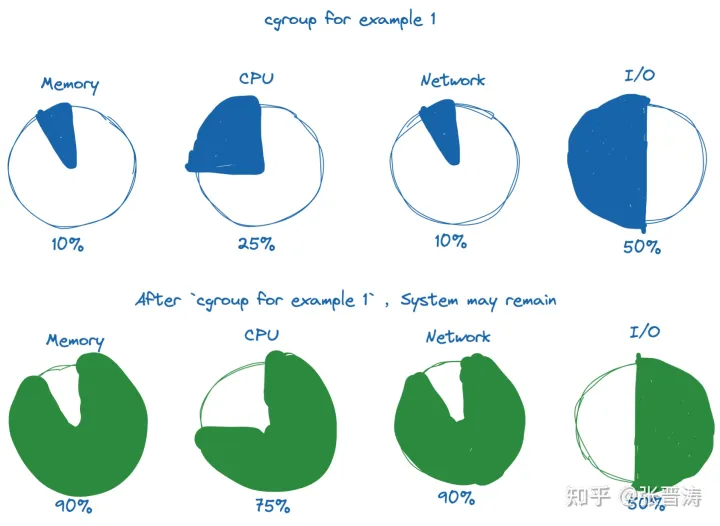
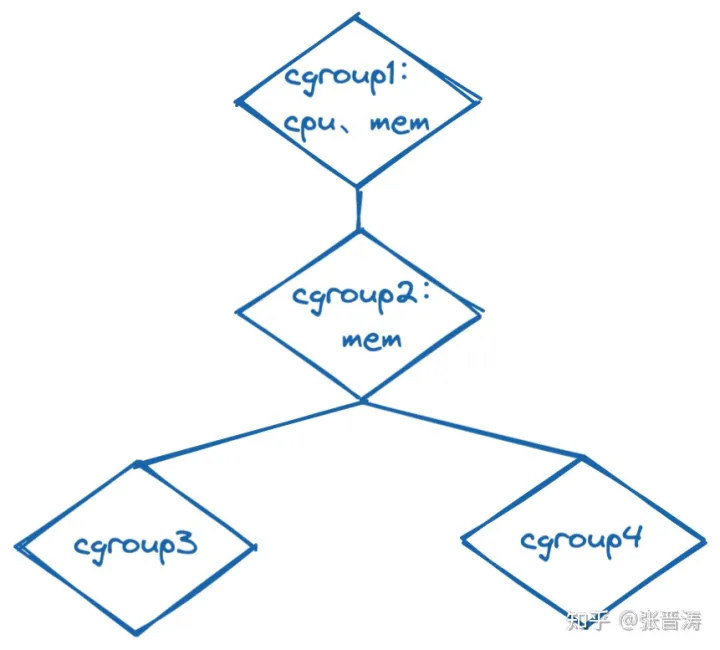
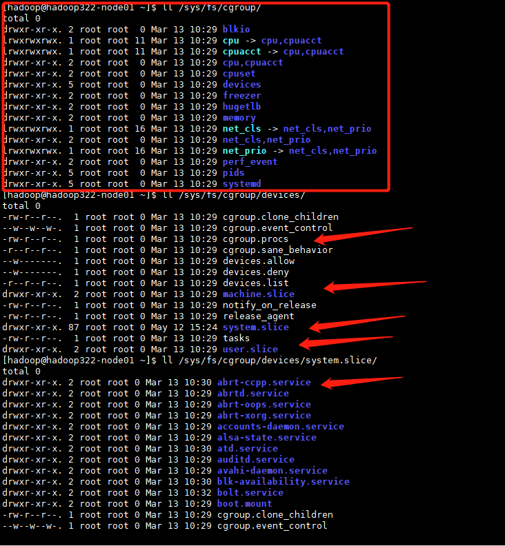

# cgroup原理

参考文章：https://zhuanlan.zhihu.com/p/434731896

https://www.jianshu.com/p/1cf7e42c615e

https://blog.csdn.net/u010099177/article/details/110481186

https://access.redhat.com/documentation/zh-cn/red_hat_enterprise_linux/7/html/resource_management_guide/chap-introduction_to_control_groups#sec-What_are_Control_Groups

目前我们所提到的容器技术、虚拟化技术（不论何种抽象层次下的虚拟化技术）都能做到资源层面上的隔离和限制。

对于容器技术而言，它实现资源层面上的限制和隔离，依赖于 Linux 内核所提供的 cgroup 和 namespace 技术。

cgroup和namespace

- cgroup 的主要作用：管理资源的分配、限制；
- namespace 的主要作用：封装抽象，限制，隔离，使命名空间内的进程看起来拥有他们自己的全局资源；

## **什么是 cgroup**

cgroup 是 Linux 内核的一个功能，用来限制、控制与分离一个进程组的资源（如CPU、内存、磁盘输入输出等）。它是由 Google 的两位工程师进行开发的，自 2008 年 1 月正式发布的 Linux 内核 v2.6.24 开始提供此能力。

cgroup 到目前为止，有两个大版本， cgroup v1 和 v2 。以下内容以 cgroup v2 版本为主，涉及两个版本差别的地方会在下文详细介绍。

cgroup 主要限制的资源是：

- CPU
- 内存
- 网络
- 磁盘 I/O

当我们将可用系统资源按特定百分比分配给 cgroup 时，剩余的资源可供系统上的其他 cgroup 或其他进程使用。




## **什么是 cgroups**

当明确提到多个单独的控制组时，才使用复数形式 “cgroups” 。

cgroups 形成了树状结构。（一个给定的 cgroup 可能有多个子 cgroup 形成一棵树结构体）每个非根 cgroup 都有一个 `cgroup.events` 文件，其中包含 `populated` 字段指示 cgroup 的子层次结构是否具有实时进程。所有非根的 `cgroup.subtree_control` 文件，只能包含在父级中启用的控制器。



**cgroups 示例**

如图所示，cgroup1 中限制了使用 cpu 及 内存资源，它将控制子节点的 CPU 周期和内存分配（即，限制 cgroup2、cgroup3、cgroup4 中的cpu及内存资源分配）。cgroup2 中启用了内存限制，但是没有启用cpu的资源限制，这就导致了 cgroup3 和 cgroup4 的内存资源受 cgroup2中的 mem 设置内容的限制；cgroup3 和 cgroup4 会自由竞争在 cgroup1 的 cpu 资源限制范围内的 cpu 资源。

**我的理解**：

> 如上图所示，cgroup1、cgroup2、cgroup3、cgroup4都是cgroup节点。
>
> 每个cgroup节点都表示对资源进行的限制。
>
> 子cgroup在其父cgroup的基础上进一步进行资源限制。
>
> cgroup与process关联起来之后，就可以限制一个process、一组process的可使用的资源量了。

**子节点 cgroup 与父节点 cgroup 是否会存在内部进程竞争的情况呢**？

当然不会。cgroup v2 中，设定了非根 cgroup 只能在没有任何进程时才能将域资源分发给子节点的 cgroup。简而言之，只有不包含任何进程的 cgroup 才能在其 `cgroup.subtree_control` 文件中启用域控制器，这就保证了，进程总在叶子节点上。

什么是cgroup节点

如下如所示，cgroup的根目录为`/sys/fs/cgroup`，下面的目录就是一个cgroup节点，cgroup目录下就会有该cgroup节点的`cgroup.procs`等文件。



# cgroup子系统分类

以5.4的内核为例，cgroup包括cpu，memory，blokio，network...，这里的每一个文件夹都表示cgroup的一个子系统，这里只以cpu，memory为例进行介绍。


```rust
root@iZt4n1u8u50jg1r5n6myn2Z:~# mount -t tmpfs |grep cgroup
tmpfs on /sys/fs/cgroup type tmpfs (ro,nosuid,nodev,noexec,mode=755)
root@iZt4n1u8u50jg1r5n6myn2Z:~# mount -t cgroup
cgroup on /sys/fs/cgroup/systemd type cgroup (rw,nosuid,nodev,noexec,relatime,xattr,name=systemd)
cgroup on /sys/fs/cgroup/perf_event type cgroup (rw,nosuid,nodev,noexec,relatime,perf_event)
cgroup on /sys/fs/cgroup/cpu,cpuacct type cgroup (rw,nosuid,nodev,noexec,relatime,cpu,cpuacct)
cgroup on /sys/fs/cgroup/freezer type cgroup (rw,nosuid,nodev,noexec,relatime,freezer)
cgroup on /sys/fs/cgroup/cpuset type cgroup (rw,nosuid,nodev,noexec,relatime,cpuset)
cgroup on /sys/fs/cgroup/blkio type cgroup (rw,nosuid,nodev,noexec,relatime,blkio)
cgroup on /sys/fs/cgroup/pids type cgroup (rw,nosuid,nodev,noexec,relatime,pids)
cgroup on /sys/fs/cgroup/memory type cgroup (rw,nosuid,nodev,noexec,relatime,memory)
cgroup on /sys/fs/cgroup/rdma type cgroup (rw,nosuid,nodev,noexec,relatime,rdma)
cgroup on /sys/fs/cgroup/hugetlb type cgroup (rw,nosuid,nodev,noexec,relatime,hugetlb)
cgroup on /sys/fs/cgroup/devices type cgroup (rw,nosuid,nodev,noexec,relatime,devices)
cgroup on /sys/fs/cgroup/net_cls,net_prio type cgroup (rw,nosuid,nodev,noexec,relatime,net_cls,net_prio)
root@iZt4n1u8u50jg1r5n6myn2Z:~# ls /sys/fs/cgroup/
blkio  cpu  cpuacct  cpu,cpuacct  cpuset  devices  freezer  hugetlb  memory  net_cls  net_cls,net_prio  net_prio  perf_event  pids  rdma  systemd  unified
root@iZt4n1u8u50jg1r5n6myn2Z:~# uname -a
Linux iZt4n1u8u50jg1r5n6myn2Z 5.4.0-91-generic #102-Ubuntu SMP Fri Nov 5 16:31:28 UTC 2021 x86_64 x86_64 x86_64 GNU/Linux
root@iZt4n1u8u50jg1r5n6myn2Z:~#
```

**这里请注意一个细节**，这里有三层挂载，一个是sysfs，挂载点是/sys/，一个是tmpfs内存文件系统，挂载点是/sys/fs/cgroup，另一个是子系统的挂载，如cpu挂载点是/sys/fs/cgroup/cpu。三层挂载就是三个文件系统，一个是[kernfs](https://links.jianshu.com/go?to=https%3A%2F%2Fen.wikipedia.org%2Fwiki%2FKernfs_(Linux))，一个是tmpfs，一个是cgroup文件系统。即使是基于内存的文件系统，也都有superblock，dentry，inode等这些vfs的概念。

# cgroup的使用

### 常规使用

1、创建cgroup子系统的子目录

​	在`/sys/fs/cgroup`下创建子目录之后，会自动生成cgroup所需的文件，如：

- cgroup.clone_children
- cgroup.procs
- cpuacct.stat
- cpuacct.usage
- cpuacct.usage_percpu
- cpu.cfs_period_us
- cpu.cfs_quota_us
- cpu.shares
- cpu.stat
- notify_on_release
- tasks

 2、设置资源配额
 3、将需要限制的进程号写入子目录
 以cpu限额为例，限制当前shell最多使用1C。这里有个知识点，**tasks和cgroup.procs有什么区别呢？**按照官方文档的描述，将pid写入cgroup.procs，则该pid所在的线程组及该pid的子进程等都会自动加入到cgroup中。将pid写入tasks，则只限制该pid。

*cgroupV2已经弃用**tasks**文件了。*

```bash
root@iZt4n1u8u50jg1r5n6myn2Z:~# mkdir /sys/fs/cgroup/cpu/myshell -p
root@iZt4n1u8u50jg1r5n6myn2Z:~# echo 100000 > /sys/fs/cgroup/cpu/myshell/cpu.cfs_quota_us
root@iZt4n1u8u50jg1r5n6myn2Z:~# echo $$ > /sys/fs/cgroup/cpu/myshell/cgroup.procs
```

### cg工具集

cgcreate创建，cgdelete删除，cgget查询，cgset设置，cgexec执行等


```csharp
root@iZt4n1u8u50jg1r5n6myn2Z:~# cgcreate -g cpu:mycg
root@iZt4n1u8u50jg1r5n6myn2Z:~# cgset -r cpu.cfs.cfs_quota_us=10000 /mycg
root@iZt4n1u8u50jg1r5n6myn2Z:~# cgexec  -g cpu:mycg df -h -t ext4
Filesystem      Size  Used Avail Use% Mounted on
/dev/vda1        40G   29G  9.0G  77% /
root@iZt4n1u8u50jg1r5n6myn2Z:~# cgdelete  -g cpu:mycg
```

### systemd

通过systemd的接口设置服务的配额，与上诉两种方式的使用原理是一样的。systemcg-top的展示也不错。

```ruby
root@iZt4n1u8u50jg1r5n6myn2Z:~# systemctl set-property sshd.service CPUShares=2048
root@iZt4n1u8u50jg1r5n6myn2Z:~# cat /sys/fs/cgroup/cpu/system.slice/ssh.service/cpu.shares
2048
root@iZt4n1u8u50jg1r5n6myn2Z:~# systemd-cgtop
Control Group                                                  					Tasks   %CPU   Memory  Input/s Output/s
/                                                                					206      -   841.2M        -        -
assist                                                            					-      -     3.1M        -        -
docker                                                              				1      -    11.7M        -        -
docker/cbf77eadcd1bd5b4810eceeee1faa643a7d05bce9ca45d60f01813d15251c135   	1      -    11.7M        -        -
system.slice                                                              135      -   584.0M        -        -
system.slice/AssistDaemon.service                                           8      -     2.6M        -        -
system.slice/accounts-daemon.service                                        3      -     3.0M        -        -
system.slice/aegis.service                                                 28      -   130.3M        -        -
system.slice/aliyun.service                                                 9      -    15.0M        -        -
system.slice/atd.service                                                    1      -   516.0K        -        -
system.slice/chrony.service                                                 2      -     1.8M        -        -
```

### 查看进程的所有cgroup信息

内核函数入口 ：proc_cgroup_show


```ruby
root@iZt4n1u8u50jg1r5n6myn2Z:~# cat /proc/38538/cgroup 
12:net_cls,net_prio:/
11:devices:/system.slice/ssh.service
10:hugetlb:/
9:rdma:/
8:memory:/system.slice/ssh.service
7:pids:/system.slice/ssh.service
6:blkio:/system.slice/ssh.service
5:cpuset:/
4:freezer:/
3:cpu,cpuacct:/system.slice/ssh.service
2:perf_event:/
1:name=systemd:/system.slice/ssh.service
0::/system.slice/ssh.service
```

## **cgroup 和容器的联系**

这里我们以 Docker 为例。 创建一个容器，并对其可使用的 CPU 和内存进行限制：

```text
➜  ~ docker run --rm -d  --cpus=2 --memory=2g --name=2c2g redis:alpine 
e420a97835d9692df5b90b47e7951bc3fad48269eb2c8b1fa782527e0ae91c8e
➜  ~ cat /sys/fs/cgroup/system.slice/docker-`docker ps -lq --no-trunc`.scope/cpu.max
200000 100000
➜  ~ cat /sys/fs/cgroup/system.slice/docker-`docker ps -lq --no-trunc`.scope/memory.max
2147483648
➜  ~ 
➜  ~ docker run --rm -d  --cpus=0.5 --memory=0.5g --name=0.5c0.5g redis:alpine
8b82790fe0da9d00ab07aac7d6e4ef2f5871d5f3d7d06a5cdb56daaf9f5bc48e
➜  ~ cat /sys/fs/cgroup/system.slice/docker-`docker ps -lq --no-trunc`.scope/cpu.max       
50000 100000
➜  ~ cat /sys/fs/cgroup/system.slice/docker-`docker ps -lq --no-trunc`.scope/memory.max
536870912
```

从上面的示例可以看到，当我们使用 Docker 创建出新的容器并且为他指定 CPU 和 内存限制后，其对应的 cgroup 配置文件的 `cpu.max` 和 `memory.max`都设置成了相应的值。

如果你想要对一些已经在运行的容器进行资源配额的检查的话，也可以直接去查看其对应的配置文件中的内容。

# 一张图看懂IaaS, PaaS和SaaS的区别

从小型企业到全球企业，云都是一个非常热门的话题，它是一个非常广泛的概念，涵盖了很多在线领域。 无论是应用程序还是基础架构部署，当您开始考虑将业务转移到云时，了解各种云服务的差异和优势比以往任何时候都更加重要。

 

通常有三种云服务模型：SaaS（软件即服务），PaaS（平台即服务）和IaaS（基础架构即服务）。 每个都有自己的好处和差异。为了您的组织能作出最佳选择，您有必要了解SaaS，PaaS和IaaS之间的差异。

 

下图总结了三种模型的主要差别：


[Kubernetes](https://kubernetes.io/zh/docs/concepts/overview/what-is-kubernetes/) 是用于自动部署，扩展和管理容器化应用程序的开源系统。它将组成应用程序的容器组合成逻辑单元，以便于管理和服务发现。Kubernetes 源自[Google 15 年生产环境的运维经验](http://queue.acm.org/detail.cfm?id=2898444)，同时凝聚了社区的最佳创意和实践。

[Kubernetes官方文档](https://kubernetes.io/docs/home/)


### 部署方式的演变


- 传统部署时代。应用程序直接部署在物理机上，无法为物理服务器中的应用程序定义资源边界，这会导致资源分配问题。同一物理机上的应用程序隔离性差。
- 虚拟化部署时代。它允许您在单个物理服务器的 CPU 上运行多个虚拟机（VM）。虚拟化功能允许应用程序在 VM 之间隔离，并提供安全级别，因为一个应用程序的信息不能被另一应用程序自由地访问。因为虚拟化可以轻松地添加或更新应用程序、降低硬件成本等等，所以虚拟化可以更好地利用物理服务器中的资源，并可以实现更好的可伸缩性。每个 VM 是一台完整的计算机，在虚拟化硬件之上运行所有组件，包括其自己的操作系统。
- 容器部署时代。容器类似于 VM，但是它们具有轻量级的隔离属性，可以在应用程序之间共享操作系统（OS）。因此，容器被认为是轻量级的。容器与 VM 类似，具有自己的文件系统、CPU、内存、进程空间等。由于它们与基础架构分离，因此可以跨云和 OS 分发进行移植。

### [为什么需要 Kubernetes，它能做什么?](https://kubernetes.io/zh/docs/concepts/overview/what-is-kubernetes/#为什么需要-kubernetes-它能做什么)

容器是打包和运行应用程序的好方式。在生产环境中，您需要管理运行应用程序的容器，并确保不会停机。例如，如果一个容器发生故障，则需要启动另一个容器。如果系统处理此行为，会不会更容易？

这就是 Kubernetes 的救援方法！Kubernetes 为您提供了一个可弹性运行分布式系统的框架。Kubernetes 会满足您的扩展要求、故障转移、部署模式等。例如，Kubernetes 可以轻松管理系统的 Canary 部署。

Kubernetes 为您提供：

- **服务发现和负载均衡**
  Kubernetes 可以使用 DNS 名称或自己的 IP 地址公开容器，如果到容器的流量很大，Kubernetes 可以负载均衡并分配网络流量，从而使部署稳定。

- **存储编排**
  Kubernetes 允许您自动挂载您选择的存储系统，例如本地存储、公共云提供商等。

- **自动部署和回滚**
  您可以使用 Kubernetes 描述已部署容器的所需状态，它可以以受控的速率将实际状态更改为所需状态。例如，您可以自动化 Kubernetes 来为您的部署创建新容器，删除现有容器并将它们的所有资源用于新容器。

- **自动二进制打包**
  Kubernetes 允许您指定每个容器所需 CPU 和内存（RAM）。当容器指定了资源请求时，Kubernetes 可以做出更好的决策来管理容器的资源。

- **自我修复**
  Kubernetes 重新启动失败的容器、替换容器、杀死不响应用户定义的运行状况检查的容器，并且在准备好服务之前不将其通告给客户端。

- **密钥与配置管理**
  Kubernetes 允许您存储和管理敏感信息，例如密码、OAuth 令牌和 ssh 密钥。您可以在不重建容器镜像的情况下部署和更新密钥和应用程序配置，也无需在堆栈配置中暴露密钥。

Kubernetes 不仅仅是一个编排系统，实际上它消除了编排的需要。编排的技术定义是执行已定义的工作流程：首先执行 A，然后执行 B，再执行 C。相比之下，Kubernetes 包含一组独立的、可组合的控制过程，这些过程连续地将当前状态驱动到所提供的所需状态。从 A 到 C 的方式无关紧要，也不需要集中控制，这使得系统更易于使用且功能更强大、健壮、弹性和可扩展性。


