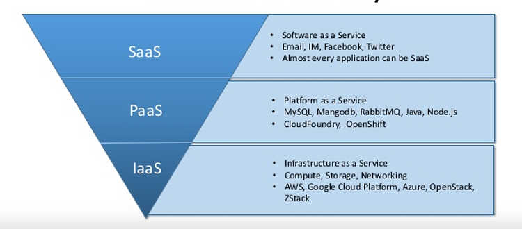

# 一张图看懂IaaS, PaaS和SaaS的区别

从小型企业到全球企业，云都是一个非常热门的话题，它是一个非常广泛的概念，涵盖了很多在线领域。 无论是应用程序还是基础架构部署，当您开始考虑将业务转移到云时，了解各种云服务的差异和优势比以往任何时候都更加重要。

 

通常有三种云服务模型：SaaS（软件即服务），PaaS（平台即服务）和IaaS（基础架构即服务）。 每个都有自己的好处和差异。为了您的组织能作出最佳选择，您有必要了解SaaS，PaaS和IaaS之间的差异。

 

下图总结了三种模型的主要差别：

[Kubernetes](https://kubernetes.io/zh/docs/concepts/overview/what-is-kubernetes/) 是用于自动部署，扩展和管理容器化应用程序的开源系统。它将组成应用程序的容器组合成逻辑单元，以便于管理和服务发现。Kubernetes 源自[Google 15 年生产环境的运维经验](http://queue.acm.org/detail.cfm?id=2898444)，同时凝聚了社区的最佳创意和实践。

[Kubernetes官方文档](https://kubernetes.io/docs/home/)

### 部署方式的演变

- 传统部署时代。应用程序直接部署在物理机上，无法为物理服务器中的应用程序定义资源边界，这会导致资源分配问题。同一物理机上的应用程序隔离性差。
- 虚拟化部署时代。它允许您在单个物理服务器的 CPU 上运行多个虚拟机（VM）。虚拟化功能允许应用程序在 VM 之间隔离，并提供安全级别，因为一个应用程序的信息不能被另一应用程序自由地访问。因为虚拟化可以轻松地添加或更新应用程序、降低硬件成本等等，所以虚拟化可以更好地利用物理服务器中的资源，并可以实现更好的可伸缩性。每个 VM 是一台完整的计算机，在虚拟化硬件之上运行所有组件，包括其自己的操作系统。
- 容器部署时代。容器类似于 VM，但是它们具有轻量级的隔离属性，可以在应用程序之间共享操作系统（OS）。因此，容器被认为是轻量级的。容器与 VM 类似，具有自己的文件系统、CPU、内存、进程空间等。由于它们与基础架构分离，因此可以跨云和 OS 分发进行移植。

### [为什么需要 Kubernetes，它能做什么?](https://kubernetes.io/zh/docs/concepts/overview/what-is-kubernetes/#为什么需要-kubernetes-它能做什么)

容器是打包和运行应用程序的好方式。在生产环境中，您需要管理运行应用程序的容器，并确保不会停机。例如，如果一个容器发生故障，则需要启动另一个容器。如果系统处理此行为，会不会更容易？

这就是 Kubernetes 的救援方法！Kubernetes 为您提供了一个可弹性运行分布式系统的框架。Kubernetes 会满足您的扩展要求、故障转移、部署模式等。例如，Kubernetes 可以轻松管理系统的 Canary 部署。

Kubernetes 为您提供：

- **服务发现和负载均衡**
  Kubernetes 可以使用 DNS 名称或自己的 IP 地址公开容器，如果到容器的流量很大，Kubernetes 可以负载均衡并分配网络流量，从而使部署稳定。

- **存储编排**
  Kubernetes 允许您自动挂载您选择的存储系统，例如本地存储、公共云提供商等。

- **自动部署和回滚**
  您可以使用 Kubernetes 描述已部署容器的所需状态，它可以以受控的速率将实际状态更改为所需状态。例如，您可以自动化 Kubernetes 来为您的部署创建新容器，删除现有容器并将它们的所有资源用于新容器。

- **自动二进制打包**
  Kubernetes 允许您指定每个容器所需 CPU 和内存（RAM）。当容器指定了资源请求时，Kubernetes 可以做出更好的决策来管理容器的资源。

- **自我修复**
  Kubernetes 重新启动失败的容器、替换容器、杀死不响应用户定义的运行状况检查的容器，并且在准备好服务之前不将其通告给客户端。

- **密钥与配置管理**
  Kubernetes 允许您存储和管理敏感信息，例如密码、OAuth 令牌和 ssh 密钥。您可以在不重建容器镜像的情况下部署和更新密钥和应用程序配置，也无需在堆栈配置中暴露密钥。

Kubernetes 不仅仅是一个编排系统，实际上它消除了编排的需要。编排的技术定义是执行已定义的工作流程：首先执行 A，然后执行 B，再执行 C。相比之下，Kubernetes 包含一组独立的、可组合的控制过程，这些过程连续地将当前状态驱动到所提供的所需状态。从 A 到 C 的方式无关紧要，也不需要集中控制，这使得系统更易于使用且功能更强大、健壮、弹性和可扩展性。

