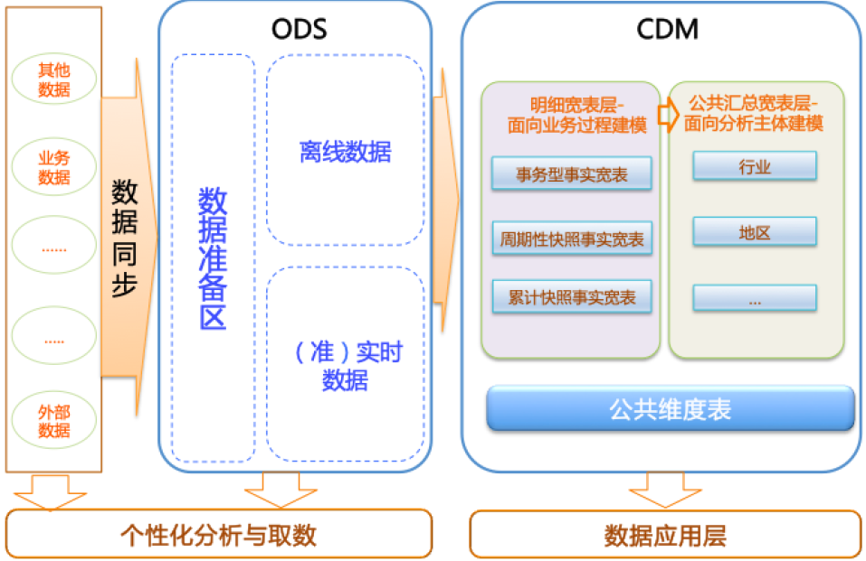

# 云计算和云原生

云的本质是一种提供稳定计算存储资源的对象，特点是虚拟化、弹性扩展、高可用、高容错、自恢复。

云计算（Cloud Computing）；在云上提供了计算存储资源，如Iaas，Paas，Saas。

云原生（CloudNative）

云原生是一种构建和运行应用程序的的方法 = 基于云计算的软件开发应用方式，是一套技术体系和方法论。

CloudNative = Cloud + Native

Cloud：表示应用程序运行在云中，而不是传统的数据中心（IDC）。

Native：表示应用程序从设计之初就考虑到云的环境。原生为云而设计，在云上以最佳的姿态运行，充分利用和发挥云平台的弹性+分布式的优势。

云原生的特点：

- 微服务

  - 应用通过RESTful API通信
  - 可被独立部署、更新、scale和重启

- DevOps

  - 自动化发布管道，CI工具
  - 快速部署到生产环境，CD工具
  - 开发、运维协同合作

- 持续交付

  频繁发布、快速交付、快速反馈、降低发布风险

- 容器化

  微服务的最佳载体

# 公有云

公有云产品对标

| 阿里云                          | 华为云 | 腾讯云                  | 备注                                                    |
| ------------------------------- | ------ | ----------------------- | ------------------------------------------------------- |
| E-MapReduce                     | MRS    | 弹性MapReduce           |                                                         |
| MaxCompute                      |        |                         |                                                         |
| DataWorks                       |        |                         |                                                         |
| 数据湖构建DLF                   |        |                         |                                                         |
| 实时数仓Hologres                |        |                         | 类似与doris、starrocks、clickhouse这种MPP架构的实时数仓 |
| DLA                             |        |                         |                                                         |
| 机器学习平台PAI                 |        |                         |                                                         |
| 表格存储Tablestore              |        |                         |                                                         |
| Lindorm                         |        | 弹性MapReduce-HBase     |                                                         |
| 云数据库 HBase 版               |        | 弹性MapReduce-HBase     |                                                         |
|                                 |        | 弹性MapReduce-Starrocks |                                                         |
|                                 |        | 弹性MapReduce-Doris     |                                                         |
| 实时计算Flink版（Flink 全托管） |        | Oceanus                 |                                                         |

### Hologres

hologres的查询引擎是阿里云完全自研的执行引擎。但是猜测应该是基于postgreSQL进行二次开发的。

hologres百问百答https://developer.aliyun.com/ask/392046?spm=a2c6h.13066369.question.27.74d91863O05nHL

开源的**分布式分析查询系统**主要有两大类：

- 一类是传统的 Massively Parallel Processing 系统，能够支持通用的 SQL 查询，但是对实时场景支持不够好，性能不够理想。
- 一类是 Apache Druid 和 ClickHouse这些实时数仓，是专门为实时场景设计和优化的，能够比较好地支持一些常见的单表实时查询，但是复杂查询的性能比较差。
- 另外大数据生态圈基于 MapReduce 的引擎比较适合批处理 ETL，一般不太适合在线服务和多维分析的场景，性能也差不少。

**实时数仓的用途**：

- 实时大屏

  如实时内容热点分析

- 实时风控

  如实时用户行为分析

- 实时监控

  如用户增长和活跃度监控分析

- 实时推荐

  如文章视频实时推荐、实时广告投放

Hologres的典型应用场景：https://help.aliyun.com/document_detail/113665.html?spm=a2c4g.604340.0.0.4db93627QpKObX

- 搭建实时数仓

  实时写入业务数据至实时计算后，使用ETL（Extract Transformation Load）方式清洗、转换及整理数据。您可以通过Hologres实时查询并输出数据至第三方分析工具进行实时分析。典型应用场景如下：

  - 数据部门搭建阿里云实时数仓、展示实时大屏和分析实时Reporting报表。
  - 运维和数据应用部门执行实时监控、实时异常检测预警与实时调试。
  - 业务部门进行实时风控、实时推荐、实时效果分析和实时训练。

  

- MaxCompute加速查询

  写入业务数据至离线数据仓库MaxCompute，通过Hologres直接加速查询或导入数据至Hologres查询，并对接BI分析工具，实现实时分析离线数据。典型应用场景如下：

  - 实时查询MaxCompute离线数据。
  - 分析MaxCompute离线数据报表。
  - 输出MaxCompute离线数据的在线应用，例如RESTful API的使用。

  

- 联邦分析实时数据和离线数据

  业务数据分为冷数据和热数据，冷数据存储在离线数据仓库MaxCompute中，热数据存储在Hologres中。Hologres可以联邦分析实时数据和离线数据，对接BI分析工具，快速响应简单查询与复杂查询的业务需求。

### Delta Lake

Delta Lake是DataBricks公司推出的一种数据湖方案。Delta Lake以数据为中心，围绕数据流走向（数据从流入数据湖、数据组织管理和数据查询到流出数据湖）推出了一系列功能特性，协助您搭配第三方上下游工具，搭建快捷、易用和安全的数据湖。详情请参见[Delta Lake概述](https://help.aliyun.com/document_detail/148369.htm)。

### DLF

数据湖构建（Data Lake Formation，DLF）是一款全托管的快速帮助用户构建云上数据湖及Lakehouse的服务，为客户提供了统一的元数据管理、统一的权限与安全管理、便捷的数据入湖能力以及一键式数据探索能力。DLF可以帮助用户快速完成云原生数据湖及Lakehouse方案的构建与管理，并可无缝对接多种计算引擎，打破数据孤岛，洞察业务价值。

阿里云数据入湖，以前DLF是支持数据入湖的：

- 实时入湖：实时计算Flink版：参考如[MySQL CDC DataStream Connector](https://help.aliyun.com/document_detail/299187.htm)
- 离线入湖：DataWorks产品：[数据集成概述](https://help.aliyun.com/document_detail/137663.htm?spm=a2c4g.602499.0.0.32463e6dwz4qUr)。

DLF的作用：用户使用数据湖构建面向大数据分析和机器学习场景可以获得集中式权限管理和统一的元数据视图，更容易对接云上大数据和分析产品。

**阿里云EMR老集群（MySQL做元数据），阿里云EMR新集群（DLF做元数据）。**

### DLA


### MaxCompute

MaxCompute 是面向分析的企业级 SaaS 模式云数据仓库，以 Serverless 架构提供快速、全托管的在线数据仓库服务，消除了传统数据平台在资源扩展性和弹性方面的限制，最小化用户运维投入，使您可以经济并高效的分析处理海量数据。

简而言之，MaxCompute是一个SaaS的离线数仓。支持流式实时写入，近实时分析（支持的计算引擎为MR、Spark）。

购买内容与**实施计算Flink版**相似，只需要指定所需的CU即可。

阿里云中的RAM用户就相当于腾讯云中的子用户。

MaxCompute对外暴露的是project、table、resource、function等，因为是Saas产品，并没有直接暴露底层文件，底层文件托管在飞天分布式文件系统pangu中。因此MC可以存储数据，但是访问数据是通过查询表的方式实现的。

MaxCompute的主要优势如下：

- 简单易用

  - 面向数据仓库实现高性能存储、计算。
  - 预集成多种服务，标准SQL开发简单。
  - 内建完善的管理和安全能力。
  - 免运维，按量付费，不使用不产生费用。

- 匹配业务发展的弹性扩展能力

  存储和计算独立扩展，动态扩缩容，按需弹性扩展，无需提前规划容量，满足突发业务增长。

- 支持多种分析场景

  支持开放数据生态，以统一平台满足数据仓库、BI、近实时分析、数据湖分析、机器学习等多种场景。

- 开放的平台

  - 支持开放接口和生态，为数据、应用迁移、二次开发提供灵活性。
  - 支持与Airflow、Tableau等开源和商业产品灵活组合，构建丰富的数据应用。

项目是MaxCompute的基本组织单元，类似于传统数据库的Database或Schema的概念，是进行多用户隔离和访问控制的主要边界。

表是MaxCompute的数据存储单元。

分区Partition是指一张表下，根据分区字段（一个或多个字段的组合）对数据存储进行划分。

MaxCompute指引：https://help.aliyun.com/document_detail/252791.html?spm=a2c4g.414492.0.0.1bb42caf6i2aeM

常见的DataWorks+MaxCompute的技术架构如下图所示：


#### 数仓的基本概念

构建MaxCompute数据仓库的整体流程如下。

#####  湖仓一体


与MaxCompute对标的产品


MaxCompute和Hive对比


#### 迁移

[从Hadoop 迁移到 MaxCompute](https://www.aliyun.com/activity/bigdata/maxcompute-migration?spm=5176.7944453.J_7721567390.1.69ff5d53MNYUcX)

[从其它云迁移到 MaxCompute](https://www.aliyun.com/activity/bigdata/maxcompute-migration)

[从传统数仓迁移到 MaxCompute](https://www.aliyun.com/activity/bigdata/maxcompute-migration)


##### 迁移工具

 MaxCompute Migration Assistant (MMA) 

DataWorks 迁移助手

### DataWorks

DataWorks基于阿里云ODPS/EMR/CDP等大数据引擎，为**数据仓库**/**数据湖**/**湖仓一体**等解决方案提供统一的全链路大数据开发治理平台。作为阿里巴巴数据中台的建设者，DataWorks从2009年起不断沉淀阿里巴巴大数据建设方法论，同时与数万名政务/金融/零售/互联网/能源/制造等客户携手，助力产业数字化升级。

ODPS就是现在的MapCompute。

DataWorks的功能特性：

- 数据集成

  异构数据源之间高速稳定的数据移动及同步能力。

  - 离线同步
  - 实时同步
  - 整库同步。同步某数据源的某库的所有表
  - 批量同步。同步多个数据源的库表
  - 全增量实时同步

  数据集成的引擎架构为星型架构，如下图所示：

  

  数据集成的常见场景：

  - 搬迁上云。业务数据库如MySQL、Oracle等迁移到云上。
  - 实时数仓。批流数据汇集。
  - 平台融合。数据在不同云厂商的平台之间流动，在阿里云上不同云产品之间流动，实现数据同步，数据的融合。
  - 容灾备份

  离线数据同步原理，基于DataX

  

  离线同步引擎支持的数据源

  

  实时数据同步的原理

  

- 数据开发与运维中心

  DataWorks的数据开发即DataStudio。

  - DataStudio支持MaxCompute、EMR、CDH、Hologres、AnalyticDB、Clickhouse等多种计算引擎，支持在统一的平台上进行各类引擎任务的开发、测试、发布和运维等操作。
  - DataStudio支持智能编辑器、可视化依赖编排，调度能力经过阿里集团内调度任务、复杂业务依赖的反复验证。
  - DataStudio提供隔离的开发和生产环境，结合版本管理、代码评审、冒烟测试、发布管控、操作审计等配套功能，帮助企业规范地完成数据开发。
  - 运维中心支持数据时效性保障、任务诊断、影响分析、自动运维、移动运维等功能。

- 数据建模

- 数据分析

- 数据质量

- 数据地图

- 数据服务

- 开放平台

- 迁移助手与迁云服务

### DataHub

数据总线。阿里云流数据处理平台数据总线DataHub是流式数据（Streaming Data）的处理平台，提供对流式数据的发布 (Publish)，订阅 （Subscribe）和分发功能，让您可以轻松构建基于流式数据的分析和应用。支持数据接入、数据投递、数据缓存、数据。

看起来跟Kafka很相似。

DataHub的应用场景：

- 实时数据通道

  通过数据总线，业务数据能够实时汇入大数据系统，缩短数据分析周期。对外，大数据系统与业务系统解耦，对内，大数据系统各组件之间解耦。

  

- 实时数据清洗和分析

  接入多种数据源，实时进行清洗、过滤、关联与转换，产出结构化数据。

  

- 实时数据仓库

  从Lambda架构到Kappa架构，通过数据总线搭建原始数据层，实时明细层和实时汇总层，打造实时数据仓库。传统Lambda架构的两条链路缩减为一条，大大降低维护成本。数仓是大数据的基础，实时化的数仓能够让BI、报表、推荐（用户标签产出）等多种业务收益，大数据系统总体向实时化迈进。

  


### Lindorm

阿里云自研数据库，提供宽表、时序、文件、搜索等多种数据模型，支持毫秒级在线数据处理、海量数据低成本存储和分析。使用统一SQL融合多模数据的实时查询、检索和分析，流库一体、内置流计算引擎满足实时计算需求。满足金融、账单、日志、物联网、车联网、工业互联网、监控、推荐、风控和医疗影像等多业务场景需求。

我认为Lindorm是一款Saas产品，基本免运维的。

其核心能力包括：

- 多模超融合：支持宽表、时序、对象、文本、队列、空间等多种数据模型，模型之间数据互融互通，具备数据接入、存储、检索、计算、分析等一体化融合处理与服务的能力，帮助应用开发更加敏捷、灵活、高效。

  多模型的核心能力主要由以下几大数据引擎提供，包括：

  - `宽表引擎`，如HBase、Cassandra。

    负责宽表与对象数据的管理和服务，具备全局二级索引、多维检索、动态列、TTL等能力，适用于元数据、订单、账单、画像、社交、feed流、日志等场景，兼容SQL、HBase、Cassandra（CQL）、S3等标准接口。

    支持千万级高并发吞吐，支持百PB级存储，吞吐性能是开源HBase（Apache HBase）的3~7倍，P99时延为开源HBase（Apache HBase）的1/10，平均故障恢复时间相比开源HBase（Apache HBase）提升10倍，支持冷热分离，压缩率比开源HBase（Apache HBase）提升一倍，综合存储成本为开源HBase（Apache HBase）的1/2。

  - `时序引擎`，如OpenTSDB。

    负责时序数据的管理和服务，主要面向工业、IoT、监控等领域的量测数据、监控数据以及设备运行数据提供基于SQL的管理、写入、查询能力。针对时序数据设计的压缩算法，压缩率可达15:1。支持海量数据的多维查询和聚合计算，同时也支持时序数据的预降采样和持续查询。

  - `搜索引擎`，如ElasticSearch，Solr。

    负责多模数据的检索分析加速，其基于列存、倒排等核心技术，具备全文检索、聚合计算、复杂多维查询等能力，适用于日志、账单、画像等场景，兼容SQL、开源Solr等标准接口。

  - `文件引擎`，如HDFS。

    负责目录文件数据的管理和服务，并提供宽表、时序、搜索引擎底层共享存储的服务化访问能力，从而加速多模引擎底层数据文件的导入导出及计算分析效率，兼容开源HDFS标准接口。

  - `计算引擎`，如Spark、Flink。

    计算引擎与Lindorm存储引擎深度融合，基于云原生架构提供的分布式计算服务，满足用户在数据生产、交互式分析、机器学习和图计算等场景的计算需求，兼容开源Spark标准接口。

  - `流引擎`，如TODO

    云原生多模数据库Lindorm流引擎是面向流式数据处理的引擎，提供了流式数据的存储和轻计算功能，帮助您轻松实现流式数据存储至云原生多模数据库Lindorm，构建基于流式数据的处理和应用。

- 高性价比：支持千万级高并发吞吐、毫秒级访问延迟，并通过多级存储介质、智能冷热分离、自适应特征压缩，大幅减少存储成本。

- 云原生弹性：支持计算资源、存储资源独立弹性伸缩，并提供按需即时弹性、按使用量付费的Serverless服务。

- 开放兼容：兼容SQL、HBase/Cassandra/S3、TSDB、HDFS、Solr、Kafka等多种标准接口，支持与Hadoop、Spark、Flink、Kafka等系统无缝打通，并提供简单易用的数据交换、处理、订阅等能力。

#### Lindorm和其他相似产品的对比

- Lindorm VS HBase VS Cassandra

  HBase和Cassandra都是宽表数据模型，而Lindorm支持宽表、时序、搜索、文件等多种数据模型。详细对比见：https://help.aliyun.com/document_detail/181750.html?spm=a2c4g.185927.0.0.47de58fcok5km7

- Lindorm VS OpenTSDB
	OpenTSDB是基于Hbase的分布式的，可伸缩的时间序列数据库。而Lindorm支持宽表、时序、搜索、文件等多种数据模型。

- Lindorm VS ElasticSearch VS Solr

  ElasticSearch，solr仅支持搜索，而Lindorm支持宽表、时序、搜索、文件等多种数据模型。

- Lindorm VS HDFS

  HDFS是分布式文件系统，即对应上面的文件引擎。而Lindorm支持宽表、时序、搜索、文件等多种数据模型。

从上面的介绍来看，Lindorm就是集成了宽表数据模型、时序数据模型、搜索数据模型、文件数据模型等，具有多合一个功能。且功能能力更强、性能更好、且是Saas化的，零运维等优势。

#### 为什么会诞生Lindorm这个产品？

##### 业务背景

伴随着信息技术的飞速发展，各行各业在业务生产中产生的数据种类越来越多，有结构化的业务元数据、业务运行数据、设备或者系统的量测数据、日志，也有半结构化的业务运行数据、日志、图片或者文件等。按照传统方案，为了满足多种类型数据的存储、查询和分析需求，在设计IT架构时，需要针对不同种类的数据，采用不同的存储分析技术，如下图：


这种技术方案，是一种典型的技术碎片化的处理方案。针对不同的数据，使用不同的数据库来处理。有如下几个弊端：

- 涉及的技术组件多且杂
- 技术选型复杂
- 数据存取、数据同步的链路长

当前信息化技术发展面临的一个主要矛盾是"日益多样的业务需求带来的多种类型数据与数据存储技术架构日趋复杂成本快速上升之间的矛盾"。伴随5G、IoT、智能网联车等新一代信息技术的逐步普及应用，这个矛盾会越来越突出。为了解决这个问题，阿里云自研了云原生多模数据库Lindorm，满足多模型数据的统一存储、查询和分析需求。如下图所示，与传统方案相比，Lindorm系统极大地简化数据存储技术架构设计，大幅度提升系统稳定性，降低建设成本投入。


Lindorm创新性地使用存储计算分离、多模共享融合的云原生架构，以适应云计算时代资源解耦和弹性伸缩的诉求。其中云原生存储引擎LindormStore为统一的存储底座，向上构建各个垂直专用的多模引擎，包括宽表引擎（**LindormTable**）、时序引擎（**LindormTS**）、搜索引擎（**LindormSearch**）、文件引擎（**LindormFile**）。

在创建Lindorm时，需要根据需求选择每种引擎类型的节点规格和数量，如下图所示：


Lindorm Tunnel通道服务（简称LTS），原名为BDS。应用场景为：不停服数据迁移、在线和离线业务分离、主备容灾、RDS历史库建设。

### 云数据库HBase


### 实时计算Flink版（Flink 全托管）


## 迁移场景

阿里云HBase增强版（Lindorm）--LTS（源BDS）--> 腾讯云EMR-HBase

阿里云HBase增强版（Lindorm）--LTS（源BDS）--> 自建HBase

阿里云HBase增强版（Lindorm）--LTS（源BDS）--> 其他对标产品

Hadoop --DataWorks结合DataX，或sqoop，或MMA--> 阿里云MaxCompute

Hive --通过Hive UDTF迁移--> 阿里云MaxCompute，校验方式为select count(*)


Hive --通过OSS迁移--> 阿里云MaxCompute，校验方式为select count(*)


参考：https://help.aliyun.com/document_detail/149668.html?spm=a2c4g.149665.0.0.7be85745nWbrZD	

RDS --DataWorks数据集成，离线/实时同步--> 阿里云MaxCompute

RDS --DTS--> 阿里云MaxCompute

RDS --kettle/sqoop--> 阿里云MaxCompute

Oracle --OGG插件，实时同步--> 阿里云MaxCompute

日志数据 --Flume、Fluentd、Logstash等工具--> 阿里云MaxCompute


# 基本概念

zeppelin：数据查询WebUI

superset：报表可视化


**交互式查询**

- Hive 非实时分析，底层数据为HDFS/OSS
- Presto 实时分析，底层数据为HDFS/OSS
- Impala 实时分析，底层数据为HDFS/OSS
- Hologres 实时分析，Hologres本身就可作为底层数据存储，也可为HDFS/OSS
- DLA 实时分析，TODO


**大数据相关术语**
AdHoc：Ad Hoc查询,即席分析。实时要求非常高，要求写入即可查，更新即反馈，有即席查询需求，且资源较为充足，查询复杂度较低，适合实时数仓场景一：即席查询。即席查询通俗来说就是不确定应用的具体查询模式，先把数据存下来，后续支撑尽量多灵活性的场景
CU：Compute Unit，大数据相关的云产品中，1CU=1core 4GB
TPC-C：
TPC-H：
TPC-DS：
数据质量：
数据集成：数据从A1、A2、A3处接入/集成到B处。
逻辑视图：视图是一个虚拟表(也可以认为是一条语句)，基于它创建时指定的查询语句返回的结果集。每次访问它都会导致这个查询语句被执行一次。
物化视图：物化视图是包括一个查询结果的数据库对象，它是远程数据的的本地副本，或者用来生成基于数据表求和的汇总表。为了避免每次访问逻辑视图都执行这个查询，可以将这个查询结果集存储到一个物化视图(也叫实体化视图)。物化视图与普通的视图相比的区别是物化视图是建立的副本，它类似于一张表，需要占用存储空间。**物化视图中的数据是在数据写入时计算，数据进行预计算提高了查询效率。**
雪花模型：
离线计算/批处理：
渐进式计算：
实时计算/流处理：
维度：维度是观察业务的角度，用来反映业务的一类属性。属性的集合构成了维度，维度的属性就是维度表中的列。如在分析交易过程是，可通过卖家、卖家、商品和时间等维度描述交易发生的环境。
宽表：
维表：
拉链表：
ODS：Operational Data Store
DWD：Data Warehouse Detail
DWS：Data WareHouse Summary
ADS：Application Data Service
DIM：
Lambda架构：
CDC数据总线：
DLA：Data Lake Analytics。
TableStore：
传统数仓：
湖仓一体：湖和仓是大数据架构中的两种设计取向。让数据和计算在湖和仓之间自由流动。湖侧重文件存储的灵活性（支持多种文件存储格式）；仓侧重数据使用效率、大规模下的数据管理。
upsert：

ELK：logstash-elasticsearch-kibana，即ELK，数据的采集-加工-存储，主要应用在日志数据的分析、检索。

**商业智能（BI）工具**
Tableau
FineBI
FineReport
Yonghong BI
Quick BI
观远BI
网易有数BI

开源BI工具
Davinci
Superset

数据库管理工具
DBeaver
DataGrip
SQL Workbench/J

ETL工具
Kettle
Apache Airflow
Azkaban
怎么没有DataX了？？？


## 数仓基本概念

在正式学习本教程之前，您需要首先理解以下基本概念：

- 业务板块：比数据域更高维度的业务划分方法，适用于庞大的业务系统。
- 维度：维度建模由Ralph Kimball提出。维度模型主张从分析决策的需求出发构建模型，为分析需求服务。维度是度量的环境，是我们观察业务的角度，用来反映业务的一类属性。属性的集合构成维度，维度也可以称为实体对象。例如，在分析交易过程时，可以通过买家、卖家、商品和时间等维度描述交易发生的环境。
- 属性（维度属性）：维度所包含的表示维度的列称为维度属性。维度属性是查询约束条件、分组和报表标签生成的基本来源，是数据易用性的关键。
- 度量：在维度建模中，将度量称为事实，将环境描述为维度，维度是用于分析事实所需要的多样环境。度量通常为数值型数据，作为事实逻辑表的事实。
- 指标：指标分为原子指标和派生指标。原子指标是基于某一业务事件行为下的度量，是业务定义中不可再拆分的指标，是具有明确业务含义的名词，体现明确的业务统计口径和计算逻辑，例如支付金额。
  - 原子指标=业务过程+度量。如成交额。
  - 派生指标=时间周期+修饰词+原子指标，派生指标可以理解为对原子指标业务统计范围的圈定。如最近一天全省厨具类目各商品销售总额。
- 业务限定：统计的业务范围，筛选出符合业务规则的记录（类似于SQL中**where**后的条件，不包括时间区间）。
- 统计周期：统计的时间范围，例如最近一天，最近30天等（类似于SQL中**where**后的时间条件）。
- 统计粒度：统计分析的对象或视角，定义数据需要汇总的程度，可理解为聚合运算时的分组条件（类似于SQL中的**group by**的对象）。粒度是维度的一个组合，指明您的统计范围。例如，某个指标是某个卖家在某个省份的成交额，则粒度就是卖家、地区这两个维度的组合。如果您需要统计全表的数据，则粒度为全表。在指定粒度时，您需要充分考虑到业务和维度的关系。统计粒度常作为派生指标的修饰词而存在。

基本概念之间的关系和举例如下图所示。

## 数仓分层

在阿里巴巴的数据体系中，我们建议将数据仓库分为三层，自下而上为：`数据引入层（ODS，Operation Data Store）`、`数据公共层（CDM，Common Data Model）`和`数据应用层（ADS，Application Data Service`）。

数据仓库的分层和各层级用途如下图所示。

- `数据引入层ODS（Operation Data Store）`：存放未经过处理的原始数据至数据仓库系统，结构上与源系统保持一致，是数据仓库的数据准备区。主要完成基础数据引入到MaxCompute的职责，同时记录基础数据的历史变化。

- `数据公共层CDM（Common Data Model，又称通用数据模型层）`，包括`DIM维度表`、`DWD`和`DWS`，由`ODS`层数据加工而成。主要完成数据加工与整合，建立一致性的维度，构建可复用的面向分析和统计的明细事实表，以及汇总公共粒度的指标。

  - `公共维度层（DIM）`：基于维度建模理念思想，建立整个企业的一致性维度。降低数据计算口径和算法不统一风险。

    公共维度层的表通常也被称为逻辑维度表，维度和维度逻辑表通常一一对应。

  - `公共汇总粒度事实层（DWS）`：**以分析的主题对象作为建模驱动**，基于上层的应用和产品的指标需求，构建公共粒度的汇总指标事实表，以宽表化手段物理化模型。构建命名规范、口径一致的统计指标，为上层提供公共指标，建立汇总宽表、明细事实表。

    公共汇总粒度事实层的表通常也被称为汇总逻辑表，**用于存放派生指标数据**。

  - `明细粒度事实层（DWD）`：**以业务过程作为建模驱动**，基于每个具体的业务过程特点，构建最细粒度的明细层事实表。可以结合企业的数据使用特点，将明细事实表的某些重要维度属性字段做适当冗余，即宽表化处理。

    明细粒度事实层的表通常也被称为逻辑事实表。

- `数据应用层ADS（Application Data Service）`：存放数据产品个性化的统计指标数据。根据CDM与ODS层加工生成。

该数据分类架构在ODS层分为三部分：`数据准备区`、`离线数据`和`准实时数据区`。整体数据分类架构如下图所示。

在本教程中，从交易数据系统的数据经过DataWorks数据集成，同步到数据仓库的ODS层。经过数据开发形成事实宽表后，再以商品、地域等为维度进行公共汇总。

整体的数据流向如下图所示。其中，ODS层到DIM层的ETL（萃取（Extract）、转置（Transform）及加载（Load））处理是在MaxCompute中进行的，处理完成后会同步到所有存储系统。ODS层和DWD层会放在数据中间件中，供下游订阅使用。而DWS层和ADS层的数据通常会落地到在线存储系统中，下游通过接口调用的形式使用。

## 数据质量

参考文档：https://help.aliyun.com/document_detail/123969.html?spm=a2c4g.123968.0.0.26924e2aCKCiTO

数据质量是数据分析结论有效性和准确性的基础。要保证业务数据质量，首先您需要明确数据的消费场景和加工链路。

### 数据质量的评估

数据质量可以从完整性、准确性、一致性和及时性共四个角度进行评估，详情请参见[数据质量评估标准](https://help.aliyun.com/document_detail/116880.htm#concept-221766)。在本教程中，您将学会通过数据质量风险监控，保证数据的完整性、准确性、一致性；通过数据及时性监控，保证数据的及时性。

- 完整性

  完整性是指数据的记录和信息是否完整、不缺失。数据的缺失包括数据记录的缺失（表行数异常）和记录中某字段信息的缺失（字段出现空值）。在本教程中，您需要重点关注数据的生产环节（MaxCompute外部表引用的表格存储数据）和加工环节（数据仓库CDM及ADS层）中表行数是否大于0、表行数波动是否正常以及字段是否出现空值或重复的情况。

- 准确性

  准确性是指数据记录中信息和数据是否准确、不存在错误或异常。例如，在本教程中，如果UV、PV数值小于0，则明显是错误数据。

- 一致性

  对于不同的业务流程和节点，同一份数据必须保持一致性。例如表`province`字段中如果有**浙江**、**ZJ**两种表述，在您**group by province**时会出现两条记录。

- 及时性

  及时性主要体现在最终ADS层的数据可以及时产出。为保证及时性，您需要确保整条数据加工链路上的每个环节都可以及时产出数据。本教程将利用DataWorks智能监控功能保证数据加工每个环节的及时性。

数据质量的管理流程包括业务数据资产定级、加工卡点、风险点监控和及时性监控，您可以构建属于自己的数据质量保障体系。

数据质量管理的流程图如下。

数据的资产等级，可以根据数据质量不满足完整性、准确性、一致性、及时性对业务的影响程度进行划分。

数据等级定义如下：

- 毁灭性质：数据一旦出错，将会引起重大资产损失，面临重大收益损失等。标记为A1。
- 全局性质：数据直接或间接用于企业级业务、效果评估和重要决策等。标记为A2。
- 局部性质：数据直接或间接用于某些业务线的运营、报告等，如果出现问题会给业务线造成一定的影响或造成工作效率降低。标记为A3。
- 一般性质：数据主要用于日常数据分析，出现问题带来的影响极小。标记为A4。
- 未知性质：无法明确数据的应用场景。标记为Ax。

资产等级标记包含毁灭性质为A1、全局性质为A2、局部性质为A3、一般性质为A4、未知性质为Ax。重要程度为A1>A2>A3>A4>Ax。

数据质量风险监控主要针对数据的准确性、一致性和完整性。数据质量监控和数据资产等级对应，您可以根据以下因素细化您的监控配置，

- 监控分类：数据量、主键、离散值、汇总值、业务规则和逻辑规则。
- 监控粒度：字段级别、表级别。
- 监控层次：ODS、CDM、ADS三层数据，其中ODS和DWD层主要偏重数据的完整性和一致性。DWS和ADS层数据量较小、逻辑复杂，偏重数据的准确性。

以下为不同数据资产等级和数仓层次数据的数据质量监控建议，仅供参考。


## 实时计算和批量计算

**什么是实时计算？**

数据的业务价值会随着时间的流逝而迅速降低，因此在数据发生后必须尽快对齐进行计算和处理。传统的大数据处理模型将在线事务处理（OLTP）和离线分析从时序上分开，以小时甚至是天为计算周期对当前数据进行处理。因此传统的大数据处理方式无法满足数据实时计算的需求，比如某些对数据处理时延较低的业务场景：

- 实时大数据分析
- 风控预警，（总不能在事件发生后，T+1才预警吧）
- 实时预测
- 金融交易

实时计算的三大特点：

- 实时（Realtime）且无界（Unbounded）的数据流

  按数据发生的时间顺序被实时计算作业订阅和消费。数据无限。

- 持续（Continous）且高效的计算

  事件触发式的计算

- 流式（Streaming）且实时的数据集成

  数据集成到其他系统，如计算结果可[持续]写入目标数据存储（如RDS等）。

**是什么是流数据？**

所有大数据的产生均可以看做是一系列离散事件，这些离散事件时一条条事件流或数据流。相对于离线数据，流数据的规模普遍较小。**流数据是数据源持续产生的数据**。


**实时计算（流处理）和批量计算（批处理）的差异**

- 批量计算

  批量的、高延时的、主动发起的计算。

  ```mermaid
  graph LR
  A["数据源"] -- "1、装载数据如ETL或OLTP" --> B["批量计算"] -- "3、返回结果,集成结果到其他系统" -->C["其他系统"]
  D["用户"]-- "2、主动发起计算作业" --> B
  ```

  

- 实时计算

  持续的、低延时的、事件触发的计算。
  
  ```mermaid
  graph LR;
  A["数据源"] -- "2、实时数据" --> B["流式数据存储"] -- "2、实时数据" --> C["流式计算"] -- "3、实时结果流投递到其他系统" --> D["其他系统"]
  E["用户"] -- "1、提交流式任务，是一种常驻任务" --> C
  ```

计算模型差别对比，详情内容如下表所示。

| 对比指标     | 批量计算                                 | 实时计算                                                   |
| :----------- | :--------------------------------------- | :--------------------------------------------------------- |
| 数据集成方式 | 预先加载数据。                           | 实时加载数据到实时计算。                                   |
| 使用方式     | 业务逻辑可以修改，数据可重新计算。       | 业务逻辑一旦修改，之前的数据不可重新计算（流数据易逝性）。 |
| 数据范围     | 对加载的所有或大部分数据进行查询或处理。 | 对滚动时间窗口内的数据或仅对最近的数据记录进行查询或处理。 |
| 数据大小     | 大批量数据。                             | 单条记录或几条记录的微批量数据。                           |
| 性能         | 几分钟至几小时的延迟。                   | 大约几秒或几毫秒的延迟。                                   |
| 分析         | 复杂分析。                               | 简单的响应函数、聚合和滚动指标。                           |


Q. 对公有云中的VPC的理解（基于腾讯云的VPC）

**答**：

> 同账号同一个VPC中同一子网内互通
>
> 同账号同一个VPC中不同子网间互通
>
> 同账号不同VPC需要对等连接打通
>
> 不同账号不同VPC需要VPN或专线打通