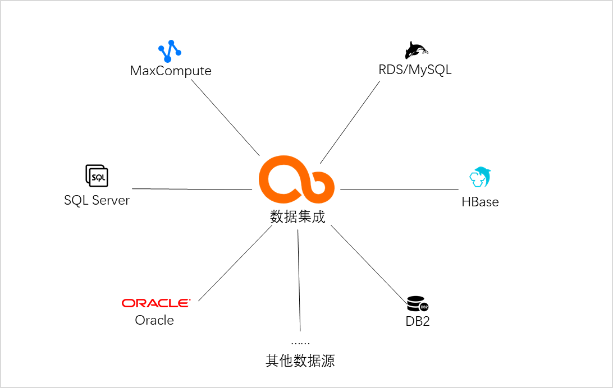
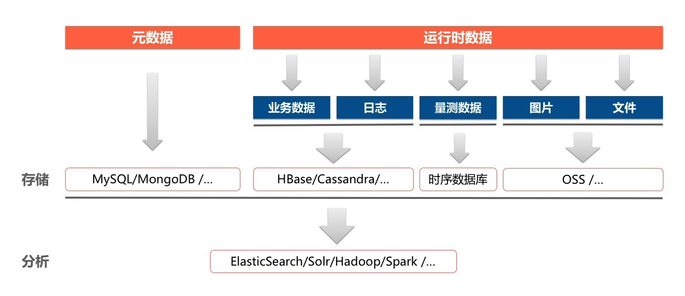
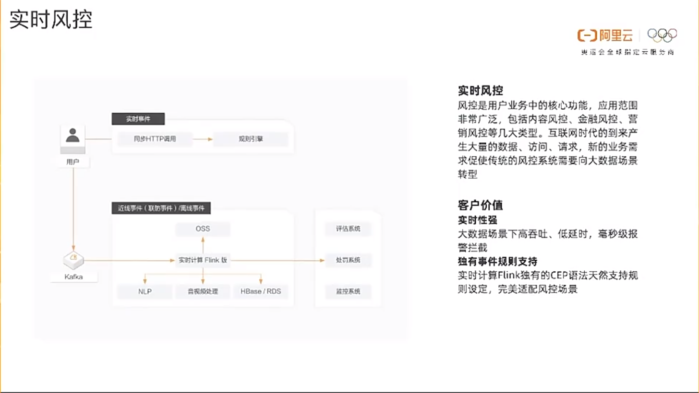
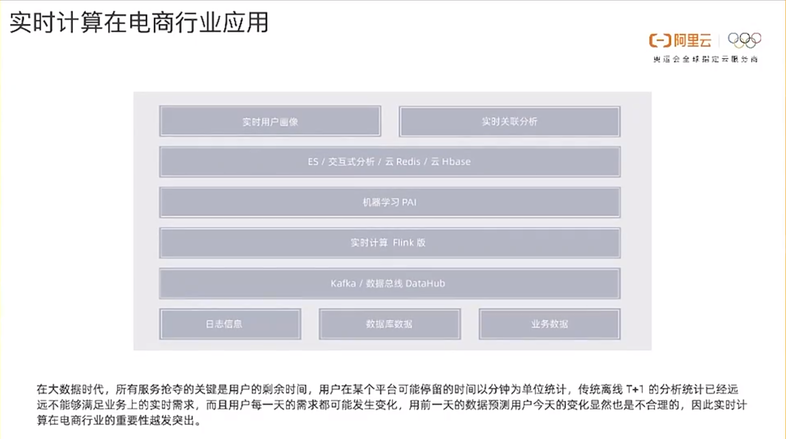
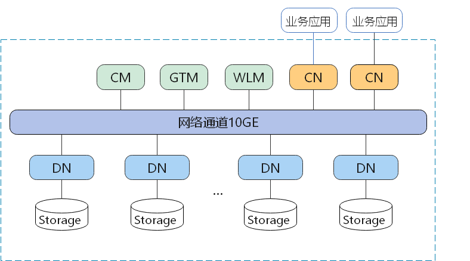

# 云计算和云原生

云的本质是一种提供稳定计算存储资源的对象，特点是虚拟化、弹性扩展、高可用、高容错、自恢复。

**serverless**："无服务器计算"。对于用户而言服务器变得"不可见了"，或者说"无感知"了。对于用户体现为购买CU，而不是直接购买VM。不再是提供云服务器，而是提供计算服务（CU）。

**云计算（Cloud Computing）**：在云上提供了计算存储资源，如Iaas，Paas，Saas。

**云原生（CloudNative）**

云原生是一种构建和运行应用程序的的方法 = 基于云计算的软件开发应用方式，是一套技术体系和方法论。

CloudNative = Cloud + Native

**Cloud**：表示应用程序运行在云中，而不是传统的数据中心（IDC）。

**Native**：表示应用程序从设计之初就考虑到云的环境。原生为云而设计，在云上以最佳的姿态运行，充分利用和发挥云平台的弹性+分布式的优势。

云原生的特点：

- **微服务**

  - 应用通过RESTful API通信
  - 可被独立部署、更新、scale和重启

- **DevOps**

  - 自动化发布管道，CI工具
  - 快速部署到生产环境，CD工具
  - 开发、运维协同合作

- **持续交付**

  频繁发布、快速交付、快速反馈、降低发布风险

- **容器化**

  微服务的最佳载体

# 公有云

公有云产品对标

| 阿里云                          | 华为云                                | 腾讯云                                                       | AWS      | 微软Azure                                                   | 备注                                                         |
| ------------------------------- | ------------------------------------- | ------------------------------------------------------------ | -------- | ----------------------------------------------------------- | ------------------------------------------------------------ |
| E-MapReduce                     | MRS                                   | 弹性MapReduce                                                |          |                                                             |                                                              |
| MaxCompute                      | 数据仓库服务GaussDB(DWS)-标准数仓     | emr                                                          | Redshift |                                                             |                                                              |
| DataWorks                       | DataArts Studio                       | Wedata                                                       |          |                                                             | 大数据开发治理平台，数据中台                                 |
| 数据湖构建DLF                   | 湖仓构建 LakeFormation                |                                                              |          |                                                             | 快速构建数据湖，数据源入湖                                   |
| 实时数仓Hologres                | 数据仓库服务 GaussDB(DWS)-实时数仓    | 个人理解CDWPG可以查询emr的离线数据，也可以接入kafka等实时数据作为实时数仓 |          |                                                             | 类似与doris、starrocks、clickhouse这种MPP架构的实时数仓      |
|                                 |                                       |                                                              |          | Azure Data Lake Storage Gen2                                |                                                              |
| OSS                             | OBS                                   | COS                                                          | S3       | Azure Blob                                                  | 对象存储                                                     |
| Data Lake Analytics，DLA        | 数据湖探索 DLI                        | 数据湖计算DLC                                                |          | Data Lake Analytics(2024年弃用) Azure Synapse Analytics | 数据湖分析。可以分析多种数据源中的数据                       |
|                                 |                                       |                                                              |          | Azure 数据目录                                              |                                                              |
| DataWorks数据集成               | DataArts Studio数据集成               | 数据集成（DataInLong）                                       |          | Azure 数据工厂                                              |                                                              |
| Databricks 数据洞察             |                                       |                                                              |          | Azure Databricks                                            | 大数据分析平台                                               |
| Quick BI 数据可视化分析平台     |                                       | 商业智能分析 BI（Business Intelligence，BI）                 |          |                                                             | BI服务平台，报表、仪表盘                                     |
| DataV数据可视化                 | DLV                                   | 大数据可视交互系统 RayData                                   |          |                                                             | 可视化大屏看板                                               |
| 智能数据建设与治理 Dataphin     |                                       |                                                              |          |                                                             |                                                              |
| 机器学习平台PAI                 |                                       |                                                              |          |                                                             |                                                              |
| 数据总线DataHub                 | 数据接入服务DIS                       |                                                              |          |                                                             |                                                              |
| 表格存储Tablestore              | 表格存储服务 CloudTable               | 弹性MapReduce-HBase                                          |          |                                                             |                                                              |
| Lindorm                         | 表格存储服务 CloudTable MRS-HBase | 弹性MapReduce-HBase                                          |          |                                                             |                                                              |
| 云数据库 HBase 版               | 表格存储服务 CloudTable MRS-HBase | 弹性MapReduce-HBase                                          |          |                                                             |                                                              |
| E-MapReduce-Doris               | 表格存储服务 CloudTable-Doris版       | 弹性MapReduce-Starrocks 云数据仓库for Apache Doris       |          |                                                             |                                                              |
| 实时计算Flink版（Flink 全托管） | Cloud Stream Service, 简称CS          | Oceanus                                                      |          |                                                             | oceanus 1、创建oceanus集群 2、创建工作空间 3、oceanus关联到工作空间 4、进入工作空间，开发、调试、发布、运行oceanus作业 |
|                                 |                                       |                                                              |          | AKS                                                         | kubernetes服务                                               |
| SLB                             | ELB                                   | CLB                                                          |          | 负载均衡器                                                  |                                                              |
| DTS                             | DRS                                   | DTS                                                          |          | DMS                                                         |                                                              |

## 阿里云

### Hologres

hologres的查询引擎是阿里云完全自研的执行引擎。但是猜测应该是基于postgreSQL进行二次开发的。

hologres百问百答https://developer.aliyun.com/ask/392046?spm=a2c6h.13066369.question.27.74d91863O05nHL

开源的**分布式分析查询系统**主要有两大类：

- 一类是传统的 Massively Parallel Processing 系统，能够支持通用的 SQL 查询，但是对实时场景支持不够好，性能不够理想。
- 一类是 Apache Druid 和 ClickHouse这些实时数仓，是专门为实时场景设计和优化的，能够比较好地支持一些常见的单表实时查询，但是复杂查询的性能比较差。
- 另外大数据生态圈基于 MapReduce 的引擎比较适合批处理 ETL，一般不太适合在线服务和多维分析的场景，性能也差不少。

**Hologres的典型应用场景**：https://help.aliyun.com/document_detail/113665.html?spm=a2c4g.604340.0.0.4db93627QpKObX

- **搭建实时数仓**

  实时写入业务数据至实时计算后，使用ETL（Extract Transformation Load）方式清洗、转换及整理数据。您可以通过Hologres实时查询并输出数据至第三方分析工具进行实时分析。典型应用场景如下：

  - 数据部门搭建阿里云实时数仓、展示实时大屏和分析实时Reporting报表。
  - 运维和数据应用部门执行实时监控、实时异常检测预警与实时调试。
  - 业务部门进行实时风控、实时推荐、实时效果分析和实时训练。

  

- **MaxCompute加速查询**

  写入业务数据至离线数据仓库MaxCompute，通过Hologres直接加速查询或导入数据至Hologres查询，并对接BI分析工具，实现实时分析离线数据。典型应用场景如下：

  - 实时查询MaxCompute离线数据。
  - 分析MaxCompute离线数据报表。
  - 输出MaxCompute离线数据的在线应用，例如RESTful API的使用。

  

- **联邦分析实时数据和离线数据**

  业务数据分为冷数据和热数据，冷数据存储在离线数据仓库MaxCompute中，热数据存储在Hologres中。Hologres可以联邦分析实时数据和离线数据，对接BI分析工具，快速响应简单查询与复杂查询的业务需求。

**实时数仓的用途**：

- 实时大屏

  如实时内容热点分析

- 实时风控

  如实时用户行为分析

- 实时监控

  如用户增长和活跃度监控分析

- 实时推荐

  如文章视频实时推荐、实时广告投放

### Delta Lake

Delta Lake是DataBricks公司推出的一种数据湖方案。Delta Lake以数据为中心，围绕数据流走向（数据从流入数据湖、数据组织管理和数据查询到流出数据湖）推出了一系列功能特性，协助您搭配第三方上下游工具，搭建快捷、易用和安全的数据湖。详情请参见[Delta Lake概述](https://help.aliyun.com/document_detail/148369.htm)。

### DLF

数据湖构建（Data Lake Formation，DLF）是一款全托管的快速帮助用户构建云上数据湖及Lakehouse的服务，为客户提供了统一的元数据管理、统一的权限与安全管理、便捷的数据入湖能力以及一键式数据探索能力。DLF可以帮助用户快速完成云原生数据湖及Lakehouse方案的构建与管理，并可无缝对接多种计算引擎，打破数据孤岛，洞察业务价值。

阿里云数据入湖，以前DLF是支持数据入湖的：

- 实时入湖：实时计算Flink版：参考如[MySQL CDC DataStream Connector](https://help.aliyun.com/document_detail/299187.htm)
- 离线入湖：DataWorks产品：[数据集成概述](https://help.aliyun.com/document_detail/137663.htm?spm=a2c4g.602499.0.0.32463e6dwz4qUr)。

DLF的作用：用户使用数据湖构建面向大数据分析和机器学习场景可以获得集中式权限管理和统一的元数据视图，更容易对接云上大数据和分析产品。

**阿里云EMR老集群（MySQL做元数据），阿里云EMR新集群（DLF做元数据）。**

### DLA

云原生数据湖分析（简称DLA）是新一代大数据解决方案，采取计算与存储完全分离的架构，支持数据库（RDS\PolarDB\NoSQL）与消息实时归档建仓，提供弹性的Spark与Presto，满足**在线交互式查询**、**流处理**、**批处理**、**机器学习**等诉求，也是传统Hadoop方案上云的有竞争力的解决方案。DLA的方案架构图如下所示：

#### 业务场景

对象存储OSS可以作为湖存储，DLA基于OSS构建一站式的大数据平台。具体包括构建数据湖、数据ETL、交互式查询、机器学习等功能。

- 构建数据湖

  - [实时数据湖](https://help.aliyun.com/document_detail/173653.html#task3084)：支持DB的CDC与消息数据（如Kafka）入湖，构建大规模的可以增删改查的数据集，延迟为T+10分钟。
  - [一键建仓](https://help.aliyun.com/document_detail/129965.html#concept-2420148) ：支持数据库一键入湖，T+1天。
  - 文件上传：数据上传后，DLA元数据发现功能可自动发现并构建好元数据体系。

- 数据ETL：DLA支持Spark，提供强大的数据ETL能力，把ODS层的原始数据清洗为结构化的DW数据。

- 机器学习：DLA支持Spark，支持开源算法库。

- 交互式分析：DLA提供Presto交互式分析，支持BI、分析师的数据分析诉求。

- 联邦分析：DLA Presto可对接数十种数据源对各种数据源进行查询。

  

  轻量级清洗方案：可以通过Presto满足轻量级数据ETL，从OSS写入数据到数据库。

DLA支持的引擎：

- serverless presto
- serverless spark
  - spark sql
  - PySpark
  - Spark MLlib
  - Spark Streaming

DLA的能力：

- 统一，标准的SQL语法
- 统一元数据管理
- 多数据源联邦查询
- 实时数据入湖
- 离线数据入湖
- 批处理
- 流处理

### MaxCompute

MaxCompute 是面向分析的企业级 SaaS 模式云数据仓库，以 Serverless 架构提供快速、全托管的在线数据仓库服务，消除了传统数据平台在资源扩展性和弹性方面的限制，最小化用户运维投入，使您可以经济并高效的分析处理海量数据。

简而言之，MaxCompute是一个SaaS的离线数仓。支持流式实时写入，近实时分析（支持的计算引擎为MR、Spark）。

购买内容与**实施计算Flink版**相似，只需要指定所需的CU即可。

阿里云中的RAM用户就相当于腾讯云中的子用户。

MaxCompute对外暴露的是project、table、resource、function等，因为是Saas产品，并没有直接暴露底层文件，底层文件托管在飞天分布式文件系统pangu中。因此MC可以存储数据，但是访问数据是通过查询表的方式实现的。

MaxCompute的主要优势如下：

- 简单易用

  - 面向数据仓库实现高性能存储、计算。
  - 预集成多种服务，标准SQL开发简单。
  - 内建完善的管理和安全能力。
  - 免运维，按量付费，不使用不产生费用。

- 匹配业务发展的弹性扩展能力

  存储和计算独立扩展，动态扩缩容，按需弹性扩展，无需提前规划容量，满足突发业务增长。

- 支持多种分析场景

  支持开放数据生态，以统一平台满足数据仓库、BI、近实时分析、数据湖分析、机器学习等多种场景。

- 开放的平台

  - 支持开放接口和生态，为数据、应用迁移、二次开发提供灵活性。
  - 支持与Airflow、Tableau等开源和商业产品灵活组合，构建丰富的数据应用。

项目是MaxCompute的基本组织单元，类似于传统数据库的Database或Schema的概念，是进行多用户隔离和访问控制的主要边界。

表是MaxCompute的数据存储单元。

分区Partition是指一张表下，根据分区字段（一个或多个字段的组合）对数据存储进行划分。

MaxCompute指引：https://help.aliyun.com/document_detail/252791.html?spm=a2c4g.414492.0.0.1bb42caf6i2aeM

常见的DataWorks+MaxCompute的技术架构如下图所示：

#### 数仓的基本概念

构建MaxCompute数据仓库的整体流程如下。

#####  湖仓一体

与MaxCompute对标的产品

MaxCompute和Hive对比

#### 迁移

[从Hadoop 迁移到 MaxCompute](https://www.aliyun.com/activity/bigdata/maxcompute-migration?spm=5176.7944453.J_7721567390.1.69ff5d53MNYUcX)

[从其它云迁移到 MaxCompute](https://www.aliyun.com/activity/bigdata/maxcompute-migration)

[从传统数仓迁移到 MaxCompute](https://www.aliyun.com/activity/bigdata/maxcompute-migration)

##### 迁移工具

 MaxCompute Migration Assistant (MMA) 

DataWorks 迁移助手

### DataWorks

DataWorks基于阿里云ODPS/EMR/CDP等大数据引擎，为**数据仓库**/**数据湖**/**湖仓一体**等解决方案提供统一的全链路大数据开发治理平台。作为阿里巴巴数据中台的建设者，DataWorks从2009年起不断沉淀阿里巴巴大数据建设方法论，同时与数万名政务/金融/零售/互联网/能源/制造等客户携手，助力产业数字化升级。

ODPS就是现在的MapCompute。

DataWorks的功能特性：

- 数据集成

  异构数据源之间高速稳定的数据移动及同步能力。

  - 离线同步
  - 实时同步
  - 整库同步。同步某数据源的某库的所有表
  - 批量同步。同步多个数据源的库表
  - 全增量实时同步

  数据集成的引擎架构为星型架构，如下图所示：

  

  数据集成的常见场景：

  - 搬迁上云。业务数据库如MySQL、Oracle等迁移到云上。
  - 实时数仓。批流数据汇集。
  - 平台融合。数据在不同云厂商的平台之间流动，在阿里云上不同云产品之间流动，实现数据同步，数据的融合。
  - 容灾备份

  离线数据同步原理，基于DataX

  

  离线同步引擎支持的数据源

  

  实时数据同步的原理

  

- 数据开发与运维中心

  DataWorks的数据开发即DataStudio。

  - DataStudio支持MaxCompute、EMR、CDH、Hologres、AnalyticDB、Clickhouse等多种计算引擎，支持在统一的平台上进行各类引擎任务的开发、测试、发布和运维等操作。
  - DataStudio支持智能编辑器、可视化依赖编排，调度能力经过阿里集团内调度任务、复杂业务依赖的反复验证。
  - DataStudio提供隔离的开发和生产环境，结合版本管理、代码评审、冒烟测试、发布管控、操作审计等配套功能，帮助企业规范地完成数据开发。
  - 运维中心支持数据时效性保障、任务诊断、影响分析、自动运维、移动运维等功能。

- 数据建模

  - **数仓规划**：数仓规划支持数仓分层、数据域、数据集市等的规划，支持设置模型设计空间，不同部门可共享一套数据标准和数据模型。
  - **数据标准**：数据标准字段标准、标准代码、度量单位、命名词典的定义，支持标准代码自动生成质量规则，落标检查不再难。
  - **维度建模**：维度建模支持逆向建模，解决现有数仓的建模冷启动难题，支持可视化数仓维度建模，支持通过Excel文件导入模型和通过FML（一种类SQL的DSL）快速构建模型，支持与数据开发DataStudio无缝打通，自动生成ETL代码。
  - **数据指标**：数据指标支持原子指标、派生指标的定义与构建，与维度建模无缝打通，可根据原子指标和不同维度批量创建派生指标。

  

- 数据分析

  - 什么是数据分析？

    

    

  - 数据分析的过程

    

  - 本地 VS在线数据分析

    

  - 一些问题

    

- 数据质量

  数据质量以数据集（DataSet）为监控对象，支持监控MaxCompute数据表和DataHub实时数据流。当离线MaxCompute数据发生变化时，数据质量会对数据进行校验，并阻塞生产链路，以避免问题数据污染扩散。同时，数据质量提供历史校验结果的管理，以便您对数据质量进行分析和定级。

  数据质量为您解决以下问题：

  - 数据库频繁变更问题
  - 业务频繁变化问题
  - 数据定义问题
  - 业务系统的脏数据问题
  - 系统交互导致质量问题
  - 数据订正引发的问题
  - 数据仓库自身导致的质量问题

- 数据地图

  DataWorks的数据地图功能可以帮助您实现对数据的统一管理和血缘的跟踪。

  [数据地图](https://help.aliyun.com/document_detail/118931.htm#concept-265529)以数据搜索为基础，提供表使用说明、数据类目、数据血缘、字段血缘等工具，帮助数据表的使用者和拥有者更好地管理数据、协作开发。

- 数据服务

  从数据表中获取数据；

  对数据进行包装、处理成API；

  将API提供给其他人用；

- 开放平台

  DataWorks开放平台是DataWorks对外提供数据和能力的开放通道。DataWorks开放平台提供开放API（OpenAPI）、开放事件（OpenEvent）、扩展程序（Extensions）的能力，可以帮助您快速实现各类应用系统对接DataWorks、方便快捷的进行数据流程管控、数据治理和运维，及时响应应用系统对接DataWorks的业务状态变化。

- 迁移助手与迁云服务

  使用场景：

  

  迁移助手与迁云服务主要功能包括：

  - 任务上云：实现将开源调度引擎的作业搬迁至DataWorks上。

    

  - DataWorks迁移：实现DataWorks体系内的开发成果互相迁移。

### DataHub

数据总线。阿里云流数据处理平台数据总线DataHub是流式数据（Streaming Data）的处理平台，提供对流式数据的发布 (Publish)，订阅 （Subscribe）和分发功能，让您可以轻松构建基于流式数据的分析和应用。支持数据接入、数据投递、数据缓存、数据。

看起来跟Kafka很相似。

DataHub的应用场景：

- 实时数据通道

  通过数据总线，业务数据能够实时汇入大数据系统，缩短数据分析周期。对外，大数据系统与业务系统解耦，对内，大数据系统各组件之间解耦。

  

- 实时数据清洗和分析

  接入多种数据源，实时进行清洗、过滤、关联与转换，产出结构化数据。

  

- 实时数据仓库

  从Lambda架构到Kappa架构，通过数据总线搭建原始数据层，实时明细层和实时汇总层，打造实时数据仓库。传统Lambda架构的两条链路缩减为一条，大大降低维护成本。数仓是大数据的基础，实时化的数仓能够让BI、报表、推荐（用户标签产出）等多种业务收益，大数据系统总体向实时化迈进。

  

### Lindorm

阿里云自研数据库，提供宽表、时序、文件、搜索等多种数据模型，支持毫秒级在线数据处理、海量数据低成本存储和分析。使用统一SQL融合多模数据的实时查询、检索和分析，流库一体、内置流计算引擎满足实时计算需求。满足金融、账单、日志、物联网、车联网、工业互联网、监控、推荐、风控和医疗影像等多业务场景需求。

我认为Lindorm是一款Saas产品，基本免运维的。

其核心能力包括：

- 多模超融合：支持宽表、时序、对象、文本、队列、空间等多种数据模型，模型之间数据互融互通，具备数据接入、存储、检索、计算、分析等一体化融合处理与服务的能力，帮助应用开发更加敏捷、灵活、高效。

  多模型的核心能力主要由以下几大数据引擎提供，包括：

  - `宽表引擎`，如HBase、Cassandra。

    负责宽表与对象数据的管理和服务，具备全局二级索引、多维检索、动态列、TTL等能力，适用于元数据、订单、账单、画像、社交、feed流、日志等场景，兼容SQL、HBase、Cassandra（CQL）、S3等标准接口。

    支持千万级高并发吞吐，支持百PB级存储，吞吐性能是开源HBase（Apache HBase）的3~7倍，P99时延为开源HBase（Apache HBase）的1/10，平均故障恢复时间相比开源HBase（Apache HBase）提升10倍，支持冷热分离，压缩率比开源HBase（Apache HBase）提升一倍，综合存储成本为开源HBase（Apache HBase）的1/2。

  - `时序引擎`，如OpenTSDB。

    负责时序数据的管理和服务，主要面向工业、IoT、监控等领域的量测数据、监控数据以及设备运行数据提供基于SQL的管理、写入、查询能力。针对时序数据设计的压缩算法，压缩率可达15:1。支持海量数据的多维查询和聚合计算，同时也支持时序数据的预降采样和持续查询。

  - `搜索引擎`，如ElasticSearch，Solr。

    负责多模数据的检索分析加速，其基于列存、倒排等核心技术，具备全文检索、聚合计算、复杂多维查询等能力，适用于日志、账单、画像等场景，兼容SQL、开源Solr等标准接口。

  - `文件引擎`，如HDFS。

    负责目录文件数据的管理和服务，并提供宽表、时序、搜索引擎底层共享存储的服务化访问能力，从而加速多模引擎底层数据文件的导入导出及计算分析效率，兼容开源HDFS标准接口。

  - `计算引擎`，如Spark、Flink。

    计算引擎与Lindorm存储引擎深度融合，基于云原生架构提供的分布式计算服务，满足用户在数据生产、交互式分析、机器学习和图计算等场景的计算需求，兼容开源Spark标准接口。

  - `流引擎`，如TODO

    云原生多模数据库Lindorm流引擎是面向流式数据处理的引擎，提供了流式数据的存储和轻计算功能，帮助您轻松实现流式数据存储至云原生多模数据库Lindorm，构建基于流式数据的处理和应用。

- 高性价比：支持千万级高并发吞吐、毫秒级访问延迟，并通过多级存储介质、智能冷热分离、自适应特征压缩，大幅减少存储成本。

- 云原生弹性：支持计算资源、存储资源独立弹性伸缩，并提供按需即时弹性、按使用量付费的Serverless服务。

- 开放兼容：兼容SQL、HBase/Cassandra/S3、TSDB、HDFS、Solr、Kafka等多种标准接口，支持与Hadoop、Spark、Flink、Kafka等系统无缝打通，并提供简单易用的数据交换、处理、订阅等能力。

#### Lindorm和其他相似产品的对比

- Lindorm VS HBase VS Cassandra

  HBase和Cassandra都是宽表数据模型，而Lindorm支持宽表、时序、搜索、文件等多种数据模型。详细对比见：https://help.aliyun.com/document_detail/181750.html?spm=a2c4g.185927.0.0.47de58fcok5km7

- Lindorm VS OpenTSDB
	OpenTSDB是基于Hbase的分布式的，可伸缩的时间序列数据库。而Lindorm支持宽表、时序、搜索、文件等多种数据模型。

- Lindorm VS ElasticSearch VS Solr

  ElasticSearch，solr仅支持搜索，而Lindorm支持宽表、时序、搜索、文件等多种数据模型。

- Lindorm VS HDFS

  HDFS是分布式文件系统，即对应上面的文件引擎。而Lindorm支持宽表、时序、搜索、文件等多种数据模型。

从上面的介绍来看，Lindorm就是集成了宽表数据模型、时序数据模型、搜索数据模型、文件数据模型等，具有多合一个功能。且功能能力更强、性能更好、且是Saas化的，零运维等优势。

#### 为什么会诞生Lindorm这个产品？

##### 业务背景

伴随着信息技术的飞速发展，各行各业在业务生产中产生的数据种类越来越多，有结构化的业务元数据、业务运行数据、设备或者系统的量测数据、日志，也有半结构化的业务运行数据、日志、图片或者文件等。按照传统方案，为了满足多种类型数据的存储、查询和分析需求，在设计IT架构时，需要针对不同种类的数据，采用不同的存储分析技术，如下图：

这种技术方案，是一种典型的技术碎片化的处理方案。针对不同的数据，使用不同的数据库来处理。有如下几个弊端：

- 涉及的技术组件多且杂
- 技术选型复杂
- 数据存取、数据同步的链路长

当前信息化技术发展面临的一个主要矛盾是"日益多样的业务需求带来的多种类型数据与数据存储技术架构日趋复杂成本快速上升之间的矛盾"。伴随5G、IoT、智能网联车等新一代信息技术的逐步普及应用，这个矛盾会越来越突出。为了解决这个问题，阿里云自研了云原生多模数据库Lindorm，满足多模型数据的统一存储、查询和分析需求。如下图所示，与传统方案相比，Lindorm系统极大地简化数据存储技术架构设计，大幅度提升系统稳定性，降低建设成本投入。

Lindorm创新性地使用存储计算分离、多模共享融合的云原生架构，以适应云计算时代资源解耦和弹性伸缩的诉求。其中云原生存储引擎LindormStore为统一的存储底座，向上构建各个垂直专用的多模引擎，包括宽表引擎（**LindormTable**）、时序引擎（**LindormTS**）、搜索引擎（**LindormSearch**）、文件引擎（**LindormFile**）。

在创建Lindorm时，需要根据需求选择每种引擎类型的节点规格和数量，如下图所示：

Lindorm Tunnel通道服务（简称LTS），原名为BDS。应用场景为：不停服数据迁移、在线和离线业务分离、主备容灾、RDS历史库建设。

### 云数据库HBase

### 实时计算Flink版（Flink 全托管）

参考文章：https://help.aliyun.com/document_detail/445467.html

#### 实时计算Flink的原理

**业务特征/需求**，要求实时计算或离线计算。而实时计算对应的技术为流处理，离线计算对应的技术为批处理。

在流处理中，数据的价值随着时间的推移快速降低，因此需要快速地能够对数据进行处理、分析，发挥其价值。

#### 实时计算Flink的技术场景

Flink的三个技术场景：

- stream analytics
- stream pipeline
- event-driven application

##### stream analytics

- batch analytics：传统的分析方式通常是利用批查询，或将时间记录下来并基于此有限数据集构建应用来完成。为了得到最新数据的分析结果，必须先将它们加入分析数据集并重新执行查询或运行应用，随后将结果写入存储系统或生成报告。
- stream analytics：流式查询应用会接入实时事件流，并随着事件消费持续产生和更新结果。这些结果数据可能会写入外部数据库系统或以内部状态的形式维护。仪表展示应用可以相应地从外部数据库读取数据或这几查询应用的内部状态。

**流式分析应用的优势？**

和批量分析相比，由于流式分析省掉了周期性的数据导入和查询过程，因此从事件中获取指标的延迟更低。不仅如此，批量查询必须处理那些由定期导入和输入有界性导致的人工数据边界，而流式查询则无需考虑该问题。

**Flink如何支持数据分析类应用？**

Flink内置了一个符合ANSI标准的SQL接口，将批、流查询的语义统一起来。无论是在记录事件的静态数据集上还是实时事件流上，相同SQL查询都会得到一直的结果。同时Flink还支持丰富的用户自定义函数，允许在SQL中执行定制化代码。如果还需进一步定制逻辑，可以利用Flink DataStream API和DataSet API进行更低层次的控制。

##### stream pipeline

数据管道和ETL作业的用途相似，都可以转换、丰富数据，并将其从某个存储系统移动到另一个。但数据管道是以持续流模式运行，而非周期性触发。因此它支持从一个不断生成数据的源头读取记录，并将它们以低延迟移动到终点。例如：数据管道可以用来监控文件系统目录中的新文件，并将其数据写入事件日志；另一个应用可能会将事件流物化到数据库或增量构建和优化查询索引。

周期性ETL：对应批处理

数据管道：对应流处理

**数据管道的优势？**

和周期性ETL作业相比，持续数据管道可以明显降低数据移动到目标端的延迟。此外，由于它能够持续消费和发送数据，因此用途更广，支持用例更多。

**Flink如何支持数据管道应用？**

很多常见的数据转换和增强操作可以利用Flink的SQL接口（或Table API）及用户自定义函数解决。如果数据管道有更高级的需求，可以选择更为通用的DataStream API来实现。Flink为多种数据存储系统（如：Kafka、Kinesis、Elasticsearch、JDBC数据库系统等）内置了连机器。同时它还提供了文件系统的连续型数据源及数据汇，可用来监控目录变化和以时间分区的方式写入文件。

##### event-driven application

事件驱动型应用是一类具有状态的应用，它从一个或多个事件流提取数据，并根据到来的时间触发计算、状态更新或其他外部动作。事件驱动型应用是基于状态话流处理来完成。在该设计中，数据和计算不会分离，应用只需访问本地（内存或磁盘）即可获取数据。系统容错性的实现依赖于定期向远程持久化存储写入checkpoin。下图描述了传统应用和时间驱动型应用架构的区别。

**事件驱动型应用的优势？**

事件驱动型应用无需查询远程数据库，本地数据访问使得它具有更高的吞吐和更低的延迟。而由于定期向远程持久化存储的checkpoint工作可以异步、增量式完成，因此对于正常时间处理的影响甚微。事件驱动型应用的优势不仅限于本地数据访问。传统分层架构下，通常多个应用会共享同一个数据库，因而任何对数据库自身的修改（例如：由应用更新或服务扩容导致数据布局发生改变）都需要谨慎协调。反观数据驱动型应用，由于只考虑自身数据，因此在更改数据表示或服务扩容时所需的协调工作将大大减少。

**Flink如何支持事件驱动型应用？**

事件驱动型应用会受制于底层流处理系统对时间和状态的把控能力。Flink诸多优秀特质都是围绕这些方面来设计的。它提供了一系列丰富的状态操作原语，允许以精确一次的一致性语义合并海量规模（TB级别）的状态数据。此外，Flink还支持事件时间和自由度极高的定制化窗口逻辑，而且它内置的ProcessFunction支持细粒度的时间控制，方便实现一些高级业务逻辑。同时，Flink还拥有一个复杂事件处理（CEP）类库，可以用来检测数据流中的模式。

#### 实时计算Flink的应用场景

- 实时数仓
- 实时风控
- 实时机器学习

##### 实时数仓

**实时数仓**：传统意义上将数据汇总到离线计算引擎，通过N+1天生成数据报表的模式已经不能满足快速增长的业务需求，互联网的在线特性也将业务需求推向了实时化，随时根据当前客户行为而调整策略变得越来越常见，传统数仓开始向实时数仓转型。

**客户价值**：

- 快速相应业务需求：秒级返回业务指标，快速进行多维分析。
- 节省用户成本：业务结果实时数据化，协助用户及时调整方向，减少无用投入。

##### 实时风控

**实时风控**：风控是用户业务中的核心功能，应用范围非常广泛，包括内容风控、金融风控、营销风控等几大类型。互联网时代的到来产生大量的数据、访问、请求，新的业务需求促使传统的风控系统需要向大数据场景转型。

**客户价值**：

- 实时性强：大数据场景下高吞吐、低延时，毫秒级报警拦截。
- 独有事件规则支持：实时计算Flink独有的CEP语法天然支持规则设定，完美适配风控场景。

##### 实时机器学习

**实时机器学习**：机器学习作为大数据的重要场景在越来越多的行业中得到应用，但传统的算法，主要侧重于使用静态模型和历史数据进行训练并提供预测，如何针对用户短期的行为进行准确的、个性化的预测，从而动态实施决策就成为新的难题。

**客户价值**：

- 运营精细化：可支持百万级客户快速画像，精准定位用户特性，个性化运行提高客户成交量和留存率。
- 低门槛：无缝集成实施计算学习算法平台，一站式完成数据开发、模型训练、场景预测全流程。

#### 实时计算Flink的行业案例

- 金融行业应用

  

- 在线教育行业应用

  

- 内容资讯行业应用

  

- 电商行业应用

  

- 广告行业应用

  

#### Flink SQL

##### Flink SQL介绍

Flink SQL的特点：

- 声明式：Flink顶层API稳定、易使用。

- 流批统一：统一的开发体验语义一致性。

- 自动优化：屏蔽流计算State复杂性，自动优化Plan，AutoPilot自动调优。

- 广泛应用：数据集成、实时报表、实时风控。

  

基本操作

窗口聚合

维表Lookup Join

##### Flink SQL上手演示

##### Flink 开发中常见问题

Q. 实时计算如何入手？

Q. 如何设定作业的初始资源？

Q. 复杂作业如何调试？

Q. 作业如何性能调优？

## 腾讯云

### Hologres

20230704腾讯云目前没有完全对标Hologres产品。那么如果有阿里云Hologres迁移到腾讯云的需求，那应该将Hologres迁移到腾讯云的什么产品呢？

个人理解：

> Hologres是一个实时数仓，它的上层应用主要为业务实时报表、实时大屏等
>
> Hologres可以分析OSS上的数据，可以通过建立外表分析MC上的离线数据。实时数据可以通过Flink实时写入Hologres供上层应用分析查询使用。
>
> 综上分析，我认为腾讯云这边的CDW-PG基本可满足上述功能。
>
> CDW-PG可以建立外表分析COS上的离线数据；
>
> 实时数据可以通过Flink/Oceanus写入到CDW-PG中，供上层应用分析查询。
>
> 

### Wedata

wedata对标阿里云Dataworks，是大数据开发治理平台。

数据开发治理平台 WeData（以下简称 WeData）是位于云端的一站式数据开发治理平台，融合了包含**数据集成**、**数据开发**、**任务运维**的全链路 DataOps 数据开发能力，以及**数据地图**、**数据质量**、**数据安全**等一系列**数据治理和运营能力**，帮助企业在数据构建和应用的过程中实现降本增效，数据价值最大化。

​																										产品架构图	

WeData 整体架构由运营管理体系和开发运营工具构成：

运营管理体系主要包括：多租户管理、多环境管理以及平台开放等。 运营管理体系为数据环境的隔离以及数据的安全流通提供基础保障，多环境管理使得 WeData 支持对接不同的数据引擎，包括私有云 TBDS 以及大部分公有云基础产品，例如弹性 MapReduce、云数据仓库和数据湖计算 DLC 等，平台开放支持将 WeData 的能力以开放 API、开放消息和插件的形式对用户开放，方便与第三方集成和实现定制化能力。

开发运营工具包括：DataOps 敏捷数据生产、全链路数据治理和一体化数据运营。 DataOps 敏捷数据生产遵循“DataOps”理念，规范数据生产过程，通过敏捷迭代的方式提升数据生产效率，全链路数治理通过数据质量、数据安全和成本优化在事前、事中和事后保障数据生产和消费全过程，提升数据质量和可用性，一体化运营以数据价值释放为目标，通过数据地图、数据洞察和数据共享让用户快速的完成数据发现、数据理解、数据洞察和数据应用，降低数据使用门槛，缩短数据价值释放路径。

**应用场景**

- **企业级数据仓库构建**

  腾讯云数据开发治理平台 WeData 提供完善的数据处理功能，覆盖数据仓库构建全链路。从异构数据源数据导入，到通过丰富的大数据组件支持对数据开发、任务编排、任务运维等全过程的支持，对数仓各层次各数据域进行规范化生产，确保数据规范性、完整性、及时性等，最后通过数据导出或 API 服务的方式，将数据仓库生产的规范数据应用于企业各类型的数据业务，助力企业用数据赋能经营。

  

- **数据资产治理**

  数据资产是企业核心资产的重要组成部分，对于数据驱动型公司，更是最核心的资产。然而，大数据与生俱来的异构性、复杂性、高成本等特性，伴随着企业业务的多样性和复杂性的发展，使得从原始数据经过处理后得到的就绪数据，体现出质量低下、成本高企、理解困难、安全无保障等问题，并未能如预期直接被业务使用。 

  WeData 在核心数据处理能力的基础上，提供了一系列数据治理能力，帮助企业将数据的方方面面治理起来，使得数据能够被放心大胆地应用于业务，高效为业务创造价值

  

- **离线数仓/数据中台解决方案——WeData+EMR**

  基于 WeData 提供的数据集成和开发能力，汇聚来自业务侧的海量数据，然后借助 EMR 强大的 PB 级数据计算与存储能力，提供高性能企业级离线数仓方案，并可通过 WeData 对数仓进行统一安全管理和数据质量治理，提供统一的、规范化的数仓体系，为用户进一步挖掘数据价值提供支持。

  

- **实时数仓解决方案——DataInLong/Oceanus+CDW**

  在云数仓 CDW-PG/CK 提供的大规模并行处理和 OLAP 分析能力之上，由 Oceanus 进行实时数据处理，帮助用户快速汇聚和收集数据，构建轻量化、低成本、可弹性伸缩的实时数仓，并可配套 UDP 进行数据目录管理，当用户需要进一步的数据治理能力时，Oceanus 可平滑升级至 WeData，为用户提供更进一步的数据加工、质量治理、探索分析能力。

  

- **全托管数据湖解决方案——DataInLong/WeData+DLC**

  在 DLC 提供的**存算分离**海量大数据分析架构之上，通过 **DataInLong 的实时数据入湖和清洗能力**，实现来自业务侧的多元异构数据的统一汇聚，构建低成本、高弹性、全托管数据湖方案，DataInLong 可以平滑升级至 WeData，为用户提供更进一步的数据加工、质量治理、探索分析能力。

  

- **数据可视化解决方案——WeData+BI**

  基于 WeData 提供的数仓指标管理和数据服务能力，连通数据到业务的“最后一公里”，配合 BI 提供的自助报表搭建和可视化分析能力，为用户使用数据提供更加便捷、简易、直观的呈现方式，同时，借助 WeData 强大的数据资产治理能力，为数据的规范性、准确性、一致性提供保障，使数据辅助决策业务更加可靠。

  

wedata中有两种计算资源：

- **集成资源**

  被数据集成任务所使用的资源。

- **调度资源**

  被分析调度任务所使用的资源。

wedata可以使用腾讯云的某些计算引擎，如EMR-Hadoop、云数据仓库PostgreSQL（简称CDWPG）、DLC。

wedata中的账号（CAM账号）可以与EMR-Hadoop、CDWPG、DLC中账号建立映射关系，这样就可以使用wedata来使用其计算资源。

### DLC

#### 什么是腾讯云数据湖计算 DLC？

腾讯云数据湖计算 DLC（Data Lake Compute，DLC）提供了敏捷高效的数据湖分析与计算服务。该服务采用无服务器架构（Serverless ）设计，用户无需关注底层架构或维护计算资源，使用标准 SQL 即可完成对象存储服务（COS）及其他云端数据设施的联合分析计算。借助该服务，用户无需进行传统的数据分层建模，大幅缩减了海量数据分析的准备时间，有效提升了企业数据敏捷度。

DLC提供了敏捷高效的数据湖分析与计算服务。该服务采用无服务器架构（**Serverless**）设计，用户无需关注底层架构或维护计算资源，使用标准 SQL 即可完成对象存储服务（COS）及其他云端数据设施的联合分析计算。借助该服务，用户无需进行传统的数据分层建模，大幅缩减了海量数据分析的准备时间，有效提升了企业数据敏捷度。DLC 采用**存算分离**的海量大数据分析架构，基于大数据组件**容器化**实现快速灵活部署，基于云原生对象存储的方式实现无限拓展，结合 DLC 先进的云原生弹性模型，充分贴合业务真实使用曲线，真正为您节省成本。DLC 以低成本、高弹性的云原生数据湖解决方案，助力企业建立统一数据资产，最大化发挥性能优势，赋能业务应用敏捷创新。

DLC支持如下功能：

- 统一的标准SQL语法

- 统一元数据视图

  在EMR、DLC 和其他各类数据源产品可能各有一份元数据，容易形成数据孤岛，而DLC可以统一这些元数据，集中管理和使用不同数据源的元数据，

- 实时数据入湖

  我的理解，计算引擎只有spark jar、spark sql和presto，DLC并不具有实时分析的能力。

  DataInlong的实时写入或Flink/Oceanus的实时写入能力

- 离线数据入湖

  DataInlong的离线写入能力

- 批处理

- 流处理

- DLC支持跨数据源的联合查询（支持presto计算引擎）

  目前支持的数据源有，都是paas产品：

  - MySQL
  - SQLserver
  - EMR-hive
  - clickhouse
  - CDWPG
  - COS

- 丰富多源数据科学支持

**DLC支持的引擎**：

- spark jar
- spark sql
- presto

DLC可以用来：

- 分析COS上的数据（外表）

  外表一般指数据文件放到您自己账号下的 COS 桶，DLC 可以直接建立外表进行分析，无需额外加载数据。基于外表的特性，例如在执行 drop table 等动作时，DLC 并不会删除您的原始数据，只会删除 table 的元信息。

- 分析DLC原生表中的数据

  DLC支持将数据导入到DLC的原生表中，DLC原生表基于Iceberg，查询性能更高。支持如下几种数据导入方式。

  - DLC控制台手动导入，生产不推荐
  - DataInlong实时数据导入
  - Flink/Oceanus实时数据导入
  - DataInlong离线数据导入
  - SQL语法`SELECT INSERT`将外部表的数据查询后写入原生表

- 多数据源联邦查询分析

  在不搬迁数据的前提下，通过SQL分析多个数据源的数据

  支持联邦查询的数据源，直接DLC中SQL查询分析。除EMR以外的数据源都是

  （1）先将数据同步到DLC侧（不同于DLC的原生表）

  （2）再进行分析。性能相比于原始数据源查询会差一些。

**数据湖计算 DLC 和云数据仓库的关系与区别是什么？**

数据湖计算 DLC 和云数据仓库都是位于云端的数据基础设施，用户基于该产品对企业数据集合进行存储和分析计算，以获取海量数据洞察力。

云数据仓库基于高性能 MPP 技术架构构建，以向客户提供稳定、高性能的数据仓库存储和计算能力。客户通常用该产品构建数据分层架构，以支撑企业在经营分析、用户画像、企业资产分析等相对稳定的数据集合存储和分析。 

数据湖计算 DLC 基于 Serverless 技术构建，为客户提供云端数据湖存储中温冷数据的高性能分析能力及多源数据设施（对象存储、云数据库、云数据仓库等）的联合计算能力。该产品开箱即用、随用随弃，具备高度灵活性。

通常情况下，数据湖计算 DLC 与弹性 MapReduce（EMR）、云数据仓库 PostgreSQL、云数据仓库 ClickHouse 等产品形成融合数据湖技术架构，以大幅提升企业数据敏捷度。

### Oceanus

流计算 Oceanus 是大数据产品生态体系的实时化分析利器，是**基于 Apache Flink 构建的**具备一站开发、无缝连接、亚秒延时、低廉成本、安全稳定等特点的企业级实时大数据分析平台。流计算 Oceanus 以实现企业数据价值最大化为目标，加速企业实时化数字化的建设进程。

流计算 Oceanus 主要应用于以下场景：

- 异构数据服务间的实时 ETL（抽取、转换、加载）

  **实时 ETL**

  ETL 是将业务系统的数据经过抽取、清洗转换之后加载到目的端的过程，目的是将企业中的分散、零乱、标准不统一的数据整合到一起，为企业的决策提供分析依据。

  

- 实时推荐、实时风控、数据库查询加速等

  **金融实时风控**

  在金融应用场景中，快速探测到风险能够有效地减少损失，将金融交易大数据与流计算 Oceanus 相结合，引入特征模型算法，及时过滤出诸如盗刷卡等异常交易行为，实施风险控制以提升金融安全系数。

  

  

  **电商精准推荐**

  在电商交易场景中，借助于云端流计算 Oceanus，实时提取特征变量及跟踪用户关注品类，以预测用户的消费趋势，为精准推荐提供基础能力，从而提升用户购物体验、促进消费行为。

  

  **数据库查询加速**

  关系型数据库在海量数据下容易遇到查询性能不足、可扩展性差的挑战。通过流计算 Oceanus 将数据从关系型数据库实时同步到 ES， 借助 ES 的海量数据高并发低延时查询、SQL、弹性扩展等能力，更好地满足数据库查询加速的需求，弥补传统关系型数据库的不足。

  

- 实时数仓、实时大屏、实时报表等

  

- 实时监控、实时异常发现和预警等

  **物联网（IoT）监控**

  在工业设备运转过程中，及早发现潜在故障能够极大地降低生产风险。通过云端流计算 Oceanus，实时汇聚工业传感器数据，并进行聚合计算和异常分析筛选，便可实现设备的秒级监控和异常告警，保障工业生产的平稳运行。

  

Oceanus快速入门

- 创建工作空间，在工作空间中可以创建、调试、发布作业
- 创建Oceanus集群，就是购买多少个CU（1CU=1C4GB），推荐6CU的倍数，单机群建议最大800CU
- 将Oceanus集群关联到某工作空间，关联后该工作空间中的作业可以使用这个Oceanus集群的计算资源来运行作业
- 进入工作空间，新建作业：
  - SQL作业，编写SQL
  - JAR作业，上传jar包，指定主类，参数
  - ETL作业，拖拽并配置ETL工作流
  - Python作业，上传python文件，指定入口类，参数
- Oceanus需要使用COS来保存作业的checkpoint、jar包、python文件、投递日志等。

### EMR

弹性 MapReduce (EMR) 是基于云原生技术和泛 Hadoop 生态开源技术的安全、低成本、高可靠的开源大数据平台。提供易于部署及管理的 Hive、Spark、HBase、Flink、StarRocks、Iceberg、Alluxio 等开源大数据组件，帮助客户高效构建云端企业级数据湖技术架构。EMR 支持基于 CVM、TKE 两种资源部署形态。

																											

​																								产品架构

**应用场景**

- **离线数据分析**

  把游戏、Web 应用、手机 App 等业务服务器上的海量日志同步到 EMR 的数据节点或 COS 后，可借助于 Hue 等工具，使用 Hive、Spark、Presto 等主流计算框架快速获取数据洞察力。可使用 Sqoop 等工具加载分散于各 TencentDB 或其他存储引擎的数据，并把分析后的数据同步到 TencentDB，为 RayData 这样的数据可视化产品提供数据支撑。

  

- **流式数据处理**

  在程序/工具中通过 API、SDK 把位于业务服务器上实时产生的数据 Push 到 **CMQ 消息中间件**之后，可在 EMR 产品中选择合适的流式数据处理引擎来分析数据，以实现对业务变动的实时告警；还可以把分析结果实时同步到 TencentDB 等存储引擎，以便于通过 RayData 等数据可视化产品对业务状态进行实时可视化检测。

  

- **分析 COS 数据**

  可通过 EMR 产品快速分析存储于 COS 上的海量数据，以实现彻底的存储计算分离。通过这样的设计，可充分利用 COS 提供的丰富数据同步工具，同时还可以让多个不同版本 Hadoop 集群分析同一份数据，以满足数据一致性及历史原因导致的多版本 Hadoop 集群共存的问题。

  

产品

- **EMR-Hadoop集群**
- **EMR-ZooKeeper集群**
- **EMR-HBase集群**
- **EMR-Presto集群**
- **EMR-Kudu集群**
- **EMR-Kafka集群**
- **EMR-Starrocks集群**

### DataInlong

数据集成（DataInLong）源于腾讯开源并孵化成功的 ASF 顶级项目 Apache InLong（应龙），依托 InLong 百万亿级别的数据接入和处理能力支持**数据采集**、**汇聚**、**存储**、**分拣数据处理**全流程，在跨云跨网环境下提供可靠、安全、敏捷的全场景异构数据源集成能力。

- **离线同步**

  数据集成提供离线数据同步能力，该能力通过定期运行方式批量读取来源库表中数据并同步写入至目标端。

- **实时同步**

  数据集成提供实时数据同步能力，该能力支持流式数据传输。实时同步下支持单表、分库分表、多库多表粒度的实时数据消费，任务类型包括单表同步、整库同步、以及日志采集。实际底层还是基于Flink做实时ETL同步。

  单表同步：来源端为单张表或分库分表，目标端仅支持一张表。单表同步采用固定schema搭配的方式，需在任务中指定来源与目标表之间的字段映射关系，任务运行时仅将指定来源字段内容写入至目标字段。详情请参考[单表同步任务配置]()。

  整库同步：整库同步支持将来源端整个实例、或者指定的多个库表对象内的全部数据同步至目标端的多张表中。此任务无需指定来源与目标端之间的字段映射关系，默认所有来源表字段全部读取，且表与表之间字段默认同名匹配。详情请参考[整库同步任务配置]()。

  日志采集：日志采集通过 Agent、SDK 方式主动上报 CVM 云实例、自建服务器或TKE内的日志文件数据至外部目标端。详情请参考[日志采集任务配置]()。

## 华为云

### DataArts Studio

**企业数字化转型面临的挑战**

企业在进行数据管理时，通常会遇到下列挑战。

- 数据治理的挑战
  - 缺乏企业数据体系标准和数据规范定义的方法论，数据语言不统一。
  - 缺乏面向普通业务人员的高效、准确的数据搜索工具，数据找不到。
  - 缺乏技术元数据与业务元数据的关联，数据读不懂。
  - 缺乏数据的质量管控和评估手段，数据不可信。

- 数据运营的挑战
  - 数据运营效率低，业务环境的快速变化带来大量多样化的数据分析报表需求，因为缺乏高效的数据运营工具平台，数据开发周期长、效率低，不能满足业务运营决策人员的诉求。
  - 数据运营成本高，数据未服务化，导致数据拷贝多、数据口径不一致，同时数据重复开发，造成资源浪费。
- 数据创新的挑战
  - 企业内部存在大量数据孤岛，导致数据不共享、不流通，无法实现跨领域的数据分析与数据创新。
  - 数据的应用还停留在数据分析报表阶段，缺乏基于数据反哺业务推动业务创新的解决方案。

数据治理中心DataArts Studio是为了应对上述挑战，针对**企业数字化**运营诉求提供的具有数据全生命周期管理和智能数据管理能力的**一站式治理运营平台**，包含**数据集成**、**数据开发**、**数据架构**、**数据质量监控**、**数据资产管理**、**数据服务**、**数据安全**等功能，支持行业知识库智能化建设，支持大数据存储、大数据计算分析引擎等数据底座，帮助企业快速构建从数据接入到数据分析的端到端智能数据系统，消除数据孤岛，统一数据标准，加快数据变现，实现数字化转型。

​																										产品架构图

如图所示，DataArts Studio基于数据湖底座，提供数据集成、开发、治理等能力。**DataArts Studio支持对接所有华为云的数据湖与数据库云服务作为数据湖底座，例如MRS Hive、数据仓库服务DWS等，也支持对接企业传统数据仓库，例如Oracle、MySQL等**。

**应用场景**

- **一站式的数据运营治理平台**

  从**数据采集**->**数据架构**->**质量监控**->**数据清洗**->**数据建模**->**数据联接**->**数据整合**->**数据消费**->**智能分**析，一站式数据智能运营平台，帮助企业快速构建数据运营能力。

  

- **云上数据平台快速搭建**

  快速将线下数据迁移上云，将数据集成到云上大数据服务中，并在DataArts Studio的界面中就可以进行快速的数据开发工作，让企业数据体系的建设变得如此简单。

  

- **基于行业领域知识库快速构建数据中台**

  通过应用华为在企业业务领域积累的丰富的行业领域模型和算法，帮助企业构建数据中台，快速提升数据运营能力。

  

### MRS

企业自行部署Hadoop系统有成本高，周期长，难运维和不灵活等问题。

针对上述问题，华为云提供了大数据MapReduce服务（MRS），MRS是一个在华为云上部署和管理Hadoop系统的服务，一键即可部署Hadoop集群。MRS提供租户完全可控的一站式企业级大数据集群云服务，完全兼容开源接口，结合华为云计算、存储优势及大数据行业经验，为客户提供高性能、低成本、灵活易用的全栈大数据平台，轻松运行Hadoop、Spark、HBase、Kafka、Storm等大数据组件，并具备在后续根据业务需要进行定制开发的能力，帮助企业快速构建海量数据信息处理系统，并通过对海量信息数据实时与非实时的分析挖掘，发现全新价值点和企业商机。

​																							产品架构

**应用场景**

- **海量数据分析场景**

  海量数据分析是现代大数据系统中的主要场景。通常企业会包含多种数据源，接入后需要对数据进行ETL（Extract-Transform-Load）处理形成模型化数据，以便提供给各个业务模块进行分析梳理，这类业务通常有以下特点：

  - 对执行实时性要求不高，作业执行时间在数十分钟到小时级别。
  - 数据量巨大。
  - 数据来源和格式多种多样。
  - 数据处理通常由多个任务构成，对资源需要进行详细规划。

  例如在环保行业中，可以将天气数据存储在OBS，定期转储到HDFS中进行批量分析，在1小时内MRS可以完成10TB的天气数据分析。

  

- **海量数据存储场景**

  用户拥有大量结构化数据后，通常需要提供基于索引的准实时查询能力，如车联网场景下，根据汽车编号查询汽车维护信息，存储时，汽车信息会基于汽车编号进行索引，以实现该场景下的秒级响应。通常这类数据量比较庞大，用户可能保存1至3年的数据。

  例如在车联网行业，某车企将数据储存在HBase中，以支持PB级别的数据存储和毫秒级的数据详单查询。

  

- **实时数据处理**

  实时数据处理通常用于异常检测、欺诈识别、基于规则告警、业务流程监控等场景，在数据输入系统的过程中，对数据进行处理。

  例如在梯联网行业，智能电梯的数据，实时传入到MRS的流式集群中进行实时告警。

  

### 云数据仓库 GaussDB(DWS)

数据仓库服务GaussDB(DWS) 是一种基于华为云基础架构和平台的在线数据处理数据库，提供即开即用、可扩展且完全托管的分析型数据库服务。GaussDB(DWS)是基于华为融合数据仓库GaussDB产品的云原生服务 ，兼容标准ANSI SQL 99和SQL 2003，同时兼容PostgreSQL/Oracle数据库生态，为各行业PB级海量大数据分析提供有竞争力的解决方案。

DWS有三种：

- **标准数仓**

  高性价比，支持冷热数据分析，存储、计算弹性伸缩，无限算力、无限容量，并按需、按量计价。适用于“库、仓、市、湖”一体化的融合分析业务，是OLAP分析场景的首选。

- **IoT数仓**

  在大规模数据查询和分析能力基础上，提供高并发、高性能、低时延、低成本的事务处理能力。适用于HTAP混合负载场景，“一库两用，生产即分析”，支持单机部署和集群部署两种部署方式。

- **实时数仓**

  在标准数仓基础上，提供高效的时序计算和IoT分析能力，支持实时和历史数据关联，内置时序算子，最高40x压缩。适用于物联网IoT等实时分析场景。

​																							产品架构图

GaussDB(DWS) 基于Shared-nothing分布式架构，具备MPP (Massively Parallel Processing)大规模并行处理引擎，由众多拥有独立且互不共享的CPU、内存、存储等系统资源的逻辑节点组成。在这样的系统架构中，业务数据被分散存储在多个节点上，数据分析任务被推送到数据所在位置就近执行，并行地完成大规模的数据处理工作，实现对数据处理的快速响应。

​																								集群逻辑架构

**应用场景**

- **数据仓库迁移**

  数据仓库是企业的重要数据分析系统，随着业务量的增长，自建数仓性能逐渐不能满足实际要求，同时扩展性差、成本高，也使扩容极为困难。GaussDB(DWS) 作为云上**企业级数据仓库**，具备高性能、低成本、易扩展等特性，满足大数据时代企业数据仓库业务诉求。

  

- **大数据融合分析**

  随着信息技术的发展和进步，数据资源已经成为企业的核心资源。整合数据资源，构建大数据平台，**发现数据价值**，成为企业经营的新趋势和迫切诉求。而如何从海量数据中快速挖掘“价值”，成为助力客户实现预测性分析的关键要素。

  

- **增强型ETL和实时BI分析**

  数据仓库在整个BI系统中起到了支柱的角色，更是海量数据收集、存储、分析的核心。为IoT（Internet of things）、金融、教育、移动互联网、O2O（Online to Offline）等行业提供强大的商业决策分析支持。

  

- **实时数据分析**

  移动互联网、IoT场景下会产生大量实时数据，为了快速获取数据价值，需要对数据进行实时分析，GaussDB(DWS) 的快速入库和查询能力可支持实时数据分析。

  

  

### DLI

数据湖探索（Data Lake Insight，简称DLI）是完全兼容[Apache Spark](https://spark.apache.org/)、[Apache Flink](https://flink.apache.org/)、openLooKeng（基于[Presto](https://prestodb.io/)）生态，提供一站式的流处理、批处理、交互式分析的**Serverless**融合处理分析服务。用户不需要管理任何服务器，即开即用。

DLI支持标准SQL/Spark SQL/Flink SQL，支持多种接入方式，并兼容主流数据格式。数据无需复杂的抽取、转换、加载，使用SQL或程序就可以对云上[CloudTable](https://support.huaweicloud.com/productdesc-cloudtable/cloudtable_01_0002.html)、[RDS](https://support.huaweicloud.com/productdesc-rds/zh-cn_topic_dashboard.html)、[DWS](https://support.huaweicloud.com/productdesc-dws/dws_01_0002.html)、[CSS](https://support.huaweicloud.com/productdesc-css/css_04_0001.html)、[OBS](https://support.huaweicloud.com/productdesc-obs/zh-cn_topic_0045829060.html)、[ECS](https://support.huaweicloud.com/productdesc-ecs/zh-cn_topic_0013771112.html)自建数据库以及线下数据库的异构数据进行探索。

**DLI支持如下功能**：

- 支持标准SQL/Spark SQL/Flink SQL
- 实时数据入湖

- 离线数据入湖

- 批处理

- 流处理

- 支持跨数据源的联合查询（支持presto计算引擎）

  多种数据源。

- 存算分离

  可以分析OBS上的数据

**DLI支持的引擎**

- **Spark**
- **Flink**
- **openLooKeng（Presto）**

**应用场景**

- **海量日志分析**

  游戏公司不同部门日常通过游戏数据分析平台，分析每日新增日志获取所需指标，通过数据来辅助决策。例如：运营部门通过平台获取新增玩家、活跃玩家、留存率、流失率、付费率等，了解游戏当前状态及后续响应活动措施；投放部门通过平台获取新增玩家、活跃玩家的渠道来源，来决定下一周期重点投放哪些平台。

  

  ​																						游戏运营数据分析

- **异构数据源联邦分析**

  **车企数字化服务转型**

  面临市场新的竞争压力及出行服务不断变革，车企通过构建车联云平台和车机OS，将互联网应用与用车场景打通，完成车企数字化服务转型，从而为车主提供更好的智联出行体验，增加车企竞争力，促进销量增长。例如：通过对车辆日常指标数据（电池、发动机，轮胎胎压、安全气囊等健康状态）的采集和分析，及时将维保建议回馈给车主。

  

- **大数据ETL处理**

  **运营商大数据分析**

  运营商数据体量在PB~EB级，其数据种类多，有结构化的基站信息数据，非结构化的消息通信数据，同时对数据的时效性有很高的要求，DLI服务提供批处理、流处理等多模引擎，打破数据孤岛进行统一的数据分析。

  

- **地理大数据分析**

  **地理大数据分析**

  地理大数据具有大数据的相关特征，数据体量巨大，例如，全球卫星遥感影像数据量达到PB级。数据种类多，有结构化的遥感影像栅格数据、矢量数据，非结构化的空间位置数据、三维建模数据；在大体量的地理大数据中，通过高效的挖掘工具或者挖掘方法实现价值提炼，是用户非常关注的话题。

  

### 实时流计算服务CS

已合并到了DLI。

### DIS

### CloudTable

表格存储服务（CloudTable Service，简称CloudTable）为用户提供专属集群，即开即用，适合业务吞吐量大，时延要求低的用户。

- **CloudTable Hbase集群**

  CloudTable提供基于HBase全托管的NoSQL服务，提供毫秒级随机读写能力，适用于海量(半)结构化、时空、时序数据存储，可被广泛应用于物联网、车联网、金融、智慧城市、气象等行业。

- **CloudTable Doris集群**

  CloudTable提供基于Doris全托管的实时数仓服务，仅需亚秒级响应时间即可返回海量数据下的查询结果，不仅可以支持高并发的点查询场景，也可以支持高吞吐的复杂分析场景。因此，Doris能够较好的满足报表分析、即席查询、统一数仓构建、数据湖联邦查询加速等使用场景，用户可以在此之上构建用户行为分析、AB实验平台、日志检索分析、用户画像分析、订单分析等应用。

​																									产品架构

**应用场景**

- **物联网IoT设备监控**

  梯联网、燃气、水务、电力、化工、互联网等IoT设备通过物联网套件服务接入上云，设备数据和分析结果实时高效写入到CloudTable的时序数据库OpenTSDB中，通过OpenTSDB接口将时序结果输出到用户的前端监控系统进行展现，实现物联网设备实时监控分析系统。

- **消息日志类数据存储和查询**

  消息数据、报表数据、推荐类数据、风控类数据、日志数据、订单数据等结构化、半结构化的KeyValue数据均可以存储和查询。

- **车联网：位置大数据应用**

  在车联网中，通常会包含几类数据：车辆、驾驶员等基本信息，车况、电池、电机等监控数据，车辆路线。CloudTable引入了地理大数据处理套件GeoMesa，可以帮助物联网存储和分析海量时空(spatio-temporal)数据，提供区域分布统计、区域查询、密度分析、聚合、OD分析等功能。

- **画像数据存储和查询**

  画像通常用一些标签来刻画自然人/物的特征，而每一个自然人/物所拥有的标签集合是不确定的，数据更新非常频繁，这类数据被广泛应用于市场决策、推荐以及广告系统中。

- **Serverless Web/移动应用后端**

  使用CloudTable和函数服务FunctionGraph结合，用户可以快速构建高可用、自动伸缩的Web/移动应用后端。

- **通用海量KeyValue数据存储与查询**

  海量数据存储，实时查询。

### 数据湖构建LakeFormation

## AWS

TODO

## 微软云

TODO
