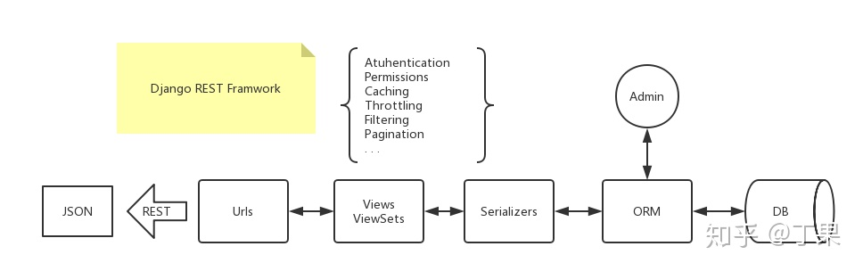
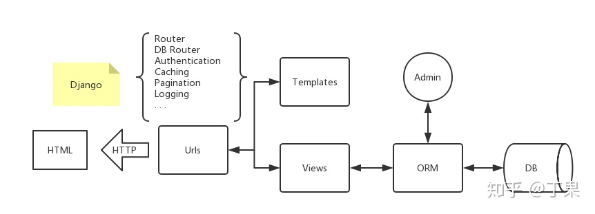
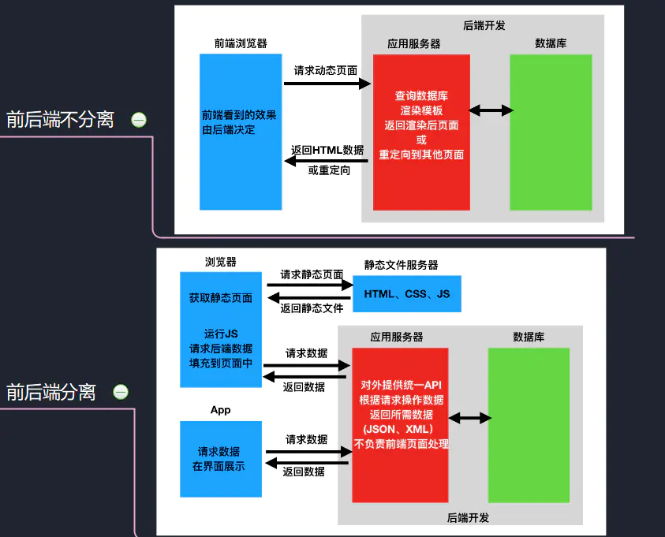
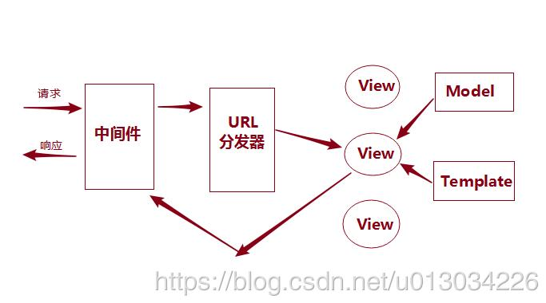

### 1. django rest framework

用于前后端分离场景下的后端代码开发。

### 2. Django

TODO

[Django 文档](https://docs.djangoproject.com/zh-hans/2.0/)

对Django的一点了解：

- Django是稳定的。使用 Django 搭建的网站能承受每秒 50000 次点击的流量峰值。
- Django是可扩展的。
- Django是一个MVC框架。当然，很多使用Django的人也管Django是MVT框架

### 3. Django REST framework(DRF)

[DRF](https://www.jianshu.com/p/fc603f48f100)

[Django REST framework 官网](https://www.django-rest-framework.org/)

流程：



安装和简单使用就直接看[DRF](https://www.jianshu.com/p/fc603f48f100)的首页就行了，这里是想讲一下DRF中的各种类。

DRF的核心概念：

- Serializers。DRF通过serializer可以将对象转换为python数据类型（`序列化`），也可以将python数据类型转换为对象（`反序列化`）。类似于Django中的`Form`和`ModelForm`类。
- Views。与Django一样，view分为CBV和FBV。DRF有一个APIView类，它是Django中View类的子类。
- Generic views。DRF的通用视图是为了方便开发者更快地构建API views。如果 generic views对于你要开发的API而言，不太合适的话，可以直接使用APIView、Mixins views。
- ViewSets。DRF支持将一组相关视图的逻辑组合在一起，作为一个Viewset。与Django中CBV略有不同的时，ViewSet并不提供任何处理方法（如：.get()，.post()，.delete()等），而是提供多种动作（actions，如：.list()， .create()等）。然后在使用ViewSet.as_view()时，将处理方法和动作绑定起来，这样更灵活一些。可以使用@action装饰来创建自己的动作。
- Requests。是对Django的`HttpResponse`的扩展，支持对REST框架请求的解析（parse）和验证（authentication）。
- Responses。是Django的 `SimpleTemplateResponse`的子类。REST框架通过提供一个Response类来支持HTTP内容协商，根据客户端请求决定应当返回什么类型的内容，请求中的Accept字段。DRF的Response类会调用Renderers的render()方法，将python类型的数据转换成客户端所接受的数据类型。
- Authentications。身份认证是将传入请求与一组标识凭据（例如，请求的用户或请求的token）相关联的机制。认证完成后，会将用户信息和认证信息写入request对象的user属性和auth属性中。request.user 和 request.auth的值是由authentication_classes中第一个认证成功的authentication类设置的。
- Permissions。决定哪个请求会被授权，哪个请求会被拒绝访问。使用认证之后的request.user和request.auth属性来进行权限处理。检查permission_classes中的所有类，只要有一个失败，则引发相应的异常，而主视图中的处理方法是不会被执行的。DRF支持对象级别的权限验证。
- Routers。DRF支持自动将URL映射到对应的视图的处理方法。
- Renderers。DRF将对传入的请求执行内容协商，并确定最合适的渲染器以满足该请求。如果客户端没有指定Accept或者Accept: \*/\*，则使用renderers中的第一个renderer来渲染response。


- Parsers。访问request.data时，DRF将检查传入的请求的Content-Type标头，并确定使用哪个解析器来解析请求内容。


- Caching。缓存。使用`@method_decorator(cache_page(60*60*2))`装饰器进行缓存设置。

- Throtting。限流用于控制客户端可以向API发出的请求的速率。限流不一定仅指限制请求速率。 例如，存储服务可能还需要限制带宽，而付费数据服务可能需要限制访问一定数量的记录。检查throtting_classes中的所有类，只要有一个失败，则引发相应的异常，而主视图中的处理方法是不会被执行的。

- Filtering。DRF的通用列表视图的默认行为是返回模型管理器的整个查询集。我们可以过滤返回的查询结果。

- Pagination。DRF支持分页，你可以自己决定返回的结果集的大小。


### 4. DRF 和Django是什么关系

[一图看懂Django和DRF](https://zhuanlan.zhihu.com/p/53957464)

[Django官网](https://www.djangoproject.com/)

[Django REST framework 官网](https://www.django-rest-framework.org/)

先简单看看Django和DRF有啥不同。




**最少的语言描述Django？**

将数据库的东西通过ORM的映射取出来，通过view文件，按照template文件排出的模板渲染成HTML。当用户请求相应的url时，返回相应的结果。

**最少语言描述DRF？**

将数据库的东西通过ORM的映射取出来，通过view和serializers文件绑定REST接口，当前端请求时，返回序列化好的json。

**最少语言描述DRF在Django的基础上做了什么？**

DRF是Django的超集，去掉了模板的部分，提供了一个REST的接口，同时也提供了满足该接口的代码工作流。同时，在REST的规范下，升级了权限和分页等功能，增加了限流和过滤搜索等功能。

**Django和DRF的tutorial分别讲了什么？**

Django的tutorial讲的是Django的ORM、template、url、admin以及Django怎么run起来等基础知识。

而DRF的tutorial讲的是serializers怎么写，view怎么写，在drf中view这一层既可以一个个get、post、从头开始写起，也可以采用抽象程度比较高的viewset去按配置生成。另外还讲了一些drf升级和新增的功能。

#### **[部署](https://link.zhihu.com/?target=https%3A//uwsgi-docs.readthedocs.io/en/latest/tutorials/Django_and_nginx.html)**

前后端分离的部署也可以用一张图来描述如下，这么一看是不是很清晰了呢！

```text
the web client <-> nginx <-> the socket <-> uwsgi <-> Django
```


```text
the web client <-> nginx <-> the socket <-> uwsgi <-> DRF
                          -> vue.js  - - - - - - - - - +
```




### 5. MVC和MVT的区别

https://www.pianshen.com/article/4893172543/

MVC，即Model-View-Controller，它的核心思想是分工、解耦，让不同的代码块之间降低耦合，增强代码的可扩展性和可移植性，实现向后兼容。MVC是一种框架模式。

设计模式是比框架更小的元素，一个框架中往往含有一个或多个设计模式。

> MVC
>
> - M即Model，封装对数据库层的访问
> - V即View，用于封装结果，生成页面展示的HTML内容
> - C即Controller，用于接收请求，处理业务逻辑，与Model和View交互。
>
> MVT
>
> - M即Model，封装对数据库层的访问
> - V即View，接收请求，处理业务逻辑，与Model和View交互
> - T即Template，用于封装结果，生成页面展示的HTML内容




==真正困难的是算法和结构，前者需要好的数学基础，后者需要对所要解决的问题有全面深刻的理解和规划==

https://blog.csdn.net/m0_37519490/article/details/80774069)