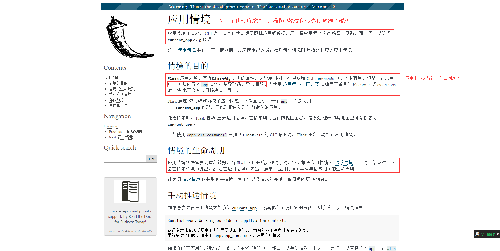
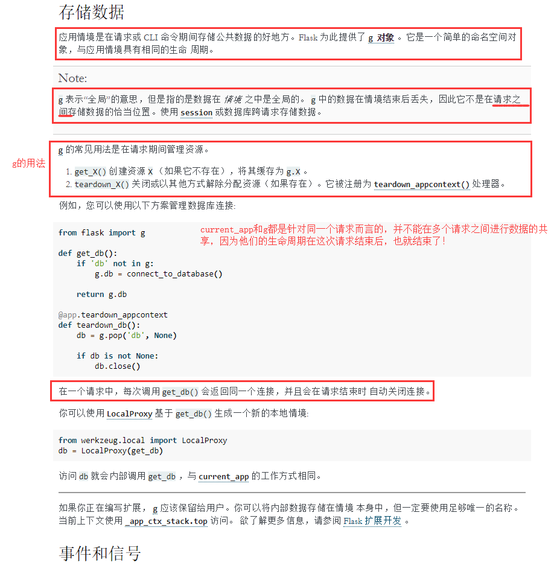
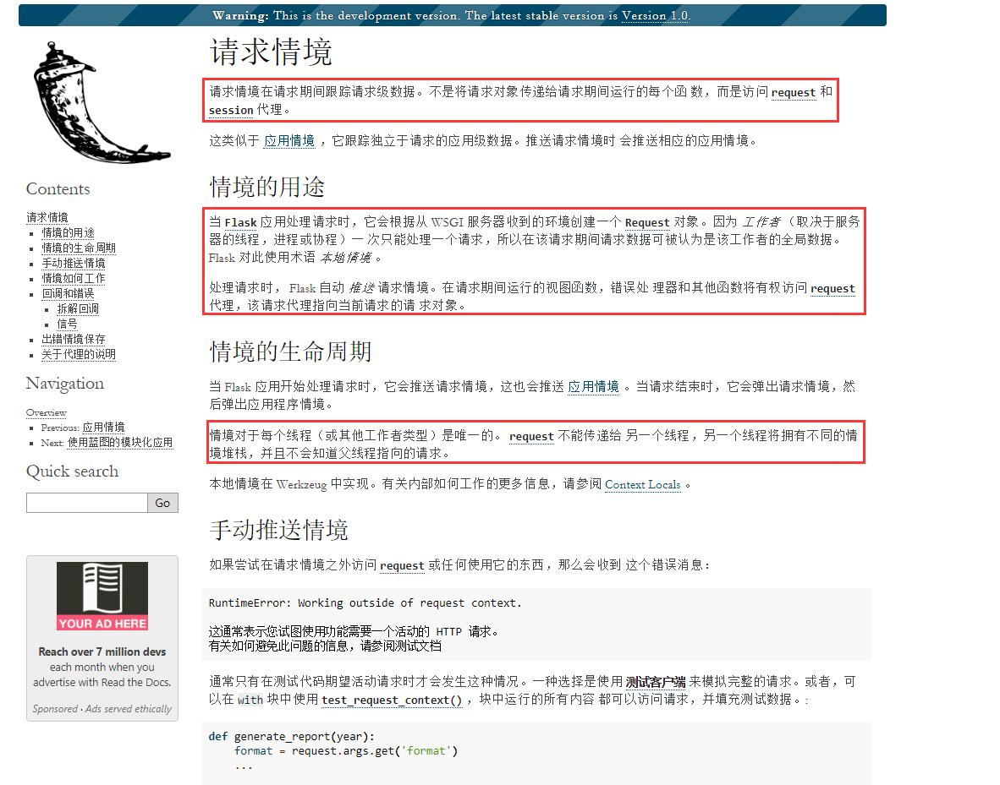
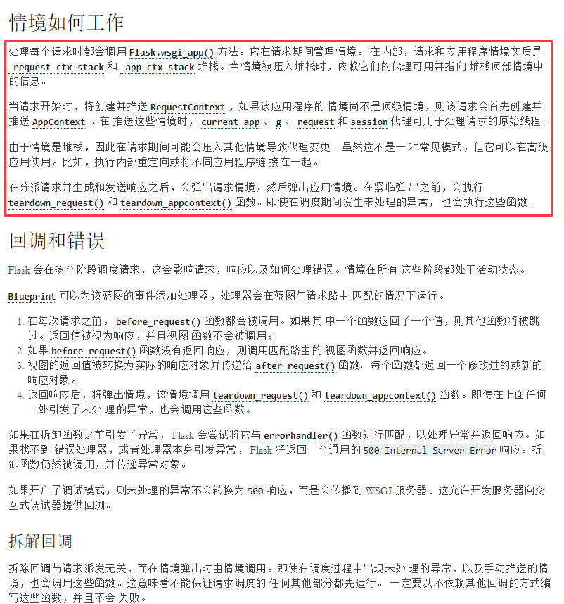

# Flask篇

### 0. 模板

项目布局


### 1. Flask

TODO

### 2. Flask中endpoint的理解

[Flask中endpoint的理解](https://www.cnblogs.com/eric-nirnava/p/endpoint.html)

Flask中，会有一个 url_map，保存着url与endpoint的映射，然后通过endpoint就能找到这个url对应的视图函数。

> 所以我们可以看出：**这个`url_map`存储的是`url`与`endpoint`的映射!**
> 回到flask接受用户请求地址并查询函数的问题。实际上，当请求传来一个url的时候，会先通过`rule`找到`endpoint`(`url_map`)，然后再根据`endpoint`再找到对应的`view_func`(view_functions)。通常，`endpoint`的名字都和视图函数名一样。
> 这时候，这个`endpoint`也就好理解了：
>
> ```
> 实际上这个endpoint就是一个Identifier，每个视图函数都有一个endpoint，
> 当有请求来到的时候，用它来知道到底使用哪一个视图函数
> ```

### 3. Flask中的请求上下文和应用上下文


- 请求上下文：`request`，`session`

- 应用上下文；`current_app`，`g`





`current_app`是在当前请求中用来访问当前的Flask应用的，例如，在蓝图中只有通过此方式才能访问到当前Flask应用，如`current_app.logger.info()`来生成日志信息。

`current_app`和`g`是用来在请求期间管理一些数据，避免总是要通过参数的方式传递给函数。例如，在一个请求过程中，处理该请求时，需要调用多个函数，这些函数都要访问数据，则可以将数据连接存到`g`中，然后在本次请求中可以通过`g`来直接获取数据库连接，请求结束后关闭数据库连接。

- 一是不用多次传递数据库连接给多个函数。
- 二是不用多次创建/关闭数据库连接。

==这些上下文，并不是真正的全局变量，它们是wekzeug的`local`对象，类似于Python的`thread local`（略有不同）。它们只是在当前线程中是全局有效的==，并不是我们之前所知道的进程中的全局变量。





#### werkzeug的`context local`

[Context Locals](https://werkzeug.palletsprojects.com/en/0.15.x/local/)

对于WSGI应用，使用全局变量是非线程安全的。

在Python的标准库中有一个概念--`thread locals`。`thread local`是一个全局变量，我们可以往里面放入数据，然后以线程安全的方式从中获取该数据。无论什么时候在`thread local`对象上设置值/获取值，`thread local`对象都会检查你现在处于哪个线程中，然后找到你所在线程的值，这样就保证了不会获取到其他线程的数据。

但是，这种方法有一些缺点。例如，在Python中除了thread之外，还有其他类型的并发，如`greenlets`。另外，WSGI并不能保证每个请求都有自己的线程。一个请求可能会重用之前某个请求的线程，因此数据需要保留在`thread local`对象中。

[廖雪峰Python教程 ThreadLocal](https://www.liaoxuefeng.com/wiki/1016959663602400/1017630786314240)

[Python中ThreadLocal的理解与使用](https://www.cnblogs.com/linpd/p/10051945.html)

==Python中的thread local可以简单理解为，key为线程id，值为thread local数据的字典。==

werkzeug提供了一种本地数据存储的实现，名为 `werkzeug.local`。`werkzeug.local`与Python的`thread local`相似，但是它使用的是`greenlets`。

`werkzeug.local`的使用示例：

```python
from werkzeug.local import Local, LocalManager

lcoal = Local()
local_manager = LocalManager([local])

def application(environ, start_response):
    local.request = request = Request(environ)
    ...
    
application = local_manager.make_middleware(application)
    
```

将request对象绑定到local.request，在==相同的上下文==（相同进程的，相同线程的，相同greenlet）的其他地方访问`local.request`得到的就是同一个request对象。`make_middleware()`方法确保在请求后清除对此local对象的所有引用。

### 4. Flask中是如何保持会话的？

首先，我们要知道

> 1. 浏览器通过输入用户名/密码，发送第一次request请求该网站
> 2. 该网站的服务器返回响应，并通过response.set_cookie()，让浏览器保存某些cookies
> 3. 当浏览器再次请求该网站时，会携带之前保存在浏览器中的cookies
> 4. 该网站的服务器会检测是否有携带cookies，携带的cookie是否与服务器所持有的session保持对应，该session是否还有效，有效则说明应该保持会话，无效则需要用户重新登录。

那么在这个过程中，Flask是如何处理session保持的呢？

在不是flask_session扩展的情况下，flask是将需要保持的session信息保留在内存中，如果机器宕机，则无法实现session保持。所以，通常我们都需要使用flask_session扩展来实现更好的session保持。

[flask学习笔记--flask内置session处理机制](https://blog.csdn.net/m0_37519490/article/details/80774069)