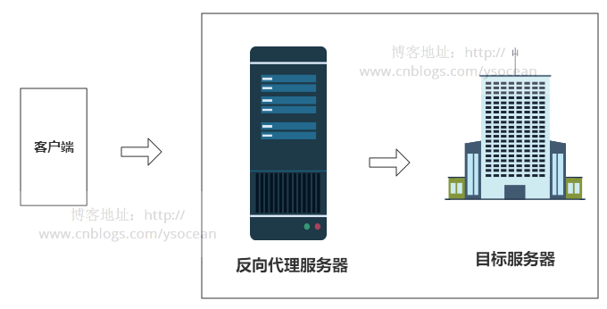

### 1. nginx是什么？特点是什么？

nginx，即 engine x，是一个web服务器和方向代理服务器，用于HTTP、HTTPS、SMTP、POP3和IMAP协议。

nginx 解决了服务器的C10K（就是在一秒之内连接客户端的数目为10k即1万）问题。它的设计不像传统的服务器那样使用线程处理请求，而是一个更加高级的机制—事件驱动机制，是一种异步事件驱动结构。

特点是：

- 反向代理，负载均衡器
- 高可靠性、单 Master 多 Worker 模式
- 高可扩展性、高度模块化
- 非阻塞
- 事件驱动
- 低内存消耗
- 热部署

### 2. 为什么要用nginx

当然是因为nginx的优点咯。轻量级、抗并发、模块化等。

### 3. 为什么nginx性能这么高，怎么实现高并发的

> 因为他的事件驱动机制：异步非阻塞事件处理机制：运用了epoll模型，提供了一个队列，排队解决

nginx为一群服务器做代理，每次请求经过nginx转发给不同的服务器；具体的由负载均衡的策略决定

在配置文件中，配置upStream 指向多个服务器并指定负载均衡的策略

在server中配置proxy_pass指向upstream

### 4. 怎么处理HTTP请求

nginx使用反应器模式。主事件循环等待操作系统发出准备事件的信号，这样数据就可以从套接字读取，在该实例中读取到缓冲区并进行处理。单个线程可以提供数万个并发连接。

### 5. 什么是正向代理和反向代理

正向代理，代理的是客户端，代理服务器和客户端对于服务端而言是一个整体，而服务端并不知道真正的客户端是谁，例如VPN。


正向代理的优点：

- 访问原本无法访问的网站，如google
- 用作上网认证，对用户进行访问授权
- 记录用户上网行为（访问记录），对外隐藏用户信息
- 可以做缓存，加速访问资源

反向代理，代理的服务端，代理服务器和服务端对于客户端而言是一个整体，客户端并不知道真正的服务器是谁。

反向代理的优点：

- 保证内网安全，隐藏了真是服务器的IP地址。
- 负载均衡，通过反向代理服务器来优化网站的负载



### 6. 使用反向代理服务器的优点是

反向代理的优点：

- 保证内网安全，隐藏了真是服务器的IP地址。
- 负载均衡，通过反向代理服务器来优化网站的负载


### 8. 如何用nginx解决前端跨域问题

在开发静态页面时，类似Vue的应用，我们常会调用一些接口，这些接口极可能是跨域，然后浏览器就会报cross-origin问题不给调。

最简单的解决方法，就是把浏览器设为忽略安全问题，设置--disable-web-security。不过这种方式开发PC页面到还好，如果是移动端页面就不行了。

**解决办法**

使用nginx转发请求。把跨域的接口写成调本域的接口，然后将这些接口转发到真正的请求地址。

**先：**

调试页面是：http://192.168.1.100:8080/

请求的接口是：http://ni.hao.sao/api/get/info

**步骤一：**

请求的接口是：http://192.168.1.100:8080/api/get/info

PS：这样就解决了跨域问题。

**步骤二：**

安装好nginx后，去到/usr/local/etc/nginx/目录（这是Mac的），修改nginx.conf文件。

```
server{
        listen 8888;
        server_name  192.168.1.100;
 
        location /{
            proxy_pass http://192.168.1.100:8080;
        }
 
        location /api{
            proxy_pass http://ni.hao.sao/api;
        }
    }
```


### 9. 限流怎么做的，算法是什么

[nginx实战（六）nginx实现限流](https://blog.csdn.net/ouyida3/article/details/86768526)

nginx官方版本限制IP的连接和并发分别有两个模块：

-  limit_req_zone 用来限制单位时间内的请求数，即速率限制,采用的漏桶算法 “leaky bucket”。
-  limit_req_conn 用来限制同一时间连接数，即并发限制。
-  limit_zone，已废弃

```
    limit_conn_log_level notice;
    limit_conn_status 503;
    limit_conn_zone $server_name zone=perserver:10m;
    limit_conn_zone $binary_remote_addr zone=perip:10m;
    limit_req_zone $binary_remote_addr zone=allips:100m   rate=2r/s;
    
    server {
        listen 8080;
        limit_conn perserver 250;
        limit_conn perip 2;
        limit_req  zone=allips  burst=3  nodelay;
        limit_rate_after 5m;
        limit_rate 800k;
        location / {
           proxy_pass http://132.120.2.73:8080;
        }
    }

```

这是一个生产上完整的例子。里面按服务器限流、按ip限流、burst nodelay都用上、按速率限流、判断是否大文件才限速率，全部都有了。并且日志级别、超过限流时返回什么错误也有了。应该是比较全了。

如果一开始看不懂没关系，先作个引子，回头再看来，检验自己是否会配置了。

特别注意，limit_zone已经废弃了，不要再用了，网上可能有一些旧的博客会继续有这个。

### 10. 为什么要做动静分离

在我们的软件开发中，有些请求是需要后台处理的（如：.jsp,.do等等），有些请求是不需要经过后台处理的（如：css、html、jpg、js等等），这些不需要经过后台处理的文件称为静态文件，否则动态文件。因此我们后台处理忽略静态文件，但是如果直接忽略静态文件的话，后台的请求次数就明显增多了。在我们对资源的响应速度有要求的时候，应该使用这种动静分离的策略去解决动、静分离将网站静态资源（HTML，JavaScript，CSS等）与后台应用分开部署，提高用户访问静态代码的速度，降低对后台应用访问。这里将静态资源放到nginx中，动态资源转发到[tomcat](https://www.wkcto.com/courses/tomcat.html)服务器中,毕竟Tomcat的优势是处理动态请求。

### 11. 怎么做的动静分离

动静分离的原理很简单，通过location对请求url进行匹配即可，在/Users/Hao/Desktop/Test（任意目录）下创建 /static/imgs 配置如下：

```
###静态资源访问
server {
  listen       80;
  server_name  static.haoworld.com;
  location /static/imgs {
       root /Users/Hao/Desktop/Test;
       index  index.html index.htm;
   }
}
###动态资源访问
 server {
  listen       80;
  server_name  www.haoworld.com;
    
  location / {
    proxy_pass http://127.0.0.1:8080;
     index  index.html index.htm;
   }
}
```


### 12. nginx是如何实现负载均衡的？

[nginx实现负载均衡](https://www.jianshu.com/p/4c250c1cd6cd)

nginx有5种负载均衡方式：

- rr(轮训模式)
- ip_hash
- url_hash
- fair
- weight(加权)

#### 12.1 轮询

轮询方式是nginx负载默认的方式，顾名思义，所有请求都按照时间顺序分配到不同的服务上，如果服务Down掉，可以自动剔除，如下配置后轮训10001服务和10002服务。


```undefined
upstream  dalaoyang-server {
       server    localhost:10001;
       server    localhost:10002;
}
```

#### 12.2 权重

指定每个服务的权重比例，weight和访问比率成正比，通常用于后端服务机器性能不统一，将性能好的分配权重高来发挥服务器最大性能，如下配置后10002服务的访问比率会是10001服务的二倍。


```undefined
upstream  dalaoyang-server {
       server    localhost:10001 weight=1;
       server    localhost:10002 weight=2;
}
```

#### 12.3 iphash

每个请求都根据访问ip的hash结果分配，经过这样的处理，每个访客固定访问一个后端服务，如下配置（ip_hash可以和weight配合使用）。


```undefined
upstream  dalaoyang-server {
       ip_hash; 
       server    localhost:10001 weight=1;
       server    localhost:10002 weight=2;
}
```

#### 12.4 最少连接

将请求分配到连接数最少的服务上。


```undefined
upstream  dalaoyang-server {
       least_conn;
       server    localhost:10001 weight=1;
       server    localhost:10002 weight=2;
}
```

#### 12.5 fair

按后端服务器的响应时间来分配请求，响应时间短的优先分配。


```undefined
upstream  dalaoyang-server {
       server    localhost:10001 weight=1;
       server    localhost:10002 weight=2;
       fair;  
}
```


### 13. nginx和Apache的区别是

- 轻量级，同样起web 服务，比apache 占用更少的内存及资源；
- 抗并发，nginx处理请求是异步非阻塞的，而apache 则是阻塞型的，在高并发下nginx 能保持低资源低消耗高性能；
- 高度模块化的设计，编写模块相对简单；
- 最核心的区别在于apache是同步多进程模型，一个连接对应一个进程；nginx是异步的，多个连接（万级别）可以对应一个进程。相比而言，apache比nginx更稳定一些。

### 14. 举例说明nginx服务器的最佳用途是

nginx服务器的最佳用法

- 在网络上部署动态HTTP内容，使用SCGI、WSGI应用程序服务器、用于脚本的FastCGI处理程序。
- 还可以作为负载均衡器。

### 15. 如何通过不同于80的端口开启nginx?

答：为了通过一个不同的端口开启nginx，你必须进/etc/nginx/sites-enabled/，如果这是默认文件，那么必须打开名为“default”的文件。编辑文件，并放置在你想要的端口：


### 16. 在nginx中如何在URL中保留双斜线?

要在URL中保留双斜线，就必须使用merge_slashes_off；

语法:merge_slashes [on/off] ； 

默认值: merge_slashes on ；

环境: http，server

### 17. ngx_http_upstream_module的作用是什么?

`ngx_http_upstream_module`用于定义可通过`fastcgi`、`proxy`、`uwsgi`、`memcached`和`scgi`指令所使用的服务器组。

`ngx_http_upstream_module`中有许多配置指令：

- `upstream` 定义一组servers，servers可以监听不同的端口，可以混合使用监听TCP和UNIX域套接字的服务器。

  ```
  
  # 默认情况下，使用加权round-robin轮询方法在服务器之间分配连接。 下面的示例中，每7个连接将如下分配：5个连接转到backend1.example.com:12345，分别分配一个连接到第二个和第三个服务器。 如果在与服务器通信期间发生错误，则连接将被传递到下一个服务器，依此类推，直到尝试所有正常运行的服务器为止。 如果与所有服务器的通信失败，则连接将关闭。
  upstream backend {
      server backend1.example.com:12345 weight=5;
      server 127.0.0.1:12345            max_fails=3 fail_timeout=30s;
      server unix:/tmp/backend2;
      server backend3.example.com:12345 resolve;
  
      server backup1.example.com:12345  backup;
  }
  ```

  

- `server` 通过`server`指令定义后端服务器的address和相关parameters。address可以是带有端口号的域名或IP地址，或UNIX-domain的socket。如果定义的域名解析为多个IP地址那就相当于一次定义了多个服务器。parameters有如下几种：

  - weight=number 设置配置的后端服务器的权重，默认为1
  - max_conns=number 限制同一时刻连接到该后端服务器的最大连接数。默认为0，表示不限。
  - max_fails=number 设置当后端服务器发生fail_timeout期间，与后端服务器通信失败后的重试次数。默认为1，如果设置为0，表示禁用重试。
  - fail_timeout=time 在指定次数的重试与后端服务器通信都不成功后，认为该后端服务器不可用的持续时间。默认为10s
  - backup 标记该server为备份server。当primary server不可用的时候，将连接传递给backup server。
  - down 标记该server为永久不可用。
  - resolve 监控域名形式的server所对应的IP地址的改变，然后在无需重启nginx的前提下自动修改upstream的配置。此参数要生效，必须先指定resolver指令。
  - service=name 启用DNS SRV记录解析，设置service为“name”。为了让此参数生效，需要实名reolve参数。
  - slow_start=time 设置服务器不正常运行时，或者在一段时间后服务器变为不可用时，服务器将其重量从零恢复到标称值的时间。 默认值为零，即禁用慢速启动。

- `zone`  定义共享内存区域的名称和大小，以保留worker进程之间共享的组的配置和运行时状态。

- `state` 指定一个文件来保存动态配置的组的状态。

- `hash`  指定客户端和服务器之间映射所用的负载均衡方法中，所用的hash的key是啥。

  ```
  hash $remote_addr;
  hash $remote_addr consistent; # 使用一致性哈希
  ```

  

- `least_conn` 指定一组server应当使用的负载均衡方法是，活动连接数最少的那个server（同时也会考虑server的权重）。

- `least_time`  指定一组server应当使用的负载均衡方法是，将连接传递给server的平均时间最少且活动连接数最少的那个server（同时也会考虑server的权重）。

- `random` 指定一组server应当使用的负载均衡方法是，将连接传递给随机一个server（同时也会考虑server的权重）。

- `resolver` 配置name server，用于解析upstream中server域名所对应的IP地址。

- `resolver_timeout`  设置域名解析的超时时间。

### 18. 什么是C10K问题?

C10K问题是指无法同时处理大量客户端(10,000)的网络套接字。

### 19. 请陈述stub_status和sub_filter指令的作用是什么?

1. stub_status指令：该指令用于了解nginx的当前状态，如当前的活动连接，接受和处理当前读/写/等待连接的总数 ；
2. sub_filter指令：它用于搜索和替换响应中的内容，并快速修复陈旧的数据

### 20. nginx是否支持将请求压缩到上游?

可以使用nginx模块gunzip将请求压缩到上游。gunzip模块是一个过滤器，它可以对不支持“gzip”编码方法的客户机或服务器使用“内容编码:gzip”来解压缩响应。

### 21. 解释如何在nginx中获得当前的时间?

要获得nginx的当前时间，必须使用SSI模块、$date_gmt和$date_local的变量。Proxy_set_header THE-TIME $date_gmt;

### 22. 用nginx服务器解释-s的目的是什么?

用于运行nginx -s参数的可执行文件。

### 23. 解释如何在nginx服务器上添加模块?

在编译过程中，必须选择nginx模块，因为nginx不支持模块的运行时间选择。

### 24. 为什么不使用多线程？

nginx:采用`单线程来异步非阻塞`处理请求（管理员可以配置nginx主进程的工作进程的数量），不会为每个请求分配cpu和内存资源，节省了大量资源，同时也减少了大量的CPU的上下文切换，所以才使得nginx支持更高的并发。

### 25. 为什么nginx可以采用异步非阻塞的方式来处理呢

异步非阻塞的事件处理机制(select/poll/epoll/kqueue)。它们提供了一种机制，让你可以同时监控多个事件，调用他们是阻塞的，但可以设置超时时间，在超时时间之内，如果有事件准备好了，就返回。《[网络IO模型](https://blog.csdn.net/y3over/article/details/88983210)》。这样，就可以并发处理大量的并发了，当然，这里的并发请求，是指未处理完的请求，线程只有一个，所以同时能处理的请求当然只有一个了，只是在请求间进行不断地切换而已，切换也是因为异步事件未准备好，而主动让出的。这里的切换是没有任何代价，你可以理解为循环处理多个准备好的事件，事实上就是这样的。与多线程相比，这种事件处理方式是有很大的优势的

- 不需要创建线程，每个请求占用的内存也很少，没有上下文切换，事件处理非常的轻量级。
- 并发数再多也不会导致无谓的资源浪费（上下文切换）。更多的并发数，只是会占用更多的内存而已。 我之前有对连接数进行过测试，在24G内存的机器上，处理的并发请求数达到过200万。现在的网络服务器基本都采用这种方式，这也是nginx性能高效的主要原因。

> 我们之前说过，推荐设置worker的个数为cpu的核数，在这里就很容易理解了，更多的worker数，只会导致进程来竞争cpu资源了，从而带来不必要的上下文切换。而且，nginx为了更好的利用多核特性，提供了cpu亲缘性的绑定选项，我们可以将某一个进程绑定在某一个核上，这样就不会因为进程的切换带来cache的失效

### 26. 如果nginx成为瓶颈该怎么办？

TODO


这是我自己的想法：如果nginx成为瓶颈，那么就部署nginx集群，然后利用keepalive实现虚ip，也就是说通过keepalive再实现一次负载均衡，然后才是nginx。不知道对不对哈。

### 27.  nginx架构

nginx在启动后，在unix系统中会以daemon的方式在后台运行，后台进程包含一个master进程和多个worker进程。


- master进程主要用来管理worker进程，包含：接收来自外界的信号，向各worker进程发送信号，监控worker进程的运行状态，当worker进程退出后(异常情况下)，会自动重新启动新的worker进程。
- worker进程中来处理基本的网络事件。每个worker进程都维护一个线程（避免线程切换），多个worker进程之间是对等的，他们同等竞争来自客户端的请求，各进程互相之间是独立的。一个请求，只可能在一个worker进程中处理，一个worker进程，不可能处理其它进程的请求。

> - 我们也可以手动地关掉后台模式，让nginx在前台运行，并且通过配置让nginx取消master进程，从而可以使nginx以单进程方式运行.显然，生产环境下我们肯定不会这么做，所以关闭后台模式，一般是用来调试用的
> - worker进程的个数是可以设置的，一般我们会设置与机器cpu核数一致,这里面的原因与nginx的进程模型以及事件处理模型是分不开的


### 28. nginx 网关是什么？

> 在[计算机网络](https://link.zhihu.com/?target=https%3A//zh.wikipedia.org/wiki/%E8%AE%A1%E7%AE%97%E6%9C%BA%E7%BD%91%E7%BB%9C)中，**网关**（英语：Gateway）是转发其他服务器通信数据的服务器，接收从客户端发送来的请求时，它就像自己拥有资源的源服务器一样对请求进行处理

##### 网关的分类

- 协议网关：此类网关的主要功能是在不同协议的网关之间协议转换。
- 应用网关：主要是针对一些专门的应用而设置的网关。
- 安全网关：包过滤，还有防火墙之类的设置。

nginx本来就是网关，nginx网关就是说起到网关作用的Nignx，那其实就是nginx而已。就跟说API接口一样的意思。

### 30. nginx挂了怎么？nginx如何实现高可用

[Nginx系列教程（五）| 利用 Nginx+Keeplived 实现高可用技术](https://blog.csdn.net/jake_tian/article/details/105309055)

Nginx既然作为入口网关，很重要，如果出现单点问题，显然是不可接受的。答案是：Keepalived+Nginx实现高可用。

Keepalived是一个高可用解决方案，主要是用来防止服务器单点发生故障，可以通过和Nginx配合来实现Web服务的高可用。（其实，Keepalived不仅仅可以和Nginx配合，还可以和很多其他服务配合）

Keepalived+Nginx实现高可用的思路：

第一：请求不要直接打到Nginx上，应该先通过Keepalived（这就是所谓虚拟IP，VIP）

第二：Keepalived应该能监控Nginx的生命状态（提供一个用户自定义的脚本，定期检查Nginx进程状态，进行权重变化,，从而实现Nginx故障切换）


### 31. nginx是如何实现热部署的？

[nginx文档](http://nginx.org/en/docs/control.html)中关于控制nginx的信号有如下几种：

| TERM, INT | fast shutdown                                                |
| --------- | :----------------------------------------------------------- |
| QUIT      | graceful shutdown                                            |
| HUP       | changing configuration, keeping up with a changed time zone (only for FreeBSD and Linux), starting new worker processes with a new configuration, graceful shutdown of old worker processes |
| USR1      | re-opening log files                                         |
| USR2      | upgrading an executable file                                 |
| WINCH     | graceful shutdown of worker processes                        |

热部署的意思是在不停止服务的前提下实现部署。就是配置文件nginx.conf修改后，不需要stop nginx，不需要中断请求，就能让配置文件生效。（nginx -s reload 重新加载/nginx -t检查配置文件/nginx -s stop）

方案一：

修改配置文件nginx.conf后，主进程master负责推送给worker进程更新配置信息，worker进程收到信息后，更新进程内部的线程信息。

方案二：

master进程检查配置文件语法是否有效

然后尝试根据新的配置打开新的log文件和socket，如果失败了，则回滚改变，仍然使用旧的配置；如果成功了，则开启新的worker进程，新的client请求都交给新的worker进程来处理

然后，告诉旧的worker进程可以优雅地关闭了，即旧的worker进程关闭旧的socket，然后在处理完旧的client请求后关闭该worker进程。

nginx使用的是方案二。

证实上面的结论：

在修改配置前的master和worker进程信息如下：

```
  PID  PPID USER    %CPU   VSZ WCHAN  COMMAND
33126     1 root     0.0  1148 pause  nginx: master process /usr/local/nginx/sbin/nginx
33127 33126 nobody   0.0  1380 kqread nginx: worker process (nginx)
33128 33126 nobody   0.0  1364 kqread nginx: worker process (nginx)
33129 33126 nobody   0.0  1364 kqread nginx: worker process (nginx)
```

修改配置后的master和worker进程信息如下（将 hup 信号发送给master即可）：

```
 PID  PPID USER    %CPU   VSZ WCHAN  COMMAND
33126     1 root     0.0  1164 pause  nginx: master process /usr/local/nginx/sbin/nginx
33129 33126 nobody   0.0  1380 kqread nginx: worker process is shutting down (nginx)
33134 33126 nobody   0.0  1368 kqread nginx: worker process (nginx)
33135 33126 nobody   0.0  1368 kqread nginx: worker process (nginx)
33136 33126 nobody   0.0  1368 kqread nginx: worker process (nginx)
```

33129的旧worker进程仍然在运行，过一段时间之后再看：

```
  PID  PPID USER    %CPU   VSZ WCHAN  COMMAND
33126     1 root     0.0  1164 pause  nginx: master process /usr/local/nginx/sbin/nginx
33134 33126 nobody   0.0  1368 kqread nginx: worker process (nginx)
33135 33126 nobody   0.0  1368 kqread nginx: worker process (nginx)
33136 33126 nobody   0.0  1368 kqread nginx: worker process (nginx)
```

所有的worker进程都是新的了。

### . 谈一下你对uWSGI 和 nginx的理解？

[PEP333](https://www.python.org/dev/peps/pep-3333/)

[Python Web开发最难懂的WSGI协议，到底包含哪些内容？ WSGI服务器种类和性能对比](https://blog.csdn.net/hshl1214/article/details/80310410)


`uWSGI `是一个 Web 服务器，它实现了 `WSGI `协议、`uwsgi`、`http `等协议。`nginx` 中`HttpUwsgiModule` 的作用是与 `uWSGI `服务器进行交换。

`WSGI`，全称 `Web Server Gateway Interface`，或者 `Python Web Server Gateway Interface` ，是为 `Python 语言定义的 Web 服务器和 Web 应用程序或框架之间的一种简单而通用的接口`。自从 `WSGI `被开发出来以后，许多其它语言中也出现了类似接口。

`WSGI` 的官方定义是，`the Python Web Server Gateway Interface`。从名字就可以看出来，这东西是一个`Gateway`，也就是网关。`网关的作用就是在协议之间进行转换。`

 

要注意 `WSGI / uwsgi / uWSGI `这三个概念的区分。

- `WSGI` 是一种接口，规范或标准，描述**web server**如何与**web application**通信的规范。

- `uwsgi` 是一种线路协议而不是通信协议，在此常用于在 uWSGI 服务器与其他网络服务器的数据通信。（如uWSGI和django通信）

- `uWSGI`是实现了 uwsgi 和 WSGI 两种协议的 Web 服务器。

  


 

 

#### 为什么有了`uWSGI`为什么还需要`nginx`？

因为`nginx`具备优秀的静态内容处理能力，然后将动态内容转发给uWSGI服务器，这样可以达到很好的客户端响应。

 nginx 是一个开源的高性能的 HTTP 服务器和反向代理：

1. 作为 web 服务器，它处理静态文件和索引文件效果非常高；
2. 它的设计非常注重效率，最大支持 5 万个并发连接，但只占用很少的内存空间；
3. 稳定性高，配置简洁；
4. 强大的反向代理和负载均衡功能，平衡集群中各个服务器的负载压力应用

#### nginx如何保持会话？

 有两种方式，一种是ip_hash，另一种是sticky_cookie_insert

1. ip_hash的缺点：
   - 后端服务器宕机后，session丢失
   - 来自同一局域网的客户端（相同的外网ip）会被转发到同一个后端服务器，可能会导致负载失衡
   - 不适用于CDN网络，不适用于前端还有代理的情况。
2. sticky不是通过ip来判断客户端，而是通过cookie来判断，在cookie中会保存名为'route'的cookie键值对，通过此键值对来判断，route的值与后端服务器对应，nginx通过判断cookie中route的值来将请求分发给对应的后端服务器。
