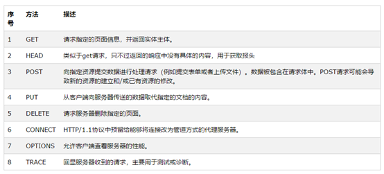

# 七、web

## （一）通用篇

### 1. 为什么不使用web框架的开发服务器？

性能和扩展方面。

### 2. Cookie、Session和token？

[CSRF、Cookie、Session和token之间不得不说得那些事儿](https://blog.csdn.net/besmarterbestronger/article/details/102544093?ops_request_misc=%257B%2522request%255Fid%2522%253A%2522160292631419724813224807%2522%252C%2522scm%2522%253A%252220140713.130102334.pc%255Fblog.%2522%257D&request_id=160292631419724813224807&biz_id=0&utm_medium=distribute.pc_search_result.none-task-blog-2~blog~first_rank_v2~rank_blog_default-1-102544093.pc_v2_rank_blog_default&utm_term=cookie&spm=1018.2118.3001.4187)

这是我之前写的一篇博客，个人觉得讲得还可以吧。

#### Cookie

由于HTTP协议本身是无状态的，也就是说同一个用户前一次HTTP请求和后一次HTTP请求时相互独立的，无法判断后一次请求的用户是不是刚才的用户。为了记录用户的状态，才有了Cookie。``Cookie实际上以key-value键值对的形式存储了一些文本信息数据，它将数据保存在客户端(浏览器)。``

当浏览器(客户端)登陆网站请求服务器后，服务器的response中返回了Set-Cookie（与Cookie类似，也是键值对的一小段文本），浏览器(客户端)将这个Cookie保存起来，当下次该浏览器(客户端)再请求此服务器时，浏览器(客户端)把请求的网址连同该域的Cookie一同提交给服务器。服务器检查该Cookie，以此来辨认用户状态。


**Cookie中通常包含的信息：**
| Cookie属性      | 描述                                                         |
| --------------- | ------------------------------------------------------------ |
| Name            | 设置要保存的 Key                                             |
| Value           | 设置要保存的 Value                                           |
| Domain          | 生成该 Cookie 的域名，如Domain="www.csdn.net"                |
| Path            | 该 Cookie 是在当前的哪个路径下生成的，如Path=/blog/          |
| Expires/Max-Age | 过期时间，超过该时间，则Cookie失效                           |
| Size            | Cookie大小                                                   |
| HttpOnly        | 如果Cookie中设置了HttpOnly属性，那么通过js脚本将无法读取到cookie信息，这样能有效的防止XSS攻击，窃取Cookie内容，这样就增加了Cookie的安全性 |
| Secure          | 如果设置了这个属性，那么只会在 HTTPS 连接时才会回传该 Cookie |
| SameSite        | 如果链接来自外部站点，浏览器不会将cookie 添加到已通过身份验证的网站。 |

#### Seesion

Cookie和session是配套使用的。Cookie是将一些文本信息以键值对的形式保存在客户端，而Session是将某些信息保存在服务器端。因为HTTP协议是无状态，Cookie是在客户端实现状态保持，Session是在服务器端实现状态保持，通过两者的结合实现客户端和服务器连接的状态保持。``那么如何才能将Cookie对应到正确的Session呢？利用sessionid。``通常在数据库中有一个seesion表，存放着所有的Session数据，大家都知道数据库数据都有一个id，而sessionid就对应的这个id，所以通过浏览器传递过来的Cookie，服务器能找到对应id的Session实现连接的状态保持。

例子来自  [Session机制详解](https://www.cnblogs.com/wangpei/p/4884840.html)
> 让我们用几个例子来描述一下cookie和session机制之间的区别与联系。笔者曾经常去的一家咖啡店有喝5杯咖啡免费赠一杯咖啡的优惠，然而一次性消费5杯咖啡的机会微乎其微，这时就需要某种方式来纪录某位顾客的消费数量。想象一下其实也无外乎下面的几种方案： 
> >    1、该店的店员很厉害，能记住每位顾客的消费数量，只要顾客一走进咖啡店，店员就知道该怎么对待了。这种做法就是协议本身支持状态。 
> >    2、发给顾客一张卡片，上面记录着消费的数量，一般还有个有效期限。每次消费时，如果顾客出示这张卡片，则此次消费就会与以前或以后的消费相联系起来。这种做法就是在客户端保持状态。 
> >    3、发给顾客一张会员卡，除了卡号之外什么信息也不纪录，每次消费时，如果顾客出示该卡片，则店员在店里的纪录本上找到这个卡号对应的纪录添加一些消费信息。这种做法就是在服务器端保持状态。 

#### token

token其实就是一个令牌，用于用户验证的，token的诞生离不开CSRF。正是由于上面的Cookie/Session的状态保持方式会出现CSRF，所以才有了token。

**token的特点：**

 1. 无状态、可扩展
 2. 支持移动设备
 3. 跨程序调用
 4. 安全

**token的机制：**
基于Token的身份验证的过程如下:

 1. 用户登录校验，校验成功后就返回Token给客户端
 2. 客户端收到数据后保存在客户端
 3. 客户端每次访问API是携带Token到服务器端
 4. 服务器端采用filter过滤器校验。验证传递的token和算法生成的token是否一致，校验成功则返回请求数据，校验失败则返回错误码


``一直困扰的一个问题就是，为什么恶意网站不能利用用户浏览器中的token，而能利用Cookie呢？``

> 这是因为，在信任网站的HTML或js中，会向服务器传递参数token，不是通过Cookie传递的，若恶意网站要伪造用户的请求，也必须伪造这个token，否则用户身份验证不通过。但是，同源策略限制了恶意网站不能拿到信任网站的Cookie内容，只能使用，所以就算是token是存放在Cookie中的，恶意网站也无法提取出Cookie中的token数据进行伪造。也就无法传递正确的token给服务器，进而无法成功伪装成用户了。

### 3. OAuth了解吗？

[OAuth 2.0 的一个简单解释](http://www.ruanyifeng.com/blog/2019/04/oauth_design.html)

 [OAuth 2.0 的四种方式](http://www.ruanyifeng.com/blog/2019/04/oauth-grant-types.html)

 [GitHub OAuth 第三方登录示例教程](http://www.ruanyifeng.com/blog/2019/04/github-oauth.html)

 

背景是：第三方小程序要访问我们在微信中的某些数据，如何实现？

传统方式是，将用户名和密码告诉第三方小程序，让其直接使用用户名和密码来获取数据，但是这样有几个缺点。如下：

1. 如果第三方小程序经常用到这些数据，那么它可能会保存用户名和密码，这不安全；

2. 无法限制其获得授权的范围和有效期；

3. 只有修改密码才能收回授权，但是同时会影响其他使用此用户名和密码的第三方小程序；

4. 只要一个第三方小程序被破解，用户的用户名和密码就会暴露，不安全。

在这种需求下才诞生了`OAuth`。

`OAuth`实际上是一种授权机制。数据的所有者告诉系统，同意授权第三方应用进入系统并获取这些数据，系统从而产生一个短期的进入`令牌（token）`，用来代替密码供第三方使用。

            

`OAuth`有4种授权方式：`Authorization-code`、`implicit`、`password`、`client-credentials`。

1） 授权码。

​	a)     当我们使用A应用时，A应用让我们跳转到B应用；

​	b)     B应用让我们登录，登录之后跳转回A应用的某页面，并返回给A一个授权码；

​	c)     A应用拿着此授权码向B应用请求一个令牌（token）；

​	d)     B应用验证之后，返回给A应用令牌；

​	e)     此后，A应用要获取B应用中的数据时，就必须在请求中携带此令牌。

2） 隐藏式。允许直接向前端颁发令牌，没有授权码这个中间步骤，故叫（授权码）“隐藏式”

3） 密码式。允许用户将用户名和密码直接给第三方应用，第三方应用使用用户名和密码来申请令牌。

4） 客户端凭证。适用于没有前端的命令行应用，即在命令行下申请令牌。

### 4. 什么是跨域？

[到底什么是跨域？附解决方案！ ](https://www.cnblogs.com/xyhero/p/4def66af838d5646d873207ab63b4ad4.html)

要介绍跨域就要先介绍同源策略。

同源策略：认为协议、域名、端口都相同才是同一个源，为了保证安全，所有支持JS的浏览器都会使用同源策略，否则不同网站之间随意访问对方资源，这可就乱套了啊。

在前端页面中执行脚本时，会检查访问的资源是否与当前域同源，如果非同源则会在浏览器的console中包异常。

跨域：一个域要去访问另一个不同域的资源，即跨域请求。

为什么会有跨域：网站之间可能会有访问对方资源的需求。

 

### 5. 如何验证token？

验证携带的token和重新生成的token是否一致，验证token的范围和有效期等是否都是有效的。

### 6. 为什么OAuth的授权码模式，需要先获取授权码，再用授权码获取token，而不是直接返回token呢？

我的理解是，

1. 浏览器向第三方应用发起` request`；

2. 第三方应用对此` request `返回一个` 3xx` 的重定向响应，定向到认证服务器的认证页面；

3. 用户在认证页面登录后，认证服务器将 `code` 放到重定向的url，返回一个 `3xx` 的重定向响应，定向浏览器去到某第三方应用的页面；

4. 第三方应用接收到此 `request` 请求，获取到 `token`；

5. 在后来的请求中携带 `token`；

上面写的啥？ 让我自己再看都看不明白。。。下面是重新写的。


 

 

以GitHub的授权流程来解释，疑问在于第3步为什么不直接返回token而是返回一个授权码？

想想GitHub重定向回 A 网站这个过程是如何实现的？

GitHub先返回一个 3xx的重定向响应给客户端

客户端携带GitHub返回的授权码去请求A网站

A网站拿到授权码，去请求GitHub，GitHub返回令牌


在上面的重定向过程中，如果直接返回令牌的的话，令牌会出现在客户端，可能会出现令牌泄露的情况，所以先返回授权码，再让A网站用授权码去获取令牌，这样更安全。


### 7. jwt是什么？

[JSON Web Token 入门教程](http://www.ruanyifeng.com/blog/2018/07/json_web_token-tutorial.html)

`JSON Web Token`。是`token`的一种。结构如下：

`xxxx.yyyy.zzzzz`

由三个部分组成：`header`、`payload`、`signature`。这三个部分由`.`分割。`header`和`payload`都是`json`格式，可以放一些数据。

通常`header`放元数据（jwt的类型和签名的算法）。

`payload`是真正放数据的部分。这两个`json`通过`base64url`编码之后，就变成了上边的`xxxx`和`yyyy`。

`signature`是由`xxxx`、`yyyy`和`secret`（一个秘钥）根据签名算法生成。

默认情况下`header`和`payload`并没有加密，直接用`base64url`解密就能获得其内容，所以不要放敏感的数据。

`jwt主要用来实现单点登录`。因为将用户的状态保存在了客户端，这点刚好与`session`（将用户的状态保存在服务端）相反。

 

 

### 8. Vue和jQuery有什么区别

[Vue和Jquery的区别](https://www.jianshu.com/p/bbd31f6cf4bb)

 

  前两天从同事那里听到他们在谈论 `Jquery`,那今天就来罗列一下两者之间的区别。

1. 首先我们来聊一聊`jQuery`吧！`jQuery`是一个快速、简洁的`JavaScript`框架，是继`Prototype`之后又一个优秀的`JavaScript`代码库。`jQuery`设计的宗旨是"write Less,Do More",  即提倡写更少的代码，做更多的功能。

2. 在近两年的Web以及项目开发中，vue技术使用越来越普遍，vue说简单一点就是一套构建用户界面的渐进式框架，采用自上而下的增量开发设计，易于上手。

3. 那么`jQuery`和Vue的区别到底在哪里呢？

​    先从DOM操作上说起吧

​    （1）jOuery首先要获取到DOM对象,然后对DOM对象进行值的修改等操作，而Vue不直接对DOM元素进行渲染，它更多的是把值和对象（js）进行绑定，然后再修改js对象的值，Vue框架就会自动把DOM元素进行更新。

​    （2）简单来说就是Vue帮我们做了DOM操作，节省了很多代码，它只需要做好对数据的单向绑定，就是我们常说的DOM对象绑定，如果当js对象的值也会跟着dom元素的值改变而改变，叫做双向数据绑定。 

 

 

### 9.     http发起请求是，get，post别的还有些啥

 

 [HTTP请求方式中8种请求方法（简单介绍）     ](https://www.cnblogs.com/weibanggang/p/9454581.html)

### 10.     用post获取数据会有什么问题吗？get和post的区别

[学习笔记_Java get和post区别（转载_GET一般用于获取/查询资源信息，而POST一般用于更新资源信息) ](https://www.cnblogs.com/snowwhite/p/4640740.html)


设计之初，就是让get来获取信息（要求是安全和幂等的），即get请求不应该产生副作用。

而post请求可能会修改服务器上资源的状态。在结合REST来看，现在的人都将URL当作资源的抽象来看，而请求方法就代表了对这些资源的操作，所以不宜混用。

 

区别：

1） get请求，参数在url中的？之后，使用&分割（称为查询字符串），不安全，完全暴露在外；post请求的参数在请求体中，相对安全点。

2） 传输数据的大小。HTTP协议没有对传输的数据大小进行限制。但浏览器和服务器对URL的长度有限制，也就是对GET请求传递的数据大小有限制。而post是在请求体中，理论上是不受限制的，但是通常服务器也会有一个限制。

3） 安全性。如果是get请求进行登录，则从历史中可以获取用户名和密码等，不安全；post则不会。

4）  

### 11.     什么是RESTful和SOAP？

`REST`是一种思想，一种设计风格，而`SAOP`是一种协议。

`REST`提出设计概念和准则为：

1. 网络上的所有事物都可以被抽象为资源(`resource`)

2. 每一个资源都有唯一的资源标识(`resource identifier`)，对资源的操作不会改变这些标识

3. 所有的操作都是无状态的

​     其实`SOAP`最早是针对`RPC`的一种解决方案，简单对象访问协议，很轻量，同时作为应用协议可以基于多种传输协议来传递消息（Http,SMTP等）。

### 12.     大规模网站系统性能优化的常用方法？

pass

 ### 13. 网关和API网关

[腾讯云大学-网关 & API 网关概述](https://cloud.tencent.com/edu/learning/course-1534-10683)

#### 服务访问存在的问题

- 安全和权限问题。普通用户可以访问或操作敏感、重要资源。
- 访问频次问题。恶意访问，大量请求涌入，例如DDOS攻击。


#### 对于已存在的问题如何去解决？

这就是为什么需要网关了。

#### 网关

##### 什么是网关？

网关隔绝着不同的网络空间。网关可以这样形象的比喻，从一个房间走到另一个房间需要经过一扇门，而在网络空间中，从一个网络向另一个网络发送信息是，也必须经过一道关口，这就是网关。

> 在[计算机网络](https://link.zhihu.com/?target=https%3A//zh.wikipedia.org/wiki/%E8%AE%A1%E7%AE%97%E6%9C%BA%E7%BD%91%E7%BB%9C)中，**网关**（英语：Gateway）是转发其他服务器通信数据的服务器，接收从客户端发送来的请求时，它就像自己拥有资源的源服务器一样对请求进行处理


我觉得网关类似于海关之类的。

##### 网关的分类

- 协议网关：此类网关的主要功能是在不同协议的网关之间协议转换。
- 应用网关：主要是针对一些专门的应用而设置的网关。
- 安全网关：包过滤，还有防火墙之类的设置。

#### API网关

[到底什么是API网关？](https://www.zhihu.com/question/309582197)

##### 什么是API网关？

API网关是用户与服务器之间的连接器。


##### 为什么需要API网关？

API网关能为系统提供安全服务，混合通信，降低系统复杂性等功能。有些类似海关啊，地铁机场安检口。


##### API网关的应用场景

- 微服务整合

API网关统一鉴权，统一监控整个微服务。


- 外部多端统一

API网关是所有终端的转换器。


- 业务整合

API网关统一各业务子模块接口。


- 能力提供及售卖

发布自己的API作为服务应用。


### 14. 什么是RPC？


### 16. 什么是websocket？

[WebSocket 是什么原理？为什么可以实现持久连接？](https://www.zhihu.com/question/20215561)

[WebSocket 教程](http://www.ruanyifeng.com/blog/2017/05/websocket.html)

[WebSockets - Send & Receive Messages](https://www.tutorialspoint.com/websockets/websockets_send_receive_messages.htm)

**[WebSocket](http://websocket.org/) 是一种网络通信协议，很多高级功能都需要它**。

引用阮一峰老师的话：

> 初次接触 WebSocket 的人，都会问同样的问题：我们已经有了 HTTP 协议，为什么还需要另一个协议？它能带来什么好处？
>
> 答案很简单，因为 HTTP 协议有一个缺陷：通信只能由客户端发起。
>
> 举例来说，我们想了解今天的天气，只能是客户端向服务器发出请求，服务器返回查询结果。HTTP 协议做不到服务器主动向客户端推送信息。


WebSocket 协议在2008年诞生，2011年成为国际标准。所有浏览器都已经支持了。

***它的最大特点就是，服务器可以主动向客户端推送信息，客户端也可以主动向服务器发送信息，是真正的双向平等对话，属于[服务器推送技术](https://en.wikipedia.org/wiki/Push_technology)的一种。***


其他特点包括：

（1）建立在 TCP 协议之上，服务器端的实现比较容易。

（2）与 HTTP 协议有着良好的兼容性。默认端口也是80和443，并且握手阶段采用 HTTP 协议，因此握手时不容易屏蔽，能通过各种 HTTP 代理服务器。

（3）数据格式比较轻量，性能开销小，通信高效。

（4）可以发送文本，也可以发送二进制数据。

（5）没有同源限制，客户端可以与任意服务器通信。

（6）协议标识符是`ws`（如果加密，则为`wss`），服务器网址就是 URL。

> ```markup
> ws://example.com:80/some/path
> ```

阮一峰老师的图片真的都很恰当。


WebSocket 服务器的实现，可以查看维基百科的[列表](https://en.wikipedia.org/wiki/Comparison_of_WebSocket_implementations)。

常用的 Node 实现有以下三种。

- [µWebSockets](https://github.com/uWebSockets/uWebSockets)
- [Socket.IO](http://socket.io/)
- [WebSocket-Node](https://github.com/theturtle32/WebSocket-Node)

#### websocket的例子

***需要知道的是，要使用websocket需要有websocket客户端和websocket服务器。通常，客户端浏览器，通过JS写的代码发送websocket请求；而websocket服务器需要我们来实现，要不发送了请求，服务器这边不会处理的。***


以websocketd为例，因为websocketd的服务器实现可以使用多种语言，由于我只对Python比较熟悉，因此以websocketd为例：

##### 1. 下载并安装[websocketd](http://websocketd.com/)

> 我是在CentOS7.8中使用的，
>
> 1. 先在官网下载linux版本的websocketd。
>
> 2. 解压到指定目录。
>
>    ```bash
>    unzip -d /opt/websocketd-0.3.0 websocketd-0.3.0-linux_amd64.zip
>    ```
>
> 3. 将websocketd添加到环境变量PATH中。
>
>    ```bash
>    [root@localhost ~]cat ~/.bash_profile
>    # .bash_profile
>    
>    # Get the aliases and functions
>    if [ -f ~/.bashrc ]; then
>    	. ~/.bashrc
>    fi
>    
>    # User specific environment and startup programs
>    
>    PATH=$PATH:$HOME/bin
>    
>    export PATH
>    [root@localhost ~] vim ~/.bash_profile
>    # 将下面两句追加到bash_profile的末尾，表示将websocket加入到当前用户(root)的环境变量中。
>    export WEBSOCKETD_HOME=/opt/websocketd-0.3.0
>    export PATH=$PATH:$WEBSOCKETD_HOME
>    [root@localhost ~] source ~/.bash_profile
>    [root@localhost Downloads]# websocketd --version
>    websocketd 0.3.0 (go1.9.2 linux-amd64) --
>    
>    ```
>
>    

##### 2. 开启一个websocket服务器

新建一个`/home/myWebsocketd/`，在该目录下新建一个my-program.py 文件，内容如下：

```python
#!/usr/bin/python
from sys import stdout
from time import sleep

# Count from 1 to 10 with a sleep
for count in range(0, 10):
  print(count + 1)
  stdout.flush()
  sleep(0.5)
```

使用websocketd开启一个websocket服务器。

```bash
[root@localhost myWebsocketd]# websocketd --port=8080 --staticdir=. python my-program.py 
Sun, 18 Oct 2020 14:40:57 +0800 | INFO   | server     |  | Serving using application   : /usr/bin/python my-program.py
Sun, 18 Oct 2020 14:40:57 +0800 | INFO   | server     |  | Starting WebSocket server   : ws://localhost.localdomain:8080/

```

--staticdir表示静态文件目录为当前目录。

##### 3. 建立websocket客户端

在 `/home/myWebsocketd`目录下，创建一个count.html，其内容如下：

```html
<!DOCTYPE html>
<html>
  <head>
    <title>websocketd count example</title>
    <style>
      #count {
        font: bold 150px arial;
        margin: auto;
        padding: 10px;
        text-align: center;
      }
    </style>
  </head>
  <body>
    
    <div id="count"></div>
    
    <script>
      var ws = new WebSocket('ws://localhost:8080/');
      // do something on connect
      ws.onopen = function() {
        document.body.style.backgroundColor = '#cfc';
      };
      // do something on disconnect
      ws.onclose = function() {
        document.body.style.backgroundColor = null;
      };
      // do something with event.data
      ws.onmessage = function(event) {
        document.getElementById('count').textContent = event.data;
      };
    </script>
    
  </body>
</html>
```


在浏览器中访问 `http://localhost:8080`，显示效果如下：


在浏览器中访问`http://localhost:8080/count.html`，显示效果如下：


这些访问过程中的后端输出如下：

```bash
[root@localhost myWebsocketd]# websocketd --port=8080 --staticdir=. python my-program.py 
Sun, 18 Oct 2020 15:09:55 +0800 | INFO   | server     |  | Serving using application   : /usr/bin/python my-program.py
Sun, 18 Oct 2020 15:09:55 +0800 | INFO   | server     |  | Serving static content from : .
Sun, 18 Oct 2020 15:09:55 +0800 | INFO   | server     |  | Starting WebSocket server   : ws://localhost.localdomain:8080/
Sun, 18 Oct 2020 15:09:55 +0800 | INFO   | server     |  | Serving CGI or static files : http://localhost.localdomain:8080/
Sun, 18 Oct 2020 15:10:01 +0800 | ACCESS | http       | url:'http://localhost:8080/count.html' | STATIC
Sun, 18 Oct 2020 15:10:01 +0800 | ACCESS | session    | url:'http://localhost:8080/' id:'1603005001776067906' remote:'::1' command:'/usr/bin/python' origin:'http://localhost:8080' | CONNECT
Sun, 18 Oct 2020 15:10:06 +0800 | ACCESS | session    | url:'http://localhost:8080/' id:'1603005001776067906' remote:'::1' command:'/usr/bin/python' origin:'http://localhost:8080' pid:'8661' | DISCONNECT
Sun, 18 Oct 2020 15:26:33 +0800 | ACCESS | http       | url:'http://localhost:8080/count.html' | STATIC
Sun, 18 Oct 2020 15:26:33 +0800 | ACCESS | session    | url:'http://localhost:8080/' id:'1603005993089921816' remote:'::1' command:'/usr/bin/python' origin:'http://localhost:8080' | CONNECT
Sun, 18 Oct 2020 15:26:37 +0800 | ACCESS | session    | url:'http://localhost:8080/' id:'1603005993089921816' remote:'::1' command:'/usr/bin/python' origin:'http://localhost:8080' pid:'8867' | DISCONNECT


Sun, 18 Oct 2020 15:29:16 +0800 | ACCESS | http       | url:'http://localhost:8080/' | STATIC
Sun, 18 Oct 2020 15:30:29 +0800 | ACCESS | http       | url:'http://localhost:8080/count.html' | STATIC
Sun, 18 Oct 2020 15:30:29 +0800 | ACCESS | session    | url:'http://localhost:8080/' id:'1603006229382631744' remote:'::1' command:'/usr/bin/python' origin:'http://localhost:8080' | CONNECT
Sun, 18 Oct 2020 15:30:33 +0800 | ACCESS | session    | url:'http://localhost:8080/' id:'1603006229382631744' remote:'::1' command:'/usr/bin/python' origin:'http://localhost:8080' pid:'8927' | DISCONNECT
Sun, 18 Oct 2020 15:31:17 +0800 | ACCESS | http       | url:'http://localhost:8080/' | STATIC

```

### 17. 序列化和反序列化

[序列化和反序列化的详解](https://blog.csdn.net/tree_ifconfig/article/details/82766587)

- `Java序列化`：Java对象转换为字节序列的过程

- `Java反序列化`：字节序列恢复为Java对象的过程。

- `序列化最重要的作用`：在传递和保存对象时.保证对象的完整性和可传递性。对象转换为有序字节流,以便在网络上传输或者保存在本地文件中。

- `反序列化的最重要的作用`：根据字节流中保存的对象状态及描述信息，通过反序列化重建对象。

  总结：核心作用就是对象状态的保存和重建。（整个过程核心点就是字节流中所保存的对象状态及描述信息）


序列化是指把一个Java对象变成二进制内容，本质上就是一个byte[]数组。 为什么要把Java对象序列化呢？因为序列化后可以把byte[]保存到文件中，或者把byte[]通过网络传输到远程，这样，就相当于把Java对象存储到文件或者通过网络传输出去了。 有序列化，就有反序列化，即把一个二进制内容（也就是byte[]数组）变回Java对象。有了反序列化，保存到文件中的byte[]数组又可以“变回”Java对象，或者从网络上读取byte[]并把它“变回”Java对象。

### 18. REST API 中 GET 请求有多个参数怎么办？

[使用RESTful风格api命名接口时，GET方法怎么传递多个参数](https://blog.csdn.net/qq_35075909/article/details/94005211)


| RESTful接口名               | 普通接口名                  | 接口含义                               |
| --------------------------- | --------------------------- | -------------------------------------- |
| GET：users                  | GET：users                  | 获取所有用户列表                       |
| GET：users/123              | GET：users?userId=123       | 获取id为123的用户信息                  |
| GET：users/class/1          | GET：users?class=1          | 获取班级id为1的所有用户信息            |
| GET：users/class/1/gender/1 | GET：users?class=1&gender=1 | 获取班级id为1，性别id为1的所有用户列表 |

也可以选择POST请求，虽然这有些违背了REST API的规范，但是参数过多使用上述的方式，URL看起来非常复杂，再者参数过多有可能操作URL的长度限制。

另外，还可以参考百度图数据库 hugegraph的REST API 风格。其实就是上面的普通接口风格。

#### 结论

RESTful只是一种架构风格，不必一定拘泥于硬性规范，还是要以实际情况为准。


### 19. 设计一个权限系统RBAC

TODO

### 20. 什么是LAMP/LNMP？

LAMP和LNMP是两种架构。主要是使用的架构组件有所不同。

LAMP：Linux、Apache、MySQL、PHP/Python

LNMP：Linux、nginx、MySQL、PHP/Python

下图只是用于理解，并不限于这样。


### 21. B2B/B2C/C2C/O2O分别是什么？

[C2C、O2O、B2B、B2C 的区别在哪里？](https://www.zhihu.com/question/20171789)

你在地摊买东西，C2C
你去超市买东西，B2C
超市找经销商进货，B2B
超市出租柜台给经销商卖东西，B2B2C
你在网上下载个优惠券去KFC消费，O2O

是不是突然发现这些高大上的概念都Low爆了？


C2C，就是你 找了一个 站街女，价格便宜，偶尔有好货，不过也可能被仙人跳
B2C，就是你去天上人间或者什么星级酒店的桑拿部，统一管理统一服务，不满意还可以投诉
O2O，你qq上聊楼凤，谈好了自己过去享受服务
B2B，为上面B2C的那些企业提供小姐培训服务


B2B: Business-to-Business

B2C: Business-to-Customer

C2C: Customer(Consume) to Customer(Consumer)

O2O: Online to Offline

### 22. 上百万访问量的网站，Session应该如何处理？

一则，高并发情况下就不应该使用session，因为session通常是存在服务端的，这回给服务端的扩展、性能造成一定的影响，应该使用token来进行登录保持。

二则，高并发场景下仍然使用session。

 - 将sessin要存储的数据，放在cookie中存储。优点是解放了服务端，服务端好扩展，缺点是cookie在客户端可能会不安全；

 - 使用session粘滞、session复制或session共享。

   - session粘滞在服务器数量改变时，可能会造成大量的session不可用。

   - session复制需要占用一定的IO资源，而且服务器越多，造成的性能损失也越多。

   - session共享，可以将session存在 文件系统、数据库或缓存中。

     - 通过文件系统（比如NFS方式）来实现各台服务器间的Session共享，各台服务器只需要mount共享服务器的存储Session的磁盘即可，实现较为简单。但NFS 对高并发读写的性能并不高，在硬盘I/O性能和网络带宽上存在较大瓶颈，尤其是对于Session这样的小文件的频繁读写操作，适合并发量不大的网站
- 使用数据库存放session，适合数据库访问量不大的网站。优点：实现简单； 缺点：由于数据库服务器相对于应用服务器更难扩展且资源更为宝贵，在高并发的Web应用中，最大的性能瓶颈通常在于数据库服务器。因此如果将 Session存储到数据库表，频繁的数据库操作会影响业务。
     - 存在缓存中，例如Redis中。如果数据量大，可以使用Redis cluster。


### 23. PEP 3333简介

#### 23.1 什么是PEP？

PEP是[Python](https://baike.baidu.com/item/Python) Enhancement Proposals的缩写。一个PEP是一份为Python社区提供各种增强功能的技术规格，也是提交新特性，以便让社区指出问题，精确化技术文档的提案。

#### 23.2 PEP 3333

[PEP3333](https://www.python.org/dev/peps/pep-3333/)

本文档指定了Web服务器与Python Web应用程序或框架之间的标准接口，以提高Web应用程序和Web服务器之间的可移植性。

Python当前拥有各种各样的Web应用程序框架，例如Zope，Quixote，Webware，SkunkWeb，PSO和Twisted Web。但是，由于不同的Web应用程序框架可能支持不同的Web服务器，所以对于Python新手而言，在选择Web应用程序框架时可能会遇到一些问题。

相比之下，Java也有许多中Web应用程序框架，但是Java的“Servlet" API 使得任何使用Java Web应用程序框架编写的应用程序都能够在支持Servlet API的Web服务器中运行。

Python也需要这样一个接口，这个PEP提出了Web服务器与Web应用程序/框架之间的简单且通用的接口：**Python Web服务器网关接口（WSGI）**。

仅仅只有一个接口规范是不行的，还需要Web服务器和Web应用程序框架实现WSGI接口才能真正起到作用。

WSGI接口要考虑两个部分：server/gateway端，application/framework端。server端需要调用application所提供的可调用对象。这个可调用对象的提供方式，根据server或gateway的不同而不同，例如：

> 1. 通过application编写脚本来创建server或gatewya实例，并为其提供应用程序对象。
> 2. 通过使用配置文件来指定应该从何处导入应用程序对象。


因此，WSGI定义了两种“字符串”：

- "Native string" 我认为就是原生字符串：用于请求/响应头和元数据（Python3中的str类型，Python2中的unicode类型）
  "Bytestrings"(字节串，我认为是字节类型的字符串，字节的序列)（Python 3中的bytes类型，python2中的str类型），用于请求和响应的主体（例如POST / PUT输入数据和HTML页面输出）。


##### Application/Framework端

WSG接口规范中所提到的应用程序对象是一个接受2个参数的可调用对象，可以是函数、方法、类或实现了\_\_call\_\_()方法的实例。例如：

```python
HELLO_WORLD = b"Hello world!\n"

# 这是一个应用程序对象
def simple_app(environ, start_response):
    """Simplest possible application object"""
    status = '200 OK'
    response_headers = [('Content-type', 'text/plain')]
    start_response(status, response_headers)
    return [HELLO_WORLD]

# 这是另外一个应用程序对象
class AppClass:
    """Produce the same output, but using a class

    (Note: 'AppClass' is the "application" here, so calling it
    returns an instance of 'AppClass', which is then the iterable
    return value of the "application callable" as required by
    the spec.

    If we wanted to use *instances* of 'AppClass' as application
    objects instead, we would have to implement a '__call__'
    method, which would be invoked to execute the application,
    and we would need to create an instance for use by the
    server or gateway.
    """

    def __init__(self, environ, start_response):
        self.environ = environ
        self.start = start_response

    def __iter__(self):
        status = '200 OK'
        response_headers = [('Content-type', 'text/plain')]
        self.start(status, response_headers)
        yield HELLO_WORLD
```


##### Server/Gateway端

server/gateway每次接收到从HTTP客户端发送的request时，都会调用一次这个应用程序对象。下面用一个例子来证明，

```python
import os, sys

enc, esc = sys.getfilesystemencoding(), 'surrogateescape'

def unicode_to_wsgi(u):
    # Convert an environment variable to a WSGI "bytes-as-unicode" string
    return u.encode(enc, esc).decode('iso-8859-1')

def wsgi_to_bytes(s):
    return s.encode('iso-8859-1')

def run_with_cgi(application):
    environ = {k: unicode_to_wsgi(v) for k,v in os.environ.items()}
    environ['wsgi.input']        = sys.stdin.buffer
    environ['wsgi.errors']       = sys.stderr
    environ['wsgi.version']      = (1, 0)
    environ['wsgi.multithread']  = False
    environ['wsgi.multiprocess'] = True
    environ['wsgi.run_once']     = True

    if environ.get('HTTPS', 'off') in ('on', '1'):
        environ['wsgi.url_scheme'] = 'https'
    else:
        environ['wsgi.url_scheme'] = 'http'

    headers_set = []
    headers_sent = []

    def write(data):
        out = sys.stdout.buffer

        if not headers_set:
             raise AssertionError("write() before start_response()")

        elif not headers_sent:
             # Before the first output, send the stored headers
             status, response_headers = headers_sent[:] = headers_set
             out.write(wsgi_to_bytes('Status: %s\r\n' % status))
             for header in response_headers:
                 out.write(wsgi_to_bytes('%s: %s\r\n' % header))
             out.write(wsgi_to_bytes('\r\n'))

        out.write(data)
        out.flush()

    def start_response(status, response_headers, exc_info=None):
        if exc_info:
            try:
                if headers_sent:
                    # Re-raise original exception if headers sent
                    raise exc_info[1].with_traceback(exc_info[2])
            finally:
                exc_info = None     # avoid dangling circular ref
        elif headers_set:
            raise AssertionError("Headers already set!")

        headers_set[:] = [status, response_headers]

        # Note: error checking on the headers should happen here,
        # *after* the headers are set.  That way, if an error
        # occurs, start_response can only be re-called with
        # exc_info set.

        return write

    result = application(environ, start_response)
    try:
        for data in result:
            if data:    # don't send headers until body appears
                write(data)
        if not headers_sent:
            write('')   # send headers now if body was empty
    finally:
        if hasattr(result, 'close'):
            result.close()
```


##### Middleware:Components that Play Both Sides

这样一个中间件，既可以扮演server端，也可扮演application端。对于server端而言，中间件扮演application；对于application端而言，中间件扮演server。


- 在重写`environ`之后，根据目标UR路由request到不同的应用程序对象。
- 允许多个应用程序/框架同时运行。
- 通过网络转发request和response，实现负载均衡和远程处理。
- perform content postprocessing

一段中间件的示例代码如下：

```python
from piglatin import piglatin

class LatinIter:

    """Transform iterated output to piglatin, if it's okay to do so

    Note that the "okayness" can change until the application yields
    its first non-empty bytestring, so 'transform_ok' has to be a mutable
    truth value.
    """

    def __init__(self, result, transform_ok):
        if hasattr(result, 'close'):
            self.close = result.close
        self._next = iter(result).__next__
        self.transform_ok = transform_ok

    def __iter__(self):
        return self

    def __next__(self):
        if self.transform_ok:
            return piglatin(self._next())   # call must be byte-safe on Py3
        else:
            return self._next()

class Latinator:

    # by default, don't transform output
    transform = False

    def __init__(self, application):
        self.application = application

    def __call__(self, environ, start_response):

        transform_ok = []

        def start_latin(status, response_headers, exc_info=None):

            # Reset ok flag, in case this is a repeat call
            del transform_ok[:]

            for name, value in response_headers:
                if name.lower() == 'content-type' and value == 'text/plain':
                    transform_ok.append(True)
                    # Strip content-length if present, else it'll be wrong
                    response_headers = [(name, value)
                        for name, value in response_headers
                            if name.lower() != 'content-length'
                    ]
                    break

            write = start_response(status, response_headers, exc_info)

            if transform_ok:
                def write_latin(data):
                    write(piglatin(data))   # call must be byte-safe on Py3
                return write_latin
            else:
                return write

        return LatinIter(self.application(environ, start_latin), transform_ok)


# Run foo_app under a Latinator's control, using the example CGI gateway
from foo_app import foo_app
run_with_cgi(Latinator(foo_app))
```
