# 七、web

## （一）通用篇

### 1. 为什么不使用web框架的开发服务器？

性能和扩展方面。

### 2. Cookie、Session和token？

[CSRF、Cookie、Session和token之间不得不说得那些事儿](https://blog.csdn.net/besmarterbestronger/article/details/102544093?ops_request_misc=%257B%2522request%255Fid%2522%253A%2522160292631419724813224807%2522%252C%2522scm%2522%253A%252220140713.130102334.pc%255Fblog.%2522%257D&request_id=160292631419724813224807&biz_id=0&utm_medium=distribute.pc_search_result.none-task-blog-2~blog~first_rank_v2~rank_blog_default-1-102544093.pc_v2_rank_blog_default&utm_term=cookie&spm=1018.2118.3001.4187)

这是我之前写的一篇博客，个人觉得讲得还可以吧。

#### Cookie

由于HTTP协议本身是无状态的，也就是说同一个用户前一次HTTP请求和后一次HTTP请求时相互独立的，无法判断后一次请求的用户是不是刚才的用户。为了记录用户的状态，才有了Cookie。``Cookie实际上以key-value键值对的形式存储了一些文本信息数据，它将数据保存在客户端(浏览器)。``

当浏览器(客户端)登陆网站请求服务器后，服务器的response中返回了Set-Cookie（与Cookie类似，也是键值对的一小段文本），浏览器(客户端)将这个Cookie保存起来，当下次该浏览器(客户端)再请求此服务器时，浏览器(客户端)把请求的网址连同该域的Cookie一同提交给服务器。服务器检查该Cookie，以此来辨认用户状态。

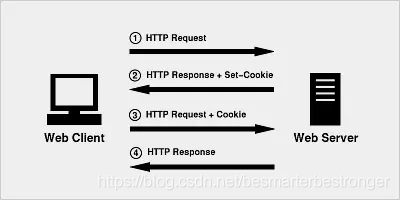

**Cookie中通常包含的信息：**
| Cookie属性      | 描述                                                         |
| --------------- | ------------------------------------------------------------ |
| Name            | 设置要保存的 Key                                             |
| Value           | 设置要保存的 Value                                           |
| Domain          | 生成该 Cookie 的域名，如Domain="www.csdn.net"                |
| Path            | 该 Cookie 是在当前的哪个路径下生成的，如Path=/blog/          |
| Expires/Max-Age | 过期时间，超过该时间，则Cookie失效                           |
| Size            | Cookie大小                                                   |
| HttpOnly        | 如果Cookie中设置了HttpOnly属性，那么通过js脚本将无法读取到cookie信息，这样能有效的防止XSS攻击，窃取Cookie内容，这样就增加了Cookie的安全性 |
| Secure          | 如果设置了这个属性，那么只会在 HTTPS 连接时才会回传该 Cookie |
| SameSite        | 如果链接来自外部站点，浏览器不会将cookie 添加到已通过身份验证的网站。 |

#### Seesion

Cookie和session是配套使用的。Cookie是将一些文本信息以键值对的形式保存在客户端，而Session是将某些信息保存在服务器端。因为HTTP协议是无状态，Cookie是在客户端实现状态保持，Session是在服务器端实现状态保持，通过两者的结合实现客户端和服务器连接的状态保持。``那么如何才能将Cookie对应到正确的Session呢？利用sessionid。``通常在数据库中有一个seesion表，存放着所有的Session数据，大家都知道数据库数据都有一个id，而sessionid就对应的这个id，所以通过浏览器传递过来的Cookie，服务器能找到对应id的Session实现连接的状态保持。

例子来自  [Session机制详解](https://www.cnblogs.com/wangpei/p/4884840.html)
> 让我们用几个例子来描述一下cookie和session机制之间的区别与联系。笔者曾经常去的一家咖啡店有喝5杯咖啡免费赠一杯咖啡的优惠，然而一次性消费5杯咖啡的机会微乎其微，这时就需要某种方式来纪录某位顾客的消费数量。想象一下其实也无外乎下面的几种方案： 
> >    1、该店的店员很厉害，能记住每位顾客的消费数量，只要顾客一走进咖啡店，店员就知道该怎么对待了。这种做法就是协议本身支持状态。 
> >    2、发给顾客一张卡片，上面记录着消费的数量，一般还有个有效期限。每次消费时，如果顾客出示这张卡片，则此次消费就会与以前或以后的消费相联系起来。这种做法就是在客户端保持状态。 
> >    3、发给顾客一张会员卡，除了卡号之外什么信息也不纪录，每次消费时，如果顾客出示该卡片，则店员在店里的纪录本上找到这个卡号对应的纪录添加一些消费信息。这种做法就是在服务器端保持状态。 

#### token

token其实就是一个令牌，用于用户验证的，token的诞生离不开CSRF。正是由于上面的Cookie/Session的状态保持方式会出现CSRF，所以才有了token。

**token的特点：**

 1. 无状态、可扩展
 2. 支持移动设备
 3. 跨程序调用
 4. 安全

**token的机制：**
基于Token的身份验证的过程如下:

 1. 用户登录校验，校验成功后就返回Token给客户端
 2. 客户端收到数据后保存在客户端
 3. 客户端每次访问API是携带Token到服务器端
 4. 服务器端采用filter过滤器校验。验证传递的token和算法生成的token是否一致，校验成功则返回请求数据，校验失败则返回错误码

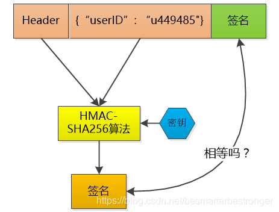


``一直困扰的一个问题就是，为什么恶意网站不能利用用户浏览器中的token，而能利用Cookie呢？``

> 这是因为，在信任网站的HTML或js中，会向服务器传递参数token，不是通过Cookie传递的，若恶意网站要伪造用户的请求，也必须伪造这个token，否则用户身份验证不通过。但是，同源策略限制了恶意网站不能拿到信任网站的Cookie内容，只能使用，所以就算是token是存放在Cookie中的，恶意网站也无法提取出Cookie中的token数据进行伪造。也就无法传递正确的token给服务器，进而无法成功伪装成用户了。

### 3. OAuth了解吗？

[OAuth 2.0 的一个简单解释](http://www.ruanyifeng.com/blog/2019/04/oauth_design.html)

 [OAuth 2.0 的四种方式](http://www.ruanyifeng.com/blog/2019/04/oauth-grant-types.html)

 [GitHub OAuth 第三方登录示例教程](http://www.ruanyifeng.com/blog/2019/04/github-oauth.html)

 

背景是：第三方小程序要访问我们在微信中的某些数据，如何实现？

传统方式是，将用户名和密码告诉第三方小程序，让其直接使用用户名和密码来获取数据，但是这样有几个缺点。如下：

1. 如果第三方小程序经常用到这些数据，那么它可能会保存用户名和密码，这不安全；

2. 无法限制其获得授权的范围和有效期；

3. 只有修改密码才能收回授权，但是同时会影响其他使用此用户名和密码的第三方小程序；

4. 只要一个第三方小程序被破解，用户的用户名和密码就会暴露，不安全。

在这种需求下才诞生了`OAuth`。

`OAuth`实际上是一种授权机制。数据的所有者告诉系统，同意授权第三方应用进入系统并获取这些数据，系统从而产生一个短期的进入`令牌（token）`，用来代替密码供第三方使用。

            

`OAuth`有4种授权方式：`Authorization-code`、`implicit`、`password`、`client-credentials`。

1） 授权码。

​	a)     当我们使用A应用时，A应用让我们跳转到B应用；

​	b)     B应用让我们登录，登录之后跳转回A应用的某页面，并返回给A一个授权码；

​	c)     A应用拿着此授权码向B应用请求一个令牌（token）；

​	d)     B应用验证之后，返回给A应用令牌；

​	e)     此后，A应用要获取B应用中的数据时，就必须在请求中携带此令牌。

2） 隐藏式。允许直接向前端颁发令牌，没有授权码这个中间步骤，故叫（授权码）“隐藏式”

3） 密码式。允许用户将用户名和密码直接给第三方应用，第三方应用使用用户名和密码来申请令牌。

4） 客户端凭证。适用于没有前端的命令行应用，即在命令行下申请令牌。

### 4. 什么是跨域？

[到底什么是跨域？附解决方案！ ](https://www.cnblogs.com/xyhero/p/4def66af838d5646d873207ab63b4ad4.html)

要介绍跨域就要先介绍同源策略。

同源策略：认为协议、域名、端口都相同才是同一个源，为了保证安全，所有支持JS的浏览器都会使用同源策略，否则不同网站之间随意访问对方资源，这可就乱套了啊。

在前端页面中执行脚本时，会检查访问的资源是否与当前域同源，如果非同源则会在浏览器的console中包异常。

跨域：一个域要去访问另一个不同域的资源，即跨域请求。

为什么会有跨域：网站之间可能会有访问对方资源的需求。

 

### 5. 如何验证token？

验证携带的token和重新生成的token是否一致，验证token的范围和有效期等是否都是有效的。

### 6. 为什么OAuth的授权码模式，需要先获取授权码，再用授权码获取token，而不是直接返回token呢？

我的理解是，

1. 浏览器向第三方应用发起` request`；

2. 第三方应用对此` request `返回一个` 3xx` 的重定向响应，定向到认证服务器的认证页面；

3. 用户在认证页面登录后，认证服务器将 `code` 放到重定向的url，返回一个 `3xx` 的重定向响应，定向浏览器去到某第三方应用的页面；

4. 第三方应用接收到此 `request` 请求，获取到 `token`；

5. 在后来的请求中携带 `token`；

上面写的啥？ 让我自己再看都看不明白。。。下面是重新写的。


 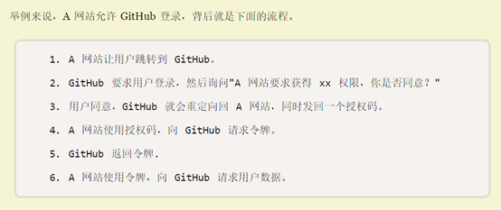

 

以GitHub的授权流程来解释，疑问在于第3步为什么不直接返回token而是返回一个授权码？

想想GitHub重定向回 A 网站这个过程是如何实现的？

GitHub先返回一个 3xx的重定向响应给客户端

客户端携带GitHub返回的授权码去请求A网站

A网站拿到授权码，去请求GitHub，GitHub返回令牌


在上面的重定向过程中，如果直接返回令牌的的话，令牌会出现在客户端，可能会出现令牌泄露的情况，所以先返回授权码，再让A网站用授权码去获取令牌，这样更安全。


### 7. jwt是什么？

[JSON Web Token 入门教程](http://www.ruanyifeng.com/blog/2018/07/json_web_token-tutorial.html)

`JSON Web Token`。是`token`的一种。结构如下：

`xxxx.yyyy.zzzzz`

由三个部分组成：`header`、`payload`、`signature`。这三个部分由`.`分割。`header`和`payload`都是`json`格式，可以放一些数据。

通常`header`放元数据（jwt的类型和签名的算法）。

`payload`是真正放数据的部分。这两个`json`通过`base64url`编码之后，就变成了上边的`xxxx`和`yyyy`。

`signature`是由`xxxx`、`yyyy`和`secret`（一个秘钥）根据签名算法生成。

默认情况下`header`和`payload`并没有加密，直接用`base64url`解密就能获得其内容，所以不要放敏感的数据。

`jwt主要用来实现单点登录`。因为将用户的状态保存在了客户端，这点刚好与`session`（将用户的状态保存在服务端）相反。

 

 

### 8. Vue和jQuery有什么区别

[Vue和Jquery的区别](https://www.jianshu.com/p/bbd31f6cf4bb)

 

  前两天从同事那里听到他们在谈论 `Jquery`,那今天就来罗列一下两者之间的区别。

1. 首先我们来聊一聊`jQuery`吧！`jQuery`是一个快速、简洁的`JavaScript`框架，是继`Prototype`之后又一个优秀的`JavaScript`代码库。`jQuery`设计的宗旨是"write Less,Do More",  即提倡写更少的代码，做更多的功能。

2. 在近两年的Web以及项目开发中，vue技术使用越来越普遍，vue说简单一点就是一套构建用户界面的渐进式框架，采用自上而下的增量开发设计，易于上手。

3. 那么`jQuery`和Vue的区别到底在哪里呢？

​    先从DOM操作上说起吧

​    （1）jOuery首先要获取到DOM对象,然后对DOM对象进行值的修改等操作，而Vue不直接对DOM元素进行渲染，它更多的是把值和对象（js）进行绑定，然后再修改js对象的值，Vue框架就会自动把DOM元素进行更新。

​    （2）简单来说就是Vue帮我们做了DOM操作，节省了很多代码，它只需要做好对数据的单向绑定，就是我们常说的DOM对象绑定，如果当js对象的值也会跟着dom元素的值改变而改变，叫做双向数据绑定。 

 

 

### 9.     http发起请求是，get，post别的还有些啥

 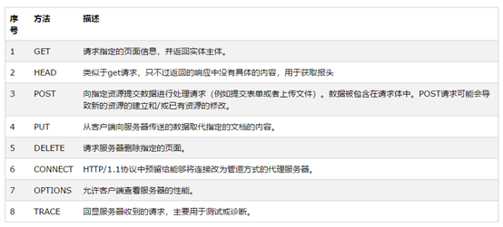

 [HTTP请求方式中8种请求方法（简单介绍）     ](https://www.cnblogs.com/weibanggang/p/9454581.html)

### 10.     用post获取数据会有什么问题吗？get和post的区别

[学习笔记_Java get和post区别（转载_GET一般用于获取/查询资源信息，而POST一般用于更新资源信息) ](https://www.cnblogs.com/snowwhite/p/4640740.html)


设计之初，就是让get来获取信息（要求是安全和幂等的），即get请求不应该产生副作用。

而post请求可能会修改服务器上资源的状态。在结合REST来看，现在的人都将URL当作资源的抽象来看，而请求方法就代表了对这些资源的操作，所以不宜混用。

 

区别：

1） get请求，参数在url中的？之后，使用&分割（称为查询字符串），不安全，完全暴露在外；post请求的参数在请求体中，相对安全点。

2） 传输数据的大小。HTTP协议没有对传输的数据大小进行限制。但浏览器和服务器对URL的长度有限制，也就是对GET请求传递的数据大小有限制。而post是在请求体中，理论上是不受限制的，但是通常服务器也会有一个限制。

3） 安全性。如果是get请求进行登录，则从历史中可以获取用户名和密码等，不安全；post则不会。

4）  

### 11.     什么是RESTful和SOAP？

`REST`是一种思想，一种设计风格，而`SAOP`是一种协议。

`REST`提出设计概念和准则为：

1. 网络上的所有事物都可以被抽象为资源(`resource`)

2. 每一个资源都有唯一的资源标识(`resource identifier`)，对资源的操作不会改变这些标识

3. 所有的操作都是无状态的

​     其实`SOAP`最早是针对`RPC`的一种解决方案，简单对象访问协议，很轻量，同时作为应用协议可以基于多种传输协议来传递消息（Http,SMTP等）。

### 12.     大规模网站系统性能优化的常用方法？

pass

 ### 13. 网关和API网关

[腾讯云大学-网关 & API 网关概述](https://cloud.tencent.com/edu/learning/course-1534-10683)

#### 服务访问存在的问题

- 安全和权限问题。普通用户可以访问或操作敏感、重要资源。
- 访问频次问题。恶意访问，大量请求涌入，例如DDOS攻击。


#### 对于已存在的问题如何去解决？

这就是为什么需要网关了。

#### 网关

##### 什么是网关？

网关隔绝着不同的网络空间。网关可以这样形象的比喻，从一个房间走到另一个房间需要经过一扇门，而在网络空间中，从一个网络向另一个网络发送信息是，也必须经过一道关口，这就是网关。

> 在[计算机网络](https://link.zhihu.com/?target=https%3A//zh.wikipedia.org/wiki/%E8%AE%A1%E7%AE%97%E6%9C%BA%E7%BD%91%E7%BB%9C)中，**网关**（英语：Gateway）是转发其他服务器通信数据的服务器，接收从客户端发送来的请求时，它就像自己拥有资源的源服务器一样对请求进行处理


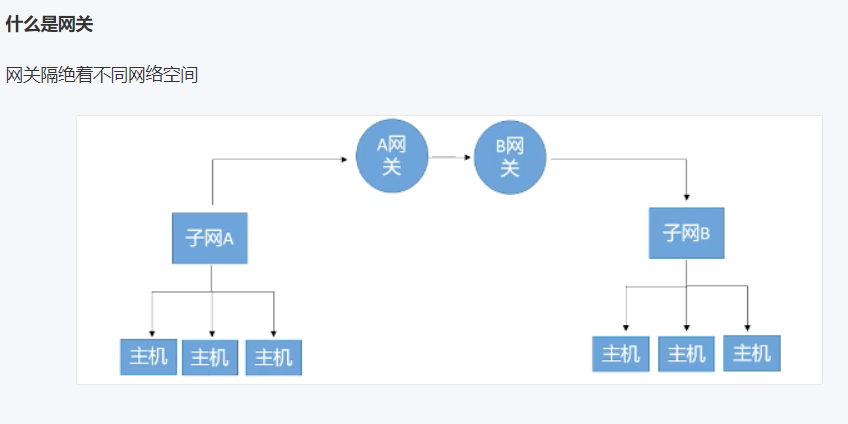

我觉得网关类似于海关之类的。

##### 网关的分类

- 协议网关：此类网关的主要功能是在不同协议的网关之间协议转换。
- 应用网关：主要是针对一些专门的应用而设置的网关。
- 安全网关：包过滤，还有防火墙之类的设置。

#### API网关

[到底什么是API网关？](https://www.zhihu.com/question/309582197)

##### 什么是API网关？

API网关是用户与服务器之间的连接器。

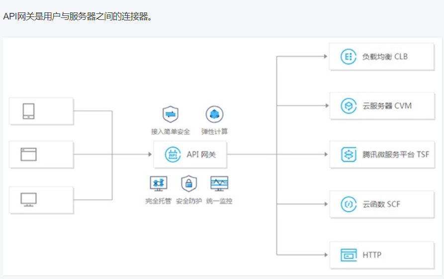


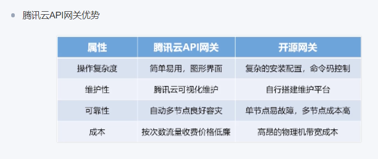


##### 为什么需要API网关？

API网关能为系统提供安全服务，混合通信，降低系统复杂性等功能。有些类似海关啊，地铁机场安检口。

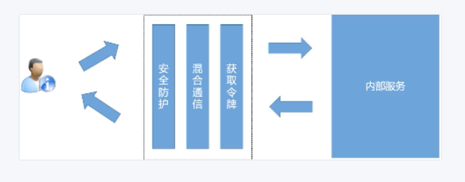

##### API网关的应用场景

- 微服务整合

API网关统一鉴权，统一监控整个微服务。

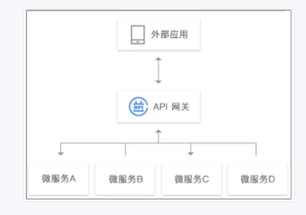


- 外部多端统一

API网关是所有终端的转换器。

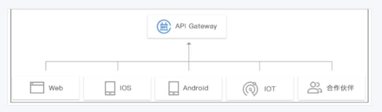


- 业务整合

API网关统一各业务子模块接口。

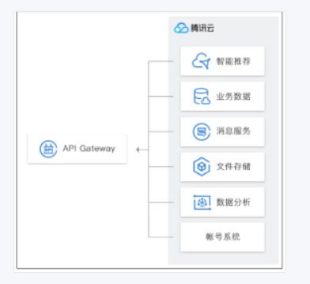


- 能力提供及售卖

发布自己的API作为服务应用。

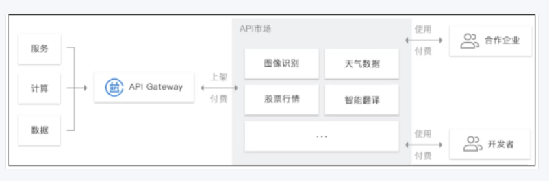

### 14. 什么是RPC？


### 16. 什么是websocket？

[WebSocket 是什么原理？为什么可以实现持久连接？](https://www.zhihu.com/question/20215561)

[WebSocket 教程](http://www.ruanyifeng.com/blog/2017/05/websocket.html)

[WebSockets - Send & Receive Messages](https://www.tutorialspoint.com/websockets/websockets_send_receive_messages.htm)

**[WebSocket](http://websocket.org/) 是一种网络通信协议，很多高级功能都需要它**。

引用阮一峰老师的话：

> 初次接触 WebSocket 的人，都会问同样的问题：我们已经有了 HTTP 协议，为什么还需要另一个协议？它能带来什么好处？
>
> 答案很简单，因为 HTTP 协议有一个缺陷：通信只能由客户端发起。
>
> 举例来说，我们想了解今天的天气，只能是客户端向服务器发出请求，服务器返回查询结果。HTTP 协议做不到服务器主动向客户端推送信息。


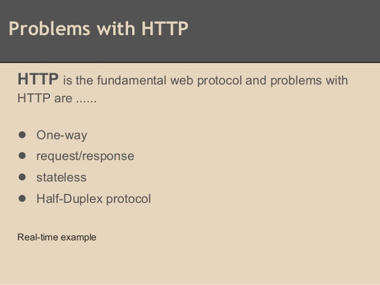

WebSocket 协议在2008年诞生，2011年成为国际标准。所有浏览器都已经支持了。

***它的最大特点就是，服务器可以主动向客户端推送信息，客户端也可以主动向服务器发送信息，是真正的双向平等对话，属于[服务器推送技术](https://en.wikipedia.org/wiki/Push_technology)的一种。***


其他特点包括：

（1）建立在 TCP 协议之上，服务器端的实现比较容易。

（2）与 HTTP 协议有着良好的兼容性。默认端口也是80和443，并且握手阶段采用 HTTP 协议，因此握手时不容易屏蔽，能通过各种 HTTP 代理服务器。

（3）数据格式比较轻量，性能开销小，通信高效。

（4）可以发送文本，也可以发送二进制数据。

（5）没有同源限制，客户端可以与任意服务器通信。

（6）协议标识符是`ws`（如果加密，则为`wss`），服务器网址就是 URL。

> ```markup
> ws://example.com:80/some/path
> ```

阮一峰老师的图片真的都很恰当。


WebSocket 服务器的实现，可以查看维基百科的[列表](https://en.wikipedia.org/wiki/Comparison_of_WebSocket_implementations)。

常用的 Node 实现有以下三种。

- [µWebSockets](https://github.com/uWebSockets/uWebSockets)
- [Socket.IO](http://socket.io/)
- [WebSocket-Node](https://github.com/theturtle32/WebSocket-Node)

#### websocket的例子

***需要知道的是，要使用websocket需要有websocket客户端和websocket服务器。通常，客户端浏览器，通过JS写的代码发送websocket请求；而websocket服务器需要我们来实现，要不发送了请求，服务器这边不会处理的。***


以websocketd为例，因为websocketd的服务器实现可以使用多种语言，由于我只对Python比较熟悉，因此以websocketd为例：

##### 1. 下载并安装[websocketd](http://websocketd.com/)

> 我是在CentOS7.8中使用的，
>
> 1. 先在官网下载linux版本的websocketd。
>
> 2. 解压到指定目录。
>
>    ```bash
>    unzip -d /opt/websocketd-0.3.0 websocketd-0.3.0-linux_amd64.zip
>    ```
>
> 3. 将websocketd添加到环境变量PATH中。
>
>    ```bash
>    [root@localhost ~]cat ~/.bash_profile
>    # .bash_profile
>    
>    # Get the aliases and functions
>    if [ -f ~/.bashrc ]; then
>    	. ~/.bashrc
>    fi
>    
>    # User specific environment and startup programs
>    
>    PATH=$PATH:$HOME/bin
>    
>    export PATH
>    [root@localhost ~] vim ~/.bash_profile
>    # 将下面两句追加到bash_profile的末尾，表示将websocket加入到当前用户(root)的环境变量中。
>    export WEBSOCKETD_HOME=/opt/websocketd-0.3.0
>    export PATH=$PATH:$WEBSOCKETD_HOME
>    [root@localhost ~] source ~/.bash_profile
>    [root@localhost Downloads]# websocketd --version
>    websocketd 0.3.0 (go1.9.2 linux-amd64) --
>    
>    ```
>
>    

##### 2. 开启一个websocket服务器

新建一个`/home/myWebsocketd/`，在该目录下新建一个my-program.py 文件，内容如下：

```python
#!/usr/bin/python
from sys import stdout
from time import sleep

# Count from 1 to 10 with a sleep
for count in range(0, 10):
  print(count + 1)
  stdout.flush()
  sleep(0.5)
```

使用websocketd开启一个websocket服务器。

```bash
[root@localhost myWebsocketd]# websocketd --port=8080 --staticdir=. python my-program.py 
Sun, 18 Oct 2020 14:40:57 +0800 | INFO   | server     |  | Serving using application   : /usr/bin/python my-program.py
Sun, 18 Oct 2020 14:40:57 +0800 | INFO   | server     |  | Starting WebSocket server   : ws://localhost.localdomain:8080/

```

--staticdir表示静态文件目录为当前目录。

##### 3. 建立websocket客户端

在 `/home/myWebsocketd`目录下，创建一个count.html，其内容如下：

```html
<!DOCTYPE html>
<html>
  <head>
    <title>websocketd count example</title>
    <style>
      #count {
        font: bold 150px arial;
        margin: auto;
        padding: 10px;
        text-align: center;
      }
    </style>
  </head>
  <body>
    
    <div id="count"></div>
    
    <script>
      var ws = new WebSocket('ws://localhost:8080/');
      // do something on connect
      ws.onopen = function() {
        document.body.style.backgroundColor = '#cfc';
      };
      // do something on disconnect
      ws.onclose = function() {
        document.body.style.backgroundColor = null;
      };
      // do something with event.data
      ws.onmessage = function(event) {
        document.getElementById('count').textContent = event.data;
      };
    </script>
    
  </body>
</html>
```


在浏览器中访问 `http://localhost:8080`，显示效果如下：

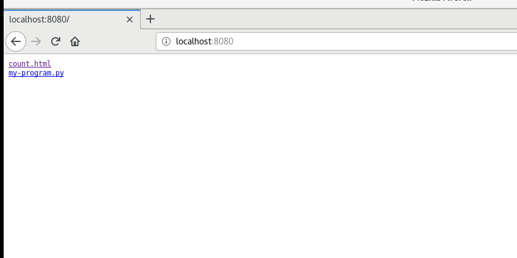

在浏览器中访问`http://localhost:8080/count.html`，显示效果如下：

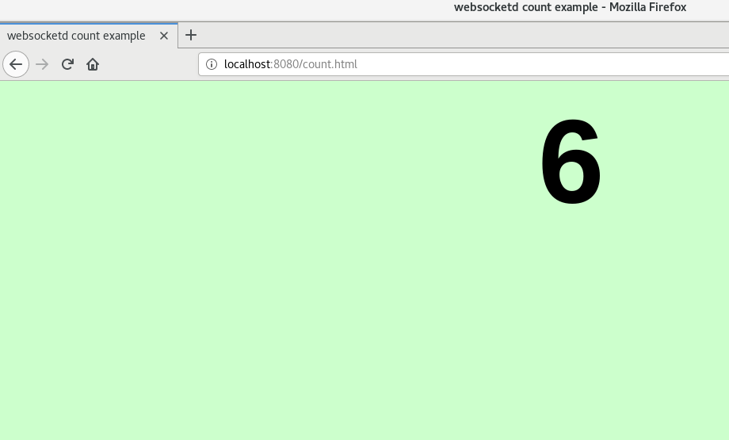

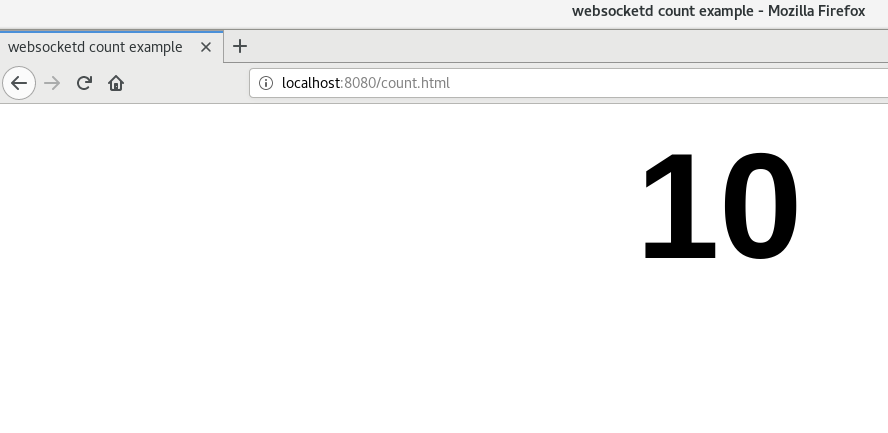


这些访问过程中的后端输出如下：

```bash
[root@localhost myWebsocketd]# websocketd --port=8080 --staticdir=. python my-program.py 
Sun, 18 Oct 2020 15:09:55 +0800 | INFO   | server     |  | Serving using application   : /usr/bin/python my-program.py
Sun, 18 Oct 2020 15:09:55 +0800 | INFO   | server     |  | Serving static content from : .
Sun, 18 Oct 2020 15:09:55 +0800 | INFO   | server     |  | Starting WebSocket server   : ws://localhost.localdomain:8080/
Sun, 18 Oct 2020 15:09:55 +0800 | INFO   | server     |  | Serving CGI or static files : http://localhost.localdomain:8080/
Sun, 18 Oct 2020 15:10:01 +0800 | ACCESS | http       | url:'http://localhost:8080/count.html' | STATIC
Sun, 18 Oct 2020 15:10:01 +0800 | ACCESS | session    | url:'http://localhost:8080/' id:'1603005001776067906' remote:'::1' command:'/usr/bin/python' origin:'http://localhost:8080' | CONNECT
Sun, 18 Oct 2020 15:10:06 +0800 | ACCESS | session    | url:'http://localhost:8080/' id:'1603005001776067906' remote:'::1' command:'/usr/bin/python' origin:'http://localhost:8080' pid:'8661' | DISCONNECT
Sun, 18 Oct 2020 15:26:33 +0800 | ACCESS | http       | url:'http://localhost:8080/count.html' | STATIC
Sun, 18 Oct 2020 15:26:33 +0800 | ACCESS | session    | url:'http://localhost:8080/' id:'1603005993089921816' remote:'::1' command:'/usr/bin/python' origin:'http://localhost:8080' | CONNECT
Sun, 18 Oct 2020 15:26:37 +0800 | ACCESS | session    | url:'http://localhost:8080/' id:'1603005993089921816' remote:'::1' command:'/usr/bin/python' origin:'http://localhost:8080' pid:'8867' | DISCONNECT


Sun, 18 Oct 2020 15:29:16 +0800 | ACCESS | http       | url:'http://localhost:8080/' | STATIC
Sun, 18 Oct 2020 15:30:29 +0800 | ACCESS | http       | url:'http://localhost:8080/count.html' | STATIC
Sun, 18 Oct 2020 15:30:29 +0800 | ACCESS | session    | url:'http://localhost:8080/' id:'1603006229382631744' remote:'::1' command:'/usr/bin/python' origin:'http://localhost:8080' | CONNECT
Sun, 18 Oct 2020 15:30:33 +0800 | ACCESS | session    | url:'http://localhost:8080/' id:'1603006229382631744' remote:'::1' command:'/usr/bin/python' origin:'http://localhost:8080' pid:'8927' | DISCONNECT
Sun, 18 Oct 2020 15:31:17 +0800 | ACCESS | http       | url:'http://localhost:8080/' | STATIC

```

### 17. 序列化和反序列化

[序列化和反序列化的详解](https://blog.csdn.net/tree_ifconfig/article/details/82766587)

- `Java序列化`：Java对象转换为字节序列的过程

- `Java反序列化`：字节序列恢复为Java对象的过程。

- `序列化最重要的作用`：在传递和保存对象时.保证对象的完整性和可传递性。对象转换为有序字节流,以便在网络上传输或者保存在本地文件中。

- `反序列化的最重要的作用`：根据字节流中保存的对象状态及描述信息，通过反序列化重建对象。

  总结：核心作用就是对象状态的保存和重建。（整个过程核心点就是字节流中所保存的对象状态及描述信息）


序列化是指把一个Java对象变成二进制内容，本质上就是一个byte[]数组。 为什么要把Java对象序列化呢？因为序列化后可以把byte[]保存到文件中，或者把byte[]通过网络传输到远程，这样，就相当于把Java对象存储到文件或者通过网络传输出去了。 有序列化，就有反序列化，即把一个二进制内容（也就是byte[]数组）变回Java对象。有了反序列化，保存到文件中的byte[]数组又可以“变回”Java对象，或者从网络上读取byte[]并把它“变回”Java对象。

### 18. REST API 中 GET 请求有多个参数怎么办？

[使用RESTful风格api命名接口时，GET方法怎么传递多个参数](https://blog.csdn.net/qq_35075909/article/details/94005211)


| RESTful接口名               | 普通接口名                  | 接口含义                               |
| --------------------------- | --------------------------- | -------------------------------------- |
| GET：users                  | GET：users                  | 获取所有用户列表                       |
| GET：users/123              | GET：users?userId=123       | 获取id为123的用户信息                  |
| GET：users/class/1          | GET：users?class=1          | 获取班级id为1的所有用户信息            |
| GET：users/class/1/gender/1 | GET：users?class=1&gender=1 | 获取班级id为1，性别id为1的所有用户列表 |

也可以选择POST请求，虽然这有些违背了REST API的规范，但是参数过多使用上述的方式，URL看起来非常复杂，再者参数过多有可能操作URL的长度限制。

另外，还可以参考百度图数据库 hugegraph的REST API 风格。其实就是上面的普通接口风格。

#### 结论

RESTful只是一种架构风格，不必一定拘泥于硬性规范，还是要以实际情况为准。


### 19. 设计一个权限系统RBAC

TODO

### 20. 什么是LAMP/LNMP？

LAMP和LNMP是两种架构。主要是使用的架构组件有所不同。

LAMP：Linux、Apache、MySQL、PHP/Python

LNMP：Linux、nginx、MySQL、PHP/Python

下图只是用于理解，并不限于这样。

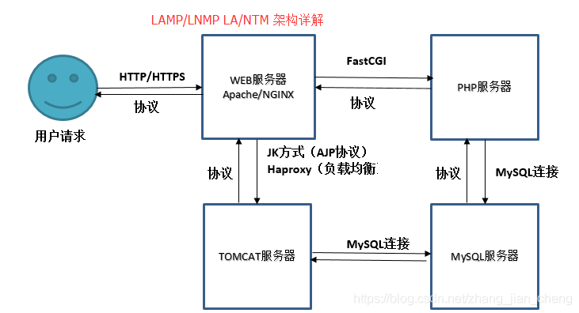


### 21. B2B/B2C/C2C/O2O分别是什么？

[C2C、O2O、B2B、B2C 的区别在哪里？](https://www.zhihu.com/question/20171789)

你在地摊买东西，C2C
你去超市买东西，B2C
超市找经销商进货，B2B
超市出租柜台给经销商卖东西，B2B2C
你在网上下载个优惠券去KFC消费，O2O

是不是突然发现这些高大上的概念都Low爆了？


C2C，就是你 找了一个 站街女，价格便宜，偶尔有好货，不过也可能被仙人跳
B2C，就是你去天上人间或者什么星级酒店的桑拿部，统一管理统一服务，不满意还可以投诉
O2O，你qq上聊楼凤，谈好了自己过去享受服务
B2B，为上面B2C的那些企业提供小姐培训服务


B2B: Business-to-Business

B2C: Business-to-Customer

C2C: Customer(Consume) to Customer(Consumer)

O2O: Online to Offline

### 22. 上百万访问量的网站，Session应该如何处理？

一则，高并发情况下就不应该使用session，因为session通常是存在服务端的，这回给服务端的扩展、性能造成一定的影响，应该使用token来进行登录保持。

二则，高并发场景下仍然使用session。

 - 将sessin要存储的数据，放在cookie中存储。优点是解放了服务端，服务端好扩展，缺点是cookie在客户端可能会不安全；

 - 使用session粘滞、session复制或session共享。

   - session粘滞在服务器数量改变时，可能会造成大量的session不可用。

   - session复制需要占用一定的IO资源，而且服务器越多，造成的性能损失也越多。

   - session共享，可以将session存在 文件系统、数据库或缓存中。

     - 通过文件系统（比如NFS方式）来实现各台服务器间的Session共享，各台服务器只需要mount共享服务器的存储Session的磁盘即可，实现较为简单。但NFS 对高并发读写的性能并不高，在硬盘I/O性能和网络带宽上存在较大瓶颈，尤其是对于Session这样的小文件的频繁读写操作，适合并发量不大的网站
- 使用数据库存放session，适合数据库访问量不大的网站。优点：实现简单； 缺点：由于数据库服务器相对于应用服务器更难扩展且资源更为宝贵，在高并发的Web应用中，最大的性能瓶颈通常在于数据库服务器。因此如果将 Session存储到数据库表，频繁的数据库操作会影响业务。
     - 存在缓存中，例如Redis中。如果数据量大，可以使用Redis cluster。


### 23. PEP 3333简介

#### 23.1 什么是PEP？

PEP是[Python](https://baike.baidu.com/item/Python) Enhancement Proposals的缩写。一个PEP是一份为Python社区提供各种增强功能的技术规格，也是提交新特性，以便让社区指出问题，精确化技术文档的提案。

#### 23.2 PEP 3333

[PEP3333](https://www.python.org/dev/peps/pep-3333/)

本文档指定了Web服务器与Python Web应用程序或框架之间的标准接口，以提高Web应用程序和Web服务器之间的可移植性。

Python当前拥有各种各样的Web应用程序框架，例如Zope，Quixote，Webware，SkunkWeb，PSO和Twisted Web。但是，由于不同的Web应用程序框架可能支持不同的Web服务器，所以对于Python新手而言，在选择Web应用程序框架时可能会遇到一些问题。

相比之下，Java也有许多中Web应用程序框架，但是Java的“Servlet" API 使得任何使用Java Web应用程序框架编写的应用程序都能够在支持Servlet API的Web服务器中运行。

Python也需要这样一个接口，这个PEP提出了Web服务器与Web应用程序/框架之间的简单且通用的接口：**Python Web服务器网关接口（WSGI）**。

仅仅只有一个接口规范是不行的，还需要Web服务器和Web应用程序框架实现WSGI接口才能真正起到作用。

WSGI接口要考虑两个部分：server/gateway端，application/framework端。server端需要调用application所提供的可调用对象。这个可调用对象的提供方式，根据server或gateway的不同而不同，例如：

> 1. 通过application编写脚本来创建server或gatewya实例，并为其提供应用程序对象。
> 2. 通过使用配置文件来指定应该从何处导入应用程序对象。


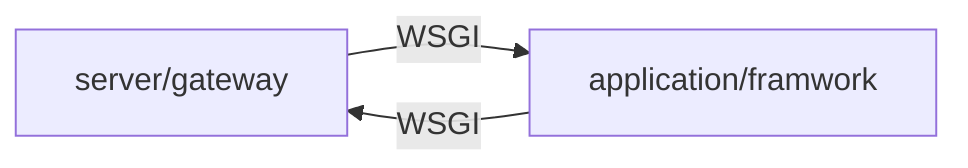
```mermaid
graph LR
server/gateway --WSGI--> application/framwork
application/framwork --WSGI--> server/gateway
```


因此，WSGI定义了两种“字符串”：

- "Native string" 我认为就是原生字符串：用于请求/响应头和元数据（Python3中的str类型，Python2中的unicode类型）
  "Bytestrings"(字节串，我认为是字节类型的字符串，字节的序列)（Python 3中的bytes类型，python2中的str类型），用于请求和响应的主体（例如POST / PUT输入数据和HTML页面输出）。


##### Application/Framework端

WSG接口规范中所提到的应用程序对象是一个接受2个参数的可调用对象，可以是函数、方法、类或实现了\_\_call\_\_()方法的实例。例如：

```python
HELLO_WORLD = b"Hello world!\n"

# 这是一个应用程序对象
def simple_app(environ, start_response):
    """Simplest possible application object"""
    status = '200 OK'
    response_headers = [('Content-type', 'text/plain')]
    start_response(status, response_headers)
    return [HELLO_WORLD]

# 这是另外一个应用程序对象
class AppClass:
    """Produce the same output, but using a class

    (Note: 'AppClass' is the "application" here, so calling it
    returns an instance of 'AppClass', which is then the iterable
    return value of the "application callable" as required by
    the spec.

    If we wanted to use *instances* of 'AppClass' as application
    objects instead, we would have to implement a '__call__'
    method, which would be invoked to execute the application,
    and we would need to create an instance for use by the
    server or gateway.
    """

    def __init__(self, environ, start_response):
        self.environ = environ
        self.start = start_response

    def __iter__(self):
        status = '200 OK'
        response_headers = [('Content-type', 'text/plain')]
        self.start(status, response_headers)
        yield HELLO_WORLD
```


##### Server/Gateway端

server/gateway每次接收到从HTTP客户端发送的request时，都会调用一次这个应用程序对象。下面用一个例子来证明，

```python
import os, sys

enc, esc = sys.getfilesystemencoding(), 'surrogateescape'

def unicode_to_wsgi(u):
    # Convert an environment variable to a WSGI "bytes-as-unicode" string
    return u.encode(enc, esc).decode('iso-8859-1')

def wsgi_to_bytes(s):
    return s.encode('iso-8859-1')

def run_with_cgi(application):
    environ = {k: unicode_to_wsgi(v) for k,v in os.environ.items()}
    environ['wsgi.input']        = sys.stdin.buffer
    environ['wsgi.errors']       = sys.stderr
    environ['wsgi.version']      = (1, 0)
    environ['wsgi.multithread']  = False
    environ['wsgi.multiprocess'] = True
    environ['wsgi.run_once']     = True

    if environ.get('HTTPS', 'off') in ('on', '1'):
        environ['wsgi.url_scheme'] = 'https'
    else:
        environ['wsgi.url_scheme'] = 'http'

    headers_set = []
    headers_sent = []

    def write(data):
        out = sys.stdout.buffer

        if not headers_set:
             raise AssertionError("write() before start_response()")

        elif not headers_sent:
             # Before the first output, send the stored headers
             status, response_headers = headers_sent[:] = headers_set
             out.write(wsgi_to_bytes('Status: %s\r\n' % status))
             for header in response_headers:
                 out.write(wsgi_to_bytes('%s: %s\r\n' % header))
             out.write(wsgi_to_bytes('\r\n'))

        out.write(data)
        out.flush()

    def start_response(status, response_headers, exc_info=None):
        if exc_info:
            try:
                if headers_sent:
                    # Re-raise original exception if headers sent
                    raise exc_info[1].with_traceback(exc_info[2])
            finally:
                exc_info = None     # avoid dangling circular ref
        elif headers_set:
            raise AssertionError("Headers already set!")

        headers_set[:] = [status, response_headers]

        # Note: error checking on the headers should happen here,
        # *after* the headers are set.  That way, if an error
        # occurs, start_response can only be re-called with
        # exc_info set.

        return write

    result = application(environ, start_response)
    try:
        for data in result:
            if data:    # don't send headers until body appears
                write(data)
        if not headers_sent:
            write('')   # send headers now if body was empty
    finally:
        if hasattr(result, 'close'):
            result.close()
```


##### Middleware:Components that Play Both Sides

这样一个中间件，既可以扮演server端，也可扮演application端。对于server端而言，中间件扮演application；对于application端而言，中间件扮演server。


- 在重写`environ`之后，根据目标UR路由request到不同的应用程序对象。
- 允许多个应用程序/框架同时运行。
- 通过网络转发request和response，实现负载均衡和远程处理。
- perform content postprocessing

一段中间件的示例代码如下：

```python
from piglatin import piglatin

class LatinIter:

    """Transform iterated output to piglatin, if it's okay to do so

    Note that the "okayness" can change until the application yields
    its first non-empty bytestring, so 'transform_ok' has to be a mutable
    truth value.
    """

    def __init__(self, result, transform_ok):
        if hasattr(result, 'close'):
            self.close = result.close
        self._next = iter(result).__next__
        self.transform_ok = transform_ok

    def __iter__(self):
        return self

    def __next__(self):
        if self.transform_ok:
            return piglatin(self._next())   # call must be byte-safe on Py3
        else:
            return self._next()

class Latinator:

    # by default, don't transform output
    transform = False

    def __init__(self, application):
        self.application = application

    def __call__(self, environ, start_response):

        transform_ok = []

        def start_latin(status, response_headers, exc_info=None):

            # Reset ok flag, in case this is a repeat call
            del transform_ok[:]

            for name, value in response_headers:
                if name.lower() == 'content-type' and value == 'text/plain':
                    transform_ok.append(True)
                    # Strip content-length if present, else it'll be wrong
                    response_headers = [(name, value)
                        for name, value in response_headers
                            if name.lower() != 'content-length'
                    ]
                    break

            write = start_response(status, response_headers, exc_info)

            if transform_ok:
                def write_latin(data):
                    write(piglatin(data))   # call must be byte-safe on Py3
                return write_latin
            else:
                return write

        return LatinIter(self.application(environ, start_latin), transform_ok)


# Run foo_app under a Latinator's control, using the example CGI gateway
from foo_app import foo_app
run_with_cgi(Latinator(foo_app))
```


## （二）nginx篇

### 1. nginx是什么？特点是什么？

nginx，即 engine x，是一个web服务器和方向代理服务器，用于HTTP、HTTPS、SMTP、POP3和IMAP协议。

nginx 解决了服务器的C10K（就是在一秒之内连接客户端的数目为10k即1万）问题。它的设计不像传统的服务器那样使用线程处理请求，而是一个更加高级的机制—事件驱动机制，是一种异步事件驱动结构。

特点是：

- 反向代理，负载均衡器
- 高可靠性、单 Master 多 Worker 模式
- 高可扩展性、高度模块化
- 非阻塞
- 事件驱动
- 低内存消耗
- 热部署

### 2. 为什么要用nginx

当然是因为nginx的优点咯。轻量级、抗并发、模块化等。

### 3. 为什么nginx性能这么高，怎么实现高并发的

> 因为他的事件驱动机制：异步非阻塞事件处理机制：运用了epoll模型，提供了一个队列，排队解决

nginx为一群服务器做代理，每次请求经过nginx转发给不同的服务器；具体的由负载均衡的策略决定

在配置文件中，配置upStream 指向多个服务器并指定负载均衡的策略

在server中配置proxy_pass指向upstream

### 4. 怎么处理HTTP请求

nginx使用反应器模式。主事件循环等待操作系统发出准备事件的信号，这样数据就可以从套接字读取，在该实例中读取到缓冲区并进行处理。单个线程可以提供数万个并发连接。

### 5. 什么是正向代理和反向代理

正向代理，代理的是客户端，代理服务器和客户端对于服务端而言是一个整体，而服务端并不知道真正的客户端是谁，例如VPN。


正向代理的优点：

- 访问原本无法访问的网站，如google
- 用作上网认证，对用户进行访问授权
- 记录用户上网行为（访问记录），对外隐藏用户信息
- 可以做缓存，加速访问资源

反向代理，代理的服务端，代理服务器和服务端对于客户端而言是一个整体，客户端并不知道真正的服务器是谁。

反向代理的优点：

- 保证内网安全，隐藏了真是服务器的IP地址。
- 负载均衡，通过反向代理服务器来优化网站的负载


### 6. 使用反向代理服务器的优点是

反向代理的优点：

- 保证内网安全，隐藏了真是服务器的IP地址。
- 负载均衡，通过反向代理服务器来优化网站的负载


### 8. 如何用nginx解决前端跨域问题

在开发静态页面时，类似Vue的应用，我们常会调用一些接口，这些接口极可能是跨域，然后浏览器就会报cross-origin问题不给调。

最简单的解决方法，就是把浏览器设为忽略安全问题，设置--disable-web-security。不过这种方式开发PC页面到还好，如果是移动端页面就不行了。

**解决办法**

使用nginx转发请求。把跨域的接口写成调本域的接口，然后将这些接口转发到真正的请求地址。

**先：**

调试页面是：http://192.168.1.100:8080/

请求的接口是：http://ni.hao.sao/api/get/info

**步骤一：**

请求的接口是：http://192.168.1.100:8080/api/get/info

PS：这样就解决了跨域问题。

**步骤二：**

安装好nginx后，去到/usr/local/etc/nginx/目录（这是Mac的），修改nginx.conf文件。

```
server{
        listen 8888;
        server_name  192.168.1.100;
 
        location /{
            proxy_pass http://192.168.1.100:8080;
        }
 
        location /api{
            proxy_pass http://ni.hao.sao/api;
        }
    }
```


### 9. 限流怎么做的，算法是什么

[nginx实战（六）nginx实现限流](https://blog.csdn.net/ouyida3/article/details/86768526)

nginx官方版本限制IP的连接和并发分别有两个模块：

-  limit_req_zone 用来限制单位时间内的请求数，即速率限制,采用的漏桶算法 “leaky bucket”。
-  limit_req_conn 用来限制同一时间连接数，即并发限制。
-  limit_zone，已废弃

```
    limit_conn_log_level notice;
    limit_conn_status 503;
    limit_conn_zone $server_name zone=perserver:10m;
    limit_conn_zone $binary_remote_addr zone=perip:10m;
    limit_req_zone $binary_remote_addr zone=allips:100m   rate=2r/s;
    
    server {
        listen 8080;
        limit_conn perserver 250;
        limit_conn perip 2;
        limit_req  zone=allips  burst=3  nodelay;
        limit_rate_after 5m;
        limit_rate 800k;
        location / {
           proxy_pass http://132.120.2.73:8080;
        }
    }

```

这是一个生产上完整的例子。里面按服务器限流、按ip限流、burst nodelay都用上、按速率限流、判断是否大文件才限速率，全部都有了。并且日志级别、超过限流时返回什么错误也有了。应该是比较全了。

如果一开始看不懂没关系，先作个引子，回头再看来，检验自己是否会配置了。

特别注意，limit_zone已经废弃了，不要再用了，网上可能有一些旧的博客会继续有这个。

### 10. 为什么要做动静分离

在我们的软件开发中，有些请求是需要后台处理的（如：.jsp,.do等等），有些请求是不需要经过后台处理的（如：css、html、jpg、js等等），这些不需要经过后台处理的文件称为静态文件，否则动态文件。因此我们后台处理忽略静态文件，但是如果直接忽略静态文件的话，后台的请求次数就明显增多了。在我们对资源的响应速度有要求的时候，应该使用这种动静分离的策略去解决动、静分离将网站静态资源（HTML，JavaScript，CSS等）与后台应用分开部署，提高用户访问静态代码的速度，降低对后台应用访问。这里将静态资源放到nginx中，动态资源转发到[tomcat](https://www.wkcto.com/courses/tomcat.html)服务器中,毕竟Tomcat的优势是处理动态请求。

### 11. 怎么做的动静分离

动静分离的原理很简单，通过location对请求url进行匹配即可，在/Users/Hao/Desktop/Test（任意目录）下创建 /static/imgs 配置如下：

```
###静态资源访问
server {
  listen       80;
  server_name  static.haoworld.com;
  location /static/imgs {
       root /Users/Hao/Desktop/Test;
       index  index.html index.htm;
   }
}
###动态资源访问
 server {
  listen       80;
  server_name  www.haoworld.com;
    
  location / {
    proxy_pass http://127.0.0.1:8080;
     index  index.html index.htm;
   }
}
```


### 12. nginx是如何实现负载均衡的？

[nginx实现负载均衡](https://www.jianshu.com/p/4c250c1cd6cd)

nginx有5种负载均衡方式：

- rr(轮训模式)
- ip_hash
- url_hash
- fair
- weight(加权)

#### 12.1 轮询

轮询方式是nginx负载默认的方式，顾名思义，所有请求都按照时间顺序分配到不同的服务上，如果服务Down掉，可以自动剔除，如下配置后轮训10001服务和10002服务。


```undefined
upstream  dalaoyang-server {
       server    localhost:10001;
       server    localhost:10002;
}
```

#### 12.2 权重

指定每个服务的权重比例，weight和访问比率成正比，通常用于后端服务机器性能不统一，将性能好的分配权重高来发挥服务器最大性能，如下配置后10002服务的访问比率会是10001服务的二倍。


```undefined
upstream  dalaoyang-server {
       server    localhost:10001 weight=1;
       server    localhost:10002 weight=2;
}
```

#### 12.3 iphash

每个请求都根据访问ip的hash结果分配，经过这样的处理，每个访客固定访问一个后端服务，如下配置（ip_hash可以和weight配合使用）。


```undefined
upstream  dalaoyang-server {
       ip_hash; 
       server    localhost:10001 weight=1;
       server    localhost:10002 weight=2;
}
```

#### 12.4 最少连接

将请求分配到连接数最少的服务上。


```undefined
upstream  dalaoyang-server {
       least_conn;
       server    localhost:10001 weight=1;
       server    localhost:10002 weight=2;
}
```

#### 12.5 fair

按后端服务器的响应时间来分配请求，响应时间短的优先分配。


```undefined
upstream  dalaoyang-server {
       server    localhost:10001 weight=1;
       server    localhost:10002 weight=2;
       fair;  
}
```


### 13. nginx和Apache的区别是

- 轻量级，同样起web 服务，比apache 占用更少的内存及资源；
- 抗并发，nginx处理请求是异步非阻塞的，而apache 则是阻塞型的，在高并发下nginx 能保持低资源低消耗高性能；
- 高度模块化的设计，编写模块相对简单；
- 最核心的区别在于apache是同步多进程模型，一个连接对应一个进程；nginx是异步的，多个连接（万级别）可以对应一个进程。相比而言，apache比nginx更稳定一些。

### 14. 举例说明nginx服务器的最佳用途是

nginx服务器的最佳用法

- 在网络上部署动态HTTP内容，使用SCGI、WSGI应用程序服务器、用于脚本的FastCGI处理程序。
- 还可以作为负载均衡器。

### 15. 如何通过不同于80的端口开启nginx?

答：为了通过一个不同的端口开启nginx，你必须进/etc/nginx/sites-enabled/，如果这是默认文件，那么必须打开名为“default”的文件。编辑文件，并放置在你想要的端口：

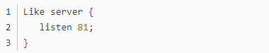

### 16. 在nginx中如何在URL中保留双斜线?

要在URL中保留双斜线，就必须使用merge_slashes_off；

语法:merge_slashes [on/off] ； 

默认值: merge_slashes on ；

环境: http，server

### 17. ngx_http_upstream_module的作用是什么?

`ngx_http_upstream_module`用于定义可通过`fastcgi`、`proxy`、`uwsgi`、`memcached`和`scgi`指令所使用的服务器组。

`ngx_http_upstream_module`中有许多配置指令：

- `upstream` 定义一组servers，servers可以监听不同的端口，可以混合使用监听TCP和UNIX域套接字的服务器。

  ```
  
  # 默认情况下，使用加权round-robin轮询方法在服务器之间分配连接。 下面的示例中，每7个连接将如下分配：5个连接转到backend1.example.com:12345，分别分配一个连接到第二个和第三个服务器。 如果在与服务器通信期间发生错误，则连接将被传递到下一个服务器，依此类推，直到尝试所有正常运行的服务器为止。 如果与所有服务器的通信失败，则连接将关闭。
  upstream backend {
      server backend1.example.com:12345 weight=5;
      server 127.0.0.1:12345            max_fails=3 fail_timeout=30s;
      server unix:/tmp/backend2;
      server backend3.example.com:12345 resolve;
  
      server backup1.example.com:12345  backup;
  }
  ```

  

- `server` 通过`server`指令定义后端服务器的address和相关parameters。address可以是带有端口号的域名或IP地址，或UNIX-domain的socket。如果定义的域名解析为多个IP地址那就相当于一次定义了多个服务器。parameters有如下几种：

  - weight=number 设置配置的后端服务器的权重，默认为1
  - max_conns=number 限制同一时刻连接到该后端服务器的最大连接数。默认为0，表示不限。
  - max_fails=number 设置当后端服务器发生fail_timeout期间，与后端服务器通信失败后的重试次数。默认为1，如果设置为0，表示禁用重试。
  - fail_timeout=time 在指定次数的重试与后端服务器通信都不成功后，认为该后端服务器不可用的持续时间。默认为10s
  - backup 标记该server为备份server。当primary server不可用的时候，将连接传递给backup server。
  - down 标记该server为永久不可用。
  - resolve 监控域名形式的server所对应的IP地址的改变，然后在无需重启nginx的前提下自动修改upstream的配置。此参数要生效，必须先指定resolver指令。
  - service=name 启用DNS SRV记录解析，设置service为“name”。为了让此参数生效，需要实名reolve参数。
  - slow_start=time 设置服务器不正常运行时，或者在一段时间后服务器变为不可用时，服务器将其重量从零恢复到标称值的时间。 默认值为零，即禁用慢速启动。

- `zone`  定义共享内存区域的名称和大小，以保留worker进程之间共享的组的配置和运行时状态。

- `state` 指定一个文件来保存动态配置的组的状态。

- `hash`  指定客户端和服务器之间映射所用的负载均衡方法中，所用的hash的key是啥。

  ```
  hash $remote_addr;
  hash $remote_addr consistent; # 使用一致性哈希
  ```

  

- `least_conn` 指定一组server应当使用的负载均衡方法是，活动连接数最少的那个server（同时也会考虑server的权重）。

- `least_time`  指定一组server应当使用的负载均衡方法是，将连接传递给server的平均时间最少且活动连接数最少的那个server（同时也会考虑server的权重）。

- `random` 指定一组server应当使用的负载均衡方法是，将连接传递给随机一个server（同时也会考虑server的权重）。

- `resolver` 配置name server，用于解析upstream中server域名所对应的IP地址。

- `resolver_timeout`  设置域名解析的超时时间。

### 18. 什么是C10K问题?

C10K问题是指无法同时处理大量客户端(10,000)的网络套接字。

### 19. 请陈述stub_status和sub_filter指令的作用是什么?

1. stub_status指令：该指令用于了解nginx的当前状态，如当前的活动连接，接受和处理当前读/写/等待连接的总数 ；
2. sub_filter指令：它用于搜索和替换响应中的内容，并快速修复陈旧的数据

### 20. nginx是否支持将请求压缩到上游?

可以使用nginx模块gunzip将请求压缩到上游。gunzip模块是一个过滤器，它可以对不支持“gzip”编码方法的客户机或服务器使用“内容编码:gzip”来解压缩响应。

### 21. 解释如何在nginx中获得当前的时间?

要获得nginx的当前时间，必须使用SSI模块、$date_gmt和$date_local的变量。Proxy_set_header THE-TIME $date_gmt;

### 22. 用nginx服务器解释-s的目的是什么?

用于运行nginx -s参数的可执行文件。

### 23. 解释如何在nginx服务器上添加模块?

在编译过程中，必须选择nginx模块，因为nginx不支持模块的运行时间选择。

### 24. 为什么不使用多线程？

nginx:采用`单线程来异步非阻塞`处理请求（管理员可以配置nginx主进程的工作进程的数量），不会为每个请求分配cpu和内存资源，节省了大量资源，同时也减少了大量的CPU的上下文切换，所以才使得nginx支持更高的并发。

### 25. 为什么nginx可以采用异步非阻塞的方式来处理呢

异步非阻塞的事件处理机制(select/poll/epoll/kqueue)。它们提供了一种机制，让你可以同时监控多个事件，调用他们是阻塞的，但可以设置超时时间，在超时时间之内，如果有事件准备好了，就返回。《[网络IO模型](https://blog.csdn.net/y3over/article/details/88983210)》。这样，就可以并发处理大量的并发了，当然，这里的并发请求，是指未处理完的请求，线程只有一个，所以同时能处理的请求当然只有一个了，只是在请求间进行不断地切换而已，切换也是因为异步事件未准备好，而主动让出的。这里的切换是没有任何代价，你可以理解为循环处理多个准备好的事件，事实上就是这样的。与多线程相比，这种事件处理方式是有很大的优势的

- 不需要创建线程，每个请求占用的内存也很少，没有上下文切换，事件处理非常的轻量级。
- 并发数再多也不会导致无谓的资源浪费（上下文切换）。更多的并发数，只是会占用更多的内存而已。 我之前有对连接数进行过测试，在24G内存的机器上，处理的并发请求数达到过200万。现在的网络服务器基本都采用这种方式，这也是nginx性能高效的主要原因。

> 我们之前说过，推荐设置worker的个数为cpu的核数，在这里就很容易理解了，更多的worker数，只会导致进程来竞争cpu资源了，从而带来不必要的上下文切换。而且，nginx为了更好的利用多核特性，提供了cpu亲缘性的绑定选项，我们可以将某一个进程绑定在某一个核上，这样就不会因为进程的切换带来cache的失效

### 26. 如果nginx成为瓶颈该怎么办？

TODO

这是我自己的想法：如果nginx成为瓶颈，那么就部署nginx集群，然后利用keepalive实现虚ip，也就是说通过keepalive再实现一次负载均衡，然后才是nginx。不知道对不对哈。

### 27.  nginx架构

nginx在启动后，在unix系统中会以daemon的方式在后台运行，后台进程包含一个master进程和多个worker进程。
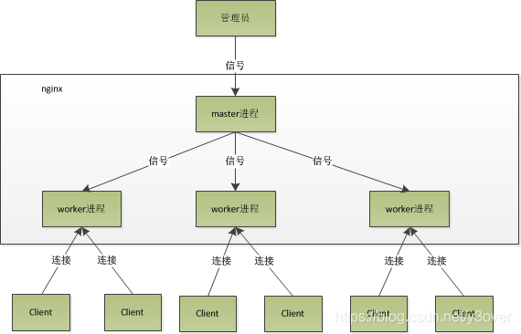

- master进程主要用来管理worker进程，包含：接收来自外界的信号，向各worker进程发送信号，监控worker进程的运行状态，当worker进程退出后(异常情况下)，会自动重新启动新的worker进程。
- worker进程中来处理基本的网络事件。每个worker进程都维护一个线程（避免线程切换），多个worker进程之间是对等的，他们同等竞争来自客户端的请求，各进程互相之间是独立的。一个请求，只可能在一个worker进程中处理，一个worker进程，不可能处理其它进程的请求。

> - 我们也可以手动地关掉后台模式，让nginx在前台运行，并且通过配置让nginx取消master进程，从而可以使nginx以单进程方式运行.显然，生产环境下我们肯定不会这么做，所以关闭后台模式，一般是用来调试用的
> - worker进程的个数是可以设置的，一般我们会设置与机器cpu核数一致,这里面的原因与nginx的进程模型以及事件处理模型是分不开的

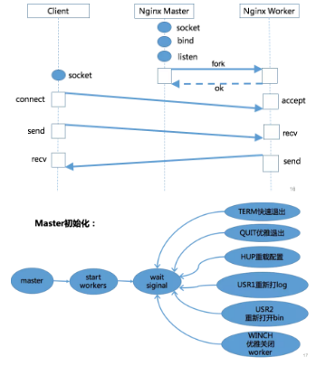

### 28. nginx 网关是什么？

> 在[计算机网络](https://link.zhihu.com/?target=https%3A//zh.wikipedia.org/wiki/%E8%AE%A1%E7%AE%97%E6%9C%BA%E7%BD%91%E7%BB%9C)中，**网关**（英语：Gateway）是转发其他服务器通信数据的服务器，接收从客户端发送来的请求时，它就像自己拥有资源的源服务器一样对请求进行处理

##### 网关的分类

- 协议网关：此类网关的主要功能是在不同协议的网关之间协议转换。
- 应用网关：主要是针对一些专门的应用而设置的网关。
- 安全网关：包过滤，还有防火墙之类的设置。

nginx本来就是网关，nginx网关就是说起到网关作用的Nignx，那其实就是nginx而已。就跟说API接口一样的意思。

### 30. nginx挂了怎么？nginx如何实现高可用

[Nginx系列教程（五）| 利用 Nginx+Keeplived 实现高可用技术](https://blog.csdn.net/jake_tian/article/details/105309055)

Nginx既然作为入口网关，很重要，如果出现单点问题，显然是不可接受的。答案是：Keepalived+Nginx实现高可用。

Keepalived是一个高可用解决方案，主要是用来防止服务器单点发生故障，可以通过和Nginx配合来实现Web服务的高可用。（其实，Keepalived不仅仅可以和Nginx配合，还可以和很多其他服务配合）

Keepalived+Nginx实现高可用的思路：

第一：请求不要直接打到Nginx上，应该先通过Keepalived（这就是所谓虚拟IP，VIP）

第二：Keepalived应该能监控Nginx的生命状态（提供一个用户自定义的脚本，定期检查Nginx进程状态，进行权重变化,，从而实现Nginx故障切换）


### 31. nginx是如何实现热部署的？

[nginx文档](http://nginx.org/en/docs/control.html)中关于控制nginx的信号有如下几种：

| TERM, INT | fast shutdown                                                |
| --------- | :----------------------------------------------------------- |
| QUIT      | graceful shutdown                                            |
| HUP       | changing configuration, keeping up with a changed time zone (only for FreeBSD and Linux), starting new worker processes with a new configuration, graceful shutdown of old worker processes |
| USR1      | re-opening log files                                         |
| USR2      | upgrading an executable file                                 |
| WINCH     | graceful shutdown of worker processes                        |

热部署的意思是在不停止服务的前提下实现部署。就是配置文件nginx.conf修改后，不需要stop nginx，不需要中断请求，就能让配置文件生效。（nginx -s reload 重新加载/nginx -t检查配置文件/nginx -s stop）

方案一：

修改配置文件nginx.conf后，主进程master负责推送给worker进程更新配置信息，worker进程收到信息后，更新进程内部的线程信息。

方案二：

master进程检查配置文件语法是否有效

然后尝试根据新的配置打开新的log文件和socket，如果失败了，则回滚改变，仍然使用旧的配置；如果成功了，则开启新的worker进程，新的client请求都交给新的worker进程来处理

然后，告诉旧的worker进程可以优雅地关闭了，即旧的worker进程关闭旧的socket，然后在处理完旧的client请求后关闭该worker进程。

nginx使用的是方案二。

证实上面的结论：

在修改配置前的master和worker进程信息如下：

```
  PID  PPID USER    %CPU   VSZ WCHAN  COMMAND
33126     1 root     0.0  1148 pause  nginx: master process /usr/local/nginx/sbin/nginx
33127 33126 nobody   0.0  1380 kqread nginx: worker process (nginx)
33128 33126 nobody   0.0  1364 kqread nginx: worker process (nginx)
33129 33126 nobody   0.0  1364 kqread nginx: worker process (nginx)
```

修改配置后的master和worker进程信息如下（将 hup 信号发送给master即可）：

```
 PID  PPID USER    %CPU   VSZ WCHAN  COMMAND
33126     1 root     0.0  1164 pause  nginx: master process /usr/local/nginx/sbin/nginx
33129 33126 nobody   0.0  1380 kqread nginx: worker process is shutting down (nginx)
33134 33126 nobody   0.0  1368 kqread nginx: worker process (nginx)
33135 33126 nobody   0.0  1368 kqread nginx: worker process (nginx)
33136 33126 nobody   0.0  1368 kqread nginx: worker process (nginx)
```

33129的旧worker进程仍然在运行，过一段时间之后再看：

```
  PID  PPID USER    %CPU   VSZ WCHAN  COMMAND
33126     1 root     0.0  1164 pause  nginx: master process /usr/local/nginx/sbin/nginx
33134 33126 nobody   0.0  1368 kqread nginx: worker process (nginx)
33135 33126 nobody   0.0  1368 kqread nginx: worker process (nginx)
33136 33126 nobody   0.0  1368 kqread nginx: worker process (nginx)
```

所有的worker进程都是新的了。

### . 谈一下你对uWSGI 和 nginx的理解？

[PEP333](https://www.python.org/dev/peps/pep-3333/)

[Python Web开发最难懂的WSGI协议，到底包含哪些内容？ WSGI服务器种类和性能对比](https://blog.csdn.net/hshl1214/article/details/80310410)

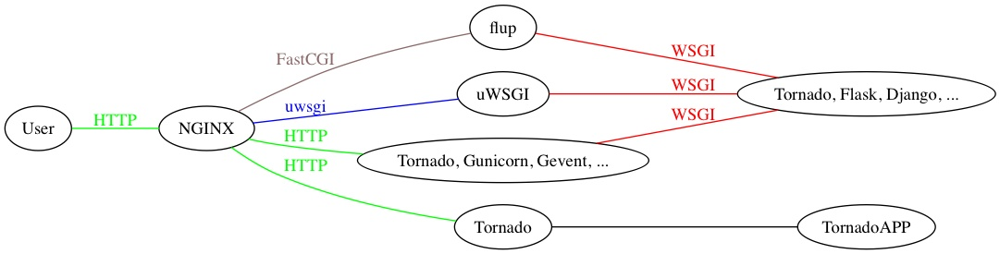

`uWSGI `是一个 Web 服务器，它实现了 `WSGI `协议、`uwsgi`、`http `等协议。`nginx` 中`HttpUwsgiModule` 的作用是与 `uWSGI `服务器进行交换。

`WSGI`，全称 `Web Server Gateway Interface`，或者 `Python Web Server Gateway Interface` ，是为 `Python 语言定义的 Web 服务器和 Web 应用程序或框架之间的一种简单而通用的接口`。自从 `WSGI `被开发出来以后，许多其它语言中也出现了类似接口。

`WSGI` 的官方定义是，`the Python Web Server Gateway Interface`。从名字就可以看出来，这东西是一个`Gateway`，也就是网关。`网关的作用就是在协议之间进行转换。`

 

要注意 `WSGI / uwsgi / uWSGI `这三个概念的区分。

- `WSGI` 是一种接口，规范或标准，描述**web server**如何与**web application**通信的规范。

- `uwsgi` 是一种线路协议而不是通信协议，在此常用于在 uWSGI 服务器与其他网络服务器的数据通信。（如uWSGI和django通信）

- `uWSGI`是实现了 uwsgi 和 WSGI 两种协议的 Web 服务器。

  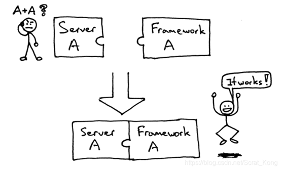

 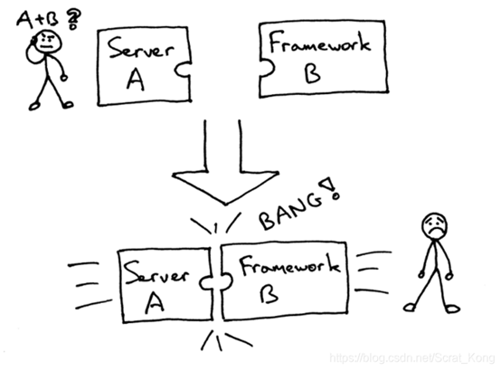

 

 

#### 为什么有了`uWSGI`为什么还需要`nginx`？

因为`nginx`具备优秀的静态内容处理能力，然后将动态内容转发给uWSGI服务器，这样可以达到很好的客户端响应。

 nginx 是一个开源的高性能的 HTTP 服务器和反向代理：

1. 作为 web 服务器，它处理静态文件和索引文件效果非常高；
2. 它的设计非常注重效率，最大支持 5 万个并发连接，但只占用很少的内存空间；
3. 稳定性高，配置简洁；
4. 强大的反向代理和负载均衡功能，平衡集群中各个服务器的负载压力应用

#### nginx如何保持会话？

 有两种方式，一种是ip_hash，另一种是sticky_cookie_insert

1. ip_hash的缺点：
   - 后端服务器宕机后，session丢失
   - 来自同一局域网的客户端（相同的外网ip）会被转发到同一个后端服务器，可能会导致负载失衡
   - 不适用于CDN网络，不适用于前端还有代理的情况。
2. sticky不是通过ip来判断客户端，而是通过cookie来判断，在cookie中会保存名为'route'的cookie键值对，通过此键值对来判断，route的值与后端服务器对应，nginx通过判断cookie中route的值来将请求分发给对应的后端服务器。


## （三）Django篇

### 1. django rest framework

用于前后端分离场景下的后端代码开发。

### 2. Django

TODO

[Django 文档](https://docs.djangoproject.com/zh-hans/2.0/)

对Django的一点了解：

- Django是稳定的。使用 Django 搭建的网站能承受每秒 50000 次点击的流量峰值。
- Django是可扩展的。
- Django是一个MVC框架。当然，很多使用Django的人也管Django是MVT框架

### 3. Django REST framework(DRF)

[DRF](https://www.jianshu.com/p/fc603f48f100)

[Django REST framework 官网](https://www.django-rest-framework.org/)

流程：


安装和简单使用就直接看[DRF](https://www.jianshu.com/p/fc603f48f100)的首页就行了，这里是想讲一下DRF中的各种类。

DRF的核心概念：

- Serializers。DRF通过serializer可以将对象转换为python数据类型（`序列化`），也可以将python数据类型转换为对象（`反序列化`）。类似于Django中的`Form`和`ModelForm`类。
- Views。与Django一样，view分为CBV和FBV。DRF有一个APIView类，它是Django中View类的子类。
- Generic views。DRF的通用视图是为了方便开发者更快地构建API views。如果 generic views对于你要开发的API而言，不太合适的话，可以直接使用APIView、Mixins views。
- ViewSets。DRF支持将一组相关视图的逻辑组合在一起，作为一个Viewset。与Django中CBV略有不同的时，ViewSet并不提供任何处理方法（如：.get()，.post()，.delete()等），而是提供多种动作（actions，如：.list()， .create()等）。然后在使用ViewSet.as_view()时，将处理方法和动作绑定起来，这样更灵活一些。可以使用@action装饰来创建自己的动作。
- Requests。是对Django的`HttpResponse`的扩展，支持对REST框架请求的解析（parse）和验证（authentication）。
- Responses。是Django的 `SimpleTemplateResponse`的子类。REST框架通过提供一个Response类来支持HTTP内容协商，根据客户端请求决定应当返回什么类型的内容，请求中的Accept字段。DRF的Response类会调用Renderers的render()方法，将python类型的数据转换成客户端所接受的数据类型。
- Authentications。身份认证是将传入请求与一组标识凭据（例如，请求的用户或请求的token）相关联的机制。认证完成后，会将用户信息和认证信息写入request对象的user属性和auth属性中。request.user 和 request.auth的值是由authentication_classes中第一个认证成功的authentication类设置的。
- Permissions。决定哪个请求会被授权，哪个请求会被拒绝访问。使用认证之后的request.user和request.auth属性来进行权限处理。检查permission_classes中的所有类，只要有一个失败，则引发相应的异常，而主视图中的处理方法是不会被执行的。DRF支持对象级别的权限验证。
- Routers。DRF支持自动将URL映射到对应的视图的处理方法。
- Renderers。DRF将对传入的请求执行内容协商，并确定最合适的渲染器以满足该请求。如果客户端没有指定Accept或者Accept: \*/\*，则使用renderers中的第一个renderer来渲染response。


- Parsers。访问request.data时，DRF将检查传入的请求的Content-Type标头，并确定使用哪个解析器来解析请求内容。


- Caching。缓存。使用`@method_decorator(cache_page(60*60*2))`装饰器进行缓存设置。

- Throtting。限流用于控制客户端可以向API发出的请求的速率。限流不一定仅指限制请求速率。 例如，存储服务可能还需要限制带宽，而付费数据服务可能需要限制访问一定数量的记录。检查throtting_classes中的所有类，只要有一个失败，则引发相应的异常，而主视图中的处理方法是不会被执行的。

- Filtering。DRF的通用列表视图的默认行为是返回模型管理器的整个查询集。我们可以过滤返回的查询结果。

- Pagination。DRF支持分页，你可以自己决定返回的结果集的大小。


### 4. DRF 和Django是什么关系

[一图看懂Django和DRF](https://zhuanlan.zhihu.com/p/53957464)

[Django官网](https://www.djangoproject.com/)

[Django REST framework 官网](https://www.django-rest-framework.org/)

先简单看看Django和DRF有啥不同。

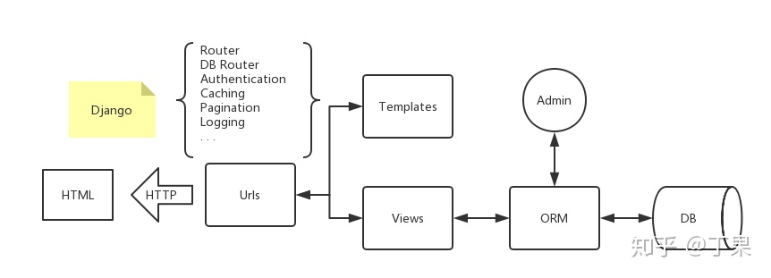

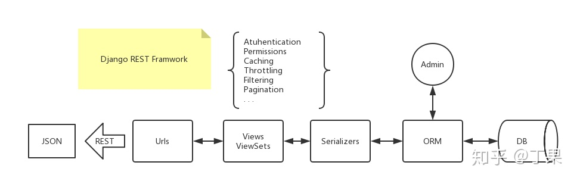

**最少的语言描述Django？**

将数据库的东西通过ORM的映射取出来，通过view文件，按照template文件排出的模板渲染成HTML。当用户请求相应的url时，返回相应的结果。

**最少语言描述DRF？**

将数据库的东西通过ORM的映射取出来，通过view和serializers文件绑定REST接口，当前端请求时，返回序列化好的json。

**最少语言描述DRF在Django的基础上做了什么？**

DRF是Django的超集，去掉了模板的部分，提供了一个REST的接口，同时也提供了满足该接口的代码工作流。同时，在REST的规范下，升级了权限和分页等功能，增加了限流和过滤搜索等功能。

**Django和DRF的tutorial分别讲了什么？**

Django的tutorial讲的是Django的ORM、template、url、admin以及Django怎么run起来等基础知识。

而DRF的tutorial讲的是serializers怎么写，view怎么写，在drf中view这一层既可以一个个get、post、从头开始写起，也可以采用抽象程度比较高的viewset去按配置生成。另外还讲了一些drf升级和新增的功能。

#### **[部署](https://link.zhihu.com/?target=https%3A//uwsgi-docs.readthedocs.io/en/latest/tutorials/Django_and_nginx.html)**

前后端分离的部署也可以用一张图来描述如下，这么一看是不是很清晰了呢！

```text
the web client <-> nginx <-> the socket <-> uwsgi <-> Django
```


```text
the web client <-> nginx <-> the socket <-> uwsgi <-> DRF
                          -> vue.js  - - - - - - - - - +
```

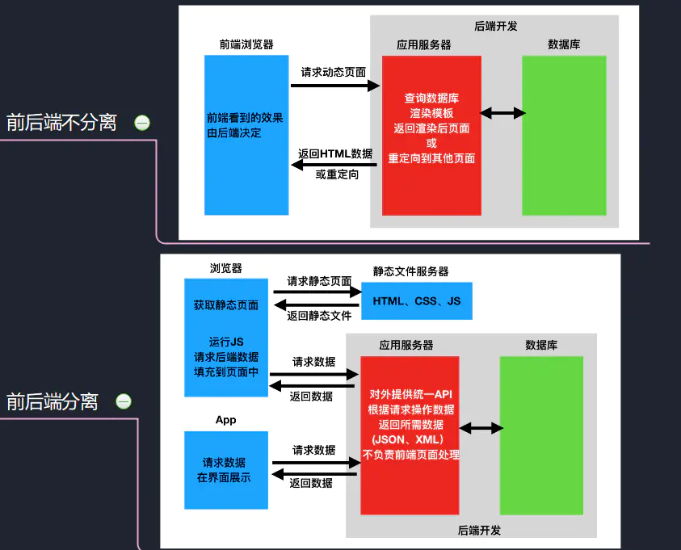


### 5. MVC和MVT的区别

https://www.pianshen.com/article/4893172543/

MVC，即Model-View-Controller，它的核心思想是分工、解耦，让不同的代码块之间降低耦合，增强代码的可扩展性和可移植性，实现向后兼容。MVC是一种框架模式。

设计模式是比框架更小的元素，一个框架中往往含有一个或多个设计模式。

> MVC
>
> - M即Model，封装对数据库层的访问
> - V即View，用于封装结果，生成页面展示的HTML内容
> - C即Controller，用于接收请求，处理业务逻辑，与Model和View交互。
>
> MVT
>
> - M即Model，封装对数据库层的访问
> - V即View，接收请求，处理业务逻辑，与Model和View交互
> - T即Template，用于封装结果，生成页面展示的HTML内容

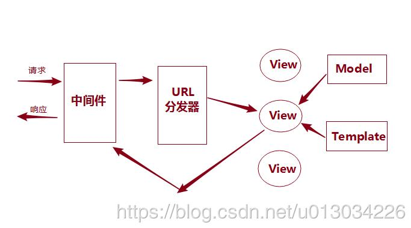

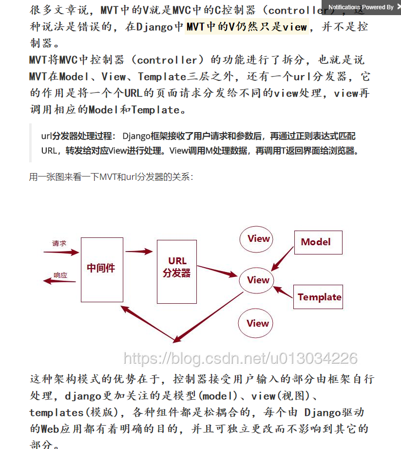

==真正困难的是算法和结构，前者需要好的数学基础，后者需要对所要解决的问题有全面深刻的理解和规划==

## （四）Flask篇

### 0. 模板

项目布局


### 1. Flask

TODO

### 2. Flask中endpoint的理解

[Flask中endpoint的理解](https://www.cnblogs.com/eric-nirnava/p/endpoint.html)

Flask中，会有一个 url_map，保存着url与endpoint的映射，然后通过endpoint就能找到这个url对应的视图函数。

> 所以我们可以看出：**这个`url_map`存储的是`url`与`endpoint`的映射!**
> 回到flask接受用户请求地址并查询函数的问题。实际上，当请求传来一个url的时候，会先通过`rule`找到`endpoint`(`url_map`)，然后再根据`endpoint`再找到对应的`view_func`(view_functions)。通常，`endpoint`的名字都和视图函数名一样。
> 这时候，这个`endpoint`也就好理解了：
>
> ```
> 实际上这个endpoint就是一个Identifier，每个视图函数都有一个endpoint，
> 当有请求来到的时候，用它来知道到底使用哪一个视图函数
> ```

### 3. Flask中的请求上下文和应用上下文


- 请求上下文：`request`，`session`

- 应用上下文；`current_app`，`g`

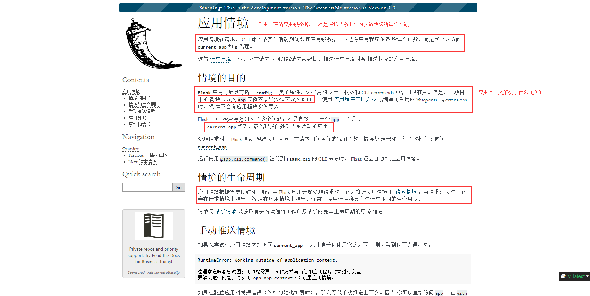

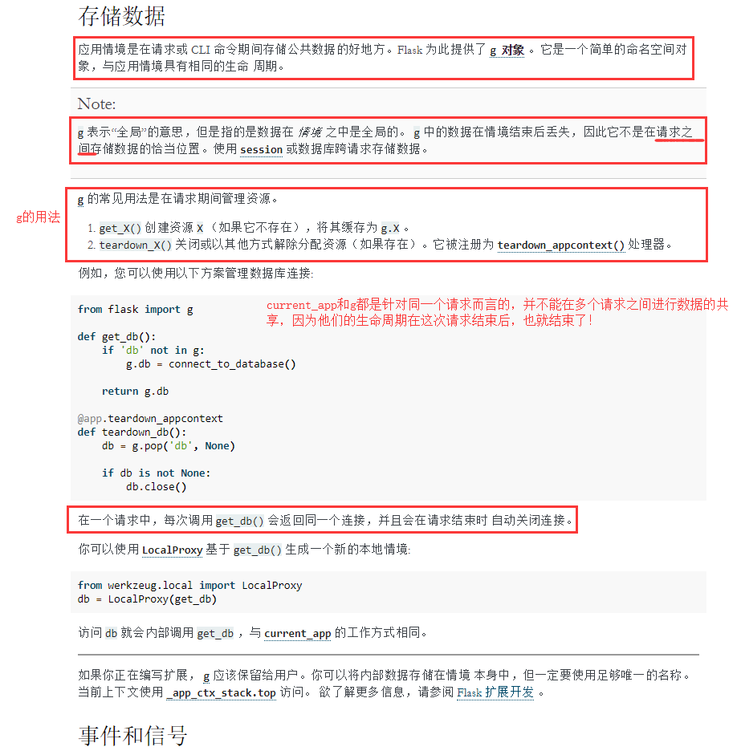

`current_app`是在当前请求中用来访问当前的Flask应用的，例如，在蓝图中只有通过此方式才能访问到当前Flask应用，如`current_app.logger.info()`来生成日志信息。

`current_app`和`g`是用来在请求期间管理一些数据，避免总是要通过参数的方式传递给函数。例如，在一个请求过程中，处理该请求时，需要调用多个函数，这些函数都要访问数据，则可以将数据连接存到`g`中，然后在本次请求中可以通过`g`来直接获取数据库连接，请求结束后关闭数据库连接。

- 一是不用多次传递数据库连接给多个函数。
- 二是不用多次创建/关闭数据库连接。

==这些上下文，并不是真正的全局变量，它们是wekzeug的`local`对象，类似于Python的`thread local`（略有不同）。它们只是在当前线程中是全局有效的==，并不是我们之前所知道的进程中的全局变量。

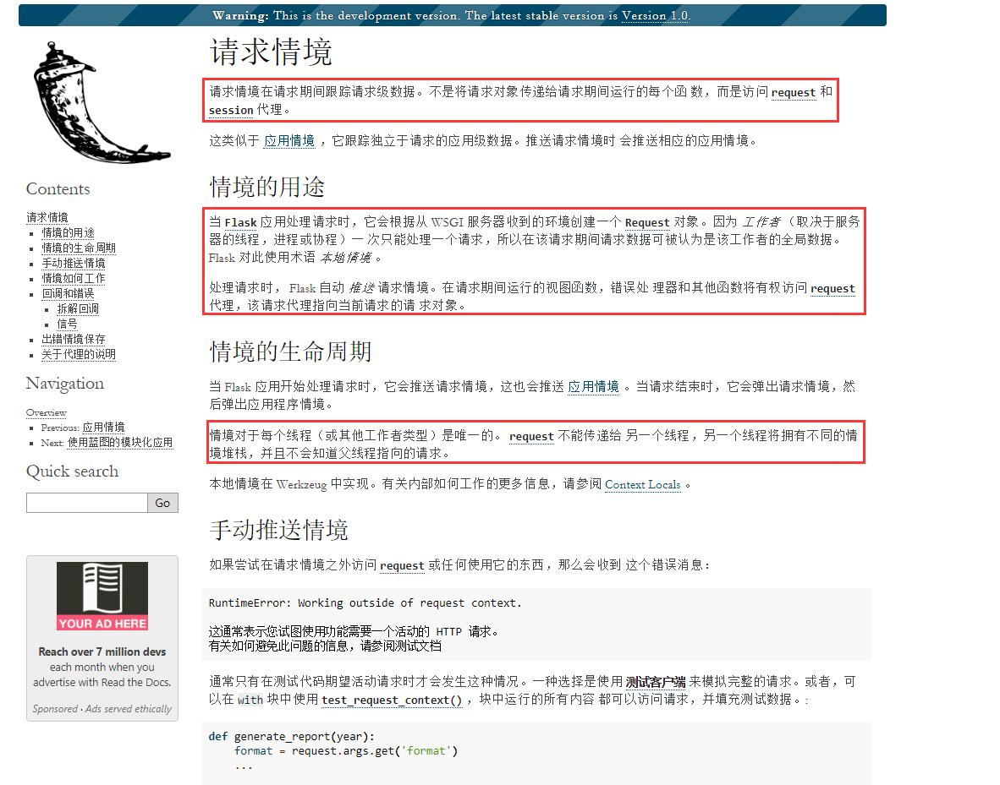

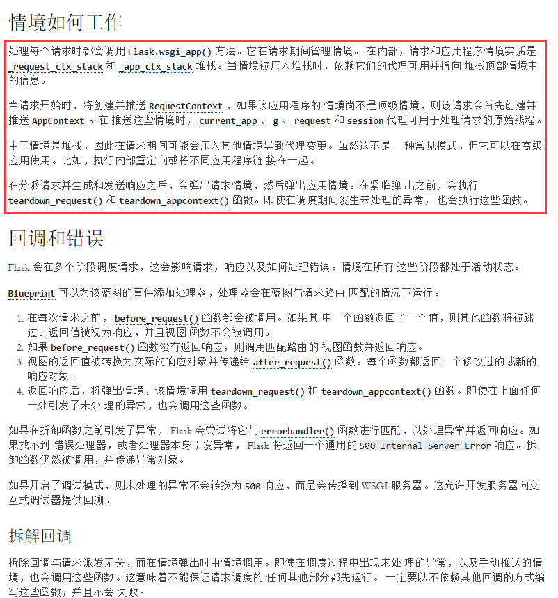

#### werkzeug的`context local`

[Context Locals](https://werkzeug.palletsprojects.com/en/0.15.x/local/)

对于WSGI应用，使用全局变量是非线程安全的。

在Python的标准库中有一个概念--`thread locals`。`thread local`是一个全局变量，我们可以往里面放入数据，然后以线程安全的方式从中获取该数据。无论什么时候在`thread local`对象上设置值/获取值，`thread local`对象都会检查你现在处于哪个线程中，然后找到你所在线程的值，这样就保证了不会获取到其他线程的数据。

但是，这种方法有一些缺点。例如，在Python中除了thread之外，还有其他类型的并发，如`greenlets`。另外，WSGI并不能保证每个请求都有自己的线程。一个请求可能会重用之前某个请求的线程，因此数据需要保留在`thread local`对象中。

[廖雪峰Python教程 ThreadLocal](https://www.liaoxuefeng.com/wiki/1016959663602400/1017630786314240)

[Python中ThreadLocal的理解与使用](https://www.cnblogs.com/linpd/p/10051945.html)

==Python中的thread local可以简单理解为，key为线程id，值为thread local数据的字典。==

werkzeug提供了一种本地数据存储的实现，名为 `werkzeug.local`。`werkzeug.local`与Python的`thread local`相似，但是它使用的是`greenlets`。

`werkzeug.local`的使用示例：

```python
from werkzeug.local import Local, LocalManager

lcoal = Local()
local_manager = LocalManager([local])

def application(environ, start_response):
    local.request = request = Request(environ)
    ...
    
application = local_manager.make_middleware(application)
    
```

将request对象绑定到local.request，在==相同的上下文==（相同进程的，相同线程的，相同greenlet）的其他地方访问`local.request`得到的就是同一个request对象。`make_middleware()`方法确保在请求后清除对此local对象的所有引用。

### 4. Flask中是如何保持会话的？

首先，我们要知道

> 1. 浏览器通过输入用户名/密码，发送第一次request请求该网站
> 2. 该网站的服务器返回响应，并通过response.set_cookie()，让浏览器保存某些cookies
> 3. 当浏览器再次请求该网站时，会携带之前保存在浏览器中的cookies
> 4. 该网站的服务器会检测是否有携带cookies，携带的cookie是否与服务器所持有的session保持对应，该session是否还有效，有效则说明应该保持会话，无效则需要用户重新登录。

那么在这个过程中，Flask是如何处理session保持的呢？

在不是flask_session扩展的情况下，flask是将需要保持的session信息保留在内存中，如果机器宕机，则无法实现session保持。所以，通常我们都需要使用flask_session扩展来实现更好的session保持。

[flask学习笔记--flask内置session处理机制](https://blog.csdn.net/m0_37519490/article/details/80774069)


## （五）HTML，JS，CSS篇

### 5.1 HTML

#### 5.1.1 HTML5的5种布局方式

[W3school HTML 布局](https://www.w3school.com.cn/html/html_layout.asp)

[HTML+CSS 五种布局方式](https://blog.csdn.net/m0_38134431/article/details/84372226)

5种布局方式分别是：

1. 浮动布局。float: left  或 float: right;可以实现块元素的左右分布，因为默认的块元素是上下分布的。
2. 绝对定位布局。position: absolute; 当页面大小缩放时，不会跟着变化，脱离了文档流。
3. flex布局 Flexible Box 的缩写，意为"弹性布局"。display: flex;
4. table-cell表格布局。display: table;
5. 网格布局。 display: grid;

要想理解HTML的布局，需要理解`盒子模型`

[HTML CSS + DIV实现整体布局](https://blog.csdn.net/zhousenshan/article/details/82708554?utm_medium=distribute.pc_relevant.none-task-blog-BlogCommendFromMachineLearnPai2-1.control&dist_request_id=1328627.21385.16154373716994235&depth_1-utm_source=distribute.pc_relevant.none-task-blog-BlogCommendFromMachineLearnPai2-1.control)

### 5.2 JS

TODO


### 5.3 CSS

TODO


## （六）Vue篇

[vue2](https://cn.vuejs.org/v2/guide/)