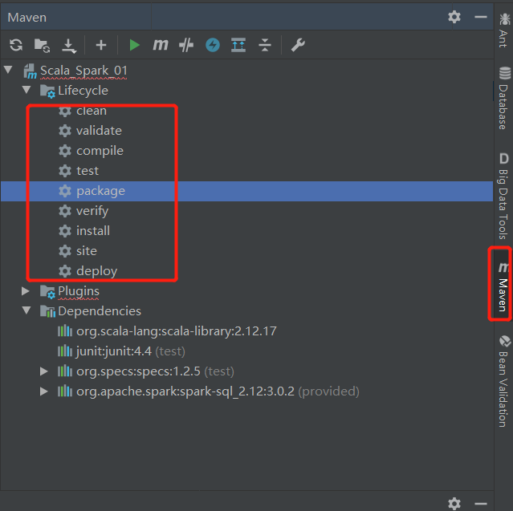
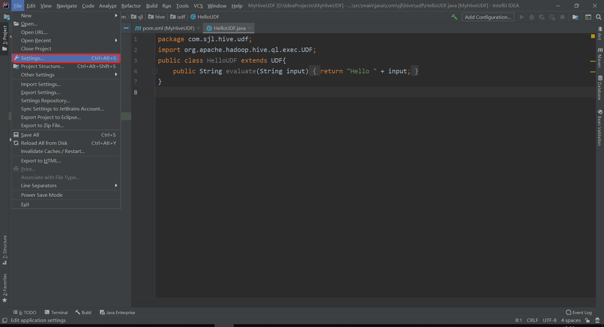
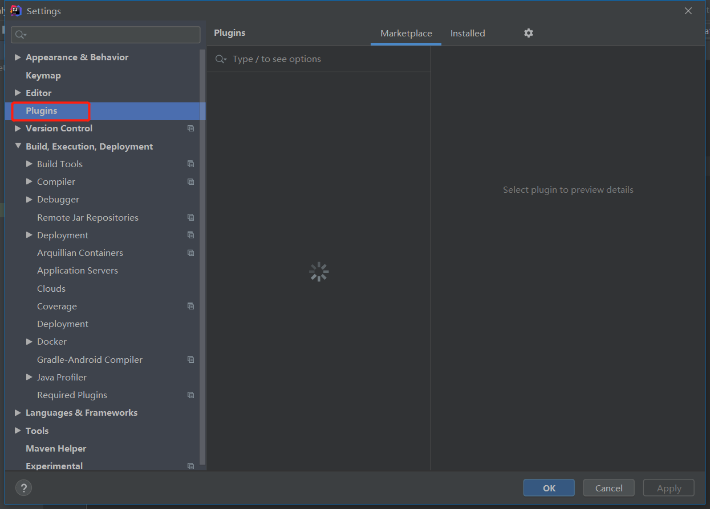
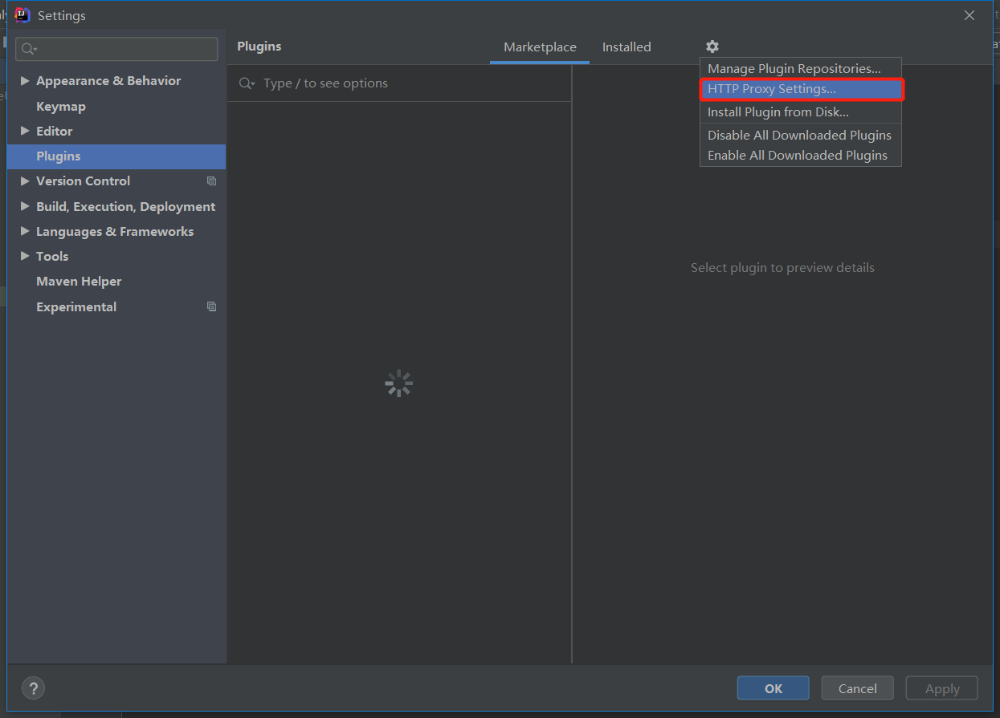
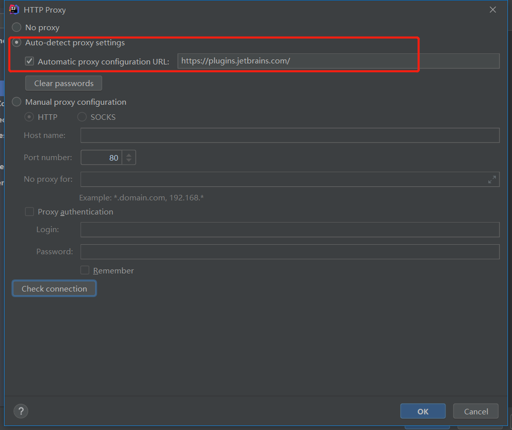
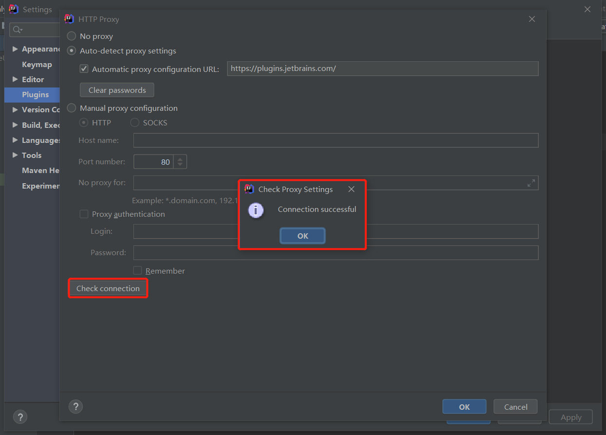

# 1. IntelliJ

IntelliJ创建一个maven

修改maven /conf/setting.xml 中的maven仓库

快捷键

ctrl+q 快速文档

alt+enter 补全变量

ctrl+alt+v 快速声明对象

x.var	快速声明对象

快捷方式 双击选中红色提示  **按** **Alt+Enter** 快速抛出异常

shift+enter 直接换行

ctrl+alt+space 代码提示

ctrl+shift+enter 末尾自动补充分号

ctrl+p 方法参数提示

ctrl+h	调出一个类的继承树

ctrl+o	重写方法

x.for	tab键	快速for循环

fori	快速for循环

sout	println

x.sout	println

# 常见问题

Q. IDEA使用maven package打包后没有target目录，也没有xxx.jar

问题原因：

> 在pom.xml中的`<project><packaging>pom</packaging></project>`中，指定了打包格式为pom并不为jar，删除此行重新打包即可。

## Q. IDEA如何打jar包？

https://blog.csdn.net/u013733643/article/details/124242741

## Q. IDEA 的Plugins 连不上、打不开

参考文档：https://blog.csdn.net/loulanyue_/article/details/105779350

File > Settings > Plugins

解决方法：参考https://blog.csdn.net/loulanyue_/article/details/105779350。

三种方式：

- 配置HTTP Proxy
- **Setting—>update—>Check Now**
- 离线下载插件，本地安装插件

