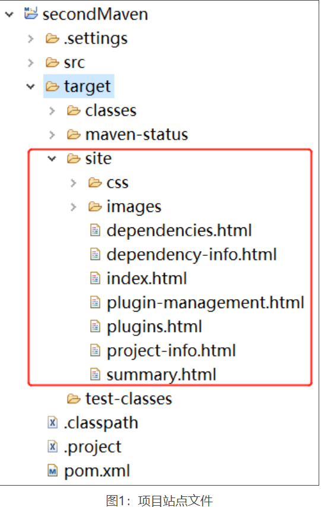
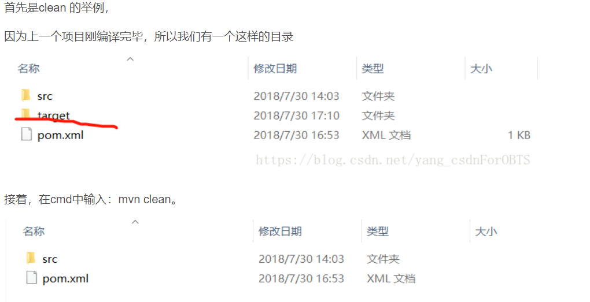
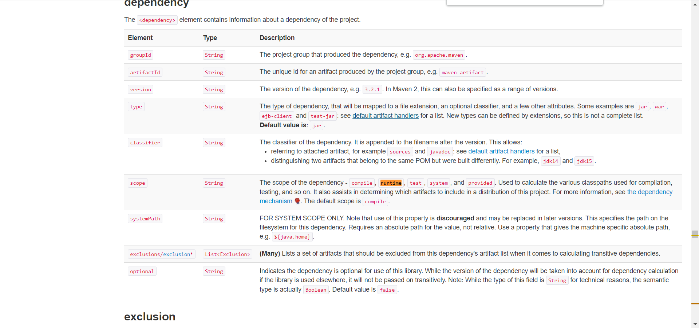
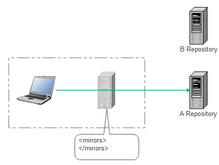

# 1. Maven概述

[Maven官网](https://maven.apache.org/)

## 1.1 Maven是什么？

Maven是一个项目管理工具。

构建工具：

- `make`：Java的构建工具，需要编写makefile，不方便。

- `Apache Ant`：Java的构建工具，灵活定义清理、编译、测试、打包过程，但是没有依赖管理，不方便。

- `Apache Maven`：Java的构建工具，是自动化构建工具和依赖管理工具，使用`pom.xml`作为配置文件。

- `Gradle`：Gradle是一个基于[Apache](https://baike.baidu.com/item/Apache/6265?fromModule=lemma_inlink) Ant和Apache [Maven](https://baike.baidu.com/item/Maven/6094909?fromModule=lemma_inlink)概念的项目自动化构建[开源工具](https://baike.baidu.com/item/开源工具/22692453?fromModule=lemma_inlink)。它使用一种基于[Groovy](https://baike.baidu.com/item/Groovy/180590?fromModule=lemma_inlink)的特定领域语言([DSL](https://baike.baidu.com/item/DSL/60963557?fromModule=lemma_inlink))来声明项目设置，也增加了基于[Kotlin](https://baike.baidu.com/item/Kotlin/1133714?fromModule=lemma_inlink)语言的kotlin-based DSL，抛弃了基于XML的各种繁琐配置。

  面向[Java](https://baike.baidu.com/item/Java/85979?fromModule=lemma_inlink)应用为主。当前其支持的语言C++、Java、[Groovy](https://baike.baidu.com/item/Groovy/180590?fromModule=lemma_inlink)、[Kotlin](https://baike.baidu.com/item/Kotlin/1133714?fromModule=lemma_inlink)、[Scala](https://baike.baidu.com/item/Scala/2462287?fromModule=lemma_inlink)和Swift，计划未来将支持更多的语言。

- `Bazel`：Bazel是一个类似于Make，Maven和Gradle的开源构建和测试工具。Bazel支持多种语言混编的项目并且可以根据不同的平台输出不同的构建结果。

  优势：

  - 加快构建和测试速度：Bazel只重建必要的东西，借助缓存，优化依赖关系分析和并行执行，可以获得快速的和增量的构建。
  - 支持多种语言：支持Java, C++, Android, iOS, Go和各种其他语言，可以运行在Windows，macOS和Linux上。
  - 可扩展：可以扩展Bazel以支持您选择的语言

- `SBT`：SBT是 Scala 的构建工具，全称是 `Simple Build Tool`， 类似 Maven 或 Gradle。 SBT 的野心很大，采用Scala编程语言本身编写配置文件，这使得它稍显另类，虽然增强了灵活性，但是对于初学者来说同时也增加了上手难度。

## 1.2 Maven的好处是什么？

采用标准管理和实践来加快开发周期

## 1.3 怎么配置Maven？

Maven有专门的配置文件进行配置，具体见 https://maven.apache.org/guides/mini/guide-configuring-maven.html

## 1.4 如何创建一个Maven项目？

使用archetype为maven-archetype-quickstart来创建一个Maven项目

gruopId 为 com.mycompany.app
artifactId 为 my-app

```shell
mvn -B archetype:generate -DgroupId=com.mycompany.app -DartifactId=my-app -DarchetypeArtifactId=maven-archetype-quickstart -DarchetypeVersion=1.4
```


会在当前目录下生成一个my-app 的项目目录
pom.xml文件内容如下：

```xml
<project xmlns="http://maven.apache.org/POM/4.0.0" xmlns:xsi="http://www.w3.org/2001/XMLSchema-instance"
  xsi:schemaLocation="http://maven.apache.org/POM/4.0.0 http://maven.apache.org/xsd/maven-4.0.0.xsd">
  <modelVersion>4.0.0</modelVersion>

  <groupId>com.mycompany.app</groupId>
  <artifactId>my-app</artifactId>
  <version>1.0-SNAPSHOT</version>

  <name>my-app</name>
  <!-- FIXME change it to the project's website -->
  <url>http://www.example.com</url>

  <properties>
    <project.build.sourceEncoding>UTF-8</project.build.sourceEncoding>
    <maven.compiler.source>1.7</maven.compiler.source>
    <maven.compiler.target>1.7</maven.compiler.target>
  </properties>

  <dependencies>
    <dependency>
      <groupId>junit</groupId>
      <artifactId>junit</artifactId>
      <version>4.11</version>
      <scope>test</scope>
    </dependency>
  </dependencies>

  <build>
    <pluginManagement><!-- lock down plugins versions to avoid using Maven defaults (may be moved to parent pom) -->
       ... lots of helpful plugins
    </pluginManagement>
  </build>
</project>
```

`<project>` 		所有Maven pom.xml中的顶级元素
`<modelVersion>` 	此POM使用的object model的版本，很少发生改变
`<grouopId>`		创建此Maven项目的组织的ID，通常为域名反写
`<artifactId>`	此Maven项目的名称，
`<version>`		项目的版本，SNAPSHOT表示项目处于开发状态
`<name>`			项目显示的名称
`<url>`			项目的站点
`<properties>`	可在POM中任意位置访问的属性
`<dependencies>`	项目的依赖
`<build>`			用于声明项目目录结构、管理插件等

项目的目录结构如下：

```shell
my-app
|-- pom.xml
`-- src
    |-- main
    |   `-- java
    |       `-- com
    |           `-- mycompany
    |               `-- app
    |                   `-- App.java
    `-- test
        `-- java
            `-- com
                `-- mycompany
                    `-- app
                        `-- AppTest.java
```


根据此archetype创建的Maven项目，有一个POM，`${basedir}/src/main/java`源码目录，`${basedir}/src/test/java` 测试源码目录。这是Maven项目的[标准目录布局](https://maven.apache.org/guides/introduction/introduction-to-the-standard-directory-layout.html)。

## 1.5 如何编译Maven项目

cd到项目根目录（即pom.xml所在的目录），执行如下命令来编译项目源码。

```shell
mvn compile
```


命令的输出如下所示：

```shell
[INFO] Scanning for projects...
[INFO] 
[INFO] ----------------------< com.mycompany.app:my-app >----------------------
[INFO] Building my-app 1.0-SNAPSHOT
[INFO] --------------------------------[ jar ]---------------------------------
[INFO] 
[INFO] --- maven-resources-plugin:3.0.2:resources (default-resources) @ my-app ---
[INFO] Using 'UTF-8' encoding to copy filtered resources.
[INFO] skip non existing resourceDirectory <dir>/my-app/src/main/resources
[INFO] 
[INFO] --- maven-compiler-plugin:3.8.0:compile (default-compile) @ my-app ---
[INFO] Changes detected - recompiling the module!
[INFO] Compiling 1 source file to <dir>/my-app/target/classes
[INFO] ------------------------------------------------------------------------
[INFO] BUILD SUCCESS
[INFO] ------------------------------------------------------------------------
[INFO] Total time:  0.899 s
[INFO] Finished at: 2020-07-12T11:31:54+01:00
[INFO] ------------------------------------------------------------------------
```


当第一次执行此命令时，Maven下载所有的项目依赖和需要的插件，因此第一次执行的时间相对较长。

## 1.6 如何编译测试源码并运行单元测试

编译测试源码并执行单元测试

```shell
mvn test
```

命令的输出如下所示：

```shell
[INFO] Scanning for projects...
[INFO] 
[INFO] ----------------------< com.mycompany.app:my-app >----------------------
[INFO] Building my-app 1.0-SNAPSHOT
[INFO] --------------------------------[ jar ]---------------------------------
[INFO] 
[INFO] --- maven-resources-plugin:3.0.2:resources (default-resources) @ my-app ---
[INFO] Using 'UTF-8' encoding to copy filtered resources.
[INFO] skip non existing resourceDirectory <dir>/my-app/src/main/resources
[INFO] 
[INFO] --- maven-compiler-plugin:3.8.0:compile (default-compile) @ my-app ---
[INFO] Nothing to compile - all classes are up to date
[INFO] 
[INFO] --- maven-resources-plugin:3.0.2:testResources (default-testResources) @ my-app ---
[INFO] Using 'UTF-8' encoding to copy filtered resources.
[INFO] skip non existing resourceDirectory <dir>/my-app/src/test/resources
[INFO] 
[INFO] --- maven-compiler-plugin:3.8.0:testCompile (default-testCompile) @ my-app ---
[INFO] Changes detected - recompiling the module!
[INFO] Compiling 1 source file to <dir>/my-app/target/test-classes
[INFO] 
[INFO] --- maven-surefire-plugin:2.22.1:test (default-test) @ my-app ---
[INFO] 
[INFO] -------------------------------------------------------
[INFO]  T E S T S
[INFO] -------------------------------------------------------
[INFO] Running com.mycompany.app.AppTest
[INFO] Tests run: 1, Failures: 0, Errors: 0, Skipped: 0, Time elapsed: 0.025 s - in com.mycompany.app.AppTest
[INFO] 
[INFO] Results:
[INFO] 
[INFO] Tests run: 1, Failures: 0, Errors: 0, Skipped: 0
[INFO] 
[INFO] ------------------------------------------------------------------------
[INFO] BUILD SUCCESS
[INFO] ------------------------------------------------------------------------
[INFO] Total time:  1.881 s
[INFO] Finished at: 2020-07-12T12:00:33+01:00
[INFO] ------------------------------------------------------------------------
```

只编译测试源码

```shell
mvn test-compile
```


## 1.7 如何创建一个jar，并且在本地仓库中安装它

创建jar，生成在`${basedir}/target`目录下

```shell
mvn package
```

将上述命令生成的`my-app-1.0-SNAPSHOT.jar` 安装到Maven本地仓库（默认位置为`${user.home}/.m2/repository`）。

```shell
mvn install
```

命令的输出如下：

```shell
[INFO] Scanning for projects...
[INFO] 
[INFO] ----------------------< com.mycompany.app:my-app >----------------------
[INFO] Building my-app 1.0-SNAPSHOT
[INFO] --------------------------------[ jar ]---------------------------------
[INFO] 
[INFO] --- maven-resources-plugin:3.0.2:resources (default-resources) @ my-app ---
...
[INFO] --- maven-compiler-plugin:3.8.0:compile (default-compile) @ my-app ---
[INFO] Nothing to compile - all classes are up to date
[INFO] 
[INFO] --- maven-resources-plugin:3.0.2:testResources (default-testResources) @ my-app ---
...
[INFO] --- maven-compiler-plugin:3.8.0:testCompile (default-testCompile) @ my-app ---
[INFO] Nothing to compile - all classes are up to date
[INFO] 
[INFO] --- maven-surefire-plugin:2.22.1:test (default-test) @ my-app ---
[INFO] 
[INFO] -------------------------------------------------------
[INFO]  T E S T S
[INFO] -------------------------------------------------------
[INFO] Running com.mycompany.app.AppTest
[INFO] Tests run: 1, Failures: 0, Errors: 0, Skipped: 0, Time elapsed: 0.025 s - in com.mycompany.app.AppTest
[INFO] 
[INFO] Results:
[INFO] 
[INFO] Tests run: 1, Failures: 0, Errors: 0, Skipped: 0
[INFO] 
[INFO] 
[INFO] --- maven-jar-plugin:3.0.2:jar (default-jar) @ my-app ---
[INFO] Building jar: <dir>/my-app/target/my-app-1.0-SNAPSHOT.jar
[INFO] 
[INFO] --- maven-install-plugin:2.5.2:install (default-install) @ my-app ---
[INFO] Installing <dir>/my-app/target/my-app-1.0-SNAPSHOT.jar to <local-repository>/com/mycompany/app/my-app/1.0-SNAPSHOT/my-app-1.0-SNAPSHOT.jar
[INFO] Installing <dir>/my-app/pom.xml to <local-repository>/com/mycompany/app/my-app/1.0-SNAPSHOT/my-app-1.0-SNAPSHOT.pom
[INFO] ------------------------------------------------------------------------
[INFO] BUILD SUCCESS
[INFO] ------------------------------------------------------------------------
[INFO] Total time:  1.678 s
[INFO] Finished at: 2020-07-12T12:04:45+01:00
[INFO] ------------------------------------------------------------------------
```


通过 

```shell
[INFO] Installing <dir>/my-app/target/my-app-1.0-SNAPSHOT.jar to <local-repository>/com/mycompany/app/my-app/1.0-SNAPSHOT/my-app-1.0-SNAPSHOT.jar
[INFO] Installing <dir>/my-app/pom.xml to <local-repository>/com/mycompany/app/my-app/1.0-SNAPSHOT/my-app-1.0-SNAPSHOT.pom
```

可以看出已经将此jar安装到本地仓库了。

生成项目站点文件

```shell 
mvn site
```

命令的使用和解释参考：https://www.cnblogs.com/cy0628/p/15034359.html

使用maven site 会在项目的target\site 目录下找到 Maven 生成的站点文件，如下图所示：





然后，双击index.html文件可以查看站点信息。

```shell
mvn clean
```

命令的使用和解释参考：https://blog.csdn.net/yang_csdnForOBTS/article/details/81289255

会清除项目目录/target 目录及目录下的所有东西，如图所示：



## 1.8 版本号中的SNAPSHOT是什么意思？

```xml
<project xmlns="http://maven.apache.org/POM/4.0.0"
  ...
  <groupId>...</groupId>
  <artifactId>my-app</artifactId>
  ...
  <version>1.0-SNAPSHOT</version>
  <name>Maven Quick Start Archetype</name>
  ...
```

`SNAPSHOT`：表示项目代码还处于开发阶段，不能保证代码是稳定不变的。例如，开发过程中版本为`x.y-SNAPSHOT`，发布稳定版时版本为`x.y`，然后下一个开发版本为`x.${y+1}-SNAPSHOT`。

## 1.9 如何使用Maven插件？

在build项目时，通常需要用到插件。

例如，使用插件配置Java编译器支持JDK 5.0的源码。pom.xml中添加如下内容：

```xml
...
<build>
  <plugins>
    <plugin>
      <groupId>org.apache.maven.plugins</groupId>
      <artifactId>maven-compiler-plugin</artifactId>
      <version>3.3</version>
      <configuration>
        <source>1.5</source>
        <target>1.5</target>
      </configuration>
    </plugin>
  </plugins>
</build>
...
```

格式为：

```xml
<project>
    <build>
        <plugins>
            <plugin>
                <configuration>
                </configuration>
            </plugin>
        </plugins>
    </build>
</project>
```

通过`<configuration>`元素可以指定传递给插件指定的参数，如：

```xml
      <configuration>
        <source>1.5</source>
        <target>1.5</target>
      </configuration>
```

查看Maven有哪些插件：https://maven.apache.org/plugins/

配置Maven插件：https://maven.apache.org/guides/mini/guide-configuring-plugins.html

## 1.10 如何向jar包中添加资源？

Maven的规则是：`${basedir}/src/main/resources`目录中的任何目录或文件都打包在JAR中。

假设目录结构如下所示：

```shell
my-app
|-- pom.xml
`-- src
    |-- main
    |   |-- java
    |   |   `-- com
    |   |       `-- mycompany
    |   |           `-- app
    |   |               `-- App.java
    |   `-- resources
    |       `-- META-INF
    |           `-- application.properties
    `-- test
        `-- java
            `-- com
                `-- mycompany
                    `-- app
                        `-- AppTest.java
```

可以看到在`${basedir}/src/main/resources`有一个`META-INF`目录，该目录中有一个`application.properties`文件。如果打开Maven打的JAR包，就会发现其目录结构如下所示：

```shell
|-- META-INF
|   |-- MANIFEST.MF
|   `-- application.properties
|   `-- maven
|       `-- com.mycompany.app
|           `-- my-app
|               |-- pom.properties
|               `-- pom.xml
`-- com
    `-- mycompany
        `-- app
            `-- App.class
```

使用Maven打jar包后，会生成一些标准化的文件，如`MANIFEST.MF`。

`pom.properties`的内容与`pom.xml`相同，只不过为了方便`standard Java API`访问将`pom.xml`解析为了`pom.properties`而已。

```
#Generated by Maven
#Tue Oct 04 15:43:21 GMT-05:00 2005
version=1.0-SNAPSHOT
groupId=com.mycompany.app
artifactId=my-app
```

如果需要将资源文件添加到单元测试的classpath，这与上面的方式相同只不过需要将资源文件放在`${basedir}/src/test/resources`。目录结构如下所示：

```shell
my-app
|-- pom.xml
`-- src
    |-- main
    |   |-- java
    |   |   `-- com
    |   |       `-- mycompany
    |   |           `-- app
    |   |               `-- App.java
    |   `-- resources
    |       `-- META-INF
    |           |-- application.properties
    `-- test
        |-- java
        |   `-- com
        |       `-- mycompany
        |           `-- app
        |               `-- AppTest.java
        `-- resources
            `-- test.properties
```

可以通过如下代码，获取此资源文件：

```java
...
 
// Retrieve resource
InputStream is = getClass().getResourceAsStream( "/test.properties" );
 
// Do something with the resource
 
...
```


## 1.11 如何过滤资源文件？

`Filtering`主要用来替换项目中的资源文件（`*.xml`、`*.properties`）当中的`${...}`，比如`${db.url}`，那么如果配置了db.url=aaa的话，在项目编译的时候，就会自动的把`${db.url}`替换为aaa。详细解释可参考：https://lucky.blog.csdn.net/article/details/50411962

有时，资源文件需要包含只能在构建时提供的值。要在Maven中实现这一点，请使用语法`${＜property name＞}`将对将包含该值的属性的引用（占位符）放入资源文件中。该属性可以是**pom.xml中定义的值**、**用户settings.xml中定义值**、**外部属性文件中定义的属性**或系统属性。

要使用Filtering，只需将pom.xml中的资源目录的筛选设置为true：

```xml
<project xmlns="http://maven.apache.org/POM/4.0.0" xmlns:xsi="http://www.w3.org/2001/XMLSchema-instance"
  xsi:schemaLocation="http://maven.apache.org/POM/4.0.0 https://maven.apache.org/xsd/maven-4.0.0.xsd">
  <modelVersion>4.0.0</modelVersion>
 
  <groupId>com.mycompany.app</groupId>
  <artifactId>my-app</artifactId>
  <version>1.0-SNAPSHOT</version>
  <packaging>jar</packaging>
 
  <name>Maven Quick Start Archetype</name>
  <url>http://maven.apache.org</url>
 
  <dependencies>
    <dependency>
      <groupId>junit</groupId>
      <artifactId>junit</artifactId>
      <version>4.11</version>
      <scope>test</scope>
    </dependency>
  </dependencies>
 
  <build>
    <resources>
      <resource>
        <directory>src/main/resources</directory>
        <!-->表示要过滤src/main/resources下的资源文件 <!-->
        <filtering>true</filtering>
      </resource>
    </resources>
  </build>
</project>
```

如上pom.xml所示，为了过滤指定目录下的资源文件，我们需要添加`<build>`、`<resources>`、`<resource>`、`<directory>`、`<filtering>`元素。

在`src/main/resources/application.properties`文件中添加几个属性，如下所示：

```properties
# application.properties
application.name=${project.name}
application.version=${project.version}
```

`${project.name}`表示pom.xml中的`<project><name>`的值，表示项目的名称

`${project.version}`表示pom.xml中的`<project><version>`的值，表示项目的版本

使用如下命令：

```shell
mvn process-resources
```

最终打包之后的jar中的`target/classes`下的`application.properties`文件内容如下所示：

```properties
# application.properties
application.name=Maven Quick Start Archetype
application.version=1.0-SNAPSHOT
```

要引用**外部文件中定义的属性**，只需在pom.xml中添加对该外部文件的引用即可。首先，让我们创建外部属性文件，并将其称为`src/main/filters/filter.properties`：

```properties
# filter.properties
my.filter.value=hello!
```

接下来，我们将在pom.xml中添加对这个新文件的引用：

```xml
<project xmlns="http://maven.apache.org/POM/4.0.0" xmlns:xsi="http://www.w3.org/2001/XMLSchema-instance"
  xsi:schemaLocation="http://maven.apache.org/POM/4.0.0 https://maven.apache.org/xsd/maven-4.0.0.xsd">
  <modelVersion>4.0.0</modelVersion>
 
  <groupId>com.mycompany.app</groupId>
  <artifactId>my-app</artifactId>
  <version>1.0-SNAPSHOT</version>
  <packaging>jar</packaging>
 
  <name>Maven Quick Start Archetype</name>
  <url>http://maven.apache.org</url>
 
  <dependencies>
    <dependency>
      <groupId>junit</groupId>
      <artifactId>junit</artifactId>
      <version>4.11</version>
      <scope>test</scope>
    </dependency>
  </dependencies>
 
  <build>
    <!-- 添加对外部filter文件的引用 -->
    <filters>
      <filter>src/main/filters/filter.properties</filter>
    </filters>
    <resources>
      <resource>
        <directory>src/main/resources</directory>
        <filtering>true</filtering>
      </resource>
    </resources>
  </build>
</project>
```

然后，如果我们在`application.properties`文件中添加对该属性的引用：

```
# application.properties
application.name=${project.name}
application.version=${project.version}
message=${my.filter.value}
```

下一次执行`mvn process resources`命令将把我们的新属性值放入`application.properties`中。作为在外部文件中定义`my.filter.value`属性的替代方法，也可以在`pom.xml`的`<properties>`部分中定义它：

```xml
<project xmlns="http://maven.apache.org/POM/4.0.0" xmlns:xsi="http://www.w3.org/2001/XMLSchema-instance"
  xsi:schemaLocation="http://maven.apache.org/POM/4.0.0 https://maven.apache.org/xsd/maven-4.0.0.xsd">
  <modelVersion>4.0.0</modelVersion>
 
  <groupId>com.mycompany.app</groupId>
  <artifactId>my-app</artifactId>
  <version>1.0-SNAPSHOT</version>
  <packaging>jar</packaging>
 
  <name>Maven Quick Start Archetype</name>
  <url>http://maven.apache.org</url>
 
  <dependencies>
    <dependency>
      <groupId>junit</groupId>
      <artifactId>junit</artifactId>
      <version>4.11</version>
      <scope>test</scope>
    </dependency>
  </dependencies>
 
  <build>
    <resources>
      <resource>
        <directory>src/main/resources</directory>
        <filtering>true</filtering>
      </resource>
    </resources>
  </build>
 
  <properties>
    <my.filter.value>hello</my.filter.value>
  </properties>
</project>
```

filtering资源还可以从系统属性中获取值；内置到Java中的系统属性（如`Java.version`或`user.home`）或使用`标准Java -D参数`在命令行上定义的属性。要继续此示例，让我们将`application.properties`文件更改为如下所示：

```properties
# application.properties
java.version=${java.version}
command.line.prop=${command.line.prop}
```

现在，当您执行以下命令（注意命令行上`command.line.prop`属性的定义）时，`application.properties`文件将包含系统属性中的值。

```shell
mvn process-resources "-Dcommand.line.prop=hello again"
```


## 1.12 如何使用外部依赖？

[Maven的依赖机制](https://maven.apache.org/guides/introduction/introduction-to-dependency-mechanism.html)

`pom.xml`的依赖项部分列出了我们的项目构建所需的所有外部依赖项。现在，我们的项目仅依赖JUnit（为了方便看，去掉了filter 资源的内容）：

```xml
<project xmlns="http://maven.apache.org/POM/4.0.0" xmlns:xsi="http://www.w3.org/2001/XMLSchema-instance"
  xsi:schemaLocation="http://maven.apache.org/POM/4.0.0 https://maven.apache.org/xsd/maven-4.0.0.xsd">
  <modelVersion>4.0.0</modelVersion>
 
  <groupId>com.mycompany.app</groupId>
  <artifactId>my-app</artifactId>
  <version>1.0-SNAPSHOT</version>
  <packaging>jar</packaging>
 
  <name>Maven Quick Start Archetype</name>
  <url>http://maven.apache.org</url>
 
  <dependencies>
    <dependency>
      <groupId>junit</groupId>
      <artifactId>junit</artifactId>
      <version>4.11</version>
      <scope>test</scope>
    </dependency>
  </dependencies>
</project>
```

对于每个外部依赖项，您至少需要定义4项内容：`<groupId>`、`<artifactId>`、`<version>`和`<scope>`。groupId、artifactId和version与pom.xml中为构建该依赖项的项目提供的相同。scope元素表示如何使用这些依赖，具体解释见：https://maven.apache.org/ref/3.8.7/maven-model/maven.html



Maven如何从哪儿引用的这些依赖呢？

Maven在`本地Maven仓库`（默认为`${user.home}/.m2/repostory`）中查找所有依赖项。在上一节中，我们将项目（my-app-1.0-SNAPSHOT.jar）中的artifact安装到`本地Maven仓库`中。一旦jar安装在那里，另一个项目就可以将其作为依赖项引用，只需将依赖项信息添加到其`pom.xml`中即可。

那么`本地Maven仓库`中没有的依赖该如何获取呢？

每当项目引用`本地Maven仓库`没有的依赖项时，Maven都会将依赖项从`远程仓库`下载到`本地Maven仓库`。

默认情况下，Maven使用的远程仓库为https://repo.maven.apache.org/maven2/，还可以设置自己的远程仓库（可能是您公司的中央仓库），以代替默认远程仓库或作为默认远程存储的补充。

关于远程仓库的解释见：https://maven.apache.org/guides/introduction/introduction-to-repositories.html

假设我们在代码中添加了一些日志记录，需要添加log4j作为依赖项。首先，我们需要知道log4j的groupId、artifactId和version是什么。[Maven Central](https://repo.maven.apache.org/maven2/)上的适当目录名为/maven2/log4j/log4j。在该目录中有一个名为`maven-metadata.xml`的文件

```xml
<metadata>
  <groupId>log4j</groupId>
  <artifactId>log4j</artifactId>
  <version>1.1.3</version>
  <versioning>
    <versions>
      <version>1.1.3</version>
      <version>1.2.4</version>
      <version>1.2.5</version>
      <version>1.2.6</version>
      <version>1.2.7</version>
      <version>1.2.8</version>
      <version>1.2.11</version>
      <version>1.2.9</version>
      <version>1.2.12</version>
    </versions>
  </versioning>
</metadata>
```

在远程仓库，还可以看到当前远程仓库提供了哪些版本的jar，可以单击手动下载这些jar。

将log4j的依赖信息添加到项目的pom.xml中：

```xml
<project xmlns="http://maven.apache.org/POM/4.0.0" xmlns:xsi="http://www.w3.org/2001/XMLSchema-instance"
  xsi:schemaLocation="http://maven.apache.org/POM/4.0.0 https://maven.apache.org/xsd/maven-4.0.0.xsd">
  <modelVersion>4.0.0</modelVersion>
 
  <groupId>com.mycompany.app</groupId>
  <artifactId>my-app</artifactId>
  <version>1.0-SNAPSHOT</version>
  <packaging>jar</packaging>
 
  <name>Maven Quick Start Archetype</name>
  <url>http://maven.apache.org</url>
 
  <dependencies>
    <dependency>
      <groupId>junit</groupId>
      <artifactId>junit</artifactId>
      <version>4.11</version>
      <scope>test</scope>
    </dependency>
    <dependency>
      <groupId>log4j</groupId>
      <artifactId>log4j</artifactId>
      <version>1.2.12</version>
      <scope>compile</scope>
    </dependency>
  </dependencies>
</project>
```

当执行`mvn compile`命令时，Maven就会下载log4j的依赖到本地Maven仓库了。

## 1.13 如何在远程仓库中部署我的jar包？

如果你写了比较好jar也可以部署到Maven的远程仓库，这样别人就能复用此jar的功能了，而不用重复造轮子了。

要将jar部署到远程仓库，必须**在pom.xml中配置远程仓库url**，并**在settings.xml中配置用于连接到远程仓库的身份认证信息**。

以下是使用scp和用户名/密码身份验证的示例：

`pom.xml`

```xml
<project xmlns="http://maven.apache.org/POM/4.0.0" xmlns:xsi="http://www.w3.org/2001/XMLSchema-instance"
  xsi:schemaLocation="http://maven.apache.org/POM/4.0.0 https://maven.apache.org/xsd/maven-4.0.0.xsd">
  <modelVersion>4.0.0</modelVersion>
 
  <groupId>com.mycompany.app</groupId>
  <artifactId>my-app</artifactId>
  <version>1.0-SNAPSHOT</version>
  <packaging>jar</packaging>
 
  <name>Maven Quick Start Archetype</name>
  <url>http://maven.apache.org</url>
 
  <dependencies>
    <dependency>
      <groupId>junit</groupId>
      <artifactId>junit</artifactId>
      <version>4.11</version>
      <scope>test</scope>
    </dependency>
    <dependency>
      <groupId>org.apache.codehaus.plexus</groupId>
      <artifactId>plexus-utils</artifactId>
      <version>1.0.4</version>
    </dependency>
  </dependencies>
 
  <build>
    <filters>
      <filter>src/main/filters/filters.properties</filter>
    </filters>
    <resources>
      <resource>
        <directory>src/main/resources</directory>
        <filtering>true</filtering>
      </resource>
    </resources>
  </build>
  <!--
   |
   |
   |
   -->
  <distributionManagement>
    <repository>
      <id>mycompany-repository</id>
      <name>MyCompany Repository</name>
      <url>scp://repository.mycompany.com/repository/maven2</url>
    </repository>
  </distributionManagement>
</project>
```

`settings.xml`

```xml
<settings xmlns="http://maven.apache.org/SETTINGS/1.0.0" xmlns:xsi="http://www.w3.org/2001/XMLSchema-instance"
  xsi:schemaLocation="http://maven.apache.org/SETTINGS/1.0.0 https://maven.apache.org/xsd/settings-1.0.0.xsd">
  ...
  <servers>
    <server>
      <id>mycompany-repository</id>
      <username>jvanzyl</username>
      <!-- Default value is ~/.ssh/id_dsa -->
      <privateKey>/path/to/identity</privateKey> (default is ~/.ssh/id_dsa)
      <passphrase>my_key_passphrase</passphrase>
    </server>
  </servers>
  ...
</settings>
```


## 1.14 如何创建文档？

见：https://maven.apache.org/guides/mini/guide-site.html

## 1.15 如何构建其他类型的项目？

使用如下命令：

```shell
mvn archetype:generate \
    -DarchetypeGroupId=org.apache.maven.archetypes \
    -DarchetypeArtifactId=maven-archetype-webapp \
    -DgroupId=com.mycompany.app \
    -DartifactId=my-webapp
```

可以创建新的项目。


## 1.16 如何一次构建多个项目？

参考POM中的项目继承和项目聚合。

## 1.17 Maven中的archetype是什么？

archetype（原型）是项目模板，使用后会创建一个指定项目结构的项目。

Maven中的goal是什么？

如何搭建Maven远程仓库？


Q. Maven：mirror和repository 区别

**答**：参考文章：https://blog.csdn.net/gaoshan12345678910/article/details/117652178

> mirror相当于一个拦截器，它会拦截maven对remote repository的相关请求，把请求里的remote repository地址，重定向到mirror里配置的地址。
>
> 没有配置mirror
>
> 
>
> 配置了mirror
>
> 

# 2. 安装Maven

## 2.1 Linux系统安装

### 2.1.1 tar包安装

参考文章：https://blog.csdn.net/michaelcc00/article/details/127259659

#### 2.1.1.1 下载Maven

下载地址：https://repo.huaweicloud.com/apache/maven/

#### 2.1.1.2 安装Maven

```bash
tar -zxvf apache-maven-3.6.3-bin.tar.gz -C /opt/modules
```

#### 2.1.1.3 配置环境变量

```bash
vim /etc/profile
#添加以下内容
export MAVEN_HOME=/opt/modules/apache-maven-3.6.3
export PATH=$PATH:$MAVEN_HOME/bin

source /etc/profile
```

#### 2.1.1.4 验证

```bash
mvn -v
```

### 2.1.1.5 配置为国内镜像源

```bash
vim /opt/modules/apache-maven-3.6.3/conf/settings.xml
```

添加如下内容。

**<font color="red">注意：多个mirror只有第一个会生效。</font>**

```xml
<!-- 阿里云仓库 -->
	<mirror>
     <id>aliyunmaven</id>
     <mirrorOf>*</mirrorOf>
     <name>阿里云公共仓库</name>
     <url>https://maven.aliyun.com/repository/public</url>
    </mirror>
    
     <mirror>
     <id>aliyunmaven</id>
     <mirrorOf>*</mirrorOf>
     <name>阿里云谷歌仓库</name>
     <url>https://maven.aliyun.com/repository/google</url>
    </mirror>
    
    <mirror>
     <id>aliyunmaven</id>
     <mirrorOf>*</mirrorOf>
     <name>阿里云阿帕奇仓库</name>
     <url>https://maven.aliyun.com/repository/apache-snapshots</url>
    </mirror>
    
    <mirror>
     <id>aliyunmaven</id>
     <mirrorOf>*</mirrorOf>
     <name>阿里云spring仓库</name>
     <url>https://maven.aliyun.com/repository/spring</url>
    </mirror>
    
    <mirror>
     <id>aliyunmaven</id>
     <mirrorOf>*</mirrorOf>
     <name>阿里云spring插件仓库</name>
     <url>https://maven.aliyun.com/repository/spring-plugin</url>
    </mirror>
```


### 2.1.2 源码安装

TODO

# 3. Maven命令

```bash
## Maven常用命令

mvn compile 编辑项目源码
mvn test 编译项目测试源码并运行测试代码
mvn test-compile 编译项目测试源码不运行测试代码
mvn site 生成项目站点文件（html、css等）
mvn clean 清除 项目目录/target目录及其内容
mvn package 将项目源码打包为jar
mvn install 将项目jar安装嗷maven本地仓库
```


# 4. POM

https://maven.apache.org/guides/introduction/introduction-to-the-pom.html
## 4.1 什么是POM

POM 是 Maven 中的基本工作单元。它是一个XML文件，名为`pom.xml`，包含有关Maven用于构建此项目的项目信息和配置信息。pom.xml有许多默认值，如
`build directory`：target
`source directory`：src/main/java
`test source directory`：src/test/java

pom.xml有项目依赖、插件、build配置等，还可以指定项目版本、项目描述等信息
## 4.2 `super POM`

https://maven.apache.org/ref/3.6.3/maven-model-builder/super-pom.html
`Super POM`是Maven的默认POM，默认情况下所有POM都继承`Super POM`。会使用Super POM中的配置项作为项目的配置信息。（当然可以在此项目`pom.xml`中覆盖Super POM中 配置）

## 4.3 最小化POM

POM必须有如下几项：
`project`：`<project></project>`
`modelVersion`: 现在设置为4.0.0
`groupID`: 公司组织id
`artifactId`: 项目id
`version`: 此group的此artifact的id

一个最简单的POM如下：

```xml
<project>
  <modelVersion>4.0.0</modelVersion>
  <groupId>com.mycompany.app</groupId>
  <artifactId>my-app</artifactId>
  <version>1</version>
</project>
```

`groupId`、`artifactId`、`version`构成了项目的`完全限定名`，即通过这三个值可以确定一个唯一的一个project。其格式为`<groupId>：<artifactId>：<版本>`，上面这个POM的项目的完全限定名为`com.mycompany.app:myApp:1`

其他未显示指定的配置都使用的是super POM中的默认配置，如：
`packing type` 默认为`jar`
`repositories` 默认为https://repo.maven.apache.org/maven2

使用此POM来构建项目时，会从默认的repository去下载项目所需的依赖。

## 4.4 项目继承

未显式指定时，POM都继承自super POM。我们也可以显示地指定此POM的父POM。

POM通常含有如下几项：
`dependencies`
`developers and contributors`
`plugin lists (including reports)`
`plugin executions with matching ids`
`plugin configuration`
`resources`

### 4.4.1 示例1

创建个Maven项目：

```shell
mvn -B archetype:generate -DgroupId=com.mycompany.app -DartifactId=my-app -DarchetypeArtifactId=maven-archetype-quickstart -DarchetypeVersion=1.4
```

此项目的完全限定名为`com.mycompany.app:my-app:1`
再创建一个项目，完全限定名为`com.mycompany.app:my-module:1`，使得项目目录结构如下：

```shell
|-- my-app
	|-- my-module
		|   `-- pom.xml
	`-- pom.xml
```


使得`com.mycompany.app:my-app:1`为`com.mycompany.app:my-module:1`的父项目
`com.mycompany.app:my-module:1`'s POM	

```xml
<project>
  <modelVersion>4.0.0</modelVersion>

  <parent>
    <groupId>com.mycompany.app</groupId>
    <artifactId>my-app</artifactId>
    <version>1</version>
  </parent>

  <groupId>com.mycompany.app</groupId>
  <artifactId>my-module</artifactId>
  <version>1</version>
</project>
```


如此配置之后，`com.mycompany.app:my-module:1`就可以继承`com.mycompany.app:my-app:1`的项目配置了。
如果groupId和version和父POM一样，则可以省略不写，如：

```xml
<project>
  <modelVersion>4.0.0</modelVersion>

  <parent>
    <groupId>com.mycompany.app</groupId>
    <artifactId>my-app</artifactId>
    <version>1</version>
  </parent>

  <artifactId>my-module</artifactId>
</project>
```


注意：两个POM的目录结构要符合要求，
若目录结果如下：

```shell
.
 |-- my-module
 |   `-- pom.xml
 `-- parent
     `-- pom.xml
```


则无法继承此父POM中的配置属性。

### 4.4.2 示例2

假设此时项目目录结构为：

```shell
.
 |-- my-module
 |   `-- pom.xml
 `-- parent
     `-- pom.xml
```

从示例1已知，此种目录结构`com.mycompany.app:my-module:1`是无法继承`com.mycompany.app:my-app:1`的POM的。那么在不改变目录结构的前提下，如何使得`com.mycompany.app:my-module:1`能继承`com.mycompany.app:my-app:1`的POM呢？
解决方案：
通过`relativePath`配置项，显示地指定父POM的位置（从模块的pom.xml到父的pom.xml的相对路径）

```xml
<project>
  <modelVersion>4.0.0</modelVersion>

  <parent>
    <groupId>com.mycompany.app</groupId>
    <artifactId>my-app</artifactId>
    <version>1</version>
    <relativePath>../parent/pom.xml</relativePath>
  </parent>

  <artifactId>my-module</artifactId>
</project>
```

## 4.5 项目聚合

类似于项目继承，不过正好相反，
`项目继承`：在子POM中指定父POM的位置
`项目聚合`：在父POM中指定子POM的位置

这样父project就知道它有哪些子module了，如果对父project执行Maven命令，则该命令也会对子module执行。
前提：

1. 修改父POM中`<packaging>`标签的值为pom
2. 在父POM中指定子POM所在的目录位置
### 4.5.1 示例3

`com.mycompany.app:my-app:1`'s POM

```xml
<project>
  <modelVersion>4.0.0</modelVersion>

  <groupId>com.mycompany.app</groupId>
  <artifactId>my-app</artifactId>
  <version>1</version>
</project>

com.mycompany.app:my-module:1's POM
<project>
  <modelVersion>4.0.0</modelVersion>

  <groupId>com.mycompany.app</groupId>
  <artifactId>my-module</artifactId>
  <version>1</version>
</project>
```


目录结构如下：

```shell
.
 |-- my-module
 |   `-- pom.xml
 `-- pom.xml
```

 修改父POM的内容为如下：

```xml
 <project>
  <modelVersion>4.0.0</modelVersion>

  <groupId>com.mycompany.app</groupId>
  <artifactId>my-app</artifactId>
  <version>1</version>
  <packaging>pom</packaging>

  <modules>
    <module>my-module</module>
  </modules>
</project>
```


按照上述的POM配置（增加了`<packing>`和`<modules>`，则将my-module聚合到my-app中了。
`<module>`指定了子POM相对于父POM的相对位置。

### 4.5.2 示例4

假设目录结构如下：

```shell
.
 |-- my-module
 |   `-- pom.xml
 `-- parent
     `-- pom.xml
```


那么在父POM中应该如何设置它的子module呢？只需要修改`<module>`子POM相对于父POM的位置即可

```xml
<project>
  <modelVersion>4.0.0</modelVersion>

  <groupId>com.mycompany.app</groupId>
  <artifactId>my-app</artifactId>
  <version>1</version>
  <packaging>pom</packaging>

  <modules>
    <module>../my-module</module>
  </modules>
</project>
```

## 4.6 项目继承 VS 项目聚合

目的都是一样的，最好是在项目结构上就能分出父POM和子POM。这样可以简化写配置。
项目继承和项目聚合可以同时使用，同时使用时需要遵守如下3个规则：

1. 在每个子POM中指定每个子POM的父POM是谁
2. 修改父POM的`<packaging>`为pom
3. 在父POM需要指定每个子POM的`<module>`
### 4.6.1 示例5

`com.mycompany.app:my-app:1`'s POM

```xml
<project>
  <modelVersion>4.0.0</modelVersion>

  <groupId>com.mycompany.app</groupId>
  <artifactId>my-app</artifactId>
  <version>1</version>
</project>
com.mycompany.app:my-module:1's POM

<project>
  <modelVersion>4.0.0</modelVersion>

  <groupId>com.mycompany.app</groupId>
  <artifactId>my-module</artifactId>
  <version>1</version>
</project>
```

目录结构如下：

```shell
.
 |-- my-module
 |   `-- pom.xml
 `-- parent
     `-- pom.xml
```


同时使用项目继承和项目聚合，配置改为如下：
`com.mycompany.app:my-app:1`'s POM

```xml
<project>
  <modelVersion>4.0.0</modelVersion>

  <groupId>com.mycompany.app</groupId>
  <artifactId>my-app</artifactId>
  <version>1</version>
  <packaging>pom</packaging>

  <modules>
    <module>../my-module</module>
  </modules>
</project>
```

`com.mycompany.app:my-module:1`'s POM

```xml
<project>
  <modelVersion>4.0.0</modelVersion>

  <parent>
    <groupId>com.mycompany.app</groupId>
    <artifactId>my-app</artifactId>
    <version>1</version>
    <relativePath>../parent/pom.xml</relativePath>
  </parent>

  <artifactId>my-module</artifactId>
</project>
```


## 4.7 项目插值和变量

在某些情况下，在POM中可能会重复使用某些值，Maven为了避免重复定义（一次定义，多次使用），且方便维护，Maven允许在POM中使用自定义和Maven预定义的变量。
例如，要访问project.version变量，应按如下方式使用：  

```xml
<version>${project.version}</version>
```

### 4.7.1 可用变量

#### 4.7.1.1 Project Module variable

模型中作为单个值元素的任何字段都可以作为变量引用。例如，`${project.groupId}`、​`${project.version}`、`$｛project.build.sourceDirectory}`等。请参阅POM参考以查看属性的完整列表。

#### 4.7.1.2 特殊变量

`project.basedir` 当前项目所在的目录
`project.baseUri` 当前项目所在的目录，表示为URI
`maven.build.timestamp` 表示构建开始的时间戳（UTC）

这个build timestamp时间戳的格式可以通过配置来指定（要求符合SimpleDateFormat的API文档中给出的规则），如：

```xml
<project>
  ...
  <properties>
    <maven.build.timestamp.format>yyyy-MM-dd'T'HH:mm:ss'Z'</maven.build.timestamp.format>
  </properties>
  ...
</project>
```


还可以将项目中定义的任何属性作为变量引用。如：

```xml
<project>
  ...
  <properties>
    <mavenVersion>3.0</mavenVersion>
  </properties>

  <dependencies>
    <dependency>
      <groupId>org.apache.maven</groupId>
      <artifactId>maven-artifact</artifactId>
      <version>${mavenVersion}</version>
    </dependency>
    <dependency>
      <groupId>org.apache.maven</groupId>
      <artifactId>maven-core</artifactId>
      <version>${mavenVersion}</version>
    </dependency>
  </dependencies>
  ...
</project>
```


## 4.8 POM详细

POM详细文档
https://maven.apache.org/pom.html

# 5. Maven配置文件

https://maven.apache.org/settings.html

Maven配置文件名为`settings.xml`，它决定了Maven应该如何运行，常用的配置有本地仓库的位置等。
`settings.xml`文件可能位于两个位置：

- 全局级别的Maven配置文件：`${Maven.home}/conf/settings.xml`
- 用户级别的Maven配置文件：`${user.home}/.m2/settings.xml`

***如果两个文件都存在，Maven会将两个配置文件合并，重复的配置用户级别优先级更高***。

settings.xml中的顶级元素（配置项）如下:

```xml
 <settings xmlns="http://maven.apache.org/SETTINGS/1.0.0" xmlns:xsi="http://www.w3.org/2001/XMLSchema-instance"
      xsi:schemaLocation="http://maven.apache.org/SETTINGS/1.0.0 https://maven.apache.org/xsd/settings-1.0.0.xsd">
      <localRepository/>
      <interactiveMode/>
      <offline/>
      <pluginGroups/>
      <servers/>
      <mirrors/>
      <proxies/>
      <profiles/>
      <activeProfiles/>
    </settings>
```

settings.xml的内容可以使用以下表达式进行插值：
`${user.home}`和所有其他系统属性（Maven 3.0以上）
环境变量如`${env.HOME}`等

*<font color="red">注意：在settings.xml中的配置文件中定义的属性不能用于插值。</font>*

## 5.1 settings的细节

`localRepository`：本地Maven仓库，默认值为`${user.home}/.m2/repository`
`interactiveMode`：Maven是否可与用户交互以获取输入，默认值为true
`offline`：是否能在离线模式下进行build，默认值为false。由于网络或安全原因无法连接到远程仓库时有用。

### 5.1.1 Plugin Groups

当Maven命令使用插件，且未在命令行显示指定时，会在settings.xml中的`<pluginGroups>`元素中去查找插件，

```xml
<settings xmlns="http://maven.apache.org/SETTINGS/1.0.0" xmlns:xsi="http://www.w3.org/2001/XMLSchema-instance"
  xsi:schemaLocation="http://maven.apache.org/SETTINGS/1.0.0 https://maven.apache.org/xsd/settings-1.0.0.xsd">
  ...
  <pluginGroups>
    <pluginGroup>org.eclipse.jetty</pluginGroup>
  </pluginGroups>
  ...
</settings>
```

### 5.1.2 Servers

```xml
<settings xmlns="http://maven.apache.org/SETTINGS/1.0.0" xmlns:xsi="http://www.w3.org/2001/XMLSchema-instance"
  xsi:schemaLocation="http://maven.apache.org/SETTINGS/1.0.0 https://maven.apache.org/xsd/settings-1.0.0.xsd">
  ...
  <servers>
    <server>
      <id>server001</id>
      <username>my_login</username>
      <password>my_password</password>
      <privateKey>${user.home}/.ssh/id_dsa</privateKey>
      <passphrase>some_passphrase</passphrase>
      <filePermissions>664</filePermissions>
      <directoryPermissions>775</directoryPermissions>
      <configuration></configuration>
    </server>
  </servers>
  ...
</settings>
```

`id`：Maven仓库服务器的id，在`<mirror>`中会配置Maven要连接的仓库，其中就有`<id>`
`username`, `password`：成对出现，该服务器对身份验证时，所需的用户名和密码
`privateKey`, `passphrase`：成对出现，私钥和passphrase
`filePermissions`, `directoryPermissions`：访问该Maven服务器的仓库中文件和目录的权限

*<font color="red">注意：若使用privateKey方式进行身份验证，则`<password>`不能配置，否则`<privateKey>`配置不生效</font>*

### 5.1.3 Mirrors

```xml
<settings xmlns="http://maven.apache.org/SETTINGS/1.0.0" xmlns:xsi="http://www.w3.org/2001/XMLSchema-instance"
  xsi:schemaLocation="http://maven.apache.org/SETTINGS/1.0.0 https://maven.apache.org/xsd/settings-1.0.0.xsd">
  ...
  <mirrors>
    <mirror>
      <id>planetmirror.com</id>
      <name>PlanetMirror Australia</name>
      <url>http://downloads.planetmirror.com/pub/maven2</url>
      <mirrorOf>central</mirrorOf>
    </mirror>
  </mirrors>
  ...
</settings>
```

`id`：镜像的id
`name`：镜像的name
`url`：镜像的url，build时会连接到此远程镜像仓库，而不是连接到原始的仓库。
`mirrorOf`：`<mirrorOf>`元素表示当前mirror是哪个仓库的镜像，任何对于此仓库的请求都会转到此镜像。

### 5.1.4 Proxies

```xml
<settings xmlns="http://maven.apache.org/SETTINGS/1.0.0" xmlns:xsi="http://www.w3.org/2001/XMLSchema-instance"
  xsi:schemaLocation="http://maven.apache.org/SETTINGS/1.0.0 https://maven.apache.org/xsd/settings-1.0.0.xsd">
  ...
  <proxies>
    <proxy>
      <id>myproxy</id>
      <active>true</active>
      <protocol>http</protocol>
      <host>proxy.somewhere.com</host>
      <port>8080</port>
      <username>proxyuser</username>
      <password>somepassword</password>
      <nonProxyHosts>*.google.com|ibiblio.org</nonProxyHosts>
    </proxy>
  </proxies>
  ...
</settings>
```


`id`: 代理的id，用于区分不同的<proxy>
`active`: true表示此proxy处于活跃状态。可以将多个proxy都设置为active，但是同一时刻只有一个是active的
`protocol`,`host`, `port`: proxy的协议、主机、端口，`protocol://host:port`
`username`, `password`: 成对使用，表示连接到该proxy服务器时进行身份认证所需的用户名、密码
`nonProxyHosts`: 不可作为proxy的主机列表

### 5.1.5 Profiles

TODO

### 5.1.6 Active Profiles

TODO