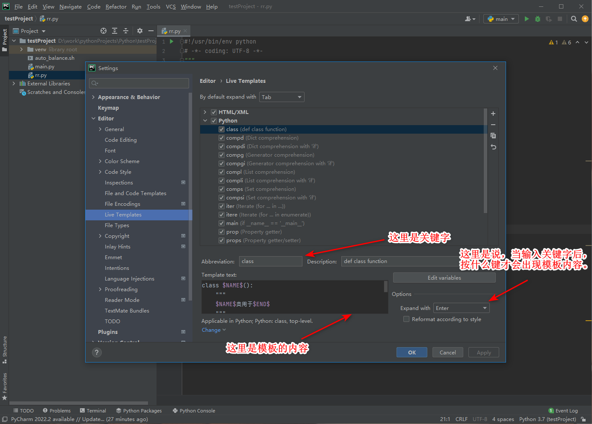

# pycharm自动生成函数注释及注意事项


# 1. .py 文件模板

https://blog.csdn.net/weixin_43698781/article/details/123767338

https://www.jb51.net/article/217820.htm

https://blog.51cto.com/u_11374358/3794336?abTest=51cto

https://blog.csdn.net/qq_45069279/article/details/107795634

打开PyCharm IDE，进入File->settings->Editor->File and Code Templates->Python Script
添加以下内容：

```python
#!/usr/bin/env python
# -*- coding: UTF-8 -*-
"""
@Project    ：${PROJECT_NAME} 
@File       ：${NAME}.py
@IDE        ：${PRODUCT_NAME} 
@Author     ：${user}
@Date       ：${DATE} ${TIME} 
@Version	: V x.y.z
@DESC       :     
"""
```

# 2. 代码片段快捷模板

## 2.1 自定义模板

https://www.cnblogs.com/iread9527/p/12833456.html

file->Setting->Editor->Live Templates->Python>进入代码片段编辑界面

解释下Live Templates的作用：



上面的calss为例：

```python
# 先输入class
# 然后按Enter
# 就能出现我们预设的模板了，还是很方便的。
```

## 2.2 系统自带模板

https://blog.csdn.net/weixin_43698781/article/details/123767338

首先，检查pycharm的设置：

如果这里是plain的话，需要先改成其他的选项

其次，假如有个函数如下：

```python
def func(a, b, c):
```


就可以直接在func的下面输入输入三个单引号 / 双引号：

```python
def func(a, b, c):
	'''
	# 或者是
	"""
	# pycharm里面，输入三个单引号 / 双引号之后会自动补充对应的三个，这不影响
```

一定要注意，在3个单引号或者3个双引号的前面，有一个tab键的空间，就是python语法里一个缩进。我之前就是没有加tab就一直没有出来自动生成的代码注释
然后再按回车键即可

> 不过根据python的PEP规范，文档字符串（docstrings）推荐使用双引号

pycharm里面自带的有四种代码注释的风格：

1.Epytext

```python
 def func(a, b, c):
    """
 	@param a:
    @param b:
    @param c:
    @return:
    """
```
2.restructedText

```python
 def func(a, b, c):
    """
    :param a: 
    :param b: 
    :param c: 
    :return: 
    """
```


3.Numpy

```python
def func(a, b, c):
        """
    Parameters
    ----------
    a
    b
    c

    Returns
    -------

    """
```
4.Google

```python
def func(a, b, c):
    """
    Args:
        a: 
        b: 
        c: 

    Returns:

    """
```


# pycharm快捷键

https://blog.csdn.net/m0_52839423/article/details/122233283

https://blog.csdn.net/chichu261/article/details/82813194

https://blog.csdn.net/chichu261/article/details/82810584

ctrl + alt + S快捷键：快速调出settings窗口。

alt + shift + enter：代码补全

ctrl + alt + l：格式化代码格式

ctl + enter：切到下一行

ctrl + / : 注释/取消注释


uft-8 并没有覆盖GBK2312，即使用x.decode("utf-8")报错的场景，使用x.decode("GBK2312")也许是ok的。


utf-8为什么会没有覆盖到GBK2312呢？？？