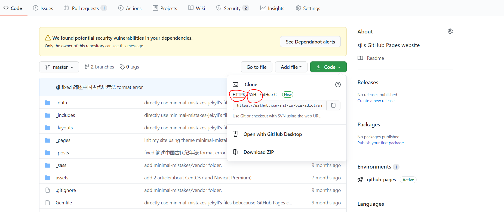
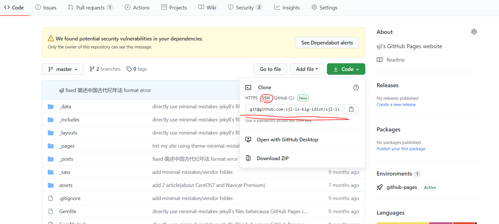
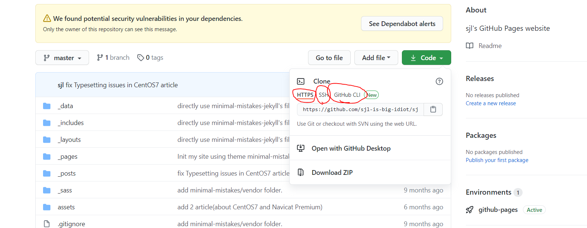
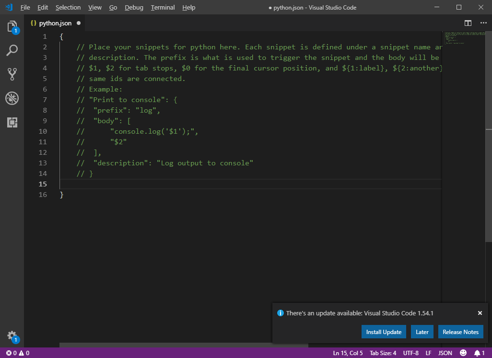
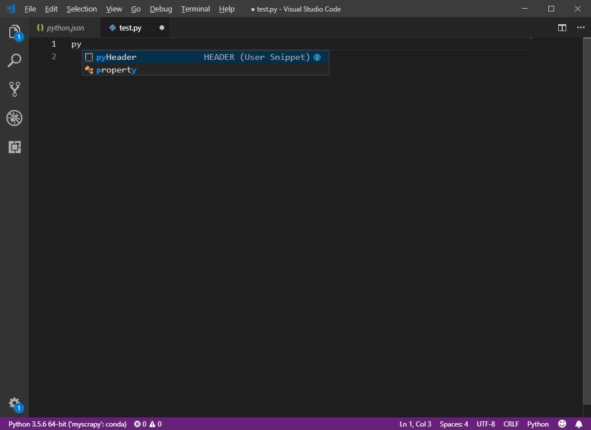
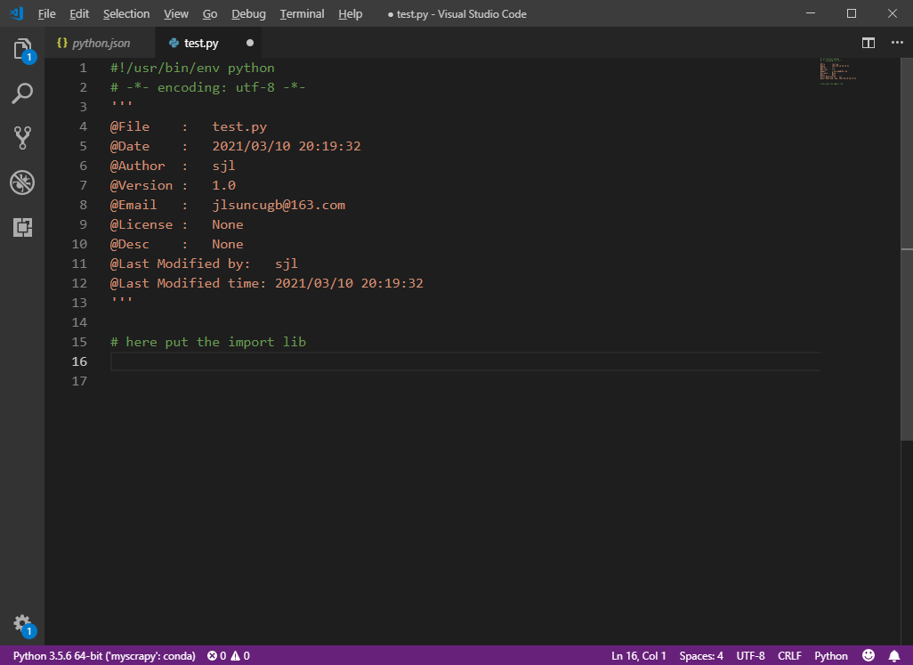
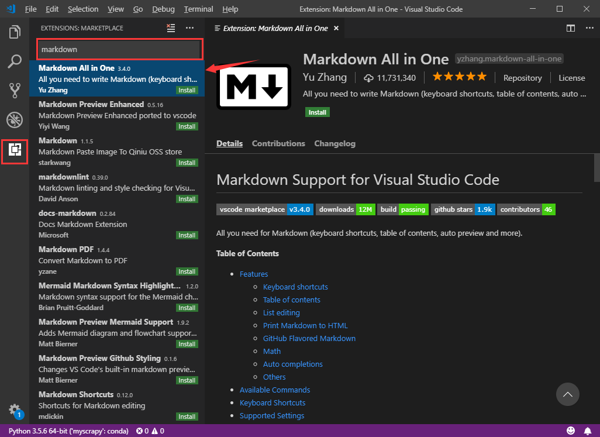
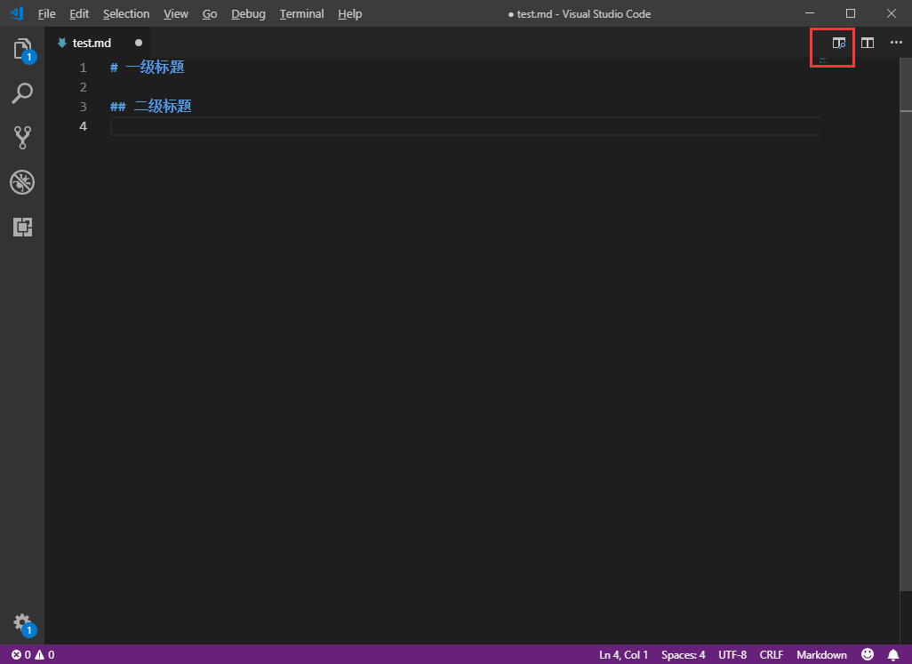
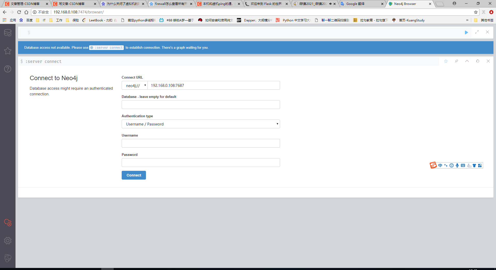

#  十一、开发工具

### 1. 什么是code review？

代码评审也称代码复查，是指通过阅读代码来检查源代码与编码标准的符合性以及代码质量的活动。流程和规则，通常采用Git Flow + Pull Request（PR）模式来做Code Review。

### 2. 如何发布和回滚，用jenkins又是怎么实现？

 

### 3. 如何测系统的QPS?

[ 面试官之问：知道你的接口“QPS”是多少吗](https://zhuanlan.zhihu.com/p/84012183)

**QPS（Query Per Second）：每秒请求数，就是说服务器在一秒的时间内处理了多少个请求。**

可以通过分析访问日志来了解系统的QPS。


## 1. Github Page

### 1.1 使用Jekyll 和 Github Page写个人博客

TODO

(Github Page文档)[https://docs.github.com/en/github/working-with-github-pages/setting-up-a-github-pages-site-with-jekyll]

1. 安装ruby


```shell
# 安装ruby
sudo yum install ruby
# 安装bundler
gem install bundler
# 由于墙的原因，这一步会非常慢，所以要先修改gem的源

# 查看现在的gem源
gem sources
# 移除gem源
gem sources --remove https://rubygems.org/
# 添加新的gem源
gem sources -a https://mirrors.aliyun.com/rubygems/
```


## 2. Git

### Github加速工具

https://gitee.com/docmirror/dev-sidecar


最近使用git，Github通过邮件提示不推荐用`accunt/password`方式了，推荐使用`SSH`方式。内容如下：

```email
[GitHub] Deprecation Notice
1封邮件
GitHub <noreply@github.com> 2021年3⽉8⽇周⼀ 23:21
收件⼈： CabbageDog13 <497245423@qq.com>

  Hi @sjl-is-big-idiot,

  You recently used a password to access the repository at sjl-is-big-idiot/sjl-is-big-idiot.github.io with git using
git/1.8.3.1.
  Basic authentication using a password to Git is deprecated and will soon no longer work. Visit
https://github.blog/2020-12-15-token-authentication-requirements-for-git-operations/ for more information around
suggested workarounds and removal dates.


Thanks,
The GitHub Team
```

这个的意思是我么在`push`或`pull`之类的时候，不要用`https://github.com/xxxx`了，因为这样就是走`account/password`了，



需要用`git@github.com:xxxx`，这样就是走`SSH`协议了，使用的是你之前在`Github`中配置的公钥。




### 2.1 使用github托管我的个人网站

情景

> 因为之前使用Github page做了一个个人网站，sjl-is-big-idiot.io 这个网站，现在需要发布新的博客，所以需要在一个新创建的虚拟机中pull这个仓库的代码，因此下面写出实现的步骤。

1. 设置git的用户名和邮箱。`--global`表示本机所有git仓库都用这个配置，也可不同仓库使用不同的用户名和邮箱，具体的看`git config`的使用方式。

   ```shell
   git config --global user.name "sjl"
   git config --global user.email "jlsuncugb@163.com"
   ```

2. 创建目录，存放仓库。

   ```shell
   mkdir myProjects
   cd myprojects
   ```

3. 配置本地仓库与Github远程仓库的SSH加密传输

   ```shell
   # 1. 生成SSH公钥和私钥，如果已经有了可以跳过此步骤
   # 查看是否已有SSH公钥和私钥
   ll ~/.ssh
   # 没有的话，执行如下命令创建SSH公钥和私钥。
   ssh-keygen -t rsa -C "jlsuncugb@163.com"
   
   # 2. 登陆GitHub，打开“Account settings”，“SSH Keys”页面：
   # 然后，点“Add SSH Key”，填上任意Title，在Key文本框里粘贴id_rsa.pub文件的内容：
   ```

   

4. 添加远程仓库。

   ```shell
   # 1.登录Github创建一个仓库，这种情境下，就用我们个人网站这个仓库即可
   # 2.关联到远程仓库
   git remote add origin  https://github.com/sjl-is-big-idiot/sjl-is-big-idiot.github.io.git
   # 或者
   git remote add origin git@github.com:sjl-is-big-idiot/sjl-is-big-idiot.github.io.git
   ```

   

   

5. 从Github中clone该个人网站的源代码。

   ```shell
   git clone https://github.com/sjl-is-big-idiot/sjl-is-big-idiot.github.io.git
   ```

6. 接下来开始更新博客。

   balabala

7. 将更新后的代码推送到Github中对应的仓库。

   ```shell
   # 将工作区内容，添加到暂存区
   git add .
   # 将暂存区内容提及到本地仓库
   git commit -m "add xx blog"
   # 将本地仓库内容，推送到Github上对应仓库的master分支
   [root@prometheus sjl-is-big-idiot.github.io]# git push origin master
   Username for 'https://github.com': 497245423@qq.com
   Password for 'https://497245423@qq.com@github.com': 
   Counting objects: 6, done.
   Delta compression using up to 4 threads.
   Compressing objects: 100% (4/4), done.
   Writing objects: 100% (4/4), 2.03 KiB | 0 bytes/s, done.
   Total 4 (delta 2), reused 0 (delta 0)
   remote: Resolving deltas: 100% (2/2), completed with 2 local objects.
   remote: 
   remote: GitHub found 2 vulnerabilities on sjl-is-big-idiot/sjl-is-big-idiot.github.io's default branch (1 high, 1 low). To find out more, visit:
   remote:      https://github.com/sjl-is-big-idiot/sjl-is-big-idiot.github.io/security/dependabot
   remote: 
   To https://github.com/sjl-is-big-idiot/sjl-is-big-idiot.github.io.git
      98968de..0f31d6d  master -> master
   
   ```


### 2.2 GitHub入门与实践


```shell
git help -a
git help -g
git help git
git help remote 


git branch -a
```


### 2.3 Git实践

[Pro Git book](https://git-scm.com/book/en/v2)

[git 官方文档](https://git-scm.com/docs)

#### 2.3.1 什么是VCS？

Version Control System，简称VCS。

VCS可分为3类：

1. 本地版本控制系统

   采用某种简单的数据库来记录文件的历次更新差异

   

2. 集中化的版本控制系统（Centralized Version Control Systems，简称 CVCS）

   优点：可与其他人共享，可管理每个开发的读写权限

   缺点：中央服务器的单点故障。

   

3. 分布式版本控制系统（Distributed Version Control System，简称 DVCS）

   户端并不只提取最新版本的文件快照， 而是把代码仓库完整地镜像下来，包括完整的历史记录。 这么一来，任何一处协同工作用的服务器发生故障，事后都可以用任何一个镜像出来的本地仓库恢复。 因为每一次的克隆操作，实际上都是一次对代码仓库的完整备份。

   


Git与其他 版本控制系统的不同之处是：**直接记录快照，而非差异比较**。Git 更像是把数据看作是对小型文件系统的一系列快照。 在 Git 中，每当你提交更新或保存项目状态时，它基本上就会对当时的全部文件创建一个快照并保存这个快照的索引。 为了效率，如果文件没有修改，Git 不再重新存储该文件，而是只保留一个链接指向之前存储的文件。 Git 对待数据更像是一个 **快照流**。

**三种状态**

Git 有三种状态，你的文件可能处于其中之一： **已提交（committed）**、**已修改（modified）** 和 **已暂存（staged）**。

- 已修改表示修改了文件，但还没保存到数据库中。
- 已暂存表示对一个已修改文件的当前版本做了标记，使之包含在下次提交的快照中。
- 已提交表示数据已经安全地保存在本地数据库中。

这会让我们的 Git 项目拥有三个阶段：`工作区`、`暂存区`以及 `Git 目录（版本库）`。


`工作区是对项目的某个版本独立提取出来的内容`。 这些从 Git 仓库的压缩数据库中提取出来的文件，放在磁盘上供你使用或修改。

`暂存区是一个文件`，保存了下次将要提交的文件列表信息，一般在 Git 仓库目录中。 按照 Git 的术语叫做“索引”，不过一般说法还是叫“暂存区”。在项目下的`.git`目录下的`index`文件即暂存区。

```shell
$ ll .git/
total 119
-rw-r--r-- 1 sjl 197121    26 Jul 18 15:35 COMMIT_EDITMSG
-rw-r--r-- 1 sjl 197121   105 Apr 18 15:17 FETCH_HEAD
-rw-r--r-- 1 sjl 197121    21 Apr 18 14:56 HEAD
-rw-r--r-- 1 sjl 197121    41 Apr 18 15:17 ORIG_HEAD
-rw-r--r-- 1 sjl 197121   321 Apr 18 15:50 config
-rw-r--r-- 1 sjl 197121    73 Apr 18 14:56 description
drwxr-xr-x 1 sjl 197121     0 Apr 18 14:56 hooks/
-rw-r--r-- 1 sjl 197121 67482 Jul 18 15:35 index
drwxr-xr-x 1 sjl 197121     0 Apr 18 14:56 info/
drwxr-xr-x 1 sjl 197121     0 Apr 18 14:56 logs/
drwxr-xr-x 1 sjl 197121     0 Jul 18 15:35 objects/
-rw-r--r-- 1 sjl 197121    46 Apr 18 15:17 packed-refs
drwxr-xr-x 1 sjl 197121     0 Apr 18 14:56 refs/
```


`Git 仓库目录是 Git 用来保存项目的元数据和对象数据库的地方`。 这是 Git 中最重要的部分，从其它计算机克隆仓库时，复制的就是这里的数据。

基本的 Git 工作流程如下：

1. 在工作区中修改文件。
2. 将你想要下次提交的更改选择性地暂存，这样只会将更改的部分添加到暂存区。
3. 提交更新，找到暂存区的文件，将快照永久性存储到 Git 目录。

如果 Git 目录中保存着特定版本的文件，就属于 **已提交** 状态。 如果文件已修改并放入暂存区，就属于 **已暂存** 状态。 如果自上次检出后，作了修改但还没有放到暂存区域，就是 **已修改** 状态。 在 [Git 基础](https://git-scm.com/book/zh/v2/ch00/ch02-git-basics-chapter) 一章，你会进一步了解这些状态的细节， 并学会如何根据文件状态实施后续操作，以及怎样跳过暂存直接提交。

#### 2.3.2 安装Git

#### 2.3.3 配置Git

既然已经在系统上安装了 Git，你会想要做几件事来定制你的 Git 环境。 每台计算机上只需要配置一次，程序升级时会保留配置信息。 你可以在任何时候再次通过运行命令来修改它们。

Git 自带一个 `git config` 的工具来帮助设置控制 Git 外观和行为的配置变量。 这些变量存储在三个不同的位置：

1. `/etc/gitconfig` 文件: 包含系统上每一个用户及他们仓库的通用配置。 如果在执行 `git config` 时带上 `--system` 选项，那么它就会读写该文件中的配置变量。 （由于它是系统配置文件，因此你需要管理员或超级用户权限来修改它。）
2. `~/.gitconfig` 或 `~/.config/git/config` 文件：只针对当前用户。 你可以传递 `--global` 选项让 Git 读写此文件，这会对你系统上 **所有** 的仓库生效。
3. 当前使用仓库的 Git 目录中的 `config` 文件（即 `.git/config`）：针对该仓库。 你可以传递 `--local` 选项让 Git 强制读写此文件，虽然默认情况下用的就是它。。 （当然，你需要进入某个 Git 仓库中才能让该选项生效。）

每一个级别会覆盖上一级别的配置，所以 `.git/config` 的配置变量会覆盖 `/etc/gitconfig` 中的配置变量。

```shell
# 你可以通过以下命令查看所有的配置以及它们所在的文件：
$ git config --list --show-origin

# 安装完 Git 之后，要做的第一件事就是设置你的用户名和邮件地址。 这一点很重要，因为每一个 Git 提交都会使用这些信息，它们会写入到你的每一次提交中，不可更改：
$ git config --global user.name "John Doe"
$ git config --global user.email johndoe@example.com

# 既然用户信息已经设置完毕，你可以配置默认文本编辑器了，当 Git 需要你输入信息时会调用它。 如果未配置，Git 会使用操作系统默认的文本编辑器。
$ git config --global core.editor emacs

# 如果想要检查你的配置
$ git config --list
user.name=John Doe
user.email=johndoe@example.com
color.status=auto
color.branch=auto0
color.interactive=auto
color.diff=auto
...

# 你可以通过输入 git config <key>： 来检查 Git 的某一项配置
$ git config user.name

# 获取命令的帮助
git help 命令
git 命令 --help
man git-命令
```

*再次强调，如果使用了 `--global` 选项，那么该命令只需要运行一次，因为之后无论你在该系统上做任何事情， Git 都会使用那些信息。 当你想针对特定项目使用不同的用户名称与邮件地址时，可以在那个项目目录下运行没有 `--global` 选项的命令来配置。*

#### 2.3.4 Git 基础

##### 2.3.4.1 获取Git仓库

通常有两种获取 Git 项目仓库的方式：

1. 将尚未进行版本控制的本地目录转换为 Git 仓库；参见 [Git 内部原理](https://git-scm.com/book/zh/v2/ch00/ch10-git-internals) 来了解更多关于到底 `.git` 文件夹中包含了哪些文件的信息。

   ```shell
   $ cd /home/user/my_project
   $ git init
   # 效果是在此目录下创建一个名为.git的子目录，这是此项目的版本库
   ```

   

2. 从其它服务器 **克隆** 一个已存在的 Git 仓库。

   ```shell
   $ git clone https://github.com/libgit2/libgit2
   # 克隆远程仓库并命名本地仓库的名字
   $ git clone https://github.com/libgit2/libgit2 mylibgit
   ```

两种方式都会在你的本地机器上得到一个工作就绪的 Git 仓库。

##### 2.3.4.2 记录每次更新到仓库

请记住，你工作目录下的每一个文件都不外乎这两种状态：**已跟踪** 或 **未跟踪**。 已跟踪的文件是指那些被纳入了版本控制的文件，在上一次快照中有它们的记录，在工作一段时间后， 它们的状态可能是未修改，已修改或已放入暂存区。简而言之，已跟踪的文件就是 Git 已经知道的文件。文件的状态变化如下图所示


```shell
# 1. 查看文件状态
$ git status [-s | --short]
On branch main
Your branch is ahead of 'study-notes/main' by 2 commits.
  (use "git push" to publish your local commits)

Changes to be committed: # 要提交的更改
省略......

Changes not staged for commit:  # 未暂存的更改
  (use "git add <file>..." to update what will be committed)
  (use "git restore <file>..." to discard changes in working directory)
        modified:   "03\346\225\260\346\215\256\345\272\223.md"
        modified:   "08\345\274\200\345\217\221\345\267\245\345\205\267.md"
        
Untracked files: # 未跟踪的文件
  (use "git add <file>..." to include in what will be committed)        "08\345\274\200\345\217\221\345\267\245\345\205\267.assets/areas.png"    "08\345\274\200\345\217\221\345\267\245\345\205\267.assets/centralized.png"       "08\345\274\200\345\217\221\345\267\245\345\205\267.assets/distributed.png"       "08\345\274\200\345\217\221\345\267\245\345\205\267.assets/lifecycle.png"     "08\345\274\200\345\217\221\345\267\245\345\205\267.assets/local.png"
  
no changes added to commit (use "git add" and/or "git commit -a")

# 2. 开始track某些文件，或者暂存已track的文件
$ git add README

# 3. 忽略某些文件，某些文件不需要纳入版本控制中。 通过.gitignore文件实现

# 4. git diff 
# 比较的是工作目录中当前文件和暂存区域快照之间的差异。 
$ git diff
# 比对已暂存文件与最后一次提交的文件差异
$ git diff [--staged | --cached]

# 5. 提交更新
$ git commit [-m 你的注释] [--author=作者名]
# Git自动把所有已经track过的文件暂存起来，再一起commit，可省略git add 步骤
$ git commit -a

# 6. 移除文件，直接rm会提示：文件未暂存。
$ git rm -f 文件名
# 只删除git仓库中的文件，保留工作区的文件
$ git rm --cached 文件名

# 7. 移动文件
# 重命名
$ git mv README.md README 
等价于如下三步
$ mv README.md README
$ git rm README.md
$ git add README
```

文件 `.gitignore` 的格式规范如下：

- 所有空行或者以 `#` 开头的行都会被 Git 忽略。
- 可以使用标准的 glob 模式匹配，它会递归地应用在整个工作区中。
- 匹配模式可以以（`/`）开头防止递归。
- 匹配模式可以以（`/`）结尾指定目录。
- 要忽略指定模式以外的文件或目录，可以在模式前加上叹号（`!`）取反。

所谓的 glob 模式是指 shell 所使用的简化了的正则表达式。

请注意，git diff 本身只显示尚未暂存的改动

##### 2.3.4.3 查看提交历史

主要命令为`git log`

```shell
$ git log
commit ca82a6dff817ec66f44342007202690a93763949
Author: Scott Chacon <schacon@gee-mail.com>
Date:   Mon Mar 17 21:52:11 2008 -0700

    changed the version number

commit 085bb3bcb608e1e8451d4b2432f8ecbe6306e7e7
Author: Scott Chacon <schacon@gee-mail.com>
Date:   Sat Mar 15 16:40:33 2008 -0700

    removed unnecessary test

commit a11bef06a3f659402fe7563abf99ad00de2209e6
Author: Scott Chacon <schacon@gee-mail.com>
Date:   Sat Mar 15 10:31:28 2008 -0700

    first commi
    
# 查看每次提交所引入的差异
$ git log -p | --patch [-2] # 最近两次提交
# 显示每次提交的统计信息
$ git log --stat
# 每次提交的信息放到一行
$ git log --pretty=oneline
# 自定义输出格式
$ git log --pretty=format:"%h - %an, %ar : %s"
# 图的形式显示提交历史
$ git log --graph
# 列出最近两周的所有提交，--since 和 --util
$ git log --since=2.weeks
```

##### 2.3.4.4 撤销操作

```shell
# 1. 重新提交，覆盖与之前的提交合并为一次提交而不是两次。
$ git commit --amend

# 2. 取消暂存的文件
$ git reset HEAD CONTRIBUTING.md

# 3. 撤销对文件的修改，回到上一次提交的样子，工作区中该文件的内容会发生改变哦。
$ git checkout -- CONTRIBUTING.md
```

##### 2.3.4.5 远程仓库的使用


## 3. Visual Studio Code

[Visual Studio Code 官方文档](https://code.visualstudio.com/docs/python)

[Vscode 小白使用介绍](https://www.cnblogs.com/tu-0718/p/10935910.html)

### 3.1 VSCode 代码片段配置

其实，也有好多插件可以实现，条条大路通罗马，撸起袖子干就完事了。

#### 3.1.1 配置Python文件头

例子，配置Python 文件头（即文件作者，时间，等描述信息）；

1. 打开VSCode
2. File > Preferences > User Snippets > 选择python



将以下内容添加到这个`json`文件中。

```json
    "HEADER":{
        "prefix": "pyHeader",
        "body": [
			"#!/usr/bin/env python",
			"# -*- encoding: utf-8 -*-",
			"'''",
			"@File    :   $TM_FILENAME",
			"@Date    :   $CURRENT_YEAR/$CURRENT_MONTH/$CURRENT_DATE $CURRENT_HOUR:$CURRENT_MINUTE:$CURRENT_SECOND",
			"@Author  :   sjl ",
			"@Version :   1.0",
			"@Email   :   jlsuncugb@163.com",
			"@License :   None",
			"@Desc    :   None",
			"@Last Modified by:   sjl",
			"@Last Modified time: $CURRENT_YEAR/$CURRENT_MONTH/$CURRENT_DATE $CURRENT_HOUR:$CURRENT_MINUTE:$CURRENT_SECOND",
			"'''",
			"",
			"# here put the import lib",
			"$0"
	    ],
	}
```

在写Python脚本时，输入pyHeader效果如下：



再回车，就直接出来了设置好的文件头了，十分方便。




#### 3.1.2 配置HTML代码

首先，比较简洁的标准的HTML代码，不用设置，VSCode自带快捷设置。

创建一个`.html`文件，输入`!`，然后按`TAB`键就出来了。

配置HTML 代码也是类似的，File > Preferences > User Sinnepts > html.json ，添加如下代码：

```html
"html5 demo": {
		"prefix": "!5",   // 这个是你输入的快捷代码
		"body": [// 这里是插入的内容
			"<!DOCTYPE html>",
			"<html lang='en'>",
			"<head>",
				"\t<meta charset='UTF-8'>",
				"\t<meta name='referrer' content='always'>",
				"\t<meta name='author' content='sjl'>",
				"\t<meta name='robots' content='none'>",
				"\t<meta name='keywords' content=''>",
				"\t<meta name='description' content=''>",
				"\t<meta name='renderer' content='webkit'>",
				"\t<meta name='revisit-after' content='7 days' >",
				"\t<meta http-equiv=widow-target Content=_top>",
			    "\t<meta name='viewport' content='width=device-width, initial-scale=1,maximum-scale=1,minimum-scale=1,user-scalable=no, shrink-to-fit=no' viewport-fit=cover />",
			    "\t<meta http-equiv='X-UA-Compatible' content='ie=edge,chrome=1'>",
				"\t<title>$1</title>",  // 光标首次会在$1 的地方，按tab 会跳到 $2
				"\t<style>",
					"\t\t *{",
						"\t\t\tmargin:0;",
						"\t\t\tpadding:0;",
						"\t\t\tbox-sizing:border-box;",
						"\t\t\t-webkit-tap-highlight-color:transparent;",
					"\t\t}",
				"\t</style>",
			"</head>",
			"<body>",
			    "\t$2",
			"</body></html>"
		],
		"description": "html5 专用 create by sjl"  // 这里是你的快捷输入的时候 VS code 提示的文字
	}
```

### 3.2 VSCode配置markdown插件

点击左侧的 extensions > 搜索"markdown"，在这里我用的是"Markdown All in One"这个插件，具体使用方法，也都写的有，咱直接安装就行了。 



创建一个`.md`文件，点击右方的图标可以，查看`markdown`的效果。



剩下的就自己探索吧。

### 3.3 VSCode 使用pylint

[Visual Studio Code官方文档-linting](https://code.visualstudio.com/docs/python/linting)

1. 安装pylint包。

   ```python
   pip3 install pylint
   ```

   比如，我是通过`anaconda`来作为包管理器/环境管理器，那么也可以通过`anaconda`来安装`pylint`。

   ```shell
   C:\Users\sjl>conda env list
   # conda environments:
   #
   base                  *  C:\Users\sjl\Anaconda3
   django                   C:\Users\sjl\Anaconda3\envs\django
   learnpython              C:\Users\sjl\Anaconda3\envs\learnpython
   myscrapy                 C:\Users\sjl\Anaconda3\envs\myscrapy
   
   C:\Users\sjl>conda activate learnpython
   
   (learnpython) C:\Users\sjl>pip3
   (learnpython) C:\Users\sjl>pip3 install pylint
   ```

   

## 4. Gitlib + Jenkins


## 5. xshell


### 5.1 `xshell` 按了`ctrl + s` 导致`xshell`假死怎么办？

`ctrl + q`


## 6. VMware

### 6.1 VMware文件过大，导致C盘过大

VMware的虚拟机文件默认存放在`C:\Users\sjl\Documents\Virtual Machines\`目录下，只需要将下面的文件放到`D:\Virtual Machines\`目录下，然后在 VMware`文件 > 打开 > xxx.vmx` 即可。

### 6.2 VMware虚拟机和宿主机可以相互ping通，但是宿主机无法访问虚拟机中开启的服务

宿主机 -> 虚拟机 能ping通

虚拟机 -> 宿主机 能ping通

这说明ip是没有问题的，可能是因为没有开放端口导致的服务无法访问。

1. 检查windows10的防火墙是否开启，需要关闭。检查发现已经关闭了。

2. 检查虚拟机的防火墙是否开启。发现虚拟机防火墙已经关闭了。

   ```shell
   # 查看firewalld状态， 结果显示inactive，未开启。
   systemctl status firewalld
   # 查看iptables状态
   systemctl status iptables
   Unit iptables.service could not be found.
   ```

3. 启动虚拟机的firewalld，并开放指定端口。

   ```shell
   systemctl start firewalld
   systemctl status firewalld
   
   # 添加防火墙规则
   firewall-cmd --zone=public --list-ports
   firewall-cmd --zone=public --add-port=7474/tcp --permanent
   # 每次更改firewall规则后，需要重新加载，获取重启firewalld才能生效
   firewall-cmd --zone=public --reload
   或
   sytemctl restart firewalld
   
   # 其他命令
   # 查看版本： 
   firewall-cmd --version
   
   # 查看帮助： 
   firewall-cmd --help
   
   # 显示状态： 
   firewall-cmd --state
   
   # 查看所有打开的端口： 
   firewall-cmd--zone=public --list-ports
   
   # 查看所有配置的规则
   firewall-cmd --list-all
   
   # 更新防火墙规则： 
   firewall-cmd --reload
   
   # 查看区域信息:  
   firewall-cmd--get-active-zones
   
   # 查看指定接口所属区域： 
   firewall-cmd--get-zone-of-interface=eth0
   
   # 拒绝所有包：
   firewall-cmd --panic-on
   
   # 取消拒绝状态： 
   firewall-cmd --panic-off
   
   # 查看是否拒绝： 
   firewall-cmd --query-panic
   
   
   # 添加,（--permanent永久生效，没有此参数重启后失效）
   firewall-cmd --zone=public --add-port=80/tcp --permanent
   # 对指定ip，开放指定端口
   firewall-cmd --permanent --add-rich-rule="rule family="ipv4" source address="x.x.x.x" port protocol="tcp" port="7474" accept"
   
   # 重新载入
   firewall-cmd --reload
   
   # 查看
   firewall-cmd --zone=public --query-port=80/tcp
   
   # 删除开发的端口
   firewall-cmd --zone=public --remove-port=80/tcp --permanent
   
   # 删除 rich-rule
   firewall-cmd --permanent --remove-rich-rule="rule family="ipv4" source address="x.x.x.x" port protocol="tcp" port="7474" accept"
   ```

   




> 至于为什么虚拟机的防火墙都没开，却不能访问其端口，这个还不清楚。


## 7. vim简单配置

```vimrc
set nocompatible
syntax on
set showmode
set showcmd
set mouse=a
set encoding=utf-8  
set t_Co=256
filetype indent on
set autoindent
set tabstop=2
set shiftwidth=4
set expandtab
set softtabstop=2
set number
set relativenumber
set cursorline
set textwidth=80
set wrap
set nowrap
set linebreak
set wrapmargin=2
set scrolloff=5
set sidescrolloff=15
set laststatus=2
set  ruler
set showmatch
set hlsearch
set incsearch
set ignorecase
set smartcase
set spell spelllang=en_us
set nobackup
set noswapfile
set undofile
set backupdir=~/.vim/.backup//  
set directory=~/.vim/.swp//
set undodir=~/.vim/.undo// 
set autochdir
set noerrorbells
set visualbell
set history=1000
set autoread
set listchars=tab:»■,trail:■
set list
set wildmenu
set wildmode=longest:list,full
```

