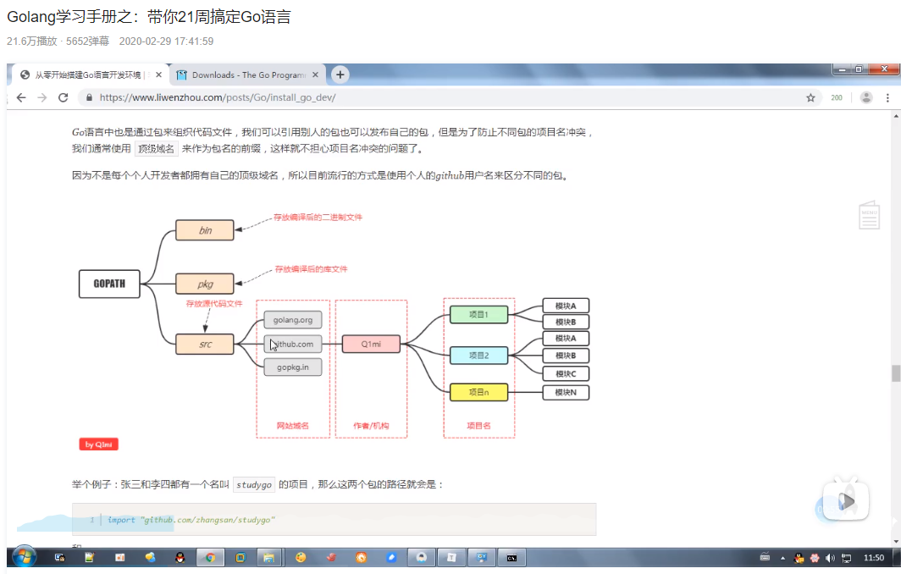
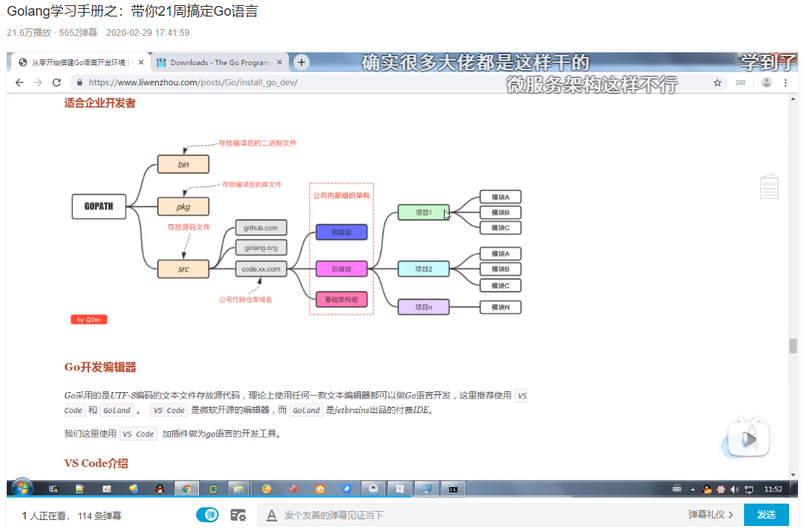

# 1. Go简介


## 1.1 安装Go

没啥好说的照着这个去装的就行了。

[官方文档-Go安装][https://golang.google.cn/doc/install]

[Microsoft 教你学Go](https://docs.microsoft.com/zh-cn/learn/browse/?terms=go)

`GOPATH`：项目目录。

`GOROOT`：安装的go.exe文件的位置

`GOARCH`：所处平台，如：amd64


我是将`D:\work\Go`设置为我的`GOPATH`，下面有三个目录：`bin`、`pkg`、`src`。

**Go项目结构**






**VS Code中Go插件安装**

由于国内众所周知的原因，无法安装很多go插件。下面是我的go环境变量

```powershell
(base) PS C:\Users\sjl> go env
set GO111MODULE=
set GOARCH=amd64
set GOBIN=
set GOCACHE=C:\Users\sjl\AppData\Local\go-build
set GOENV=C:\Users\sjl\AppData\Roaming\go\env
set GOEXE=.exe
set GOFLAGS=
set GOHOSTARCH=amd64
set GOHOSTOS=windows
set GOINSECURE=
set GOMODCACHE=D:\work\Go\pkg\mod
set GONOPROXY=
set GONOSUMDB=
set GOOS=windows
set GOPATH=D:\work\Go
set GOPRIVATE=
set GOPROXY=https://proxy.golang.org,direct
set GOROOT=C:\Program Files\Go
set GOSUMDB=sum.golang.org
set GOTMPDIR=
set GOTOOLDIR=C:\Program Files\Go\pkg\tool\windows_amd64
set GOVCS=
set GOVERSION=go1.16.3
set GCCGO=gccgo
set AR=ar
set CC=gcc
set CXX=g++
set CGO_ENABLED=1
set GOMOD=NUL
set CGO_CFLAGS=-g -O2
set CGO_CPPFLAGS=
set CGO_CXXFLAGS=-g -O2
set CGO_FFLAGS=-g -O2
set CGO_LDFLAGS=-g -O2
set PKG_CONFIG=pkg-config
set GOGCCFLAGS=-m64 -mthreads -fno-caret-diagnostics -Qunused-arguments -fmessage-length=0 -fdebug-prefix-map=C:\Users\sjl\AppData\Local\Temp\go-build4068821133=/tmp/go-build -gno-record-gcc-switches
```

唯一要做的是，修改其中的`GOPROXY`。

可以看到其原始值为`GOPROXY=https://proxy.golang.org,direct`，即默认回去这个URL下载go的插件。我们需要修改其为`GOPROXY=https://goproxy.io,direct`

`GOPROXY=https://goproxy.cn`

## 1.2 基础

[Go语言旅程](https://tour.go-zh.org/welcome/1)

go version 为 go 1.16.3

```go
// 为你的项目初始化一个go.mod
go mod init learn.go
// 将项目中的go依赖添加到go.mod文件中
go mod tidy
```


### 1.2.1 包、变量和函数

#### 1.2.1.1 包

每个 Go 程序都是由包构成的。

程序从 `main` 包开始运行。

```go
package main
```

**导入**

```go
import "fmt"

import (
	"fmt"
    "math"
)
```

 **导出名**

在 Go 中，如果一个名字以大写字母开头，那么它就是已导出的。例如，`Pizza` 就是个已导出名，`Pi` 也同样，它导出自 `math` 包。

`pizza` 和 `pi` 并未以大写字母开头，所以它们是未导出的。

在导入一个包时，你只能引用其中已导出的名字。任何“未导出”的名字在该包外均无法访问。


#### 2.1.2 变量

`var` 语句用于声明一个变量列表，跟函数的参数列表一样，类型在最后。

`var` 语句可以出现在包或函数级别。

```go
var c, python, java bool

func main() {
	var i int
	fmt.Println(i, c, python, java)
}

```

**变量的初始化**

变量声明可以包含初始值，每个变量对应一个。如果初始化值已存在，则可以省略类型；变量会从初始值中获得类型。

```go
var i, j int = 1, 2

func main() {
	var c, python, java = true, false, "no!"
	fmt.Println(i, j, c, python, java)
}

```

**短变量声明**

在函数中，简洁赋值语句 `:=` 可在类型明确的地方代替 `var` 声明。

**函数外的每个语句都必须以关键字开始（`var`, `func` 等等），因此 `:=` 结构不能在函数外使用**。

```go
func main() {
	var i, j int = 1, 2
	k := 3
	c, python, java := true, false, "no!"

	fmt.Println(i, j, k, c, python, java)
}
```

**基本类型**

```go
bool
string
int int8 int16 int32 int64
// 无符号整数
uint uint8 uint16 uint32 uint64 uintptr
byte // int8的别名
rune // int32的别名，表示一个码点
float32 float64
comlex64 complex128
// int, uint, uintptr在32位系统上为32位，在64位系统上为64位
```

**零值**

没有明确初始值的变量声明会被赋予零值。

零值是：

1. 数值类型为`0`
2. 布尔类型为`false`
3. 字符串为`""`

**类型转换**

表达式 `T(v)` 将值 `v` 转换为类型 `T`。在Go中必须显式转换类型，不支持隐式转换类型。

```go
var (
	i int = 42
    f float64 = float64(i)
    u uint = uint(f)
)
// 或者
i := 42
f := float64(i)
u ;= uint(f)
```

**类型推导**

在声明一个变量而不指定其类型时（即使用不带类型的 `:=` 语法或 `var =` 表达式语法），变量的类型由右值推导得出。

当右值声明了类型时，新变量的类型与其相同：

```
var i int
j := i // j 也是一个 int
```

不过当右边包含未指明类型的数值常量时，新变量的类型就可能是 `int`, `float64` 或 `complex128` 了，这取决于常量的精度：

```
i := 42           // int
f := 3.142        // float64
g := 0.867 + 0.5i // complex128
```

**常量**

常量的声明与变量类似，只不过是使用 `const` 关键字。函数内外部都可以声明常量

常量可以是字符、字符串、布尔值或数值。

常量不能用 `:=` 语法声明。

**数值常量**

数值常量是高精度的 **值**。

一个未指定类型的常量由上下文来决定其类型。

#### 2.1.3 函数

函数可以没有参数或接受多个参数。

注意类型在变量名 **之后**。

```go
func add(x int, y int) int {
	return x + y
}
```

当连续两个或多个函数的已命名形参类型相同时，除最后一个类型以外，其它都可以省略。

```go
func add(x, y int) int {
    return x + y
}
```

函数可以返回任意数量的返回值。

```go
func swap(x, y string) (string, string) {
    return y, x
}
```

**命名返回值**

Go 的返回值可被命名，它们会被视作定义在函数顶部的变量。

返回值的名称应当具有一定的意义，它可以作为文档使用。

没有参数的 `return` 语句返回已命名的返回值。也就是 `直接` 返回。

直接返回语句应当仅用在下面这样的短函数中。在长的函数中它们会影响代码的可读性。

```go
func split(sum int) (x, y int) {
	x = sum * 4 / 9
	y = sum - x
	return
}
```

**函数值**

函数也是值。它们可以像其它值一样传递。

函数值可以用作函数的参数或返回值。

```go
func compute(fn func(float64, float64) float64) float64 {
	return fn(3, 4)
}

func main() {
	hypot := func(x, y float64) float64 {
		return math.Sqrt(x*x + y*y)
	}
	fmt.Println(hypot(5, 12))

	fmt.Println(compute(hypot))
	fmt.Println(compute(math.Pow))
}
```

**闭包**

Go 函数可以是一个闭包。**闭包是一个函数值**，它引用了其函数体之外的变量。该函数可以访问并赋予其引用的变量的值，换句话说，该函数被这些变量“绑定”在一起。

例如，函数 `adder` 返回一个闭包。每个闭包都被绑定在其各自的 `sum` 变量上。

```go
func adder() func(int) int {
	sum := 0
	return func(x int) int {
		sum += x
		return sum
	}
}

func main() {
	pos, neg := adder(), adder()
	for i := 0; i < 10; i++ {
		fmt.Println(
			pos(i),
			neg(-2*i),
		)
	}
}
```


### 1.2.2 流程控制语句

#### 1.2.2.1 for循环

Go 只有一种循环结构：`for` 循环。

基本的 `for` 循环由三部分组成，它们用分号隔开：

- 初始化语句：在第一次迭代前执行
- 条件表达式：在每次迭代前求值
- 后置语句：在每次迭代的结尾执行

初始化语句通常为一句短变量声明，该变量声明仅在 `for` 语句的作用域中可见。

一旦条件表达式的布尔值为 `false`，循环迭代就会终止。

**注意**：和 C、Java、JavaScript 之类的语言不同，Go 的 for 语句后面的三个构成部分外没有小括号， 大括号 `{ }` 则是必须的。

```go
func main() {
    // 形式1
	sum := 0
	for i := 0; i < 10; i++ {
		sum += i
	}
	fmt.Println(sum)
    // 形式2，省略初始化语句和后置语句
    sum := 1
	for ; sum < 1000; {
		sum += sum
	}
	fmt.Println(sum)
    
    // 形式2的另一种写法
    sum := 1
    for sum < 1000 {
		sum += sum
	}
	fmt.Println(sum)
    // 形式3，无限循环
    for {
	}
}
```


#### 1.2.2.2 if/else条件判断

Go 的 `if` 语句与 `for` 循环类似，表达式外无需小括号 `( )` ，而大括号 `{ }` 则是必须的。

```go
func sqrt(x float64) string {
    // 形式1
	if x < 0 {
		return sqrt(-x) + "i"
	}
	return fmt.Sprint(math.Sqrt(x))
    
    // 形式2，在条件表达式之前，声明变量
    if v := math.Pow(x, n); v < lim {
		return v
	}
	return lim
    // 形式3
    
    // 形式4
    
}

```

**if和else一起使用**

在 `if` 的简短语句中声明的变量同样可以在任何对应的 `else` 块中使用。

```go
func pow(x, n, lim float64) float64 {
	if v := math.Pow(x, n); v < lim {
		return v
	} else {
		fmt.Printf("%g >= %g\n", v, lim)
	}
	// 这里开始就不能使用 v 了
	return lim
}
```


#### 1.2.2.3 switch条件判断

`switch` 是编写一连串 `if - else` 语句的简便方法。它运行第一个值等于条件表达式的 `case `语句。

**Go 的 switch 语句类似于 C、C++、Java、JavaScript 和 PHP 中的，不过 Go 只运行选定的 case，而非之后所有的 case。 实际上，Go 自动提供了在这些语言中每个 case 后面所需的 `break` 语句。 除非以 `fallthrough` 语句结束，否则分支会自动终止。 Go 的另一点重要的不同在于 switch 的 case 无需为常量，且取值不必为整数。**

```go
func main() {
	fmt.Print("Go runs on ")
	switch os := runtime.GOOS; os {
	case "darwin":
		fmt.Println("OS X.")
	case "linux":
		fmt.Println("Linux.")
	default:
		// freebsd, openbsd,
		// plan9, windows...
		fmt.Printf("%s.\n", os)
	}
}
```

**switch的求值顺序**

switch 的 case 语句从上到下顺次执行，直到匹配成功时停止。

```go
func main() {
	fmt.Println("When's Saturday?")
	today := time.Now().Weekday()
	switch time.Saturday {
	case today + 0:
		fmt.Println("Today.")
	case today + 1:
		fmt.Println("Tomorrow.")
	case today + 2:
		fmt.Println("In two days.")
	default:
		fmt.Println("Too far away.")
	}
}
```

**没有条件的switch**

没有条件的 switch 同 `switch true` 一样。

这种形式能将一长串 if-then-else 写得更加清晰。

```go
func main() {
	t := time.Now()
	switch {
	case t.Hour() < 12:
		fmt.Println("Good morning!")
	case t.Hour() < 17:
		fmt.Println("Good afternoon.")
	default:
		fmt.Println("Good evening.")
	}
}
```


#### 1.2.2.4 defer语句

defer 语句会将函数推迟到外层函数返回之后执行。

推迟调用的函数其参数会立即求值，但直到外层函数返回前该函数都不会被调用。

**defer栈**

推迟的函数调用会被压入一个栈中。当外层函数返回时，被推迟的函数会按照后进先出的顺序调用。

更多关于 defer 语句的信息，请阅读[此博文](http://blog.go-zh.org/defer-panic-and-recover)。


	func main() {
		fmt.Println("counting")
	    for i := 0; i < 10; i++ {
	        defer fmt.Println(i)
	    }
	
	    fmt.Println("done")
	}


### 1.2.3 更多类型：struct、slice和映射

#### 1.2.3.1 指针

Go 拥有指针。指针保存了值的内存地址。

类型 `*T` 是指向 `T` 类型值的指针。其零值为 `nil`。

```
var p *int
```

`&` 操作符会生成一个指向其操作数的指针。

```
i := 42
p = &i
```

`*` 操作符表示指针指向的底层值。

```
fmt.Println(*p) // 通过指针 p 读取 i
*p = 21         // 通过指针 p 设置 i
```

这也就是通常所说的“间接引用”或“重定向”。

与 C 不同，Go 没有指针运算。

```go
func main() {
	i, j := 42, 2701

	p := &i         // 指向 i
	fmt.Println(*p) // 通过指针读取 i 的值
	*p = 21         // 通过指针设置 i 的值
	fmt.Println(i)  // 查看 i 的值

	p = &j         // 指向 j
	*p = *p / 37   // 通过指针对 j 进行除法运算
	fmt.Println(j) // 查看 j 的值
}
```


#### 1.2.3.2 结构体

一个结构体（`struct`）就是一组字段（field）。

```go
type Vertex struct {
	X int
	Y int
}
```

结构体字段使用点号来访问。

```go
type Vertex struct {
	X int
	Y int
}

func main() {
	v := Vertex{1, 2}
	v.X = 4
	fmt.Println(v.X)
}

```

**结构体指针**

结构体字段可以通过结构体指针来访问。

如果我们有一个指向结构体的指针 `p`，那么可以通过 `(*p).X` 来访问其字段 `X`。不过这么写太啰嗦了，所以语言也允许我们使用隐式间接引用，直接写 `p.X` 就可以。

```go
type Vertex struct {
	X int
	Y int
}

func main() {
	v := Vertex{1, 2}
	p := &v
	p.X = 1e9 // 通过 结构体指针. 来访问，也可以通过 结构体. 来访问
	fmt.Println(v)
}
```

**结构体文法**

结构体文法通过直接列出字段的值来新分配一个结构体。

使用 `Name:` 语法可以仅列出部分字段。（字段名的顺序无关。）

特殊的前缀 `&` 返回一个指向结构体的指针。

```go
type Vertex struct {
	X, Y int
}

var (
	v1 = Vertex{1, 2}  // 创建一个 Vertex 类型的结构体
    v2 = Vertex{X: 1}  // Y:0 被隐式地赋予，Name:语法
	v3 = Vertex{}      // X:0 Y:0
	p  = &Vertex{1, 2} // 创建一个 *Vertex 类型的结构体（指针）
)

```


#### 1.2.3.3 数组

类型 `[n]T` 表示拥有 `n` 个 `T` 类型的值的数组。

表达式

```
var a [10]int
```

会将变量 `a` 声明为拥有 10 个整数的数组。

数组的长度是其类型的一部分，因此**数组不能改变大小**。这看起来是个限制，不过没关系，Go 提供了更加便利的方式来使用数组。

```go
func main() {
	var a [2]string
	a[0] = "Hello"
	a[1] = "World"
	fmt.Println(a[0], a[1])
	fmt.Println(a)

	primes := [6]int{2, 3, 5, 7, 11, 13}
	fmt.Println(primes)
}

```


#### 1.2.3.4 切片

**每个数组的大小都是固定的。而切片则为数组元素提供动态大小的、灵活的视角。**在实践中，切片比数组更常用。

类型 `[]T` 表示一个元素类型为 `T` 的切片。

切片通过两个下标来界定，即一个上界和一个下界，二者以冒号分隔：

```
a[low : high]
```

它会选择一个半开区间，包括第一个元素，但排除最后一个元素。

以下表达式创建了一个切片，它包含 `a` 中下标从 1 到 3 的元素：

```
a[1:4]
a[:3] // 等价于a[0:3]
a[1:] // 等价于a[1:4]
a[:] // 等价于a[0:4]
```

 **切片就像数组的引用**

**切片并不存储任何数据，它只是描述了底层数组中的一段。**

更改切片的元素会修改其底层数组中对应的元素。

与它共享底层数组的切片都会观测到这些修改。

**切片文法**

切片文法类似于没有长度的数组文法。

这是一个数组文法：

```
[3]bool{true, true, false}
```

下面这样则会创建一个和上面相同的数组，然后构建一个引用了它的切片：

```
[]bool{true, true, false}
```

**切片的长度与容量**

切片拥有 **长度** 和 **容量**。

**切片的长度**就是它所包含的元素个数。当前时间，切片中有几个元素。

**切片的容量**是从它的第一个元素开始数，到其底层数组元素末尾的个数。切片最大能有多少个元素。

切片 `s` 的长度和容量可通过表达式 `len(s)` 和 `cap(s)` 来获取。

你可以通过重新切片来扩展一个切片，给它提供足够的容量。

 **nil 切片**

切片的零值是 `nil`。

**nil 切片的长度和容量为 0 且没有底层数组**。

**用`make`创建切片**

切片可以用内建函数 `make` 来创建，这也是你创建动态数组的方式。

`make` 函数会分配一个元素为零值的数组并返回一个引用了它的切片：

```
a := make([]int, 5)  // len(a)=5
```

要指定它的容量，需向 `make` 传入第三个参数：

```
b := make([]int, 0, 5) // len(b)=0, cap(b)=5

b = b[:cap(b)] // len(b)=5, cap(b)=5
b = b[1:]      // len(b)=4, cap(b)=4
```

**切片可包含任何类型，甚至包括其它的切片**

**向切片追加元素**

为切片追加新的元素是种常用的操作，为此 Go 提供了内建的 `append` 函数。内建函数的[文档](https://go-zh.org/pkg/builtin/#append)对此函数有详细的介绍。

```
func append(s []T, vs ...T) []T
```

`append` 的第一个参数 `s` 是一个元素类型为 `T` 的切片，其余类型为 `T` 的值将会追加到该切片的末尾。

`append` 的结果是一个包含原切片所有元素加上新添加元素的切片。

当 `s` 的底层数组太小，不足以容纳所有给定的值时，它就会分配一个更大的数组。返回的切片会指向这个新分配的数组。

（要了解关于切片的更多内容，请阅读文章 [Go 切片：用法和本质](https://blog.go-zh.org/go-slices-usage-and-internals)。）

#### 1.2.3.5 Range

`for` 循环的 `range` 形式可遍历切片或映射。

当使用 `for` 循环遍历切片时，每次迭代都会返回两个值。第一个值为当前元素的下标，第二个值为该下标所对应元素的一份副本。

```go
var pow = []int{1, 2, 4, 8, 16, 32, 64, 128}

func main() {
	for i, v := range pow {
		fmt.Printf("2**%d = %d\n", i, v)
	}
}
```

可以将下标或值赋予 `_` 来忽略它。

```
for i, _ := range pow
for _, value := range pow
```

若你只需要索引，忽略第二个变量即可。

```
for i := range pow
```

#### 1.2.3.6 映射

映射将键映射到值。

映射的零值为 `nil` 。`nil` 映射既没有键，也不能添加键。

`make` 函数会返回给定类型的映射，并将其初始化备用。

```go
m = make(map[string]Vertex)
```

映射的文法与结构体相似，不过必须有键名。

```go
type Vertex struct {
	Lat, Long float64
}

var m = map[string]Vertex{
	"Bell Labs": Vertex{
		40.68433, -74.39967,
	},
	"Google": Vertex{
		37.42202, -122.08408,
	},
}

// 或者
var m = map[string]Vertex{
	"Bell Labs": {40.68433, -74.39967},
	"Google":    {37.42202, -122.08408},
}

```

**修改映射**

在映射 `m` 中插入或修改元素：

```
m[key] = elem
```

获取元素：

```
elem = m[key]
```

删除元素：

```
delete(m, key)
```

通过双赋值检测某个键是否存在：

```
elem, ok = m[key]
```

若 `key` 在 `m` 中，`ok` 为 `true` ；否则，`ok` 为 `false`。

若 `key` 不在映射中，那么 `elem` 是该映射元素类型的零值。

同样的，当从映射中读取某个不存在的键时，结果是映射的元素类型的零值。

**注** ：若 `elem` 或 `ok` 还未声明，你可以使用短变量声明：

```
elem, ok := m[key]
```

#### 

## 1.3 方法和接口

### 1.3.1 方法

Go 没有类。不过你**可以为结构体类型定义方法**。

方法就是一类带特殊的 **接收者** 参数的函数。

方法接收者在它自己的参数列表内，位于 `func` 关键字和方法名之间。

在此例中，`Abs` 方法拥有一个名为 `v`，类型为 `Vertex` 的接收者。

```go
type Vertex struct {
	X, Y float64
}

func (v Vertex) Abs() float64 {
	return math.Sqrt(v.X*v.X + v.Y*v.Y)
}

func main() {
	v := Vertex{3, 4}
	fmt.Println(v.Abs())
}
```

**方法即函数**

记住：方法只是个带接收者参数的函数。

现在这个 `Abs` 的写法就是个正常的函数，功能并没有什么变化。

```go
type Vertex struct {
	X, Y float64
}

func Abs(v Vertex) float64 {
	return math.Sqrt(v.X*v.X + v.Y*v.Y)
}

func main() {
	v := Vertex{3, 4}
	fmt.Println(Abs(v))
}
```

你**也可以为非结构体类型声明方法。**

在此例中，我们看到了一个带 `Abs` 方法的数值类型 `MyFloat`。

你只能为在同一包内定义的类型的接收者声明方法，而不能为其它包内定义的类型（包括 `int` 之类的内建类型）的接收者声明方法。

（译注：**就是接收者的类型定义和方法声明必须在同一包内；不能为内建类型声明方法**。）

```go
// 声明一个新类型MyFloat，实际类型是float64
type MyFloat float64

func (f MyFloat) Abs() float64 {
	if f < 0 {
		return float64(-f)
	}
	return float64(f)
}

func main() {
	f := MyFloat(-math.Sqrt2)
	fmt.Println(f.Abs())
}

```


### 1.3.2 指针接收者

你可以为指针接收者声明方法。

这意味着对于某类型 `T`，接收者的类型可以用 `*T` 的文法。（此外，`T` 不能是像 `*int` 这样的指针。）

例如，这里为 `*Vertex` 定义了 `Scale` 方法。

*指针接收者的方法可以修改接收者指向的值（就像 `Scale` 在这做的）。由于方法经常需要修改它的接收者，指针接收者比值接收者更常用。*

> 若使用值接收者，那么 `Scale` 方法会对原始 `Vertex` 值的副本进行操作。（对于函数的其它参数也是如此。）`Scale` 方法必须用指针接受者来更改 `main` 函数中声明的 `Vertex` 的值。

```go
type Vertex struct {
	X, Y float64
}

func (v Vertex) Abs() float64 {
	return math.Sqrt(v.X*v.X + v.Y*v.Y)
}

// 为指针接收者声明的方法
func (v *Vertex) Scale(f float64) {
	v.X = v.X * f
	v.Y = v.Y * f
}

func main() {
	v := Vertex{3, 4}
    v.Scale(10) // 实际是(&v).Scale(10)
	fmt.Println(v.Abs())
}

```


### 1.3.3 指针与函数

现在我们要把 `Abs` 和 `Scale` 方法重写为函数。

同样，我们先试着移除掉第 16 的 `*`。你能看出为什么程序的行为改变了吗？要怎样做才能让该示例顺利通过编译？

```go
type Vertex struct {
	X, Y float64
}

func Abs(v Vertex) float64 {
	return math.Sqrt(v.X*v.X + v.Y*v.Y)
}

func Scale(v *Vertex, f float64) {
	v.X = v.X * f
	v.Y = v.Y * f
}

func main() {
	v := Vertex{3, 4}
	Scale(&v, 10)
	fmt.Println(Abs(v))
}
```


### 1.3.4 方法与指针重定向

比较前两个程序，你大概会注意到带指针参数的函数必须接受一个指针：

```
var v Vertex
ScaleFunc(v, 5)  // 编译错误！V不是一个指针
ScaleFunc(&v, 5) // OK
```

而**以指针为接收者的方法被调用时，接收者既能为值又能为指针**：

```
var v Vertex
v.Scale(5)  // OK，实际是(&v).Scale(5)
p := &v
p.Scale(10) // OK
```

对于语句 `v.Scale(5)`，即便 `v` 是个值而非指针，带指针接收者的方法也能被直接调用。 也就是说，由于 `Scale` 方法有一个指针接收者，为方便起见，Go 会将语句 `v.Scale(5)` 解释为 `(&v).Scale(5)`。

```go
type Vertex struct {
	X, Y float64
}

func (v Vertex) Abs() float64 {
	return math.Sqrt(v.X*v.X + v.Y*v.Y)
}

func AbsFunc(v Vertex) float64 {
	return math.Sqrt(v.X*v.X + v.Y*v.Y)
}

func main() {
	v := Vertex{3, 4}
	fmt.Println(v.Abs())
	fmt.Println(AbsFunc(v))

	p := &Vertex{4, 3}
	fmt.Println(p.Abs())
	fmt.Println(AbsFunc(*p))
}

```


同样的事情也发生在相反的方向。

接受一个值作为参数的函数必须接受一个指定类型的值：

```
var v Vertex
fmt.Println(AbsFunc(v))  // OK
fmt.Println(AbsFunc(&v)) // 编译错误！
```

而以值为接收者的方法被调用时，接收者既能为值又能为指针：

```
var v Vertex
fmt.Println(v.Abs()) // OK
p := &v
fmt.Println(p.Abs()) // OK，实际是(*p).Abs()
```

这种情况下，方法调用 `p.Abs()` 会被解释为 `(*p).Abs()`。

**选择值或指针作为接收者**

使用指针接收者的原因有二：

1. 方法能够修改其接收者指向的值。

2. 这样可以避免在每次调用方法时复制该值。若值的类型为大型结构体时，这样做会更加高效。


### 1.3.5 接口

**接口类型** 是由一组方法签名定义的集合。

接口类型的变量可以保存任何实现了这些方法的值。

**注意:** 示例代码的 22 行存在一个错误。由于 `Abs` 方法只为 `*Vertex` （指针类型）定义，因此 `Vertex`（值类型）并未实现 `Abser`。

```go
type Abser interface {
	Abs() float64
}

func main() {
	var a Abser // a是一个接口类型
	f := MyFloat(-math.Sqrt2)
	v := Vertex{3, 4}

	a = f  // a MyFloat 实现了 Abser
	a = &v // a *Vertex 实现了 Abser

	// 下面一行，v 是一个 Vertex（而不是 *Vertex）
	// 所以没有实现 Abser。
	a = v

	fmt.Println(a.Abs())
}

type MyFloat float64

func (f MyFloat) Abs() float64 {
	if f < 0 {
		return float64(-f)
	}
	return float64(f)
}

type Vertex struct {
	X, Y float64
}

func (v *Vertex) Abs() float64 {
	return math.Sqrt(v.X*v.X + v.Y*v.Y)
}

```

**接口与隐式实现**

*类型通过实现一个接口的所有方法来实现该接口。*既然无需专门显式声明，也就没有“implements”关键字。

隐式接口从接口的实现中解耦了定义，这样接口的实现可以出现在任何包中，无需提前准备。

因此，也就无需在每一个实现上增加新的接口名称，这样同时也鼓励了明确的接口定义。

**接口值**

接口也是值。它们可以像其它值一样传递。

接口值可以用作函数的参数或返回值。

在内部，接口值可以看做包含值和具体类型的元组：

```
(value, type)
```

接口值保存了一个具体底层类型的具体值。

接口值调用方法时会执行其底层类型的同名方法。

 **底层值为 nil 的接口值**

即便接口内的具体值为 `nil`，方法仍然会被` nil `接收者调用。

在一些语言中，这会触发一个空指针异常，但在 Go 中通常会写一些方法来优雅地处理它。

**注意:** 保存了 `nil `具体值的接口其自身并不为 nil。

nil 接口值既不保存值也不保存具体类型。

为 nil 接口调用方法会产生运行时错误，因为接口的元组内并未包含能够指明该调用哪个 **具体** 方法的类型。

#### 1.3.5.1空接口

指定了零个方法的接口值被称为 *空接口：*

```
interface{}
```

空接口可保存任何类型的值。（因为每个类型都至少实现了零个方法。）

空接口被用来处理未知类型的值。例如，`fmt.Print` 可接受类型为 `interface{}` 的任意数量的参数。

### 1.3.6 类型断言

**类型断言** 提供了访问接口值底层具体值的方式。

```
t := i.(T)
```

该语句断言接口值 `i` 保存了具体类型 `T`，并将其底层类型为 `T` 的值赋予变量 `t`。

若 `i` 并未保存 `T` 类型的值，该语句就会触发一个恐慌(panic)。

为了 **判断** 一个接口值是否保存了一个特定的类型，类型断言可返回两个值：其底层值以及一个报告断言是否成功的布尔值。

```
t, ok := i.(T)
```

若 `i` 保存了一个 `T`，那么 `t` 将会是其底层值，而 `ok` 为 `true`。

否则，`ok` 将为 `false` 而 `t` 将为 `T` 类型的零值，程序并不会产生恐慌。

请注意这种语法和读取一个映射时的相同之处。


**类型选择** 是一种按顺序从几个类型断言中选择分支的结构。

类型选择与一般的 switch 语句相似，不过类型选择中的 case 为类型（而非值）， 它们针对给定接口值所存储的值的类型进行比较。

```
switch v := i.(type) {
case T:
    // v 的类型为 T
case S:
    // v 的类型为 S
default:
    // 没有匹配，v 与 i 的类型相同
}
```

类型选择中的声明与类型断言 `i.(T)` 的语法相同，只是具体类型 `T` 被替换成了关键字 `type`。

此选择语句判断接口值 `i` 保存的值类型是 `T` 还是 `S`。在 `T` 或 `S` 的情况下，变量 `v` 会分别按 `T` 或 `S` 类型保存 `i` 拥有的值。在默认（即没有匹配）的情况下，变量 `v` 与 `i` 的接口类型和值相同。

### 1.3.7 错误

Go 程序使用 `error` 值来表示错误状态。

与 `fmt.Stringer` 类似，`error` 类型是一个内建接口：

```
type error interface {
    Error() string
}
```

（与 `fmt.Stringer` 类似，`fmt` 包在打印值时也会满足 `error`。）

通常函数会返回一个 `error` 值，调用的它的代码应当判断这个错误是否等于 `nil` 来进行错误处理。

```
i, err := strconv.Atoi("42")
if err != nil {
    fmt.Printf("couldn't convert number: %v\n", err)
    return
}
fmt.Println("Converted integer:", i)
```

`error` 为 nil 时表示成功；非 nil 的 `error` 表示失败。


从[之前的练习](https://tour.go-zh.org/flowcontrol/8)中复制 `Sqrt` 函数，修改它使其返回 `error` 值。

`Sqrt` 接受到一个负数时，应当返回一个非 nil 的错误值。复数同样也不被支持。

创建一个新的类型

```
type ErrNegativeSqrt float64
```

并为其实现

```
func (e ErrNegativeSqrt) Error() string
```

方法使其拥有 `error` 值，通过 `ErrNegativeSqrt(-2).Error()` 调用该方法应返回 `"cannot Sqrt negative number: -2"`。

**注意:** 在 `Error` 方法内调用 `fmt.Sprint(e)` 会让程序陷入死循环。可以通过先转换 `e` 来避免这个问题：`fmt.Sprint(float64(e))`。这是为什么呢？

修改 `Sqrt` 函数，使其接受一个负数时，返回 `ErrNegativeSqrt` 值。

答案：

```go
package main

import (
	"fmt"
	"math"
)

// 将ErrNegativeSqrt定义为float64类型
type ErrNegativeSqrt float64
	

func (e ErrNegativeSqrt) Error() string {
	return fmt.Sprintf("cannot Sqrt negative number: %v",float64(e))
}

func Sqrt(x float64) (float64, error) {
	if x < 0 {
        // 这里的ErrNegativeSqrt(x)是一个float64类型的值，而要求的返回值是error类型，我的理解是Go编译器会自动调用ErrNegative的Error()方法，相当于这实现了error接口
		return 0 ,ErrNegativeSqrt(x)
	}
	return math.Sqrt(x), nil
}

func main() {
	fmt.Println(Sqrt(2))
	fmt.Println(Sqrt(-2))
}
```

## 1.4 并发

### 1.4.1 Go程

**Go 程（`goroutine`）是由 Go 运行时管理的轻量级线程。**

```
go f(x, y, z)
```

会启动一个新的 Go 程并执行

```
f(x, y, z)
```

`f`, `x`, `y` 和 `z` 的求值发生在当前的 Go 程中，而 `f` 的执行发生在新的 Go 程中。

Go 程在相同的地址空间中运行，因此在访问共享的内存时必须进行同步。[`sync`](https://go-zh.org/pkg/sync/) 包提供了这种能力，不过在 Go 中并不经常用到，因为还有其它的办法（见下一页）。

```go
func say(s string) {
	for i := 0; i < 5; i++ {
		time.Sleep(100 * time.Millisecond)
		fmt.Println(s)
	}
}

func main() {
	go say("world")
	say("hello")
}
```


### 1.4.2 信道

**信道是带有类型的管道，你可以通过它用信道操作符 `<-` 来发送或者接收值。**

```
ch <- v    // 将 v 发送至信道 ch。
v := <-ch  // 从 ch 接收值并赋予 v。
```

**（“箭头”就是数据流的方向。）**

和映射与切片一样，信道在使用前必须创建：

```
ch := make(chan int)
```

默认情况下，发送和接收操作在另一端准备好之前都会阻塞。这使得 Go 程可以在没有显式的锁或竞态变量的情况下进行同步。

以下示例对切片中的数进行求和，将任务分配给两个 Go 程。一旦两个 Go 程完成了它们的计算，它就能算出最终的结果

```go
func sum(s []int, c chan int) {
	sum := 0
	for _, v := range s {
		sum += v
	}
	c <- sum // 将和送入 c
}

func main() {
	s := []int{7, 2, 8, -9, 4, 0}

	c := make(chan int)
	go sum(s[:len(s)/2], c)
	go sum(s[len(s)/2:], c)
	x, y := <-c, <-c // 从 c 中接收

	fmt.Println(x, y, x+y)
}

```

**带缓冲的信道**

信道可以是 *带缓冲的*。将缓冲长度作为第二个参数提供给 `make` 来初始化一个带缓冲的信道：

```
ch := make(chan int, 100)
```

仅当信道的缓冲区填满后，向其发送数据时才会阻塞。当缓冲区为空时，接受方会阻塞。

修改示例填满缓冲区，然后看看会发生什么。

```go
package main

import "fmt"

func main() {
	ch := make(chan int, 2)
	ch <- 1
	ch <- 2
	fmt.Println(<-ch)
	fmt.Println(<-ch)
}

```


**range和close**

发送者可通过 `close` 关闭一个信道来表示没有需要发送的值了。接收者可以通过为接收表达式分配第二个参数来测试信道是否被关闭：若没有值可以接收且信道已被关闭，那么在执行完

```
v, ok := <-ch
```

之后 `ok` 会被设置为 `false`。

循环 `for i := range c` 会不断从信道接收值，直到它被关闭。

*注意：* 只有发送者才能关闭信道，而接收者不能。向一个已经关闭的信道发送数据会引发程序恐慌（panic）。

*还要注意：* 信道与文件不同，通常情况下无需关闭它们。只有在必须告诉接收者不再有需要发送的值时才有必要关闭，例如终止一个 `range` 循环。

```go
func fibonacci(n int, c chan int) {
	x, y := 0, 1
	for i := 0; i < n; i++ {
		c <- x
		x, y = y, x+y
	}
	close(c)
}

func main() {
	c := make(chan int, 10)
	go fibonacci(cap(c), c)
	for i := range c {
		fmt.Println(i)
	}
}
```


### 1.4.3 select语句

**`select` 语句使一个 Go 程可以等待多个通信操作。**

`select` 会阻塞到某个分支可以继续执行为止，这时就会执行该分支。**当多个分支都准备好时会随机选择一个执行。**

```go
func fibonacci(c, quit chan int) {
	x, y := 0, 1
	for {
		select {
		case c <- x:
			x, y = y, x+y
		case <-quit:
			fmt.Println("quit")
			return
		}
	}
}

func main() {
	c := make(chan int)
	quit := make(chan int)
	go func() {
		for i := 0; i < 10; i++ {
			fmt.Println(<-c)
		}
		quit <- 0
	}()
	fibonacci(c, quit)
}
```

**默认选择**

当 `select` 中的其它分支都没有准备好时，`default` 分支就会执行。

为了在尝试发送或者接收时不发生阻塞，可使用 `default` 分支：

```go
select {
case i := <-c:
    // 使用 i
default:
    // 从 c 中接收会阻塞时执行
}
```

### 1.4.4 sync.Mutex

我们已经看到信道非常适合在各个 Go 程间进行通信。

但是如果我们并不需要通信呢？比如说，若我们只是想保证每次只有一个 Go 程能够访问一个共享的变量，从而避免冲突？

这里涉及的概念叫做 *互斥（mutualexclusion）* ，我们通常使用 *互斥锁（Mutex）* 这一数据结构来提供这种机制。

Go 标准库中提供了 [`sync.Mutex`](https://go-zh.org/pkg/sync/#Mutex) 互斥锁类型及其两个方法：

- `Lock`
- `Unlock`

我们可以通过在代码前调用 `Lock` 方法，在代码后调用 `Unlock` 方法来保证一段代码的互斥执行。参见 `Inc` 方法。

我们也可以用 `defer` 语句来保证互斥锁一定会被解锁。参见 `Value` 方法。

```go
package main

import (
	"fmt"
	"sync"
	"time"
)

// SafeCounter 的并发使用是安全的。
type SafeCounter struct {
	v   map[string]int
	mux sync.Mutex
}

// Inc 增加给定 key 的计数器的值。
func (c *SafeCounter) Inc(key string) {
	c.mux.Lock()
	// Lock 之后同一时刻只有一个 goroutine 能访问 c.v
	c.v[key]++
	c.mux.Unlock()
}

// Value 返回给定 key 的计数器的当前值。
func (c *SafeCounter) Value(key string) int {
	c.mux.Lock()
	// Lock 之后同一时刻只有一个 goroutine 能访问 c.v
	defer c.mux.Unlock()
	return c.v[key]
}

func main() {
	c := SafeCounter{v: make(map[string]int)}
	for i := 0; i < 1000; i++ {
		go c.Inc("somekey")
	}

	time.Sleep(time.Second)
	fmt.Println(c.Value("somekey"))
}
```


# 2. 关键字


## 2.1 `type`关键字使用

[golang `type`关键字使用](https://studygolang.com/articles/17179?fr=sidebar)

`type`是go语法中的重要而且常用的关键字，`type`绝对不只是对应于C/C++中的`typedef`。搞清楚type的使用，就容易理解go语言中的核心概念`struct`、`interface`、函数等的使用。下面是代码总结：

### 2.1.1 定义结构体

```go
type person struct{
    name string // 后面不能有逗号
    age int
}

func main(){
    p1 := person{
        name: "taozs", //后面需要加逗号
        age: 18,
    }
    // 当初始化结构体时，若未指定全部的字段，则这些字段取默认值。
    p2 := person{
        age: 18,
    }
    fmt.Println("The person's name is %s, age is %d", p1.name, p1.age)
    fmt.Println("The person's name is %s, age is %d", p2.name, p2.age)
}
```

### 2.1.2 结构体内嵌匿名成员

```go
type person struct{
    string //直接写字段类型，匿名
    age int
}
```


### 2.1.3 类型等价定义

### 2.1.4 定义接口类型

### 2.1.5 定义函数类型


# 3. 常用代码段

字符串转字节数组

```go
yourname := "Tom Hanks"
a := []byte(yourname)
```

