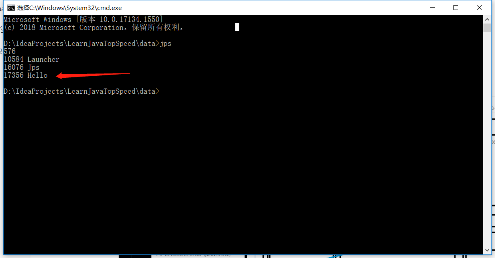
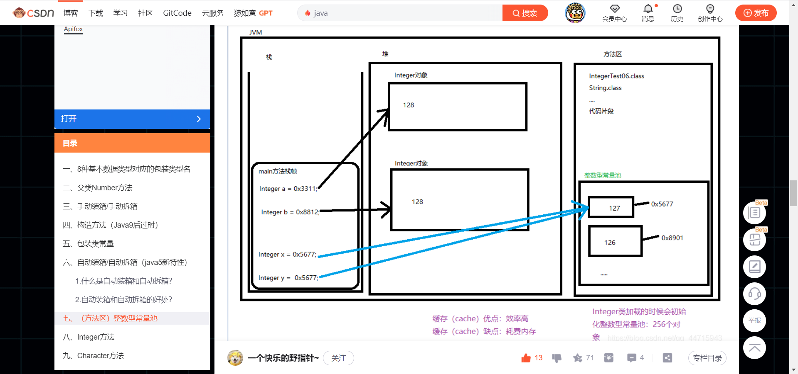
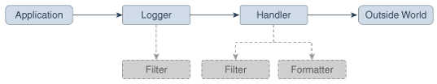
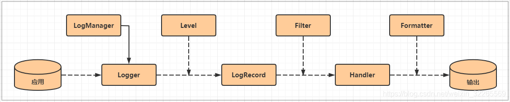
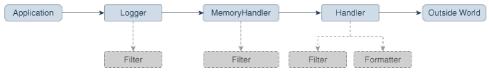

## Java中进程的名字就是执行类的名字



```java
public class Hello{
  public static void main( String[] args ) {
	while (true) {
		System.out.println("Hello world");
	}
  }
}
```


## Java中JVM的内存地址

如下图所示，JVM中分为栈、堆和方法区（元空间）。

堆里存放的是对象

方法区中存放的是常量对象，如整数型常量池



## Java中 == 和 equals的区别

> ​	== 比较的是堆内存地址是否一致
> ​	equals 比较的是内容是否一致

Java中 Int 和 Integer的区别

> 结论
> int和任意Integer都是同一地址；                       
> Integer只在127范围内才是同地址，超出就false；            
> Integer()与Integer无论什么数范围 都不同地址。

## 如何查看jar包中的源代码

[jar文件查看源代码](https://blog.csdn.net/weixin_45519736/article/details/106237077)

使用`jd-gui`可以实现。下载地址：https://github.com/java-decompiler/jd-gui/releases

## Java原生日志模块

[java.util.logging](https://docs.oracle.com/en/java/javase/15/docs/api/java.logging/java/util/logging/package-summary.html)

Java日志控制流程图如下所示：






### 核心概念

- Logger。
- Handler。
- Filter。过滤指定规则的日志。
- Formatter。格式化日志，让日志输出格式符合某一规则。
- LogRecord。每一条日志就是一个LogRecord对象，
- Level。

应用程序在Logger对象上进行日志调用（明白应用程序和Logger对接就行了。）。Logger对象以分层名称空间组织，子Logger对象可以从名称空间的父级继承一些记录属性。

每一个Logger对象可以跟踪多个Handler对象。默认情况下，Logger对象会将它的输出发送给它父级的Logger。

一些Handler对象可以直接将输出发送给其他Handler对象。如下图所示：




只有在最后一个Handler对象（输出给外界时）才会进行格式化。


### 日志级别

Java定义了7个标准的日志级别。每一个日志都有一个日志级别（log Level）对象，标识日志的重要性和紧急性。通过一个整数来表示日志级别，数越大，级别越高，越重要，越紧急。

这7个级别从高到低分别是：

- SEVERE (highest value)。注意，不是SERVER。对应的日志方法名。logger.severe()。
- WARNING。对应的日志方法名。logger.warnning()。
- INFO。对应的日志方法名。logger.info()。
- CONFIG。对应的日志方法名。logger.config()。
- FINE。对应的日志方法名。logger.fine()。
- FINER。对应的日志方法名。logger.finer()。
- FINEST (lowest value)。对应的日志方法名。logger.finest()。

当然，你也可以开发自定义的Level。

### Logger(日志记录器)

如前所述，客户端代码将日志请求发送到Logger对象。 每个记录器都会跟踪其感兴趣的日志级别，并丢弃低于该级别的日志请求。

Logger对象通常使用点号分隔的字符串命名，如java.awt。命名空间是分层的，它由LogManager管理。举个例子，名为java.awt的Logger对象，它可以处理java.awt这个包内的classes发送的日志请求，也可以处理sun.awt这个包内的classes发送的日志请求。通常情况下Logger名与包名类名保持一致，这样可以减少误会。还可以创建匿名的Logger对象，它不会出现在共享的命名空间中。

Logger对象会持续跟踪其父级Logger。root logger（名字为"")没有父级。匿名Logger对象的父级是root logger。Logger对象可以从父级Logger对象继承许多属性，特别是：

- Logging Level。如果一个logger的level被设置为null，那么此logger会从继承链中找到第一个不为null的Level作为自己的Level。
- Handlers。默认情况下，Logger对象会将日志信息输出给它父级的handlers，如此递归，直到root logger。
- Resource bundle names。If a logger has a null resource bundle name, then it will inherit any resource bundle name defined for its parent, and so on recursively up the tree.

### Logging Methods(日志方法)

每一个日志级别分别有一个产生日志的方法，上面提到过了，这样就不必调用 logger.log(Level.WARNNING, ...)，更方便。

日志记录方法有两种使用方式。

第一种，显式给出了source class名和source method名，方便开发人员快速定位产生日志的位置。

```java
void warning(String sourceClass, String sourceMethod, String msg);
```

第二种，使用更简单，当不需要详细信息时，可以使用此种方式。对于这种方式而言，Logger会“尽最大的努力”确定产生日志的类和方法，并将此信息添加到LogRecord中。

```java
void warning(String msg);
```

### Handler(处理器)

Java SE 提供了如下几种Handler类：

- StreamHandler: 将格式化的记录写入OutputStream的handler。
- ConsoleHandler: 将格式化的记录写入System.err的handler。
- FileHandler: 将格式化的日志记录写入单个文件或一组循环日志文件的handler。
- SocketHandler: 将格式化的记录写入远程 TCP ports的handler.
- MemoryHandler: 在内存中缓冲日志记录的handler。

可以开发自定义的Handler类。

### Formatters(格式化器)

Java SE 包含了两种Formatter类：

- SimpleFormatter: 编写简短的“易于阅读的”日志记录摘要。
- XMLFormatter: 编写详细的XML格式的信息。

可以开发自定义的Formatters类。

### LogManager(日志管理器)

有一个全局的LogManager对象，用于跟踪全局的日志信息。

- 已命名的Logger的分层命名空间。
- 从配置文件中读取日志的配置属性。

### Configuration File(配置文件)

可以在启动时读取的日志配置文件来初始化日志配置。 此日志记录配置文件为标准java.util.Properties格式。或者，可以通过可读取初始化属性的类来初始化日志记录配置。这种机制允许从任意来源（例如LDAP和JDBC）读取配置数据。

JDK的默认日志配置文件是  `java-home/conf/logging.properties`。

程序员可以通过多种方式在运行时更新日志记录配置：

- FileHandler, MemoryHandler, and ConsoleHandler objects can all be created with various attributes.
- New Handler objects can be added and old ones removed.
- New Logger object can be created and can be supplied with specific Handlers.
- Level objects can be set on target Handler objects.

说白了，就是可以在代码中动态地更改配置。

### Security(安全)

主要的安全要求是不受信任的代码不应能够更改日志记录配置。 特别是，如果已将日志记录配置设置为将特定类别的信息记录到特定的Handler，则不受信任的代码应该不能防止或中断该日志记录。

安全权限LoggingPermission控制对日志记录配置的更新。

受信任的应用程序将获得适当的LoggingPermission，因此它们可以调用任何日志记录配置API。 不信任的小程序则是另一回事。 不受信任的applet可以按常规方式创建和使用命名记录器，但是不允许它们更改记录控制设置，例如添加或删除处理程序，或更改日志级别。 但是，不受信任的applet可以使用Logger.getAnonymousLogger创建和使用自己的“匿名”记录器。 这些匿名记录器未在全局名称空间中注册，其方法也未经访问检查，甚至允许不受信任的代码更改其记录控制设置。

### Configuration Management(配置管理)

Java代码可以从配置文件中读取的一组初始配置信息作为属性。 然后可以通过调用各种日志记录类和对象来以编程方式更改配置信息。

此外，LogManager上还有一些方法可以允许重新读取配置文件。 发生这种情况时，配置文件值将覆盖以编程方式进行的所有更改。

### Localization(本地化)

有些日志消息可能需要本地化。不太明白本地化是什么意思。

每个记录器可能都有与之关联的ResourceBundle名称。 相应的ResourceBundle可用于在原始消息字符串和本地化消息字符串之间进行映射。

通常，formatters执行本地化。 为方便起见，Formatter类提供了formatMessage方法，该方法提供了一些基本的本地化和格式支持。

### Remote Access and Serialization(远程访问和序列化)

与大多数Java平台API一样，日志记录API旨在在单个地址空间内使用。 所有地调用均应是本地调用。 但是，某些handlers将希望将其输出转发到其他系统。 有多种方法可以执行此操作：

一些处理程序（例如SocketHandler）可能会使用XMLFormatter将数据写入其他系统。 这提供了一种简单的，标准的，可互换的格式，可以在各种系统上进行解析和处理。不详细讲了。

### 例子

1. 使用默认配置进行日志记录。使用的是root handler，root handler是由LogManager基于默认配置文件创建的。

```java
package com.wombat;
import java.util.logging.*;

public class Nose {
    // Obtain a suitable logger.
    private static Logger logger = Logger.getLogger("com.wombat.nose");
    public static void main(String argv[]) {
        // Log a FINE tracing message
        logger.fine("doing stuff");
        try {
            Wombat.sneeze();
        } catch (Exception ex) {
            // Log the exception
            logger.log(Level.WARNING, "trouble sneezing", ex);
        }
        logger.fine("done");
    }
}
```

2. 动态修改配置。模式％t表示系统临时目录。

```java
public static void main(String[] args) {
    Handler fh = new FileHandler("%t/wombat.log");
    Logger.getLogger("").addHandler(fh);
    Logger.getLogger("com.wombat").setLevel(Level.FINEST);
    ...
}
```

3. 忽略全局配置。

```java
package com.wombat;

import java.util.logging.*;

public class Nose {
    private static Logger logger = Logger.getLogger("com.wombat.nose");
    private static FileHandler fh = new FileHandler("mylog.txt");
    public static void main(String argv[]) {
        // Send logger output to our FileHandler.
        logger.addHandler(fh);
        // Request that every detail gets logged.
        logger.setLevel(Level.ALL);
        // Log a simple INFO message.
        logger.info("doing stuff");
        try {
            Wombat.sneeze();
        } catch (Exception ex) {
            logger.log(Level.WARNING, "trouble sneezing", ex);
        }
        logger.fine("done");
    }
}
```

4. XMLFormatter 输出的样子。我是觉得很难看，占用的行数太多了。

```java
<?xml version="1.0" encoding="UTF-8" standalone="no"?>
<!DOCTYPE log SYSTEM "logger.dtd">
<log>
  <record>
    <date>2015-02-27T09:35:44.885562Z</date>
    <millis>1425029744885</millis>
    <nanos>562000</nanos>
    <sequence>1256</sequence>
    <logger>kgh.test.fred</logger>
    <level>INFO</level>
    <class>kgh.test.XMLTest</class>
    <method>writeLog</method>
    <thread>10</thread>
    <message>Hello world!</message>
  </record>
</log>
```

