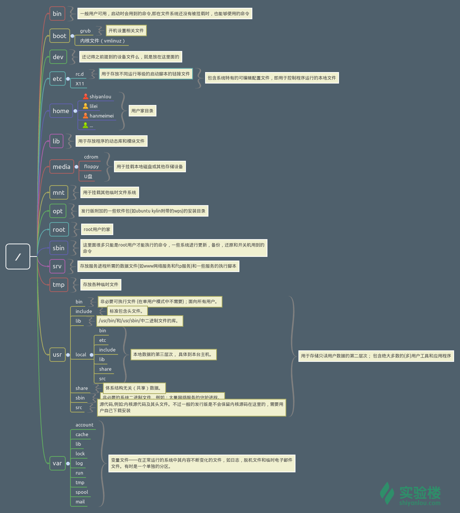
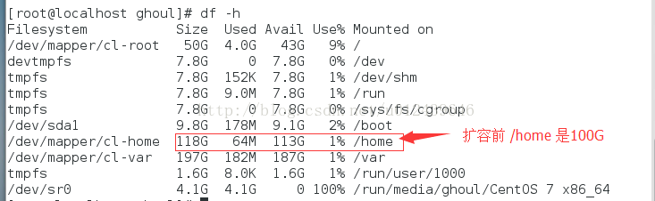

## Linux中各目录的作用



【常见目录说明】

| 目录        |                                                              |
| ----------- | ------------------------------------------------------------ |
| /bin        | 存放二进制可执行文件(ls,cat,mkdir等)，常用命令一般都在这里。 |
| /etc        | 存放系统管理和配置文件                                       |
| /home       | 存放所有用户文件的根目录，是用户主目录的基点，比如用户user的主目录就是/home/user，可以用~user表示 |
| /usr        | 用于存放系统应用程序，比较重要的目录/usr/local 本地系统管理员软件安装目录（安装系统级的应用）。这是最庞大的目录，要用到的应用程序和文件几乎都在这个目录。/usr/x11r6 存放x window的目录/usr/bin 众多的应用程序 /usr/sbin 超级用户的一些管理程序 /usr/doc linux文档 /usr/include linux下开发和编译应用程序所需要的头文件 /usr/lib 常用的动态链接库和软件包的配置文件 /usr/man 帮助文档 /usr/src 源代码，linux内核的源代码就放在/usr/src/linux里 /usr/local/bin 本地增加的命令 /usr/local/lib 本地增加的库 |
| /opt        | 额外安装的可选应用程序包所放置的位置。一般情况下，我们可以把tomcat等都安装到这里。 |
| /proc       | 虚拟文件系统目录，是系统内存的映射。可直接访问这个目录来获取系统信息。 |
| /root       | 超级用户（系统管理员）的主目录（特权阶级^o^）                |
| /sbin       | 存放二进制可执行文件，只有root才能访问。这里存放的是系统管理员使用的系统级别的管理命令和程序。如ifconfig等。 |
| /dev        | 用于存放设备文件。                                           |
| /mnt        | 系统管理员安装临时文件系统的安装点，系统提供这个目录是让用户临时挂载其他的文件系统。 |
| /boot       | 存放用于系统引导时使用的各种文件                             |
| /lib        | 存放跟文件系统中的程序运行所需要的共享库及内核模块。共享库又叫动态链接共享库，作用类似windows里的.dll文件，存放了根文件系统程序运行所需的共享文件。 |
| /tmp        | 用于存放各种临时文件，是公用的临时文件存储点。               |
| /var        | 用于存放运行时需要改变数据的文件，也是某些大文件的溢出区，比方说各种服务的日志文件（系统启动日志等。）等。 |
| /lost+found | 这个目录平时是空的，系统非正常关机而留下“无家可归”的文件（windows下叫什么.chk）就在这里 |


## linux 如何设置开机自启动程序

1. 最简单粗暴的方式直接在脚本`/etc/rc.d/rc.local`(和`/etc/rc.local`是同一个文件，软链)末尾添加自己的脚本；然后，增加脚本执行权限

2. `crontab -e`

   ```bash
   crontab -e
   @reboot /home/user/test.sh
   ```

3. 每次登录自动执行。可以设置每次登录自动执行脚本，在`/etc/profile.d/`目录下新建sh脚本， `/etc/profile`会遍历`/etc/profile.d/*.sh`

4. 在`/etc/rc[0-6].d/`目录建立软链接，软链接指向`/etc/init.d/`目录下的控制脚本

## 端口相关

### linux查看某个服务所用的端口是多少？

```bash
netstat –tunlp | grep <pid>
```

### 查看某端口的占用情况

```bash
lsof –i:<port>
或者
netstat –tunlp | grep <port>
```

## Crontab相关

### Crontab定时任务的时间间隔是相对于什么时间而言？

我想说的是，定时任务如下：

```bash
*/3 * * * * echo `date` >> test_crontab.log
```

当前时间是 2020/10/14 19:49:51 ，那么请问上面的输出应该是什么样的呢？

相对于当前时间来间隔3秒吗？

```bash
2020/10/14 19:49:51
2020/10/14 19:52:51
2020/10/14 19:55:51
......
```

还是相对于00:00:00而言来间隔3秒？

```bash

```

实际是这样的

```bash
2020/10/14 19:51:00
2020/10/14 19:54:00
2020/10/14 19:57:00
```

结论：是相对于当前的整点时间而言的。

改成每7秒输出一次

```bash
2020/10/14 19:56:00
```

这也证实了我们的结论。

> crontab 对应的文件为/var/spool/crontab/下对应的用户。我们通过crontab -e修改的就是这个目录下面对应的文件。

### crontab时间与系统时间不一致

[解决crontab执行时间与系统时间不一致的问题](https://www.cnblogs.com/showker/p/12660167.html)

[What is /etc/timezone used for?](https://unix.stackexchange.com/questions/452559/what-is-etc-timezone-used-for)]

```shell
[root@prometheus ~]# cat /etc/localtime
TZif2�Y^��	�p�ӽ����|@�;>�Ӌ{��B���E"�L���<��fp����A|��R i�� ~��!I}�"g� #)_�$G� %|&'e &�^(G (�@~�p�CDTCSTTZif2
                                                     ����~6C)�����Y^������	�p�����ӽ������������|@�����;>�����Ӌ{������B�������E"�����L�������<������fp������������A|��R i�� ~��!I}�"g� #)_�$G� %|&'e &�^(G (�@q�~�pLMTCDTCST
CST-8
[root@prometheus ~]# 
```

使用`cat /etc/localtime`查看当前的系统时区，在出现此问题的服务器中发现，该文件没有内容，实际上是其软链接的文件没有内容。

我们都知道Linux中一切皆文件。实际上，`/etc/localtime`是一个软链接，它链接到`../usr/share/zoneifno/`下的某个文件，就使用这个文件所对应的时区作为系统时区。

```shell
[root@prometheus ~]# ll /etc/localtime
lrwxrwxrwx. 1 root root 35 Dec 14 20:42 /etc/localtime -> ../usr/share/zoneinfo/Asia/Shanghai
[root@prometheus ~]# ll /usr/share/zoneinfo/
Africa      Chile    GB         Indian       Mexico    posixrules  Universal
America     CST6CDT  GB-Eire    Iran         MST       PRC         US
Antarctica  Cuba     GMT        iso3166.tab  MST7MDT   PST8PDT     UTC
Arctic      EET      GMT0       Israel       Navajo    right       WET
Asia        Egypt    GMT-0      Jamaica      NZ        ROC         W-SU
Atlantic    Eire     GMT+0      Japan        NZ-CHAT   ROK         zone1970.tab
Australia   EST      Greenwich  Kwajalein    Pacific   Singapore   zone.tab
Brazil      EST5EDT  Hongkong   leapseconds  Poland    Turkey      Zulu
Canada      Etc      HST        Libya        Portugal  tzdata.zi
CET         Europe   Iceland    MET          posix     UCT
[root@prometheus ~]# ll /usr/share/zoneinfo/Asia
Aden       Calcutta     Hong_Kong     Kuching       Qostanay       Thimphu
Almaty     Chita        Hovd          Kuwait        Qyzylorda      Tokyo
Amman      Choibalsan   Irkutsk       Macao         Rangoon        Tomsk
Anadyr     Chongqing    Istanbul      Macau         Riyadh         Ujung_Pandang
Aqtau      Chungking    Jakarta       Magadan       Saigon         Ulaanbaatar
Aqtobe     Colombo      Jayapura      Makassar      Sakhalin       Ulan_Bator
Ashgabat   Dacca        Jerusalem     Manila        Samarkand      Urumqi
Ashkhabad  Damascus     Kabul         Muscat        Seoul          Ust-Nera
Atyrau     Dhaka        Kamchatka     Nicosia       Shanghai       Vientiane
Baghdad    Dili         Karachi       Novokuznetsk  Singapore      Vladivostok
Bahrain    Dubai        Kashgar       Novosibirsk   Srednekolymsk  Yakutsk
Baku       Dushanbe     Kathmandu     Omsk          Taipei         Yangon
Bangkok    Famagusta    Katmandu      Oral          Tashkent       Yekaterinburg
Barnaul    Gaza         Khandyga      Phnom_Penh    Tbilisi        Yerevan
Beirut     Harbin       Kolkata       Pontianak     Tehran
Bishkek    Hebron       Krasnoyarsk   Pyongyang     Tel_Aviv
Brunei     Ho_Chi_Minh  Kuala_Lumpur  Qatar         Thimbu
```

所以，针对我所遇到的问题，我就从其他正常的服务器中拷贝了一个正常的`/usr/share/zoneinfo/Asia/Shanghai`文件覆盖当前服务器的对应路径的文件。然后，重启`crond`服务即可。

```shell
service crond restart 
```

查看`/etc/localtime`是否正常了。

## SSH相关

###  ssh配置免密登录


[SSH原理与运用（一）：远程登录](http://www.ruanyifeng.com/blog/2011/12/ssh_remote_login.html)

[Shell脚本实现ssh免密登录及批量配置管理](https://blog.51cto.com/vinsent/1970780)


> SSH 是一种网络协议，用于计算机之间的加密登录。
>
> SSH 只是一种协议，存在多种实现，既有商业实现，也有开源实现。例如，常用的OpenSSH。
>
> SSH之所以能够保证安全，是因为它采用了公钥加密。
>
> 1. 远程主机收到用户的登录请求，把自己的公钥发送给用户。
> 2. 用户使用这个公钥，将登录密码加密后，发送回来。
> 3. 远程主机使用自己的私钥，解密登录密码，如果密码正确，就同意用户登录。

免密登录的原理：

> 用户将自己的公钥储存在远程主机上。登录的时候，远程主机会向用户发送一段随机字符串，用户用自己的私钥加密后，再发回来。远程主机使用事先储存的公钥进行解密，如果解密成功，就证明用户是可信的，直接允许登录shell，不再要求密码。

[SSH 三步解决免密登录](https://blog.csdn.net/jeikerxiao/article/details/84105529?utm_medium=distribute.pc_relevant.none-task-blog-BlogCommendFromBaidu-3.control&depth_1-utm_source=distribute.pc_relevant.none-task-blog-BlogCommendFromBaidu-3.control)

1. 检查现有的ssh密钥对

   ```shell
   ls -al ~/.ssh/id_*.pub
   ```

   如果存在现有密钥，则跳过第二步。

2. 生成新的ssh密钥对

   ```shell
   # -t表示使用的加密算法
   # -b表示生成的密钥有多少位
   # -C表示注释
   ssh-keygen -t rsa -b 4096 -C yourEmail
   ```

   连续回车，就可以生成新的ssh密钥对了。

   

   查看`~/.ssh`目录

   

   `~/.ssh/known_hosts`中是已经保存过的远程主机的公钥，表示这些公钥是可以信赖的。

3. 将公钥复制到其他主机

   ```shell
   ssh-copy-id -i ~/.ssh/id_rsa.pub root@192.168.135.102
   ssh-copy-id -i ~/.ssh/id_rsa.pub root@192.168.135.103
   ```

   上面的命令，将此主机的ssh公钥上传到了192.168.135.102，192.168.135.103的`~/.ssh`目录中的`authorized_keys`文件中了。可以查看该文件内容，进行验证。

4. 测试免密登录

   ```shell
   ssh 192.168.135.102
   ```


补充，如果有多个主机需要配置ssh免密登录，那么可以使用shell脚本来实现。如：

```shell
#!/bin/bash

for ip in ``;
do
	ssh-copy-id -i ~/.ssh/id_rsa.pub root@$ip
done
```


### ssh 远程登录主机并执行命令

```shell
ssh root@ip "your command"
# 例子，远程登录某主机，并查看该主机根目录磁盘空间使用情况。
ssh root@192.168.0.3 "df -h |grep -w /"
```

## 系统信息

### 查看系统版本信息

```bash
uname -a
lsb_release -a
cat /etc/issue
cat /prov/version
cat /etc/redhat-release
```

### 查看系统调用

strace

### 查看机器平均负载

使用 `uptime` 和 `w` 可打印出系统过去 1, 5, 15 分钟内的平均负载。同时，你可以使用 `sar -q` 查看动态的平均负载。

### 查看系统内存

free

### 查看系统CPU信息

`cat /proc/cpuinfo`查看cpu基本信息。

如何查看 CPU 个数

如何查看 CPU model

如何查看 CPU 主频

## 可以查看CPU使用率，内存使用率等信息

htop/top

## 用户和用户组相关

参考文章：https://huaweicloud.csdn.net/635611c4d3efff3090b59b01.html

#### 创建用户

```bash
# 增加用户
# -U表示在创建用户时，创建一个与用户名同名的用户组
# -d表示创建用户时指定的家目录为/home/userName
# -m表示需要创建用户的家目录
# -p表示此用户名的密码
# userName表示用户名
useradd -U -d /home/userName -m -p 123456 userName
# 查看创建用户时的默认值
useradd -D
# 创建用户时，不创建家目录
useradd -M username1

adduser userName
# 增加用户组
groupadd groupName
# 指定组的方式增加用户
useradd -g groupName userName
# 显示用户所属的用户组
groups
# 查看所有group
cat /etc/group
# 查看所有用户
cat /etc/passwd
```

#### 修改用户密码

```bash
# 修改root用户的密码
passwd
# 修改其他用户的密码
passwd <username>
#
echo 'xxx' |passwd testuser
```
#### 删除用户

```bash
userdel -r userName
groupdel -r groupName
```

#### 修改用户权限

```shell
# 为用户设置root权限
# 如想将新增的用户设为root权限，可通过+ sudo 方式执行系统命令操作。
# 并不是任何用户都可以使用sudo的，需要root账号给与设置。
1. vim /etc/sudoers
分别在
root	ALL=(ALL)	ALL
和
%wheel 	ALL=(ALL)	ALL
下添加可有使用sudo的用户的和用户组。
```

### 单用户模式修改密码

[常见 LInux 系统进入单用户模式](https://blog.csdn.net/gaofei0428/article/details/115323647)

以centos7为例，

开机在 grub 引导界面，在默认选项上按下 e 键进入编辑模式：


找到 linux 这一行，在行末添加 rd.break（注意这里是一整行），使用 Ctrl + x 进入单用户模式：


看到如下画面就证明成功进入单用户模式


然后执行以下操作


exit 退出后 reboot 系统


## 文件权限相关

### 修改文件权限

```shell
chmod 642 filename
```

### 修改文件所属用户

```shell
chown -R userName:groupName filename
```

### root用户且有读写权限，但是仍然无法修改文件

```shell
# 取消文件的`immutable`
chmod -i 文件路径
# 让该文件变为`immutable`，不可变的
chmod +i 文件路径
```

### 查看文件md5和sha56值

`md5sum`用于生成和校验文件的md5值。它会对文件内容进行校验，而与文件名无关。有很小的概率不同文件生成的md5值相同。

常用场景，在网络传输时，如`wget` 下载远程文件，下载完成后校验该文件的md5值，看源文件的md5和下载到本地的md5值是否相同，来判断该文件的传输是否无异常。

**Linux系统**

```shell
命令格式
md5sum [OPTION]... [FILE]...
命令选项
-b或 --binary:以二进制模式读入文件；
-t或 --text:以文本文件模式读入文件（默认）；
-c或 --check:用来从文件中读取md5信息检查文件的一致性；
--status:该选项与check一起使用，在check时不输出，根据返回值表示检查结果；
-w或 --warn:在check时，检查输入的md5信息有没有非法行，若有则输出相应信息


sha256su  文件路径
```


**Windows系统**

```cmd
certutil -hashfile 文件路径 MD5

certutil -hashfile 文件路径 SHA1

certutil -hashfile 文件路径 SHA256
```

###  查看文件最新的修改时间

```shell
[atguigu@hadoop102 ~]$ stat test.txt 
  File: ‘test.txt’
  Size: 612       	Blocks: 8          IO Block: 4096   regular file
Device: fd02h/64770d	Inode: 87          Links: 1
Access: (0775/-rwxrwxr-x)  Uid: ( 1001/ atguigu)   Gid: ( 1001/ atguigu)
Context: unconfined_u:object_r:home_bin_t:s0
Access: 2021-08-28 18:32:58.415382468 +0800
Modify: 2021-06-15 12:56:25.036031722 +0800
Change: 2021-06-15 12:56:25.039031722 +0800
 Birth: -
```


## 磁盘相关

### 查看磁盘，分区

```bash
# 列出了有关所有可用或指定块设备的信息
lsblk

# 用于列出、创建、操作分区表，例如创建，删除，修改分区。
fdisk -l

# 列出所有可用磁盘及其各自的大小
parted -l
```

### hpparm

测试磁盘速度

```bash
hpparm -t /dev/sda1
```


### 卸载数据盘

#### linux系统

假设数据盘设备名为`/dev/vdb`，挂载路径为`/data1`。

```shell
umount /dev/vdb
#或
umount /data1
```

*注：某些情况下，会无法`umount`磁盘，通过查阅如下文章得到了解决方案*

[umount 提示:device is busy 的处理方法(In some cases useful info about processes that use )](https://blog.csdn.net/qq_35995514/article/details/106114292)

**问题原因：**

> 某些进程仍然在使用此 数据盘设备/挂载路径。

**解决方案：**

> a、 通过`-f`强制卸载
>
> ```shell
> umount /data1 -f
> ```
>
> b、如果a方式仍然不行，则使用此方式。
>
> ```shell
> #1 查看哪些进程占用了此数据盘设备
> fuser -m /data1
> /data1:        21746c
> ```
>
> 其中21746是进程号，通过如下命令查看具体是什么进程
>
> ```shell
> ps -aux |grep 21746
> ```
>
> 将进程`kill`之后再次卸载
>
> ```shell
> kill -9 21746
> ```
>
> ```shell
> umount /data1
> ```


### 分区

#### 创建lvm分区

文件系统格式为`ext4`

```shell
#############查看是否存在挂载点/data###################
ls /data
############创建逻辑卷、格式化、开机自动挂载############
# pvcreate将分区/dev/vdb标记为物理卷，创建物理卷
pvcreate /dev/vdb

# vgcreate命令将一个或多个物理卷结合为一个卷组，创建卷组
vgcreate vg_data /dev/vdb

# lvcreate命令根据卷组中的可用物理区块,创建逻辑卷
## lvcreate -n 设置LV名称
## lvcreate -L 设置LV大小（以字节为单位）
## lvcreate -l 设置LV大小（以区块数为单位）以及托管此逻辑卷的卷组的名称
lvcreate -l 100%VG -n lv_data vg_data
# mkfs 在新逻辑卷上创建EXT4文件系统。
mkfs.ext4 /dev/vg_data/lv_data
echo "/dev/vg_data/lv_data /data ext4 defaults 0 0" >> /etc/fstab
###########挂载###################################
mount -a
##########重启验证#################################
```

文件系统格式为`xfs`

```shell
#############查看是否存在挂载点/data###################
ls /data
############创建逻辑卷、格式化、开机自动挂载############
pvcreate /dev/vdb
vgcreate vg_data /dev/vdb
lvcreate -l 100%VG -n lv_data vg_data
mkfs.ext4 /dev/vg_data/lv_data
echo "/dev/vg_data/lv_data /data ext4 defaults 0 0" >> /etc/fstab
###########挂载###################################
mount -a
##########重启验证#################################
```


#### 扩容lvm分区

参考自：[Centos 7 利用LVM实现动态扩容](https://blog.csdn.net/u012439646/article/details/73380197)

1、查看卷组使用情况

```shell
vgdisplay
```


​																		图片来源于互联网

2、查看当前逻辑卷的空间状态

```shell
lvdisplay
```


​																		图片来源于互联网

3、查看磁盘挂载信息

```shell
fdisk -l
```


​																		图片来源于互联网

4、格式化分区操作

```shell
fdisk /dev/vdc
```


​																		图片来源于互联网

5、把新加的磁盘设置为LVM模式


​																		图片来源于互联网

确认分区


​																		图片来源于互联网


6、将新加的分区 `/dev/vdc1`创建为物理卷

```shell
pvcreate /dev/vdc1
```

7、给卷组`vg_data`扩容，将物理卷 `/dev/vdc1` 扩展至`vg_data`卷组

```shell
vgextend vg_data /dev/vdc1
```

8、此时卷组`vg_data`有?G空余空间，将空余空间都扩容至`/dev/mapper/vg_data-lv_data`

```shell
lvextend -l +100%FREE /dev/mapper/vg_data-lv_data
```

9、此时20G磁盘虽已扩展至 /home，但并没写入文件系统；进入 /etc/fstab 确认 /home 文件系统--->ext4


​																		图片来源于互联网

10、写入`ext4`文件系统，使扩容生效

```shell
resize2fs /dev/mapper/vg_data-lv_data
```

11、如果是xfs文件系统，则使用如下命令，刷新文件系统使扩容生效：

```shell
xfs_growfs /dev/mapper/vg_data-lv_data
```



​																		图片来源于互联网


## ulimit

查看文件描述符限制

## 防火墙相关

### selinux相关

查看当前调度selinux

```bash
getenforce 
```

开启或关闭selinux

```bash
# 关闭selinux
setenforce 0
# 开启selinux
setenforce 1
```

## date

参考文章：https://blog.csdn.net/rhn_111/article/details/128991625

date用于显示或者设置系统日期与时间信息的

语法

```bash
[root@localhost ~]# date --help
用法：date [选项]... [+格式]
```

常用参数

- -d datestr	显示 datestr 中所设定的时间 (非系统时间)
- -s datestr	将系统时间设为 datestr 中所设定的时间
- -u	显示目前的格林威治时间
- %Y	年份
- %m	月份
- %d	天数
- %M	分钟
- %S	秒数
- %H	小时
- %s	从1970-01-01到现在的秒数
- %F	显示当前日期，和%Y-%m-%d效果一样
- %j	查看今天是今年当中的第几天
- %e	查看今天是一个月当中的第几天
- %T	显示当前时间 ，和%H:%M:%S
- %X	显示当前时间，xx时xx分xx秒
- -r	显示指定文件的最后修改时间

使用示例

### 以默认格式输出系统当前的时间和日期；

```bash
[root@localhost ~]# date
2023年 02月 12日 星期日 08:28:59 CST
```

### 3.2 按照"年-月-日"的指定格式输出系统当前的日期时间； 有两种方法

```bash
[root@localhost ~]# date "+%Y-%m-%d"
2023-02-12
[root@localhost ~]# date +%F
2023-02-12
```


### 3.3 按照"小时：分钟：秒"的指定格式输出系统当前的时间信息； 三种方法

```bash
[root@localhost ~]# date "+%H:%M:%S"
08:34:17
[root@localhost ~]# date +%T
08:34:24
[root@localhost ~]# date +%X
08时34分32秒
[root@localhost ~]# 
```


### 3.4 设置当前系统为指定的日期和时间；

```bash
[root@localhost ~]# date -s "20230724 00:00:00"
2023年 07月 24日 星期一 00:00:00 CST
[root@localhost ~]# date 
2023年 07月 24日 星期一 00:00:14 CST
```


### 3.5 同步时间

```bash
[root@localhost ~]# ntpdate -u ntp1.aliyun.com
12 Feb 08:48:24 ntpdate[52619]: step time server 120.25.115.20 offset -13965783.026585 sec
[root@localhost ~]# ntpdate -u ntp.api.bz
[root@localhost ~]# date
2023年 02月 12日 星期日 08:49:21 CST
```


### 3.6 修改时区

```bash
[root@localhost ~]# timedatectl set-timezone America/New_York 
[root@localhost ~]# timedatectl status 
      Local time: 六 2023-02-11 19:50:41 EST
  Universal time: 日 2023-02-12 00:50:41 UTC
        RTC time: 日 2023-02-12 00:50:41
       Time zone: America/New_York (EST, -0500)
     NTP enabled: yes
NTP synchronized: yes
 RTC in local TZ: no
      DST active: no
 Last DST change: DST ended at
                  日 2022-11-06 01:59:59 EDT
                  日 2022-11-06 01:00:00 EST
 Next DST change: DST begins (the clock jumps one hour forward) at
                  日 2023-03-12 01:59:59 EST
                  日 2023-03-12 03:00:00 EDT
[root@localhost ~]# date -u
2023年 02月 12日 星期日 00:50:49 UTC
[root@localhost ~]# date 
2023年 02月 11日 星期六 19:51:07 EST
```


### 3.7 可以设定时间（非系统时间）

```bash
[root@localhost ~]# date -d "20230724"
2023年 07月 24日 星期一 00:00:00 EDT
```


### 3.8 查看文件最后的修改时间

```bash
[root@localhost ~]# date -r anaconda-ks.cfg 
2023年 02月 08日 星期三 00:02:25 CST
```


### 3.9 查看今天是一年中的第几天 ，还有查看今天是一个月中的第几天

```bash
[root@localhost ~]# date +%j
043
[root@localhost ~]# date +%e
12
```


### 3.10 显示UTC从1970-01-01到当前时间的秒数

```bash
[root@localhost ~]# date +%s
1676163423
```


## 查看进程信息

```bash
# 查看 122 PID 进程
$ ps 122

# 根据命令名(command)找到 PID
$ pgrep -a node
26464 node /code/node_modules/.bin/ts-node index.ts
30549 node server.js

# 根据命令名以及参数找到 PID
$ pgrep -af ts-node
26464 node /code/node_modules/.bin/ts-node index.ts

# 查看 122 PID 进程的信息
$ cat /proc/122/status
$ cat /proc/122/*

# 打印父进程树
# -s --show-parents: 显示父进程
# -a --arguments: 显示参数，如 echo hello 中 hello 为参数
$ pstree 122 -sap
```

## 列出的文件

lsof（全程list open files）