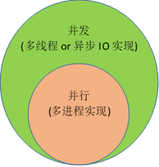

### 9. 段页式

操作系统内存管理--简单、页式、段式、段页式

https://blog.csdn.net/guoweimelon/article/details/50853719

### 10. 虚拟内存

现代操作系统提供了一种对主存的抽象能力叫做虚拟内存，虚拟内存为每个进程提供了一个非常大的、一致的、私有的地址空间。

[操作系统内存管理--简单、页式、段式、段页式](https://zhuanlan.zhihu.com/p/960988960)


### 11. 缺页中断

[详解缺页中断-----缺页中断处理（内核、用户）](https://blog.csdn.net/m0_37962600/article/details/81448553)

### 12. major/minor page fault区别

[Linux对内存的管理, 以及page fault的概念](https://www.jianshu.com/p/f9b8c139c2ed)

### 13. TLB作用

 

### 14. 进程/线程和虚拟内存的关系

[虚拟内存与进程切换、线程切换的关系](https://www.jianshu.com/p/94669fd3d692)

 

### 15. 讲讲jvm，内存泄露怎么理解

[说说JVM原理？内存泄漏与溢出的区别？何时产生内存泄漏？](https://zhuanlan.zhihu.com/p/71537002)

### 16. 垃圾回收机制，垃圾回收算法讲解一下

[Python垃圾回收机制详解](https://blog.csdn.net/xiongchengluo1129/article/details/80462651)

 

### 17. BIO、NIO、AIO

https://www.jianshu.com/p/ef418ccf2f7d

 

### 18. 无锁队列实现

 

 

 

### 15. vector底层 为什么扩容是1.5倍

 

 

 

### 16. C和JAVA的区别，本质区别

C语言和 JAVA的主要区别：面向过程/面向对象、编译型/混合型、不同的应用场景。只要阅读二者的入门资料就清楚了。

 

 

### 17. 信号量解释下，干什么用的？

 [线程同步（互斥锁与信号量的作用与区别） ](https://www.cnblogs.com/alinh/p/6905221.html)

信号量(Semaphore)，有时被称为信号灯，是在多线程环境下使用的一种设施, 它负责协调各个线程, 以保证它们能够正确、合理的使用公共资源。信号量通过一个计数器控制对共享资源的访问，信号量的值是一个非负整数，所有通过它的线程都会将该整数减一。如果计数器大于0，则访问被允许，计数器减1；如果为0，则访问被禁止，所有试图通过它的线程都将处于等待状态。

可以这样理解，信号量就相当于是一个计数器。当有进程对它所管理的资源进行请求时，进程先要读取信号量的值，大于0，资源可以请求，等于0，资源不可以用，这时进程会进入睡眠状态直至资源可用。当一个进程不再使用资源时，信号量+1(对应的操作称为V操作)，反之当有进程使用资源时，信号量-1(对应的操作为P操作)。对信号量的值操作均为原子操作。

[linux 信号量是什么怎么用？](https://www.zhihu.com/question/47411729)

 

### 18. 死锁怎么产生

[死锁面试题（什么是死锁，产生死锁的原因及必要条件）](https://blog.csdn.net/hd12370/article/details/82814348)

所谓死锁，是指多个进程在运行过程中因争夺资源而造成的一种僵局，当进程处于这种僵持状态时，若无外力作用，它们都将无法再向前推进。

死锁产生的4个必要条件？

1. 互斥条件：进程要求对所分配的资源进行排它性控制，即在一段时间内某资源仅为一进程所占用。
2. 请求和保持条件：当进程因请求资源而阻塞时，对已获得的资源保持不放。
3. 不剥夺条件：进程已获得的资源在未使用完之前，不能剥夺，只能在使用完时由自己释放。
4. 环路等待条件：在发生死锁时，必然存在一个进程--资源的环形链。

### 19. 发生了死锁怎么办？

1. 以相同的顺序获得锁

2. 超时放弃避免多次锁定

3. 死锁检测

4. 不使用锁

 

### 20. 银行家算法了解吗？

银行家算法是一种预防死锁的算法。

[计算机操作系统_银行家算法](https://blog.csdn.net/qq_36260974/article/details/84404369)

 

### 21. 并发和并行

 

 

### 22. 什么是序列化和反序列化？

以`Python`中的`序列化`和`反序列化`为例。

`序列化`：把Python的对象编码转换为json格式的字符串

`反序列化`：把json格式字符串解码为python数据对象。

我们把变量从内存中变成可存储或传输的过程称之为序列化，在`Python`中叫`pickling`，在其他语言中也被称之为`serialization`，`marshalling`，`flattening`等等都是一个意思。序列化之后，就可以把序列化后的内容写入磁盘，或者通过网络传输到别的机器上。反过来，把内容从序列化的对象重新读到内存里称之为反序列化，即`unpickling`。

  

### 23. nvarchar和varchar的区别？

`varchar(n)`。长度为 n 个字节的可变长度且非 `Unicode `的字符数据。n 必须是一个介于 1 和 8,000 之间的数值。存储大小为输入数据的字节的实际长度，而不是 n 个字节。

`nvarchar(n)`。包含 n 个字符的可变长度 `Unicode `字符数据。n 的值必须介于 1 与 4,000 之间。字节的存储大小是所输入字符个数的两倍。

 

### 24. IO多路复用

[I/O多路复用技术（multiplexing）是什么？](https://www.zhihu.com/question/28594409)

[IO 多路复用是什么意思？](https://www.zhihu.com/question/32163005)

多路网络连接复用一个io线程。

select, poll, epoll 都是I/O多路复用的具体的实现，之所以有这三个鬼存在，其实是他们出现是有先后顺序的。


### 25. 同步与异步，阻塞与非阻塞

[怎样理解阻塞非阻塞与同步异步的区别？](https://www.zhihu.com/question/19732473)

 

`同步和异步关注的是消息通信机制`。

所谓同步，就是在发出一个*调用*时，在没有得到结果之前，该*调用*就不返回。但是一旦调用返回，就得到返回值了。换句话说，就是由*调用者*主动等待这个*调用*的结果。而异步则是相反，*调用*在发出之后，这个调用就直接返回了，所以没有返回结果。换句话说，当一个异步过程调用发出后，调用者不会立刻得到结果。而是在*调用*发出后，*被调用者*通过状态、通知来通知调用者，或通过回调函数处理这个调用。

 

阻塞和非阻塞关注的是程序在等待调用结果（消息，返回值）时的状态。

阻塞调用是指调用结果返回之前，当前线程会被挂起。调用线程只有在得到结果之后才会返回。

非阻塞调用指在不能立刻得到结果之前，该调用不会阻塞当前线程。


阻塞/非阻塞：

描述的是调用者调用方法后的状态，在调用方法后等待结果期间可以做其他事情，这就是非阻塞。等待结果期间不能做其他事情，只能一直“挂起”，这就是阻塞。

同步/异步：

描述的方法跟调用者间通信的方式，如不需要调用者主动等待，调用者调用后立即返回，然后方法本身通过回调，消息通知等方式通知调用者结果，这就是异步。如果调用方法后需要调用者椅子等待方法返回结果，这就是同步。

因此，异步阻塞是没有意义的，我们通常说的异步就是异步非阻塞。

### 27. stdin、stdout、stderr是什么？

分别是标准输入、标准输出和标准错误。当然，我早就知道其字面的意思，但是这三个概念到底是个什么玩意儿呢？

 当linux开始执行程序的时候，程序默认会打开这3个文件流，这样就可以对终端进行输入/输出操作。

 它们所指向的文件句柄（文件标识符）的值分别是0，1，2。对于文件句柄，其实没有深入了解过，姑且将其看做指向某个文件的指针。

 再深入的，暂时没必要去了解了。

 28. 什么是字节序？

[阮一峰老师的博客]( http://www.ruanyifeng.com/blog/2016/11/byte-order.html)

 计算机硬件有两种储存数据的方式：大端字节序（big endian）和小端字节序（little endian）。

 举例来说，数值0x2211使用两个字节储存：高位字节是0x22，低位字节是0x11。

 

大端字节序：高位字节在前，低位字节在后，这是人类读写数值的方法。如：12345

小端字节序：低位字节在前，高位字节在后，即以0x1122形式储存。why?

 

我也不理解，为什么要有字节序？大家都用一个顺序不就得了，还搞得这么复杂干什么？

 首先，为什么会有小端字节序？

 答案是，计算机电路先处理低位字节，效率比较高，因为计算都是从低位开始的。所以，计算机的内部处理都是小端字节序。

 但是，人类还是习惯读写大端字节序。所以，除了计算机的内部处理，其他的场合几乎都是大端字节序，比如网络传输和文件储存。

### 32. 图床

就是存放图片的服务器。

### 33  LF和CRLF的区别

一、LF和CRLF是什么

> CRLF 是 carriage return line feed 的缩写，中文意思是回车换行。
>
> LF 是 line feed 的缩写，中文意思也是换行。
>
> 它们都是文本换行的方式。

二、LF和CRLF区别

`CRLF`: "\r\n", windows系统环境下的换行方式

`LF`: "\n", Linux系统环境下的换行方式

其他没啥区别的。

### Q. 对`/etc/hosts`的理解

参考文章：https://blog.csdn.net/nb1253587023/article/details/125578652

**Linux 的/etc/hosts是配置ip地址和其对应主机名的文件，这里可以记录本机的或其他主机的ip及其对应主机名。不同的linux版本，这个配置文件也可能不同**

Hosts - The static table lookup for host name（[主机名](https://so.csdn.net/so/search?q=主机名&spm=1001.2101.3001.7020)查询静态表）

hosts文件是Linux系统中一个负责IP地址与域名快速解析的文件，以ASCII格式保存在“/etc”目录下，文件名为“hosts”（不同的linux版本，这个配置文件也可能不同。比如Debian的对应文件是/etc/hostname）。**hosts文件包含了IP地址和主机名之间的映射**，还包括主机名的别名。在没有域名服务器的情况下，系统上的所有网络程序都通过查询该文件来解析对应于某个主机名的IP地址，否则就需要使用DNS服务程序来解决。通常可以将常用的域名和IP地址映射加入到hosts文件中，实现快速方便的访问。

一般`/etc/hosts` 的内容一般有如下类似内容：s

```shell 
127.0.0.1 localhost.localdomain localhost
192.168.1.100 linmu100.com linmu100
192.168.1.120 ftpserver ftp120
```

一般情况下hosts文件的每行为一个主机，每行由三部份组成，每个部份由空格隔开。其中#号开头的行做说明，不被系统解释。

hosts文件的格式如下：

```
IP地址 主机名/域名   
```

第一部份：网络IP地址；

第二部份：主机名或域名；

第三部份：主机名别名；


当然每行也可以是两部份，即主机IP地址和主机名；比如 192.168.1.100 linmu100。

### Q. Linux下免密切换到root用户

答：参考文章：https://blog.csdn.net/qq_28652401/article/details/88889139

> 修改`/etc/sudoers`文件中的`hadoop	ALL=(ALL)	ALL`为`hadoop	ALL=(ALL)	NOPASSWD:ALL`。
>
> 然后就可以使用`sudo su`, `sudo su - root`, `sudo -i`, `sudo -s`等命令免密切换到root用户了。