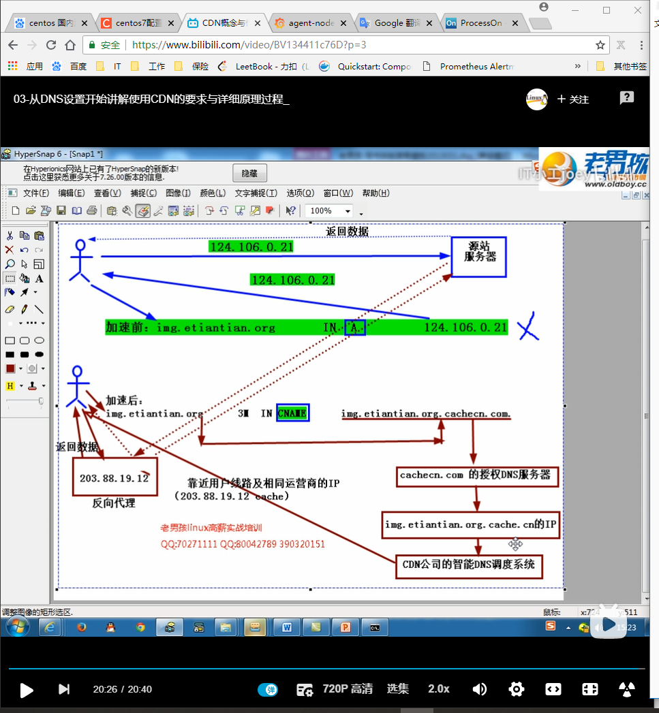
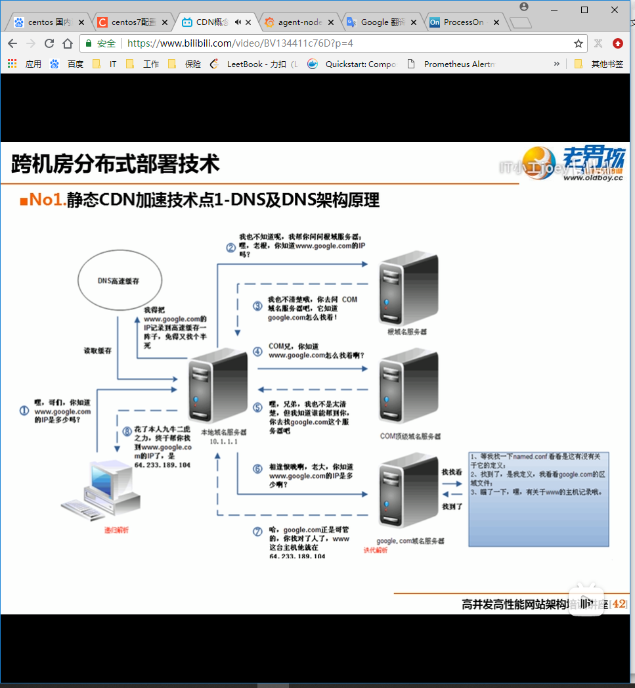
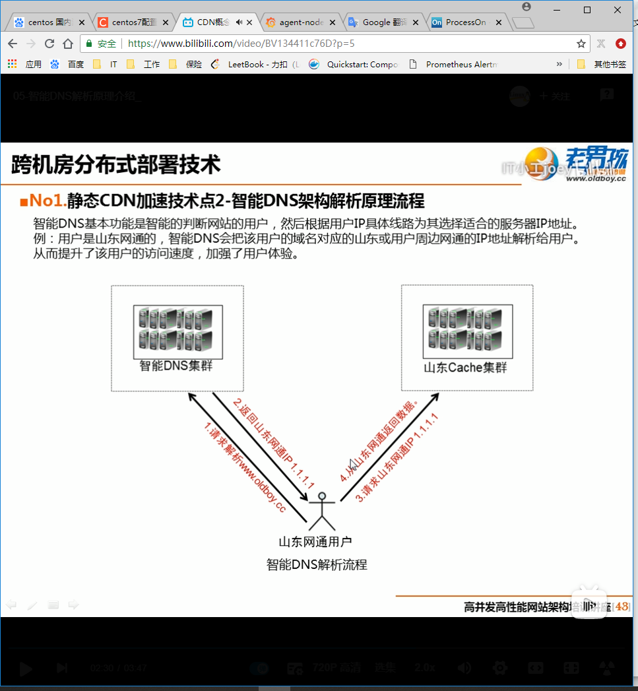
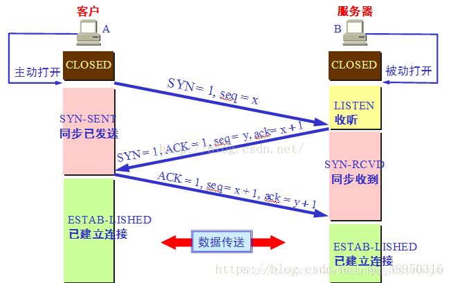
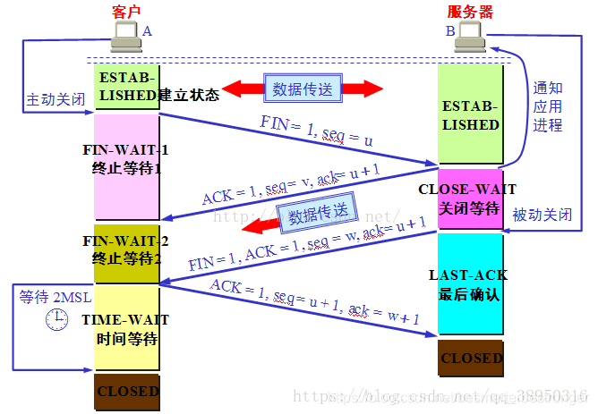
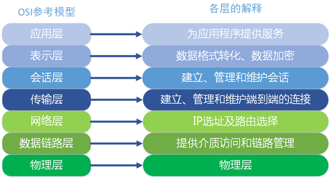
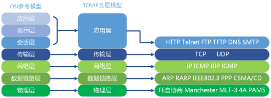
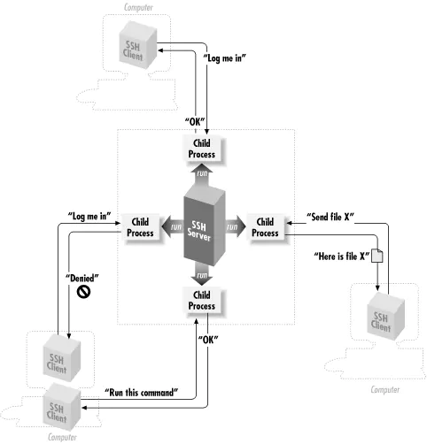
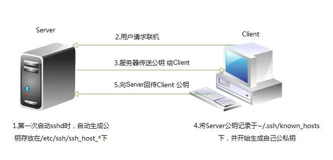
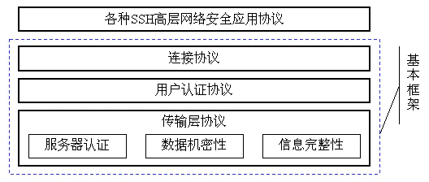

## 1. CDN

[CDN概念与作用介绍 since for bilibili](https://www.bilibili.com/video/BV134411c76D?from=search&seid=5365306152912305599)

### 1.1 什么是CDN？

CDN全称为 Content Delivery Network，即内容分发网络。其基本思路是尽可能第避开互联网上有可能影响数据传输速度和稳定性的瓶颈和环节，是内容传输地更快，更稳定。

### 1.2 CDN的特点

1. 本地Cache加速提高了企业站点（尤其是含有大量图片和静态资源的站点）的访问速度，并大大提高以上性质站点的稳定性（省钱，用户体验提升）
2. 镜像服务消除了不同运营商之间互联的瓶颈造成的影响，实现了跨运营商的网络加速，保证不同网络中的用户都能得到良好的访问质量。
3. 加速远程访问速度（如北京的用户访问深圳的网站），根据DNS负载均衡技术只能自动地选择Cache服务器，选择最快的Cache服务器，加快远程访问的速度。
4. 带宽优化自动生成服务器的远程Mirror cache服务器，远程用户访问时从cache服务器上读取数据，减少远程访问的带宽，分担网络流量，减轻源站点WEB服务器的负载等功能。

### 1.3 CDN处理过程




### 1.4 CDN服务提供商架构的关键元素

- DNS和智能DNS集群（bind，powerdns）
- Cache集群（squid，ats， nginx，varnish）
- 用户源站（cdn服务的客户）
- 外围（计费，日志分析，存储，protal展示）

### 1.5 DNS解析原理




### 1.6 智能DNS解析原理

原理相当复杂，了解基本的就可以了。



### 1.7 CDN的用途

- 企业或门户网站的图片、视频、css、js、html等静态资源的缓存
- 大网站吧全站首页静态化放在CDN，推广页面
- 支持动态加速

### 1.8 CDN的疑问

**1.8.1 源站更新，CDN怎么更新？**

源站更新，CDN不知道也不关心。

外部用户触发：用户请求该元素，这个元素CDN第一次没有，CDN去源站请求。

内部编辑触发： 就是源站更新通过CDN接口推送到CDN，也可以让CDN删除老的缓存。

**1.8.2 客户端怎么知道只能DNS的？不可能让每个客户端来配，这台不合理了。到底是为什么呢？** 


## 2. TCP/IP

### 1. 为什么是三次握手？

   两次会导致不必要的错误和资源的浪费

[TCP 为什么是三次握手，而不是两次或四次？](https://www.zhihu.com/question/24853633)

主要是两点：

1. 防止重复连接

   即防止旧的重复连接引起连接混乱问题。

   比如在网络状况比较复杂或网络状况比较差的情况下，发送方可能会连续发送多次建立连接的请求。如果TCP握手只有两次，那么接收方只能选择接受请求或拒绝请求，但它并不清楚这次的请求是否是正常的请求，还是由于网络问题而导致的过期请求，如果是过期请求的话就会造成错误的连接。

   所以，如果TCP是三次握手，那么客户端在接受到服务端的seq+1的消息之后，就可以判断当前的连接是否为历史连接，如果判断为历史连接的话，就会发送终止报文（RST）给服务端终止连接；如果判断当前连接不是历史连接的话，就发送指令给服务端来建立连接。

2. 同步初始化序列化

   如果是两次握手，无法进行序列号的确认工作，因此也就无法得到一个可靠的序列号了。

> 四次握手的过程：
>
> 1. A 发送同步信号SYN + A的 inital sequence number（初始化序列号）；
> 2. B 确认收到A的同步信号，并记录A的ISN到本地，命名为 B的 ACK sequence number；
> 3. B 发送同步信号 SYN + B的ISN；
> 4. A 确认收到B的同步信号，并记录B的ISN到本地，命名为A的ACK sequence number；
>
> 很显然2 和 3 这两步可以合并，只需要三次握手，可以提高连接的速度与效率。
>
> 二次握手的过程：
>
> 1. A 发送同步信号 SYN + A的ISN；
> 2. B 发送同步信号 SYN + B的ISN + B的ACK sequence number；
>
> 问题是，A 是否 收到 B 发送的同步信号，这不能保证，不可靠。
>
> 
>
> 




### 2. 四次挥手，为什么客户端最后还要等待2MSL？

　　1、防止客户端最后一次发给服务器的确认在网络中丢失以至于客户端关闭，而服务端并未关闭，导致资源的浪费。

　　2、等待最大的2msl可以让本次连接的所有的网络包在链路上消失，以防造成不必要的干扰。

　　但对于第二条造成不必要的干扰之前没有做过多的解读，今天在网上查了下，顺便给大家分享下：

　　如果client直接closed，然后又向server发起了一个新连接，我们不能保证这个新连接和刚关闭的连接的端口号是不同的。假设新连接和已经关闭的老端口号是一样的，如果前一次滞留的某些数据仍然在网络中，这些延迟数据会在新连接建立后到达Server，所以socket就认为那个延迟的数据是属于新连接的，数据包就会发生混淆。所以client要在TIME_WAIT状态等待2倍的MSL，这样保证本次连接的所有数据都从网络中消失。

### 3. 为什么建立连接是三次握手，关闭连接却是四次挥手呢？



- 建立连接的时候， 服务器在LISTEN状态下，收到建立连接请求的SYN报文后，把ACK和SYN放在一个报文里发送给客户端。

- 关闭连接时，服务器收到对方的FIN报文时，仅仅表示对方不再发送数据了，但是还能接收数据，而自己也未必全部数据都发送给对方了，己方ACK和FIN一般都会分开发送，从而导致多了一次。

4.TCP通过三个简单的工具来完成其差错控制：检验、确认以及超时；

5.TCP的设计理念是：TCP不是一个自私的协议，当拥塞发生的时候，要做自我牺牲。就像交通阻塞一样，每个车都应该把路让出来，而不要再去抢路了。

6.滑动窗口协议，是TCP使用的一种流量控制方法；

拥塞控制：利用以上的措施要完全避免网络拥塞还是不可能的。“拥塞避免”是说在拥塞避免阶段将拥塞窗口控制为按线性规律增长，使网络比较不容易出现拥塞。

### 4. tcp，udp区别，如果我既想用udp的快速性，又想要tcp的可靠性，如何做。（答了一下）你想改udp协议吗？

TODO

### 7. tcp和udp的本质区别是什么？这个地方在数据可靠性深挖的比较多

TODO

## 3. HTTP/HTTPS

### 34. HTTPS协议

[图解SSL/TLS协议](http://www.ruanyifeng.com/blog/2014/09/illustration-ssl.html)

[SSL/TLS协议运行机制的概述](http://www.ruanyifeng.com/blog/2014/02/ssl_tls.html)

[SSL延迟有多大？](http://www.ruanyifeng.com/blog/2014/09/ssl-latency.html)

[HTTPS的七个误解（译文）](http://www.ruanyifeng.com/blog/2011/02/seven_myths_about_https.html)

[HTTPS 升级指南](http://www.ruanyifeng.com/blog/2016/08/migrate-from-http-to-https.html)

#### 为什么要有HTTPS？

不使用SSL/TLS的HTTP通信，就是不加密的通信。所有信息明文传播，带来了三大风险。

> （1） **窃听风险**（eavesdropping）：第三方可以获知通信内容。
>
> （2） **篡改风险**（tampering）：第三方可以修改通信内容。
>
> （3） **冒充风险**（pretending）：第三方可以冒充他人身份参与通信。


SSL/TLS协议是为了解决这三大风险而设计的，希望达到：

> （1） 所有信息都是**加密传播**，第三方无法窃听。
>
> （2） 具有**校验机制**，一旦被篡改，通信双方会立刻发现。
>
> （3） 配备**身份证书**，防止身份被冒充。

#### HTTPS为什么更安全？

你会说，因为在HTTP的基础上加了一层SSL/TLS，那么为甚么加了SSL/TLS就安全了呢？

这就需要了解SSL/TLS的原理了。

下图来自阮一峰老师blog中，从此图分析SSL/TLS为什么就安全了呢？

开始加密通信之前，客户端和服务器首先必须建立连接和交换参数，这个过程叫做握手（handshake）。

SSL协议的握手过程如下：


1. 客户端 给出协议版本号、客户端生成的随机数（Client random）和客户端支持的加密算法。
2. 服务端确认双方使用的加密方法，并给出服务端的数字证书和服务端生成的随机数（Server random）。
3. 客户端确认数字证书有效，客户端再生成一个新的随机数（Premaster secret），并使用数字证书中的服务端的公钥，加密此随机数，发送给服务端。
4. 服务端使用自己的私钥，解密Premaster secret。
5. 客户端和服务端根据约定的加密方法，并使用前面的3个随机数，生成”对话秘钥“（session key），用来加密接下来的整个对话过程。

这就是SSL的握手阶段。


握手阶段有三点需要注意。

> （1）生成对话密钥一共需要==三个随机数==。
>
> （2）握手之后的对话使用"对话密钥"加密（对称加密），服务器的公钥和私钥只用于加密和解密"对话密钥"（非对称加密），无其他作用。
>
> （3）服务器公钥放在服务器的数字证书之中。


#### 如何保证公钥不被篡改？

> 为了保证公钥不被篡改，将公钥放在数字证书中。只要证书是可信的，公钥就是可信的。

#### 为什么最后使用对称加密？

> 因为对称加密的效率高。通过非对称加密得到只有两方才有的对称加密秘钥后，使用对称加密算法效率更高。

#### 什么要用随机数？

> 引入随机数，是为了让每次生成的密钥不一样，使用随机数来保证协商出来的对称密钥的随机性。

#### 为什么要用3个随机数？

> 试想下如果只用最后一个随机数会怎样？被猜出来的几率更高。
>
> pre master的存在在于SSL协议不信任每个主机都能产生完全随机的随机数，如果随机数不随机，那么pre master secret就有可能被猜出来，那么仅适用pre master secret作为密钥就不合适了，因此必须引入新的随机因素，那么客户端和服务器加上pre master secret三个随机数一同生成的密钥就不容易被猜出了，一个伪随机可能完全不随机，可是是三个伪随机就十分接近随机了，每增加一个自由度，随机性增加的可不是一。

#### 前两个随机数都是明文的啊，有没有有什么区别吗？

> 如果能保证第三个随机数是真正的随机数，而非伪随机数，那么第1和第2个随机数是没任何必要的。握手的过程就是因为考虑到第3个是伪随机数，才引入前2个伪随机数，由3个伪随机数构造一个相对更随机的伪随机数，再基于这个最终的伪随机数计算出会话密钥（Session Key）。
>
> 所以一个中间攻击人即使截获了第1和第2个伪随机数，同时也知道第3个是伪随机数（单纯这么一个伪随机数，下大力气是有可能碰撞到的），在三个伪随机数运算后再做加密的情况下，他碰撞到最终结果的难度也是成倍或几十、几百倍的上升。
>
> 但那并不意味着前两次的随机数和加密算法是没用的，如果攻击者知道第一个和第二个随机数以及加密算法，想猜第三个随机数，此时每次计算的成本比猜仅有一个随机数（第三个随机数）的加密成本要高很多，所以在客户机和服务器通信的有限的时间内，是不可能破解的。个人的理解
>
> 但是我好奇的是，为什么加密算法不和第三个随机数一起确定，然后共同用服务器的公钥加密，那样不是可以更安全吗

#### SSL/TLS能防止中间人攻击（MITM）吗？

> 如果没有使用客户端的私钥签名的话，最后服务端如何能确定传过来的Premaster key是客户端的还是中间人的？不用私钥签名也是可以的。
>
> 首先，第一次请求和第一次响应都是明文的，因此，中间人能获得这两次的所有数据；
>
> 然后，如果数字证书中有表明此数字证书中的公钥是谁的话，那中间人也无法伪造服务端的数字证书，因此，客户端拿到的是服务端的数字证书。
>
> 最后，在上面的前提下，第三次请求时，中间人无法知道客户端的数据内容，也就无法知道客户端的Premaster key。
>
> 中间人攻击的过程如下：
>
> 
>
> 造成中间人劫持的原因是 没有对服务端证书及域名做校验或者校验不完整，为了方便，直接采用开源框架默认的校验方式进行https请求。
>
> [HTTPS连接过程以及中间人攻击劫持](https://blog.csdn.net/hj7jay/article/details/80221060)

#### HTTPS就一定是安全的吗？

> 加密是发生在应用层和传输层之间，在传输层看到的数据是经过加密的。加密数据只有在客户端和服务器端才能得到明文，客户端与服务器端的通信过程是安全的。 ==而在浏览器的调试工具里可以看到请求信息，而且还是明文，是因为这里的数据是应用层的，还未经过加密。==

### 5. 使用https就能保证数据安全吗？

[也许，这样理解HTTPS更容易](https://www.jianshu.com/p/705dcd60c264)

能不能用一句话总结HTTPS？

答案是不能，因为HTTPS本身实在太复杂。但是我还是尝试使用一段话来总结HTTPS:

> HTTPS要使客户端与服务器端的通信过程得到安全保证，必须使用的对称加密算法，但是协商对称加密算法的过程，需要使用非对称加密算法来保证安全，然而直接使用非对称加密的过程本身也不安全，会有中间人篡改公钥的可能性，所以客户端与服务器不直接使用公钥，而是使用数字证书签发机构颁发的证书来保证非对称加密过程本身的安全。这样通过这些机制协商出一个对称加密算法，就此双方使用该算法进行加密解密。从而解决了客户端与服务器端之间的通信安全问题。

 ==只有相对的安全，哪有绝对的安全。==

**数字签名**：通过hash(内容)得到摘要（Digest），然后使用XX的私钥加密此摘要，即签名

**数字证书**：经过CA机构私钥加密server的公钥等之后的数据


[浅谈SSL/TLS工作原理](https://zhuanlan.zhihu.com/p/36981565)

[图解SSL/TLS协议](http://www.ruanyifeng.com/blog/2014/09/illustration-ssl.html)

一、SSL协议的握手过程

第一步，爱丽丝给出协议版本号、一个客户端生成的随机数（Client random），以及客户端支持的加密方法。

第二步，鲍勃确认双方使用的加密方法，并给出数字证书、以及一个服务器生成的随机数（Server random）。

第三步，爱丽丝确认数字证书有效，然后生成一个新的随机数（Premaster secret），并使用数字证书中的公钥，加密这个随机数，发给鲍勃。

第四步，鲍勃使用自己的私钥，获取爱丽丝发来的随机数（即Premaster secret）。

第五步，爱丽丝和鲍勃根据约定的加密方法，使用前面的三个随机数，生成"对话密钥"（session key），用来加密接下来的整个对话过程。

二、私钥的作用

（1）生成对话密钥一共需要三个随机数。

（2）握手之后的对话使用"对话密钥"加密（对称加密），服务器的公钥和私钥只用于加密和解密"对话密钥"（非对称加密），无其他作用。

（3）服务器公钥放在服务器的数字证书之中。

 

​                               

### 6. http协议处于网络模型的哪一层

 

 

### 33. HTTP协议

[HTTP 协议入门](http://www.ruanyifeng.com/blog/2016/08/http.html)


HTTP 是基于 TCP/IP 协议的[**应用层协议**](http://www.ruanyifeng.com/blog/2012/05/internet_protocol_suite_part_i.html)。它不涉及数据包（packet）传输，主要规定了客户端和服务器之间的通信格式，默认使用80端口。

发展历史：

> HTTP/0.9 -> HTTP/1.0 -> HTTP/1.1 -> HTTP/2

### HTTP/1.0

下面是一个1.0版的HTTP请求格式的例子。

> ```http
> GET / HTTP/1.0
> User-Agent: Mozilla/5.0 (Macintosh; Intel Mac OS X 10_10_5)
> Accept: */*
> ```

第一行是请求命令，必须在尾部添加协议版本（`HTTP/1.0`）。后面就是多行头信息，描述客户端的情况。

服务器的回应格式如下。

> ```http
> HTTP/1.0 200 OK 
> Content-Type: text/plain
> Content-Length: 137582
> Expires: Thu, 05 Dec 1997 16:00:00 GMT
> Last-Modified: Wed, 5 August 1996 15:55:28 GMT
> Server: Apache 0.84
> 
> <html>
> <body>Hello World</body>
> </html>
> ```

回应的格式是"头信息 + 一个空行（`\r\n`） + 数据"。其中，第一行是"协议版本 + 状态码（status code） + 状态描述"。

关于字符的编码，1.0版规定，头信息必须是 ASCII 码，后面的数据可以是任何格式。因此，服务器回应的时候，必须告诉客户端，数据是什么格式，这就是`Content-Type`字段的作用

下面是一些常见的`Content-Type`字段的值。

> - text/plain
> - text/html
> - text/css
> - image/jpeg
> - image/png
> - image/svg+xml
> - audio/mp4
> - video/mp4
> - application/javascript
> - application/pdf
> - application/zip
> - application/atom+xml

这些数据类型总称为`MIME type`，每个值包括一级类型和二级类型，之间用斜杠分隔

`MIME type`还可以在尾部使用分号，添加参数。

> ```http
> Content-Type: text/html; charset=utf-8
> ```

上面的类型表明，发送的是网页，而且编码是UTF-8。

客户端请求的时候，可以使用`Accept`字段声明自己可以接受哪些数据格式。

> ```http
> Accept: */*
> ```

由于发送的数据可以是任何格式，因此可以把数据压缩后再发送。`Content-Encoding`字段说明数据的压缩方法。

> ```http
> Content-Encoding: gzip
> Content-Encoding: compress
> Content-Encoding: deflate
> ```

客户端在请求时，用`Accept-Encoding`字段说明自己可以接受哪些压缩方法。

> ```http
> Accept-Encoding: gzip, deflate
> ```

#### HTTP/1.0的缺点

HTTP/1.0 版的主要缺点是，每个TCP连接只能发送一个请求。发送数据完毕，连接就关闭，如果还要请求其他资源，就必须再新建一个连接。

TCP连接的新建成本很高，因为需要客户端和服务器三次握手，并且开始时发送速率较慢（slow start）。所以，HTTP 1.0版本的性能比较差。随着网页加载的外部资源越来越多，这个问题就愈发突出了。

为了解决这个问题，有些浏览器在请求时，用了一个非标准的`Connection`字段。

> ```http
> Connection: keep-alive
> ```

这个字段要求服务器不要关闭TCP连接，以便其他请求复用。服务器同样回应这个字段。

> ```http
> Connection: keep-alive
> ```

一个可以复用的TCP连接就建立了，直到客户端或服务器主动关闭连接。但是，这不是标准字段，不同实现的行为可能不一致，因此不是根本的解决办法。

剩下去看阮一峰老师的博客吧，写的很好的。[HTTP 协议入门](http://www.ruanyifeng.com/blog/2016/08/http.html)

## 4. SSH(Secure SHell protocol)

[SSH 协议原理、组成、认证方式和过程](https://www.jianshu.com/p/8e5b7aea52b5)

**SSH**是（Secure SHell protocol） 的简写，安全外壳协议（SSH）是一种在不安全网络上提供安全远程登录及其它安全网络服务的协议。　

**OpenSSH** 是SSH （Secure SHell）协议的免费开源实现。SSH协议族可以用来进行远程控制，或在计算机之间传送文件。而实现此功能的传统方式，如telnet(终端仿真协议)、 rcp ftp、 rlogin、rsh都是极为不安全的，并且会使用明文传送密码。OpenSSH提供了服务端后台程序和客户端工具，用来加密远程控件和文件传输过程的中的数据，并由此来代替原来的类似服务。

### 主要功能

- 类似 telnet 的远程联机使用 shell 的服务器，即 ssh。
- 类似 FTP 服务的 sftp-server ，提供更安全的 FTP 服务。





### 组成

**SSH** 主要有三部分组成：

- 传输层协议（The Transport Layer Protocol）提供服务器认证，数据机密性，信息完整性 等的支持；

- 用户认证协议（The User Authentication Protocol） 则为服务器提供客户端的身份鉴别；

- 连接协议（The Connection Protocol） 将加密的信息隧道复用成若干个逻辑通道，提供给更高层的应用协议使用； 各种高层应用协议可以相对地独立于SSH基本体系之外，并依靠这个基本框架，通过连接协议使用SSH的安全机制。

  


### 什么是SOA?

《微服务设计》1.3节

\> SOA是一种设计方法，其中包含多个服务，而服务之间通过配置最终会提供一系列功能，一个服务通常以独立的形式存在于操作系统进程中。服务之间通过网络调用，而非采用进程内调用的方式进行通信。

[如何通俗易懂地解释什么是SOA？](https://www.zhihu.com/question/42061683?sort=created)

对于SOA，感觉这个概念性的东西没那么容易理解，看了各位大神的解释感觉很多都说的很抽象， 所以想尝试用自己的语言解释下，仅做参考。

 SOA粗暴理解：把系统按照实际业务，拆分成刚刚好大小的、合适的、独立部署的模块，每个模块 之间相互独立。 比如现我有一个数据库，一个JavaWeb（或者PHP等）的网站客户端，一个安卓app客户端，一个 IOS客户端。 现在我要从这个数据库中获取注册用户列表，如果不用SOA的设计思想，那么就会这样：JavaWeb 里面写一个查询方法从数据库里面查数据然后在网页显示，安卓app里面写一个查询方法查询后在 app上显示，IOS同样如此。这里就会出现查询方法重叠了，这样的坏处很明显了，三个地方都有相 同的业务代码，要改三个地方都要改，而且要改的一模一样。当然问题不止这一个。 于是乎出现了这样的设计思想，比如用Java（或者是其他语言皆可）单独创建一个工程部署在一台 服务器上，并且写一个方法（或称函数）执行上述查询操作，然后使其他人可以通过某种途径（可 以是http链接，或者是基于socket的RPC调用）访问这个方法得到返回数据，返回的数据类型是通 用的json或者xml数据，就是说把这个操作封装到一个工程中去，然后暴露访问的方式，形成“服 务”。比如这里就是注册用户服务，而关于注册用户的所有相关增删改查操作这个服务都会提供方 法。 这样一来，JavaWeb这边可以访问这个服务然后得到数据使用，安卓和IOS这里也可以通过这个服 务得到数据。而且最重要的是，要修改关于注册用户的业务方法只要改这个服务就好了，很好的解 耦。同理，其他业务比如商品、广告等业务都可以单独形成服务部署在单独服务器上。 还有就是一旦哪天突然有一堆人要注册，假设这堆人仅仅只是注册而不做其他事情，其他业务比如 商品、广告服务等都不忙，唯独注册这个功能压力很大，而原有的一台部署了注册服务的服务器已 经承受不了这么高的并发，这时候就可以单独集群部署这个注册服务，提供多几台服务器提供注册 服务，而其他服务还不忙，那就维持原样。 当然，还有很多其他好处。

 以上我所描述的都还不能完全称为SOA，还不够完整，因为它少了`服务治理`这一环节。 什么是服务治理，就是当服务越来越多，调用方也越来越多的时候，它们之间的关系就变得非常混 乱，需要对这些关系进行管理。举例，还是上面的例子，假如我有一个用户服务，一开始有调用方1 和调用方2来使用这个服务，后来越来越多，将近上百个调用方，这个时候作为服务方，它只知道提 供服务，却不知道具体为谁提供了服务。而对于开发者来说，知道这N多调用方和N多服务方之间 的关系是非常重要的。 `所以这个时候就需要能进行服务治理的框架，比如dubbo+zookeeper，比如SpringCloud，有了 服务治理功能，我们就能清晰地看到服务被谁谁谁调用，谁谁谁调用了哪些服务，哪些服务是热点 服务需要配置服务器集群，而对这个服务集群的负载均衡也是服务治理可以完成的重要功能之一。` 这个时候就是更加完善一点的SOA了。

> 实际上SOA只是一种架构设计模式，而SOAP、REST、RPC就是根据这种设计模式构建出来的规 范，其中SOAP通俗理解就是http+xml的形式，REST就是http+json的形式，RPC是基于socket的 形式。上文提到的CXF就是典型的SOAP/REST框架，dubbo就是典型的RPC框架，而SpringCloud 就是遵守REST规范的生态系统。

[SOA架构和微服务架构的区别](https://blog.csdn.net/zpoison/article/details/80729052)

[深入浅出SOA](https://www.cnblogs.com/renzhitian/p/6853289.html)

