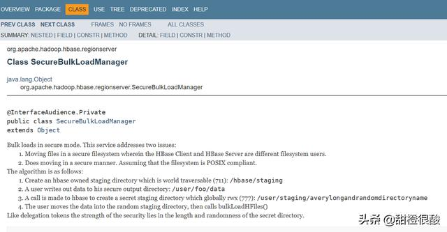
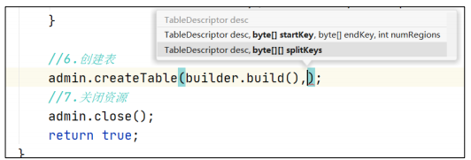

# 1. 概述

学习框架


Hadoop与HBase兼容性：


## 1.1 HBase定义

`Apache HBase`是以HDFS为数据存储的，一种分布式、可扩展的**NoSQL数据库**。

HBase = Hadoop Database

HBase支持数十亿行，数百万列。

## 1.2 HBase的数据模型

HBase的设计理念依据Google的Big Table论文，论文中对于数据模型的首句介绍：

`BigTable`是一个**稀疏的**、**分布式的**、**持久的**多维排序map。

- **稀疏的**

  稀疏性是HBase的 一个突出特点。Hbase整整一行仅有一列有值，其他列都为空值。在其他数据库中，对于空值的处理一般会填充null，而Hbase的空值不需要任何填充。因为HBase的列在理论上是允许无限扩展的，对于成百万列的表来说，通常会存在大量的空值，如果使用填充null的策略，势必会浪费大量的空间，因此稀疏性是HBase的列可以无限扩展的一个重要条件。

- **分布式的**

  很容易理解，构成HBase的所有Map并不集中在某台机器上，而是分布在整个集群中。

- **持久的**

  数据是持久化存储的，服务器重启不会造成数据丢失。

- **多维的**

  Hbase的key是一个复合数据结构，由多维元素构成，包括rowkey、columnfamily、qualifier、type以及timestamp。

- **排序的**

  构成HBase的KV在同一个文件中都是有序的，但规则并不是仅仅按照rowkey排序，而是按照KV中的key进行排序————先比较rowkey，rowkey小的排在前面；如果rowkey相同，再比较column，即columnfamily：qualifier，colum小的排在前面；如果column还相同，再比较时间戳timestamp，即版本信息，timestamp大的排在前面。

- **map**

  map即键映射到值，就像RDBMS中的key-value一样。HBase中的映射是由行键（rowkey）、列族（columnfamily）、列（column）和时间戳（timestamp）组成键，映射中的每个值都是一个未解释的字节数组。

> HBase使用与BigTable非常相似的数据模型，用户将数据行存储在**带标签的**表中。数据行具有可排序的键和任意数量的列。该表存储稀疏，因此如果用户喜欢，同一表中的行可以具有疯狂变化的列。

### 1.2.1 HBase的逻辑存储结构

HBase 可以用于存储多种结构的数据，以 JSON 为例，存储的数据原貌为：

```json
{
  "row_key1":{
    "personal_info":{
    "name":"zhangsan",
    "city":"北京",
    "phone":"131********"
    },
		"office_info":{
      "tel":"010-1111111",
      "address":"atguigu"
      }
		},
  "row_key11":{
    "personal_info":{
      "city":"上海",
      "phone":"132********"
    },
  	"office_info":{
  		"tel":"010-1111111" 
  	}
  },
  "row_key2":{
  ......
}
```

上面的json对应的HBase的逻辑存储结构。


HBase存储的数据是稀疏的，数据存储多维，不同的行可以具有不同的列。

数据存储整体有序，按照RowKey的字典序排列，RowKey为Byte数组。

**StoreFile存储一个列族中的多行数据。**

**Region存储多个列族中的多行数据，所以Region由多个StoreFile组成。**

### 1.2.2 HBase的物理存储结构

物理存储结构即为数据映射关系，而在概念视图的空单元格，底层实际根本不存储。


由于HBase的底层数据存储为HDFS，而HDFS是不支持直接对文件进行修改的，那么HBase如何实现对某行的数据进行修改呢？

**答**：通过Timestamp实现不同版本的数据，读取的时候直接读取新版本的数据，就认为是对旧数据进行的修改。

HBase数据的底层存储文件为`StoreFile`。

### 1.2.3 数据模型

- **NameSpace**

  命令空间，**类似于关系型数据库中的database的概念**，每个命名空间下有多个表。HBase有两个自带的命名空间：`hbase`和`default`。`hbase`中存放的是HBase内置的表，`default`是用户默认使用的命名空间。

- **Table**

  类似于关系型数据库中的表的概念，不同的是，**HBase定义表时只需要声明列族即可**，不需要声明具体的列。因为数据存储是稀疏的，所有往HBase写入数据时，字段可以**动态**、**按需**制定。因此，和关系型数据库相比，HBase能够轻松应对字段变更的场景。

- **Row**

  HBase表中的每行数据都由一个**RowKey**和多个**Column**组成，数据是按照RowKey的字典序存储的，并且**查询数据时只能根据RowKey进行检索**，所以RowKer的设计十分重要。

- **Column**

  HBase中的每个列都由**Column Family(列族)**和**Column Qualifier(列限定符)**进行限定，例如 `info:name`, `info:age`。建表时，只需制定列族，而列限定符无需预先定义。

- **Time Stamp**

  用于表示数据的不同版本（version），每条数据写入时，系统会自动为其加上该字段，其值为写入HBase的时间。

- **Cell**

  由`{rowkey, column Family, column Qualifier, timestamp}` 唯一确定的单元。cell中的数据全部是字节码形式存储。即同样的rowkey，列族，列，不同的时间戳代表是两个不同的cell。

## 1.3 HBase的架构

### 1.3.1 HBase的基础架构


架构中的角色：

- **Master**

  实现类为`HMaster`，负责监控集群中所有的`RegionServer`实例，主要作用如下：

  - 管理元数据表格`hbase:meta`，接受用户对表格的创建/修改/删除的命令并执行
  - 监控region是否需要进行负载均衡，故障转移和region的拆分

  通过启动多个后台线程监控实现上述功能：

  - `LoadBalancer`负载均衡器

    周期性监控region分布在RegionServer上是否均衡，由参数`hbase.balancer.period`控制周期时间，默认5分钟。

  - `CatalogJanitor`元数据管理器

    定期检查和清理`hbase:meta`中的数据。meta表内容在进阶中介绍。

  - `MasterProcWAL` master预写日志处理器

    把master需要执行的任务记录到预写日志WAL中，如果master宕机，让`backupMaster`读取WAL日志继续干。

- **Region Server**

  Region Server实现类为`HRegionServer`，主要作用如下：

  - 负责数据cell的处理，例如写入数据put，查询数据get等
  - 拆分/合并region的实际执行者，由master监控，由regionServer执行。

- **ZooKeeper**

  HBase通过ZooKeeper来做master的高可用，记录RegionServer的部署信息，并存储有meta表的位置信息。

  **HBase对于数据的读写操作时直接访问ZK**，在2.3版本退出了`Master Registry`模式，客户端可以直接访问master，使用此功能，会加大对master的压力，减轻对ZK的压力

- **HDFS**

  HDFS为HBase提供底层数据存储，同时为HBase提供高容错的支持。

### 1.3.2 HBase的HA架构

TODO

## 1.4 HBase 在 HDFS 上的目录说明

```bash
hdfs dfs -ls /hbase

drwxr-xr-x   - hadoop supergroup          0 2023-06-25 14:17 /hbase/.hbck
drwxr-xr-x   - hadoop supergroup          0 2023-07-10 13:53 /hbase/.tmp
drwxr-xr-x   - hadoop supergroup          0 2023-06-25 14:17 /hbase/MasterData
drwxr-xr-x   - hadoop supergroup          0 2023-07-10 13:34 /hbase/WALs
drwxr-xr-x   - hadoop supergroup          0 2023-07-10 11:37 /hbase/archive
drwxr-xr-x   - hadoop supergroup          0 2023-06-25 14:17 /hbase/corrupt
drwxr-xr-x   - hadoop supergroup          0 2023-07-10 14:08 /hbase/data
-rw-r--r--   1 hadoop supergroup         42 2023-06-25 14:17 /hbase/hbase.id
-rw-r--r--   1 hadoop supergroup          7 2023-06-25 14:17 /hbase/hbase.version
drwxr-xr-x   - hadoop supergroup          0 2023-06-25 14:17 /hbase/mobdir
drwxr-xr-x   - hadoop supergroup          0 2023-07-11 10:51 /hbase/oldWALs
drwx--x--x   - hadoop supergroup          0 2023-06-25 14:17 /hbase/staging
```

- **根目录**

  由hbase-site.xml中的`hbase.rootdir`配置项控制。

  - `/hbase/WALs`

    被 HLog实例管理的WAL文件。

    ```bash
    ## 对于每个HregionServer,日志目录中都包含一个对应的子目录，其中data-hbase.com为主机名
    /hbase/WALs/data-hbase.com,60020,1542159360923
    
    ##  在每个子目录下有多个HLog文件（因为日志滚动） 
    hbase/WALs/data-hbase.com,60020,1542159360923/data-hbase.com%2C60020%2C1542159360923.1453787240598
    ```
    
- `/hbase/oldWALs`
  
  当/hbase/WALs 中的HLog文件被持久化到存储文件中，不再需要日志文件时，它们会被移动到/hbase/oldWALs目录。
  
  ```bash
    ## /hbase/oldWALs/data-hbase.com%2C60020%2C1542159360923.1443787452518
    具体的oldWALs文件。
    ```
  
- `/hbase/hbase.id`
  
  集群的唯一ID 
  
- `/hbase/hbase.version`
  
  集群的文件格式版本信息
  
- `/hbase/corrupt`
  
  损坏的日志文件，一般为空，不存在损坏的文件
  
- `/hbase/archive`
  
  特别重要！！
    **存储表的归档和快照**，HBase 在做 Split或者 compact 操作完成之后，会将 HFile 移到archive 目录中，然后将之前的 hfile 删除掉，该目录由 HMaster 上的一个定时任务定期去清理。
    存储表的归档和快照具体目录:/hbase/archive/data/default/表名/region名/列族名/fd2221d8d1ae4e572c21882f0ec7cdsa6
  
- `/hbase/.tmp`
  
  当对表做创建或者删除操作的时候，会将表move 到该 tmp 目录下，然后再去做处理操作。
  
- `/hbase/.hbase-snapshot`
  
  如果hbase由快照，则会存在此目录，用于存放hbase的表的快照。
  
- `/hbase/data`
  
  hbase存储数据的核心目录
  
  ```bash
    # 该目录存储了存储了 HBase 的 namespace、meta 和acl 三个系统级表。
    # namespace 中存储了 HBase 中的所有 namespace 信息，包括预置的hbase 和 default。acl 则是表的用户权限控制。
    /hbase/data/hbase
    - /hbase/data/hbase/meta
    - /hbase/data/hbase/namespace
    - /hbase/data/hbase/acl
    
    # 该目录存储default这个namespace下的所有用户数据表：/hbase/data/default/表名
    /hbase/data/default/
    
    ######################## 表目录 ####################
    # 表的元数据信息
    /hbase/data/default/表名/.tabledesc
    ## 表的元数据信息具体文件
    /hbase/data/default/PERFORMANCE_TEST/.tabledesc/.tableinfo.0000000002
    ## 中间临时数据，当.tableinfo被更新时该目录就会被用到
    /hbase/data/default/表名/.tmp
    ## 表中每一个region的目录,（f569a17359edb2250cdf07964be606a7由region的表名+Start Key+时间戳产生的hashcode）
    /hbase/data/default/表名/f569a17359edb2250cdf07964be606a7
    
    ######################## region目录 ####################
    
    # 包含了对应 region 的 HRegionInfo 的序列化信息，类似.tableinfo。hbase hbck 工具可以用它来生成丢失的表条目元数据信息.
    /hbase/data/default/表名/region名/.regioninfo
    # 每个列族的所有物理数据文件
    /hbase/data/default/表名/region名/列族名
    # hbase 存储数据的文件
    /hbase/data/default/表名/region名/列族名/文件名
    # 用来存储临时文件，比如某个合并产生的重新写回的文件。(按需创建)
    /hbase/data/default/表名/region名/.tmp
    # 为Region拆分时的临时数据
    /hbase/data/default/表名/region名/recovered.edits
    ```
  
- `/hbase/MasterData`
  
  TODO
  
- `/hbase/.hbck`
  
  当遇到元数据不一致时，使用hbck 工具修复，修复过程中会使用该目录作为临时目录。
  
  但是对于HBase2.0.0及其以后版本这个工具已经不能用来修复HBase了,要使用hbck2。
  
- `/hbase/mobdir`
  
  此目录对应MOB文件。
  
- `/hbase/staging`
  
  在bulkload时会创建并使用这个文件夹，通过查看官方文档可以证实这一点，原文如下：
  
  


# 2. 部署

## 2.1 部署ZooKeeper

需要保证ZK集群正常部署，并在每个ZK的节点启动ZK进程。

```bash
bin/zkServer.sh start
```

## 2.2 部署Hadoop

需要Hadoop集群的正常部署并启动。

```bash
sbin/start-dfs.sh
sbin/start-yarn.sh
```

## 2.3 部署HBase

### 2.3.1 下载

下载HBase

官网下载比较慢，这里选择华为云国内源进行下载。下载地址：https://repo.huaweicloud.com/apache/hbase

下载Phoenix：https://repo.huaweicloud.com/apache/phoenix

版本：

- `hbase-2.5.5-bin.tar.gz`
- `phoenix-hbase-2.5-5.1.3-bin.tar.gz`

### 2.3.2 解压

```bash
tar -zxvf hbase-2.5.5-bin.tar.gz -C /opt/modules/
```

解压phoenix

```bash
tar -zxvf phoenix-hbase-2.5-5.1.3-bin.tar.gz -C /opt/modules
```

### 2.3.3 配置HBase环境变量

修改HBASE环境变量

```bash
sudo vim /etc/profile.d/hadoop322_env.sh
# 增加
# HBASE_HOME
export HBASE_HOME=/opt/modules/hbase-2.5.5
export PATH=$PATH:$HBASE_HOME/bin
```

分发到所有节点

```bash
sudo /home/hadoop/bin/xsync -files /etc/profile -hostsFile ~/workers
```

source以让环境变量生效。xshell > 工具 > 发送键输入到所有会话。

```bash
source /etc/profile
```

### 2.3.4 配置

#### 2.3.4.1 **hbase-env.sh**

```bash
export HBASE_MANAGES_ZK=false 				# 表示不使用HBase内置的ZK。
```

#### 2.3.4.2 **hbase-site.xml**

```xml
  <property>
    <name>hbase.cluster.distributed</name>
    <value>true</value>
    <description>hbase是否部署为分布式模式</description>
  </property>
  <property>
    <name>hbase.zookeeper.quorum</name>
    <value>hadoop322-node01,hadoop322-node02,hadoop322-node03</value>
    <description>zk集群的主机名</description>
  </property>
	<!--
  <property>
    <name>hbase.zookeeper.property.dataDir</name>
    <value>/opt/modules/zookeeper/zkData</value>
    <description>zk中的数据存储在本地的什么目录下，因为在zk的配置文件中已经修改过了，所以这里注释掉。</description>
  </property>
	-->
  <property>
    <name>hbase.rootdir</name>
    <value>hdfs://mycluster/hbase</value>
    <description>hbase的数据存储在hdfs上的什么目录下,启动hbase时如果此目录不存在会自动创建的</description>
  </property>
</configuration>
```

#### 2.3.4.3 **regionservers**

```bash
hadoop322-node01
hadoop322-node02
hadoop322-node03
```

#### 2.3.4.4 HBase和Hadoop的log4j兼容性问题

Hadoop，HBase都会有自己的log4j包，可能就会存在兼容性问题，需要修改HBase的jar包，使用Hadoop的jar包。

TODO 需要补全如下命令

```bash
mv /opt/moduels/hbase-2.5.5/lib/client-facing-thirdparty
```

#### 2.3.4.5 将修改同步到其他hbase节点

```bash
xsync -file conf -hostsFile ~/workers
xsync -file lib -hostsFile ~/workers
```

### 2.3.5 启动HBase

#### 2.3.5.1 启动单个节点上的hbase进程

```bash
bin/hbase-daemon.sh start master
bin/hbase-daemon.sh start regionserver
```

#### 2.3.5.2 停止单个节点上的hbase进程

```bash
bin/hbase-daemon.sh stop master
bin/hbase-daemon.sh stop regionserver
```

#### 2.3.5.3 启动整个hbase集群的进程

```bash
bin/start-hbase.sh
```

#### 2.3.5.4 停止整个hbase集群的进程

```bash
bin/stop-hbase.sh
```

#### 2.3.5.5 查看HBase页面

启动成功后，可以通过`host:port`的方式查看HBase的管理页面，例如`http://hadoop322-node01:16010`

## 2.4 部署HBase高可用集群

在HBase中HMaster负责监控HRegionServer的生命周期，均衡RegionServer的负载，如果HMaster挂了，那么整个HBase集群将陷入不健康的状态，并且此时的工作状态不会维持太久。所以HBase支持对HMaster进行高可用配置。

**（1）关闭HBase集群（没有启动HBase集群则跳过）**

```bash
bin/stop-hbase.sh
```

**（2）在conf目录下创建backup-masters文件**

```bash
touch conf/backup-masters
```

**（3）在backup-masters问价中配置高可用HMaster节点**

```bash
echo hadoop322-node03 > conf/backup-masters
```

**（4）将整个conf目录同步到其他节点**

```bash
xsync -file conf -hostsFile ~/workers
```

**（5）重启hbase，验证**

```bash
bin/start-hbase.sh
```

浏览器打开：http://hadoop322-node01:16010

http://hadoop322-node03:16010


**（6）模拟Master挂掉**

```bash
# 1、kill 当前的master
kill -9 pid
# 2、节点进程查看，管理页面查看
jps
http://hadoop322-node01:16010
# 3、查看backup master的管理页面，发现以成为新的master
http://hadoop322-node03:16010
# 4、启动原master进程，现在会变成backup master进程
登录节点
bin/hbase-daemon.sh start master
```

# 3. 使用

## 3.1 HBase Shell

### 3.1.1 基本操作

```bash
hbase shell

> help "command"

status
status 'simple'
...
```

### 3.1.2 namespace操作

```bash
alter_namespace
create_namespace 'ns1'
describe_namespace
drop_namespace
list_namespace
list_namespace 'abc.*'
list_namespace_tables
```

### 3.1.3 DDL操作

```bash
alter
alter_sync
alter_status
clone_table_schema
create
describe
disable
disable_all
drop
drop_all
enable
enable_all
exists
get_table
is_disabled
is_enabled
list
list_regions 
locate_region
show_filters
```

**创建表**

```bash
help "create"
create 'ns1:t1', {NAME =>'cf1', VERSIONS=>5}, {NAME=>'cf2'}
create 'ns1:t1', 'cf1', 'cf2', 'cf3'
create 'ns1:student1', 'info'
```

VERSIONS=>5，表示该列族中的列保留多少个版本，同一个rowkey，同一个列族:列，再加时间戳就是一个版本。

**查看表**

```bash
list
describe 'ns1:t1'
```

**修改表**

表名创建时写的所有和列族相关的信息，都可以后续通过alter语句修改，包括增加删除列族。

（1）**增加列族和修改信息都使用覆盖的方法**

```bash
alter 'student1', {NAME=>'cf1', VERSIONS=>3}
```

（2）**删除信息使用特殊语法。删除列族**

```bash
alter 'student1', NAME=>'cf1', METHOD=>'delete'
alter 'student1', 'delete'=>'cf1'
```

**删除表**

`hbase shell`中删除表格，需要现将表格状态设置为不可用。

```bash
disable 'ns1:student1'
drop 'student1'
```


### 3.1.4 DML操作

```bash
append
count
delete
deleteall
get
get_counter
get_splits
incr
put
scan
truncate
truncate_preserve
```

**写入数据**

在HBase中如果想要写入数据，只能添加结构中最底层的cell。可以手动写入时间戳制定cell的版本，推荐不写默认使用当前**系统时间**。

```bash
# put 'biao', 'rowkey', 'cf:col', 'value'
put 'ns1:student', '1001', 'info:name', 'zhangsan'
put 'ns1:student', '1001', 'info:name', 'lisi'
put 'ns1:student', '1001', 'info:age', '18'
```

如果重复写入相同的rowkey，相同列的数据，会写入多个版本进行覆盖。是通过时间戳进行覆盖。

**读取数据**

读取的方法有两个：`get`和`scan`。

get最大范围是一行数据，也可以进行列的过滤，读取数据的结果为多行cell。

```bash
get 'ns1:student', '1001'
# get 1个列
get 'ns1:student', '1001', {COLUMNS=>'info:name'}
# get多个列
get 'ns1:student', '1001', {COLUMNS=>['info:name', 'info:age']}

# 读取制定rowkey多个版本的数据，表示最多读取6个版本的数据
get 'ns1:student', '1001', {COLUMN=>'info:name', VERSIONS=>6}
```


**scan**是扫描数据，能够读取多行数据，不建议扫描过多的数据。推荐使用STARTROW，STOPROW来控制读取的数据。默认范围**左闭右开**。

```bash
scan 'ns1:student', {STARTROW=>'1001', STOPROW=>'1003'}
```

<font color="red">实际开发中使用 shell 的机会不多，所有丰富的使用方法到 API 中介绍。</font>

**删除数据**

删除数据的方法有两个：`delete`和`deleteall`

==delete表示删除一个版本的数据，即为1个cell，不填写版本默认删除最新的一个版本。==

如果有多个版本，那么删除最新版之后，再次查看数据为之前的次新版了。

```bash
# 删除最新版本
delete 'ns1:student', '1001', 'info:name'
# 删除指定时间戳之前的一个版本的数据
delete 'ns1:student', '1001', 'info:name', 时间戳
```

==deleteall表示删除所有版本的数据，即为当前行当前列的多个cell。==<font color="red">（执行命令会标记数据为要删除，不会直接将数据彻底删除，删除数据只在特定时期清理磁盘时进行）</font>

```bash
deleteall 'ns1:student', '1001', 'info:name'
```

### 3.1.5 其他操作

**快照操作**

```bash
# 做快照
snapshot '表名', '快照名'

# 根据快照创建新的表（不涉及数据拷贝），对新表的改动不会影响原始表，
# 注意不会将原表的ACL权限恢复到新表
clone_snapshot '快照名', '新表名'

# 根据快照（需要先disable表），将数据恢复到原来的状态（包括schema也会恢复到快照时的状态）
# 注意会将原表的ACL权限也进行恢复
disable '表名'
restore_snapshot '快照名'
```

如果由于客户端操作不当，丢失了部分数据，那么如何解决？

> 1、clone_snapshot '快照名', '新表名'
>
> 2、使用MapReduce job从新表中copy出丢失的数据到原表。

**Replication操作**

```bash
# 创建peer
add_peer <ID> <CLUSTER_KEY>
# 查看所有peer
list_peer
# 启用指定id 的peer
enable_peer <peer_id>
# 禁用指定id的peer，不再发送WAL的改动给peer集群，但是仍会跟踪需要发送给peer集群的WAL，以便启用peer之后，进行复制。
disable_peer <peer_id>
# 禁用并移除指定id的peer，不再发送WAL的改动也不再跟踪WAL。
remove_peer <peer_id>
# 启用指定表的所有列族的复制，如果目标集群不存在此表，自动创建表和列族，需要先创建peer
enable_table_replication <TABLE_NAME>
# 禁用指定表的所有列族的复制
disable_table_replication <TABLE_NAME>
peer_modification_switch <enable_or_disable>, <drain_procedures>
# 检查是否启用peer modification
peer_modification_enabled
# 设置指定id的peer的serial flag为false或true
set_peer_serial <ID>, false
```


## 3.2 HBase API

### 3.2.1 环境准备

TODO

### 3.2.2 创建连接

### 3.2.3 DDL操作

### 3.2.4 DML操作


# 4. 配置

# 5. 原理

## 5.1 Master架构


Meta表介绍：（<font color="red">警告：不要去改这个表</font>）

全称`hbase:meta`，只是在list命令中被过滤了，本质上和HBase的其他表一样。

- `RowKey`

  `([table],[region start key],[region id])` 即 `表名,region起始位置,regionID`。

- 列：

  - `info:regioninfo`
  - `info:server`
  - `info:serverstartcode`

  如果一个表处于切分的过程中，即region切分，还会多出两列`info:splitA`和`info:splitB`，存储值也是HRegionInfo对象，拆分结束后，删除这两列。

<font color="red">注意：</font>

在客户端对元数据进行操作的时候才会连接master，如果对数据进行读写，直接连接zookeeper读取目录`/hbase/meta-region-server`节点信息，会记录meta表的位置。直接读取即可，不需要访问master，这样可以减轻master的压力，相当于**master专注meta表的写操作**，客户端可以直接读取meta表。

在HBase的2.3版本更新了一种新模式：`Master Registry`。客户端可以访问master 来读取meta表信息，加大了master的压力，减轻了zookeeper的压力。

## 5.2 RegionServer架构


- **MemStore**

  写缓存，**由于HFile中的数据要求是有序的**，所以数据是先存储在MemStore中，排好序后，等到达刷写时机才会刷写到HFile，**每次刷写都会形成一个新的HFile**，写入到对应的文件夹store中。

  **一个MemStore对应一个store。store之间是无序的。**

- **WAL**

  由于**数据要经MemStore排序后才能刷写到HFile**，但把数据保存在内存中会有很高的概率导致数据丢失，为了解决这个问题，数据会先写在一个叫做`Write-Ahead logfile`的文件中，然后再写入`MemStore`中，所以系统出现故障时，数据可以通过这个日志文件重建。

  **WAL会存储在HDFS上**。

- **BlockCache**

  读缓存，每次查询出的数据会缓存在BlockCache中，方便下次查询。

## 5.3 写流程


写流程正如API编写顺序，首先创建HBase的重量级连接

- 首先访问zooKeeper，获取`hbase:meta`表位于哪个`Region Server`

- 访问对应的`Region Server`，**获取`hbase:meta`表，将其缓存到连接中**，作为连接属性`MetaCache`，由于Meta表具有一定的数据量，导致了创建连接比较慢

  之后使用创建的连接获取Table，这是一个轻量级的连接，**只有在第一次创建时会检查表格是否存在访问RegionServer，之后在获取Table时，不会访问RegionServer？？**

- 调用Table的put方法写入数据，此时还需要解析`RowKey`，对照缓存的`MetaCache`，查看具体写入哪个`RegionServer`

- 将数据顺序写入（追加）到`WAL`，此处写入是直接落盘的，并设置专门的线程控制WAL预写日志的滚动（类似Flume）

- 根据写入命令的`RowKey`和`ColumnFamily查`看具体写入到哪个`MemStore`，并且在`MemStore中`排序

- 向客户端发送ack

- 等达到MemStore的刷写时机后，将数据刷写到对应的store中。

## 5.4 MemStore Flush

**MemStore刷写由多个线程控制，条件互相独立**。主要的刷写规则是控制刷写文件的大小，在每一个刷写线程中都会进行监控。

- **条件一**

  当某个memstore的大小达到了**hbase.hregion.memstore,flush.size(默认值128M)**，**其所在region的所有memstore都会刷写**。？

  当memstore的大小达到了`hbase.hregion.memstore.flush.size(默认值128M) *hbase.hregion.memstore.block.multiplier(默认值4)` 时，会刷写同时**阻止继续往该memstore中写数据**（由于线程监控是周期性的，所以有可能面对数据洪峰，尽管可能性比较小）

- **条件二**

  由`HRegionServer`中的属性`MemStoreFlusher`内部线程`FlushHandler`控制。标准为`LOWER_MARK`(低水位线)和`HIGH_MARK`(高水位线)，**意义在于避免写缓存使用过多的内存造成OOM。**

  - 当region server中memstore的总大小达到低水位线`java_heapsize * hbase.regionserver.global.memstore.size(默认0.4) * hbase.regionserver.global.memstore.size.lower.limit(默认0.95)`时，region会按照其所有memstore的大小顺序（由大到小）依次进行刷写。直到region server中所有memstore的总大小减小到上述值以下。
  - 当region server中memstore的总大小达到高水位线`java_heapsize * hbase.regionserver.global.memstore.size(默认0.4)`时，会同时阻止继续往所有的memstore中写数据。

- **条件三**

  为了避免数据过长时间处于内存之中，到达自动刷写的时间，也会触发`memstore flush`。由`HRegionServer`的属性`PeriodMemStoreFlusher`控制进行，由于重要性比较低，5min才会执行一次。

  自动刷新的时间间隔由该属性进行配置**hbase.regionserver.optionalcacheflushinterval(默认1小时)**。

- **条件四**

  当WAL文件的数量超过`hbase.regionserver.max.logs`，region会按照时间顺序依次进行刷写，直到WAL文件数量减小到`hbase.regionserver.max.log`以下（**该属性名已废弃，先无需手动设置，最大值为32**）

## 5.5 读流程

### 5.5.1 HFile结构

在了解读流程之前，需要先知道读取的数据是什么样子的。

HFile是存储在HDFS上面每一个store文件夹下实际存储数据的文件。里面存储多种内容。包括数据本身（key value键值对）、元数据记录、文件信息、数据索引、元数据索引和一个固定长度的尾部信息（记录文件的修改情况）。

键值对按照块大小（默认64K）保存在文件中，数据索引按照块创建，块越多，索引越大。每一个HFile还会维护一个布隆过滤器（就像是一个很大的地图，文件中每有一种key，就会在对应的位置标记，读取时可以大致判断要get的key是否存在在HFile中）。

key value的内容如下：

- rowlength：key的长度
- row：key的值
- columnfamilylength：列族长度
- columnfamily：列族
- columnqualifier：列名
- timestamp：时间戳
- keytype：put

由于HFile存储经过序列化，所以无法直接查看。可以通过HBase提供的命令来查看存储在HDFS上面的HFile元数据内容。

```bash
bin/hbase hfile -m -f /hbase/data/命令空间/表名/regionID/列族/HFile名
```

### 5.5.2 读流程


- 创建连接同写流程一样。

- 创建Table对象发送get请求。
- 优先访问Block Cache，查找是否之前读取过，并且可以读取HFile的索引信息和布隆过滤器（用于判断该rowkey是否在此HFile文件中）
- 不管读缓存中是否已经有数据了（可能已经过期了，比如已经有新版本的数据了，但BlockCache中还是旧版本的数据），都需要再次读取写缓存和store中的文件。
- 最终将所有读取到的数据合并版本，按照get的要求返回即可。

### 5.5.3 合并读取数据优化

每次读取数据都需要读取三个位置，最后进行版本的合并，效率会非常低，所以系统需要对此进行优化。

- HFile带有索引文件，读取对应RowKey数据会比较快
- Block Cache会缓存之前读取的内容和元数据信息，如果HFile没有发生变化（记录在HFile尾信息中），则不需要再次读取
- 使用布隆过滤器能够快速过滤当前HFile是否存在需要读取的RowKey，从而避免读取文件。（布隆过滤器使用hash算法，不是绝对准确的，出错会造成多扫描一个文件，对读取数据结果没有影响）

<font color="red">注意：为什么一定要读取三个位置的数据呢？直接读取写缓存不就行了吗？写缓存中肯定是最新的呀？</font>

> 答：因为hbase中，表示cell版本的timestamp是可以手动指定的，也就是说很久之前put的一条数据，如果手动指定timestamp为无穷大（假设），那么就算现在又put了此rowkey的数据，只要timestamp没有之前的大，那么此rowkey的值应该还是很久之前put的值。

## 5.6 StoreFile Compaction（合并）

**由于memstore每次刷写都会生成一个新的HFile文件，文件过多读取不方便**，所以会进行文件的合并，清理掉过期和删除的数据，会进行**StoreFile Compaction**。

Compaction分为两种：

- **Minor Compaction**

  Minor Compaction会**将临近的若干个较小的HFile合并成一个较大的HFile，并清理掉部分过期和删除的数据**，由系统使用一组参数自动控制。

- **Major Compaction**

  Major Compaction会**将一个store文件夹下的所有HFile合并成一个大HFile，并且会清理掉所有过期和删除的数据**，由参数**hbase.hregion.majorcompaction**控制，默认7天。


**Minor Compaction控制机制**：

参与到小合并的文件需要通过参数计算得到，有效的参数由5个：

- `hbase.hstore.compaction.ratio`，默认1.2F，合并文件选择算法中使用的比率
- `hbase.hstore.compaction.min`，默认3，为Minor Compaction的最少文件个数
- `hbase.hstore.compaction.max`，默认10，为Minor Compaction的最多文件个数
- `hbase.hstore.compaction.min.size`，默认128M，为单个HFile文件大小最小值，小于这个值会被合并
- `hbase.hstore.compaction.max.size`，默认Long.MAX_VALUE，为单个HFile文件大小最大值，高于这个数不会被合并

小合并机制为拉取整个store中的所有文件，做成一个集合，之后按照从旧到新的顺序遍历。判断条件为：

- 过小合并，过大不合并
- `文件大小/hbase.hstore.compaction.ratio<（剩余文件大小和）`则参与压缩。所以把比值设置过大，如10会最终合并为1个特别大的文件，相反设置为0.4，会最终产生4个storeFile。**不建议修改默认值。**
- 满足压缩条件的文件个数达不到个数要求（`hbase.hstore.compaction.min`<=count<=`hbase.hstore.compaction.max`）则不压缩。

## 5.7 Region Split

**Region切分**有两种：

- **创建表格时候的预分区**，即自定义分区
- **系统默认还会启动一个切分规则**，避免单个Region中的数据量过大

### 5.7.1 预分区（自定义分区）

每一个region维护着startRow与endRowKey，如果加入的数据符合某个region维护的rowKey范围，则该数据交给这个region维护。那么依照这个原则，我们可以将数据所要投放的分区提前大致规划好，以提高HBase性能。

**预分区的几种方法**：

- **手动设置预分区**

  ```bash
  create 'staff1', 'info', SPLITS=>['1000', '2000', '3000', '4000']
  ```

  '1000', '2000', '3000', '4000'是rowkey，必须是字符串格式。不推荐

- **生成16进制序列预分区**

  ```bash
  create 'staff2', 'info', {NUMREGIONS=>15, SPLITALGO=>'HexStringSplit'}
  ```

  NUMREGIONS=>15 表示region的个数15个。

  SPLITALGO=>'HexStringSplit' 表示使用16进制进行拆分。不推荐

- **按照文件中设置的规则预分区**

  - 创建splits.txt文件，**splits.txt为本地文件**。内容如下：

    ```txt
    aaaa
    bbbb
    cccc
    dddd
    ```

  - 执行预分区

    ```bash
    create 'staff3', 'info', SPLITS_FILE=> 'splits.txt'
    ```

- 使用JavaAPI创建预分区

  

  ```java
  package com.atguigu.hbase;
  import org.apache.hadoop.conf.Configuration;
  import org.apache.hadoop.hbase.HBaseConfiguration;
  import org.apache.hadoop.hbase.TableName;
  import org.apache.hadoop.hbase.client.*;
  import org.apache.hadoop.hbase.util.Bytes;
  import java.io.IOException;
  public class HBaseConnect {
   public static void main(String[] args) throws IOException {
   // 1.获取配置类
   Configuration conf = HBaseConfiguration.create();
   // 2.给配置类添加配置
   
  conf.set("hbase.zookeeper.quorum","hadoop102,hadoop103,hadoop104"
  );
   // 3.获取连接
   Connection connection = 
  ConnectionFactory.createConnection(conf);
   // 3.获取 admin
   Admin admin = connection.getAdmin();
   // 5.获取 descriptor 的 builder
   TableDescriptorBuilder builder = 
  TableDescriptorBuilder.newBuilder(TableName.valueOf("bigdata", 
  "staff4"));
   // 6. 添加列族
   
  builder.setColumnFamily(ColumnFamilyDescriptorBuilder.newBuilder(
  Bytes.toBytes("info")).build());
   // 7.创建对应的切分
   byte[][] splits = new byte[3][];
   splits[0] = Bytes.toBytes("aaa");
   splits[1] = Bytes.toBytes("bbb");
   splits[2] = Bytes.toBytes("ccc");
   // 8.创建表
   admin.createTable(builder.build(),splits);
   // 9.关闭资源
   admin.close();
   connection.close();
   }
  }
  ```

  **不推荐**

### 5.7.2 系统拆分

Region的拆分是由`HRegionServer`完成的，在操作之前需要通过ZK汇报给master，修改对应的Meta表信息添加两列`info:splitA`和`info:splitB`信息。之后需要操作HDFS上面对应的文件，按照拆分后的Region范围进行标记区分，**实际操作为创建文件引用，不会挪动数据**。**刚完成拆分的时候，两个Region都由原先的RegionServer管理**。之后通过ZK汇报给Master，由Master将修改后的信息写入到Meta表中。等待下一次触发负载均衡机制，才会修改Region的管理服务者，而**数据要等到下一次压缩（storeFile合并）时，才会实际进行移动**。

不管是否使用预分区，系统都会默认启动一套Region拆分规则。不同版本的拆分规则有差别。系统拆分策略的父类为`RegionSplitPolicy`。

- 0.94版本之前=> `ConstantSizeRegionSplitolicy`

  - 当1个region中的某个store下所有StoreFile的总大小超过`hbase.hregion.max.filesize（默认10GB）`，该Region就会进行拆分。

- 0.94版本之后，2.0版本之前=>`IncreasingToUpperBoundRegionSplitPolicy`

  当1个region中的某个store下的所有StoreFile的总大小超过`Min(initialSize * R ^ 3, hbase.hregion.max.filesize)`，该Region就会进行拆分。其中initialSize的默认值为`2 * hbase.hregion.memstore.flush.size`，R为当前Region Server中属于该Table的Region个数。

  **具体切分策略**，每次切分只能切分满足条件的1个region：

  - 第一次split：1^3 * 256 = 256MB
  - 第二次split：2^3 * 256 = 2048MB
  - 第三次split：3^3 * 256 = 6912MB
  - 第四次split：4^3 * 256 = 16384MB > 10GB,因此取较小的值10GB
  - 后面每次split的size都是10GB了。

- 2.0版本之后=>`SteppingSplitPolicy`

  HBase 2.0引入了新的split策略：如果当前RegionServer上该表只有一个Region，按照`2 * hbase.hregion.memstore.flush.size（默认128MB）`分裂，否则按照`hbase.hregion.max.filezise`分裂。

## 5.8 Snapshot

HBase snapshot只需消耗很少的性能就能对table做内容和元数据的copy。snapshot是不可改变的，它包含**table的元数据信息**、做快照时刻此表的**HFile列表**。无论表时enable还是disable状态都可以做快照，**快照操作不涉及底层数据的拷贝**。

- clone快照是根据快照创建了一个新表。
- restore快照是将表的内容恢复到创建此快照的时刻的内容。

clone和restore操作不需要进行任何数据拷贝，因为table底层的HFile文件不会因为做了这两个操作而发生改变。

**0.94.6之前要对HBase的表做backup或clone**，只能使用：

- **CopyTble**/**ExportTable**

  **缺点**是会严重影响RegionServer的性能。

- **disable表之后，拷贝该表的HFile文件**

  缺点是因为disable了表，导致期间无法读写此表。

要对table做snapshot如需要保证`hbase-site.xml`中参数`hbase.snapshot.enabled`为`true`。0.94.5以后默认为true。

```xml
  <property>
    <name>hbase.snapshot.enabled</name>
    <value>true</value>
  </property>
```

### 5.8.1 **做快照**

```bash
$ ./bin/hbase shell
# 1、默认的snapshot，会将当前memstore中的写数据flush（刷盘）之后再做快照，目的保证做出的快照中也包含此时刻内存中的数据。
hbase> snapshot 'myTable', 'myTableSnapshot-122112'

# 2、在snapshot时不将当前memstore中的数据flush（刷盘）
hbase> snapshot 'mytable', 'snapshot123', {SKIP_FLUSH => true}

# 3、打一个带TTL的快照，快照的生命周期与表的生命周期相互独立，TTL单位秒，TTL<-1也表示永久保存此snapshot
hbase> snapshot 'mytable', 'snapshot1234', {TTL => 86400}

# 4、设置快照的MAX_FILESIZE，当根据此快照clone出表之后，会在表的元数据中添加MAX_FILESIZE=此值，对应的配置
#    项为hbase.hregion.max.filesize，代表HFile的最大大小，超过则会切分。
#		当在hbase快照迁移中，如果源hbase集群的hbase.hregion.max.filesize源大于目的，那么会导致打的快照对应的HFile会很大
#   结果是在目标端需要对这些HFile做切分，可能会出现region切分的风暴
snapshot 'table01', 'snap01', {MAX_FILESIZE => 21474836480}

# 5、启用/禁用快照自动清理，默认是启用的。
	# 禁用
	hbase> snapshot_cleanup_switch false
	# 启用
	hbase> snapshot_cleanup_switch true
	# 查看是否启用了快照自动清理
	snapshot_cleanup_enabled
```

目前无法确定打的快照中是否包含memstore中的数据。快照TTL相关参数`hbase.master.snapshot.ttl`，若配置了，则作为快照的默认TTL；若未配置则默认snapshot永不过期。

**快照的生命周期**

- 创建快照时，显式指定TLL，若TTL<-1,永久保存此snapshot

- 创建快照时，显式指定TLL，若TTL > 0，则指定秒数之后，自动删除此snapshot（前提是启用了快照自动清理）

- 创建快照时，没有显式指定TTL的使用`hbase.master.snapshot.ttl（默认0，永不过期）`作为快照的TTL。

  

Since Replication works at log level and snapshots at file-system level, after a restore, the replicas will be in a different state from the master. If you want to use restore, you need to stop replication and redo the bootstrap.

### 5.8.2 拷贝快照到新集群

**ExportSnapshot 工具**可以将snapshot相关的数据（HFiles、logs、snapshot元数据）拷贝到其他集群。ExportSnapshot工具执行MapReduce job来将文件从原集群拷贝到新集群，属于**HDFS文件级别的操作**。

```bash
$ bin/hbase org.apache.hadoop.hbase.snapshot.ExportSnapshot -snapshot MySnapshot -copy-to hdfs://srv2:8082/hbase -mappers 16 -bandwidth 20
```

- `-snapshot` 指定要复制的快照名
- `-copy-to` 指定快照文件复制到哪个HDFS路径
- `-mappers`指定使用多少个线程来进行文件的拷贝
- `-bandwidth` 指定每个mapper在文件复制所用的带宽，如20MB/s

## 5.9 Replication

HBase提供了replication的方式，可以在将A集群的状态同步至B集群。原理是使用源端集群的WAL来传递状态的变化给其他集群。

**replication是列族级别的复制**

**前提**：

- 在启用replication之前，需要在目标HBase集群创建replication的表和replication的列族。

常用于：

- backup和灾难恢复
- 数据聚合
- 地理数据分布
- 在离线数据结合分析

Replication分为两种：

- `asynchronous`，异步发送WAL，如果期间master崩溃，由于WAL不全，可能导致数据丢失。**目前为此种方式**，符合最终一致性。

- `synchronous`，同步发送WAL，无数据丢失。按照客户端请求的顺序将WAL发送给peer集群。

  原文链接：https://blog.csdn.net/weixin_42011858/article/details/129348651

  通常，我们所说的HBase复制指的是异步复制，即HBase客户端写入数据到主集群之后就返回了，然后主集群再异步地把数据依次推送到备份集群。这样存在的一个问题是，若主集群因意外或者Bug无法提供服务时，备份集群的数据是比主集群少的。这时，HBase的可用性将受到极大影响，如果把业务切换到备份集群，则必须接受备份集群比主集群少的这个事实。
  事实上，有些在线服务业务对可用性和数据一致性要求极高，这些业务期望能为在线集群搭建备份集群，一旦主集群可用性发生抖动，甚至无法提供服务时，就马上切换到备份集群上去，同时还要求备份集群的数据和主集群数据保持一致。这种需求是异步复制没法保证的，而HBase 2.1版本上实现的同步复制可以满足这类需求。
  

  同步复制的核心思想是，RegionServer在收到写入请求之后，不仅会在主集群上写一份HLog日志，还会同时在备份集群上写一份RemoteWAL日志，如图10-8所示。只有等主集群上的HLog和备集群上的RemoteWAL都写入成功且MemStore写入成功后，才会返回给客户端，表明本次写入请求成功。除此之外，主集群到备集群之间还会开启异步复制链路，若主集群上的某个HLog通过异步复制完全推送到备份集群，那么这个HLog在备集群上对应的RemoteWAL则被清理，否则不可清理。因此，可以认为，RemoteWAL是指那些已经成功写入主集群但尚未被异步复制成功推送到备份集群的数据。
  对主集群的每一次写入，备份集群都不会丢失这次写入数据。一旦主集群发生故障，只需要回放RemoteWAL日志到备集群，备集群马上就可以为线上业务提供服务。这就是同步复制的核心设计。

  **同步复制**

  同步replication要求HBase集群间具有相同的peer id。peer只支持`table-level`的replication，不支持cluster-level、namspace-level，cf-level的replication。

  命令

  ```bash
  add_peer <ID> <CLUSTER_KEY>
  ```

  - id表示peer的id，源目集群在进行replication时，要求peer id相同
  - CLUSTER_KEY，格式为`hbase.zookeeper.quorum:hbase.zookeeper.property.clientPort:zookeeper.znode.parent`，为**其他集群的`hbase.zookeeper.quorum`地址**

  ```bash
  # 创建id为1的peer，默认peer状态为enabled
  hbase> add_peer '1', CLUSTER_KEY => "server1.cie.com:2181:/hbase"
  # 创建id为1的peer，且peer状态设为enabled
  hbase> add_peer '1', CLUSTER_KEY => "server1.cie.com:2181:/hbase", STATE => "ENABLED"
  # 创建id为1的peer，且peer状态设为disabled
  hbase> add_peer '1', CLUSTER_KEY => "server1.cie.com:2181:/hbase", STATE => "DISABLED"
  # 创建id为2的peer，将哪些表的哪些列族复制到peer集群
  hbase> add_peer '2', CLUSTER_KEY => "zk1,zk2,zk3:2182:/hbase-prod", TABLE_CFS => { "table1" => [], "table2" => ["cf1"], "table3" => ["cf1", "cf2"] }
  # 创建id为2的peer，将这些namespace下的所有表复制到peer集群
  hbase> add_peer '2', CLUSTER_KEY => "zk1,zk2,zk3:2182:/hbase-prod",
      NAMESPACES => ["ns1", "ns2", "ns3"]
  # 创建id为2的peer，将ns1和ns2的所有表，ns3:table，ns3:table的指定列族复制到peer集群
  hbase> add_peer '2', CLUSTER_KEY => "zk1,zk2,zk3:2182:/hbase-prod",
      NAMESPACES => ["ns1", "ns2"], TABLE_CFS => { "ns3:table1" => [], "ns3:table2" => ["cf1"] }
    # 创建id为3的peer，将这些namespace下的所有表，以串行复制的方式复制到peer集群
  hbase> add_peer '3', CLUSTER_KEY => "zk1,zk2,zk3:2182:/hbase-prod",
      NAMESPACES => ["ns1", "ns2", "ns3"], SERIAL => true
  ```

  **源集群**

  ```bash
  hbase> add_peer  '1', CLUSTER_KEY => 'lg-hadoop-tst-st01.bj:10010,lg-hadoop-tst-st02.bj:10010,lg-hadoop-tst-st03.bj:10010:/hbase/test-hbase-slave', REMOTE_WAL_DIR=>'hdfs://lg-hadoop-tst-st01.bj:20100/hbase/test-hbase-slave/remoteWALs', TABLE_CFS => {"ycsb-test"=>[]}
  ```

  **peer集群**

  ```bash
  hbase> add_peer  '1', CLUSTER_KEY => 'lg-hadoop-tst-st01.bj:10010,lg-hadoop-tst-st02.bj:10010,lg-hadoop-tst-st03.bj:10010:/hbase/test-hbase', REMOTE_WAL_DIR=>'hdfs://lg-hadoop-tst-st01.bj:20100/hbase/test-hbase/remoteWALs', TABLE_CFS => {"ycsb-test"=>[]}
  ```

  将peer集群的同步设置为standby状态

  ```bash
  hbase> transit_peer_sync_replication_state '1', 'STANDBY'
  ```

  将源集群的同步设置为active状态

  ```bash
  hbase> transit_peer_sync_replication_state '1', 'ACTIVE'
  ```

  配置完成之后，HBase客户端只能向源集群请求，如果向peer集群请求，则现在处于`STANDBY`状态的peer集群将拒绝读/写请求。

  - **如果在同步replication过程中，peer集群崩溃了或不可达**。

    将源集群的同步状态修改为`DOWNGRADE_ACTIVE`，表示**源端集群不再远程写WAL**到peer集群。

    ```bash
    hbase> transit_peer_sync_replication_state '1', 'DOWNGRADE_ACTIVE'
    ```

    peer集群恢复后，使用如下命令，重新启用同步replication。

    ```bash
    hbase> transit_peer_sync_replication_state '1', 'ACTIVE'
    ```

  - **如果在同步replication过程中，源集群崩溃了或不可达**。

    将peer集群的同步状态修改为`DOWNGRADE_ACTIVE`，这样就会将所有对源集群的请求重定向给peer 集群。

    ```bash
    hbase> transit_peer_sync_replication_state '1', 'DOWNGRADE_ACTIVE'
    ```

    如果源集群恢复了，则使用如下命令，将源集群的状态改为`STANDBY`。为什么？因为此时原来的peer集群已经在处理读写请求了。

    ```bash
    hbase> transit_peer_sync_replication_state '1', 'STANDBY'
    ```

    然后将peer集群改为新的active集群。

    ```bash
    hbase> transit_peer_sync_replication_state '1', 'ACTIVE'
    ```

  

目前Replication和WAL compression有兼容性问题，不建议同时使用。要使用Replication需要将`hbase.regionserver.wal.enablecompression`设为`false`。

**在HBase数据迁移中，peer集群可以理解为目标集群。一般将peer集群认为是源集群的backup集群。**

在源端启用了replication的列族发生改变，则会**将此列族涉及到的region所属的RegionServer上的WAL发送给peer集群**。只要需要复制数据到其他HBase集群，每个涉及到的RegionServer都必须将WAL保存在HDFS上。每个RegionServer从旧往新读取WAL，并在ZK中记录处理进度，记录待处理的WAL的queue。

`hbase 2.6.0``开始引入了`ReplicationPeerStorage`的文件系统，用于在HFile文件系统中存储replication peer state。

HBase默认采用异步复制的方式同步数据，即客户端执行完put之后，RegionServer的后台线程不断地推送HLog的Entry到Peer集群。这种方式一般能满足大多数场景的需求，例如跨集群数据备份、HBase集群间数据迁移等。但是HBase 1.x版本的复制功能，无法保证Region迁移前后的HLog的Entry按照严格一致的顺序推送到备集群，某些极端情况下可能造成主从集群数据不一致。为此，社区在HBase 2.x版本上实现了串行复制来解决这个问题。
另外，默认的异步复制无法满足强一致性的跨机房热备需求。因为备份机房的数据肯定会落后主集群，一旦主集群异常，无法直接切换到备份集群，因此，社区提出并研发了同步复制。

**Serial replication（串行复制）**

原文链接：https://blog.csdn.net/weixin_42011858/article/details/129348651

非串行复制导致的问题

> 设想这样一个场景：现在有一个源集群往Peer集群同步数据，其中有一个Region-A落在RegionServer0（简称RS0）上。此时，所有对Region-A的写入，都会被记录在RegionServer0对应的HLog-0内。但是，一旦Region-A从RegionServer0移到RegionServer1上，之后所有对Region-A的写入，都会被RegionServer1记录在对应的HLog-1内。这时，就至少存在两个HLog同时拥有Region-A的写入数据了，而RegionServer0和RegionServer1都会为Peer开一个复制线程（ReplicationSource）。也就是说，RegionServer0和RegionServer1会并行地把HLog-0和HLog-1内包含Region-A的数据写入Peer集群。
> 
>
> **可能会导致的问题**：
>
> 第一个问题：
> 写入操作在源集群的执行顺序和Peer集群的执行顺序不一致。
>
> 
>
> Region-A在源集群的写入顺序为：
> 1）t1时间点执行：Put，K0，V0，t1。
> 2）t2时间点执行：Put，K0，V0，t2。
> 3）在t3时间点，Region-A从RegionServer0移到RegionServer1上。
> 4）t4时间点执行：Put，K0，V0，t5。
> 由于RegionServer可能并行地把同一个Region的数据往Peer推送，那么数据到了Peer集群的写入顺序可能变成：
> 1）t6时间点执行：Put，K0，V0，t1。
> 2）t7时间点执行：Put，K0，V0，t5。
> 3）t8时间点执行：Put，K0，V0，t2。
> 可以看到，时间戳为t5的Put操作反而在时间戳为t2的Put操作之前写入到Peer集群。那么，在Peer集群的［t7，t8）时间区间内，用户可以读取到t1和t5这两个版本的Put，但这种状态在源集群是永远读取不到的。
> 对于那些依赖HBase复制功能的消息系统来说，这意味着消息的发送顺序可能在复制过程中被颠倒。对那些要求消息顺序严格一致的业务来说，发生这种情况是不可接受的。
>
> 第二个问题：
> 在极端情况下，可能导致主集群数据和备集群数据不一致。
>
> 
>
> 由于写入操作在Peer集群执行可能乱序，左侧源集群的写入顺序到了Peer集群之后，就可能变成如右侧所示写入顺序。如果Peer集群在t7和t9之间，执行了完整的Major Compaction，那么执行Major Compaction之后，K0这一行数据全部都被清理，然后在t9这个时间点，时间戳为t2的Put开始在Peer集群执行。
> 这样最终导致的结果就是：源集群上rowkey=K0的所有cell都被清除，但是到了Peer集群，用户还能读取到一个多余的Put（时间戳为t2）。在这种极端情况下，就造成主备之间最终数据的不一致。对于要求主备集群最终一致性的业务来说，同样不可接受。
>

为了解决非串行复制的问题，先思考一下产生该问题的原因。**根本原因在于，Region从一个RegionServer移动到另外一个RegionServer的过程中，Region的数据会分散在两个RegionServer的HLog上，而两个RegionServer完全独立地推送各自的HLog，从而导致同一个Region的数据并行写入Peer集群。**

解决思路就是：把Region的数据按照Region移动发生的时间点t0分成两段，小于t0时间点的数据都在RegionServer0的HLog上，大于t0时间点的数据都在RegionServer1的HLog上。让RegionServer0先推小于t0的数据，等RegionServer0把小于t0的数据全部推送到Peer集群之后，RegionServer1再开始推送大于t0的数据。这样，就能保证Peer集群该Region的数据写入顺序完全和源集群的顺序一致，从而解决非串行复制带来的问题。


```bash
# 创建一个 serial replication的peer
hbase> add_peer '1', CLUSTER_KEY => "server1.cie.com:2181:/hbase", SERIAL => true

# 修改已创建的peer的serial flag，1为peer的id
set_peer_serial '1', false
set_peer_serial '1', true
```

**验证Replication数据**

HBase提供了一个名为`VerifyReplication`的mapreduce job用于验证replication的数据。**源端集群执行**

```bash
$ HADOOP_CLASSPATH=`${HBASE_HOME}/bin/hbase classpath` "${HADOOP_HOME}/bin/hadoop" jar "${HBASE_HOME}/hbase-mapreduce-VERSION.jar" verifyrep --starttime=<timestamp> --endtime=<timestamp> --families=<myFam> <ID> <tableName>
```

- `<ID>` 指peer id
- `<tableName>`指需要校验的表
- `--families`指需要检验的cf
- `--starttime`, `--endtime` 指校验指定时间范围内的数据

Replication复制原理


**Replication的内部原理**

Replication的状态记录在源集群的ZK中的`/hbase/replication` znode下。

- `/hbase/replication/peers`

  存储了所有的replication peers，还有他们的状态。peer的值是他的`cluster key`，key包括了cluster的信息有： zookeeper，zookeeper port， hbase 在 hdfs 的目录。

  ```bash
  /hbase/replication/peers
  	# 共2个peer，id分别为1,2
    /1 [Value: zk1.host.com,zk2.host.com,zk3.host.com:2181:/hbase]
    /2 [Value: zk5.host.com,zk6.host.com,zk7.host.com:2181:/hbase]
    # 每个peer都有一个子节点，表示replication是否激活，这个节点没有任何子节点，只有一个boolean值
    /hbase/replication/peers
    /1/peer-state [Value: ENABLED]
    /2/peer-state [Value: DISABLED]
  ```

  如果设置了基于replication peer storage的文件系统，则没有`peers`这个znode。

- `/hbase/replication/rs`

  保存replication queue的状态。rs znode包含了哪些WAL 是需要复制的，包括：rs hostname，client port，start code。

  ```bash
  /hbase/replication/rs
    /hostname.example.org,6020,1234
    /hostname2.example.org,6020,2856
    
  
  /hbase/replication/rs
  	# 每一个rs znode包括一个WAL replication 队列
  	# 说明 hostname.example.org 的start code 为 1234 的wal 需要复制到 peer 1 和 peer 2
    /hostname.example.org,6020,1234
      /1
      	#   每一个队列都有一个znode 标示 每一个WAL上次复制的位置，每次复制的时候都会更新这个值
        23522342.23422 [VALUE: 254]
        12340993.22342 [VALUE: 0]   
      /2  
  ```

  HBase 3.0.0之后replication queue的信息存储在了`hbase:replication`表中。

**从peer集群中选择RegionServer进行复制**

源集群的RegionServer通过在`add peer`时提供的cluster key，可以连接到peer集群的ZK，并从`/hbase/rs` znode中获取到peer集群的所有RegionServer。默认随机选择10%个RegionServer来进行replication。不选择所有RegionServer，时因为复制时针对RegionServer的，如果源集群由m个RegionServer，peer集群有n个RegionServer，则需要m*n次复制连接，成本太高。 

每一个源集群的 rs 都会在`${zookeeper.znode.parent}/rs` 节点中有一个`zookeeper watcher`，它来监控peer集群的变化，当peer集群接收数据的rs出现问题，源集群的rs 就会重新选择peer集群的RegionServer来接受replication。

**跟踪WAL日志**

有两种方式：

- **基于ZooKeeper实现**

  每一个源集群的rs在zookeeper中都有自己的znode，每一个peer都会对应一个znode，而且每一个znode都包含一个需要处理的WAL的队列。每个队列都会跟踪对应的rs 产生 的WAL。

- **基于HBase表实现**

  `HBase 3.0.0`之后支持此种方式。TODO

**Reading, Filtering and Sending Edits.**

默认的情况下，source端会尽快的读取WAL log 然后传送到复制流。传输的速度会被过滤器限制，只有 GLOBAL 范围的并且不属于系统表的log会被保留。传输速度还受制于向每个peer集群的 rs 发送的复制队列的大小，默认是64M。如果一个源集群有三个peer集群，那么一个rs 就会存储192M数据用来复制。

一旦这个buffer（64M）被填满或者读到WAL log的最后，source 线程停止读取log，从之前随机选取peer集群中的rs子集中随机选择一个rs 发送数据。首先会发送一个RPC，如果RPC正常，正常发数据。如果WAL log文件已经读取完毕，source会将zookeeper 中的复制队列中对应的znode 删除。否则，记录下log的偏移量。如果RPC抛出异常，source将会重试10次，如果都失败，重新选择一个rs。
**清除日志**

如果没有配置replication，hbase集群的清理日志线程会根据TTL配置的时间删除旧的日志。如果配置了replication，这套机制就失效了。因为归档的日志有可能已经过了TTL但是还在replication的队列中。如果log过了TTL，这个时候清理日志线程会在每个复制队列中查找是否包含这个log，如果没有，就直接删除。如果找到了，就见这个队列记录起来，下次开始清理log的时候先到记录的队列里面查看。


## 5.10 WAL原理

正常情况下，HBase新增的数据都是有日志记录的，数据在落盘成HFile之前，任何一个Put和Delete操作都是记录日志并存放在WALs目录中，**日志中包含了所有已经写入Memstore但还未Flush到HFile的更改(edits)**。<font color="red">edit表示WAL中的一条记录，记录这对数据的写操作。</font>

**默认情况下每个RegionServer只会写一个日志文件，该RS管理的所有region都在向这一个日志文件写入Put和Delete记录**，直到日志文件大小达到128MB(由`hbase.regionserver.hlog.blocksize`设置)后roll出一个新的日志文件，总共可以roll出32个日志文件(由`hbase.regionserver.maxlogs`设置)。

如果日志文件未写满128MB，RegionServer间隔1小时也会roll出新一个新日志文件（由`hbase.regionserver.logroll.period`设置）。

当日志文件中涉及的所有region的记录都flush成HFile后，这个日志文件就会转移至`oldWals`目录下归档， Master每间隔10分钟（`hbase.master.cleaner.interval`）会检查oldWALs目录下的过期日志文件，当文件过期时会被Master清理掉，（日志过期时间由`hbase.master.logcleaner.ttl`控制）。

RegionServer默认间隔1小时（由`hbase.regionserver.optionalcacheflushinterval`设置）会对它管理的region做一次flush动作，所以WALs目录中一直会有新的日志文件生成，并伴随着老的日志文件移动到`oldWALs`目录中。

一个RegionServer可以管理多个region，所有的region共享同一个活跃的WAL文件，在WAL中每一条edit都指明了其所属的region是哪个。当region打开之后，会将WAL中属于此region的edit进行重播。因此需要对WAL中edit按照region进行分组，这个分组的过程称之为`log split`。


RegionServer宕机之后又恢复，其上所有的region需要重放该RegionServer的WAL中的该region对应的edit，当所有edit恢复完之后，该Region才可用。

HBase集群启动时`log split`由HMaster完成，RegionServer宕机时由`ServerShutdownHandler` 完成。所以，**当HBase集群启动或者RegionServer宕机时才会触发`log split`**。

> log split的步骤：
>
> （1）重命名`/hbase/WALs/<host>,<port>,<startcode>`目录为`/hbase/WALs/<host>,<port>,<startcode>-splitting`目录
>
> （2）每个日志文件都被拆分，每次一个。log splitter每次从WAL中读取一条edit，将edit放入其所属region对应的buffer中，然后由write 线程将此buffer中的edit写入对应的region的指定目录下（`/hbase/<table_name>/<region_id>/recovered.edit/.tmp`文件中），`.tmp`文件存放该region在此RegionServer的WAL中的所有edit，log split完成之后，将`.tmp`文件重命名为`.tmp`文件中第一条edit的sequence ID（应该不是RowKey，相当与每个操作都有一唯一有序的ID吧）。
>
> 等log split 完成后，会比较该region的HFile中最大的sequence ID和`.tmp`重命名之后的文件的sequence ID。若前者大，表示该region的所有edit操作都以写入HFile中了。
>
> （3）log split完成之后，会将涉及的每个region分配给一个RegionServer进行管理。当region打开之后，会检查每个region下的`recovered.edit`目录下是否有待恢复的edit文件。如果存在此类文件，则读取每条edit并将其保存到新RegionServer的memstore中，回放了所有的edit之后，将memstore中的内容flush到HFile中，并删除edit文件。

# 6. HBase生产调优

## 6.1 RowKey设计

一条数据的唯一标识就是rowkey，那么这条数据存储于哪个分区，取决于rowkey处于哪一个预分区的区间内，**设计rowkey的主要目的，就是让数据均匀的分布于所有的region中，在一定程度上防止数据倾斜**。接下来我们就谈一谈rowkey常用的设计方案。

- **生成随机数、hash、散列值**：通过hash打散rowkey，分布更均衡
- **时间戳反转**：让新数据的rowkey更小，新数据排在前面
- **字符串拼接**

需求：

> 使用hbase存储下列数据，要求能够通过hbase的API读取数据完成两个统计需求。
>
> 
>
> - 统计张三在2021年12月份消费的总金额
> - 统计所有人在2021年12月份消费的总金额

### 6.1.1 实现需求1

为了能够统计张三在2021年12月份的消费总金额，我们需要使用`scan`命令能够得到张三在这个月消费的所有就，之后在进行累加即可。`scan`需要填写`startRow`和`stopRow`：

```bash
scan: startRow=> ^A^Azhangsan2021-12
			stopRow => ^A^Azhangsan2021-12.
```

<font color="red">注意</font>：

- 避免扫描数据混乱，解决字段长度不一致的问题，可以使用相同ASCII码的符号进行填充，框架底层填充使用的是ASCII码为1的`^A`。

  

- 最后的日期结尾处需要使用ASCII码略大约`-`的值，如`.`

  最终得到rowkey的设计为：

  ```bash
  # 注意rowkey相同的数据会视为相同数据，覆盖掉之前的版本
  rowKey：userdate(yyyy-MM-dd HH:mm:SS)
  ```

### 6.1.2 实现需求2

问题提出：按照需求1的rowKey设计，会发现对于需求2，完全没有办法写rowKey的扫描范围。此处能看出hbase设计rowKey使用的特点为：

- 适用性强

  能够完美实现一个需求

- 泛用性差

  但是不能同时完美实现多个需求

如果想要同时完成两个需求，需要对rowKey中字段的顺序进行调整。

调整的原则为：可枚举的放在前面。其中时间是可以枚举的，用户名称无法枚举，所以必须把时间放在前面。

```bash
# 最终满足2个需求的rowKey设计
# 可以穷举的写在前面即可
rowKey设计格式 => date(yyyy-MM)^A^Auserdate(-dd hh:mm:ss ms)

（1）统计张三在2021年12月份消费的总金额
scan: startRow => 2021-12^A^Azhangsan
			stopRow => 2021-12^A^Azhangsan.
			
（2）统计所有人在2021年12月份消费的总金额
scan: starRow => 2021-12
			stopRow => 2021-12.
```

### 61.3 添加预分区优化

预分区的分区号同样需要遵守rowKey的scan原则。所以必须添加在rowKey的最前面，前缀为最简单的数字，同时使用hash算法将用户名和月份拼接决定分区号。（单独使用 用户名会造成单一用户所有数据存储在一个分区）

```bash
# 添加预分区优化
startKey stopKey
001
001 002
002 003
...
119 120
分区号=> hash(user+date(MM)) % 120
分区号填充 如果得到 1 => 001
rowKey 设计格式 => 分区号 date(yyyy-MM)^A^Auserdate(-dd hh:mm:ss ms)
```

<font color="red">缺点：实现需求2的时候，由于每个分区都有12月份的数据，需要扫描120个分区。</font>

**解决方法**：提前将分区号和月份进行对应

```bash
# 提前将月份和分区号对应一下
000 到 009 分区 存储的都是 1 月份数据
010 到 019 分区 存储的都是 2 月份数据
...
110 到 119 分区 存储的都是 12 月份数据
是 9 月份的数据
分区号=> hash(user+date(MM)) % 10 + 80
分区号填充 如果得到 85 => 085
得到 12 月份所有人的数据
扫描 10 次
scan: startRow => 1102021-12
stopRow => 1102021-12.
...
startRow => 1122021-12
stopRow => 1122021-12.
..
startRow => 1192021-12
stopRow => 1192021-12.
```

## 6.2 参数优化

- **ZooKeeper会话超时时间**

  ```bash
  # hbase-site.xml
  属性：zookeeper.session.timeout
  解释：默认值为 90000 毫秒（90s）。当某个 RegionServer 挂掉，90s 之后 Master 才
  能察觉到。可适当减小此值，尽可能快地检测 regionserver 故障，可调整至 20-30s。
  看你能有都能忍耐超时，同时可以调整重试时间和重试次数
  hbase.client.pause（默认值 100ms）
  hbase.client.retries.number（默认 15 次）
  ```

- **设置RPC监听数量**

  ```bash
  # hbase-site.xml
  属性：hbase.regionserver.handler.count
  解释：默认值为 30，单台regionserver用于指定 RPC 监听的数量，可以根据客户端的请求数（put/get）进行调整，读写
  请求较多时，增加此值。
  ```

- **手动控制Major Compaction**

  ```bash
  # hbase-site.xml
  属性：hbase.hregion.majorcompaction
  解释：默认值：604800000 秒（7 天）， Major Compaction 的周期，若关闭自动 Major
  Compaction，可将其设为 0。如果关闭一定记得自己手动合并，因为大合并非常有意义
  ```

- **优化HStore文件大小**

  ```bash
  # hbase-site.xml
  属性：hbase.hregion.max.filesize
  解释：默认值 10737418240（10GB），如果需要运行 HBase 的 MR 任务，可以减小此值，
  因为一个 region 对应一个 map 任务，如果单个 region 过大，会导致 map 任务执行时间过长。该值的意思就是，如果 HFile 的大小达到这个数值，则这个 region 会被切分为两
  个 Hfile。
  ```

- **优化HBase客户端缓存**

  ```bash
  # hbase-site.xml
  属性：hbase.client.write.buffer
  解释：默认值 2097152bytes（2M）用于指定 HBase 客户端缓存，增大该值可以减少 RPC
  调用次数，但是会消耗更多内存，反之则反之。一般我们需要设定一定的缓存大小，以达到
  减少 RPC 次数的目的。
  ```

- **指定scan，next扫描HBase所获取的行数**

  ```bash
  # hbase-site.xml
  属性：hbase.client.scanner.caching
  解释：默认值 Integer.MAX_VALUE，用于指定 scan.next 方法获取的默认行数，值越大，消耗内存越大。
  ```

- **BlockCache占用RegionServer堆内存的比例**

  ```bash
  # hbase-site.xml
  属性：hfile.block.cache.size
  解释：默认 0.4，读请求比较多的情况下，可适当调大。所有读缓存的内存大小。
  ```

- **MemStore占用RegionServer堆内存的比例**

  ```bash
  # hbase-site.xml
  属性：hbase.regionserver.global.memstore.size
  解释：默认 0.4，写请求较多的情况下，可适当调大。所有写缓存的内存大小。
  ```

  Lars Hofhansl（拉斯.霍夫汉斯）推荐Region设置20G，刷写大小设置128M，其他默认。

## 6.3 JVM调优

JVM调优的思路由两部分：

- **内存设置**

- **垃圾回收器设置**

  垃圾回收的修改是使用并发垃圾回收，默认PO+PS是并行垃圾回收，会有大量的暂停。理由是HBase大量使用内存用于存储数据，容易遭遇**数据洪峰**造成OOM，同时写缓存的数据是不能垃圾回收的，主要回收的就是读缓存，而读缓存垃圾回收不影响性能。

（1）**设置使用CMS收集器**

```bash
-XX:+UseConcMarkSweepGC
```

（2）**保持新生代尽量小，同时尽早开启GC**，例如：

```bash
# 在内存占用到70%的时候开启GC
-XX:CMSInitiatingOccupancyFraction=70
# 指定使用70%，不让JVM动态调整
-XX:+UseCMSInitiatingOccupancyOnly
# 新生代内存设置为512m
-Xmn512m
# 并行执行新生代垃圾回收
-XX:+UseParNewGC
# 设置scanner扫描结果占用内存大小，在hbase-site.xml中，设置hbase.client.scanner.max.result.size(默认值为 2M)为 eden 空间的 1/8（大概在 64M）
# 设置多个与 max.result.size * handler.count 相乘的结果小于 Survivor Space(新生代经过垃圾回收之后存活的对象)
```

## 6.4 HBase使用经验法则

官方给出了权威的使用法则：

- **Region大小控制10-50GB**

- **cell大小不超过10M**（性能对应小于100K的值有优化），如果使用mob（Medium-sized Objects一种特殊用法）则不超过50MB。

- **1张表有1到3个列族，不要设计过多**。最好就1个，如果使用多个尽量保证不会同时读取多个列族。

- **列族名称尽量短**，不要去模仿RDBMS（关系型数据库）具有准确的名称和描述。

  因为HBase是稀疏的，底层存储的每个cell都回存储列族名，列名。而RDBMS是紧凑的，列名只会存一次。

- 如果RowKey设计时间在最前面，会导致有大量的旧数据存储在不活跃的Region中，使用的时候，仅仅会操作少数活动Region，此时建议增加更多的Region个数。

- 如果只有1个列族用于写入数据，**分配内存资源的时候可以做出调整**，即写缓存不会占用太多的内存。

# 7. 集成

## 7.1 HBase集成Phonix

### 7.1.1 Phoenix简介

**Phoenix是HBase的开源SQL皮肤**。可以使用标准JDBC API代替HBase客户端API来创建表，插入数据和查询HBase数据。

**为什么要使用phoenix**

官方给的解释：

> 在client和HBase之间放一个phoenix中间层不会减慢速度，因为用户编写的数据处理代码和Phoenix编写的没有区别（更不用说你写的垃圾多），不仅如此，phoenix对于用户输入的SQL同样会有大量的优化手段（就像hive自带sql优化器一样）。
>
> phoenix在5.版本默认提供有两种客户端使用（**瘦客户端**和**胖客户端**），在5.1.2版本安装包中删除了瘦客户端，本文也不再使用瘦客户端，而胖客户端和用户自己写HBase的API代码读取数据之后进行数据处理是完全一样的。

### 7.1.2 Phoenix入门

#### 7.1.2.1 部署

官网地址: http://phoenix.apache.org/

**部署**：

- **上传并解压tar包**

  ```bash
  tar -zxvvf phoenix-hbase-2.5-5.1.3-bin.tar.gz -C /opt/modules/
  ```

- **复制server包并拷贝到各个节点的hbase/lib**

  ```bash
  # 拷贝
  cp phoenix-server-hbase-2.5-5.1.3.jar $HBASE_HOME/lib/
  # 分发到其他节点
  xsync -file $HBASE_HOME/lib/phoenix-server-hbase-2.5-5.1.3.jar  -hostsFile ~/workers
  ```

- **配置环境变量**

  ```bash
  #PHOENIX_HOME
  export PHOENIX_HOME=/pot/modules/phoenix-hbase-2.5-5.1.3-bin/
  export PATH=$PATH:$PHOENIX_HOME/bin
  ```

  `source /etc/profile`

- **重启HBase**

  ```bash
  $HBASE_HOME/bin/stop-hbase.sh
  $HBASE_HOME/bin/start-hbase.sh
  ```

- **连接Phoenix**

  ```bash
  $PHOENIX_HOME/bin/sqlline.py hadoop322-node01,hadoop322-node02,hadoop322-node03:2181
  ```

  首次联接phoenix之前，在用户的home目录下没有`.sqlline`目录，首次连接之后就会自动创建此目录了。

- **错误解决**

  出现下面错误的原因是之前使用过phoenix，建议删除之前的记录

  ```bash
  警告: Failed to load history
  java.lang.IllegalArgumentException: Bad history file syntax! The 
  history file `/home/atguigu/.sqlline/history` may be an older 
  history: please remove it or use a different history file.
  [atguigu@hadoop102 ~]$ rm -rf .sqlline/
  ```
  
- **其他配置**

  修改hbase中的`hbase-site.xml`

  默认情况下，phoenix中的schema和hbase中的namespace是没有对应的。什么意思呢？举个例子

  ```sql
  -- 在phoenix中创建表
  create table "ns1"."students"(
    id bigint primary key, 
    "info"."name" varchar, 
    "info"."address" varchar, 
    age bigint)
  column_encoded_bytes=0;
  -- show tables发现在phoenix中schema为ns1，table名为students
  show tables;
  
  -- 在hbase中查看，注意中间是点，而不是冒号，表名其实际为'default:ns1.students'
  list
  ns1.students
  ```

  要**开启phoenix的schema与hbase的命名空间的对应**关系，需要在hbase的`hbase-site.xml`中添加如下两条配置，并分发到所有节点。并**重启hbase**。

  ```xml
  <property>
    <name>phoenix.schema.isNamespaceMappingEnabled</name>
    <value>true</value>
  </property>
  <property>
    <name>phoenix.schema.mapSystemTablesToNamespace</name>
    <value>true</value>
  </property>
  ```

  然后，再在phoenix中`create schema "ns1";`，再按照同样的命令建表，就发现phoenix的schema和hbase的namespace是对应的了。

#### 7.1.2.2 Phoenix Shell操作

phoenix的语法建议查看官网：https://phoenix.apache.org/language/index.html

在第一次使用`$PHOENIX_HOME/bin/sqlline.py hadoop322-node01,hadoop322-node02,hadoop322-node03:2181`联接phoenix的时候，phoenix创建多个系统表，也会在HBase中创建对应的表。

- `SYSTEM.CATALOG`                                                                                                                                                                                                                              
- `SYSTEM.CHILD_LINK`                                                                                                                                                                                                                         
- `SYSTEM.FUNCTION`                                                                                                                                                                                                                          
- `SYSTEM.LOG`                                                                                                                                                                                                                                 
- `SYSTEM.MUTEX`                                                                                                                                                                                                                                
- `SYSTEM.SEQUENCE`                                                                                                                                                                                                                             
- `SYSTEM.STATS`                                                                                                                                                                                                                               
- `SYSTEM.TASK` 

常用语法

```sql
-- 创建schema，小写需要用双引号包裹
create schema ns1;
create schema "ns1";

-- 创建表，注意此种方式建表之后，在hbase中只有一个列族'0'，如'0:name'
create schema "ns1"."table1"(
id bigint,
name, string)
```

##### 7.1.2.2.1 table

**在phoenix中，表名等会自动转换为大写**，若要小写，使用双引号，如"us_population"。

**在查询小写的表时，也需要用双引号包裹。**

<font color="red">注意：在phoenix中建表，会在HBase中创建一张对应的表。为了减少数据对磁盘空间的占用，Phoenix默认会对HBase中的列名做编码处理（比如列族名为0，列名为001，更节省磁盘空间）。具体规则可以参考官网链接：。若不想对列名编码，可在建表语句末尾加上`COLUMN_ENCODED_BYTES=0`。</font>

```sql
-- 显示所有表
show tables;
!table
!tables

-- 创建表
-- 直接指定单个列作为RowKey
-- 在phoenix中，表名等会自动转换为大写，若要小写，使用双引号，如"us_population"
CREATE TABLE IF NOT EXISTS student(
  id varchar primary key,
  name varchar,
  age bigint,
  addr varchar
);

-- 指定多个列作为RowKey，作为主键的列必须是NOT NULL。
CREATE TABLE IF NOT EXISTS student1 (
id VARCHAR NOT NULL,
name VARCHAR NOT NULL,
age BIGINT,
addr VARCHAR
CONSTRAINT my_pk PRIMARY KEY (id, name));

-- 向表中插入数据
upsert into student values('1001','zhangsan',10,'beijing');

-- 查询记录
select * from student;
select * from student where id='1001';
-- 删除记录
delete from student where id='1001';
-- 删除表
drop table student;
-- 退出命令行
!qui
```

##### 7.1.2.2.2 表的映射

**默认情况下，HBase中已存在的表，通过Phoenix是不可见的**。如果要在Phoenix中操作HBase中已存在的表，可以在Phoenix中进行表的映射。映射方式有两种：**视图映射**和**表映射**。**在视图映射/表映射时，要求Phoenix中的视图名/表名与HBase中的表名保持一致（包括大小写）。**

假设，在HBase中创建一个名为test的表，

```sql
hbase shell
hbase > create 'test', 'info1', 'info2'
-- 插入数据
put 'test', ’10001’, 'info1:name', 'zhangsan'
put 'test', '10001', 'info2:address', 'beijing'
```

- **视图映射**

  **Phoenix创建的视图是只读的**，所以只能用来做查询，无法通过视图对数据进行修改等操作。在phoenix中创建关联test表的视图

  ```sql
  -- 创建视图
  0: jdbc:phoenix:hadoop322-node01,hadoop322-no> CREATE VIEW "test"(
    id varchar primary key,
    "info1"."name" varchar,
    "info2"."address" varchar
  )
  
  -- 查询视图，注意：小写需要加双引号！
  select * from "test";
  
  -- 删除视图，删除视图不会删除对应的hbase的表
  DROP VIEW "test";
  ```

- **表映射**

  **在Phoenix创建表去映射HBase中已存在的表，是可以修改删除HBase中已经存在的数据的**。而且，**删除Phoenix中的表，那么HBase中被映射的表也会被删除。**

  ```sql
  create table "test"(
    id varchar primary key,
    "info1"."name" varchar, 
    "info2"."address" varchar
  ) 
  column_encoded_bytes=0;
  ```

HBase中的数据，底层存储为补码，而Phoenix中的数据，底层存储为在补码的基础上，将符号位反转。**故当在Phoenix中建表去映射HBase中已存在的表，当HBase中有数字类型的字段时，会出现解析错误的现象**。这是一个bug。

**演示**：

```sql
-- 在hbase中执行
create 'test_number','info'
put 'test_number','1001','info:number',Bytes.toBytes(1000)
scan 'test_number',{COLUMNS => 'info:number:toLong'}

-- 在phoenix中执行
create view "test_number"(
  id varchar primary key,
  "info"."number" bigint
);
select * from "test_number";
```

解决上述问题的方案由两种：

- phoenix中提供了`unsigned_int`，`unsigned_long`等无符号类型，其对数字的编码解码方式和HBase是相同的，**如果无需考虑负数**，那在Phoenix中建表时采用无符号类型是最合适的选择。
- **如果考虑负数**，则可通过phoenix自定义函数，将数字类型的最高位，即符号位反转即可，自定义函数参考：https://phoenix.apache.org/udf.html

**在hbase中最好还是都存为字符串**，就不会由此bug了。

#### 7.1.2.3Phoenix JDBC操作

此处演示一个标准的JDBC连接操作，实际开发中会直接使用别的框架内嵌的phoenix连接。

胖客户端：

- **maven依赖**

  ```xml
   <dependency>
   <groupId>org.apache.phoenix</groupId>
   <artifactId>phoenix-client-hbase-2.5</artifactId>
   <version>5.1.3</version>
   </dependency>
  ```

- **编写代码**

  ```java
  package com.atguigu.phoenix;
  import java.sql.*;
  import java.util.Properties;
  public class PhoenixClient {
   public static void main(String[] args) throws SQLException {
     // 标准的 JDBC 代码
     // 1.添加链接
     String url = 
    "jdbc:phoenix:hadoop102,hadoop103,hadoop104:2181";
     // 2. 创建配置
     // 没有需要添加的必要配置 因为 Phoenix 没有账号密码
     Properties properties = new Properties();
     // 3. 获取连接
     Connection connection = DriverManager.getConnection(url, 
    properties);
     // 5.编译 SQL 语句
     PreparedStatement preparedStatement = 
    connection.prepareStatement("select * from student");
     // 6.执行语句
     ResultSet resultSet = preparedStatement.executeQuery();
     // 7.输出结果
     while (resultSet.next()){
       System.out.println(resultSet.getString(1) + ":" + 
    resultSet.getString(2) + ":" + resultSet.getString(3));
     }
     // 8.关闭资源
     connection.close();
     // 由于 Phoenix 框架内部需要获取一个 HBase 连接,所以会延迟关闭
     // 不影响后续的代码执行
     System.out.println("hello");
   }
  }
  ```

#### 7.1.3.1 二级索引配置文件

添加如下配置到HBase的所有的HRegionserver节点的`hbase-site.xml`。

```xml
<!-- phoenix regionserver 配置参数-->
<property>
 <name>hbase.regionserver.wal.codec</name>
 <value>org.apache.hadoop.hbase.regionserver.wal.IndexedWALEditCodec</value>
</property>
```

**重启HBase**。

#### 7.1.3.2 全局索引（global index）

global index是**默认的索引模式**，创建全局索引时，会**在HBase中建立一张新表**。也就是说索引数据和数据表是存放在不同的表中的（<font color="red">先去索引表根据索引字段查询到对应的rowkey，再根据rowkey查询到对应的数据</font>），因此**全局索引适用于多读少写的业务场景**。

写数据时会消耗大量开销，因为索引表也要更新，而索引表是分布在不同的数据节点上的，跨节点的数据传输带来了较大的性能消耗。

在读数据的时候Phoenix会选择索引表来降低查询消耗时间。

```sql
create table "ns1"."students"(
  id bigint primary key, 
  "info"."name" varchar, 
  "info"."address" varchar, 
  age bigint)
column_encoded_bytes=0;

upsert into "ns1"."students" values(1001, 'zhangsan', 'beijing', 18);
upsert into "ns1"."students" values(1002, 'zhangsi', 'shanghai', 20);
```

**创建单个字段的全局索引**。

```sql
-- phoenix中
-- create index index表名 on 需要建索引的表(字段)
-- create index index_info_address on "ns1"."students"("info"."address");
-- explain select id from "ns1"."students" where "info"."address" = 'beijing'; -- 常量需要使用单引号！
create index my_index on "ns1"."students"(age);
-- 删除索引
drop index my_index on "ns1"."students";
```

查看二级索引是否有效，可以使用`explain`查看执行计划，有二级索引之后会变成范围扫描。


<font color="red">如果想要查询的字段不是索引字段的话，索引表不会被使用，也就是说不会带来查询速度的提升。</font>

addr字段既不是主键，也不是索引字段所有走的是**全局扫描**。


若想解决上述问题，有两个方案：

- **使用包含索引**
- **使用本地索引**

7.1.3.3 包含索引（covered index）

创建携带其他字段的全局索引（**本质还是全局索引**）。

#### 7.1.3.3 包含索引（covered index）

```sql
CREATE INDEX my_index ON my_table (v1) INCLUDE (v2);
```

先删除之前的索引：

```sql
drop index my_index on "ns1"."students";
-- 创建包含索引
 create index my_index on "ns1"."students"(age) include (address);
```

之后使用执行计划查看效果

```sql
0: jdbc:phoenix:hadoop102,hadoop103,hadoop104> explain select 
id,name,address from "ns1"."students" where age = 10;
+----------------------------------------------------------------
---------+----------------+---------------+---------+
| PLAN | 
EST_BYTES_READ | EST_ROWS_READ | EST_INF |
+----------------------------------------------------------------
---------+----------------+---------------+---------+
| CLIENT 1-CHUNK PARALLEL 1-WAY ROUND ROBIN RANGE SCAN OVER MY_INDEX 
[10] | null | null | null |
+----------------------------------------------------------------
---------+----------------+---------------+---------+
1 row selected (0.112 seconds)
```

#### 7.1.3.4 本地索引（local index）

**Local Index适用于写操作频繁的场景**。推荐使用。

<font color="red">索引数据和数据表的数据是存放在同一张表中（且是同一个Region），避免了在写操作的时候往不同服务器的索引表中写索引带来的额外开销。</font>

<font color="red">my_column可以是多个。</font>

```sql
CREATE LOCAL INDEX my_index ON my_table(my_column);
```

本地索引会将所有的信息存在一个影子列族中，虽然读取的时候也是**范围扫描**，但是没有全局索引快，**优点在于不同写多个表了**。

```sql
--删除之前的索引
drop index my_index on "ns1"."students";
--创建本地索引
CREATE LOCAL INDEX my_index ON "ns1"."students" (age,addr);
--使用执行计划
explain select 
id,name,addr from "ns1"."students" where age = 10;
+----------------------------------------------------------------
-----------+----------------+---------------+-------+
| PLAN | 
EST_BYTES_READ | EST_ROWS_READ | EST_I |
+----------------------------------------------------------------
-----------+----------------+---------------+-------+
| CLIENT 1-CHUNK PARALLEL 1-WAY ROUND ROBIN RANGE SCAN OVER STUDENT1 
[2,10] | null | null | null |
| SERVER MERGE [0.ADDR] 
| null | null | null |
| SERVER FILTER BY FIRST KEY ONLY 
| null | null | null |
+----------------------------------------------------------------
-----------+----------------+---------------+-------+
3 rows selected (0.025 seconds)
```

## 7.2 HBase集成Hive

### 7.2.1 使用场景

如果大量的数据已经存放在HBase上面，需要对已经存在的数据进行数据分析处理，那么**Phoenix并不适合做特别复杂的SQL处理**，此时可以使用hive映射HBase的表格，之后写HQL进行分析处理。

### 7.2.2 HBase与Hive集成使用

在hive-site.xml中添加zookeeper的属性，如下：

```xml
<property>
	<name>hive.zookeeper.quorum</name>
  <value>hadoop102,hadoop103,hadoop104</value>
</property>

<property>
	<name>hive.zookeeper.client.port</name>
  <value>2181</value>
</property>
```

**案例一**

**目标**：建立hive表，关联HBase表，插入数据到hive表的同时能够影响HBase表。

**（1）在hive中创建表同时关联HBase**

```sql
CREATE TABLE hive_hbase_emp_table(
  empno int,
  ename string,
  job string,
  mgr int,
  hiredate string,
  sal double,
  comm double,
  deptno int
)
STORED BY 'org.apache.hadoop.hive.hbase.HBaseStorageHandler' 
WITH SERDEPROPERTIES(
"hbase.columns.mapping"=":key,info:ename,info:job,info:mgr,info:hiredate,info:sal,info:comm,info:deptno")
TBLPROPERTIES(
"hbase.table.name"="hbase_emp_table"
);
```

<font color="red">提示：完成之后，分别进入hive和hbase查看，是否都创建好了对应的表。（并没有事先在hbase中创建hbase_emp_table表！</font>

**（2）在hive中创建临时中间表，用于load文件中的数据**

<font color="red">提示：不能将数据直接load进hive所关联hbase的那张表中</font>

```sql
CREATE TABLE emp(
	empno int,
  ename string,
  job	string,
  mgr int,
  hiredate string,
  sal double,
  comm double,
  deptno int
)
row format delimited fields terminated by '\t';
```

**（3）向hive中间表load数据**

​	数据

```txt
1001	张三	大数据工程师	1	2023-02-01	13000	10086	5001
1002	张四	大数据开发工程师	2	2023-02-01	23000	10086	5001
1003	张五	ETL工程师	3	2023-02-01	18000	10086	5001
1004	张六	大数据架构师	4	2023-02-01	33000	10086	5001
1005	张七	系统工程师	5	2023-02-01	13000	10086	5001
1006	张八	JAVA开发工程师	6	2023-02-01	19000	10086	5001
```

load数据

```sql
hive > load data inpath '/opt/software/emp.txt' into table emp;
```

**（4）通过insert命令将中间表中的数据导入到hive关联HBase的那张表中**

```sql
insert into table hive_hbase_emp_table select * from emp;
```

**（5）查看hive以及关联的HBase表中是否已经成功的同步插入了数据**

```sql
-- hive中
hive > select * from hive_hbase_emp_table;
-- hbase中
hbase > scan 'hbase_emp_table'
```


- 在hive侧对此表的写操作会同步反映到hbase侧对应的表；
- 在hbase侧对此表的写操作会同步反映到hive侧对应的表；

**案例二**

**目标**：在HBase中已经存储了某一张表的hbase_emp_table，然后在hive中创建一个**外部表**来关联HBase中的hbase_emp_table这张表，使之可以借助hive 来分析HBase中此表中的数据。

<font color="red">注意：该案例二紧跟案例一的脚步，所以完成案例二之前，请先完成案例一。</font>

*要求事先已在hbase中存在了表hbase_emp_table，才能在hive中创建外表类关联词HBase表。*

**（1）在hive中创建外部表**

```sql
CREATE EXTERNAL TABLE relevance_hbase_emp(
  empno int,
  ename string,
  job string,
  mrg int,
  hiredate string,
  sal double,
  comm double,
  deptno int
)
STORED BY 
'org.apache.hadoop.hive.hbase.HBaseStorageHandler'
WITH SERDEPROPERTIES ("hbase.columns.mapping" = 
":key,info:ename,info:job,info:mgr,info:hiredate,info:sal,info:co
mm,info:deptno") 
TBLPROPERTIES ("hbase.table.name" = "hbase_emp_table");
```

**（2）关联后就可以使用hive函数进行一些分析操作了**

```sql
hive > select deptno, avg(sql) money from relevance_hbase_emp group by deptno;
```


# 参考

[1] [尚硅谷HBase2.x教程（一套全面掌握hbase）](https://www.bilibili.com/video/BV1PZ4y1i7gZ/?spm_id_from=333.999.0.0&vd_source=c1dd3a0be4a3190c757c00845919b313)

phoenix中的schema和hbase中的namespace没有对应上。

在phoenix中建表create table "ns1"."table1"，

在phenix中显示schema为ns1，table为table1

在hbase中显示为'default:ns1.table1'