# 尚硅谷Hadoop2.x-HDFS课程

## 1. HDFS概述

### 1.1 HDFS产生背景及定义

数据量越来越大，在一个服务器存不下所有的数据，需要将数据拆分到多个服务器中存储，但是这样又不方便管理和维护，迫切**需要一种系统来管理多台机器上的文件**。这就是分布式文件系统（dfs）。**HDFS是分布式文件系统的一种实现。**

定义：**HDFS（Hadoop Distributed File System）**，它是一个文件系统，用于存储文件，通过目录树来定位文件；其次，它是分布式的。主要功能就是存储大量的数据。

使用场景：<font style="color:red;">**适合一次写入，多次读出的场景，且不支持文件的修改（但可以删除）**</font>。适合用来做数据分析，并不适合做网盘应用。

### 1.2 HDFS优缺点

1. **优点**
   - 高容错性：有**冗余副本**，提高容错性。某一个副本丢失后，可以自动恢复。（只要达到某些条件才恢复）
   - 适合处理大数据：**数据规模**（GB、TB甚至PB），**文件规模**（文件数量大）
   - 可以构建在廉价的机器上。
2. **缺点**
   - **不适合低延时数据访问**：比如**毫秒级**的存储数据，是做不到的。
   - **无法高效的对大量小文件进行存储**。
     - 存储大量小文件的话，它会占用NameNode大量的内存来存储文件目录和块信息。这样是不可取的，因为NameNode的内存总是有限的。每一条元数据约150字节，因此128G的内存所能存的所有文件数约为10亿。
     - 小文件存储的寻址时间会超过读取时间，他违反了HDFS的设计目标。
   - 不支持并发写入、文件随机修改。
     - **一个文件只能有一个写，不允许多个线程同时写**；
     - 仅支持数据**append（追加）**，不支持文件随机修改。

### 1.3 HDFS组成架构

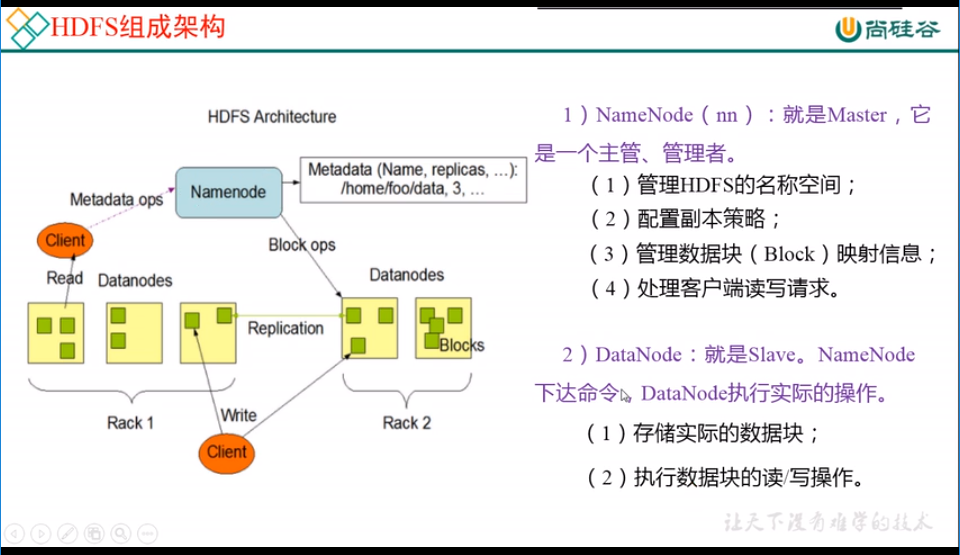

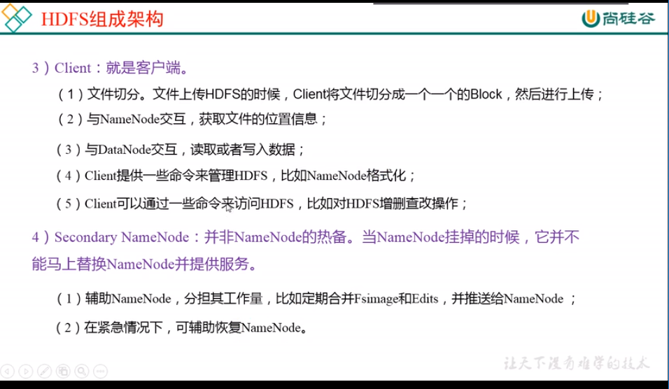

### 1.4 HDFS文件块大小（面试重点）

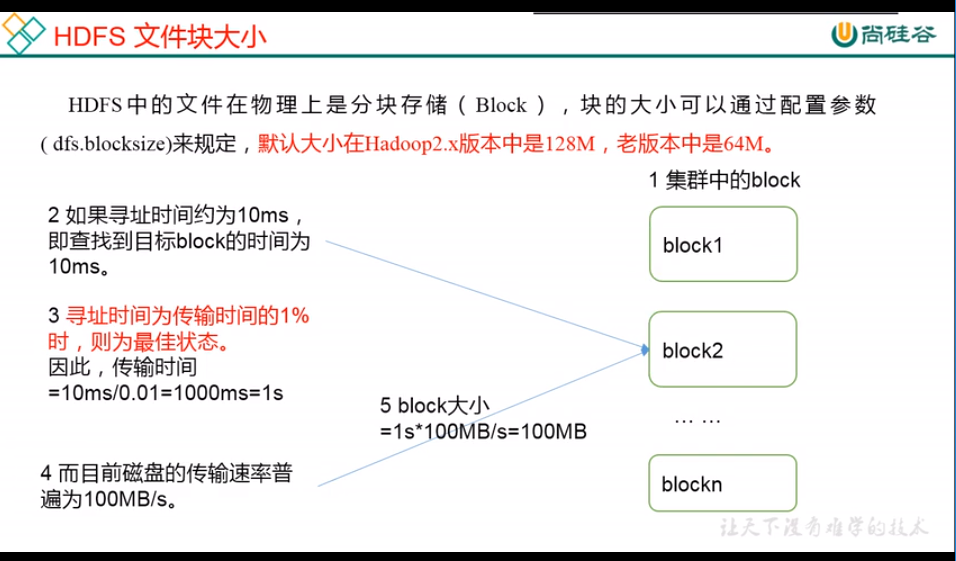

<font color=red>**思考：为什么块的大小不能设置太小，也不能设置太大？**</font>

1. 块太小，**会增加寻址时间**，程序一直在找块的开始位置；
2. 块太大，从**磁盘传输数据的时间**会明显大于**定位这个块开始位置所需的时间**。导致程序在处理这块数据时，会非常慢。

**HDFS块的大小设置主要取决于磁盘传输速率。**

## 2. HDFS的shell操作（开发重点）

### 2.1 基本语法

```shell
bin/hadoop fs 具体命令
#或
bin/hdfs dfs 具体命令
```


### 2.2 命令大全

```shell
[atguigu@hadoop102 subdir0]$ hdfs dfs
Usage: hadoop fs [generic options]
	[-appendToFile <localsrc> ... <dst>]
	[-cat [-ignoreCrc] <src> ...]
	[-checksum <src> ...]
	[-chgrp [-R] GROUP PATH...]
	[-chmod [-R] <MODE[,MODE]... | OCTALMODE> PATH...]
	[-chown [-R] [OWNER][:[GROUP]] PATH...]
	[-copyFromLocal [-f] [-p] [-l] <localsrc> ... <dst>]
	[-copyToLocal [-p] [-ignoreCrc] [-crc] <src> ... <localdst>]
	[-count [-q] [-h] <path> ...]
	[-cp [-f] [-p | -p[topax]] <src> ... <dst>]
	[-createSnapshot <snapshotDir> [<snapshotName>]]
	[-deleteSnapshot <snapshotDir> <snapshotName>]
	[-df [-h] [<path> ...]]
	[-du [-s] [-h] <path> ...]
	[-expunge]
	[-find <path> ... <expression> ...]
	[-get [-p] [-ignoreCrc] [-crc] <src> ... <localdst>]
	[-getfacl [-R] <path>]
	[-getfattr [-R] {-n name | -d} [-e en] <path>]
	[-getmerge [-nl] <src> <localdst>]
	[-help [cmd ...]]
	[-ls [-d] [-h] [-R] [<path> ...]]
	[-mkdir [-p] <path> ...]
	[-moveFromLocal <localsrc> ... <dst>]
	[-moveToLocal <src> <localdst>]
	[-mv <src> ... <dst>]
	[-put [-f] [-p] [-l] <localsrc> ... <dst>]
	[-renameSnapshot <snapshotDir> <oldName> <newName>]
	[-rm [-f] [-r|-R] [-skipTrash] <src> ...]
	[-rmdir [--ignore-fail-on-non-empty] <dir> ...]
	[-setfacl [-R] [{-b|-k} {-m|-x <acl_spec>} <path>]|[--set <acl_spec> <path>]]
	[-setfattr {-n name [-v value] | -x name} <path>]
	[-setrep [-R] [-w] <rep> <path> ...]
	[-stat [format] <path> ...]
	[-tail [-f] <file>]
	[-test -[defsz] <path>]
	[-text [-ignoreCrc] <src> ...]
	[-touchz <path> ...]
	[-truncate [-w] <length> <path> ...]
	[-usage [cmd ...]]

Generic options supported are
-conf <configuration file>     specify an application configuration file
-D <property=value>            use value for given property
-fs <local|namenode:port>      specify a namenode
-jt <local|resourcemanager:port>    specify a ResourceManager
-files <comma separated list of files>    specify comma separated files to be copied to the map reduce cluster
-libjars <comma separated list of jars>    specify comma separated jar files to include in the classpath.
-archives <comma separated list of archives>    specify comma separated archives to be unarchived on the compute machines.

The general command line syntax is
bin/hadoop command [genericOptions] [commandOptions]
```

### 2.3 常用命令实操

```shell
[atguigu@hadoop102 subdir0]$ hadoop fs -help rm
-rm [-f] [-r|-R] [-skipTrash] <src> ... :
  Delete all files that match the specified file pattern. Equivalent to the Unix
  command "rm <src>"
                                                                                 
  -skipTrash  option bypasses trash, if enabled, and immediately deletes <src>   
  -f          If the file does not exist, do not display a diagnostic message or 
              modify the exit status to reflect an error.                        
  -[rR]       Recursively deletes directories 


hadoop fs -ls /
hadoop fs -lsr /
hadoop fs -mkdir -P /sanguo/shuguo/
# 会删除本地的文件
hadoop fs -moveFromLocal ./panjinlian.txt /sanguo/shuguo/
hadoop fs -appendToFile ./liubei.txt /sanguo/shuguo/panjinlian.txt
hadoop fs -cat /sanguo/shuguo/panjinlian.txt
hadoop fs -chgrp atguigu /sanguo/shuguo/panjinlian.txt
hadoop fs -chmod 644 /sanguo/shuguo/panjinlian.txt
hadoop fs -chown root /sanguo/shuguo/panjinlian.txt
hadoop fs -copyFromLocal ./ximenqing.txt /sanguo/shuguo/
hadoop fs -copyToLocal /sanguo/shuguo/panjinlian.txt ./
hadoop fs -cp /sanguo/shuguo/panjinlian.txt /sanguo/
hadoop fs -mv /sanguo/panjinlian.txt /
# 等同于-copyToLocal
hadoop fs -get /panjinlian.txt ./
# 合并下载多个文件（内容合并），如某目录下的所有文件
hadoop fs -getmerge /sanguo/shuguo/* ./zaiyiqi.txt
# 等同于 -copyFromLocal
hadoop fs -put ./zaiyiqi.txt /sanguo/
hadoop fs -tail /sanguo/zaiyiqi.txt
hadoop fs -rm -r /sanguo/zaiyiqi.txt
# 删除空文件夹
hadoop fs -rmdir /test
hadoop fs -du -h /
hadoop fs -du -h -s /
# 设置某文件的副本数量
hadoop fs -setrep 2 /panjinlian.txt
hadoop fs -count -q -v -h /
# 其他
```


## 3. HDFS客户端操作（开发重点）

### 3.1 HDFS客户端环境准备

1. 根据自己电脑的操作系统拷贝对应的编译后的hadoop的jar包到非中文路径。

   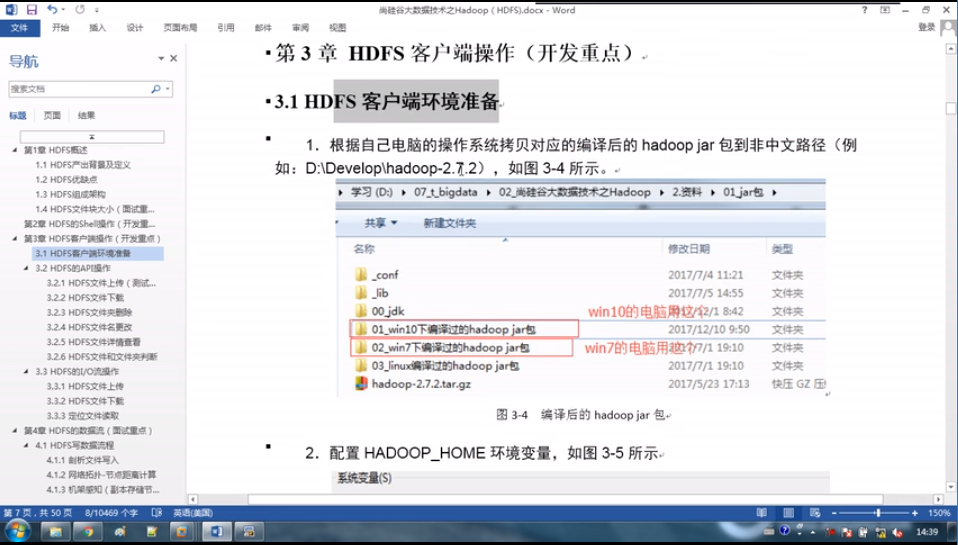

2. 配置HADOOP_HOME环境变量

   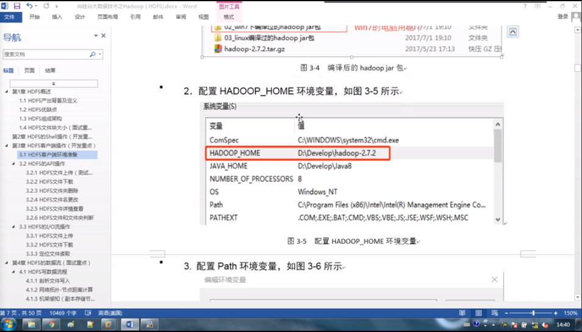

3. 配置Path环境变量

   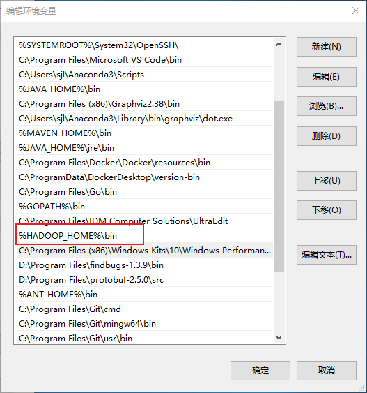

4. 创建一个Maven工程HdfsClientDemo

5. 导入相应的依赖坐标+日志添加


我们这一步的目的是在windows中连接HDFS，并进行操作。在运行咱的java代码前，需要保证：

1. 启动这三个虚拟机

2. jps查看每个节点上的服务是否都启动了

3. ifconfig查看每个节点的ip对不对

   首先可以看到hadoop102这个节点上的服务都已经启动了。

   可以看到在将虚拟机挂起，恢复后，虚拟机的ip变了，通过`sudo systemctl retart network`重启网络服务。

   ```shell
   [atguigu@hadoop102 ~]$ jps
   14928 Jps
   8081 NameNode
   8227 DataNode
   8539 NodeManager
   [atguigu@hadoop102 ~]$ ifconfig
   br-9f19cd8b27c1: flags=4099<UP,BROADCAST,MULTICAST>  mtu 1500
           ether 02:42:5b:cd:ac:9a  txqueuelen 0  (Ethernet)
           RX packets 0  bytes 0 (0.0 B)
           RX errors 0  dropped 0  overruns 0  frame 0
           TX packets 0  bytes 0 (0.0 B)
           TX errors 0  dropped 0 overruns 0  carrier 0  collisions 0
   
   docker0: flags=4099<UP,BROADCAST,MULTICAST>  mtu 1500
           inet 172.17.0.1  netmask 255.255.0.0  broadcast 172.17.255.255
           ether 02:42:31:7a:b6:b8  txqueuelen 0  (Ethernet)
           RX packets 0  bytes 0 (0.0 B)
           RX errors 0  dropped 0  overruns 0  frame 0
           TX packets 0  bytes 0 (0.0 B)
           TX errors 0  dropped 0 overruns 0  carrier 0  collisions 0
   
   docker_gwbridge: flags=4099<UP,BROADCAST,MULTICAST>  mtu 1500
           ether 02:42:d2:aa:9a:d5  txqueuelen 0  (Ethernet)
           RX packets 262659  bytes 252065695 (240.3 MiB)
           RX errors 0  dropped 0  overruns 0  frame 0
           TX packets 246923  bytes 249309128 (237.7 MiB)
           TX errors 0  dropped 0 overruns 0  carrier 0  collisions 0
   
   ens33: flags=4163<UP,BROADCAST,RUNNING,MULTICAST>  mtu 1500
           inet 192.168.1.37  netmask 255.255.255.0  broadcast 192.168.1.255
           inet6 fe80::723d:e330:f72b:acf3  prefixlen 64  scopeid 0x20<link>
           ether 00:0c:29:d3:23:e4  txqueuelen 1000  (Ethernet)
           RX packets 262659  bytes 252065695 (240.3 MiB)
           RX errors 0  dropped 0  overruns 0  frame 0
           TX packets 246923  bytes 249309128 (237.7 MiB)
           TX errors 0  dropped 0 overruns 0  carrier 0  collisions 0
   
   lo: flags=73<UP,LOOPBACK,RUNNING>  mtu 65536
           inet 127.0.0.1  netmask 255.0.0.0
           inet6 ::1  prefixlen 128  scopeid 0x10<host>
           loop  txqueuelen 1000  (Local Loopback)
           RX packets 32598  bytes 5999482 (5.7 MiB)
           RX errors 0  dropped 0  overruns 0  frame 0
           TX packets 32598  bytes 5999482 (5.7 MiB)
           TX errors 0  dropped 0 overruns 0  carrier 0  collisions 0
   
   virbr0: flags=4099<UP,BROADCAST,MULTICAST>  mtu 1500
           ether 52:54:00:14:1b:9b  txqueuelen 1000  (Ethernet)
           RX packets 0  bytes 0 (0.0 B)
           RX errors 0  dropped 0  overruns 0  frame 0
           TX packets 0  bytes 0 (0.0 B)
           TX errors 0  dropped 0 overruns 0  carrier 0  collisions 0
   
   ```

   hadoop103，hadoop104节点也是如此。

   通过创建一个文件夹来测试下是否可以直接操作HDFS了。

   在测试时，发现使用sjl用户没有wirte权限。

   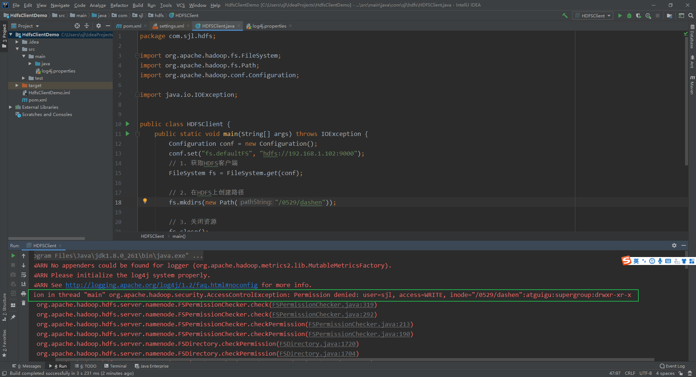

在FileSystem.get()的时候使用另外一个签名的方法，这个方法可以指定用户名。可以发现的是目前hadoop中没有认证机制。

通过在`http://192.168.1.102:50070/explorer.html#/0529`查看，可以发现已经创建成功了。

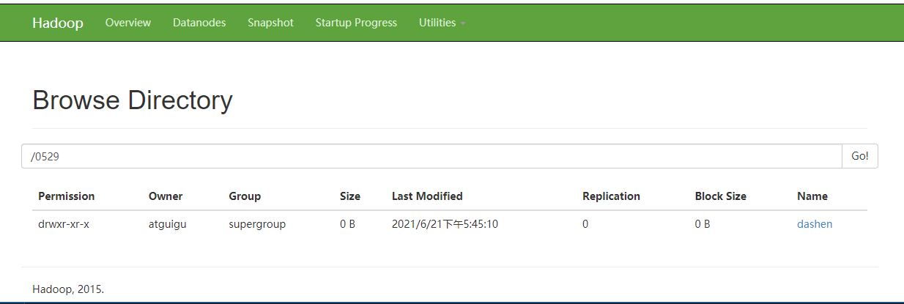


intellij相关问题

intellij 如何自动导入

intellij如何创建一个maven项目

intellij配置maven仓库

intellij运行单元测试中的某一个函数

如何下载hadoop-2.7.2有注释版本

intellij常用的快捷键


### 3.2 HDFS的API操作

项目结构如下图红框中所示。这是创建的一个intellij的Maven项目。

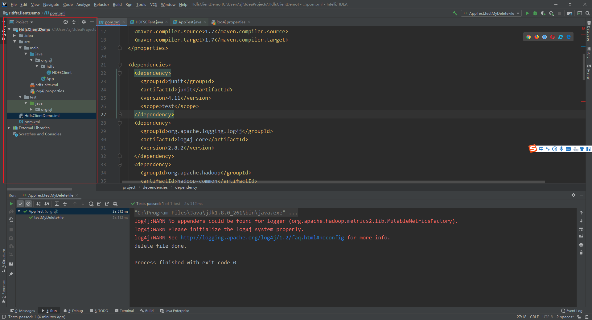

#### 3.2.1 HDFS文件上传（测试参数优先级）

```java
package org.sjl.hdfs;
/*省略部分内容哈
 *
 *
 */
public class HDFSClient {   
// 1. 文件上传
    public void myCopyFromLocalFile() throws IOException, URISyntaxException, InterruptedException {
        // 1. 获取fs对象
        Configuration conf = new Configuration();
        conf.set("dfs.defaultFS", "2");
        FileSystem fs = FileSystem.get(new URI("hdfs://192.168.1.102:9000"), conf, "atguigu");

        // 2. 执行上传API
        fs.copyFromLocalFile(new Path("d:/banzhang.txt"), new Path("/banhua.txt"));

        // 3. 关闭资源
        fs.close();    
        System.out.println("test my conpyFromLocalFile method");
    }
}
```

参数优先级，就是最近原则，离代码越近，优先级越高，这没啥好说的。

#### 3.2.2 HDFS文件下载

#### 

```java
package org.sjl.hdfs;
/*省略部分内容哈
 *
 *
 */
public class HDFSClient {   
    // 2. 文件下载
    public void myCopyToLocalFile() throws IOException, URISyntaxException, InterruptedException {
        // 1. 获取fs对象
        Configuration conf = new Configuration();
        FileSystem fs = FileSystem.get(new URI("hdfs://192.168.1.102:9000"), conf, "atguigu");
        // 2. 调用下载API
//        fs.copyToLocalFile(new Path("/banhua.txt"), new Path("d:/download-banhua.txt"));
        fs.copyToLocalFile(true, new Path("/banhua.txt"), new Path("d:/download-banhua.txt"), false);

        // 3. 关闭资源
        fs.close();
        System.out.println("download banhua.txt success.");
    }
}
```


#### 3.2.3 HDFS文件夹删除

#### 

```java
package org.sjl.hdfs;
/*省略部分内容哈
 *
 *
 */
public class HDFSClient {   
    // 3. hdfs文件/文件夹的删除
    public void myDelete() throws IOException, URISyntaxException, InterruptedException {
        // 1. 获取fs对象
        Configuration conf = new Configuration();
        FileSystem fs = FileSystem.get(new URI("hdfs://192.168.1.102:9000"), conf, "atguigu");
        // 2. 调用删除的API
        fs.delete(new Path("/banhua.txt"), true);
        // 3. 关闭资源
        fs.close();
        System.out.println("delete file done.");
    }
}
```


#### 3.2.4 HDFS文件名更改

#### 

```java
package org.sjl.hdfs;
/*省略部分内容哈
 *
 *
 */
public class HDFSClient {   
    // 4. hdfs文件改名
    public void myRename() throws IOException, URISyntaxException, InterruptedException {
        // 1. 获取fs对象
        Configuration conf = new Configuration();
        FileSystem fs = FileSystem.get(new URI("hafs://192.168.1.102:9000"), conf, "atguigu");

        // 2. 调用API
        fs.rename(new Path("/banzhang.txt"), new Path("/yanjing.txt"));

        // 3. 关闭资源
        fs.close();
        System.out.println("Change file Name Done.");
    }
}
```


#### 3.2.5 HDFS文件详情查看

查看文件名称、权限、长度、块信息。

```java
package org.sjl.hdfs;
/*省略部分内容哈
 *
 *
 */
public class HDFSClient {   
    // 5. hdfs文件详情查看
    public void myListFiles() throws URISyntaxException, IOException, InterruptedException {
        // 1. 获取fs对象
        Configuration conf = new Configuration();
        FileSystem fs = FileSystem.get(new URI("hdfs://192.168.1.102:9000"), conf, "atguigu");
        // 2. 调用API
        RemoteIterator<LocatedFileStatus> listFiles = fs.listFiles(new Path("/"), true);

        while (listFiles.hasNext()) {
            LocatedFileStatus fileStatus = listFiles.next();
            // 查看文件名称、权限、长度、块信息
            System.out.println(fileStatus.getPath().getName());
            System.out.println(fileStatus.getPermission());
            System.out.println(fileStatus.getLen());

            BlockLocation[] blockLocations = fileStatus.getBlockLocations();
            for (BlockLocation blockLocation: blockLocations
                 ) {
                String[] hosts = blockLocation.getHosts();
                for (String host: hosts
                     ) {
                    System.out.println(host);
                }
            }
            System.out.println("-----------------");

        }
        // 3. 关闭资源
        fs.close();
    }
}
```


#### 3.2.6 HDFS文件和文件夹判断

#### 

```java
package org.sjl.hdfs;
/*省略部分内容哈
 *
 *
 */
public class HDFSClient {   
    // 6. 判断路径是文件还是文件夹
    public void myListStatus() throws URISyntaxException, IOException, InterruptedException {
        // 1. 获取fs对象
        Configuration conf = new Configuration();
        FileSystem fs = FileSystem.get(new URI("hdfs://192.168.1.102:9000"), conf, "atguigu");
        // 2. 调用API
        FileStatus[] listStatus = fs.listStatus(new Path("/"));

        for (FileStatus fileStatus : listStatus) {

            // 如果是文件
            if (fileStatus.isFile()) {
                System.out.println("f:"+fileStatus.getPath().getName());
            }else {
                System.out.println("d:"+fileStatus.getPath().getName());
            }
        }

        // 3. 关闭资源
        fs.close();
    }

}
```


在`C:\Users\sjl\IdeaProjects\HdfsClientDemo\src\test\java\org\sjl\AppTest.java`中调用之前定义的这些方法。

```java
package org.sjl;

import org.sjl.hdfs.HDFSClient;
import org.junit.Test;

import java.io.IOException;
import java.net.URISyntaxException;

import static org.junit.Assert.assertTrue;

/**
 * Unit test for simple App.
 */
public class AppTest 
{
    /**
     * Rigorous Test :-)
     */
    @Test
    public void shouldAnswerWithTrue()
    {
        assertTrue( true );
    }

    @Test
    public void testMyCopyFromLocalFile() throws IOException, URISyntaxException, InterruptedException {
        HDFSClient hdfsclient = new HDFSClient();
        hdfsclient.myCopyFromLocalFile();
    }

    @Test
    public void testMyCopyToLocalFile() throws InterruptedException, IOException, URISyntaxException {
        HDFSClient hdfsClient = new HDFSClient();
        hdfsClient.myCopyToLocalFile();
    }

    @Test
    public void testMyDeleteFile() throws InterruptedException, IOException, URISyntaxException {
        HDFSClient hdfsClient = new HDFSClient();
        hdfsClient.myDelete();
    }

    @Test
    public void testMyRename() throws InterruptedException, IOException, URISyntaxException {
        HDFSClient hdfsClient = new HDFSClient();
        hdfsClient.myRename();
    }
    
    @Test
    public void testMyListFiles() throws InterruptedException, IOException, URISyntaxException {
        HDFSClient hdfsClient = new HDFSClient();
        hdfsClient.myListFiles();
    }

    @Test
    public void testMyListStatus() throws InterruptedException, IOException, URISyntaxException {
        HDFSClient hdfsClient = new HDFSClient();
        hdfsClient.myListStatus();
    }
}

```


### 3.3 HDFS的I/O流操作

上面我们学的API操作HDFS系统都是框架封装好的。那么如果我们想自己实现上述API的操作该怎么实现呢？

我们可以采用IO流的方式实现数据的上传和下载。

#### 3.3.1 HDFS文件上传

1. 需求：把D盘下的download-banhua.txt上传到HDFS根目录。

2. 编写代码

   ```java
   public class HDFSIO {
       /*
       通过IO流上传文件到HDFS
        */
       public void putFileToHDFS() throws IOException, InterruptedException, URISyntaxException {
           // 1. 获取fs对象
           Configuration conf = new Configuration();
           URI uri = new URI("hdfs://192.168.1.102:9000");
           FileSystem fs = FileSystem.get(uri, conf, "atguigu");
   
           // 2. 获取输入流
           FileInputStream fis = new FileInputStream(new File("d:/banzhang.txt"));
           // 3. 获取输出流
           FSDataOutputStream fos = fs.create(new Path("/banhua.txt"));
   
           // 4. 流的对拷
           IOUtils.copyBytes(fis, fos, conf);
   
           // 5. 关闭资源
           IOUtils.closeStream(fos);
           IOUtils.closeStream(fis);
           fs.close();
   
           System.out.println("put file to HDFS by myself method.");
   
       }
   }
   ```

   读文件：输入流

   写文件：输出流

3. 验证

#### 3.3.2 HDFS文件下载

1. 需求：从HDFS上下载banhua.txt到本地

2. 编写代码

   ```java
      /*
       通过IO流下载/banhua.txt到本地
        */
       public void getFileFromHDFS() throws URISyntaxException, IOException, InterruptedException {
           // 1. 获取fs对象
           Configuration conf = new Configuration();
           URI uri = new URI("hdfs://192.168.1.102:9000");
           FileSystem fs = FileSystem.get(uri, conf, "atguigu");
   
           // 2. 获取输入流
           FSDataInputStream fis = fs.open(new Path("/banhua.txt"));
           // 3. 获取输出流
           FileOutputStream fos = new FileOutputStream(new File("d:/banhua.txt"));
   
           // 4. 流的对拷
           IOUtils.copyBytes(fis, fos, conf);
   
           // 5. 关闭资源
           IOUtils.closeStream(fos);
           IOUtils.closeStream(fis);
           fs.close();
           System.out.println("get file from HDFS by myself method.");
       }
   ```

   

3. 验证

#### 3.3.3 定位文件读取

1. 需求：分块读取HDFS上的大文件，如根目录下的hadoop-2.7.2.tar.gz

2. 编写代码

   ```java
      /*
       下载第一块
        */
       public void readFileSeek1() throws IOException, InterruptedException, URISyntaxException {
           // 1. 获取fs对象
           Configuration conf = new Configuration();
           URI uri = new URI("hdfs://192.168.1.102:9000");
           FileSystem fs = FileSystem.get(uri, conf, "atguigu");
   
           // 2. 获取输入流
           FSDataInputStream fis = fs.open(new Path("/hadoop-2.7.2.tar.gz"));
   
           // 3. 获取输出流
           FileOutputStream fos = new FileOutputStream(new File("d:/hadoop-2.7.2.tar.gz.part1"));
   
           // 4. 流的对拷（只拷贝第一个block，即128M）
           byte[] buf = new byte[1024];
           for (int i = 0; i < 1024 * 128; i++) {
               fis.read(buf);
               fos.write(buf);
           }
           // 5. 关闭资源
           IOUtils.closeStream(fos);
           IOUtils.closeStream(fis);
           fs.close();
           System.out.println("get 1 block by myself method.");
       }
   
       /*
       下载第二块
        */
       public void readFileSeek2() throws IOException, URISyntaxException, InterruptedException {
           // 1. 获取fs对象
           Configuration conf = new Configuration();
           FileSystem fs = FileSystem.get(new URI("hdfs://192.168.1.102:9000"), conf, "atguigu");
   
           // 2. 获取输入流
           FSDataInputStream fis = fs.open(new Path("/hadoop-2.7.2.tar.gz"));
           // 3. 设置指定的读取点
           fis.seek(1024 * 1024 * 128);
   
           // 4. 获取输出流
           FileOutputStream fos = new FileOutputStream(new File("d:/hadoop-2.7.2.tar.gz.part2"));
   
           // 5. 流的对拷
           IOUtils.copyBytes(fis, fos, conf);
   
           // 6. 关闭资源
           IOUtils.closeStream(fos);
           IOUtils.closeStream(fis);
           fs.close();
       }
   ```

   

3. 验证

   把第二个block的内容拼接到第一个block的内容，查看是否是完成的`hadoop-2.7.2.tar.gz`。

   ```cmd
   type hadoop-2.7.2.tar.gz.part2 >> hadoop-2.7.2.tar.gz.part1
   ```

   牛啊！！！

## 4. HDFS的数据流（面试重点）

### 4.1 HDFS写数据流程


#### 4.1.1 剖析文件写入

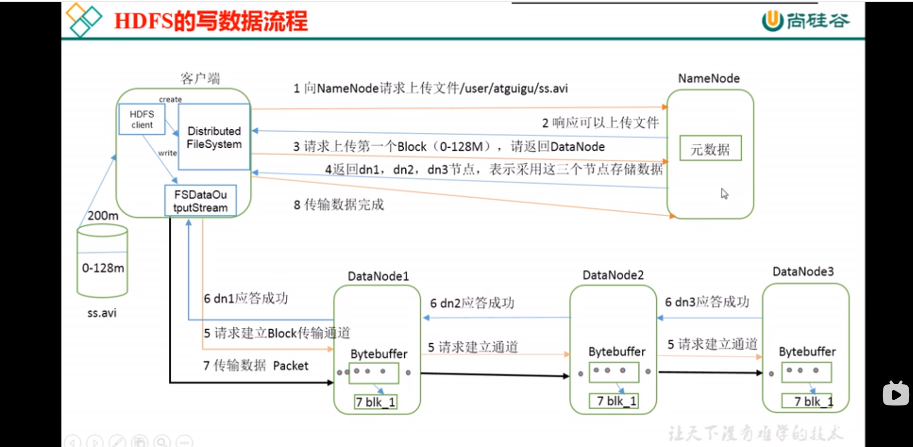

#### 4.1.2 网络拓扑-节点距离计算

为什么是2，4，6呢？

n0到r1是1，

r1到d1是1，

n1到r1是1，

n0到n1 == n0到r1 + n1到r1，即2，其他也是类似。

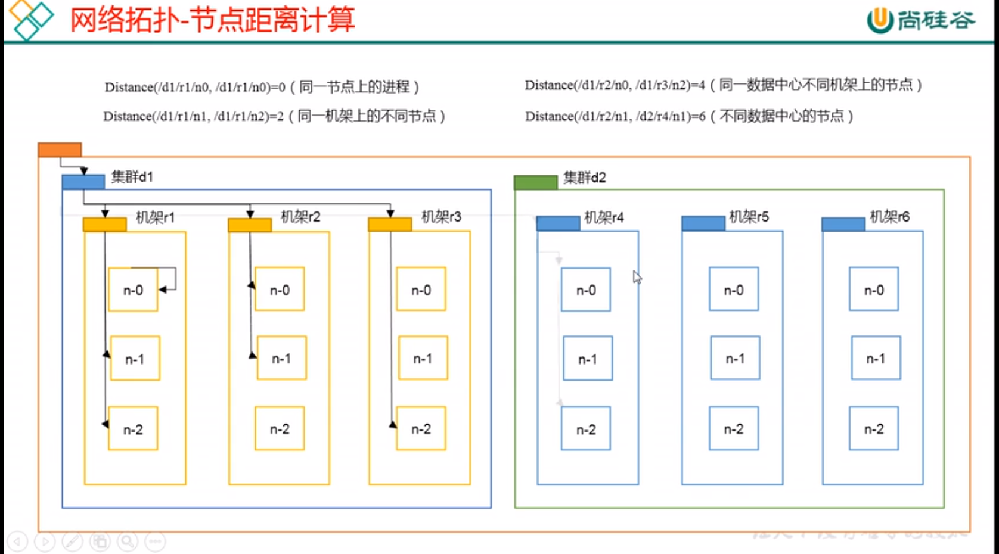

#### 4.1.3 机架感知（副本存储节点选择）

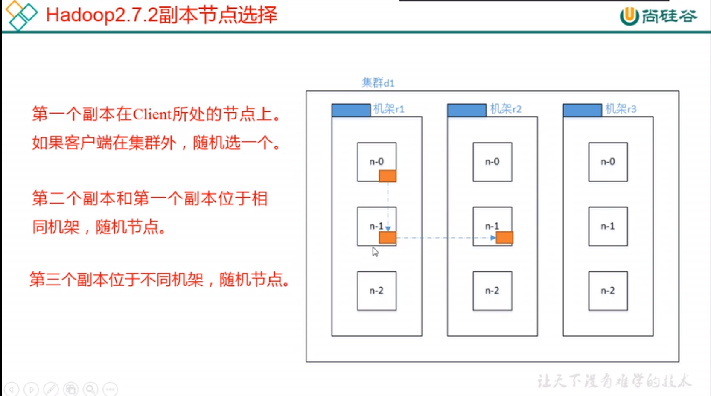

### 4.2 HDFS读数据流程

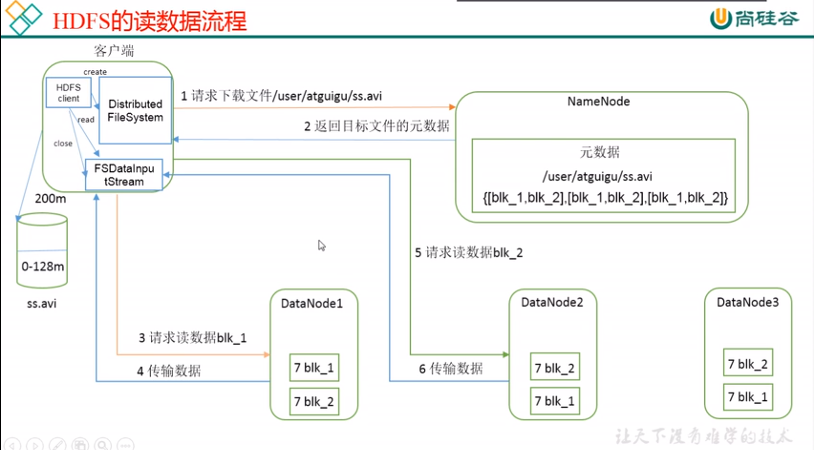

## 5. NameNode和SecondaryNameNode

### 5.1 NN和2NN工作机制

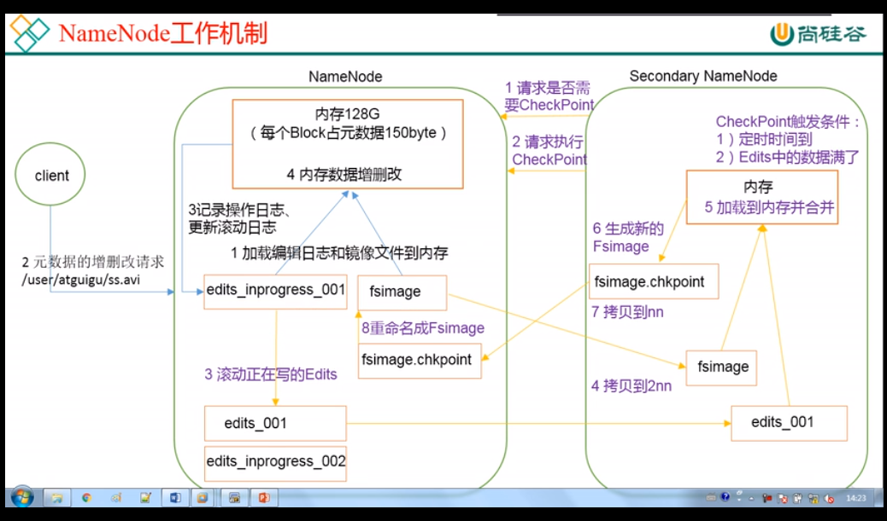

fsimage + edits == NN内存中的元数据

### 5.2 Fsimage和Edits解析

```shell
[atguigu@hadoop102 dfs]$ hdfs --help
Usage: hdfs [--config confdir] [--loglevel loglevel] COMMAND
       where COMMAND is one of:
  dfs                  run a filesystem command on the file systems supported in Hadoop.
  classpath            prints the classpath
  namenode -format     format the DFS filesystem
  secondarynamenode    run the DFS secondary namenode
  namenode             run the DFS namenode
  journalnode          run the DFS journalnode
  zkfc                 run the ZK Failover Controller daemon
  datanode             run a DFS datanode
  dfsadmin             run a DFS admin client
  haadmin              run a DFS HA admin client
  fsck                 run a DFS filesystem checking utility
  balancer             run a cluster balancing utility
  jmxget               get JMX exported values from NameNode or DataNode.
  mover                run a utility to move block replicas across
                       storage types
  oiv                  apply the offline fsimage viewer to an fsimage
  oiv_legacy           apply the offline fsimage viewer to an legacy fsimage
  oev                  apply the offline edits viewer to an edits file
  fetchdt              fetch a delegation token from the NameNode
  getconf              get config values from configuration
  groups               get the groups which users belong to
  snapshotDiff         diff two snapshots of a directory or diff the
                       current directory contents with a snapshot
  lsSnapshottableDir   list all snapshottable dirs owned by the current user
						Use -help to see options
  portmap              run a portmap service
  nfs3                 run an NFS version 3 gateway
  cacheadmin           configure the HDFS cache
  crypto               configure HDFS encryption zones
  storagepolicies      list/get/set block storage policies
  version              print the version

Most commands print help when invoked w/o parameters.

# 查看fsimage
[atguigu@hadoop102 hadoop-2.7.2]$ hdfs oiv -p XML -i data/tmp/dfs/name/current/fsimage_0000000000000000343 -o fs.xml
[atguigu@hadoop102 hadoop-2.7.2]$ ll
total 40
drwxr-xr-x. 2 atguigu atguigu   194 Jan 26  2016 bin
drwxrwxr-x. 3 atguigu atguigu    17 Jun 15 14:39 data
drwxr-xr-x. 3 atguigu atguigu    20 Jan 26  2016 etc
-rw-rw-r--. 1 atguigu atguigu  6875 Jun 28 19:17 fs.xml
drwxr-xr-x. 2 atguigu atguigu   106 Jan 26  2016 include
drwxr-xr-x. 3 atguigu atguigu    20 Jan 26  2016 lib
drwxr-xr-x. 2 atguigu atguigu   239 Jan 26  2016 libexec
-rw-r--r--. 1 atguigu atguigu 15429 Jan 26  2016 LICENSE.txt
drwxrwxr-x. 3 atguigu atguigu  4096 Jun 15 16:44 logs
-rw-r--r--. 1 atguigu atguigu   101 Jan 26  2016 NOTICE.txt
-rw-r--r--. 1 atguigu atguigu  1366 Jan 26  2016 README.txt
drwxr-xr-x. 2 atguigu atguigu  4096 Jan 26  2016 sbin
drwxr-xr-x. 4 atguigu atguigu    31 Jan 26  2016 share
[atguigu@hadoop102 hadoop-2.7.2]$ 


# 查看edits
[atguigu@hadoop102 hadoop-2.7.2]$ hdfs oev -p XML -i data/tmp/dfs/name/current/edits_0000000000000000106-0000000000000000107 -o e.xml
[atguigu@hadoop102 hadoop-2.7.2]$ ll
total 44
drwxr-xr-x. 2 atguigu atguigu   194 Jan 26  2016 bin
drwxrwxr-x. 3 atguigu atguigu    17 Jun 15 14:39 data
drwxr-xr-x. 3 atguigu atguigu    20 Jan 26  2016 etc
-rw-rw-r--. 1 atguigu atguigu   313 Jun 28 19:18 e.xml
-rw-rw-r--. 1 atguigu atguigu  6875 Jun 28 19:17 fs.xml
drwxr-xr-x. 2 atguigu atguigu   106 Jan 26  2016 include
drwxr-xr-x. 3 atguigu atguigu    20 Jan 26  2016 lib
drwxr-xr-x. 2 atguigu atguigu   239 Jan 26  2016 libexec
-rw-r--r--. 1 atguigu atguigu 15429 Jan 26  2016 LICENSE.txt
drwxrwxr-x. 3 atguigu atguigu  4096 Jun 15 16:44 logs
-rw-r--r--. 1 atguigu atguigu   101 Jan 26  2016 NOTICE.txt
-rw-r--r--. 1 atguigu atguigu  1366 Jan 26  2016 README.txt
drwxr-xr-x. 2 atguigu atguigu  4096 Jan 26  2016 sbin
drwxr-xr-x. 4 atguigu atguigu    31 Jan 26  2016 share

```

**NN和2NN工作机制详解：**

Fsimage：NameNode内存中元数据序列化后形成的文件。

Edits：记录客户端更新元数据信息的每一步操作（可通过Edits运算出元数据）。

NameNode启动时，先滚动Edits并生成一个空的edits.inprogress，然后加载Edits和Fsimage到内存中，此时NameNode内存就持有最新的元数据信息。Client开始对NameNode发送元数据的增删改的请求，这些请求的操作首先会被记录到edits.inprogress中（查询元数据的操作不会被记录在Edits中，因为查询操作不会更改元数据信息），如果此时NameNode挂掉，重启后会从Edits中读取元数据的信息。然后，NameNode会在内存中执行元数据的增删改的操作。

由于Edits中记录的操作会越来越多，Edits文件会越来越大，导致NameNode在启动加载Edits时会很慢，所以需要对Edits和Fsimage进行合并（所谓合并，就是将Edits和Fsimage加载到内存中，照着Edits中的操作一步步执行，最终形成新的Fsimage）。SecondaryNameNode的作用就是帮助NameNode进行Edits和Fsimage的合并工作。

SecondaryNameNode首先会询问NameNode是否需要CheckPoint（触发CheckPoint需要满足两个条件中的任意一个，定时时间到和Edits中数据写满了）。直接带回NameNode是否检查结果。SecondaryNameNode执行CheckPoint操作，首先会让NameNode滚动Edits并生成一个空的edits.inprogress，滚动Edits的目的是给Edits打个标记，以后所有新的操作都写入edits.inprogress，其他未合并的Edits和Fsimage会拷贝到SecondaryNameNode的本地，然后将拷贝的Edits和Fsimage加载到内存中进行合并，生成fsimage.chkpoint，然后将fsimage.chkpoint拷贝给NameNode，重命名为Fsimage后替换掉原来的Fsimage。NameNode在启动时就只需要加载之前未合并的Edits和Fsimage即可，因为合并过的Edits中的元数据信息已经被记录在Fsimage中。


**思考：可以看出，Fsimage中没有记录块所对应DataNode，为什么？**

在集群启动后，要求DataNode上报数据块信息，并间隔一段时间后再次上报。

**思考：NameNode如何确定下次开机启动的时候合并哪些Edits？**

seen_txid记录了当前是哪个edit，合并当前fsimage和当前edits。

### 5.3 CheckPoint时间设置

（1）通常情况下，SecondaryNameNode每隔一小时执行一次。`[hdfs-default.xml]`

```xml
<property>

 <name>dfs.namenode.checkpoint.period</name>

 <value>3600</value>

</property>
```

（2）一分钟检查一次操作次数，3当操作次数达到1百万时，SecondaryNameNode执行一次。

```xml
<property>

 <name>dfs.namenode.checkpoint.txns</name>

 <value>1000000</value>

<description>操作动作次数</description>

</property>

 

<property>

 <name>dfs.namenode.checkpoint.check.period</name>

 <value>60</value>

<description> 1分钟检查一次操作次数</description>

</property >
```

### 5.4 NameNode故障处理

NameNode故障后，可以采用如下两种方法恢复数据。

方法一：将SecondaryNameNode中数据拷贝到NameNode存储数据的目录；

```shell
#1. kill -9 NameNode进程

#2. 删除NameNode存储的数据（/opt/module/hadoop-2.7.2/data/tmp/dfs/name）
[atguigu@hadoop102 hadoop-2.7.2]$ rm -rf /opt/module/hadoop-2.7.2/data/tmp/dfs/name/*

#3. 拷贝SecondaryNameNode中数据到原NameNode存储数据目录
[atguigu@hadoop102 dfs]$ scp -r atguigu@hadoop104:/opt/module/hadoop-2.7.2/data/tmp/dfs/namesecondary/* ./name/

#4. 重新启动NameNode
[atguigu@hadoop102 hadoop-2.7.2]$ sbin/hadoop-daemon.sh start namenode
```


方法二：使用**-importCheckpoint**选项启动**NameNode**守护进程，从而将**SecondaryNameNode**中数据拷贝到**NameNode**目录中。**

```shell
#1.  修改hdfs-site.xml中的
<property>
 <name>dfs.namenode.checkpoint.period</name>
 <value>120</value>
</property>

<property>
 <name>dfs.namenode.name.dir</name>
 <value>/opt/module/hadoop-2.7.2/data/tmp/dfs/name</value>
</property>

#2. kill -9 NameNode进程

#3.  删除NameNode存储的数据（/opt/module/hadoop-2.7.2/data/tmp/dfs/name）
[atguigu@hadoop102 hadoop-2.7.2]$ rm -rf /opt/module/hadoop-2.7.2/data/tmp/dfs/name/*

#4.  如果SecondaryNameNode不和NameNode在一个主机节点上，需要将SecondaryNameNode存储数据的目录拷贝到NameNode存储数据的平级目录，并删除in_use.lock文件
[atguigu@hadoop102 dfs]$ scp -r atguigu@hadoop104:/opt/module/hadoop-2.7.2/data/tmp/dfs/namesecondary ./

[atguigu@hadoop102 namesecondary]$ rm -rf in_use.lock

[atguigu@hadoop102 dfs]$ pwd

/opt/module/hadoop-2.7.2/data/tmp/dfs
 
[atguigu@hadoop102 dfs]$ ls
data name namesecondary

#5.  导入检查点数据（等待一会ctrl+c结束掉）
[atguigu@hadoop102 hadoop-2.7.2]$ bin/hdfs namenode -importCheckpoint

#6.  启动NameNode
[atguigu@hadoop102 hadoop-2.7.2]$ sbin/hadoop-daemon.sh start namenode
```

**思考：先删除了`/opt/module/hadoop-2.7.2/data/tmp/dfs/name`，会丢掉最新的`edit_inprogress`日志的吧**

的确是这样，所以需要NFS或QJM来共享edits日志。但目前并没有讲到这里。

### 5.5 集群安全模式

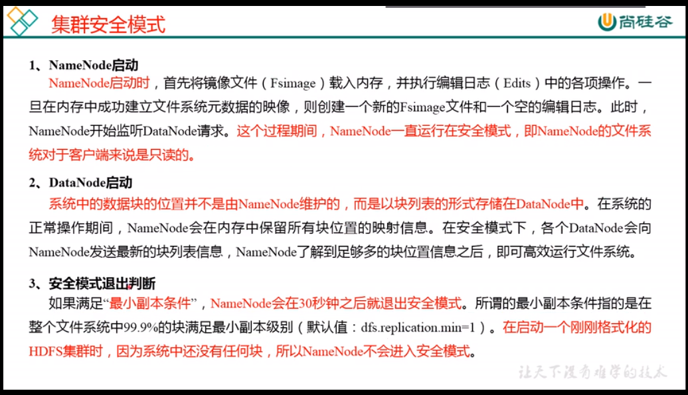

基本语法：

```shell
# 查看安全模式状态+
bin/hdfs dfsadmin -safemode get
# 进入安全模式
bin/hdfs dfsadmin -safemode enter
# 退出安全模式
bin/hdfs dfsadmin -safemode leave
# 等待安全模式状态
bin/hdfs dfsadmin -safemode wait
```


### 5.6 NameNode多目录设置

<font color=red>NameNode的本地目录可以配置成多个，且每个目录存放内容相同，增加了可靠性。</font>

具体配置如下

​    （1）在hdfs-site.xml文件中增加如下内容

```xml
<property>
  <name>dfs.namenode.name.dir</name>
<value>file:///${hadoop.tmp.dir}/dfs/name1,file:///${hadoop.tmp.dir}/dfs/name2</value>
</property>
```

（2）停止集群，删除data和logs中所有数据。

```shell
[atguigu@hadoop102 hadoop-2.7.2]$ rm -rf data/ logs/
[atguigu@hadoop103 hadoop-2.7.2]$ rm -rf data/ logs/
[atguigu@hadoop104 hadoop-2.7.2]$ rm -rf data/ logs/
```

（3）格式化集群并启动。

```shell
[atguigu@hadoop102 hadoop-2.7.2]$ bin/hdfs namenode –format
[atguigu@hadoop102 hadoop-2.7.2]$ sbin/start-dfs.sh
```

（4）查看结果

```shell
[atguigu@hadoop102 dfs]$ ll
总用量 12
drwx------. 3 atguigu atguigu 4096 12月 11 08:03 data
drwxrwxr-x. 3 atguigu atguigu 4096 12月 11 08:03 name1
drwxrwxr-x. 3 atguigu atguigu 4096 12月 11 08:03 name2
```


## 6. DataNode（面试开发重点）

### 6.1 DataNode工作机制

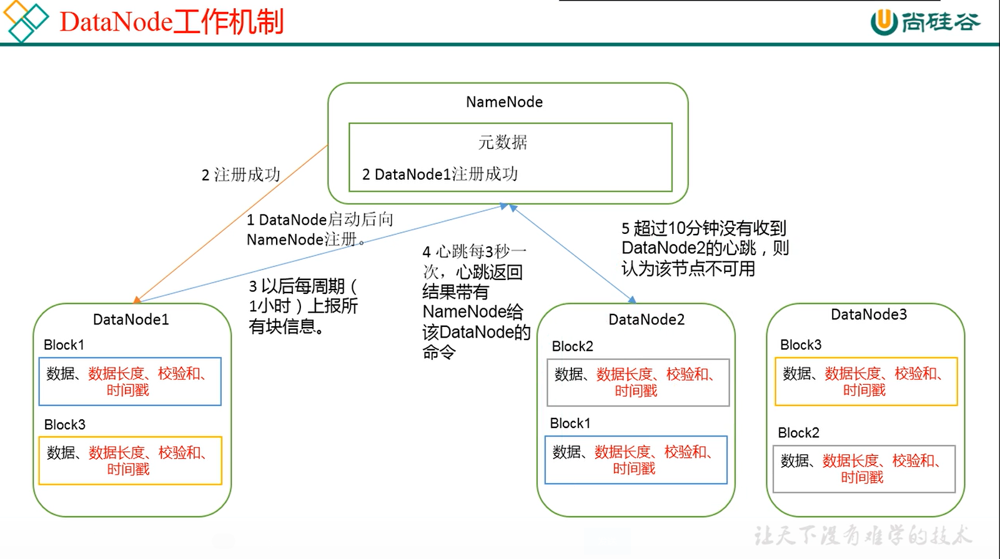

### 6.2 数据完整性

校验和checkSum

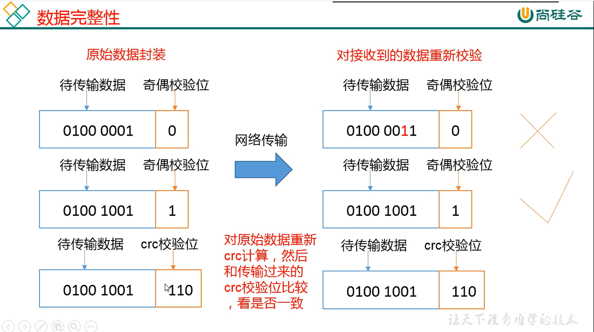

### 6.3 掉线时限参数设置

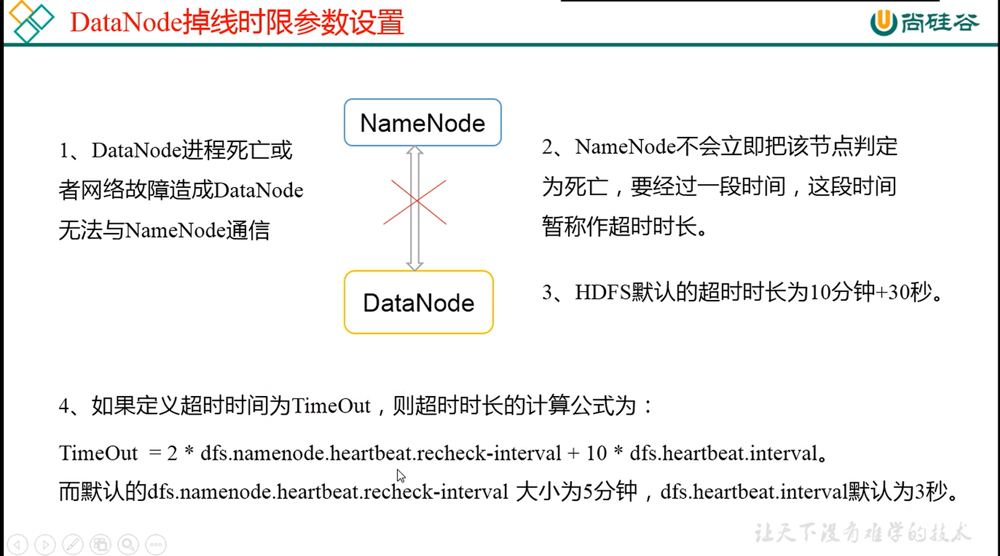

### 6.4 服役新数据节点

以VM Ware虚拟机为例：

1. 先克隆之前的Datanode服务器

2. vim /etc/sysconfig/network-scripts 修改服务器ip，网关等
3. vim /etc/sysconfig/network 修改服务器主机名
4. reboot 重启服务器
5. cd /opt/module/hadoop-2.7.2， rm -rf data/ logs/
6. sbin/hadoop-daemon.sh start datanode
7. jps 查看datanode进程是否启动
8. 浏览器打开http://192.168.1.102:50070/dfshealth.html#tab-datanode 查看datanode是否成功上线

### 6.5 退役旧数据节点

#### 6.5.1 添加白名单

添加白名单的主机节点，都允许访问NameNode，不在白名单的主机节点，都会被退出。配置白名单的步骤如下：

1. 在NameNode的/opt/module/hadoop-2.7.2/etc/hadoop 目录下创建`dfs.hosts`文件

   ```shell
   [atguigu@hadoop102 hadoop]$ pwd
   /opt/module/hadoop-2.7.2/etc/hadoop
   [atguigu@hadoop102 hadoop]$ touch dfs.hosts
   [atguigu@hadoop102 hadoop]$ vim dfs.hosts
   ```

   添加如下主机名称（<font color=red>_不添加hadoop105_</font>)，不能有空格，空行。

   ```shell
   hadoop102
   hadoop103
   hadoop104
   ```

   

2. 在NameNode的hdfs-site.xml配置文件中增加`dfs.hosts`属性

   ```shell
   <property>
   	<name>dfs.hosts</name>
   	<value>/opt/module/hadoop-2.7.2/etc/hadoop/dfs.hosts</value>
   </property>
   ```

3. 配置文件分发

   ```shell
   [atguigu@hadoop102 hadoop]$ xsync hdfs-site.xml
   ```

4. 刷新NameNode

   `hdfs dfsadmin -refreshNodes`的作用：重新读取主机和排除文件以更新允许连接到 Namenode 的 Datanodes 集以及应该停用或重新启用的 Datanodes 集合。

   ```shell
   [atguigu@hadoop102 hadoop]$ hdfs dfsadmin -refreshNodes
   Refresh nodes successful
   ```

5. 更新ResourceManager节点

   ```shell
   [atguigu@hadoop102 hadoop]$ yarn rmadmin -refreshNodes
   21/09/11 10:18:31 INFO client.RMProxy: Connecting to ResourceManager at hadoop103/192.168.1.103:8033
   ```

6. 在web浏览器上查看

   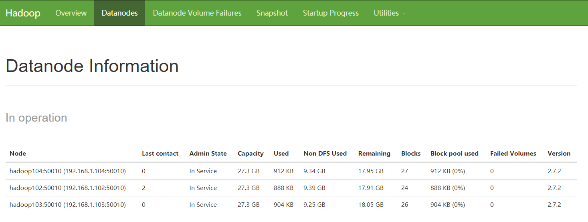

7. 如果数据不均衡，可以用命令实现集群的再平衡

   ```shell
   [atguigu@hadoop103 hadoop-2.7.2]$ sbin/start-balancer.sh 
   starting balancer, logging to /opt/module/hadoop-2.7.2/logs/hadoop-atguigu-balancer-hadoop103.out
   Time Stamp               Iteration#  Bytes Already Moved  Bytes Left To Move  Bytes Being Moved
   ```

   

#### 6.5.2 黑名单退役

<font color=red>注意：白名单和黑名单文件中的主机名不能重复！</font>

在黑名单上面的主机都会被强制退出。

在退役之前个DataNode的状态如下图所示：

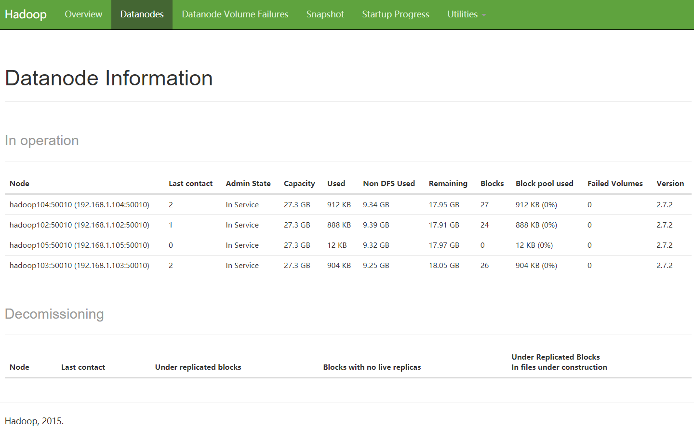

如果是下面这样，表示hadoop105上的DataNode没有启动，需要`sbin/hadoop-daemon.sh start datanode`启动Datanode。

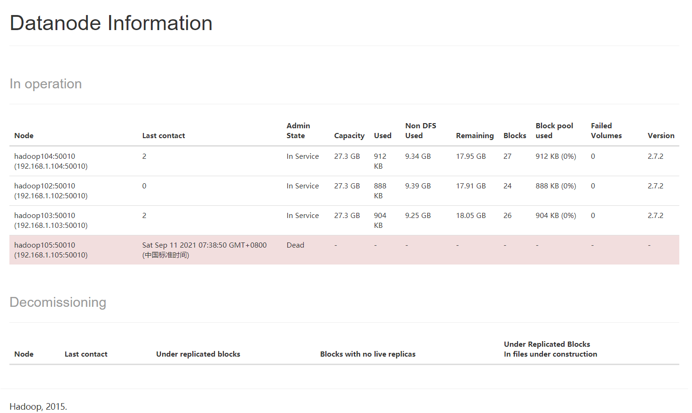

1. 在NameNode的/opt/module/hadoop-2.7.2/etc/hadoop目录下创建`dfs.hosts.exclude`文件

   ```shell
   [atguigu@hadoop102 hadoop]$ pwd
   /opt/module/hadoop-2.7.2/etc/hadoop
   [atguigu@hadoop102 hadoop]$ touch dfs.hosts.exclude
   [atguigu@hadoop102 hadoop]$ vim dfs.hosts.exclude
   ```

   添加如下主机名称（要退役的节点），不能有空格，空行。

   ```shell
   hadoop105
   ```

2. 在NameNode的hdfs-site.xml配置文件中增加`dfs.hosts.exclude`属性

   ```xml
   <property>
   	<name>dfs.hosts.exclude</name>
   	<value>/opt/module/hadoop-2.7.2/etc/hadoop/dfs.hosts.exclude</value>
   </property>
   ```

3. 刷新NameNode，ResourceManager

   ```shell
   [atguigu@hadoop102 hadoop]$ hdfs dfsadmin -refreshNodes
   Refresh nodes successful
   [atguigu@hadoop102 hadoop]$ yarn rmadmin -refreshNodes
   21/09/11 10:41:05 INFO client.RMProxy: Connecting to ResourceManager at hadoop103/192.168.1.103:8033
   ```

4. 检查web浏览器，退役节点的状态为`decommission in progress（退役中）`

   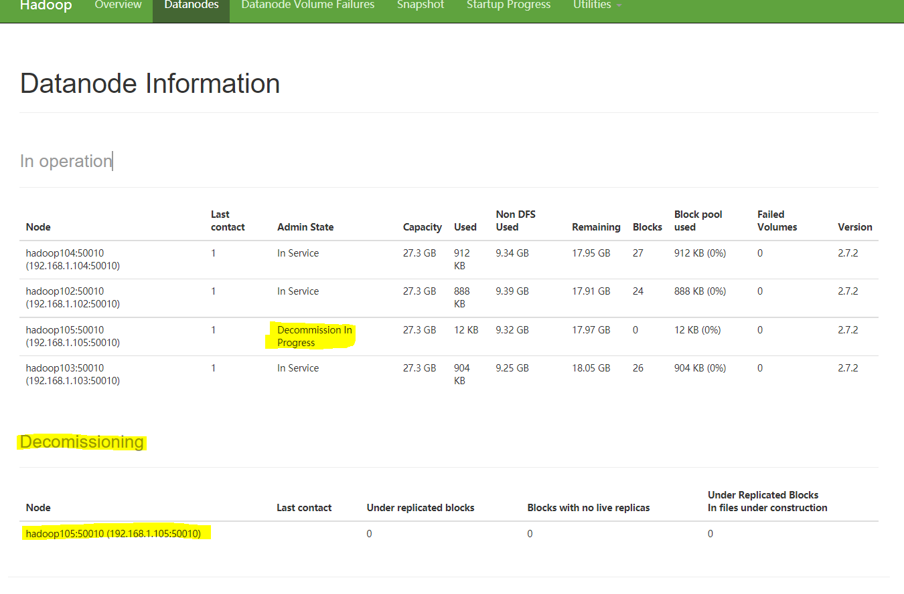

   

5. 等待退役节点状态为`decommissioned`（所有块已经复制完成），然后再停止该节点及节点资源管理器。注意：如果副本数是3，服役的节点小于等于3，是不能退役成功的，需要修改副本数后才能退役，

   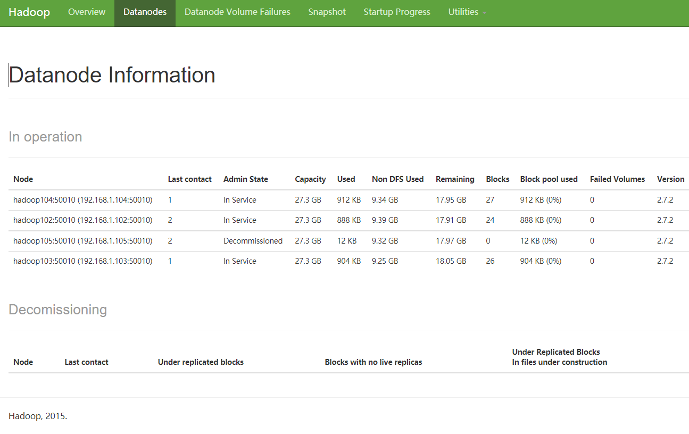

   ```shell
   [atguigu@hadoop105 hadoop-2.7.2]$ sbin/hadoop-daemon.sh stop datanode
   stopping datanode
   [atguigu@hadoop105 hadoop-2.7.2]$ sbin/yarn-daemon.sh stop nodemanager
   stopping nodemanager
   ```

6. 如果数据不均衡，可以用命令实现集群的再平衡

   ```shell
   [atguigu@hadoop102 hadoop-2.7.2]$ sbin/start-balancer.sh 
   
   starting balancer, logging to /opt/module/hadoop-2.7.2/logs/hadoop-atguigu-balancer-hadoop102.out
   
   Time Stamp        Iteration#  Bytes Already Moved  Bytes Left To Move  Bytes Being Moved
   ```

   <font color=red>注意：不允许白名单和黑名单中同时出现同一个主机名称。</font>

白名单禁止某DataNode访问NameNode和黑名单退役某DataNode的区别是：

1. 若白名单中没有某DataNode的主机，则该DataNode不能访问NameNode，但是数据还是在该DataNode上，并没有将数据备份到其他DN上，保证该数据的副本个数足够。
2. 若黑名单中设置了某DataNode，则hdfs会先将该DN上的数据复制到其他DN上，完成之后，再手动停止该DN上的DataNode服务等。

### 6.6 DataNode多目录配置

DataNode也可以配置成多个目录，<font color=red>每个目录存储的数据不一样。即：数据不是副本。</font>

具体配置如下：

```xml
<!-- hdfs-site.xml -->
<property>
	<name>dfs.datanode.data.dir</name>
    <value>file:///${hadoop.tmp.dir}/dfs.data1,file:///${hadoop.tmp.dir}/dfs.data2</value>
</property>
```


## 7. HDFS 2.x新特性

### 7.1 集群间数据拷贝

1．scp实现两个远程主机之间的文件复制

​	scp -r hello.txt [root@hadoop103:/user/atguigu/hello.txt](mailto:root@hadoop103:/user/atguigu/hello.txt)		// 推 push

​	scp -r [root@hadoop103:/user/atguigu/hello.txt  hello.txt](mailto:root@hadoop103:/user/atguigu/hello.txt  hello.txt)		// 拉 pull

​	scp -r [root@hadoop103:/user/atguigu/hello.txt](mailto:root@hadoop103:/user/atguigu/hello.txt) root@hadoop104:/user/atguigu  //是通过本地主机中转实现两个远程主机的文件复制；如果在两个远程主机之间ssh没有配置的情况下可以使用该方式。

2．采用distcp命令实现两个Hadoop集群之间的递归数据复制

```shell
[atguigu@hadoop102 hadoop-2.7.2]$  bin/hadoop distcp

hdfs://haoop102:9000/user/atguigu/hello.txt hdfs://hadoop103:9000/user/atguigu/hello.txt
```

### 7.2 小文件存档

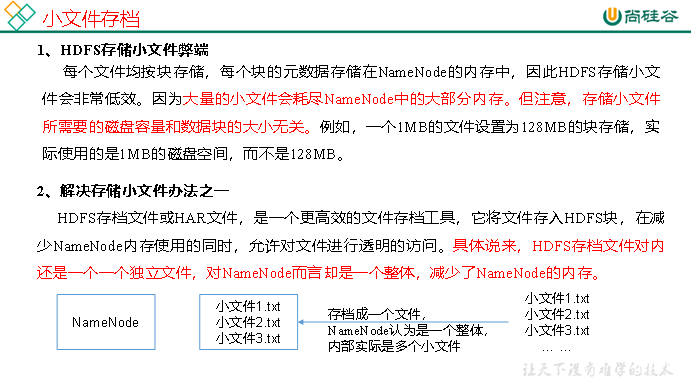

**案例实操**

1. 需要启动YARN进程（登录ResourceManager所在主机）

   ```shell
   [atguigu@hadoop103 hadoop-2.7.2]$ sbin/start-yarn.sh
   ```

2. 归档文件

   把/user/atguigu/input目录里的所有文件归档成一个叫做input.har的归档文件，并把归档后的文件存储到/user/atguigu/output路径下。<font color=red>/user/atguigu/output目录可以事先不存在。</font> HAR即Hadoop Archive（HAR）

   ```shell
   [atguigu@hadoop103 hadoop-2.7.2]$ hadoop archive -archiveName input.har -p /user/atguigu/input/  /user/atguigu/output
   21/09/11 15:54:20 INFO client.RMProxy: Connecting to ResourceManager at hadoop103/192.168.1.103:8032
   21/09/11 15:54:22 INFO client.RMProxy: Connecting to ResourceManager at hadoop103/192.168.1.103:8032
   21/09/11 15:54:22 INFO client.RMProxy: Connecting to ResourceManager at hadoop103/192.168.1.103:8032
   21/09/11 15:54:23 INFO mapreduce.JobSubmitter: number of splits:1
   21/09/11 15:54:23 INFO mapreduce.JobSubmitter: Submitting tokens for job: job_1631346052354_0001
   21/09/11 15:54:24 INFO impl.YarnClientImpl: Submitted application application_1631346052354_0001
   21/09/11 15:54:24 INFO mapreduce.Job: The url to track the job: http://hadoop103:8088/proxy/application_1631346052354_0001/
   21/09/11 15:54:24 INFO mapreduce.Job: Running job: job_1631346052354_0001
   21/09/11 15:54:43 INFO mapreduce.Job: Job job_1631346052354_0001 running in uber mode : false
   21/09/11 15:54:43 INFO mapreduce.Job:  map 0% reduce 0%
   21/09/11 15:55:04 INFO mapreduce.Job:  map 100% reduce 0%
   21/09/11 15:55:20 INFO mapreduce.Job:  map 100% reduce 100%
   21/09/11 15:55:21 INFO mapreduce.Job: Job job_1631346052354_0001 completed successfully
   21/09/11 15:55:21 INFO mapreduce.Job: Counters: 49
   	File System Counters
   		FILE: Number of bytes read=969
   		FILE: Number of bytes written=239627
   		FILE: Number of read operations=0
   		FILE: Number of large read operations=0
   		FILE: Number of write operations=0
   		HDFS: Number of bytes read=29114
   		HDFS: Number of bytes written=29125
   		HDFS: Number of read operations=31
   		HDFS: Number of large read operations=0
   		HDFS: Number of write operations=7
   	Job Counters 
   		Launched map tasks=1
   		Launched reduce tasks=1
   		Other local map tasks=1
   		Total time spent by all maps in occupied slots (ms)=16490
   		Total time spent by all reduces in occupied slots (ms)=13581
   		Total time spent by all map tasks (ms)=16490
   		Total time spent by all reduce tasks (ms)=13581
   		Total vcore-milliseconds taken by all map tasks=16490
   		Total vcore-milliseconds taken by all reduce tasks=13581
   		Total megabyte-milliseconds taken by all map tasks=16885760
   		Total megabyte-milliseconds taken by all reduce tasks=13906944
   	Map-Reduce Framework
   		Map input records=10
   		Map output records=10
   		Map output bytes=942
   		Map output materialized bytes=969
   		Input split bytes=118
   		Combine input records=0
   		Combine output records=0
   		Reduce input groups=10
   		Reduce shuffle bytes=969
   		Reduce input records=10
   		Reduce output records=0
   		Spilled Records=20
   		Shuffled Maps =1
   		Failed Shuffles=0
   		Merged Map outputs=1
   		GC time elapsed (ms)=442
   		CPU time spent (ms)=5890
   		Physical memory (bytes) snapshot=388816896
   		Virtual memory (bytes) snapshot=4223930368
   		Total committed heap usage (bytes)=278396928
   	Shuffle Errors
   		BAD_ID=0
   		CONNECTION=0
   		IO_ERROR=0
   		WRONG_LENGTH=0
   		WRONG_MAP=0
   		WRONG_REDUCE=0
   	File Input Format Counters 
   		Bytes Read=795
   	File Output Format Counters 
   		Bytes Written=0
   
   ```

   归档之后，原/user/atguigu/input路径下的小文件仍然存在啊！

3. 查看归档

   ```shell
   [atguigu@hadoop103 hadoop-2.7.2]$ hadoop fs -ls -R /user/atguigu/output/input.har
   drwxr-xr-x   - atguigu supergroup          0 2021-09-11 15:55 /user/input.har
   -rw-r--r--   3 atguigu supergroup          0 2021-09-11 15:55 /user/input.har/_SUCCESS
   -rw-r--r--   5 atguigu supergroup        901 2021-09-11 15:55 /user/input.har/_index
   -rw-r--r--   5 atguigu supergroup         23 2021-09-11 15:55 /user/input.har/_masterindex
   -rw-r--r--   3 atguigu supergroup      28201 2021-09-11 15:55 /user/input.har/part-0
   # 查看har归档文件中具体有哪些小文件
   [atguigu@hadoop103 hadoop-2.7.2]$ hadoop fs -ls -R har:///user/atguigu/output/input.har
   -rw-r--r--   3 atguigu supergroup       4436 2021-08-27 17:17 har:///user/input.har/capacity-scheduler.xml
   -rw-r--r--   3 atguigu supergroup       1119 2021-08-27 17:17 har:///user/atguigu/output/input.har/core-site.xml
   -rw-r--r--   3 atguigu supergroup       9683 2021-08-27 17:17 har:///user/atguigu/output/input.har/hadoop-policy.xml
   -rw-r--r--   3 atguigu supergroup       1074 2021-08-27 17:17 har:///user/atguigu/output/input.har/hdfs-site.xml
   -rw-r--r--   3 atguigu supergroup        620 2021-08-27 17:17 har:///user/atguigu/output/input.har/httpfs-site.xml
   -rw-r--r--   3 atguigu supergroup       3518 2021-08-27 17:17 har:///user/atguigu/output/input.har/kms-acls.xml
   -rw-r--r--   3 atguigu supergroup       5511 2021-08-27 17:17 har:///user/atguigu/output/input.har/kms-site.xml
   -rw-r--r--   3 atguigu supergroup       1220 2021-08-27 17:17 har:///user/atguigu/output/input.har/mapred-site.xml
   -rw-r--r--   3 atguigu supergroup       1020 2021-08-27 17:17 har:///user/atguigu/output/input.har/yarn-site.xml
   
   ```

   可以对har:///xx/xx/x.har进行移动、复制、拷贝等操作。如:

   ```shell
   [atguigu@hadoop103 hadoop-2.7.2]$ hadoop fs -mkdir /user/atguigu/output1
   [atguigu@hadoop103 hadoop-2.7.2]$ hadoop fs -mv /user/atguigu/output/input.har /user/atguigu/output1/input.har
   [atguigu@hadoop103 hadoop-2.7.2]$ hadoop fs -ls -R /user/atguigu/output/input.har
   ls: `/user/atguigu/output/input.har': No such file or directory
   [atguigu@hadoop103 hadoop-2.7.2]$ hadoop fs -ls -R /user/atguigu/output1/input.har
   -rw-r--r--   3 atguigu supergroup          0 2021-09-11 15:55 /user/atguigu/output1/input.har/_SUCCESS
   -rw-r--r--   5 atguigu supergroup        901 2021-09-11 15:55 /user/atguigu/output1/input.har/_index
   -rw-r--r--   5 atguigu supergroup         23 2021-09-11 15:55 /user/atguigu/output1/input.har/_masterindex
   -rw-r--r--   3 atguigu supergroup      28201 2021-09-11 15:55 /user/atguigu/output1/input.har/part-0
   ```

   

4. 解开归档文件

   ```shell
   [atguigu@hadoop103 hadoop-2.7.2]$ hadoop fs -cp har:///user/atguigu/output1/input.har/* /user/atguigu
   # 或者
   [atguigu@hadoop103 hadoop-2.7.2]$ hadoop distcp har:///user/atguigu/output1/input.har/file-1 /tmp/output
   ```

   HAR对我们来说，就是把众多文件整合到一起，文件个数减小了，但是文件总体大小并没有减少（无压缩）。归档文件与原文件分别使用了不同的Block，并没有共用Block。当归档文件较多时，性能并不明显（典型的HDFS拷贝）。

   <font color=red>HAR总体比较简单，它有什么缺点呢?</font>

   1. archive文件一旦创建不可修改即不能append，如果其中某个小文件有问题，得解压处理完异常文件后重新生成新的archive文件;

   2. 对小文件归档后，原文件并未删除，需要手工删除;

   3. 创建HAR和解压HAR依赖MapReduce，查询文件时耗很高;

   4. 归档文件不支持压缩。

### 7.3 回收站

开启回收站功能，可以将删除的文件在不超时的情况下，恢复原数据，起到防止误删除、备份等作用。

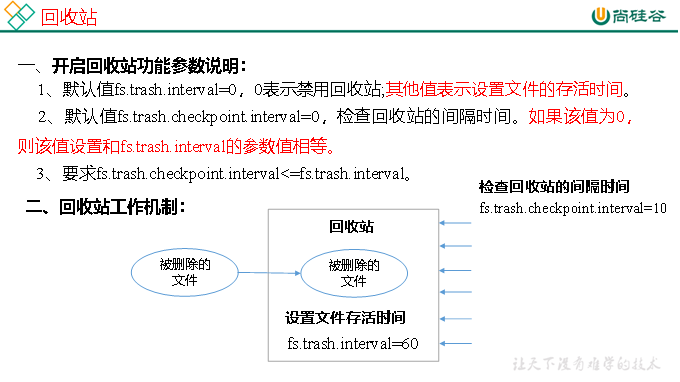

1. 启用回收站

   修改`core-site.xml`，配置垃圾回收时间为1分钟。

   ```xml
   <!-- 单位min -->
   <property>
   	<name>fs.trash.interval</name>
       <value>1</value>
   </property>
   ```

   分发`core-site.xml`到其他节点

   ```shell
   [atguigu@hadoop102 hadoop]$ xsync core-site.xml
   # 修改配置之后，好像nn直接就自动应用了新的配置，但是有的配置好像没生效
   
   # 重启hdfs和yarn
   [atguigu@hadoop102 hadoop-2.7.2]$ sbin/stop-dfs.sh
   [atguigu@hadoop103 hadoop-2.7.2]$ sbin/stop-yarn.sh
   [atguigu@hadoop102 hadoop-2.7.2]$ sbin/start-dfs.sh
   [atguigu@hadoop103 hadoop-2.7.2]$ sbin/start-yarn.sh
   ```

   

2. 查看回收站

   回收站在集群中的路径：`/user/atguigu/.Trash/...`

   ```shell
   [atguigu@hadoop102 hadoop]$ hdfs dfs -ls /
   Found 6 items
   -rw-r--r--   2 atguigu supergroup         33 2021-08-30 19:51 /banhua.txt
   -rw-r--r--   1 atguigu supergroup         33 2021-08-30 21:16 /banzhang.txt
   drwxr-xr-x   - atguigu supergroup          0 2021-09-11 10:22 /system
   drwx------   - atguigu supergroup          0 2021-08-27 16:58 /tmp
   drwxr-xr-x   - atguigu supergroup          0 2021-09-11 16:06 /user
   -rw-r--r--   2 atguigu supergroup         33 2021-08-30 19:52 /yanjing.txt
   [atguigu@hadoop102 hadoop]$ hdfs dfs -rm -r /yanjing.txt
   21/09/11 17:00:52 INFO fs.TrashPolicyDefault: Namenode trash configuration: Deletion interval = 1 minutes, Emptier interval = 0 minutes.
   Moved: 'hdfs://hadoop102:9000/yanjing.txt' to trash at: hdfs://hadoop102:9000/user/atguigu/.Trash/Current
   # 查看回收站
   [atguigu@hadoop102 hadoop]$ hdfs dfs -ls /user/atguigu/.Trash/Current
   Found 1 items
   -rw-r--r--   2 atguigu supergroup         33 2021-08-30 19:52 /user/atguigu/.Trash/Current/yanjing.txt
   ```

   

3. 修改访问回收站用户名称

   进入垃圾回收站用户名称，默认是`dr.who`，修改为atguigu用户

   ​	[core-site.xml]

   ```xml
   <property>
      <name>hadoop.http.staticuser.user</name>
      <value>atguigu</value>
   </property>
   ```

   

4. 通过程序删除的文件不会经过回收站，需要调用

   ```java
   Trash trash = New Trash(conf);
   trash.moveToTrash(path);
   ```

   

5. 恢复回收站数据

   ```shell
   [atguigu@hadoop102 hadoop]$ hdfs dfs -mv /user/atguigu/.Trash/Current/yanjing.txt /
   [atguigu@hadoop102 hadoop]$ hdfs dfs -ls /
   Found 5 items
   -rw-r--r--   2 atguigu supergroup         33 2021-08-30 19:51 /banhua.txt
   drwxr-xr-x   - atguigu supergroup          0 2021-09-11 10:22 /system
   drwx------   - atguigu supergroup          0 2021-08-27 16:58 /tmp
   drwxr-xr-x   - atguigu supergroup          0 2021-09-11 16:06 /user
   -rw-r--r--   2 atguigu supergroup         33 2021-08-30 19:52 /yanjing.txt
   ```

   

6.  清空回收站

   ```shell
   [atguigu@hadoop102 hadoop-2.7.2]$ hadoop fs -expunge
   21/09/11 17:42:44 INFO fs.TrashPolicyDefault: Namenode trash configuration: Deletion interval = 1 minutes, Emptier interval = 0 minutes.
   21/09/11 17:42:44 INFO fs.TrashPolicyDefault: Created trash checkpoint: /user/atguigu/.Trash/210911174244
   
   ```

   它并不会真正的删除回收站中的数据，而是将其从`/user/atguigu/.Trash/Current/`移动到`/user/atguigu/.Trash/210911174244`，最后面的数字是时间戳，21年09月11日17点42分44秒。

### 7.4 快照管理

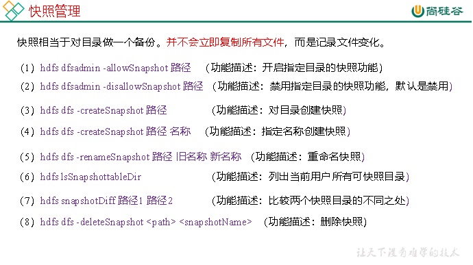

**案例实操**

1. 开启/禁用指定目录的快照功能

   ```shell
   [atguigu@hadoop102 hadoop-2.7.2]$ hdfs dfsadmin -allowSnapshot /user/atguigu/input
   
   [atguigu@hadoop102 hadoop-2.7.2]$ hdfs dfsadmin -disallowSnapshot /user/atguigu/input
   ```

 2. 对目录创建快照

    ```shell
    [atguigu@hadoop102 hadoop-2.7.2]$ hdfs dfs -createSnapshot /user/atguigu/input
    ```

    通过web访问hdfs://hadoop102:50070/user/atguigu/input/.snapshot/s…..// 快照和源文件使用相同数据

    ```shell
    [atguigu@hadoop102 hadoop-2.7.2]$ hdfs dfs -lsr /user/atguigu/input/.snapshot/
    ```

 3. 指定名称创建快照

    ```shell
    [atguigu@hadoop102 hadoop-2.7.2]$ hdfs dfs -createSnapshot /user/atguigu/input  miao170508
    ```

 4. 重命名快照

    ```shell
    [atguigu@hadoop102 hadoop-2.7.2]$ hdfs dfs -renameSnapshot /user/atguigu/input/ miao170508 atguigu170508
    ```

 5. 列出当前用户所有可快照目录

    ```shell
    [atguigu@hadoop102 hadoop-2.7.2]$ hdfs lsSnapshottableDir
    ```

 6. 比较两个快照目录的不同之处

    ```shell
    [atguigu@hadoop102 hadoop-2.7.2]$ hdfs snapshotDiff
    
     /user/atguigu/input/  .  .snapshot/atguigu170508	
    ```

7. 恢复快照

   ```shell
   [atguigu@hadoop102 hadoop-2.7.2]$ hdfs dfs -cp
   
   /user/atguigu/input/.snapshot/s20170708-134303.027 /user
   ```


## 8. HDFS HA高可用

## 8.1 HA 概述

1. 所谓的HA（High Available），即高可用（7*24小时不中断服务）

2. 实现高可用最关键的策略时消除单点故障，HA严格来说应该分成各个组件的HA机制，HDFS的HA和YARN的HA

3. Hadoop2.0之前，在HDFS集群中NameNode存在单点故障（SPOF）

4. NameNode主要在以下两个方面影响HDFS集群

   NameNode机器发生意外，如宕机，集群将无法使用，知道管理员重启。

   NameNode机器需要升级，包括软件、硬件升级，此时集群也将无法使用。

   HDFS HA功能通过配置Active/Standby 两个NameNode实现在集群中对NameNode的热备来解决上述问题。如果出现故障，如机器崩溃或机器需要升级委会，这是可通过此种方式将NameNode很快切换到另一台机器。

## 8.2 HDFS HA工作机制

通过双NameNode消除单点故障。

### 8.2.1 HDFS HA 工作要点

1. 元数据管理方式需要改变

   内存中各自保存一份元数据；

   edits日志只有Active状态的NameNode节点可以做写操作；

   两个NameNode都可以读取edits文件；

   共享的edits文件放在一个共享存储中管理（QJM和NFS两个主流实现）；

2. 需要一个状态管理功能模块

   实现了一个zkfailover，常驻在每一个NameNode所在的节点，每一个zkfailover负责监控自己所在NameNode节点，利用zk进行状态标识，当需要进行状态切换时，由zkfailover来负责切换，切换时需要防止brain split现象发生（不会同时有两个Active的NameNode）。

3. 必须保证两个NameNode之间能够ssh免密登录

4. 隔离（Fence），即同一时刻仅有一个NameNode对外提供服务


### 8.2.2 HDFS HA 自动故障转移工作机制

前面学习了使用命令 hdfs hadfsadmin -failover 手动进行故障转移，在该模式下，即使现役NameNode已经失效，系统也不会自动从现役NameNode转移到待机NameNode，下面学习如何配置部署HA自动进行故障转移。自动故障转移为HDFS部署增加了两个新组件：ZooKeeper和ZKFailoverController(ZKFC)进程，如下图所示：

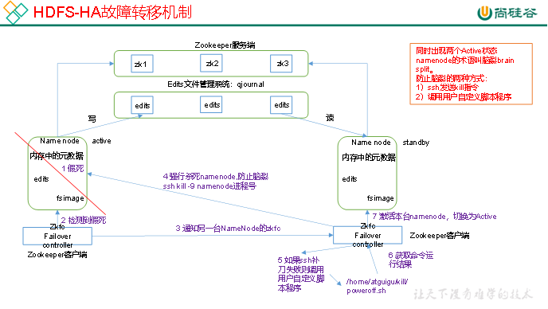

ZooKeeper是维护少量协调数据，通知客户端这些数据的改变和监视客户端故障的高可用服务。HA的自动故障转移依赖于ZooKeeper的以下功能（ZK=文件系统+通知机制）：

1. 故障检测

   集群中每个NameNode在ZooKeeper中维护一个持久会话，如果机器崩溃，ZooKeeper中的会话将终止，ZooKeeper通知另一个NameNode需要触发故障转移。

2. 现役NameNode选择

   ZooKeeper提供了一个简单的机制用于唯一的选择一个节点为active状态。如果目前现役NameNode崩溃，另一个节点可能从ZooKeeper获得特殊的排它锁，以表明它应该成为现役NameNode。

ZKFC是自动故障转移中的另一个新组件，是ZooKeeper的客户端，也是监视和管理NameNode的状态。每个运行NameNode的主机也运行了一个ZKFC进程。ZKFC负责：

1. 健康检测

   ZKFC使用一个健康检查命令定期地ping与之在相同主机的NameNode，只要该NameNode及时地回复健康信息，ZKFC认为该节点是健康的。如果节点崩溃，冻结或进入不健康状态，健康监测器表示该节点为非健康的。

2. ZooKeeper会话管理

   当本地NameNode是健康的，ZKFC保持一个ZooKeeper中打开的会话。如果本地NameNode处于active状态，ZKFC也保持一个特殊的znode锁，该锁使用了ZooKeeper中的临时节点，如果会话终止，该znode节点将会自动删除。

3. 基于ZooKeeper的选举

   如果本地NameNode是健康的，且ZKFC发现没有其它的节点当前持有znode锁，它将为自己获取该锁。如果成功，则它赢得了选举，并负责运行故障转移进程以使它的本地NameNode为Active。故障转移进程与前面面熟的手动故障转移相似，首先如果必要保护之前的现役NameNode，然后本地NameNode转换为Active状态。


## 8.3 HDFS HA 集群配置

### 8.3.1 环境准备

1. 修改IP
2. 修改主机名及主机名和IP地址的映射
3. 关闭防火墙
4. ssh免密登录
5. 安装JDK，配置环境变量等

### 8.3.2 集群规划

| hadoop102   | hadoop103       | hadoop104   |
| ----------- | --------------- | ----------- |
| NameNode    |                 | NameNode    |
| JournalNode | JournalNode     | JournalNode |
| DataNode    | DataNode        | DataNode    |
| ZK          | ZK              | ZK          |
|             | ResourceManager |             |
| NodeManager | NodeManager     | NodeManager |


### 8.3.3 配置ZooKeeper集群

1. 集群规划

   在`hadoop102`、`hadoop103`和`hadoop104`三个节点上部署`Zookeeper`。

2. 解压安装

   - 解压`Zookeeper`安装包到`/opt/module/`目录下

     ```shell
     [atguigu@hadoop102 software]$ tar -zxvf zookeeper-3.4.10.tar.gz -C /opt/module/
     ```

   - 在`/opt/module/zookeeper-3.4.10/`这个目录下创建`zkData`

     ```shell
     mkdir -p zkData
     ```

   - 重命名`/opt/module/zookeeper-3.4.10/conf`这个目录下的`zoo_sample.cfg`为`zoo.cfg`

     ```shell
     mv zoo_sample.cfg zoo.cfg
     ```

3. 配置`zoo.cfg`文件

   - 具体配置

     ```shell
     dataDir=/opt/module/zookeeper-3.4.10/zkData
     ```

     增加如下配置

     ```shell
     #######################cluster##########################
     server.2=hadoop102:2888:3888
     server.3=hadoop103:2888:3888
     server.4=hadoop104:2888:3888
     ```

   - 配置参数解读

     Server.A=B:C:D。

     A是一个数字，表示这个是第几号服务器；

     B是这个服务器的IP地址；

     C是这个服务器与集群中的Leader服务器交换信息的端口；

     D是万一集群中的Leader服务器挂了，需要一个端口来重新进行选举，选出一个新的Leader，而这个端口就是用来执行选举时服务器相互通信的端口。

     集群模式下配置一个文件myid，这个文件在dataDir目录下，这个文件里面有一个数据就是A的值，Zookeeper启动时读取此文件，拿到里面的数据与zoo.cfg里面的配置信息比较从而判断到底是哪个server。

4. 集群操作

   - 在/opt/module/zookeeper-3.4.10/zkData目录下创建一个myid的文件

     ```shell
     touch myid
     ```

     添加myid文件，注意一定要在linux里面创建，在notepad++里面很可能乱码

   - 编辑myid文件

     ```shell
     vim myid
     ```

     在文件中添加与server对应的编号：如2

   - 拷贝配置好的zookeeper到其他机器上

     ```shell
     scp -r zookeeper-3.4.10/ root@hadoop103.atguigu.com:/opt/app/
     scp -r zookeeper-3.4.10/ root@hadoop104.atguigu.com:/opt/app/
     ```

     并分别修改myid文件中内容为3、4

   - 分别启动zookeeper

     ```shell
     [root@hadoop102 zookeeper-3.4.10]# bin/zkServer.sh start
     [root@hadoop103 zookeeper-3.4.10]# bin/zkServer.sh start
     [root@hadoop104 zookeeper-3.4.10]# bin/zkServer.sh start
     ```

   - 查看状态

     ```shell
     [root@hadoop102 zookeeper-3.4.10]# bin/zkServer.sh status
     JMX enabled by default
     Using config: /opt/module/zookeeper-3.4.10/bin/../conf/zoo.cfg
     Mode: follower
     [root@hadoop103 zookeeper-3.4.10]# bin/zkServer.sh status
     JMX enabled by default
     Using config: /opt/module/zookeeper-3.4.10/bin/../conf/zoo.cfg
     Mode: leader
     [root@hadoop104 zookeeper-3.4.5]# bin/zkServer.sh status
     JMX enabled by default
     Using config: /opt/module/zookeeper-3.4.10/bin/../conf/zoo.cfg
     Mode: follower
     ```


### 8.3.4 配置HDFS HA 集群

1. 官方地址：http://hadoop.apache.org/

2. 在opt目录下创建一个ha文件夹

   ```shell
   mkdir ha
   ```

3. 将/opt/app/下的 hadoop-2.7.2拷贝到/opt/ha目录下

   ```shell
   cp -r hadoop-2.7.2/ /opt/ha/
   ```

4. 配置hadoop-env.sh

   ```shell
   export JAVA_HOME=/opt/module/jdk1.8.0_144
   ```

5. 配置core-site.xml

   ```xml
   <configuration>
       <!-- 把两个NameNode）的地址组装成一个集群mycluster -->		
       <property>			
           <name>fs.defaultFS</name>    	
           <value>hdfs://mycluster</value>		
       </property> 	
       <!-- 指定hadoop运行时产生文件的存储目录 -->		
       <property>			
           <name>hadoop.tmp.dir</name>			
           <value>/opt/ha/hadoop-2.7.2/data/tmp</value>		
       </property></configuration>
   ```

6. 配置hdfs-site.xml

   ```xml
   <configuration>    
       <!-- 完全分布式集群名称 -->
       <property>
           <name>dfs.nameservices</name>
           <value>mycluster</value>
       </property> 
       <!-- 集群中NameNode节点都有哪些 -->
       <property>
           <name>dfs.ha.namenodes.mycluster</name>
           <value>nn1,nn2</value>
       </property> 
       <!-- nn1的RPC通信地址 -->
       <property>
           <name>dfs.namenode.rpc-address.mycluster.nn1</name>
           <value>hadoop102:9000</value>
       </property> 
       <!-- nn2的RPC通信地址 -->
       <property>
           <name>dfs.namenode.rpc-address.mycluster.nn2</name>
           <value>hadoop103:9000</value>
       </property> 
       <!-- nn1的http通信地址 -->
       <property>
           <name>dfs.namenode.http-address.mycluster.nn1</name>
           <value>hadoop102:50070</value>
       </property> 
       <!-- nn2的http通信地址 -->
       <property>
           <name>dfs.namenode.http-address.mycluster.nn2</name>
           <value>hadoop103:50070</value>
       </property> 
       <!-- 指定NameNode元数据在JournalNode上的存放位置 -->
       <property>
           <name>dfs.namenode.shared.edits.dir</name>
           <value>qjournal://hadoop102:8485;hadoop103:8485;hadoop104:8485/mycluster</value>
       </property> 
       <!-- 配置隔离机制，即同一时刻只能有一台服务器对外响应 -->
       <property>
           <name>dfs.ha.fencing.methods</name>
           <value>sshfence</value>
       </property> 
       <!-- 使用隔离机制时需要ssh无秘钥登录-->
       <property>
           <name>dfs.ha.fencing.ssh.private-key-files</name>
           <value>/home/atguigu/.ssh/id_rsa</value>
       </property> 
       <!-- 声明journalnode服务器存储目录-->
       <property>
           <name>dfs.journalnode.edits.dir</name>
           <value>/opt/ha/hadoop-2.7.2/data/jn</value>
       </property> 
       <!-- 关闭权限检查-->
       <property>
           <name>dfs.permissions.enable</name>
           <value>false</value>
       </property> 
       <!-- 访问代理类：client，mycluster，active配置失败自动切换实现方式-->
       <property>
           <name>dfs.client.failover.proxy.provider.mycluster</name>
           <value>org.apache.hadoop.hdfs.server.namenode.ha.ConfiguredFailoverProxyProvider</value>
       </property>
   </configuration>
   ```

7. 拷贝配置好的hadoop环境到其他节点

### 8.3.5 启动HDFS HA 集群

1. 在各个JournalNode节点上，输入以下命令启动JournalNode服务：

   ```shell
   sbin/hadoop-daemon.sh start journalnode
   ```

2. 在[nn1]上，格式化NameNode(只在第一次启动HDFS HA集群时使用)，并启动

   ```shell
   bin/hdfs namenode -format
   sbin/hadoop-daemon.sh start namenode
   ```

3. 在[nn2]上同步[nn1]的元数据信息(只在第一次启动HDFS HA集群时使用)

   ```shell
   bin/hdfs namenode -bootstrapStandby
   ```

4. 在[nn2]上启动NameNode

   ```shell
   sbin/hadoop-daemon.sh start namenode
   ```

5. 查看web页面

   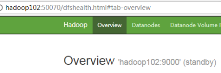

   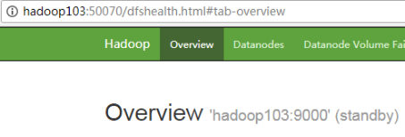

   <font color=red>注意：的是Stanby状态的NameNode是不能对外提供服务的！</font>

   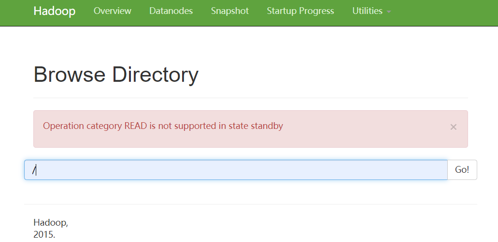

6. 在[nn1]上启动所有DataNode

   ```shell
   sbin/hadoop-daemons.sh start datanode
   ```

7. 将[nn1]切换为Active

   ```shell
   bin/hdfs haadmin -transitionToActive nn1
   ```

8. 查看是否Active

   ```shell
   [atguigu@hadoop104 hadoop-2.7.2]$ bin/hdfs haadmin -getServiceState nn1
   active
   [atguigu@hadoop104 hadoop-2.7.2]$ bin/hdfs haadmin -getServiceState nn2
   standby 
   ```

注意：如果[nn1]进程挂掉了，使用`bin/hdfs haadmin -transitionToActive nn2`并不能让[nn2]成为Active。

```shell
[atguigu@hadoop102 hadoop-2.7.2]$ jps
9523 DataNode
5845 NameNode
4310 JournalNode
9832 Jps
[atguigu@hadoop102 hadoop-2.7.2]$ kill -9 5845
[atguigu@hadoop102 hadoop-2.7.2]$ jps
9523 DataNode
4310 JournalNode
9847 Jps
[atguigu@hadoop102 hadoop-2.7.2]$ bin/hdfs haadmin -transitionToStandby nn2
[atguigu@hadoop102 hadoop-2.7.2]$ bin/hdfs haadmin -getServiceState nn2
standby
```

<font color=red>HDFS HA 想要手动故障转移，则[nn1]和[nn2]必须都是正常启动的，然后使用如下命令进行手动故障转移</font>：

```shell
bin/hdfs haadmin -transitionToActive nn2
```

### 8.3.6 配置HDFS HA 自动故障转移


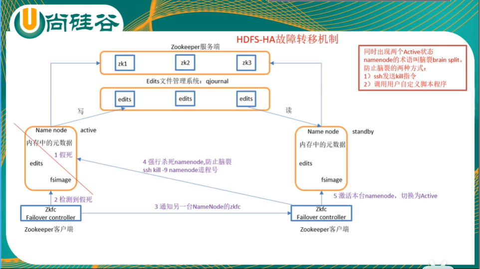

停止HDFS HA 集群

```shell
[atguigu@hadoop102 hadoop-2.7.2]$ sbin/stop-dfs.sh 
Stopping namenodes on [hadoop102 hadoop104]
hadoop104: stopping namenode
hadoop102: stopping namenode
hadoop102: stopping datanode
hadoop104: stopping datanode
hadoop103: stopping datanode
Stopping journal nodes [hadoop102 hadoop103 hadoop104]
hadoop103: stopping journalnode
hadoop104: stopping journalnode
hadoop102: stopping journalnode
[atguigu@hadoop102 hadoop-2.7.2]$
```

1. 具体配置

   - 在`hdfs-site.xml`中添加如下内容：

       ```xml
       <property>
           <name>dfs.ha.automatic-failover.enabled</name>
           <value>true</value>
       </property>
       ```

   - 在`core-site.xml`中添加如下内容：

       ```xml
        <property>
          <name>ha.zookeeper.quorum</name>
          <value>hadoop102:2181,hadoop103:2181,hadoop104:2181</value>
        </property>
       ```

   

2. 启动

   - 关闭所有HDFS 服务

     ```shell
     sbin/stop-dfs.sh
     ```

   - 启动ZooKeeper集群

     ```shell
     bin/zkServer.sh start
     ```

   - 初始化HA在ZooKeeper中的状态

     ```shell
     bin/hdfs zkfc -formatZK
     ```

   - 启动HDFS 服务

     ```shell
     sbin/start-dfs.sh
     ```

     <font color=red>注意：在某些情况下，可能需要格式化JournalNode的目录，否则NameNode启动不起来。</font>使用如下命令格式化：

     ```shell
     hdfs namenode -initializeSharedEdits
     ```

   - 在各个NameNode节点启动DFSZKFailoverController进程，先在哪个节点启动，哪个节点的NameNode就是Active的。

     ```shell
     # 单独启动某主机上的zkfc进程
     sbin/hadoop-daemon.sh start zkfc
     ```

3. 验证

   - 将Active NameNode 杀掉

     ```shell
     kill -9 namenode的进程id
     ```

   - 将Active NameNode机器断开连接

     ```shell
     service network stop
     ```

     

## 8.4 YARN HA 配置

### 8.4.1 YARN HA 工作机制

### 8.4.2 配置YARN HA 集群

1. 环境准备

   （1）修改IP

   （2）修改主机名及主机名和IP地址的映射

   （3）关闭防火墙

   （4）ssh免密登录

   （5）安装JDK，配置环境变量等

   （6）配置Zookeeper集群

2. 规划集群

   | hadoop102       | hadoop103       | hadoop104   |
   | --------------- | --------------- | ----------- |
   | NameNode        |                 | NameNode    |
   | JournalNode     | JournalNode     | JournalNode |
   | DataNode        | DataNode        | DataNode    |
   | ZK              | ZK              | ZK          |
   | ResourceManager | ResourceManager |             |
   | NodeManager     | NodeManager     | NodeManager |

3. 具体配置

   （1）yarn-site.xml

   ```xml
   <configuration>   
       <property>    
           <name>yarn.nodemanager.aux-services</name>    
           <value>mapreduce_shuffle</value>  
       </property>   
       <!--启用resourcemanager ha-->  
       <property>    
           <name>yarn.resourcemanager.ha.enabled</name>    
           <value>true</value>  
       </property>   
       <!--声明两台resourcemanager的地址-->  
       <property>    
           <name>yarn.resourcemanager.cluster-id</name>    
           <value>cluster-yarn1</value>  
       </property>   
       <property>    
           <name>yarn.resourcemanager.ha.rm-ids</name>    
           <value>rm1,rm2</value>  
       </property>   
       <property>    
           <name>yarn.resourcemanager.hostname.rm1</name>    
           <value>hadoop102</value>  
       </property>   
       <property>    
           <name>yarn.resourcemanager.hostname.rm2</name>    
           <value>hadoop104</value>  
       </property>   
       <!--指定zookeeper集群的地址-->   
       <property>    
           <name>yarn.resourcemanager.zk-address</name> 			 
           <value>hadoop102:2181,hadoop103:2181,hadoop104:2181</value>  
       </property>   
       <!--启用自动恢复-->   
       <property>    
           <name>yarn.resourcemanager.recovery.enabled</name>    
       	<value>true</value>  
       </property>   
       <!--指定resourcemanager的状态信息存储在zookeeper集群-->   
       <property>    
           <name>yarn.resourcemanager.store.class</name>   			         
           <value>org.apache.hadoop.yarn.server.resourcemanager.recovery.ZKRMStateStore</value>
       </property> 
   </configuration>
   ```

​	（2）同步更新其他节点的配置信息

4. 启动hdfs 

   （1）在各个JournalNode节点上，输入以下命令启动journalnode服务：

   ```shell
   sbin/hadoop-daemon.sh start journalnode
   ```

   （2）在[nn1]上，对其进行格式化，并启动：

   ```shell
   bin/hdfs namenode -format
   sbin/hadoop-daemon.sh start namenode
   ```

   （3）在[nn2]上，同步nn1的元数据信息：

   ```shell
   bin/hdfs namenode -bootstrapStandby
   ```

   （4）启动[nn2]：

   ```shell
   sbin/hadoop-daemon.sh start namenode
   ```

   （5）启动所有DataNode

   ```shell
   sbin/hadoop-daemons.sh start datanode
   ```

   （6）将[nn1]切换为Active

   ```shell
   bin/hdfs haadmin -transitionToActive nn1
   ```

   

5. 启动YARN 

   （1）在hadoop102中执行：

   ```shell
   sbin/start-yarn.sh
   ```

   （2）在hadoop104中执行：

   ```shell
   sbin/yarn-daemon.sh start resourcemanager
   ```

   （3）查看服务状态，如图3-24所示

   ```shell
   bin/yarn rmadmin -getServiceState rm1
   ```

   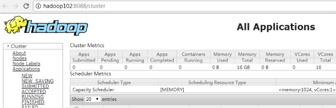 

图3-24 YARN的服务状态


**连接ZooKeeper集群查看YARN HA的元数据信息**

启动YARN HA 之前

```shell
[zk: localhost:2181(CONNECTED) 0] ls /
[hadoop-ha, test, zookeeper]
```

启动YARN HA 之后，可以看出多了两个`znode`（`rmstore`和`yarn-leader-election`）

```shell
[zk: localhost:2181(CONNECTED) 0] ls /
[hadoop-ha, rmstore, test, yarn-leader-election, zookeeper]

[zk: localhost:2181(CONNECTED) 1] ls /rmstore 
[ZKRMStateRoot]
[zk: localhost:2181(CONNECTED) 2] ls /rmstore/ZKRMStateRoot 
[AMRMTokenSecretManagerRoot, EpochNode, RMAppRoot, RMDTSecretManagerRoot, RMVersionNode]
[zk: localhost:2181(CONNECTED) 11] ls /yarn-leader-election
[cluster-yarn1]
[zk: localhost:2181(CONNECTED) 12] ls /yarn-leader-election/cluster-yarn1 
[ActiveBreadCrumb, ActiveStandbyElectorLock]
```


## 8.5 HDFS Federation 架构设计

1. NameNode架构的局限性

   （1）Namespace（命名空间）的限制

   由于NameNode在内存中存储所有的元数据（metadata），因此单个NameNode所能存储的对象（文件+块）数目受到NameNode所在JVM的heap size的限制。50G的heap能够存储20亿（200million）个对象，这20亿个对象支持4000个DataNode，12PB的存储（假设文件平均大小为40MB）。随着数据的飞速增长，存储的需求也随之增长。单个DataNode从4T增长到36T，集群的尺寸增长到8000个DataNode。存储的需求从12PB增长到大于100PB。

   （2）隔离问题

   由于HDFS仅有一个NameNode，无法隔离各个程序，因此HDFS上的一个实验程序就很有可能影响整个HDFS上运行的程序。

   （3）性能的瓶颈

   ​	由于是单个NameNode的HDFS架构，因此整个HDFS文件系统的吞吐量受限于单个NameNode的吞吐量。

2. HDFS Federation架构设计，如下图所示

   能不能有多个NameNode

   

| NameNode | NameNode | NameNode          |
| -------- | -------- | ----------------- |
| 元数据   | 元数据   | 元数据            |
| Log      | machine  | 电商数据/话单数据 |

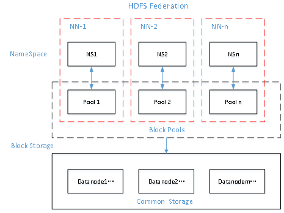

3. HDFS Federation应用思考

   不同应用可以使用不同NameNode进行数据管理

   ​		图片业务、爬虫业务、日志审计业务

   Hadoop生态系统中，不同的框架使用不同的NameNode进行管理NameSpace。（隔离性）


```shell

```


=======
## Hadoop分布式文件系统-HDFS

HDFS是如何实现有状态的高可用架构

HDFS是如何从架构上解决内存受限问题，联邦啊。

解密HDFS如何能支撑亿级流量

http://hadoop.apache.org/docs/r2.6.0/hadoop-project-dist/hadoop-hdfs/HdfsUserGuide.html

[深入理解Hadoop HDFS【一篇就够】](https://blog.csdn.net/sjmz30071360/article/details/79877846)

HDFS不适用的场景

- 低延时的数据访问（ms级别）。HDFS 是为高吞吐数据传输设计的，牺牲了延时，若要低延时访问数据，可以用HBase。
- 大量小文件。文件的元数据保存在NN中的内存中，因此HDFS的文件数量受限于NN的内存大小，一个文件/目录/block约占150B的内存空间。
- 多方读写，需要对文件做任意位置的修改。HDFS采用追加（append-only）的方式写入数据，所以不支持对文件做任意位置的修改。同一时刻只能有一个writer进行写入操作。

### HDFS的架构

HDFS是master/slave的架构，如下图所示：

- Namenode：负责管理HDFS集群的文件系统命名空间（即元数据）。负责打开、关闭、重命名文件/文件夹等操作。
- DataNode：HDFS将文件分割成多个block，默认一个block的大小为64MB，这些block存储在DN中。负责处理客户端的读/写请求、创建block、删除block、复制block等操作。


#### 文件系统命名空间（file system namespace）

就类似与Unix中的文件系统，可以HDFS的文件/文件夹进行创建、删除、移动等操作。

#### NameNode和DataNode

- NameNode。NN存放HDFS集群中的所有文件、目录的元数据和block映射关系。NN会定期接受DN发过来的心跳数据和Blockreport数据。元数据的持久化方式有两种：fsimage和edit log。

  持久化的数据不包括“文件的block分布在集群中的哪些节点上”，这些信息是系统重启的时候，DN通过Blockreport传递过来的。

  seconday NN不提供读写，只做备份和checkpoint。

- DataNode。数据节点负责存储和提供Block，读写请求可能来自于NN，也可能直接来自于客户端。DN周期性地向NN汇报自己节点上所存储的Block相关信息。

#### Block cache

DN通常直接从磁盘读取数据，但是频繁使用的Block是可以缓存在内存中的，默认一个Block只有一个DN会缓存。

#### HDFS Federation

HDFS Federation是一种横向扩展HDFS的方式。因为之前的元数据都存储在一台NN的内存中，这限制了HDFS可存储的文件数量，因此才会出现HDFS Federation。这样，每个NN都只管理集群元数据的一部分。

#### HDFS HA（高可用）

因为secondary NN只是冷备，并不能做到高可用，需要手动切换，否则整个HDFS就不可用了。

HDFS的HA方案需要满足如下4点：

- 主备共享edit log。这可以通过QJM或NFS来实现。
- DN需要同时向所有NN发送心跳和Blockreport。
- 客户端需要配置failover模式。
- 用standby NN代替secondary NN。

#### HDFS 副本放置策略

HDFS的副本放置策略时可靠性、写带宽、读带宽之间的权衡。

默认策略是：

- 第一个副本放置在客户端所在机器上，若客户端机器不在HDFS集群内，则放在随机的一个Rack上的一个机器上（负载低的）。
- 第二个副本随机放在不同于第一个副本的rack的机器上。
- 第三个副本放在第二个副本同一rack上的不同机器上。

副本因子为x，则HDFS集群中同一个份数据有x个。

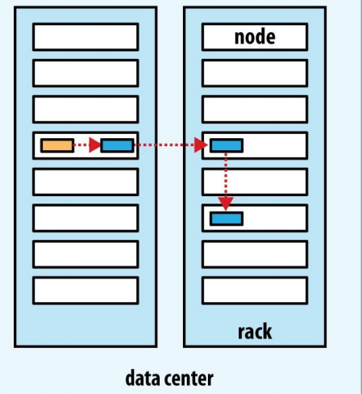


#### Hadoop中的节点距离

在读取和写入的过程中，namenode在分配Datanode的时候，会考虑节点之间的物理位置，即会考虑节点之间的距离。这是机架感知。

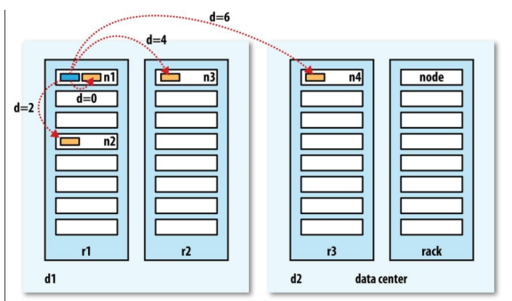

- 同一数据中心，同一机架，同一节点距离为0
- 同一数据中心，同一机架，不同节点距离为2
- 同一数据中心，不同机架，不同节点距离为4
- 不同数据中心，不同机架，不同节点距离为6

#### 副本选择

为了减少全局带宽的消耗和读写延时，HDFS会将最近的副本返回给reader，有限选择节点距离近的副本。

#### 安全模式

在启动时，NN会进入安全模式。当NN处于安全模式时，不会发生Block的复制。此时，NN从DN接受心跳和Blockreport。Blockreport中包括该DN锁托管的Block的列表。每个Block都有最小副本数。NN会检查每一个Block的最小副本数，以确定该Block是已被安全复制。当满足配置的安全复制的block的百分比后，NN就会退出安全模式。然后将少于指定最小副本的这些Block复制到其他DN。

#### 文件系统元数据持久化

NN存储了HDFS集群的命名空间。当每次文件系统元数据发生改变时，NN会将这些改变持久化到EditLog中（一个事务日志）（写一行记录）。HDFS将整个文件系统命名空间（block到文件的映射，文件系统属性等）持久化到fsimage文件中。

#### 检查点（checkpoint）

checkpoint是一个过程。当NN启动或触发checkpoint（edit log大小，或时间间隔）是，SNN从磁盘中读取fsimage和edit log，然后将edit log中的写操作应用到fsimage中，然后，让这个fsimage成为新的fsimage。

为什么不直接讲这些写入到edit log的操作直接应用到fsimage呢？

因为，这样效率会很低，假设同时有多个写操作，严重影响当时NN的性能。所以，这件事让SNN来做。

DN在启动时，会扫描本地fs，生成了此DN的block列表，然后报告给NN，这就是Blockreport。

HDFS采用了write-once-read-many这一数据存储技术，避免在磁盘寻址时出现大量的开销，因此不支持对文件进行任意位置的修改，而是创建和删除。

secondary NN的checkpoint的流程

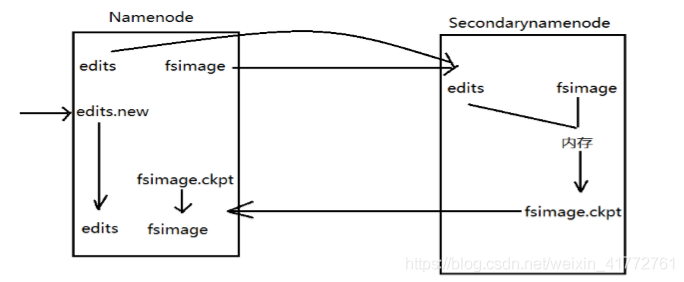

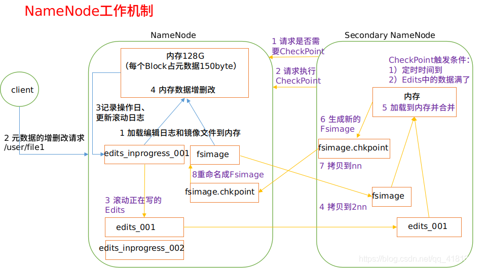

#### 复制管道（Replication pipeline）

HDFS写流程中的将数据接入到DN列表中的所有DN的。在写操作的时候，NN会返回一个DN的列表，表示客户端需要将数据写入到这些DN中。

- 客户端先将block写入打第一个DN。
- 第一个DN传给第二个DN。
- 第二个DN传给第三个DN。

这就是pipeline 复制。

#### FS Shell

HDFS提供了一个命令行接口，用于交互式地进行HDFS操作。

#### DFSAdmin

DFSAdmin命令集是给HDFS管理员使用的。

#### 浏览器接口

默认端口是50070

#### 文件删除和取消删除

在HDFS中，删除文件后，并不会立即将其从HDFS中删除，而是放入回收站（/Trash目录），误删后还可以通过mv将其从/Trash中恢复出来，一定时间后/Trash中的文件会被删除，这是NN就会从HDFS的命名空间中删除该文件，然后与该文件相关的block都会被释放。

#### 减少副本因子

当副本因子减少后，NN会选择要删除哪些DN上的block副本，然后在下一次心跳时，讲这些信息传递给DN，DN在删除自己上的这些block，为集群腾出物理空间。

#### HDFS的读写流程

[HDFS读写数据流程](https://www.cnblogs.com/Java-Script/p/11090379.html)

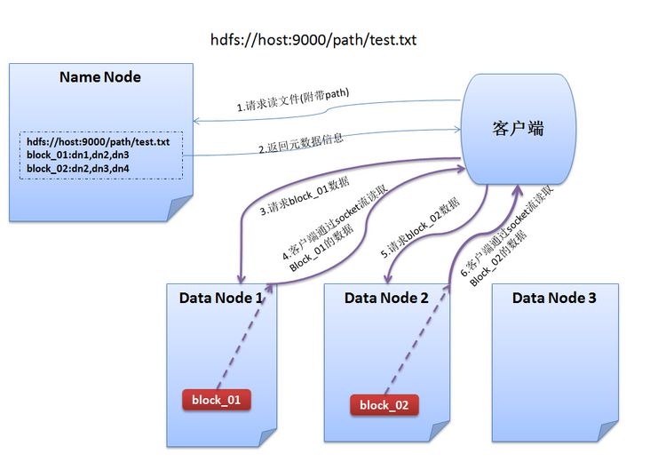

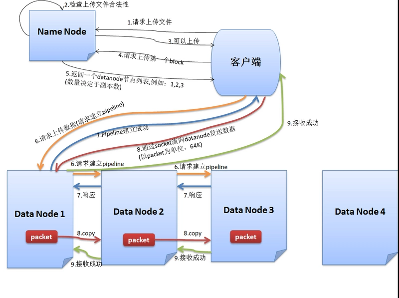

### HDFS的HA

#### 使用Quorum Journal Manager（QJM）实现HA

QJM是用来在Active NameNode和 Standby NameNode之间共享 edit log的。

在Hadoop 2.0.0之前，NameNode都是单点故障的（single point of failure，SPOF），一旦NN所在的机器或进程出现问题，则整个HDFS集群就不可用了。

HDFS实现HA是通过运行两个冗余的NN来解决的，一个为Active，一个Standby，Standby是Active的热备，当Active出现故障时，故障转移到Standby，使之成为新的Active。

在任何时间点，只有一个 NameNode 处于 Active 状态，另一个处于 Standby 状态。 Active NameNode 负责集群中的所有客户端操作，而 Standby 只是充当从属节点，维护足够的HDFS状态以在必要时提供快速故障转移。==那么Active和Standby之前如何保持数据同步的呢？==

为了使主备的NN能够同步状态，运行了一组JournalNode（JN）。Active在执行任何命名空间修改的操作时，它会将修改写入到大多数的JN。Standby就能从JN中读取到edit log，并一致监视他们，然后将edit log中的写操作应用到自己的命名空间（fsimage）。当Active发生故障时，Standby确保在自己成为新的Active之前，读取了JN中的所有edit log，即保证Standby的命名空间与发生故障之前的Active状态一直。

为了缩短故障转移的时间，两个NN都应该持有HDFS集群中Block和DN的映射关系。这通过DN向两个NN都发送心跳和Blockreport来实现。

为了防止出现脑裂等情况，JN一次只允许一个NN称为writer，来写入edit log。

Standby NN也可以执行checkpoint等操作，因此，就不需要在运行Secondary NN，CheckpointNode或BackupNode了。

故障转移分为：

- 手动故障转移。通过DFSHAAdmin 的相关命令能够实现手动故障转移

- 自动故障转移。

  要实现自动failover，需要增加两个组件：一个Zookeeper quorum和一个ZKFailoverController进程（简称为ZKFC）。实现自动failover依赖于ZK的如下特性：

  - 故障检测。每个NN都与ZK建立了持久会话，当机器宕机时，ZK会话就会过期，然后通知其他NN，哪个NN出现问题了。
  - Active NN选举。HDFS在ZK中建立一个临时的znode，当Active NN故障后，这个znode就删除了，watch了这个事件的其他NN可以参与选举，选举出一个新的Active NN。（本质就是ZK的分布式锁）

ZKFC其实是一个ZK的客户端，它会监控和管理NN的状态。每个运行了NN的机器，都会运行一个ZKFC进程。ZKFC负责：

- 健康监控。ZKFC会周期性地ping其本地的NN，只要NN在规定时间内响应了健康状态,ZKFC就认为其实健康的。若该节点泵阔，僵死等，会将其标记为不健康。
- ZK会话管理。当本地NN是健康时，这个ZKFC会保持与ZK的会话，对应的其实就是某特定目录下的临时znode。
- 基于ZK的NN选举。多个NN去竞争着建立Active这个znode，谁先抢占成功，谁就是新的Active NN了。

配置自动故障转移

需要先停止HDFS集群再配置。

```xml
 <property>
   <name>dfs.ha.automatic-failover.enabled</name>
   <value>true</value>
 </property>

<property>
   <name>ha.zookeeper.quorum</name>
   <value>zk1.example.com:2181,zk2.example.com:2181,zk3.example.com:2181</value>
 </property>
```


#### 使用Network File System（NFS）实现HA

这是通过，Active NN 和Standby NN 之间共享一个目录。当Active NN 执行了修改命名空间的操作后，会将操作记录在edit log中，而edit log 就是存放在这个共享目录下的。这样Standby NN也就能看到edit log的更改了，然后将edit log 应用到自己的命名空间。当Active发生故障后，Standby NN 确保读取了共享目录下的所有的edit log后，才会成为新的Active NN。这就实现了NN之间的状态同步一致性。

同QJM一样，DN需要将心跳和Blockreport同时发送给所有NN，这样就能够实现更快速的故障转移。

同QJM一样，你可以使用一下两种方式来故障转移：

- 通过DFSHAAdmin 命令来手动failover。原理同QJM一样。
- 通过配置ZK, ZKFC来实现自动failover。原理同QJM一样。

### HDFS Federation（联邦）

可以将HDFS看做两层，命名空间和block存储。

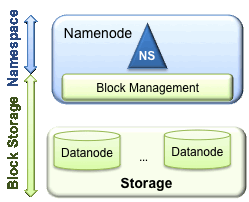

联邦的意思是，有多个NN（而不只是两个），每个NN持有整个HDFS命名空间的一部分。


### ViewFs

View File System (ViewFs) 提供了一种管理多个 Hadoop 文件系统命名空间（或命名空间卷）的方法。  ViewFs 类似于某些 Unix/Linux 系统中的客户端挂载表。 ViewFs 可用于创建个性化的命名空间视图以及每个集群的公共视图。

在HDFS联邦之前，只有一个NN，这个NN提供了整个HDFS集群的命名空间。现在假设有多个HDFS集群，每个集群都有独立的命名空间，且存储的数据不跨集群。

下面这个图就是一个ViewFs文件系统的图。在这个图中有4个相互独立的命名空间：/data, /project, /user, /tmp。


### HDFS快照

HDFS快照是一个只读的，某特定时间的HDFS文件系统的副本。可以在文件系统的子树或整个文件系统上拍摄快照。 快照的一些常见用例是数据备份、防止用户错误和灾难恢复。

一旦目录被设置为可快照，就可以在任何目录上拍摄快照。 一个快照目录能够同时容纳 65,536 个快照。 可快照目录的数量没有限制。 管理员可以将任何目录设置为快照表。 如果snapshottable目录中有快照，则在删除所有快照之前，不能删除或重命名该目录。

当前不允许嵌套的快照目录。 换句话说，如果目录的祖先/后代之一是可快照目录，则不能将目录设置为可快照目录。即，对快照目录进行快照是不支持的。

```shell
# 假设/foo目录可以快照，/foo目录下有bar目录或文件，则对/foo进行快照如下所示
/foo/.snapshot/s0/bar
```

### 离线edits查看器

离线edits查看器是用来解析Edits log文件的一个工具，它不需要HDFS运行着，它是针对文件的操作。用法示例：

```shell
bash$ bin/hdfs oev -i edits -o edits.xml
```

### 离线Image查看器

离线Image查看器，是用来解析fsimage，使之以人类可读的方式呈现。

### HDFS权限

HDFS中文件和目录的权限类似于Unix系统中的文件和目录的权限，都是分为3个权限：文件/目录所有人，文件/目录所属组，其他用户。

从Hadoop 0.22开始，Hadoop支持两种不同的操作模式来确定用户的身份：

- simple。在这种操作模式下，客户端进程的身份由主机操作系统确定。 在类 Unix 系统上，用户名相当于 `whoami`。
- kerberos。客户端进程的省份由kerberos凭证来决定。可以使用`kinit`工具来获取kerberos凭证，然后使用`klist`来查看当前的主体是谁。主体格式为：`todd/foobar@CORP.COMPANY.COM`，其表示对应的用户为`todd`。

#### 访问控制列表(ACL)

访问控制列表(ACL)是一种基于包过滤的[访问控制技术](https://baike.baidu.com/item/访问控制技术/5652430)，它可以根据设定的条件对接口上的数据包进行过滤，允许其通过或丢弃。访问控制列表被广泛地应用于[路由器](https://baike.baidu.com/item/路由器/108294)和[三层交换机](https://baike.baidu.com/item/三层交换机/816331)，借助于访问控制列表，可以有效地控制用户对网络的访问，从而最大程度地保障[网络安全](https://baike.baidu.com/item/网络安全/343664)。

### 配额

HDFS中有两种配额。

- name quota，名称配额。限制目录下的文件/目录的总数。超过配额，再创建文件/目录就会失败。目录重命名后，其配额仍然有效，新创建目录默认是没有设置配额的。配额的最大值为`Long.Max_Value`，如果目录的配额为0，则会强制让目录为空。配额信息持久化在fsimage中。
- space quota，空间配额。限制目录下的文件所能占用的总的字节数。每一个block的副本也都会算在空间配额里。其它与name quota类似的。

### HDFS常用命令

```shell
# 列出/目录下的文件和目录
hadoop fs -ls  /
# 递归列出
hadoop fs -ls  /
# 查看文件内容
hadoop fs -taif [-f] 路径
hadoop fs -text 路径
# 远程复制到本地，get
hadoop fs -get < hdfs file > < local file or dir>
hadoop fs -get < hdfs file or dir > ... < local  dir >
hadoop fs -copyToLocal < local src > ... < hdfs dst >
# 本地复制到远程，put
hadoop fs -put < local file > < hdfs file >
hadoop fs -put  < local file or dir >...< hdfs dir >
hadoop fs -moveFromLocal  < local src > ... < hdfs dst >
hadoop fs -copyFromLocal  < local src > ... < hdfs dst >
# 删除文件或目录
hadoop fs -rm < hdfs file > ...
hadoop fs -rm -r < hdfs dir>...
# 创建目录
hadoop fs -mkdir < hdfs path>
hadoop fs -mkdir -p < hdfs path> 
# 排序后合并到本地文件中
hadoop fs -getmerge < hdfs dir >  < local file >
hadoop fs -getmerge -nl  < hdfs dir >  < local file >
# 复制hdfs中的文件
hadoop fs -cp  < hdfs file >  < hdfs file >
hadoop fs -cp < hdfs file or dir >... < hdfs dir >
# 移动文件
hadoop fs -mv < hdfs file >  < hdfs file >
hadoop fs -mv  < hdfs file or dir >...  < hdfs dir >
# 统计目录数
hadoop fs -count < hdfs path >
# 统计文件，目录大小
hadoop fs -du < hdsf path> 
hadoop fs -du -s < hdsf path> 
hadoop fs -du - h < hdsf path> 
# 修改某路径下文件的副本因子
hadoop fs -setrep -R 3 < hdfs path >
# 查看某路径的状态信息
hdoop fs -stat [format] < hdfs path >
# 显示文件、目录的acl
hadoop fs -getfacl [-R] 路径
# 设置文件、目录的acl
hadoop fs -setfacl [-R] 路径
# 删除指定目录
hadoop fs -rmdir [-R] 路径
# hdfs系统容量，空闲空间，使用空间
hadoop fs -df [目录]
# 在hdfs中查某类文件
hadoop fs -find [目录] -name [表达式]

#
hadoop archive -archiveName name.har -p < hdfs parent dir > < src >* < hdfs dst >
# 进行重新平衡
hdfs balancer
# 管理员命令集
hdfs dfsadmin -help
# 用来在两个HDFS之间拷贝数据
distcp
# 其他
```


#### balance

**对hdfs重新平衡（`rebalance`）的理解？**

> 集群中DN的使用率 < `under-capacity`
>
> 集群中DN的使用率 > `over-capacity`
>
> `uder-capacity` = 集群平均dfs使用率 - `threshold`
>
> `over-capacity` = 集群平均dfs使用 + `threshold`

**什么时候平衡？**

按需执行，

```shell
hadoop dfsadmin balance <start|stop|get>
```

**怎么重新平衡？**

1. NN在接收到rebalance server发出的重新平衡请求后，会创建一个balance线程

2. 这个线程不断迭代地执行平衡
   1. 每次迭代中，它扫描整个数据节点列表，并调度块移动task，两次迭代之间会休息一个心跳间隔时间
   2. 扫描DN 列表过程中，找出`under-capacity`节点，将`over-capacity`节点的块或其他节点的块移动到`under-capacity`节点
   3. 扫描DN 列表过程中，找出`over-capacity`节点，将其中的块移动到其他节点
   4. 调度任务放入源DN的队列中，队列的默认task为4个
   5. 调度任务被发送给DN来执行，每次心跳最多发送两个任务


