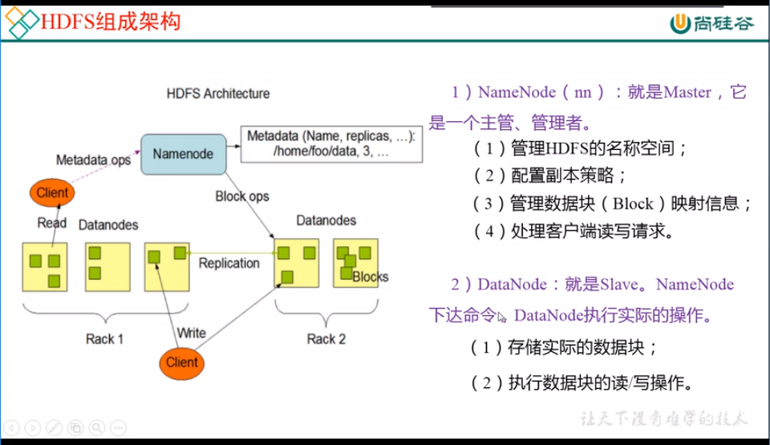
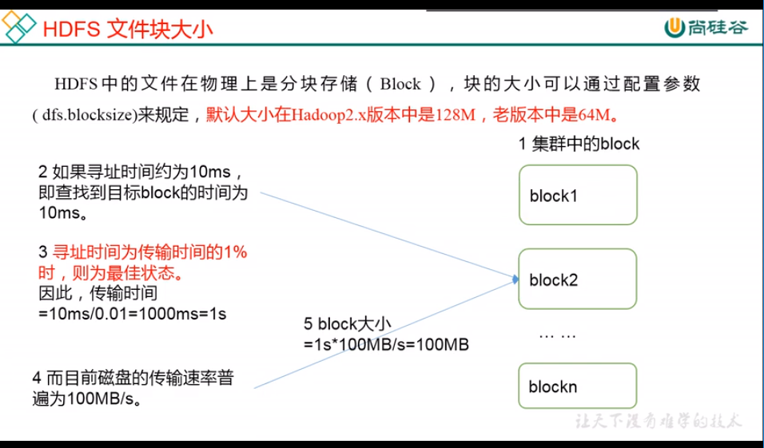
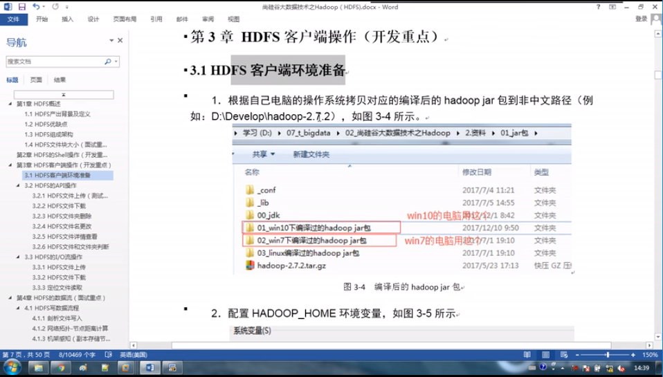
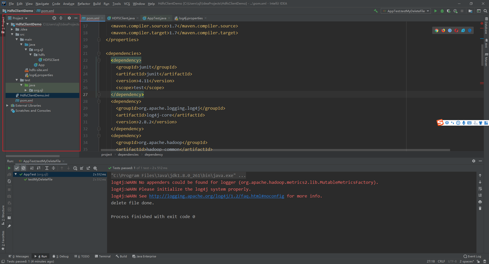
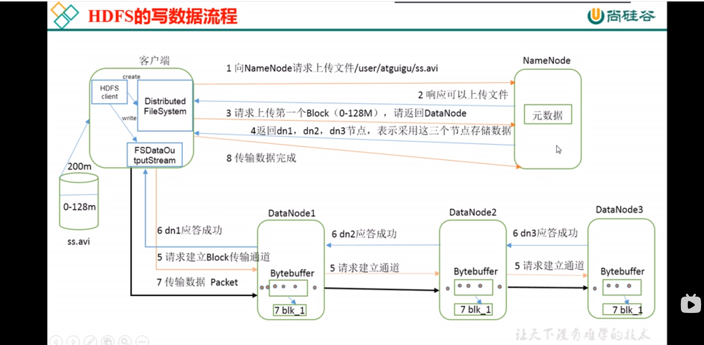
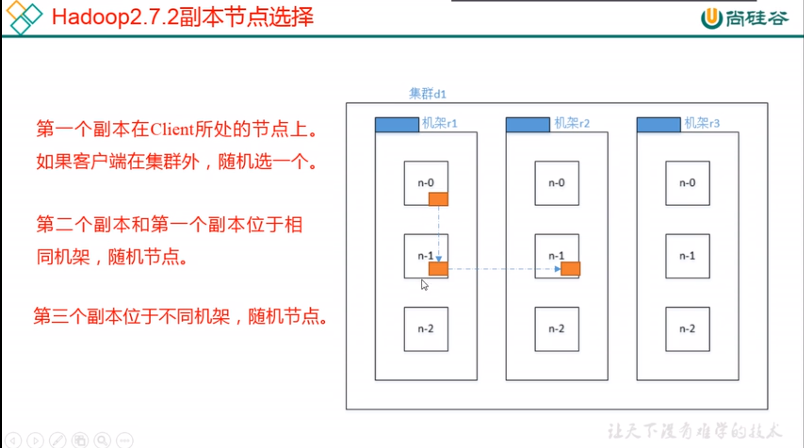
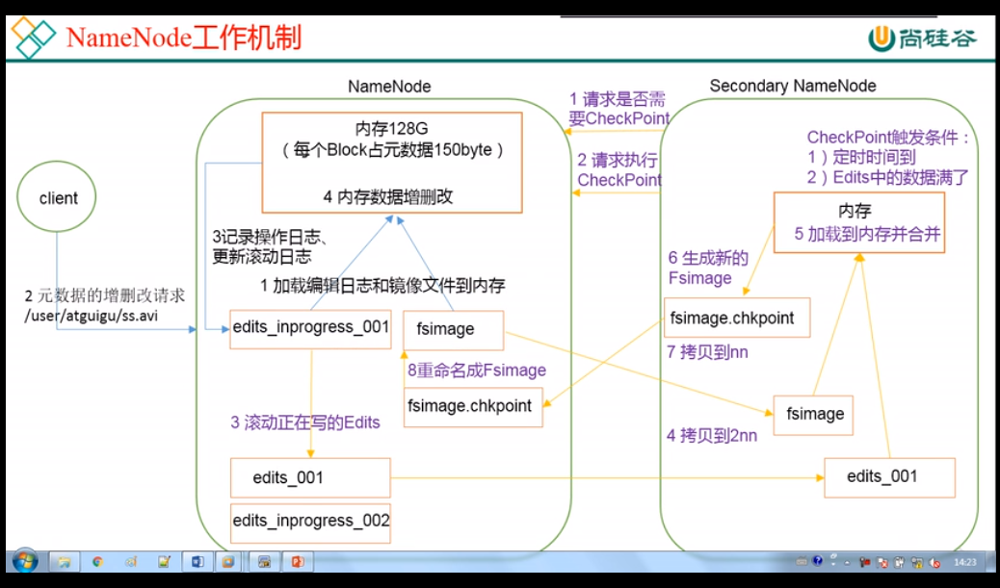

**尚硅谷Hadoop2.x课程**

## 1. 大数据概论

谈一谈对大数据的理解，只需要从存储和计算两个方面谈就行了。

### 1.1 大数据是什么？

**大数据主要解决的问题是海量数据的存储和计算问题。**

### 1.2 大数据的4大特征

1. **数据规模大（Volume）**：使用单个计算机已经无法存储了，每天数据GB，TB，总数据量为TB，PB甚至EB。
2. **数据种类繁多（Variety )**：主要分为结构化数据（数据库/文本为主），半结构化数据（如：XML，JSON等），非结构化数据（如：网络日志，音频，视频，图片，地理位置等）
3. **数据处理速度快(Velocity)** ：面对大数据，需要更快的数据处理效率。
4. **数据价值密度低(Value)**：价值密度高低与数据总量的大小成反比。单位大小的数据价值更低了，需要快速提取出有价值的数据。

### 1.3 大数据的应用场景

1. 物流仓储：大数据分析系统助力商家精细化运营、提升销量、节约成本。建立大数据分析模型。
2. 零售：分析用户消费习惯，为用户购买商品提供方便，从而提升商品销量。经典案例：尿布+啤酒。
3. 旅游：深度结构大数据能力与旅游行业需求，共建  旅游产业智慧管理、智慧服务和智慧营销的未来。
4. 商品广告推荐：给用户推荐可能喜欢的产品。
5. 保险：海量数据挖掘及风险预测，助力保险行业精准营销，提升精细化定价能力。
6. 金融：多维度体现用户特征，帮助金融机构推荐优质客户，防范欺诈风险。
7. 房产：大数据全面助力房地产行业，打造精准投策与影响，选出更合适的地，建造更合适的楼，卖给更合适的人。
8. 人工智能：


说到底，都是从多个维度建立大数据分析模型，来达到为企业决策提供帮助。

### 1.4 大数据发展前景

国家政策、人才缺口

### 1.5 大数据部门业务流程分析

1. 产品人员提需求，如：统计总用户数、日活跃用户数、回流用户数等。
2. 数据部门搭建数据平台、分析数据指标。
3. 数据可视化，如：报表展示、邮件发送、大屏展示等。

### 1.6 大数据部门组织结构（重点）

 

## 2. 从Hadoop框架讨论大数据生态

### 2.1 Hadoop是什么？

Hadoop是一个由Apache基金会开发的`分布式系统`基础架构。

**主要解决，海量数据的`存储`和海量数据的`分析计算`问题。**

广义上来说，Hadoop指的是一个更广泛的概念--Hadoop生态圈。


### 2.2 Hadoop发展历史

1. Lucene框架时Doug Cutting开创的开源软件，用Java写的，实现与Google类似的全文搜索功能，它提供了全文检索引擎的架构，包括完整的查询引擎和索引引擎。

2. Lucene与Google面临同样的困难，存储海量数据难，从海量数据中检索速度慢。

3. 学习和模仿Google解决这些问题的方法：微型版Nutch。

4. Google是Hadoop的思想之源（大数据方面的三篇论文）。

   GFS -> HDFS

   Map-Reduce -> MapReduce

   BigTable -> HBase

5. 2003-2004年，Google公开了部分GFS和MapReduce思想的细节，Doug等人据此花了2年业余时间实现了DFS和MapReduce机制，使Nutch性能飙升。

6. 2005年Hadoop作为Lucene的子项目Ntch的一部分被引入了Apache基金会。

7. 2006年，Map-Reduce和Nutch Distributed File System（NDFS）被纳入了Hadoop项目中

8. 名字和图标来源Doug儿子的玩具--一个大象玩具。

### 2.3 Hadoop三大发行版本

1. Apache。Apache版本是最原始，最基础的版本，对于入门学习最好。
2. Cloudera。在大型互联网企业中用的较多。
3. Hortonworks。文档较好。 但据说已经被Cloudera收购了。

### 2.4 Hadoop的优势（4高）

1. 高可靠性。通过副本冗余来保证数据的可靠性。
2. 高扩展性。在集群间分配任务数据，可方便的扩展数以千计的节点。
3. 高效性。在MapReduce的思想下，Hadoop是并行工作，以加快任务处理速度。
4. 高容错性。能够自动将是失败的任务重新分配。
### 2.5 Hadoop的组成（面试重点）

 

1. HDFS

   

2. YARN

   

3. MapReduce

   将计算过程分为Map和Reduce两个阶段。

   - Map阶段负责并行处理输入数据；
   - Reduce阶段对Map阶段的结果进行汇总。

### 2.6 大数据技术生态体系


### 2.7 推荐系统框架图


## 3. Hadoop运行环境搭建（开发重点）

### 3.1 虚拟机环境准备

1. 克隆虚拟机

   右键>管理>克隆


   `/etc/udev/rules.d/70-persistent-ipoib.rules`这个文件是关于网卡的。当网卡变动时，这个文件都会发生变化。

2. 修改克隆虚拟机的静态IP

   ```shell
   vim /etc/sysconfig/network-scripts/ifcfg-eth0
   ```

3. 修改主机名

   ```shell
   vim /etc/sysconfig/network
   vim /etc/hostname
   reboot
   ```

4. 关闭防火墙

   ```shell
   systemctl status firewalld
   systemctl stop firewalld
   systemctl status iptables
   systemctl stop iptables
   ```

5. 创建`atguigu`用户

   ```shell
   useradd atguigu -p sjl1991
   ```

6. 配置`atguigu`用户具有`root`权限

   ```shell
   vim /etc/sudoers
   ```

7. 在`/opt`目录下创建文件夹

   ```shell
   mkdir /opt/module
   mkdir /opt/software
   ```

   

### 3.2 安装JDK

#### 3.2.1 卸载openJDK

VM ware中自带了openjdk，其中openJDK安装好的目录位于`/usr/lib/jvm/java-1.8.0-openjdk-1.8.0.242.b08-1.el7.x86_64`

那么应该如何配置`JAVA_HOME`等环境变量呢？

首先，咱删除默认安装的openJDK，然后手动安装指定版本的JDK，再配置环境变量即可。

[使用CentOS7卸载自带jdk安装自己的JDK1.8](https://blog.csdn.net/hui_2016/article/details/69941850?utm_medium=distribute.pc_relevant.none-task-blog-2%7Edefault%7EBlogCommendFromBaidu%7Edefault-7.control&depth_1-utm_source=distribute.pc_relevant.none-task-blog-2%7Edefault%7EBlogCommendFromBaidu%7Edefault-7.control)

```shell
[root@hadoop101 alternatives]$  rpm -qa | grep java
javapackages-tools-3.4.1-11.el7.noarch
java-1.7.0-openjdk-headless-1.7.0.251-2.6.21.1.el7.x86_64
python-javapackages-3.4.1-11.el7.noarch
tzdata-java-2019c-1.el7.noarch
java-1.8.0-openjdk-1.8.0.242.b08-1.el7.x86_64
java-1.8.0-openjdk-headless-1.8.0.242.b08-1.el7.x86_64
java-1.7.0-openjdk-1.7.0.251-2.6.21.1.el7.x86_64

[root@hadoop101 opt]# rpm -e --nodeps java-1.7.0-openjdk-headless-1.7.0.251-2.6.21.1.el7.x86_64
[root@hadoop101 opt]# rpm -e --nodeps java-1.8.0-openjdk-1.8.0.242.b08-1.el7.x86_64
[root@hadoop101 opt]# rpm -e --nodeps java-1.8.0-openjdk-headless-1.8.0.242.b08-1.el7.x86_64
[root@hadoop101 opt]# rpm -e --nodeps java-1.7.0-openjdk-1.7.0.251-2.6.21.1.el7.x86_64
# 相比于之前，少了4个openjdk的包了
[root@hadoop101 opt]# rpm -qa | grep java
javapackages-tools-3.4.1-11.el7.noarch
python-javapackages-3.4.1-11.el7.noarch
tzdata-java-2019c-1.el7.noarch

```

#### 3.2.2 安装JDK8

官网下载所需版本的JDK，然后拷贝到虚拟机中的`/opt/software`目录

```shell
[atguigu@hadoop101 ~]$ tar -zxvf jdk-8u291-linux-x64.tar.gz -C /opt/module
[atguigu@hadoop101 ~]$ sudo vim /etc/profile
# 修改环境变量
#JAVA_HOME
export JAVA_HOME=/opt/module/jdk1.8.0_291
export PATH=$PATH:$JAVA_HOME/bin
export CLASSPATH=.:$JAVA_HOME/lib/dt.jar:$JAVA_HOME/lib/tools.jar

[atguigu@hadoop101 ~]$ source /etc/profile
[atguigu@hadoop101 ~]$ java -version
[atguigu@hadoop101 ~]$ javac --help
```

### 3.3 安装Hadoop

官网下载所需版本的hadoop，然后拷贝到虚拟机中的`/opt/software`目录

```shell
[atguigu@hadoop101 ~]$ tar -zxvf hadoop-2.7.2.tar.gz -C /opt/module
[atguigu@hadoop101 software]$ sudo vim /etc/profile
#HADOOP_HOME
export HADOOP_HOME=/opt/module/hadoop-2.7.2
export PATH=$PATH:$HADOOP_HOME/bin
export PATH=$PATH:$HADOOP_HOME/sbin

[atguigu@hadoop101 software]$ source /etc/profile
[atguigu@hadoop101 software]$ hadoop --help

```

### 3.4 Hadoop目录结构

```shell
[atguigu@hadoop101 software]$ cd /opt/module/hadoop-2.7.2/
[atguigu@hadoop101 hadoop-2.7.2]$ ll
total 28
drwxr-xr-x. 2 atguigu atguigu   194 Jan 26  2016 bin
drwxr-xr-x. 3 atguigu atguigu    20 Jan 26  2016 etc
drwxr-xr-x. 2 atguigu atguigu   106 Jan 26  2016 include
drwxr-xr-x. 3 atguigu atguigu    20 Jan 26  2016 lib
drwxr-xr-x. 2 atguigu atguigu   239 Jan 26  2016 libexec
-rw-r--r--. 1 atguigu atguigu 15429 Jan 26  2016 LICENSE.txt
-rw-r--r--. 1 atguigu atguigu   101 Jan 26  2016 NOTICE.txt
-rw-r--r--. 1 atguigu atguigu  1366 Jan 26  2016 README.txt
drwxr-xr-x. 2 atguigu atguigu  4096 Jan 26  2016 sbin
drwxr-xr-x. 4 atguigu atguigu    31 Jan 26  2016 share
# hadoop的命令行命令
[atguigu@hadoop101 hadoop-2.7.2]$ ll bin
total 452
-rwxr-xr-x. 1 atguigu atguigu 160351 Jan 26  2016 container-executor
-rwxr-xr-x. 1 atguigu atguigu   6488 Jan 26  2016 hadoop
-rwxr-xr-x. 1 atguigu atguigu   8786 Jan 26  2016 hadoop.cmd
-rwxr-xr-x. 1 atguigu atguigu  12223 Jan 26  2016 hdfs
-rwxr-xr-x. 1 atguigu atguigu   7478 Jan 26  2016 hdfs.cmd
-rwxr-xr-x. 1 atguigu atguigu   5953 Jan 26  2016 mapred
-rwxr-xr-x. 1 atguigu atguigu   6310 Jan 26  2016 mapred.cmd
-rwxr-xr-x. 1 atguigu atguigu   1776 Jan 26  2016 rcc
-rwxr-xr-x. 1 atguigu atguigu 205195 Jan 26  2016 test-container-executor
-rwxr-xr-x. 1 atguigu atguigu  13352 Jan 26  2016 yarn
-rwxr-xr-x. 1 atguigu atguigu  11386 Jan 26  2016 yarn.cmd
# etc目录下是所有的配置文件
[atguigu@hadoop101 hadoop-2.7.2]$ ls etc/hadoop/
capacity-scheduler.xml      httpfs-env.sh            mapred-env.sh
configuration.xsl           httpfs-log4j.properties  mapred-queues.xml.template
container-executor.cfg      httpfs-signature.secret  mapred-site.xml.template
core-site.xml               httpfs-site.xml          slaves
hadoop-env.cmd              kms-acls.xml             ssl-client.xml.example
hadoop-env.sh               kms-env.sh               ssl-server.xml.example
hadoop-metrics2.properties  kms-log4j.properties     yarn-env.cmd
hadoop-metrics.properties   kms-site.xml             yarn-env.sh
hadoop-policy.xml           log4j.properties         yarn-site.xml
hdfs-site.xml               mapred-env.cmd
# hadoop集群的启动和停止等的命令
[atguigu@hadoop101 hadoop-2.7.2]$ ll sbin/
total 120
-rwxr-xr-x. 1 atguigu atguigu 2752 Jan 26  2016 distribute-exclude.sh
-rwxr-xr-x. 1 atguigu atguigu 6452 Jan 26  2016 hadoop-daemon.sh
-rwxr-xr-x. 1 atguigu atguigu 1360 Jan 26  2016 hadoop-daemons.sh
-rwxr-xr-x. 1 atguigu atguigu 1640 Jan 26  2016 hdfs-config.cmd
-rwxr-xr-x. 1 atguigu atguigu 1427 Jan 26  2016 hdfs-config.sh
-rwxr-xr-x. 1 atguigu atguigu 2291 Jan 26  2016 httpfs.sh
-rwxr-xr-x. 1 atguigu atguigu 3128 Jan 26  2016 kms.sh
-rwxr-xr-x. 1 atguigu atguigu 4080 Jan 26  2016 mr-jobhistory-daemon.sh
-rwxr-xr-x. 1 atguigu atguigu 1648 Jan 26  2016 refresh-namenodes.sh
-rwxr-xr-x. 1 atguigu atguigu 2145 Jan 26  2016 slaves.sh
-rwxr-xr-x. 1 atguigu atguigu 1779 Jan 26  2016 start-all.cmd
-rwxr-xr-x. 1 atguigu atguigu 1471 Jan 26  2016 start-all.sh
-rwxr-xr-x. 1 atguigu atguigu 1128 Jan 26  2016 start-balancer.sh
-rwxr-xr-x. 1 atguigu atguigu 1401 Jan 26  2016 start-dfs.cmd
-rwxr-xr-x. 1 atguigu atguigu 3734 Jan 26  2016 start-dfs.sh
-rwxr-xr-x. 1 atguigu atguigu 1357 Jan 26  2016 start-secure-dns.sh
-rwxr-xr-x. 1 atguigu atguigu 1571 Jan 26  2016 start-yarn.cmd
-rwxr-xr-x. 1 atguigu atguigu 1347 Jan 26  2016 start-yarn.sh
-rwxr-xr-x. 1 atguigu atguigu 1770 Jan 26  2016 stop-all.cmd
-rwxr-xr-x. 1 atguigu atguigu 1462 Jan 26  2016 stop-all.sh
-rwxr-xr-x. 1 atguigu atguigu 1179 Jan 26  2016 stop-balancer.sh
-rwxr-xr-x. 1 atguigu atguigu 1455 Jan 26  2016 stop-dfs.cmd
-rwxr-xr-x. 1 atguigu atguigu 3206 Jan 26  2016 stop-dfs.sh
-rwxr-xr-x. 1 atguigu atguigu 1340 Jan 26  2016 stop-secure-dns.sh
-rwxr-xr-x. 1 atguigu atguigu 1642 Jan 26  2016 stop-yarn.cmd
-rwxr-xr-x. 1 atguigu atguigu 1340 Jan 26  2016 stop-yarn.sh
-rwxr-xr-x. 1 atguigu atguigu 4295 Jan 26  2016 yarn-daemon.sh
-rwxr-xr-x. 1 atguigu atguigu 1353 Jan 26  2016 yarn-daemons.sh
# 说明文档和使用案例
[atguigu@hadoop101 hadoop-2.7.2]$ ll /share
total 0
drwxr-xr-x. 3 atguigu atguigu 20 Jan 26  2016 doc
drwxr-xr-x. 9 atguigu atguigu 99 Jan 26  2016 hadoop

```

## 4. Hadoop运行模式部署

Hadoop运行模式包括：本地模式、伪分布式模式、完全分布式模式。

### 4.1 本地运行模式

Hadoop运行在单节点的单个Java进程中。

详情见[Hadoop 官网文档](https://hadoop.apache.org/docs/stable/hadoop-project-dist/hadoop-common/SingleCluster.html#Standalone_Operation)

```shell
[atguigu@hadoop101 hadoop-2.7.2]$ pwd
/opt/module/hadoop-2.7.2
[atguigu@hadoop101 hadoop-2.7.2]$ mkdir input
[atguigu@hadoop101 hadoop-2.7.2]$ cp etc/hadoop/*.xml input
[atguigu@hadoop101 hadoop-2.7.2]$ bin/hadoop jar share/hadoop/mapreduce/hadoop-mapreduce-examples-2.7.2.jar grep input output 'dfs[a-z.]+'
[atguigu@hadoop101 hadoop-2.7.2]$ cat output/*
1	dfsadmin

```

### 4.2 伪分布式模式

Hadoop运行在单节点上，但每个Hadoop daemon运行在不同的Java进程中。

#### 4.2.1 启动HDFS并运行MapReduce程序

步骤：

1. 配置集群
2. 启动、测试集群增删查。注意没有改哦
3. 执行WordCount案例
##### 4.2.1.1 配置集群

配置`hadoop-env.sh`

```shell
[atguigu@hadoop101 hadoop-2.7.2]$ echo $JAVA_HOME
/opt/module/jdk1.8.0_291
# 修改JAVA_HOME路径
[atguigu@hadoop101 hadoop-2.7.2]$ vim etc/hadoop/hadoop-env.sh
export JAVA_HOME=/opt/module/jdk1.8.0_291
```

配置`core-site.xml`

```xml
<configuration>
    <!-- 指定HDFS中NameNode的地址 -->
    <property>
        <name>fs.defaultFS</name>
        <value>hdfs://hadoop101:9000</value>
    </property>
    
    <!-- 指定Hadoop运行时产生文件的存储目录 -->
    <property>
        <name>hadoop.tmp.dir</name>
        <value>/opt/module/hadoop-2.7.2/data/tmp</value>
    </property>
</configuration>
```

**注意，一定要在`/etc/hosts`中为`hadoop101`设置正确的ip地址。**

配置`hdfs-site.xml`

```xml
<configuration>
    <!-- 指定HDFS副本数 -->
    <property>
        <name>dfs.replication</name>
        <value>1</value>
    </property>
</configuration>
```

##### 4.2.1.2 启动集群

1. 格式化`NameNode`（第一次启动时格式化，以后就不要总格式化）

   ```shell
   [atguigu@hadoop101 hadoop-2.7.2]$ bin/hdfs namenode -format
   ```

2. 启动NameNode

   ```shell
   [atguigu@hadoop101 hadoop-2.7.2]$ sbin/hadoop-daemon.sh start namenode
   ```

3. 启动NameNode

   ```shell
   [atguigu@hadoop101 hadoop-2.7.2]$ sbin/hadoop-daemon.sh start datanode
   ```

##### 4.2.1.3 查看集群

页面上访问`hadoop101:50070`，如果集群正常启动了，则能出现HDFS的UI界面。


##### 4.2.1.4 操作集群

```shell
[atguigu@hadoop101 hadoop-2.7.2]$ hdfs dfs -mkdir -p /user/atguigu/input
[atguigu@hadoop101 hadoop-2.7.2]$ hdfs dfs -ls /
[atguigu@hadoop101 hadoop-2.7.2]$ hdfs dfs -ls /user/atguigu/input
[atguigu@hadoop101 hadoop-2.7.2]$ hdfs dfs -put ./input/*.xml /user/atguigu/input
[atguigu@hadoop101 hadoop-2.7.2]$ hdfs dfs -ls /user/atguigu/input
# 执行MR程序
[atguigu@hadoop101 hadoop-2.7.2]$ hadoop jar share/hadoop/mapreduce/hadoop-mapreduce-examples-2.7.2.jar wordcount /user/atguigu/input /user/atguigu/output

# 查看MapReduce的结果
[atguigu@hadoop101 hadoop-2.7.2]$ hdfs dfs -cat /user/atguigu/output/part-r-00000
```

**思考：为什么不能一直格式化NameNode，格式化NameNode要注意什么？**


#### 4.2.2 启动YARN并运行MapReduce程序

步骤：

1. 配置集群在YARN上运行MR
2. 启动、测试集群增、删、查
3. 在YARN上执行WordCount案例

##### 4.2.2.1 配置集群

配置yarn-env.sh

```shell
[atguigu@hadoop101 hadoop-2.7.2]$ vim etc/hadoop/yarn-env.sh 
export JAVA_HOME=/opt/module/jdk1.8.0_291
```

配置yarn-site.xml

```xml
<configuration>
    <!-- Reducer获取数据的方式 -->
    <property>
        <name>yarn.nodemanager.aux-services</name>
        <value>mapreduce_shuffle</value>
    </property>
    <!-- 指定YARN的ResourceManager的地址 -->
    <property>
        <name>yarn.resourcemanager.hostname</name>
        <value>hadoop101</value>
    </property>
</configuration>
```

配置mapred-env.sh

```shell
[atguigu@hadoop101 hadoop-2.7.2]$ vim etc/hadoop/mapred-env.sh 
export JAVA_HOME=/opt/module/jdk1.8.0_291
```

4.2.2.4 配置mapred-site.xml

```xml
cp etc/hadoop/mapred-site.xml.template etc/hadoop/mapred-site.xml
vim etc/hadoop/mapred-site.xml

<configuration>
    <!-- 指定MR运行在YARN上 -->
    <property>
        <name>mapreduce.framework.name</name>
        <value>yarn</value>
    </property>
</configuration>
```

##### 4.2.2.2 启动集群

1. 首先保证NameNode和DataNode已经启动

   ```shell
   956 NameNode
   40680 Jps
   34077 DataNode
   [atguigu@hadoop101 hadoop-2.7.2]$ 
   ```

   

2. 启动ResourceManager

   ```shell
   [atguigu@hadoop101 hadoop-2.7.2]$ sbin/yarn-daemon.sh start resourcemanager
   starting resourcemanager, logging to /opt/module/hadoop-2.7.2/logs/yarn-atguigu-resourcemanager-hadoop101.out
   [atguigu@hadoop101 hadoop-2.7.2]$ jps
   40752 ResourceManager
   33956 NameNode
   40988 Jps
   34077 DataNode
   [atguigu@hadoop101 hadoop-2.7.2]$ 
   ```

   

3. 启动NodeManager

   ```shell
   [atguigu@hadoop101 hadoop-2.7.2]$ sbin/yarn-daemon.sh start nodemanager
   starting nodemanager, logging to /opt/module/hadoop-2.7.2/logs/yarn-atguigu-nodemanager-hadoop101.out
   [atguigu@hadoop101 hadoop-2.7.2]$ 
   
   [atguigu@hadoop101 hadoop-2.7.2]$ jps
   40752 ResourceManager
   33956 NameNode
   41097 NodeManager
   40988 Jps
   34077 DataNode
   [atguigu@hadoop101 hadoop-2.7.2]$ 
   ```

##### 4.2.2.3 查看集群


##### 4.2.2.4 操作集群

```shell
[atguigu@hadoop101 hadoop-2.7.2]$ hdfs dfs -rm -r /user/atguigu/output
21/06/14 19:43:02 INFO fs.TrashPolicyDefault: Namenode trash configuration: Deletion interval = 0 minutes, Emptier interval = 0 minutes.
Deleted /user/atguigu/output
[atguigu@hadoop101 hadoop-2.7.2]$ hadoop jar share/hadoop/mapreduce/hadoop-mapreduce-examples-2.7.2.jar wordcount /user/atguigu/input /user/atguigu/output
```

#### 4.2.3 配置历史服务器

1. 配置`mapred-site.xml`

   ```xml
   <!-- 历史服务器端地址 -->
   <property>
   	<name>mapreduce.jobhistory.address</name>
       <value>hadoop101:10020</value>
   </property>
   <!-- 历史服务器web端地址 -->
   <property>
   	<name>mapreduce.jobhistory.webapp.address</name>
       <value>hadoop101:19888</value>
   </property>
   ```

2. 启动历史服务器

   ```shell
   [atguigu@hadoop101 hadoop-2.7.2]$ sbin/mr-jobhistory-daemon.sh start historyserver
   ```

   

3. 查看历史服务器是否启动

   ```shell
   [atguigu@hadoop101 hadoop-2.7.2]$ jps
   ```

   

4. 查看`JobHistory`

   `http://hadoop101:19888/jobhistory`

#### 4.2.4 配置日志的聚集

日志聚集：应用运行完成后，将程序运行日志信息上传到HDFS上。

日志聚集的好处：可以方便查看到程序运行详情，方便开发调试。

注意：开启日志聚集功能，需要重启`NodeManager`、`ResourceManager`和`HistoryManager`。

1. 配置`yarn-site.xml`

   ```xml
   vim etc/hadoop/yarn-site.xml
   # 添加如下配置
   <!-- 日志聚集功能 -->
   <property>
   	<name>yarn.log-aggregation-enable</name>
       <value>true</value>
   </property>
   <!-- 日志保留时间设置为7天 -->
   <property>
   	<name>yarn.log-aggregation.retain-seconds</name>
       <value>604800</value>
   </property>
   ```

2. 关闭`NodeManager`、`ResourceManager`和`HistoryManager`

   ```shell
   [atguigu@hadoop101 hadoop-2.7.2]$ sbin/yarn-daemon.sh stop resourcemanager
   [atguigu@hadoop101 hadoop-2.7.2]$ sbin/yarn-daemon.sh stop nodemanager
   [atguigu@hadoop101 hadoop-2.7.2]$ sbin/yarn-daemon.sh stop historyserver
   [atguigu@hadoop101 hadoop-2.7.2]$ jps
   ```

   

3. 启动`NodeManager`、`ResourceManager`和`HistoryManager`

   ```shell
   [atguigu@hadoop101 hadoop-2.7.2]$ sbin/yarn-daemon.sh start resourcemanager
   [atguigu@hadoop101 hadoop-2.7.2]$ sbin/yarn-daemon.sh start nodemanager
   [atguigu@hadoop101 hadoop-2.7.2]$ sbin/yarn-daemon.sh start historyserver
   ```

   

4. 删除HDFS上已经存在的输出文件

   ```shell
   [atguigu@hadoop101 hadoop-2.7.2]$ hdfs dfs -rm -r /user/atguigu/output
   ```

   

5. 执行WordCount程序

   ```shell
   [atguigu@hadoop101 hadoop-2.7.2]$ hadoop jar share/hadoop/mapreduce/hadoop-mapreduce-examples-2.7.2.jar wordcount /user/atguigu/input /user/atguigu/output
   ```

#### 4.2.5 配置文件说明

Hadoop配置文件分为：默认配置文件和自定义配置文件，只有用户想修改某一默认配置值时，才需要修改自定义配置文件，更改相应的属性值。

1. 默认配置文件

   | 默认配置文件       | 文件存放在Hadoop的jar包中的位置                            |
   | ------------------ | ---------------------------------------------------------- |
   | core-default.xml   | hadoop-common-2.7.2.jar/core-default.xml                   |
   | hdfs-default.xml   | hadoop-hdfs-2.7.2.jar/hdfs-default.xml                     |
   | yarn-default.xml   | hadoop-common-2.7.2.jar/yarn-default.xml                   |
   | mapred-default.xml | hadoop-cmapreduce-client-core-2.7.2.jar/mapred-default.xml |

   Hadoop官网上对这些默认配置都有说明

2. 自定义配置文件

   `core-site.xml`、`hdfs-site.xml`、`yarn-site.xml`、`mapred-site.xml`四个配置文件存放在`$HADOOP_HOME/etc/hadoop`这个路径下，用户可以根据项目需求重新进行修改配置。

### 4.3 完全分布式模式（开发重点）

步骤：

1. 准备3台服务器（关闭防火墙、静态IP、主机名称）
2. 安装JDK
3. 配置环境变量
4. 安装Hadoop
5. 配置环境变量
6. 配置集群
7. 单点启动
8. 配置ssh
9. 群起并测试集群

#### 4.3.1 虚拟机准备

详情见3.1

#### 4.3.2 编写集群分发脚本`xsync`
1. **scp（secure copy），安全拷贝**

   scp可以实现服务器之间的数据拷贝。

   ```shell
   # 基本语法
   # 推，拷贝数据到远程主机
   scp [选项] $pdir/$fname $user@$hostname:$pdir/$fname
   # 拉，从远程主机拷贝数据
   scp [选项] $user@$hostname:$pdir/$fname $pdir/$fname
   scp -r /opt/module root@hadoop102:/opt/module
   ```

   

2. **rsync，远程同步工具**

   rsync 主要用于备份和镜像。速度快、避免复制相同的内容和支持符号链接（symbol link）的优点。

   **rsync 和 scp 的区别**：用rsync做文件的复制要比scp的速度快，rsync只对有差异的文件做更新。scp是把所有文件都复制过去。

   ```shell
   # 基本语法
   rsync [选项] $pdir/$fname $user@$hostname:$pdir/$fname
#示例, -r 递归，-v 显示复制过程，-l拷贝符号连接 
   rsync -rvl sjl-test.txt root@hadoop102:/opt   
   ```
```

   

3. **xsync，集群分发脚本**

   循环复制文件到所有节点的相同路径下。

   这个脚本是需要写的，并不是linux中的某个命令行工具。在`/home/atguigu/bin`目录下，创建一个`xsync`的脚本，脚本内容如下：

   ```shell
   #!/bin/bash
   # 1.获取输入参数的个数，如果没有参数，则直接退出
   pcount=$#
   if((pcount==0)); then
   	echo no args;
   	exit;
   fi
   
   # 2.获取文件名称
   p1=$1 # 输入的路径，从路径中获取文件名
   fname=`basename $p1`
   echo fname=$fname
   
   # 3. 获取上级目录到绝对路径
   pdir=`cd -P $(dirname $p1); pwd` # dirname获取输入路径中的除文件名以外的部分
   echo pdir=$pdir
   
   # 4. 获取当前用户名
   user=`whoami`
   
   # 5. 循环
   for ((host=103; host<105; host++)); do
   	echo ------------------ hadoop$host -------------------
   	rsync -rvl $pdir/$fname $user@hadoop$host:$pdir
   done
```

   修改 `xsync`具有执行权限

   ```shell
   [atguigu@hadoop103 bin]$ chmod 777 xsync
   ```

   调用脚本形式的`xsync`文件名称

   ```shell
   [atguigu@hadoop103 bin]$ xsync /homne/atguigu/bin
   ```

#### 4.3.3 集群配置

##### 4.3.3.1 集群部署规划

| 组件 | hadoop102            | hadoop103                      | hadoop104                     |
| ---- | -------------------- | ------------------------------ | ----------------------------- |
| HDFS | NameNode<br>DataNode | DataNode                       | SecondaryNameNode<br>DataNode |
| YARN | NodeManager          | ResourceManager<br>NodeManager | NodeManager                   |

##### 4.3.3.2 配置集群

1. 核心配置文件

   配置`core-site.xml`

   ```shell
   <configuration>
       <!-- 指定HDFS中NameNode的地址 -->
       <property>
           <name>fs.defaultFS</name>
           <value>hdfs://hadoop102:9000</value>
       </property>
       
       <!-- 指定Hadoop运行时产生文件的存储目录 -->
       <property>
           <name>hadoop.tmp.dir</name>
           <value>/opt/module/hadoop-2.7.2/data/tmp</value>
       </property>
   </configuration>
   ```

   配置`hadoop-env.sh`

   ```shell
   [atguigu@hadoop101 hadoop-2.7.2]$ echo $JAVA_HOME
   /opt/module/jdk1.8.0_291
   # 修改JAVA_HOME路径
   [atguigu@hadoop101 hadoop-2.7.2]$ vim etc/hadoop/hadoop-env.sh
   export JAVA_HOME=/opt/module/jdk1.8.0_291
   ```

   

   配置`hdfs-site.xml`

   ```xml
   <configuration>
       <!-- 指定HDFS副本数 -->
       <property>
           <name>dfs.replication</name>
           <value>3</value>
       </property>
       <!-- 指定Hadoop SNN节点的主机配置 -->
       <property>
       	<name>dfs.namenode.secondary.http-address</name>
           <value>hadoop104:50090</value>
       </property>
   </configuration>
   ```

   

2. YARN配置文件

   配置`yarn-env.sh`

   ```shell
   [atguigu@hadoop101 hadoop-2.7.2]$ vim etc/hadoop/yarn-env.sh 
   export JAVA_HOME=/opt/module/jdk1.8.0_291
   ```

   配置`yarn-site.xml`

   ```xml
   <configuration>
       <!-- Reducer获取数据的方式 -->
       <property>
           <name>yarn.nodemanager.aux-services</name>
           <value>mapreduce_shuffle</value>
       </property>
       <!-- 指定YARN的ResourceManager的地址 -->
       <property>
           <name>yarn.resourcemanager.hostname</name>
           <value>hadoop103</value>
       </property>
   </configuration>
   ```

   

3. MapReduce配置文件

   配置`mapred-env.sh`

   ```shell
   [atguigu@hadoop101 hadoop-2.7.2]$ vim etc/hadoop/mapred-env.sh 
   export JAVA_HOME=/opt/module/jdk1.8.0_291
   ```

   配置`mapred-site.xml`

   ```xml
   cp etc/hadoop/mapred-site.xml.template etc/hadoop/mapred-site.xml
   vim etc/hadoop/mapred-site.xml
   
   <configuration>
       <!-- 指定MR运行在YARN上 -->
       <property>
           <name>mapreduce.framework.name</name>
           <value>yarn</value>
       </property>
   </configuration>
   ```

4. 在集群上分发配置好的Hadoop配置文件

   ```shell
   xsync /opt/module/hadoop-2.7.2/
   ```

5. 查看文件分发情况

   ```shell
   cat /opt/module/hadoop-2.7.2/etc/hadoop/core-site.xml
   ```

#### 4.3.4 集群的单点启动

1. 如果集群是第一次启动，则需要**格式化NameNode**

   ```shell
   [atguigu@hadoop101 hadoop-2.7.2]$ bin/hdfs namenode -format
   ```

   若不是，则需要删除之前的日志和数据目录的文件。对hadoop102、hadoop103、hadoop104都需要这样做。

   ```shell
   [atguigu@hadoop101 hadoop-2.7.2]$ rm -rf data/ logs/
   ```

   

2. 在hadoop102上启动NameNode

   ```shell
   [atguigu@hadoop102 hadoop-2.7.2]$ sbin/hadoop-daemon.sh start namenode
   ```

   

3. 在hadoop102、hadoop103、hadoop104上分别启动DataNode

   ```shell
   sbin/hadoop-daemon.sh start datanode
   ```

4. 查看集群是否正常启动

   通过hadoop102:50070查看hdfs的UI是否能正常打开


#### 4.3.5 配置SSH免密登录


##### 4.3.5.1 配置SSH

```shell
[atguigu@hadoop102 hadoop-2.7.2]$ ll ~/.ssh
total 4
-rw-r--r--. 1 atguigu atguigu 370 Jun 15 12:58 known_hosts
# ~/.ssh/known_hosts 记录了所有ssh访问过的主机
[atguigu@hadoop102 hadoop-2.7.2]$ cat ~/.ssh/known_hosts
hadoop103,192.168.1.103 ecdsa-sha2-nistp256 AAAAE2VjZHNhLXNoYTItbmlzdHAyNTYAAAAIbmlzdHAyNTYAAABBBAXis27U8Fs4MylxZPO5W8is3w3rCrbbKBrXpklPEXq7650Y/u2f7Ds9+o+a67iXyyB54A/KklI3ePrFeODQ83g=
hadoop104,192.168.1.104 ecdsa-sha2-nistp256 AAAAE2VjZHNhLXNoYTItbmlzdHAyNTYAAAAIbmlzdHAyNTYAAABBBAXis27U8Fs4MylxZPO5W8is3w3rCrbbKBrXpklPEXq7650Y/u2f7Ds9+o+a67iXyyB54A/KklI3ePrFeODQ83g=
[atguigu@hadoop102 hadoop-2.7.2]$ 

# 生成SSH公钥和私钥
[atguigu@hadoop102 hadoop-2.7.2]$ ssh-keygen -t rsa
Generating public/private rsa key pair.
Enter file in which to save the key (/home/atguigu/.ssh/id_rsa): 
Enter passphrase (empty for no passphrase): 
Enter same passphrase again: 
Your identification has been saved in /home/atguigu/.ssh/id_rsa.
Your public key has been saved in /home/atguigu/.ssh/id_rsa.pub.
The key fingerprint is:
SHA256:pwDfVu6zXlyVg1L/Wk/Z8aj9rJL8YISOhJIWSvQ9qtM atguigu@hadoop102
The key's randomart image is:
+---[RSA 2048]----+
|  .          .   |
| . . .      . o .|
|  . + o   .. . =.|
| . . * + o ..  oB|
|  . = + S + . o.*|
|   + . + * o + +.|
|  o E   o +.*.o .|
|   .       =+. o |
|         .o  oo.o|
+----[SHA256]-----+
[atguigu@hadoop102 hadoop-2.7.2]$ ll ~/.ssh
total 12
-rw-------. 1 atguigu atguigu 1675 Jun 15 14:53 id_rsa
-rw-r--r--. 1 atguigu atguigu  399 Jun 15 14:53 id_rsa.pub
-rw-r--r--. 1 atguigu atguigu  370 Jun 15 12:58 known_hosts
[atguigu@hadoop102 hadoop-2.7.2]$ 

# 将hadoop102的公钥拷贝到hadoop103上
[atguigu@hadoop102 hadoop-2.7.2]$ ssh-copy-id hadoop103
/usr/bin/ssh-copy-id: INFO: Source of key(s) to be installed: "/home/atguigu/.ssh/id_rsa.pub"
/usr/bin/ssh-copy-id: INFO: attempting to log in with the new key(s), to filter out any that are already installed
/usr/bin/ssh-copy-id: INFO: 1 key(s) remain to be installed -- if you are prompted now it is to install the new keys
atguigu@hadoop103's password: 

Number of key(s) added: 1

Now try logging into the machine, with:   "ssh 'hadoop103'"
and check to make sure that only the key(s) you wanted were added.

# 在hadoop103上查看是否拷贝成功了
[atguigu@hadoop103 hadoop-2.7.2]$ ll ~/.ssh/
total 16
-rw-------. 1 atguigu atguigu  399 Jun 15 14:57 authorized_keys
-rw-------. 1 atguigu atguigu 1679 Jun 15 14:53 id_rsa
-rw-r--r--. 1 atguigu atguigu  399 Jun 15 14:53 id_rsa.pub
-rw-r--r--. 1 atguigu atguigu  185 Jun 15 12:52 known_hosts

# 验证从hadoop102是否能免密SSH到hadoop103
[atguigu@hadoop102 hadoop-2.7.2]$ ssh hadoop103
Last login: Tue Jun 15 12:28:37 2021 from 192.168.1.35
[atguigu@hadoop103 ~]$ logout
Connection to hadoop103 closed.

```

同理对hadoop102配置可免密登录hadoop104。

注意：

还需要在hadoop102上采用root账号，配置一下免密登录到hadoop102、hadoop103、hadoop104；

还需要在hadoop103上采用atguigu账号，配置一下免密登录到hadoop102、hadoop103、hadoop104

#### 4.3.6 群起集群

##### 4.3.6.1 配置slaves

```shell
# /opt/module/hadoop-2.7.2/etc/hadoop/slaves
[atguigu@hadoop102 hadoop-2.7.2]$ vim etc/hadoop/slaves
# 不允许有空行和空格，列出所有的datanode所在节点
hadoop102
hadoop103
hadoop104

# 同步到所有节点配置文件
[atguigu@hadoop102 hadoop-2.7.2]$ xsync etc/hadoop/slaves 
fname=slaves
pdir=/opt/module/hadoop-2.7.2/etc/hadoop
------------------ hadoop103 -------------------
sending incremental file list
slaves

sent 120 bytes  received 41 bytes  107.33 bytes/sec
total size is 30  speedup is 0.19
------------------ hadoop104 -------------------
sending incremental file list
slaves

sent 120 bytes  received 41 bytes  107.33 bytes/sec
total size is 30  speedup is 0.19
[atguigu@hadoop102 hadoop-2.7.2]$ 
```

##### 4.3.6.2 启动集群

**启动HDFS**

```shell
# hadoop102
[atguigu@hadoop102 hadoop-2.7.2]$ sbin/start-dfs.sh 
Starting namenodes on [hadoop102]
hadoop102: starting namenode, logging to /opt/module/hadoop-2.7.2/logs/hadoop-atguigu-namenode-hadoop102.out
hadoop102: starting datanode, logging to /opt/module/hadoop-2.7.2/logs/hadoop-atguigu-datanode-hadoop102.out
hadoop103: starting datanode, logging to /opt/module/hadoop-2.7.2/logs/hadoop-atguigu-datanode-hadoop103.out
hadoop104: starting datanode, logging to /opt/module/hadoop-2.7.2/logs/hadoop-atguigu-datanode-hadoop104.out
Starting secondary namenodes [hadoop104]
hadoop104: starting secondarynamenode, logging to /opt/module/hadoop-2.7.2/logs/hadoop-atguigu-secondarynamenode-hadoop104.out
[atguigu@hadoop102 hadoop-2.7.2]$ jps
8081 NameNode
8227 DataNode
8456 Jps

# hadoop103
[atguigu@hadoop103 hadoop-2.7.2]$ jps
6851 DataNode
6933 Jps

# hadoop104
[atguigu@hadoop104 hadoop-2.7.2]$ jps
6417 SecondaryNameNode
6467 Jps
6300 DataNode

```

**启动YARN**

必须在hadoop103上启，因为RM在hadoop103上。

```shell
# hadoop103
[atguigu@hadoop103 hadoop-2.7.2]$ sbin/start-yarn.sh
starting yarn daemons
starting resourcemanager, logging to /opt/module/hadoop-2.7.2/logs/yarn-atguigu-resourcemanager-hadoop103.out
hadoop102: starting nodemanager, logging to /opt/module/hadoop-2.7.2/logs/yarn-atguigu-nodemanager-hadoop102.out
hadoop103: starting nodemanager, logging to /opt/module/hadoop-2.7.2/logs/yarn-atguigu-nodemanager-hadoop103.out
hadoop104: starting nodemanager, logging to /opt/module/hadoop-2.7.2/logs/yarn-atguigu-nodemanager-hadoop104.out
[atguigu@hadoop103 hadoop-2.7.2]$ jps
7009 ResourceManager
6851 DataNode
7123 NodeManager
7279 Jps

# hadoop102
[atguigu@hadoop102 hadoop-2.7.2]$ jps
8081 NameNode
8227 DataNode
8539 NodeManager
8653 Jps
# hadoop104
[atguigu@hadoop104 hadoop-2.7.2]$ jps
6560 NodeManager
6417 SecondaryNameNode
6681 Jps
6300 DataNode

```


##### 4.3.6.3 集群基本测试

1. 上传文件到集群

   ```shell
   # 上传一个小文件，小于一个block（默认128MB）大小
   [atguigu@hadoop103 hadoop-2.7.2]$ hdfs dfs -mkdir -p /user/atguigu/input
   [atguigu@hadoop103 hadoop-2.7.2]$ hdfs dfs -ls /
   Found 1 items
   drwxr-xr-x   - atguigu supergroup          0 2021-06-15 16:47 /user
   [atguigu@hadoop103 hadoop-2.7.2]$ hdfs dfs -put input /user/atguigu/input
   [atguigu@hadoop103 hadoop-2.7.2]$ hdfs dfs -ls /user/atguigu/input
   Found 1 items
   drwxr-xr-x   - atguigu supergroup          0 2021-06-15 16:47 /user/atguigu/input/input
   [atguigu@hadoop103 hadoop-2.7.2]$ hdfs dfs -ls /user/atguigu/input/input
   Found 8 items
   -rw-r--r--   3 atguigu supergroup       4436 2021-06-15 16:47 /user/atguigu/input/input/capacity-scheduler.xml
   -rw-r--r--   3 atguigu supergroup        774 2021-06-15 16:47 /user/atguigu/input/input/core-site.xml
   -rw-r--r--   3 atguigu supergroup       9683 2021-06-15 16:47 /user/atguigu/input/input/hadoop-policy.xml
   -rw-r--r--   3 atguigu supergroup        775 2021-06-15 16:47 /user/atguigu/input/input/hdfs-site.xml
   -rw-r--r--   3 atguigu supergroup        620 2021-06-15 16:47 /user/atguigu/input/input/httpfs-site.xml
   -rw-r--r--   3 atguigu supergroup       3518 2021-06-15 16:47 /user/atguigu/input/input/kms-acls.xml
   -rw-r--r--   3 atguigu supergroup       5511 2021-06-15 16:47 /user/atguigu/input/input/kms-site.xml
   -rw-r--r--   3 atguigu supergroup        690 2021-06-15 16:47 /user/atguigu/input/input/yarn-site.xml
   # 上传一个大文件，大于一个block（默认128MB）大小
   [atguigu@hadoop103 hadoop-2.7.2]$ hdfs dfs -put ../../software/hadoop-2.7.2.tar.gz /
   [atguigu@hadoop103 hadoop-2.7.2]$ hdfs dfs -ls /
   Found 2 items
   -rw-r--r--   3 atguigu supergroup  212046774 2021-06-15 16:51 /hadoop-2.7.2.tar.gz
   drwxr-xr-x   - atguigu supergroup          0 2021-06-15 16:47 /user
   [atguigu@hadoop103 hadoop-2.7.2]$ 
   ```

   

2. 上传文件后，查看文件存放在什么位置

   http:///hadoop102:50070 namenode的ui界面

   http://hadoop104:50090 secondarynamenode的ui界面

   

   ```shell
   [atguigu@hadoop102 subdir0]$ ll
   total 208784
   -rw-rw-r--. 1 atguigu atguigu      4436 Jun 15 16:47 blk_1073741825
   -rw-rw-r--. 1 atguigu atguigu        43 Jun 15 16:47 blk_1073741825_1001.meta
   -rw-rw-r--. 1 atguigu atguigu       774 Jun 15 16:47 blk_1073741826
   -rw-rw-r--. 1 atguigu atguigu        15 Jun 15 16:47 blk_1073741826_1002.meta
   -rw-rw-r--. 1 atguigu atguigu      9683 Jun 15 16:47 blk_1073741827
   -rw-rw-r--. 1 atguigu atguigu        83 Jun 15 16:47 blk_1073741827_1003.meta
   -rw-rw-r--. 1 atguigu atguigu       775 Jun 15 16:47 blk_1073741828
   -rw-rw-r--. 1 atguigu atguigu        15 Jun 15 16:47 blk_1073741828_1004.meta
   -rw-rw-r--. 1 atguigu atguigu       620 Jun 15 16:47 blk_1073741829
   -rw-rw-r--. 1 atguigu atguigu        15 Jun 15 16:47 blk_1073741829_1005.meta
   -rw-rw-r--. 1 atguigu atguigu      3518 Jun 15 16:47 blk_1073741830
   -rw-rw-r--. 1 atguigu atguigu        35 Jun 15 16:47 blk_1073741830_1006.meta
   -rw-rw-r--. 1 atguigu atguigu      5511 Jun 15 16:47 blk_1073741831
   -rw-rw-r--. 1 atguigu atguigu        51 Jun 15 16:47 blk_1073741831_1007.meta
   -rw-rw-r--. 1 atguigu atguigu       690 Jun 15 16:47 blk_1073741832
   -rw-rw-r--. 1 atguigu atguigu        15 Jun 15 16:47 blk_1073741832_1008.meta
   -rw-rw-r--. 1 atguigu atguigu 134217728 Jun 15 16:51 blk_1073741833
   -rw-rw-r--. 1 atguigu atguigu   1048583 Jun 15 16:51 blk_1073741833_1009.meta
   -rw-rw-r--. 1 atguigu atguigu  77829046 Jun 15 16:51 blk_1073741834
   -rw-rw-r--. 1 atguigu atguigu    608047 Jun 15 16:51 blk_1073741834_1010.meta
   [atguigu@hadoop102 subdir0]$ pwd
   /opt/module/hadoop-2.7.2/data/tmp/dfs/data/current/BP-1822113587-192.168.1.102-1623739190081/current/finalized/subdir0/subdir0
   
   ```

   

3. x

4. 下载

   ```shell
   hadoop fs -get /hadoop-2.7.2.tar.gz ./
   ```

   

#### 4.3.7 集群启动/停止方式总结

##### 4.3.7.1 各个服务组件逐一启动/停止

启停HDFS组件

```shell
hadoop-daemon.sh [start|stop] [namenode|datanode|secondarynamenode]
```

启停YARN组件

```shell
yarn-daemon.sh [start|stop] [resourcemanager|nodemanager]
```

##### 4.3.7.2 各个模块分开启动/停止（配置SSH为前提）（常用)

整体启停HDFS

```shell
sbin/start-dfs.sh
sbin/stop-dfs.sh
```

整体启停YARN

```shell
sbin/start-yarn.sh
sbin/stop-yarn.sh
```

#### 4.3.8 集群时间同步（重要）

时间同步的方式：找一个机器作为时间服务器，所有的机器都与这台机器进行时间同步，比如：每隔10min同步一次（通过crontab来实现）。


##### 4.3.8.1 时间服务器配置（**必须root用户**）

1. 检查ntp是否安装

   ```shell
   [atguigu@hadoop103 hadoop-2.7.2]$ crontab -l
   no crontab for atguigu
   [atguigu@hadoop103 hadoop-2.7.2]$ su root
   Password: 
   [root@hadoop103 hadoop-2.7.2]# rpm -qa |grep ntp
   fontpackages-filesystem-1.44-8.el7.noarch
   python-ntplib-0.3.2-1.el7.noarch
   ntp-4.2.6p5-29.el7.centos.x86_64
   ntpdate-4.2.6p5-29.el7.centos.x86_64
   ```

2. 修改ntp配置文件

   ```shell
   [root@hadoop103 hadoop-2.7.2]# vim /etc/ntp.conf
   # 修改内容如下：
   
   # 修改1. 授权192.168.10-192.168.1.255 网段上的所有机器可以从这台机器上查询和同步时间
   #restrict 192.168.1.0 mask 255.255.255.0 nomodify notrap
   取消注释
   restrict 192.168.1.0 mask 255.255.255.0 nomodify notrap
   # 修改2. 集群在局域网中，不适用其他互联网上的时间
   server 0.centos.pool.ntp.org iburst
   server 1.centos.pool.ntp.org iburst
   server 2.centos.pool.ntp.org iburst
   server 3.centos.pool.ntp.org iburst
   注释掉
   #server 0.centos.pool.ntp.org iburst
   #server 1.centos.pool.ntp.org iburst
   #server 2.centos.pool.ntp.org iburst
   #server 3.centos.pool.ntp.org iburst
   
   # 添加3.当该节点丢失网络连接，依然可以采用本地时间作为时间服务器为集群中的其他节点提供时间同步
   server 127.127.1.0
   fudge 127.127.1.0 stratum 10
   
   ```

3. 修改`/etc/sysconfig/ntpd`文件

   ```shell
   [root@hadoop103 hadoop-2.7.2]# vim /etc/sysconfig/ntpd
   # 添加如下内容，让硬件时间与系统时间一起同步
   SYNC_HWCLOCK=yes
   ```

4. 重新启动`ntpd`服务

   ```shell
   service ntpd status
   service ntpd start
   service ntpd stop
   service ntpd restart
   
   [root@hadoop102 subdir0]# service ntpd status
   Redirecting to /bin/systemctl status ntpd.service
   ● ntpd.service - Network Time Service
      Loaded: loaded (/usr/lib/systemd/system/ntpd.service; disabled; vendor preset: disabled)
      Active: inactive (dead)
   [root@hadoop102 subdir0]# service ntpd start
   Redirecting to /bin/systemctl start ntpd.service
   [root@hadoop102 subdir0]# service ntpd status
   Redirecting to /bin/systemctl status ntpd.service
   ● ntpd.service - Network Time Service
      Loaded: loaded (/usr/lib/systemd/system/ntpd.service; disabled; vendor preset: disabled)
      Active: active (running) since Tue 2021-06-15 18:31:45 CST; 4s ago
     Process: 10615 ExecStart=/usr/sbin/ntpd -u ntp:ntp $OPTIONS (code=exited, status=0/SUCCESS)
    Main PID: 10618 (ntpd)
       Tasks: 1
      Memory: 1.4M
      CGroup: /system.slice/ntpd.service
              └─10618 /usr/sbin/ntpd -u ntp:ntp -g
   
   Jun 15 18:31:45 hadoop102 ntpd[10618]: Listen normally on 5 docker_gwbridge 172.19.0.1 ...123
   Jun 15 18:31:45 hadoop102 ntpd[10618]: Listen normally on 6 br-9f19cd8b27c1 172.18.0.1 ...123
   Jun 15 18:31:45 hadoop102 ntpd[10618]: Listen normally on 7 docker0 172.17.0.1 UDP 123
   Jun 15 18:31:45 hadoop102 ntpd[10618]: Listen normally on 8 lo ::1 UDP 123
   Jun 15 18:31:45 hadoop102 ntpd[10618]: Listen normally on 9 ens33 fe80::20c:29ff:fed3:2...123
   Jun 15 18:31:45 hadoop102 ntpd[10618]: Listening on routing socket on fd #26 for interf...tes
   Jun 15 18:31:45 hadoop102 ntpd[10618]: 0.0.0.0 c016 06 restart
   Jun 15 18:31:45 hadoop102 ntpd[10618]: 0.0.0.0 c012 02 freq_set kernel 0.000 PPM
   Jun 15 18:31:45 hadoop102 ntpd[10618]: 0.0.0.0 c011 01 freq_not_set
   Jun 15 18:31:46 hadoop102 ntpd[10618]: 0.0.0.0 c514 04 freq_mode
   Hint: Some lines were ellipsized, use -l to show in full.
   ```

5. 设置`ntpd`服务开机启动

   ```shell
   chkconfig ntpd on
   ```

##### 4.3.8.2 其他机器配置（必须root用户）

1. 在其它机器配置10min与时间服务器同步一次

   ```shell
   crontab -e
   # 添加
   */10 * * * * /usr/sbin/ntpdate hadoop102
   ```

2. 修改任意机器时间

   ```shell
   date -s "2020 20:20:20"
   ```

3. 十分钟后，查看机器是否与时间服务器同步

   ```shell
   date
   ```

   

## 5. Hadoop编译源码（面试重点）

因为hadoo官网中的源码包都是32bit，但是现在多是64bit的电脑，因此需要。

### 5.1 前期准备工作

1. CentOS联网

   配置CentOS能连接外网。Linux虚拟机ping www.baidu.com畅通。

   <font color=red>注意：采用root用户编译，减少因权限出现的问题</font>

2. jar包准备（hadoop源码、JDK8、maven、ant、protobuf）

   (1) hadoop-2.7.2-src.tar.gz

   (2) jdk-8u144-linx-x64.tar.gz

   (3) apache-ant-1.9.9-bin.tar.gz（build工具，打包用的）

   (4) apache-maven-3.0.5-bin.tar.gz

   (5) protobuf-2.5.0.tar.gz（序列化的框架）

### 5.2 jar包安装

<font color=red>注意： 所有操作必须在root用户下完成</font>

1. JDK解压，配置环境变量`JAVA_HOME`和`PATH`，验证`java -version`

   ```shell
   tar -zxvf jdk-8u144-linux-x64.tar.gz -C /opt/module/
   
   vim /etc/profile
   # JAVA_HOME
   export JAVA_HOME=/opt/module/jdk1.8.0_144
   export PATH=$PATH:$JAVA_HOME/bin
   
   source /etc/profile
   ```

2. maven解压、配置MAVEN_HOME和PATH

   ```shell
   tar -zxvf apache-maven-3.0.5-bin.tar.gz -C /opt/module/
   
   vim conf/settings.xml
   # 修改，镜像源
   <mirror>
   	<id>nexus-aliyun</id>
   	<mirrorOf>central</mirrorOf>
   	<name>Nexus aliyun</name>
   	<url>http://maven.aliyun.com/nexus/content/groups/public</url>
   <mirror>
   
   vim /etc/profile
   # MAVEN_HOME
   export MAVEN_HOME=/opt/module/apache-maven-3.0.5
   export PATH=$PATH:$MAVEN_HOME/bin
   
   source /etc/profile
   ```

3. ant解压、配置ANT_HOME和PATH

   ```shell
   tar -zxvf apache-ant-1.9.9-bin.tar.gz -C /opt/module
   
   vim /etc/profile
   # ANT_HOME
   export ANT_HOME=/opt/module/apache-ant-1.9.9
   export PATH=$PATH:$ANT_HOME/bin
   
   source /etc/profile
   ```

   

4. 安装`glibc-headers`和`g++`命令

   ```shell
   yum install glibc-headers
   yum install gcc-c++
   ```

   

5. 安装`make`和`cmake`

   ```shell
   yum install make
   yum intall cmake
   ```

   

6. 解压protobuf，进入到解压后protobuf主目录，`/opt/module/protobuf-2.5.0`，然后相继执行命令

   ```shell
   tart -zxvf protobuf-2.5.0.tar.gz -C /opt/module/
   cd /opt/module/protobuf-2.5.0/
   ./configure
   make
   make check
   make install
   ldconfig
   
   vim /etc/profile
   
   # LD_LIBRABY_PATH
   export LD_LIBRABY_PATH=/opt/module/protobuf-2.5.0
   export PATH=$PATH:$LD_LIBRABY_PATH
   
   source /etc/profile
   ```

7. 安装`openssl`库

   ```shell
   yum install openssl-devel
   ```

   

8. 安装`ncurses-devel`库

   ```shell
   yum install ncurses-devel
   ```

   

### 5.3 编译源码

#### 5.3.1 编译过程简述

1. 解压源码到/opt/目录

   ```shell
   tar -zxvf hadoop-2.7.2-src.tar.gz -C /opt/
   ```

   

2. 进入到hadoop源码目录

   ```shell
   cd /opt/hadoop-2.7.2-src
   ```

3. 通过maven执行编译命令

   ```shell
   mvn package -Pdist,native -DskipTests -Dtar
   ```

   等待时间30min左右，最终成功是全部SUCCESS

4. 成功的64位hadoop包在`/opt/hadoop-2.7.2-src/hadoop-dist/target`下

5. 编译源码该过程中常见问题及解决方法

   TODO

#### 5.3.2 hadoop编译源码实战

TODO

#### 5.3.3 在window10中编译hadoop-2.7.2源码

[win7通过源码编译hadoop-2.7.0](https://blog.csdn.net/feinifi/article/details/82905701)

[Win10-x64编译Hadoop2.7.3](https://blog.csdn.net/mrbcy/article/details/55806809)

[Windows 源码编译Hadoop 2.7.4生成X64](https://blog.csdn.net/weixin_39158271/article/details/78722648)

[Win10x64编译Hadoop2.7.4源码包](https://blog.csdn.net/weixin_38023225/article/details/100576751)

[Hadoop源代码在Windows下面的编译](https://blog.csdn.net/hugeship2002/article/details/84663294)

> 编译hadoop源代码，意义在于当我们使用eclipse进行hadoop开发时，可以直接在本地运行，而无需打包成jar，然后再提交到hadoop服务器进行运行。当然，这还需要一个可以支持hadoop对应版本的eclipse插件，即`hadoop-eclipse-2.x.x.jar`。
>
> 如果在linux系统上，其实很容易，没有那么多磕磕盼盼。在windows系统上编译，需要安装的程序或者工具比较多。但是总结起来，就那么几个，能够通过`ant`,`maven`构建`java`项目，能够通过`gcc`编译`c++`项目。这其中还需要依赖`protobuf`库。

我当前的环境是：

`windows`版本：`windows 10`教育版

`Hadoop`：`2.7.2`


##### 1. 准备工作

1. 下载`hadoop-2.7.2-src.zip`，对此版本的Hadoop进行编译得到最终的jar，好在

2. 解压`hadoop-2.7.2-src.zip`

   加压后的目录结构如下：

3. 查看上面的`BUILDING.txt`，了解构建的详情

   编译的说明在`BUILDING.txt`文件中，通过搜索`windows`找到`windows`编译的说明。

   

   根据需要安装如下这些库

   ```txt
   Building on Windows
   
   ----------------------------------------------------------------------------------
   Requirements:
   
   * Windows System
   * JDK 1.7+
   * Maven 3.0 or later
   * Findbugs 1.3.9 (if running findbugs)
   * ProtocolBuffer 2.5.0
   * CMake 2.6 or newer
   * Windows SDK 7.1 or Visual Studio 2010 Professional
   * Windows SDK 8.1 (if building CPU rate control for the container executor)
   * zlib headers (if building native code bindings for zlib)
   * Internet connection for first build (to fetch all Maven and Hadoop dependencies)
   * Unix command-line tools from GnuWin32: sh, mkdir, rm, cp, tar, gzip. These
     tools must be present on your PATH.
     
   Unix command-line tools are also included with the Windows Git package which
   can be downloaded from http://git-scm.com/download/win.
   
   If using Visual Studio, it must be Visual Studio 2010 Professional (not 2012).
   Do not use Visual Studio Express.  It does not support compiling for 64-bit,
   which is problematic if running a 64-bit system.  The Windows SDK 7.1 is free to
   download here:
   
   http://www.microsoft.com/en-us/download/details.aspx?id=8279
   ```

   根据`BUILDING.txt`中所述，在windows10中使用如下的库：

   - [JDK 1.8](https://www.oracle.com/java/technologies/javase/javase-jdk8-downloads.html)

   - [windows 10 sdk](https://developer.microsoft.com/zh-cn/windows/downloads/windows-10-sdk)

   - [Maven 3.3](https://maven.apache.org/download.cgi)

   - [apache-ant-1.9.15-bin.zip](https://ant.apache.org/bindownload.cgi)

   - [Findbugs 1.3.9](http://findbugs.sourceforge.net/downloads.html)

   - [ProtocolBuffer 2.5.0](https://github.com/protocolbuffers/protobuf/releases/tag/v2.5.0)

   - [CMake 3.19.8](https://cmake.org/download/)

   - [Zlib](http://zlib.net/zlib128-dll.zip)

   - [git-2.32.0-64-bit.exe](https://git-scm.com/downloads)，通过安装git就能够在`cmd`中使用`ls`、`sh`等`linux`命令，这个在编译过程中是需要的。

   - [Visual Studio 2019 Community](https://visualstudio.microsoft.com/zh-hans/downloads/) 选择需要安装的组件，C++的是必须的。注意是Visual Studio不是Visual Studio Code。

   - [openssl](http://slproweb.com/products/Win32OpenSSL.html)，使用第三方下载[Windows安装使用Openssl](https://blog.csdn.net/zha6476003/article/details/80900988)更方便

   - [cygwin](https://cygwin.com/install.html)

     安装有疑问的网上搜索都会有教程的。

     最终的环境变量Path如下图所示：


```powershell
 # 新增环境变量
 JAVA_HOME=C:\Program Files\Java\jdk1.8.0_261
 HADOOP_HOME=D:\software\hadoop-2.7.2
 ANT_HOME=C:\Users\sjl\Downloads\apache-ant-1.9.15
 CYGWIN64_HOME=C:\cygwin64
 OPENSLL_HOME=C:\Program Files\OpenSSL-Win64
 Platform=x64
 ZLIB_HOME=D:\Program Files\zlib127-dll\include
 MAVEN_HOME=D:\Program Files\apache-maven-3.6.3-bin\apache-maven-3.6.3

# 在系统环境变量Path中添加
%JAVA_HOME%\bin
%CYGWIN64_HOME%\bin
%MAVEN_HOME%\bin
%JAVA_HOME%\jre\bin
%HADOOP_HOME%\bin
C:\Program Files (x86)\Windows Kits\10\Windows Performance Toolkit\
D:\Program Files\findbugs-1.3.9\bin
D:\Program Files\protobuf-2.5.0\src
%ANT_HOME%\bin
C:\Program Files (x86)\Microsoft Visual Studio\2019\Community\MSBuild\Current\Bin
%OPENSSL_HOME%\bin
%CYGWIN64_HOME%\bin

```


  在`cmd`中验证：
    

```powershell
ant -v
mvn -v
protoc --version
java -version
findbugs -version
cmake -version

# 当这些库都准备好之后，就可以开始编译了。
```

##### 2. 编译


通过`开始`> `Visual Studio 2019`>`Developer Command Prompt for VS2019`

```powershell
C:\Program Files (x86)\Microsoft Visual Studio\2019\Community>
C:\Program Files (x86)\Microsoft Visual Studio\2019\Community>d:
D:\>cd hadoop-2.7.2-src
D:\hadoop-2.7.2-src>ls
BUILDING.txt  dev-support            hadoop-dist               hadoop-minicluster   hadoop-yarn-project
LICENSE.txt   hadoop-assemblies      hadoop-hdfs-project       hadoop-project       pom.xml
NOTICE.txt    hadoop-client          hadoop-mapreduce-project  hadoop-project-dist
README.txt    hadoop-common-project  hadoop-maven-plugins      hadoop-tools
# 注意，一定要进入hadoop-2.7.2-src根目录，要有pom.xml才能进行编译
mvn clean package -Pdist -DskipTests
或者
mvn package -Pdist,native,docs -DskipTests -Dtar
# 如果编译失败，修改配置或安装所需库之后，在重复执行上面的mvn。
```


如果编译中没啥问题的话，就会出现如下结果：


编译好的jar包路径为:`D:\hadoop-2.7.2-src\hadoop-dist\target\hadoop-2.7.2`

##### 3. 问题总结

通常在编译过程中都会出现点问题，现总结如下：

**问题1：**

```shell
[ERROR] Failed to execute goal org.codehaus.mojo:exec-maven-plugin:1.3.1:exec (compile-ms-winutils) on project hadoop-common: Command execution failed.: Cannot run program "msbuild" (in directory "D:\hadoop-2.7.2-src\hadoop-common-project\hadoop-common"): CreateProcess error=2, 系统找不到指定的文件。 -> [Help 1]
```

`msbuild`是微软的一个编译工具，这里提示找不到msbuild，因此可能是没有安装`msbuild`或没有配置到环境变量中。下面这样是不行的，还会报其他的错，正确的方式是需要下载`Visual Studio`，并将`msbuild`的路径（如，`C:\Program Files (x86)\Microsoft Visual Studio\2019\Community\MSBuild\Current\Bin`）加入到系统环境变量`Path`中。

```powershell
# 因为这个目录下有msbuild.exe文件
C:\Windows\Microsoft.NET\Framework\v4.0.30319
```

**问题2：**

```powershell
[INFO] --- exec-maven-plugin:1.3.1:exec (compile-ms-winutils) @ hadoop-common ---
在此解决方案中一次生成一个项目。若要启用并行生成，请添加“/m”开关。
生成启动时间为 2021/6/18 12:06:02。
节点 1 上的项目“D:\hadoop-2.7.2-src\hadoop-common-project\hadoop-common\src\main\winutils\winutils.sln”(默认目标)。
ValidateSolutionConfiguration:
  正在生成解决方案配置“Release|x64”。
项目“D:\hadoop-2.7.2-src\hadoop-common-project\hadoop-common\src\main\winutils\winutils.sln”(1)正在节点 1 上生成“D:\hadoop-2.7.2-src\hadoop-common-project\hadoop-common\src\main\winutils\winutils.vcxproj.
metaproj”(2) (默认目标)。
项目“D:\hadoop-2.7.2-src\hadoop-common-project\hadoop-common\src\main\winutils\winutils.vcxproj.metaproj”(2)正在节点 1 上生成“D:\hadoop-2.7.2-src\hadoop-common-project\hadoop-common\src\main\winutils\libw
inutils.vcxproj”(3) (默认目标)。
D:\hadoop-2.7.2-src\hadoop-common-project\hadoop-common\src\main\winutils\libwinutils.vcxproj(44,3): error MSB4019: 未找到导入的项目“D:\Microsoft.Cpp.Default.props”。请确认 <Import> 声明中的路径正确，且磁
盘上存在该文件。
已完成生成项目“D:\hadoop-2.7.2-src\hadoop-common-project\hadoop-common\src\main\winutils\libwinutils.vcxproj”(默认目标)的操作 - 失败。
已完成生成项目“D:\hadoop-2.7.2-src\hadoop-common-project\hadoop-common\src\main\winutils\winutils.vcxproj.metaproj”(默认目标)的操作 - 失败。
已完成生成项目“D:\hadoop-2.7.2-src\hadoop-common-project\hadoop-common\src\main\winutils\winutils.sln”(默认目标)的操作 - 失败。

生成失败。

“D:\hadoop-2.7.2-src\hadoop-common-project\hadoop-common\src\main\winutils\winutils.sln”(默认目标) (1) ->
“D:\hadoop-2.7.2-src\hadoop-common-project\hadoop-common\src\main\winutils\winutils.vcxproj.metaproj”(默认目标) (2) ->
“D:\hadoop-2.7.2-src\hadoop-common-project\hadoop-common\src\main\winutils\libwinutils.vcxproj”(默认目标) (3) ->
  D:\hadoop-2.7.2-src\hadoop-common-project\hadoop-common\src\main\winutils\libwinutils.vcxproj(44,3): error MSB4019: 未找到导入的项目“D:\Microsoft.Cpp.Default.props”。请确认 <Import> 声明中的路径正确，且
磁盘上存在该文件。

    0 个警告
    1 个错误

已用时间 00:00:00.74
```

解决办法是：

用`Visual Studio`分别打开如下这两个文件，`项目 > 重定目标解决方案 > 确定`。目的是将项目信息升级到你的`Visual Studio`的版本。

`D:\hadoop-2.7.2-src\hadoop-common-project\hadoop-common\src\main\winutils\winutils.sln`

`D:\hadoop-2.7.2-src\hadoop-common-project\hadoop-common\src\main\native\native.sln`


从`Visual Studio`的输出可以到，通过升级将某些文件中的v100，修改为v142了。


`weinutils.sln`也是类似处理。


**问题3：**

```powershell
严重性	代码	说明	项目	文件	行	禁止显示状态
错误		CMake Error at C:/Program Files (x86)/Microsoft Visual Studio/2019/Community/Common7/IDE/CommonExtensions/Microsoft/CMake/CMake/share/cmake-3.20/Modules/FindPackageHandleStandardArgs.cmake:230 (message):
  Could NOT find OpenSSL, try to set the path to OpenSSL root folder in the
  system variable OPENSSL_ROOT_DIR (missing: OPENSSL_CRYPTO_LIBRARY
  OPENSSL_INCLUDE_DIR)		C:/Program Files (x86)/Microsoft Visual Studio/2019/Community/Common7/IDE/CommonExtensions/Microsoft/CMake/CMake/share/cmake-3.20/Modules/FindPackageHandleStandardArgs.cmake	230	
```

提示没有找到`openssl`，

解决办法是：在window10中安装`openssl`，并在系统环境变量中`Path`中配置`openssl`的路径。

**问题4：**

```powershell
[ERROR] Failed to execute goal org.apache.maven.plugins:maven-antrun-plugin:1.7:run (pre-dist) on project hadoop-project-dist: An Ant BuildException has occured: Execute failed: java.io.IOException: Cannot run program "sh" (in directory "D:
\gitCode\JDHadoop-2.7.1\hadoop-project-dist\target"): CreateProcess error=2, ?????????
[ERROR] around Ant part ...<exec dir="D:\gitCode\JDHadoop-2.7.1\hadoop-project-dist\target" executable="sh" failonerror="true">... @ 41:103 in D:\gitCode\JDHadoop-2.7.1\hadoop-project-dist\target\antrun\build-main.xml
[ERROR] -> [Help 1]
```

解决办法是：安装cygwin64，并配置环境变量。


**问题5：**

```powershell
项目“D:\hadoop-2.7.2-src\hadoop-common-project\hadoop-common\src\main\winutils\winutils.vcxproj.metaproj”(2)正在节点 1 上生成“D:\hadoop-2.7.2-src\hadoop-common-project\hadoop-common\src\main\winutils\libwinutils.
vcxproj”(3) (默认目标)。
C:\Program Files (x86)\Microsoft Visual Studio\2019\Community\MSBuild\Microsoft\VC\v160\Microsoft.CppBuild.targets(439,5): error MSB8020: 无法找到 Visual Studio 2010 的生成工具(平台工具集 =“v100”)。若要使用 v100
生成工具进行生成，请安装 Visual Studio 2010 生成工具。或者，可以升级到当前 Visual Studio 工具，方式是通过选择“项目”菜单或右键单击该解决方案，然后选择“重定解决方案目标”。 [D:\hadoop-2.7.2-src\hadoop-common-projec
t\hadoop-common\src\main\winutils\libwinutils.vcxproj]
已完成生成项目“D:\hadoop-2.7.2-src\hadoop-common-project\hadoop-common\src\main\winutils\libwinutils.vcxproj”(默认目标)的操作 - 失败。
已完成生成项目“D:\hadoop-2.7.2-src\hadoop-common-project\hadoop-common\src\main\winutils\winutils.vcxproj.metaproj”(默认目标)的操作 - 失败。
已完成生成项目“D:\hadoop-2.7.2-src\hadoop-common-project\hadoop-common\src\main\winutils\winutils.sln”(默认目标)的操作 - 失败。

生成失败。

“D:\hadoop-2.7.2-src\hadoop-common-project\hadoop-common\src\main\winutils\winutils.sln”(默认目标) (1) ->
“D:\hadoop-2.7.2-src\hadoop-common-project\hadoop-common\src\main\winutils\winutils.vcxproj.metaproj”(默认目标) (2) ->
“D:\hadoop-2.7.2-src\hadoop-common-project\hadoop-common\src\main\winutils\libwinutils.vcxproj”(默认目标) (3) ->
(PrepareForBuild 目标) ->
  C:\Program Files (x86)\Microsoft Visual Studio\2019\Community\MSBuild\Microsoft\VC\v160\Microsoft.CppBuild.targets(439,5): error MSB8020: 无法找到 Visual Studio 2010 的生成工具(平台工具集 =“v100”)。若要使用 v100
 生成工具进行生成，请安装 Visual Studio 2010 生成工具。或者，可以升级到当前 Visual Studio 工具，方式是通过选择“项目”菜单或右键单击该解决方案，然后选择“重定解决方案目标”。 [D:\hadoop-2.7.2-src\hadoop-common-proje
ct\hadoop-common\src\main\winutils\libwinutils.vcxproj]

    0 个警告
    1 个错误

已用时间 00:00:00.58
```

这是因为在`Hadoop-2.7.2-src/BUILDING.txt`中要求的是`Visual Studio 2010`，而当前使用的是`Visual Studio 2019`，因此在构建时系统没找到`Visual Studio 2010`。

解决办法是：

修改`D:\hadoop-2.7.2-src\hadoop-hdfs-project\hadoop-hdfs\pom.xml`中，搜索`Visual Studio`，修改`Visual Studio 2010`为你所使用的版本。如我修改前后分别为：

```powershell
# 修改前
	<condition property="generator" value="Visual Studio 10" else="Visual Studio 10 Win64">
# 修改后
	<condition property="generator" value="Visual Studio 16 2019" else="Visual Studio 16 2019">
```

如果修改后的版本不对的话，在终端中会提示`Visual Studio`的正确版本是哪些的，选择对应的字符串填到上面的位置就行 。

可参考[win7通过源码编译hadoop-2.7.0](https://blog.csdn.net/feinifi/article/details/82905701)

**问题6：**

```powershell
错误 MSB4019 Microsoft.Cpp.Default.props
```

参看[vs2019 错误 MSB4019 Microsoft.Cpp.Default.props](https://xiaoxingyun-yu.blog.csdn.net/article/details/109028916?utm_medium=distribute.pc_relevant.none-task-blog-2%7Edefault%7EBlogCommendFromBaidu%7Edefault-3.control&depth_1-utm_source=distribute.pc_relevant.none-task-blog-2%7Edefault%7EBlogCommendFromBaidu%7Edefault-3.control)

这个错误原因是`msbuild`没有安装好,或在安装`Visual Studio`时没有安装C++组件，或者配置在系统环境变量`Path`中的路径有问题，需要修改为`Visual Studio`下的正确路径，如:

```powershell
C:\Program Files (x86)\Microsoft Visual Studio\2019\Community\MSBuild\Current\Bin
```


找到自己的原因，然后解决。

从错误编译走向成功编译的过程很枯燥，如果心烦了，就冥想一会而，或出去走走，散去负能量，撸起袖子加油干。

## 6. 常见错误及解决方案

TODO


**尚硅谷Hadoop2.x-HDFS课程**

## 1. HDFS概述

### 1.1 HDFS产生背景及定义

数据量越来越大，在一个服务器存不下所有的数据，需要将数据拆分到多个服务器中存储，但是这样又不方便管理和维护，迫切**需要一种系统来管理多台机器上的文件**。这就是分布式文件系统（dfs）。**HDFS是分布式文件系统的一种实现。**

定义：**HDFS（Hadoop Distributed File System）**，它是一个文件系统，用于存储文件，通过目录树来定位文件；其次，它是分布式的。主要功能就是存储大量的数据。

使用场景：**适合一次写入，多次读出的场景，且不支持文件的修改（但可以删除）**。适合用来做数据分析，并不适合做网盘应用。

### 1.2 HDFS优缺点

1. **优点**
   - 高容错性：有**冗余副本**，提高容错性。某一个副本丢失后，可以自动恢复。（只要达到某些条件才恢复）
   - 适合处理大数据：**数据规模**（GB、TB甚至PB），**文件规模**（文件数量大）
   - 可以构建在廉价的机器上。
2. **缺点**
   - **不适合低延时数据访问**：比如**毫秒级**的存储数据，是做不到的。
   - **无法高效的对大量小文件进行存储**。
     - 存储大量小文件的话，它会占用NameNode大量的内存来存储文件目录和块信息。这样是不可取的，因为NameNode的内存总是有限的。
     - 小文件存储的寻址时间会超过读取时间，他违反了HDFS的设计目标。
   - 不支持并发写入、文件随机修改。
     - **一个文件只能有一个写，不允许多个线程同时写**；
     - 仅支持数据**append（追加）**，不支持文件随机修改。

### 1.3 HDFS组成架构




### 1.4 HDFS文件块大小（面试重点）



<font color=red>**思考：为什么块的大小不能设置太小，也不能设置太大？**</font>

1. 块太小，**会增加寻址时间**，程序一直在找块的开始位置；
2. 块太大，从**磁盘传输数据的时间**会明显大于**定位这个块开始位置所需的时间**。导致程序在处理这块数据时，会非常慢。

**HDFS块的大小设置主要取决于磁盘传输速率。**

## 2. HDFS的shell操作（开发重点）

### 2.1 基本语法

```shell
bin/hadoop fs 具体命令
#或
bin/hdfs dfs 具体命令
```


### 2.2 命令大全

```shell
[atguigu@hadoop102 subdir0]$ hdfs dfs
Usage: hadoop fs [generic options]
	[-appendToFile <localsrc> ... <dst>]
	[-cat [-ignoreCrc] <src> ...]
	[-checksum <src> ...]
	[-chgrp [-R] GROUP PATH...]
	[-chmod [-R] <MODE[,MODE]... | OCTALMODE> PATH...]
	[-chown [-R] [OWNER][:[GROUP]] PATH...]
	[-copyFromLocal [-f] [-p] [-l] <localsrc> ... <dst>]
	[-copyToLocal [-p] [-ignoreCrc] [-crc] <src> ... <localdst>]
	[-count [-q] [-h] <path> ...]
	[-cp [-f] [-p | -p[topax]] <src> ... <dst>]
	[-createSnapshot <snapshotDir> [<snapshotName>]]
	[-deleteSnapshot <snapshotDir> <snapshotName>]
	[-df [-h] [<path> ...]]
	[-du [-s] [-h] <path> ...]
	[-expunge]
	[-find <path> ... <expression> ...]
	[-get [-p] [-ignoreCrc] [-crc] <src> ... <localdst>]
	[-getfacl [-R] <path>]
	[-getfattr [-R] {-n name | -d} [-e en] <path>]
	[-getmerge [-nl] <src> <localdst>]
	[-help [cmd ...]]
	[-ls [-d] [-h] [-R] [<path> ...]]
	[-mkdir [-p] <path> ...]
	[-moveFromLocal <localsrc> ... <dst>]
	[-moveToLocal <src> <localdst>]
	[-mv <src> ... <dst>]
	[-put [-f] [-p] [-l] <localsrc> ... <dst>]
	[-renameSnapshot <snapshotDir> <oldName> <newName>]
	[-rm [-f] [-r|-R] [-skipTrash] <src> ...]
	[-rmdir [--ignore-fail-on-non-empty] <dir> ...]
	[-setfacl [-R] [{-b|-k} {-m|-x <acl_spec>} <path>]|[--set <acl_spec> <path>]]
	[-setfattr {-n name [-v value] | -x name} <path>]
	[-setrep [-R] [-w] <rep> <path> ...]
	[-stat [format] <path> ...]
	[-tail [-f] <file>]
	[-test -[defsz] <path>]
	[-text [-ignoreCrc] <src> ...]
	[-touchz <path> ...]
	[-truncate [-w] <length> <path> ...]
	[-usage [cmd ...]]

Generic options supported are
-conf <configuration file>     specify an application configuration file
-D <property=value>            use value for given property
-fs <local|namenode:port>      specify a namenode
-jt <local|resourcemanager:port>    specify a ResourceManager
-files <comma separated list of files>    specify comma separated files to be copied to the map reduce cluster
-libjars <comma separated list of jars>    specify comma separated jar files to include in the classpath.
-archives <comma separated list of archives>    specify comma separated archives to be unarchived on the compute machines.

The general command line syntax is
bin/hadoop command [genericOptions] [commandOptions]
```

### 2.3 常用命令实操

```shell
[atguigu@hadoop102 subdir0]$ hadoop fs -help rm
-rm [-f] [-r|-R] [-skipTrash] <src> ... :
  Delete all files that match the specified file pattern. Equivalent to the Unix
  command "rm <src>"
                                                                                 
  -skipTrash  option bypasses trash, if enabled, and immediately deletes <src>   
  -f          If the file does not exist, do not display a diagnostic message or 
              modify the exit status to reflect an error.                        
  -[rR]       Recursively deletes directories 


hadoop fs -ls /
hadoop fs -lsr /
hadoop fs -mkdir -P /sanguo/shuguo/
hadoop fs -moveFromLocal ./panjinlian.txt /sanguo/shuguo/
hadoop fs -appendToFile ./liubei.txt /sanguo/shuguo/panjinlian.txt
hadoop fs -cat /sanguo/shuguo/panjinlian.txt
hadoop fs -chgrp atguigu /sanguo/shuguo/panjinlian.txt
hadoop fs -chmod 644 /sanguo/shuguo/panjinlian.txt
hadoop fs -chown root /sanguo/shuguo/panjinlian.txt
hadoop fs -copyFromLocal ./ximenqing.txt /sanguo/shuguo/
hadoop fs -copyToLocal /sanguo/shuguo/panjinlian.txt ./
hadoop fs -cp /sanguo/shuguo/panjinlian.txt /sanguo/
hadoop fs -mv /sanguo/panjinlian.txt /
# 等同于-copyToLocal
hadoop fs -get /panjinlian.txt ./
# 合并下载多个文件（内容合并），如某目录下的所有文件
hadoop fs -getmerge /sanguo/shuguo/* ./zaiyiqi.txt
# 等同于 -copyFromLocal
hadoop fs -put ./zaiyiqi.txt /sanguo/
hadoop fs -tail /sanguo/zaiyiqi.txt
hadoop fs -rm -r /sanguo/zaiyiqi.txt
# 删除空文件夹
hadoop fs -rmdir /test
hadoop fs -du -h /
hadoop fs -du -h -s /
# 设置某文件的副本数量
hadoop fs -setrep 2 /panjinlian.txt
hadoop fs -count -q -v -h /
# 其他
```


## 3. HDFS客户端操作（开发重点）

### 3.1 HDFS客户端环境准备

1. 根据自己电脑的操作系统拷贝对应的编译后的hadoop的jar包到非中文路径。

   

2. 配置HADOOP_HOME环境变量

   

3. 配置Path环境变量

   

4. 创建一个Maven工程HdfsClientDemo

5. 导入相应的依赖坐标+日志添加


我们这一步的目的是在windows中连接HDFS，并进行操作。在运行咱的java代码前，需要保证：

1. 启动这三个虚拟机

2. jps查看每个节点上的服务是否都启动了

3. ifconfig查看每个节点的ip对不对

   首先可以看到hadoop102这个节点上的服务都已经启动了。

   可以看到在将虚拟机挂起，恢复后，虚拟机的ip变了，通过`sudo systemctl retart network`重启网络服务。

   ```shell
   [atguigu@hadoop102 ~]$ jps
   14928 Jps
   8081 NameNode
   8227 DataNode
   8539 NodeManager
   [atguigu@hadoop102 ~]$ ifconfig
   br-9f19cd8b27c1: flags=4099<UP,BROADCAST,MULTICAST>  mtu 1500
           ether 02:42:5b:cd:ac:9a  txqueuelen 0  (Ethernet)
           RX packets 0  bytes 0 (0.0 B)
           RX errors 0  dropped 0  overruns 0  frame 0
           TX packets 0  bytes 0 (0.0 B)
           TX errors 0  dropped 0 overruns 0  carrier 0  collisions 0
   
   docker0: flags=4099<UP,BROADCAST,MULTICAST>  mtu 1500
           inet 172.17.0.1  netmask 255.255.0.0  broadcast 172.17.255.255
           ether 02:42:31:7a:b6:b8  txqueuelen 0  (Ethernet)
           RX packets 0  bytes 0 (0.0 B)
           RX errors 0  dropped 0  overruns 0  frame 0
           TX packets 0  bytes 0 (0.0 B)
           TX errors 0  dropped 0 overruns 0  carrier 0  collisions 0
   
   docker_gwbridge: flags=4099<UP,BROADCAST,MULTICAST>  mtu 1500
           ether 02:42:d2:aa:9a:d5  txqueuelen 0  (Ethernet)
           RX packets 262659  bytes 252065695 (240.3 MiB)
           RX errors 0  dropped 0  overruns 0  frame 0
           TX packets 246923  bytes 249309128 (237.7 MiB)
           TX errors 0  dropped 0 overruns 0  carrier 0  collisions 0
   
   ens33: flags=4163<UP,BROADCAST,RUNNING,MULTICAST>  mtu 1500
           inet 192.168.1.37  netmask 255.255.255.0  broadcast 192.168.1.255
           inet6 fe80::723d:e330:f72b:acf3  prefixlen 64  scopeid 0x20<link>
           ether 00:0c:29:d3:23:e4  txqueuelen 1000  (Ethernet)
           RX packets 262659  bytes 252065695 (240.3 MiB)
           RX errors 0  dropped 0  overruns 0  frame 0
           TX packets 246923  bytes 249309128 (237.7 MiB)
           TX errors 0  dropped 0 overruns 0  carrier 0  collisions 0
   
   lo: flags=73<UP,LOOPBACK,RUNNING>  mtu 65536
           inet 127.0.0.1  netmask 255.0.0.0
           inet6 ::1  prefixlen 128  scopeid 0x10<host>
           loop  txqueuelen 1000  (Local Loopback)
           RX packets 32598  bytes 5999482 (5.7 MiB)
           RX errors 0  dropped 0  overruns 0  frame 0
           TX packets 32598  bytes 5999482 (5.7 MiB)
           TX errors 0  dropped 0 overruns 0  carrier 0  collisions 0
   
   virbr0: flags=4099<UP,BROADCAST,MULTICAST>  mtu 1500
           ether 52:54:00:14:1b:9b  txqueuelen 1000  (Ethernet)
           RX packets 0  bytes 0 (0.0 B)
           RX errors 0  dropped 0  overruns 0  frame 0
           TX packets 0  bytes 0 (0.0 B)
           TX errors 0  dropped 0 overruns 0  carrier 0  collisions 0
   
   ```

   hadoop103，hadoop104节点也是如此。

   通过创建一个文件夹来测试下是否可以直接操作HDFS了。

   在测试时，发现使用sjl用户没有wirte权限。

   

在FileSystem.get()的时候使用另外一个签名的方法，这个方法可以指定用户名。可以发现的是目前hadoop中没有认证机制。

通过在`http://192.168.1.102:50070/explorer.html#/0529`查看，可以发现已经创建成功了。


intellij相关问题

intellij 如何自动导入

intellij如何创建一个maven项目

intellij配置maven仓库

intellij运行单元测试中的某一个函数

如何下载hadoop-2.7.2有注释版本

intellij常用的快捷键


### 3.2 HDFS的API操作

项目结构如下图红框中所示。这是创建的一个intellij的Maven项目。



#### 3.2.1 HDFS文件上传（测试参数优先级）

```java
package org.sjl.hdfs;
/*省略部分内容哈
 *
 *
 */
public class HDFSClient {   
// 1. 文件上传
    public void myCopyFromLocalFile() throws IOException, URISyntaxException, InterruptedException {
        // 1. 获取fs对象
        Configuration conf = new Configuration();
        conf.set("dfs.defaultFS", "2");
        FileSystem fs = FileSystem.get(new URI("hdfs://192.168.1.102:9000"), conf, "atguigu");

        // 2. 执行上传API
        fs.copyFromLocalFile(new Path("d:/banzhang.txt"), new Path("/banhua.txt"));

        // 3. 关闭资源
        fs.close();    
        System.out.println("test my conpyFromLocalFile method");
    }
}
```

参数优先级，就是最近原则，离代码越近，优先级越高，这没啥好说的。

#### 3.2.2 HDFS文件下载

```java
package org.sjl.hdfs;
/*省略部分内容哈
 *
 *
 */
public class HDFSClient {   
    // 2. 文件下载
    public void myCopyToLocalFile() throws IOException, URISyntaxException, InterruptedException {
        // 1. 获取fs对象
        Configuration conf = new Configuration();
        FileSystem fs = FileSystem.get(new URI("hdfs://192.168.1.102:9000"), conf, "atguigu");
        // 2. 调用下载API
//        fs.copyToLocalFile(new Path("/banhua.txt"), new Path("d:/download-banhua.txt"));
        fs.copyToLocalFile(true, new Path("/banhua.txt"), new Path("d:/download-banhua.txt"), false);

        // 3. 关闭资源
        fs.close();
        System.out.println("download banhua.txt success.");
    }
}
```


#### 3.2.3 HDFS文件夹删除

```java
package org.sjl.hdfs;
/*省略部分内容哈
 *
 *
 */
public class HDFSClient {   
    // 3. hdfs文件/文件夹的删除
    public void myDelete() throws IOException, URISyntaxException, InterruptedException {
        // 1. 获取fs对象
        Configuration conf = new Configuration();
        FileSystem fs = FileSystem.get(new URI("hdfs://192.168.1.102:9000"), conf, "atguigu");
        // 2. 调用删除的API
        fs.delete(new Path("/banhua.txt"), true);
        // 3. 关闭资源
        fs.close();
        System.out.println("delete file done.");
    }
}
```


#### 3.2.4 HDFS文件名更改

```java
package org.sjl.hdfs;
/*省略部分内容哈
 *
 *
 */
public class HDFSClient {   
    // 4. hdfs文件改名
    public void myRename() throws IOException, URISyntaxException, InterruptedException {
        // 1. 获取fs对象
        Configuration conf = new Configuration();
        FileSystem fs = FileSystem.get(new URI("hafs://192.168.1.102:9000"), conf, "atguigu");

        // 2. 调用API
        fs.rename(new Path("/banzhang.txt"), new Path("/yanjing.txt"));

        // 3. 关闭资源
        fs.close();
        System.out.println("Change file Name Done.");
    }
}
```


#### 3.2.5 HDFS文件详情查看

查看文件名称、权限、长度、块信息。

```java
package org.sjl.hdfs;
/*省略部分内容哈
 *
 *
 */
public class HDFSClient {   
    // 5. hdfs文件详情查看
    public void myListFiles() throws URISyntaxException, IOException, InterruptedException {
        // 1. 获取fs对象
        Configuration conf = new Configuration();
        FileSystem fs = FileSystem.get(new URI("hdfs://192.168.1.102:9000"), conf, "atguigu");
        // 2. 调用API
        RemoteIterator<LocatedFileStatus> listFiles = fs.listFiles(new Path("/"), true);

        while (listFiles.hasNext()) {
            LocatedFileStatus fileStatus = listFiles.next();
            // 查看文件名称、权限、长度、块信息
            System.out.println(fileStatus.getPath().getName());
            System.out.println(fileStatus.getPermission());
            System.out.println(fileStatus.getLen());

            BlockLocation[] blockLocations = fileStatus.getBlockLocations();
            for (BlockLocation blockLocation: blockLocations
                 ) {
                String[] hosts = blockLocation.getHosts();
                for (String host: hosts
                     ) {
                    System.out.println(host);
                }
            }
            System.out.println("-----------------");

        }
        // 3. 关闭资源
        fs.close();
    }
}
```


#### 3.2.6 HDFS文件和文件夹判断

```java
package org.sjl.hdfs;
/*省略部分内容哈
 *
 *
 */
public class HDFSClient {   
    // 6. 判断路径是文件还是文件夹
    public void myListStatus() throws URISyntaxException, IOException, InterruptedException {
        // 1. 获取fs对象
        Configuration conf = new Configuration();
        FileSystem fs = FileSystem.get(new URI("hdfs://192.168.1.102:9000"), conf, "atguigu");
        // 2. 调用API
        FileStatus[] listStatus = fs.listStatus(new Path("/"));

        for (FileStatus fileStatus : listStatus) {

            // 如果是文件
            if (fileStatus.isFile()) {
                System.out.println("f:"+fileStatus.getPath().getName());
            }else {
                System.out.println("d:"+fileStatus.getPath().getName());
            }
        }

        // 3. 关闭资源
        fs.close();
    }

}
```


在`C:\Users\sjl\IdeaProjects\HdfsClientDemo\src\test\java\org\sjl\AppTest.java`中调用之前定义的这些方法。

```java
package org.sjl;

import org.sjl.hdfs.HDFSClient;
import org.junit.Test;

import java.io.IOException;
import java.net.URISyntaxException;

import static org.junit.Assert.assertTrue;

/**
 * Unit test for simple App.
 */
public class AppTest 
{
    /**
     * Rigorous Test :-)
     */
    @Test
    public void shouldAnswerWithTrue()
    {
        assertTrue( true );
    }

    @Test
    public void testMyCopyFromLocalFile() throws IOException, URISyntaxException, InterruptedException {
        HDFSClient hdfsclient = new HDFSClient();
        hdfsclient.myCopyFromLocalFile();
    }

    @Test
    public void testMyCopyToLocalFile() throws InterruptedException, IOException, URISyntaxException {
        HDFSClient hdfsClient = new HDFSClient();
        hdfsClient.myCopyToLocalFile();
    }

    @Test
    public void testMyDeleteFile() throws InterruptedException, IOException, URISyntaxException {
        HDFSClient hdfsClient = new HDFSClient();
        hdfsClient.myDelete();
    }

    @Test
    public void testMyRename() throws InterruptedException, IOException, URISyntaxException {
        HDFSClient hdfsClient = new HDFSClient();
        hdfsClient.myRename();
    }
    
    @Test
    public void testMyListFiles() throws InterruptedException, IOException, URISyntaxException {
        HDFSClient hdfsClient = new HDFSClient();
        hdfsClient.myListFiles();
    }

    @Test
    public void testMyListStatus() throws InterruptedException, IOException, URISyntaxException {
        HDFSClient hdfsClient = new HDFSClient();
        hdfsClient.myListStatus();
    }
}

```


### 3.3 HDFS的I/O流操作

上面我们学的API操作HDFS系统都是框架封装好的。那么如果我们想自己实现上述API的操作该怎么实现呢？

我们可以采用IO流的方式实现数据的上传和下载。

#### 3.3.1 HDFS文件上传

1. 需求：把D盘下的download-banhua.txt上传到HDFS根目录。

2. 编写代码

   ```java
   public class HDFSIO {
       /*
       通过IO流上传文件到HDFS
        */
       public void putFileToHDFS() throws IOException, InterruptedException, URISyntaxException {
           // 1. 获取fs对象
           Configuration conf = new Configuration();
           URI uri = new URI("hdfs://192.168.1.102:9000");
           FileSystem fs = FileSystem.get(uri, conf, "atguigu");
   
           // 2. 获取输入流
           FileInputStream fis = new FileInputStream(new File("d:/banzhang.txt"));
           // 3. 获取输出流
           FSDataOutputStream fos = fs.create(new Path("/banhua.txt"));
   
           // 4. 流的对拷
           IOUtils.copyBytes(fis, fos, conf);
   
           // 5. 关闭资源
           IOUtils.closeStream(fos);
           IOUtils.closeStream(fis);
           fs.close();
   
           System.out.println("put file to HDFS by myself method.");
   
       }
   }
   ```

   

3. 验证

#### 3.3.2 HDFS文件下载

1. 需求：从HDFS上下载banhua.txt到本地

2. 编写代码

   ```java
      /*
       通过IO流下载/banhua.txt到本地
        */
       public void getFileFromHDFS() throws URISyntaxException, IOException, InterruptedException {
           // 1. 获取fs对象
           Configuration conf = new Configuration();
           URI uri = new URI("hdfs://192.168.1.102:9000");
           FileSystem fs = FileSystem.get(uri, conf, "atguigu");
   
           // 2. 获取输入流
           FSDataInputStream fis = fs.open(new Path("/banhua.txt"));
           // 3. 获取输出流
           FileOutputStream fos = new FileOutputStream(new File("d:/banhua.txt"));
   
           // 4. 流的对拷
           IOUtils.copyBytes(fis, fos, conf);
   
           // 5. 关闭资源
           IOUtils.closeStream(fos);
           IOUtils.closeStream(fis);
           fs.close();
           System.out.println("get file from HDFS by myself method.");
       }
   ```

   

3. 验证

#### 3.3.3 定位文件读取

1. 需求：分块读取HDFS上的大文件，如根目录下的hadoop-2.7.2.tar.gz

2. 编写代码

   ```java
      /*
       下载第一块
        */
       public void readFileSeek1() throws IOException, InterruptedException, URISyntaxException {
           // 1. 获取fs对象
           Configuration conf = new Configuration();
           URI uri = new URI("hdfs://192.168.1.102:9000");
           FileSystem fs = FileSystem.get(uri, conf, "atguigu");
   
           // 2. 获取输入流
           FSDataInputStream fis = fs.open(new Path("/hadoop-2.7.2.tar.gz"));
   
           // 3. 获取输出流
           FileOutputStream fos = new FileOutputStream(new File("d:/hadoop-2.7.2.tar.gz.part1"));
   
           // 4. 流的对拷（只拷贝第一个block，即128M）
           byte[] buf = new byte[1024];
           for (int i = 0; i < 1024 * 128; i++) {
               fis.read(buf);
               fos.write(buf);
           }
           // 5. 关闭资源
           IOUtils.closeStream(fos);
           IOUtils.closeStream(fis);
           fs.close();
           System.out.println("get 1 block by myself method.");
       }
   
       /*
       下载第二块
        */
       public void readFileSeek2() throws IOException, URISyntaxException, InterruptedException {
           // 1. 获取fs对象
           Configuration conf = new Configuration();
           FileSystem fs = FileSystem.get(new URI("hdfs://192.168.1.102:9000"), conf, "atguigu");
   
           // 2. 获取输入流
           FSDataInputStream fis = fs.open(new Path("/hadoop-2.7.2.tar.gz"));
           // 3. 设置指定的读取点
           fis.seek(1024 * 1024 * 128);
   
           // 4. 获取输出流
           FileOutputStream fos = new FileOutputStream(new File("d:/hadoop-2.7.2.tar.gz.part2"));
   
           // 5. 流的对拷
           IOUtils.copyBytes(fis, fos, conf);
   
           // 6. 关闭资源
           IOUtils.closeStream(fos);
           IOUtils.closeStream(fis);
           fs.close();
       }
   ```

   

3. 验证

   把第二个block的内容拼接到第一个block的内容，查看是否是完成的`hadoop-2.7.2.tar.gz`。

   ```cmd
   type hadoop-2.7.2.tar.gz.part2 >> hadoop-2.7.2.tar.gz.part1
   ```

   牛啊！！！

## 4. HDFS的数据流（面试重点）

### 4.1 HDFS写数据流程


#### 4.1.1 剖析文件写入



#### 4.1.2 网络拓扑-节点距离计算

为什么是2，4，6呢？

n0到r1是1，

r1到d1是1，

n1到r1是1，

n0到n1 == n0到r1 + n1到r1，即2，其他也是类似。


#### 4.1.3 机架感知（副本存储节点选择）



### 4.2 HDFS读数据流程


## 5. NameNode和SecondaryNameNode

### 5.1 NN和2NN工作机制



fsimage + edits == NN内存中的元数据

### 5.2 Fsimage和Edits解析

```shell
[atguigu@hadoop102 dfs]$ hdfs --help
Usage: hdfs [--config confdir] [--loglevel loglevel] COMMAND
       where COMMAND is one of:
  dfs                  run a filesystem command on the file systems supported in Hadoop.
  classpath            prints the classpath
  namenode -format     format the DFS filesystem
  secondarynamenode    run the DFS secondary namenode
  namenode             run the DFS namenode
  journalnode          run the DFS journalnode
  zkfc                 run the ZK Failover Controller daemon
  datanode             run a DFS datanode
  dfsadmin             run a DFS admin client
  haadmin              run a DFS HA admin client
  fsck                 run a DFS filesystem checking utility
  balancer             run a cluster balancing utility
  jmxget               get JMX exported values from NameNode or DataNode.
  mover                run a utility to move block replicas across
                       storage types
  oiv                  apply the offline fsimage viewer to an fsimage
  oiv_legacy           apply the offline fsimage viewer to an legacy fsimage
  oev                  apply the offline edits viewer to an edits file
  fetchdt              fetch a delegation token from the NameNode
  getconf              get config values from configuration
  groups               get the groups which users belong to
  snapshotDiff         diff two snapshots of a directory or diff the
                       current directory contents with a snapshot
  lsSnapshottableDir   list all snapshottable dirs owned by the current user
						Use -help to see options
  portmap              run a portmap service
  nfs3                 run an NFS version 3 gateway
  cacheadmin           configure the HDFS cache
  crypto               configure HDFS encryption zones
  storagepolicies      list/get/set block storage policies
  version              print the version

Most commands print help when invoked w/o parameters.

# 查看fsimage
[atguigu@hadoop102 hadoop-2.7.2]$ hdfs oiv -p XML -i data/tmp/dfs/name/current/fsimage_0000000000000000343 -o fs.xml
[atguigu@hadoop102 hadoop-2.7.2]$ ll
total 40
drwxr-xr-x. 2 atguigu atguigu   194 Jan 26  2016 bin
drwxrwxr-x. 3 atguigu atguigu    17 Jun 15 14:39 data
drwxr-xr-x. 3 atguigu atguigu    20 Jan 26  2016 etc
-rw-rw-r--. 1 atguigu atguigu  6875 Jun 28 19:17 fs.xml
drwxr-xr-x. 2 atguigu atguigu   106 Jan 26  2016 include
drwxr-xr-x. 3 atguigu atguigu    20 Jan 26  2016 lib
drwxr-xr-x. 2 atguigu atguigu   239 Jan 26  2016 libexec
-rw-r--r--. 1 atguigu atguigu 15429 Jan 26  2016 LICENSE.txt
drwxrwxr-x. 3 atguigu atguigu  4096 Jun 15 16:44 logs
-rw-r--r--. 1 atguigu atguigu   101 Jan 26  2016 NOTICE.txt
-rw-r--r--. 1 atguigu atguigu  1366 Jan 26  2016 README.txt
drwxr-xr-x. 2 atguigu atguigu  4096 Jan 26  2016 sbin
drwxr-xr-x. 4 atguigu atguigu    31 Jan 26  2016 share
[atguigu@hadoop102 hadoop-2.7.2]$ 


# 查看edits
[atguigu@hadoop102 hadoop-2.7.2]$ hdfs oev -p XML -i data/tmp/dfs/name/current/edits_0000000000000000106-0000000000000000107 -o e.xml
[atguigu@hadoop102 hadoop-2.7.2]$ ll
total 44
drwxr-xr-x. 2 atguigu atguigu   194 Jan 26  2016 bin
drwxrwxr-x. 3 atguigu atguigu    17 Jun 15 14:39 data
drwxr-xr-x. 3 atguigu atguigu    20 Jan 26  2016 etc
-rw-rw-r--. 1 atguigu atguigu   313 Jun 28 19:18 e.xml
-rw-rw-r--. 1 atguigu atguigu  6875 Jun 28 19:17 fs.xml
drwxr-xr-x. 2 atguigu atguigu   106 Jan 26  2016 include
drwxr-xr-x. 3 atguigu atguigu    20 Jan 26  2016 lib
drwxr-xr-x. 2 atguigu atguigu   239 Jan 26  2016 libexec
-rw-r--r--. 1 atguigu atguigu 15429 Jan 26  2016 LICENSE.txt
drwxrwxr-x. 3 atguigu atguigu  4096 Jun 15 16:44 logs
-rw-r--r--. 1 atguigu atguigu   101 Jan 26  2016 NOTICE.txt
-rw-r--r--. 1 atguigu atguigu  1366 Jan 26  2016 README.txt
drwxr-xr-x. 2 atguigu atguigu  4096 Jan 26  2016 sbin
drwxr-xr-x. 4 atguigu atguigu    31 Jan 26  2016 share

```

**NN和2NN工作机制详解：**

Fsimage：NameNode内存中元数据序列化后形成的文件。

Edits：记录客户端更新元数据信息的每一步操作（可通过Edits运算出元数据）。

NameNode启动时，先滚动Edits并生成一个空的edits.inprogress，然后加载Edits和Fsimage到内存中，此时NameNode内存就持有最新的元数据信息。Client开始对NameNode发送元数据的增删改的请求，这些请求的操作首先会被记录到edits.inprogress中（查询元数据的操作不会被记录在Edits中，因为查询操作不会更改元数据信息），如果此时NameNode挂掉，重启后会从Edits中读取元数据的信息。然后，NameNode会在内存中执行元数据的增删改的操作。

由于Edits中记录的操作会越来越多，Edits文件会越来越大，导致NameNode在启动加载Edits时会很慢，所以需要对Edits和Fsimage进行合并（所谓合并，就是将Edits和Fsimage加载到内存中，照着Edits中的操作一步步执行，最终形成新的Fsimage）。SecondaryNameNode的作用就是帮助NameNode进行Edits和Fsimage的合并工作。

SecondaryNameNode首先会询问NameNode是否需要CheckPoint（触发CheckPoint需要满足两个条件中的任意一个，定时时间到和Edits中数据写满了）。直接带回NameNode是否检查结果。SecondaryNameNode执行CheckPoint操作，首先会让NameNode滚动Edits并生成一个空的edits.inprogress，滚动Edits的目的是给Edits打个标记，以后所有新的操作都写入edits.inprogress，其他未合并的Edits和Fsimage会拷贝到SecondaryNameNode的本地，然后将拷贝的Edits和Fsimage加载到内存中进行合并，生成fsimage.chkpoint，然后将fsimage.chkpoint拷贝给NameNode，重命名为Fsimage后替换掉原来的Fsimage。NameNode在启动时就只需要加载之前未合并的Edits和Fsimage即可，因为合并过的Edits中的元数据信息已经被记录在Fsimage中。


**思考：可以看出，Fsimage中没有记录块所对应DataNode，为什么？**

在集群启动后，要求DataNode上报数据块信息，并间隔一段时间后再次上报。

**思考：NameNode如何确定下次开机启动的时候合并哪些Edits？**

seen_txid记录了当前是哪个edit，合并当前fsimage和当前edits。

### 5.3 CheckPoint时间设置

（1）通常情况下，SecondaryNameNode每隔一小时执行一次。`[hdfs-default.xml]`

```xml
<property>

 <name>dfs.namenode.checkpoint.period</name>

 <value>3600</value>

</property>
```

（2）一分钟检查一次操作次数，3当操作次数达到1百万时，SecondaryNameNode执行一次。

```xml
<property>

 <name>dfs.namenode.checkpoint.txns</name>

 <value>1000000</value>

<description>操作动作次数</description>

</property>

 

<property>

 <name>dfs.namenode.checkpoint.check.period</name>

 <value>60</value>

<description> 1分钟检查一次操作次数</description>

</property >
```

### 5.4 NameNode故障处理

NameNode故障后，可以采用如下两种方法恢复数据。

方法一：将SecondaryNameNode中数据拷贝到NameNode存储数据的目录；

```shell
#1. kill -9 NameNode进程

#2. 删除NameNode存储的数据（/opt/module/hadoop-2.7.2/data/tmp/dfs/name）
[atguigu@hadoop102 hadoop-2.7.2]$ rm -rf /opt/module/hadoop-2.7.2/data/tmp/dfs/name/*

#3. 拷贝SecondaryNameNode中数据到原NameNode存储数据目录
[atguigu@hadoop102 dfs]$ scp -r atguigu@hadoop104:/opt/module/hadoop-2.7.2/data/tmp/dfs/namesecondary/* ./name/

#4. 重新启动NameNode
[atguigu@hadoop102 hadoop-2.7.2]$ sbin/hadoop-daemon.sh start namenode
```


**方法二：使用-importCheckpoint****选项启动NameNode****守护进程，从而将SecondaryNameNode****中数据拷贝到NameNode****目录中。**

```shell
#1.  修改hdfs-site.xml中的
<property>
 <name>dfs.namenode.checkpoint.period</name>
 <value>120</value>
</property>

<property>
 <name>dfs.namenode.name.dir</name>
 <value>/opt/module/hadoop-2.7.2/data/tmp/dfs/name</value>
</property>

#2. kill -9 NameNode进程

#3.  删除NameNode存储的数据（/opt/module/hadoop-2.7.2/data/tmp/dfs/name）
[atguigu@hadoop102 hadoop-2.7.2]$ rm -rf /opt/module/hadoop-2.7.2/data/tmp/dfs/name/*

#4.  如果SecondaryNameNode不和NameNode在一个主机节点上，需要将SecondaryNameNode存储数据的目录拷贝到NameNode存储数据的平级目录，并删除in_use.lock文件
[atguigu@hadoop102 dfs]$ scp -r atguigu@hadoop104:/opt/module/hadoop-2.7.2/data/tmp/dfs/namesecondary ./

[atguigu@hadoop102 namesecondary]$ rm -rf in_use.lock

[atguigu@hadoop102 dfs]$ pwd

/opt/module/hadoop-2.7.2/data/tmp/dfs
 
[atguigu@hadoop102 dfs]$ ls
data name namesecondary

#5.  导入检查点数据（等待一会ctrl+c结束掉）
[atguigu@hadoop102 hadoop-2.7.2]$ bin/hdfs namenode -importCheckpoint

#6.  启动NameNode
[atguigu@hadoop102 hadoop-2.7.2]$ sbin/hadoop-daemon.sh start namenode
```

**思考：先删除了`/opt/module/hadoop-2.7.2/data/tmp/dfs/name`，会丢掉最新的`edit_inprogress`日志的吧**

的确是这样，所以需要NFS或QJM来共享edits日志。但目前并没有讲到这里。

### 5.5 集群安全模式


基本语法：

```shell
# 查看安全模式状态+
bin/hdfs dfsadmin -safemode get
# 进入安全模式
bin/hdfs dfsadmin -safemode enter
# 退出安全模式
bin/hdfs dfsadmin -safemode leave
# 等待安全模式状态
bin/hdfs dfsadmin -safemode wait
```


### 5.6 NameNode多目录设置

NameNode的本地目录可以配置成多个，且每个目录存放内容相同，增加了可靠性。

具体配置如下

​    （1）在hdfs-site.xml文件中增加如下内容

```xml
<property>
  <name>dfs.namenode.name.dir</name>
<value>file:///${hadoop.tmp.dir}/dfs/name1,file:///${hadoop.tmp.dir}/dfs/name2</value>
</property>
```

（2）停止集群，删除data和logs中所有数据。

```shell
[atguigu@hadoop102 hadoop-2.7.2]$ rm -rf data/ logs/
[atguigu@hadoop103 hadoop-2.7.2]$ rm -rf data/ logs/
[atguigu@hadoop104 hadoop-2.7.2]$ rm -rf data/ logs/
```

（3）格式化集群并启动。

```shell
[atguigu@hadoop102 hadoop-2.7.2]$ bin/hdfs namenode –format
[atguigu@hadoop102 hadoop-2.7.2]$ sbin/start-dfs.sh
```

（4）查看结果

```shell
[atguigu@hadoop102 dfs]$ ll
总用量 12
drwx------. 3 atguigu atguigu 4096 12月 11 08:03 data
drwxrwxr-x. 3 atguigu atguigu 4096 12月 11 08:03 name1
drwxrwxr-x. 3 atguigu atguigu 4096 12月 11 08:03 name2
```


## 6. DataNode（面试开发重点）

### 6.1 DataNode工作机制

### 6.2 数据完整性

### 6.3 掉线时限参数设置

### 6.4 服役新数据节点

### 6.5 退役旧数据节点

## 7. HDFS 2.x新特性

### 7.1 集群间数据拷贝

### 7.2 快照管理

### 7.3 回收站

## 8. HDFS HA高可用
>>>>>>> 3777eaa39c5bdf7bdd5ad246caaca1cf3fe248ab
