Hadoop3.x和Hadoop2.x的区别

# 1. Hadoop概念

hdfs知识详解：https://www.codenong.com/cs106154575/

## 机架感知

**机架感知的目的**：为了实现容错，HDFS的block management使用机架感知，将block的副本放置在不同的机架。

Hadoop的主守护进程（我理解就是NameNode）能够通过`core-site.xml`配置文件中配置的脚本或java类来获取worker节点的机架id。

- 外部脚本文件

  如果使用外部脚本，则将在`core-site.xml`配置文件中使用`net.topology.script.file.name`参数指定。与java类不同，Hadoop发行版中不包含外部拓扑脚本，而是由管理员提供。`net.topology.script.number.args`，默认为100，决定每次获取多少个IP的机架id。拓扑脚本的参数就为节点的IP，此配置限制了参数个数。

- java类

  如果使用java类进行拓扑映射，类名由`core-site.xml`配置文件中的`net.topology.node.switch.mapping.impl`参数指定。hadoop发行版中包含一个示例NetworkTopology.java，hadoop管理员可以对其进行自定义。使用Java类而不是外部脚本具有性能优势，因为Hadoop在新的工作节点注册时不需要派生外部进程。

如果未设置`net.topology.script.file.name`或`net.topologi.node.switch.maping.impl`，则任何IP地址返回的机架id都为`/default rack`。

python脚本示例：

```python
#!/usr/bin/python3
# this script makes assumptions about the physical environment.
#  1) each rack is its own layer 3 network with a /24 subnet, which
# could be typical where each rack has its own
#     switch with uplinks to a central core router.
#
#             +-----------+
#             |core router|
#             +-----------+
#            /             \
#   +-----------+        +-----------+
#   |rack switch|        |rack switch|
#   +-----------+        +-----------+
#   | data node |        | data node |
#   +-----------+        +-----------+
#   | data node |        | data node |
#   +-----------+        +-----------+
#
# 2) topology script gets list of IP's as input, calculates network address, and prints '/network_address/ip'.

import netaddr
import sys
sys.argv.pop(0)                                                  # discard name of topology script from argv list as we just want IP addresses

netmask = '255.255.255.0'                                        # set netmask to what's being used in your environment.  The example uses a /24

for ip in sys.argv:                                              # loop over list of datanode IP's
    address = '{0}/{1}'.format(ip, netmask)                      # format address string so it looks like 'ip/netmask' to make netaddr work
    try:
        network_address = netaddr.IPNetwork(address).network     # calculate and print network address
        print("/{0}".format(network_address))
    except:
        print("/rack-unknown")                                   # print catch-all value if unable to calculate network address
```

shell脚本示例

```bash
#!/usr/bin/env bash
# Here's a bash example to show just how simple these scripts can be
# Assuming we have flat network with everything on a single switch, we can fake a rack topology.
# This could occur in a lab environment where we have limited nodes,like 2-8 physical machines on a unmanaged switch.
# This may also apply to multiple virtual machines running on the same physical hardware.
# The number of machines isn't important, but that we are trying to fake a network topology when there isn't one.
#
#       +----------+    +--------+
#       |jobtracker|    |datanode|
#       +----------+    +--------+
#              \        /
#  +--------+  +--------+  +--------+
#  |datanode|--| switch |--|datanode|
#  +--------+  +--------+  +--------+
#              /        \
#       +--------+    +--------+
#       |datanode|    |namenode|
#       +--------+    +--------+
#
# With this network topology, we are treating each host as a rack.  This is being done by taking the last octet
# in the datanode's IP and prepending it with the word '/rack-'.  The advantage for doing this is so HDFS
# can create its 'off-rack' block copy.
# 1) 'echo $@' will echo all ARGV values to xargs.
# 2) 'xargs' will enforce that we print a single argv value per line
# 3) 'awk' will split fields on dots and append the last field to the string '/rack-'. If awk
#    fails to split on four dots, it will still print '/rack-' last field value

echo $@ | xargs -n 1 | awk -F '.' '{print "/rack-"$NF}'
```

## Hadoop compatible file system

Hadoop兼容文件系统，Hadoop compatible file system，简称HCFS。就是Hadoop兼容的文件系统。

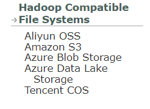

# 2. Hadoop安装和配置

## 2.1 单节点

TODO

## 2.2 伪分布式

TODO


## 2.3 非HA 完全分布式

步骤：

### 2.3.1 准备3台服务器

这里是用的VM Ware克隆了3台Centos7.X的VM。

1. 克隆虚拟机

   右键>管理>克隆


   `/etc/udev/rules.d/70-persistent-ipoib.rules`这个文件是关于网卡的。当网卡变动时，这个文件都会发生变化。

2. 修改克隆虚拟机的静态IP

   ```shell
   vim /etc/sysconfig/network-scripts/ifcfg-eth0
   ```

3. 修改主机名

   ```shell
   vim /etc/sysconfig/network
   vim /etc/hostname
   reboot
   ```

4. 关闭防火墙

   ```shell
   systemctl status firewalld
   systemctl stop firewalld
   systemctl status iptables
   systemctl stop iptables
   # 关闭开机自启
   systemctl disable firewalld
   systemctl disable iptables
   ```

5. 创建`atguigu`用户

   ```shell
   useradd atguigu -p sjl1991
   ```

6. 配置`atguigu`用户具有`root`权限

   ```shell
   vim /etc/sudoers
   ```

7. 在`/opt`目录下创建文件夹

   ```shell
   mkdir /opt/module
   mkdir /opt/software
   ```

8. 修改`/etc/host`

   增加如下几行。

   ```bash
   hadoop322-node01  192.168.61.129
   hadoop322-node02  192.168.61.135
   hadoop322-node03  192.168.61.136
   192.168.61.129 hadoop322-node01
   192.168.61.135 hadoop322-node02
   192.168.61.136 hadoop322-node03
   ```

   

### 2.3.2 安装和配置NTP服务

时间同步的方式：找一个机器作为时间服务器，所有的机器都与这台机器进行时间同步，比如：每隔10min同步一次（通过crontab来实现）。

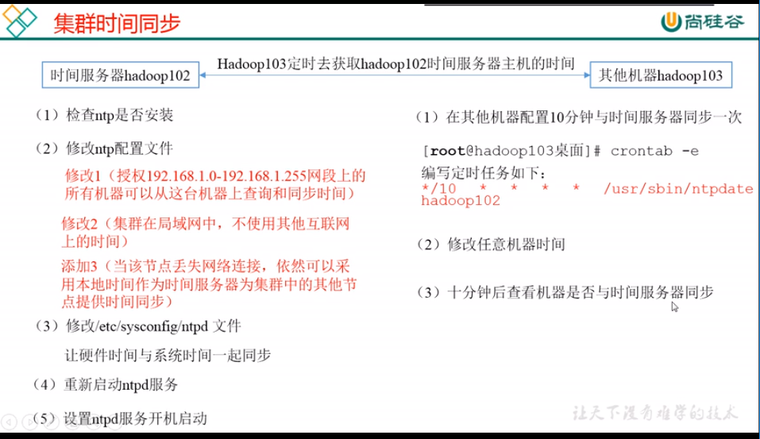

##### 2.3.2.1 时间服务器配置（**必须root用户**）f

1. 检查ntp是否安装

   ```shell
   [atguigu@hadoop322-node01 hadoop-3.2.2]$ crontab -l
   no crontab for atguigu
   [atguigu@hadoop322-node01 hadoop-3.2.2]$ su root
   Password: 
   [root@hadoop322-node01 hadoop-3.2.2]# rpm -qa |grep ntp
   fontpackages-filesystem-1.44-8.el7.noarch
   python-ntplib-0.3.2-1.el7.noarch
   ntp-4.2.6p5-29.el7.centos.x86_64
   ntpdate-4.2.6p5-29.el7.centos.x86_64
   ```

   如果未安装ntp，使用如下命令进行安装

   ```bash
   yum install ntp -y
   ```

   

2. 修改ntp配置文件

   ```shell
   [root@hadoop322-node02 hadoop-3.2.2]# vim /etc/ntp.conf
   # 修改内容如下：
   
   # 修改1. 授权192.168.10-192.168.1.255 网段上的所有机器可以从这台机器上查询和同步时间，取消注释
   restrict 192.168.61.0 mask 255.255.255.0 nomodify notrap
   # 修改2. 集群在局域网中，不适用其他互联网上的时间，所以都注释掉
   #server 0.centos.pool.ntp.org iburst
   #server 1.centos.pool.ntp.org iburst
   #server 2.centos.pool.ntp.org iburst
   #server 3.centos.pool.ntp.org iburst
   
   # 添加3.当该节点丢失网络连接，依然可以采用本地时间作为时间服务器为集群中的其他节点提供时间同步
   server 127.127.1.0						#如果国际通用时间服务器不能同步，则自动会按照本级时间进行同步
   fudge 127.127.1.0 stratum 10	#指定127.127.1.0 为第10层。ntp和127.127.1.0同步完后，就变成了11
   logfile /var/log/ntp.log　　　 #配置日志目录
   ```

3. 修改`/etc/sysconfig/ntpd`文件

   ```shell
   [root@hadoop322-node01 hadoop-3.2.2]# vim /etc/sysconfig/ntpd
   # 添加如下内容，让硬件时间与系统时间一起同步
   SYNC_HWCLOCK=yes
   ```

4. 重新启动`ntpd`服务

   ```shell
   service ntpd status
   service ntpd start
   service ntpd stop
   service ntpd restart
   
   [root@hadoop322-node01 subdir0]# service ntpd status
   Redirecting to /bin/systemctl status ntpd.service
   ● ntpd.service - Network Time Service
      Loaded: loaded (/usr/lib/systemd/system/ntpd.service; disabled; vendor preset: disabled)
      Active: inactive (dead)
   [root@hadoop322-node01 subdir0]# service ntpd start
   Redirecting to /bin/systemctl start ntpd.service
   [root@hadoop322-node01 subdir0]# service ntpd status
   Redirecting to /bin/systemctl status ntpd.service
   ● ntpd.service - Network Time Service
      Loaded: loaded (/usr/lib/systemd/system/ntpd.service; disabled; vendor preset: disabled)
      Active: active (running) since Tue 2021-06-15 18:31:45 CST; 4s ago
     Process: 10615 ExecStart=/usr/sbin/ntpd -u ntp:ntp $OPTIONS (code=exited, status=0/SUCCESS)
    Main PID: 10618 (ntpd)
       Tasks: 1
      Memory: 1.4M
      CGroup: /system.slice/ntpd.service
              └─10618 /usr/sbin/ntpd -u ntp:ntp -g
   
   Jun 15 18:31:45 hadoop322-node01 ntpd[10618]: Listen normally on 5 docker_gwbridge 172.19.0.1 ...123
   Jun 15 18:31:45 hadoop322-node01 ntpd[10618]: Listen normally on 6 br-9f19cd8b27c1 172.18.0.1 ...123
   Jun 15 18:31:45 hadoop322-node01 ntpd[10618]: Listen normally on 7 docker0 172.17.0.1 UDP 123
   Jun 15 18:31:45 hadoop322-node01 ntpd[10618]: Listen normally on 8 lo ::1 UDP 123
   Jun 15 18:31:45 hadoop322-node01 ntpd[10618]: Listen normally on 9 ens33 fe80::20c:29ff:fed3:2...123
   Jun 15 18:31:45 hadoop322-node01 ntpd[10618]: Listening on routing socket on fd #26 for interf...tes
   Jun 15 18:31:45 hadoop322-node01 ntpd[10618]: 0.0.0.0 c016 06 restart
   Jun 15 18:31:45 hadoop322-node01 ntpd[10618]: 0.0.0.0 c012 02 freq_set kernel 0.000 PPM
   Jun 15 18:31:45 hadoop322-node01 ntpd[10618]: 0.0.0.0 c011 01 freq_not_set
   Jun 15 18:31:46 hadoop322-node01 ntpd[10618]: 0.0.0.0 c514 04 freq_mode
   Hint: Some lines were ellipsized, use -l to show in full.
   ```

5. 设置`ntpd`服务开机启动

   ```shell
   chkconfig ntpd on
   ```

##### 2.3.2.2 其他机器配置（必须root用户）

1. 在其它机器配置10min与时间服务器同步一次

   ```shell
   crontab -e
   # 添加
   */10 * * * * /usr/sbin/ntpdate hadoop322-node01
   ```

2. 修改任意机器时间

   ```shell
   date -s "2020 20:20:20"
   ```

3. 十分钟后，查看机器是否与时间服务器同步

   ```shell
   date
   ```


### 2.3.3 配置集群节点免密SSH

配置SSH

```shell
[atguigu@hadoop322-node01 hadoop-3.2.2]$ ll ~/.ssh
total 4
-rw-r--r--. 1 atguigu atguigu 370 Jun 15 12:58 known_hosts
# ~/.ssh/known_hosts 记录了所有ssh访问过的主机


# 生成SSH公钥和私钥
[atguigu@hadoop322-node01 hadoop-3.2.2]$ ssh-keygen -t rsa
Generating public/private rsa key pair.
Enter file in which to save the key (/home/atguigu/.ssh/id_rsa): 
Enter passphrase (empty for no passphrase): 
Enter same passphrase again: 
Your identification has been saved in /home/atguigu/.ssh/id_rsa.
Your public key has been saved in /home/atguigu/.ssh/id_rsa.pub.
The key fingerprint is:
SHA256:pwDfVu6zXlyVg1L/Wk/Z8aj9rJL8YISOhJIWSvQ9qtM atguigu@hadoop102
The key's randomart image is:
+---[RSA 2048]----+
|  .          .   |
| . . .      . o .|
|  . + o   .. . =.|
| . . * + o ..  oB|
|  . = + S + . o.*|
|   + . + * o + +.|
|  o E   o +.*.o .|
|   .       =+. o |
|         .o  oo.o|
+----[SHA256]-----+
[atguigu@hadoop322-node01 hadoop-3.2.2]$ ll ~/.ssh
total 12
-rw-------. 1 atguigu atguigu 1675 Jun 15 14:53 id_rsa
-rw-r--r--. 1 atguigu atguigu  399 Jun 15 14:53 id_rsa.pub
-rw-r--r--. 1 atguigu atguigu  370 Jun 15 12:58 known_hosts
[atguigu@hadoop322-node01 hadoop-3.2.2]$ 

# 将hadoop322-node01的公钥拷贝到hadoop322-node02上
[atguigu@hadoop322-node01 hadoop-3.2.2]$ ssh-copy-id hadoop322-node02
/usr/bin/ssh-copy-id: INFO: Source of key(s) to be installed: "/home/atguigu/.ssh/id_rsa.pub"
/usr/bin/ssh-copy-id: INFO: attempting to log in with the new key(s), to filter out any that are already installed
/usr/bin/ssh-copy-id: INFO: 1 key(s) remain to be installed -- if you are prompted now it is to install the new keys
atguigu@hadoop322-node02's password: 

Number of key(s) added: 1

Now try logging into the machine, with:   "ssh 'hadoop322-node02'"
and check to make sure that only the key(s) you wanted were added.

# 在hadoop322-node02上查看是否拷贝成功了
[atguigu@hadoop103 hadoop-3.2.2]$ ll ~/.ssh/
total 16
-rw-------. 1 atguigu atguigu  399 Jun 15 14:57 authorized_keys
-rw-------. 1 atguigu atguigu 1679 Jun 15 14:53 id_rsa
-rw-r--r--. 1 atguigu atguigu  399 Jun 15 14:53 id_rsa.pub
-rw-r--r--. 1 atguigu atguigu  185 Jun 15 12:52 known_hosts

# 验证从hadoop322-node01是否能免密SSH到hadoop322-node02
[atguigu@hadoop102 hadoop-3.2.2]$ ssh hadoop322-node02
```

同理对hadoop322-node01配置可免密登录hadoop322-node03。

<font color="red">**注意：</br>还需要在hadoop322-node01、hadoop322-node02、hadoop322-node03都要配置root用户、atguigu用户的免密ssh。配置方式如上所示。**</font>

### 2.3.4 安装和配置JDK

#### 2.3.4.1 卸载openJDK

VM ware中自带了openjdk，其中openJDK安装好的目录位于`/usr/lib/jvm/java-1.8.0-openjdk-1.8.0.242.b08-1.el7.x86_64`

那么应该如何配置`JAVA_HOME`等环境变量呢？

首先，咱删除默认安装的openJDK，然后手动安装指定版本的JDK，再配置环境变量即可。

[使用CentOS7卸载自带jdk安装自己的JDK1.8](https://blog.csdn.net/hui_2016/article/details/69941850?utm_medium=distribute.pc_relevant.none-task-blog-2%7Edefault%7EBlogCommendFromBaidu%7Edefault-7.control&depth_1-utm_source=distribute.pc_relevant.none-task-blog-2%7Edefault%7EBlogCommendFromBaidu%7Edefault-7.control)

```shell
[root@hadoop101 alternatives]$  rpm -qa | grep java
javapackages-tools-3.4.1-11.el7.noarch
java-1.7.0-openjdk-headless-1.7.0.251-2.6.21.1.el7.x86_64
python-javapackages-3.4.1-11.el7.noarch
tzdata-java-2019c-1.el7.noarch
java-1.8.0-openjdk-1.8.0.242.b08-1.el7.x86_64
java-1.8.0-openjdk-headless-1.8.0.242.b08-1.el7.x86_64
java-1.7.0-openjdk-1.7.0.251-2.6.21.1.el7.x86_64

[root@hadoop101 opt]# rpm -e --nodeps java-1.7.0-openjdk-headless-1.7.0.251-2.6.21.1.el7.x86_64
[root@hadoop101 opt]# rpm -e --nodeps java-1.8.0-openjdk-1.8.0.242.b08-1.el7.x86_64
[root@hadoop101 opt]# rpm -e --nodeps java-1.8.0-openjdk-headless-1.8.0.242.b08-1.el7.x86_64
[root@hadoop101 opt]# rpm -e --nodeps java-1.7.0-openjdk-1.7.0.251-2.6.21.1.el7.x86_64
# 相比于之前，少了4个openjdk的包了
[root@hadoop101 opt]# rpm -qa | grep java
javapackages-tools-3.4.1-11.el7.noarch
python-javapackages-3.4.1-11.el7.noarch
tzdata-java-2019c-1.el7.noarch

```

#### 2.3.4.2 安装JDK8

官网下载所需版本的JDK，然后拷贝到虚拟机中的`/opt/software`目录

```shell
[atguigu@hadoop101 hadoop]$ cd /opt/softwares
[atguigu@hadoop101 ~]$ tar -zxvf jdk-8u291-linux-x64.tar.gz -C /opt/module
```

####  2.3.4.3 配置JAVA_HOME等环境变量

```bash
[atguigu@hadoop101 software]$ sudo vim /etc/profile.d/hadoop322_env.sh
# 修改环境变量
#JAVA_HOME
export JAVA_HOME=/opt/module/jdk1.8.0_291
export PATH=$PATH:$JAVA_HOME/bin
export CLASSPATH=.:$JAVA_HOME/lib/dt.jar:$JAVA_HOME/lib/tools.jar
[atguigu@hadoop101 ~]$ source /etc/profile
[atguigu@hadoop101 ~]$ java -version
[atguigu@hadoop101 ~]$ javac --help
```

**为什么在`/etc/profile.d`而不是在`/etc/profile`文件中直接添加/修改环境变量呢？**

> 在 /etc/profile 这个文件中有这么一段 shell, 会在每次启动时自动加载 profile.d 下的每个配置
>
> ```bash
> if [ -d /etc/profile.d ]; then
>   for i in /etc/profile.d/*.sh; do
>     if [ -r $i ]; then
>       . $i
>     fi
>   done
>   unset i
> fi
> ```
>
> 区别
> 1、都用来设置环境变量文件
>
> 2、/etc/profile.d/ 高度解耦, 比 /etc/profile 好维护，不想要什么变量直接删除 /etc/profile.d/ 下对应的 shell 脚本即可
>
> 3、/etc/profile 和 /etc/profile.d 同样是登录（login）级别的变量，当用户重新登录 shell 时会触发。所以效果一致。
>
> 4、设置登录级别的变量，重新登录 shell，或者 source /etc/profile。

### 2.3.5 安装和配置Hadoop3.2.2

提前将hadoop3.2.2的tar包`hadoop-3.2.2.tar.gz`放到`/opt/softwares`目录下。

#### 2.3.5.1 安装Hadoop3.2.2

```bash
[atguigu@hadoop101 hadoop]$ cd /opt/softwares
[atguigu@hadoop101 software]$ tar -zxvf hadoop-3.2.2.tar.gz -C /opt/module
```

####  2.3.5.2 配置HADOOP_HOME等环境变量

```bash
[atguigu@hadoop101 software]$ sudo vim /etc/profile.d/hadoop322_env.sh
#HADOOP_HOME
export HADOOP_HOME=/opt/module/hadoop-3.2.2
export PATH=$PATH:$HADOOP_HOME/bin
export PATH=$PATH:$HADOOP_HOME/sbin

[atguigu@hadoop101 software]$ source /etc/profile
[atguigu@hadoop101 software]$ hadoop --help
```

### 2.3.6 调整集群配置

core-site.xml

```xml
<configuration>
	<property>
  	<name>fs.defaultFS</name>
    <value>hdfs://hadoop322-node01:9000</value>
  </property>
  <property>
    <name>hadoop.tmp.dir</name>
    <value>/opt/modules/hadoop-3.2.2/data/tmp</value>
  </property>
</configuration>
```

hdfs-site.xml

```xml
<configuration>
  <property>
    <name>dfs.namenode.secondary.http-address</name>
    <value>hadoop322-node03:50090</value>
  </property>
  <property>
    <name>dfs.namenode.name.dir</name>
    <value>${hadoop.tmp.dir}/dfs/name</value>
  </property>
  <property>
    <name>dfs.blocksize</name>
    <value>134217728</value>
  </property>
  <property>
    <name>dfs.replication</name>
    <value>3</value>
  </property>
  <property>
    <name>dfs.datanode.data.dir</name>
    <value>${hadoop.tmp.dir}/dfs/data</value>
  </property>
</configuration>
```

yarn-site.xml

```xml
<configuration>
  <property>
    <name>yarn.resourcemanager.hostname</name>
    <value>hadoop322-node02</value>
  </property>
  <property>
    <name>yarn.log-aggregation-enable</name>
    <value>true</value>
  </property>
  <property>
    <name>yarn.nodemanager.aux-services</name>
    <value>mapreduce_shuffle</value>
  </property>
  <property>
    <name>yarn.nodemanager.env-whitelist</name>
<value>JAVA_HOME,HADOOP_COMMON_HOME,HADOOP_HDFS_HOME,HADOOP_CONF_DIR,CLASSPATH_PREPEND_DISTCACHE,HADOOP_YARN_HOME,HADOOP_HOME,PATH,LANG,TZ,HADOOP_MAPRED_HOME</value>
  </property>
</configuration>
```

mapred-site.xml

```xml
<configuration>
  <property>
    <name>mapreduce.framework.name</name>
    <value>yarn</value>
  </property>
  
  <!-- 历史服务器端地址 -->
  <property>
    <name>mapreduce.jobhistory.address</name>
      <value>hadoop101:10020</value>
  </property>
  <!-- 历史服务器web端地址 -->
  <property>
    <name>mapreduce.jobhistory.webapp.address</name>
      <value>hadoop101:19888</value>
	</property>
</configuration>
```

etc/hadoop/workers

```shell
hadoop322-node01
hadoop322-node02
hadoop322-node03
```

### 2.3.7 启动Hadoop集群服务

#### 2.3.7.1 逐个启动

1. 格式化`NameNode`（**第一次启动时格式化，以后就不要总格式化**）

   ```shell
   bin/hdfs namenode -format
   ```

2. 启动NameNode

   ```shell
   sbin/hadoop-daemon.sh start namenode
   # hadoop3建议使用如下命令启动
   hdfs --daemon start namenode
   ```

3. 启动NameNode

   ```shell
   sbin/hadoop-daemon.sh start datanode
   # hadoop3建议使用如下命令启动
   hdfs --daemon start datanode
   ```

4. 启动ResourceManager

   ```bash
   sbin/yarn-daemon.sh start resourcemanager
   # hadoop3建议使用如下命令启动
   yarn --daemon start resourcemanager
   ```

   

5. 启动NodeManager

   ```bash
   sbin/yarn-daemon.sh start nodemanager
   # hadoop3建议使用如下命令启动
   yarn --daemon start nodemanager
   ```

   

6. 启动MapReduce历史服务器

   ```bash
   sbin/mr-jobhistory-daemon.sh start historyserver
   # hadoop3建议使用如下命令启动
   mapred --daemon start historyserver
   ```

   

#### 2.3.7.2 群起

```bash
#启动YARN的服务
sbin/start-dfs.sh

#启动YARN的服务
sbin/start-yarn.sh
```


MapReduce的JobHistoryServer服务。

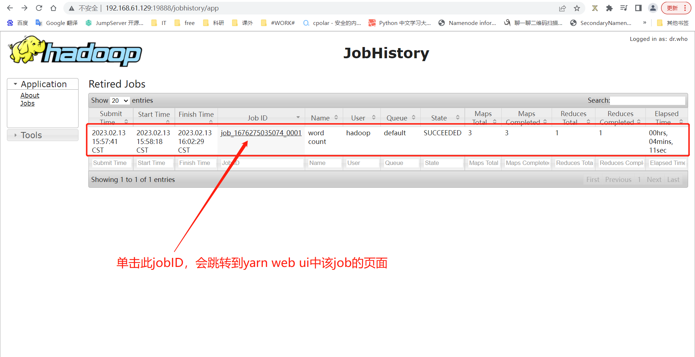

如下图所示：

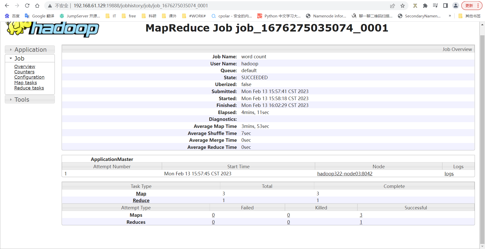

## 2.4 HDFS HA 非联邦完全分布式

有两种HA的方案：

- `NameNode HA with QJM`。使用`the Quorum Journal Manager (QJM)`在`Active NameNode`和`Standby NameNode`之前共享edit logs。

  可参考文章：https://www.jianshu.com/p/eb077c9d0f1e

  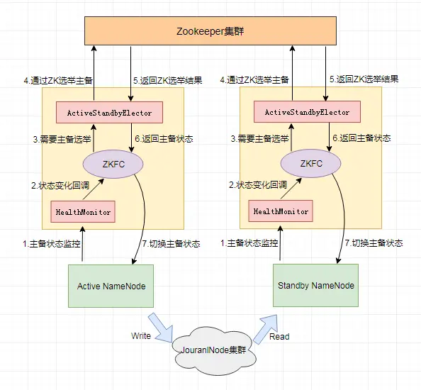

- `NameNode HA with NFS`。使用`NFS`在`Active NameNode`和`Standby NameNode`之前共享edit logs。

### 2.4.1 `NameNode HA with QJM`

参考官方文档：https://hadoop.apache.org/docs/stable/hadoop-project-dist/hadoop-hdfs/HDFSHighAvailabilityWithQJM.html

让我们回到配置`core-site.xml`, `hdfs-site.xml`, `yarn-site.xml`, `mapred-site.xml`之前。

在`Hdoop2.0.0`之前，NameNode一直都是单点故障的（single point of failure (SPOF)），只要NameNode所在机器或进程不可用，则整个集群的HDFS就不可用了。

- 机器挂了，或者NameNode进程挂了，则直到机器/进程重启之，集群才能变为可用。
- 集群/软件升级，会导致一定时间窗口内集群不可用。

### 2.4.2 HA的设计架构

在典型的HA集群中，两个或多个单独的机器被配置为NameNodes。在任何时间点，只有一个NameNode处于active状态，而其他NameNode处于standby状态。Active NameNode负责集群中的所有客户端操作，而Standby只是在必要时保持足够的状态以提供快速的故障恢复（failover）。

**为了实现active NameNode和standby NameNode的状态保持一致**，引入了"JournalNodes"来实现二者之前的通信。`active NameNode`将namespace的改动记录到**大多数的JN**中。然后`standby NameNode`从JN中获取namespace的的改动，并不断监视edit log的变动，将edit log应用到自身内存中的namespace。在发生故障转移时，备用服务器将确保在将自身提升到活动状态之前，已从`JournalNode`中读取所有编辑。这确保在发生故障切换之前，命名空间状态完全同步。

**为了提供快速故障切换，备用节点还必须具有关于集群中块位置的最新信息。**为了实现这一点，DataNode配置了所有NameNode的位置，并向所有NameNode发送块位置信息和心跳。

如果同一时刻有多个`active NameNode`，则会发生"split-brain scenario"（脑裂），会导致数据丢失或其他问题。同一时刻只有一个`active NameNode`保证了，同一时刻只有一个 NameNode可以往`Journal Nodes`中写入edit log。


| hadoop322-noe01                                              | hadoop322-node02                                             | hadoop322-node03                                            |
| ------------------------------------------------------------ | ------------------------------------------------------------ | ----------------------------------------------------------- |
| NameNode<br>DataNode<br>NodeManager<br>JournalNode<br>ZKFC<br>JobHistoryServer | NameNode<br>ResourceManager<br>DataNode<br>JournalNode<br>ZKFC<br/>NodeManager | NameNode<br>DataNode<br>JournalNode<br>ZKFC<br/>NodeManager |


### 2.4.3 硬件准备

- 建议NameNode节点的硬件配置相同。
- `JournalNode`守护进程是比较轻量的，可以放置在其它守护进程（如NameNode、JobTracker、ResourceManager等）如所在节点。但是，就公有云的EMR（MRS）之类的paas产品而言，都是将JournalNode和ZooKeeper放置在相同的节点，一般为3个节点，配置一般2C4G 100GB就可以了。

**请注意，在HA集群中，Standby NameNode还执行命名空间状态的检查点，因此不需要在HA集群内运行Secondary NameNode、Checkpoint Node或BackupNode。事实上，这样做是错误的。这也允许正在重新配置非启用HA的HDFS群集以启用HA的用户重新使用以前专用于Secondary NameNode的硬件。？没看懂TODO**

### 2.4.4 部署

与Federation配置类似，HA配置是向后兼容的，并允许现有的单个NameNode配置在没有更改的情况下工作。新配置被设计为使得集群中的所有节点可以具有相同的配置，而不需要基于节点的类型将不同的配置文件部署到不同的机器。?没看懂TODO

#### 2.4.4.1 配置HDFS HA集群

与`HDFS Federation`一样，HA集群重用`nameservice ID`来标识单个HDFS实例，该实例实际上可能由多个HA NameNode组成。此外，HA还添加了名为`NameNode ID`的新抽象。集群中每个不同的NameNode都有一个不同的`NameNode ID`来区分它。为了支持所有NameNode的单个配置文件，相关的配置参数都以`nameservice ID`和`NameNode ID`作为后缀。

##### 配置`core-site.xml`

```xml
<configuration>
  <!-- 默认FS的路径前缀 -->
  <property>
    <name>fs.defaultFS</name>
    <value>hdfs://mycluster</value>
	</property>
</configuration>
```

- **fs.defaultFS**: Hadoop FS客户端在没有指明FS前缀时，使用的默认路径前缀。

##### 配置`hdfs-site.xml`


```xml
<configuration>
    <!-- nameservice的名称，若为联邦，此处为逗号分隔的nameservice的列表 -->
    <property>
      <name>dfs.nameservices</name>
      <value>mycluster</value>
    </property>
    
    <!-- 在该nameservice中NameNode的id，此处为逗号分隔的NameNode ID列表。
		最少2个，最多5个，建议3个，因为过多的话，NameNode之前的通信开销过大。 -->
    <property>
  	  <name>dfs.ha.namenodes.mycluster</name>
      <value>nn1,nn2,nn3</value>
	</property>
    
    <!-- 每个NameNode监听的RPC地址 -->
    <property>
      <name>dfs.namenode.rpc-address.mycluster.nn1</name>
  	  <value>hadoop322-node01:8020</value>
	</property>
	<property>
      <name>dfs.namenode.rpc-address.mycluster.nn2</name>
      <value>hadoop322-node02:8020</value>
	</property>
	<property>
  	  <name>dfs.namenode.rpc-address.mycluster.nn3</name>
      <value>hadoop322-node03:8020</value>
	</property>
    
    <!-- 每个NameNode监听的HTTP地址，如果启用security特性，则需配置dfs.namenode.https-address.mycluster.? -->
    <property>
      <name>dfs.namenode.http-address.mycluster.nn1</name>
      <value>hadoop322-node01:9870</value>
    </property>
    <property>
      <name>dfs.namenode.http-address.mycluster.nn2</name>
      <value>hadoop322-node02:9870</value>
	</property>
	<property>
  	  <name>dfs.namenode.http-address.mycluster.nn3</name>
      <value>hadoop322-node03:9870</value>
    </property>
    
    <!-- NameNode向这些JN写/读edits log，URI地址 -->
    <property>
      <name>dfs.namenode.shared.edits.dir</name>
      <value>qjournal://hadoop322-node01:8485;hadoop322-node02:8485;hadoop322-node03:8485/mycluster</value>
	</property>
    
    <!-- HDFS客户端用于联系ActiveNameNode的Java类 -->
    <property>
  	  <name>dfs.client.failover.proxy.provider.mycluster</name>
  	  <value>org.apache.hadoop.hdfs.server.namenode.ha.ConfiguredFailoverProxyProvider</value>
	</property>
  
    <!-- 故障转移期间用来fence Active NameNode -->
    <property>
      <name>dfs.ha.fencing.methods</name>
      <value>sshfence</value>
    </property>
    <property>
      <name>dfs.ha.fencing.ssh.private-key-files</name>
      <value>/home/hadoop/.ssh/id_rsa</value>
    </property>
   
  <!-- Journal Nodes在本地存储edits文件的路径 -->
  <property>
    <name>dfs.journalnode.edits.dir</name>
    <value>/opt/modules/hadoop-3.2.2/data/journalnode/</value>
	</property>
  
  <!-- 是否阻止安全模式中的namenodes变为Active。-->
  <property>
    <name>dfs.ha.nn.not-become-active-in-safemode</name>
    <value>true</value>
	</property>
</configuration>
```

- **dfs.nameservices**

  `nameservice`的名字，如mycluster。若为联邦，此处为逗号分隔的nameservice的列表

  后续的配置中会用到此配置项的值。

- **dfs.ha.namenodes.[nameservice ID]**

  在指定`nameservice`中每个`NameNode`的唯一标识符。为逗号分隔的`NameNodes`的ID列表。通常为`nn1,nn2,nn3`，以此类推。

  **最少2个，最多5个，建议3个，因为过多的话，`NameNode`之前的通信开销过大**。

- **dfs.namenode.rpc-address.[nameservice ID].[name node ID]**

  每个NameNode监听的RPC地址。`host:port`格式，host为NameName进程所在主机，port为NameNode的`IPC`端口。

- **dfs.namenode.http-address.[nameservice ID].[name node ID]**

  每个NameNode监听的HTTP地址，如果启用security特性，则需配置`dfs.namenode.https-address.[nameservice ID].[name node ID]`

- **dfs.namenode.shared.edits.dir**

  `NameNode`读/写edits log的`Journal Nodes`的URI，这些`Journal Nodes`提供了`edits log`的共享存储。`Active NameNode`向`Journal Nodes`写入指定`nameserviceId`的edits log，其余`standby NameNode`向`Journal Nodes`读取指定`nameserviceId`的edits log。**至少需要配置一个Journal Node的URI**。

  格式为：`qjournal://host1:port1;host2:port2;host3:port3/journalId`，通常情况下，`journalId`与`nameserviceId`保持一致。联邦集群中可以存在多个`nameserviceId`，对应也有多个`journalId`，他们可以使用同一组`Journal Nodes`，通过不同的`journalId`来区分就可以了。

- **dfs.client.failover.proxy.provider.[nameservice ID]** 

  HDFS客户端用于联系ActiveNameNode的Java类。

  此类决定了这些NameNodes中，哪个是Active NameNode，此NameNode负责处理客户端的请求。

  Hadoop官方提供了两个类：**ConfiguredFailoverProxyProvider** 和 **RequestHedgingProxyProvider**，也可以自定义。

- **dfs.ha.fencing.methods**

  在故障切换期间用于**隔离**Active NameNode的脚本或Java类的列表。

  - **sshfence** 。ssh到Active NameNode所在机器并kill进程。

    SSH连接到目标节点，并使用fuser终止监听TCP端口的进程。为了使此隔离选项发挥作用，它必须能够在不提供密码的情况下SSH到目标节点。因此，还必须配置dfs.ha.fening.sh.private-key-files选项，这是一个逗号分隔的ssh私钥文件列表。

    还可以配置指定ssh时使用的用户名和端口，也可以指定ssh的超时时间。

  - **shell**。运行shell命令来fence Active NameNode。

- **dfs.journalnode.edits.dir**

  Journal Nodes在本地存储edits文件的路径。默认值为`/tmp/hadoop/dfs/journalnode/`。

- **dfs.ha.nn.not-become-active-in-safemode**

  是否阻止安全模式中的namenodes变为Active。

#### 2.4.4.2 启动HDFS HA集群

1、在所有`Journal Node`启动`journalnode`服务

```bash
hdfs --daemon start journalnode
```

注意：启动JournalNodes后，必须首先同步NameNodes上的磁盘元数据 。第二步就是做这个事情的。

2、`格式化NameNode`或`初始化JournalNode`

有两种情况：

- 创建一个新的HDFS集群。

  在某一个NameNode上执行`hdfs namenode -format`格式化集群，只在第一次启动HDFS HA集群时使用。

- 将非HA集群的`NameNode`转换为HA。

  运行命令`hdfs namenode -ininitializeSharedEdits`，该命令将使用NameNode本地的edits目录中的数据来初始化`JournalNode`。

根据需求，在nn1上选择使用`hdfs namenode -format`还是`hdfs namenode -initializeSharedEdits`

```bash
hdfs namenode -format
或
hdfs namenode -initializeSharedEdits
```

3、启动nn1的`NameNode`

在nn1执行如下命令：

```bash
hdfs --daemon start namenode
```

旧的命令是`hadoop-daemon.sh start namenode`，现在建议使用上面的命令了。

4、在nn1启动了`NameNode`之后。将nn1的元数据信息（`{dfs.namenode.name.dir}` 目录的内容）复制到nn2、nn3的`{dfs.namenode.name.dir}` 目录下(**只在第一次启动HDFS HA集群时使用**)

分别在nn2、nn3执行如下命令：

```bash
hdfs namenode -bootstrapStandby
```

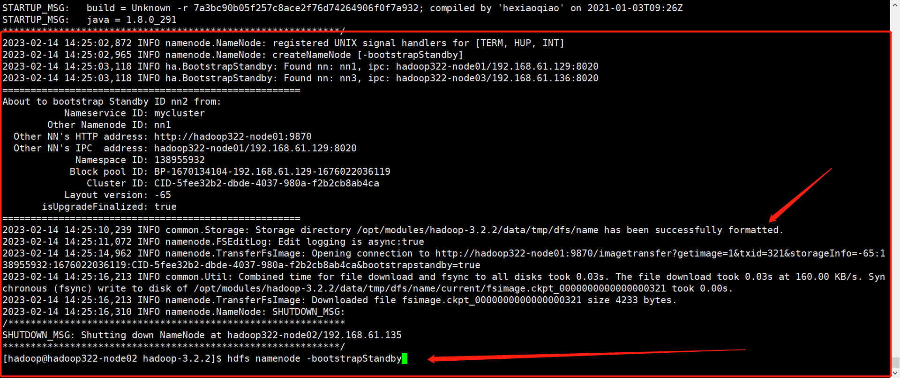

输出如上信息，表示已经做好了将NameNode设置为standby的工作了。可以启动standby NameNode了

5、启动nn2和nn3的`NameNode`

```bash
hdfs --daemon start namenode
```

3个NameNode都启动后，发现均为`standby`。

nn1

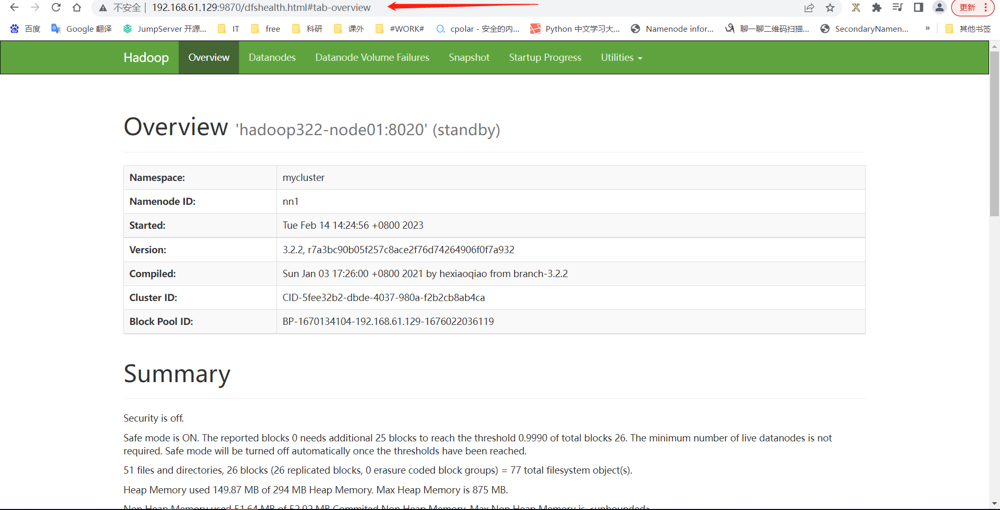

nn2

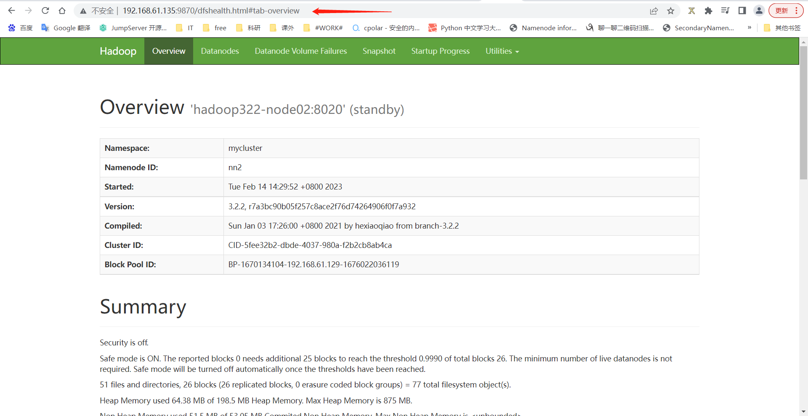

nn3

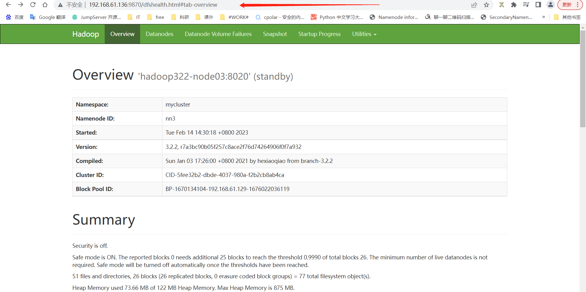

<font color=red>**注意：的是Stanby状态的NameNode是不能对外提供服务的！**</font>

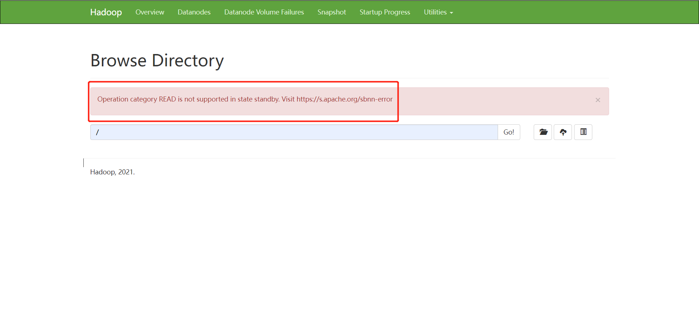


命令行查看也是如此：

```bash
hdfs haadmin -getAllServiceState
```

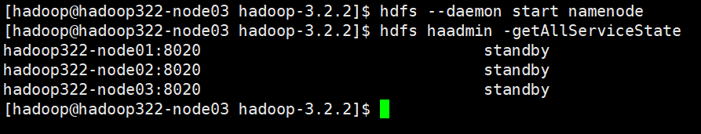


6、启动所有`DataNode`

在nn1, nn2, nn3启动`DataNode`服务。

```bash
hdfs --daemon start datanode
```

jps查看是否进程都在，HDFS Web UI查看 live Nodes 是否为3。

7、将nn1切换为`Active NameNode`

```bash
hdfs haadmin -ns mycluster -transitionToActive nn1
或者
hdfs haadmin -transitionToActive nn1
```


<font color=red>**注意：如果nn1进程挂掉了，使用`bin/hdfs haadmin -transitionToActive nn2`并不能让nn2成为Active。**</font>why?

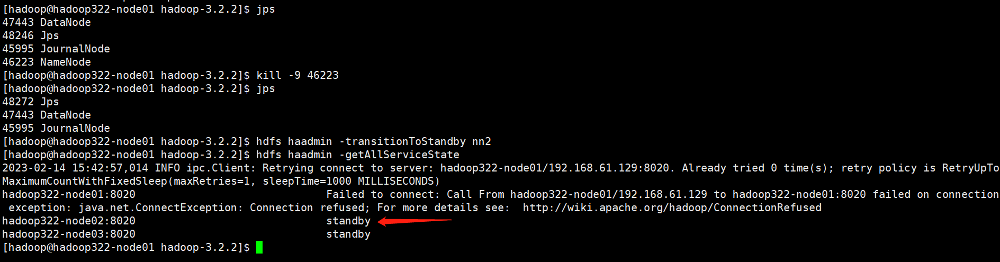

**使用`hdfs haadmin -failover nn1 nn2`也无法实现故障转移。**


<font color=red>**注意：HDFS HA 想要手动故障转移，则nn1和nn2必须都是正常启动的，然后使用如下命令进行手动故障转移**</font>。

```bash
hdfs haadmin -transitionToActive nn2
```


#### 2.4.4.3 自动故障转移配置

自动故障转移依赖`ZooKeeper`和`ZKFailoverController`（缩写为ZKFC）。

ZooKeeper主要实现两个作用：**故障检测**和**Active NameNode选举**。

- **故障检测**：集群中的每个NameNode机器都在ZooKeeper中维护一个持久会话。如果机器崩溃，ZooKeeper会话将过期，通知其他NameNode应该触发故障转移。
- **Active NameNode选举**：ZooKeeper提供了一种简单的机制，以独占方式将节点选为活动节点。如果当前活动的NameNode崩溃，另一个节点可能会在ZooKeeper中获取一个特殊的独占锁，指示它应该成为下一个活动节点。

**ZKFC**既是一个ZooKeeper client，又监控和管理NameNode的状态。每一个NameNode所在主机都会运行一个**ZKFC**。

**ZKFC**有三个职责：

- 健康监测（**Health monitor**）

  ZKFC使用健康检查命令定期ping其本地NameNode。只要NameNode以健康状态及时响应，ZKFC就会认为该节点是健康的。如果节点已崩溃、僵死或以其他方式进入不正常状态，health monitor会将其标记为不正常状态。

- **ZooKeeper session management**

  当本地NameNode运行正常时，ZKFC会在ZooKeeper中持有一个会话。如果本地NameNode处于Active状态，它还持有一个特殊的“锁”znode。该锁使用ZooKeeper对“短暂”节点的支持；如果会话过期，锁定节点将被自动删除。

- **ZooKeeper-based election**

  如果本地NameNode运行正常，并且ZKFC发现当前没有其他节点持有锁znode，则它自己将尝试获取锁。如果它成功了，那么它就“赢得了选举”，并负责运行故障切换以使其本地NameNode处于Active状态。故障切换过程类似于上述手动故障切换：首先，如果需要，前一个活动状态被隔离，然后本地NameNode转换为Active状态。

##### 2.4.4.3.1 部署ZooKeeper

###### 下载ZooKeeper

官方下载地址：https://archive.apache.org/dist/zookeeper/

###### 解压ZooKeeper

```bash
tar -zxvf apache-zookeeper-3.6.1-bin.tar.gz -C /opt/modules/
```

###### 配置ZooKeeper

【可选】安装`ansible`(操作系统为centos7.x)

```bash
yum install epel-release
yum install ansible
```

在[nn1]创建`ansible`使用的主机名文件

```bash
vim ~/ansible_workers
[workers]
hadoop322-node01
hadoop322-node02
hadoop322-node03
```

创建ZooKeeper的数据目录

​	没有安装ansible的话，就每个节点上去单独创建此目录即可。

```bash
ansible workers -i ansible_hosts -m shell -a 'mkdir /opt/modules/apache-zookeeper-3.6.1-bin/zkData'
```

为每个ZooKeeper节点创建`myid`文件

```bash
# [nn1]机器上
echo 1 > /opt/modules/apache-zookeeper-3.6.1-bin/zkData/myid
# [nn2]机器上
echo 2 > /opt/modules/apache-zookeeper-3.6.1-bin/zkData/myid
# [nn3]机器上
echo 3 > /opt/modules/apache-zookeeper-3.6.1-bin/zkData/myid
```

修改`dataDir=/opt/modules/apache-zookeeper-3.6.1-bin/zkData`

```shell
[root@agent apache-zookeeper-3.5.9-bin]# cp conf/zoo_sample.cfg conf/zoo.cfg
[root@agent apache-zookeeper-3.5.9-bin]# vim conf/zoo.cfg
tickTime=2000
initLimit=10
syncLimit=5
# 修改ZooKeeper的数据存储目录
dataDir=/opt/modules/apache-zookeeper-3.6.1-bin/zkData
clientPort=2181
# 增加如下内容
server.1=hadoop01:2888:3888
server.2=hadoop01:2888:3888
server.3=hadoop01:2888:3888
```

###### 启动zk集群

```shel
# 第一台机器
[root@agent apache-zookeeper-3.5.9-bin]# bin/zkServer.sh start
# 第二台机器
[root@agent apache-zookeeper-3.5.9-bin]# bin/zkServer.sh start
# 第三台机器
[root@agent apache-zookeeper-3.5.9-bin]# bin/zkServer.sh start
```

也可以通过如下命令启动每个ZooKeeper服务器进程：

```bash
java -cp zookeeper.jar:lib/*:conf org.apache.zookeeper.server.quorum.QuorumPeerMain zoo.conf
```

***注意：需要修改其中的zoo.conf为实际的ZooKeeper的配置文件。***

**官方建议ZooKeeper的JVM堆内存为3 ~ 4G，避免影响ZooKeeper的性能。以我在公有云中的经验（腾讯云EMR），一般选择4C2G 100GB磁盘就够了。**

如果要修改ZooKeeper进程的JVM内存大小，请参考：https://www.cnblogs.com/LiuChang-blog/p/15127157.html

##### 2.4.4.3.2 配置自动故障转移

***在配置HDFS HA集群自动故障转移之前，需要先关闭HA集群。因为在集群运行时无法从手动故障转移切换至自动故障转移。***

`core-site.xml`中增加如下配置项，配置的是ZooKeeper的地址，根据实际情况修改为自己的ZooKeeper集群。

```xml
 <property>
   <name>ha.zookeeper.quorum</name>
   <value>hadoop322-node01:2181,hadoop322-node02:2181,hadoop322-node03:2181</value>
 </property>
```


`hdfs-site.xml`中增加

```xml
 <property>
   <name>dfs.ha.automatic-failover.enabled</name>
   <value>true</value>
 </property>
```

<font color="red">***如果是联邦集群，则可以通过`dfs.ha.automatic-failover.enabled.[my-nameservice-ID]`来配置每个`nameservice`的配置。***</font>

初始化HDFS HA在ZooKeeper中的状态（在某个NameNode节点执行）

```bash
$HADOOP_HOME/bin/hdfs zkfc -formatZK
```

​	**这会在ZooKeeper中创建HDFS HA集群所需的znode，一般为[hadoop-ha]**。

启动HDFS HA集群中的所有服务进程。

```bash
$HADOOP_HOME/sbin/start-dfs.sh
```

手动启动`ZKFC`

```bash
$HADOOP_HOME/bin/hdfs --daemon start zkfc
```

当所有进程都正常启动后，NameNodes们会通过在ZooKeeper中抢占x znode，来进行选举，确认哪个NameNode为Active。会多出来两个znode：`ActiveBreadCrumb`和`ActiveStandbyElectorLock`

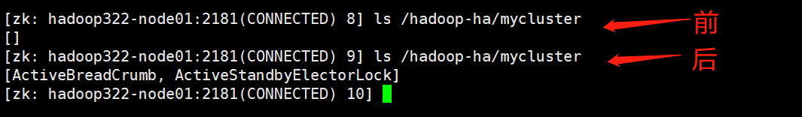

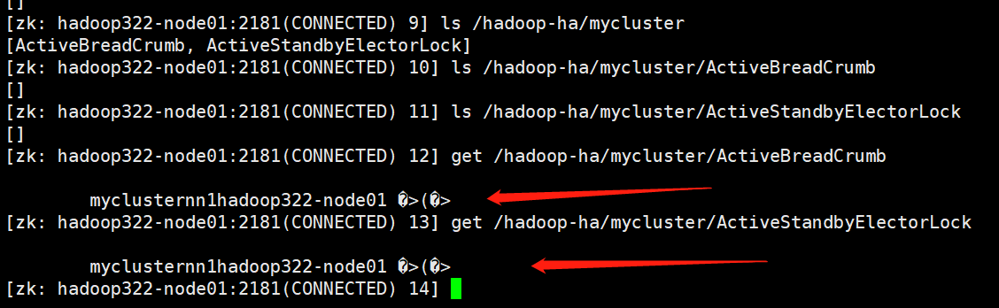

从上图可以看出，当前的Active NameNode是 hadoop322-node01。

**Tip**s：关于自动故障转移的测试见博客：https://blog.csdn.net/m0_37613244/article/details/114504071

#### 2.4.4.4 `In-Progress Edit Log Tailing`

在默认设置下，`Standby NameNode`只会应用已完成的edits log，`edits_inprogress_0000000000000000322`之类的未完成的edits log，`Standby NameNode`并不会应用到自身的namespace中。

如果希望有一个具有最新namespace的`Standby NameNode`，则可以启用`In-Progress Edit Log Tailing`。启用之后，`Standby NameNode`将尝试从`JournalNode`的内存缓存中获取edits。

- **dfs.ha.tail-edits.in-progress**

  是否对正在进行的edits log启用跟踪。启用后，在`Journal Node`将会在内存中缓存in-progress的edits log。默认情况下禁用

- **dfs.journalnode.edit-cache-size.bytes**

  JournalNode上edits的内存缓存的大小。一般情况，每个edit大约需要200字节，因此默认值1048576（1MB）可以容纳大约5000个edit事务。根据实际情况调整。

#### 2.4.4.5 HDFS HA集群支持`Load Balancer`

在LB的健康检测中，使用[http://NN_HOSTNAME/isActive](http://nn_hostname/isActive)，来检测哪个NN是Acitve的。Active NN会返回200，Standby NN返回405。

#### 2.4.4.6 HDFS HA集群的Upgrade/Finalization/Rollback

参考：https://hadoop.apache.org/docs/stable/hadoop-project-dist/hadoop-hdfs/HDFSHighAvailabilityWithQJM.html

## 2.5 HA 联邦完全分布式

参考官方文档：https://hadoop.apache.org/docs/stable/hadoop-project-dist/hadoop-hdfs/HDFSHighAvailabilityWithNFS.html

联邦模式也有HA和非HA的区别，见博客：https://blog.csdn.net/weixin_34244102/article/details/91645766

https://my.oschina.net/bochs/blog/789612

TODO

## 2.6 YARN的高可用

官方文档：https://hadoop.apache.org/docs/stable/hadoop-yarn/hadoop-yarn-site/ResourceManagerHA.html

在hadoop2.4之前，YARN集群中的`ResourceManager`一直是存在单点故障的。

YARN HA的架构图如下：

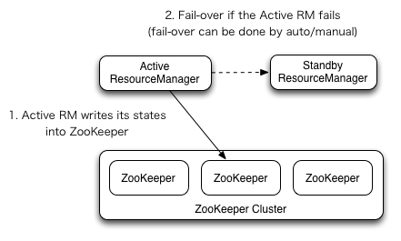

### 2.6.1 RM故障转移

RM的HA也是依赖ZooKeeper的，也是Active/Standby的。

#### 2.6.1.1 手动故障转移

如果没有开启RM的自动故障转移，我们也可以通过手动故障转移。

TODO

```bash
yarn rmadin 
```


#### 2.6.1.2 自动故障转移

RM中可以内嵌`ActiveStandbyElector`，用来做**故障检测**和**leader选举**。因此YARN中不需要类似ZKFC这种独立的服务进程。

#### 2.6.1.3 配置YARN

`yarn-site.xml`

```xml
<!-- 启用YARN resourcemanager的HA -->
<property>
  <name>yarn.resourcemanager.ha.enabled</name>
  <value>true</value>
</property>
<!-- YARN集群id -->
<property>
  <name>yarn.resourcemanager.cluster-id</name>
  <value>cluster-yarn1</value>
</property>
<!-- YARN HA集群中的RM的id -->
<property>
	<name>yarn.resourcemanager.ha.rm-ids</name>
  <value>rm1,rm2</value>
</property>
<!-- YARN集群中RM的地址 -->
<property>
	<name>yarn.resourcemanager.hostname.rm1</name>
  <value>hadoop322-node01</value>
</property>
<property>
	<name>yarn.resourcemanager.hostname.rm2</name>
  <value>hadoop322-node03</value>
</property>

<!-- 在YARN HA模式下，下面这两个配置必须显式配置，否则会连不上webapp -->
<property>
	<name>yarn.resourcemanager.webapp.address.rm1</name>
  <value>hadoop322-node01:8088</value>
</property>
<property>
	<name>yarn.resourcemanager.webapp.address.rm2</name>
  <value>hadoop322-node03:8088</value>
</property>

<!-- 启动RM后，允许其恢复状态。开启后必须指定yarn.resourcemanager.store.class -->
<property>
  <name>yarn.resourcemanager.recovery.enabled</name>
  <value>true</value>
</property>
<!-- 持久化RM状态信息的类 -->
<property>
  <name>yarn.resourcemanager.store.class</name>
  <value>org.apache.hadoop.yarn.server.resourcemanager.recovery.ZKRMStateStore</value>
</property>

<!-- ZooKeeper集群地址 -->
<property>
  <name>hadoop.zk.address</name>
  <value>hadoop322-node01:2181,hadoop322-node02:2181,hadoop322-node03:2181</value>
</property>
```

#### 2.6.1.4 启动YARN

```bash
sbin/start-yarn.sh
```

连接ZooKeeper查看发现多了两个znode：`rmstore`和`yarn-leader-election`。一个是用来**存储状态信息的**，一个是用来做**leader选举的**。


如下所示，表示当前的Active RM 是rm2。

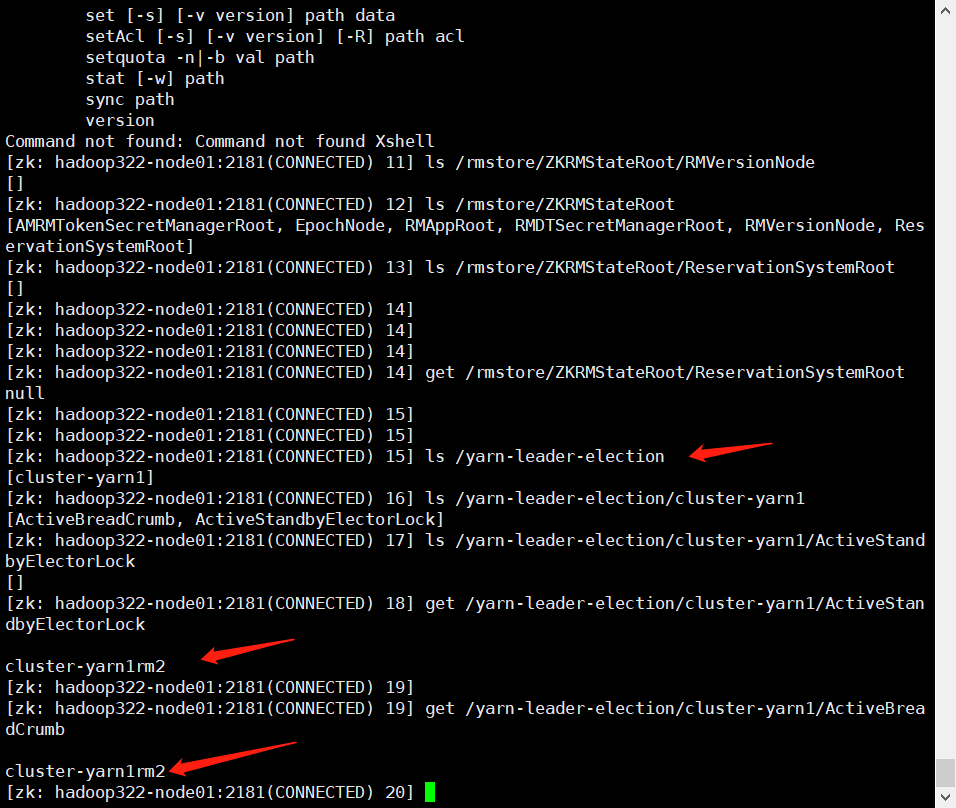

<font color="red">**注意：**</font>

<font color="red">**YARN把RM的状态信息存储在本地文件系统或ZooKeeper集群中，当RM重启后可以依据这些数据恢复状态。**</font>

<font color="red">**当`Standby RM` 运行时，访问`Standby RM`的`web ui`的请求会重定向到`Active RM`。**</font>

<font color="red">**当`Standby RM` 运行时，访问`Standby RM`的`REST API`请求会重定向到`Active RM`。**</font>

### 2.6.2 YARN 命令

查看RM的状态。

```bash
 $ yarn rmadmin -getServiceState rm1
 active
 
 $ yarn rmadmin -getServiceState rm2
 standby
```

如果启用了自动故障转移，则不能使用`-transitionTOStandby`，如果一定要使用需要加`-forcemanual`。

```bash
 $ yarn rmadmin -transitionToStandby rm1
 Automatic failover is enabled for org.apache.hadoop.yarn.client.RMHAServiceTarget@1d8299fd
 Refusing to manually manage HA state, since it may cause
 a split-brain scenario or other incorrect state.
 If you are very sure you know what you are doing, please
 specify the forcemanual flag.
 
  $ yarn rmadmin -transitionToStandby -forcemanual rm1
```

其它命令见：https://hadoop.apache.org/docs/stable/hadoop-yarn/hadoop-yarn-site/YarnCommands.html

### 2.6.3 关于RM重启

参考官方文档：https://hadoop.apache.org/docs/stable/hadoop-yarn/hadoop-yarn-site/ResourceManagerRestart.html

RM有两种重启类型：

- `Non-work-preserving RM restart`：

  RM将在客户端提交application时将application元数据存储在state-store（按照上述配置的话，就是`ZooKeeper`集群）。那么当RM重新启动时，它就可以从状态存储中获取application元数据并重新运行已提交的application。如果在RM停机之前申请已经完成（即失败、终止或完成），RM将不会重新提交申请。用户无需重新提交application。

- `Work-preserving RM restart`：

  在重启时，结合NodeManager反映的contianer状态和ApplicationMaster反映的container请求来重新构建RM的状态。这种方式不会重新运行之前正在运行的application。

`yarn-site.xml`中的`yarn.resourcemanager.store.class`支持三种状态存储的方式：

- `org.apache.hadoop.yarn.server.resourcemanager.recovery.ZKRMStateStore`

  使用ZooKeeper做状态存储，**支持fence机制。**

- `org.apache.hadoop.yarn.server.resourcemanager.recovery.FileSystemRMStateStore`

  默认。使用本地文件系统做状态存储，**不支持fence机制。**

- `org.apache.hadoop.yarn.server.resourcemanager.recovery.LeveldbRMStateStore`

  **不支持fence机制。**

### 2.6.4 配置`Load Balancer`

YARN HA集群支持配置LB，通过RM web ui 的`/isAcitve` HTTP请求，可以对RM服务做健康检查。Active RM会返回200状态码，而其它会返回405状态码。

# 3. Hadoop命令

## ViewFs

参考文章：https://hadoop.apache.org/docs/stable/hadoop-project-dist/hadoop-hdfs/ViewFs.html

https://www.dandelioncloud.cn/article/details/1546761552711659522

视图文件系统（View File System，简称ViewFs）提供了一种管理多个Hadoop文件系统命名空间（或命名空间卷）的方法。

### 没有ViewFs前的问题是什么？

大数据时代，随着业务的迅速扩张，大公司内部往往有多套hadoop cluster来支撑起内部的数据体量。那么**多集群的管理协调**就是面临的一大难题。

在很多时候,我们会碰到数据融合的需求,比如说原先有A集群,B集群,后来管理员认为有2套集群,数据访问不方便,于是设法将A,B集群融合为一个更大的集群,将他们的数据都放在同一套集群上.一种办法就是用Hadoop自带的DistCp工具,将数据进行跨集群的拷贝.当然这会带来很多的问题,如果数据量非常庞大的话.本文给大家介绍另外一种解决方案,ViewFileSystem,姑且可以叫做视图文件系统.大意就是让不同集群间维持视图逻辑上的唯一性,不同集群间还是各管各的.

**传统数据合并方案**

------

为了形成对比,下面描述一下数据合并中常用的数据合并的做法,就是搬迁数据.举例在HDFS中,也会想到用DistCp工具进行远程拷贝.虽然DistCp本身就是用来干这种事情的,但是随着数据量规模的升级,会有以下问题的出现:

- 1.拷贝周期太长,如果数据量非常大,在机房总带宽有限的情况,拷贝的时间将会非常长.
- 2.数据在拷贝的过程中,一定会有原始数据的变更与改动,如何同步这方面的数据也是需要考虑的方面.

以上2点,是我想到的比较突出的问题.OK,下面就要隆重介绍一下ViewFileSystem的概念了,可能还不是被很多人所熟知.

**解决方案**：

1、ViewFs

2、Router-based Federation（简称RBF）。

### 联邦出现之前

假设当前为clusterX集群，访问HDFS文件系统的几种方式：

- `hdfs dfs -ls /foo/bar` 依赖于`core-site.xml`中的`fs.default.name`配置。走的是RPC协议
- `hdfs dfs -ls hdfs://namenodeOfClusterX:port/foo/bar `走的是RPC协议
- `hdfs dfs -ls hdfs://namenodeOfClusterY:port/foo/bar` 走的是RPC协议
- `hdfs dfs -ls webhdfs://namenodeClusterX:http_port/foo/bar` 走的是HTTP协议，通过webhdfs来访问HDFS文件系统。
- `curl http://namenodeClusterX:http_port/webhdfs/v1/foo/bar` 走的是HTTP协议，通过webhdfs REST API来访问HDFS文件系统。
-  `curl http://proxyClusterX:http_port/foo/bar`通过HDFS proxy来访问HDFS文件系统。

### 联邦出现之后

通过viewFs来创建多个cluster的namespace的视图（逻辑上的映射），通过`client-side mount table`的配置将viewFs和多个cluster的namespace或者指定path进行链接，实现映射（对外仿佛只有一个集群）。

**也就是说ViewFs的配置是在客户端做的，当然为了保证集群内也能通过ViewFs去访问其他集群，那么建议是多个集群中的所有节点都同一配置。**

假设`fs.defaultFS`如下：

```xml
  <!-- 默认的fs -->
  <property>
  <name>fs.defaultFS</name>
  <value>viewfs://clusterX</value>
  </property>
```

**挂载指定路径**

```xml
 <configuration> 
  <property>
    <name>fs.viewfs.mounttable.ClusterX.link./data</name>
    <value>hdfs://nn1-clusterx.example.com:8020/data</value>
  </property>
  <property>
    <name>fs.viewfs.mounttable.ClusterX.link./project</name>
    <value>hdfs://nn2-clusterx.example.com:8020/project</value>
  </property>
  <property>
    <name>fs.viewfs.mounttable.ClusterX.link./user</name>
    <value>hdfs://nn3-clusterx.example.com:8020/user</value>
  </property>
  <property>
    <name>fs.viewfs.mounttable.ClusterX.link./tmp</name>
    <value>hdfs://nn4-clusterx.example.com:8020/tmp</value>
  </property>
  <property>
    <name>fs.viewfs.mounttable.ClusterX.linkFallback</name>
    <value>hdfs://nn5-clusterx.example.com:8020/home</value>
  </property>
</configuration>
```

`fs.viewfs.mounttable.ClusterX.link./data=hdfs://nn1-clusterx.example.com:8020/data`，表示将`hdfs://nn1-clusterx.example.com:8020/data`挂载到`viewfs://ClusterX/data`，就是通过这一配置，实现了`viewfs://ClusterX/data`和`hdfs://nn1-clusterx.example.com:8020/data`的映射。

**挂载根目录**

直接mount某HDFS集群的根目录到某viewFs。

```xml
<configuration>
  <property>
    <name>fs.viewfs.mounttable.ClusterY.linkMergeSlash</name>
    <value>hdfs://nn1-clustery.example.com:8020/</value>
  </property>
</configuration>
```

通过上面配置，实现了`viewfs://ClusterY/`和`hdfs://nn1-clustery.example.com:8020/`的映射。

有了viewFs之后访问viewFs的几种方式：

- `/foo/bar` 等价于`viewfs://clusterX/foo/bar`

- `viewfs://clusterX/foo/bar`

- `viewfs://clusterY/foo/bar`

  distcp工具也可以用。

  ```bash
  distcp viewfs://clusterY/pathSrc viewfs://clusterZ/pathDest
  ```

- `viewfs://clusterX-webhdfs/foo/bar` 通过webhdfs访问

- `http://namenodeClusterX:http_port/webhdfs/v1/foo/bar` HTTP协议，与没有使用viewFs一样的。

- `http://proxyClusterX:http_port/foo/bar` HTTP协议，与没有使用viewFs一样的。

在viewFs之前，执行如下命令会报错，不支持跨集群的rename。但是通过viewFs可以支持。 

```bash
rename hdfs://cluster1/user/joe/myStuff hdfs://cluaster2/data/foo/bar
```

### Nfly挂载点

通过`Nfly`可以实现1个逻辑文件可以被复制到多个文件系统中（如hdfs、s3、本地文件系统等）。配置示例。

```xml
  <property>
    <name>fs.viewfs.mounttable.global.linkNfly../ads</name>
    <value>uri1,uri2,uri3</value>
  </property>
```

执行如下命令在viewFs中的ads目录下创建一个文件Z1

假设配置如下：

```xml
  <property>
    <name>fs.viewfs.mounttable.global.linkNfly../ads</name>
    <value>file:/tmp/ads1, file:/tmp/ads2, file:/tmp/ads3</value>
  </property>
```


```bash
hadoop fs -touchz viewfs://global/ads/z1

# 可以发现挂载点的3个文件系统中都有了此文件。
ls -al /tmp/ads*/z1
-rw-r--r--  1 user  wheel  0 Mar 11 12:17 /tmp/ads1/z1
-rw-r--r--  1 user  wheel  0 Mar 11 12:17 /tmp/ads2/z1
-rw-r--r--  1 user  wheel  0 Mar 11 12:17 /tmp/ads3/z1
```

## View File System Overload Scheme

参考文档：https://hadoop.apache.org/docs/stable/hadoop-project-dist/hadoop-hdfs/ViewFsOverloadScheme.html

### ViewFs有两个问题：

-  要使用ViewFs需要修改`core-site.xml`中的`fs.defaultFS`为(`viewfs://xxx`)。
- 要使用ViewFs需要将`mount table`的配置分发给所有客户端（包括集群的所有数据/计算节点）。

`ViewFs Overload Scheme`是对`ViewFs`的扩展，它解决了上面两个问题的。

### 启用`ViewFs Overload Scheme`

#### 解决需要修改`fs.defaultFS`的问题


例子1：

`core-site.xml`

```xml
<property>
  <name>fs.defaultFS</name>
  <value>hdfs://mycluster</value>
</property>
<property>
  <!--<name>fs.<scheme>.impl</name> 这里的<scheme>的值与fs.defaultFS的值保持一致-->
  <name>fs.hdfs.impl</name>
  <value>org.apache.hadoop.fs.viewfs.ViewFileSystemOverloadScheme</value>
</property>
<!-- viewfs的mount table配置-->
<!-- hdfs://mycluster/user/fileA 映射到 hdfs://mycluster/user/fileA-->
<property>
  <name>fs.viewfs.mounttable.mycluster.link./user</name>
  <value>hdfs://mycluster/user</value>
</property>

<!-- hdfs://mycluster/data/fileA 映射到 o3fs://bucket1.volume1/data/fileA -->
<property>
  <name>fs.viewfs.mounttable.mycluster.link./data</name>
  <value>o3fs://bucket1.volume1/data</value>
</property>
<!-- hdfs://mycluster/backup/fileA 映射到 s3a://bucket1/backup/fileA -->
<property>
  <name>fs.viewfs.mounttable.mycluster.link./backup</name>
  <value>s3a://bucket1/backup/</value>
</property>
<!-- 不匹配上面的mount link规则的都走如下配置 -->
<property>
  <name>fs.viewfs.mounttable.mycluster.linkfallback</name>
  <value>hdfs://mycluster/</value>
</property>
```

注意：就算`fs.defualtFS=hdfs://mycluster/data`，按照上述配置，`fs.viewfs.mounttable.mycluster.linkfallback=hdfs://mycluster`。

例子2

`core-site.xml`

```xml
<property>
  <name>fs.defaultFS</name>
  <value>s3a://bucketA/</value>
</property>
<property>
  <!--<name>fs.<scheme>.impl</name> 这里的<scheme>的值与fs.defaultFS的值保持一致-->
  <name>fs.s3a.impl</name>
  <value>org.apache.hadoop.fs.viewfs.ViewFileSystemOverloadScheme</value>
</property>
<property>
  <name>fs.viewfs.mounttable.bucketA.link./user</name>
  <value>hdfs://cluster/user</value>
</property>

<property>
  <name>fs.viewfs.mounttable.bucketA.link./data</name>
  <value>o3fs://bucket1.volume1.omhost/data</value>
</property>

<property>
  <name>fs.viewfs.mounttable.bucketA.link./salesDB</name>
  <value>s3a://bucketA/salesDB/</value>
</property>
```

这两个例子，如下图所示：

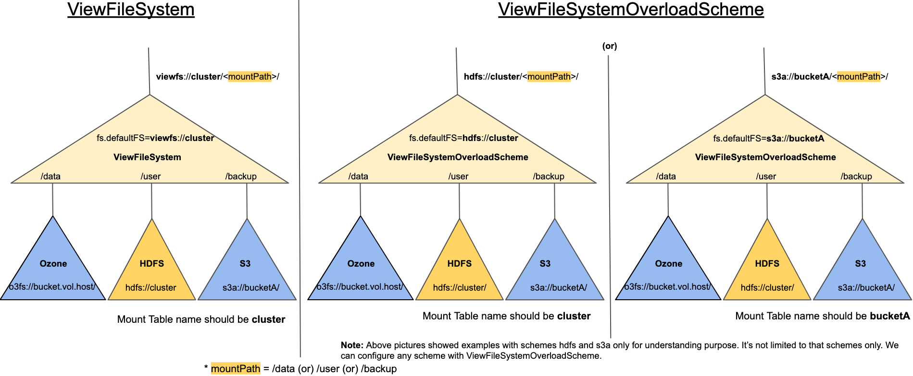


#### 解决mount table配置分发的问题

**中心化的mount table配置**

**方案一：将中心化的mount table配置文件放在HCFS上（如HDFS，COS、OSS、OBS等文件系统上）**

`fs.viewfs.mounttable.path`的值可以是目录，也可以是指定的某个文件。**若为目录，则找符合指定命名规格的最新的mount table配置文件作为当前的配置文件；若为文件，则只会将指定的文件作为当前的配置文件**。

在`core-site.xml`中，`fs.viewfs.mounttable.path`配置为目录

```xml
<property>
  <name>fs.viewfs.mounttable.path</name>
  <value>hdfs://cluster/config/mount-table-dir</value>
</property>
```

会在`hdfs://cluster/config/mount-table-dir/`目录下找到文件名为`mount-table.<versionNumber>.xml`格式的文件，并选择`versionNumber`更高的作为mount table的配置文件，所以每次修改mount table 之后需要增加versionNumber。

在`core-site.xml`中，`fs.viewfs.mounttable.path`配置为指定文件

```
<property>
  <name>fs.viewfs.mounttable.path</name>
  <value>hdfs://cluster/config/mount-table-dir/mount-table.<versionNumber>.xml</value>
</property>
```

注意：官方的建议是将mount table的mount link配置都写在单独的配置文件中如`mount-table.<versionNumber>.xml`中，而不要直接写在`core-site.xml`中，因为这会搞得特别乱。

**方案二：将mount table的配置文件放在远程Server上，通过xml的xinclude方式获取配置**

```xmla
<configuration xmlns:xi="http://www.w3.org/2001/XInclude">
  <xi:include href="http://myserver/mountTable/mountTable.xml" />
</configuration>
```

**缺点**：远程server的单点故障问题。

通过配置`fs.viewfs.mounttable.default.name.key`，可以实现不写主机/namespace信息也可以访问集群上的数据，如 `hdfs:///foo/bar`, `hdfs:/foo/bar` or `viewfs:/foo/bar`。如：

```xml
<property>
  <name>fs.hdfs.impl</name>
  <value>org.apache.hadoop.fs.viewfs.ViewFileSystemOverloadScheme</value>
</property>

<property>
  <name>fs.defaultFS</name>
  <value>hdfs://cluster/</value>
</property>

<property>
  <name>fs.viewfs.mounttable.default.name.key</name>
  <value>cluster</value>			<!-- 此值必须等于fs.defaultFS中的主机部分 -->
</property>
```


**ViewFs Overload Scheme的缺点**：

- 每次job启动都会进行一次额外的mount point信息的请求解析，这是否会给server端造成一定的压力？同时这部分会增加少许的latency。
- 如果在job运行过程中更改了server端的mapping关系，job的task可能会看到不一样的mount point关系，会出问题。

## snapshot

参考文档：https://hadoop.apache.org/docs/stable/hadoop-project-dist/hadoop-hdfs/HdfsSnapshots.html

**HDFS的快照是只读的。快照的一些常见作用是数据备份、防止用户错误和灾难恢复。**

可以对整个文件系统做snapshot，也可以对文件系统的某个子树（子目录）做snapshot。

快照文件记录块列表和文件大小，但不进行数据复制，也就是说snapshot记录的是目录的元数据。

快照不会对常规HDFS操作产生不利影响：修改按时间倒序记录，以便可以直接访问当前数据。快照数据是通过从当前数据中减去修改来计算的。


可快照的目录（snapshottable，快照表）最多支持65535个快照。可快照目录的数量无限制。**如果目录中有快照，则在删除所有快照之前，既不能删除也不能重命名该目录**。

**当前不允许使用嵌套的快照表目录。**换句话说，如果目录的祖先/后代之一是快照表目录，则不能将其设置为快照目录。

.snapshot

具体操作（**需要管理员权限（superuser）**）：

允许对指定目录进行快照：

```bash
hdfs dfsadmin -allowSnapshot <path>
```

不允许创建目录的快照。在禁止快照之前，必须删除目录的所有快照。

```bash
hdfs dfsadmin -disallowSnapshot <path>
```

创建快照

```bash
hdfs dfs -createSnapshot <path> [<snapshotName>]
```

删除快照

```bash
hdfs dfs -deleteSnapshot <path> <snapshotName>
```

重命名快照

```bash
hdfs dfs -renameSnapshot <path> <oldName> <newName>
```

查看当前用户可以做快照的所有目录

```bash
hdfs lsSnapshottableDir
```

查看两个快照之间的不同之处，`.`表示当前目录状态

```bash
hdfs snapshotDiff <path> <fromSnapshot> <toSnapshot>

# 查看快照和当前目录状态的不同
hdfs snapshotDiff <path> <fromSnapshot> .
```

输出结果有如下几种：

```bash
+	The file/directory has been created.
-	The file/directory has been deleted.
M	The file/directory has been modified.
R	The file/directory has been renamed.
```

注意：

> 假设快照目录为D0，有个其他目录为D1。
>
> 从D0/A重命名为D0/A1，状态为`R`。
>
> 从D0/A重命名到D1/A，状态为`-`，表示从当前快照目录删除了。
>
> 从D1/A重命名为D0/A，状态为`+`，表示加入到当前快照目录了。

列出foo目录的所有快照

```bash
hdfs dfs -ls /foo/.snapshot
```

列出快照s0的文件/目录

```bash
hdfs dfs -ls /foo/.snapshot/s0
```

从快照s0中copy文件/目录

```bash
hdfs dfs -cp -ptopax /foo/.snapshot/s0/bar /tmp
```

`-ptopax`表示保留原文件的timestamps, ownership, permission, ACLs and XAttrs。

从不支持快照的旧版本HDFS升级时，需要首先重命名或删除名为`.snapshot`的快照路径，以避免与保留路径（`.snopshot`）冲突。

```bash
# 1. 允许打快照
[hadoop@hadoop322-node01 ~]$ hdfs dfsadmin -allowSnapshot /user/sjl
Allowing snapshot on /user/sjl succeeded
# 2. 为某目录创建快照
[hadoop@hadoop322-node01 ~]$ hdfs dfs -createSnapshot /user/sjl 
Created snapshot /user/sjl/.snapshot/s20230331-103523.634
# 3. 查看某目录的快照
[hadoop@hadoop322-node01 ~]$ hdfs dfs -ls /user/sjl 
Found 1 items
drwxr-xr-x   - hadoop supergroup          0 2023-02-13 15:58 /user/sjl/test
[hadoop@hadoop322-node01 ~]$ hdfs dfs -ls /user/sjl/.snapshot
Found 1 items
drwxr-xr-x   - hadoop supergroup          0 2023-03-31 10:35 /user/sjl/.snapshot/s20230331-103523.634
# 4. 重命名
[hadoop@hadoop322-node01 ~]$ hdfs dfs -renameSnapshot /user/sjl s20230331-103523.634 s230331-01
[hadoop@hadoop322-node01 ~]$ hdfs dfs -ls /user/sjl/.snapshot
Found 1 items
drwxr-xr-x   - hadoop supergroup          0 2023-03-31 10:35 /user/sjl/.snapshot/s230331-01

[hadoop@hadoop322-node01 ~]$ hdfs dfs -ls /user/sjl/.snapshot/s230331-01/test
Found 2 items
drwxr-xr-x   - hadoop supergroup          0 2023-02-13 14:49 /user/sjl/.snapshot/s230331-01/test/input
drwxr-xr-x   - hadoop supergroup          0 2023-02-13 16:02 /user/sjl/.snapshot/s230331-01/test/output
[hadoop@hadoop322-node01 ~]$ hdfs dfs -ls /user/sjl/test
Found 2 items
drwxr-xr-x   - hadoop supergroup          0 2023-02-13 14:49 /user/sjl/test/input
drwxr-xr-x   - hadoop supergroup          0 2023-02-13 16:02 /user/sjl/test/output
# 5. 删除原始文件，在.snapshot中仍存在旧的文件
[hadoop@hadoop322-node01 ~]$ hdfs dfs -rm /user/sjl/test/input/LICENSE.txt
[hadoop@hadoop322-node01 ~]$ hdfs dfs -ls /user/sjl/.snapshot/s230331-01/test/input/LICENSE.txt
-rw-r--r--   3 hadoop supergroup     150569 2023-02-13 14:48 /user/sjl/.snapshot/s230331-01/test/input/LICENSE.txt
# 6. 查看当前用户可以在哪些目录做快照
[hadoop@hadoop322-node01 ~]$ hdfs lsSnapshottableDir
drwxr-xr-x 0 hadoop supergroup 0 2023-03-31 10:35 1 65536 /user/sjl
# 7. 查看快照的不同
[hadoop@hadoop322-node01 ~]$ hdfs snapshotDiff /user/sjl s230331-01 .
Difference between snapshot s230331-01 and current directory under directory /user/sjl:
M	./test/input
-	./test/input/LICENSE.txt
```

直接`hdfs dfs -ls /user/sjl`并不能看到是否有`.snapshot`，需要直接`hdfs dfs -ls /user/sjl/.snapshot`。

## Offline Edits Viewer

参考文档：https://hadoop.apache.org/docs/stable/hadoop-project-dist/hadoop-hdfs/HdfsEditsViewer.html

`Offline Edits Viewer`工具的目的是解析edits log文件。**此工具是基于edits文件来进行解析的，并不是一定要运行hadoop集群。**

支持的input format，对应的参数为`-i`。

- binary，二进制格式。
- xml。XML格式。

Note: XML/Binary format input file is not allowed to be processed by the same type processor.

**注意：XML/Binary格式作为输入文件，不能选择相同类型的processor。若输入格式为XML，则不能选择xml的processor。**

支持的输出格式，对应的参数为`-o`。

- binary，二进制格式。
- xml，XML格式。
- stats，打印统计信息，无法依据此输出转换回edits log文件。

提供了如下几种processor：

- XML Processor。默认

  ```bash
  bash$ bin/hdfs oev -p xml -i edits -o edits.xml
  ```

  因为是默认的proseesor，不加`-p xml`也是可以的。

  ```bash
  bash$ bin/hdfs oev -i edits -o edits.xml
  ```

- Binary Processor

  根据x.xml重建edits log 文件

  ```bash
  bash$ bin/hdfs oev -p binary -i edits.xml -o edits
  ```

  

- Stats Processor

  主要用于获取edits log文件中的统计信息。

  ```bash
  bash$ bin/hdfs oev -p stats -i edits -o edits.stats
  ```

  输出如下：

  ```bash
     VERSION                             : -64
     OP_ADD                         (  0): 8
     OP_RENAME_OLD                  (  1): 1
     OP_DELETE                      (  2): 1
     OP_MKDIR                       (  3): 1
     OP_SET_REPLICATION             (  4): 1
     OP_DATANODE_ADD                (  5): 0
     OP_DATANODE_REMOVE             (  6): 0
     OP_SET_PERMISSIONS             (  7): 1
     OP_SET_OWNER                   (  8): 1
     OP_CLOSE                       (  9): 9
     OP_SET_GENSTAMP_V1             ( 10): 0
     ...some output omitted...
     OP_APPEND                      ( 47): 1
     OP_SET_QUOTA_BY_STORAGETYPE    ( 48): 1
     OP_ADD_ERASURE_CODING_POLICY   ( 49): 0
     OP_ENABLE_ERASURE_CODING_POLICY  ( 50): 1
     OP_DISABLE_ERASURE_CODING_POLICY ( 51): 0
     OP_REMOVE_ERASURE_CODING_POLICY  ( 52): 0
     OP_INVALID                     ( -1): 0
  ```

  

## Offline Image Viewer

参考文档：https://hadoop.apache.org/docs/stable/hadoop-project-dist/hadoop-hdfs/HdfsImageViewer.html

`Offline Image Viewer`工具的目的是将hdfs fsimage文件的内容转储为人类可读的格式，并提供只读的WebHDFS API，以便对Hadoop集群的命名空间进行离线分析和检查。该工具能够相对快速地处理非常大的image文件。该工具处理Hadoop 2.4及更高版本中包含的布局格式。如果您想处理较旧的布局格式，可以使用Hadoop 2.3的`Offline Image Viewer`或[oiv_legacy](https://hadoop.apache.org/docs/stable/hadoop-project-dist/hadoop-hdfs/HdfsImageViewer.html#oiv_legacy_Command)命令。如果该工具无法处理图像文件，它将干净地退出。**Offline Image Viewer不需要运行Hadoop集群；它在运行中完全离线。**

**注意：如果要使用`oiv_legacy`命令，需要`dfs.namenode.legacy-oiv-image.dir`，这样standby Namenode或secondary Namenode才会在checkpoint的时候保存旧格式的fsimage到此配置项的目录中。**

`Offline Image Viewer`提供了如下几种输出processor：

- `Web Processor`。默认。它启动一个HTTP服务器，该服务器暴露只读的WebHDFS API。用户可以通过使用HTTP REST API以交互方式查看命名空间。它不支持安全模式，也不支持HTTPS。

  使用方式：

  第一步，启动HTTP服务器，用来暴露只读的WebHDFS API。

  ```bash
   bash$ bin/hdfs oiv -i fsimage
     14/04/07 13:25:14 INFO offlineImageViewer.WebImageViewer: WebImageViewer
     started. Listening on /127.0.0.1:5978. Press Ctrl+C to stop the viewer.
  ```

  第二步，通过如下命令获取namespace的image信息。

  ```bash
     bash$ bin/hdfs dfs -ls webhdfs://127.0.0.1:5978/
     Found 2 items
     drwxrwx--* - root supergroup          0 2014-03-26 20:16 webhdfs://127.0.0.1:5978/tmp
     drwxr-xr-x   - root supergroup          0 2014-03-31 14:08 webhdfs://127.0.0.1:5978/user
  ```

  HTTP接口形式访问：

  ```bash
     bash$ curl -i http://127.0.0.1:5978/webhdfs/v1/?op=liststatus
     HTTP/1.1 200 OK
     Content-Type: application/json
     Content-Length: 252
  
     {"FileStatuses":{"FileStatus":[
     {"fileId":16386,"accessTime":0,"replication":0,"owner":"theuser","length":0,"permission":"755","blockSize":0,"modificationTime":1392772497282,"type":"DIRECTORY","group":"supergroup","childrenNum":1,"pathSuffix":"user"}
     ]}}
  ```

- `XML Processor`。创建fsimage的XML文档，包含fsimage中的所有信息。

  ```bash
  bash$ bin/hdfs oiv -p XML -i fsimage -o fsimage.xml
  ```

- `ReverseXML Processor`。这与XML处理器相反；它从一个XML文件重建一个fsimage。该处理器可以轻松创建用于测试的fsimage，并在出现损坏时手动编辑fsimage。

  ```bash
  bash$ bin/hdfs oiv -p ReverseXML -i fsimage.xml -o fsimage
  ```

- `FileDistribution Processor`。是**用于分析命名空间image中的文件大小的工具**。分析fsimage中指定大小范围的文件个数。范围为[0, maxSize]，步长为`-step`。

  ```bash
  bash$ bin/hdfs oiv -p FileDistribution -maxSize maxSize -step size -i fsimage -o output
        Size	NumFiles
     4	1
     12	1
     16	1
     20	1
     totalFiles = 4
     totalDirectories = 2
     totalBlocks = 4
     totalSpace = 48
     maxFileSize = 21
  ```

  通过`-format`进行输出格式化

  ```bash
  bash$ bin/hdfs oiv -p FileDistribution -maxSize maxSize -step size -format -i fsimage -o output
     Size Range	NumFiles
     (0 B, 4 B]	1
     (8 B, 12 B]	1
     (12 B, 16 B]	1
     (16 B, 21 B]	1
     totalFiles = 4
     totalDirectories = 2
     totalBlocks = 4
     totalSpace = 48
     maxFileSize = 21
  ```

- `Delimited Processor`。生成一个文本文件，其中包含正在构建的inode和inode共有的所有元素，并用分隔符分隔。默认的分隔符是`\t`，但这可以通过`-demitter`参数进行更改。

  ```bash
  bash$ bin/hdfs oiv -p Delimited -delimiter delimiterString -i fsimage -o output
     Path	Replication	ModificationTime	AccessTime	PreferredBlockSize	BlocksCount	FileSize	NSQUOTA	DSQUOTA	Permission	UserName	GroupName
     /	0	2017-02-13 10:39	1970-01-01 08:00	0	0	0	9223372036854775807	-1	drwxr-xr-x	root	supergroup
     /dir0	0	2017-02-13 10:39	1970-01-01 08:00	0	0	0	-1	-1	drwxr-xr-x	root	supergroup
     /dir0/file0	1	2017-02-13 10:39	2017-02-13 10:39	134217728	1	1	0	0	-rw-r--r--	root	supergroup
     /dir0/file1	1	2017-02-13 10:39	2017-02-13 10:39	134217728	1	1	0	0	-rw-r--r--	root	supergroup
     /dir0/file2	1	2017-02-13 10:39	2017-02-13 10:39	134217728	1	1	0	0	-rw-r--r--	root	supergroup
  ```

- `DetectCorruption Processor`。检测image的潜在损坏。以分隔格式输出已发现损坏的image。

  ```bash
  bash$ bin/hdfs oiv -p DetectCorruption -delimiter delimiterString -t temporaryDir -i fsimage -o output
     CorruptionType	Id	IsSnapshot	ParentPath	ParentId	Name	NodeType	CorruptChildren
      MissingChild	16385	false	/	Missing		Node	1
      MissingChild	16386	false	/	16385	dir0	Node	2
      CorruptNode	16388	true		16386		Unknown	0
      CorruptNode	16389	true		16386		Unknown	0
      CorruptNodeWithMissingChild	16391	true		16385		Unknown	1
      CorruptNode	16394	true		16391		Unknown	0
  ```

  

  

## HDFS Router-based Federation（RBF）

TODO

参考文档：https://hadoop.apache.org/docs/stable/hadoop-project-dist/hadoop-hdfs-rbf/HDFSRouterFederation.html

联邦和viewFs可以解决单个Namenode的内存限制了集群可存储的数据量的问题。**但是如何维护和管理这么多的子集群呢？**

为了解决这个问题，在集群的上层添加了一个federation layer。router组件拥有和namenode相同的接口，它查询`State Store`中记录的信息只有，就可以将客户端的请求转发到正确的集群或namespace。


最简单的配置是在每台NameNode计算机上部署一个路由器。路由器监视本地NameNode及其状态，并将检测信号发送到`State Store`。路由器监视本地NameNode，并将状态检测信号发送到`State Store`。当常规DFS客户端联系任何路由器以访问federation FS中的文件时，路由器会检查`State Store`（即本地缓存）中的`mount table`（子集群的映射关系），以找出包含该文件的子集群。然后，它在State Store（即本地缓存）中的Membership表中检查负责子集群的NameNode。在识别出正确的NameNode之后，路由器代理该请求。客户端直接访问数据节点。

系统中可以有多个具有软状态的路由器。每个路由器有两个角色：

- **federation接口**：向客户端公开单个全局NameNode接口，并将请求转发到正确子集群中的活动NameNode

  Router接收HDFS客户端的请求，并检查State Store，将此请求转发到正确的子集群的Active Namenode。Router是无状态的。Router可以缓存`mount table`信息以提高性能。

- **NameNode heartbeat**：在`State Store`中维护NameNode的信息

  Router会定期发送心跳信息给`State Store`

Router会定期的检查Namenode的状态。为了简单起见，通常可以将Router嵌入在Namenode中。

**RBF的可用性和容错性**

Router可能在多个级别上出现故障：

- federation 接口HA

  Router是无状态的，当一个Router故障了，其他Router可以接管它。需要在客户端配置所有的Router的连接信息。

- State Store不可用

  如过Router无法联系到State Store，则Router会进入安全模式（不能处理客户端请求）。客户端会尝试其他的Router。

  管理router的安全模式。

  ```bash
  $HADOOP_HOME/bin/hdfs dfsrouteradmin -safemode enter | leave | get
  ```

- NameNode心跳HA

  为了高可用和灵活性，多个Router监控同一个Namenode，并将心跳信息发送给State Store。状态存储中存在冲突的NameNode信息由每个路由器通过仲裁解决。

- NameNode不可用

  如果Router无法联系到Active Namenode，Router会尝试连接该集群的其他namenode。如果所有namenode都无法连接，则Router抛出异常。

- NameNode过期

  在指定时间内，如果namenode没有将心跳信息记录到State Store，那么监控此Namenode的Router会将此Namenode标记为过期，并且所有的Router都不会再去联系此namenode。只有当namenode的心跳信息恢复后，Router才会恢复和Namenode的连接。

Router暴露了多种接口可以和用户、管理员交互：

- RPC
- Admin
- Web UI
- WebHDFS
- JMX

**配额管理**

federation支持在`mount table`级别上的全局quota配置。出于性能考虑，Router会缓存quota信息并定期更新它。配置了全局quota之后，不建议直接在子集群级别设置和清除quota（应该在全局级别进行设置）。

**`State Store`***

State Store包含：

- 子集群的块访问负载、可用磁盘空间、HA状态等方面的状态。
- 文件夹/文件和子集群之间的映射，即远程`mount table`。

State Store是可插拔的，

`State Store`中的主要信息是：

- `membership`

  存储子集群的信息，如存储容量、节点数量。

- `mount table`

  `mount table`中存的是文件夹和子集群的映射关系。类似于ViewFs中的`mount table`。


```bash
# -nsQuota表示设置name quota，-ssQuota表示设置space quota。
$HADOOP_HOME/bin/hdfs dfsrouteradmin -setQuota /path -nsQuota 100 -ssQuota 1024
# 设置指定storage type的qutoa
$HADOOP_HOME/bin/hdfs dfsrouteradmin -setStorageTypeQuota <path> -storageType <storage type>
# 移除指定mount table上的quota
$HADOOP_HOME/bin/hdfs dfsrouteradmin -clrQuota <path>
# 移除指定mount table上的storage type的quota
$HADOOP_HOME/bin/hdfs dfsrouteradmin -clrStorageTypeQuota <path>
# 查看mount table 条目
$HADOOP_HOME/bin/hdfs dfsrouteradmin -ls
Source                    Destinations              Owner                     Group                     Mode                      Quota/Usage
/path                     ns0->/path                root                      supergroup                rwxr-xr-x                 [NsQuota: 50/0, SsQuota: 100 B/0 B]

# 手动刷新mount table的缓存
$HADOOP_HOME/bin/hdfs dfsrouteradmin -refresh
```


### 部署

默认情况下，Router监控本机的namenode。

通过在配置文件`hdfs-rbf-default.xml`中配置`dfs.federation.router.store.driver.class `之后，Router才知道State Store的endpoint。

**启动Router**

```bash
$HADOOP_PREFIX/bin/hdfs --daemon start dfsrouter
```

**停止Router**

```bash
$HADOOP_PREFIX/bin/hdfs --daemon stop dfsrouter
```

**mount table管理**

mount table条目类似于ViewFs中的mount table 条目。federation admin工具可用用来管理RBF的mount table，如下所示：

```bash
# /tmp 映射为命名空间ns1的/tmp
$HADOOP_HOME/bin/hdfs dfsrouteradmin -add /tmp ns1 /tmp
# /data/app1 映射为命名空间ns2的/data/app1
$HADOOP_HOME/bin/hdfs dfsrouteradmin -add /data/app1 ns2 /data/app1
# /data/app2 映射为命名空间ns3的/data/app2
$HADOOP_HOME/bin/hdfs dfsrouteradmin -add /data/app2 ns3 /data/app2
# 查看RBF所有的mount table 条目
$HADOOP_HOME/bin/hdfs dfsrouteradmin -ls
# 只读的挂载点
$HADOOP_HOME/bin/hdfs dfsrouteradmin -add /readonly ns1 / -readonly
```

如果没有设置挂载点，Router将之映射到默认命名空间（`dfs.federation.Router.default.nameserviceId`）。

mount table具有类似UNIX的权限，这些权限限制哪些用户和组可以访问mount point。写入权限允许用户添加、更新或删除mount point。读取权限允许用户列出mount point。执行权限未使用。

mount table的权限设置：

```bash
$HADOOP_HOME/bin/hdfs dfsrouteradmin -add /tmp ns1 /tmp -owner root -group supergroup -mode 0755
```

**多子集群**

一个mount point可以映射到多个子集群。

```bash
$HADOOP_HOME/bin/hdfs dfsrouteradmin -add /data ns1,ns2 /data -order SPACE
```

**禁用nameservice**

用于下线一整个子集群。

```bash
# 禁用ns1命名空间
$HADOOP_HOME/bin/hdfs dfsrouteradmin -nameservice disable ns1
$HADOOP_HOME/bin/hdfs dfsrouteradmin -getDisabledNameservices
# 启用ns1命名空间
$HADOOP_HOME/bin/hdfs dfsrouteradmin -nameservice enable ns1
```

**刷新Router服务器的配置**

```bash
# 刷新指定key，而不用重启Router服务。
$HADOOP_HOME/bin/hdfs dfsrouteradmin -refreshRouterArgs <host:ipc_port> <key> [arg1..argn]
```

**相关配置**

TODO

## **HDFS权限**

HDFS的文件/目录的权限模型类似于`POSIX model`。每个文件/目录都有owner和groups。

HDFS的权限模型中：

- `r`: 读文件；列出目录的内容。
- `w`: 写/append文件；创建/删除文件/子目录。
- `x`: HDFS文件无x；访问子目录。

**`sticky bit`（粘滞位）**是设置在目录上的，目的是阻止非superuser、文件/目录owner的delete、mv操作。

HDFS还提供了`POSIX ACLs`。

**`permission check`**：

- 用户名匹配文件/目录的owner，走owner的权限。
- 组名匹配文件/目录的group list中的某个，走group的权限。
- 走other用户的权限。

### 用户身份（user identity）

从`hadoop 0.22`开始支持2种模式来识别用户的身份，由`hadoop.security.authentication`参数决定使用什么模式。

- `simple` 访问HDFS的用户身份由客户端进程所在主机的操作系统来决定。在`Unix-like system`中用户名=`whoami`。
- `kerberos` 访问HDFS的用户身份由`keberos credentials`决定。

**<font color="red">注意：HDFS本身是没有用户身份机制的，HDFS都是依赖其他机制来确定用户身份的。</font>**

### 组映射（group mapping）

由`hadoop.security.group.mapping`参数决定使用什么group mapping服务。

### 权限检查（permission check）

所有操作都需要遍历访问。

如：假设访问`/foo/bar/baz`，那么要求客户端用户具有 `/`, `/foo` 和`/foo/bar`的`EXECUTION`权限。

改变文件/目录权限的命令

```bash
hdfs dfs -chmod [-R] 066 文件名|目录名
hdfs dfs -chgrp [-R] 组名 文件名|目录名
hdfs dfs -chown [-R] [owner[:group]] 文件名|目录名
```

**super-user是运行NameNode进程的用户名。**

**HDFS的super-user和NameNode所在机器的操作系统的super-user不必一样。**

### ACLs

HDFS除了支持传统的POSIX 权限模型外，还支持POSIX ACLs。

ACL可以给为某些用户/组设置权限，是对传统的POSIX权限模型（不止ugi）的补充。

NameNode的`hdfs-site.xml`中的`dfs.namenode.acls.enabled`参数决定了是否启用ACL。

ACL由一组ACL条目组成。例如

```bash
   user::rw-											# 表示一个ACL条目，表示文件的owner具有rw权限
   user:bruce:rwx                  #effective:r-- 表示用户bruce对此文件具有rwx权限，因为mask的原因，实际权限为r
   group::r-x                      #effective:r-- 表示文件的group具有rx权限，因为mask的原因，实际权限为r
   group:sales:rwx                 #effective:r-- 表示组sales对此文件具有rwx权限，因为mask的原因，实际权限为r
   mask::r--											# 相当于一个过滤器。
   other::r--											# 表示其他用户具有r权限
```

ACL条目的格式为`type:用户名或组名:权限字符串`。

每个ACL都必须有一个掩码。只有目录可以具有默认ACL。创建新文件或子目录时，它会自动将其父级的默认ACL复制到自己的访问ACL中。

```bash
   user::rwx											# 是access acl，表示权限检查时检查的权限
   group::r-x											# 是access acl，表示权限检查时检查的权限
   other::r-x											# 是access acl，表示权限检查时检查的权限
   default:user::rwx							# 是default acl，表示新子文件或子目录在创建后的acl权限。
   default:user:bruce:rwx          #effective:r-x # 是default acl，表示新子文件或子目录在创建后的acl权限。
   default:group::r-x							# 是default acl，表示新子文件或子目录在创建后的acl权限。
   default:group:sales:rwx         #effective:r-x # 是default acl，表示新子文件或子目录在创建后的acl权限。
   default:mask::r-x							# 是default acl，表示新子文件或子目录在创建后的acl权限。
   default:other::r-x							# 是default acl，表示新子文件或子目录在创建后的acl权限。
```

修改了父目录的default acl不会改变已经创建了的子目录/文件的acl权限。

access acl最多32条，default acl最多32条。

如果配置了acl，那么权限检查的算法逻辑为：

- 如果用户名匹配文件owner，走owner权限
- 如果用户名匹配了acl中的用户名，走这条acl权限，但是要用mask对权限过滤。
- 如果用户组名匹配group list中的一个，走group权限，但是要用mask对组权限过滤。
- 如果用户组名匹配acl中的group list中的一个，走acl中的group权限，但是要用mask对组权限过滤。
- 如果用户组名匹配acl中的group list中的一个，但是没有访问权限，则访问被拒绝。
- 否则走other用户的权限。

**与只有权限位的文件相比，具有ACL的文件在NameNode中会增加内存成本。**

**acl相关命令**：

```bash
# 1. 获取文件/目录的access acl和default acl（目录才有）
hdfs dfs -getfacl [-R] <path>
# 2. 设置文件/目录的acl
hdfs dfs -setfacl [-R] [-b |-k -m |-x <acl_spec> <path>] |[--set <acl_spec> <path>]
# 3. 通过ls可以看到哪些文件/目录具有acl。如果最后面有个"+"表示有acl。
hdfs dfs -ls <args>
```

**acl相关配置参数**：

```bash
# 是否启用permission check，不管true或false，chmod、chgrp、chown、setfacl始终会权限检查
dfs.permissions.enabled = true
# web server使用的用户名，如果为super-user那么会允许任何的web client看到所有内容。例如在hdfs web ui查看（此配置为other中用户，那么只能看到other用户有r权限的文件/目录）
dfs.web.ugi = webuser,webgroup
# super-users的组，此组中的用户具有superuser权限。
dfs.permissions.superusergroup = supergroup
# 创建文件和目录时使用的umask，如022，表示创建出来的目录权限为755。
fs.permissions.umask-mode = 0022
# acl的管理员
dfs.cluster.administrators = ACL-for-admins
# 是否启用hdfs acl
dfs.namenode.acls.enabled = true
# 启用之后，NameNode会把父目录的default acl应用到新创建的子目录/文件上。
dfs.namenode.posix.acl.inheritance.enabled
```

## Quota（配额）

HDFS可以为目录设置quota。有两种quota，两种quota相互独立。：

- `name quota` 

  是对指定目录下的文件/目录数量的硬限制。如果数量超过`name quota`的限制，则创建文件/目录会失败。最大的配额是Long.Max_Value。新创建的目录是没有设置name quota的。设置和移除quota也会记录到journalNode的edits log文件中。

- `space quota` 

  是对指定目录下的文件字节数的硬限制。新创建的目录没有关联的配额。最大的配额是Long.Max_Value。零配额仍然允许创建文件，但不能向文件中添加块。目录不计入`space quota`。`space quota`是乘以副本数之后的字节数（不是按单副本算的）。设置和移除quota也会记录到journalNode的edits log文件中。

**Storage Type Quotas**

HDFS还可以为指定目录的存储类型(SSD, DISK, ARCHIVE) 做硬限制。

**quota相关命令**

```bash
###########管理员命令################
# 为每个目录设置name quota，N表示个数
hdfs dfsadmin -setQuota <N> <directory>...<directory>
# 清除为这些目录设置的name quota
hdfs dfsadmin -clrQuota <directory>...<directory>
# 为每个目录设置space quota，N表示字节数。1GB的文件，副本数为3，则占用3GB的space quota。
hdfs dfsadmin -setSpaceQuota <N> <directory>...<directory>
# 清除为这些目录设置的space quota
hdfs dfsadmin -clrSpaceQuota <directory>...<directory>
# 为这些目录设置storage type quota
hdfs dfsadmin -setSpaceQuota <N> -storageType <storagetype> <directory>...<directory>
# 清除为这些目录设置的storage type quota
hdfs dfsadmin -clrSpaceQuota -storageType <storagetype> <directory>...<directory>
# 查看quota情况。-h表示人类可读，-v表示显示列头，-t表示显示每种storage type的配额。
hadoop fs -count -q [-h] [-v] [-t [comma-separated list of storagetypes]] <directory>...<directory>
```


## libhdfs（C API）

libhdfs是一个基于JNI的C API，用于Hadoop的分布式文件系统（HDFS）。它是HDFS API的一个子集，通过此C API可以操作HDFS文件和文件系统。

## Web HDFS（REST API）

FileSystem URIs和HTTP URLs的区别

WebHDFS 的scheme是''`webhdfs://`"。

```bash
# WebHDFS的URI，等价于hdfs://<HOST>:<RPC_PORT>/<PATH>
webhdfs://<HOST>:<HTTP_PORT>/<PATH>

# 如果webhdfs开启了ssl，则应为
swebhdfs://<HOST>:<HTTP_PORT>/<PATH>

# 对应的HTTP REST URL
http://<HOST>:<HTTP_PORT>/webhdfs/v1/<PATH>?op=...
```


## HttpFS

HttpFS全称Hadoop HDFS over HTTP。HttpFS是一个提供REST HTTP网关的服务器，支持所有HDFS文件系统操作（读取和写入）。

HttpFS可以用于在运行不同版本Hadoop的集群之间传输数据（克服RPC版本控制问题），例如使用Hadoop DistCP（跨大版本不支持）。

可以使用curl，wget通过HttpFS来访问HDFS。

HttpFS是一个独立于Hadoop NameNode的服务。
HttpFS本身就是Java Jetty web应用程序。
HttpFS HTTP Web服务API调用是映射到HDFS文件系统操作的HTTP REST调用。例如，使用curl Unix命令：

```bash
# 返回/user/foo/README.txt文件的内容
$ curl 'http://httpfs-host:14000/webhdfs/v1/user/foo/README.txt?op=OPEN&user.name=foo'
# 以json格式返回/user/foo目录的内容
$ curl 'http://httpfs-host:14000/webhdfs/v1/user/foo?op=LISTSTATUS&user.name=foo'
# 返回/user/foo/.Trash的路径，
$ curl 'http://httpfs-host:14000/webhdfs/v1/user/foo?op=GETTRASHROOT&user.name=foo'
# 创建/user/foo/bar目录
$ curl -X POST 'http://httpfs-host:14000/webhdfs/v1/user/foo/bar?op=MKDIRS&user.name=foo'
```

HttpFS需要单独安装和启动，参考：https://hadoop.apache.org/docs/stable/hadoop-hdfs-httpfs/ServerSetup.html

## 短路本地读（short circuit local read）

在HDFS中，读取数据是通过DataNode进行。当客户端从DataNode读取文件时，DataNode会从磁盘中读取该文件，并通过TCP套接字将数据发送给客户端。所谓的“短路”读取绕过DataNode，允许客户端直接读取文件。显然，这只有在客户端与数据位于同一位置的情况下才有可能实现。短路读取为许多应用程序提供了实质性的性能提升。

`short circuit read`需要使用`unix domain socket`，通过此套接字可以让client和datanode通信。

短路本地读取需要在DataNode和客户端上进行配置。

**短路本地读相关配置**

```xml
<configuration>
  <property>
    <name>dfs.client.read.shortcircuit</name>
    <value>true</value>
  </property>
  <property>
    <name>dfs.domain.socket.path</name>
    <value>/var/lib/hadoop-hdfs/dn_socket</value>
  </property>
</configuration>
```


## 中心化缓存管理（centralized cache management）

集中式缓存管理对于重复访问的文件非常有用。例如，Hive中经常用于联接的一个小表是缓存的一个很好的选择。

通过此机制，用户可以指定需要HDFS缓存的path。NameNode通过心跳发送信息告诉DataNode，将需要缓存的block缓存在off-heap cache中。


NameNode通过发送cache指令给Datanode，告诉datanode需要缓存哪些block。Datandoe通过心跳报告给Namenode它缓存了哪些block。cache指令会持久化在fsimage和edits log中。**缓存当前是在文件或目录级别上完成的**。可以缓存文件和目录（只缓存目录下的文件，子目录下的文件不缓存）

## NFS Gateway

NFS Gateway支持NFSv3，允许HDFS作为客户端本地文件系统的一部分挂载在本地文件系统。目前，NFS Gateway支持和启用了下面的使用模式：

1.      用户可以在基于NFSv3客户端兼容的操作系统上的本地文件系统上浏览HDFS文件系统。

2.      用户可以从挂载到本地文件系统的HDFS文件系统上下载文件。

3.      用户可以从本地文件系统直接上传文件到HDFS文件系统。

4.      用户可以通过挂载点直接将数据流写入HDFS。目前支持文件append，随机写还不支持。

NFS Gateway机器需要跟运行HDFS Client一样的环境，像Jar包文件，HADOOP_CONF目录等。NFSGateway可以放在跟DataNode，NameNode或者任何一台HDFS Client机器上。
NFS服务需要三个守护进程rpcbind或portmap（portmap在centos6上被改名为rpcbind）, mountd and nfsd，NFS Gateway已经包含了nfsd和mountd。挂载时会把HDFS根目录作为唯一的挂载点。由于在RHEL6.2等操作系统上rpcbind有bug,推荐使用NFS Gateway软件包里自带的portmap。

## 滚动升级（rolling upgrade）

从`Hadoop 2.4.0`开始才支持滚动升级。

HDFS滚动升级允许升级单个HDFS守护进程。例如，datanode可以独立于namenode进行升级。一个namenode可以独立于其他namenode进行升级。namenode可以独立于datanode和journalnode进行升级。

如果在新软件版本中启用了任何新功能，则升级后可能无法与旧软件版本一起使用。在这种情况下，应通过以下步骤进行升级。

1.禁用新特性

2.升级集群

3.开启新特性

### 升级

只有HDFS HA集群才能不停机升级。

假设NN1为Active NN，NN2为Standby NN。

#### 不停机升级

一般而言，JNs和ZKNs不用升级，只要升级NNs和DNs即可。

**升级非联邦的HA集群**

> 1、准备滚动升级
>
> （1）创建回滚用的fsimage
>
> ```bash
> hdfs dfsadmin -rollingUpgrade prepare
> ```
>
> （2）检查rollback用的fsimage。当出现`Proceed with rolling upgrade`表示ok了。
>
> ```bash
> hdfs dfsadmin -rollingUpgrade query
> ```
>
> 2、升级Active NN和standby NN
>
> （1）关闭NN2，并升级NN2
>
> （2）启动NN2，作为standby NN
>
> ```bash
> hdfs namenode -rollingUpgrade started
> ```
>
> （3）主从切换，NN2成为active NN，NN1成为standby NN。
>
> ```bash
> hdfs haadmin -failover nn1 nn2
> ```
>
> （4）关闭NN1，升级NN1
>
> （5）启动NN1，作为standby
>
> ```bash
> hdfs namenode -rollingUpgrade started
> ```
>
> 3、升级DNs
>
> （1）选一小批datanode（比如同一个rack的，因为默认副本策略会在多个rack放置副本）。
>
> 1）关闭一个datanode
>
> ```bash
> hdfs dfsadmin -shutdownDatanode <DATANODE_HOST:IPC_PORT> upgrade
> ```
>
> 2）检查、等待datanode关闭
>
> ```bash
> hdfs dfsadmin -getDatanodeInfo <DATANODE_HOST:IPC_PORT>
> ```
>
> 3）升级并重启datanode
>
> 4）对选择的这一批datanode都执行1-3步。
>
> （2）重复第一步，直到所有的datanode都升级了。
>
> 4、完成滚动升级
>
> 完成rolling upgrade。
>
> ```bash
> hdfs dfsadmin -rollingUpgrade finalize
> ```
>
> 

**升级联邦HA集群**

升级联邦HA集群和非联邦HA集群类似，不同在于第1步和第4步需要对每个namespace执行，第2步需要对每一对active NN和standby NN执行。

> （1）为每个NameSpace准备滚动升级
>
> （2）为每个NameSpace升级每对Active和Standby的NN
>
> （3）升级DNs
>
> （4）为每个NameSpace完成滚动升级

#### 停机升级

对于非HA集群而言，namenode的升级需要停机。

**升级非HA集群**

与HA集群的升级步骤只有第2步不同。非HA集群升级的第2步为：

> 升级NN和SNN
>
> （1）关闭SNN
>
> （2）关闭和升级NN
>
> （3）使用`hdfs dfsadmin -rollingUpgrade started`启动NN
>
> （4）升级并重启SNN

### 降级

降级将软件恢复到升级前的版本，并保留用户数据。假设时间T是滚动升级开始时间，并且升级因降级而终止。然后，在T时刻前/后创建的文件在HDFS中仍然可用。在T时刻前/后删除的文件在HDFS中保持删除状态。

只有在NN 的layout version和DN的layout version在这两个版本之间都没有更改的情况下，较新版本才可降级为升级前版本。

在HA集群中，当从旧软件版本到新软件版本的滚动升级正在进行时，可以以滚动方式将升级后的机器降级回旧软件版本。

> 1、降级DNs
>
> （1）选一小批datanode（比如同一个rack的，因为默认副本策略会在多个rack放置副本）。
>
> 1）关闭一个datanode
>
> ```bash
> hdfs dfsadmin -shutdownDatanode <DATANODE_HOST:IPC_PORT> upgrade
> ```
>
> 2）检查/等待datanode关闭
>
> ```bash
> hdfs dfsadmin -getDatanodeInfo <DATANODE_HOST:IPC_PORT>
> ```
>
> 3）降级并重启datanode
>
> 4）为这一批datanode都执行1-3步。
>
> （2）重复第一步，直到所有的datanode都降级了。
>
> 2、降级Active NN和Standby NN
>
> （1）关闭和降级NN2
>
> （2）启动NN2作为standby NN
>
> （3）主备切换，NN2成为active，NN1成为standby
>
> ```bash
> hdfs haadmin -failover nn1 nn2
> ```
>
> 
>
> （4)关闭和降级NN1
>
> （5）启动NN1，作为standby
>
> 3、完成滚动降级
>
> ```bash
> hdfs dfsadmin -rollingUpgrade finalize
> ```
>
> 请注意，在降级NN之前必须降级DN，因为协议可以以向后兼容的方式更改，但不能向前兼容，即旧的DN可以与新的NN通信，但不能反过来。

### 回滚

回滚会将软件恢复到升级前的版本，也会将用户数据恢复到升级前是状态。假设滚动升级的开始时间为T，且升级被回滚所中止。在T时刻之前创建的文件在回滚后会仍然可用，但是在T时刻之后创建的文件在回滚后是不可用的。

在T时刻之前删除的文件在回滚后仍是删除的，在T时刻之后删除的文件在回滚后是未被删除的。

始终支持从较新版本回滚到升级前版本。然而，它不能以滚动的方式完成。它需要集群停机。假设NN1和NN2分别处于活动状态和备用状态。以下是回滚的步骤：

> 1、关闭所有NN和DN。
>
> 2、在所有机器上恢复升级前的版本。
>
> 3、使用`hdfs dfsadmin -rollingUpgrade rollback`命令启动NN1，作为active。
>
> 4、使用`hdfs namenode -bootstrapStandby`，`hdfs --daemon start namenode`命令启动NN，作为standby。
>
> 5、使用`hdfs --daemon -rollback datanode`命令启动DN。

相关命令介绍：

```bash
# query表示查询当前滚动升级的状态
# prepare表示准备新的滚动升级
# finalize表示完成了当前的滚动升级
hdfs dfsadmin -rollingUpgrade <query|prepare|finalize>

# 获取指定datanode的信息
hdfs dfsadmin -getDatanodeInfo <DATANODE_HOST:IPC_PORT>

# 提交指定datanode的shutdown请求。upgrade参数会告诉访问DN的客户端等待DN重启，过一段时间没重启会超时的。
hdfs dfsadmin -shutdownDatanode <DATANODE_HOST:IPC_PORT> [upgrade]

# rollback 表示恢复NN到升级之前的版本，用户数据也恢复到之前。
# started 表示
hdfs namenode -rollingUpgrade <rollback|started>
```


## 扩展属性（extended attributes）

Extended attributes缩写为xattrs。允许用户应用程序将额外的元数据与文件或目录相关联。

在HDFS中，有五个有效的命名空间：user、trusted、system、security和raw。这些命名空间中的每一个都有不同的访问限制。

**相关命令**

```bash
# 获取xattrs
hadoop fs -getfattr [-R] -n name | -d [-e en] <path>
# 设置xattrs
hadoop fs -setfattr -n name [-v value] | -x name <path>
```

**相关配置参数**

```bash
dfs.namenode.xattrs.enabled
dfs.namenode.fs-limits.max-xattrs-per-inode
dfs.namenode.fs-limits.max-xattr-size
```


## 透明加密（transparent encryption）

HDFS实现透明的端到端加密。一旦配置，从特殊HDFS目录读取和写入的数据将透明地加密和解密，而不需要更改用户应用程序代码。

存储加密和传输加密。

HDFS引入了一个新的抽象：encryption zone。加密区是一个特殊的目录，其内容在写入时将被透明地加密，在读取时被透明地解密。每个加密区域都与创建区域时指定的一个加密区域密钥相关联。加密区域内的每个文件都有自己唯一的数据加密密钥（DEK）。HDFS从不直接处理DEK。相反，HDFS只处理加密的数据加密密钥（EDEK）。客户端解密EDEK，然后使用后续的DEK读取和写入数据。HDFS数据节点只看到一个加密字节流。

HDFS允许嵌套加密区域。

需要一个新的集群服务来管理加密密钥：Hadoop密钥管理服务器（KMS）。在HDFS加密的背景下，KMS执行三项基本职责：

提供对存储的加密区域密钥的访问

生成新的加密数据加密密钥以存储在NameNode上

解密加密的数据加密密钥以供HDFS客户端使用。

在加密区域中创建新文件时，NameNode会要求KMS生成一个用加密区域的密钥加密的新EDEK。然后，EDEK作为文件元数据的一部分持久存储在NameNode上。

读取加密区域内的文件时，NameNode会向客户端提供文件的EDEK和用于加密EDEK的加密区域密钥版本。然后，客户端要求KMS解密EDEK，这包括检查客户端是否有权访问加密区域密钥版本。假设成功，客户端将使用DEK来解密文件的内容。

读写路径的所有上述步骤都是通过DFSClient、NameNode和KMS之间的交互自动执行的。

## 多重连接（muilthoming）

在多址网络中，集群节点连接到多个网络接口。这样做可能有多种原因。

- 安全性：安全性要求可能要求将集群内流量限制在与用于在集群内外传输数据的网络不同的网络中。
- 性能：集群内流量可以使用一个或多个高带宽互连，如光纤通道、Infiniband或10GbE。
- 故障切换/冗余：节点可能有多个网络适配器连接到单个网络，以处理网络适配器故障。

## storage policies

异构存储即有多种存储类型，不同存储类型对应的是不同的物理存储介质，

HDFS支持的`storage type`:

- `ARCHIVE` 高存储密度，计算性能低，主要用于归档。
- `DISK` 默认的存储类型。
- `SSD`
- `RAM_DISK` 支持在内存中写入单个副本文件。

HDFS支持的`storage policies`:

- `Hot` 用于存储和计算。当一个block为hot时，此块的所有副本都存储在DISK中。
- `Cold` 计算性能低，主要用于归档的数据。当一个block为cold时，此块的所有副本都存储在ARCHIVE中。
- `Warm` 数据是部分hot，部分cold。当一个block处于hot时，块的副本存储在DISK，当一个block处于cold时，块的副本存储在ARCHIVE。
- `All_SSD` 所有副本存储在SSD中。
- `One_SSD` block的一个副本存储在SSD中，剩余的副本存储在DISK中。
- `Lazy_Persist` block的一个副本存储在内存中。副本首先写入RAM_DISK，然后lazy 持久化到DISK中。
- `Provieded` 数据存储在HDFS之外，详情见：https://hadoop.apache.org/docs/stable/hadoop-project-dist/hadoop-hdfs/HdfsProvidedStorage.html

一个storage policy由如下几个字段组成：

- Policy ID
- Policy name
- 用于block放置的存储类型的列表
- A list of fallback storage types for file creation
- A list of fallback storage types for replication

**相关配置**：

```bash
# 是否启用storage policy，默认为true
dfs.storage.policy.enabled
# datanode的数据目录，格式为[DISK]file:///grid/dn/disk0，支持逗号分隔的多个数据目录。
dfs.datanode.data.dir
```

**mover工具**

mover是一个数据迁移工具，它主要作用是将数据归档。此工具会定期扫描HDFS中的文件，检查文件的block是否满足块放置策略，如果不满足，则会将block进行移动，以满足块放置策略。请注意，它总是尽可能在同一节点内移动块副本。如果这不可能（例如，当一个节点没有目标存储类型时），则它将通过网络将块副本复制到另一个节点。

```bash
hdfs mover [-p <files/dirs> | -f <local file name>]
```


相关命令：

```bash
# 列出所有storage policy
hdfs storagepolicies -listPolicies
# 为文件或目录设置storage policy
hdfs storagepolicies -setStoragePolicy -path <path> -policy <policy>
# 取消为某路径设置的storage policy
hdfs storagepolicies -unsetStoragePolicy -path <path>
# 获取某路径的storage policy
hdfs storagepolicies -getStoragePolicy -path <path>
# 根据文件/目录的当前存储策略安排要移动的块。
hdfs storagepolicies -satisfyStoragePolicy -path <path>

```


## memory storage support


HDFS可以先将数据写入Datanode的内存中，然后返回给客户端说文件/目录写入ok了，然后datanode异步地将数据flush到磁盘中，避免了高昂的磁盘IO和checksum计算。这种方式称为`lazy persist write`。在副本从内存持久化到磁盘前如果namenode重启了，可能会造成数据丢失。

## Synthetic Load Generator

https://hadoop.apache.org/docs/stable/hadoop-project-dist/hadoop-hdfs/SLGUserGuide.html

SLG是一种用于测试NameNode在不同客户端负载下的行为的工具。用户可以通过指定读取和写入的概率来生成读取、写入和列表请求的不同混合。用户通过调整工作线程的数量和操作之间的延迟的参数来控制负载的强度。当load Generator正在运行时，用户可以评测和监视NameNode的运行。当负载生成器退出时，它会打印一些NameNode统计信息，如每种操作的平均执行时间和NameNode吞吐量。


```
    yarn jar <HADOOP_HOME>/share/hadoop/mapreduce/hadoop-mapreduce-client-jobclient-<hadoop-version>.jar NNloadGenerator [options]
```

structure generator

```
    yarn jar <HADOOP_HOME>/share/hadoop/mapreduce/hadoop-mapreduce-client-jobclient-<hadoop-version>.jar NNstructureGenerator [options]
```

data generator

```
    yarn jar <HADOOP_HOME>/share/hadoop/mapreduce/hadoop-mapreduce-client-jobclient-<hadoop-version>.jar NNdataGenerator [options]
```

## Erasure Coding（纠删码）

HDFS的3副本导致了存储空间和其他资源（如网络带宽）多了200%的开销。对于warn和cold数据而言，仍然消耗了与第一个副本相同的资源量。

纠删码（EC）是对上面这种情况的改善，通过EC来代替复制。以更少的存储空间内提供了相同级别的容错。在典型的擦除编码（EC）设置中，额外的存储开销不超过50%（未使用EC是200%）。EC文件的复制因子是没有意义的。它总是1，并且不能通过`-setrep`命令进行更改。 

在存储系统中，EC最显著的用途是廉价磁盘冗余阵列（RAID）。

将EC与HDFS集成可以提高存储效率，同时仍然提供与传统的基于复制的HDFS部署类似的数据持久性。例如，一个有6个块的3x复制文件将消耗6*3=18个块的磁盘空间。但使用EC（6个数据，3个奇偶校验）部署，它只会消耗9个磁盘空间块。

## disk balancer（磁盘间数据均衡）

Diskbalancer是一个命令行工具，它的作用是在一个datanode的所有磁盘之前分发数据。Diskbalaner与Balancer是不同的。Balancer是在集群维度（节点之间）进行数据的均衡。

由于某些原因（如由于磁盘故障，更换过磁盘）导致datanode内部的不同磁盘之间的使用率不均匀，使用Diskbalancer工具可以对指定datanode进行操作，将block从一个磁盘移动到另一块磁盘。

### 架构

plan：描述应该在两个磁盘之间移动多少数据的一组语句。一个plan由多个move步骤组成。

move步骤：一个move步骤包括source disk、destination disk和需要移动的字节数。

diskbalaner可以限制每秒copy的数据量以避免影响其他程序，disk balancer在集群中是默认启用的。

第一步，创建一个移动计划。

第二步，在指定datanode上执行此计划。

**相关配置**：

```bash
dfs.disk.balancer.enabled													# 默认值为true。是否启用diskbalancer
dfs.disk.balancer.max.disk.throughputInMBperSec		# 默认10MB/s。 diskbalancer用来copy数据的最大可用带宽
dfs.disk.balancer.max.disk.errors									# 默认5。在终止两个disk之间的diskbalancer任务之前，最大可以忽略的错误数
dfs.disk.balancer.block.tolerance.percent					# copy的目标百分比，达到此值表示此次copy就ok了。
dfs.disk.balancer.plan.threshold.percent					# 如果节点volume密度的阈值大于此值，则表示此节点的磁盘之间需要balance
dfs.disk.balancer.plan.valid.interval							# 默认1d。diskbalancer的plan的有效时间。
```


**相关命令**：

```bash
# 生成指定datanode节点的plan，生成两个文件<nodename>.before.json和<nodename>.plan.json
hdfs diskbalancer -plan node1.mycluster.com

# 执行指定datanode的plan，这通过从plan文件中读取datanode的地址来执行计划。
hdfs diskbalancer -execute /system/diskbalancer/nodename.plan.json

# 获取指定datanode的plan执行情况
hdfs diskbalancer -query nodename.mycluster.com

# 取消指定datanode的正在运行的plan，重启该datanode也会取消正在运行的plan
hdfs diskbalancer -cancel /system/diskbalancer/nodename.plan.json
或
# planID可以通过hdfs diskbalancer -query命令获取到
hdfs diskbalancer -cancel planID -node nodename

# Report命令提供将从运行disk balancer中受益的指定节点或顶级节点的详细报告。
hdfs diskbalancer -fs http://namenodeUri -report -node <file://> |[<DatanodeId>|IP|Hostanme>,...]
或
hdfs diskbalancer -fs http://namenodeUri -report -top topnum
```


## upgrade domain

当前HDFS默认的块放置策略是3个副本需要至少放置在2个rack。在写操作的pipeline时，一个副本写入第一个rack，剩下2个副本都写入另一个rack。

但是，如果做过负载均衡（balance）之后，可能会出现一个块的3个副本分布在3个不同的rack上。

**块放置策略对datanode的滚动升级是有影响的。**如果按照默认的块放置策略，那么在升级datanode时可以按一个rack一个rack的滚动升级。**但是如果在升级时放置了2个副本的rack出现问题，那就就导致了升级期间此block的数据不可用了**。

为了解决默认块放置策略在滚动升级时对datanode可用性的影响，引入了upgrade omain的概念。除了基于rack进行分组，datanode还可以分到不同的upgrade domain。例如任何机架的第一个位置（第一个机柜）分为ud_01，第二个位置（第二个机柜）分为ud_02等。

upgrade domain块放置策略保证block的副本是跨upgrade domain放置的。三个副本放置在3个不同的upgrade domain中。滚动升级时，按upgrade domain来进行升级。这样确保二连同一个时刻只有一个副本的datanode在升级，剩余2个副本所在的block都是可用的。

**在集群中启用upgrade domain的步骤**：

- 将datanode分到不同的upgrade domain

  **如何将datanode映射到upgrade domain id呢？**

  一个常见的方式是根据机器在rack中的位置作为其upgrade domain id。要配置主机名到upgrade domain id的映射，需要使用json格式的配置文件。

  **相关配置**：

  `hdfs-site.xml`

  ```bash
  dfs.namenode.hosts.provider.classname		# org.apache.hadoop.hdfs.server.blockmanagement.CombinedHostFileManager
  
  dfs.hosts																# json格式的hosts文件
  ```

  `dfs.hosts`的格式示例如下：

  ```json
  [
    {
      "hostName": "dcA­rackA­01",
      "upgradeDomain": "01"
    },
    {
      "hostName": "dcA­rackA­02",
      "upgradeDomain": "02"
    },
    {
      "hostName": "dcA­rackB­01",
      "upgradeDomain": "01"
    },
    {
      "hostName": "dcA­rackB­02",
      "upgradeDomain": "02"
    }
  ]
  ```

- 启用upgrade domain块放置策略

  **相关配置**：

  `hdfs-site.xml`

  ```bash
  dfs.block.replicator.classname	# org.apache.hadoop.hdfs.server.blockmanagement.BlockPlacementPolicyWithUpgradeDomain
  ```

  然后重启Namenode。

- 将按照就的块放置策略来放置的块迁移，以满足upgrade domain块放置策略的要求

  迁移的工具见 HDFS-8789

upgrade domain是namenode的`JMX`的一部分，

```bash
# 查看upgrade domain
hdfs dfsadmin -report

# 查看指定path所在的datanode的upgrade domain
hdfs fsck <path> -files -blocks -upgradedomains
```

## datanode admin（datanode管理）

datanode有两大类状态：

- 存活状态：live、dead、stale
- 服务状态；in service、decommisioned、under maintenance

场景一：datanode需要修复或维护几天以上

下线datanode，状态变化：NORMAL -> DECOMMISSIONED_INPROGRESS -> DECOMMISSIONED

场景二：datanode需要修复或维护几分钟-几个小时

维护datanode，状态变化：NORMAL -> ENTERING_MAINTENANCE -> IN_MAINTENANCE

datanode的admin操作有：

- decommission
- recommission
- 进入维护状态
- 退出维护状态

datanode的管理状态有：

- NORMAL：节点处于服务中
- DECOMMISSIONED：节点已下线
- DECOMMISSIONED_INPROGRESS：节点下线中
- IN_MAINTENANCE：节点维护中
- ENTERING_MAINTENANCE：节点正在进入维护状态。

**仅主机配置文件**

`dfs.hosts`内容如下

```bash
host1
host2
host3
host4
```

`dfs.hosts.exclude`内容如下

```
host3
host4
```

```bash
# 让namenode重新加载主机级别的配置文件。
hdfs-dfsadmin[-refreshNodes]
```

host1和host2处于服务状态，host3和host4处于下线状态。

**json格式的配置文件**

设置`hdfs-site.xml`

```bash
dfs.namenode.hosts.provider.classname	# org.apache.hadoop.hdfs.server.blockmanagement.CombinedHostFileManager
dfs.hosts	# json格式的文件
```

`dfs.hosts`内容如下：

```json
[
  {
    "hostName": "host1"
  },
  {
    "hostName": "host2",
    "upgradeDomain": "ud0"
  },
  {
    "hostName": "host3",
    "adminState": "DECOMMISSIONED"
  },
  {
    "hostName": "host4",
    "upgradeDomain": "ud2",
    "adminState": "IN_MAINTENANCE"
  }
]
```

**集群级别的配置**

```bash
dfs.namenode.maintenance.replication.min
dfs.namenode.decommission.interval
dfs.namenode.decommission.blocks.per.interval
dfs.namenode.decommission.max.concurrent.tracked.nodes
```

相关命令：

```bash
# 查看datanode的管理状态
hdfs dfsadmin -report

# 查看指定路径文件所在的datanode的管理状态
hdfs fsck <path>								# 仅显示下线状态的datanode
hdfs fsck <path> -maintenance		# 显示下线和maitenance状态的datanode
```


## provided storage

用一句话来概括这里的“提供式存储”：

> 通过HDFS能够定位到数据的外部存储。

在现有阶段，这个外部存储只支持读取操作，暂不支持外部存储的写。换句话说，对于用户来说，提供式存储能够使得用户通过现有HDFS逻辑访问到外部存储的数据。而且这个外部存储的空间不受本身HDFS集群容量的限制。

## 管理员命令

TODO

## HA命令

```bash
hdfs haadmin --help
Usage: haadmin
    [-transitionToActive <serviceId>]
    [-transitionToStandby <serviceId>]
    [-failover [--forcefence] [--forceactive] <serviceId> <serviceId>]
    [-getServiceState <serviceId>]
    [-getAllServiceState]
    [-checkHealth <serviceId>]
    [-help <command>]
```

- **-transitionToActive**：将指定NameNode的状态转换为Active。

- **-transitionToStandby** ：将指定NameNode的状态转换为Standby。

- **-failover** ：进行故障转移，在将Active从第一个NameNode转移到第二个NameNode。

  z注意：forcefence and forceactive flags not supported with auto-failover enabled.

- **-getServiceState** ：获取指定NameNode的状态，Active/Standby。

- **-getAllServiceState** ：获取**所有**NameNode的状态，Active/Standby。

- **-checkHealth** ：获取指定NameNode的健康状态。健康则什么结果都没有，不健康则会有具体的报错信息。**功能目前尚未完全实现，不建议使用。**

<font color="red">**注意：不执行fence，因此一般不建议使用这两个命令，而是建议使用`hdfs haadmin -failover`。**</font>

# 4. 调优

HDFS参数调优

**1.NameNode数据目录**

**dfs.name.dir, dfs.namenode.name.dir**

指定一个本地文件系统路径，决定NN在何处存放fsimage和editlog文件。可以通过逗号分隔指定多个路径. 目前我们的产线环境只配置了一个目录，并存放在了做了RAID1或RAID5的磁盘上。


**2.DataNode数据目录**

**dfs.data.dir, dfs.datanode.data.dir**

指定DN存放块数据的本地盘路径，可以通过逗号分隔指定多个路径。在生产环境可能会在一个DN上挂多块盘。


**3.数据块的副本数**

**dfs.replication**

数据块的副本数，默认值为3


**4.数据块大小**

**dfs.block.size**

HDFS数据块的大小，默认为128M，目前我们产线环境配置的是1G


**5.HDFS做均衡时使用的最大带宽**

**dfs.datanode.balance.bandwidthPerSec**

HDFS做均衡时使用的最大带宽，默认为1048576，即1MB/s，对大多数千兆甚至万兆带宽的集群来说过小。不过该值可以在启动balancer脚本时再设置，可以不修改集群层面默认值。目前目前我们产线环境设置的是50M/s~100M/s


**6.磁盘可损坏数**

**dfs.datanode.failed.volumes.tolerated** 

DN多少块盘损坏后停止服务，默认为0，即一旦任何磁盘故障DN即关闭。对盘较多的集群（例如每DN12块盘），磁盘故障是常态，通常可以将该值设置为1或2，避免频繁有DN下线。


**7.数据传输连接数**

**dfs.datanode.max.xcievers**

DataNode可以同时处理的数据传输连接数,即指定在DataNode内外传输数据使用的最大线程数。官方将该参数的命名改为`dfs.datanode.max.transfer.threads`，默认值为4096，推荐值为8192，我们产线环境也是8192


**8.NameNode处理RPC调用的线程数**

**dfs.namenode.handler.count**

NameNode中用于处理RPC调用的线程数，默认为10。对于较大的集群和配置较好的服务器，可适当增加这个数值来提升NameNode RPC服务的并发度，该参数的建议值：集群的自然对数 * 20

python -c 'import math ; print int(math.log(N) * 20)'

我们800+节点产线环境配置的是200~500之间

**9.NameNode处理datanode 上报数据块和心跳的线程数**

**dfs.namenode.service.handler.count**

用于处理datanode 上报数据块和心跳的线程数量，与dfs.namenode.handler.count算法一致


**10.DataNode处理RPC调用的线程数**

**dfs.datanode.handler.count**

DataNode中用于处理RPC调用的线程数，默认为3。可适当增加这个数值来提升DataNode RPC服务的并发度，线程数的提高将增加DataNode的内存需求，因此，不宜过度调整这个数值。我们产线环境设置的是10


**11.DataNode最大传输线程数**

**dfs.datanode.max.xcievers**

最大传输线程数 指定在 DataNode 内外传输数据使用的最大线程数。

这个值是指定 datanode 可同時处理的最大文件数量，推荐将这个值调大，默认是256，最大值可以配置为65535，我们产线环境配置的是8192。


**12.读写数据时的缓存大小**

**io.file.buffer.size**

–设定在读写数据时的缓存大小，应该为硬件分页大小的2倍

我们产线环境设置的为65536 （ 64K） 


**13.冗余数据块删除**

在日常维护hadoop集群的过程中发现这样一种情况：

某个节点由于网络故障或者DataNode进程死亡，被NameNode判定为死亡，HDFS马上自动开始数据块的容错拷贝；当该节点重新添加到集群中时，由于该节点上的数据其实并没有损坏，所以造成了HDFS上某些block的备份数超过了设定的备份数。通过观察发现，这些多余的数据块经过很长的一段时间才会被完全删除掉，那么这个时间取决于什么呢？

该时间的长短跟数据块报告的间隔时间有关。Datanode会定期将当前该结点上所有的BLOCK信息报告给NameNode，参数dfs.blockreport.intervalMsec就是控制这个报告间隔的参数。

hdfs-site.xml文件中有一个参数：

```xml
<property>
<name>dfs.blockreport.intervalMsec</name>
<value>3600000</value>
<description>Determines block reporting interval in milliseconds.</description>
</property>
```

其中3600000为默认设置，3600000毫秒，即1个小时，也就是说，块报告的时间间隔为1个小时，所以经过了很长时间这些多余的块才被删除掉。通过实际测试发现，当把该参数调整的稍小一点的时候（60秒），多余的数据块确实很快就被删除了

**14.新增块延迟汇报**

当datanode上新写完一个块，默认会立即汇报给namenode。在一个大规模Hadoop集群上，每时每刻都在写数据，datanode上随时都会有写完数据块然后汇报给namenode的情况。因此namenode会频繁处理datanode这种快汇报请求，会频繁地持有锁，其实非常影响其他rpc的处理和响应时间。

通过延迟快汇报配置可以减少datanode写完块后的块汇报次数，提高namenode处理rpc的响应时间和处理速度。

```xml
<property>  
<name>dfs.blockreport.incremental.intervalMsec</name>  
<value>300</value>
</property>
```

我们产线环境HDFS集群上此参数配置为500毫秒，就是当datanode新写一个块，不是立即汇报给namenode，而是要等待500毫秒，在此时间段内新写的块一次性汇报给namenode。


**15.增大同时打开的文件描述符和网络连接上限**

使用ulimit命令将允许同时打开的文件描述符数目上限增大至一个合适的值。同时调整内核参数net.core.somaxconn网络连接数目至一个足够大的值。

补充：net.core.somaxconn的作用 

net.core.somaxconn是Linux中的一个kernel参数，表示socket监听（listen）的backlog上限。什么是backlog呢？backlog就是socket的监听队列，当一个请求（request）尚未被处理或建立时，它会进入backlog。而socket server可以一次性处理backlog中的所有请求，处理后的请求不再位于监听队列中。当server处理请求较慢，以至于监听队列被填满后，新来的请求会被拒绝。在Hadoop 1.0中，参数ipc.server.listen.queue.size控制了服务端socket的监听队列长度，即backlog长度，默认值是128。而Linux的参数net.core.somaxconn默认值同样为128。当服务端繁忙时，如NameNode或JobTracker，128是远远不够的。这样就需要增大backlog，例如我们的集群就将ipc.server.listen.queue.size设成了32768，为了使得整个参数达到预期效果，同样需要将kernel参数net.core.somaxconn设成一个大于等于32768的值。

# MapReduce和Yarn技术原理

原文章：https://www.bbsmax.com/A/l1dybyAqze/

## MapReduce的概述

> MapReduce基于Google发布的MapReduce论文设计开发，用于**大规模数据集（大于1TB）的并行计算**

具有如下特点：

- **易于编程：**程序员仅需描述做什么，具体怎么做交由系统的**执行框架**处理。
- **良好的扩展性：**可通过**添加节点**以扩展集群能力。
- **高容错性：**通过**计算迁移或数据迁移**等策略提高集群的可用性与容错性。

当某些节点发生故障时，可以通过计算迁移或数据迁移在其他节点继续执行任务，保证任务执行成功。

- MapReduce是一个**基于集群的高性能并行计算平台**（Cluster Infrastructure）。
- MapReduce是一个**并行计算与运行软件框架**（Software Framework）。
- MapReduce是一个**并行程序设计模型与方法**（Programming Model & Methodology）。

## YARN的概述

Apache Hadoop YARN (Yet Another Resource Negotiator，**另一种资源协调者**) 是一种新的 Hadoop **资源管理器，**它是一个通用资源管理系统，可为上层应用提供统一的资源管理和调度，它的引入为集群在利用率、资源统一管理和数据共享等方面带来了巨大好处。

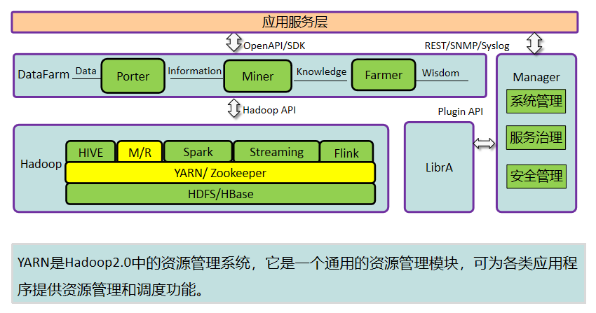

## MapReduce过程详解

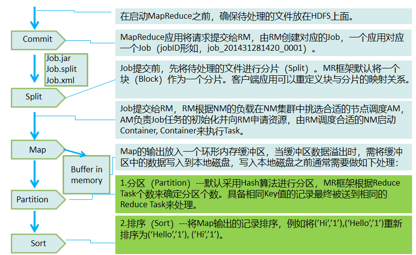

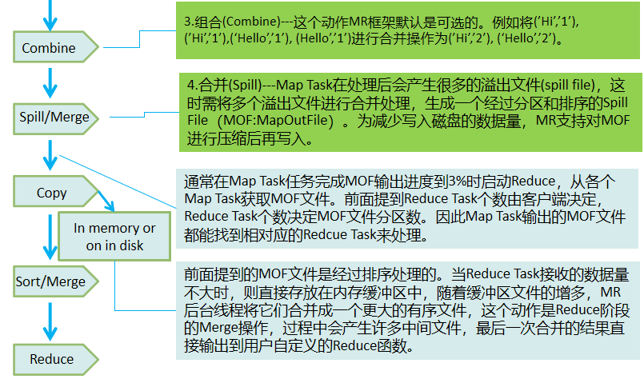

- **分片的必要性：**MR框架将**一个分片**和**一个Map TasK**对应，即一个Map Task只负责**处理**一个数据分片。**数据分片的数量**确定了为这个**Job创建Map Task的个数。**

- **Application Master(AM)**负责一个Application**生命周期**内的所有工作。包括：与RM调度器协商以**获取**资源；将得到的资源进一步**分配**给内部任务（资源的二次分配）；与NM通信以**启动/停止**任务；**监控**所有任务运行状态，并在任务运行失败时重新为任务申请资源以**重启任务**。

- **ResourceManager(RM)** 负责集群中所有资源的**统一管理和分配。**它**接收**来自各个节点（NodeManager）的资源汇报信息，并根据收集的资源按照一定的策略分配给各个应用程序。

- **NodeManager（NM）**是每个节点上的**代理**，它管理Hadoop集群中**单个计算节点**，包括与ResourceManger保持**通信**，**监督**Container的生命周期管理，**监控**每个Container的资源使用（内存、CPU等）情况，**追踪**节点健康状况，**管理**日志和不同应用程序用到的附属服务（auxiliary service）。

- MR组件在FI中只有jobhistoryserver实例，它只是**存储**任务的执行记录，**执行**列表，没有它，也可以运行任务。但是无法查询任务的详细信息。

Reduce阶段的三个过程：

- **Copy：**Reduce Task从各个Map Task**拷贝**MOF文件。
- **Sort：**通常又叫Merge，将多个MOF文件进行**合并再排序。**
- **Reduce**：用户自定义的Reduce逻辑。

### Shuffle机制


**Shuffle的定义：**Map阶段和Reduce阶段之间**传递中间数据的过程**，包括Reduce Task从各个Map Task获取MOF文件的过程，以及对MOF的排序与合并处理。

## 典型程序WorldCound举例

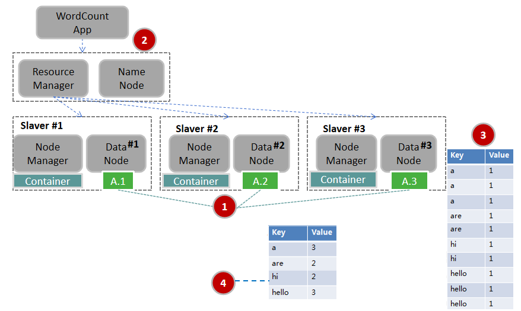

假设要分析一个**大文件A里每个英文单词出现的个数**，利用MapReduce框架能快速实现这一统计分析。

- 第一步：待处理的大文件A已经**存放在HDFS上**，大文件A被切分的数据块A.1、A.2、A.3分别存放在Data Node #1、#2、#3上。
- 第二步：WordCount分析处理程序实现了用户自定义的Map函数和Reduce函数。WordCount将分析应用提交给RM，RM根据请求创建对应的Job，并根据文件块个数按文件块分片，创建3个 MapTask 和 3个Reduce Task，**这些Task运行在Container中。**
- 第三步：Map Task 1、2、3的输出是一个经分区与排序（假设没做Combine）的MOF文件，记录形如表所示。
- 第四步：Reduce Task从 Map Task获取MOF文件，经过**合并、排序，**最后根据用户自定义的Reduce逻辑，输出如表所示的统计结果。

### WorldCound程序功能

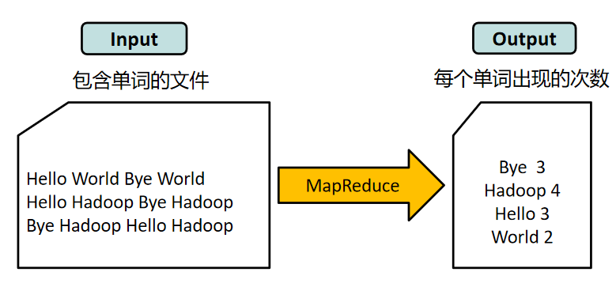

### WorldCound的Map过程

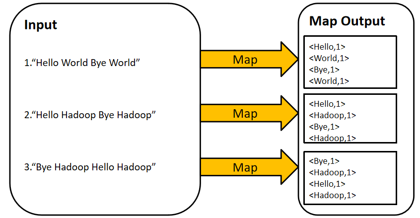

### WorldCound的Reduce过程

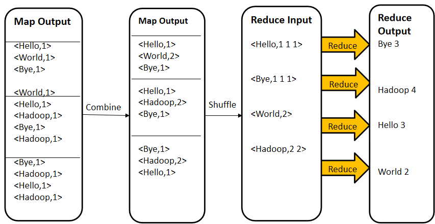

## YARN的组件架构

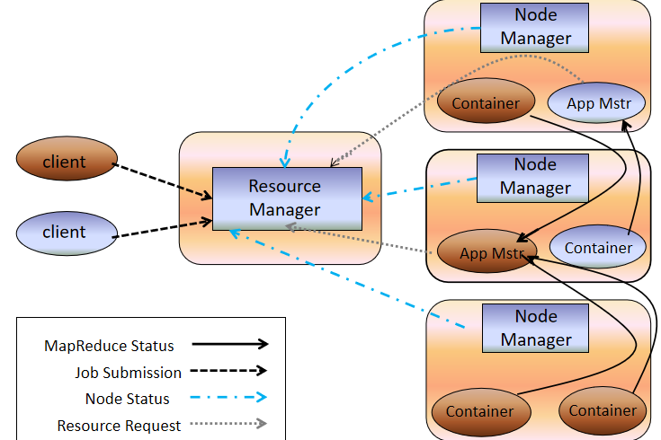

在图中有两个客户端向YARN提交任务，蓝色表示一个任务流程，棕色表示另一个任务流程。

- 首先**client提交任务，ResourceManager接收**到任务，然后**启动并监控**起来的第一个**Container**,也就是App Mstr。
- App Mstr**通知nodemanager管理资源并启动其他container。**
- 任务最终是运行在**Container**当中。

### MapReduce On YARN任务调度流程

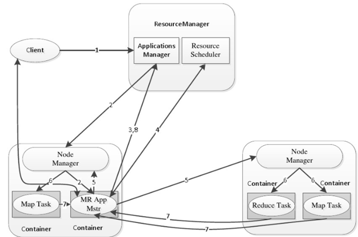

1. 步骤1：用户向YARN 中**提交**应用程序， 其中包括ApplicationMaster 程序、启动ApplicationMaster 的命令、用户程序等。
2. 步骤2：ResourceManager 为该应用程序**分配**第一个Container， 并与对应的NodeManager **通信**，要求它在这个Container 中**启动应用程序**的ApplicationMaster 。
3. 步骤3：ApplicationMaster 首先向ResourceManager **注册**， 这样用户可以直接通过ResourceManage **查看**应用程序的运行状态，然后它将为各个任务**申请资源，并监控**它的运行状态，直到运行结束，即重复步骤4~7。
4. 步骤4：ApplicationMaster 采用**轮询**的方式通过RPC 协议向ResourceManager 申请和领取资源。
5. 步骤5：一旦ApplicationMaster **申请**到资源后，便与对应的NodeManager **通信**，要求它启动任务。
6. 步骤6：NodeManager 为任务设置好**运行环境**（包括环境变量、JAR 包、二进制程序等）后，将任务启动命令写到一个脚本中，并通过运行该脚本启动任务。
7. 步骤7：各个任务通过某个RPC 协议向ApplicationMaster **汇报**自己的状态和进度，以让ApplicationMaster 随时掌握各个任务的运行状态，从而可以在任务失败时重新启动任务。在应用程序运行过程中，用户可随时通过RPC 向ApplicationMaster 查询应用程序的当前运行状态。
8. 步骤8 应用程序运行完成后，ApplicationMaster 向ResourceManager **注销并关闭**自己。

### YARN HA方案

YARN中的**ResourceManager**负责整个集群的**资源管理和任务调度**，YARN高可用性方案通过引入冗余的ResourceManager节点的方式，解决了ResourceManager 单点故障问题。

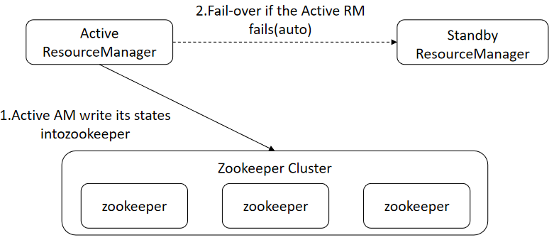

- ResourceManager的**高可用性**方案是通过设置一组**Active/Standby的ResourceManager**节点来实现的。与HDFS的高可用性方案类似，**任何时间点上都只能有一个ResourceManager处于Active状态**。当Active状态的ResourceManager发生故障时，可通过自动或手动的方式触发故障转移，进行Active/Standby状态切换。
- 在未开启自动故障转移时，YARN集群启动后，管理员需要在命令行中使用**YARN rmadmin**命令手动将其中一个ResourceManager切换为Active状态。当需要执行计划性维护或故障发生时，则需要先手动将Active状态的ResourceManager切换为Standby状态，再将另一个ResourceManager切换为Active状态。
- 开启自动故障转移后，ResourceManager会通过内置的基于**ZooKeeper**实现的**ActiveStandbyElector来决定**哪一个ResouceManager应该成为Active节点。当Active状态的ResourceManager发生故障时，另一个ResourceManager将自动被选举为Active状态以接替故障节点。
- 当集群的ResourceManager以HA方式部署时，客户端使用的**“YARN-site.xml”**需要配置所有ResourceManager地址。客户端（包括ApplicationMaster和NodeManager）会以**轮询**的方式寻找Active状态的ResourceManager。如果当前Active状态的ResourceManager无法连接，那么会继续使用轮询的方式找到新的ResourceManager。

### YARN　APPMaster容错机制

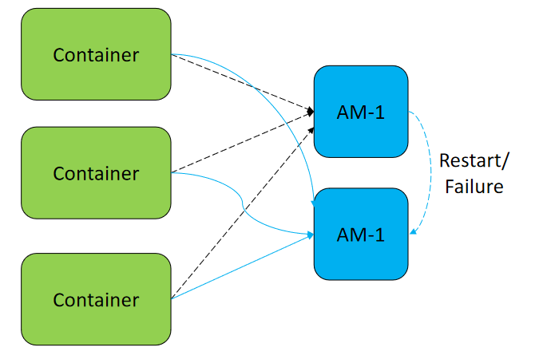

- 在YARN中，**ApplicationMaster(AM)**与其他Container类似也运行在NodeManager上（忽略未管理的AM）。AM可能会由于多种原因崩溃、退出或关闭。如果AM停止运行，ResourceManager(RM)会**关闭**ApplicationAttempt中管理的所有Container，包括当前任务在NodeManager(NM)上正在运行的所有Container。RM会在另一计算节点上启动新的ApplicationAttempt。
- 不同类型的应用希望以多种方式处理AM重新启动的事件。MapReduce类应用目标是不丢失任务状态，但也能允许一部分的状态损失。但是对于长周期的服务而言，用户并不希望仅仅由于AM的故障而导致整个服务停止运行。
- YARN支持在新的ApplicationAttempt启动时，保留之前Container的状态，因此运行中的作业可以继续无故障的运行。

## 资源管理

当前YARN支持**内存和CPU**两种资源类型的管理和分配。 每个NodeManager可分配的内存和CPU的数量可以通过配置选项设置（可在YARN服务配置页面配置）。

1. **Yarn.nodemanager.resource.memory-mb**
2. **Yarn.nodemanager.vmem-pmem-ratio**
3. **Yarn.nodemanager.resource.cpu-vcore**

- Yarn.nodemanager.resource.memory-mb表示用于当前NodeManager上可以分配给容器的**物理内存的大小**，单位：MB。必须小于NodeManager服务器上的实际内存大小。
- Yarn.nodemanager.vmem-pmem-ratio表示为容器设置**内存限制时虚拟内存跟物理内存的比值**。容器分配值使用物理内存表示的，虚拟内存使用率超过分配值的比例不允许大于当前这个比例。
- Yarn.nodemanager.resource.cpu-vcore表示**可分配给container的CPU核数**。建议配置为CPU核数的1.5-2倍。

### 资源分配模型

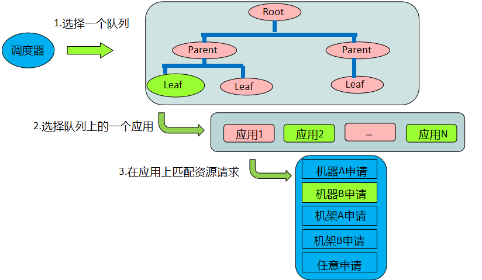

- 调度器**维护一群队列的信息**。用户可以向一个或者多个队列提交应用。
- 每次**NM心跳**的时候，调度器根据一定的**规则选择**一个队列，再在队列上选择一个应用，尝试在这个应用上分配资源。
- 调度器会优**先匹配本地资源**的申请请求，其次是**同机架的，**最后是**任意机器的。**
- 当任务提交上来，**首先会声明**提交到哪个队列上，调度器会分配队列，如果没有指定则任务运行在默认队列。
- 队列是**封装了集群资源容量的资源集合，**占用集群的百分比例资源。
- 队列分为**父队列，子队列**，任务最终是运行在子队列上的。父队列可以有多个子队列。
- 调度器选择队列上的应用，然后根据一些算法给应用分配资源。

## 容量调度器的介绍

**容量调度器：Capacity Scheduler 。**

- 容量调度器使得Hadoop应用**能够共享的、多用户的、操作简便的**运行在集群上，同时最大化集群的吞吐量和利用率。
- 容量调度器以**队列为单位**划分资源，每个队列都有资源使用的下限和上限。每个用户可以设定资源使用上限。管理员可以约束单个队列、用户或作业的资源使用。支持作业优先级，但不支持资源抢占。

### 容量调度器的特点

1. **容量保证：**管理员可为每个队列设置资源**最低保证和资源使用上限**，所有提交到该队列的应用程序共享这些资源。
2. **灵活性：**如果一个队列中的资源有剩余，可以暂时共享给那些需要资源的队列，当该队列有新的应用程序提交，则其他队列释放的资源会归还给该队列。
3. **支持优先级：**队列支持任务优先级调度（默认是FIFO）。
4. **多重租赁：**支持多用户共享集群和多应用程序同时运行。为防止单个应用程序、用户或者队列独占集群资源，管理员可为之增加多重约束。
5. **动态更新配置文件：**管理员可根据需要动态修改配置参数，以实现在线集群管理。

### 容量调度器的任务选择

调度时，首先按以下策略选择一个合适队列：

- **资源利用量最低的队列优先，**比如同级的两个队列Q1和Q2，它们的容量均为30，而Q1已使用10，Q2已使用12，则会优先将资源分配给Q1。
- **最小队列层级优先**，例如：QueueA与QueueB.childQueueB，则QueueA优先。
- **资源回收请求队列优先。**

然后按以下策略选择该队列中一个任务：

- 按照任务优先级和提交时间顺序选择，同时考虑用户资源量限制和内存限制。

## 队列资源限制（1）

队列的创建是在多租户页面，当创建一个租户关联YARN服务时，**会创建同名**的队列。比如先创建QueueA,QueueB两个租户，即对应YARN两个队列。

### 队列资源限制（2）

**队列的资源容量（百分比）**，有default、QueueA、QueueB三个队列，每个队列都有一个**[队列名].capacity配置：**

1. Default队列容量为整个集群资源的20%。
2. QueueA队列容量为整个集群资源的10%。
3. QueueB队列容量为整个集群资源的10%，**后台有一个影子队列root-default使队列之和达到100% 。**

- 在集群的Manager页面点击“租户管理”》“动态资源计划”》“资源分布策略”可以看到，可配置各队列资源容量。
- **影子队列：**是不对外呈现的一个队列。以XX-default为名字，目的是为了使同级的队列容量之和不够一百时，将剩余容量值赋予此队列（容量调度器要求同级队列容量和要为100）。

### 队列资源限制（3）

**共享空闲资源**

- 由于存在资源共享，因此一个队列使用的资源可能超过其容量（例如QueueA.capacity），而最大资源使用量可通过参数限制。
- 如果某个队列任务较少，可将剩余资源共享给其他队列，例如QueueA的maximum-capacity配置为100，假设当前只有QueueA在运行任务，理论上QueueA可以占用整个集群100%的资源。

**参数：Yarn.scheduler.capacity.root.QueueA.maximum-capacity**

## 用户限制和任务限制

用户限制和任务限制的参数可通过“租户管理”>“动态资源计划”>“队列配置”进行配置。

### 用户限制（1）

**每个用户最低资源保障（百分比**）：

- 任何时刻，一个队列中每个用户可使用的资源量均有一定的限制，当一个队列中同时运行多个用户的任务时，每个用户的可使用资源量在一个最小值与最大值之间浮动，其中，最大值取决于正在运行的任务数目，而最小值则由minimum-user-limit-percent决定。
- 例如，设置队列A的这个值为25，即Yarn.scheduler.capacity.root.QueueA.minimum-user-limit-percent=25，那么随着提任务的用户增加，队列资源的调整如下：

| 第1个用户提交任务到QueueA | 会获得QueueA的100%资源。                                     |
| ------------------------- | ------------------------------------------------------------ |
| 第2个用户提交任务到QueueA | 每个用户会最多获得50%的资源。                                |
| 第3个用户提交任务到QueueA | 每个用户会最多获得33.33%的资源。                             |
| 第4个用户提交任务到QueueA | 每个用户会最多获得25%的资源。                                |
| 第5个用户提交任务到QueueA | 为了保障每个用户最低能获得25%的资源，第5个用户将无法再获取到QueueA的资源，必须等待资源的释放。 |

### 用户限制（2）

**每个用户最多可使用的资源量（所在队列容量的倍数）**：

- queue容量的倍数，用来设置一个user可以获取更多的资源。 Yarn.scheduler.capacity.root.QueueD.user-limit-factor=1。默认值为1，表示一个user获取的资源容量不能超过queue配置的capacity，无论集群有多少空闲资源，最多不超过maximum-capacity。

**用户可以使用超过capacity的资源,但不超过maximum-capacity。**

### 任务限制

**最大活跃任务数：**

- 整个集群中允许的最大活跃任务数，包括运行或挂起状态的所有任务，当提交的任务申请数据达到限制以后，新提交的任务将会被拒绝。默认值10000。

**每个队列最大任务数：**

- 对于每个队列，可以提交的最大任务数，以QueueA为例，可以在队列配置页面配置，默认是1000，即此队列允许最多1000个活跃任务。

**每个用户可以提交的最大任务数：**

- 这个数值依赖每个队列最大任务数。根据上面的数据， QueueA最多可以提交1000个任务，那么对于每个用户而言，可以向QueueA提交的最大任务数为1000* 用户最低资源保障率（假设25%）* 用户可使用队列资源的倍数(假设1)。

1. **用户最低资源保障率：**Yarn.scheduler.capacity.root.QueueA.minimum-user-limit-percent。
2. **用户可使用队列资源的倍数**：Yarn.scheduler.capacity.root.QueueA.user-limit-factor。

### 查看队列信息

- 队列的信息可以通过YARN webUI进行查看，进入方法是“服务管理”>“YARN”>“ResouceManager（主）”>“Scheduler”。

## 增强特性 - YARN动态内存管理

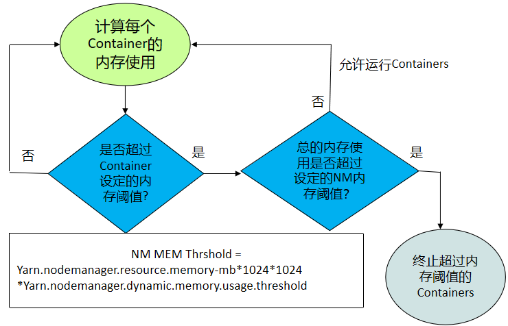

- 动态内存管理可用来优化NodeManager中Containers的**内存利用率**。任务在运行过程中可能产生多个Container。
- 当前，当单个节点上的Container超过Container运行内存大小时，即使节点总的配置内存利用还很低，NodeManager也会终止这些Containers。这样就会经常使用户作业失败。
- 动态内存管理特性在当前是一个改进，只有当NodeManager中的所有Containers的总内存使用超过了已确定的阈值，NM总内存阈值的计算方法是
- Yarn.nodemanager.resource.memory-mb*1024*1024*Yarn.nodemanager.dynamic.memory.usage.threshold，单位GB，那么那些内存使用过多的Containers才会被终止。
- 举例，假如某些Containers的物理内存利用率超过了配置的内存阈值，但所有Containers的总内存利用率并没有超过设置的NodeManager内存阈值，那么那些内存使用过多的Containers仍可以继续运行。

### 增强特性 - YARN基于标签调度

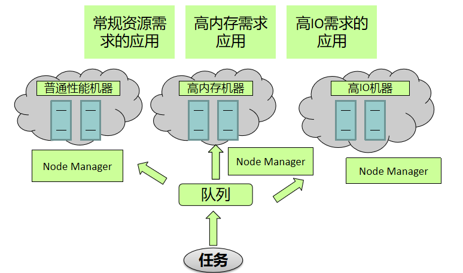

- 在没有标签调度之前，任务提交到哪个节点上是**无法控制**的，会根据一些算法及条件，集群**随机分配**到某些节点上。而标签调度可以**指定任务**提交到哪些节点上。
- 比如之前需要消耗高内存的应用提交上来，由于运行在那些节点不可控，任务可能运行在普通性能的机器上。
- **Label based scheduling是一种调度策略**。该策略的基本思想是：用户可以为每个**nodemanager标注一个标签**，比如high-memory，high-IO等进行分类，以表明该nodemanager的特性；同时，用户可以为调度器中**每个队列标注一个标签**，即队列与标签绑定，这样，提交到某个队列中的作业，只会使用标注有对应标签的节点上的资源，即任务实际运行在打有对应标签的节点上。
- 将耗内存消耗型的任务提交到绑定了**high-memry**的标签的队列上，那么任务就可以运行在**高内存**机器上。