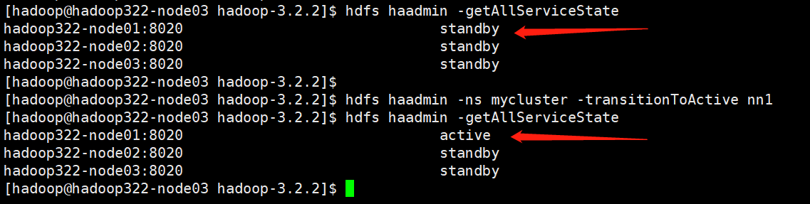

Hadoop3.x和Hadoop2.x的区别

# Hadoop概念

TODO

# Hadoop安装和配置

## 单节点

TODO

## 伪分布式

TODO

core-site.xml

```xml
<configuration>
	<property>
  	<name>fs.defaultFS</name>
    <value>hdfs://hadoop322-node01:9000</value>
  </property>
  <property>
    <name>hadoop.tmp.dir</name>
    <value>/opt/modules/hadoop-3.2.2/data/tmp</value>
  </property>
</configuration>
```

hdfs-site.xml

```xml
<configuration>
  <property>
    <name>dfs.namenode.secondary.http-address</name>
    <value>hadoop322-node03:50090</value>
  </property>
  <property>
    <name>dfs.namenode.name.dir</name>
    <value>${hadoop.tmp.dir}/dfs/name</value>
  </property>
  <property>
    <name>dfs.blocksize</name>
    <value>134217728</value>
  </property>
  <property>
    <name>dfs.replication</name>
    <value>3</value>
  </property>
  <property>
    <name>dfs.datanode.data.dir</name>
    <value>${hadoop.tmp.dir}/dfs/data</value>
  </property>
</configuration>
```

yarn-site.xml

```xml
<configuration>
  <property>
    <name>yarn.resourcemanager.hostname</name>
    <value>hadoop322-node02</value>
  </property>
  <property>
    <name>yarn.log-aggregation-enable</name>
    <value>false</value>
  </property>
  <property>
    <name>yarn.nodemanager.aux-services</name>
    <value>mapreduce_shuffle</value>
  </property>
  <property>
    <name>yarn.nodemanager.env-whitelist</name>
<value>JAVA_HOME,HADOOP_COMMON_HOME,HADOOP_HDFS_HOME,HADOOP_CONF_DIR,CLASSPATH_PREPEND_DISTCACHE,HADOOP_YARN_HOME,HADOOP_HOME,PATH,LANG,TZ,HADOOP_MAPRED_HOME</value>
  </property>
</configuration>
```

mapred-site.xml

```xml
<configuration>
  <property>
    <name>mapreduce.framework.name</name>
    <value>yarn</value>
  </property>
</configuration>
```

etc/hadoop/workers

```shell
hadoop322-node01
hadoop322-node02
hadoop322-node03
```


## 非HA 完全分布式

MapReduce的JobHistoryServer服务。


如下图所示：


## HA 非联邦完全分布式

有两种HA的方案：

- `NameNode HA with QJM`。使用`the Quorum Journal Manager (QJM)`在`Active NameNode`和`Standby NameNode`之前共享edit logs。
- `NameNode HA with NFS`。使用`NFS`在`Active NameNode`和`Standby NameNode`之前共享edit logs。

### `NameNode HA with QJM`

参考官方文档：https://hadoop.apache.org/docs/stable/hadoop-project-dist/hadoop-hdfs/HDFSHighAvailabilityWithQJM.html

让我们回到配置`core-site.xml`, `hdfs-site.xml`, `yarn-site.xml`, `mapred-site.xml`之前。

在`Hdoop2.0.0`之前，NameNode一直都是单点故障的（single point of failure (SPOF)），只要NameNode所在机器或进程不可用，则整个集群的HDFS就不可用了。

- 机器挂了，或者NameNode进程挂了，则直到机器/进程重启之，集群才能变为可用。
- 集群/软件升级，会导致一定时间窗口内集群不可用。

### HA的设计架构

在典型的HA集群中，两个或多个单独的机器被配置为NameNodes。在任何时间点，只有一个NameNode处于active状态，而其他NameNode处于standby状态。Active NameNode负责集群中的所有客户端操作，而Standby只是在必要时保持足够的状态以提供快速的故障恢复（failover）。

**为了实现active NameNode和standby NameNode的状态保持一致**，引入了"JournalNodes"来实现二者之前的通信。`active NameNode`将namespace的改动记录到**大多数的JN**中。然后`standby NameNode`从JN中获取namespace的的改动，并不断监视edit log的变动，将edit log应用到自身内存中的namespace。在发生故障转移时，备用服务器将确保在将自身提升到活动状态之前，已从`JournalNode`中读取所有编辑。这确保在发生故障切换之前，命名空间状态完全同步。

**为了提供快速故障切换，备用节点还必须具有关于集群中块位置的最新信息。**为了实现这一点，DataNode配置了所有NameNode的位置，并向所有NameNode发送块位置信息和心跳。

如果同一时刻有多个`active NameNode`，则会发生"split-brain scenario"（脑裂），会导致数据丢失或其他问题。同一时刻只有一个`active NameNode`保证了，同一时刻只有一个 NameNode可以往`Journal Nodes`中写入edit log。


| hadoop322-noe01                                              | hadoop322-node02                                             | hadoop322-node03                                            |
| ------------------------------------------------------------ | ------------------------------------------------------------ | ----------------------------------------------------------- |
| NameNode<br>DataNode<br>NodeManager<br>JournalNode<br>ZKFC<br>JobHistoryServer | NameNode<br>ResourceManager<br>DataNode<br>JournalNode<br>ZKFC<br/>NodeManager | NameNode<br>DataNode<br>JournalNode<br>ZKFC<br/>NodeManager |


### 硬件准备

- 建议NameNode节点的硬件配置相同。
- `JournalNode`守护进程是比较轻量的，可以放置在其它守护进程（如NameNode、JobTracker、ResourceManager等）如所在节点。但是，就公有云的EMR（MRS）之类的paas产品而言，都是将JournalNode和ZooKeeper放置在相同的节点，一般为3个节点，配置一般2C4G 100GB就可以了。

**请注意，在HA集群中，Standby NameNode还执行命名空间状态的检查点，因此不需要在HA集群内运行Secondary NameNode、Checkpoint Node或BackupNode。事实上，这样做是错误的。这也允许正在重新配置非启用HA的HDFS群集以启用HA的用户重新使用以前专用于Secondary NameNode的硬件。？没看懂TODO**

### 部署

与Federation配置类似，HA配置是向后兼容的，并允许现有的单个NameNode配置在没有更改的情况下工作。新配置被设计为使得集群中的所有节点可以具有相同的配置，而不需要基于节点的类型将不同的配置文件部署到不同的机器。?没看懂TODO

#### 配置HDFS HA集群

与`HDFS Federation`一样，HA集群重用`nameservice ID`来标识单个HDFS实例，该实例实际上可能由多个HA NameNode组成。此外，HA还添加了名为`NameNode ID`的新抽象。集群中每个不同的NameNode都有一个不同的`NameNode ID`来区分它。为了支持所有NameNode的单个配置文件，相关的配置参数都以`nameservice ID`和`NameNode ID`作为后缀。

##### 配置`core-site.xml`

```xml
<configuration>
  <!-- 默认FS的路径前缀 -->
  <property>
    <name>fs.defaultFS</name>
    <value>hdfs://mycluster</value>
	</property>
</configuration>
```

- **fs.defaultFS**

Hadoop FS客户端在没有指明FS前缀时，使用的默认路径前缀。

##### 配置`hdfs-site.xml`


```xml
<configuration>
    <!-- nameservice的名称，若为联邦，此处为逗号分隔的nameservice的列表 -->
    <property>
      <name>dfs.nameservices</name>
      <value>mycluster</value>
    </property>
    
    <!-- 在该nameservice中NameNode的id，此处为逗号分隔的NameNode ID列表。
		最少2个，最多5个，建议3个，因为过多的话，NameNode之前的通信开销过大。 -->
    <property>
  	  <name>dfs.ha.namenodes.mycluster</name>
      <value>nn1,nn2,nn3</value>
	</property>
    
    <!-- 每个NameNode监听的RPC地址 -->
    <property>
      <name>dfs.namenode.rpc-address.mycluster.nn1</name>
  	  <value>hadoop322-node01:8020</value>
	</property>
	<property>
      <name>dfs.namenode.rpc-address.mycluster.nn2</name>
      <value>hadoop322-node02:8020</value>
	</property>
	<property>
  	  <name>dfs.namenode.rpc-address.mycluster.nn3</name>
      <value>hadoop322-node03:8020</value>
	</property>
    
    <!-- 每个NameNode监听的HTTP地址，如果启用security特性，则需配置dfs.namenode.https-address.mycluster.? -->
    <property>
      <name>dfs.namenode.http-address.mycluster.nn1</name>
      <value>hadoop322-node01:9870</value>
    </property>
    <property>
      <name>dfs.namenode.http-address.mycluster.nn2</name>
      <value>hadoop322-node02:9870</value>
	</property>
	<property>
  	  <name>dfs.namenode.http-address.mycluster.nn3</name>
      <value>hadoop322-node03:9870</value>
    </property>
    
    <!-- NameNode向这些JN写/读edits log，URI地址 -->
    <property>
      <name>dfs.namenode.shared.edits.dir</name>
      <value>qjournal://hadoop322-node01:8485;hadoop322-node02:8485;hadoop322-node03:8485/mycluster</value>
	</property>
    
    <!-- HDFS客户端用于联系ActiveNameNode的Java类 -->
    <property>
  	  <name>dfs.client.failover.proxy.provider.mycluster</name>
  	  <value>org.apache.hadoop.hdfs.server.namenode.ha.ConfiguredFailoverProxyProvider</value>
	</property>
  
    <!-- 故障转移期间用来fence Active NameNode -->
    <property>
      <name>dfs.ha.fencing.methods</name>
      <value>sshfence</value>
    </property>
    <property>
      <name>dfs.ha.fencing.ssh.private-key-files</name>
      <value>/home/hadoop/.ssh/id_rsa</value>
    </property>
   
  <!-- Journal Nodes在本地存储edits文件的路径 -->
  <property>
    <name>dfs.journalnode.edits.dir</name>
    <value>/opt/modules/hadoop-3.2.2/data/journalnode/</value>
	</property>
  
  <!-- 是否阻止安全模式中的namenodes变为Active。-->
  <property>
    <name>dfs.ha.nn.not-become-active-in-safemode</name>
    <value>true</value>
	</property>
</configuration>
```

- **dfs.nameservices**

  `nameservice`的名字，如mycluster。若为联邦，此处为逗号分隔的nameservice的列表

  后续的配置中会用到此配置项的值。

- **dfs.ha.namenodes.[nameservice ID]**

  在指定`nameservice`中每个`NameNode`的唯一标识符。为逗号分隔的`NameNodes`的ID列表。通常为`nn1,nn2,nn3`，以此类推。

  **最少2个，最多5个，建议3个，因为过多的话，`NameNode`之前的通信开销过大**。

- **dfs.namenode.rpc-address.[nameservice ID].[name node ID]**

  每个NameNode监听的RPC地址。`host:port`格式，host为NameName进程所在主机，port为NameNode的`IPC`端口。

- **dfs.namenode.http-address.[nameservice ID].[name node ID]**

  每个NameNode监听的HTTP地址，如果启用security特性，则需配置`dfs.namenode.https-address.[nameservice ID].[name node ID]`

- **dfs.namenode.shared.edits.dir**

  `NameNode`读/写edits log的`Journal Nodes`的URI，这些`Journal Nodes`提供了`edits log`的共享存储。`Active NameNode`向`Journal Nodes`写入指定`nameserviceId`的edits log，其余`standby NameNode`向`Journal Nodes`读取指定`nameserviceId`的edits log。**至少需要配置一个Journal Node的URI**。

  格式为：`qjournal://host1:port1;host2:port2;host3:port3/journalId`，通常情况下，`journalId`与`nameserviceId`保持一致。联邦集群中可以存在多个`nameserviceId`，对应也有多个`journalId`，他们可以使用同一组`Journal Nodes`，通过不同的`journalId`来区分就可以了。

- **dfs.client.failover.proxy.provider.[nameservice ID]** 

  HDFS客户端用于联系ActiveNameNode的Java类。

  此类决定了这些NameNodes中，哪个是Active NameNode，此NameNode负责处理客户端的请求。

  Hadoop官方提供了两个类：**ConfiguredFailoverProxyProvider** 和 **RequestHedgingProxyProvider**，也可以自定义。

- **dfs.ha.fencing.methods**

  在故障切换期间用于**隔离**Active NameNode的脚本或Java类的列表。

  - **sshfence** 。ssh到Active NameNode所在机器并kill进程。

    SSH连接到目标节点，并使用fuser终止监听TCP端口的进程。为了使此隔离选项发挥作用，它必须能够在不提供密码的情况下SSH到目标节点。因此，还必须配置dfs.ha.fening.sh.private-key-files选项，这是一个逗号分隔的ssh私钥文件列表。

    还可以配置指定ssh时使用的用户名和端口，也可以指定ssh的超时时间。

  - **shell**。运行shell命令来fence Active NameNode。

- **dfs.journalnode.edits.dir**

  Journal Nodes在本地存储edits文件的路径。默认值为`/tmp/hadoop/dfs/journalnode/`。

- **dfs.ha.nn.not-become-active-in-safemode**

  是否阻止安全模式中的namenodes变为Active。


`yarn-site.xml`

```xml

```

`mapred-site.xml`

```xml

```

#### 启动HDFS HA集群

1、在所有`Journal Node`启动`journalnode`服务

```bash
hdfs --daemon start journalnode
```

注意：启动JournalNodes后，必须首先同步NameNodes上的磁盘元数据 。第二步就是做这个事情的。

2、`格式化NameNode`或`初始化JournalNode`

有两种情况：

- 创建一个新的HDFS集群。

  在某一个NameNode上执行`hdfs namenode -format`格式化集群，只在第一次启动HDFS HA集群时使用。

- 将非HA集群的`NameNode`转换为HA。

  运行命令`hdfs namenode -ininitializeSharedEdits`，该命令将使用NameNode本地的edits目录中的数据来初始化`JournalNode`。

根据需求，在nn1上选择使用`hdfs namenode -format`还是`hdfs namenode -initializeSharedEdits`

```bash
hdfs namenode -format
或
hdfs namenode -initializeSharedEdits
```

3、启动nn1的`NameNode`

在nn1执行如下命令：

```bash
hdfs --daemon start namenode
```

旧的命令是`hadoop-daemon.sh start namenode`，现在建议使用上面的命令了。

4、在nn1启动了`NameNode`之后。将nn1的元数据信息（`{dfs.namenode.name.dir}` 目录的内容）复制到nn2、nn3的`{dfs.namenode.name.dir}` 目录下(**只在第一次启动HDFS HA集群时使用**)

分别在nn2、nn3执行如下命令：

```bash
hdfs namenode -bootstrapStandby
```


输出如上信息，表示已经做好了将NameNode设置为standby的工作了。可以启动standby NameNode了

5、启动nn2和nn3的`NameNode`

```bash
hdfs --daemon start namenode
```

3个NameNode都启动后，发现均为`standby`。

nn1


nn2


nn3


<font color=red>**注意：的是Stanby状态的NameNode是不能对外提供服务的！**</font>


命令行查看也是如此：

```bash
hdfs haadmin -getAllServiceState
```


6、启动所有`DataNode`

在nn1, nn2, nn3启动`DataNode`服务。

```bash
hdfs --daemon start datanode
```

jps查看是否进程都在，HDFS Web UI查看 live Nodes 是否为3。

7、将nn1切换为`Active NameNode`

```bash
hdfs haadmin -ns mycluster -transitionToActive nn1
或者
hdfs haadmin -transitionToActive nn1
```



<font color=red>**注意：如果nn1进程挂掉了，使用`bin/hdfs haadmin -transitionToActive nn2`并不能让nn2成为Active。**</font>why?


**使用`hdfs haadmin -failover nn1 nn2`也无法实现故障转移。**


<font color=red>**注意：HDFS HA 想要手动故障转移，则nn1和nn2必须都是正常启动的，然后使用如下命令进行手动故障转移**</font>。

```bash
hdfs haadmin -transitionToActive nn2
```


#### 自动故障转移配置

自动故障转移依赖`ZooKeeper`和`ZKFailoverController`（缩写为ZKFC）。

ZooKeeper主要实现两个作用：故障检测和Active NameNode选举。

#### `In-Progress Edit Log Tailing`

在默认设置下，`Standby NameNode`只会应用已完成的edits log，`edits_inprogress_0000000000000000322`之类的未完成的edits log，`Standby NameNode`并不会应用到自身的namespace中。

如果希望有一个具有最新namespace的`Standby NameNode`，则可以启用`In-Progress Edit Log Tailing`。启用之后，`Standby NameNode`将尝试从`JournalNode`的内存缓存中获取edits。

- **dfs.ha.tail-edits.in-progress**

  是否对正在进行的edits log启用跟踪。启用后，在`Journal Node`将会在内存中缓存in-progress的edits log。默认情况下禁用

- **dfs.journalnode.edit-cache-size.bytes**

  JournalNode上edits的内存缓存的大小。一般情况，每个edit大约需要200字节，因此默认值1048576（1MB）可以容纳大约5000个edit事务。根据实际情况调整。

#### HDFS HA集群支持`Load Balancer`

在LB的健康检测中，使用[http://NN_HOSTNAME/isActive](http://nn_hostname/isActive)，来检测哪个NN是Acitve的。Active NN会返回200，Standby NN返回405。

#### HDFS HA集群的Upgrade/Finalization/Rollback

参考：https://hadoop.apache.org/docs/stable/hadoop-project-dist/hadoop-hdfs/HDFSHighAvailabilityWithQJM.html

## HA 联邦完全分布式

参考官方文档：https://hadoop.apache.org/docs/stable/hadoop-project-dist/hadoop-hdfs/HDFSHighAvailabilityWithNFS.html

TODO

# Hadoop命令

## 管理员命令

```bash
hdfs haadmin --help
Usage: haadmin
    [-transitionToActive <serviceId>]
    [-transitionToStandby <serviceId>]
    [-failover [--forcefence] [--forceactive] <serviceId> <serviceId>]
    [-getServiceState <serviceId>]
    [-getAllServiceState]
    [-checkHealth <serviceId>]
    [-help <command>]
```

- **-transitionToActive**：将指定NameNode的状态转换为Active。
- **-transitionToStandby** ：将指定NameNode的状态转换为Standby。
- **-failover** ：进行故障转移，在将Active从第一个NameNode转移到第二个NameNode。
- **-getServiceState** ：获取指定NameNode的状态，Active/Standby。
- **-getAllServiceState** ：获取**所有**NameNode的状态，Active/Standby。
- **-checkHealth** ：获取指定NameNode的健康状态。健康则什么结果都没有，不健康则会有具体的报错信息。**功能目前尚未完全实现，不建议使用。**

<font color="red">**注意：不执行fence，因此一般不建议使用这两个命令，而是建议使用`hdfs haadmin -failover`。**</font>