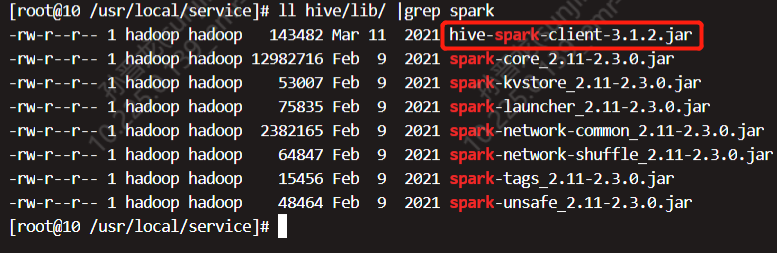

尚硅谷最新版Hive教程（基于hive3.x丨hive3.1.2）

# 1. Hive基本概念

## 1.1 什么是Hive

（1）Hive简介

​	Hive：由Facebook开源用于解决==海量结构化日志==的数据统计工作。

​	Hive是基于Hadoop的一个==数据仓库工具==，可以将==结构化的数据文件映射为一张表==，并提供==类SQL查询==功能。

​	**Hive是什么？**Hive 是数据仓库工具，再具体点就是一个 SQL 解析引擎，因为它即不负责存储数据，也不负责计算数据，只负责解析 SQL，记录元数据。

（2）**Hive本质**：将HQL转化成MapReduce程序。*或者Spark/Tez程序?*

​	

	1. Hive处理的数据存储在HDFS
 	2. Hive分析数据底层的实现是MapReduce
 	3. 执行程序运行在Yarn上

<font color=red>注意：Hive可以理解成HDFS的一个客户端，所以没有听说过Hive集群这样的说话。当然是可以安装多台Hive。</font>

hive中三个主要服务的介绍：Hive Metastore、HiveServer2、Hcatalog

https://zhuanlan.zhihu.com/p/473378621

https://zhuanlan.zhihu.com/p/424872101

### 1.2 Hive的优缺点

#### 1.2.1 优点

1. 操作接口采用类SQL语法，提供快速开发的能力（简单、容易上手）。
2. 避免去写MapReduce，减少开发人员的学习成本。
3. Hive的执行延迟比较高，因此Hive常用于数据分析，对实时性要求不高的场合。
4. Hive优势在于处理大数据，对于处理小数据没有优势，因为Hive的执行延迟比较高。
5. **Hive支持用户自定义函数，用户可以根据自己的需求来实现自己的函数**。UDF

#### 1.2.2 缺点

1. **Hive的HQL表达能力有限**

   （1）迭代式算法无法表达。向机器学习啥的就搞不了。

   （2）数据挖掘方面不擅长，由于`MapReduce`数据处理流程的限制，效率更高的算法却无法实现。

2. **Hive的效率比较低**

   （1）Hive自动生成的MapReduce作业，通常情况下不够智能化。

   （2）Hive调优比较困难，粒度较粗。

### 1.3 Hive架构原理


1. 用户接口：Client

   CLI（command-line interfeace）、JDBC/ODBC（JDBC访问Hive）、HWI（浏览器访问Hive）

2. 元数据：Metastore

   元数据包括：表名、表所属的数据库、表的拥有者、列/分区字段、表的类型（内表or外表）、表的数据所在目录、表的文件格式（parquet、orc、text、sequenceFile等）等；

   <font color=red>**默认存储在自带的derby数据库中（内嵌），推荐使用MySQL存储Metastore。当时用内嵌模式的Derby时，同时只能有一个用户可以访问Hive的Metastore。**</font>

   Derby支持**内嵌模式**和**server模式**。server模式配置方式见官方文档：https://cwiki.apache.org/confluence/display/Hive/HiveDerbyServerMode

3. Hadoop

   使用HDFS进行存储，使用MapReduce进行计算

4. 驱动器：Driver

   （1）解析器（SQL Parser）：

   ​	将SQL字符串转换成抽象语法树AST，这一步一般都用第三方工具库完成，比如antlr；对AST进行语法分析，比如表是否存在、字段是否存在、SQL 语义是否有误。

   （2）编译器（Physical Plan）：

   ​	将AST编译生成逻辑执行计划。

   （3）优化器（Query Optimizier）：

   ​	对逻辑执行计划进行优化。

   （4）执行器（Execution）：

   ​	把逻辑执行计划转换成可以运行的物理计划，对于Hive来说，就是MR/Spark。

   
   
   Hive SQL的编译过程：https://blog.csdn.net/wangshuminjava/article/details/117919202
   
   

### 1.4 Hive和数据库比较

#### 1.4.1查询语言

由于Hive采用了类似SQL的查询语言HQL（Hive Query Language），因此很容易将Hive理解为数据库。其实从结构上来看，Hive和数据库除了拥有类似的查询语言，再无类似之处。本文将从多个方面来阐述Hive和数据库的差异。数据库可以用在Online的应用中，但是Hive是为数据仓库而设计的，清楚这一点，有助于从应用角度理解Hive的特性。

#### 1.4.2 数据更新

由于Hive是针对数据仓库应用设计的，而<font color=red>**数据仓库的内容是读多写少的。因此，Hive中不建议对数据的改写，所有的数据都是在加载的时候就确定好了的。**</font>而数据库中的数据通常是需要经常进行修改的，因此可以使用`INSERT INTO 表名() VALUES()`添加数据，使用`UPDATE 表名 set id=1`修改数据。

#### 1.4.3 执行延迟

Hive在查询数据的时候，由于没有索引，需要扫描整个表，因此延迟较高。另外一个导致Hive执行延迟高的因素是MapReduce框架。由于MapReduce本身具有较高的延迟，因此在利用MapReduce进行Hive查询时，也会有较高的延迟。相对的，数据库的执行延迟较低。当然，这个低是有条件的，即数据规模小，当数据规模大到超过数据库的处理能力的时候，Hive的并行计算显然能体现出优势。

**TODO Hive在查询数据时没有索引？？**

> 据我所知，[Hive](https://so.csdn.net/so/search?q=Hive&spm=1001.2101.3001.7020)从0.7.0版本开始加入了索引。目的是提高Hive表指定列的查询速度。没有索引的时候，Hive在执行查询时需要加载整个表或者整个分区，然后处理所有的数据，但当在指定列上存在索引，再通过指定列查询时，那么只会加载和处理部分文件。此外，同传统关系型数据库一样，增加索引在提升查询速度的同时，会额外消耗资源去创建索引和需要更多的磁盘空间存储索引。
>
> **Hive索引的原理**
>
> Hive的索引其实是一张索引表（Hive的物理表），在表里面存储索引列的值，该值对应的HDFS的文件路径，该值在数据文件中的偏移量。
>
> **优点**
> 可以避免全表扫描和资源浪费
> 可以加快含有group by的语句的查询速度
>
> **缺点**
> 使用过程繁琐
> 需用额外Job扫描索引表
> 不会自动刷新，如果表有数据变动，索引表需要手动刷新。

#### 1.4.4 数据规模

由于Hive建立在集群上并可以利用MR/Tez/Spark等引擎进行并行计算，因此可以支持很大规模的数据；对应的，数据库可以支持的数据规模较小。


## 1.2 主要历史

`hive 0.11` 开始引入了HiveServer2。

`hive 0.14.0`引入了**HiveServer2动态服务发现**特性。

`hive 0.14`之后，还支持特定的hive服务进程配置文件：`hivemetastore-site.xml` 和 `hiveserver2-site.xml`。从`hive 3.X`开始metastore服务的单独配置文件建议为`metastore-site.xml`

`hive 0.14.1`，也称之为`hive 1.0.0`，开始**hiveserver1被移除了**。

`hive 2.0.0`引入了hs2的Web UI。

`hive 2.1.0`引入了命名的`connection URL`。

`hive 2.2.0`开始可以基于`hive-site.xml`和`beeline-hs2-connection.xml`来自动连接到HiveServer2（直接使用beeline即可连接）


`hive 2.2.20`移除了Hive Web Interface（HWI），HWI是一种简介的图形化用户界面（GUI）。

`hive 4.0.0`开始可以基于`ZooKeeper`实现Hive Metastore的动态服务发现。配置方式见文档：https://cwiki.apache.org/confluence/display/Hive/AdminManual+Metastore+Administration

# 2. Hive安装

## 2.1 Hive文档地址

1. Hive官网地址

   [ http://hive.apache.org / ](http://hive.apache.org/)

2. 文档查看地址

   [ https: //cwiki.apache.org /confluence/display/Hive/G ettingStarted ](https://cwiki.apache.org/confluence/display/Hive/GettingStarted)

3. 下载地址

   [ http://archive.apache.org /dist/hive/ ](http://archive.apache.org/dist/hive/)

   国内用这个地址下载超级快：http://www.apache.org/mirrors/#cn

4. github地址

   [ https: //github.com/apache/hive ](https://github.com/apache/hive)


## 2.2 Hive安装部署

==注意：由于我这边的Hadoop集群版本为2.x.y，所以下面说的hive-3.1.2的地方都要修改为hive-2.3.9，否则不兼容。==

### 2.2.1 tar包安装

1. 下载Hive安装包如 `apache-hive-3.1.2-bin.tar.gz`，然后上传到Linux的`/opt/software`目录下。

2. 解压` apache-hive-3.1.2-bin.tar.gz`到`/opt/module`目录下

   ```shel
   [atguigu@hadoop102 software]$ tar -zxvf /opt/software/apache-hive-3.1.2- bin.tar.gz -C /opt/module/
   ```

3. 修改`apache-hive-3.1.2-bin`的名称为`hive-3.1.2`

   ```shell
   [atguigu@hadoop102 software]$ mv /opt/module/apache-hive-3.1.2-bin/
   /opt/module/hive
   ```

4. 修改`/etc/profile.d/my_env.sh`或`/etc/profile`添加环境变量，建议使用`/etc/profile.d/my_env.sh`。添加如下内容：

   ```shell
   #HIVE_HOME
   export HIVE_HOME=/opt/module/hive 
   export PATH=$PATH:$HIVE_HOME/bin
   ```

5. 解决日志jar包冲突

   ```shell
   [atguigu@hadoop102 hive-3.1.2]$ mv ./lib/log4j-slf4j-impl-2.10.0.jar ./lib/log4j-slf4j-impl-2.10.0.jar.bak
   ```
   
6. 通常`$HIVE_HOME/lib`中还有guava这个包和`$HADOOP_HOME/share/hadoop/common/lib`中的guava版本不一致。

   保留高版本的guava。这里是删除`$HIVE_HOME/lib`中的guava。

### 2.2.2 源码编译

官方文档：https://cwiki.apache.org/confluence/display/Hive/GettingStarted#GettingStarted-BuildingHivefromSource

推荐参考：https://blog.csdn.net/weixin_52918377/article/details/117123969

#### 2.2.2.1 下载Hive源码包

由于墙的原因，访问国外官方网站比较慢，因此从华为的镜像源进行下载，网址：https://repo.huaweicloud.com/apache/hive

#### 2.2.2.2 解压Hive源码包

```bash
tar -zxvf /opt/softwares/apache-hive-3.1.2-src.tar.gz -C ./
```


源码包中目录结构如下：


#### 修改pom.xml

```xml
<spark.version>2.3.0</spark.version>
<scala.binary.version>2.11</scala.binary.version>
<scala.version>2.11.8</scala.version>
<guava.version>19.0</guava.version>
```

修改为

```xml
<spark.version>2.3.0</spark.version>
<scala.binary.version>2.11</scala.binary.version>
<scala.version>2.11.8</scala.version>
<guava.version>27.0-jre</guava.version>
```

再将Maven仓库设置为国内镜像仓库，如：

```xml
TODO
```

#### 编译

```bash
mvn clean package -Pdist -DskipTests -Dmaven.javadoc.skip=true
```

**报错一**：could not find artifact org.pentaho:pentaho-aggdesigner-algorithm:jar:5.1.5-jhyde

```bash
INFO] ------------------------------------------------------------------------
[ERROR] Failed to execute goal on project hive-upgrade-acid: Could not resolve dependencies for project org.apache.hive:hive-upgrade-acid:jar:3.1.2: Could not find artifact org.pentaho:pentaho-aggdesigner-algorithm:jar:5.1.5-jhyde in nexus-aliyun (http://maven.aliyun.com/nexus/content/groups/public) -> [Help 1]
[ERROR] 
[ERROR] To see the full stack trace of the errors, re-run Maven with the -e switch.
[ERROR] Re-run Maven using the -X switch to enable full debug logging.
[ERROR] 
[ERROR] For more information about the errors and possible solutions, please read the following articles:
[ERROR] [Help 1] http://cwiki.apache.org/confluence/display/MAVEN/DependencyResolutionException
```

**问题原因**：从`http://maven.aliyun.com/nexus/content/groups/public`这个Maven镜像仓库中没有找到pentaho-aggdesigner-algorithm:jar:5.1.5-jhyde

**解决方法**：`$MAVEN_HOME/conf/settings.xml`中将如下mirror放在mirrors的开头。**maven中只有第一个mirror会起作用**

```xml
    <mirror>
      <id>aliyunmaven</id>
      <mirrorOf>*</mirrorOf>
      <name>spring-plugin</name>
      <url>https://maven.aliyun.com/repository/spring-plugin</url>
    </mirror>
```

当pentaho-aggdesigner-algorithm下载到本地Maven仓库之后，再`$MAVEN_HOME/conf/settings.xml`中将如下mirror放在mirrors的开头。

```xml
    <mirror>
     <id>aliyunmaven</id>
     <mirrorOf>*</mirrorOf>
     <name>阿里云公共仓库</name>
     <url>https://maven.aliyun.com/repository/public</url>
    </mirror>
```

**报错二**： /opt/softwares/apache-hive-3.1.2-src/llap-common/src/java/org/apache/hadoop/hive/llap/AsyncPbRpcProxy.java:[173,16] method addCallback in class com.google.common.util.concurrent.Futures cannot be applied to given types;

```bash
[ERROR] Failed to execute goal org.apache.maven.plugins:maven-compiler-plugin:3.6.1:compile (default-compile) on project hive-llap-common: Compilation failure: Compilation failure: 
[ERROR] /opt/softwares/apache-hive-3.1.2-src/llap-common/src/java/org/apache/hadoop/hive/llap/AsyncPbRpcProxy.java:[173,16] method addCallback in class com.google.common.util.concurrent.Futures cannot be applied to given types;
[ERROR]   required: com.google.common.util.concurrent.ListenableFuture<V>,com.google.common.util.concurrent.FutureCallback<? super V>,java.util.concurrent.Executor
[ERROR]   found: com.google.common.util.concurrent.ListenableFuture<U>,org.apache.hadoop.hive.llap.AsyncPbRpcProxy.ResponseCallback<U>
[ERROR]   reason: cannot infer type-variable(s) V
```

**解决方法**：修改hive源码，参考文章：https://blog.csdn.net/weixin_52918377/article/details/117123969

**报错三**：[ERROR] /opt/softwares/apache-hive-3.1.2-src/spark-client/src/main/java/org/apache/hive/spark/counter/SparkCounter.java:[22,24] cannot find symbol

```bash
[ERROR] Failed to execute goal org.apache.maven.plugins:maven-compiler-plugin:3.6.1:compile (default-compile) on project hive-spark-client: Compilation failure: Compilation failure: 
[ERROR] /opt/softwares/apache-hive-3.1.2-src/spark-client/src/main/java/org/apache/hive/spark/counter/SparkCounter.java:[22,24] cannot find symbol
[ERROR]   symbol:   class Accumulator
[ERROR]   location: package org.apache.spark
```

**解决方法**：修改hive源码，参考文章：https://blog.csdn.net/weixin_52918377/article/details/117123969

按照https://blog.csdn.net/weixin_52918377/article/details/117123969的步骤，最终编译成功。


## 2.3 配置和启动Hive服务

**安装Hive -> 配置Hive -> 启动hivemetastore -> 启动hiveserver2 -> hive client 连接Hive进行测试。**

### 2.2.1 内嵌Derby的Hive配置和启动

#### 2.2.1.1 初始化元数据库

查看bin目录下有哪些命令

```shell
[atguigu@hadoop102 hive-3.1.2]$ ll bin/
total 44
-rwxr-xr-x. 1 atguigu atguigu   881 Aug 23  2019 beeline
drwxrwxr-x. 3 atguigu atguigu  4096 Sep 16 15:24 ext
-rwxr-xr-x. 1 atguigu atguigu 10158 Aug 23  2019 hive
-rwxr-xr-x. 1 atguigu atguigu  1900 Aug 23  2019 hive-config.sh
-rwxr-xr-x. 1 atguigu atguigu   885 Aug 23  2019 hiveserver2
-rwxr-xr-x. 1 atguigu atguigu   880 Aug 23  2019 hplsql
-rwxr-xr-x. 1 atguigu atguigu  3064 Aug 23  2019 init-hive-dfs.sh
-rwxr-xr-x. 1 atguigu atguigu   832 Aug 23  2019 metatool
-rwxr-xr-x. 1 atguigu atguigu   884 Aug 23  2019 schematool
```

初始化元数据库

```shell
[atguigu@hadoop102 hive-2.3.9]$ bin/schematool -dbType derby -initSchema verbose
SLF4J: Class path contains multiple SLF4J bindings.
SLF4J: Found binding in [jar:file:/opt/module/hive-2.3.9/lib/log4j-slf4j-impl-2.6.2.jar!/org/slf4j/impl/StaticLoggerBinder.class]
SLF4J: Found binding in [jar:file:/opt/module/hadoop-2.7.2/share/hadoop/common/lib/slf4j-log4j12-1.7.10.jar!/org/slf4j/impl/StaticLoggerBinder.class]
SLF4J: See http://www.slf4j.org/codes.html#multiple_bindings for an explanation.
SLF4J: Actual binding is of type [org.apache.logging.slf4j.Log4jLoggerFactory]
Metastore connection URL:	 jdbc:derby:;databaseName=metastore_db;create=true
Metastore Connection Driver :	 org.apache.derby.jdbc.EmbeddedDriver
Metastore connection User:	 APP
Starting metastore schema initialization to 2.3.0
Initialization script hive-schema-2.3.0.derby.sql

Initialization script completed
schemaTool completed
```

#### 2.2.1.2 启动并使用Hive

==默认的Hive日志目录为：`/tmp/用户名/hive.log`==

（1）启动Hive

通过bin/hive 启动hive客户端报如下异常：

```shell
Caused by: java.net.ConnectException: Call From hadoop102/192.168.1.102 to hadoop102:9000 failed on connection exception: java.net.ConnectException: Connection refused; For more details see:  http://wiki.apache.org/hadoop/ConnectionRefused

```

==我疑惑的点==：

1. <font color=red>我的Hadoop集群是HDFS HA版本的，NameNode的端口用的是8020，并不是9000。</font>

2. <font color=red>看了hive的配置文件后，发现里面并没有连接HDFS的相关配置属性，那么Hive是怎么知道NameNode是9000端口的非HA模式，还是8020端口的HDFS HA模式呢？</font>

   ==在hive脚本`/usr/lib/hive/bin/hive`中根据`which hadoop`的命令找到hadoop的安装路径，
   则相应的hadoop相关的配置文件也是可以找到的，所以不用写hdfs的路径，也可以找到的。==

所以要解决如上的bug，只需要修改`/etc/profile`中HADOOP_HOME的路径为`/opt/module/HA/hadoop-2.7.2`即可。

```shell
[atguigu@hadoop102 hive-2.3.9]$ sudo vim /etc/profile
export HADOP_HOME=/opt/moudle/HA/hadoop-2.7.2
[atguigu@hadoop102 hive-2.3.9]$ source /etc/profile
```

再次启动bin/hive，成功！

```shell
[atguigu@hadoop102 hive-2.3.9]$ bin/hive
which: no hbase in (/usr/local/bin:/usr/bin:/usr/local/sbin:/usr/sbin:/opt/module/jdk1.8.0_291/bin:/opt/module/hadoop-2.7.2/bin:/opt/module/hadoop-2.7.2/sbin:/home/atguigu/.local/bin:/home/atguigu/bin:/opt/module/jdk1.8.0_291/bin:/opt/module/hadoop-2.7.2/bin:/opt/module/hadoop-2.7.2/sbin:/opt/module/hive-3.1.2/bin:/opt/module/jdk1.8.0_291/bin:/opt/module/hadoop-2.7.2/bin:/opt/module/hadoop-2.7.2/sbin:/opt/module/hive-2.3.9/bin:/opt/module/jdk1.8.0_291/bin:/opt/module/HA/hadoop-2.7.2/bin:/opt/module/HA/hadoop-2.7.2/sbin:/opt/module/hive-2.3.9/bin)

Logging initialized using configuration in jar:file:/opt/module/hive-2.3.9/lib/hive-common-2.3.9.jar!/hive-log4j2.properties Async: true
Hive-on-MR is deprecated in Hive 2 and may not be available in the future versions. Consider using a different execution engine (i.e. spark, tez) or using Hive 1.X releases.
hive> 

```

**<font color=red>注意：`Hive-on-MR is deprecated in Hive 2 and may not be available in the future versions. Consider using a different execution engine (i.e. spark, tez) or using Hive 1.X releases.`</font>意思是，Hive 2.x中不建议使用Hive-on-MR，建议使用spark或tez作为Hive底层的引擎。**

（2）使用Hive：

```shell
hive> 
    > show databases;
OK
default
Time taken: 13.762 seconds, Fetched: 1 row(s)
hive> 
    > create table test(id string);
OK
Time taken: 0.986 seconds
hive> show tables;
OK
test
Time taken: 0.081 seconds, Fetched: 1 row(s)
hive> insert into test values('1001');
WARNING: Hive-on-MR is deprecated in Hive 2 and may not be available in the future versions. Consider using a different execution engine (i.e. spark, tez) or using Hive 1.X releases.
Query ID = atguigu_20210916172637_d4fdb87b-1b2d-4318-ac53-9a5dba97b4e8
Total jobs = 3
Launching Job 1 out of 3
Number of reduce tasks is set to 0 since there's no reduce operator
Starting Job = job_1631778867263_0001, Tracking URL = http://hadoop103:8088/proxy/application_1631778867263_0001/
Kill Command = /opt/module/HA/hadoop-2.7.2/bin/hadoop job  -kill job_1631778867263_0001
Hadoop job information for Stage-1: number of mappers: 1; number of reducers: 0
2021-09-16 17:27:49,759 Stage-1 map = 0%,  reduce = 0%
2021-09-16 17:28:50,751 Stage-1 map = 0%,  reduce = 0%
2021-09-16 17:29:19,732 Stage-1 map = 100%,  reduce = 0%, Cumulative CPU 17.0 sec
MapReduce Total cumulative CPU time: 17 seconds 0 msec
Ended Job = job_1631778867263_0001
Stage-4 is selected by condition resolver.
Stage-3 is filtered out by condition resolver.
Stage-5 is filtered out by condition resolver.
Moving data to directory hdfs://mycluster/user/hive/warehouse/test/.hive-staging_hive_2021-09-16_17-26-37_732_2173162500198955659-1/-ext-10000
Loading data to table default.test
MapReduce Jobs Launched: 
Stage-Stage-1: Map: 1   Cumulative CPU: 17.0 sec   HDFS Read: 3751 HDFS Write: 73 SUCCESS
Total MapReduce CPU Time Spent: 17 seconds 0 msec
OK
Time taken: 164.91 seconds
hive> 
```

（3）在xshell窗口中开启另一个窗口并开启hive，在/tmp/atguigu目录下监控hive.log文件


<font color=red>原因在于 Hive 默认使用的元数据库为 `内嵌的derby`，开启 Hive 之后就会占用元数据库，且不与 其他客户端共享数据，所以我们需要将 Hive 的元数据地址改为 MySQL。</font>

### 2.2.2 远程Metastore server的配置和启动

#### 2.2.2.1 MySQL安装

1. 检查当前系统是否安装过MySQL

   ```shell
   [atguigu@hadoop103 software]$ rpm -qa |grep mariadb
   mariadb-libs-5.5.65-1.el7.x86_64
   //如果存在通过如下命令卸载
   [atguigu @hadoop102 ~]$ sudo rpm -e --nodeps mariadb-libs
   [sudo] password for atguigu: 
   [atguigu@hadoop103 software]$ rpm -qa |grep mariadb
   ```

2. 将MySQL安装包拷贝到/opt/software目录下

   ```shell
   [atguigu @hadoop102 software]# ll
   总用量 528384
   -rw-r--r--. 1 root root 609556480 3 月 21 15:41 mysql-5.7.28-1.el7.x86_64.rpm-bundle.tar
   ```

3. 解压MySQL安装包

   ```shell
   [atguigu@hadoop103 software]$ tar -xvf mysql-5.7.28-1.el7.x86_64.rpm-bundle.tar
   mysql-community-embedded-5.7.28-1.el7.x86_64.rpm
   mysql-community-libs-compat-5.7.28-1.el7.x86_64.rpm
   mysql-community-devel-5.7.28-1.el7.x86_64.rpm
   mysql-community-embedded-compat-5.7.28-1.el7.x86_64.rpm
   mysql-community-libs-5.7.28-1.el7.x86_64.rpm
   mysql-community-test-5.7.28-1.el7.x86_64.rpm
   mysql-community-common-5.7.28-1.el7.x86_64.rpm
   mysql-community-embedded-devel-5.7.28-1.el7.x86_64.rpm
   mysql-community-client-5.7.28-1.el7.x86_64.rpm
   mysql-community-server-5.7.28-1.el7.x86_64.rpm
   ```

4. 在安装目录下执行rpm

   ```shell
   sudo rpm -ivh mysql-community-common-5.7.28-1.el7.x86_64.rpm 
   sudo rpm -ivh mysql-community-libs-5.7.28-1.el7.x86_64.rpm
   sudo rpm -ivh mysql-community-libs-compat-5.7.28-1.el7.x86_64.rpm 
   sudo rpm -ivh mysql-community-client-5.7.28-1.el7.x86_64.rpm
   sudo rpm -ivh mysql-community-server-5.7.28-1.el7.x86_64.rpm
   ```

   <font color=red>注意：按照顺序依次执行</font>

   <font color=red>如果Linux是最小化安装的，在安装`mysql-community-server-5.7.28-1.el7.x86_64rpm`时可能会出现如下错误</font>：

   ```shell
[atguigu@hadoop103 software]$ sudo rpm -ivh mysql-community-server-5.7.28-1.el7.x86_64.rpm 
   [sudo] password for atguigu: 
   warning: mysql-community-server-5.7.28-1.el7.x86_64.rpm: Header V3 DSA/SHA1 Signature, key ID 5072e1f5: NOKEY
   error: Failed dependencies:
   	mysql-community-client(x86-64) >= 5.7.9 is needed by mysql-community-server-5.7.28-1.el7.x86_64
   	mysql-community-common(x86-64) = 5.7.28-1.el7 is needed by mysql-community-server-5.7.28-1.el7.x86_64
   ```
   
   <font color=red>通过 yum 安装缺少的依赖,然后重新安装 mysql-community-server-5.7.28-1.el7.x86_64 即可</font>

5. 创建用于启动MySQL的用户，如mysql

   ```bash
   groupadd mysql
   useradd -M -s /sbin/nologin -g mysql -p mysql123456 mysql 
   ```

6. 删除/etc/my.cnf文件中datadir指向的目录下的所有内容，如果有内容的情况下：看datadir的值：

   ```shell
   [mysqld] 
   datadir=/var/lib/mysql
   ```

   删除`/var/lib/mysql`目录下的所有内容：

   ```shell
   [atguigu @hadoop102 mysql]# cd /var/lib/mysql
   [atguigu @hadoop102 mysql]# sudo rm -rf ./*	//注意执行命令的位置
   ```

7. 初始化数据库

   ```shell
   #mysqld --initialize --user=mysql --basedir=/soft/mysql --datadir=/data/mysql/
   [atguigu@hadoop103 software]$ sudo mysqld --initialize --user=mysql
   ```

   也可以直接启动MySQL，启动之后也会有一个临时的root用户密码

   ```bash
   systemctl start mysqld
   systemctl status mysqld	
   ```

8. 查看临时生成的root用户的密码

   ```shell
   [atguigu@hadoop103 software]$ sudo grep "password" /var/log/mysqld.log
   2021-09-16T12:00:30.139706Z 0 [Warning] TIMESTAMP with implicit DEFAULT value is deprecated. Please use --explicit_defaults_for_timestamp server option (see documentation for more details).
   2021-09-16T12:00:30.513330Z 0 [Warning] InnoDB: New log files created, LSN=45790
   2021-09-16T12:00:30.568246Z 0 [Warning] InnoDB: Creating foreign key constraint system tables.
   2021-09-16T12:00:30.671410Z 0 [Warning] No existing UUID has been found, so we assume that this is the first time that this server has been started. Generating a new UUID: b088b4d1-16e5-11ec-b3ea-000c291ad884.
   2021-09-16T12:00:30.678716Z 0 [Warning] Gtid table is not ready to be used. Table 'mysql.gtid_executed' cannot be opened.
   2021-09-16T12:00:31.677709Z 0 [Warning] CA certificate ca.pem is self signed.
   2021-09-16T12:00:31.945890Z 1 [Note] A temporary password is generated for root@localhost: k.ckgN_Id0;9
   ```

9. 启动MySQL服务

   mysqld默认是开机自启的。

   ```shell
   [atguigu@hadoop103 software]$ sudo systemctl start mysqld
   # 如果mysqld不是开机自启，则需要手动设置
   # 设置开机自启
   systemctl enable mysqld
    
   # 查看开机自启是否打开
   systemctl list-unit-files |grep mysql
   ```

10. 登录MySQL数据库

   ```shell
   [atguigu@hadoop103 software]$ mysql -uroot -p
   Enter password: 
   Welcome to the MySQL monitor.  Commands end with ; or \g.
   ```

11. 必须先修改root用户的密码，否则执行其他的操作会报错

    ```mysql
    -- 查看MySQL的密码策略
    SHOW VARIABLES LIKE ‘validate_password%’; 
    -- 设置密码验证强度级别
    mysql> set global validate_password_policy=LOW;
    mysql> set password=password("00000000");
    Query OK, 0 rows affected, 1 warning (0.68 sec)
    ```

    <font color="red">***注意：再设置密码时，如果报错`ERROR 1819 (HY000): Your password does not satisfy the current policy requirements`，这是因为MySQL有对用户密码的强度要求。要么修改密码以满足强度要求，要么降低mysql的密码强度要求。***</red>

12. 修改MySQL库下的user表中的root用户允许任意ip连接

    ```mysql
    mysql> update mysql.user set host='%' where user='root';
    Query OK, 1 row affected (0.02 sec)
    Rows matched: 1  Changed: 1  Warnings: 0
    
    mysql> flush privileges;
    Query OK, 0 rows affected (0.01 sec)
    ```


#### 2.2.2.2 拷贝驱动

将MySQL的JDBC驱动拷贝到Hive的lib目录下：

```shell
[atguigu@hadoop102 software]$ cp /opt/software/mysql-connector-java- 5.1.37.jar $HIVE_HOME/lib
```

`Hive Client`和`HiveMetastore`服务启动前，需要确保`$HIVE_HOME/lib`目录中有MySQL的jdbc connector lib包。

#### 2.2.2.3 配置Metastore的远程DB为MySQL

1. 在`$HIVE_HOME/conf`目录下新建`hive-site.xml`文件

   ```shell
   [atguigu@hadoop102 hive-2.3.9]$ vim conf/hive-site.xml
   ```

   添加如下内容：

   ```xml
   <?xml version="1.0" encoding="UTF-8" standalone="no"?>
     <configuration>
       <!-- jdbc连接的url -->
       <property>
         <name>javax.jdo.option.ConnectionURL</name>
         <value>jdbc:mysql://hadoop103:3306/metastore?userSSL=false</value>
       </propertiy>
   
       <!-- jdbc连接的Driver -->
       <property>
         <name>javax.jdo.option.ConnectionDriverName</name>
         <value>com.mysql.jdbc.Driver</value>
       </propertiy>
    
   		<!-- jdbc连接的username-->
       <property>
         <name>javax.jdo.option.ConnectionUserName</name>
         <value>root</value>
       </propertiy>
   
       <!-- jdbc连接的password -->
       <property>
         <name>javax.jdo.option.ConnectionPassword</name>
         <value>00000000</value>
       </propertiy>
   
       <!-- Hive元数据存储版本的验证 -->
       <property>
         <name>hive.metastore.schema.verification</name>
         <value>false</value>
       </propertiy>
   
       <!-- Hive元数据存储授权 -->
       <property>
         <name>hive.metastore.event.db.notification.api.auth</name>
         <value>false</value>
       </propertiy>
   
       <!-- Hive默认在HDFS的工作目录-->
       <property>
         <name>hive.metastore.warehouse.dir</name>
         <value>/user/hive/warehouse</value>
       </propertiy>
   </configuration>
   ```

2. 登录MySQL

   因为我的MySQL是装在hadoop103的，因此

   ```shell
   [atguigu@hadoop102 software]$ mysql -h hadoop103 -P 3306 -uroot -p
   ```

3. 新建Hive元数据库

   ```mysql
   mysql> create database metastore;
   Query OK, 1 row affected (0.00 sec)
   mysql> quit;
   ```

   ***注意：可以不用建，直接使用如下的初始化命令，会自动创建出此库。***

4. **初始化Hive元数据库**

   hive的`schematool`工具使用说明见文档：https://cwiki.apache.org/confluence/display/Hive/Hive+Schema+Tool
   
   > `schematool`工具的作用：
   >
   > ​	初始化/升级 为当前Hive版本的metastore schema，即在数据库中（如Derby，MySQL等）创建Hive所需的元数据库、表等信息。
   
   Hive中海油一个`metatool`工具，使用见文档：https://cwiki.apache.org/confluence/display/Hive/Hive+MetaTool
   
   > 其作用为：
   >
   > ​	（1）可以对hive元数据库中的db location、table location、partition location进行批量更新。
   >
   > ​	（2）可以命令行的方式执行JDOQL
   >
   
   ```shell
   [atguigu@hadoop102 hive-2.3.9]$ bin/schematool -dbType mysql -initSchema -verbose
   Metastore connection URL:	 jdbc:mysql://hadoop103:3306/metastore?userSSL=false
   Metastore Connection Driver :	 com.mysql.jdbc.Driver
Metastore connection User:	 root
   Starting metastore schema initialization to 2.3.0
Initialization script hive-schema-2.3.0.mysql.sql
   Connecting to jdbc:mysql://hadoop103:3306/metastore?userSSL=false
Connected to: MySQL (version 5.7.28)
   Driver: MySQL Connector Java (version mysql-connector-java-5.1.27 ( Revision: alexander.soklakov@oracle.com-20131021093118-gtm1bh1vb450xipt ))
Transaction isolation: TRANSACTION_READ_COMMITTED
   0: jdbc:mysql://hadoop103:3306/metastore> !autocommit on
   
   # ......省略部分输出......
   
   0: jdbc:mysql://hadoop103:3306/metastore> !closeall
   Closing: 0: jdbc:mysql://hadoop103:3306/metastore?userSSL=false
   beeline> 
   beeline> Initialization script completed
   schemaTool completed
   ```

   
   初始化后，发现metastore库下多了很多表，如下图所示：
   
   
   
   通过结合`metastore.DBS`和`metastore.TBLS`这两个表就能知道hive中每个表在HDFS上的路径是啥。如下图所示：
   
   
   
   

#### 2.2.2.4 再次启动Hive

1. 启动Hive

   ```shell
   [atguigu@hadoop102 hive]$ bin/hive 
   ```

   回想一下，在之前元数据库使用的是derby的时候，我们创建了一个test表，并且插入了一条id=1001的数据，这样的操作对HDFS的影响是，在`/user/hive/warehouse`路径下创建了一个名为test的目录，并存有一个0000_0的文件，如下所示：

   

   <font color=red>注意：Hive = 元数据 + HDFS</font>

   现在我们的元数据库是MySQL了，因此现在我们还没有test这个表的元数据（原来的元数据存在了derby中的），验证如下：

   ```sql
   hive> select * from test;
   FAILED: SemanticException [Error 10001]: Line 1:14 Table not found 'test'
   hive> show tables;
   OK
   Time taken: 0.051 seconds
   hive> create table test(id string);
   OK
   Time taken: 1.1 seconds
   hive> show tables;
   OK
   test
   Time taken: 0.04 seconds, Fetched: 1 row(s)
   hive> select * from test;
   OK
   1001
   Time taken: 1.708 seconds, Fetched: 1 row(s)
   hive> 
   ```

   <font color=red>**发现，只要我们把元数据创建好，直接就能查到之前的数据了，这是因为数据都是在HDFS上，虽然我们换了元数据库，当时并没有影响到底层的数据，而只是丢失了那部分的元数据而已，也就是丢失了库表和其数据在HDFS上路径的映射关系而已。**</font>

2. 使用Hive

   ```shell
   hive> show databases; 
   hive> show tables;
   hive> create table test (id int); 
   hive> insert into test values(1); 
   hive> select * from test;
   ```

3. 在xshell中再开启一个窗口启动Hive

   ```shell
   hive> show databases; 
   hive> show tables; 
   hive> select * from test;
   ```

<font color=red>**注意：使用`bin/hive`方式启动的hive只是一个客户端（它用不到`hive metastore`和`hiveserver2`），并不能让别人能连接Hive。常用的是要启动Hive的服务端。如下**</font>

创建一个`id.txt`，写入如下内容：

```shell
[atguigu@hadoop103 ~]$ touch id.txt
[atguigu@hadoop103 ~]$ vim id.txt 
# 添加如下内容
1002
1003
# 上传到HDFS中/user/hive/warehouse/test下
[atguigu@hadoop103 ~]$ /opt/module/HA/hadoop-2.7.2/bin/hadoop fs -put id.txt /user/hive/warehouse/test/
[atguigu@hadoop103 ~]$ /opt/module/HA/hadoop-2.7.2/bin/hadoop fs -ls /user/hive/warehouse/test
Found 2 items
-rwxr-xr-x   3 atguigu supergroup          5 2021-09-16 17:29 /user/hive/warehouse/test/000000_0
-rw-r--r--   3 atguigu supergroup         10 2021-09-17 10:45 /user/hive/warehouse/test/id.txt

```


当我将`id.txt`上传到`/user/hive/warehouse/test`路径下，在查看test表的数据：

```sql
hive>  select * from test;  
1001     

hive>  select * from test;
1001     
1002     
1003     
```

hive其实就是解析对应HDFS目录的下的文件内容，然后得到表中应有的数据。

#### 2.2.2.5 启动metastore服务

使用元数据服务的方式

1. 启动metastore服务

   ***注意：第一次启动metastore服务前，一定要先初始化`bin/schematool -dbType mysql -initSchema -verbose`***

   ```shell
   [atguigu@hadoop202 hive]$ bin/hive --service metastore
   2020-04-24 16:58:08: Starting Hive Metastore Server 
   ```


**注意: 启动后窗口不能再操作，需打开一个新的 shell 窗口做别的操作，这是前台启动的**

```bash
   [atguigu@hadoop202 hive]$ bin/hive --service metastore -help
   usage: hivemetastore
    -h,--help                        Print help information
       --hiveconf <property=value>   Use value for given property
    -p <port>                        Hive Metastore port number, default:9083
    -v,--verbose                     Verbose mode
```

   这样Hive客户端就可以通过thrift协议、9083端口去连接Hive的元数据服务（metastore）

2. **如何实现hive Metastore服务的HA？**

> （1）修改hive.metastore.uris=thrift://host1:port,thrift://host2:port
>
> 修改hive.metastore.uri.selection=RANDOM或SEQUENTIAL，默认值为RANDOM。
>
> （2） 启动两个及以上的Hive Metastore服务。
>
> （3）客户端使用hive.metastore.uris=thrift://host1:port,thrift://host2:port此配置来连接Hive Metastore服务。

<font color="red">**注意：从`hive 4.0.0`开始`Hive Metastore`支持基于`ZooKeeper`的动态服务发现，配置方式见文档：https://cwiki.apache.org/confluence/display/Hive/AdminManual+Metastore+Administration**</font>

### 2.2.3 启动hiveserver2

使用JDBC方式访问Hive

1. 在 hive-site.xml 文件中添加如下配置信息

   ```xml
   <!-- 指定存储元数据要连接的地址 -->
   <property>
       <name>hive.metastore.uris</name>
       <value>thrift://hadoop102:9083</value>
   </property>
   <property>
       <name>hive.metastore.port</name>
       <value>9083</value>
   </property>
   <!-- 指定连接hiveserver2 的 host -->
   <property>
   <name>hive.server2.thrift.bind.host</name>
       <value>hadoop102</value>
   </property>
   
   <!-- 指定连接 hiveserver2 的端口号 -->
   <property>
   	<name>hive.server2.thrift.port</name>
   	<value>10000</value>
   </property>
   ```

2. 启动hiveserver2

   ==需要先启动metastore服务。==

   ```shell
   [atguigu@hadoop102 hive-2.3.9]$ bin/hive --service metastore
   [atguigu@hadoop102 hive-2.3.9]$ bin/hive --service hiveserver2
   # 或 bin/hiveserver2
   [atguigu@hadoop102 hive-2.3.9]$ tailf /tmp/atguigu/hive.log
   2021-09-17T10:00:57,137  INFO [main] service.AbstractService: Service:HiveServer2 is started.
   2021-09-17T10:00:57,139  INFO [main] server.Server: jetty-7.6.0.v20120127
   2021-09-17T10:00:57,169  INFO [main] webapp.WebInfConfiguration: Extract jar:file:/opt/module/hive-2.3.9/lib/hive-service-2.3.9.jar!/hive-webapps/hiveserver2/ to /tmp/jetty-0.0.0.0-10002-hiveserver2-_-any-/webapp
   2021-09-17T10:00:57,253  INFO [Thread-7] thrift.ThriftCLIService: Starting ThriftBinaryCLIService on port 10000 with 5...500 worker threads
   2021-09-17T10:00:57,313  INFO [main] handler.ContextHandler: started o.e.j.w.WebAppContext{/,file:/tmp/jetty-0.0.0.0-10002-hiveserver2-_-any-/webapp/},jar:file:/opt/module/hive-2.3.9/lib/hive-service-2.3.9.jar!/hive-webapps/hiveserver2
   2021-09-17T10:00:57,348  INFO [main] handler.ContextHandler: started o.e.j.s.ServletContextHandler{/static,jar:file:/opt/module/hive-2.3.9/lib/hive-service-2.3.9.jar!/hive-webapps/static}
   2021-09-17T10:00:57,349  INFO [main] handler.ContextHandler: started o.e.j.s.ServletContextHandler{/logs,file:/tmp/atguigu/}
   2021-09-17T10:00:57,370  INFO [main] server.AbstractConnector: Started SelectChannelConnector@0.0.0.0:10002
   2021-09-17T10:00:57,372  INFO [main] server.HiveServer2: Web UI has started on port 10002
   2021-09-17T10:00:57,371  INFO [main] http.HttpServer: Started HttpServer[hiveserver2] on port 10002
   
   ```

   <font color=red>从日志中我们知道了，hiveserver2的web界面地址为host:10002</font>,

   

   <font color="red">**注意：从hive 0.14.0开始可以基于ZooKeeper（ZooKeeper Service Discovery）实现HS2的HA。**</font>配置方式如下：

   在`hive-site.xml`中。

   ```xml
   <property>
   <name>hive.server2.support.dynamic.service.discovery</name>
   <value>true</value>
   </property>
    
   <property>
   <name>hive.server2.zookeeper.namespace</name>
   <value>hiveserver2_zk</value>
   </property>
    
   <property>
   <name>hive.zookeeper.quorum</name>
   <value>hadoop322-node01:2181,hadoop322-node02:2181,hadoop322-node03:2181</value>
   </property> 
   <property>
   <name>hive.zookeeper.client.port</name>
   <value>2181</value>
   </property> 
   <property>
   <name>hive.server2.thrift.bind.host</name>
   <value>0.0.0.0</value>
   </property> 
   <property>
   <name>hive.server2.thrift.port</name>
   <value>10000</value> //两个HiveServer2实例的端口号要一致
   </property>
   ```

   添加如上配置后，重启HS2，通过zkCli.sh连接ZooKeeper集群，发现多出了hiveserver2_zk这个znode。如下图所示：

   

3. 启动beeline客户端

   <font color=red>通过jps查看beeline进程，其对应的名字为RunJar</font>

   ```shell
   [atguigu@hadoop102 hive-2.3.9]$ bin/beeline --help
   # 。。。。。。省略部分输出。。。。。。
     Example:
       1. Connect using simple authentication to HiveServer2 on localhost:10000
       $ beeline -u jdbc:hive2://localhost:10000 username password
   
       2. Connect using simple authentication to HiveServer2 on hs.local:10000 using -n for username and -p for password
       $ beeline -n username -p password -u jdbc:hive2://hs2.local:10012
   
       3. Connect using Kerberos authentication with hive/localhost@mydomain.com as HiveServer2 principal
       $ beeline -u "jdbc:hive2://hs2.local:10013/default;principal=hive/localhost@mydomain.com"
   
       4. Connect using SSL connection to HiveServer2 on localhost at 10000
       $ beeline "jdbc:hive2://localhost:10000/default;ssl=true;sslTrustStore=/usr/local/truststore;trustStorePassword=mytruststorepassword"
   
       5. Connect using LDAP authentication
       $ beeline -u jdbc:hive2://hs2.local:10013/default <ldap-username> <ldap-password>
       
       6. 通过zookeeper实现hiveserver2的HA的连接方式
       beeline -u "jdbc:hive2://hadoop322-node01:2181,hadoop322-node02:2181,hadoop322-node03:2181/;serviceDiscoveryMode=zooKeeper;zooKeeperNamespace=hiveserver2_zk" -n sjl ""
   ```

   用beeline连接看看

   ```shell
   [atguigu@hadoop102 hive-2.3.9]$ beeline -u jdbc:hive2://hadoop102:10000 atguigu
   Connecting to jdbc:hive2://hadoop102:10000
   21/09/17 10:12:00 [main]: WARN jdbc.HiveConnection: Failed to connect to hadoop102:10000
   Error: Could not open client transport with JDBC Uri: jdbc:hive2://hadoop102:10000: Failed to open new session: java.lang.RuntimeException: org.apache.hadoop.ipc.RemoteException(org.apache.hadoop.security.authorize.AuthorizationException): User: atguigu is not allowed to impersonate anonymous (state=08S01,code=0)
   Beeline version 2.3.9 by Apache Hive
   beeline> show databases;
   No current connection 
   
   org.apache.hadoop.ipc.RemoteException(org.apache.hadoop.security.authorize.AuthorizationException): User: atguigu is not allowed to impersonate atguigu (state=08S01,code=0)
   ```

   以上报错是权限的问题，需要在`Hadoop HA的core-site.xml`中添加如下配置，并重启hdfs、yarn

   ```xml
   <property>
       <name>hadoop.proxyuser.atguigu.groups</name>
       <value>*</value>
       <description>Allow the superuser livy to impersonate any members of the group group1 and group2</description>
   </property>
   <property>
       <name>hadoop.proxyuser.atguigu.hosts</name>
       <value>*</value>
       <description>The superuser can connect only from host1 and host2 to impersonate a user</description>
   </property>
   ```

   添加上述配置后，仍不能解决问题。

   最终按照如下方式，为hive-site.xml中增加如下配置后解决问题。

   https://stackoverflow.com/questions/52994585/user-is-not-allowed-to-impersonate-anonymous-state-08s01-code-0-org-apache-had/59608910

   

   在hive-site.xml中添加如下配置：

   ```xml
     <property>
       <name>hive.server2.enable.doAs</name>
       <value>false</value>
       <description>
         Setting this property to true will have HiveServer2 execute
         Hive operations as the user making the calls to it.
       </description>
     </property>
   ```

   再次使用beeline连接，成功！

4. 看到如下界面

   ```shell
   [atguigu@hadoop102 hive-2.3.9]$ bin/beeline -u jdbc:hive2://hadoop102:10000 -n atguigu
   Connecting to jdbc:hive2://hadoop102:10000
   Connected to: Apache Hive (version 2.3.9)
   Driver: Hive JDBC (version 2.3.9)
   Transaction isolation: TRANSACTION_REPEATABLE_READ
   Beeline version 2.3.9 by Apache Hive
   0: jdbc:hive2://hadoop102:10000> 
   ```

5. 编写hive服务启动脚本（了解）

   （1）前台启动的方式导致需要打开多个shell窗口，可以使用如下方式后台启动。

   - `nohup`：放在命令开头，表示不挂起，也就是关闭终端，进程仍保持运行状态
   - `/dev/null`：是Linux文件系统中的一个文件，被称为黑洞，所有写入该文件的内容都会被自动丢弃。
   - `2>&1`：表示将标准错误重定向到标准输出
   - `&`：放在命令结尾，表示后台运行。

   一般会组合使用`nohup [xxx命令操作] >file 2>&1 &`，表示将xxx命令运行的结果输出到file中，并保持命令启动的进程在后台运行。

   如上命令不要求掌握：

   ```shell
   [atguigu@hadoop102 hive-2.3.9]$ nohup bin/hive --service metastore 2>&1 &
   [atguigu@hadoop102 hive-2.3.9]$ nohup bin/hive --service hiveserver2 2>&1 &
   ```

   （2）为了方便实用，可以直接编写脚本来管理服务的启动和关闭：

   ​	<font color=red>内容如下：此脚本的编写不要求掌握。直接拿来使用即可。</font>

   ​	在`$HIVE_HOME/bin/`目录下创建` hiveserver.sh`文件，并写入一下内容：

   ```shell
   #!/bin/bash HIVE_LOG_DIR=$HIVE_HOME/logs 
   if [ ! -d $HIVE_LOG_DIR ] 
   then
   mkdir -p $HIVE_LOG_DIR
   fi
   #检查进程是否运行正常，参数 1 为进程名，参数 2 为进程端口
   function check_process()
   {
   pid=$(ps -ef 2>/dev/null | grep -v grep | grep -i $1 | awk '{print
   $2}')
   ppid=$(netstat -nltp 2>/dev/null | grep $2 | awk '{print $7}' | cut -d '/' -f 1)
   echo $pid
   [[ "$pid" =~ "$ppid" ]] && [ "$ppid" ] && return 0 || return 1
   }
   
   function hive_start()
   {
   metapid=$(check_process HiveMetastore 9083)
   cmd="nohup hive --service metastore >$HIVE_LOG_DIR/metastore.log 2>&1
   &"
   [ -z "$metapid" ] && eval $cmd || echo "Metastroe 服务已启动" server2pid=$(check_process HiveServer2 10000)
   cmd="nohup hiveserver2 >$HIVE_LOG_DIR/hiveServer2.log 2>&1 &"
   [ -z "$server2pid" ] && eval $cmd || echo "HiveServer2 服务已启动"
   }
   
   function hive_stop()
   {
   metapid=$(check_process HiveMetastore 9083)
   [ "$metapid" ] && kill $metapid || echo "Metastore 服务未启动" server2pid=$(check_process HiveServer2 10000)
   [ "$server2pid" ] && kill $server2pid || echo "HiveServer2 服务未启动"
   }
   
   case $1 in "start")
   hive_start
   ;;
   "stop")
   hive_stop
   ;;
   "restart")
   hive_stop sleep 2 hive_start
   ;;
   "status")
   check_process HiveMetastore 9083 >/dev/null && echo "Metastore 服务运行 正常" || echo "Metastore 服务运行异常"
   check_process HiveServer2 10000 >/dev/null && echo "HiveServer2 服务运 行正常" || echo "HiveServer2 服务运行异常"
   ;;
   *)
   echo Invalid Args!
   echo 'Usage: '$(basename $0)' start|stop|restart|status'
   ;;
   esac
   ```

   （3）添加执行权限

   ```shell
   [atguigu@hadoop102 hive-2.3.9]$ chmod u+x,g+x,o+x bin/hiveservice.sh
   # 或者
   [atguigu@hadoop102 hivehive-2.3.9]$ chmod +x $HIVE_HOME/bin/hiveservices.sh 
   ```

   （4）启动Hive后台服务

   ```shell
   [atguigu@hadoop102 hive-2.3.9]$ hiveservices.sh start 
   ```

**注意：个人建议将`Hive Metastore`的配置信息存放在`$HIVE_HOME/conf`目录下的`metastore-site.xml`中，关于`HiveServer2`的配置放在`hiveserver2-site.xml`或者`hive-site.xml`**

**最终的配置**：

`metastore-site.xml`

```xml
TODO
```


`hive-site.xml`

```bash
TODO
```

## 2.4 Hive客户端

hive有几类客户端：

- 命令行：如Hive CLI，Beeline
- JDBC client：HiveServer1的DBC driver，HiveServer2的JDBC driver
- ODBC client：与JDBC client类似。
- Thrift客户端：如Thrift Java Client、Thrift C++ Client、Thrift Node Clients、Thrift Ruby Client
- 其他语言的客户端：如Python、Ruby、PHP


### Hive CLI

官方文档：https://cwiki.apache.org/confluence/display/Hive/LanguageManual+Cli

就是`bin/hive`。

```shell
[atguigu@hadoop102 hive-2.3.9]$ bin/hive -help usage: hive
-d,--define <key=value>	Variable subsitution to apply to hive
commands. e.g. -d A=B or --define A=B
--database <databasename>	Specify the database to use
-e <quoted-query-string>	SQL from command line
-f <filename>	SQL from files
-H,--help	Print help information
--hiveconf <property=value>	Use value for given property
--hivevar <key=value>	Variable subsitution to apply to hive
commands. e.g. --hivevar A=B
-i <filename>	Initialization SQL file
-S,--silent	Silent mode in interactive shell
-v,--verbose	Verbose mode (echo executed SQL to the console)
```


**主要用法**：

（1）`hive -e` 执行sql。

```bash
$HIVE_HOME/bin/hive -e 'select a.col from tab1 a'
```

（2）通过`--hiveconf`指定hive参数。

```bash
$HIVE_HOME/bin/hive -e 'select a.col from tab1 a' --hiveconf hive.exec.scratchdir=/home/my/hive_scratch  --hiveconf mapred.reduce.tasks=32
```

（3）以`silent`模式执行sql

```bash
$HIVE_HOME/bin/hive -S -e 'select a.col from tab1 a' > a.txt
```

（4）`hive -f `执行文件中的sql。

```bash
$HIVE_HOME/bin/hive -f /home/my/hive-script.sql
```

（5）执行hdfs或s3文件系统中的sql文件

```bash
$HIVE_HOME/bin/hive -f hdfs://<namenode>:<port>/hive-script.sql
$HIVE_HOME/bin/hive -f s3://mys3bucket/s3-script.sql 
```

（6）进入交互模式之前运行指定sql

```bash
$HIVE_HOME/bin/hive -i /home/my/hive-init.sql
```

***注意：如果没有使用`-i`选项，Hive CLI会尝试将`$HIVE_HOME/bin/.hiverc` 和`$HOME/.hiverc `作为初始化文件。***

***当使用bin/hive -e或者-f时，是以batch mode方式执行SQL。***

**Hive resource**:

在hive中，执行查询时可能需要用到一些资源：如`FILE`、`JAR`、`ARCHIVE`。任何本地可访问的文件都可以add到当前的hive session中。**session关闭后，resource需要重新add，seesion级别的。**

add之后，此hive session的查询就可以引用它，Hive使用Hadoop分布式缓存将add的resource分发给执行查询的机器。

Hive Resource相关命令如下：

从Hive1.2.0，开始add不仅支持本地文件，也可以支持`lvy` URL。

```sql
ADD { FILE[S] | JAR[S] | ARCHIVE[S] } <filepath1> [<filepath2>]*
LIST { FILE[S] | JAR[S] | ARCHIVE[S] } [<filepath1> <filepath2> ..]
DELETE { FILE[S] | JAR[S] | ARCHIVE[S] } [<filepath1> <filepath2> ..] 
```

- `FILE`

  FILE类Hive资源会被add到Hadoop分布式缓存中。通常为需要执行的脚本类文件。

- `JAR`

  **JAR类Hive资源会被add到Java classpath中。通常在UDF中会用到。**

- `ARCHIVE`

  ARCHIVE类 Hive资源会在分发时自动unarchive。

### Beeline

官方文档：https://cwiki.apache.org/confluence/display/Hive/HiveServer2+Clients#HiveServer2Clients-PythonClient

HiveServer2的client有如下几种：

- `Beeline`
- `JDBC`
- `Python Client`，`Ruby Clien`等

`Beeline`是HiveServer2的CLI，他是一种JDBC Client。`Beeline`支持`embed`和`remote`模式。

Beeline的查询结果的outputFormat有几种格式：

- table
- vertical
- xmlattr
- xmlelement
- json
- jsonfile
- csv、tsv、csv2、tsv2、dsv：csv格式，分隔符有所不同，是否有单引号包裹，选择合适的格式。


**Beeline连接HiveServer2的几种方式**

方式一：

```bash
bin/beeline
Hive version 0.11.0-SNAPSHOT by Apache
beeline> !connect jdbc:hive2://localhost:10000 scott tiger
!connect jdbc:hive2://localhost:10000 scott tiger 
```

方式二：

```bash
beeline -u jdbc:hive2://localhost:10000/default -n scott -p password
```

方式三：

```bash
beeline -u jdbc:hive2://localhost:10000/default -n scott -w password_file
```

方式四，kerberos的hive

```bash
TODO
```


**后台运行beeline查询**

某些版本的Beeline需要配置如下环境变量才可以，在后台执行Beeline。具体需不要此环境变量，可以先测试下Beeline是否可以后台查询即可。

```bash
export HADOOP_CLIENT_OPTS="$HADOOP_CLIENT_OPTS -Djline.terminal=jline.UnsupportedTerminal"
```

使用如下命令在后台执行Beeline查询

```bash
nohup beeline --silent=true --showHeader=true --outputformat=dsv -f query.hql </dev/null > /tmp/output.log 2> /tmp/error.log &
```


HiveServer2的connection URL格式：

```bash
jdbc:hive2://<host1>:<port1>,<host2>:<port2>/dbName;initFile=<file>;sess_var_list?hive_conf_list#hive_var_list
```

**注意：当HS2启用了动态服务发现，则可以配置多个HS2的host:port。**


**HS2动态服务发现**

从hive 01.4.0引入此特性，基于ZooKeeper实现。作用是实现HS2的高可用，利于HS2的滚动升级。

配置了HS动态服务发现之后，HS2的JDBC connection URL格式如下：

```bash
jdbc:hive2://<zookeeper quorum>/;serviceDiscoveryMode=zooKeeper;zooKeeperNamespace=hiveserver2
```

还可以携带HS2的配置参数，如：

```bash
jdbc:hive2://<zookeeper quorum>/;serviceDiscoveryMode=zooKeeper;zooKeeperNamespace=hiveserver2?tez.queue.name=hive1&hive.server2.thrift.resultset.serialize.in.tasks=true 
```

<font color="red">如何开启HS2的动态服务发现呢？</font>font

在hive-site.xml中配置hive.zookeeper.quorum。

TODO

**命名的`connection URL`**

从hive 2.1.0引入了命名的connection URL。实现原理：基于环境变量`BEELINE_URL_<name>`实现。

如果`!connect blue`，则Beeline会查找`BEELINE_URL_BLUE`环境变量，来获取connection URL。测试结果如下图所示。

```bash
beeline> !connect blue;
```


**重连接（reconnect）**

使用`!reconnect`可以用于刷新当前连接，或者连接到上一次的connection URL。


执行`!close`之后也可以`!reconnect`。


**使用`hive-site.xml`和`beeline-hs2-connection.xml`自动连接到HS2**

`hive 2.2.20`开始Beeline支持使用`hive-site.xml`（**需要添加到classpath中**）和`beeline-hs2-conection.xml`文件来确定connection URL配置，以实现自动连接到HS2。

Beeline依次从如下目录中查找`beeline-hs2-connection.xml`文件:

`${user.name}/.beeline/（windows为${user.home}\beeline\）` -> `${HIVE_CONF_DIR}/` -> `/etc/hive/conf/`

Beeline会结合`beeline-hs2-connection.xml`和classpath中的`hive-site.xml`来确定connection URL配置。

`beeline-hs2-connection.xml`中的connection URL的数据均以`beeline.hs2.connection`开头。若在`beeline-hs2-connection.xml`和`hive-site.xml`中存在相同的属性，`beeline-hs2-connection.xml`的优先级更高。

```xml
<?xml version="1.0"?>
<?xml-stylesheet type="text/xsl" href="configuration.xsl"?>
<configuration>
<property>
  <name>beeline.hs2.connection.user</name>
  <value>hive</value>
</property>
<property>
  <name>beeline.hs2.connection.password</name>
  <value>hive</value>
</property>
<property>
  <name>beeline.hs2.connection.hosts</name>
  <value>localhost:10000</value>
</property>
<property>
  <name>beeline.hs2.connection.principal</name>
  <value>hive/dummy-hostname@domain.com</value>
</property>
<property>
  <name>beeline.hs2.connection.user</name>
  <value>hive</value>
</property>
<property>
  <name>beeline.hs2.connection.hiveconf</name>
  <value>hive.cli.print.current.db=true, hive.cli.print.header=true</value>
</property>
<property>
  <name>beeline.hs2.connection.hivevar</name>
  <value>testVarName1=value1, testVarName2=value2</value>
</property>
</configuration>
```

*注意：没实际操作过，具体怎么配置`beeline-hs-connection.xml`需要自己研究下哈。*

***什么情况下是使用此特性？***

（1）指定位置存在`beeline-hs2-connection.xml`文件

（2）beeline命令未携带`-u`,`-n`,`-p`

**使用`beeline-site.xml`自动连接到HS2**

`beeline-site.xml`需要add到classpath。`beeline-site.xml`支持多个命名的connection URL（适用于同一个集群中运行了多个不同参数配置的HS2实例）。使用`beeline -c <named_url>`来指定需要连接的connection URL，否则走默认的connection URL。

测试发现只要将`beeline-site.xml`放到`$HIVE_HOME/conf`目录下即可实现此功能。

```xml
<?xml version="1.0"?>
<?xml-stylesheet type="text/xsl" href="configuration.xsl"?>
<configuration>
<property>
  <name>beeline.hs2.jdbc.url.tcpUrl</name>
  <value>jdbc:hive2://localhost:10000/default;user=hive;password=hive</value>
</property>
 
<property>
  <name>beeline.hs2.jdbc.url.httpUrl</name>
  <value>jdbc:hive2://localhost:10000/default;user=hive;password=hive;transportMode=http;httpPath=cliservice</value>
</property>
 
<property>
  <name>beeline.hs2.jdbc.url.default</name>
  <value>tcpUrl</value>
</property>
</configuration>
```


**注意：`beeline-site.xml`和`beeline-hs2-connection.xml`也可以结合使用，具体看官方文档吧，我觉得`beeline-site.xml`就够用了**

## 2.5 Hive其他命令

连接HS2

```bash
# 一、在shell命令行连接


# 二、进入beeline后再连接，此类命令末尾都不能加分号！
!connect jdbc:hive2://xxx
## 重新连接
!reconnect
```


1. 退出hive窗口：

   ```sql 
   hive(default)>exit; 
   hive(default)>quit; 
   ```

2. 退出beeline窗口：

   ```bash
   ctrl+d
   或者
   !quit;
   ```

   

3. 在hivecli命令窗口中如何查看hdfs文件系统

   ```sql
   hive(default)>dfs -ls /; 
   ```

4. 查看在hive中输入的所有历史命令

   （1）进入到当前用户的根目录 /root 或/home/atguigu

   （2）查看`. hivehistory` 文件

   ```shell
   [atguig2u@hadoop102 ~]$ cat .hivehistory 
   ```


常用命令：

```sql
-- 查看当前连接hive的用户
select current_user();


add jar <path of jar>; -- 本地路径或hdfs路径均可
list jars;
```


### 2.9 Hive常见属性配置

<font color="red">**Hive的配置优先级**：`set k=v` > `hive --hiveconf k=v` > `hiveserver2-site.xml` > `metastore-site.xml` > `hive-site.xml`</font>

### 2.9.1 Hive运行日志信息配置

1. Hive的log默认存放日志到`/tmp/atguigu/hive.log`（当前用户名下）

2. 修改Hive的log存放日志到`/opt/module/hive-2.3.9/logs`

   - 修改`/opt/module/hive/conf/hive-log4j2.properties.template `文件名称为`hive-log4j2.properties`

     ```shell
     atguigu@hadoop102 conf]$ pwd
     /opt/module/hive/conf
     [atguigu@hadoop102 conf]$ mv hive-log4j2.properties.template hive- log4j2.properties
     ```

     

   - 在 hive-log4j2.properties 文件中修改 log 存放位置

     ```properties
     hive.log.dir=/opt/module/hive/logs
     ```

     ```shell
     [atguigu@hadoop102 hive-2.3.9]$ ll logs/
     total 8
     -rw-rw-r--. 1 atguigu atguigu 277 Sep 17 11:43 hiveServer2.log
     -rw-rw-r--. 1 atguigu atguigu  52 Sep 17 11:43 metastore.log
     ```

     

### 2.9.2 打印当前库和标头

在`hive-site.xml`中加入如下配置：

```xml
<property>
    <name>hive.cli.print.header</name>
    <value>true</value>
</property>

<property>
    <name>hive.cli.print.current.db</name>
    <value>true</value>
</property>
```

==直接重启客户端就生效，对bin/hive能生效，bin/beeline不能生效。==

### 2.9.3 参数配置方式

1. 查看查看当前所有的配置信息

   ````sql
   hive> set;
   ````

   

2. 参数配置的三种方式

   （1）配置文件方式

   ​		默认配置文件：hive-default.xml

   ​		用户自定义配置文件：hive-site.xml

   ​		<font color=red>注意：用户自定义配置会覆盖默认配置。另外，Hive 也会读入 Hadoop 的配置，因为 Hive 是作为 Hadoop 的客户端启动的，Hive 的配置会覆盖 Hadoop 的配置。配置文件的设定对本机启动的所有 Hive 进程都有效。</font>

   ​		在hive 0.14之后，还支持特定的hive服务进程配置文件：`hivemetastore-site.xml` 和 `hiveserver2-site.xml`。

   <font color="red">**Hive的配置优先级**：`set k=v` > `hive --hiveconf k=v` > `hiveserver2-site.xml` > `metastore-site.xml` > `hive-site.xml`</font>

   （2）命令行参数方式	

   ​		启动 Hive 时，可以在命令行添加`-hiveconf param=value` 来设定参数。
   
   例如：

   ```shell
[atguigu@hadoop103 hive]$ bin/hive -hiveconf mapred.reduce.tasks=10; 
   ```
   
   <font color=red>注意：仅对本次 hive 启动有效 。</font>查看参数设置：

   ```shell
hive (default)> set mapred.reduce.tasks; 
   ```

   

   （3）参数声明方式
   
   ​		可以在 HQL 中使用 SET 关键字设定参数，例如:

   ```sql
hive (default)> set mapred.reduce.tasks=100; 
   ```
   
   <font color=red>**注意：仅对本次 hive 启动有效** 。</font>查看参数设置：
   
   ```shell
   hive (default)> set mapred.reduce.tasks; 
   ```

上述三种设定方式的优先级依次递增。即**配置文件<命令行参数<参数声明**。注意某些系统级的参数，例如 log4j 相关的设定，必须用前两种方式设定，因为那些参数的读取在会话 建立以前已经完成了。


# 3. Hive数据类型

## 3.1 基本数据类型

| Hive 数据类型 | Java 数据类型 | 长度                                                   | 例子                                    |
| ------------- | ------------- | ------------------------------------------------------ | --------------------------------------- |
| TINYINT       | byte          | 1byte 有符号整数                                       | 20                                      |
| SMALINT       | short         | 2byte 有符号整数                                       | 20                                      |
| ==INT==       | int           | 4byte 有符号整数                                       | 20                                      |
| BIGINT        | long          | 8byte 有符号整数                                       | 20                                      |
| BOOLEAN       | boolean       | 布尔类型，true 或者false                               | TRUE  FALSE                             |
| FLOAT         | float         | 单精度浮点数                                           | 3.14159                                 |
| ==DOUBLE==    | double        | 双精度浮点数                                           | 3.14159                                 |
| ==STRING==    | string        | 字符系列。可以指定字 符集。可以使用单引号或者双 引号。 | ‘ now is the  time ’ “for all good men” |
| TIMESTAMP     |               | 时间类型                                               |                                         |
| BINARY        |               | 字节数组                                               |                                         |

对于 Hive 的 String 类型相当于数据库的 varchar 类型，该类型是一个可变的字符串，不 过它不能声明其中最多能存储多少个字符，理论上它可以存储 2GB 的字符数。

## 3.2 集合数据类型

| 数据类型 | 描述                                                         | 语法示例                                               |
| -------- | ------------------------------------------------------------ | ------------------------------------------------------ |
| STRUCT   | 和 c 语言中的 struct 类似，都可以通过“点”符号访 问元素内容。例如，如果某个列的数据类型是 STRUCT{first STRING, last STRING},那么第 1 个元素可以通过字段.first 来 引用。 | struct()例	如	struct<street:string, city:string> |
| MAP      | MAP 是一组键-值对元组集合，使用数组表示法可以 访问数据。例如，如果某个列的数据类型是 MAP，其中键->值对是’first’->’John’和’last’->’Doe’，那么可以 通过字段名[‘last’]获取最后一个元素 | map()例如 map<string, int>                             |
| ARRAY    | 数组是一组具有相同类型和名称的变量的集合。这些 变量称为数组的元素，每个数组元素都有一个编号，编号从 零开始。例如，数组值为[‘John’, ‘Doe’]，那么第 2 个元素可以通过数组名[1]进行引用。 | Array()例如 array<string>                              |

Hive 有三种复杂数据类型 ARRAY、MAP 和 STRUCT。ARRAY 和 MAP 与 Java 中的 Array 和 Map 类似，而 STRUCT 与 C 语言中的 Struct 类似，它封装了一个命名字段集合，复杂数据 类型允许任意层次的嵌套。

（1）案例实操

​		TODO

## 3.3 类型转化

Hive 的原子数据类型是可以进行隐式转换的，类似于 Java 的类型转换，例如某表达式 使用 INT 类型，TINYINT 会自动转换为 INT 类型，但是 Hive 不会进行反向转化，例如，某表 达式使用 TINYINT 类型，INT 不会自动转换为 TINYINT 类型，它会返回错误，除非使用 CAST 操作。

（1）隐式类型转换规则如下：

​		TODO

（2）可以使用CAST操作显式进行数据类型转换

​		TODO

# 4. DDL数据定义

在hive的客户端中使用help可以查看帮助。

## 4.1 创建数据库

```sql
CREATE DATABASE [IF NOT EXISTS] database_name [COMMENT database_comment]
[LOCATION hdfs_path]
[WITH DBPROPERTIES (property_name=property_value, ...)];
```

1. 创建一个数据库，数据库在HDFS上默认的存储路径为`/user/ hive/warehouse/*.db`

   ```sql
   hive (default)> create database db_hive;
   ```

   

2. 避免要创建的数据库已经存在错误，增加` if not exists判断（标准写法）。

   ```sql
   hive (default)> create database db_hive;
   FAILED: Execution Error, return code 1 from org.apache.hadoop.hive.ql.exec.DDLTask. Database test already exists
   hive (default)> create database if not exists db_hive;
   OK
   Time taken: 0.046 seconds
   ```

   

3. 创建一个数据库，指定数据库在HDFS上存放的位置

   ```sql
   hive (default)> create database db_hive2 location '/db_hive2.db'; 
   ```

   

## 4.2 查询数据库

### 4.2.1 显示数据库

1. 显示数据库

```sql
hive (default)> show databases;
OK
database_name
default
test
Time taken: 0.125 seconds, Fetched: 2 row(s)
```

2. 过滤显示查询的数据库

   ```sql
   hive> show databases like 'db_hive*';
   OK
   db_hive db_hive_1
   ```

   

### 4.2.2 查看数据库详情

1. 显示数据库信息

   ```sql
   hive (test)> desc database test;
   OK
   db_name	comment	location	owner_name	owner_type	parameters
   test		hdfs://mycluster/user/hive/warehouse/test.db	atguigu	USER	
   Time taken: 0.034 seconds, Fetched: 1 row(s)
   
   ```

   

2. 显示数据库详细信息，extended

   ```sql
   hive (test)> desc database extended test;
   OK
   db_name	comment	location	owner_name	owner_type	parameters
   test		hdfs://mycluster/user/hive/warehouse/test.db	atguigu	USER	
   Time taken: 0.034 seconds, Fetched: 1 row(s)
   ```

   

### 4.2.3 切换当前数据库

```sql
hive (default)>use db_hive;
```


## 4.3 修改数据库

用户可以使用ALTER DATABASE命令为某个数据库的DBPROPERTIES设置键-值对属性值，来描述这个数据库的属性信息。

```sql
hive (default)>alter database db_hive set dbproperties('createtime'='20170830');
```

在hive中查看修改结果：

```sql
hive (default)> desc database extended db_hive;
hive (default)> desc database extended db_hive;
OK
db_name	comment	location	owner_name	owner_type	parameters
test		hdfs://mycluster/user/hive/warehouse/test.db	atguigu	USER	{createtime=20170830}
Time taken: 0.035 seconds, Fetched: 1 row(s)

```


## 4.4 删除数据库

1. 删除空数据库

   ```sql
   hive (default)> show databases;
   OK
   database_name
   default
   hive1
   hive2
   hive3
   test
   Time taken: 0.021 seconds, Fetched: 5 row(s)
   hive (default)> drop database hive2;
   ```

   ==会删除meatestore.DBS元数据库表中 hive1的这条数据==

   

   ==会删除hive1这个库在HDFS上的存储路径。==

2. 如果删除的数据库不存在，最好使用`if exists`判断数据库是否存在：

   ```sql
   hive (hive2)> drop database hive;
   FAILED: SemanticException [Error 10072]: Database does not exist: hive
   hive (hive2)> drop database if exists hive;
   OK
   Time taken: 0.016 seconds
   hive (hive2)> 
   ```

   

3. 如果数据库不为空，可以采用`cascade`命令强制删除。

   使用drop删除报错，提示hive2库不为空。

   ```sql
   hive (hive2)> show tables;
   OK
   tab_name
   tb1
   Time taken: 0.221 seconds, Fetched: 1 row(s)
   hive (hive2)> drop database hive2;
   FAILED: Execution Error, return code 1 from org.apache.hadoop.hive.ql.exec.DDLTask. InvalidOperationException(message:Database hive2 is not empty. One or more tables exist.)
   hive (hive2)> drop database hive cascade;
   FAILED: SemanticException [Error 10072]: Database does not exist: hive
   hive (hive2)> drop database hive2 cascade;
   OK
   Time taken: 1.18 seconds
   ```

   ==会删除该库在metastore.DBS中的元数据==

   ==会删除该库在HDFS上的存储路径==

## 4.5 创建表

1. 建表语法

```sql
-- 创建内部表/外部表
CREATE [EXTERNAL] TABLE [IF NOT EXISTS] table_name
-- 表中的字段、字段类型、列注释
[(col_name data_type [COMMENT col_comment], 
...)] 
-- 表注释
[COMMENT table_comment]
-- 根据哪些字段分区
[PARTITIONED BY (col_name data_type [COMMENT col_comment], ...)] 
-- 根据哪些字段分桶
[CLUSTERED BY (col_name, col_name, ...)
-- 桶按照什么字段，什么顺序排序，桶的个数
[SORTED BY (col_name [ASC|DESC], ...)] INTO num_buckets BUCKETS] 
-- 定义行的格式，例如HDFS文件中字段的分隔符是啥
[ROW FORMAT row_format]
-- 指定文件格式，数据以什么文件格式存储
[STORED AS file_format] [LOCATION hdfs_path]
-- 表的额外属性
[TBLPROPERTIES (property_name=property_value, ...)] 
-- 后跟查询语句，根据查询结果创建表。
[AS select_statement]
```

2. 字段说明

   （1）`CREATE TABLE`  创建一个指定名字的表。如果相同名字的表已经存在，则抛出异常； 用户可以用 `IF NOT EXISTS `选项来忽略这个异常。

   

   （2）`EXTERNAL` 关键字可以让用户创建一个外部表，在建表的同时可以指定一个指向实 际数据的路径（`LOCATION`），在删除表的时候，内部表的元数据和数据会被一起删除，而外 部表只删除元数据，不删除数据。

   （3）`COMMENT`：为表和列添加注释。

   （4）`PARTITIONED BY` 创建分区表

   （5）`CLUSTERED BY` 创建分桶表

   （6）`SORTED BY` 不常用，对桶中的一个或多个列另外排序

   （7）`ROW FORMAT`

    ```sql
   DELIMITED [FIELDS TERMINATED BY char] [COLLECTION ITEMS TERMINATED BY char] [MAP KEYS TERMINATED BY char] [LINES TERMINATED BY char]
   
   |  SERDE  serde_name  [WITH  SERDEPROPERTIES  (property_name=property_value, property_name=property_value, ...)]
    ```

   

   用户在建表的时候可以自定义 SerDe 或者使用自带的 SerDe。如果没有指定 ROW

   FORMAT 或者 ROW FORMAT DELIMITED，将会使用自带的 SerDe。在建表的时候，用户还需 要为表指定列，用户在指定表的列的同时也会指定自定义的 SerDe，Hive 通过 SerDe 确定表 的具体的列的数据。

   SerDe 是 `Serialize/Deserilize` 的简称， hive 使用 Serde 进行行对象的序列与反序列化。

   （8）`STORED AS` 指定存储文件类型 常用的存储文件类型：`SEQUENCEFILE`（二进制序列文件）、`TEXTFILE`（文本）、`RCFILE`（列式存储格式文件） 

   如果文件数据是纯文本，可以使用 `STORED AS TEXTFILE`。如果数据需要压缩，使用 `STORED AS SEQUENCEFILE`。

   （9）`LOCATION` ：指定表在 HDFS 上的存储位置。

   （10）`AS`：后跟查询语句，根据查询结果创建表。

   （11）`LIKE` 允许用户复制现有的表结构，但是不复制数据。
   
   （12）`TBLPROPERTIES`：表的额外的一些属性。

### 4.5.1 管理表


1. 理论

   默认创建的表都是所谓的管理表，有时也被称为内部表。因为这种表，Hive会（或多或少地）控制这数据的生命周期。Hive默认情况下会将这些表的数据存储在由配置项`hive.metastore.warehouse.dir`(例如，`/user/hive/warehouse`)所定义的子目录下。

   <font color=red>当我们删除一个管理表时，Hive也会删除这个表中数据。</font>管理表不适合和其他工具共享数据。

2. 案例实操

   （0）原始数据

   

   （1）普通创建表

   ```sql
   create table if not exists student( id int, name string
   )
   row format delimited fields terminated by '\t' stored as textfile
   location '/user/hive/warehouse/student';
   ```

   

   （2）根据查询结果创建表（查询的结果会添加到新创建的表中）

   ```sql
   create table if not exists student2 as select id, name from student;
   ```

   

   （3）根据已经存在的表结构创建表

   ```sql
   create table if not exists student3 like student; 
   ```

   

   （4）查询表的类型

   ```sql
   hive (hive3)> desc formatted tb2;
   OK
   col_name	data_type	comment
   # col_name            	data_type           	comment             
   	 	 
   id                  	string              	                    
   	 	 
   # Detailed Table Information	 	 
   Database:           	hive3               	 
   Owner:              	atguigu             	 
   CreateTime:         	Fri Sep 17 22:01:42 CST 2021	 
   LastAccessTime:     	UNKNOWN             	 
   Retention:          	0                   	 
   Location:           	hdfs://mycluster/user/hive/warehouse/hive3.db/tb2	 
   Table Type:         	EXTERNAL_TABLE      	 
   Table Parameters:	 	 
   	COLUMN_STATS_ACCURATE	{\"BASIC_STATS\":\"true\"}
   	EXTERNAL            	TRUE                
   	numFiles            	0                   
   	numRows             	0                   
   	rawDataSize         	0                   
   	totalSize           	0                   
   	transient_lastDdlTime	1631887302          
   	 	 
   # Storage Information	 	 
   SerDe Library:      	org.apache.hadoop.hive.serde2.lazy.LazySimpleSerDe	 
   InputFormat:        	org.apache.hadoop.mapred.TextInputFormat	 
   OutputFormat:       	org.apache.hadoop.hive.ql.io.HiveIgnoreKeyTextOutputFormat	 
   Compressed:         	No                  	 
   Num Buckets:        	-1                  	 
   Bucket Columns:     	[]                  	 
   Sort Columns:       	[]                  	 
   Storage Desc Params:	 	 
   	serialization.format	1                   
   Time taken: 0.257 seconds, Fetched: 31 row(s)
   hive (hive3)>
   ```

   

3. x

### 4.5.2 外部表

1. 理论

   因为表是外部表，所以Hive并非认为其完全拥有这份数据。<font color=red>删除该表并不会删除掉这分数据，不过描述表的元数据信息会被删除掉。</font>

2. 管理表和外部表的使用场景

   每天将收集到的网站日志定期流入HDFS文本文件。在外部表（原始日志表）的基础上做大量的统计分析，用到的中间表、结果表都使用内部表存储，数据通过SELECT + INSERT进入内部表。

3. 案例实操

   分别创建部门和员工外部表，并向表中导入数据。

   （0）原始数据

   dept：

   

   emp：

   ```csv
7369	SMITH	CLERK	7902	1980-12-17 800.00	20
   7499	ALLEN	SALESMAN	7698	1981-2-20	1600.00 300.00 30
7521	WARD	SALESMAN	7698	1981-2-22	1250.00 500.00 30
   7566	JONES	MANAGER 7839	1981-4-2	2975.00	20
   7654	MARTIN SALESMAN	7698	1981-9-28	1250.00 1400.00 30
   7698	BLAKE	MANAGER 7839	1981-5-1	2850.00	30
   7782	CLARK	MANAGER 7839	1981-6-9	2450.00	10
7788	SCOTT	ANALYST 7566	1987-4-19	3000.00	20
   7839	KING	PRESIDENT	1981-11-17 5000.00	10
7844	TURNER SALESMAN	7698	1981-9-8	1500.00 0.00	30
   7876	ADAMS	CLERK	7788	1987-5-23	1100.00	20
7900	JAMES	CLERK	7698	1981-12-3	950.00	30
   7902	FORD	ANALYST 7566	1981-12-3	3000.00	20
7934	MILLER CLERK	7782	1982-1-23	1300.00	10
   ```
   
   
   
   （1）上传数据到HDFS
   
```sql
   hive (default)> dfs -mkdir /student;
hive (default)> dfs -put /opt/module/datas/student.txt /student;
```

   

   （2）建表语句，创建外部表

   创建部门表

   ```sql
create external table if not exists dept( deptno int,
   dname string, loc int
)
   row format delimited fields terminated by '\t';
   ```

   

创建员工表

```sql
   create external table if not exists emp( empno int,
ename string, job string, mgr int,
   hiredate string, sal double,
   comm double, deptno int)
   row format delimited fields terminated by '\t';
```

   

   （3）查看创建的表

   ```sql
   hive (default)>show tables; 
   ```

   

   （4）查看表格式化数据

   ```sql
   hive (default)> desc formatted dept; 
   Table Type:	EXTERNAL_TABLE
   ```

   

   （5）删除外部表

   ```sql
   hive (default)> drop table dept; 
   ```

   外部表删除后，HDFS中的数据还在，但是 metadata 中 dept 的元数据已被删除

### 4.5.3 管理表与外部表的互相转换

1. 查询表的类型

   ```sql
   hive (default)> desc formatted student2; Table Type:	MANAGED_TABLE
   ```

2. 修改内部表student2为外部表

   ```sql
   alter table student2 set tblproperties('EXTERNAL'='TRUE'); 
   ```

3. 查询表的类型

   ```sql
   hive (default)> desc formatted student2; Table Type:	EXTERNAL_TABLE
   ```

4. 修改外部表student2为内部表

   ```sql
   alter table student2 set tblproperties('EXTERNAL'='FALSE'); 
   ```

5. 查询表的类型

   ```sql
   hive (default)> desc formatted student2; Table Type:	MANAGED_TABLE
   ```

   

## 4.6 修改表

### 4.6.1 重命名表

1. 语法

   ```sql
   ALTER TABLE table_name RENAME TO new_table_name;
   ```

   

2. 实操案例

   ```sql
   ALTER TABLE test1 RENAME TO test0;
   ```

   

### 4.6.2 增加、修改和删除表分区

见7.1章 分区表的基本操作

### 4.6.3 增加/修改/替换列信息

1. 语法

   （1）更新列

   ```sql
   ALTER TABLE table_name CHANGE [COLUMN] col_old_name col_new_name column_type [COMMENT col_comment] [FIRST|AFTER column_name]
   ```

   （2）增加和替换列

   ```sql
   ALTER TABLE table_name ADD|REPLACE COLUMNS (col_name data_type [COMMENT col_comment],...)
   ```

   <font color=red>注意：ADD是在当前表的基础上增加一个/多个列；而REPALCE是不管原来表的列是什么样子的，只将之全部替换为现在的这些列！！</font>

   ==注：ADD 是代表新增一字段，字段位置在所有列后面(partition 列前)，==

   ==REPLACE 则是表示替换表中所有字段。==

   ==在这里增加、修改、替换列之后，并不会对底层HDFS中的文件数据进行改变，只是改变了这个表的表结构元数据而已。如果将列信息改回原来的形式，那么数据仍然会跟原来是一样的。==

2. 实操案例

   （1）查询表结构

   ```sql
   hive> DESC dept; 
   ```

   （2）添加列

   ```sql
   hive (default)> ALTER TABLE dept add columns(deptdesc string); 	
   ```

   （3）查询表结构

   ```sql
   hive> DESC dept; 	
   ```

   （4）更新列

   ```sql
   hive (default)> ALTER TABLE dept change column deptdesc DESC string; 
   ```

   （5）查询表结构

   ```sql
   hive> DESC dept; 	
   ```

   （6）替换列

   ```sql
   hive (default) > ALTER TABLE dept REPLACE columns(deptno string, dname string, loc string);
   ```

    （7）查询表结构

   ```sql
   hive > DESC dept;
   ```

   

## 4.7 删除表

```sql
hive (default)> DROP TABLE dept;
```

==注意：内外部表在删除表时的区别！==

# 5. DML数据操作

## 5.1 数据导入

### 5.1.1 向表中装载数据（LOAD)

1. 语法

   ```sql
   hive> LOAD DATA [LOCAL] inpath '数据的path' [OVERWRITE] INTO TABLE 表名 [partition (partcol1=val1,...)]
   ```

   

   （1）`load data`：表示加载数据

   （2）`local`：表示从本地加载数据到Hive表；否则从HDFS 加载数据到Hive表

   （3）`inpath`：表示加载数据的路径

   （4）`overwrite`：表示覆盖表中已有数据，否则表示追加

   （5）`into table`：表示加载到哪张表

   （6）`表名`：表示具体的表

   （7）`partition`：表示上传到指定分区

2. 实操案例

   （0）创建一张表

   ```sql
   hive (default)> create table student(id string, name string) row format delimited fields terminated by '\t';
   ```

   （1）加载本地文件到Hive

   ```sql
   hive (default)> load data local inpath '/opt/module/hive/datas/student.txt' into table default.student;
   ```

   

   （2）加载 HDFS 文件到 hive 中 上传文件到 HDFS

   ```sql
   hive (default)> dfs -put /opt/module/hive/data/student.txt
   /user/atguigu/hive;
   ```

   加载HDFS上的数据

   ```sql
   hive (default)> load data inpath '/user/atguigu/hive/student.txt' into table default.student;
   ```

   ==注意：会将该文件剪切到Hive的路径==

   （3）加载数据覆盖表中已有的数据 上传文件到 HDFS

   ​	加载数据覆盖表中已有的数据

   ```sql
   hive (default)> load data inpath '/user/atguigu/hive/student.txt' overwrite into table default.student;
   ```

### 5.1.2 通过查询语句向Hive导入数据（Insert）

1. 创建一张表

   ```sql
   hive (default)> CREATE TABLE student_par(id int, name string) ROW FORMAT DELIMITED FIELDS TERMINATED BY '\t';
   ```

2. 基本插入数据

   ```sql
   hive (default)> INSERT INTO TABLE student_par VALUES(1, 'wangwu'),(2, 'zhaoliu');
   ```

3. 基本模式插入（根据单张表查询结果）

   ```sql
   hive (default)> INSERT INTO TABLE student_par
   > SELECT id, name FROM student WHERE month='201709';
   ```

4. 多表（多分区）插入模式（根据多张表查询结果）

   ```sql
   hive (default)> from student
   insert overwrite table student partition(month='201707') select id, name where month='201709'
   insert overwrite table student partition(month='201706') select id, name where month='201709';
   ```

   

### 5.1.3 查询语句中创建表并加载数据（AS SELECT）

==详见4.5.1创建表==

根据查询结果创建表（查询的结果会添加到新创建的表中）

```sql
CREATE TABLE IF NOT EXISTS student3
AS SELECT id, name FROM stutent;
```

### 5.1.4 创建表是通过Location指定加载数据路径

1. 上传数据到HDFS上

   ```sql
   hive (default)> dfs -mkdir /student4
   hive (default)> hdfs -put /opt/module/datas/student.txt /student4
   ```

2. 创建表，并指定在HDFS上的位置

   ```sql
   hive (default)> create external table if not exists student4( id int, name string
   )
   row format delimited fields terminated by '\t' location '/student4;
   ```

3. 查询数据

   ```sql
   hive (default)> select * from student4; 
   ```

### 5.1.5 Import 数据到指定Hive表中

==注意：先用export导出后，才能用Import将数据导入==

```sql
hive (default)> IMPORT TABLE student2 
> FROM '/user/hive/warehouse/exprt/student';
```


## 5.2 数据导出

### 5.2.1 Insert导出

1. 将查询结果导出到本地，==如果不用LOCAL就将数据导出到HDFS路径上了。==

```sql
hive (default)> INSERT OVERWRITE LOCAL DIRECTORY '/opt/module/hive-2.3.9/student'  
> SELECT * FROM student;
```

2. 将查询结果格式化导出到本地文件

   ```sql
   hive (default)> INSERT OVERWRITE LOCAL DIRECTORY '/opt/module/hive-2.3.9/student'
   > ROW FORMAT DELIMITED FIELDS TERMINATED BY '\t'  
   > SELECT * FROM student;
   ```

   

3. 将查询的结果导出到HDFS上(没local)

   ```sql
   hive (default)> INSERT OVERWRITE DIRECTORY '/opt/module/hive-2.3.9/student'  
   > ROW FORMAT DELIMITED FIELDS TERMINATED BY '\t' 
   > SELECT * FROM student;
   ```


==这种导出数据的方式相较于`hdfs cp`, `hdfs mv`更慢，因为它会走MR。==

### 5.2.2 Hadop命令导出到本地

```sql
hive (default)> dfs -get /user/hive/warehouse/student/student.txt
/opt/module/data/export/student3.txt;
```


### 5.2.3 Hive Shell命令导出

```sql
[atguigu@hadoop102 hive]$ bin/hive -e 'select * from default.student;' >
/opt/module/hive/data/export/student4.txt;
```


### 5.2.4 Exporter导出到HDFS上

```sql
hive (default)> export table default.student 
> to '/export_student'
```

==export 和 import 主要用于两个 Hadoop 平台集群之间 Hive 表迁移。==

### 5.2.5 Sqoop导出（可视化）

TODO

### 5.2.6 清除表中数据

==注意：Truncate 只能删除管理表，不能删除外部表中数据。即trauncate只删除HDFS上的数据而不删除Hive中的表结构！！！==

```sql
hive (default)> truncate table student; 
```


# **6.查询（重要）**

[ https: //cwiki.apache.org /confluence/display/Hive/LanguageManual+Select ](https://cwiki.apache.org/confluence/display/Hive/LanguageManual%2BSelect)

查询语句语法：

```sql
SELECT [ALL | DISTINCT] select_expr, select_expr,...
FROM table_reference
[WHERE where_condition]
[GROUP BY col_list]
[ORDER BY col_list]
[CLUSTER BY col_list | [DISTRIBUTE BY col_list] [SORT BY col_list]] 
[LIMIT number]
```

## 6.1 基本查询

### 6.1.1 全表和特定列查询

1. 数据准备

   （0）原始数据

   dept

   

   emp：

   ```csv
   
   
   
   7499	ALLEN	SALESMAN	7698	1981-2-20	1600.00	300.00 30
   7521	WARD	SALESMAN	7698	1981-2-22	1250.00	500.00 30
   7566	JONES	MANAGER 7839	1981-4-2	2975.00	20
   7654	MARTIN	SALESMAN	7698	1981-9-28	1250.00	1400.00 30
   7698	BLAKE	MANAGER 7839	1981-5-1	2850.00	30
   7782	CLARK	MANAGER 7839	1981-6-9	2450.00	10
   7788	SCOTT	ANALYST 7566	1987-4-19	3000.00	20
   7839	KING	PRESIDENT	1981-11-17 5000.00	10
   7844	TURNER	SALESMAN	7698	1981-9-8	1500.00	0.00	30
   7876	ADAMS	CLERK	7788	1987-5-23	1100.00	20
   7900	JAMES	CLERK	7698	1981-12-3	950.00	30
   7902	FORD	ANALYST 7566	1981-12-3	3000.00	20
   7934	MILLER	CLERK	7782	1982-1-23	1300.00	10
   ```

   

   （1）创建部门表

   ```sql
   CREATE TABLE IF NOT EXISTS
   dept( 
       deptno int,
       dname string,
       loc int
       )
   ROW FORMAT DELIMITED FIELDS TERMINATED BY '\t';
   ```

   

   （2）创建员工表

   ```sql
   CREATE TABLE IF NOT EXITES
   emp(
   	empno int,
       enmae string,
       job string,
       mgr int,
       hiredate string,
       sal double,
       comm double,
       deptno int
   )
   ROW FORMAT DELIMITED FIELDS TERMINATED BY 
   '\t';
   ```

   

   （3）导入数据

   ```sql
   LOAD DATA LOCAL INPATH '/opt/module/datas/dept.txt' INTO TABLE dept;
   LOAD DATA LOCAL INPATH '/opt/module/datas/emp.txt' INTO TABLE emp;
   ```

   

2. 全表查询

   ```sql
   hive (default)> SELECT * FROM emp;
   hive (default)> select empno,ename,job,mgr,hiredate,sal,comm,deptno from emp ;
   ```

   

3. 选择特定列查询

   ```sql
   hive (default)> SELECT empno, ename FROM emp;
   ```

   注意：

   （1）SQL 语言大小写不敏感。

   （2）SQL 可以写在一行或者多行

   （3）关键字不能被缩写也不能分行

   （4）各子句一般要分行写。

   

   （5）使用缩进提高语句的可读性。

### 6.1.2 列别名

1. 重命名一个列

2. 便于计算

3. 紧跟列名，也可以在列名和别名之间加入关键字'AS'

4. 案例实操

   查询名称和部门

   ```sql
   hive (default)> SELECT enam AS name, deptno dn FROM emp;
   ```

   

### 6.1.3 算术运算符

| 运算符 | 描述              |
| ------ | ----------------- |
| A+B    | A 和 B  相加      |
| A-B    | A 减去 B          |
| A*B    | A 和 B  相乘      |
| A/B    | A 除以 B          |
| A%B    | A 对 B 取余       |
| A&B    | A 和 B 按位取与   |
| A\|B   | A 和 B 按位取或   |
| A^B    | A 和 B 按位取异或 |
| ~A     | A 按位取反        |

案例实操：

查询出所有员工的薪水后加1显示。

```sql
hive (default)> SELECT sal+1 FROM emp;
```


### 6.1.4 常用函数

1. 求总行数，COUNT()
2. 求最大值, MAX()
3. 求最小值, MIN()
4. 求总和, SUM()
5. 求平均值,AVG()

### 6.1.5 LIMIT语句

### 6.1.6 WHERE 语句

### 6.1.7 比较运算符（BETWEEN...IN/IS NULL)

| 操作符                     | 支持的数据类型 | 描述                                                         |
| -------------------------- | -------------- | ------------------------------------------------------------ |
| A=B                        | 基本数据类型   | 如果 A 等于 B 则返回 TRUE，反之返回 FALSE                    |
| A<=>B                      | 基本数据类型   | 如果 A 和 B 都为 NULL，则返回 TRUE，如果一边为 NULL， 返回 False |
| A<>B, A!=B                 | 基本数据类型   | A 或者 B 为 NULL 则返回 NULL；如果 A 不等于 B，则返回 TRUE，反之返回 FALSE |
| A<B                        | 基本数据类型   | A 或者 B 为 NULL，则返回 NULL；如果 A 小于 B，则返回 TRUE，反之返回 FALSE |
| A<=B                       | 基本数据类型   | A 或者 B 为 NULL，则返回 NULL；如果 A 小于等于 B，则返 回 TRUE，反之返回 FALSE |
| A>B                        | 基本数据类型   | A 或者 B 为 NULL，则返回 NULL；如果 A 大于 B，则返回 TRUE，反之返回 FALSE |
| A>=B                       | 基本数据类型   | A 或者 B 为 NULL，则返回 NULL；如果 A 大于等于 B，则返 回 TRUE，反之返回 FALSE |
| A  [NOT]  BETWEEN  B AND C | 基本数据类型   | 如果 A，B 或者 C 任一为 NULL，则结果为 NULL。如果 A 的 值大于等于 B 而且小于或等于 C，则结果为 TRUE，反之为 FALSE。 如果使用 NOT 关键字则可达到相反的效果。 |
| A IS NULL                  | 所有数据类型   | 如果 A 等于 NULL，则返回 TRUE，反之返回 FALSE                |
| A IS NOT NULL              | 所有数据类型   | 如果 A 不等于 NULL，则返回 TRUE，反之返回 FALSE              |
| IN(数值 1,  数值 2)        | 所有数据类型   | 使用 IN 运算显示列表中的值                                   |
| A [NOT] LIKE B             | STRING 类型    | B 是一个 SQL 下的简单正则表达式，也叫通配符模式，如 果 A 与其匹配的话，则返回 TRUE；反之返回 FALSE。B 的表达式 说明如下：‘x%’表示 A 必须以字母‘x’开头，‘%x’表示 A 必须以字母’x’结尾，而‘%x%’表示 A 包含有字母’x’,可以 位于开头，结尾或者字符串中间。如果使用 NOT 关键字则可达到 相反的效果。 |
| A RLIKE B, A REGEXP B      | STRING 类型    | B  是基于 java 的正则表达式，如果 A 与其匹配，则返回TRUE；反之返回 FALSE。匹配使用的是 JDK 中的正则表达式接口 |

### 6.1.8 `LIKE`和 `RLIKE`

1. 使用 `LIKE` 运算选择类似的值

2. 选择条件可以包含字符或数字:
   `% ` 代表零个或多个字符(任意个字符)。
   `_ ` 代表一个字符。

3. `RLIKE` 子句
   `RLIKE `子句是` Hive` 中这个功能的一个扩展，其可以通过 <font color=red>Java 的正则表达式</font>这个更强大 的语言来指定匹配条件。

4. 案例实操

   查找名字以A开头的员工信息

   ```sql
   hive (default)> SELECT * FROM emp WHERE ename LIKE 'A%';
   ```

   查找名字中第二个字母为A的员工信息

   ```sql
   hive (default)> SELECT * FROM emp WHERE enmae LIKE '_A%';
   ```

   查找名字中带有A的员工信息

   ```sql
   hive (default)> SELECT * FROM emp WHERE ename RLIKE '[A]';
   ```

   

### 6.1.9 逻辑运算符（AND/OR/NOT)

| 操作符 | 含义   |
| ------ | ------ |
| AND    | 逻辑并 |
| OR     | 逻辑或 |
| NOT    | 逻辑否 |

## 6.2 分组

### 6.2.1 Group By语句

GROUP BY 语句通常会和聚合函数一起使用，按照一个或多个列对结果进行分组，然后对每个组执行聚合操作。

案例实操：

1. 计算emp表每个部门的平均工资

   ```sql
   hive (default)> SELECT t.deptno, avg(t.sal) avg_sal FROM emp t GROUP BY t.deptno;
   ```

   

2. 计算emp每个部门中每个岗位的最高薪水

   ```sql
   hive (default)> SELECT t.deptno, t.job MAX(t.sal) max_sal FROM emp t GROUP BY t.deptno,t.job;
   ```

   

### 6.2.2 Having语句

1. having与where不同点

   （1）where后面不能写分组函数，而having后面可以使用分组函数。

   （2）having只用与group by分组统计语句。

2. 案例实操

   （1）求每个部门的平均薪水大于2000的部门

   ```sql
   hive (default)> SELECT deptno,AVG(sal) avg_sal FROM emp GROUP BY deptno, avg_sal HAVING avg_sal > 2000;
   ```

   

## 6.3 Join语句


### 6.3.1 等值Join

Hive支持通常的SQL JOIN 语句。

1. 案例实操

   （1）根据员工和部门表中的部门编号相等，查询员工编号、员工名称和部门名称：

   ```sql
   hive (default)> SELECT e.empno, e.ename, d.dname FROM emp e JOIN dept d ON e.deptno=d.deptno;
   ```

### 6.3.2 表的别名

1. 好处

   - 使用别名可以简化查询。
   - 使用表明前缀可以提高执行效率。

2. 案例实操

   合并员工表和部门表

   ```sql
   hive (default)> SELECT e.empno, e.ename, d.deptno FROM emp e JOIN dept d ON e.deptno=e.deptno;
   ```

   

### 6.3.3 内连接

内连接：只有进行连接的左右两张表中都存在与连接条件相匹配的数据才会被保留下来。

```sql
hive (default)> select e.empno, e.ename, d.deptno from emp e join dept d on e.deptno = d.deptno;
```

### 6.3.4 左外连接

左外连接：JOIN操作符左边表中符合WHERE子句的所有记录将会被返回。

```sql
hive (default)> select e.empno, e.ename, d.deptno from emp e left join dept d on e.deptno = d.deptno;
```

### 6.3.5 右外连接

右外连接：JOIN操作符右边表中符合WHERE子句的所有记录将会被返回。

```sql
hive (default)> SELECT e.empno, e.ename, d.deptno FROM emp e RIGHT JOIN dept d ON e.deptno=d.deptno;
```

### 6.3.6 满外连接

满外连接：将会放回所有表中符合WHERE语句条件的所有记录。如果任一表的指定字段没有符合条件的值的话，那么就是用NULL值代替。

```sql
hive (default)> select e.empno, e.ename, d.deptno from emp e full join dept d on e.deptno = d.deptno;
```


### 6.3.7 多表连接

==注意：连接n个表，至少需要n-1个连接条件。例如：连接三个表，至少需要两个连接条件。==

数据准备

```csv
170	Beijing
0	g
180 London
```

1. 创建位置表

   ```sql
   CREATE TABLE IF NOT EXISTS location(loc int, loc_name string) ROW FORMAT DELIMITED FIELDS TERMINATED BY '\t';
   ```

2. 导入数据

   ```sql
   hive (default)> LOAD DATA LOCAL INPATH '/opt/module/datas/location.txt' INTO TABLE location;
   ```

3. 多表连接查询

   ```sql
   hive (default)> SELECT e.ename, d.dname, l.loc_name
   > FROM emp e
   > JOIN dept d
   > ON e.deptno=d.deptno
   > JOIN location l
   > ON d.loc=l.loc;
   ```

   大多数情况下，Hive会对每个JOIN连接对象启动一个MapReduce任务。本例中会首先启动一个MapReduce job对表e和表d进行连接操作，然后会再启动一个MapReduce job将第一个MapReduce job的输出和表l进行连接操作。

   ==注意：为什么不是表d和表l先进行连接操作呢？这是因为Hive总是按照从左到右的顺序执行的。==

   ==优化：当对3个或者更多表进行JOIN 连接时，如果每个ON子句都使用相同的连接键的话，那么只会产生一个MapReduce job。==

### 6.3.8 笛卡尔积

1. 笛卡尔会在下面条件下产生

   - 省略连接条件
   - 连接条件无效
   - 所有表中的所有行互相连接

2. 案例实操

   ```sql
   hive (default)> SELECT empno,dname FROM emp,dept;
   ```

**笛卡尔积和FULL JOIN和INNER JOIN的区别**

**答**：参考：https://www.likecs.com/show-148374.html

> cross join（笛卡尔积） 象征着返回所有的情况，默认不使用 where进行过滤的，因为筛选之后就失去了”所有可能性“这种意义了，而 inner join默认使用on进行”匹配“，如果不使用on返回的是 cross join的所有可能性，也就失去了意义了
>
> 集合a(1,2,3),集合b(1,2,3)
>
> 1.笛卡尔积——返回3 * 3 =9 条记录，默认不用where
>
> 2.内连接——返回3条记录，默认使用on
>
> 

**既然”连接条件“可以写在where字句里面，为什么还要用on关键字？**

**答**：这是因为有两个原因

> a. 更加清晰的把表与表之间”做连接”的条件，与其他条件区分开来，这好比小工的人力资源和行政是一体的，但公司大了，两者就可以分开，分工更清晰
>
> b. 在 ”inner join 内连接“ 中，on和where虽然意义不同，但结果相同，但在 outer join 中，结果就不一样了,**匹配条件放在where中是不会产生NULL值的**

## 6.4 排序

### 6.4.1 全局排序（Order By）

==Order By：全局排序，只有一个Reducer。==因为如果是多个Reducer，MapReduce只能做到每个Reducer的各自是有序的（MR自带的是哈希分区，像Spark支持范围分区，则每个分区有序，就能做到全局有序了）。

```sql
hive (default)> SELECT * FROM emp ORDER BY sal;
hive (default)> SELECT * FROM emp ORDER BY sal DESC;
```


### 6.4.2 按照别名排序

按照员工薪水的2倍排序：

```sql
hive (default)> SELECT ename,sal*2 twosal FROM emp ORDER BY twosal;
```

### 6.4.3 多个列排序

按照部门和工资升序排序

```sql
hive (default)> SELECT ename,dept, sal FROM emp ORDER BY dept,sal ASC;
```

### 6.4.4每个Reduce内部排序（Sort By）

Sort By：对于大规模的数据集Order by的效率非常低。在很多情况下，并不需要全局排序，此时可以使用sort by。

sort by为每个Reducer产生一个排序文件。每个Reducer内部进行排序，对全局结果集来说不是排序。

1. 设置Reducer个数

   ```sql
   hive (default)> set mapreduce.job.reduces=3;
   ```

2. 查看Reducer个数

   ```sql
   hive (default)> set mapreduce.job.reduces;
   ```

3. 根据部门编号降序查看员工信息

   ```sql
   hive (defult)> SELECT * FROM emp SORT BY dept DESC;
   ```

4. 将查询结果导入到文件中（按照部门编号降序排序）

   ```sql
   hive (default)> INSERT OVERWRITE LOCAL DIRECTORY '/opt/module/data/sortby-result'
   > SELECT * FROM emp SORT BY dept DESC;
   ```

   

### 6.4.5 分区（Distribute By）

Distribute By：在有些情况下，我们需要控制某个特定行应该到哪个reducer，通常是为了进行后续的聚集操作。distribute by子句可以做这件事情。distribute by类似MR中partition（自定义分区），进行分区，结合sort by使用。

对于distribute by进行测试，一定要分配多个reduce进行处理，否则无法看到distribute by的效果。

1. 案例实操

   （1）先按照部门编号分区，在按照员工编号降序排序。

   ```sql
   hive (default)> set mapreduce.job.reduces=3;
   hive (default)> INSERT OVERWRITE LOCAL DIRECTORY '/opt/module/hive/datas/distribute-result' SELECT * FROM emp DISTRIBUTE BY dept SORT BY empno DESC;
   ```

   <font color=red>注意：</font>

   - ==distribute by的分区规则是根据分区字段的hash值与reduce个数进行求模后，余数相同的分到一个区。==
   - ==Hive要求distribute by 语句要卸载sort by语句之前。==

### 6.4.6 Cluster By

当distribut by和sort by字段相同的时候，可以直接使用cluster by来代替。

cluster by除了具有distribute by 的功能外还兼具sort by的功能。但是排序<font color=red>只能是升序排序</font>，不能指定排序规则为ASC或DESC。

以下两种写法等价：

```sql
hive (default)> SELECT * FROM emp CLUSTER BY deptno;
hive (default)> SELECT * FROM emp DISTRIBUTE BY deptno SORT BY deptno;
```

<font color=red>注意：按照部门编号分区，不一定就是固定死的数值，可以是20号和30号部门分到一个分区里面去。</font>

# 7. 分区表和分桶表

## 7.1 分区表

分区表实际上就是对应一个HDFS文件系统上的独立的文件夹，该文件夹下是该分区所有的数据文件。<font color=red>Hive中的分区就是分目录</font>，把一个大的数据集根据业务需要分割成小的数据集。在查询时通过WHERE子句中的表达式选择查询所需要的指定的分区，这样的查询效率会提高很多。

### 7.1.1分区表基本操作

1. 引入分区表（需要根据日期对日志进行管理，通过部门信息模拟）

   ```sql
   dept_20200401.log
   dept_20200402.log
   dept_20200403.log
   ```

2. 创建分区表语法

   ```sql
   hive (default)> create table dept_partition(
   	deptno innt,
       dname string,
   )
   partitioned by (day string)
   row format delimited fields terminated by '\t';
   ```

   <font color=red>注意：分区字段不能是表中已经存在的数据，可以将分区字段看作表的伪列。</font> 

3. 加载数据到分区表

   ````sql
   hive (default)> LOAD DATA LOCAL INPATH '/opt/module/datas/dept1.txt' INTO TABLE dept_partition partition(day='2020-10-25');
   hive (default)> LOAD DATA LOCAL INPATH '/opt/module/datas/dept2.txt' INTO TABLE dept_partition partition(day='2020-10-26');
   hive (default)> LOAD DATA LOCAL INPATH '/opt/module/datas/dept3.txt' INTO TABLE dept_partition partition(day='2020-10-27');
   ````

   <font color=red>注意：分区表加载数据时，必须指定分区</font>

   

   

4. 查询分区表中数据

   （1）单分区查询

   ```sql
   hive (default)> SELECT * FROM dept_partition WHERE day='2020-10-25';
   ```

   （2）多分区联合查询，==关键在于联合==

   ```sql
   hive (default)> SELECT * FROM dept_partition WHERE day='2020-10-25'
   > UNION
   > SELECT * FROM dept_partition WHERE day='2020-10-26'
   > UNION
   > SELECT * FROM dept_partition WHERE day='2020-10-27';
   ```

5. 增加分区

   （1）创建单个分区

   ```sql
   hive (default)> ALTER TABLE dept_partition ADD PARTITION(day='2020-10-28');
   ```

   （2）同时创建多个分区

   ```sql
   hive (default)> ALTER TABLE dept_partition add partition(day='2020-10-29') partition(day='2020-10-30');
   ```

6. 删除分区

   （1）删除单个分区

   ```sql
   hive (default)> ALTER TABLE dept_partition DROP PARTITION(day='2020-10-30');
   ```

   （2）删除多个分区

   ```sql
   hive (default)> ALTER TABLE dept_partition DROP PARTITION(day='2020-10-28'),PARTITION(day='2020-10-29')
   ```

   <font color=red>注意：删除多个分区时以逗号分隔而不是空格。</font>

7. 查看分区表有多少个分区

   ```sql
   hive (default)> SHOW PARTITIONS dept_partition;
   ```

8. 查看分区表结构

   ```sql
   hive (default)> DESC FORMATTED dept_partition;
   ```

   

### 7.1.2 二级分区

<font color=red>思考：如果一天的日志数据量也很大，如何再将数据拆分？</font>

1. 创建二级分区表

   ```sql
   hive (default)> CREATE TABLE dept_par2(
   > 	deptno int,
   >     dname string,
   >     loc string
   > )
   > PARTITIONED BY (day string, hour string)
   > ROW FORMAT DELIMITED FIELDS TERMINATED BY '\t'
   ```

   

2. 正常的加载数据

   （1）加载数据到二级分区表中。

   ```sql
   hive (default)> LOAD DATA LOCAL DIRECTORY '/opt/module/datas/dept1.txt' INTO TABLE dept_par2 PARTITION(day='2020-10-27',hour='11');
   hive (default)> LOAD DATA LOCAL DIRECTORY '/opt/module/datas/dept1.txt' INTO TABLE dept_par2 PARTITION(day='2020-10-28',hour='12')
   ```

   （2）查询分区数据

   ```sql
   hive (default)> SELECT * FROM dept_par2 WHERE day='2020-10-27' AND hour='11';
   ```

3. 把数据直接上传到分区目录上，让分区表和数据产生关联的三种方式。

   （1）方式一：上传数据后修复

   ​	上传数据

   ```sql
   hive (default)> dfs -mkdir -p /user/hive/warehouse/mydb.db/dept_par2/day=2020-10-27/hour=12;
   hive (default)> dfs -put /opt/module/datas/dept2.txt /user/hive/warehouse/mydb.db/dept_par2/day=2020-10-27/hour=12;
   ```

   查询数据（查询不到刚上传的数据）

   ```sql
   hive (default)> select * from dept_par2 where day='2020-10-27' and hour='12';
   ```

   <font color=red>这是因为在dept_par2这个表中，没有这个分区的元数据信息。在metastore这个mysql库中DBS，TALS，PARTITIONS中没有这个分区的信息。</font>

   执行修复命令

   ```sql
   hive (default)> msck repair table dept_par2;
   ```

   再次查询数据

   ```sql
   hive (default)> select * from dept_par2 where day='2020-10-28' and hour='12';
   ```

   

   （2）方式二：上传数据后，手动添加分区

   上传数据

   ```sql
   hive (default)> dfs -mkdir -p /user/hive/warehouse/mydb.db/dept_par2/day=2020-10-27/hour=13;
   hive (default)> dfs -put /opt/module/datas/dept3.txt /user/hive/warehouse/mydb.db/dept_parw/day=2020-10-27/hour=13;
   hive (default)> 
   ```

   添加分区

   ```sql
   hive (default)> ALTER TABLE dept_par2 ADD PARTITION(day='2020-10-27',hour='13');
   ```

   查询数据

   ```sql
   hive (default)> SELECT * FROM dept_par2 WHERE day='2020-10-27' AND hour='13';
   ```

   

   （3）方式三：创建文件夹后load数据到分区

   ​	load不仅会上传数据到hdfs，而且会修改hive中对应表的元数据信息

   ​	创建目录

   ```sql
   hive (default)> dfs -mkdir -p /user/hive/warehouse/mydb.db/dept_par2/day=2020-10-27/hour=14
   ```

   ​	上传数据

   ```sql
   hive (default)> LOAD DATA LOCAL DIRECTORY '/opt/module/datas/dept4.txt' INTO TABLE dept_par2 PARTITION(day='2020-10-27',hour='14');
   ```

   ​	查询数据

   ```sql
   hive (default)> SELECT * FROM dept_par2 WHERE day='2020-10-27' AND hour='14';
   ```

### 7.1.3 动态分区调整

关系型数据库中，对分区表insert数据的时候，数据库会自动根据分区字段的值，将数据插入到相应的分区中，Hive中也提供了类似的机制，即动态分区（Dynamic Partition），只不过，使用Hive的动态分区，需要进行相应的配置。

1. 开启动态分区参数设置

   （1）开启动态分区功能（默认true，开启）

   ```sql
   set hive.exec.dynamic.partition=true
   ```

   （2）设置为非严格模式（动态分区的模式，默认strict，表示必须指定至少一个分区为静态分区，nonstrict模式表示允许分区字段都可以使用动态分区。）

   ```sql
   set hive.exec.dynamic.partition.mode=nonstrict;
   ```

   （3）在所有执行MR的节点上，最大一共可以创建多少个动态分区。默认1000

   ```sql
   set hive.exec.dynamic.partitions=1000
   ```

   （4）在每个执行MR的节点上，最大可以创建多个个动态分区。改参数需要根据实际的数据来设定。比如：源数据中包含了一年的数据，即day字段有365个值，那么该参数就需要设置成大于365，如果使用默认值100，则会报错。

   ```sql
   set hive.exec.dynamic.partitions.pernode=100
   ```

   （5）整个MR Job中，最大可以创建多少个HDFS文件。默认100000

   ```sql
   set hive.exec.max.created.files=100000
   ```

   （6）当有空分区生成时，是否抛出异常。一般不需要设置。默认false。

   ```sql
   set hive.error.on.empty.partition=false
   ```

   

2. 案例实操

   需求：将dept表中的数据按照地区（loc字段），插入到目标表dept_partition的相应分区中。

   （1）创建目标分区

   ```sql
   hive (default)> create table dept_partition_dy(
   > 	id int,
   >   name string
   > )
   > partitioned by (loc int)
   > row format delimited fields terminated by '\t';
   ```

   

   （2）设置动态分区

   ```sql
   set hive.exec.dynamic.partition.mode=nonstrict;
   hive (default)> insert into table dept_partition_dy partition(loc)
   > select deptno,dname,loc from dept;
   ```

   

   （3）查看目标分区表的分区情况

   ```sql
   hive (default)> show partitions dept_partition;
   ```

   ==思考：目标分区是如何匹配到分区字段的。==

## 7.2 分桶表

分区提供一个隔离数据和优化查询的便利方式。不过，并非所有的数据集都可以形成合理的分区。对于一张表或者分区，Hive可以进一步组织成桶，也就是更为细粒度的数据范围划分。

分桶是将数据集分解成更容易管理的若干部分的另一个技术。<font color=red>分区针对的是数据的存储路径；分桶针对的是数据文件。</font>

1. 数据准备

   （1）数据准备

   

   （2）创建分桶表

   ```sql
   create table stu_buck(
   	id int,
       name string
   )
   clustered by (id)
   into 4 buckets
   row format delimited fields terminated by '\t';
   ```

   （3）查看表结构

   ```sql
   desc formatted stu_buck;
   ```

   （4）导入数据到分桶表中，load的方式

   ```sql
   load data inpath '/student.txt' into table stu_buck;
   ```

   （5）查看创建的分桶表中是否分成4个桶

   

   （6）查询分桶的数据

   ```sql
   select * from stu_buck;
   ```

   

   （7）分桶规则

   根据结果可知：Hive的分桶采用对分桶字段的值进行哈希，然后除以桶的个数求余的方式决定该条记录存放在哪个桶当中。

2. 分桶表操作需要注意的事项

   - reduce的个数设置为-1，让Job自行决定需要用多少个reduce或者将reduce个数设置为大于等于分桶表的通数。
   - 从HDFS中load数据到分桶表中，避免本地文件找不到问题。
   - 不要使用本地模式

3. insert 方式将数据导入分桶表

   ```sql
   insert into table stu_buck select * from student_insert;
   ```

## 7.3 抽样查询

对于非常大的数据集，有时用户需要使用的是一个具有代表性的查询结果而不是全部结果。Hive可通过对表进行抽样来满足这个需求。

语法：TABLESAMPLE(BUCKET x OUT OF y)

查询表stu_buck中的数据。

```sql
hive (default)> select * from stu_buck tablesample(bucket 1 out of 4 on id);
```

==注意：x的值必须小于等于y的值==，否则

```sql
FAILED: SemanticException [Error 10061]: Numerator should not be bigger than denominator in sample clause for table stu_buck
```


# 8. 函数

所有的Hive关键字都是大小写敏感的，包括hive的`库名`, `表名`, `字段名`, `操作符`,`函数`等。

## 8.1 系统内置函数

1. 查看系统自带的函数，应该显示的是所有函数吧，包括用于自定义的函数

   ```sql
   hive > show functions;
   ```

2. 查看某些函数

   自定义的函数是`库名.函数名`，因此使用`like`查询时，需要加上`库名`，否则是查询不到。

   ```sql
   hive > show functions like 'u*';
   ```

3. 显示自带函数的用法

   ```sql
   hive > DESCRIBE FUNCTION <function_name>;
   如
   hive > desc function upper;
   ```

4. 详细显示自带函数的用法

   ```sql
   hive > DESCRIBE FUNCTION EXTENDED <function_name>;
   如
   hive > desc function extended upper;
   ```

## 8.2 常用内置函数

==开窗函数？？？==

### 8.3 自定义函数

Hive的内置函数也是三种，分别对应UDF、UDAF、UDTF。

- **Built-in Functions**
- **Built-in Aggregation  Functions**
- **Built-in Table  Functions**

分为三种：

- **UDF** 

  User Defined Function。用户自定义标量值函数，输入和输出是一对一的关系，**输入一行，输出一行**。

- **UDAF**

  User defined aggregation function。用户自定义聚合函数，输入和输出是多对一的关系，**输入多行，输出一行**，功能和聚合函数类似，可以和group by一起使用，和内置函数max,min,sum等类似。

- **UDTF**

  User defined table function。用户自定义表值函数，输入和输出是一对多的关系，**输入一行，输出多行**。是用来解决一次函数调用输出多行数据的场景的。

## 8.4 自定义UDF函数

使用自己编写的UDF函数。

> 参考：https://blog.csdn.net/houzhizhen/article/details/122825706
>
> https://cwiki.apache.org/confluence/display/Hive/HivePlugins
>
> 可以有**两种函数**：
>
> - `temporary function`
>
>   TEMPORARY FUNCTION 的作用域仅在当前会话中，重新进入hive，或者重新连接 HiveServer2，需要重新创建。**temporary function的信息并不会存储在metastore所在的后端数据库中。**
>
>   ```SQL
>   ADD JAR <path of Jar>; --路径可以是 hdfs 或者 本地文件, 路径不能加引号！
>   CREATE TEMPORARY FUNCTION <functionName> AS 'com.xxx.xxx.ClassName';
>   或者
>   CREATE TEMPORARY FUNCTION <functionName> AS 'com.xxx.xxx.ClassName' using jar <path of jar>; -- 本地文件或hdfs文件均可。
>   
>   DROP  [TEMPORARY] FUNCTION IF EXISTS <functionName>; -- 删除函数
>   ```
>
>   在当前会话中，show functions 能看到temporary function，
>
> - `permanent function`
>
>   **持久函数的作用域是全局的**，在一个会话创建的持久函数，在其他会话可以看到。**持久函数的信息存储在 MetaStore后端数据库里**，所以重启 Hive 环境，重启 HiveServer 或者重启 MetaStore 都不影响持久函数的使用。
>   <font color="red">持久函数属于一个数据库，不同的数据库可以有相同名称的持久函数。通常的做法是专门创建一个名为udf或类似名字的hive数据库，将所有函数都创建在此库之下，然后通过`库名.函数名(参数)`方式使用。</font>
>
>   只要没有drop function xxx。show functions 永远能看到temporary function，
>
>   对于PERMANENT FUCTION必须先将函数的jar包上传到hdfs上，然后才能创建持久函数，下面这种方式创建的函数并不能持久，会话关闭则丢失：
>   
>   ```sql
>   ADD JAR <path of Jar>; --本地文件
> CREATE PERMANENT FUNCTION <functionName> AS 'com.xxx.xxx.ClassName'; -- 会报错
>   ```
>
>   **正确方式**
>   
>   ```sql
>   hadoop fs -mkdir -p /user/hive/udf-jars
>   hadoop fs -put /home/hadoop/MyHiveUDF-1.0-SNAPSHOT.jar /user/hive/udf-jars
>   
>   beeline
>   -- 创建持久函数，这种方式也会将hdfs上的jar复制到本地的/tmp目录下的某临时目录中，
>   ```
> > create function  udf.helloworld as 'ccom.sjl.hive.udf.HelloUDF'  using jar '/user/hive/udf-jar/MyHiveUDF-1.0-SNAPSHOT.jar';
>
> > list jars;	-- 也只是在当前会话能查看到。
>   +----------------------------------------------------+
>   |                      resource                      |
>   +----------------------------------------------------+
>   | /tmp/60948ff5-6b0a-4478-af58-ca9ca529e57a_resources/MyHiveUDF-1.0-SNAPSHOT.jar |
>   +----------------------------------------------------+
> 
>   ```
>   
>   ```
>
>   **持久函数的基本信息存储在 FUNCS 表中。**
>
> ```sql
>   mysql> select * from metastore.FUNCS;
> +---------+--------------------------------------------------------+-------------+-------+------------------+-----------+------------+------------+
>   | FUNC_ID | CLASS_NAME                                             | CREATE_TIME | DB_ID | FUNC_NAME        | FUNC_TYPE | OWNER_NAME | OWNER_TYPE |
>   +---------+--------------------------------------------------------+-------------+-------+------------------+-----------+------------+------------+
>   |       1 | org.apache.hadoop.hive.ql.udf.generic.GenericUDFLength |  1644303366 |     5 | genericudflength |         1 | NULL       | USER       |
>   +---------+--------------------------------------------------------+-------------+-------+------------------+-----------+------------+------------+
>   1 row in set (0.00 sec)
> ```
>
>   **持久函数的 Jar 包位置信息存储在 FUNC_RU 表中。**
>
>   ```sql
>   mysql> select * from metastore.FUNC_RU;
>   +---------+---------------+-----------------------------------------------------+-------------+
>   | FUNC_ID | RESOURCE_TYPE | RESOURCE_URI                                        | INTEGER_IDX |
>   +---------+---------------+-----------------------------------------------------+-------------+
>   |       1 |             1 | hdfs://localhost:9000/apps/hive/hive-exec-3.1.2.jar |           0 |
>   +---------+---------------+-----------------------------------------------------+-------------+
>   1 row in set (0.00 sec)
>   ```
>
> 1. IDEA编写UDF函数，并maven打包为my_hive_udf.jar
>
>    ```java
>    package com.sjl.hive.udf;
>    
>    import org.apache.hadoop.hive.ql.exec.UDF;
>    
>    public class HelloUDF extends UDF {
>        public String evaluate(String input) {
>            return "Hello " + input;
>        }
>    }
>    ```
>
> 2. 将my_hive_udf.jar上传到集群某服务器node1中
>
> 3. 将自定义的jar包添加到hive的classpath
>
>    ```sql
>    beeline
>    -- 将jar添加到hive的classpath
>    > add jar /tmp/my_hive_udf.jar;
>    -- 查看jar
>    > list jars; 
>    ```
>
> 4. 使用导入到hive classpath的jar来创建函数。
>
>    ```sql
>    > CREATE  FUNCTION 函数名 AS '全限定的类名';
>    ```
>
>    3、4也可以合成一条来实现：
>
>    ```sql
>    > CREATE temporary FUNCTION 函数名 AS '全限定的类名' USING JAR 'hdfs:///path/to/jar';
>    ```
>
> 5. 使用
>
>    ```sql
>    0: jdbc:hive2://hadoop322-node01:10000> select helloworld("世界");
>    INFO  : Compiling command(queryId=hadoop_20230608165033_1dc1df89-a663-4176-b622-11e0e12fab01): select helloworld("世界")
>    INFO  : Concurrency mode is disabled, not creating a lock manager
>    INFO  : Semantic Analysis Completed (retrial = false)
>    INFO  : Returning Hive schema: Schema(fieldSchemas:[FieldSchema(name:_c0, type:string, comment:null)], properties:null)
>    INFO  : Completed compiling command(queryId=hadoop_20230608165033_1dc1df89-a663-4176-b622-11e0e12fab01); Time taken: 1.72 seconds
>    INFO  : Concurrency mode is disabled, not creating a lock manager
>    INFO  : Executing command(queryId=hadoop_20230608165033_1dc1df89-a663-4176-b622-11e0e12fab01): select hellworld("世界")
>    INFO  : Completed executing command(queryId=hadoop_20230608165033_1dc1df89-a663-4176-b622-11e0e12fab01); Time taken: 0.0 seconds
>    +-----------+
>    |    _c0    |
>    +-----------+
>    | Hello 世界  |
>    +-----------+
>    1 row selected (1.764 seconds)
>    ```
>
>    

## 8.5 自定义UDAF函数

## 8.6 自定义UDTF函数


TODO

# 9. 压缩和存储

## 9.1 Hive压缩配置

### 9.1.1 MR支持的压缩编码

| 压缩格式 | 算法    | 文件扩展名 | 是否可切分 |
| -------- | ------- | ---------- | ---------- |
| DEFLATE  | DEFLATE | .deflate   | 否         |
| Gzip     | DEFLATE | .gz        | 否         |
| bzip2    | bzip2   | .bz2       | 是         |
| LZO      | LZO     | .lzo       | 是         |
| Snappy   | Snappy  | .snappy    | 否         |

为了支持多种压缩/解压缩算法，Hadoop 引入了编码/解码器，如下表所示：

| 压缩格式 | 对应的编码/解码器                          |
| -------- | ------------------------------------------ |
| DEFLATE  | org.apache.hadoop.io.compress.DefaultCodec |
| gzip     | org.apache.hadoop.io.compress.GzipCodec    |
| bzip2    | org.apache.hadoop.io.compress.BZip2Codec   |
| LZO      | com.hadoop.compression.lzo.LzopCodec       |
| Snappy   | org.apache.hadoop.io.compress.SnappyCodec  |

压缩性能比较：

| 压缩算法 | 原始文件大小 | 压缩文件大小 | 压缩速度 | 解压速度 |
| -------- | ------------ | ------------ | -------- | -------- |
| gzip     | 8.3GB        | 1.8GB        | 17.5MB/s | 58MB/s   |
| bzip2    | 8.3GB        | 1.1GB        | 2.4MB/s  | 9.5MB/s  |
| LZO      | 8.3GB        | 2.9GB        | 49.3MB/s | 74.6MB/s |

http://google.github.io/snappy/

On a single core of a Core i7 processor in 64-bit mode, Snappy compresses at about 250 MB/sec or more and decompresses at about 500 MB/sec or more.

#### 9.1.2压缩参数配置

### 要在Hadoop中启用压缩，可以配置如下参数（mapred-site.xml文件中）：

| 参数                                              | 默认值                                                       | 阶段         | 建议                                              |
| ------------------------------------------------- | ------------------------------------------------------------ | ------------ | ------------------------------------------------- |
| io.compression.codecs（在 core-site.xml 中配置）  | org.apache.hadoop.io.compress.DefaultCodec, org.apache.hadoop.io.compress.GzipCodec, org.apache.hadoop.io.compress.BZip2Codec,org.apache.hadoop.io.compress.Lz4Codec | 输入压缩     | Hadoop 使用文件扩展 名判断是否支持某种 编解码器   |
| mapreduce.map.output.com press                    | false                                                        | mapper 输出  | 这个参数设为 true 启 用压缩                       |
| mapreduce.map.output.com press.codec              | org.apache.hadoop.io.compress.DefaultCodec                   | mapper 输出  | 使用 LZO、LZ4 或 snappy 编解码器在此 阶段压缩数据 |
| mapreduce.output.fileoutput format.compress       | false                                                        | reducer 输出 | 这个参数设为 true 启 用压缩                       |
| mapreduce.output.fileoutput format.compress.codec | org.apache.hadoop.io.compress. DefaultCodec                  | reducer 输出 | 使用标准工具或者编 解码器，如 gzip 和 bzip2       |
| mapreduce.output.fileoutput format.compress.type  | RECORD                                                       | reducer 输出 | SequenceFile 输出使用 的压缩类型：NONE 和 BLOCK   |

## 9.2 开启Map输出阶段压缩（MR引擎）

开启map输出阶段压缩可以减少job中map和Reduce task间数据传输量。具体配置如下：

1. 案例实操

   - 开启hive中间传输数据压缩功能

     ```sql
     hive (default)> set hive.exec.compress.intermediate=true;
     ```

   - 开启mapreduce中map输出压缩功能

     ```sql
     hive (default)> set mapreduce.map.output.compress=true;
     ```

   - 设置mapreduce中map输出数据的压缩方式

     ```sql
     hive (default)> set mapreduce.map.output.compress.codec=org.apache.hadoop.io.compress.SnappyCodec;
     ```

   - 执行查询功能

     ```sql
     hive (default)> select count(ename) name from emp;
     ```

     

## 9.3 开启Reduce输出阶段压缩

当Hive将输出写入到表中时，输出内容同样可以进行压缩。属性`hive.exec.compress.output`控制着这个功能。用户可能需要保持默认设置文件中的默认值false，这样默认的数据就是非压缩的纯文本文件了。用户可以通过在查询语句或执行脚本中设置这个值为true，来开启结果压缩功能。

1. 案例实操

   - 开启hive最终输出数据压缩功能

     ```sql
     hive (default)> set hive.exec.compress.output=true;
     ```

     

   - 开启mapreduce最终输出数据压缩

     ```sql
     hive (default)> set mapreduce.output.fileoutputformat.compress=true;
     ```

     

   - 设置mapreduce最终输出数据的压缩方式

     ```sql
     hive (default)> set mapreduce.output.fileoutputformat.compress.codec=org.apache.hadoop.io.compress.SnappyCodec;
     ```

     

   - 设置mapreduce最终输出数据的压缩为块压缩

     ```sql
     hive (default)> set mapreduce.output.fileoutputformat.compress.type=BLOCK;
     ```

     

   - 测试一下输出结果是否是压缩文件

     ```sql
     hive (default)> insert overwrite local directory '/opt/module/data/distribute-result' select * from emp distributed by deptno sort by empno desc;
     ```

     

## 9.4 文件存储格式

参考的官方文档：https://cwiki.apache.org/confluence/display/Hive/FileFormats

https://blog.csdn.net/m0_61607827/article/details/124027516

Hive支持的存储数据的格式主要有：TextFile、SequenceFile、RCFile、Avro File、ORC File、Parquet、Json File（Hive 4.0.0及后）。

### 9.4.1 列式存储和行式存储


如图所示左边为逻辑表，右边第一个为行式存储，第二个为列式存储。

**（1）行存储的特点** 查询满足条件的一整行数据的时候，列存储则需要去每个聚集的字段找到对应的每个列

的值，行存储只需要找到其中一个值，其余的值都在相邻地方，所以此时行存储查询的速度 更快。

**（2）列存储的特点** 因为每个字段的数据聚集存储，在查询只需要少数几个字段的时候，能大大减少读取的

数据量：每个字段的数据类型一定是相同的，列式存储可以针对性的设计更好的设计压缩算 法。

TextFile和 SequenceFile的存储格式都是基于行存储的；

ORC File和 Parquet是基于列式存储的。

### 9.4.2 TextFile 格式

默认格式，数据不做压缩，磁盘开销大，数据解析开销大。可结合 Gzip、Bzip2 使用， 但使用 Gzip 这种方式，hive 不会对数据进行切分，从而无法对数据进行并行操作。

### 9.4.3 SequenceFile格式

TODO

### 9.4.4 RCFile格式

TODO

### 9.4.5 Avro 格式

TODO

### 9.4.3 ORC 格式

Orc (Optimized Row Columnar)是 Hive 0.11 版里引入的新的存储格式。 如下图所示可以看到每个 Orc 文件由 1 个或多个 stripe 组成，每个 stripe 一般为 HDFS

的块大小，每一个 stripe 包含多条记录，这些记录按照列进行独立存储，对应到 Parquet 中的 row group 的概念。每个 Stripe 里有三部分组成，分别是 Index Data，Row Data，Stripe Footer：


1）Index Data：一个轻量级的 index，默认是==每隔 1W 行做一个索引==。这里做的索引应该 只是记录某行的各字段在 Row Data 中的 offset。

2）Row Data：存的是具体的数据，先取部分行，然后对这些行按列进行存储。对每个 列进行了编码，分成多个 Stream 来存储。

3）Stripe Footer：存的是各个 Stream 的类型，长度等信息。

每个文件有一个 File Footer，这里面存的是每个 Stripe 的行数，每个 Column 的数据类 型信息等；每个文件的尾部是一个 PostScript，这里面记录了整个文件的压缩类型以及 FileFooter 的长度信息等。在读取文件时，会 seek 到文件尾部读 PostScript，从里面解析到 File Footer 长度，再读 FileFooter，从里面解析到各个 Stripe 信息，再读各个 Stripe，即从后 往前读。


### 9.4.4 Parquet 格式

Parquet 文件是以二进制方式存储的，所以是不可以直接读取的，文件中包括该文件的 数据和元数据，因此==Parquet 格式文件是自解析的==。

（1）行组(Row Group)：每一个行组包含一定的行数，在一个 HDFS 文件中至少存储一 个行组，类似于 orc 的 stripe 的概念。

（2）列块(Column Chunk)：在一个行组中每一列保存在一个列块中，行组中的所有列连 续的存储在这个行组文件中。一个列块中的值都是相同类型的，不同的列块可能使用不同的 算法进行压缩。

（3）页(Page)：每一个列块划分为多个页，一个页是最小的编码的单位，在同一个列块 的不同页可能使用不同的编码方式。

通常情况下，在存储 Parquet 数据的时候会按照 Block 大小设置行组的大小，由于一般 情况下每一个 Mapper 任务处理数据的最小单位是一个 Block，这样可以把每一个行组由一 个 Mapper 任务处理，增大任务执行并行度。Parquet 文件的格式。


上图展示了一个 Parquet 文件的内容，一个文件中可以存储多个行组，文件的首位都是 该文件的 Magic Code，用于校验它是否是一个 Parquet 文件，Footer length 记录了文件元数据的大小，通过该值和文件长度可以计算出元数据的偏移量，文件的元数据中包括每一个行 组的元数据信息和该文件存储数据的 Schema 信息。除了文件中每一个行组的元数据，每一 页的开始都会存储该页的元数据，在 Parquet 中，有三种类型的页：==数据页、字典页和索引页==。数据页用于存储当前行组中该列的值，字典页存储该列值的编码字典，每一个列块中最 多包含一个字典页，索引页用来存储当前行组下该列的索引，目前 Parquet 中还不支持索引 页。

### 9.4.5 主流文件存储格式对比实验

从存储文件的压缩比和查询速度两个角度对比。 

存储文件的压缩比测试：

1. 测试数据

    

    log.data

2. TextFile

   - 创建表，存储数据格式为TEXTFILE

     ```sql
     create table log_text ( track_time string,
     url string, session_id string, referer string,
     ip string, end_user_id string, city_id string
     )
     row format delimited fields terminated by '\t' stored as textfile;
     ```

     

   - 向表中加载数据

     ```sql
     hive (default)> load data local inpath '/opt/module/hive/datas/log.data' into table log_text ;
     ```

     

   - 查看表中数据大小

     ```sql
     hive (default)> dfs -du -h /user/hive/warehouse/log_text;
     
     18.13 M	/user/hive/warehouse/log_text/log.data
     ```

     

3. ORC

   - 创建表，存储格式为ORC

     ```sql
     create table log_orc( track_time string, url string, session_id string, referer string,
     ip string,
     end_user_id string, city_id string
     )
     row format delimited fields terminated by '\t' stored as orc
     tblproperties("orc.compress"="NONE"); -- 设置 orc 存储不使用压缩
     ```

     

   - 向表中加载数据

     ```sql
     hive (default)> insert into table log_orc select * from log_text;
     ```

     

   - 查看表中数据大小

     ```sql
     hive (default)> dfs -du -h /user/hive/warehouse/log_orc/ ; 
     
     7.7 M	/user/hive/warehouse/log_orc/000000_0
     ```

     

4. Parquet

   - 创建表，存储数据格式为parquet

     ```sql
     create table log_parquet( track_time string,
     url string, session_id string, referer string,
     ip string, end_user_id string, city_id string
     )
     row format delimited fields terminated by '\t' ;
     ```

     

   - 向表中加载数据

     ```sql
     hive (default)> insert into table log_parquet select * from log_text;
     ```

     

   - 查看表中数据大小

     ```sql
     hive (default)> dfs -du -h /user/hive/warehouse/log_parquet/; 
     
     13.1 M	/user/hive/warehouse/log_parquet/000000_0
     ```

     

==存储文件的对比总结：==

ORC >	Parquet >	textFile

**存储文件的查询速度测试：**

（1）TextFile

```sql
hive (default)> insert overwrite local directory '/opt/module/data/log_text' select substring(url,1,4) from log_text;
```


（2）ORC

```sql
hive (default)> insert overwrite local directory '/opt/module/data/log_orc' select substring(url,1,4) from log_orc;
```


（3）Parquet

```sql
hive (default)> insert overwrite local directory '/opt/module/data/log_parquet' select substring(url,1,4) from log_parquet;
```


==存储文件的查询速度总结：查询速度相近。==

## 9.5 存储和压缩结合

TODO

## 9.6 `SerDe`

### 9.6.1 `SerDe`

`SerDe`是`Serializer/Deserializer`的简称。

### 9.6.2 `Hive SerDe`

hive使用SerDe来读/写record。

读：`HDFS files --> InputFileFormat --> <key, value> --> Deserializer --> Row object`

写：`Row object --> Serializer --> <key, value> --> OutputFileFormat --> HDFS files`

读时忽略"key"，写时"key"为常量，`record对象`存放在"value"中。

目前，Hive使用如下两种FileFormat来读/写HDFS文件（内建的）：

- `TextInputFormat`/`HiveIgnoreKeyTextOutputFormat`: 以plain text file format读/写HDFS文件
- `SequenceFileInputFormat`/`SequenceFileOutputFormat`: 以Hadoop SequenceFile format读/写HDFS文件。

**Hive中内建的SerDe**：

- `Avro`（`hive 0.9.1`及后）
- `ORC`（`hive 0.11`及后）
- `RegEx`
- `Thrift`
- `Parquet`（`hive 0.13`及后）
- `CSV`（`hive 0.14`及后）
- `JsonSerDe`（`hive 0.12`及后）

自定义SerDe见：https://cwiki.apache.org/confluence/display/Hive/DeveloperGuide#DeveloperGuide-HowtoWriteYourOwnSerDe

`org.apache.hadoop.hive.serde`已经弃用了，新的是`org.apache.hadoop.hive.serde2`。


# **10. 企业级调优（重要）**

## 10.1 执行计划（Explain）

1. 基本语法

   ```sql
   EXPLAIN [EXTENDED | DEPENDENCY | AUTHORIZATION] query
   ```

   

2. 案例实操

   （1）查看下面这条语句的执行计划，并没有生成MR任务。

```sql
hive (default)> explain select * from emp; Explain
   STAGE DEPENDENCIES:
     Stage-0 is a root stage
   
   STAGE PLANS:
     Stage: Stage-0 
       Fetch Operator
         limit: -1 
         Processor Tree:
           TableScan 
             alias: emp
             Statistics: Num rows: 1 Data size: 7020 Basic stats: COMPLETE Column stats: NONE
             Select Operator
               expressions: empno (type: int), ename (type: string), job (type: string), mgr (type: int), hiredate (type: string), sal (type: double), comm (type: double), deptno (type: int)
               outputColumnNames: _col0, _col1, _col2, _col3, _col4, _col5,
   _col6, _col7
               Statistics: Num rows: 1 Data size: 7020 Basic stats: COMPLETE Column stats: NONE
               ListSink
```

   有生成MR任务的

   ```sql
   hive (default)> explain select deptno, avg(sal) avg_sal from emp group by deptno;
   Explain
   STAGE DEPENDENCIES:
     Stage-1 is a root stage
     Stage-0 depends on stages: Stage-1
   
   STAGE PLANS:
     Stage: Stage-1 Map Reduce
       Map Operator Tree:
         TableScan 
           alias: emp
           Statistics: Num rows: 1 Data size: 7020 Basic stats: COMPLETE Column stats: NONE
           Select Operator
             expressions: sal (type: double), deptno (type: int) 
             outputColumnNames: sal, deptno
             Statistics: Num rows: 1 Data size: 7020 Basic stats: COMPLETE Column stats: NONE
             Group By Operator
               aggregations: sum(sal), count(sal)               keys: deptno (type: int)
               mode: hash
               outputColumnNames: _col0, _col1, _col2
               Statistics: Num rows: 1 Data size: 7020 Basic stats:
   COMPLETE Column stats: NONE
       Reduce Output Operator
           key expressions: _col0 (type: int) 
           sort order: +
           Map-reduce partition columns: _col0 (type: int) 
           Statistics: Num rows: 1 Data size: 7020 Basic stats:
   COMPLETE Column stats: NONE
           value expressions: _col1 (type: double), _col2 (type:
   bigint)
       Execution mode: vectorized 
       Reduce Operator Tree:
           Group By Operator
             aggregations: sum(VALUE._col0), count(VALUE._col1) keys: KEY._col0 (type: int)
             mode: mergepartial
             outputColumnNames: _col0, _col1, _col2
             Statistics: Num rows: 1 Data size: 7020 Basic stats: COMPLETE Column stats: NONE
             Select Operator
               expressions: _col0 (type: int), (_col1 / _col2) (type: double) outputColumnNames: _col0, _col1
               Statistics: Num rows: 1 Data size: 7020 Basic stats: COMPLETE Column stats: NONE
               File Output Operator 
                 compressed: false
                 Statistics: Num rows: 1 Data size: 7020 Basic stats: COMPLETE Column stats: NONE
                 table:
                   input format: org.apache.hadoop.mapred.SequenceFileInputFormat
                   output format: org.apache.hadoop.hive.ql.io.HiveSequenceFileOutputFormat
                   serde: org.apache.hadoop.hive.serde2.lazy.LazySimpleSerDe
   
   Stage: Stage-0 
     Fetch Operator
     limit: -1 
     Processor Tree:
       ListSink
   ```

   （2）查看详细执行计划

```sql
   hive (default)> explain extended select * from emp;
   hive (default)> explain extended select deptno, avg(sal) avg_sal from emp group by deptno;
```

   

## 10.2 Fetch抓取

Fetch抓取是指，<span style="color:red;">Hive中对某些情况的查询可以不必使用MapReduce计算。</span>例如：`SELECT * FROM employees; `在这种情况下，Hive可以简单的读取employee对应的存储目录下的文件，然后输出查询结果到控制台。

==问题：Hive中Fecth操作是怎么在不执行MR任务的情况下，知道表中的数据的？==

在`hive-default.xm.template`文件中 `hive.fetch.task.conversion`默认是more，<span style="color:red;">老版本hive默认是minimal，该属性修改为more以后，在全局查找、字段查找、limit查找等都不走MR。</span>

```xml
<property>
	<name>hive.fetch.task.conversion</name>
	<value>more</value>
	<description>
    Expects one of [none, minimal, more].
    Some select queries can be converted to single FETCH task minimizing latency.
    Currently the query should be single sourced not having any subquery and should not have any aggregations or distincts (which incurs RS), lateral views and joins.
    1.none : disable hive.fetch.task.conversion
    2.minimal : SELECT STAR, FILTER on partition columns, LIMIT only
    3.more : SELECT, FILTER, LIMIT only (support TABLESAMPLE and virtual columns)
    </description>
</property>
```


1. 案例实操

   （1）把hive.fetch.task.conversion 设置成none，然后执行查询语句，都会执行MR程序。

   ```sql
   hive (default)> set hive.fetch.task.conversion=none;
   hive (default)> select * from emp;
   hive (default)> select ename from emp;
   hive (default)> select ename from emp limit 3;
   ```

   

   （2）把hive.fetch.task.conversion 设置成more，然后执行查询语句，如下查询方式都不会执行MR程序。

   ```sql
   hive (default)> set hive.fetch.task.conversion=more;
   hive (default)> select * from emp;
   hive (default)> select ename from emp;
   hive (default)> select ename from emp limit 3;
   ```

   

## 10.3 本地模式

大多数的Hadoop Job是需要Hadoop提供的完整的可扩展性来处理大数据集的。不过，有时Hive的输入数据是非常小的。在这种情况下，为查询触发执行任务消耗的时间可能会比实际Job的执行时间要多得多。对于大多数这种情况，<span style="color:red;">Hive可以通过本地模式在单台机器上处理所有的任务。对于小数据集，执行时间可以明显被缩短。</span>

用户可以通过设置hive.exec.mode.local.auto的值为true，来让hive在适当的时候自动启动这个优化。

```sql
set hive.exec.mode.local.auto=true; --开启本地mr
-- 设置local MR的最大输入数据量，当输入数据量小于这个值时采用local RM的方式，默认为134217728，即128M
set hive.exec.mode.local.auto.inputbytes.max=50000000;
-- 设置local MR的最大输入文件个数，当输入文件小于这个值时采用local MR的方式，默认为4
set hive.exec.mode.local.auto.input.files.max=10;
```


1. 案例实操

   （1）关闭本地模式（默认是关闭的），并执行查询语句

   ```sql
   hive (default)> select count(*) from emp group by deptno;
   ```

   （2）开启本地模式，并执行查询语句

   ```sql
   hive (default)> set hive.exec.mode.local.auto=true;
   hive (default)> select count(*) from emp group by deptno;
   ```

   

## 10.4 表的优化

### 10.4.1 小表大表Join（MapJoin）

将key相对分散，并将数据量小的表放在join的左边，可以使用map join让小的维度表先进入内存。在map端完成join。

<span style="color:red;">实际测试发现：新版的hive已经对小表JOIN大表和大表JOIN小表进行了优化。小表放在左边和右边已经没有区别了。</span>

1. 需求介绍

   测试大表JOIN小表和小表JOIN大表的效率。

2. 开启MapJoin参数设置

   （1）设置自动选择Mapjoin

   ```sql
   set hive.auto.convert.join = true; 默认为true;
   ```

   （2）大表小表的阈值设置（默认25M一下认为是小表）

   ```sql
   set hive.mapjoin.smalltable.filesize=25000000;
   ```

3. MapJoin工作机制

   

4. 建大表、小表和Join后表的语句

   ```sql
   -- 创建大表
   create table bigtable(
   	id bigint,
       t bigint,
       uid string,
       keyword string,
       url_rank int,
       click_num int,
       click_url string
   )
   row format delimited fields terminated by '\t'
   
   -- 创建小表
   create table smalltable(
   	id bigint,
       t bigint,
       uid string,
       keyword string,
       url_rank int,
       click_num int,
       click_url string
   )
   row format delimited fields terminated by '\t';
   
   -- 创建join后表的语句
   create table jointable(
   	id bigint,
       t bigint,
       uid strnig,
       keyword string,
       url_rank int,
       click_num int,
       click_url string
   )
   row format delimited fields terminated by '\t';
   ```

   

5. 分别向大表和小表中导入数据

   ```sql
   hive (default)> load data local inpath '/opt/module/data/bigtable' into table bigtable;
   hive (default)> load data local inpath '/opt/module/data/smalltable' into table smalltable;
   ```

   

6. 小表Join大表语句

   ```sql
   insert overwrite table jointable
   select b.id, b.t, b.uid, b.keyword, b.url_rank, b.click_num, b.click_Url from smalltable s
   join bigtable b
   on b.id=s.id;
   ```

   

7. 大表Join小表语句

   ```sql
   insert overwrite table jointable
   select b.id, b.t, b.uid, b.keyword, b.url_rank, b.click_num, b.click_url from bigtable b
   join smalltable s
   on b.id=s.id;
   ```

   

### 10.4.2 大表Join大表

1. 空KEY过滤

   有时join超时是因为某些key对应的数据太多，而相同key对应的数据都会发送到相同的reducer上，从而导致内存不够。此时我们应该仔细分析这些异常的key，很多情况下，这些key对应的数据是异常数据，我们需要在SQL语句中进行过滤。例如key对应的字段为空，操作如下：

   （1）配置历史服务器，配置mapred-site.xml

   ```xml
   <property>
   	<name>mapreduce.jobhistory.address</name>
       <value>hadoop102:10020</value>
   </property>
   
   <property>
   	<name>mapreduce.jobhistory.webapp.address</name>
       <value>hadoop102:19888</value>
   </property>
   ```

   启动历史服务器

   ```shell
   sbin/mr-jobhistory-daemon.sh start historyserver
   ```

   查看jobhistory

   http://hadoop102:19888/jobhistory

   （2）创建原始数空id表

   ```sql
   create table nulltable(
   	id bigint,
       t bigint,
       uid string,
       keyword
   )
   row format delimited fields terminated by '\t';
   ```

   （3）分别加载原始数据和空id数据到对应表中

   ```sql
   load data local inpath '/opt/module/data/nullid' into table nullidtable;
   ```

   （4）测试不过滤空id

   ```sql
   insert overwrite table jointable 
   select n.* from nulliidtable n
   left join bigtable o
   on n.id=o.id;
   ```

   （5）测试过滤空id

   ```sql
   insert overwrite table jointable
   select n.* from nullidtable
   where id is not null n
   left join bigtable o
   on n.id=o.id;
   ```

   ==空key过滤的使用场景：==

   1. ==非 `inner join`==，因为`inner join`会自动过滤空值，不需要我们手动来过滤！！！
   2. ==不需要字段为null的==

2. 空KEY转换

   有时虽然某个key为空对应的数据很多，但是相应的数据不是异常数据，必须要包含在join的结果中，此时我们可以表a中key为空的字段赋一个随机的值，使得数据随机均与地分散到不同的reducer上，例如：

   **案例实操**

   不随分布空null值

   （1）设置5个reduce个数

   ```sql
   set mapreduce.job.reduces=5;
   ```

   （2）JOIN两张表

   ```sql
   insert overwrite table jointable
   select n.* from nullidtable n
   left join bigtable b
   on n.id = b.id;
   ```

   结果：如下图所示，可以看出，出现了<span style="color:red;">数据倾斜</span>，某些reducer的资源消耗远大于其他reducer：

   

   随机分布空null值

   （1）设置5个reduce个数

   ```sql
   set mapreduce.job.reduces=5;
   ```

   （2）JOIN两张表

   ```sql
   insert overwrite table jointable
   select n.* from nullidtable n 
   full join bigtable o 
   on nvl(n.id,rand()) = o.id;
   ```

   

3. SMB（Sort Merge Bucket join）

   （1）创建第二张大表

   ```sql
   create table bigtable2(
   	id bigint,
       t bigint,
       uid string,
       keyword string,
       url_rank int,
       click_num int,
       click_url string
   )
   row format delimited fields terminated by '\t';
   
   load data local inpath '/opt/module/data/bigtable' inito table bigtable2;
   ```

   测试大表直接JOIN

   ```sql
   insert overwrite table jointable
   select b.id, b.t, b.uid, b.keyword, b.url_rank, b.click_nu, b.click_url from bigtable a
   join bigtable2 b
   on b.id = a.id;
   ```

   （2）创建分桶表1，桶的个数不要超过可用CPU的核数

   ```sql
   create table bigtable_buck1(
   	id bigint,
       t bigint,
       uid string,
       url_rank int,
       click_num int,
       click_url string
   )
   clustered by(id)
   sorted by(id)
   into 6 buckets
   row format delimited fields terminated by '\t';
   
   load data local inpath '/opt/module/data/bigtable' into table bigtable_buck1;
   ```

   （3）创建分桶表2，桶的个数不要超过可用CPU的核数

   ```sql
   create table bigtable_buck2(
   	id bigint,
       t bigint,
       uid string,
       url_rank string,
       click_num int,
       click_url string
   )
   clustered by(id)
   sorted by(id)
   into 6 buckets
   row format delimted fields terminated by '\t';
   
   load data local inpath '/opt/module/data/bigtable' nto table bigtable_buck2;
   ```

   （4）设置参数

   ```sql
   set hive.optimize.bucketmapjoin = true;
   set hive.optimize.bucketmapjoin.sortedmerge = true;
   set hive.inputformat=org.apache.hadoop.hive.ql.io.BucketizedHiveInputFormat;
   ```

   （5）测试

   ```sql
   insert overwrite table jointable
   select b.id, b.t, b.uid, b.keyword, b.url_rank, b.click_num, b.click_url from bigtable_buck1 a
   join bigtable_buck2 b
   on a.id = b.id;
   ```

### 10.4.3 Group By

默认情况下，Map阶段同一key数据分发给一个reduce，当一个key数据过大时就倾斜了。


并不是所有的聚合操作都需要咋Reduce端完成，很多聚合操作都可以现在Map端进行部分聚合，最后在Reduce端得到最终结果。

1. 开启Map端聚合参数设置

   （1）是否在Map端进行聚合，默认true

   ```sql
   set hive.map.aggr = true;
   ```

   （2）在Map端进行局和操作的条目数目

   ```sql
   set hive.groupby.mapaggr.checkinterval = 10000;
   ```

   （3）有数据倾斜的时候进行负载均衡（默认是false）

   ```sqll
   set hive.groupby.skewindata = true;
   ```

   <span style="color:red;">当选项设定为true，生成的查询计划会有两个MR Job</span>，第一个MR Job中，Map的输出结果会随机分布到Reduce中你那个，每个Reduce做部分聚集操作，并输出结果，这样处理的结果<span style="color:red;">是相同的Group By Key有可能被分发到不同的Reduce中</span>，从而达到负载均衡的目的；第二个MR Job再根据预处理的数据结果按照`Group By Key` 分布到Reduce中（这个过程可以保证相同的`Group By Key`被分布到同一个Reduce中），最后完成最终的聚合操作。

   ```sql
   hive (default)> select deptno from emp
   > group by deptno;
   Stage-Stage-1: Map: 1 Reduce: 5 Cumulative CPU: 23.68 sec HDFS Read: 19987 HDFS Write: 9 SUCCESS
   Total MapReduce CPU Time Spent: 23 seconds 680 msec
   OK
   deptno 10
   20
   30
   ```

   优化以后：

   ```sql
   hive (default)> set hive.groupby.skewindata = true;
   hive (default)> select deptno from emp
   > group by deptno;
   Stage-Stage-1: Map: 1 Reduce: 5 Cumulative CPU: 28.53 sec	HDFS Read: 18209 HDFS Write: 534 SUCCESS
   Stage-Stage-2: Map: 1 Reduce: 5 Cumulative CPU: 38.32 sec	HDFS Read: 15014 HDFS Write: 9 SUCCESS
   Total MapReduce CPU Time Spent: 1 minutes 6 seconds 850 msec
   OK
   deptno 10
   20
   30
   ```

### 10.4.4 Count(Distinct)去重统计

数据量小的时候无所谓，数据量大的情况下，由于COUNT DISTINCT操作需要用一个Reduce Task（==只能用一个Reduce，即使设置了mapreduce.job.reduces=5，也没用==）来完成，这一个Reduce需要处理的数据量太大，就会导致整个Job很难完成，一般COUNT DISTINCT使用先GROUP BY再COUNT的方式替换，但是需要注意group by造成的数据倾斜问题。

1. 案例实操

   （1）创建一张大表

   ```sql
   hive (default)> create table bigtable(
   	id bigint,
       time bigint,
       uid string,
       keyword string,
       url_rank int,
       click_num int,
       click_url string
   )
   row format delimited fields terminated by '\t';
   ```

   （2）加载数据

   ```sql
   hive (default)> load data local inpath '/opt/module/data/bigtable' into table bigtable;
   ```

   （3）设置5个reduce个数

   ```sql
   set mapreduce.job.reduces = 5;
   ```

   

   （4）执行去重id查询

   ```sql
   hive (default)> select count(distinct id) from bigtable;
   Stage-Stage-1: Map: 1 Reduce: 1 Cumulative CPU: 7.12 sec HDFS Read: 120741990 HDFS Write: 7 SUCCESS
   Total MapReduce CPU Time Spent: 7 seconds 120 msec
   OK
   c0 100001
   Time taken: 23.607 seconds, Fetched: 1 row(s)
   ```

   

   （5）采用GROUP BY 去重id

   ```sql
   hive (default)> select count(id) from (select id from bigtable group by id) a;
   Stage-Stage-1: Map: 1 Reduce: 5	Cumulative CPU: 17.53 sec	HDFS Read: 120752703 HDFS Write: 580 SUCCESS
   Stage-Stage-2: Map: 1 Reduce: 1 Cumulative CPU: 4.29 sec2 HDFS Read: 9409 HDFS Write: 7 SUCCESS
   Total MapReduce CPU Time Spent: 21 seconds 820 msec
   OK
   _c0 100001
   Time taken: 50.795 seconds, Fetched: 1 row(s)
   ```

   <span style="color:red;">虽然会多用一个Job来完成，但在数据量大的情况下，这个绝对是值得的。</span>

### 10.4.5 笛卡尔积

尽量避免笛卡尔积，join的时候不加on条件，或者无效的on条件，Hive只能使用1个reducer来完成笛卡尔积。

### 10.4.6 行列过滤

列处理：在SELECT中，只拿需要的列，如果有分区，尽量使用分区过滤，少用`SELECT * `。

行处理：在分区裁剪中，当使用外关联时，如果将附表的过滤条件写在where后面，那么就会先全表关联，之后再过滤，比如：

**案例实操**

（1）测试先关联两张表，再用where条件过滤

```sql
hive (defautl)> select o.id from bigtable b
join bigtable o
on o.id = b.id
where o.id <= 10;
```

Time taken: 34.406 seconds, Fetched: 100 row(s)

（2）通过子查询后，再关联表

```sql
hive (defautl)> select o.id from (select id from bigtable where id <= 10) b
join bigtable o
on o.id = b.id;
```

Time taken: 30.058 seconds, Fetched: 100 row(s)

**谓词下推**

### 10.4.7 分区

==详见7.1章节==

### 10.4.8 分桶

==详见7.2章节==

## 10.5 合理设置Map及Reduce数量

1. 通常情况下，作业会通过input的目录产生一个或多个map任务。主要的决定因素有：

   - input的文件总个数
   - input的文件大小
   - 集群设置的文件块大小

2. 是不是map数越多越好？答案是否定的。如果一个任务有很多小文件（远远小于块大小128M），则每个小文件也会被当做一个块，用一个map任务来完成，而一个map任务启动和初始化的时间远远大于逻辑处理的时间，就会造成很大的资源浪费。而且，同时可执行的map数是受限的。

3. 是不是保证每个map处理接近128M的文件块，就高枕无忧了？

   答案也是不一定。必有有一个127M的文件，正常会用一个map去完成，但是这个文件只有一个或两个小字段，却有几千万的记录，如果map处理的逻辑比较复杂，用一个map任务去做，肯定也比较耗时。（==因为map是通过一行一行去读取数据的，如果文件的行数太多，会影响map的执行效率！！==）

针对上面的问题2和3，我们需要采取两种方式来解决：即减少map数和增加map数。

### 10.5.1 复杂文件增加Map数

当input的文件都很大，任务逻辑复杂，map执行非常慢的时候，可以考虑增加map数，来使得每个map处理的数据量减少，从而提高任务的执行效率。

增加map数的方法：

根据computeSliteSize(Math.max(minSize, Math.min(maxSize,blocksize)))=blocksize=128M公式，调整maxSize最大值。让maxSize最大值低于blocksize就可以增加map的个数。

**案例实操**

（1）执行查询

```sql
hive (default)> select count(*) from emp;
Hadoop job iinformation for Stage-1: number of mappers: 1; number of reducers: 1
```


（2）设置最大切片你值为100个字节

```sql
hive (default)> set mapreduce.fileinputformat.split.maxsize=100;
hive (default)> select count(*) from emp;
Hadoop job information for Stage-1: number of mappers: 6; number of reducers: 1
```


### 10.5.2 小文件进行合并

（1）在map执行前合并小文件，减少map数：

CombineHiveInputFormat具有对小文件进行合并的功能（系统默认的格式）。HiveInputFormat没有对小文件合并的功能。

```sql
set hive.input.format=org.apache.hadoop.hive.ql.io.CombineHiveInputFormat;
```

（2）在Map-Reduce的任务结束时合并小文件的设置：

在map-only任务结束时合并小文件，默认true

````sql
set hive.merge.mapfiles = true;
````

在map-reduce任务结束时合并小文件，默认false

```sql
set hive.merge.mapredfiles = true;
```

合并文件的大小，默认256M

```sql
set hive.merge.size.per.task = 268435456;
```

当输出文件的大小小于该值时，启动一个独立的map-reduce任务进行文件merge

```sql
set hive.merge.smallfiles.avgsize = 16777216;
```


### 10.5.3 合理设置Reduce数

1. 调整reduce个数方法一

   （1）每个Reduce处理的数据量默认是256MB

   ```sql
   hive.exec.reduces.bytes.per.reducer=256000000;
   ```

   （2）每个任务最大的reduce数，默认为1009

   ```sql
   hive.exec.reducers.max=1009;
   ```

   （3）计算reducer数的公式

   ```sql
   N=min(参数2,:总输入数据里爱你改/参数1)
   ```

   

2. 调整reduce个数方法二

   在hadoop的mapred-default.xml文件中修改。

   设置每个job的Reduce个数

   ```sql
   set maperduce.job.reducers = 15;
   ```

3. reduce个数并不是越多越好

   （1）过多的启动和初始化reduce也会消耗时间和资源；

   （2）另外，有多少个reduce，就会有多少个输出文件，如果生成了很多个小文件，那么如果这些小文件作为下一个任务的输入，则也会出现小文件过多的问题；

   在设置reduce 个数的时候也需要考虑这两个原则：

   - 处理大数据量李用哪个合适的reduce数；
   - 使单个reduce任务处理数据量大小要合适；

## 10.6 并行执行

Hive会将一个查询转化成一个或者多个阶段。这样的阶段可以是MapReduce阶段、抽样阶段、合并阶段、limit阶段。或者Hive执行过程中可能需要的其他阶段。默认情况下，Hive一次只会执行一个阶段。不过某个特定的job可能包含众多的阶段，而这些阶段可能并非完全相互依赖的，也就是说有些阶段是可以并发执行的，这样可能使得整个job的执行时间缩短。不过，如果有更多的阶段可以并行执行，那么job可能就越快完成。

通过设置参数hive.exec.parallel值为true，就可以开启并发执行。不过，在共享集群中，需要注意下，如果job中并行阶段增多，那么集群利用率就会增加。

```sql
set hive.exec.parallel=true; -- 打开任务并行执行
set hive.exec.parallel.thread.number=16; -- 同一个sql允许最大并行度，默认为8
```

当然，得是在系统资源比较空闲的时候才有优势，否则，没资源，并行也起不来。

如：在map阶段还没有100%的情况下，就执行reduce阶段，聚合一部分的数据，节省一定的时间。

## 10.7 严格模式

Hive可以通过设置防止一些危险操作：

1. **分区表不使用分区过滤**

   将`hive.strict.checks.no.partition.filter`设置为true时，对于分区表，<span style="color:red;">除非where语句中含有分区字段过滤条件来限制范围，否则不允许执行。</span>换句话说，就是用户不允许扫描所有分区。进行这个限制的原因是，通常分区表都拥有非常大的数据集，而且数据增加迅速。没有进行分区限制的查询可能会消耗令人不可接受的巨大资源来处理这个表。

2. **使用order by 没有limiit过滤**

   将`hive.strict.checks.orderby.no.limit`设置为true时，对于<span style="color:red;">使用了order by语句的查询，要求必须使用limit语句。</span>因为order by 为了执行排序过程会将所有的结果数据分发到同一个Reducer中进行处理，强制要求用户增加这个LIMIT语句可以防止Reducer额外执行很长一段时间。

3. **笛卡尔积**

   将`hive.strict.checks.cartesian.product`设置为true时，<span style="color:red;">会限制笛卡尔积的查询。</span>对于关系型数据库非常了解的用户可能期望在执行JOIN查询的时候不适用ON语句而是使用WHERE语句，这样关系型数据库的执行优化器可以高效地将WHERE语句转化成那个ON语句。不幸的是，Hive并不会执行这种优化，因此，如果表足够大，那么这个查询就会出现不可控的情况。

## 10.8 JVM重用

==详见hadoop优化文档中jvm重用==

## 10.9 压缩

==详见第9章==

# 11. 配置参数

hive.server2.enable.doAs=true，表示已提交查询的用户来执行查询；否则以运行hs2的用户来执行查询。

fs.hdfs.impl.disable.cache=true，表示可以阻止非安全模式下的缓存泄露

fs.file.impl.disable.cache=true，表示可以阻止非安全模式下的缓存泄露

scratch directory management（暂存目录管理）：存储临时文件和plan文件

hive.scratchdir.lock

hive.exec.scratchdir

hive.scratch.dir.permission

hive.start.cleanup.scratchdir


#scratchdir/inuse.lck文件表示此scratchdir正在被使用中。`cleandanglingscratchdir`工具尝试写入此文件，如果成功，表示当前scratchdir未被使用，就清空scratchdir下的东西。


# 12. Hive实战

## 12.1 需求描述

统计硅谷影音视频网站的常规指标，各种 TopN 指标：

- 统计视频观看数 Top10

- 统计视频类别热度 Top10

- 统计出视频观看数最高的 20 个视频的所属类别以及类别包含 Top20 视频的个数

- 统计视频观看数 Top50 所关联视频的所属类别排序

- 统计每个类别中的视频热度 Top10,以 Music 为例

- 统计每个类别视频观看数 Top10

- 统计上传视频最多的用户 Top10 以及他们上传的视频观看次数在前 20 的视频

## 12.2 数据结构

1. 视频表

   | 字段      | 备注                         | 详细描述                  |
   | --------- | ---------------------------- | ------------------------- |
   | videoId   | 视频唯一 id（String）        | 11 位字符串               |
   | uploader  | 视频上传者（String）         | 上传视频的用户名 String   |
   | age       | 视频年龄（int）              | 视频在平台上的整数天      |
   | category  | 视频类别（Array<String>）    | 上传视频指定的视频分类    |
   | length    | 视频长度（Int）              | 整形数字标识的视频长度    |
   | views     | 观看次数（Int）              | 视频被浏览的次数          |
   | rate      | 视频评分（Double）           | 满分 5 分                 |
   | Ratings   | 流量（Int）                  | 视频的流量，整型数字      |
   | conments  | 评论数（Int）                | 一个视频的整数评论数      |
   | relatedId | 相关视频 id（Array<String>） | 相关视频的 id，最多 20 个 |

2. 用户表

   | ***\*字段\**** | ***\*备注\**** | ***\*字段类型\**** |
   | -------------- | -------------- | ------------------ |
   | uploader       | 上传者用户名   | string             |
   | videos         | 上传视频数     | int                |
   | friends        | 朋友数量       | int                |

## 12.3 准备工作

### 12.3.1 准备表

1. 需要准备的表

   创建原始数据表：gulivideo_ori, gulivideo_user_ori

   创建最终表：gulivideo_orc,  gulivideo_user_orc

2. 创建原始表

   （1）创建gulivideo_ori表

   ```sql
   create table gulivideo_ori(
   	videoId string,
       uploader string,
       age int,
       category array<string>,
       length int,
       views int,
       rate float,
       ratings int,
       comments int,
       relatedId array<string>
   )
   row format delimited fields terminated by '\t'
   collection items termiated by '&'
   stored as textfile;
   ```

   

   （2）创建gulivideo_user_ori表

   ```sql
   create table gulivideo_user_ori(
   	uploader string,
       videos int,
       friends int
   )
   row format delimited fields terminated by '\t';
   ```

   

3. 创建orc存储格式带snappy压缩的表

   （1）gulivideo_orc

   ```sql
   create table gulivideo_orc(
   	videoId string,
       uploader string,
       age int,
       category array<string>,
       length int,
       views int,
       rate float,
       rating int,
       comments int,
       realtedId array<string>
   )
   stored as orc;
   ```

   （2）gulivideo_user_orc

   ```sql
   create table gulivideo_user_orc(
   	uploader string,
       videos int,
       friends int
   )
   row format delimited fields terminated by '\t'
   stored as orc;
   ```

   （3）向ori表中插入数据

   ```sql
   load data local inpath '/opt/module/data/video' into table gulivideo_ori;
   load data local inpath '/opt/module/user' into table gulivideo_user_ori;
   ```

   

   （4）向orc表中插入数据

   ```sql
   insert into table gulivideo_orc select * from gulivideo_ori;
   insert into table gulivideo_user_orc select * from gulivideo_user_ori;
   ```

   

   

### 12.3.2 安装Tez引擎（了解）

Tez是一个Hive的运行引擎，性能优于MR。为什么优于MR呢？如下图：


用Hive直接编写MR程序，假设有四个有依赖关系的MR作业，上图中，绿色是Reduce Task，云状态表示写屏蔽，需要将中间结果持久化写到HDFS。

Tez可以将多个有依赖的作业转换为一个作业，这样只需要写一次HDFS，且中间节点较少，从而大大提升作业的计算性能。

1. 将tez安装包拷贝到集群，并解压tar包

   ```shell
   [atguigu@hadoop102 software]$ mkdir /opt/module/tez [atguigu@hadoop102 software]$ tar -zxvf /opt/software/tez-0.10.1- SNAPSHOT-minimal.tar.gz -C /opt/module/tez
   ```

   

2. 上传tez依赖到HDFS

   ```sql
   [atguigu@hadoop102 software]$ hadoop fs -mkdir /tez
   [atguigu@hadoop102 software]$ hadoop fs -put /opt/software/tez-0.10.1-SNAPSHOT.tar.gz /tez
   ```

   

3. 新建tez-site.xml

   ```sql
   [atguigu@hadoop102 software]$ vim $HADOOP_HOME/etc/hadoop/tez-site.xml 	
   ```

   添加如下内容：

   ```xml
   <?xml version="1.0" encoding="UTF-8"?>
   <?xml-stylesheet type="text/xsl" href="configuration.xsl"?>
   <configuration>
   <property>
   <name>tez.lib.uris</name>
   <value>${fs.defaultFS}/tez/tez-0.10.1-SNAPSHOT.tar.gz</value>
   </property>
   <property>
   <name>tez.use.cluster.hadoop-libs</name>
   <value>true</value>
   </property>
   <property>
   <name>tez.am.resource.memory.mb</name>
   <value>1024</value>
       </property>
   <property>
   <name>tez.am.resource.cpu.vcores</name>
   <value>1</value>
   </property>
   <property>
   <name>tez.container.max.java.heap.fraction</name>
   <value>0.4</value>
   </property>
   <property>
   <name>tez.task.resource.memory.mb</name>
   <value>1024</value>
   </property>
   <property>
   <name>tez.task.resource.cpu.vcores</name>
   <value>1</value>
   </property>
   </configuration>
   ```

4. 修改Hadoop环境变量

5. 修改Hive的计算引擎

6. 解决日志Jar包冲突

## 12.4 业务分析

TODO

### 12.4.1 统计视频观看数TOP10

### 12.4.2 统计视频类别热度TOP10

### 12.4.3 统计出视频观看数最高的20个视频的所属类别以及类别包含TOP20视频的个数

### 12.4.4 统计视频观看数TOP50所关联视频的所属类别排序

### 12.4.5 统计每个类别中的视频热度TOP10，以Music为例

### 12.4.6 统计每个类别视频观看数TOP10

### 12.4.7 统计上传视频最多的用户TOP10以及他们上传的视频观看次数在前20的视频

TODO

# 13. Hive集成

## 13.1 Hive On MapReduce

TODO

## 13.2 Hive On Spark

官方文档：https://cwiki.apache.org/confluence/display/Hive/Hive+on+Spark%3A+Getting+Started

> - `Hive on Spark`：Hive既作为存储元数据又负责SQL的解析优化，语法是HQL语法，执行引擎变成了Spark，Spark负责采用RDD执行。
> - `Spark on Hive`: Hive只作为存储元数据，Spark负责SQL解析优化，语法是Spark SQL语法，Spark负责采用RDD执行。
>

Spark上的Hive仅使用特定版本的Spark进行测试，因此给定版本的Hive只能保证与特定版本的Spark一起使用。其他版本的Spark可以与给定版本的Hive一起使用，但这并不能保证。下面是Hive版本及其相应的兼容Spark版本的列表。

| Hive Version | Spark Version |
| :----------- | :------------ |
| master       | 2.3.0         |
| 3.0.x        | 2.3.0         |
| 2.3.x        | 2.0.0         |
| 2.2.x        | 1.6.0         |
| 2.1.x        | 1.6.0         |
| 2.0.x        | 1.5.0         |
| 1.2.x        | 1.3.1         |
| 1.1.x        | 1.2.0         |

<font color="red">**注意：`hive 3.0.X`以后，预编译好的Hive3.1.2默认支持Spark2.3.0，因此从官网下载的 Hive3.1.2 和 Spark3.0.0 默认是不兼容的。默认支持的意思是Hive在调用Spark的Api时，使用的是2.3.0版本的Api，这些Api在Spark3时可能已经被移除了，或者签名变了。如果Hive运行在Spark3的环境中，必然出现ClassNotFound或者NoMethodDef之类的异常。
如果要让Hive兼容`Spark 2.3.0`以后版本，则需要重新编译Hive 3.1.2。**</font>

<font color="red">**编译步骤：官网下载Hive3.1.2源码，修改pom文件中引用的Spark版本为3.0.0，如果编译通过，直接打包获取jar包。如果报错，就根据提示，修改相关方法，直到不报错，打包获取jar包。**</font>


准备：

- hive 3.1.2 源码编译 
- hadoop 3.2.2 预编译好的
- spark 3.0.2 预编译好的/源码编译均可。

### 13.2.1 YARN配置

官方建议使用YARN的`fair scheduler`，而不是`capacity scheduler`。这里我还没有配置呢。

### 13.2.2 Hive配置

注意：上面提到的jar包（**slf4j和guava这两个包与hadoop的冲突**）冲突要解决，要不然配置之后也会发现Hive on Spark无法提交创建spark session。

#### 13.2.2.1 在Hive中添加Spark的依赖

`Hive 2.2.0` 之前，需要将`spark-assembly jar`链接到`$HIVE_HOME/lib`。

从`Hive 2.2.0`开始，Hive on Spark运行的Spark版本为Spark 2.0.0及以上，不需要任何assembly jar了。

以YARN 模式（yarn-client或yarn-cluster）运行时，需要将如下jar拷贝到`$HIVE_HOME/lib`

- `scala-library`
- `spark-core`
- `spark-network-common`

如：

```bash
cp $SPARK_HOME/jars/scala-library-2.12.10.jar $HIVE_HOME/lib
cp /$SPARK_HOME/jars/spark-core_2.12-3.0.2.jar $HIVE_HOME/lib
cp $SPARK_HOME/jars/spark-network-common_2.12-3.0.2.jar $HIVE_HOME/lib
```

以LOCAL模式运行时，需要将如下jar拷贝到`$HIVE_HOME/lib`

- `scala-library`
- `spark-core`
- `spark-network-common`

- chill-java  chill  jackson-module-paranamer  jackson-module-scala  jersey-container-servlet-core
- jersey-server  json4s-ast  kryo-shaded  minlog  scala-xml  spark-launcher
- spark-network-shuffle  spark-unsafe  xbean-asm5-shaded

#### 13.2.2.2 配置执行引擎为Spark

```bash
set hive.execution.engine=spark;
```

#### 13.2.2.3配置Spark application相关的配置

可以将`spark-defaults.conf`复制到Hive的classpath，也可以将如下的配置参数添加到`hive-site.xml`中：

在`spark-defaults.conf`中为

```bash
spark.master	yarn
spark.eventLog.enabled	true
spark.eventLog.dir	hdfs://mycluster/spark-history
spark.executor.memory	512m 
spark.driver.memory	512m
spark.serializer	org.apache.spark.serializer.KryoSerializer
```

在`hive-site.xml`中为

```xml
<property>
<name>spark.master</name>
<value>yarn</value> 
</property>
<property>
<name>spark.eventLog.enabled</name>
<value>true</value> 
</property>
<property>
<name>spark.eventLog.dir</name>
<value>hdfs://mycluster/spark-history</value> 
</property>
<property>
  <name>spark.executor.memory</name>
  <value>512m</value>
</property>
<property>
  <name>spark.driver.memory</name>
  <value>512m</value>
</property>
<property>
<name>spark.serializer</name>
<value>org.apache.spark.serializer.KryoSerializer</value> 
</property>
```

#### 13.2.2.4 允许Yarn在节点上缓存必要的spark依赖jar，这样在应用程序运行时就不需要每次分发它。

`Hive 2.2.0`之前，需要将`spark-assembly.jar`上传到hdfs中，上传的位置为`hive-site.xml`中的`spark.yarn.jar`配置项所决定。

将`spark.yarn.jar`配置项添加到`hive-site.xml`

```xml
<property>
  <name>spark.yarn.jar</name>
  <value>hdfs://xxxx:8020/spark-assembly.jar</value>
</property>
```

`Hive 2.2.0`及之后，需要将`$SPARK_HOME/jars`中的所有jar包上传到hdfs目录，目录路径由决定`hive-site.xml`中的`spark.yarn.jars`配置项决定。

```xml
<property>
  <name>spark.yarn.jars</name>
  <value>hdfs://xxxx:8020/spark-jars/*</value>
</property>
```

### 13.2.3 Spark配置

若要使用自己编译的spark，可以先去下载对应版本的spark源码。然后使用如下命令进行编译：

```bash
# 增加maven进程的内存，避免编译中由于内存问题被kill
export MAVEN_OPTS="-Xmx2g -XX:MaxPermSize=512M -XX:ReservedCodeCacheSize=512m"
./dev/make-distribution.sh --name "hadoop3.2-without-hive" --tgz "-Pyarn,hadoop-provided,hadoop-3.2,parquet-provided,orc-provided"

# 官方提供的命令
./dev/make-distribution.sh --name "hadoop2-without-hive" --tgz "-Pyarn,hadoop-provided,hadoop-2.7,parquet-provided,orc-provided"

# 如果官方命令编译出来的spark集成到Hive on Spark有问题的话，可能是因为"hadoop-provided"这个配置导致编译之后没有yarn的包。
# 那么可以使用如下的命令重新进行编译。
./dev/make-distribution.sh --name "hadoop3.2-without-hive" --tgz "-Pyarn,hadoop-3.2,parquet-provided,orc-provided"

# 重新编译了35min后，亲测可用了。
```

Hive on Spark 应用程序中，常见的需要调整的spark配置如下：

```bash
spark.executor.cores 建议5-7个
spark.executor.memory	建议yarn.nodemanager.resource.memory-mb * (spark.executor.cores / yarn.nodemanager.resource.cpu-vcores) 
spark.yarn.executor.memoryOverhead	建议15-20% of spark.executor.memory
spark.executor.instances 依赖于spark.executor.memory + spark.yarn.executor.memoryOverhead
```

**Hive on Spark的推荐配置**

```bash
mapreduce.input.fileinputformat.split.maxsize=750000000
hive.vectorized.execution.enabled=true

hive.cbo.enable=true
hive.optimize.reducededuplication.min.reducer=4
hive.optimize.reducededuplication=true
hive.orc.splits.include.file.footer=false
hive.merge.mapfiles=true
hive.merge.sparkfiles=false
hive.merge.smallfiles.avgsize=16000000
hive.merge.size.per.task=256000000
hive.merge.orcfile.stripe.level=true
hive.auto.convert.join=true
hive.auto.convert.join.noconditionaltask=true
hive.auto.convert.join.noconditionaltask.size=894435328
hive.optimize.bucketmapjoin.sortedmerge=false
hive.map.aggr.hash.percentmemory=0.5
hive.map.aggr=true
hive.optimize.sort.dynamic.partition=false
hive.stats.autogather=true
hive.stats.fetch.column.stats=true
hive.vectorized.execution.reduce.enabled=false
hive.vectorized.groupby.checkinterval=4096
hive.vectorized.groupby.flush.percent=0.1
hive.compute.query.using.stats=true
hive.limit.pushdown.memory.usage=0.4
hive.optimize.index.filter=true
hive.exec.reducers.bytes.per.reducer=67108864
hive.smbjoin.cache.rows=10000
hive.exec.orc.default.stripe.size=67108864
hive.fetch.task.conversion=more
hive.fetch.task.conversion.threshold=1073741824
hive.fetch.task.aggr=false
mapreduce.input.fileinputformat.list-status.num-threads=5
spark.kryo.referenceTracking=false
spark.kryo.classesToRegister=org.apache.hadoop.hive.ql.io.HiveKey,org.apache.hadoop.io.BytesWritable,org.apache.hadoop.hive.ql.exec.vector.VectorizedRowBatch
```


## 13.3 Hive On Tez

TODO

## 13.4 Hive集成Accumulo

https://cwiki.apache.org/confluence/display/Hive/AccumuloIntegration

TODO

## 13.5 Hive集成HBase

https://cwiki.apache.org/confluence/display/Hive/HBaseIntegration

TODO

## 13.6 Hive集成Druid

https://cwiki.apache.org/confluence/display/Hive/Druid+Integration

TODO

## 13.7 Hive集成Kudu

https://cwiki.apache.org/confluence/display/Hive/Kudu+Integration

TODO

# 附录：常见错误及解决方案

### Q. hive3 on spark3 和spark3 on hive3

**spark3 on hive3**

以腾讯云emr3.2.1为例，其`$SPARK_HOME/jars/`下的hive的jar基本都是默认支持的hive2.3.7的jar包。如下图所示：


​																					emr3.2.1的spark/jars

这也就是说，要想实现spark3 on hive3只需要让spark支持hive即可。所以按照如下的编译命令即可满足要求：

```bash
./dev/make-distribution.sh --name "hadoop3.2.2-spark" --tgz "-Pyarn,hadoop-3.2.2,parquet-provided,orc-provided,hive-thriftserver,hive" -DskipTests clean package
```

**尽管按照上述命令编译之后的hive的jar都是2.3.7的，但是也与腾讯云emr3.2.1中编译后的spark的hive的jar包是一致的，所以完全ok。主要我修改了spark3.0.2的pom.xml中的hive为3.1.2之后编译总是报错，不会解决。后来对比才发现就直接这样编译就可以用了。**

**hive3 on spark3**

以腾讯云emr3.2.1为例，其`$HIVE_HOME/lib/`下的spark的jar基本都是默认支持的spark2.3.0的jar包。如下图所示：



​																				emr3.2.1 hive/lib

我们通常会重新编译hive3.1.2以让其兼容spark3，重新编译后的spark的jar包如下所示：


​																			重新编译hive3.1.2后 hive/lib

spark-*这些jar都是从`$SPAR_HOME/jars`中拷贝到`$HIVE_HOME/lib`下的。

==对比发现，腾讯云emr3.2.1应该都没有重新编译hive3.1.2。也许hive3.1.2也是兼容spark3.0.2的。不确定哦==

### Q. SELECT COUNT(*) 不执行MR任务的说明。

TODO

### Q. Hive的临时目录

在hive client和HDFS（或其他文件系统）会使用临时目录。目的是用于存储查询过程中的临时/中间数据集。当query完成之后，hive client会清除这些临时/中间数据集。但是，如果hive client的本次query异常终止，则会保留这些临时/中间文件。

- 在HDFS集群中，默认的Hive的临时目录为`/tmp/hive/<username>`，对应的Hive配置项为`hive.exec.scratchdir`
- 在Hive client中，临时目录是硬编码为`/tmp/<username>`

**注意：将数据写入表/分区，实际是（1）先将数据写入临时位置（`hive.exec.scratchdir`）；（2）将数据移动到目标表/分区目录下。**