Hadoop官网对kerberos的介绍 [Hadoop in Secure Mode](https://hadoop.apache.org/docs/s)table/hadoop-project-dist/hadoop-common/SecureMode.html

文档来源：[【尚硅谷】2021新版电商数仓V4.0丨大数据数据仓库项目实战](https://www.bilibili.com/video/BV1rL411E7uz?p=167)

官方文档：http://web.mit.edu/kerberos/

​					https://www.kerberos.org/software/tutorial.html

# 1. Kerberos部署

==HDFS中，启动HDFS进程的用户是谁，谁就是HDFS的超级用户（superuser）。==


在之前的介绍中，并不能保证数据的安全，因为只要能访问HDFS的用户，都能对HDFS中的所有数据进行读写操作。这样数据非常不安全。

要保证HDFS的安全，需要保证两个部分：

- **认证（authentication ）**，验证用户的身份。HDFS中，认证主要通过`kerberos`来实现。
- **授权（Authorization）**，用户是否有对应操作的权限。Hadoop集群的授权主要通过`Sentry`来实现，现在更多地是用`Ranger`了。

## 1.1 Kerberos概述

### 1.1.1 什么是Kerberos

Kerberos是一种计算机网络认证协议，用来在非安全网络中，对个人通信以安全的手段进行==身份认证==。这个词又指麻省理工学院（MIT）为这个协议开发的一套计算机软件。软件设计上采用客户端/服务器结构，并且能够进行相互认证，即客户端和服务端均可对对方进行身份认证，可以用于防止窃听、防止重放攻击、保护数据完整性等场合，是一种应用==对称密钥==机制进行密钥管理的系统。

### 1.1.2 Kerberos术语

1. `KDC（Key Distribute Center）`：密钥分发中心，负责存储用户信息，管理发放票据。
2. `Realm（域）`：Kerberos所管理的一个领域或范围，称之为一个Realm。
3. `Principal（主体）`：Kerberos所管理的一个用户或者一个服务，可以理解为Kerberos中保存的一个账号，其格式通常如下：`primary/instance@realm名`
4. `keytab`：Kerberos中的用户认证，可通过密码或者密钥文件证明省份，keytab指密钥文件。

### 1.1.3 Kerberos认证原理

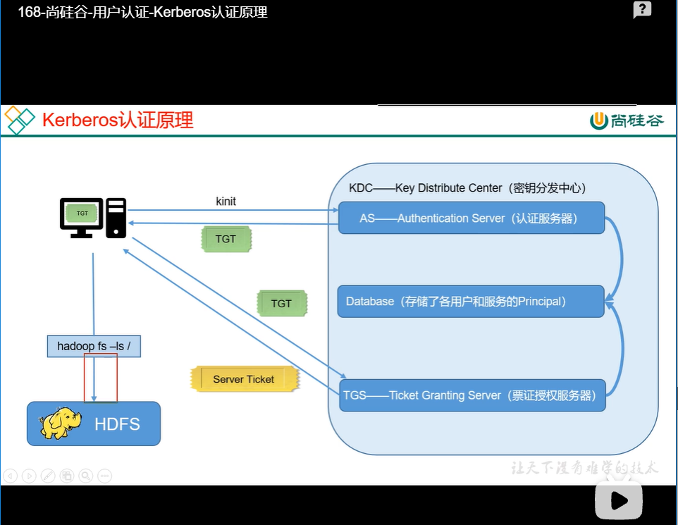

## 1.2 Kerberos安装

### 1.2.1 安装Kerberos相关服务

选择集群中的一台主机（hadoop102）作为Kerberos服务端，安装KDC，所有主机都需要部署Kerberos客户端。

服务端主机执行以下安装命令

```shell
[root@hadoop102 ~]# yum install -y krb5-server
```

客户端主机执行以下安装命令：

```shell
[root@hadoop102 ~]# yum install -y krb5-workstation krb5-libs
[root@hadoop103 ~]# yum install -y krb5-workstation krb5-libs
[root@hadoop104 ~]# yum install -y krb5-workstation krb5-libs
```


### 1.2.2 修改配置文件

1. 服务端主机（hadoop102）

   修改`/var/kerberso/krb5kdc/kdc.conf`文件，内容如下：

   ```yaml
   [root@hadoop102 ~]# vim /var/kerberos/krb5kdc/kdc.conf
   修改如下内容
   
   [kdcdefaults]
    kdc_ports = 88
    kdc_tcp_ports = 88
   
   [realms]
    EXAMPLE.COM = {
     #master_key_type = aes256-cts
     acl_file = /var/kerberos/krb5kdc/kadm5.acl
     dict_file = /usr/share/dict/words
     admin_keytab = /var/kerberos/krb5kdc/kadm5.keytab
     supported_enctypes = aes256-cts:normal aes128-cts:normal des3-hmac-sha1:normal arcfour-hmac:normal camellia256-cts:normal camellia128-cts:normal des-hmac-sha1:normal des-cbc-md5:normal des-cbc-crc:normal
   ```

   

2. 客户端主机（所有主机）

   修改`/etc/krb5.conf`文件：

   ```shell
   [root@hadoop102 ~]# vim /etc/krb5.conf
   [root@hadoop103 ~]# vim /etc/krb5.conf
   [root@hadoop104 ~]# vim /etc/krb5.conf
   ```

   内容如下：

   ```yaml
   # Configuration snippets may be placed in this directory as well
   includedir /etc/krb5.conf.d/
   
   [logging]
    default = FILE:/var/log/krb5libs.log
    kdc = FILE:/var/log/krb5kdc.log
    admin_server = FILE:/var/log/kadmind.log
   
   [libdefaults]
    dns_lookup_realm = false
    dns_lookup_kdc = false # 新增
    ticket_lifetime = 24h
    renew_lifetime = 7d
    forwardable = true
    rdns = false
    pkinit_anchors = FILE:/etc/pki/tls/certs/ca-bundle.crt
    default_realm = EXAMPLE.COM # 新增，kinit认证时如果没有写@后的内容，则默认为此
    #default_ccache_name = KEYRING:persistent:%{uid}
   
   # 新增
   [realms]
    EXAMPLE.COM = { # 域realm
     kdc = hadoop102 # kdc所在的主机名
     admin_server = hadoop102 # admin_server所在的主机名
    }
    
    
   [domain_realm]
   # .example.com = EXAMPLE.COM
   # example.com = EXAMPLE.COM
   ```

   

### 1.2.3 初始化KDC数据库

在服务端主机（hadoop102）执行以下命令，并根据提示输入密码。

```shell
[root@hadoop102 ~]# kdb5_util create -s
```

### 1.2.4 修改管理员权限配置文件

管理员用于管理其他的用户。

在服务端主机（hadoop102）修改`/var/kerberos/krb5kdc/kadmin5.acl`文件，内容如下：

```shell
*/admin@EXAMPLE.COM	*
```

==含义解释 TODO==

### 1.2.5 启动Kerberos相关服务

在主节点（hadoop102）启动KDC，并配置开机自启

```shell
[root@hadoop102 ~]# systemctl start krb5kdc
# 配置krb5kdc开机自启
[root@hadoop102 ~]# systemctl enable krb5kdc
```

在主节点（hadoop102）启动Kadmin，该服务为KDC数据库访问入口

```shell
[root@hadoop102 ~]# systemctl start kadmin
[root@hadoop102 ~]# systemctl enable kadmin
```

==kadmin就是之前在客户端配置文件中配置的admin_server==

### 1.2.6 创建Kerberos管理员用户

在KDC所在主机（hadoop102），执行以下命令，并按照提示输入密码

```shell
[root@hadoop102 ~]# kadmin.local -q "addpric admin/admin"
```

==注：kadmin.local命令只能在kerberos服务器本地使用。==

## 1.3 Kerberos使用概述

### 1.3.1 Kerberos数据库操作

1. 登录数据库

   - 本地登录（<span style="color:red;">无需认证</span>）

     ````shell
     [root@hadoop102 ~]# kadmin.local
     Authenticating as pricipal root/admin@EXAMPLE.COM with password.
     kadmin.local:
     ````

     

   - 远程登录（<span style="color:red;">需要进行主体认证，认证操作见下文</span>）

     ```shell
     [root@hadoop103 ~]# kadmin
     Authenticating as principal admin/admin@EXAMPLE.COM with password.
     Password for admin/admin@EXAMPLE.COM: 
     kadmin:  
     ```

     

2. 创建Kerberos主体

   登录数据库，输入以下命令，并按照提示输入密码

   ```shell
   [root@hadoop102 ~]# kadmin.local
   Authenticating as pricipal root/admin@EXAMPLE.COM with password.
   kadmin.local: addprinc test
   ```

   也可通过以下shell命令直接创建主题

   ```shell
   [root@hadoop102 ~]# kadmin.local -q "addprinc test"
   ```

   

3. 修改主体密码

   ```shell
   kadmin.local: cpw test
   ```

   

4. 查看所有主体

   ```shell
   kadmin.lcoal: list_principals
   K/M@EXAMPLE.COM
   admin/admin@EXAMPLE.COM
   kadmin/admin@EXAMPLE.COM
   kadmin/changepw@EXAMPLE.COM
   kadmin/hadoop105@EXAMPLE.COM
   kiprop/hadoop105@EXAMPLE.COM
   krbtgt/EXAMPLE.COM@EXAMPLE.COM
   ```

5. 删除主体

   ```shell
   kadmin.local: delprinc test
   ```

   

### 1.3.2 Kerberos认证操作

1. 密码认证

   用户可以使用密码认证，也可以使用keytab密钥文件认证。

   - 使用kinit进行主体认证，并按照提示输入密码

     ```shell
     [root@hadoop102 ~]# kinit test
     Password for test@EXAMPLE.COM:
     ```

   - 查看凭证

     ```shell
     [root@hadoop102 ~]# klist 
     Ticket cache: FILE:/tmp/krb5cc_0
     Default principal: test@EXAMPLE.COM
     
     Valid starting       Expires              Service principal
     10/27/2019 18:23:57  10/28/2019 18:23:57  krbtgt/EXAMPLE.COM@EXAMPLE.COM
     	renew until 11/03/2019 18:23:57
     ```

     

2. 密钥文件认证

   服务需要认证的话，使用密钥文件认证更为方便。

   - 生成主体test的keytab文件到指定目录`/root/test.keytab`。

     ```shell
     kadmin.local -q "xst -norandkey -k root/test.keytab test@EXAMPLE.COM"
     ```

     ==注意：-norandkey的作用是声明不随机生成密码，若不加该参数，会导致之前的密码失效。==

   - 使用keytab进行认证

     ```shell
     [root@hadoop102 ~]# kinit -kt /root/test.keytab
     ```

   - 查看认证凭证

     ```shell
     [root@hadoop102 ~]# klist
     Ticket cache: FILE:/tmp/krb5cc_0
     Default principal: test@EXAMPLE.COM
     
     Valid starting     Expires            Service principal
     08/27/19 15:41:28  08/28/19 15:41:28  krbtgt/EXAMPLE.COM@EXAMPLE.COM
             renew until 08/27/19 15:41:28
     ```

     

3. 销毁凭证

   ```shell
   [root@hadoop102 ~]# kdestroy
   [root@hadoop102 ~]# klist
   klist: No credentials cache found (ticket cache FILE:/tmp/krb5cc_0)
   ```

   

# 2. 创建Hadoop系统用户

为Hadoop开启Kerberos，需为不同服务准备不同的用户，启动服务时需要使用相应的用户。须在<span style="color:red;">所有节点</span>创建以下用户和用户组。

下面这些表来自Hadoop的官网文档；

https://hadoop.apache.org/docs/stable/hadoop-project-dist/hadoop-common/SecureMode.html

| **User:Group**    | **Daemons**                                         |
| ----------------- | --------------------------------------------------- |
| **hdfs:hadoop**   | NameNode, Secondary NameNode, JournalNode, DataNode |
| **yarn:hadoop**   | ResourceManager, NodeManager                        |
| **mapred:hadoop** | MapReduce JobHistory Server                         |

创建hadoop组

```shell
[root@hadoop102 ~]# groupadd hadoop
[root@hadoop103 ~]# groupadd hadoop
[root@hadoop104 ~]# groupadd hadoop
```

创建各用户并设置密码

```shell
[root@hadoop102 ~]# useradd hdfs -g hadoop
[root@hadoop102 ~]# echo hdfs | passwd --stdin  hdfs

[root@hadoop102 ~]# useradd yarn -g hadoop
[root@hadoop102 ~]# echo yarn | passwd --stdin yarn

[root@hadoop102 ~]# useradd mapred -g hadoop
[root@hadoop102 ~]# echo mapred | passwd --stdin mapred

[root@hadoop103 ~]# useradd hdfs -g hadoop
[root@hadoop103 ~]# echo hdfs | passwd --stdin  hdfs

[root@hadoop103 ~]# useradd yarn -g hadoop
[root@hadoop103 ~]# echo yarn | passwd --stdin yarn

[root@hadoop103 ~]# useradd mapred -g hadoop
[root@hadoop103 ~]# echo mapred | passwd --stdin mapred


[root@hadoop104 ~]# useradd hdfs -g hadoop
[root@hadoop104 ~]# echo hdfs | passwd --stdin  hdfs

[root@hadoop104 ~]# useradd yarn -g hadoop
[root@hadoop104 ~]# echo yarn | passwd --stdin yarn

[root@hadoop104 ~]# useradd mapred -g hadoop
[root@hadoop104 ~]# echo mapred | passwd --stdin mapred
```

# 3. Hadoop Kerberos配置

## 3.1 为Hadoop各服务创建Kerberos主体（Principal）

主体格式如下：`ServiceName/HostName@REALM`，例如 `dn/hadoop102@EXAMPLE.COM`

1. 各服务所需主体如下

   环境：3台节点，主机名分别为hadoop102，hadoop103，hadoop104。由于VMware虚拟机性能不够，就没有开启HDFS HA和Yarn HA。

   | **服务**           | **所在主机** | **主体（Principal）** |
   | ------------------ | ------------ | --------------------- |
   | NameNode           | hadoop102    | nn/hadoop102          |
   | DataNode           | hadoop102    | dn/hadoop102          |
   | DataNode           | hadoop103    | dn/hadoop103          |
   | DataNode           | hadoop104    | dn/hadoop104          |
   | Secondary NameNode | hadoop104    | sn/hadoop104          |
   | ResourceManager    | hadoop103    | rm/hadoop103          |
   | NodeManager        | hadoop102    | nm/hadoop102          |
   | NodeManager        | hadoop103    | nm/hadoop103          |
   | NodeManager        | hadoop104    | nm/hadoop104          |
   | JobHistory Server  | hadoop102    | jhs/hadoop102         |
   | Web UI             | hadoop102    | HTTP/hadoop102        |
   | Web UI             | hadoop103    | HTTP/hadoop103        |
   | Web UI             | hadoop104    | HTTP/hadoop104        |

2. 创建主体说明

   - 路径准备

     为服务创建的主体，需要通过密钥文件keytab文件进行认证，故需为各服务准备一个安全的路径用来存储keytab文件。

     ```shell
     [root@hadoop102 ~]# mkdir /etc/security/keytab/
     [root@hadoop102 ~]# chown -R root:hadoop /etc/security/keytab/
     [root@hadoop102 ~]# chmod 770 /etc/security/keytab/
     ```

   - 管理员主体认证

     为执行创建主体的语句，需登录Kerberos 数据库客户端，登录之前需先使用Kerberos的管理员用户进行认证，执行以下命令并根据提示输入密码。

     ```shell
     [root@hadoop102 ~]# kinit admin/admin
     ```

   - 远程登录数据库客户端

     ```shell
     [root@hadoop102 ~]# kadmin
     ```

   - 执行创建主体的语句

     ```shell
     kadmin:  addprinc -randkey test/test
     kadmin:  xst -k /etc/security/keytab/test.keytab test/test
     ```

     说明：

     （1）`addprinc test/test`：作用是新建主体

     `addprinc`：增加主体

     `-randkey`：密码随机，因hadoop各服务均通过keytab文件认证，故密码可随机生成

     `test/test`：新增的主体

     （2）`xst -k /etc/security/keytab/test.keytab test/test`：作用是将主体的密钥写入keytab文件

     `xst`：将主体的密钥写入keytab文件

     `-k /etc/security/keytab/test.keytab`：指明keytab文件路径和文件名

     `test/test`：主体

     （3）为方便创建主体，可使用如下命令

     ```shell
     [root@hadoop102 ~]# kadmin -p admin/admin -wadmin -q"addprinc -randkey test/test"
     [root@hadoop102 ~]# kadmin -p admin/admin -wadmin -q"xst -k /etc/security/keytab/test.keytab test/test"
     ```

     说明：

     -p：主体

     -w：密码

     -q：执行语句

     （4）操作主体的其他命令，可参考官方文档，地址如下：

     [http://web.mit.edu/kerberos/krb5-current/doc/admin/admin_commands/kadmin_local.html#commands](#commands) 

3. 创建主体

   （1）在所有节点创建keytab文件目录

   ```shell
   [root@hadoop102 ~]# mkdir /etc/security/keytab/
   [root@hadoop102 ~]# chown -R root:hadoop /etc/security/keytab/
   [root@hadoop102 ~]# chmod 770 /etc/security/keytab/
   
   [root@hadoop103 ~]# mkdir /etc/security/keytab/
   [root@hadoop103 ~]# chown -R root:hadoop /etc/security/keytab/
   [root@hadoop103 ~]# chmod 770 /etc/security/keytab/
   
   [root@hadoop104 ~]# mkdir /etc/security/keytab/
   [root@hadoop104 ~]# chown -R root:hadoop /etc/security/keytab/
   [root@hadoop104 ~]# chmod 770 /etc/security/keytab/
   ```

   

   （2）以下命令均在hadoop102节点执行

   **NameNode（hadoop102）**

   ```shell
   [root@hadoop102 ~]# kadmin -padmin/admin -wadmin -q"addprinc -randkey nn/hadoop102"
   [root@hadoop102 ~]# kadmin -padmin/admin -wadmin -q"xst -k /etc/security/keytab/nn.service.keytab nn/hadoop102"
   ```

   **DataNode（hadoop102）**

   ```shell
   [root@hadoop102 ~]# kadmin -padmin/admin -wadmin -q"addprinc -randkey dn/hadoop102"
   [root@hadoop102 ~]# kadmin -padmin/admin -wadmin -q"xst -k /etc/security/keytab/dn.service.keytab dn/hadoop102"
   ```

   

   **NodeManager（hadoop102）**

   ```shell
   [root@hadoop102 ~]# kadmin -padmin/admin -wadmin -q"addprinc -randkey nm/hadoop102"
   [root@hadoop102 ~]# kadmin -padmin/admin -wadmin -q"xst -k /etc/security/keytab/nm.service.keytab nm/hadoop102"
   ```

   

   **JobHistory Server（hadoop102）**

   ```shell
   [root@hadoop102 ~]# kadmin -padmin/admin -wadmin -q"addprinc -randkey jhs/hadoop102"
   [root@hadoop102 ~]# kadmin -padmin/admin -wadmin -q"xst -k /etc/security/keytab/jhs.service.keytab jhs/hadoop102"
   ```

   

   **Web UI（hadoop102）**

   ```shell
   [root@hadoop102 ~]# kadmin -padmin/admin -wadmin -q"addprinc -randkey HTTP/hadoop102"
   [root@hadoop102 ~]# kadmin -padmin/admin -wadmin -q"xst -k /etc/security/keytab/spnego.service.keytab HTTP/hadoop102"
   ```

   

   （3）以下命令在hadoop103节点执行

   **ResourceManager（hadoop103）**

   ```shell
   [root@hadoop103 ~]# kadmin -padmin/admin -wadmin -q"addprinc -randkey rm/hadoop103"
   [root@hadoop103 ~]# kadmin -padmin/admin -wadmin -q"xst -k /etc/security/keytab/rm.service.keytab rm/hadoop103"
   ```

   **DataNode（hadoop103）**

   ```shell
   [root@hadoop103 ~]# kadmin -padmin/admin -wadmin -q"addprinc -randkey dn/hadoop103"
   [root@hadoop103 ~]# kadmin -padmin/admin -wadmin -q"xst -k /etc/security/keytab/dn.service.keytab dn/hadoop103"
   ```

   

   **NodeManager（hadoop103）**

   ```shell
   [root@hadoop103 ~]# kadmin -padmin/admin -wadmin -q"addprinc -randkey nm/hadoop103"
   [root@hadoop103 ~]# kadmin -padmin/admin -wadmin -q"xst -k /etc/security/keytab/nm.service.keytab nm/hadoop103"
   ```

   **Web UI（hadoop103）**

   ```shell
   [root@hadoop103 ~]# kadmin -padmin/admin -wadmin -q"addprinc -randkey HTTP/hadoop103"
   [root@hadoop103 ~]# kadmin -padmin/admin -wadmin -q"xst -k /etc/security/keytab/spnego.service.keytab HTTP/hadoop103"
   ```

   

   （4）以下命令在hadoop104节点执行

   **SecondaryNameNode（hadoop104）**

   ```shell
   [root@hadoop104 ~]# kadmin -padmin/admin -wadmin -q"addprinc -randkey sn/hadoop104"
   [root@hadoop104 ~]# kadmin -padmin/admin -wadmin -q"xst -k /etc/security/keytab/sn.service.keytab sn/hadoop104"
   ```

   **DataNode（hadoop104）**

   ```shell
   [root@hadoop104 ~]# kadmin -padmin/admin -wadmin -q"addprinc -randkey dn/hadoop104"
   [root@hadoop104 ~]# kadmin -padmin/admin -wadmin -q"xst -k /etc/security/keytab/dn.service.keytab dn/hadoop104"
   ```

   

   **NodeManager（hadoop104）**

   ```shell
   [root@hadoop104 ~]# kadmin -padmin/admin -wadmin -q"addprinc -randkey nm/hadoop104"
   [root@hadoop104 ~]# kadmin -padmin/admin -wadmin -q"xst -k /etc/security/keytab/nm.service.keytab nm/hadoop104"
   ```

   **Web UI（hadoop104）**

   ```shell
   [root@hadoop104 ~]# kadmin -padmin/admin -wadmin -q"addprinc -randkey HTTP/hadoop104"
   [root@hadoop104 ~]# kadmin -padmin/admin -wadmin -q"xst -k /etc/security/keytab/spnego.service.keytab HTTP/hadoop104"
   ```

   

4. 修改<span style="color:red;">所有节点</span>keytab文件的所有者和访问权限

   ```shell
   [root@hadoop102 ~]# chown -R root:hadoop /etc/security/keytab/
   [root@hadoop102 ~]# chmod 660 /etc/security/keytab/*
   
   [root@hadoop103 ~]# chown -R root:hadoop /etc/security/keytab/
   [root@hadoop103 ~]# chmod 660 /etc/security/keytab/*
   
   [root@hadoop104 ~]# chown -R root:hadoop /etc/security/keytab/
   [root@hadoop104 ~]# chmod 660 /etc/security/keytab/*
   ```

   

## 3.2 修改Hadoop配置文件

<span style="color:red;">需要修改的内容如下：修改完毕需要分发所改文件。</span>

1. core-site.xml

   ```xml
   [root@hadoop102 ~]# vim /opt/module/hadoop-3.1.3/etc/hadoop/core-site.xml
   增加以下内容
   
   <!-- Kerberos主体到系统用户的映射机制 -->
   <property>
     <name>hadoop.security.auth_to_local.mechanism</name>
     <value>MIT</value>
   </property>
   
   <!-- Kerberos主体到系统用户的具体映射规则 -->
   <property>
     <name>hadoop.security.auth_to_local</name>
     <value>
       RULE:[2:$1/$2@$0]([ndj]n\/.*@EXAMPLE\.COM)s/.*/hdfs/
       RULE:[2:$1/$2@$0]([rn]m\/.*@EXAMPLE\.COM)s/.*/yarn/
       RULE:[2:$1/$2@$0](jhs\/.*@EXAMPLE\.COM)s/.*/mapred/
       DEFAULT
     </value>
   </property>
   
   <!-- 启用Hadoop集群Kerberos安全认证 -->
   <property>
     <name>hadoop.security.authentication</name>
     <value>kerberos</value>
   </property>
   
   <!-- 启用Hadoop集群授权管理 -->
   <property>
     <name>hadoop.security.authorization</name>
     <value>true</value>
   </property>
   
   <!-- Hadoop集群间RPC通讯设为仅认证模式 -->
   <property>
     <name>hadoop.rpc.protection</name>
     <value>authentication</value>
   </property>
   ```

   

2. hdfs-site.xml

   ```xml
   [root@hadoop102 ~]# vim /opt/module/hadoop-3.1.3/etc/hadoop/hdfs-site.xml
   增加以下内容
   
   <!-- 访问DataNode数据块时需通过Kerberos认证 -->
   <property>
     <name>dfs.block.access.token.enable</name>
     <value>true</value>
   </property>
   
   <!-- NameNode服务的Kerberos主体,_HOST会自动解析为服务所在的主机名 -->
   <property>
     <name>dfs.namenode.kerberos.principal</name>
     <value>nn/_HOST@EXAMPLE.COM</value>
   </property>
   
   <!-- NameNode服务的Kerberos密钥文件路径 -->
   <property>
     <name>dfs.namenode.keytab.file</name>
     <value>/etc/security/keytab/nn.service.keytab</value>
   </property>
   
   <!-- Secondary NameNode服务的Kerberos主体 -->
   <property>
     <name>dfs.secondary.namenode.keytab.file</name>
     <value>/etc/security/keytab/sn.service.keytab</value>
   </property>
   
   <!-- Secondary NameNode服务的Kerberos密钥文件路径 -->
   <property>
     <name>dfs.secondary.namenode.kerberos.principal</name>
     <value>sn/_HOST@EXAMPLE.COM</value>
   </property>
   
   <!-- NameNode Web服务的Kerberos主体 -->
   <property>
     <name>dfs.namenode.kerberos.internal.spnego.principal</name>
     <value>HTTP/_HOST@EXAMPLE.COM</value>
   </property>
   
   <!-- WebHDFS REST服务的Kerberos主体 -->
   <property>
     <name>dfs.web.authentication.kerberos.principal</name>
     <value>HTTP/_HOST@EXAMPLE.COM</value>
   </property>
   
   <!-- Secondary NameNode Web UI服务的Kerberos主体 -->
   <property>
     <name>dfs.secondary.namenode.kerberos.internal.spnego.principal</name>
     <value>HTTP/_HOST@EXAMPLE.COM</value>
   </property>
   
   <!-- Hadoop Web UI的Kerberos密钥文件路径 -->
   <property>
     <name>dfs.web.authentication.kerberos.keytab</name>
     <value>/etc/security/keytab/spnego.service.keytab</value>
   </property>
   
   <!-- DataNode服务的Kerberos主体 -->
   <property>
     <name>dfs.datanode.kerberos.principal</name>
     <value>dn/_HOST@EXAMPLE.COM</value>
   </property>
   
   <!-- DataNode服务的Kerberos密钥文件路径 -->
   <property>
     <name>dfs.datanode.keytab.file</name>
     <value>/etc/security/keytab/dn.service.keytab</value>
   </property>
   
   <!-- 配置NameNode Web UI 使用HTTPS协议 -->
   <property>
     <name>dfs.http.policy</name>
     <value>HTTPS_ONLY</value>
   </property>
   
   <!-- 配置DataNode数据传输保护策略为仅认证模式 -->
   <property>
     <name>dfs.data.transfer.protection</name>
     <value>authentication</value>
   </property>
   ```

   

3. yarn-site.xml

   ```xml
   [root@hadoop102 ~]# vim /opt/module/hadoop-3.1.3/etc/hadoop/yarn-site.xml
   增加以下内容
   
   <!-- Resource Manager 服务的Kerberos主体 -->
   <property>
     <name>yarn.resourcemanager.principal</name>
     <value>rm/_HOST@EXAMPLE.COM</value>
   </property>
   
   <!-- Resource Manager 服务的Kerberos密钥文件 -->
   <property>
     <name>yarn.resourcemanager.keytab</name>
     <value>/etc/security/keytab/rm.service.keytab</value>
   </property>
   
   <!-- Node Manager 服务的Kerberos主体 -->
   <property>
     <name>yarn.nodemanager.principal</name>
     <value>nm/_HOST@EXAMPLE.COM</value>
   </property>
   
   <!-- Node Manager 服务的Kerberos密钥文件 -->
   <property>
     <name>yarn.nodemanager.keytab</name>
     <value>/etc/security/keytab/nm.service.keytab</value>
   </property>
   ```

   

4. mapred-site.xml

   ```xml
   [root@hadoop102 ~]# vim /opt/module/hadoop-3.1.3/etc/hadoop/mapred-site.xml
   增加以下内容
   
   <!-- 历史服务器的Kerberos主体 -->
   <property>
     <name>mapreduce.jobhistory.keytab</name>
     <value>/etc/security/keytab/jhs.service.keytab</value>
   </property>
   
   <!-- 历史服务器的Kerberos密钥文件 -->
   <property>
     <name>mapreduce.jobhistory.principal</name>
     <value>jhs/_HOST@EXAMPLE.COM</value>
   </property>
   ```

5. 分发以上修改的配置文件

   ```shell
   [root@hadoop102 ~]# xsync /opt/module/hadoop-3.1.3/etc/hadoop/core-site.xml
   [root@hadoop102 ~]# xsync /opt/module/hadoop-3.1.3/etc/hadoop/hdfs-site.xml
   [root@hadoop102 ~]# xsync /opt/module/hadoop-3.1.3/etc/hadoop/yarn-site.xml
   [root@hadoop102 ~]# xsync /opt/module/hadoop-3.1.3/etc/hadoop/mapred-site.xml
   ```

   

## 3.3 配置HDFS使用HTTPS安全传输协议

**生成密钥对**

`Keytool`是java数据证书的管理工具，使用户能够管理自己的公/私钥对及相关证书。

`-keystore`  指定密钥库的名称及位置(产生的各类信息将存在`.keystore`文件中)

`-genkey`(或者`-genkeypair`)   生成密钥对

`-alias`  为生成的密钥对指定别名，如果没有默认是`mykey`

`-keyalg` 指定密钥的算法 `RSA/DSA` 默认是`DSA`

1. 生成keystore的密码及相应信息的密钥库

   ```shell
   [root@hadoop102 ~]# keytool -keystore /etc/security/keytab/keystore -alias jetty -genkey -keyalg RSA
   
   输入密钥库口令:  
   再次输入新口令: 
   您的名字与姓氏是什么?
     [Unknown]:  
   您的组织单位名称是什么?
     [Unknown]:  
   您的组织名称是什么?
     [Unknown]:  
   您所在的城市或区域名称是什么?
     [Unknown]:  
   您所在的省/市/自治区名称是什么?
     [Unknown]:  
   该单位的双字母国家/地区代码是什么?
     [Unknown]:  
   CN=Unknown, OU=Unknown, O=Unknown, L=Unknown, ST=Unknown, C=Unknown是否正确?
     [否]:  y
   
   输入 <jetty> 的密钥口令
           (如果和密钥库口令相同, 按回车):  
   再次输入新口令:
   ```

   

2. 修改keystore文件的所有者和访问权限

   ```shell
   [root@hadoop102 ~]# chown -R root:hadoop /etc/security/keytab/keystore
   [root@hadoop102 ~]# chmod 660 /etc/security/keytab/keystore
   ```

   ==注意：==

   （1）密钥库的密码至少6个字符，可以是纯数字或者字母或者数字和字母的组合等等

   （2）确保hdfs用户（HDFS的启动用户）具有对所生成keystore文件的读权限

3. 将该证书分发到集群中的每台节点的相同路径

   ```shell
   [root@hadoop102 ~]# xsync /etc/security/keytab/keystore
   ```

   

4. 修改hadoop配置文件ssl-server.xml.example

   该文件位于$HADOOP_HOME/etc/hadoop目录

   修改文件名为ssl-server.xml

   ```shell
   [root@hadoop102 ~]# mv $HADOOP_HOME/etc/hadoop/ssl-server.xml.example $HADOOP_HOME/etc/hadoop/ssl-server.xml
   ```

   修改以下内容

   ```xml
   [root@hadoop102 ~]# vim $HADOOP_HOME/etc/hadoop/ssl-server.xml
   修改以下参数
   
   <!-- SSL密钥库路径 -->
   <property>
     <name>ssl.server.keystore.location</name>
     <value>/etc/security/keytab/keystore</value>
   </property>
   
   <!-- SSL密钥库密码 -->
   <property>
     <name>ssl.server.keystore.password</name>
     <value>123456</value>
   </property>
   
   <!-- SSL可信任密钥库路径 -->
   <property>
     <name>ssl.server.truststore.location</name>
     <value>/etc/security/keytab/keystore</value>
   </property>
   
   <!-- SSL密钥库中密钥的密码 -->
   <property>
     <name>ssl.server.keystore.keypassword</name>
     <value>123456</value>
   </property>
   
   <!-- SSL可信任密钥库密码 -->
   <property>
     <name>ssl.server.truststore.password</name>
     <value>123456</value>
   </property>
   ```

   

5. 分发ssl-server.xml文件

   ```shell
   [root@hadoop102 ~]# xsync $HADOOP_HOME/etc/hadoop/ssl-server.xml
   ```

   


## 3.4 配置Yarn使用LinuxContainerExecutor

（1）修改<span style="color:red;">所有节点</span>的container-executor所有者和权限，要求其所有者为root，所有组为hadoop（启动NodeManager的yarn用户的所属组），权限为6050。其默认路径为$HADOOP_HOME/bin。

```shell
[root@hadoop102 ~]# chown root:hadoop /opt/module/hadoop-3.1.3/bin/container-executor
[root@hadoop102 ~]# chmod 6050 /opt/module/hadoop-3.1.3/bin/container-executor

[root@hadoop103 ~]# chown root:hadoop /opt/module/hadoop-3.1.3/bin/container-executor
[root@hadoop103 ~]# chmod 6050 /opt/module/hadoop-3.1.3/bin/container-executor

[root@hadoop104 ~]# chown root:hadoop /opt/module/hadoop-3.1.3/bin/container-executor
[root@hadoop104 ~]# chmod 6050 /opt/module/hadoop-3.1.3/bin/container-executor
```


（2）修改<span style="color:red;">所有节点</span>的container-executor.cfg文件的所有者和权限，要求改文件及其所有的上级目录的所有者均为root，所有组为hadoop（启动NodeManager的yarn用户的所属组），权限为400。其默认路径为$HADOOP_HOME/etc/hadoop。

```shell
[root@hadoop102 ~]# chown root:hadoop /opt/module/hadoop-3.1.3/etc/hadoop/container-executor.cfg
[root@hadoop102 ~]# chown root:hadoop /opt/module/hadoop-3.1.3/etc/hadoop
[root@hadoop102 ~]# chown root:hadoop /opt/module/hadoop-3.1.3/etc
[root@hadoop102 ~]# chown root:hadoop /opt/module/hadoop-3.1.3
[root@hadoop102 ~]# chown root:hadoop /opt/module
[root@hadoop102 ~]# chmod 400 /opt/module/hadoop-3.1.3/etc/hadoop/container-executor.cfg

[root@hadoop103 ~]# chown root:hadoop /opt/module/hadoop-3.1.3/etc/hadoop/container-executor.cfg
[root@hadoop103 ~]# chown root:hadoop /opt/module/hadoop-3.1.3/etc/hadoop
[root@hadoop103 ~]# chown root:hadoop /opt/module/hadoop-3.1.3/etc
[root@hadoop103 ~]# chown root:hadoop /opt/module/hadoop-3.1.3
[root@hadoop103 ~]# chown root:hadoop /opt/module
[root@hadoop103 ~]# chmod 400 /opt/module/hadoop-3.1.3/etc/hadoop/container-executor.cfg

[root@hadoop104 ~]# chown root:hadoop /opt/module/hadoop-3.1.3/etc/hadoop/container-executor.cfg
[root@hadoop104 ~]# chown root:hadoop /opt/module/hadoop-3.1.3/etc/hadoop
[root@hadoop104 ~]# chown root:hadoop /opt/module/hadoop-3.1.3/etc
[root@hadoop104 ~]# chown root:hadoop /opt/module/hadoop-3.1.3
[root@hadoop104 ~]# chown root:hadoop /opt/module
[root@hadoop104 ~]# chmod 400 /opt/module/hadoop-3.1.3/etc/hadoop/container-executor.cfg
```


（3）修改$HADOOP_HOME/etc/hadoop/container-executor.cfg

```shell
[root@hadoop102 ~]# vim $HADOOP_HOME/etc/hadoop/container-executor.cfg
```

内容如下：

```shell
yarn.nodemanager.linux-container-executor.group=hadoop
banned.users=hdfs,yarn,mapred
min.user.id=1000
allowed.system.users=
feature.tc.enabled=false
```


（4）修改$HADOOP_HOME/etc/hadoop/yarn-site.xml文件

```shell
[root@hadoop102 ~]# vim $HADOOP_HOME/etc/hadoop/yarn-site.xml
```

增加以下内容

```xml
<!-- 配置Node Manager使用LinuxContainerExecutor管理Container -->
<property>
  <name>yarn.nodemanager.container-executor.class</name>
  <value>org.apache.hadoop.yarn.server.nodemanager.LinuxContainerExecutor</value>
</property>

<!-- 配置Node Manager的启动用户的所属组 -->
<property>
  <name>yarn.nodemanager.linux-container-executor.group</name>
  <value>hadoop</value>
</property>

<!-- LinuxContainerExecutor脚本路径 -->
<property>
  <name>yarn.nodemanager.linux-container-executor.path</name>
  <value>/opt/module/hadoop-3.1.3/bin/container-executor</value>
</property>
```


（5）分发contianer-executor.cfg和yarn-site.xml文件

```shell
[root@hadoop102 ~]# xsync $HADOOP_HOME/etc/hadoop/container-executor.cfg
[root@hadoop102 ~]# xsync $HADOOP_HOME/etc/hadoop/yarn-site.xml
```


# 4. 安全模式下启动Hadoop集群

## 4.1 修改特定本地路径权限

|       |                             |             |            |
| ----- | --------------------------- | ----------- | ---------- |
| local | $HADOOP_LOG_DIR             | hdfs:hadoop | drwxrwxr-x |
| local | dfs.namenode.name.dir       | hdfs:hadoop | drwx------ |
| local | dfs.datanode.data.dir       | hdfs:hadoop | drwx------ |
| local | dfs.namenode.checkpoint.dir | hdfs:hadoop | drwx------ |
| local | yarn.nodemanager.local-dirs | yarn:hadoop | drwxrwxr-x |
| local | yarn.nodemanager.log-dirs   | yarn:hadoop | drwxrwxr-x |

（1）$HADOOPP_LOG_DIR（所有节点）

该变量位于hadoop-env.sh文件，默认值为 ${HADOOP_HOME}/logs

```shell
[root@hadoop102 ~]# chown hdfs:hadoop /opt/module/hadoop-3.1.3/logs/
[root@hadoop102 ~]# chmod 775 /opt/module/hadoop-3.1.3/logs/

[root@hadoop103 ~]# chown hdfs:hadoop /opt/module/hadoop-3.1.3/logs/
[root@hadoop103 ~]# chmod 775 /opt/module/hadoop-3.1.3/logs/

[root@hadoop104 ~]# chown hdfs:hadoop /opt/module/hadoop-3.1.3/logs/
[root@hadoop104 ~]# chmod 775 /opt/module/hadoop-3.1.3/logs/
```


（2）dfs.namenode.name.dir（NameNode节点）

该参数位于hdfs-site.xml文件，默认值为file://${hadoop.tmp.dir}/dfs/name

```shell
[root@hadoop102 ~]# chown -R hdfs:hadoop /opt/module/hadoop-3.1.3/data/dfs/name/
[root@hadoop102 ~]# chmod 700 /opt/module/hadoop-3.1.3/data/dfs/name/
```


（3）dfs.datanode.data.dir（DataNode节点）

该参数为于hdfs-site.xml文件，默认值为file://${hadoop.tmp.dir}/dfs/data

```shell
[root@hadoop102 ~]# chown -R hdfs:hadoop /opt/module/hadoop-3.1.3/data/dfs/data/
[root@hadoop102 ~]# chmod 700 /opt/module/hadoop-3.1.3/data/dfs/data/

[root@hadoop103 ~]# chown -R hdfs:hadoop /opt/module/hadoop-3.1.3/data/dfs/data/
[root@hadoop103 ~]# chmod 700 /opt/module/hadoop-3.1.3/data/dfs/data/

[root@hadoop104 ~]# chown -R hdfs:hadoop /opt/module/hadoop-3.1.3/data/dfs/data/
[root@hadoop104 ~]# chmod 700 /opt/module/hadoop-3.1.3/data/dfs/data/
```


（4）dfs.namenode.checkpoint.dir（SecondaryNameNode节点）

该参数位于hdfs-site.xml文件，默认值为file://${hadoop.tmp.dir}/dfs/namesecondary

```shell
[root@hadoop104 ~]# chown -R hdfs:hadoop /opt/module/hadoop-3.1.3/data/dfs/namesecondary/
[root@hadoop104 ~]# chmod 700 /opt/module/hadoop-3.1.3/data/dfs/namesecondary/
```


（5）yarn.nodemanager.local-dirs（NodeManager节点）

该参数位于yarn-site.xml文件，默认值为file://${hadoop.tmp.dir}/nm-local-dir

```shell
[root@hadoop102 ~]# chown -R yarn:hadoop /opt/module/hadoop-3.1.3/data/nm-local-dir/
[root@hadoop102 ~]# chmod -R 775 /opt/module/hadoop-3.1.3/data/nm-local-dir/

[root@hadoop103 ~]# chown -R yarn:hadoop /opt/module/hadoop-3.1.3/data/nm-local-dir/
[root@hadoop103 ~]# chmod -R 775 /opt/module/hadoop-3.1.3/data/nm-local-dir/

[root@hadoop104 ~]# chown -R yarn:hadoop /opt/module/hadoop-3.1.3/data/nm-local-dir/
[root@hadoop104 ~]# chmod -R 775 /opt/module/hadoop-3.1.3/data/nm-local-dir/
```


（6）yarn.nodemanager.log-dirs（NodeManager节点）

该参数位于yarn-site.xml文件，默认值为$HADOOP_LOG_DIR/userlogs

```shell
[root@hadoop102 ~]# chown yarn:hadoop /opt/module/hadoop-3.1.3/logs/userlogs/
[root@hadoop102 ~]# chmod 775 /opt/module/hadoop-3.1.3/logs/userlogs/

[root@hadoop103 ~]# chown yarn:hadoop /opt/module/hadoop-3.1.3/logs/userlogs/
[root@hadoop103 ~]# chmod 775 /opt/module/hadoop-3.1.3/logs/userlogs/

[root@hadoop104 ~]# chown yarn:hadoop /opt/module/hadoop-3.1.3/logs/userlogs/
[root@hadoop104 ~]# chmod 775 /opt/module/hadoop-3.1.3/logs/userlogs/
```


## 4.2 启动HDFS

需要注意的是，启动不同服务时需要使用对应的用户

1. 单点启动

   （1）启动NameNode

   ```shell
   [root@hadoop102 ~]# sudo -i -u hdfs hdfs --daemon start namenode
   ```

   

   （2）启动DataNode

   ```shell
   [root@hadoop102 ~]# sudo -i -u hdfs hdfs --daemon start datanode
   [root@hadoop103 ~]# sudo -i -u hdfs hdfs --daemon start datanode
   [root@hadoop104 ~]# sudo -i -u hdfs hdfs --daemon start datanode
   ```

   

   （3）启动SecondaryNameNode

   ```shell
   [root@hadoop104 ~]# sudo -i -u hdfs hdfs --daemon start secondarynamenode
   ```

   说明：

   - -i：重新加载环境变量
   - -u：以特定用户的身份执行后续命令

2. 群起

   （1）在主节点（hadoop102）配置<span style="color:red">hdfs</span>用户到所有节点的免密登录。

   （2）修改主节点（hadoop102）节点的$HADOOP_HOME/sbin/start-dfs.sh脚本，在顶部增加以下环境变量。

   ```shell
   [root@hadoop102 ~]# vim $HADOOP_HOME/sbin/start-dfs.sh
   ```

   在顶部增加如下内容

   ```shell
   HDFS_DATANODE_USER=hdfs
   HDFS_NAMENODE_USER=hdfs
   HDFS_SECONDARYNAMENODE_USER=hdfs
   ```

   ==注：$HADOOP_HOME/sbin/stop-dfs.sh也需在顶部增加上述环境变量才可使用。==

   （3）以root用户执行群起脚本，即可启动HDFS集群。

   ```shell
   [root@hadoop102 ~]# start-dfs.sh
   ```

3. 查看HDFS的web页面

   访问地址为https://hadoop102:9871 

## 4.3 修改HDFS特定路径访问权限

|      |                                            |               |             |
| ---- | ------------------------------------------ | ------------- | ----------- |
| hdfs | /                                          | hdfs:hadoop   | drwxr-xr-x  |
| hdfs | /tmp                                       | hdfs:hadoop   | drwxrwxrwxt |
| hdfs | /user                                      | hdfs:hadoop   | drwxrwxr-x  |
| hdfs | yarn.nodemanager.remote-app-log-dir        | yarn:hadoop   | drwxrwxrwxt |
| hdfs | mapreduce.jobhistory.intermediate-done-dir | mapred:hadoop | drwxrwxrwxt |
| hdfs | mapreduce.jobhistory.done-dir              | mapred:hadoop | drwxrwx---  |

<span style="color:red;">说明：若上述路径不存在，需手动创建。</span>

1. 创建hdfs/hadoop主体，执行以下命令并按照提示输入密码

   ```shell
   [root@hadoop102 ~]# kadmin.local -q "addprinc hdfs/hadoop"
   ```

   

2. 认证hdfs/hadoop主体，执行以下命令并按照提示输入密码

   ```shell
   [root@hadoop102 ~]# kinit hdfs/hadoop
   ```

   

3. 按照上述要求修改指定路径的所有者和权限

   （1）修改/、/tmp、/user路径

   ```shell
   [root@hadoop102 ~]# hadoop fs -chown hdfs:hadoop / /tmp /user
   [root@hadoop102 ~]# hadoop fs -chmod 755 /
   [root@hadoop102 ~]# hadoop fs -chmod 1777 /tmp
   [root@hadoop102 ~]# hadoop fs -chmod 775 /user
   ```

   

   （2）参数yarn.nodemanager.remote-app-log-dir位于yarn-site.xml文件，默认值/tmp/logs

   ```shell
   [root@hadoop102 ~]# hadoop fs -chown yarn:hadoop /tmp/logs
   [root@hadoop102 ~]# hadoop fs -chmod 1777 /tmp/logs
   ```

   

   （3）参数mapreduce.jobhistory.intermediate-done-dir位于mapred-site.xml文件，默认值为/tmp/hadoop-yarn/staging/history/done_intermediate，需保证该路径的所有上级目录（除/tmp）的所有者均为mapred，所属组为hadoop，权限为770

   ```shell
   [root@hadoop102 ~]# hadoop fs -chown -R mapred:hadoop /tmp/hadoop-yarn/staging/history/done_intermediate
   [root@hadoop102 ~]# hadoop fs -chmod -R 1777 /tmp/hadoop-yarn/staging/history/done_intermediate
   
   [root@hadoop102 ~]# hadoop fs -chown mapred:hadoop /tmp/hadoop-yarn/staging/history/
   [root@hadoop102 ~]# hadoop fs -chown mapred:hadoop /tmp/hadoop-yarn/staging/
   [root@hadoop102 ~]# hadoop fs -chown mapred:hadoop /tmp/hadoop-yarn/
   
   [root@hadoop102 ~]# hadoop fs -chmod 770 /tmp/hadoop-yarn/staging/history/
   [root@hadoop102 ~]# hadoop fs -chmod 770 /tmp/hadoop-yarn/staging/
   [root@hadoop102 ~]# hadoop fs -chmod 770 /tmp/hadoop-yarn/
   ```

   

   （4）参数mapreduce.jobhistory.done-dir位于mapred-site.xml文件，默认值为/tmp/hadoop-yarn/staging/history/done，需保证该路径的所有上级目录（除/tmp）的所有者均为mapred，所属组为hadoop，权限为770

   ```shell
   [root@hadoop102 ~]# hadoop fs -chown -R mapred:hadoop /tmp/hadoop-yarn/staging/history/done
   [root@hadoop102 ~]# hadoop fs -chmod -R 750 /tmp/hadoop-yarn/staging/history/done
   
   [root@hadoop102 ~]# hadoop fs -chown mapred:hadoop /tmp/hadoop-yarn/staging/history/
   [root@hadoop102 ~]# hadoop fs -chown mapred:hadoop /tmp/hadoop-yarn/staging/
   [root@hadoop102 ~]# hadoop fs -chown mapred:hadoop /tmp/hadoop-yarn/
   
   [root@hadoop102 ~]# hadoop fs -chmod 770 /tmp/hadoop-yarn/staging/history/
   [root@hadoop102 ~]# hadoop fs -chmod 770 /tmp/hadoop-yarn/staging/
   [root@hadoop102 ~]# hadoop fs -chmod 770 /tmp/hadoop-yarn/
   ```

   


## 4.4 启动Yarn

1. 单点启动

   （1）启动ResourceManager

   ```shell
   [root@hadoop103 ~]# sudo -i -u yarn yarn --daemon start resourcemanager
   ```

   

   （2）启动NodeManager

   ```shell
   [root@hadoop102 ~]# sudo -i -u yarn yarn --daemon start nodemanager
   [root@hadoop103 ~]# sudo -i -u yarn yarn --daemon start nodemanager
   [root@hadoop104 ~]# sudo -i -u yarn yarn --daemon start nodemanager
   ```

   

2. 群起

   （1）在Yarn主节点（hadoop103）配置<span style="color:red;">yarn</span>用户到所有节点的免密登录。

   （2）修改主节点（hadoop103）的$HADOOP_HOME/sbin/start-yarn.sh，在顶部增加以下环境变量。

   ```shell
   [root@hadoop103 ~]# vim $HADOOP_HOME/sbin/start-yarn.sh
   在顶部增加如下内容
   
   YARN_RESOURCEMANAGER_USER=yarn
   YARN_NODEMANAGER_USER=yarn
   ```

   <span style="color:red;">注：stop-yarn.sh也需在顶部增加上述环境变量才可使用。</span>

   （3）以root用户执行$HADOOP_HOME/sbin/start-yarn.sh脚本即可启动yarn集群。

   ```shell
   [root@hadoop103 ~]# start-yarn.sh
   ```

   

3. 访问Yarn web页面

   访问地址为http://hadoop103:8088

## 4.5 启动HistoryServer

1. 启动历史服务器

   ```shell
   [root@hadoop102 ~]# sudo -i -u mapred mapred --daemon start historyserver
   ```

2. 查看历史服务器web页面

   访问地址为http://hadoop102:19888 


# 5. 安全集群使用说明

## 5.1 用户要求

1. 具体要求

   以下使用说明均基于普通用户，安全集群对用户有以下要求：

   - 集群中的每个节点都需要创建该用户
   - 该用户需要属于hadoop用户组
   - 需要创建该用户对应的Kerberos主题

2. 实操

   此处以atguigu用户为例，具体操作如下

   （1）创建用户（存在可跳过），须在所有节点执行

   ```shell
   [root@hadoop102 ~]# useradd atguigu
   [root@hadoop102 ~]# echo atguigu | passwd --stdin atguigu
   
   [root@hadoop103 ~]# useradd atguigu
   [root@hadoop103 ~]# echo atguigu | passwd --stdin atguigu
   
   [root@hadoop104 ~]# useradd atguigu
   [root@hadoop104 ~]# echo atguigu | passwd --stdin atguigu
   ```

   

   （2）加入hadoop组，须在所有节点执行

   ```shell
   [root@hadoop102 ~]# usermod -a -G hadoop atguigu
   [root@hadoop103 ~]# usermod -a -G hadoop atguigu
   [root@hadoop104 ~]# usermod -a -G hadoop atguigu
   ```

   

   （3）创建主体

   ```shell
   [root@hadoop102 ~]# kadmin -p admin/admin -wadmin -q"addprinc -pw atguigu atguigu"
   ```

   

3. x

## 5.2 访问HDFS集群

### 5.2.1 shell命令

1. 认证

   ```shell
   [atguigu@hadoop102 ~]$ kinit atguigu
   ```

   

2. 查看当前认证用户

   ```shell
   [atguigu@hadoop102 ~]$ kinit atguigu
   ```

   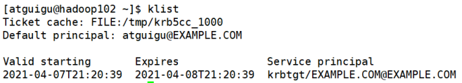

3. 执行命令

   ```shell
   [atguigu@hadoop102 ~]$ hadoop fs -ls /
   ```

   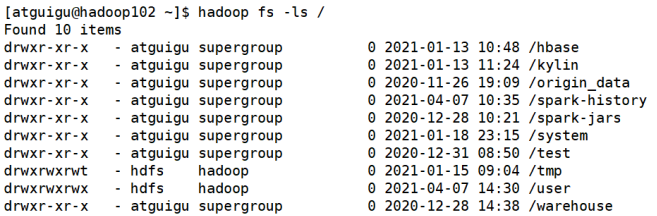

4. 注销认证

   ```shell
   [atguigu@hadoop102 ~]$ kdestroy
   ```

   

5. 再次执行查看命令

   ```shell
   [atguigu@hadoop102 ~]$ hadoop fs -ls /
   ```

   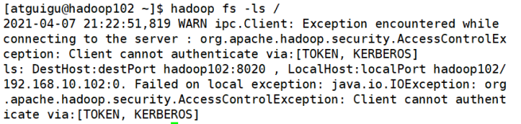

### 5.2.2 web页面

1. 安装Kerberos客户端

   下载地址：http://web.mit.edu/kerberos/dist/kfw/4.1/kfw-4.1-amd64.msi　

   （1）下载之后按照提示安装

   （2）编辑C:\ProgramData\MIT\Kerberos5\krb5.ini文件，内容如下

   ```shell
   [libdefaults]
    dns_lookup_realm = false
    ticket_lifetime = 24h
    forwardable = true
    rdns = false
    default_realm = EXAMPLE.COM
   
   [realms]
    EXAMPLE.COM = {
     kdc = hadoop102
     admin_server = hadoop102
    }
   
   [domain_realm]
   ```

   

2. 配置火狐浏览器

   （1）打开浏览器，在地址栏输入“about:config”，点击回车

   

   （２）搜索“network.negotiate-auth.trusted-uris”，修改值为要访问的主机名（hadoop102）

   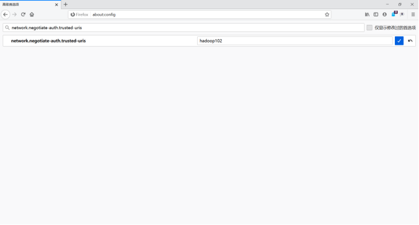

   （3）搜索“network.auth.use-sspi”，双击将值变为false

   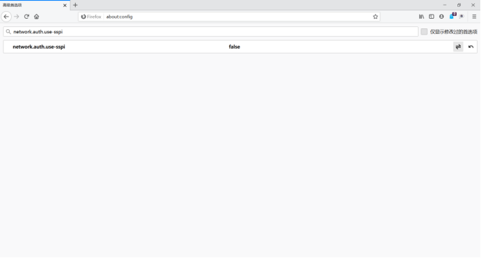

3. 认证

   （1）启动Kerberos客户端，点击Get Ticket

   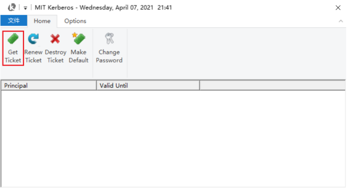

   （2）输入主体名和密码，点击OK

   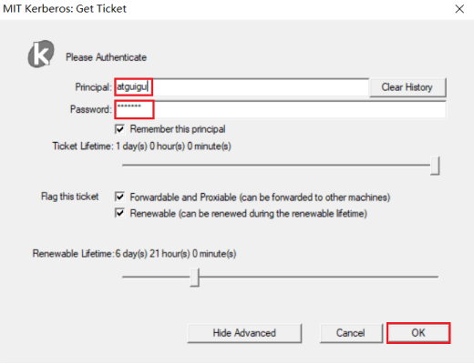

   （3）认证成功

   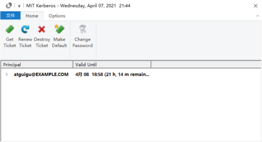

   

   

   

4. 访问HDFS

   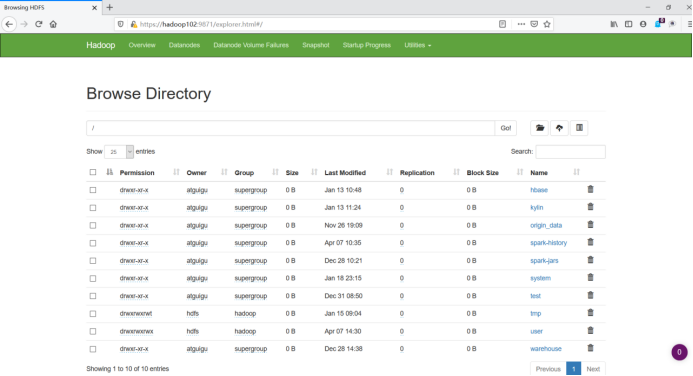

5. 注销认证

   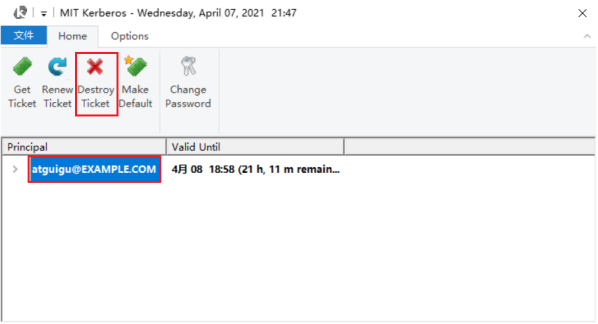

6. 重启浏览器，再次访问HDFS

   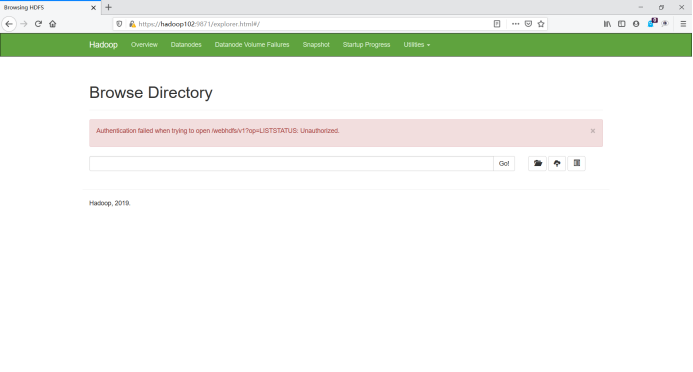

## 5.3 提交MapReduce任务

1. 认证

   ```shell
   [atguigu@hadoop102 ~]$ kinit atguigu
   ```

   

2. 提交任务

   ```shell
   [atguigu@hadoop102 ~]$ hadoop jar /opt/module/hadoop-3.1.3/share/hadoop/mapreduce/hadoop-mapreduce-examples-3.1.3.jar pi 1 1
   ```

   

# 6. Hive用户认证

## 6.1 前置要求

### 6.1.1 Hadoop集群启动Kerberos认证

按照上述步骤为Hadoop集群开启Kerberos安全认证。

### 6.1.2 创建Hive系统用户和Kerberos主体

1. 创建系统用户

   ```shell
   [root@hadoop102 ~]# useradd hive -g hadoop
   [root@hadoop102 ~]# echo hive | passwd --stdin hive
   
   [root@hadoop103 ~]# useradd hive -g hadoop
   [root@hadoop103 ~]# echo hive | passwd --stdin hive
   
   [root@hadoop104 ~]# useradd hive -g hadoop
   [root@hadoop104 ~]# echo hive | passwd --stdin hive
   ```

   

2. 创建kerberos主体并生成keytab文件

   ```shell
   [root@hadoop102 ~]# kadmin -padmin/admin -wadmin -q"addprinc -randkey hive/hadoop102"
   ```

   在Hive所部署的节点生成keytab文件

   ```shell
   [root@hadoop102 ~]# kadmin -padmin/admin -wadmin -q"xst -k /etc/security/keytab/hive.service.keytab hive/hadoop102"
   ```

   

3. 修改keytab文件所有者和访问权限

   ```shell
   [root@hadoop102 ~]# chown -R root:hadoop /etc/security/keytab/
   [root@hadoop102 ~]# chmod 660 /etc/security/keytab/hive.service.keytab
   ```

   

## 6.2 配置认证

1. 修改$HIVE_HOME/conf/hive-site.xml文件，增加如下属性：

   ```xml
   [root@hadoop102 ~]# vim $HIVE_HOME/conf/hive-site.xml
   
   <!-- HiveServer2启用Kerberos认证 -->
   <property>
       <name>hive.server2.authentication</name>
       <value>kerberos</value>
   </property>
   
   <!-- HiveServer2服务的Kerberos主体 -->
   <property>
       <name>hive.server2.authentication.kerberos.principal</name>
       <value>hive/hadoop102@EXAMPLE.COM</value>
   </property>
   
   <!-- HiveServer2服务的Kerberos密钥文件 -->
   <property>
           <name>hive.server2.authentication.kerberos.keytab</name>
       <value>/etc/security/keytab/hive.service.keytab</value>
   </property>
   
   <!-- Metastore启动认证 -->
   <property>
       <name>hive.metastore.sasl.enabled</name>
       <value>true</value>
   </property>
   <!-- Metastore Kerberos密钥文件 -->
   <property>
       <name>hive.metastore.kerberos.keytab.file</name>
       <value>/etc/security/keytab/hive.service.keytab</value>
   </property>
   <!-- Metastore Kerberos主体 -->
   <property>
       <name>hive.metastore.kerberos.principal</name>
       <value>hive/hadoop102@EXAMPLE.COM</value>
   </property>
   ```

   

2. 修改$HADOOP_HOME/etc/hadoop/core-site.xml文件，具体修改如下：

   ```shell
   [root@hadoop102 ~]# vim $HADOOP_HOME/etc/hadoop/core-site.xml
   ```

   （1）<span style="color:red;">删除</span>以下参数

   ```xml
   <property>
       <name>hadoop.http.staticuser.user</name>
       <value>atguigu</value>
   </property>
   
   <property>
       <name>hadoop.proxyuser.atguigu.hosts</name>
       <value>*</value>
   </property>
   
   <property>
       <name>hadoop.proxyuser.atguigu.groups</name>
       <value>*</value>
   </property>
   
   <property>
       <name>hadoop.proxyuser.atguigu.users</name>
       <value>*</value>
   </property>
   ```

   

   （2）<span style="color:red;">增加</span>以下参数

   ```xml
   <property>
       <name>hadoop.proxyuser.hive.hosts</name>
       <value>*</value>
   </property>
   
   <property>
       <name>hadoop.proxyuser.hive.groups</name>
       <value>*</value>
   </property>
   
   <property>
       <name>hadoop.proxyuser.hive.users</name>
       <value>*</value>
   </property>
   ```

   

3. 分发配置core-site.xml文件

   ```shell
   [root@hadoop102 ~]# xsync $HADOOP_HOME/etc/hadoop/core-site.xml
   ```

   

4. 重启Hadoop集群

   ```shell
   [root@hadoop102 ~]# stop-dfs.sh
   [root@hadoop103 ~]# stop-yarn.sh
   
   [root@hadoop102 ~]# start-dfs.sh
   [root@hadoop103 ~]# start-yarn.sh
   ```

   

## 6.3 启动hiveserver2

注：需使用hive用户启动

```shell
[root@hadoop102 ~]# sudo -i -u hive hiveserver2
```


# 7. Hive Kerberos认证使用说明

以下说明均基于普通用户

## 7.1 beeline客户端

1. 认证，执行以下命令，并按照提示输入密码

   ```shell
   [atguigu@hadoop102 ~]$ kinit atguigu
   ```

   

2. 使用beeline客户端连接hiveserver2

   ```shell
   [atguigu@hadoop102 ~]$ beeline
   ```

   使用如下url进行连接

   ```shell
   > !connect jdbc:hive2://hadoop102:10000/;principal=hive/hadoop102@EXAMPLE.COM
   ```

   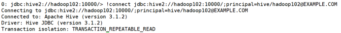

3. 测试查询

## 7.2DataGrip客户端

### 7.2.1 新建Driver

1. 创建Driver

   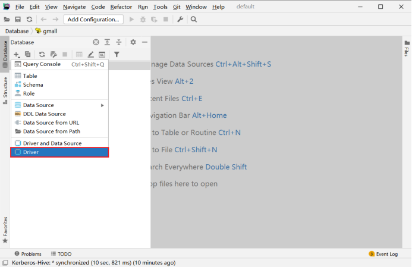

2. 配置Driver

   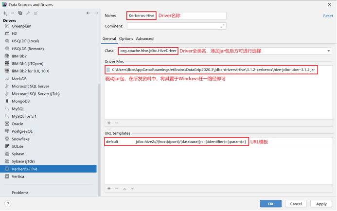

   <span style="color:red;">注：</span>

   url模板：`jdbc:hive2://{host}:{port}/{database}[;<;,{:identifier}={:param}>]`

   

### 7.2.2 新建连接

1. 创建连接

   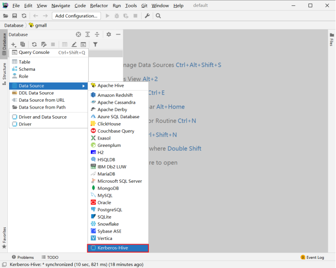

2. 配置连接

   （1）基础配置

   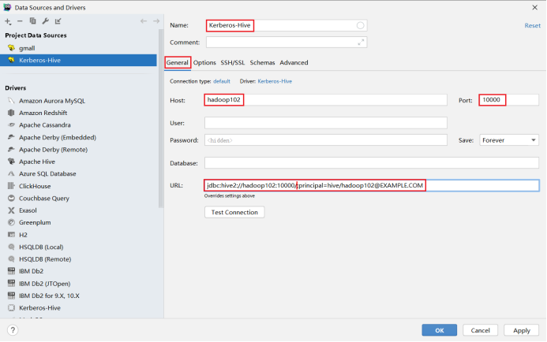

   <span style="color:red;">注：</span>

   url：`jdbc:hive2://hadoop102:10000/;principal=hive/hadoop102@EXAMPLE.COM`

   （2）高级配置

   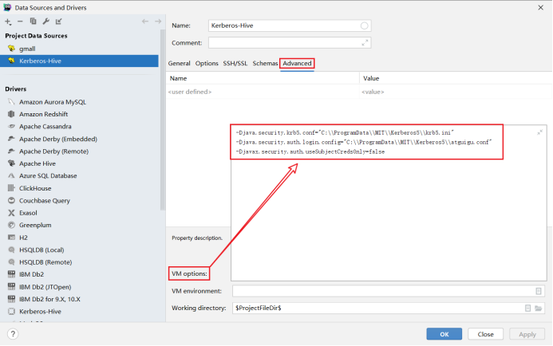

   <span style="color:red;">注：</span>

   配置参数：

   - Djava.security.krb5.conf="C:\\ProgramData\\MIT\\Kerberos5\\krb5.ini"

   -Djava.security.auth.login.config="C:\\ProgramData\\MIT\\Kerberos5\\atguigu.conf"

   -Djavax.security.auth.useSubjectCredsOnly=false

   （3）编写JAAS（Java认证授权服务）配置文件，内容如下，文件名和路径须和上图中java.security.auth.login.config参数的值保持一致。

   ```java
   com.sun.security.jgss.initiate{
         com.sun.security.auth.module.Krb5LoginModule required
         useKeyTab=true
         useTicketCache=false
         keyTab="C:\\ProgramData\\MIT\\Kerberos5\\atguigu.keytab"
         principal="atguigu@EXAMPLE.COM";
   };
   ```

   

   （4）为用户生成keytab文件，在krb5kdc所在节点（hadoop102）执行以下命令

   ```shell
   [root@hadooop102]# kadmin.local -q"xst -norandkey -k /home/atguigu/atguigu.keytab atguigu"
   ```

   

   （5）将上一步生成的atguigu.keytab文件，置于Windows中的特定路径，该路径须与<span style="color:red;">3）</span>中的keyTab属性的值保持一致。

   （6）测试连接

   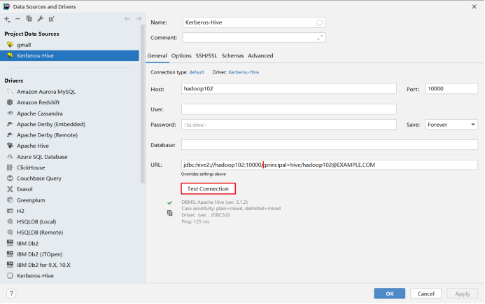