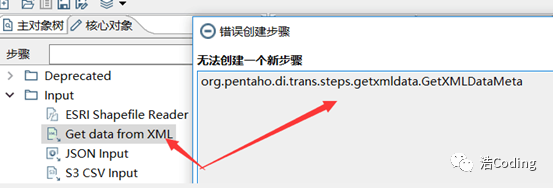

# 1. 前言

Kettle是一款**国外开源**的ETL工具，**纯Java编写**，可以在Window、Linux、Unix上运行，**绿色无需安装**，**数据抽取高效稳定**。Kettle 中文名称叫**水壶**，该项目的主程序员MATT 希望把各种**数据**放到一个壶里，然后以一种**指定的格式**流出。

Kettle这个ETL工具集，它允许你管理来自**不同**[**数据库**](https://cloud.tencent.com/solution/database?from=20065&from_column=20065)**的数据**，通过提供一个**图形化**的用户环境来描述**你想做什么**，**而不是你想怎么做**。

Kettle(现在已经更名为**PDI**，Pentaho Data Integration-Pentaho数据集成)。

Kettle中有两种脚本文件，**transformation**和**job**。

## kettle核心概念

- `transformation`

  **转换**(transaformation)负责数据的输入、转换、校验和输出等工作。Kettle 中使用转换完成数据 ETL 全部工作。转换由**多个Step组成，如文本文件输入，过滤输出行，执行SQL脚本等。各个步骤使用Hop（连接箭头）** 来链接。跳定义了一个数据流通道，即数据由一个步骤流（跳）向下一个步骤。在 Kettle中数据的最小单位是数据**行(row)**,数据流中流动其实是缓存的**行集(RowSet)**

  - **step**，步骤

     **步骤**(控件)是**转换**里的基本的组成部分，快速入「]的案例中就存在两个步骤，**“CSV文件输入”** 和 **“Excel输出”**。 

    一个步骤有如下几个关键特性：

    -  步骤需要有一个名字，这个名字在同一个**转换范围**内**唯一** 
    -  每个步骤都会**读**、**写**数据行(唯一例外是 “生成记录”步骤，该步骤只写数据 
    -  步骤将数据写到与之相连的一个或多个输出**跳(hop)**,再传送到跳的另一端的**步骤**。

    - 大多数的步骤都可以有**多个输出跳**。–个步骤的数据发送可以被设置为**分发**和**复制**， 分发是目标步骤轮流接收记录，复制是所有的记录被同时发送到所有的目标步骤 

    

  - **hop**，跳

     **跳**就是步骤之间带箭头的**连线**，跳定义了步骤之间的**数据通路** 

    

    跳实际上是两个步骤之间的被称之为**行集的数据行缓存**，行集的大小可以在转换的设置里定义。当行集**满**了，向行集写数据的步骤将停止写入，**直到**行集里又有了**空间**。当行集**空**了，从行集读取数据的步骤**停止**读取，**直到**行集里又有可读的数据行

    

- `job`

  **作业**(Job)，负责定义一个完成整个工作流的控制，比如将转换的结果发送邮件给相关人员。因为转换(transformation) 以并行方式执行，所以必须存在一个串行的调度工具来执行转换，这就是Kettle 中的作业。

  - 作业跳

     作业的跳是作业项之间的连接线，他定义了作业的执行路径。作业里每个作业项的不同运行结果决定了做作业的不同执行路径。

    **作业跳一共分为下面三种情况：**

    ①无条件执行：不论上一个作业项执行成功还是失败，下一个作业项都会执行。这是一种蓝色的连接线，上面有一个锁的图标。 

    

     ②当运行结果为真时执行：当上一个作业项的执行结果为真时，执行下一个作业项。通常在需要无错误执行的情况下使用。这是一种绿色的连接线，上面有一个对钩号的图标。 

    

     ③当运行结果为假时执行：当上一个作业项的执行结果为假或者没有成功执行是，执行下一个作业项。这是一种红色的连接线，上面有一个红色的停止图标。 

    

     在图标上单击就可以对跳进行设置。

- 元数据

  每个步骤在输出**数据行**时都有**对字段的描述**，这种描述就是数据行的**元数据**。

  **通常包含下面一些信息**：

  - 名称：数据行里的字段名是唯一的。
  - 数据类型：字段的数据类型。
  - 格式：数据显示的方式，如 Integer 的 #、0.00
  - 长度：字符串的长度或者 BigNumber 类型的长度。
  - 精度：BigNumber数据类型的十进制精度。
  - 货币符号：￥
  - 小数点符号：十进制数据的小数点格式。不同文化背景下小数点符号是不同的，一般是点“.”或 逗号“，”
  - 分组符号：数值类型数据的分组符号，不同文化背景下数字里的分组符号也是不同的，一般是点“.”或逗号“,”或单引号 ’ 

  

- 数据类型

  数据以**数据行**的形式沿着步骤移动。一个数据行是**零到多个字段的集合**，字段包含下面几种数据类型。

  - String:字符类型数据
  - Number：双精度浮点数。
  - Integer：带符号长整型(64位)。
  - BigNumber：任意精度数据。
  - Date：带毫秒精度的日期时间值。
  - Boolean：取值为true和false的布尔值。
  - Binary：二进制字段可以包含图像、声音、视频及其他类型的二进制数据。 

  

- 并行

  跳的这种基王行集缓在的规则允许每个步骤都是由一个**独立的线程运行**，这样并发程度最高。这一规则也允许数据以最小消耗内存的数据流的方式来处理。在数据仓库里，我们经常要处理大量数据，所以这种高并发低消耗的方式也是 ETL 工具的核心需求。

  对于 kettle 的**转换**，不能定义一个执行顺序，因为所有步骤都以**并发**方式执行：当转换启动后,所有步骤都**同时启动**，从它们的输入跳中读取数据，并把处理过的数据写到输出跳，直到输入跳里不再有数据,就中止步骤的运行。当所有的步骤都中止了,整个转换就中止了。

  如果你想要一个**任务**沿着指定的顺序执行，那么就要使用下面所讲的“**作业**”!

- 发

**区别**：

- 作业是步骤流，转换是数据流。这是作业和转换最大的区别。
- 作业的每一个步骤，必须等到前面的步骤都跑完了，后面的步骤才会执行；而转换会一次性把所有控件全部先启动(一个控件对应启动一个线程)，然后数据流会从第一个控件开始，一条记录、一条记录地流向最后的控件;


## 1.1 kettle的特点


## 1.2 kettle的核心组件

参考：[Kettle工具——Spoon、Kitchen、Pan、Carte](https://blog.csdn.net/wzy0623/article/details/106327544)

- `spoon`：通过图形接口，用于编辑作业和转换的桌面应用。
- `pan`：一个独立的命令行程序，用于执行有spoon编辑的转换
- `kitchen`：一个独立的命令行程序，用于执行由spoon编辑的作业
- `carte`：一个轻量级的web容器，用于建立专用、远程的ETL Server。


### 1.2.1 Spoon

​        Spoon是Kettle的**集成开发环境（IDE）**。它基于SWT提供了图形化的用户接口，主要用于ETL的设计。
在Kettle安装目录下，有启动Spoon的脚本。如Windows下的`Spoon.bat`，类UNIX下的`spoon.sh`。Windows用户还可以通过执行`Kettle.exe`启动Spoon。Spoon的屏幕截图如图1.1.1所示。


​																												图 1.2.1

可以清楚地看到Spoon的主窗口：主窗口上方有一个菜单条，下方是一个左右分隔的应用窗口。右方面板里有多个标签面板，每个标签面板都是一个当前打开的转换或作业。左方面板是一个树状结构步骤或作业项视图。

右方的工作区又可以分为上下两个部分：上面的部分是**画布**，可以通过拖拽图标在这里设计作业或转换。图1.2.1的当前选中的画布标签里显示了一个设计好的转换。

设计作业或转换的过程实际就是往画布里添加作业项或转换步骤的图标这么简单，向画布添加图标的方式为，从左侧的树中拖拽。这些作业项和转换步骤通过跳来连接。**跳就是从一个作业项/步骤的中心连接到另一个作业项/步骤的一条线。**在作业里跳定义的是**控制流**，在转换里跳定义的是**数据流**。

工作区左侧的树有“主对象树”和“核心对象”两个标签，主对象树将当前打开的作业或转换里的所有作业项或步骤以树状结构展现。设计者可以在这里快速地找到某个画布上的步骤、跳或数据库连接等资源。核心对象中包含Kettle中所有可用的作业项或步骤，可以在搜索框中输入文本查找名称匹配的作业项或步骤。

 一些调试作业/转换的工具也集成到了Spoon的图形界面里，设计者可以在IDE里直接调试作业/转换。这些调试功能按钮在画布上方的工具栏里。
 工作区下方的面板是运行结果面板，运行结果面板里除了显示运行结果还显示运行时日志和运行监控。

### 1.2.2 `Kitchen`和`Pan`

​    **作业和转换可以在图形界面里执行，但这只是在开发、测试和调试阶段。在开发完成后，需要部署到实际运行环境中，在部署阶段Spoon就很少用到了。**

部署阶段一般需要通过命令行执行，需要把命令行放到Shell脚本中，并定时调度这个脚本。`Kitchen`和`Pan`命令行工具就是用于这个阶段，用于实际的生产环境。

`Kettle`的`Kitche`n和`Pan`工具是Kettle的命令行执行程序。实际上，`Pan`和`Kitchen`只是在Kettle执行引擎上的封装。它们只是解释命令行参数，调用并把这些参数传递给Kettle引擎。

`Kitchen`和`Pan`在概念和用法上都非常相近，这两个命令的参数也基本是一样的。**唯一不同的是Kitchen用于执行作业，Pan用于执行转换。**在使用命令行执行作业或转换时，需要重点考虑网络传输的性能。Kettle数据流将数据作为本地行集缓存。**如果数据源和目标之间需要通过网络传输大量数据，将Kettle部署于源或目标服务器上会极大提升性能。**

**Kitchen和Pan都通过脚本的方式启动**，在Windows系统下，脚本名称是`Kitchen.bat`和`Pan.bat`，在类UNIX系统下，脚本名称是`Kitchen.sh`和`Pan.sh`。在执行这些脚本以及Kettle带的其它脚本时，要把Kettle目录切换为控制台的当前目录。类UNIX系统的脚本默认情况下是不能执行的，必须使用chmod目录使脚本可执行。

**Kettle是用Java语言开发的，因此在使用Kettle命令行时需要注意匹配Java版本**。例如Kettle8.2.0版本需要JDK 1.8的支持。这样就能**在Spoon的图形界面下进行设计开发调试，然后用命令行执行保存的转换或作业（.ktr或.kjb文件）**，秉承Java程序一次编译到处运行的理念。

### 1.2.3 Carte

**Carte服务用于执行一个作业，就想Kitchen一样。但和Kitchen不同的是，Carte是一个服务，一直在后台运行，而Kitchen只是运行一个作业就退出。**

当Carte在运行时，一直在某个端口监听HTTP请求。远程机器客户端给Carte发出一个请求，在请求里包含了作业的定义。当Carte接到了这样的请求后，它验证请求并执行请求里的作业。Carte也支持其它几种类型的请求。这些请求用于获取Carte的执行进度、监控信息等。

Carte是Kettle集群中一个重要的构建快。集群可将单个工作或转换分成几部分，在Carte服务器的多个计算机上并行执行，因此可以分散工作负载。

# 2. 安装kettle

参考自：[大数据ETL开发之图解Kettle工具（入门到精通）](https://cloud.tencent.com/developer/article/2037789)

在实际企业开发中，都是在本地Windows环境下进行 kettle 的 job 和 Transformation 开发的，可以在本地运行，也可以连接远程机器运行

## 2.1 下载kettle

Github源码下载：https://github.com/pentaho/pentaho-kettle


## 2.2 安装kettle

### 2.2.1 安装

1）安装 jdk，版本建议1.8及以上

2）下载kettle压缩包，因kettle为绿色软件，解压缩到任意本地路径即可

3）双击Spoon.bat,启动图形化界面工具，就可以直接使用了

## 2.3 kettle目录介绍


## 2.4 kettle文件介绍


## 2.5 界面介绍

**主界面**


**转换**

核心对象表示转换所支持的所有step。


**作业**


# 3. 配置kettle


# 4. 使用kettle

## 4.1 转换案例

### csv文件转换为excel文件


**1）在 Kettle 中新建一个转换，然后选择转换下面的 “csv文件输入” 和 “excel文件输出” 拖至工作区** 


**2）双击CSV文件输入文件控件，在弹出的设置框里找到对应的csv文件(test.csv).然后点击下面的获取字段按钮，将我需要的字段加载到kettle中** 


 **3）按住键盘 shift 键，并且点击鼠标左键将两个控件链接起来,链接时选择 “主输出步骤”** 


**4）双击Excel输出控件，在弹出的设置框里设置文件输出路径和文件名称，然后点击上的字段框，依次点击下面的获取字段和最小宽度，获取到输出字段** 


**5）点击运行，启动，查看转换好的文件** 


转换成功：


## 4.2 作业案例


# 5. 常见报错

Q. 打开kettle后一闪而过就没了

**问题原因**：

> 可能有如下几种情况：
>
> - **Java环境没配置好**会出现问题
>
> - 可能是**JDK版本太低**了，JDK1.6以上版本才行，具体的可以查看spoon.bat配置文件。
>
>   ```bash
>   REM java version "1.6.0_17"
>   REM Java(TM) SE Runtime Environment (build 1.6.0_17-b04)
>   REM Java HotSpot(TM) 64-Bit Server VM (build 14.3-b01, mixed mode)
>   ```
>
>   
>
> - Java环境配置对了，但是启动不了spoon.bat，也就是双击spoon.bat后一闪就没了的问题。
>
>   报错：error：could not create the java virtual machine；这错误并不是说java虚拟机出了问题，可能是由于kettle启动内存过大，要**修改spoon.bat里内存**配置：
>
>   ```bash
>   if "%PENTAHO_DI_JAVA_OPTIONS%"=="" set PENTAHO_DI_JAVA_OPTIONS="-Xms2058m" "-Xmx1024m" "-XX:MaxPermSize=256m"
>   改为
>   if "%PENTAHO_DI_JAVA_OPTIONS%"=="" set PENTAHO_DI_JAVA_OPTIONS="-Xms512m" "-Xmx512m" "-XX:MaxPermSize=256m"
>   
>   #参数解释：
>   # -Xms512m JVM初始分配的堆内存
>   # -Xmx512m JVM最大允许分配的堆内存，按需分配
>   # -XX:PermSize=64M JVM初始分配的非堆内存
>   # -XX:MaxPermSize=128M JVM最大允许分配的非堆内存，按需分配
>   ```
>
>   修改之后保存，重新启动spoon.bat即可。

**解决方法**：

> None


Q. 连接数据库报错 Driver class 'org.gjt.mm.mysql.Driver' could not be found, make sure the 'MySQL' driver (jar file) i

**问题原因**：

> 缺少MySQL的驱动。
>
> [org.gjt.mm.mysql.Driver与com.mysql.jdbc.Driver区别](https://blog.csdn.net/thomassamul/article/details/82109488)
>
> `org.gjt.mm.mysql.Driver`是早期的驱动名称，后来就改名为`com.mysql.jdbc.Driver`，现在一般都推荐使用`com.mysql.jdbc.Driver`，兼容`org.gjt.mm.mysql.Driver`。
>
> 

**解决方法**：

> 把数据库驱动放到kettle/data-integration/lib目录下，然后重启`spoon`。

Q. kettle无法创建xml相关步骤，有相关步骤的.ktr文件也打不开

**问题原因**：

> 
>
> 可能是因为**路径中包含中文**。

**解决方法**：

> 将整个安装包移动到桌面或其他没有中文字符的路径下，**重启Spoon.bat**即可。

Q. 

# 参考

[Pentaho官网](https://www.hitachivantara.com/)

[Pentaho官方文档](https://help.hitachivantara.com/Documentation/Pentaho/9.5/Products/Pentaho_Data_Integration)

[Kettle(Pentaho Data Integration) 下载安装&使用介绍/功能汇总](https://blog.csdn.net/weixin_43281875/article/details/121161789)

[Kettle工具——Spoon、Kitchen、Pan、Carte](https://blog.csdn.net/wzy0623/article/details/106327544)

[Pentaho Work with Big Data（八）—— kettle集群](https://blog.csdn.net/wzy0623/article/details/51183341)

[大数据ETL开发之图解Kettle工具（入门到精通）](https://cloud.tencent.com/developer/article/2037789)