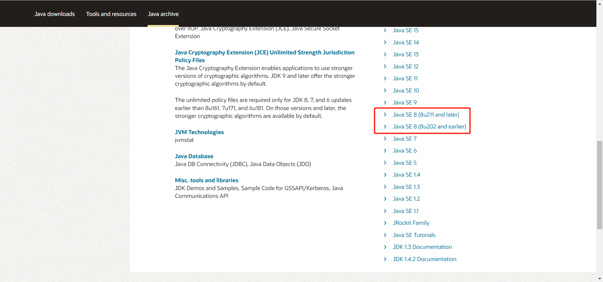

# 1. spark概述

***注意：Spark3.0、Spark3.1是由Scala2.12预编译，但是Spark 3.2+是采用Scala 2.13预编译。***

# 2. 安装spark

## 2.1 Windows10 安装Spark本地开发环境

参考文档：

[Spark在Win10下的环境搭建](https://blog.csdn.net/songhaifengshuaige/article/details/79480491)

[【Spark笔记】Windows10 本地搭建单机版Spark开发环境](https://www.shuzhiduo.com/A/n2d92KLYzD/)

### 2.1.1 **版本说明**

- JDK 1.8
- Scala 2.12.x，具体版本为2.12.17
- Hadoop 3.2.x
- IntelliJ IDEA 2019.3.3 (Ultimate Edition)
- Spark 3.0.2

Spark版本和Hadoop的版本关系并没有明确的限制，但是Spark官方已经预编译好了几个版本的spark包，我们可以直接下载使用，如果预编译好的spark包中没有合适，则需要自己来通过spark的源码进行编译了。

Spark 3.0.2的官方下载地址：https://archive.apache.org/dist/spark/spark-3.0.2/

当下载spark-3.0.2时发现，有如下几种spark包：

- SparkR_3.0.2.tar.gz：[SparkR](http://www.iteblog.com/archives/tag/sparkr)是一个R语言包，它提供了轻量级的方式使得可以在R语言中使用Apache [Spark](http://www.iteblog.com/archives/tag/spark)。包括SparkR 的交互式命令行窗口。
- pyspark-3.0.2.tar.gz：PySpark简单来说就是[Spark](https://so.csdn.net/so/search?q=Spark&spm=1001.2101.3001.7020)提供的Python编程API，包括交互式的PySpark shell和非交互式的Python程序。参考：https://blog.csdn.net/qq_40856560/article/details/116027896
- spark-3.0.2-bin-hadoop2.7-hive1.2.tgz： 预编译好的支持Hadoop 2.7.x，Hive 1.2.x的spark 3.0.2的包
- spark-3.0.2-bin-hadoop2.7.tgz：  预编译好的支持Hadoop 2.7.x 的spark 3.0.2的包
- spark-3.0.2-bin-hadoop3.2.tgz： 预编译好的支持Hadoop 3.2.x 的spark 3.0.2的包
- spark-3.0.2-bin-without-hadoop.tgz：  spark中没有关联Hadoop的包，当运行此版本的spark时，需要用户手动将spark和hadoop关联上，参考：https://blog.csdn.net/yoshubom/article/details/104598483
- spark-3.0.2.tgz：  spark源码包，可以根据需要自己编译出指定Hadoop版本，Hive版本的spark包

### 2.1.2 **环境准备**

#### 2.1.2.1 JDK 安装和配置

##### 2.1.2.1.1 JDK下载

JDK下载地址：https://www.oracle.com/java/technologies/downloads/

目前最新的稳定版为JDK 17

但是，我们要下载JDK8。单击页面中的`Java archive`

单击Java SE 8，进入JDK 8 下载页面。

单击下载[jdk-8u271-windows-x64.exe](https://www.oracle.com/java/technologies/javase/javase8u211-later-archive-downloads.html#license-lightbox)

##### 2.1.2.1.2 JDK安装

双击`jdk-8u271-windows-x64.exe`进行JDK8的安装。

##### 2.1.2.1.3 JDK配置

在系统环境变量中添加`JAVA_HOME`，并将`JAVA_HOME`添加到系统环境变量的Path中。

增加 `JAVA_HOME`：D:\services\Java\jdk1.8.0_261

在`Path`中新增：%JAVA_HOME%\bin和%JAVA_HOME%\jre\bin

`CLASSPATH`中新增：%JAVA_HOME%/lib/dt.jar;%JAVA_HOME%/lib/tools.jar

验证JDK是否安装正确了

说明JDK已经安装好了。

#### 2.1.2.2 Scala 安装和配置

[Scala官网](https://www.scala-lang.org/)

##### 2.1.2.2.1 Scala下载

Scala下载地址：https://www.scala-lang.org/download/all.html

下载scala-2.12.17.zip，，然后在手动配置系统环境变量即可。当然也可以下载scala 2.12.17.msi，然后根据提示进行安装

##### 2.1.2.2.2 Scala安装

解压`scala-2.12.17.zip`到`D:\services\scala-2.12.17`

##### 2.1.2.2.3 Scala配置

在系统环境变量中添加`SCALA_HOME`，并将`SCALA_HOME`添加到系统环境变量的Path中。

**我的电脑 > 属性 > 高级系统配置 > 环境变量**

进入**高级系统设置**

进入**环境变量**

新建`SCALA_HOME`环境变量

将 `SCALA_HOME` 添加到系统环境变量Path中

验证下scala是否安装和配置正确了

上图说明scala安装好了。

#### 2.1.2.3 Hadoop 安装和配置

##### 2.1.2.3.1 Hadoop下载

浏览器打开https://hadoop.apache.org/releases.html 页面，点击图中的连接（https://archive.apache.org/dist/hadoop/common），跳转到历史版本的hadoop的下载页面。

找到hadoop-3.2.2，点击进入。

可以看到，有好几种hadoop的tar包。

- hadoop-3.2.2-rat.txt：
- hadoop-3.2.2-site.tar.gz：
- hadoop-3.2.2-src.tar.gz： 
- hadoop-3.2.2.tar.gz：

这里选择下载hadoop-3.2.2.tar.gz，但是从官网下载十分慢，所以在华为云镜像网站进行下载，网址如下：https://repo.huaweicloud.com/apache/hadoop/core/hadoop-3.2.2/

下载完毕。

##### 2.1.2.3.2 Hadoop安装

解压Hadoop安装包，解压到`D:\services\`

##### 2.1.2.3.3 Hadoop配置

在系统环境变量中添加`HADOOP_HOME`，并将`HADOOP_HOME`添加到系统环境变量的Path中。

**我的电脑 > 属性 > 高级系统配置 > 环境变量**

进入**高级系统设置**

进入**环境变量**

新建`HADOOP_HOME`环境变量

将 `HADOOP_HOME` 添加到系统环境变量Path中

验证Hadoop的环境变量是否配置好了。

执行`hadoop version`命令是正常的。

#### 2.1.2.4 Spark 安装和配置

##### 2.1.2.4.1 Spark下载

[Spark官方网站下载地址](https://spark.apache.org/downloads.html)

*注意：Spark 3是由Scala 2.12构建的，Spark 3.2+是由Scala 2.13构建的，在安装Spark时需要安装对应版本的Scala。*

由于当前Spark最新的稳定版为`spark-3.3.1-bin-hadoop3.tgz`，因此我们需要找到之前版本的spark。

单击`archived releases`中的网址，如下所示：

找到`spark-3.0.2`的目录，进去之后单击下载`spark-3.0.2-bin-hadoop3.2.tgz`。

##### 2.1.2.4.2 Spark安装

解压spark安装包，解压到`D:\services\spark-3.0.2-bin-hadoop3.2`

##### 2.1.2.4.3 Spark配置

在系统环境变量中添加`SPARK_HOME`，并将`SPARK_HOME`添加到系统环境变量的Path中。

**我的电脑 > 属性 > 高级系统配置 > 环境变量**

进入**高级系统设置**

进入**环境变量**

新建`SPARK_HOME`环境变量

将 `SPARK_HOME` 添加到系统环境变量Path中

验证Spark的环境变量是否配置好了。

如果出现如上图的提示HADOOP_HOME没有配置，说明`HADOOP_HOME`的环境变量配置有问题，需要正确配置`HADOOP_HOME`。

正确配置好`HADOOP_HOME`之后，执行`spark-shell`命令。

虽然最终进入到了spark shell中，但是中间报了一个错误，提示找不到`D:\services\hadoop-3.2.2\bin\winutils.exe`文件，通过查看发现确实不存在该文件，此时我们需要从https://github.com/srccodes/hadoop-common-2.2.0-bin/tree/master/bin此处下载`winutils.exe`文件，并保存到本地`D:\services\hadoop-3.2.2\bin\`目录下。然后再次运行`spark-shell`，结果如下：

`spark-shell`启动正常了。

浏览器访问 http://127.0.0.1:4041/jobs 可以打开spark web ui。如下图所示：

Idea Scala插件安装

# 3. spark常用命令

# 4. spark配置

# 5. spark常见问题

# 6

