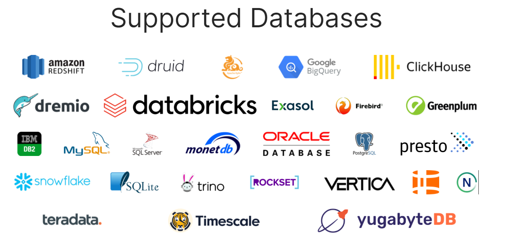

# 1. Superset概述

## 1.1 什么是Superset

Apache Superset是一个现代数据探索和可视化平台。

Apache Superset是一个开源的、现代的、轻量级BI分析工具，能够对接多种数据源、拥有丰富的图标展示形式、支持自定义仪表盘，且拥有友好的用户界面，十分易用。

由于Superset能够对接常用的大数据分析工具，如Trino、Hive、Kylin、Druid等，且支持自定义仪表盘，故可作为数仓的可视化工具，应用于数据仓库的ADS！

截止到2023.05.12，Superset支持如下DB

特性：

- 功能强大，易于使用
- Superset可以通过SQLAlchemy连接到任何基于SQL的数据源，包括PB级的现代云原生数据库和引擎。
- 现代化架构：轻量的、可高度扩展的、
- 丰富的可视化和仪表盘

支持：

- 可视化图表的方式分析数据
- 交互式仪表盘查看数据
- 写SQL查询来数据

## 1.2 Superset的目标

FAQ

- 一次可以join或query多个表吗？

  explore和view不支持多个表，可以是一个table或一个view，SQL lab支持多表join和query。

- 支持的数据源大小？

  Superset是在底层数据或数据引擎之上的thin layer，标准是在用户可接受的时间内完成查询并返回结果。对于分布式数据库而言TB级数据是ok。

- 如何创建可视化图表？

  参考：https://superset.apache.org/docs/contributing/creating-viz-plugins/

- 可以上传CSV并实现可视化吗？

  支持。

- 为什么query显示time out？

  Superset有超时时间的配置。

- 为什么map在geospatial可视化中不可见？

  需要先注册 [Mapbox.com](https://www.mapbox.com/)账户，获取到API key，及相关配置才行。

- 如何限制仪表盘的定时刷新时间间隔？

  dashboard JSON元数据字段中`timed_refresh_immune_slices`可以用来设置哪些slice不用定期自动刷新。

- 如果表的schema发生了变化怎么办？

  要让Superset发现您的新列，您所要做的就是转到“数据”->“数据集”，单击架构已更改的数据集旁边的编辑图标，然后从“列”选项卡中单击“从源同步列”。在场景后面，新列将被合并。

- Superset的后端数据库引擎可以支持哪些？

  Supserset使用的后端数据库是OLTP数据库，用于存储user、slice、dashboard等信息。经过测试的Superset的后端数据库有MySQL、PostgreSQL、SQLite。 Oracle、Microsoft SQL Server及其他OLTP数据库未经过测试。列式存储、非OLTP的数据（像Vertica、Redshift、Presto）这类数据库不能作为Superset的后端数据库，完全不能工作。

  几乎所有具有SqlAlchemy集成的数据库（并未限于OLTP才行）都可以作为Superset的数据源，注意是数据源而不是后端数据库。

- 如何配置OAuth的认证和授权？

- 是否可以强制使用某种配色？

  dashboard的JSON元数据中的`label_colors`配置可以设置label对应的颜色。

- Superset支持[insert database engine here]吗？

  “连接到数据库”部分提供了受支持数据库的最佳概述。该页面上未列出的数据库引擎也可以工作。我们依靠社区为这个知识库做出贡献。

- Superset提供公共的API吗？

  支持。

- 在edit Dataset view中的“小时偏移”是做什么的？

  在edit Dataset view中，可以指定时间偏移量。用于在时间列+或者-去指定的小时数。示例用途：用于将UTC时间转换为当地时间。

## 1.3 Superset支持的框架

## 1.4 Superset的架构

## 1.5 Superset的工作原理

# 2. Superset的安装

## 2.1 环境准备

