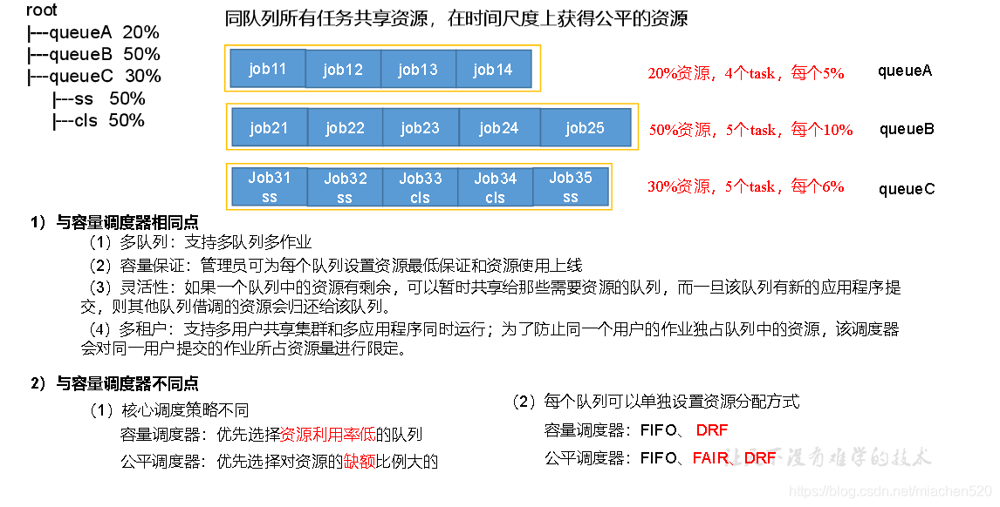

# 前言

YARN的发展阶段

#### 1.0 阶段-1：Ad Hoc集群出现前

> 在少量几个节点上手工建立一个集群，将数据载入HDFS中，通过运行MapReduce任务来计算并获的感兴趣的结果，然后拆掉集群。这一时期，并没有在HDFS中持久化存储数据，因为当时还没有这种迫切需求。

#### 1.1 阶段0：Ad Hoc集群时期

> 在上一个阶段的基础上，实现了持久化的HDFS集群。Yahoo安装并运营了一个共享的HDFS实例，并将一些数据集载入其中，供他人使用。这一时期，支持多用户环境，文件和命名空间配额，以及其他改进多租户操作的特性。

#### 1.2 阶段1：Hadoop on Demand(HOD)

> 在商用硬件的共享集群上提供和管理MapReduce和HDFS实例的系统。HOD使用传统的资源管理器（Torque）和集群调度器（Maui）一起来分配共享节点池上的Hadoop集群。


一个典型的HOD用户会话过程如下：

1. 用户调用HOD Shell，向Torque提交一个适当规模的计算集群描述请求。

2. Torque会让请求排队等待，直到有节点可用。一旦节点可用，Torque在其中一个计算几点上启动名为RingMaster的首进程。

3. RingMaster是一个HOD组件，它通过ResourceManager接口来运行HODRing组件，每个分配的计算节点中都包含HODRing。

4. HODRing初始化之后，会与RingMaster通信以获取Hadoop命令，并遵照执行。一旦Hadoop的守护进程开始启动，HODRing会向RingMaster注册，提供关于守护进程的信息。

5. HOD客户端保持与RingMaster的通信，找出JobTracker和HDFS守护进程所在的位置。

6. 一旦一切就绪，用户知道了JobTracker和HDFS的位置，HOD会退出并允许用户在相应的集群上执行他的数据运算。

7. 当运行完数据运算作用后，用户即可释放集群。

   

优点是：

1. 可维持性好；

2. 日志管理功能；

3. 多用户和单用户多集群功能；

4. 配置机制方便；

5. 空闲集群的自动释放。

   

缺点是：

1. 没有考虑到数据本地化，即不支持位置感知（将计算移动到数据所在的位置）；
2. 集群使用率不高。

#### 1.3 阶段2：共享计算集群的黎明

属于Apache Hadoop 1.x。此阶段为共享MapReduce集群阶段。

> 由于HOD架构掌握的信息太少，无法对分配作出智能决策。它的资源粒度太粗糙等缺点。因此发展为包含共享HDFS实例的MapReduce集群模型。
>
> JobTraker：一个中央守护进程，负责运行集群上的所有作业。
>
> TaskTracker：系统里的从进程，根据JobTracker的指令来执行任务。

优点是：

1. 中央JobTracker守护进程
2. JobTracker内存管理
3. 已完成作业的管理
4. 中心调度器
5. 恢复和升级
6. 单个节点上的隔离
7. 安全性
8. 身份认证和访问控制
9. 各种集群管理功能

缺点是：

1. 扩展性瓶颈
2. 可靠性和可用性不足
3. 对编程模型多样性的支持，仅支持MapReduce，难以扩展到其他编程模型。
4. 用户日志管理
5. 敏捷性不够好

#### 1.4 阶段3：YARN的出现

> 前一个阶段的JobTracker扩展性不好，需要重写，以及其他不足之处，促使YARN的诞生。
>
> YARN的全称是Yet Another Resource Negotiator
>
> 优点是：
>
> 1. 可扩展性
>
> 2. 可维持性
>
> 3. 多租户
>
> 4. 位置感知
>
> 5. 集群使用率高
>
> 6. 安全和可审计的操作
>
> 7. 可靠性和可用性
>
> 8. 对编程模型多样性的支持
>
> 9. 灵活的资源模型
>
> 10. 向后兼容
>
>     

YARN的工作流程大约如下：


可以认为是，将调度和资源管理从第1版中的MapReduce中分离出来了，成为了YARN。


# 安装

分为单机部署、伪分布式部署、和分布式部署。

# 核心组件和概念

YARN的工作流程图如下：


## ResourceManager

ResourceManager，主要职责是调度，即它在竞争的应用程序之间分配系统中的可用资源，但不关注每个应用程序的状态管理（有AppolicationMaster负责）。为了适应不同的策略，RM有一个可插拔的调度器来应用不同的算法，Hadoop 2.x中支持3中调度器：`FIFO`、`Capacity`、`Fair`。

## NodeManager

管理Hadoop集群中独立的计算节点，负责管理和监控节点和Container。职责包括：

1. 与ResourceManager保持通信
2. 管理Container的生命周期，监控每个Container的资源使用（内存，CPU）情况
3. 跟踪节点健康状况等。
4. 负责资源本地化，即负责安全地下载和组织Contianer所需的各种文件资源，它会尽可能地将文件分散到各个可用磁盘上。有3种类型的本地化：PUBLIC资源的本地化、PRIVATE/APPLICATION资源的本地化

本地化的过程如下图所示：


## ApplicationMaster

ApplicationMaster，一个应用会启动一个ApplicationMaster（通常称之为Container0），它的职责是与ResourceManager协商资源（Container），并好NodeManager协同工作来执行和监控任务。

## Contianer

Contianer，是对资源的抽象，是单个节点上如RAM、CPU核和磁盘等物理资源的集合。单个节点上可以有多个Container。可以修改Container的内存、CPU大小。每个节点可以看做由多个Container构成。

Container代表了集群中单个节点上的一组资源（内存，CPU），由NodeManager监控，由ResourceManager调度。在运行过程中可以动态的请求或释放Container。

资源模型，一个应用可以通过ApplicationMaster请求非常具体的资源，如：

```shell
1. 资源名称
2. 内存量
3. CPU（核数/类型）
4. 其他资源，如`disk/network I/O`、GPU等
```

## Scheduler

Scheduler，可插拔的调度器组件，支持FIFO（先入先出），Capacity和Fair。

1. FIFO调度器，即”先来先服务“，不考虑作业的优先级和范围。适合低负载集群，不适合大型的共享集群。

2. Capacity调度器，容量调度，配置一个或多个队列，保证每个队列的最小资源使用值。通过ACL（访问控制列表）用来控制哪些用户可以向各个队列提交作业。多余的容量会优先分配给那些最饥饿的（最满的）队列。在每个队列内部使用层次化的FIFO来调度多个应用程序。

3. Fair调度器，公平调度，将资源公平的分配给应用，使得所有应用在平均情况下随着时间得到相等份额的资源。[什么是公平调度器（Fair Scheduler）？](https://blog.csdn.net/miachen520/article/details/116559553)

   

   

**FIFO、Capacity、Fair调度器对比**

[Hadoop的三种调度器](https://www.cnblogs.com/zhipeng-wang/p/14480138.html)


- FIFO：在FIFO 调度器中，只根据应用入队的先后顺序来分配资源。就像上厕所排队一样。

  

  ​																			图片来自互联网

  - 优点：简单
  - 缺点：大的应用可能会占用所有集群资源，小应用就会被大应用阻塞。

- Capacity：各自使用自己的队列，队列有资源配置限制。就像男女厕所排队一样，男厕位置很空，女厕爆满，但是无法利用男厕的资源。

  

  ​																			图片来自互联网

  - 优点：实现了资源的隔离，避免不同队列中的应用相互影响。
  - 缺点：queue1没有应用，queue2应用超多资源已经跑满了，但是queue2中排队的应用是不能够使用queue1中的空闲资源的。资源存在浪费的情况。

- Fair：弹性队列，可占用一部分其他队列的资源。

  

  ​															图片来自互联网

  - 优点：
    - Fair Scheduler队列内部支持多种调度策略，包括FIFO、Fair（队列中的N个作业，每个获得该队列1 / N的资源）、DRF（Dominant Resource Fairness）（多种资源类型e.g. CPU，内存 的公平资源分配策略）
    - 支持资源抢占，可以有效地利用集群中的资源，
    - air Scheduler支持资源抢占。当队列中有新的应用提交时，系统调度器理应为它回收资源，但是考虑到共享的资源正在进行计算，所以调度器采用先等待再强制回收的策略，即等待一段时间后如果仍没有获得资源，那么从使用共享资源的队列中杀死一部分任务，通过yarn.scheduler.fair.preemption设置为true，开启抢占功能。
    - Fair Scheduler可以为每个队列单独设置调度策略（FIFO Fair DRF）
  - 缺点：相对来说比capacity复杂


## YARN架构

Hadoop 1和Hadoop2架构对比


YARN的架构图如下：


## 工作流程

工作流程在上面也提到过多次，大致如下图所示：


1. 客户端提交application请求
2. 应答带回ApplicationID
3. Application Submission Context包含ApplicationID，用户名，队列名等，及Container Launched Context中的资源请求，作业文件，安全令牌等。
4. 启动应用对应的ApplicationMaster，并向ResourceManager发送注册请求
5. 资源容量请求
6. ApplicationMaster向ResourceManager请求Container
7. ResourceManager分配Container给ApplicationMaster
8. ApplicationMaster传递Container给NM来启动Container
9. ApplicationMaster请求Container的状态，Container响应状态信息给ApplicationMaster

YARN作业的运行图，如下所示：


[Hadoop yarn工作流程详解](https://www.cnblogs.com/Transkai/p/10549923.html)


# 参考资料

[1] 《Hadoop-YARN权威指南》

yarn.nodemanager.vmem-pmem-ratio [虚拟内存](https://so.csdn.net/so/search?q=虚拟内存&spm=1001.2101.3001.7020)率，Container 的虚拟内存大小的限制，每使用1MB物理内存，最多可用的虚拟内存数


# YARN


## YARN架构

YARN的基本思想是将资源管理和作业调度/监控独立开来。

- `ResourceManager（RM）`负责全局资源管理，application之间的资源仲裁。
- `NodeManager（NM）`负责监控每个节点上的container资源情况（CPU、memory、disk、network）
- `ApplicationMaster（AM）`负责作业的调度和监控。
- `Container` YARN中对资源的抽象，通常是CPU、memory。

YARN中的一个application可以是一个job，也可以是一组job的DAG。

RM和NM构成了数据计算框架。RM在所有的application之间进行资源仲裁；NM负责容器的资源监控（CPU、memory、disk、network），并信息报告给RM/Scheduler。


RM有两个主要的组件：

- `Scheduler`

  Scheduler是一个可插拔的调度策略，负责在多个queue中进行资源的分配。负责根据容量、queue的限制将资源分配给正在运行的application。

  Scheduler只是资源调度器，它不负责跟踪监控application的状态。它不保证TODO负责重启因application失败或硬件故障导致失败的task。

  常用的Scheduler有3中：`FIFO`, `Capacity Scheduler`, `Fair Scheduler`。

- `ApplicationManager`

  ApplicationManager负责接收作业提交，协调第一个container以运行AM，并且当AM失败时进行重启。

  AM负责向Scheduler协调合适的资源（即container）给application，跟踪application的状态，并监控application的进展。

YARN通过`ReservationSystem`实现了 **resource reservation**（资源预留）。`ReservationSystem`允许用户随时间变化来指定资源配置和时间限制（如deadline），预留资源以确保重要job的推测执行。`ReservationSystem`随时间跟踪资源，动态指示底层的Scheduler以满足资源预留的要求。

YARN还支持联邦，可以将多个独立的YARN子集群联合在一起。

## 容量调度器（capacity scheduler）

CapacityScheduler是一个**可插拔**的scheduler，它允许**多租户**、**安全**地**共享**Hadoop集群。在一定capacity限制下为他们的application分配资源，用以运行这些application。

CapacityScheduler的目的是最大化集群的吞吐量和资源利用率。

如果每个组织搞自己的专用计算集群，那么需要管理多套独立集群，且集群的资源利用率低。因此更好的方式是在多个组织之间共享一个大的集群，能够降低成本、运维成本、获得更好的资源利用率。

CapacityScheduler的核心思想：可用资源在多个组织之间共享。

有机制限制单个application、单个user、单个queue不会消耗集群过多的资源；

限制user可运行的作业个数，防止queue被一个user的application占满。

CapacityScheduler最主要的抽象就是queue。

CapacityScheduler的特性：

- 层级队列

  在子队列之间共享资源

- 容量保证

  每个队列都被分配了一定的资源，管理云可以对分配的每个队列的资源进行软限制和硬限制。

  提交到队列的application可以使用该queue的资源。

- 安全性

  每个queue都有严格的ACL，可以控制哪些user能够提交application到queue。还确保user无法查看/修改其他user提交的的application。

- 弹性

  可以将空闲资源可以分配给其他使用的资源已超出其容量的任何队列。

- 多租户

  限制单个application、单个user、单个queue占用集群太多资源，避免集群不堪重负。

- 可操作性

  - 在运行时，可以动态地修改queue的配置，如capacity、ACLs等。可以在运行时添加queue，只有当queue是`STOPPED`状态且没有pending/running的applicaion，才可在运行时删除queue。
  - 在运行时，管理员可以stop一个queue，这会保证完成此queue中已经存在的appliation，而不再接受新提交的application。如果queue是`STOPPED`状态，则新的application无法提交到此队列，或此队列的子队列。管理员可以重新启动`STOPPED`的queue。

- 基于资源调度

  支持资源密集型application。提交application时，可以指定其资源需求，从而适应不同的applicatoin。而不是所有的application都分配相同的资源。

- Queue Mapping Interface based on Default or User Defined Placement Rules 

  此特性允许基于某些放置规则（如：用户名、组名、application name），将用户的job映射到指定的queue。

- 优先级调度

  允许提交和调度不同优先级的application。值越大，优先级越高。目前仅FIFO ordering policy支持application优先级。

- 绝对资源配置

  管理云可以为queue指定绝对资源，而不是设置基于百分比的值。

- 动态创建/管理叶子队列

  此功能和queue-mapping一起使用，可以自动创建叶子队列。

### 配置

#### 配置RM以使用CapacityScheduler

`yarn-site.xml`

```xml
<configuration>
  <!-- 配置RM使用capacityScheduler -->
  <property>
    <name>yarn.resourcemanager.scheduler.class</name>
    <value>org.apache.hadoop.yarn.server.resourcemanager.scheduler.capacity.CapacityScheduler</value>
  </property>
</configuration>
```

#### 配置队列

CapacityScheduler使用`${HADOOP_HOME}/etc/hadoop/capacity-site.xml`作为配置文件。CapacityScheduler有一个名为`root`的预定义好的队列，它是所有队列的的根队列。

```bash
yarn.scheduler.capacity.<queue-path>.queues					# 某队列的子队列的列表
# 1. 资源分配
yarn.scheduler.capacity.<queue-path>.capacity				# 队列占父队列的资源的百分比，或者是队列的绝对资源最小容量（格式[memory=10240,vcores=12]）。
																										# 同一级别的队列资源之后必须=100%。如果是配置的绝对资源，则同一级别队列资源之和可以小于父队列的绝对资源。
yarn.scheduler.capacity.<queue-path>.maximum-capacity	# 队列占父队列的资源的百分比，或是队列的绝对资源的最大容量（格式[memory=10240,vcores=12]）。
																											#百分比在0-100之间，-1表示100。每个队列的绝对最大容量>=绝对容量。
yarn.scheduler.capacity.<queue-path>.minimum-user-limit-percent	# 默认100。表示此queue对user资源无限制。
			# 每个queue对分配给每个user的资源有限制。最小值为此配置项的值，最大值依赖于当前队列中有多少个user提交了application
				# 例如，此值为25，queue有一个user时，可以使用queue所有的资源
				# queue有2个user时，每个用户在此queue的资源上线是50%
				# queue有3个user时，每个用户在此queue的资源上线是33%
				# queue有4个user时，每个用户在此queue的资源上线是25%
				# queue有5个user时，最后一个用户提交的application会pending，分配不到资源。
yarn.scheduler.capacity.<queue-path>.user-limit-factor	# 默认1，表示无论如何，单个用户都不会占用超过队列容量的资源。
# 允许单个用户获取的资源为队列容量的倍数。
yarn.scheduler.capacity.<queue-path>.maximum-allocation-mb	# RM分配给此队列的容器的最大内存。此设置会覆盖集群的yarn.scheduler.maximum-allocation-mb。此值必须小于等于yarn.scheduler.maximum-allocation-mb
yarn.scheduler.capacity.<queue-path>.maximum-allocation-vcores	# RM分配给此队列的容器的最大vcore。此设置会覆盖集群的yarn.scheduler.maximum-allocation-vcore。此值必须小于等于yarn.scheduler.maximum-allocation-vcore
yarn.scheduler.capacity.<queue-path>.user-settings.<user-name>.weight	# 每个用户在此队列中可使用的资源的权重。例如，如果用户A在队列中接收的资源比用户B和C多50%，则用户A的此属性将设置为1.5。用户B和C将默认为1.0。

# 2. pending/running的application数量限制。活跃状态=pending+running
yarn.scheduler.capacity.maximum-applications		# 默认10000。集群中每个队列最多同时处于活跃状态的application数量，硬限制，达到此限制时直接拒绝提交新application的请求。
yarn.scheduler.capacity.<queue-path>.maximum-applications	# 指定队列的最多同时处于活跃状态的application数量，硬限制。
yarn.scheduler.capacity.maximum-am-resource-percent	# 默认0.1。在集群的每个队列中可以被用来运行AM的资源的最大值。
yarn.scheduler.capacity.<queue-path>.maximum-am-resource-percent	# 指定队列中可以被用来运行AM的资源的最大值。

yarn.scheduler.capacity.max-parallel-apps			# 默认无限制。为集群中的每个队列设置同时运行的application的最大数量。
																							# 与yarn.scheduler.capacity.maximum-applications的不同之处为，达到此配置限制时，
																							# 并不会拒绝提交的新的application，而是将其状态置为`ACCEPTED`，直到有资格运行此application。
yarn.scheduler.capacity.<queue-path>.max-parallel-apps	# 为指定队列设置可以同时运行的application的最大数量。

yarn.scheduler.capacity.user.max-parallel-apps	# 默认不限制。每个用户在同一时刻最多可运行多少个application。
yarn.scheduler.capacity.user.<username>.max-parallel-apps		# 指定用户在同一时刻最多可运行多少个application。
```

上述这几种限制的优先级：

- `maximun-applications`检查，如果超过此限制，直接拒绝新提交的application
- `maximun-parallel-apps`检查，如果超过此限制，接受新提交的application，但是状态为`ACCEPTED`，直到满足queue/user限制条件，才会运行，`RUNNING`。
- `maximun-am-resource-percent`检查，如果超过此限制，接受新提交的application，但是状态为`ACCEPTED`，直到有足够的资源运行AM。

**队列管理和权限**

```bash
yarn.scheduler.capacity.<queue-path>.state		# 指定队列的状态，可是是RUNNING或STOPPED。若为STOPPED，新application不能被提交到此队列和子队列。队列中已存在的application仍会继续完成。
# 如果root队列的状态为STOPPED，则整个集群都不能提交新的application。
yarn.scheduler.capacity.root.<queue-path>.acl_submit_applications	# 默认*。此ACL用于控制谁能提交application到指定队列。如果用户/组在该队列或其父队列有ACL权限，则可以提交application到此队列。格式user1 group1,group2,user3
																																	# 如果未指定，则此属性的ACL将从父队列继承。如果此列表中的用户名前面加了波浪号（~），则真实用户的ACL将允许代理用户提交到队列。
yarn.scheduler.capacity.root.<queue-path>.acl_administer_queue	# 默认*。此ACL用于控制谁能管理此队列里的application。如果用户/组在该队列或其父队列有ACL权限，则可以管理此队列的application。
																																# 如果未指定，则此属性的ACL从父队列集成。如果此列表中的用户名前面加了波浪号（~），则真实用户的ACL将允许代理用户提交到队列。
```

**基于user/group，application name的队列映射**

```bash
yarn.scheduler.capacity.queue-mappings	# 根据user/group来映射queue。语法[u or g]:[name]:[queue_name][,下一条映射]*。u表示用户，g表示group。name表示用户名或组名。
																			# %user表示指定提交application的user作为name。要指定和用户名相同的队列，则queue_name可以写为%user。queue_name可以写为%primary_group，表示为第一个组的名字。
yarn.scheduler.queue-placement-rules.app-name	# 根据application name映射queue。语法[app_name]:[queue_name][,下一跳映射]*。%application表示指定当前application的名字作为app_name
yarn.scheduler.capacity.queue-mappings-override.enable	# 默认false。按规则映射的队列是否能够覆盖用户指定的队列。
```

**队列映射的配置示例**

```xml
 <property>
    <name>yarn.scheduler.capacity.queue-mappings</name>
    <value>u:%user:%primary_group.%user</value>
    <description>Maps users to queue with the same name as user but
    parent queue name should be same as primary group of the user</description>
 </property>
 ...
 <property>
    <name>yarn.scheduler.capacity.queue-mappings</name>
    <value>u:%user:%secondary_group.%user</value>
    <description>Maps users to queue with the same name as user but
    parent queue name should be same as any secondary group of the user</description>
 </property>
 ...
 <property>
    <name>yarn.scheduler.capacity.queue-mappings</name>
    <value>u:%user:%user</value>
    <description>Maps users to queues with the same name as user</description>
 </property>
 ...
 <property>
    <name>yarn.scheduler.capacity.queue-mappings</name>
    <value>u:user2:%primary_group</value>
    <description>user2 is mapped to queue name same as primary group</description>
 </property>
 ...
 <property>
    <name>yarn.scheduler.capacity.queue-mappings</name>
    <value>u:user3:%secondary_group</value>
    <description>user3 is mapped to queue name same as secondary group</description>
 </property>
 ...
 <property>
    <name>yarn.scheduler.capacity.queue-mappings</name>
    <value>u:user1:queue1</value>
    <description>user1 is mapped to queue1</description>
 </property>
 ...
 <property>
    <name>yarn.scheduler.capacity.queue-mappings</name>
    <value>g:group1:queue2</value>
    <description>group1 is mapped to queue2</description>
 </property>
 ...
 <property>
    <name>yarn.scheduler.capacity.queue-mappings</name>
    <value>u:user1:queue1,u:user2:queue2</value>
    <description>Here, <user1> is mapped to <queue1>, <user2> is mapped to <queue2> respectively</description>
 </property>

  <property>
    <name>yarn.scheduler.queue-placement-rules.app-name</name>
    <value>appName1:queue1,%application:%application</value>
    <description>
      Here, <appName1> is mapped to <queue1>, maps applications to queues with
      the same name as application respectively. The mappings will be
      evaluated from left to right, and the first valid mapping will be used.
    </description>
  </property>
```

**队列中application的生命周期**

```bash
yarn.scheduler.capacity.<queue-path>.maximum-application-lifetime	# 默认-1，表示继承父队列的此配置的值。若为0表示无最大生存时间且不继承父队列的此配置。提交到队列的application的最大生存时间。超过此时间后，此application会被kill。单位秒。
yarn.scheduler.capacity.root.<queue-path>.default-application-lifetime	# 单位秒。默认lifetime必须<=maximum lifetime。
```

**设置application优先级**

application优先级只支持FIFO排序策略，此为默认的排序策略。

application有两种优先级：

- `集群级别的优先级`

  如果application在提交时指定了优先级，且此优先级大于cluster-max priority，则application的优先级被重置为cluster-max priority。

  `yarn-site.xml`中的`yarn.cluster.max-application-priority`用来设置cluster-max priority对，表示在集群中application的最大优先级是多少。

- `队列级别的优先级`

  管理员可以为每个叶子队列设置application默认的优先级。如果application在提交时没有指定优先级，则会使用叶子队列的优先级作为application的优先级。

  `capacity-scheduler.xml`中的`yarn.scheduler.capacity.root.<leaf-queue-path>.default-application-priority`用来设置叶子队列中application的默认优先级。

*注意：当将一个application移动到其他队列时，此application的优先级不会发生变化，如不会变为新队列的默认优先级。*

**Capacity Scheduler支持容器抢占**

CapacityScheduler支持从资源使用量超过其保证容量的队列中抢占容器。为了支持应用程序容器的抢占，需要在yarn-site.xml中启用以下配置参数。

`yarn-site.xml`

```bash
yarn.resourcemanager.scheduler.monitor.enable	# 默认false。是否启用调度监视器。
yarn.resourcemanager.scheduler.monitor.policies	# 默认org.apache.hadoop.yarn.server.resourcemanager.monitor.capacity.ProportionalCapacityPreemptionPolicy。与scheduler交互的SchedulelingEditPolicy类的列表

yarn.resourcemanager.monitor.capacity.preemption.observe_only	# 如果为 true，则运行策略，但不影响具有抢占功能的集群和终止事件。默认值为 false。
yarn.resourcemanager.monitor.capacity.preemption.monitoring_interval	# 调用此策略的间隔时间（以毫秒为单位）。默认值为 3000。
yarn.resourcemanager.monitor.capacity.preemption.max_wait_before_kill	# 从应用程序请求抢占到终止容器之间的时间（以毫秒为单位）。默认值为 15000。
yarn.resourcemanager.monitor.capacity.preemption.total_preemption_per_round	# 单轮抢占资源的最大百分比。通过控制这个值，可以限制从集群中回收容器的速度。默认值为 0.1。
yarn.resourcemanager.monitor.capacity.preemption.max_ignored_over_capacity	# 默认0.1
yarn.resourcemanager.monitor.capacity.preemption.natural_termination_factor	# 默认0.2
```

对提交到指定队列的application的容器的抢占配置。`capacity-site.xml`

```bash
yarn.scheduler.capacity.<queue-path>.disable_preemption	# 默认false，未配置时继承父队列的此配置。true表示，禁用在指定队列中的application的容器的抢占。
yarn.scheduler.capacity.<queue-path>.intra-queue-preemption.disable_preemption	# 默认false，未配置时继承父队列的此配置。true 表示禁用提交给给定队列的应用程序容器的队列内抢占。
```

**ReservationSystem（预定系统）**

CapacityScheduler支持ReservationSystem，它允许用户提前预定资源。应用程序可以通过在提交时指定 `reservationId` 实现在运行时请求预订资源。

CapacityScheduler 支持以下参数来控制reservation的创建、删除、更新。

```bash
yarn.scheduler.capacity.root.<queue>.acl_administer_reservations	# 控制谁可以管理给定队列的预订的 ACL。如果未指定，此属性的 ACL 不会从父队列继承。
yarn.scheduler.capacity.root.<queue>.acl_list_reservations	# 控制谁可以列出给定队列的预订的 ACL。如果未指定，则此属性的 ACL 不会从父队列继承。
yarn.scheduler.capacity.root.<queue>.acl_submit_reservations	# 控制谁可以向给定队列提交预订的 ACL。如果未指定，则此属性的 ACL 不会从父队列继承。
```

`yarn-site.xml`

```bash
yarn.resourcemanager.reservation-system.enable	# 默认false。在RM中是否启用ReservationSystem。
yarn.resourcemanager.reservation-system.class	# 可选参数，ReservationSystem 的类名。默认值是根据配置的调度器选择的，如果配置了 CapacityScheduler，则此项为 CapacityReservationSystem。
yarn.resourcemanager.reservation-system.plan.follower	# 可选参数，在定时器上运行的 PlanFollower 的类名，将 CapacityScheduler 与 Plan 之间互相同步。默认值是根据配置的调度器选择的，如果配置了 CapacityScheduler，则此项为 CapacitySchedulerPlanFollower。
yarn.resourcemanager.reservation-system.planfollower.time-step	# 可选参数，PlanFollower 计时器的频率（以毫秒为单位），默认值为 1000。 
```


```bash
yarn.scheduler.capacity.<queue-path>.reservable	#Mandatory parameter: indicates to the ReservationSystem that the queue’s resources is available for users to reserve. Boolean value expected. The default value is false, i.e. reservations are not enabled in LeafQueues by default.
yarn.scheduler.capacity.<queue-path>.reservation-agent	#Optional parameter: the class name that will be used to determine the implementation of the ReservationAgent which will attempt to place the user’s reservation request in the Plan. The default value is org.apache.hadoop.yarn.server.resourcemanager.reservation.planning.AlignedPlannerWithGreedy.
yarn.scheduler.capacity.<queue-path>.reservation-move-on-expiry	#Optional parameter to specify to the ReservationSystem whether the applications should be moved or killed to the parent reservable queue (configured above) when the associated reservation expires. Boolean value expected. The default value is true indicating that the application will be moved to the reservable queue.
yarn.scheduler.capacity.<queue-path>.show-reservations-as-queues	#Optional parameter to show or hide the reservation queues in the Scheduler UI. Boolean value expected. The default value is false, i.e. reservation queues will be hidden.
yarn.scheduler.capacity.<queue-path>.reservation-policy	#Optional parameter: the class name that will be used to determine the implementation of the SharingPolicy which will validate if the new reservation doesn’t violate any invariants.. The default value is org.apache.hadoop.yarn.server.resourcemanager.reservation.CapacityOverTimePolicy.
yarn.scheduler.capacity.<queue-path>.reservation-window	#Optional parameter representing the time in milliseconds for which the SharingPolicy will validate if the constraints in the Plan are satisfied. Long value expected. The default value is one day.
yarn.scheduler.capacity.<queue-path>.instantaneous-max-capacity	#Optional parameter: maximum capacity at any time in percentage (%) as a float that the SharingPolicy allows a single user to reserve. The default value is 1, i.e. 100%.
yarn.scheduler.capacity.<queue-path>.average-capacity	#Optional parameter: the average allowed capacity which will aggregated over the ReservationWindow in percentage (%) as a float that the SharingPolicy allows a single user to reserve. The default value is 1, i.e. 100%.
yarn.scheduler.capacity.<queue-path>.reservation-planner	#Optional parameter: the class name that will be used to determine the implementation of the Planner which will be invoked if the Plan capacity fall below (due to scheduled maintenance or node failures) the user reserved resources. The default value is org.apache.hadoop.yarn.server.resourcemanager.reservation.planning.SimpleCapacityReplanner which scans the Plan and greedily removes reservations in reversed order of acceptance (LIFO) till the reserved resources are within the Plan capacity
yarn.scheduler.capacity.<queue-path>.reservation-enforcement-window	#Optional parameter representing the time in milliseconds for which the Planner will validate if the constraints in the Plan are satisfied. Long value expected. The default value is one hour.

yarn.resourcemanager.monitor.capacity.queue-management.monitoring-interval

```

**子队列的动态自动创建和管理**

CapacityScheduler 支持在启用此功能的父队列下自动创建叶子队列。

`yarn.scheduler.capacity.queue-mappings` 中列出的用户组队列映射需要指定一个额外的父队列参数来标识需要在哪个父队列下自动创建子队列。 请注意，此类父队列还需要启用子队列的自动创建。举例如下：

```xml
<property>
  <name>yarn.scheduler.capacity.queue-mappings</name>
  <value>u:user1:queue1,g:group1:queue2,u:user2:%primary_group,u:%user:parent1.%user</value>
  <description>
    在这里，u:%user:parent1.%user 允许除了 user1，user2 之外的用户映射到与
    它们名字相同的特定子队列，这些子队列在 parent1 之下，并将会自动创建。
  </description>
</property>
```

为父队列配置以实现自动创建叶子队列

```bash
yarn.scheduler.capacity.<queue-path>.auto-create-child-queue.enabled	# 默认false。必填参数，告诉CapacityScheduler需要为指定的父队列启用自动创建子队列。
yarn.scheduler.capacity.<queue-path>.auto-create-child-queue.management-policy	# 默认。可选参数。用于确定 AutoCreatedQueueManagementPolicy 的实现的类名，该类名将动态管理子队列及其容量。默认值为 org.apache.hadoop.yarn.server.resourcemanager.scheduler.capacity.queuemanagement.GuaranteedOrZeroCapacityOverTimePolicy。

yarn.scheduler.capacity.<queue-path>.leaf-queue-template.capacity	# 必填参数。指定自动创建子队列的最小保证容量。当前自动创建的子队列不支持绝对资源配置
yarn.scheduler.capacity.<queue-path>.leaf-queue-template.<leaf-queue-property>	# 可选参数。可以在自动创建的子队列上配置的其他队列参数，如 maximum-capacity、user-limit-factor 等。
```

配置示例：

```xml
 <property>
   <name>yarn.scheduler.capacity.root.parent1.auto-create-child-queue.enabled</name>
   <value>true</value>
 </property>
 <property>
    <name>yarn.scheduler.capacity.root.parent1.leaf-queue-template.capacity</name>
    <value>5</value>
 </property>
 <property>
    <name>yarn.scheduler.capacity.root.parent1.leaf-queue-template.maximum-capacity</name>
    <value>100</value>
 </property>
 <property>
    <name>yarn.scheduler.capacity.root.parent1.leaf-queue-template.user-limit-factor</name>
    <value>3.0</value>
 </property>
 <property>
    <name>yarn.scheduler.capacity.root.parent1.leaf-queue-template.ordering-policy</name>
    <value>fair</value>
 </property>
 <property>
    <name>yarn.scheduler.capacity.root.parent1.GPU.capacity</name>
    <value>50</value>
 </property>
 <property>
     <name>yarn.scheduler.capacity.root.parent1.accessible-node-labels</name>
     <value>GPU,SSD</value>
   </property>
 <property>
     <name>yarn.scheduler.capacity.root.parent1.leaf-queue-template.accessible-node-labels</name>
     <value>GPU</value>
  </property>
 <property>
    <name>yarn.scheduler.capacity.root.parent1.leaf-queue-template.accessible-node-labels.GPU.capacity</name>
    <value>5</value>
 </property>
```

**其他配置**


- 资源计算器 (Resource Calculator)

  `yarn.scheduler.capacity.resource-calculator`: ResourceCalculator 实现，用于比较调度器中的资源。 默认的 `org.apache.hadoop.yarn.util.resource.DefaultResourceCalculator` 仅使用内存，而 `DominantResourceCalculator` 则从多个维度比较主导资源，如内存、CPU 等。

- Data Locality

  CapacityScheduler 利用延迟调度（Dalay Scheduling）来满足任务局部性约束。局部性约束有 3 个级别：节点本地（node-local）、机架本地（rack-local）和关闭开关（off-switch）。当不能满足局部性时，调度器会计算错过的调度机会数量，并等待该计数达到阈值，然后再将局部性约束放宽到下一个级别。可以在以下属性中配置阈值：

  - `yarn.scheduler.capacity.node-locality-delay`: 错过调度机会的数量，在此之后 CapacityScheduler 尝试调度机架本地（rack-local）容器。通常，这应该设置为集群中的节点数，默认情况下为在一个机架中设置的节点数，大约为 40。值需要为整数。
  - `yarn.scheduler.capacity.rack-locality-additional-delay`: 超过节点本地（node-local）延迟的额外错过的调度机会数量，在此之后，CapacityScheduler 尝试调度关闭开关（off-switch）容器。默认情况下，此值设置为 -1，在这种情况下，根据公式 `L * C / N` 计算分配关闭开关（off-switch）容器的错过调度机会的数量，其中 L 是再资源请求里指定的位置（节点或机架）数目，C 是请求的容器数量，N 是集群的大小。

- 每个 NodeManager 心跳中可以分配多少容器

  ```bash
  yarn.scheduler.capacity.per-node-heartbeat.multiple-assignments-enabled		# 默认true。是否允许在一次NM心跳中分配多个容器。
  yarn.scheduler.capacity.per-node-heartbeat.maximum-container-assignments	# 默认100，将此值设置为 -1 会禁用此限制。如果 multiple-assignments-enabled 为 true，则在一次 NodeManager 心跳中可以分配的最大容器数量。
  yarn.scheduler.capacity.per-node-heartbeat.maximum-offswitch-assignments	# 默认为 1。如果 multiple-assignments-enabled 为 true，则在一个 NodeManager 心跳中可以分配的关闭开关（off-switch）容器的最大数量。 
  ```

**查看 CapacityScheduler 的配置**

在集群安装与配置完成后，可以在 Web UI 里查看配置：

- 正常启动 YARN 集群
- 打开 ResourceManager Web UI
- 在 `/scheduler` 网页查看各个队列的资源使用情况


```xml
<property>
  <name>yarn.scheduler.capacity.root.queues</name>
  <value>a,b,c</value>
  <description>The queues at the this level (root is the root queue).
  </description>
</property>

<property>
  <name>yarn.scheduler.capacity.root.a.queues</name>
  <value>a1,a2</value>
  <description>The queues at the this level (root is the root queue).
  </description>
</property>

<property>
  <name>yarn.scheduler.capacity.root.b.queues</name>
  <value>b1,b2,b3</value>
  <description>The queues at the this level (root is the root queue).
  </description>
</property>
```


### 修改队列配置

**更改队列、调度器属性和添加、删除队列可以通过两种方式完成，文件或 API。**可以通过 `yarn-site.xml` 中的 `yarn.scheduler.configuration.store.class` 进行更改。允许的值为：`file`，允许通过文件修改属性；`memory`，允许通过 API 修改属性，但不会在重启时保持更改；`leveldb`，允许通过 API 修改属性并将更改存储在 leveldb 后备存储中；`zk`，允许通过 API 修改属性并将更改存储在 zookeeper 后备存储中。 默认值为 `file`。

- **通过文件修改**

  （1）修改`$HADOOP_HOME/etc/hadoop/capacity-scheduler.xml`

  （2）刷新配置

  ```bash
  $ vi $HADOOP_CONF_DIR/capacity-scheduler.xml
  $ $HADOOP_YARN_HOME/bin/yarn rmadmin -refreshQueues
  ```

  **删除队列**

  （1）停止队列

  在删除子队列之前，子队列不应有任何running/pending的application，并且必须通过更改 `yarn.scheduler.capacity.<queue-path>.state` 来`STOPPED`。在删除父队列之前，其所有子队列都不应有任何running/pending的application，并且必须被`STOPPED`。 父队列也需要被停止。

  （2）删除队列

  修改`$HADOOP_HOME/etc/hadoop/capacity-scheduler.xml`，删除该队列和子队列的配置。

  执行命令刷新队列配置。

  ```bash
  $ vi $HADOOP_CONF_DIR/capacity-scheduler.xml
  $ $HADOOP_YARN_HOME/bin/yarn rmadmin -refreshQueues
  ```

  

- **通过API修改**

  TODO

### 更新容器

一旦 ApplicationMaster 从 ResourceManager 接收到容器，它可以请求 ResourceManager 更新容器的某些属性。目前只支持两种类型的容器更新：

- 资源更新：AM 可以请求 RM 更新容器的资源大小。例如：将容器从 2GB，2vcore 容器更改为 4GB，2vcore。
- ExecutionType 更新：AM 可以请求 RM 更新容器的 ExecutionType。例如：将执行类型从 `GUARANTEED` 更改为 `OPPORTUNISTIC`，反之亦然。

## 公平调度器（fair scheduler）

FairScheduler是Hadoop的一个可插拔的scheduler，它允许YARN application**公平地**共享集群计算资源。

公平调度是一种将资源分配给应用程序的方法，以便所有应用程序在一段时间内**平均**获取**相等的**资源份额。默认情况下，FairScheduler是基于内存来判断调度的公平性。当有一个应用程序运行时，该应用程序会使用整个集群。当提交其他应用程序时，释放的资源会分配给新的应用程序，这样每个应用程序最终都会获得大致相同的资源量。

FairScheduler支持application priority。

FairScheduler在队列间公平地共享资源，默认情况下，所有人共享名为`default`的队列。

在每个队列中使用**调度策略**决定如何在多个application之间共享资源。

FairScheduler可以为队列设置最小资源保证。当队列中有application时，至少获得最小资源保证；当队列中没有application时，多余的资源可以给其他队列中的application使用。

- 保证了队列具有最少资源保证。
- 提高了集群的资源利用率。

默认地，FairScheduler会让所有application运行，但也有配置可以限制每个user、每个queue能同时运行的application数量：

- 防止一个user一次提交过多application，占用过多资源，导致其他user提交的application无资源运行
- 防止运行过的application之后，生成大量的中间结果文件，并且在多个application之间进行上下文切换也消耗资源。

限制同时运行的application的数量，并不会导致后续提交的application失败，而是对在队列中等待，直到之前的application运行完成。

### 队列分层

FairScheduler支持队列分层，所有队列的根队列是`default`。application只能被调度到叶子队列。队列名的格式为：`default.queueA`,`default.parent1.queueB`。在引用队列时，可以省略根队列。

FairScheduler支持为不同的队列设置不同的调度策略。如果要使用自定义的调度策略，需要继承org.apache.hadoop.yarn.server.resourcemanager.scheduler.fair.SchedulingPolicy类。现在FairScheduler内建了3种调度策略：

- `FifoPolicy`
- `FairSharePolicy`，默认
- `DominantResourceFairnessPolicy`

### 在队列中自动放置application

Fair Scheduler允许管理员配置策略，自动将提交的应用程序放入适当的队列。放置可能取决于提交者的用户和组以及应用程序传递的请求队列。

### 安装

在`yarn-site.xml`中，添加如下配置，表示使用FairScheduler作为其资源调度器。

```xml
<property>
  <name>yarn.resourcemanager.scheduler.class</name>
  <value>org.apache.hadoop.yarn.server.resourcemanager.scheduler.fair.FairScheduler</value>
</property>
```


### 配置

要自定义Fair Scheduler通常需要更改两个文件。

- `yarn-site.xml`

  调整scheduler级别的配置。

  ```bash
  yarn.scheduler.fair.allocation.file	# 默认fair-scheduler.xml。allocation file的本地路径，此文件描述有哪些队列和队列的属性。文件格式必须为xml。
  yarn.scheduler.fair.user-as-default-queue	# 默认true。true表示没有指定队列时，使用提交application的用户名作为提交的队列。
  																					# 若为false，表示所有application共享default队列，即default作为根队列。如果在fair-scheduler.xml中指定了queue placement policy，则忽略此配置。
  yarn.scheduler.fair.preemption	# 默认false。是否启用抢占机制。
  yarn.scheduler.fair.preemption.cluster-utilization-threshold	# 默认0.8f。集群资源利用率的阈值。当该队列资源使用队列capacity的这么多比例的时候，就从其他空闲队列抢占资源
  yarn.scheduler.fair.sizebasedweight	# 默认false。是否根据application请求的内存大小为其共享资源，而不是所有application都获得公平的共享。
  yarn.scheduler.fair.assignmultiple	# 默认false。是否可以在一次心跳中分配多个容器。批量分配。
  yarn.scheduler.fair.dynamic.max.assign	# 默认true。若assignmultiple为true,是否启用动态决定每次心跳时分配多少资源。若启用，在一次心跳中会将一个node的未分配资源的一半分配给container。
  yarn.scheduler.fair.max.assign	# 默认-1，表示不限制。如果assignmultiple为true，且dynamic.max.assign为false, 在一次心跳中最多能够分配多少个container。
  yarn.scheduler.fair.locality.threshold.node	# 默认-1.0表示不放弃任何调度的机会。0~1之间一个float值，表示在等待获取满足 node-local 条件的容器时，最多放弃不满足 node-local 的容器机会次数，放弃的nodes个数为集群的大小的比例。
  yarn.scheduler.fair.locality.threshold.rack	# 默认-1.0表示不放弃任何调度的机会。同上，满足 rack-local。
  yarn.scheduler.fair.allow-undeclared-pools	# 默认true。是否允许在提交application的时自动创建新的队列。若为false，则所有未指定队列的application都被放到`default`队列。如果在fair-scheduler.xml中指定了queue placement policy，则忽略此配置。
  yarn.scheduler.fair.update-interval-ms	# 默认500。锁定scheduler并重新计算公平份额、重新计算需求以及检查是否需要抢占的间隔时间。
  yarn.resource-types.memory-mb.increment-allocation	# 默认1024。内存的规整化因子。如果请求的资源不是此值的整数倍，则会向上取整数倍。比如YARN的最小可申请资源内存量为1024，规整因子是1024，如果一个应用程序申请1500内存，则会得到2048内存，如果规整因子是512，则得到1536内存。
  yarn.resource-types.vcores.increment-allocation	# 默认1。vcore的规整化因子。同yarn.resource-types.memory-mb.increment-allocation。
  yarn.resource-types.<resource>.increment-allocation	# <resource>的规整化因子。
  yarn.scheduler.increment-allocation-mb	# 默认1024。内存的规整化因子。Hadoop3.1.x之后已弃用。
  yarn.scheduler.increment-allocation-vcores	# 默认1024。内存的规整化因子。Hadoop3.1.x之后已弃用。
  ```

  

- 资源分配文件，通常名为`fair-scheduler.xml`

  列出有哪些队里，以及队列的权重、容量等信息。此分配文件每10秒重新加载一次，允许随时进行更改。
  
  此队列的资源分配文件的格式必须是`xml`。该格式包含五种类型的元素：
  
  - `<queue>`元素：表示队列，队列元素的属性`type=parrent`，表示其为父队列。`<queue>元素有如下子元素： 
    - `<minResources>`：队列有权使用的最小资源。如果某队列使用的资源不满足最小资源，则会从其统一父级的其他队列内获取可用资源。当多个队列处于饥饿，那么优先将资源分配给最饥饿的队列（**队列资源使用量/队列的最小资源量比值越小，越饥饿**）。
    - `<maxResources>`：可以分配给队列的最大资源。
    - `<maxContainerAllocation>`：可分配给单个container的的最大资源。如果为配置，则继承父队列的此值。默认值为**yarn.scheduler.maximum-allocation-mb** 和 **yarn.scheduler.maximum-allocation-vcores**。必须小于等于`<maxResouces>`的值。
    - `<maxChildResources>`：可以分配给子队列的最大资源。
    - `<maxRunningApps>`：限制该队列最多能运行多少个application。
    - `<maxAMShare>`：队列用于运行AM的资源占队列资源的比例。
    - `<weight>`：默认为1。队列共享集群的比例。
    - `<schedulingPolicy>`：默认`faie`，队列的调度策略。可以为`fifo`,`fair`,`drf`或其他继承`org.apache.hadoop.yarn.server.resourcemanager.scheduler.fair.SchedulingPolicy`的类。
    - `<aclSubmitApps>`：能够提交application到此队列的用户或组的列表。
    - `<aclAdministerApps>`：能够管理此队列的用户或组的列表。
    - `<minSharePreemptionTimeout>`：当队列的资源小于队列的最小资源多少秒之后开始从其他队列抢占container。默认`Long.MAX_VALUE`，表示不会主动抢占容器。
    - `<fairSharePreemptionTimeout>`：当队列的资源小于`fair share threshold`多少秒之后开始从其他队列抢占container。默认`Long.MAX_VALUE`，表示不会主动抢占容器。
    - `<fairSharePreemptionThreshold>`：队列的`fair share threshold`阈值。默认`0.5f`。当队列资源小于`fairSharePreemptionThreshold*fairShare resources`到`<fairSharePreemptionTimeout>`这么长的时间之后，就会开始抢占其他队列的容器了。
    - `<allowPreemptionFrom>`：是否允许scheduler从此队列抢占资源。默认`true`。如果此队列的此值设置为false，则此队列的所有子队列的此值都为false。
    - `<reservation>`：表示队列中用于`ReservationSystem`的资源量。只能在leaf队列上设置此值，如果未设置此值，表示此队列没有`reservation`的资源。
  
  - `<user>`：表示一个用户和用户的行为。如其子元素`<maxRunningApps>30</maxRunningApps>`表示此用户最多能有30个同时运行的application。
  
  - `<userMaxAppsDefault>`：设置限制用户可同时运行的application的数量。如果在`<user>`元素中没有指定`<maxRunningApps>`，则使用此默认配置。
  
  - `<defaultFairSharePreemptionTimeout>`：设置**根队列**的`fair share preemption`的超时时间的**默认值**。默认为`Long.MAX_VALUE`。会被**根队列**的`<fairSharePreemptionTimeout>`覆盖。
  
  - `<defaultMinSharePreemptionTimeout>`：设置**根队列**的`min share preemption`的超时时间的**默认值**。默认为`Long.MAX_VALUE`。会被**根队列**的`<minSharePreemptionTimeout>`覆盖。
  
  - `<defaultFairSharePreemptionThreshold>`：设置**根队列**的`fair share preemption`阈值。默认为`0.5f`。会被**根队列**的`<fairSharePreemptionThreshold>`覆盖。
  
  - ``<queueMaxAppsDefault>`：设置每个队列默认的允许同时运行的application数量上限。会被每个`<queue>`的`<maxRunningApps>`覆盖。
  
  - `<queueMaxResourcesDefault>`：设置每个队列默认的资源上限。会被每个`<queue>`的`<maxResources>`覆盖。
  
  - `<queueMaxAMShareDefault>`：设置每个队列默认的AM可使用的资源上限。会被每个`<queue>`的`<maxAMResources>`覆盖。
  
  - `<defaultQueueSchedulingPolicy>`：设置队列的默认调度策略。默认`fair`。会被每个`<queue>`的`<schedulingPolicy>`覆盖。
  
  - `<reservation-agent>`：设置实现`ReservationAgent`的类。默认`org.apache.hadoop.yarn.server.resourcemanager.reservation.planning.AlignedPlannerWithGreedy`。
  
  - `<reservation-policy>`：设置实现`SharingPolicy`的类。默认为`org.apache.hadoop.yarn.server.resourcemanager.reservation.CapacityOverTimePolicy`。
  
  - `<reservation-planner>`：设置实现`Planner`的类。默认为`org.apache.hadoop.yarn.server.resourcemanager.reservation.planning.SimpleCapacityReplanner`。
  
  - `<queuePlacementPolicy>`：
  
    包含了`<rule>`元素的列表，告诉scheduler如何将application放入哪个队列中。按顺序应用这些`<rule>`。`<rule>`可以有参数。每个`<rule>`都接受`create`参数，表示此`<rule>`是否可以创建新的队列。`create`参数默认为true。
  
    - `<rule name="specified" />`：表示将application放入其请求的队列。如果application没有请求的队列，继续往下匹配。如果请求的队列名以点号开头或结尾会被拒绝（如`.q`，`q.`）。
    - `<rule name="user" />`：表示application会被放入与提交此application的user同名的队列中。`.`会被替换为`_dot_`。如果user名为`first.last`，则队列名为`first_dot_last`。
    - `<rule name="primaryGroup" create="false" />`：表示application会被放入与提交此application的user的primaryGroup同名的队列中。`.`会被替换为`_dot_`。如果user名为`one.two`，则队列名为`one_dot_two`。
    - `<rule name="secondaryGroupExistingQueue"/>`：表示application会被放入与提交此application的user的secondaryGroup同名的队列中。`.`会被替换为`_dot_`。如果user名为`one.two`，则队列名为`one_dot_two`。
    - `<rule name="nestedUserQueue">`：表示application放入嵌套规则中与提交application的用户或组匹配的队列中。
    - `<rule name="default" queue="sample_queue"/>`：表示application放入此条`<rule>`中的`queue=`参数指定的队列中。如果未指定`queue=`参数，则放入`root.default`队列。
    - `<rule name="reject">`：表示拒绝此application。
  
  `fair-scheduler.xml`示例：
  
  ```xml
  <?xml version="1.0"?>
  <allocations>
    <queue name="sample_queue">
      <minResources>10000 mb,0vcores</minResources>
      <maxResources>90000 mb,0vcores</maxResources>
      <maxRunningApps>50</maxRunningApps>
      <maxAMShare>0.1</maxAMShare>
      <weight>2.0</weight>
      <schedulingPolicy>fair</schedulingPolicy>
      <queue name="sample_sub_queue">
        <aclSubmitApps>charlie</aclSubmitApps>
        <minResources>5000 mb,0vcores</minResources>
      </queue>
      <queue name="sample_reservable_queue">
        <reservation></reservation>
      </queue>
    </queue>
  
    <queueMaxAMShareDefault>0.5</queueMaxAMShareDefault>
    <queueMaxResourcesDefault>40000 mb,0vcores</queueMaxResourcesDefault>
  
    <!-- Queue 'secondary_group_queue' is a parent queue and may have
         user queues under it -->
    <queue name="secondary_group_queue" type="parent">
    <weight>3.0</weight>
    <maxChildResources>4096 mb,4vcores</maxChildResources>
    </queue>
  
    <user name="sample_user">
      <maxRunningApps>30</maxRunningApps>
    </user>
    <userMaxAppsDefault>5</userMaxAppsDefault>
  
    <queuePlacementPolicy>
      <rule name="specified" />
      <rule name="primaryGroup" create="false" />
      <rule name="nestedUserQueue">
          <rule name="secondaryGroupExistingQueue" create="false" />
      </rule>
      <rule name="default" queue="sample_queue"/>
    </queuePlacementPolicy>
  </allocations>
  ```
  
  *注意：以前的`fair-scheduler.xml`中可能是`<poo>`而不是`<queue>`。*
  
  

#### 队列的ACLs

通过队列的ACLs可以控制谁能在某队列做哪些操作。队列的ACLs通过`<aclSubmitApps>`和`<aclAdministerApps>`进行配置。目前，支持的队列的管理操作是kill application。队列ACL的格式为：`user1,user2 group1,gorup2`，或` group1,group2`。queue1是queue2的祖先队列，user1在queue1的ACL中，user2在queue2的ACL中，则user1，user2都可以向queue2提交application。

#### ReservationACLs

通过`Reservation Access Control Lists`恶意控制谁能够在某队列上做reservation相关操作。可以通过`<aclAdministerReservations>`，`<aclListReservations>`, `<aclSubmitReservations>`来进行配置。目前，支持的reservation的管理操作是update和delete reservation。ACL的格式同队列的ACL格式。所有用户都能update、delte、list他们自己的reservation。

#### 配置ReervationSystem（预留系统）

`Fair Scheduler`支持预留系统，该系统**允许用户提前预留资源**。application可以在运行时通过在提交过程中指定`reservationI`d来请求预留资源。可以在`yarn-site.xml`中配置`ReservationSystem`相关参数：

```bash
yarn.resourcemanager.reservation-system.enable									# 必填参数，默认false。是否启用RM的ReservationSystem。
yarn.resourcemanager.reservation-system.class										# 可选参数，默认值依赖于选择的调度器是啥。如果是FairScheduler，则为FairReservationSystem。ReservationSystem的类名。
yarn.resourcemanager.reservation-system.plan.follower						# 可选参数，默认值依赖于选择的调度器是啥。如果是FairScheduler，则为FairSchedulerPlanFollower。PlanFollower的类名。
yarn.resourcemanager.reservation-system.planfollower.time-step	# 可选参数，默认1000。PlanFollower计时器的频率。
```


### 管理

`公平调度器`通过以下几种机制为运行时的管理提供支持：

#### 在运行时修改fair-scheduler配置

Fair Scheduler没10-15s会重新加载`fair-schduler.xml`文件以获取配置的变动。

#### 通过Web UI监控队列

通过`http://*ResourceManager URL*/cluster/scheduler`可以查看scheduler相关信息：

- 资源使用情况：队列中，分配给container的总的资源量。
- 活跃的application数量：接收到container的application的数量。
- pending的application数量：还没有接收到container的application的数量。
- 最小资源：保证队列能获取的最小资源量。
- 最大资源：允许队列可获取的最大资源量。
- `Instantaneous Fair share`
- `Steady Fair Share`

#### 在队列间移动application

Fair Scheduler支持在不同队列之间移动application。作用是，可以将某些重要的application移动到优先级更高的队列中；或者将不重要的application移动到更低优先级的队列中。

**移动application**的命令如下：

```bash
yarn application -movetoqueue appID -queue targetQueueName.
```

*注意：如果将application移动到目标队列，目标队列会超出其`maxRunningApps`或`maxResources`，那么此次移动会失败。*

#### 导出Fair Scheduler的状态

设置`org.apache.hadoop.yarn.server.resourcemanager.scheduler.fair.FairScheduler.statedump`的日志级别为`DEBUG`，Fair Schduler可以定期将其状态dump到文件中。

默认会写到RM的log文件中，可能会产生比较大量的日志数据（谨慎点）。在log4j.properties文件中取消对`Fair scheduler state dump`可以让其dump到其他文件中。

## 重启RM

RM是YARN中的中心服务，但是它存在SPOF（`single point of failure`）。RM重新启动时对终端用户来说是无感知的。

RM有两种重启类型：

- **Non-work-preserving RM restart**

  RM在`state store`中持久保存application/attempt状态和其他凭据信息。RM将在重新启动时从`state store`中重新加载此信息，并重新启动以前运行的应用程序。用户无需重新提交申请。

  当client提交application时，RM在`state store`中保存application的元数据（如ApplicationSubmissionContext），保存application的最终状态（如完成状态failed、killed、finished）和application完成之后的诊断。

  RM还会保存security key、token等。

  当RM关闭后，只要在RM重启时，其所需的信息（application的元数据、凭据）在`state store`中是可用的，RM就能从`state store`中获取application的元数据并重新提交application。如果application在RM关闭前已经完成（如failed、killed、finished），RM不会重新提交application。

  在RM停机期间，NM和client会继续轮询RM（如心跳），直到RM重启。RM启动后，会通过心跳向所有NM和AM发送`re-sync`命令。NM kill自己所有的容器，并重新向RM注册。重新注册的NM类似于新加入集群的NM。AM在收到`re-sync`命令之后会关闭自己。RM重启后从`state store`中加载所有application的元数据、凭据等，并放入内存中，为每一个未完成的application创建新的attempt（即AM），并重启此attempt。

- **Work-preserving RM restart**

  通过在重新启动时,结合NodeManagers的容器状态和ApplicationMasters的容器请求来重新构建RM的运行状态。与**Non-work-preserving RM restart**的关键区别在于，在RM重新启动后，***以前运行的应用程序不会被终止，因此应用程序不会因为RM中断而失去工作。***

  重启RM之后，需要重新构建整个YARN集群的状态。主要是Scheduler的状态，负责跟踪所有container的生命周期。RM通过利用从NM发送的container状态来恢复RM的状态。NM与重启的RM重新同步（`re-sync`）时不会kill container。NM重新向RM注册后，NM会将container状态发送给RM。RM通过收到的container信息构建application的调度状态。与此同时，AM需要将未完成的资源请求重新发送给RM。因为RM在关闭时，可能会丢失未完成的资源请求。AMRMClient库实现了在AM与RM重新同步后重新发送资源请求的逻辑，不需要在application中进行指定。


work-preserving表示保留运行中的application

non-work-preserving表示kill运行中的application

相关配置

`yarn-site.xml`

```bash
yarn.resourcemanager.recovery.enabled		# 是否允许RM在启动后恢复状态。
yarn.resourcemanager.store.class																	# 存储application/attempt state和credentials的state store的类，如org.apache.hadoop.yarn.server.resourcemanager.recovery.ZKRMStateStore
yarn.resourcemanager.zk-state-store.parent-path										# 默认/rmstore。
yarn.resourcemanager.work-preserving-recovery.enabled							# 默认true。是否启用RM work preserving recovery
yarn.resourcemanager.work-preserving-recovery.scheduling-wait-ms	# 默认10000。RM在恢复时与集群中的NMs重新同步的最大等待时间。
```


`core-site.xml`

```bash
hadoop.zk.address												# zookeeper quorum地址
hadoop.zk.num-retries										# 默认1000。RM尝试与zookeeper建立连接的次数。
hadoop.zk.retry-interval-ms							# 默认1000。RM连续两次尝试与zookeeper建立连接的间隔时间
hadoop.zk.timeout-ms										# 默认10000。zookeeper会话的超时时间
hadoop.zk.acl														# 默认world:anyone:rwcda。zookeeper znode的acl权限。
```


如果RM在启用`work-preserving recovery`的情况下重新启动，ContainerId字符串格式将更改。

containerId原来的格式：`Container_{clusterTimestamp}_{appId}_{attemptId}_{containerId}`，例如：`Container_1410901177871_0001_01_000005`。

重启后的contianerId的新格式：

`Container_e{epoch}_{clusterTimestamp}_{appId}_{attemptId}_{containerId}`，例如：`Container_e17_1410901177871_0001_01_000005`。


## RM HA

RM负责跟踪集群的资源，调度application。在`Hadoop 2.4`之前RM是存在单点故障的(SPOF)。

### RM HA架构

RM高可用的架构如下：


#### RM Failover

通过Active/Standby架构实现了RM的HA。任何时刻，只有一个RM是Active，其余RM是Standby。

**手动故障转移**

当没有启用自动故障转移，则需要手动将Standby RM切换为Active。

（1）Active切换为Standby

（2）Standby切换为Active

**自动故障转移**

启用自动故障转移后，基于Zookeeper ActiveStandbyElector 来决定哪个RM是Active。当Active的挂了，其他RM会自动被选举为新的Active。在YARN中不用单独启动"zkfc"进程，因为"ZKFC"的功能（故障检测、leader选举）都内嵌到RM中了。

**RM故障切换，那么client、AM、NM呢**

client、AM、NM以轮询方式（round-robin）去连接RMs，直到连接到Active RM。

HA 集群中client、AM、NM重试连接Active的逻辑由`yarn.client.failover-proxy-provider`配置项决定。

非HA 集群中client、AM、NM重试连接Active的逻辑由`yarn.client.failover-no-ha-proxy-provider`配置项决定。

**恢复之前Active RM的状态**

如果启用了`ResourceManager Restart`。新的Active可以从`state store`中加载原Active的状态，或者由NM、AM重新汇报。

### 部署

相关配置

```bash
hadoop.zk.address												# ZK quorum的地址，用于state store和leader选举。
yarn.resourcemanager.ha.enabled					# 启用RM HA
yarn.resourcemanager.ha.rm-ids					# RMs的逻辑id，如"rm1,rm2"。
yarn.resourcemanager.hostname.rm-id			# 对于每个rm-id，需要指定其对应的hostname。或者指定RM的服务地址
yarn.resourcemanager.address.rm-id			# 对于每个rm-id，指定用于client提交job的"host:port"，设置后会覆盖yarn.resourcemanager.hostname.rm-id。
yarn.resourcemanager.scheduler.address.rm-id	# 对于每个rm-id，指定用于AM获取资源的scheduler的"host:port"，设置后会覆盖yarn.resourcemanager.hostname.rm-id。
yarn.resourcemaager.resource-tracker.address.rm-id		# 对于每个rm-id，指定用于NM连接的"host:port"，设置后会覆盖yarn.resourcemanager.hostname.rm-id。
yarn.resourcemanager.admin.address.rm-id		# 对于每个rm-id，指定用于管理员命令行的"host:port"，设置后会覆盖yarn.resourcemanager.hostname.rm-id。
yarn.resourcemanager.webapp.address.rm-id		# 对于每个rm-id，指定RM的web ui的"host:port"，yarn.http.policy需要设为HTTPS_ONLY，设置后会覆盖yarn.resourcemanager.hostname.rm-id。
yarn.resourcemanager.webapp.https.address.rm-id		# 对于每个rm-id，指定RM的web ui的"host:port"，yarn.http.policy需要设为HTTPS_ONLY，设置后会覆盖yarn.resourcemanager.hostname.rm-id。
yarn.resourcemanager.ha.id		# 可选的，RM的ha id。
yarn.resourcemanager.ha.automatic-failover.enabled		# 启用自动故障转移。启用RM HA时，才默认启用自动故障转移。
yarn.resourcemanager.ha.automatic-failover.embeded		# 启用自动故障切换时，使用嵌入式leader elector来选择活动RM。默认情况下，只有在启用HA时才会启用它。
yarn.resourcemanager.cluster-id		# 标识yarn集群。
yarn.client.failover-proxy-provider		# 被用于client、AM、NM故障转移到新Active RM的类
yarn.client.failover-no-ha-proxy-provider		# 被用于client、AM、NM故障转移到新Active RM的类，非ha模式时使用。
yarn.client.failover-max-attempts			# FailoverProxyProvider尝试进行故障转移的最大次数。

yarn.client.failover-sleep-base-ms		# 用于计算故障转移的休眠时间。
yarn.client.failover-sleep-max-ms			# 两次故障转移之间的最大休眠时间。
yarn.client.failover-retries					# 每次连接到RM的最大重试次数。
yarn.client.failover-retries-on-socket-timeouts			# 套接字超时时，每次尝试连接到ResourceManager的重试次数。
```

RM 故障转移的配置示例：

```xml
<property>
  <name>yarn.resourcemanager.ha.enabled</name>
  <value>true</value>
</property>
<property>
  <name>yarn.resourcemanager.cluster-id</name>
  <value>cluster1</value>
</property>
<property>
  <name>yarn.resourcemanager.ha.rm-ids</name>
  <value>rm1,rm2</value>
</property>
<property>
  <name>yarn.resourcemanager.hostname.rm1</name>
  <value>master1</value>
</property>
<property>
  <name>yarn.resourcemanager.hostname.rm2</name>
  <value>master2</value>
</property>
<property>
  <name>yarn.resourcemanager.webapp.address.rm1</name>
  <value>master1:8088</value>
</property>
<property>
  <name>yarn.resourcemanager.webapp.address.rm2</name>
  <value>master2:8088</value>
</property>
<property>
  <name>hadoop.zk.address</name>
  <value>zk1:2181,zk2:2181,zk3:2181</value>
</property>
```

**相关命令**

```bash
yarn rmadmin -getServiceState rm1
active

yarn rmadmin -getServiceState rm2
standby

$ yarn rmadmin -transitionToStandby rm1
 Automatic failover is enabled for org.apache.hadoop.yarn.client.RMHAServiceTarget@1d8299fd
 Refusing to manually manage HA state, since it may cause
 a split-brain scenario or other incorrect state.
 If you are very sure you know what you are doing, please
 specify the forcemanual flag.
```

对Standby RM web ui的请求会自动重定向到Active RM web ui。

对Standby RM的web服务的REST API请求也会重定向给Active RM的web服务。

如果使用了LB来对RMs进行负载均衡，那么可以通过`/isActive`这个HTTP endpoint来做健康检查。`http://RM_HOSTNAME/isActive`返回200的是Active，405的是Standby。

## 资源模型（resource model）

YARN支持可扩展的资源模型。默认情况下，YARN会跟踪所有node、application、queue的CPU和memory。资源的定义可以扩展为任意可计量的资源。如，cpu、memory、GPU、software license。

YARN还支持使用"resource profile"来指定需要的资源请求。内容类似如下：

```json
{
    "small": {
        "memory-mb" : 1024,
        "vcores" : 1
    },
    "default" : {
        "memory-mb" : 2048,
        "vcores" : 2
    },
    "large" : {
        "memory-mb": 4096,
        "vcores" : 4
    },
    "compute" : {
        "memory-mb" : 2048,
        "vcores" : 2,
        "gpu" : 1
    }
}
```

`resource profile`的使用方式。distributed shell是目前唯一支持`resource profile`的客户端。

```bash
hadoop job $DISTSHELL -jar $DISTSHELL -shell_command run.sh -container_resource_profile small
```


相关配置

`yarn-site.xml`

```bash
yarn.resourcemanager.resource-profiles.enabled			# 默认为false。表明是否启用resource profile。
```

`resource-types.xml`

```bash
yarn.resource-types																# 附加的资源类型的list。可以不包括memory, memory-mb, or vcores
yarn.resource-types.<resource>.units							# 指定资源类型的默认单位。
yarn.resource-types.<resource>.minimum-allocation	# 指定资源类型的最小资源请求。
yarn.resource-types.<resource>.maximum-allocation	# 指定资源类型的最大资源请求。
```

`node-resources.xml`

```bash
yarn.nodemanager.resource-type.<resource>		# NM上指定资源类型的资源的数量
```

*注意：如果使用`resource-types.xml`和`node-resources.xml`文件，还需要将它们放在与`yarn-site.xml`所在的配置目录中。或者，可以将配置项放在yarn-site.xml文件中。*

RM是资源的最终仲裁者。RM可以从xml文件中加载对资源的定义。如果要定义一个新的除cpu、memory之外的资源类型。可以使用`yarn.resource-types`来定义新的资源定义。`resource-types.xml`定了资源的详细配置。

有效的资源类型名的定义示例：

- myresource
- my_resource
- My-Resource01
- com.acme/myresource

可以在`yarn-site.xml`中进行资源定义，可以在`resource-types.xml`中定义。资源类型支持的单位。

| p    | pico                     |
| ---- | ------------------------ |
| n    | nano                     |
| u    | micro                    |
| m    | milli                    |
|      | default, i.e. no unit    |
| k    | kilo                     |
| M    | mega                     |
| G    | giga                     |
| T    | tera                     |
| P    | peta                     |
| Ki   | binary kilo, i.e. 1024   |
| Mi   | binary mega, i.e. 1024^2 |
| Gi   | binary giga, i.e. 1024^3 |
| Ti   | binary tera, i.e. 1024^4 |
| Pi   | binary peta, i.e. 1024^5 |

RM中的资源类型定义示例：

```xml
<configuration>
  <property>
    <name>yarn.resource-types</name>
    <value>resource1, resource2</value>
  </property>

  <property>
    <name>yarn.resource-types.resource1.units</name>
    <value>G</value>
  </property>

  <property>
    <name>yarn.resource-types.resource2.minimum-allocation</name>
    <value>1</value>
  </property>

  <property>
    <name>yarn.resource-types.resource2.maximum-allocation</name>
    <value>1024</value>
  </property>
</configuration>
```

每个NM可以定义自身的资源数量。配置项可以放在`yarn-site.xml`，也可以放在`node-resource-types.xml`中。

配置示例：

```xml
<configuration>
 <property>
   <name>yarn.nodemanager.resource-type.resource1</name>
   <value>5G</value>
 </property>

 <property>
   <name>yarn.nodemanager.resource-type.resource2</name>
   <value>2m</value>
 </property>

</configuration>
```

MapReduce中用于设置资源请求的配置项包括：

```bash
yarn.scheduler.maximum-allocation-mb
yarn.scheduler.minimum-allocation-mb
yarn.scheduler.increment-allocation-mb
yarn.scheduler.maximum-allocation-vcores
yarn.scheduler.minimum-allocation-vcores
yarn.scheduler.increment-allocation-vcores

yarn.app.mapreduce.am.resource.memory-mb	# 默认1536。设置AM的container内存
yarn.app.mapreduce.am.resource.vcores	# 默认1。设置AM的container cpu。
yarn.app.mapreduce.am.resource.<resource>	# 设置AM的container的额外资源类型的大小。
mapreduce.map.resource.memory-mb	# 默认1024。设置所有map task容器的内存。
mapreduce.map.resource.vcores	# 默认1。设置所有map task容器的cpu。
mapreduce.map.resource.<resource>	# 设置AM的container的额外资源类型的大小。
mapreduce.reduce.resource.memory-mb	# 默认1024。设置所有reduce task容器的内存。
mapreduce.reduce.resource.vcores	# 默认1。设置所有reduce task容器的cpu。
mapreduce.reduce.resource.<resource>	# 设置AM的container的额外资源类型的大小。
```


## 节点标签（node label）

node label是对节点进行分组的一种方式。application可以根据node label来决定运行在哪些节点上。

- 一个node只能有一个node partition。一个集群可以将node分成多个node patition。默认情况下，partition=""。
- user需要配置每个队列能够使用的每个node partition的资源量。
- 有两种类型的node partition：
  - 独有的：container会被分配给匹配指定node partition的node。
  - 非独有的：如果partition是非独占的，它将空闲资源共享给请求DEFAULT分区的容器。

用户可以指定能被每个queue访问的node label的集合。该queue中的application只能使用该queue能访问的node label中的node。

**node label支持如下特性**：

- partition cluster。一个node可以有一个node label。这样就可以将集群分成多个小的分区。
- 队列上partition cluster的ACL。用户可以在每个队列上设置可访问的节点标签，这样只有特定队列才能访问某些节点。
- 指定队列可以访问的分区的资源百分比。用户可以设置百分比，如：队列a可以访问标签为hbase的节点上30%的资源。这样的百分比设置将与现有的资源管理器一致
- 在资源请求中指定所需的节点标签，分配具有该node label的node给对应的application。如果没有指定节点标签要求，则此类资源请求将仅在属于DEFAULT分区的节点上分配。
- Operability
  - node label和node label mapping在RM重启后能恢复。
  - 更新node label。在RM运行时，管理员可以更新node的label，queue的label。
- 有三种方式可以定义node label和NM之间的映射关系：
  - centralized（集中式）：NM和node label的映射由RM暴露cli、REST、RPC接口来实现。
  - distributed（分布式）：NM和node label的映射由NM中配置的Node Labels Provider来决定。如配置在NM的`yanr-silte.xml`文件中。
  - Delegated-Centralized（委托集中式）：NM和node label的映射由RM中配置的Node Labels Provider来决定。RM的`yarn-site.xml`

### **相关配置**

#### **配置RM，启用node label**

`yarn-site.xml`

```bash
yarn.node-labels.fs-store.root-dir		# hdfs://namenode:port/path/to/store/node-labels/
yarn.node-labels.enabled							# 默认false。是否启用node label
yarn.node-labels.configuration-type		# 默认centralized。设置node label的配置类型。centralized, delegated-centralized，distributed
```

*注意：（1）需要确保`yarn.node-labels.fs-store.root-dir`目录已经创建了，且RM由权限访问此目录（即运行RM的用户能访问）。*

​			*（2）如果要在RM的本地文件系统保存node label，则值为`file:///home/yarn/node-label`。*

```bash
# 1.增加2个node label
#   不指定exclusive时，默认为true
yarn rmadmin -addToClusterNodeLabels "label_1(exclusive=true/false),label_2(exclusive=true/false)"

# 2.查看集群的node labels
yarn cluster --list-node-labels

# 3.移除node label，执行成功之后yarn cluster --list-node-labels查看
#   无法移除与队列关联的label
yarn rmadmin -removeFromClusterNodeLabels "<label>[,<label>,...]"


```

#### **增加/修改 node-to-label的映射**

**centralized node label配置**

```bash
# 设置node-to-label的映射，不加端口表示该节点上的所有NM都为此label。
# -failOnUnknownNodes表示如果指定的node是未知的，此命令会失败
yarn rmadmin -replaceLabelsOnNode “node1[:port]=label1 node2=label2” [-failOnUnknownNodes]
```

**distributed node label配置**

```bash
yarn.node-labels.configuration-type															# 默认centralized。在RM中设置为distributed，表示从NM中配置的Node Labels Provider获取node to label的映射
yarn.nodemanager.node-labels.provider														# 配置NM的node label provider。支持"config","script"或者provider的类名，需要继承自
# org.apache.hadoop.yarn.server.nodemanager.nodelabels.NodeLabelsProvider. 
																																# 配置为config，则使用ConfigurationNodeLabelsProvider
																																# 配置为script，则使用ScriptNodeLabelsProvider
yarn.nodemanager.node-labels.resync-interval-ms									# 默认2分钟。NM将自己的node label同步给RM的间隔时间。
																																# NM每x间隔时间会重新加载一次node label，然后随着心跳发送给RM。
yarn.nodemanager.node-labels.provider.fetch-interval-ms					# 默认10分钟。-1表示只在初始化时获取一次。
																																# 间隔多久从node label provider中查询node label。
yarn.nodemanager.node-labels.provider.fetch-timeout-ms					# 默认20分钟。向node label provider查询label的超时时间，超时则中断。
yarn.nodemanager.node-labels.provider.script.path								# 获取node label的脚本。yarn.nodemanager.node-labels.provider为script
yarn.nodemanager.node-labels.provider.script.opts								# 传递给node label脚本的参数。yarn.nodemanager.node-labels.provider为script
yarn.nodemanager.node-labels.provider.configured-node-partition	# yarn.nodemanager.node-labels.provider为cofig。ConfigurationNodeLabelsProvider会从此配置向获取label。
```


**Delegated-Centralized node label配置**

```bash
yarn.node-labels.configuration-type	# 默认centralized。在RM中设置为distributed，表示从RM中配置的Node Labels Provider获取node to label的映射
yarn.resourcemanager.node-labels.provider	# RM用来获取node label的类，需要继承自org.apache.hadoop.yarn.server.resourcemanager.nodelabels.RMNodeLabelsMappingProvider.
yarn.resourcemanager.node-labels.provider.fetch-interval-ms	#默认30分钟，-1表示只在每个node注册后向provider查询一次node label。向provider查看node label的间隔时间。
```


**配置scheduler以支持node label**

`capacity scheduler`配置

```bash
yarn.scheduler.capacity.<queue-path>.capacity	# 设置队列可以访问属于DEFAULT分区的节点的百分比。
yarn.scheduler.capacity.<queue-path>.accessible-node-labels	# 管理员需要指定每个队列可以访问的标签，用逗号分隔，比																														# 如“hbase，storm”意味着队列可以访问标签hbase和storm。所有队列都可以访问没有标签的节点，用户不必指定。
																													  # 如果用户未指定此字段，它将从其父字段继承。如果用户想明确指定队列只能访问没有标签的节点，只需输入一个空格作为值。
yarn.scheduler.capacity.<queue-path>.accessible-node-labels.<label>.capacity	# 默认为0。设置队列可以访问属于＜label＞分区的节点的百分比。
yarn.scheduler.capacity.<queue-path>.accessible-node-labels.<label>.maximum-capacity	# 类似于yarn.schedur.capacity.＜queue path＞.maximum capacity，它用于每个队列的标签的最大容量。默认情况下，它是100。
yarn.scheduler.capacity.<queue-path>.default-node-label-expression	# 默认为空，表示application将从没有标签的节点获取容器。
																																		# 如为“hbase”，这意味着：如果application提交到队列而没有在其资源请求中指定节点标签，则它将使用“hbase”作为默认的节点标签表达式。
```

示例

假设队列结构如下：

```bash
                root
            /     |    \
     engineer    sales  marketing
```

假设集群有5个节点（规格为24Vcore24G），主机名分别为h1,h2,h3,h4,h5，其中h5具有GPU。

`capacity-scheduler.xml`有如下配置：

```bash
# engineering，marketing、sales队列各占1/3的无label的node
yarn.scheduler.capacity.root.queues=engineering,marketing,sales
yarn.scheduler.capacity.root.engineering.capacity=33
yarn.scheduler.capacity.root.marketing.capacity=34
yarn.scheduler.capacity.root.sales.capacity=33											# 之和=100

# engineering、marketing可以访问带GPU标签的node；且各占一半。
yarn.scheduler.capacity.root.engineering.accessible-node-labels=GPU
yarn.scheduler.capacity.root.marketing.accessible-node-labels=GPU

yarn.scheduler.capacity.root.engineering.accessible-node-labels.GPU.capacity=50
yarn.scheduler.capacity.root.marketing.accessible-node-labels.GPU.capacity=50

yarn.scheduler.capacity.root.engineering.default-node-label-expression=GPU
```

在对`capacity-scheduler.xml`修改之后，使用`yarn rmadmin -refreshQueues`命令更新queue信息。

application可以通过`Java API`指定请求的node label。Web Ui接口，可以查下node、node label等信息。

```
Nodes page: http://RM-Address:port/cluster/nodes
Node labels page: http://RM-Address:port/cluster/nodelabels
Scheduler page: http://RM-Address:port/cluster/scheduler
```


## 节点属性（node attributes）

`node attributes`是一种在没有资源保证的情况下描述`node attributes`的方法。application可以根据`node attibutes`来为其容器选择合适的node。

node attributes有如下特点：

- 一个node可以关联多个attribute。

- 已经打过标签的node可以具有属性。

- node attributes不必再集群级别显式配置，但是有API可以查看集群级别可用的attribute。

- node attributes不与队列相关联。

- application可以指定node attributes来进行资源请求。

- node attributes是硬性限制，只有匹配node attribute的要求才能分配资源。

- operability

  - node attribute和node attribute mapping在RM重启后能恢复。
  - 更新node attribute。在RM运行时，管理员可以更新node的attribute。

- NM和node attribute的映射有如下两种方式：

  - `centralised`

    node和node attribute的映射通过RM暴露cli或RPC接口实现。（目前不支持REST接口）。

  - `distributed`

    node和node attribute的映射通过NM上的Node Attributes Provider进行配置。有两种provider：

    - `Script based provider` ： 通过script脚本来指定node具有哪些attribute。
    - `configuration based provider`：通过NM的`yarn-site.xml`文件中配置项指定node具有哪些attribute。支持动态刷新。

- node attribute支持`centralised`和`distributed`同时使用。两类属性的前缀是不一样的。如`rm.syarn.io`和`nm.syarn.io`。

### 相关配置

**RM的设置**

node attribute不用显式启用。

```bash
yarn.node-attribute.fs-store.root-dir		# 默认file:///tmp/hadoop-yarn-${user}/node-attribute/。存储node attribute和node映射关系的路径
yarn.node-attribute.fs-store.impl.class	# 默认FileSystemNodeAttributeStore。配置的类需要继承org.apache.hadoop.yarn.nodelabels.NodeAttributeStore
```

*注意：（1）确保`yarn.node-attribute.fs-store.root-dir`的目录已经创建了，并且RM有权限访问（通常是yarn用户来访问）。*

​           *（2）node attribute可以存储在HDFS，也可以存储在RM的本地文件系统。例如，`hdfs://namenode:port/path/to/store/node-attributes/`或`file:///home/yarn/node-attributes`。*

**centralised node attributes映射**

```bash
# 增加节点属性
yarn nodeattributes -add "node1:attribute[(type)][=value],attribute2 node2:attribute2[=value],attribute3"

# 移除节点属性
yarn nodeattributes -remove "node1:attribute,attribute1 node2:attribute2"

# 替换节点属性
yarn nodeattributes -replace "node1:attribute[(type)][=value],attribute1[=value],attribute2 node2:attribute2[=value],attribute3"
```


**distributed node attribute映射**

```bash
yarn.nodemanager.node-attributes.provider	# 管理员在NM中配置 node attribute provider。可配置为config，script或provider的类（需要继承org.apache.hadoop.yarn.server.nodemanager.nodelabels.NodeAttributesProvider）。
																					# config对应ConfigurationNodeAttributesProvider。
																					# script对应ScriptBasedNodeAttributesProvider。
yarn.nodemanager.node-attributes.provider.fetch-interval-ms	# 默认10分钟，-1表示只在初始化时查询node attribute provide。从node attribute provider中查询node attribute的间隔时间。
yarn.nodemanager.node-attributes.provider.fetch-timeout-ms	# 默认20分钟。yarn.nodemanager.node-attributes.provider为script时，查询的超时时间。
yarn.nodemanager.node-attributes.provider.script.path	# NM运行的node attribute script用来收集node attributes。
yarn.nodemanager.node-attributes.provider.script.opts	# 传递给node attribute script的参数。
yarn.nodemanager.node-attributes.provider.configured-node-attributes	#当yarn.nodemanager.node-attributes.provider为config时，ConfigurationNodeAttributesProvider从此配置项获取node attributes。
```

## web application proxy

默认情况下，`Web Application Proxy`作为RM的一部分而运行。也可以配置为stand alone模式运行。使用proxy是为了减少通过YARN进行网络攻击的可能性。

在YARN中，AM负责提供一个web UI，并发送UI链接给RM。AM是以不受信任用户身份运行的，并且它提供给RM的链接可能指向任何恶意或其他内容。Web应用程序代理通过警告不拥有给定应用程序的用户他们正在连接到不受信任的网站来减轻这种风险。

**部署**

```bash
yarn.web-proxy.address	#web proxy的地址。格式为HOST:PORT。如果为指定此配置项，则web proxy作为RM的一部分运行。
yarn.web-proxy.keytab	#Keytab for WebAppProxy的Keytab，不作为RM的一部分运行才需配置。
yarn.web-proxy.principal	#web proxy的kerberos principal，不作为RM的一部分运行才需配置。
```

运行web proxy。

```bash
# 以stand alone模式运行web proxy
yarn proxyserver
# 以stand alone模式运行web proxy作为daemon。
$HADOOP_YARN_HOME/sbin/yarn-daemon.sh start proxyserver
```


## Timeline Server

application的当前和历史信息的**存储**和检索都通过`Timeline Server`实现。

`Timeline Server`有两个职责：

- `持久化application的特定信息`

  负责特定于application或特定于计算框架（如MR）的信息的收集和检索。例如，在MR框架中的map任务数、reduce任务数、counter等。

  开发人员可以在AM中或者container中，通过`TimelineClient`将特定信息推送给`Timeline Server`。

  然后可以通过`Timeline Server`的`REST API`来查询这些信息。

- `持久化已完成的application的通用信息`

  以前，`Application History Server`只支持MR作业，随着`Timeline Server`的引入，`Application History Server`只是`Timeline Server`的用途之一。

  一个application的通用信息包括：

  - queue name
  - 在`ApplicationSubmissionContext`中设置的用户信息
  - application的`application-attempt`列表
  - 每个`application-attempt`的信息
  - 每个`application-attempt`运行的container的列表
  - 每个container的信息

  这些通用信息由`RM`发布给`Timeline Server`来存储，并由`Timeline Server`的Web UI进行展示。


**Timeline的结构**

**1、Timeline Domain**

Timeline Domain为时间轴域，可以把它理解为，各种各样的应用都可以向Timeline Server中提交应用，而这些应用的相关信息都是属于同一个Timeline Domain。是一个命名空间。在YARN中每一个domain都有集群中唯一的id。

**2、Timeline Entity**

Timeline Domain是由一个个的Timeline Entity构成的。Timeline Entity可以是一个YARN Application、一个application-attempt、container或者是任何用户定义的对象。也就是，在YARN上做的任何涉及资源相关的操作都是一种Timeline Entity。

每个Entity由`EntityId`和`EntityType`唯一标识。

**3、Timeline Event**

Timeline Event就是Timeline Entity对应的事件。例如：启动应用程序、分配容器、操作失败等日志信息。


### 部署

#### 配置

**基础配置**

```bash
yarn.timeline-service.enabled					# 默认false。在服务端，此配置表示是否启用timeline service；在客户端，此配置表示client是否使用timelien service。
yarn.resourcemanager.system-metrics-publisher.enabled						# 默认false。表示RM是否将YARN的system metric发布给Timeline Server
yarn.timeline-service.generic-application-history.enabled		# 默认false。表示client是否能从timeline history-service查询通用的application信息。不启用，则通用的application信息只能向RM查询。
```

**Timeline store和state store配置**

```bash
yarn.timeline-service.store-class		# 默认为org.apache.hadoop.yarn.server.timeline.LeveldbTimelineStore。timeline store的类名。
yarn.timeline-service.leveldb-timeline-store.path	# 默认${hadoop.tmp.dir}/yarn/timeline。leveldb timeline store的store file的名字。
yarn.timeline-service.leveldb-timeline-store.ttl-interval-ms	# 默认300000。leveldb timeline store进行delete的间隔时间。
yarn.timeline-service.leveldb-timeline-store.read-cache-size	# 默认10485760。leveldb timeline store的未压缩的block的read cache大小。单位字节。
yarn.timeline-service.leveldb-timeline-store.start-time-read-cache-size	# 默认10000。leveldb timeline store的entity的start time的read cache大小。单位字节。
yarn.timeline-service.leveldb-timeline-store.start-time-write-cache-size	# 默认10000。leveldb timeline store的entity的start time的write cache大小。单位字节。
yarn.timeline-service.recovery.enabled	# 默认false。是否启用timeline service恢复。
yarn.timeline-service.state-store-class	# 默认org.apache.hadoop.yarn.server.timeline.recovery.LeveldbTimelineStateStore。timeline state store的类名
yarn.timeline-service.leveldb-state-store.path	# timeline state store的store file名。
```


**web和RPC配置**

```bash
yarn.timeline-service.hostname	# 默认0.0.0.0。Timeline service的web应用的主机名。
yarn.timeline-service.address	# 默认${yarn.timeline-service.hostname}:10200。Timeline server启动的 RPC server地址
yarn.timeline-service.webapp.address	# 默认${yarn.timeline-service.hostname}:8188。Timeline service的web应用的http地址。
yarn.timeline-service.webapp.https.address	# 默认${yarn.timeline-service.hostname}:8190。Timeline service的ewb应用的https地址。
yarn.timeline-service.bind-host	#默认。设置timeline service的绑定的地址，覆盖${yarn.timeline-service.hostname}的值。RPC和web应用的主机名都使用此配置项的值，端口仍按上述端口使用。
yarn.timeline-service.http-cross-origin.enabled #	默认false。是否启用CORS。
yarn.timeline-service.http-cross-origin.allowed-origins	# 默认*。timeline service的web应用允许哪些源访问。
yarn.timeline-service.http-cross-origin.allowed-methods	# 默认GET,POST,HEAD。timeline service的web应用允许跨源的http方法。
yarn.timeline-service.http-cross-origin.allowed-headers	# 默认 X-Requested-With,Content-Type,Accept,Origin。timeline service的web应用允许的请求头。
yarn.timeline-service.http-cross-origin.max-age	# 默认1800。
```


**服务端高级配置**

```bash
yarn.timeline-service.ttl-enable	# 默认true。是否删除timeline store中的过期数据。
yarn.timeline-service.ttl-ms	# 默认604800000 (7 days)。timeline store中数据的存活时间。
yarn.timeline-service.handler-thread-count	# 默认10。timeline service处理来自client的RPC请求的线程数。
yarn.timeline-service.client.max-retries	# 默认30。client将数据推送给timeline server的最大尝试次数。
yarn.timeline-service.client.retry-interval-ms	# 默认1000。timeline service client重试的间隔时间。
yarn.timeline-service.generic-application-history.max-applications	# 默认10000。通过REST API或application history protocol可获取的最大application个数。也控制timeline server web ui中显示的application数。
```

**UI托管配置**

如果启用此功能后，timeline service可以托管多个UI

```bash
yarn.timeline-service.ui-names		# 默认none。由timeline service托管的UI的列表。
yarn.timeline-service.ui-on-disk-path.$name	# 每个ui的静态文件目录。
yarn.timeline-service.ui-web-path.$name	# 每个ui相对于timeline server根目录的相对路径。/开头。
```


**安全性配置**

设置`yarn.timeline-service.http-authentication.type=kerberos`可以启用timeline service的安全特性。

```bash
yarn.timeline-service.http-authentication.type	# 默认simple。timeline service的http的认证方式。支持simple、kerbersos和其他认证类。
yarn.timeline-service.http-authentication.simple.anonymous.allowed	# 默认true。当timeline service的http的认证类型为simple时是否允许匿名用户的访问。
yarn.timeline-service.principal	# timeline server的kerberos主体。
yarn.timeline-service.keytab	# 默认/etc/krb5.keytab。timeline server的kerberos的keytab文件。
yarn.timeline-service.delegation.key.update-interval	# 默认86400000 (1 day).
yarn.timeline-service.delegation.token.renew-interval	# 默认86400000 (1 day).
yarn.timeline-service.delegation.token.max-lifetime	# 默认 604800000 (7 days).
yarn.timeline-service.client.best-effort	# 默认false。当为false，获取delegtion token失败时，认为此application失败。当为true时，client会尝试继续讲信息推送给timeline server。
```


**配置示例**

```xml
<property>
  <description>Indicate to clients whether Timeline service is enabled or not.
  If enabled, the TimelineClient library used by end-users will post entities
  and events to the Timeline server.</description>
  <name>yarn.timeline-service.enabled</name>
  <value>true</value>
</property>

<property>
  <description>The setting that controls whether yarn system metrics is
  published on the timeline server or not by RM.</description>
  <name>yarn.resourcemanager.system-metrics-publisher.enabled</name>
  <value>true</value>
</property>

<property>
  <description>Indicate to clients whether to query generic application
  data from timeline history-service or not. If not enabled then application
  data is queried only from Resource Manager.</description>
  <name>yarn.timeline-service.generic-application-history.enabled</name>
  <value>true</value>
</property>
```


**运行Timeline Server**


```bash
# 前台启动
yarn timelineserver

# 作为daemon启动
$HADOOP_YARN_HOME/sbin/yarn-daemon.sh start timelineserver

yarn --daemon start timelineserver
```


**通过命令行访问通用数据**

```bash
$ yarn application -status <Application ID>
$ yarn applicationattempt -list <Application ID>
$ yarn applicationattempt -status <Application Attempt ID>
$ yarn container -list <Application Attempt ID>
$ yarn container -status <Container ID>
```


**推送application特定数据给Timeline Server**

通过`TimelineClient`

**通用数据的web UI**

```bash
http(s)://<timeline server http(s) address:port>/applicationhistory
```


### Timeline server REST API V1

Timeline server的v1版REST API的URI为`/ws/v1/timeline/`

###  YARN Timeline Service v.2

Timeline Server v.2解决了Timeline Server v1的两个问题：

- 可扩展性

  Timeline Server v1的read data，write data，store数据都是单实例的，不能扩展。

  Timeline Server v.2将write（数据的收集）和read（数据查询）分离开了。它使用分布式收集器，基本上每个YARN应用程序都有一个收集器。

  YARN Timeline Service v.2选择Apache HBase作为主要的备份存储，因为Apache HBase可以很好地扩展到大容量，同时保持良好的读写响应时间。

- 易用性

  Timeline Service v.2支持flow（可以认为是一组application）

  

#### **架构**


每个application的信息，由与AM关联的application级别的timeline collector进行收集（此application运行在其它NM的信息也会发送给此collector），并发送给timeline store。

RM上也维护了一个timeline collector，它负责收集`YARN-generic lifecycle events`并发送给timeline store。

#### **部署**

相关配置

**基础配置**

```bash
yarn.timeline-service.enabled	#默认false。向客户端指示Timeline service是否已启用。如果启用，application使用的TimelineClient library向Timeline server发布entitry和event。
yarn.timeline-service.version	# 默认1.0f。表示当前正在运行的timeline service的版本。
yarn.timeline-service.writer.class	# 默认HBase storage writer。后台storage writer的类
yarn.timeline-service.reader.class	# 默认HBase storage reader。后台storage reader的类
yarn.system-metrics-publisher.enabled	# 默认false。此配置项控制在RM/NM上是否将yarn system metrics推送给Timeline service。
yarn.timeline-service.schema.prefix	# 默认prod。hbase table的shema前缀。
```


**高级配置**

```bash
yarn.timeline-service.hostname	# 默认0.0.0.0。Timeline service的web应用的主机名
yarn.timeline-service.reader.webapp.address	# 默认${yarn.timeline-service.hostname}:8188。Timeline Reader的web应用的http地址T
yarn.timeline-service.reader.webapp.https.address	# 默认${yarn.timeline-service.hostname}:8190。Timeline Reader的web应用的https地址。
yarn.timeline-service.reader.bind-host	# 默认0.0.0.0。timeline reader绑定的地址，此配置项会覆盖yarn.timeline-service.hostname的值。端口仍使用上述配置中的端口。
yarn.timeline-service.hbase.configuration.file	# 默认null。用于连接timeline-service hbase集群的hbase-site.xml文件的路径。若为空，则从classpath加载配置文件。
yarn.timeline-service.writer.flush-interval-seconds	# 默认60。timeline collector刷新timeline writer的频率。
yarn.timeline-service.app-collector.linger-period.ms	# 默认60000 (60 seconds)。在AM的容器完成之后，timeline collector在NM中的存活时间。
yarn.timeline-service.timeline-client.number-of-async-entities-to-merge	# 默认10。Time line V2 client会尝试合并多个entities，然后调用REST ATS V2 API 来提交
yarn.timeline-service.hbase.coprocessor.app-final-value-retention-milliseconds	# 默认259200000 (3 days)。控制已完成的application的metric在合并到flow sum之前最多保留多长时间。应该在HBase集群中配置此项。
yarn.rm.system-metrics-publisher.emit-container-events	# 默认false。container的metric是否由RM推送给timeline server。
yarn.nodemanager.emit-container-events	# 默认true。
```


**安全性配置**

```bash
yarn.timeline-service.http-authentication.type	# 默认simple。 timeline server的认证方式。在吃灰simple、kerberos和其他类。
yarn.timeline-service.http-authentication.simple.anonymous.allowed	# 默认true。当timeline server的认证方式是simple时，是否允匿名请求。
yarn.timeline-service.http-authentication.kerberos.principal	# Timeline Server（包括collector和reader）的http的所用的kerberos主体。
yarn.timeline-service.http-authentication.kerberos.keytab	# Timeline Server（包括collector和reader）的http的所用的kerberos keytab文件。
yarn.timeline-service.principal	# timelinereader的kerberos主体。
yarn.timeline-service.keytab	# timelinereader的kerberos keytab文件。
yarn.timeline-service.delegation.key.update-interval	# 默认86400000 (1 day).
yarn.timeline-service.delegation.token.renew-interval	# 默认86400000 (1 day).
yarn.timeline-service.delegation.token.max-lifetime	# 默认604800000 (7 days).
yarn.timeline-service.read.authentication.enabled #	默认false。启用或禁用reading timeline service v2 data的权限检查。
yarn.timeline-service.read.allowed.users	# 默认none。允许向timeline service读取数据的user或组。例如user1 group1,group2,user3。
yarn.webapp.filter-entity-list-by-user	# 默认false。
```


**启用CORS支持**

`core-site.xml`中设置`hadoop.http.filter.initializers=org.apache.hadoop.security.HttpCrossOriginFilterInitializer`

`yarn-site.xml`中设置`yarn.timeline-service.http-cross-origin.enabled=true`

**启用Timeline Service v.2**

因为Timeline Service v.2将数据存储在HBase中，因此需要先配置HBase。

（1）设置HBase集群

目前Apache Hadoop支持`HBase 1.2.6`和`HBase 2.0.0-beta1`。

默认地，Hadoop的发行版是一`HBase1.2.6`来编译的。要使用`HBase 2.0.0-beta1`，需要重新编译源码。

（2）启用coprocessor

将timeline service jar拷贝到HDFS，然后HBase从HDFS加载此jar。默认的coprocessor的HDFS路径为`/hbase/coprocessor`。如

```bash
hadoop fs -mkdir /hbase/coprocessor
hadoop fs -put hadoop-yarn-server-timelineservice-hbase-coprocessor-3.2.0-SNAPSHOT.jar
       /hbase/coprocessor/hadoop-yarn-server-timelineservice.jar
```


（3）创建Timeline Service v.2的schema

将`hadoop-yarn-server-timelineservice-hbase*.jar`添加到HBase的classpath

```bash
# 1. 从HDFS下载jar
hadoop fs -get /hbase/coprocessor/hadoop-yarn-server-timelineservice-hbase-client-${project.version}.jar <local-dir>/.
hadoop fs -get /hbase/coprocessor/hadoop-yarn-server-timelineservice-${project.version}.jar <local-dir>/.
hadoop fs -get /hbase/coprocessor/hadoop-yarn-server-timelineservice-hbase-common-${project.version}.jar <local-dir>/.

# 2. 将jar添加到hbase classpath
export HBASE_CLASSPATH=$HBASE_CLASSPATH:/home/yarn/hadoop-current/share/hadoop/yarn/timelineservice/hadoop-yarn-server-timelineservice-hbase-client-${project.version}.jar
export HBASE_CLASSPATH=$HBASE_CLASSPATH:/home/yarn/hadoop-current/share/hadoop/yarn/timelineservice/hadoop-yarn-server-timelineservice-${project.version}.jar
export HBASE_CLASSPATH=$HBASE_CLASSPATH:/home/yarn/hadoop-current/share/hadoop/yarn/timelineservice/hadoop-yarn-server-timelineservice-hbase-common-${project.version}.jar

# 3. 运行schema create tool创建timelineserver所需的表
bin/hbase org.apache.hadoop.yarn.server.timelineservice.storage.TimelineSchemaCreator -create

```


配置示例

```xml
<property>
  <name>yarn.timeline-service.version</name>
  <value>2.0f</value>
</property>

<property>
  <name>yarn.timeline-service.enabled</name>
  <value>true</value>
</property>

<property>
  <name>yarn.nodemanager.aux-services</name>
  <value>mapreduce_shuffle,timeline_collector</value>
</property>

<property>
  <name>yarn.nodemanager.aux-services.timeline_collector.class</name>
  <value>org.apache.hadoop.yarn.server.timelineservice.collector.PerNodeTimelineCollectorsAuxService</value>
</property>

<property>
  <description>The setting that controls whether yarn system metrics is
  published on the Timeline service or not by RM And NM.</description>
  <name>yarn.system-metrics-publisher.enabled</name>
  <value>true</value>
</property>
```


#### **运行Timeline Service v.2**

更新了timeline的配置后，需要重启RM和NM以加载新配置。因为collector时嵌入在RM和NM中运行的。

Timeline Service reader是一个独立的YARN daemon。

```bash
$ yarn-daemon.sh start timelinereader
```

#### Timeline server V.2 REST API 

Timeline server的v2版REST API的URI为`/ws/v2/timeline/`

## 编写YARN application

`application submission client`提交application给RM。这可以通过设置YarnClient对象来完成。YarnClient启动后，客户端可以设置应用程序上下文，准备包含ApplicationMaster（AM）的应用程序的第一个容器，然后提交应用程序。您需要提供信息，如应用程序运行所需的本地文件/jar的信息、需要执行的实际命令（带有必要的命令行参数）、任何操作系统环境设置（可选）等。

然后，YARN RM将在分配的容器上启动ApplicationMaster。ApplicationMaster与YARN集群通信，并处理应用程序的执行。它以异步方式执行操作。在应用程序启动期间，ApplicationMaster的主要任务是：

（a）与ResourceManager通信以协商和分配容器的资源

可以通过AMRMClientSync对象异步执行，事件处理方法在AMRMClientSync.CallbackHandler类型的事件处理程序中指定。需要显式地将事件处理程序设置为客户端。

（b）在容器分配之后，与YARN NodeManagers（NMs）通信以在其上启动应用程序容器。

可以通过启动可运行对象来执行，该可运行对象然后在分配了容器时启动容器。作为启动此容器的一部分，AM必须指定ContainerLaunchContext，该ContainerLaunchContext具有启动信息，如命令行规范、环境等。

在应用程序的执行过程中，ApplicationMaster通过NMClientSync对象与NodeManagers通信。所有容器事件都由与NMClientSync关联的NMClientSync.CallbackHandler处理。典型的回调处理程序处理客户端启动、停止、状态更新和错误。ApplicationMaster还通过处理AMRMClientSync.CallbackHandler的getProgress()方法向ResourceManager报告执行进度。

**重要的接口**

- **Client**<-->**ResourceManager**

  使用 `YarnClient` objects.

- **ApplicationMaster**<-->**ResourceManager**

  使用`AMRMClientAsync` objects, 

  `AMRMClientAsync.CallbackHandler`异步地处理event。

- **ApplicationMaster**<-->**NodeManager**

  运行容器。

  使用`NMClientAsync` objects与NM通信, 

  使用`NMClientAsync.CallbackHandler`处理容器的event

## YARN application的安全性

TODO

## NM

**NM负责运行和管理节点上的container**。container负责执行`AM`指定的task。

### 健康检查服务（health checker service）

NM运行一个服务来决定当前node是否健康。此服务可以对disk执行检查。如果健康检查失败了，则NM会将此node标记为不健康，然后在与RM的心跳时，将此信息传递给RM，RM则不会再分配容器给此node。`disk checker`和`health monitor`的间隔不会影响`NM-RM`的心跳间隔。由此两个指标决定此node是否健康。

**`disk checker`**

`disk chekcer`会检查NM配置中使用到的磁盘的状态。例如，`yarn.nodemanager.local-dirs`，`yarn.nodemanager.log-dirs`。检查的内容包括：权限，磁盘剩余空间，本地文件系统是否只读。默认情况下，`disk checker`每2min运行一次。如果某块disk检查失败了，则NM会停止使用这块disk，node仍是健康状态。如果失败的disk达到一定数据量（看配置），则会将node标记为不健康，并通过NM-RM心跳报告给RM。

`disk checker`相关配置

```bash
yarn.nodemanager.disk-health-checker.enable # 默认true。是否启用NM的disk checker。
yarn.nodemanager.disk-health-checker.interval-ms #  默认2分钟。NM的disk checker运行的间隔时间。
yarn.nodemanager.disk-health-checker.min-healthy-disks # 默认为0.25，最少有多少比例的disk是健康的才认为node健康。
yarn.nodemanager.disk-health-checker.max-disk-utilization-disk-percentage # 默认90。超过此使用率的disk会被标记为不健康。
yarn.nodemanager.disk-health-checker.min-free-space-per-disk-mb # 默认0。每块disk有多少剩余空间才会认为是健康的。
```

**`External Health Script`**

YARN支持使用用户自定义的健康检查脚本，`health checker`会调用此脚本。如果脚本执行超时node会被标记为不健康。注意：

- 健康检查脚本的`exit code`不为0，node不会被标记为不健康。因为有可能是脚本语法问题导致的执行失败。
- 如果监看检查脚本因为不正确的路径，或权限问题导致执行失败，node会被标记为不健康。
- 不强制要求指定健康检查脚本。如果未指定健康检查脚本，则YARN只会以disk checker的结果来决定node是否健康。

用户可以通过`yarn.nodemanager.health-checker.scripts`配置项指定最多4个独立运行的脚本。

```bash
yarn.nodemanager.health-checker.scripts # 默认script。健康检查运行的脚本的关键词，逗号分隔。
yarn.nodemanager.health-checker.interval-ms # 默认10分钟。健康检查运行的间隔时间。
yarn.nodemanager.health-checker.timeout-ms # 默认20分钟。健康检查脚本运行的超时时间。

# 下述为每个健康检查的单独配置项，用health-checker.scripts中的关键词替换%s，如yarn.nodemanager.health-checker.script1.path，yarn.nodemanager.health-checker.script2.path等
yarn.nodemanager.health-checker.%s.path # 健康检查脚本的绝对路径
yarn.nodemanager.health-checker.%s.opts	# 传递给健康检查脚本的参数
yarn.nodemanager.health-checker.%s.interval-ms	# 健康检查脚本的运行间隔时间。
yarn.nodemanager.health-checker.%s.timeout-ms	# 健康检查脚本运行的超时时间。
```

### 重启NM

NM可以将其运行状态存储在本地文件系统，当NM重启时，加载这些状态来恢复其状态。可以实现重启NM却不丢失其运行的container。

（1）启用NM重启功能，`yarn.nodemanager.recovery.enabled=true`

```bash
yarn.nodemanager.recovery.enabled	# 默认false，
```

（2）配置NM保存其运行状态到本地文件系统的目录路径

```bash
yarn.nodemanager.recovery.dir			# 默认 $hadoop.tmp.dir/yarn-nm-recovery。NM在此目录存储其运行状态。
```


（3）启用NM supervision（监督），防止在NM退出时清理正在运行的容器。

```bash
yarn.nodemanager.recovery.supervised	# 默认false。
```


（4）配置NM的RPC地址

```bash
yarn.nodemanager.address	# 默认${yarn.nodemanager.hostname}:0。默认情况下，NM重启后会以随机端口作为此值。则会中断在重启之前与NM通信的contianer。
```


（5）如果启用了NM重启功能，且NM有辅助服务（Auxiliary service），则对auxiliary 服务有两个要求：

​    1）auxiliary服务不能使用随机端口，否则之前的container无法连接到重启后的NM

​    2）auxiliary服务需要支持NM重启后可恢复之前的状态。


### Auxiliary Service Classpath Isolation

要运行auxiliary服务，需要将此服务的jar add 到NM的classpath。为了避免auxiliary服务的依赖与NM的依赖相冲突，导致NM或auxiliary服务无法正常运行。解决方法是：使用不同于system classloader的classloader来实例化auxiliary服务。即将auxiliary服务的classpath与system classpath相隔离。

auxiliary服务有两种配置方式：

- `manifest`

  ```bash
  yarn.nodemanager.aux-services.manifest.enabled=true # 启用auxiliary服务的manifest
  yarn.nodemanager.aux-services.manifest # 包含NM的auxiliary服务的本地文件。
  yarn.nodemanager.aux-services.manifest.reload-ms # 重新加载aux services manifest的间隔时间，<=0表示不自动重载
  ```

  manifest文件示例：

  ```json
  {
    "services": [
      {
        "name": "mapreduce_shuffle",
        "version": "2",
        "configuration": {
          "properties": {
            "class.name": "org.apache.hadoop.mapred.ShuffleHandler",
            "mapreduce.shuffle.transfer.buffer.size": "102400",
            "mapreduce.shuffle.port": "13562"
          }
        }
      },
      {
        "name": "CustomAuxService",
        "version": "1",
        "configuration": {
          "properties": {
            "class.name": "org.aux.CustomAuxService"
          },
          "files": [
            {
              "src_file": "${remote-dir}/CustomAuxService.jar",
              "type": "STATIC"
            },
            {
              "src_file": "${remote-dir}/CustomAuxService.tgz",
              "type": "ARCHIVE"
            }
          ]
        }
      }
    ]
  }
  ```

  使用manifest，NM可以动态地加载其配置。

- `configuration`

  通过`configuration`的方式也可以实现aux-service服务的calsspath隔离。

  `yarn-site.xml`

  ```bash
  yarn.nodemanager.aux-services.%s.classpath	# 包含aux-services的jar和依赖jar的本地目录。可以指定一个jar，或多个jar，如${local_dir_to_jar}/*指定某目录下所有jar。
  yarn.nodemanager.aux-services.%s.remote-classpath	# yarn.nodemanager.aux services.%s.classpath和yarn.node manager.aux-services.%s.remote-classpath只能使用一个。
  yarn.nodemanager.aux-services.%s.system-classes	# 通常情况下，我们不需要设置此配置。
  ```

  configuration配置示例：

  ```xml
  <property>
  	<name>yarn.nodemanager.aux-services</name>
  	<value>mapreduce_shuffle,CustomAuxService</value>
  </property>
  
  <property>
  	<name>yarn.nodemanager.aux-services.CustomAuxService.classpath</name>
  	<value>${local_dir_to_jar}/CustomAuxService.jar</value>
  </property>
  
  <!--
  <property>
  	<name>yarn.nodemanager.aux-services.CustomAuxService.remote-classpath</name>
  	<value>${remote-dir_to_jar}/CustomAuxService.jar</value>
  </property>
  -->
  
  <property>
  	<name>yarn.nodemanager.aux-services.CustomAuxService.class</name>
  	<value>org.aux.CustomAuxService</value>
  </property>
  
  <property>
  	<name>yarn.nodemanager.aux-services.mapreduce_shuffle.class</name>
  	<value>org.apache.hadoop.mapred.ShuffleHandler</value>
  </property>
  ```

### 防止容器日志过大

为了避免容器日志占满节点磁盘和日志聚合时要聚合巨量的日志，集群管理员可以配置YARN，当容器日志超过某值时，该`task attempt`会被kill。相关配置项如下：

```bash
yarn.nodemanager.container-log-monitor.enable	# 默认false。是否启用容器日志监控，以对容器日志大小进行限制。
yarn.nodemanager.container-log-monitor.interval-ms	# 默认60000。检查容器日志目录的间隔时间
yarn.nodemanager.container-log-monitor.dir-size-limit-bytes	# 默认1000000000。单个容器日志目录的磁盘使用上限。
yarn.nodemanager.container-log-monitor.total-size-limit-bytes	# 默认10000000000。所有容器日志目录的磁盘使用上限。
```


### 基于CPU利用率缩放心跳间隔

集群管理员可以根据单个node的cpu利用率和集群的cpu利用率来调整NM-RM的心跳间隔时间。

相关配置如下：

```bash
yarn.resourcemanager.nodemanagers.heartbeat-interval-ms	# 默认1000。集群中每个NM-RM的默认心跳间隔。
yarn.resourcemanager.nodemanagers.heartbeat-interval-scaling-enable	# 默认false。是否heart-beat interval scaling。启用后，NM的心跳间隔会基于NM的cpu使用率和集群的平均cpu使用率动态调整。
yarn.resourcemanager.nodemanagers.heartbeat-interval-min-ms	# 默认1000。heart-beat interval scaling启用后，此值为最小心跳间隔。
yarn.resourcemanager.nodemanagers.heartbeat-interval-max-ms	# 默认1000。heart-beat interval scaling启用后，此值为最大心跳间隔。
yarn.resourcemanager.nodemanagers.heartbeat-interval-speedup-factor	# 默认1.0。heart-beat interval scaling启用后，这将控制加速心跳间隔时的调整程度。若为1.0,表示NM的cpu利用率比集群的平均CPU利用率低20%将导致心跳间隔减少20%。
yarn.resourcemanager.nodemanagers.heartbeat-interval-slowdown-factor	# 默认1.0。heart-beat interval scaling启用后，这将控制加速心跳间隔时的调整程度。若为1.0,表示NM的cpu利用率比集群的平均CPU利用率高20%将导致心跳间隔增加20%。
```


## 在docker容器中运行application

TODO

## 在runC容器中运行application

TODO

## 使用CGroups

CGroups是Linux内核的一个特性。YARN通过CGroups可以限制container的资源使用。

**CGroups配置**

```bash
yarn.nodemanager.container-executor.class # 设为org.apache.hadoop.yarn.server.nodemanager.LinuxContainerExecutor，实现CGroup的类。使用LinuxContainerExecutor不会强制您使用CGroups。

yarn.nodemanager.linux-container-executor.resources-handler.class # 设为org.apache.hadoop.yarn.server.nodemanager.util.CgroupsLCEResourcesHandler。如果要使用CGroups，则必须将资源处理程序类设置为CGroupsLCEResourceHandler。

yarn.nodemanager.linux-container-executor.cgroups.hierarchy # 默认/hadoop-yarn。放置YARN进程的cgroups层次结构。如果yarn.nodemanager.linux-container-executor.cgroups.mount为false（即已经预先设置了cgroups），yarn会创建此cgroup目录。前提yarn.nodemanager.linux-container-executor.resources-handler.class设为org.apache.hadoop.yarn.server.nodemanager.util.CgroupsLCEResourcesHandler。

yarn.nodemanager.linux-container-executor.cgroups.mount # 默认false。表示如果没找到cgroup，LCE是否可以挂载cgroups。前提yarn.nodemanager.linux-container-executor.resources-handler.class设为org.apache.hadoop.yarn.server.nodemanager.util.CgroupsLCEResourcesHandler。

yarn.nodemanager.linux-container-executor.cgroups.mount-path # 可选项。制定cgroups的挂载路径。在此处挂载or使用CGroups。

yarn.nodemanager.linux-container-executor.group # NodeManager的Unix group。应与"container-executor.cfg"中的设置相匹配。此配置是验证容器executor二进制文件的安全访问所必需的。
```

一旦CGroups启用了，则可以使用如下配置项进行container的资源限制。

```bash
yarn.nodemanager.resource.percentage-physical-cpu-limit # 限制所有YARN容器的cpu使用量。它为容器的累计CPU使用量设置了一个硬性上限。例如，如果设置为60，则所有YARN容器的总CPU使用率将不超过60%。
yarn.nodemanager.linux-container-executor.cgroups.strict-resource-usage # 为true表示融通器不能使用超过分配的cpu使用量；为false表示可以。无论true/false，所有容器的CPU使用总和不得超过yarn.nodemanager.resource.percentage-physical-cpu-limit
```


**CGroups mount options**

YARN通过内核挂载到文件系统的目录结构使用CGroups。有三个选项可附加到CGroups。

```bash
Discover CGroups mounted already
CGroups mounted by YARN
CGroups mounted already or linked but not in /proc/mounts
```


**CGroups and security**

如果在非安全模式下运行container，默认情况下，LinuxContainerExecutor（简称LCE）以"nobody"用户来运行所有job。

如果将配置`yarn.nodemanager.linux-container-executor.nonsecure-mode.local-user`设为yarn，则以yarn用户来运行job。

如果将配置`yarn.nodemanager.linux-container-executor.nonsecure-mode.limit-users`设为false，则以提交job的用户来运行job。

| yarn.nodemanager.linux-container-executor.nonsecure-mode.local-user | yarn.nodemanager.linux-container-executor.nonsecure-mode.limit-users | User running jobs         |
| :----------------------------------------------------------- | :----------------------------------------------------------- | :------------------------ |
| (default)                                                    | (default)                                                    | nobody                    |
| yarn                                                         | (default)                                                    | yarn                      |
| yarn                                                         | false                                                        | (User submitting the job) |

## secure containers

secure集群中YARN通过OS的功能为container提供了执行隔离。secure container在Job user的凭据下才能运行。OS对容器进行了访问限制，container必须以提交application的user来运行。

secure container只能在sscured YARN集群中工作。

container executor需要访问NM本地文件系统以获取jars、配置文件、log文件、共享对象等。container虽然由NM执行，但是不必去访问NM的private file和配置。

container在运行不同用户提交的application的task时，必须是相互隔离的，不能访问其它application的file或dir。

### **Linux Secure Container Executor**

Lniux环境中的secure container executor是`LinuxContainerExecutor`。使用此executor来启动container，它只允许application的user有权限启动container。

**相关配置**

`yarn.nodemanager.local-dirs`和`yarn.nodemanager.log-dirs`目录的owner/group必须是运行NM的用户/组（通常为yarn，组为hadoop）。目录权限为`drwxr-xr-x`。

`yarn-site.xml`，配置NM去使用`LinuxContainerExecutor`。

```xml
<property>
  <name>yarn.nodemanager.container-executor.class</name>
  <value>org.apache.hadoop.yarn.server.nodemanager.LinuxContainerExecutor</value>
</property>

<property>
  <name>yarn.nodemanager.linux-container-executor.group</name>
  <value>hadoop</value>
</property>
```

`LCE(Linux Container Executor)`会读取配置文件`container-executor.cfg`。

### **Windows Secure Container Executor (WSCE)**

在windows环境中，secure container executor是`WindowsSecureContainerExecutor`。运行application的user

**相关配置**

`yarn.site.xml`

```xml
        <property>
          <name>yarn.nodemanager.container-executor.class</name>
          <value>org.apache.hadoop.yarn.server.nodemanager.WindowsSecureContainerExecutor</value>
        </property>

        <property>
          <name>yarn.nodemanager.windows-secure-container-executor.group</name>
          <value>yarn</value>
        </property>
```


## reservation system

`ReservationSystem`为用户提供了在一段时间内预留资源的能力。此种机制可以确保重要的生产作业能够有足够的资源运行。`ReservationSystem`是RM的一个组件。


**reservation的步骤**

TODO

**配置`ReservationSystem`**

`CapacityScheduler`和`FairScheduler`都支持`ReservationSystem`。可以将`CapacityScheduler`或`FairScheduler`中的任何叶子队列（`leaf queue`）标记为可Reservation的。

## 优雅退役

YARN可以扩容，也可以缩容。

YARN的节点可以`NORMAL`或`GREACEFUL`方式退役。

- `NORMAL`

  表示NM立即停止。

  **实操步骤**：

  （1）启用YARN集群，RM，NM。

  （2）启动一个yarn job。

  （3）在`yarn-site.xml`中增加配置项`yarn.resourcemanager.nodes.exclude-path`，并分发配置。

  （4）创建`yarn.resourcemanager.nodes.exclude-path`所指定的文本文件，每行一个需要退役的NM的主机名或IP。

  （5）执行命令`yarn raadmin -refreshNodes`。重新加载include/exclude的文本文件，确定有哪些NM。

  （6）观察NM是否下线成功。

- `GRACEFUL`

  最小化对正在运行的application的影响。一旦NM处于`DECOMMISSIONING`状态，RM就不会再调度container到此NM，等待正在运行的container和application完成之后，将此NM切换为`DECOMMISSIONED`状态。

  实现方式`yarn rmadmin -refreshNodes [-g [timeout in seconds] -client|server]`。即为NM的优雅下线等待一段时间（默认值`yarn.resourcemanager.nodemanager-graceful-decommission-timeout-secs`）。`-g`表示graceful。

  exclude-path中使用xml格式，可以支持为不同NM设置不同的下线timeout。

  DecommissioningNodeWatcher是一个YARN组件，它在客户端/管理员发出优雅的decommission请求后自动异步跟踪DECOMMISSIONING节点的状态。NM定期向RM发送带有其最新容器状态的心跳。DecommissioningNodeWatcher跟踪所有DECOMMISSIONING节点上的检测信号更新，以决定在节点上所有正在运行的容器完成后，何时将转换到DECOMMISSIONED状态，之后NodeManager将被告知关闭。

  所有停用节点的状态都会定期（每20秒）记录在RM的日志中。以下是停用节点的子状态：

  - NONE-节点未处于DECOMSSIONING状态。
  - WAIT_CONTAINER-等待运行容器完成。
  - WAIT_APP-等待运行的应用程序完成（在所有容器完成之后）
  - 超时-等待容器或应用程序完成的超时
  - 就绪-无需等待，准备退役
  - 已停用-节点已停用

**相关配置**

```bash
yarn.resourcemanager.nodemanager-graceful-decommission-timeout-secs	# 优雅下线NM时的默认超时时间
yarn.resourcemanager.decommissioning-nodes-watcher.poll-interval-secs	# 默认20s。DecommissioningNodesWatcher获取下线中NM节点状态的时间间隔。
yarn.resourcemanager.nodes.exclude-path		# 要被下线的NM的主机名/IP，不允许连接RM的NM的主机名/IP
yarn.resourcemanager.nodes.include-path		# 允许连接RM的NM的主机名/IP
```


## opportunistic containers（机会容器）

在YARN中，只有当node的资源足够时，才会将container调度给此node。但是即使node的资源不够了，也可以将opportunistic contianer调度到此node。opportunistic contianer会在此NM排队，直到资源足够了。

opportunistic container的目的是提高集群资源利用率，进而提高task吞吐量。

启用opportunistic container

`yarn-site.xml`

```bash
yarn.resourcemanager.opportunistic-container-allocation.enabled	# 默认false。是否启用opportunistic container
yarn.nodemanager.opportunistic-containers-max-queue-length			# 默认0。一个NM中最多支持多少opportunistic container
yarn.nodemanager.distributed-scheduling.enabled # 默认false。是否启用分布式调度。未启用是oc和非oc的容器都是由RM来调度，启用之后，非oc的容器仍由RM调度
```

- `中心式调度`：由RM来分配资源给container。
- `分布式调度`：由每个NM本地的scheduler来分配资源给container。

如果启用了opportunistic contianer，那么在RM的Web UI，`rm-address:8088/cluster/nodes`能够看到opportunistic container的信息：

- `Running Containers(o)`：在NM中正在运行的opportunistic container的数量。
- `Mem Used(o)`：在NM的opportunistic container的总的内存使用量。
- `VCores Used(o)`：在NM的opportunistic container的总的cpu vcore使用量。
- `Queued Containers`：在NM排队的容器数量。


现有的资源调度方式（capacity或fair）有两个缺点：

- `Feedback delay`

  当容器在节点上完成执行时，RM通过下一个NM-RM心跳得到有可用资源的通知，然后RM在该节点**调度**新容器，AM通过下一次AM-RM心跳获得通知，最后AM在该节点**启动**新容器。这些延迟导致节点资源空闲，进而导致资源利用率降低

- `Allocated vs. utilized resourse`

  比如一个container分配了4GB内存，但只使用了2GB。这降低了有效的资源利用率，如果RM在调度时考虑到资源利用率，则可以避免这种情况。

container execution type：

- `guranteed container`

  普通容器，由Fair Scheduler或Capacity Scheduler进行分配资源，一旦调度到某node，该node保证有足够的资源可以分配给此container，并可以立即启动（AM和NM协同启动）。只有在此task所属的application所属的队列违反了fair 或者capacity限制时，这些容器可能会被kill，否则都是要保证执行完成的（failed、killed、finished）。

- `opportunistic contianer`

  当此类容器被分配给node之后，并不能保证有足够的资源能够立即运行此容器。需要在NM进行排队等待有足够的资源。`opportunistic contianer`的优先级低于`guranteed container`，可以被`guranteed container`抢占资源，因此`opportunistic contianer`可以提高集群资源利用率，而不会影响`guranteed container`的执行。

## YARN 联邦

YARN的扩展性由RM决定，RM的负载与节点数、active application数、active container数、心跳频率成正比。降低心跳频率可以增加YARN的扩展性，但是可能会降低资源利用率。

### 架构


- `YARN sub-cluster`

  YARN的`sub-cluster`是最多几千个节点的YARN集群。YARN子集群中的RM是高可用的，因此对于YARN联邦集群而言，可以容忍RM、NM的故障。如果整个子集群故障，YARN联邦集群会确保在其它YARN子集群中重新提交作业。

  在YARN联邦中可以add一个或多个子集群来扩展YARN联邦。

  每个YARN子集群都是一个功能完整的YARN集群。

- `Router`

  application被提交到Routers中的一个Router，Router从`policy store`中加载路右策略，从`State Store`中查询到YARN子集群的URL，然后将application的提交请求重定向给此YARN子集群。运行此job的AM的YARN子集群称之为"home sub-cluster"，其他运行此job的task的YARN子集群称之为"secondary sub-cluster"。

  Router向外暴露ApplicationClientProtocol，Router后面是多个YANR子集群的RM。Router会将application和其"home sub-cluter"的映射持久化到`State Store`。这样任何一个Router都可以获取某application和其"home sub-cluster"的映射，并将请求转发到正确的RM。

  YARN联邦的状态（application和node）可以通过Web UI进行查看。

- `AMRMPolicy`

  `AMRMPolicy`是一个非常关键的组件，它能够跨集群扩展和运行application。AMRMPolicy运行在每个NM上，通过实现ApplicationMasterProtocol为AM扮演YARN RM的proxy。

  application并不能直接与YARN子集群中的RM通信。Application连接到AMRMPolicy，然后经过`intercepter chain`与对应的RM进行通信。

  

  作用：

  - 保护YARN子集群中的RM，AMRMPolicy可以throtting/killing application。
  - intercepter会拦截所有请求，强制执行应用程序配额。
  - AMRMPolicy可以强制执行负载均衡/溢出策略。

- `Global Policy Generator`

  简称`GPG`。

- `Federation State-Store`

  在YARN联邦集群中需要维护`Federation State-Store`，它包括：

  - `Sub-cluster Membership`

    YARN联邦中的RM会不断地向`state store`发送heartbeat，主要是两个目的：

    - 告诉`state store`此RM是alive的。
    - 发布此RM（或者说是YARN子集群）的容量/负载信息给`state store`。

    GPG根据这些信息做出合理的policy决策；

    router根据这些信息选择application最合适的home sub-cluster；

    此机制允许我们动态地增/减YARN子集群。这是需要添加到RM中的新功能。

  - `Application’s Home Sub-cluster`

    application的AM所在的sub-cluster称之为`home sub-cluster`。AM并没有被限制只能使用此sub-cluster的计算资源，也可以使用其他sub-cluster的计算资源。

- `Federation Policy Store`

  `Federation Policy Store`中存储了如何将application和资源请求路由到不同sub-cluster的信息。当前有几种策略：`random`、`hashing`、`round-robin`、`priority`。主要是考虑子集群负载和请求的位置。

### 跨Sub-Cluster运行applicaiton

当一个application被提交时，YARN联邦集群会选择一个最合适的sub-cluster来运行application的AM，此sub-cluster称之为home sub-cluster。AM与RM的通信都由此AM所在的NM节点上的`AMRMProxy`所代理。applicaiton会优先使用运行AM的子集群中的资源，如果资源不够的话，AMRMPolicy会与其他子集群的RM沟通，以获取其他子集群的资源。


### 配置

配置YANR以使用Federation。

`conf/yarn-site.xml`进行如下配置：

```bash
# 每个节点都必须有如下2个配置
## 必填配置
yarn.federation.enabled=true	# 默认false。是否启用YARN federation。
yarn.resourcemanager.cluster-id=<unique-subcluster-id>	# 此YARN子集群唯一id。

# state store相关配置

## 使用ZooKeeper
yarn.federation.state-store.class=org.apache.hadoop.yarn.server.federation.store.impl.ZookeeperFederationStateStore	# 默认org.apache.hadoop.yarn.server.federation.store.impl.MemoryFederationStateStore。 federation state store所使用的类。目前支持ZooKeeper和SQL两种类型。
hadoop.zk.address=host:port		# core-site.xml中的配置项。Zookeeper的host:port,host:port

## 使用SQL
yarn.federation.state-store.class=org.apache.hadoop.yarn.server.federation.store.impl.SQLFederationStateStore	# federation state store所使用的类。
yarn.federation.state-store.sql.url=jdbc:mysql://<host>:<port>/FederationStateStore	# 用来存储federation state store的DB的URI。
yarn.federation.state-store.sql.jdbc-class=com.mysql.jdbc.jdbc2.optional.MysqlDataSource	# SQLFederationStateStore使用的JDBC的类。
yarn.federation.state-store.sql.username=<dbuser>	# SQLFederationStateStore所用的用户名.
yarn.federation.state-store.sql.password=<dbpass>	# SQLFederationStateStore所用的用户密码.

# 可选配置
yarn.federation.failover.enabled=true	# 在每个sub-cluster的RM故障转移时，是否重试。
yarn.federation.blacklist-subclusters=<subcluster-id>	# 黑名单，需要禁用的sub-cluster的列表。
yarn.federation.policy-manager=org.apache.hadoop.yarn.server.federation.policies.manager.WeightedLocalityPolicyManager	# policy manager决定如何application和resource请求。
yarn.federation.policy-manager-params=<binary>	# policy的参数。
yarn.federation.subcluster-resolver.class=org.apache.hadoop.yarn.server.federation.resolver.DefaultSubClusterResolverImpl	# 用来解析每个node属于哪个sub-cluster，属于哪个机架的类。
yarn.federation.machine-list=<path of machine-list file>	# 由SubClusterResolver使用的机器列表文件的路径。每行一个节点，格式如下：
# node1, subcluster1, rack1
# node2, subcluster2, rack1
# node3, subcluster3, rack2
# node4, subcluster3, rack2

# RM相关配置
## 必填配置
yarn.resourcemanager.epoch=<unique-epoch>	# 
## 可选配置
yarn.federation.state-store.heartbeat-interval-secs=60 # RM向federation state store心跳报告其membership信息的间隔时间。
# Router相关配置
## 必填配置
yarn.router.bind-host=0.0.0.0	# 绑定router的ip。如果设置此值，则RPC server和webapp server使用此ip，端口使用 arn.router.*.address的端口。
yarn.router.clientrm.interceptor-class.pipeline=org.apache.hadoop.yarn.server.router.clientrm.FederationClientInterceptor	# 逗号分隔的，在router中运行的intercepter class的列表。
## 可选配置
yarn.router.hostname=0.0.0.0	#	Router的主机名
yarn.router.clientrm.address=0.0.0.0:8050	# Router client的地址.
yarn.router.webapp.address=0.0.0.0:8089	#router的Webapp的地址.
yarn.router.admin.address=0.0.0.0:8052	#router的Admin地址.
yarn.router.webapp.https.address=0.0.0.0:8091	#router的Secure webapp的地址.
yarn.router.submit.retry=3	# 在放弃之前，在router尝试提交作业的次数.
yarn.federation.statestore.max-connections=10	# 每个Router与state store的最大并行连接数。
yarn.federation.cache-ttl.secs=60	# Router缓存信息的过期时间。
yarn.router.webapp.interceptor-class.pipeline=org.apache.hadoop.yarn.server.router.webapp.FederationInterceptorREST	# 逗号分隔的，运行在router中的intercepter class列表。

# NM相关配置
## 必填配置
yarn.nodemanager.amrmproxy.enabled=true	# 是否启用AMRMProxy
yarn.nodemanager.amrmproxy.interceptor-class.pipeline=org.apache.hadoop.yarn.server.nodemanager.amrmproxy.FederationInterceptor	#逗号分隔的运行在amrmproxy中的intercepter class的列表。
## 可选配置
yarn.nodemanager.amrmproxy.ha.enable=true	# 是否启用AMRMProxy HA。
yarn.federation.statestore.max-connections=1	# 每个AMRMProxy与state store的最大并行连接数。一般小于router与state store的最大连接数。因为一般AMRMProxy的数量远多于router数量。
yarn.federation.cache-ttl.secs=300	# AMRMProxy缓存信息的过期时间。通常大于router的缓存过期时间。因为AMRMProxy的数量远多于router数量，更短的缓存过期时间会导致更频繁的对state store的请求。
```


### 运行一个的application

为了能向YARN联邦集群提交job，需要在client端为job进行适当的配置。

`yarn-site.xml`

```bash
yarn.resourcemanager.address=<router_host>:8050	# client向此地址发送job的提交请求，此处为router的地址，而不是RM的地址。router会再将job的提交请求转发给真正的RM。因此此配置为router中的RM的客户端地址。向真正的RM服务端发送请求。
yarn.resourcemanager.scheduler.address=localhost:8049 	# 重定向job到联邦集群中的AMRMProxy的地址。
```

在router机器启动YARN的router服务：

```bash
 $HADOOP_HOME/bin/yarn --daemon start router
```

例如，在YARN联邦集群中运行PI作业。

```bash
$HADOOP_HOME/bin/yarn jar hadoop-mapreduce-examples-3.0.0.jar pi 16 1000

  2017-07-13 16:29:25,055 INFO mapreduce.Job: Job job_1499988226739_0001 running in uber mode : false
  2017-07-13 16:29:25,056 INFO mapreduce.Job:  map 0% reduce 0%
  2017-07-13 16:29:33,131 INFO mapreduce.Job:  map 38% reduce 0%
  2017-07-13 16:29:39,176 INFO mapreduce.Job:  map 75% reduce 0%
  2017-07-13 16:29:45,217 INFO mapreduce.Job:  map 94% reduce 0%
  2017-07-13 16:29:46,228 INFO mapreduce.Job:  map 100% reduce 100%
  2017-07-13 16:29:46,235 INFO mapreduce.Job: Job job_1499988226739_0001 completed successfully
  .
  .
  .
  Job Finished in 30.586 seconds
  Estimated value of Pi is 3.14250000......
```

作业的状态也可以在`routerhost:8089`的Router Web UI上进行查看。**使用联邦不需要更改代码或重新编译作业的jar**

## 共享缓存（shared cache）

YARNd共享缓存提供了以安全和可扩展的方式将application之间共享的resource上传和管理到HDFS的功能。通过联合多个YARN子集群，将单个YARN集群扩展到数万个节点。方法是将一个大的（10-100k个节点）集群划分为多个子集群，每个子集群都有自己的YARN RM和计算节点。联邦系统将把这些子集群缝合在一起，并使它们在应用程序中看起来像一个大型的YARN集群。

**目的**

YARN的application可以利用其他application上传的resource或同一application以前运行的resource，而无需多次重新上传和本地化相同的文件。这将节省网络资源并减少YARN application的启动时间。

目前（Hadop3.3.5），YARN Shared Cache还缺少强身份验证的能力。

共享缓存有4个主要部分：

- `shared cache client`

  YARN application开发者和用户，需要使用`shared cache client`与共享缓存交互。

  `shared cache client`负责与`shared cache manager`进行交互，计算application用到的resource的checksum，获取共享缓存中的application的资源。

- `用作缓存的HDFS目录`

  此目录存放所有的共享缓存的resource。此目录受HDFS的权限控制，并且是全局可读的，某些用户可写。此目录只能由`shared cache manager`和NM上的`resource uploader`可以修改。

  使用资源的checksum，将这些resource分布在多个子目录中。如：

  ```bash
  /sharedcache/a/8/9/a896857d078/foo.jar
  /sharedcache/5/0/f/50f11b09f87/bar.jar
  /sharedcache/a/6/7/a678cb1aa8f/job.jar
  ```

  

- `shared cache manager（SCM）`

  负责处理来自`share cache client`的请求，管理共享存储的内容。SCM可以独立的daemon运行在集群的某个节点上，管理员可以`start/stop/upgrade` SCM，而不会影响YARN的其他组件（RM和NM）。

  由两个组件组成：

  - backend store

    负责维护和持久化 共享存储的元数据。元数据包括：已经缓存了的resource、resource上次使用的时间、正在使用此resource的application的列表。

  - cleaner service

    负责维护HDFS中的这个共享缓存目录，会定期扫描共享缓存中的资源，如果resource已经过期，并且当前并无正在使用此resource的application，就会删除这些resource。

  

- `本地化服务和uploader`

  `shared cache uploader`是运行在每个NM上的一个服务。负责验证resource的checksum，上传resource到HDFS，并通知`shared cache manager`某resource已经上传到YARN的共享缓存了。

  `shared cache uploader`和`container`是异步启动的，uploader上传resource到HDFS并不会阻塞/影响application的task的运行。当resource上传到HDFS之后，YARN使用`normal node manager localization`机制，将resource放到NM的本地目录中，以便application的task在运行时可以使用这些resource。

**相关配置**

（1）创建YARN共享缓存的HDFS目录（默认为`/sharecache`）。

（2）共享缓存目录的权限设置为`0755`

（3）确保共享缓存目录的owner是运行`shared cache manager`和`nodemanger`的用户。通常为yarn，或hadoop

（4）在`yarn-site.xml`中设置`yarn.sharedcache.enabled=true`，`yarn.sharedcache.root-dir=/sharecache`

（5）启动`shared cache manager`

```bash
yarn --daemon start sharedcachemaanger
```

YARN共享缓存的相关配置项：

```bash
yarn.sharedcache.enabled	# 默认false。是否启用YARN共享缓存
yarn.sharedcache.root-dir	# 默认/sharecache。YARN共享缓存的HDFS目录
yarn.sharedcache.nested-level	# 默认3。获取checksum目录之前的嵌套目录级别
yarn.sharedcache.store.class	# 默认org.apache.hadoop.yarn.server.sharedcachemanager.store.InMemorySCMStore。用来实现SCM backend store的类。
yarn.sharedcache.app-checker.class	# 默认org.apache.hadoop.yarn.server.sharedcachemanager.RemoteAppChecker。用来实现SCM app-checker的类
yarn.sharedcache.store.in-memory.staleness-period-mins	#默认10080。resource的上次引用时间超过此间隔时间，则认为resource过期了。
yarn.sharedcache.store.in-memory.initial-delay-mins # 默认10。in-memory store运行其第一次检查以删除失效的初始应用程序之前的延迟。
yarn.sharedcache.store.in-memory.check-period-mins	# 默认720。in-memory store检查的时间间隔，检查后会移除失效的初始application。
yarn.sharedcache.admin.address	# 默认0.0.0.0:8047。SCM的amdin接口	
yarn.sharedcache.admin.thread-count	# 默认1。用来处理SCM admin接口的线程数。
yarn.sharedcache.webapp.address	# 默认0.0.0.0:8788。SCM的web应用的地址。	
yarn.sharedcache.cleaner.period-mins	# 默认1440。SCM的cleaner的运行频率运行
yarn.sharedcache.cleaner.initial-delay-mins	# 默认10。第一次cleaner任务运行之前的延迟时间。
yarn.sharedcache.cleaner.resource-sleep-ms	# 默认0。cleaner处理每个shared cache resource之后的休眠时间。
yarn.sharedcache.uploader.server.address	# 默认0.0.0.0:8046。SCM暴露给NM的接口地址
yarn.sharedcache.uploader.server.thread-count	# 默认50。用来处理来自NM的SCM请求的线程数。
yarn.sharedcache.client-server.address	# 默认0.0.0.0:8045。SCM暴露给client的接口地址。	
yarn.sharedcache.client-server.thread-count	# 默认50。用于处理来自client的SCM请求的线程数。
yarn.sharedcache.checksum.algo.impl	# 默认org.apache.hadoop.yarn.sharedcache.ChecksumSHA256Impl。用来计算文件的checksum的算法（默认为SHA-256）。	
yarn.sharedcache.nm.uploader.replication.factor	# 默认10。NM上的uploader的复制因子。
yarn.sharedcache.nm.uploader.thread-count	# 默认20。NM用于uploader上传文件的线程数。
```


## 使用GPU

**前提**

- 目前（Hadoop 3.3.5），YARN只支持Nvidia GPU。
- YARN的NM节点必须要事先安装好Nvidia driver。
- 如果使用docker作为容器运行时上下文，则需要实现安装好nvidia-docker 1.0。

在YARN中，常用的资源是CPU、Memory。这里也支持将GPU当作YARN中资源的一种。

## 使用FPGA

FPGA 是一种以数字电路为主的集成芯片，于 1985 年由 Xilinx 创始人之一 Ross Freeman 发明，属于可编程逻辑器件（Programmable Logic Device，PLD）的一种。

在YARN中，常用的资源是CPU、Memory。这里也支持将FPGA当作YARN中资源的一种。

## 放置约束（placement constraints）

YARN允许application指定放置条件（数据本地化或node label的形式），以指定将task放置在哪些node上运行。

- 将job分配到同rack的node（亲和性），以降低网络IO开销；
- 将job分配到不同rack的node（发亲和性），以实现rack容错；
- 将job分配到不同的node group，以实现上述两种考虑的平衡。

在目前的YARN中（Hadoop3.3.5），如果当前集群无法满足约束条件，则container的请求会被挂起或失败。

**启用容器调度的放置约束**

`yarn-site.xml`

```bash
yarn.resourcemanager.placement-constraints.handler  # 默认disabled。用来处理PlacementConstraints的handler。支持placement-processor，scheduler，disabled。
```

- `placement-processor`
- `scheduler`
- `disabled`

## YARN UI2

**前提**

在使用`Maven`编译时，加上`-Pyarn-ui`进行编译。

**相关配置**

`yarn-site.xml`

```bash
yarn.webapp.ui2.enable													# 默认false。在服务端是否启用YARN UI2。
yarn.webapp.ui2.war-file-path										# 可选项。默认为空，表示在classpath中查找。运行yarn UI2 web应用的WAR文件的路径

# 启用CORS，全称Cross-Origin Resource Sharing ，是一种允许当前域（domain）的资源（比如html/js/web service）被其他域（domain）的脚本请求访问的机制
yarn.timeline-service.http-cross-origin.enabled
yarn.resourcemanager.webapp.cross-origin.enabled
yarn.nodemanager.webapp.cross-origin.enabled
```

此外，还需确保`core-site.xml`中`CORS`相关配置启用了。

**使用**

浏览器地址栏：`rm-address:8088/ui2`