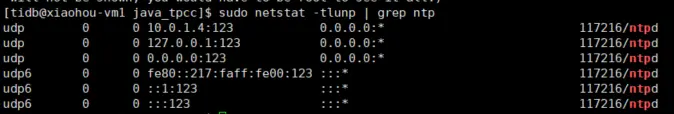

在大数据集群中，要求服务器之间的时间要保持基本一致，因此都会用到ntpd服务，用来同步服务器上的时钟。

参考文章：https://cloud.tencent.com/document/product/213/30393

# Linux时钟介绍

## 什么是ntp？

ntp是网络时间协议，Network Time Protocol（NTP）是用来使计算机[时间同步](https://baike.baidu.com/item/时间同步?fromModule=lemma_inlink)化的一种协议，它可以使计算机对其服务器或[时钟源](https://baike.baidu.com/item/时钟源/3219811?fromModule=lemma_inlink)（如石英钟，GPS等等)做同步化，它可以提供高精准度的时间校正（LAN上与标准间差小于1毫秒，WAN上几十毫秒），且可介由加密确认的方式来防止恶毒的协议攻击。NTP的目的是在无序的Internet环境中提供精确和健壮的时间服务。

## Llinux中有哪些时钟？

在Linux中有**硬件时钟**与**系统时钟**等两种时钟。

- 硬件时钟是指主机板上的时钟设备，也就是通常可在BIOS画面设定的时钟。
- 系统时钟则是指kernel中的时钟。
- 当Linux启动时，系统时钟会去读取硬件时钟的设定，之后系统时钟即独立运作。所有Linux相关指令与函数都是读取系统时钟的设定。

# ntpd介绍

参考文章：https://www.jianshu.com/p/cbc2493a6b72

## ntpd 特性

### C/S 合一

ntpd 对下层 client 来说是 service server，对于上层 server 来说它是 client，也就是说新版的 NTP 服务程序已经不对服务端和客户端进行区分了，统一叫做 ntpd。ntpd 根据配置文件的参数决定是要为其他服务器提供时钟服务或者是从其他服务器同步时钟。
 所有的配置都在 `/etc/ntp.conf `文件中。

- `restirct` 部分为 server 端配置
- `server` 部分为 clinet 端配置

### NTP 客户端同步间隔

**ntpd服务会间隔多长时间向时钟服务器请求一次时钟同步呢？**默认最小时间间隔为64s，默认最大时间间隔是1024s（17分钟左右）。
 默认间隔可以通过 `minpoll` 和 `maxpoll` 配置。

### 容忍误差范围

ntpd服务并不是在任何情况下都会进行同步的。当时钟服务器时间和本地时间相差大于1000s时，ntp服务就会认为是认为调整了时钟或出现了硬件故障，例如CMOS电池损坏等。此时，NTP服务就会退出，需要人工使用`ntpdate <serverIp>`进行时钟同步。

采用`-g`选项可以让ntpd服务忽略1000s或更大误差。

### 层次（strata）

`stratum`根据上层server的层次而设定（上层+1）。

对于提供`network time service provider`的主机来说，stratum的设定要尽可能准确。而作为局域网的`time service provider`，通常将stratum设置为10。

# ntpd服务部署

TODO

# ntpd启停

```bash
service ntpd start
service ntpd stop
service ntpd restart
service ntpd status

systemctl start ntpd
systemctl stop ntpd
systemctl restart ntpd
systemctl status ntpd
```

设置ntpd为开机启动

```bash
chkconfig ntpd on
```

查看启动的ntpd服务

```bash
netstat -tlunp | grep ntp
```



***注意：ntpd走的是 udp 协议 123 端口***

# ntpd配置

TODO

# 时钟同步方式

## ntpdate

```bash
ntpdate <serverIP>
或
ntpdate -u ntp1.aliyun.com
```

说明：若不加上-u参数， 可能会出现以下提示：`no server suitable for synchronization found`

- `-u` 参数可以穿越防火墙和主机同步

## date

```bash
# 查看当前系统时间
date

# 设置系统时间
date -s "2023-07-24 00:00:00"
```


# 其他命令

## hwclock

hwclock命令是一个硬件时钟访问工具，它可以显示当前时间、设置硬件时钟的时间和设置硬件时钟为系统时间，也可设置系统时间为硬件时钟的时间。

**注意：hwclock 所有命令需要使用root 权限**

```bash
# 查看当前硬件时钟
hwclock

# 将当前系统时钟设置为硬件时钟
hwclock -w
hwclock --systohc

# 将当前硬件时钟设置为系统时钟
hwclock -s
hwclock --hctosys
```


## ntpq

查看ntp时钟同步的详细信息.

ntpq可以列出目前我们的 ntp 与相关的上层 ntp 的状态

     # ntpq -np
          remote           refid      st t when poll reach   delay   offset  jitter
     ==============================================================================
    *10.0.97.234     10.0.64.231      4 u   53   64   37    1.041    6.784   1.534
说明：

- `remote`：远程时间服务器的IP地址或者显示LOCAL（没有远程服务器时显示）。
  - [ * ] 代表目前正在作用当中的上层 ntp
  - [ + ] 代表也有连上线，而且可作为下一个提供时间更新的候选者。
  - [ - ] 代表远程服务器被认为是不合格的 NTP Server
  - [ x ] 代表远程服务器不可用

- `refid`：远程时间服务器的上一层服务器IP地址。

- `st`：stratum阶层，表示与顶层参考时钟（原子时钟、GPS或者其他无线电时钟）的距离，顶层为第0层。距离顶层越近，时间越准确。本例中的远程时间服务器处于4层；阿里云时钟服务为第2层；`2.centos.pool.ntp.org`则是第1层，它的上一层是GPS时钟。
- `t`：类型，本地ntp服务与远程时间服务的通信方式
  - u：单播或多播
  - b：广播
  - l：本地

- `when`：最后一次时间同步到现在的时间，没有单位则表示秒

- `poll`：同步的频率，单位秒

- `reach`：和远程时间服务的连接成功次数，每成功一次就+1，以8进制显示

- `delay`：从本地到远程时间服务器通信往返时间，单位毫秒

- `offset`：本机与远程时间服务器的时间偏移量，该值越接近0越好，单位毫秒

- `jitter`：本机与远程时间服务器的时间平均偏差，该值越小越好，单位毫秒


## ntpstat

ntpstat查看ntp时钟同步状态。

```bash
# ntpstat 
synchronised to NTP server (10.0.97.234) at stratum 4 
   time correct to within 8138 ms
   polling server every 64 s
```

# ntpd与ntpdate的区别

参考文章：https://www.jianshu.com/p/cbc2493a6b72


## **ntpd**

- ntpd是一个时间服务。ntpd 是 daemon, 可自动定期将系统时间和 NTP server 更新。
- **ntpd 不仅仅是时间同步服务器，它还可以做客户端与标准时间服务器进行同步时间，而且是平滑同步，并非 ntpdate 立即同步。也正如此两者不可同时运行**。
- 采用柔性时间调整策略，让时间的变化和调整尽量减少对业务的影响。
- 不盲目相信远端时钟，服务器时间和远端时钟超过恐慌阈值（默认1000秒），ntp甚至会停止时间同步。
- ntpd自己会思考。它相信本地时间可能不对，但是不会忽快忽慢甚至停滞。ntpd通过多次收发包选择权威稳定的时间源，算出双方间的网络延迟，然后才会采信新的远端时钟进行时间同步。
- NTPD 在和时间服务器的同步过程中，会把BIOS振荡时钟和远程时间服务的偏移量记录下来，这样即使网络有问题，本机仍然能维持一个相当精确的走时。

## **ntpdate**

- ntpdate是一个时间同步命令，通常采用crond+ntpdate方式同步时间。
- ntpdate盲目信任远端时钟，如果远端时钟错误，ntpdate永远相信远端时钟是正确的，可能造成服务器时钟停滞，甚至回逆。
- ntpdate简单粗暴，无脑不会思考。采用野蛮式（brute force，国外资料中这个词用的很好）、跃进式调整服务器时间。

ntp.org 在 2012 年时开始, 表示将让 ntpd 来取代 ntpdate,  主要原因如下:

> ntpd 可以 cover ntpdate 的功能
>  ntpd 和 ntpdate 原本共用相同的程式码, 后来 ntpd 优化了裡面的演算法, 但 ntpdate 并没有更新

在生产环境中慎用 ntpdate。时钟的跃变，对于某些程序会导致很严重的问题。许多应用程序依赖连续的时钟——毕竟，这是一项常见的假定，即，取得的时间是线性的，一些操作，例如传统数据库事务，通常会地依赖这样的事实：时间不会往回跳跃。不幸的是，ntpdate 调整时间的方式就是我们所说的”跃变“：  在获得一个时间之后，ntpdate 使用 settimeofday 设置系统时间。

- ntpdate 不安全。ntpdate 的设置依赖于 ntp 服务器的安全性，攻击者可以利用一些软件设计上的缺陷，拿 下ntp 服务器并令与其同步的服务器执行某些消耗性的任务。由于 ntpdate 采用的方式是跳变，跟随它的服务器无法知道是否发生了异常（时间不一样的时候，唯一的办法是以服务器为准）。
- ntpdate 不精确。一旦 ntp 服务器宕机，跟随它的服务器也就会无法同步时间。与此不同，ntpd 不仅能够校准计算机的时间，而且能够校准计算机的时钟。
- ntpdate 不够优雅。由于是跳变，而不是使时间变快或变慢，依赖时序的程序会出错（例如，如果 ntpdate 发现你的时间快了，则可能会经历两个相同的时刻，对某些应用而言，这是致命的）。因而，唯一一个可以令时间发生跳变的点，是计算机刚刚启动，但还没有启动很多服务的那个时候。其余的时候，理想的做法是使用 ntpd 来校准时钟，而不是调整计算机时钟上的时间。