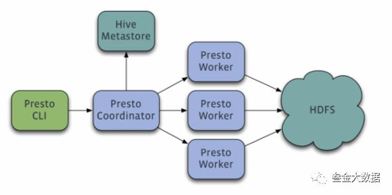
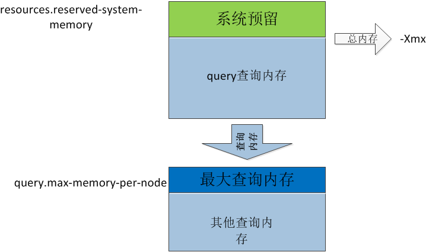

# 1. 概述

参考：https://cloud.tencent.com/developer/article/1156796

presto版本：350

presto内存模型的分析计算组件，可以实现准实时查询。

presto是master/slave模式，有coordinator和worker两种服务。coordinator负责**分析语句**，**生成查询计划**，将**任务分发给worker去执行**。

worker负责执行具体的查询任务。

## presto内存模型

presto把每个worker节点可分配内存（jvm Xmx）分成三份，分别是系统内存池(SystemMemoryPool)，保留内存池(ReservedMemoryPool)和普通内存池(GeneralMemoryPool)。在Presto启动时，它们会随着worker节点初始化时被分配，然后通过服务发现各个worker节点上报给coordinator节点。

下图是presto worker节点的内存示意图：

​																									worker   节点内存分布示意图

​       从示意图中可以看到，一个worker节点的内存堆大小可以最大分成两份：

- **系统预留内存**

  worker节点初始化和执行任务必要的内存，包括presto发现服务的定时上报、每个query中task管理数据结构等。除了系统预留内存，其余给woker 内存都会给查询使用。

  **我理解为query.max-total-memory - query.max-memory则为系统预留内存。**

- **查询内存**

  查询内存又分为

  - **最大查询内存**

    coordinator节点会定时调度查看每个query使用的时长和内存，在此过程中会找到耗用内存最大的一个query，并会为此query调度最大的内存使用。这个query可获得各个worker节点最大配置的**专用**最大内存量。使用**query.max-memory-per-node**配置项可以配置，默认是worker节点堆大小的0.1。这个值可根据query监控的peak Mem作为参考设定。

    **我理解为query.max-total-memory。**

  - **其他查询内存**。

    worker节点堆中除了系统预留的内存和最大查询的内存就是其他查询内存。

    我理解为**(JVM内存 - query.max-total-memory-per-node - memory.heap-headroom-per-node)*worker数**。

# 2. 部署

TODO

# 3. 使用

TODO

# 4. 配置

## presto内存配置参数

*注：在presto中如果改动了jvm堆内存大小，需要对应调整config.properties中对应的内存配置。*

coordinator只是一个协调节点，coordinator的内存配置可以不用像worker那么大，coordinator的config.properties配置

- `query.max-memory` 与worker保持一致
- `query.max-total-memory` 与worker保持一致
- `query.max-memory-per-node` ，必须小于 `query.max-total-memory-per-node`
- `query.max-total-memory-per-node`，必须小于`jvm - memory.heap-headroom-per-node `

`memory.heap-headroom-per-node`，默认为jvm * 0.3，可以适当减小为jvm * 0.2

***理解***：

> `query.max-memory-per-node` 决定了每一台worker专门用来计算最大query的用户任务内存是多少。
>
> `query.max-total-memory-per-node` 定了每一台worker专门用来计算最大query的用户任务内存和系统内存总共是多少，差值为系统内存。
>
> `query.max-memory` 决定集群中专门用来计算最大query的用户任务内存是多少。
>
> `query.max-total-memory`  决定了集群中中专门用来计算最大query的用户任务内存和系统内存总共是多少。
>
> 
>
> `jvm堆内存` >= `query.max-total-memory-per-node` + `memory.heap-hardroom-per-node`
>
> `query.max-memory` = `query.max-memory-per-node`  * worker节点数
>
> `query.max-total-memory` = `query.max-total-memory-per-node`* worker节点数

# 5

# 6

