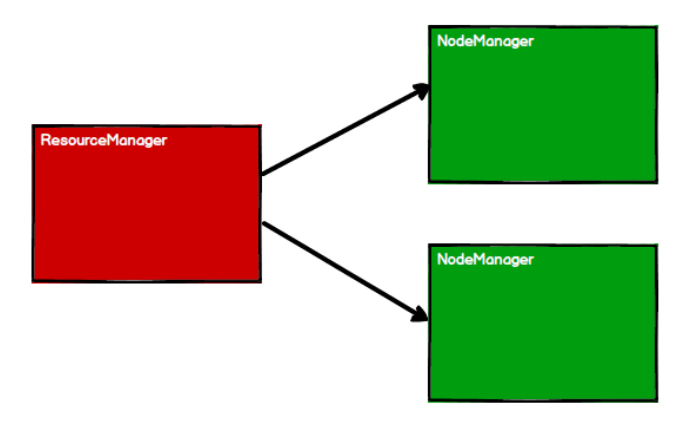

尚硅谷大数据Spark教程从入门到精通](https://www.bilibili.com/video/BV11A411L7CK?p=2&spm_id_from=pageDriver)


# 1.  Spark 概述

## 1.1 Spark 是什么

Spark 是一种基于内存的快速、通用、可扩展的大数据分析计算引擎。

## 1.2 Spark and Hadoop

在之前的学习中，Hadoop 的 MapReduce 是大家广为熟知的计算框架，那为什么咱们还

要学习新的计算框架 Spark 呢，这里就不得不提到 Spark 和 Hadoop 的关系。

**首先从时间节点上来看**: 

➢ Hadoop

- 2006 年 1 月，Doug Cutting 加入 Yahoo，领导 Hadoop 的开发
- 2008 年 1 月，Hadoop 成为 Apache 顶级项目
- 2011 年 1.0 正式发布
- 2012 年 3 月稳定版发布
- <span style="color:red;">2013 年 10 月发布 2.X (Yarn)版本</span>

➢ Spark

- 2009 年，Spark 诞生于伯克利大学的 AMPLab 实验室
- 2010 年，伯克利大学正式开源了 Spark 项目
- 2013 年 6 月，Spark 成为了 Apache 基金会下的项目
- 2014 年 2 月，Spark 以飞快的速度成为了 Apache 的顶级项目
- 2015 年至今，Spark 变得愈发火爆，大量的国内公司开始重点部署或者使用 Spark

**然后我们再从功能上来看:** 

➢ Hadoop

- Hadoop 是由 java 语言编写的，在分布式服务器集群上存储海量数据并运行分布式分析应用的开源框架

- 作为 Hadoop 分布式文件系统，HDFS 处于 Hadoop 生态圈的最下层，存储着所有的 数 据 ， 支 持 着 Hadoop 的 所 有 服 务 。 它 的 理 论 基 础 源 于 Google 的TheGoogleFileSystem 这篇论文，它是 GFS 的开源实现。

- <span style="color:red;">MapReduce </span>是一种编程模型，Hadoop 根据 Google 的 MapReduce 论文将其实现，作为 Hadoop 的分布式计算模型，是 Hadoop 的核心。基于这个框架，分布式并行程序的编写变得异常简单。综合了 HDFS 的分布式存储和 MapReduce 的分布式计算，Hadoop 在处理海量数据时，性能横向扩展变得非常容易。

- HBase 是对 Google 的 Bigtable 的开源实现，但又和 Bigtable 存在许多不同之处。HBase 是一个基于 HDFS 的分布式数据库，擅长实时地随机读/写超大规模数据集。它也是 Hadoop 非常重要的组件。

➢ <span style="color:red;">Spark</span>

- Spark 是一种由 Scala 语言开发的快速、通用、可扩展的<span style="color:red;">大数据分析引擎</span>
- Spark Core 中提供了 Spark 最基础与最核心的功能
- Spark SQL 是 Spark 用来操作结构化数据的组件。通过 Spark SQL，用户可以使用SQL 或者 Apache Hive 版本的 SQL 方言（HQL）来查询数据。
- Spark Streaming 是 Spark 平台上针对实时数据进行流式计算的组件，提供了丰富的处理数据流的 API。

由上面的信息可以获知，Spark 出现的时间相对较晚，并且主要功能主要是用于数据计算，

所以其实 Spark 一直被认为是 Hadoop 框架的升级版。

## 1.3 Spark or Hadoop

Hadoop 的 MR 框架和 Spark 框架都是数据处理框架，那么我们在使用时如何选择呢？

- Hadoop MapReduce 由于其设计初衷并不是为了满足循环迭代式数据流处理，因此在多并行运行的数据可复用场景（如：机器学习、图挖掘算法、交互式数据挖掘算法）中存在诸多计算效率等问题。所以 Spark 应运而生，Spark 就是在传统的 MapReduce 计算框架的基础上，利用其计算过程的优化，从而大大加快了数据分析、挖掘的运行和读写速度，并将计算单元缩小到更适合并行计算和重复使用的 RDD 计算模型。 

- 机器学习中 ALS、凸优化梯度下降等。这些都需要基于数据集或者数据集的衍生数据反复查询反复操作。MR 这种模式不太合适，即使多 MR 串行处理，性能和时间也是一个问题。数据的共享依赖于磁盘。另外一种是交互式数据挖掘，MR 显然不擅长。而Spark 所基于的 scala 语言恰恰擅长函数的处理。

- Spark 是一个分布式数据快速分析项目。它的核心技术是*弹性分布式数据集（Resilient Distributed Datasets）*，提供了比 MapReduce 丰富的模型，可以快速在内存中对数据集进行多次迭代，来支持复杂的数据挖掘算法和图形计算算法。
- <span style="color:red;">Spark 和Hadoop 的根本差异是多个作业之间的数据通信问题 : Spark 多个作业之间数据通信是基于内存，而 Hadoop 是基于磁盘。</span>

- Spark Task 的启动时间快。Spark 采用 fork 线程的方式，而 Hadoop 采用创建新的进程的方式。
- Spark 只有在 shuffle 的时候将数据写入磁盘，而 Hadoop 中多个 MR 作业之间的数据交互都要依赖于磁盘交互
- Spark 的缓存机制比 HDFS 的缓存机制高效。

经过上面的比较，我们可以看出在绝大多数的数据计算场景中，Spark 确实会比 MapReduce更有优势。但是 Spark 是基于内存的，所以在实际的生产环境中，由于内存的限制，可能会由于内存资源不够导致 Job 执行失败，此时，MapReduce 其实是一个更好的选择，所以 Spark并不能完全替代 MR。


## 1.4 Spark核心模块

➢ **Spark Core**

Spark Core 中提供了 Spark 最基础与最核心的功能，Spark 其他的功能如：Spark SQL，

Spark Streaming，GraphX, MLlib 都是在 Spark Core 的基础上进行扩展的

➢ **Spark SQL**

Spark SQL 是 Spark 用来操作结构化数据的组件。通过 Spark SQL，用户可以使用 SQL

或者 Apache Hive 版本的 SQL 方言（HQL）来查询数据。

➢ **Spark Streaming**

Spark Streaming 是 Spark 平台上针对实时数据进行流式计算的组件，提供了丰富的处理

数据流的 API。 

➢ **Spark MLlib**

MLlib 是 Spark 提供的一个机器学习算法库。MLlib 不仅提供了模型评估、数据导入等

额外的功能，还提供了一些更底层的机器学习原语。

➢ **Spark GraphX**

GraphX 是 Spark 面向图计算提供的框架与算法库。


# 2. Spark快速上手

TODO

# 3. Spark运行环境

Spark作为一个数据处理框架和计算引擎，被设计在所有常见的集群环境中运行，在国内工作中主流的环境为Yarn，不过逐渐容器式环境也慢慢流行起来。接下来，我们就分别看看不同环境下Spark的运行。


## 3.1 Local模式

Local模式，指不需要其他任何节点资源就可以在本地执行Spark代码的环境，一般用于教学，调试，演示等，之前在IDEA中运行代码的环境我们称之为开发华宁，不太一样。

### 3.1.1 解压缩文件

将spark-3.0.0-bin-hadoop3.2.tgz文件上传到Linux服务器并解压，放置在指定未知，路径中不要包含中文或空格，课件后续如果涉及到解压操作，不再强调。

```shell
tar -zxvf spark-3.0.0-bin-hadoop3.2.tgz -C /opt/module
cd /opt/module
mv spark-3.0.0-bin-hadoop3.2 spark-local
```

### 3.1.2 启动Local环境

（1）进入解压后的目录，执行如下指令：

```shell
bin/spark-shell
```


（2）启动成功后，可以输入网址进行Web UI监控页面访问

```shell
http://虚拟机地址:4040
```


### 3.1.3 命令行工具

```shell
bin/spark-shell
```


在解压文件下的data目录时中，添加word.txt文件。在命令行工具中执行如下代码指令（和IDEA中代码简化版一样）

```scala
sc.textFile("data/word.txt").flatMap(_.split(" ")).map((_.1)).reduceByKey(_+_).collect
```


### 3.1.4 退出本地模式

按住 Ctrl+C或输入Scala指令`:quit`

### 3.1.5 提交应用

```shell
bin/spark-submit \
--class org.apache.spark.examples.SparkPi \
--master local[2] \
../examples/jars/spark-examples_2.12-3.0.0.jar \
```

（1）``--class`表示要执行程序的朱磊，<span style="color:red;">此处可以更换为咱们自己写的应用程序</span>	

（2）``--master local[2]``部署模式，默认为本地模式，数字表示分配的虚拟CPU核数

（3）``spark-examples_2.12-3.0.0.jar`运行的应用累所在的jar包，<span style="color:red;">实际使用时，可以设定为咱 们自己打的jar包</span>	

（4）数字10表示程序的入口参数，用于设定当前应用的任务数量。

TODO


## 3.2 Stanalone模式

local本地莫斯毕竟只是用来进行联系演示的，真实的工作还是要将应用提交到对应的集群中区执行，这里我们来看看只使用Spark自身节点运行的集群模式，也就是我们所谓的独立部署（Standalone）模式。Spark的Standalone模式体现了经典的master-slave模式。

集群规划：

| --    | linux1        | linux2 | linux3 |
| ----- | ------------- | ------ | ------ |
| Spark | worker master | worker | worker |

### 3.2.1 解压文件

将 spark-3.0.0-bin-hadoop3.2.tgz 文件上传到 Linux 并解压缩在指定位置

```shell
tar -zxvf spark-3.0.0-bin-hadoop3.2.tgz
cd /opt/module
mv spark-3.0.0-bin-hadooop3.2 spark-standalone
```


### 3.2.2 修改配置文件

（1）进入解压路径后的conf目录，修改slaves.template文件名为slaves

```shell
mv slaves.template slaves
```

（2）修改slaves文件，添加worker节点

```shell
linux1
linux2
linux3
```

（3）修改 spark-env.sh.template 文件名为 spark-env.sh

```shell
mv spark-env.sh.template spark-env.sh
```

（4）修改 spark-env.sh 文件，添加 JAVA_HOME 环境变量和集群对应的 master 节点

```shell
export JAVA_HOME=/opt/module/jdk1.8.0_144
SPARK_MASTER_HOST=linux1
SPARK_MASTER_PORT=7077
```

<span style="color:red;">注意：7077 端口，相当于 hadoop3 内部通信的 8020 端口，此处的端口需要确认自己的 Hadoop配置</span>

（5）分发 spark-standalone 目录

```shell
xsync spark-standalone
```

<span style="color:red;">注意：`xsync` 是自己手写的一个shell脚本，脚本内容见《hadoop集群常用脚本》</span>

### 3.2.3 启动集群

（1）执行脚本命令

```shell
sbin/start-all.sh
```


（2）查看三台服务器运行进程

```shell
================linux1================
3330 Jps
3238 Worker
3163 Master
================linux2================
2966 Jps
2908 Worker
================linux3================
2978 Worker
3036 Jps
```

（3）查看 Master 资源监控 Web UI 界面: http://linux1:8080


### 3.2.4 提交应用

```shell
bin/spark-submit \
--class org.apache.spark.examples.SparkPi \
--master spark://linux1:7077 \
./examples/jars/spark-examples_2.12-3.0.0.jar \
10
```

（1）--class 表示要执行程序的主类

（2） --master spark://linux1:7077 独立部署模式，连接到 Spark 集群

（3）spark-examples_2.12-3.0.0.jar 运行类所在的 jar 包

（4） 数字 10 表示程序的入口参数，用于设定当前应用的任务数量


执行任务时，会产生多个 Java 进程


执行任务时，默认采用服务器集群节点的总核数，每个节点内存 1024M。


### 3.2.5 提交参数说明

在提交应用中，一般会同时一些提交参数

```shell
bin/spark-submit \
--class <main-class>
--master <master-url> \
... # other options
<application-jar> \
[application-arguments]
```

| 参数                     | 解释                                                         | 可选值举例                                |
| ------------------------ | ------------------------------------------------------------ | ----------------------------------------- |
| --class                  | Spark 程序中包含主函数的类                                   |                                           |
| --master                 | Spark 程序运行的模式(环境)                                   | 模式：local[*]、spark://linux1:7077、Yarn |
| --executor-memory 1G     | 指定每个 executor 可用内存为 1G                              | 符合集群内存配置即可，具体情况具体分析。  |
| --total-executor-cores 2 | 指定所有executor使用的cpu核数为 2 个                         | 符合集群内存配置即可，具体情况具体分析。  |
| --executor-cores         | 指定每个executor使用的cpu核数                                | 符合集群内存配置即可，具体情况具体分析。  |
| application-jar          | 打包好的应用 jar，包含依赖。这个 URL 在集群中全局可见。 比 如 hdfs:// 共享存储系统，如果是file://path，那么所有的节点的path 都包含同样的 jar |                                           |
| application-arguments    | 传给 main()方法的参数                                        |                                           |


### 3.2.6 配置历史服务

由于 spark-shell 停止掉后，集群监控 linux1:4040 页面就看不到历史任务的运行情况，所以

开发时都配置历史服务器记录任务运行情况。

（1）修改 spark-defaults.conf.template 文件名为 spark-defaults.conf

```shell
mv spark-defaults.conf.template spark-defaults.conf
```

（2）修改 spark-default.conf 文件，配置日志存储路径

```shell
spark.eventLog.enabled true
spark.eventLog.dir hdfs://linux1:8020/directory
```

<span style="color:red;">注意：需要启动 hadoop 集群，HDFS 上的 directory 目录需要提前存在。</span>

```shell
sbin/start-dfs.sh
hadoop fs -mkdir /directory
```

（3）修改 spark-env.sh 文件, 添加日志配置

```shell
export SPARK_HISTORY_OPTS="
-Dspark.history.ui.port=18080 
-Dspark.history.fs.logDirectory=hdfs://linux1:8020/directory 
-Dspark.history.retainedApplications=30"
```

- `spark.history.ui.port`含义：WEB UI访问的端口号为18080

- `spark.history.fs.logDirectory `含义：指定历史服务器日志存储路径

- `spark.history.retainedApplications`含义：指定保存Application历史记录的个数，如果超过这个值，旧的应用程序

  信息将被删除，这个是内存中的应用数，而不是页面上显示的应用数。

（4）分发配置文件

```shell
xsync conf
```

（5）重新启动集群和历史服务

```shell
sbin/start-all.sh
sbin/stop-history-server.sh
```

（6）重新执行任务

```shell
bin/spark-submit \
--class org.apache.spark.examples.SparkPi \
--master spark://linux1:7077 \
./examples/jars/spark-examples_2.12-3.0.0.jar \
10
```


（7）查看历史服务：http://linux1:18080


### 3.2.7 配置高可用（HA）

所谓的高可用是因为当前集群中的Master节点只有一个，所以会存在==单点故障==问题。所以为了解决单点故障问题，需要在集群中配置多个Master节点，一旦处于活动状态的Master发生故障时，由备用Master提供服务，保证作业可以继续执行。这里的高可用一般采用Zookeeper设置

<span style="color:blue;">集群规划：</span>

| --    | linux1                        | linux2                        | linux3                  |
| ----- | ----------------------------- | ----------------------------- | ----------------------- |
| Spark | Master<br>Zookeeper<br>worker | Master<br>Zookeeper<br>worker | <br>Zookeeper<br>worker |

（1）停止集群

```shell
sbin/stop-all.sh
```

（2）启动Zookeeper

```shell
xstart zk
```

（3）修改spark-env.sh 文件添加如下内容

```shell
注释如下内容：
#SPARK_MASTER_HOST=linux1
#SPARK_MASTER_PORT=7077
添加如下内容:
#Master 监控页面默认访问端口为 8080，但是可能会和 Zookeeper 冲突，所以改成 8989，也可以自定义，访问 UI 监控页面时请注意
SPARK_MASTER_WEBUI_PORT=8989
export SPARK_DAEMON_JAVA_OPTS="
-Dspark.deploy.recoveryMode=ZOOKEEPER 
-Dspark.deploy.zookeeper.url=linux1,linux2,linux3
-Dspark.deploy.zookeeper.dir=/spark"
```

（4）分发配置文件

```shell
xsync conf/
```

（5）启动集群

```shell
sbin/start-all.sh
```


（6）启动linux2的单独Master节点，此时 linux2 节点 Master 状态处于备用状态

```shell
[root@linux2 spark-standalone]# sbin/start-master.sh
```


（7）提交应用到高可用集群

```shell
bin/spark-submit \
--class org.apache.spark.examples.SparkPi \
--master spark://linux1:7077,linux2:7077 \
./examples/jars/spark-examples_2.12-3.0.0.jar \
10
```

（8）停止linux1的Master资源监控进程


（9）查看linux2的Master资源监控WEB UI，稍等一段时间后，linux2 节点的 Master 状态提升为ALIVE状态


## 3.3 Yarn模式

独立部署（Standalone）模式由Spark自身提供计算资源，无需其他框架提供资源。这种方式降低了和其他第三方资源框架的耦合性，独立性非常强。但是你要记住，Spark主要是计算框架，而不是资源调度框架，所以本身提供的资源调度并不是它的强项，所以还是和其他专业的资源调度框架集成会更靠谱一些。所以接下来我们来学习在强大的Yarn环境下Spark是如何工作的（其实是因为国内使用Yanr较多）。

### 3.3.1 解压文件

将 spark-3.0.0-bin-hadoop3.2.tgz 文件上传到 linux 并解压缩，放置在指定位置。

```shell
tar -zxvf spark-3.0.0-bin-hadoop3.2.tgz -C /opt/module
cd /opt/module 
mv spark-3.0.0-bin-hadoop3.2 spark-yarn
```

### 3.3.2 修改配置文件

（1）修改hadoop配置文件``/opt/module/etc/hadoop/yarn-site.xml`，并分发

```xml
<!--是否启动一个线程检查每个任务正使用的物理内存量，如果任务超出分配值，则直接将其杀掉，默认
是 true -->
<property>
 <name>yarn.nodemanager.pmem-check-enabled</name>
 <value>false</value>
</property>
<!--是否启动一个线程检查每个任务正使用的虚拟内存量，如果任务超出分配值，则直接将其杀掉，默认
是 true -->
<property>
 <name>yarn.nodemanager.vmem-check-enabled</name>
 <value>false</value>
</property>
```

（2）修改 conf/spark-env.sh，添加` JAVA_HOME` 和 `YARN_CONF_DIR` 配置

```shell
mv spark-env.sh.template spark-env.sh
。。。
export JAVA_HOME=/opt/module/jdk1.8.0_144
YARN_CONF_DIR=/opt/module/hadoop/etc/hadoop
```

### 3.3.3 启动HDFS以及YARN集群

见《Hadoop文档》

### 3.3.4 提交应用

```shell
bin/spark-submit \
--class org.apache.spark.examples.SparkPi \
--master yarn \
--deploy-mode cluster \
./examples/jars/spark-examples_2.12-3.0.0.jar \
10
```


查看 http://linux2:8088 页面，点击History，查看历史页面


### 3.3.5 配置历史服务器

（1）修改spark-defaults.conf.template 文件名为 spark-defaults.conf

```shell
mv spark-defaults.conf.template spark-defaults.conf
```

（2）修改 spark-default.conf 文件，配置日志存储路径

```shell
spark.eventLog.enabled true
spark.eventLog.dir hdfs://linux1:8020/directory
```

<span style="color:red;">注意：需要启动 hadoop 集群，HDFS 上的目录需要提前存在。</span>

```shell
[root@linux1 hadoop]# sbin/start-dfs.sh
[root@linux1 hadoop]# hadoop fs -mkdir /directory
```

（3）修改 spark-env.sh 文件, 添加日志配置

```shell
export SPARK_HISTORY_OPTS="
-Dspark.history.ui.port=18080 
-Dspark.history.fs.logDirectory=hdfs://linux1:8020/directory 
-Dspark.history.retainedApplications=30"
```

- `spark.history.ui.port`含义：WEB UI 访问的端口号为 18080
- `spark.history.fs.logDirectory`含义：指定历史服务器日志存储路径
- `spark.history.retainedApplications`含义：指定保存 Application 历史记录的个数，如果超过这个值，旧的应用程序信息将被删除，这个是内存中的应用数，而不是页面上显示的应用数。

（4）修改`spark-defaults.conf`

```shell
spark.yarn.historyServer.address=linux1:18080
spark.history.ui.port=18080
```

（5）启动历史服务

```shell
sbin/start-history-server.sh
```

（6）重新提交应用

```shell
bin/spark-submit \
--class org.apache.spark.examples.SparkPi \
--master yarn \
--deploy-mode client \
./examples/jars/spark-examples_2.12-3.0.0.jar \
10
```


（7）Web 页面查看日志：http://linux2:8088


## 3.4 K8S & Mesos模式

Mesos 是 Apache 下的开源分布式资源管理框架，它被称为是分布式系统的内核,在Twitter 得到广泛使用,管理着 Twitter 超过 30,0000 台服务器上的应用部署，但是在国内，依然使用着传统的 Hadoop 大数据框架，所以国内使用 Mesos 框架的并不多，但是原理其实都差不多，这里我们就不做过多讲解了。


容器化部署是目前业界很流行的一项技术，基于 Docker 镜像运行能够让用户更加方便地对应用进行管理和运维。容器管理工具中最为流行的就是 Kubernetes（k8s），而 Spark也在最近的版本中支持了 k8s 部署模式。这里我们也不做过多的讲解。给个链接大家自己感受一下：https://spark.apache.org/docs/latest/running-on-kubernetes.html


## 3.5 Window模式

在同学们自己学习时，每次都需要启动虚拟机，启动集群，这是一个比较繁琐的过程，并且会占大量的系统资源，导致系统执行变慢，不仅仅影响学习效果，也影响学习进度，Spark 非常暖心地提供了可以在 windows 系统下启动本地集群的方式，这样，在不使用虚拟机的情况下，也能学习 Spark 的基本使用，摸摸哒！

在后续的教学中，为了能够给同学们更加流畅的教学效果和教学体验，我们一般情况下都会采用 windows 系统的集群来学习 Spark。

### 3.5.1 解压文件

将文件 spark-3.0.0-bin-hadoop3.2.tgz解压到无中文无空格的目录中

### 3.5.2 启动本地环境

（1）执行解压文件路径下bin目录下的spark-shell.cmd文件，启动spark 本地环境


（2）在bin目录中创建input目录，并添加 word.txt 文件, 在命令行中输入脚本代码


### 3.5.3 命令行提交应用

在DOS命令行窗口中执行提交指令

```shell
spark-submit \
--class org.apache.spark.example.SparkPi \
--master local[2] \
../example/jars/spark-examples_2.12-3.0.0.jar \
10
```


## 3.6 部署模式对比

| 模式       | Spark安装机器数 | 需启动的进程  | 所属者 | 应用场景 |
| ---------- | --------------- | ------------- | ------ | -------- |
| Local      | 1               | 无            | Spark  | 测试     |
| Standalone | 3               | Master和woker | Spark  | 单独部署 |
| Yarn       | 1               | YARN和HDFS    | Hadoop | 混合部署 |


## 3.7 端口号

|       |                                               |
| ----- | --------------------------------------------- |
| 4040  | Spark 查看当前 Spark-shell 运行任务情况端口号 |
| 7077  | Spark Master 内部通信服务端口号               |
| 8080  | Standalone 模式下，Spark Master Web 端口号    |
| 18080 | Spark 历史服务器端口号                        |
| 8088  | Hadoop YARN 任务运行情况查看端口号            |

# 4. Spark运行架构

## 4.1 运行架构

Spark框架的核心是一个计算引擎，整体来说，它采用了传统的master-slave模式。

如下图所示，它展示了一个Spark执行时的基本结构。图形中的Driver表示master，负责管理整个集群中的作业任务调度。图形中的Executor则是slave，负责实际执行任务。


## 4.2 核心组件

由上图可以看出，对于Spark框架有两个核心组件：

### 4.2.1 Driver

Spark驱动器节点，用于执行Spark任务中的main方法，负责实际代码的执行工作。

Driver在Spark作业执行时主要负责：

- 将用户程序转化为作业（job）
- 在Executor之间调度任务（task）
- 跟中Executor的执行情况
- 通过UI展示查询运行情况

实际上，我们无法准确地描述Driver的定义，因为在整个的编程过程中没有看到任何有关Driver的字眼。所以简单理解，所谓的Driver就是驱使整个应用运行起来的程序，也称之为Driver 类。

### 4.2.2 Executor

Spark Executor是集群中的工作节点（Worker）中的一个JVM进程，负责在Spark作业中运行具体任务（Task），任务彼此之间相互独立。Spark应用启动时，Executor节点被同时启动，并且始终伴随真个Spark应用的生命周期而存在。如果Executor节点发生了故障或崩溃，Spark应用也可以继续执行，会将出错节点上的任务调度到其他Excutor节点上继续运行。

Executor有两个核心功能：

- 负责运行组成Spark应用的任务，并将结果返回给驱动器进程。
- 他们通过自身的块管理器（Block Manager）为用户程序中要求缓存的 RDD 提供内存式存储。RDD 是直接缓存在 Executor 进程内的，因此任务可以在运行时充分利用缓存数据加速运算。

### 4.2.3 Master & Worker

Spark集群的独立部署环境中，不需要依赖其他的资源调度框架，自身就实现了资源调度的功能，所以环境中海油其他两个核心组件：Master和Worker，这里的Master是一个进程，主要负责资源的调度和分配，并进行集群的监控等职责，类似于YARN中的RM，而Worker呢，也是进程，一个Worker运行在集群中的一台服务器上， 由Master分配资源对数据进行并行的处理和计算，类似于YARN中的NM。

### 4.2.4 ApplicationMaster

Hadoop 用户向 YARN 集群提交应用程序时,提交程序中应该包含 ApplicationMaster，用

于向资源调度器申请执行任务的资源容器 Container，运行用户自己的程序任务 job，监控整

个任务的执行，跟踪整个任务的状态，处理任务失败等异常情况。

说的简单点就是，ResourceManager（资源）和 Driver（计算）之间的解耦合靠的就是

ApplicationMaster。

类似于YARN中的AM。

## 4.3 核心概念

### 4.3.1 Executor与Core

Spark Executor 是集群中运行在工作节点（Worker）中的一个 JVM 进程，是整个集群中

的专门用于计算的节点。在提交应用中，可以提供参数指定计算节点的个数，以及对应的资

源。这里的资源一般指的是工作节点 Executor 的内存大小和使用的虚拟 CPU 核（Core）数

量。

应用程序相关启动参数如下：

| 名称              | 说明                                   |
| ----------------- | -------------------------------------- |
| --num-executors   | 配置 Executor 的数量                   |
| --executor-memory | 配置每个 Executor 的内存大小           |
| --executor-cores  | 配置每个 Executor 的虚拟 CPU core 数量 |

### 4.3.2 并行度（Parallelism）

在分布式计算框架中一般都是多个任务同时执行，由于任务分布在不同的计算节点进行

计算，所以能够真正地实现多任务并行执行，记住，这里是并行，而不是并发。这里我们将

整个集群并行执行任务的数量称之为<span style="color:red;">并行度</span>。那么一个作业到底并行度是多少呢？这个取决

于框架的默认配置。应用程序也可以在运行过程中动态修改。

### 4.3.3 有向无环图（DAG）


大数据计算引擎框架我们根据使用方式的不同一般会分为四类，其中第一类就是

Hadoop 所承载的 MapReduce,它将计算分为两个阶段，分别为 Map 阶段 和 Reduce 阶段。

对于上层应用来说，就不得不想方设法去拆分算法，甚至于不得不在上层应用实现多个 Job 

的串联，以完成一个完整的算法，例如迭代计算。 由于这样的弊端，催生了支持 DAG 框

架的产生。因此，支持 DAG 的框架被划分为第二代计算引擎。如 Tez 以及更上层的

Oozie。这里我们不去细究各种 DAG 实现之间的区别，不过对于当时的 Tez 和 Oozie 来

说，大多还是批处理的任务。接下来就是以 Spark 为代表的第三代的计算引擎。第三代计

算引擎的特点主要是 Job 内部的 DAG 支持（不跨越 Job），以及实时计算。

这里所谓的有向无环图，并不是真正意义的图形，而是由 Spark 程序直接映射成的数据

流的高级抽象模型。简单理解就是将整个程序计算的执行过程用图形表示出来,这样更直观，

更便于理解，可以用于表示程序的拓扑结构。

DAG（Directed Acyclic Graph）有向无环图是由点和线组成的拓扑图形，该图形具有方

向，不会闭环。

## 4.4 提交流程

所谓的提交流程，其实就是我们开发人员根据需求写的应用程序通过 Spark 客户端提交

给 Spark 运行环境执行计算的流程。在不同的部署环境中，这个提交过程基本相同，但是又

有细微的区别，我们这里不进行详细的比较，但是因为国内工作中，将 Spark 引用部署到

Yarn 环境中会更多一些，所以本课程中的提交流程是基于 Yarn 环境的。


Spark 应用程序提交到 Yarn 环境中执行的时候，一般会有两种部署执行的方式：Client

和 Cluster。<span style="color:red;">两种模式主要区别在于：Driver 程序的运行节点位置。</span>

### 4.4.1 Yarn Client模式

Client 模式将用于监控和调度的 Driver 模块在客户端执行，而不是在 Yarn 中，所以一

般用于测试。

- ==Driver 在任务提交的本地机器上运行==

- Driver 启动后会和 ResourceManager 通讯申请启动 ApplicationMaster

- ResourceManager 分配 container，在合适的 NodeManager 上启动 ApplicationMaster，负

责向 ResourceManager 申请 Executor 内存

- ResourceManager 接到 ApplicationMaster 的资源申请后会分配 container，然后ApplicationMaster 在资源分配指定的 NodeManager 上启动 Executor 进程 
- Executor 进程启动后会向 Driver 反向注册，Executor 全部注册完成后 Driver 开始执行

main 函数

- 之后执行到 Action 算子时，触发一个 Job，并根据宽依赖开始划分 stage，每个 stage 生

成对应的 TaskSet，之后将 task 分发到各个 Executor 上执行。

### 4.4.2 <span style="color:red;">Yarn Cluster模式</span>

Cluster 模式将用于监控和调度的 Driver 模块启动在 Yarn 集群资源中执行。==一般应用于实际生产环境。==

- 在 YARN Cluster 模式下，任务提交后会和 ResourceManager 通讯申请启动

ApplicationMaster， 

- 随后 ResourceManager 分配 container，在合适的 NodeManager 上启动 ApplicationMaster，

此时的 ApplicationMaster 就是 Driver。 

- Driver 启动后向 ResourceManager 申请 Executor 内存，ResourceManager 接到

ApplicationMaster 的资源申请后会分配 container，然后在合适的 NodeManager 上启动

Executor 进程

- Executor 进程启动后会向 Driver 反向注册，Executor 全部注册完成后 Driver 开始执行

main 函数，

- 之后执行到 Action 算子时，触发一个 Job，并根据宽依赖开始划分 stage，每个 stage 生

成对应的 TaskSet，之后将 task 分发到各个 Executor 上执行。

# 5. Spark核心编程

Spark 计算框架为了能够进行高并发和高吞吐的数据处理，封装了三大数据结构，用于

处理不同的应用场景。<span style="color:red;">三大数据结构</span>分别是：

- RDD : 弹性分布式数据集

- 累加器：分布式共享<span style="color:blue">只写</span>变量

- 广播变量：分布式共享<span style="color:blue">只读</span>变量

接下来我们一起看看这三大数据结构是如何在数据处理中使用的。

## 5.1 RDD

### 5.1.1 什么是RDD

RDD（Resilient Distributed Dataset）叫做弹性分布式数据集，是 Spark 中最基本的<span style="color:red;">数据处理模型</span>。代码中是一个抽象类，它代表一个==弹性的、不可变、可分区、里面的元素可并行计算的集合==。

- 弹性
  - 存储的弹性：内存与磁盘的自动切换；
  - 容错的弹性：数据丢失可以自动恢复；
  - 计算的弹性：计算出错重试机制；
  - 分片的弹性：可根据需要重新分片。

- 分布式：数据存储在大数据集群不同节点上

- 数据集：==RDD 封装了计算逻辑，并不保存数据==

- 数据抽象：RDD 是一个抽象类，需要子类具体实现

- 不可变：==RDD 封装了计算逻辑，是不可以改变的，想要改变，只能产生新的 RDD，在新的 RDD 里面封装计算逻辑==

- 可分区、并行计算


### 5.1.2 核心属性

```scala
* Internally, each RDD is characterized by five main properties:
* - A list of partitions
* - A function for computing each split
* - A list of dependencies on other RDDS
* - Optionally, a Partitioner for key-value RDDs(e.g. to say that the RDD is hash-partitioned)
* - Optionally, a list of preferred locations to compute each split on (e.g. block locations for an HDFS file)
```


- 分区列表

  RDD数据结构中存在分区列表，用于执行任务时并行计算，是实现分布式计算的重要属性。

  ```scala
  /**
  * Implemented by subclasses to return the set of partitions in this RDD. This method will only be called once, so it it safe to implement a time-consuming computation in it.
  * 
  * The partitions in this array must satisfy the following property:
  * `rdd.partitions.zipWithIndex.forall {case (partition, index) => partition.index == index}`
  */
  protected def getPartitions: Array[Partition]
  ```

- 分区计算函数

  Spark在计算时，是使用分区函数对每一个分区进行计算

  ```scala
  /**
  * :: DeveloperApi ::
  * Implemented by subclasses to compute a given partition.
  */
  @DeveloperApi
  def compute(split: Partition, context: TaskContext): Iterator[T]
  ```

- RDD之间的依赖关系

  RDD是计算模型的封装，当需求中需要将多个计算模型进行组合时，就需要将多个RDD建立依赖关系

  ```scala
  /**
  * Implemented by subclasses to return this RDD depends on parent RDDs. This method will only 
  * be called once, so it is safe to implement a time-consuming computation in it.
  */
  protected def getDependencies: Seq[Dependency[_]] = deps
  ```

- 分区器（可选）

  当数据为KV类型数据时，可以通过设定分区器，自定义数据的分区

  ```scala
  /** Optionally overridden by subclasses to specify how they ar partitioned. */
  @transient val partitioner: Option[Partitioner] = None
  ```

  <span style="color:red;">注：数据根据什么逻辑来分区。</span>

- 首选位置（可选）

  计算数据时，可以根据计算节点的状态选择不同的节点位置进行计算

  ```scala
  /**
  * Optionally overriden by subclasses to specify placement preferences.
  */
  protected def getPreferredLocations(split: Partition): Seq[String] = Nil
  ```

  <span style="color:red;">注：移动计算优于移动数据。</span>

### 5.1.3 执行原理

从计算的角度来讲，数据处理过程中需要计算资源（内存 & CPU）和计算模型（逻辑）。执行时，需要将计算资源和计算模型进行协调和整合。


Spark 框架在执行时，先申请资源，然后将应用程序的数据处理逻辑分解成一个一个的计算任务。然后将任务发到已经分配资源的计算节点上, 按照指定的计算模型进行数据计算。最后得到计算结果。


RDD 是 Spark 框架中用于数据处理的核心模型，接下来我们看看，在 Yarn 环境中，RDD的工作原理:

（1）启动YARN集群环境



（2）Spark通过申请资源创建调度节点和计算节点


（3）Spark框架根据需求将计算逻辑根据分区划分成不同的任务


（4）调度节点将任务根据计算节点状态发送到对应的计算节点进行计算


从以上流程可以看出RDD在整个流程中主要用于将逻辑进行封装，并生成Task发送给Executor节点执行计算，接下来我们就一起看看Spark框架中RDD具体是如何进行数据处理的。

### 5.1.4 基础编程

#### 5.1.4.1 RDD创建

在 Spark 中创建 RDD 的创建方式可以分为四种：

（1）**从集合（内存）中创建RDD**

从集合中创建 RDD，Spark 主要提供了两个方法：`parallelize` 和 `makeRDD`

```scala
val sparkConf = new SparkConf().setMaster("local[*]").setAppName("spark")
val sparkContext = new SparkContext(sparkConf)
val rdd1 = sparkContext.parallelize(
 List(1,2,3,4)
)
val rdd2 = sparkContext.makeRDD(
 List(1,2,3,4)
)
rdd1.collect().foreach(println)
rdd2.collect().foreach(println)
sparkContext.stop()
```

从底层代码实现来讲，`makeRDD` 方法其实就是 `parallelize` 方法

```scala
def makeRDD[T: ClassTag](
 seq: Seq[T],
 numSlices: Int = defaultParallelism): RDD[T] = withScope {
 parallelize(seq, numSlices)
}
```

（2）**从外部存储（文件）中创建RDD**

由外部存储系统的数据集创建 RDD 包括：本地的文件系统，所有 Hadoop 支持的数据集，比如 HDFS、HBase 等。

```scala
val sparkConf = new SparkConf().setMaster("local[*]").setAppName("spark")
val sparkContext = new SparkContext(sparkConf)
val fileRDD: RDD[String] = sparkContext.textFile("input")
fileRDD.collect().foreach(println)
sparkContext.stop()
```

（3）**从其他RDD创建**

主要是通过一个 RDD 运算完后，再产生新的 RDD。详情请参考后续章节

（4）**直接创建RDD（new）**

使用 new 的方式直接构造 RDD，一般由 Spark 框架自身使用。

#### 5.1.4.2 RDD并行度与分区

默认情况下，Spark 可以将一个作业切分多个任务后，发送给 Executor 节点并行计算，而能够并行计算的任务数量我们称之为并行度。这个数量可以在构建 RDD 时指定。==记住，这里的并行执行的任务数量，并不是指的切分任务的数量，不要混淆了。==

```scala
val sparkConf =
 new SparkConf().setMaster("local[*]").setAppName("spark")
val sparkContext = new SparkContext(sparkConf)
val dataRDD: RDD[Int] =
 sparkContext.makeRDD(
 List(1,2,3,4),
 4)
val fileRDD: RDD[String] =
 sparkContext.textFile(
 "input",
 2)
fileRDD.collect().foreach(println)
sparkContext.stop()
```

- 读取<span style="color:red;">内存</span>数据时，数据可以按照并行度的设定进行数据的分区操作，数据分区规则的Spark 核心源码如下：

  ```scala
  def positions(length: Long, numSlices: Int): Iterator[(Int, Int)] = {
   (0 until numSlices).iterator.map { i =>
   val start = ((i * length) / numSlices).toInt
   val end = (((i + 1) * length) / numSlices).toInt
   (start, end)
   }
  }
  ```

- 读取<span style="color:red;">文件</span>数据时，数据是按照 Hadoop 文件读取的规则进行切片分区，而切片规则和数据读取的规则有些差异，具体 Spark 核心源码如下:

  ```scala
  public InputSplit[] getSplits(JobConf job, int numSplits)
   throws IOException {
   long totalSize = 0; // compute total size
   for (FileStatus file: files) { // check we have valid files
   if (file.isDirectory()) {
   throw new IOException("Not a file: "+ file.getPath());
   }
   totalSize += file.getLen();
   }
   long goalSize = totalSize / (numSplits == 0 ? 1 : numSplits);
   long minSize = Math.max(job.getLong(org.apache.hadoop.mapreduce.lib.input.
   FileInputFormat.SPLIT_MINSIZE, 1), minSplitSize);
   
   ...
   
   for (FileStatus file: files) {
   
   ...
   
   if (isSplitable(fs, path)) {
   long blockSize = file.getBlockSize();
   long splitSize = computeSplitSize(goalSize, minSize, blockSize);
   ...
   }
   protected long computeSplitSize(long goalSize, long minSize,
   long blockSize) {
   return Math.max(minSize, Math.min(goalSize, blockSize));
   }
  ```


#### 5.1.4.3 RDD转换算子

RDD 根据数据处理方式的不同将算子整体上分为 Value 类型、双 Value 类型和 Key-Value类型

（1）Value型

- **map**

  - 函数签名

    ```scala
    def map[U: ClassTag](f: T => U): RDD[U]
    ```

  - 函数说明

    将处理的数据<span style="color:red;">逐条</span>进行映射转换，这里的转换可以是类型的转换，也可以是值的转换。

    ```scala
    val dataRDD: RDD[Int] = sparkContext.makeRDD(List(1,2,3,4))
    val dataRDD1: RDD[Int] = dataRDD.map(
     num => {
     	num * 2
     } )
    val dataRDD2: RDD[String] = dataRDD1.map(
     num => {
     	"" + num
     }
    ```

    *小功能：从服务器日志数据 apache.log 中获取用户请求 URL 资源路径

    > rdd的计算在一个分区内是有序的，数据一个一个执行，前一个数据的逻辑走完，才会执行下一个数据。分区内执行是有序。

  - 

- **mapPartitions**

  - 函数签名

    ```scala
    def mapPartitions[U: ClassTag](
     f: Iterator[T] => Iterator[U],
     preservesPartitioning: Boolean = false): RDD[U]
    ```

    

  - 函数说明

    将待处理的数据以分区为单位发送到计算节点进行处理，这里的处理是指可以进行任意的处

    理，哪怕是过滤数据。

    ```scala
    val dataRDD1: RDD[Int] = dataRDD.mapPartitions(
     datas => {
     datas.filter(_==2)
     } )
    ```

    *小功能：获取每个数据分区的最大值

    > mapPartitions以分区为单位进行数据转换操作，但是==会将整个分区的数据加载到内存进行引用==，如果处理完的数据是不会被释放掉的，存在对象的引用。在内存较小时，数据量较大的场景下，容易出现==内存溢出==。

    <span style="colore:blue;">思考一个问题：map 和 mapPartitions 的区别？ </span>

    > - 从数据处理的角度
    >
    >   map算子是分区内一个数据一个数据的执行，类似于串行操作。而mapPartitions算子是以分区为单位进行批处理操作。
    >
    > - 从功能的角度
    >
    >   map算子主要目的是将数据源中的数据进行转换和改变。但是不会减少或增多数据个数。mapPartitions算子需要传递一个迭代器，返回一个迭代器，不要求元素的个数保持不变，所以可以增加或减少数据。
    >
    > - 从性能的角度
    >
    >   map算子因为类似于串行操作，所以性能比较低，而mapPartitions算子类似于批处理，所以性能较高。但是mapPartitions算子会长时间占用内存，那么这样会导致内存可能不够，出现内存溢出的错误。所以在内存优先的情况下，不推荐使用mapPartition算子，而是使用map算子。
    >
    > ==注：map算子不是串行，是否是串行是根据分区数量来决定的，若只有一个分区，那么肯定是串行，是有多个分区，那么map算子也是并行。但是map算子针对一个分区内的数据，是一个个执行，而mapParttions算子是一批批执行。类似于IO操作中的readByte和readBuffer的区别==

- **mapPartitionsWithIndex**

  - 函数签名

    ```scala
    def mapPartitionsWithIndex[U: ClassTag](
     f: (Int, Iterator[T]) => Iterator[U],
     preservesPartitioning: Boolean = false): RDD[U]
    ```

  - 函数说明

    将待处理的数据以分区为单位发送到计算节点进行处理，这里的处理是指可以进行任意的处理，哪怕是过滤数据，在处理时同时可以获取当前分区索引。

    ```scala
    val dataRDD1 = dataRDD.mapPartitionsWithIndex(
     (index, datas) => {
     datas.map(index, _)
     } )
    ```

    )

    *小功能：获取第二个数据分区的数据

- **flatMap**

  - 函数签名

    ```scala
    def flatMap[U: ClassTag](f: T => TraversableOnce[U]): RDD[U]
    ```

    

  - 函数说明

    将处理的数据进行扁平化后再进行映射处理，所以算子也称之为扁平映射

    ```scala
    val dataRDD = sparkContext.makeRDD(List(
     List(1,2),List(3,4)
    ),1)
    val dataRDD1 = dataRDD.flatMap(
     list => list
    )
    ```

    *小功能：将 List(List(1,2),3,List(4,5))进行扁平化操作为List(1,2,3,4,5)

- **glom**

  - 函数签名

    ```scala
    def glom(): RDD[Array[T]]
    ```

    

  - 函数说明

    将同一个分区的数据直接转换为相同类型的内存数组进行处理，分区不变。有点像flatMap的逆向操作。

    ```scala
    val dataRDD = sparkContext.makeRDD(List(
     1,2,3,4
    ),1)
    val dataRDD1:RDD[Array[Int]] = dataRDD.glom()
    ```

    *小功能：计算所有分区最大值求和（分区内取最大值，分区间最大值求和）

- **groupBy**

  - 函数签名

    ```scala
    def groupBy[K](f: T => K)(implicit kt: ClassTag[K]): RDD[(K, Iterable[T])]
    ```

    

  - 函数说明

    将数据根据指定的规则进行分组, 分区默认不变，但是数据会被<span style="color:red;"> 打乱重新组合</span>，我们将这样的操作称之为<span style="color:red;"> shuffle</span>。极限情况下，数据可能被分在同一个分区中

    <span style="color:red;"> 一个组的数据在一个分区中，但是并不是说一个分区中只有一个组</span>

    ```scala
    val dataRDD = sparkContext.makeRDD(List(1,2,3,4),1)
    val dataRDD1 = dataRDD.groupBy(
     _%2
    )
    ```

    *小功能：将 List("Hello", "hive", "hbase", "Hadoop")根据单词首写字母进行分组。

    *小功能：从服务器日志数据 apache.log 中获取每个时间段访问量。

    *小功能：WordCount。

- **filter**

  - 函数签名

    ```scala
    def filter(f: T => Boolean): RDD[T]
    ```

    

  - 函数说明

    将数据根据指定的规则进行筛选过滤，符合规则的数据保留，不符合规则的数据丢弃。当数据进行筛选过滤后，分区数不变，但是分区内的数据可能不均衡，生产环境下，可能会出现<span style="color:red;">数据倾斜。</span>

    ```scala
    val dataRDD = sparkContext.makeRDD(List(
     1,2,3,4
    ),1)
    val dataRDD1 = dataRDD.filter(_%2 == 0)
    ```

    *小功能：从服务器日志数据 apache.log 中获取 2015 年 5 月 17 日的请求路径

- **sample**

  - 函数签名

    ```scala
    def sample(
     withReplacement: Boolean,
     fraction: Double,
     seed: Long = Utils.random.nextLong): RDD[T]
    ```

    

  - 函数说明

    根据指定的规则从数据集中<span style="color:red;">抽取</span>数据

    ```scala
    val dataRDD = sparkContext.makeRDD(List(
     1,2,3,4
    ),1)
    // 抽取数据不放回（伯努利算法）
    // 伯努利算法：又叫 0、1 分布。例如扔硬币，要么正面，要么反面。
    // 具体实现：根据种子和随机算法算出一个数和第二个参数设置几率比较，小于第二个参数要，大于不
    要
    // 第一个参数：抽取的数据是否放回，false：不放回
    // 第二个参数：抽取的几率，范围在[0,1]之间,0：全不取；1：全取；
    // 第三个参数：随机数种子
    val dataRDD1 = dataRDD.sample(false, 0.5)
    // 抽取数据放回（泊松算法）
    // 第一个参数：抽取的数据是否放回，true：放回；false：不放回
    // 第二个参数：重复数据的几率，范围大于等于 0.表示每一个元素被期望抽取到的次数
    // 第三个参数：随机数种子
    val dataRDD2 = dataRDD.sample(true, 2)
    ```

    <span style="color:blue;">思考一个问题：有啥用，抽奖吗？</span>

    并不是哦

- **distinct**

  - 函数签名

    ```scala
    def distinct()(implicit ord: Ordering[T] = null): RDD[T]
    def distinct(numPartitions: Int)(implicit ord: Ordering[T] = null): RDD[T]
    ```

    

  - 函数说明

    将数据集中重复的数据去重

    ```scala
    val dataRDD = sparkContext.makeRDD(List(
     1,2,3,4,1,2
    ),1)
    val dataRDD1 = dataRDD.distinct()
    val dataRDD2 = dataRDD.distinct(2)
    ```

    <span style="color:blue;">思考一个问题：如果不用该算子，你有什么办法实现数据去重？</span>

- **coalesce**

  - 函数签名

    ```scala
    def coalesce(numPartitions: Int, shuffle: Boolean = false,
     partitionCoalescer: Option[PartitionCoalescer] = Option.empty)
     (implicit ord: Ordering[T] = null)
     : RDD[T]
    ```

    

  - 函数说明

    根据数据量<span style="color:red;">缩减分区</span>，用于大数据集过滤后，提高小数据集的执行效率当 spark 程序中，存在过多的小任务的时候，可以通过 coalesce 方法，收缩合并分区，减少分区的个数，减小任务调度成本

    ```scala
    val dataRDD = sparkContext.makeRDD(List(
    1,2,3,4,1,2
    ),6)
    val dataRDD1 = dataRDD.coalesce(2)
    ```

    <span style="color:blue;">思考一个问题：我想要扩大分区，怎么办？</span>

    > //coalesce算子可以扩大分区，但是如果不想进行shuffle操作，是没有意义的，不起作用（分区数还是原来的）
    >
    > //所以如果想要扩大分区，必须要使用shuffle操作，即第二个实参为true
    >
    > //spark提供了一个简化的操作：
    >
    > //所缩减分区：coalesce，如果想要数据均衡，第二个参数未true，采用shuffle
    >
    > //扩大分区：repartition，底层代码调用的就是coalesce，而且肯定采用shuffle
    >
    > val dataRDD = sparkContext.makeRDD(List(1,2,3,4,5,6),2)
    > val dataRDD1 = dataRDD.coalesce(2, true)

- **repartition**

  - 函数签名

    ```scala
    def repartition(numPartitions: Int)(implicit ord: Ordering[T] = null): RDD[T]
    ```

    

  - 函数说明

    该操作内部其实执行的是 coalesce 操作，参数 shuffle 的默认值为 true。无论是将分区数多的RDD 转换为分区数少的 RDD，还是将分区数少的 RDD 转换为分区数多的 RDD，repartition操作都可以完成，因为无论如何都会经 shuffle 过程。

    ```scala
    val dataRDD = sparkContext.makeRDD(List(
     1,2,3,4,1,2
    ),2)
    val dataRDD1 = dataRDD.repartition(4)
    ```

    <span style="color:blue;">思考一个问题：coalesce 和 repartition 区别？</span>

- **sortBy**

  - 函数签名

    ```scala
    def sortBy[K](
     f: (T) => K,
     ascending: Boolean = true,
     numPartitions: Int = this.partitions.length)
     (implicit ord: Ordering[K], ctag: ClassTag[K]): RDD[T]
    ```

    

  - 函数说明

    该操作用于排序数据。在排序之前，可以将数据通过 f 函数进行处理，之后按照 f 函数处理

    的结果进行排序，默认为升序排列。排序后新产生的 RDD 的分区数与原 RDD 的分区数一

    致。中间存在 shuffle 的过程

    ```scala
    val dataRDD = sparkContext.makeRDD(List(
     1,2,3,4,1,2
    ),2)
    val dataRDD1 = dataRDD.sortBy(num=>num, false, 4)
    ```

    

（2）双Value型

- **intersection**

  - 函数签名

    ```scala
    def intersection(other: RDD[T]): RDD[T]
    ```

  - 函数说明

    对源 RDD 和参数 RDD 求交集后返回一个新的 RDD

    ```scala
    val dataRDD1 = sparkContext.makeRDD(List(1,2,3,4))
    val dataRDD2 = sparkContext.makeRDD(List(3,4,5,6))
    val dataRDD = dataRDD1.intersection(dataRDD2)
    ```

    <span style="color:blue;">思考一个问题：如果两个 RDD 数据类型不一致怎么办？</span>

    我猜是交集为空集。不是的，是编译报错。

- **union**

  - 函数签名

    ```scala
    def union(other: RDD[T]): RDD[T]
    ```

    

  - 函数说明

    对源 RDD 和参数 RDD 求并集后返回一个新的 RDD

    ```scala
    val dataRDD1 = sparkContext.makeRDD(List(1,2,3,4))
    val dataRDD2 = sparkContext.makeRDD(List(3,4,5,6))
    val dataRDD = dataRDD1.union(dataRDD2)
    ```

    <span style="color:blue;">思考一个问题：如果两个 RDD 数据类型不一致怎么办？</span>

- **subtract**

  - 函数签名

    ```scala
    def subtract(other: RDD[T]): RDD[T]
    ```

    

  - 函数说明

    以一个 RDD 元素为主，去除两个 RDD 中重复元素，将其他元素保留下来。求差集

    ```scala
    val dataRDD1 = sparkContext.makeRDD(List(1,2,3,4))
    val dataRDD2 = sparkContext.makeRDD(List(3,4,5,6))
    val dataRDD = dataRDD1.subtract(dataRDD2)
    ```

    <span style="color:blue;">思考一个问题：如果两个 RDD 数据类型不一致怎么办？</span>

- **zip**

  - 函数签名
  
    ```scala
    def zip[U: ClassTag](other: RDD[U]): RDD[(T, U)]
    ```
  
  - 函数说明
  
    将两个 RDD 中的元素，以键值对的形式进行合并。其中，键值对中的 Key 为第 1 个 RDD
  
    中的元素，Value 为第 2 个 RDD 中的相同位置的元素。
  
    ```scala
    val dataRDD1 = sparkContext.makeRDD(List(1,2,3,4))
    val dataRDD2 = sparkContext.makeRDD(List(3,4,5,6))
    val dataRDD = dataRDD1.zip(dataRDD2)
    ```
  
    <span style="color:blue;">思考一个问题：如果两个 RDD 数据类型不一致怎么办？</span>不影响
  
    <span style="color:blue;">思考一个问题：如果两个 RDD 数据分区不一致怎么办？</span>编译报错
  
    <span style="color:blue;">思考一个问题：如果两个 RDD 分区数据数量不一致怎么办？</span>编译报错

（3）Key-Value型

- **partitionBy**
  
  - 函数签名
  
    ```scala
    def partitionBy(partitioner: Partitioner): RDD[(K, V)]
    ```
  
  - 函数说明
  
    将数据按照指定 Partitioner 重新进行分区。Spark 默认的分区器是 HashPartitioner
  
    ```scala
    val rdd: RDD[(Int, String)] =
     sc.makeRDD(Array((1,"aaa"),(2,"bbb"),(3,"ccc")),3)
    import org.apache.spark.HashPartitioner
    val rdd2: RDD[(Int, String)] =
     rdd.partitionBy(new HashPartitioner(2))
    ```
  
    <span style="color:blue;">思考一个问题：如果重分区的分区器和当前 RDD 的分区器一样怎么办？</span>
  
    <span style="color:blue;">思考一个问题：Spark 还有其他分区器吗？</span>
  
    <span style="color:blue;">思考一个问题：如果想按照自己的方法进行数据分区怎么办？</span>
  
    <span style="color:blue;">思考一个问题：哪那么多问题？</span>
- **reduceByKey**
  
  - 函数签名
  
    ```scala
    def reduceByKey(func: (V, V) => V): RDD[(K, V)]
    def reduceByKey(func: (V, V) => V, numPartitions: Int): RDD[(K, V)]
    ```
  
  - 函数说明
  
    可以将数据按照相同的 Key 对 Value 进行聚合
  
    ```scala
    val dataRDD1 = sparkContext.makeRDD(List(("a",1),("b",2),("c",3)))
    val dataRDD2 = dataRDD1.reduceByKey(_+_)
    val dataRDD3 = dataRDD1.reduceByKey(_+_, 2)
    ```
  
    <span style="color:blue;">小功能：WordCount</span>
- **groupByKey**
  - 函数签名
  
    ```scala
    def groupByKey(): RDD[(K, Iterable[V])]
    def groupByKey(numPartitions: Int): RDD[(K, Iterable[V])]
    def groupByKey(partitioner: Partitioner): RDD[(K, Iterable[V])]
    ```
  
  - 函数说明
  
    将数据源的数据根据 key 对 value 进行分组
  
    ```scala
    val dataRDD1 =
     sparkContext.makeRDD(List(("a",1),("b",2),("c",3)))
    val dataRDD2 = dataRDD1.groupByKey()
    val dataRDD3 = dataRDD1.groupByKey(2)
    val dataRDD4 = dataRDD1.groupByKey(new HashPartitioner(2))
    ```
  
    <span style="color:blue;">思考一个问题：reduceByKey 和 groupByKey 的区别？</span>
  
    > **从** **shuffle** **的角度**：reduceByKey 和 groupByKey 都存在 shuffle 的操作，但是 reduceByKey
    >
    > 可以在 shuffle 前对分区内相同 key 的数据进行预聚合（combine）功能，这样会减少落盘的
    >
    > 数据量，而 groupByKey 只是进行分组，不存在数据量减少的问题，reduceByKey 性能比较
    >
    > 高。
    >
    > **从功能的角度**：reduceByKey 其实包含分组和聚合的功能。GroupByKey 只能分组，不能聚
    >
    > 合，所以在分组聚合的场合下，推荐使用 reduceByKey，如果仅仅是分组而不需要聚合。那
    >
    > 么还是只能使用 groupByKey
  
    <span style="color:blue;">小功能：WordCount</span>
- **aggregateByKey**
  - 函数签名
  
    ```scala
    def aggregateByKey[U: ClassTag](zeroValue: U)(seqOp: (U, V) => U,
     combOp: (U, U) => U): RDD[(K, U)]
    ```
  
  - 函数说明
  
    将数据根据<span style="color:blue;">不同的规则</span>进行分区内计算和分区间计算
  
    ```scala
    val dataRDD1 =
     sparkContext.makeRDD(List(("a",1),("b",2),("c",3)))
    val dataRDD2 =
     dataRDD1.aggregateByKey(0)(_+_,_+_)
    ```
  
    取出每个分区内<span style="color:blue;">相同 key</span> 的最大值然后分区间相加
  
    ```scala
    // TODO : 取出每个分区内相同 key 的最大值然后分区间相加
    // aggregateByKey 算子是函数柯里化，存在两个参数列表
    // 1. 第一个参数列表中的参数表示初始值
    // 2. 第二个参数列表中含有两个参数
    // 2.1 第一个参数表示分区内的计算规则
    // 2.2 第二个参数表示分区间的计算规则
    val rdd =
     sc.makeRDD(List(
     ("a",1),("a",2),("c",3),
     ("b",4),("c",5),("c",6)
     ),2)
    // 0:("a",1),("a",2),("c",3) => (a,10)(c,10)
    // => (a,10)(b,10)(c,20)
    // 1:("b",4),("c",5),("c",6) => (b,10)(c,10)
    val resultRDD =
     rdd.aggregateByKey(10)(
     (x, y) => math.max(x,y),
     (x, y) => x + y
     )
    resultRDD.collect().foreach(println)
    ```
  
    <span style="color:blue;">思考一个问题：分区内计算规则和分区间计算规则相同怎么办？（WordCount）</span>
- **foldByKey**
  - 函数签名
  
    ```scala
    def foldByKey(zeroValue: V)(func: (V, V) => V): RDD[(K, V)]
    ```
  
  - 函数说明
  
    当分区内计算规则和分区间计算规则相同时，aggregateByKey 就可以简化为 foldByKey
  
    ```scala
    val dataRDD1 = sparkContext.makeRDD(List(("a",1),("b",2),("c",3)))
    val dataRDD2 = dataRDD1.foldByKey(0)(_+_)
    ```
  
- **combineByKey**
  - 函数签名
  
    ```scala
    def combineByKey[C](
     createCombiner: V => C,
     mergeValue: (C, V) => C,
     mergeCombiners: (C, C) => C): RDD[(K, C)]
    ```
  
  - 函数说明
  
    最通用的对 key-value 型 rdd 进行聚集操作的聚集函数（aggregation function）。类似于aggregate()，combineByKey()允许用户返回值的类型与输入不一致。
  
    小练习：将数据 List(("a", 88), ("b", 95), ("a", 91), ("b", 93), ("a", 95), ("b", 98))求每个 key 的平均值
  
    ```scala
    val list: List[(String, Int)] = List(("a", 88), ("b", 95), ("a", 91), ("b", 93), 
    ("a", 95), ("b", 98))
    val input: RDD[(String, Int)] = sc.makeRDD(list, 2)
    val combineRdd: RDD[(String, (Int, Int))] = input.combineByKey(
     (_, 1),
     (acc: (Int, Int), v) => (acc._1 + v, acc._2 + 1),
     (acc1: (Int, Int), acc2: (Int, Int)) => (acc1._1 + acc2._1, acc1._2 + acc2._2)
    )
    ```
  
    <span style="color:blue;">思考一个问题：reduceByKey、foldByKey、aggregateByKey、combineByKey 的区别？</span>
  
    reduceByKey: 相同 key 的第一个数据不进行任何计算，分区内和分区间计算规则相同
  
    FoldByKey: 相同 key 的第一个数据和初始值进行分区内计算，分区内和分区间计算规则相同
  
    AggregateByKey：相同 key 的第一个数据和初始值进行分区内计算，分区内和分区间计算规则可以不相同
  
    CombineByKey:当计算时，发现数据结构不满足要求时，可以让第一个数据转换结构。分区内和分区间计算规则不相同。
- **sortByKey**
  - 函数签名
  
    ```scala
    def sortByKey(ascending: Boolean = true, numPartitions: Int = self.partitions.length)
     : RDD[(K, V)]
    ```
  
  - 函数说明
  
    在一个(K,V)的 RDD 上调用，K 必须实现 <span style="color:red;">Ordered </span>接口(特质)，返回一个按照 key 进行排序的
  
    ```scala
    val dataRDD1 = sparkContext.makeRDD(List(("a",1),("b",2),("c",3)))
    val sortRDD1: RDD[(String, Int)] = dataRDD1.sortByKey(true)
    val sortRDD1: RDD[(String, Int)] = dataRDD1.sortByKey(false)
    ```
  
    *小功能：设置 key 为自定义类 User
- **join**
  - 函数签名
  
    ```scala
    def join[W](other: RDD[(K, W)]): RDD[(K, (V, W))]
    ```
  
    
  
  - 函数说明
  
    在类型为(K,V)和(K,W)的 RDD 上调用，返回一个相同 key 对应的所有元素连接在一起的(K,(V,W))的 RDD
  
    ```scala
    val rdd: RDD[(Int, String)] = sc.makeRDD(Array((1, "a"), (2, "b"), (3, "c")))
    val rdd1: RDD[(Int, Int)] = sc.makeRDD(Array((1, 4), (2, 5), (3, 6)))
    rdd.join(rdd1).collect().foreach(println)
    ```
  
    <span style="color:blue;">思考一个问题：如果 key 存在不相等呢？</span>
- **leftOuterJoin**
  - 函数签名
  
    ```scala
    def leftOuterJoin[W](other: RDD[(K, W)]): RDD[(K, (V, Option[W]))]
    ```
  
  - 函数说明
  
    类似于 SQL 语句的左外连接
  
    ```scala
    val dataRDD1 = sparkContext.makeRDD(List(("a",1),("b",2),("c",3)))
    val dataRDD2 = sparkContext.makeRDD(List(("a",1),("b",2),("c",3)))
    val rdd: RDD[(String, (Int, Option[Int]))] = dataRDD1.leftOuterJoin(dataRDD2)
    ```
  
- **cogroup**
  
  - 函数签名
  
    ```scala
    def cogroup[W](other: RDD[(K, W)]): RDD[(K, (Iterable[V], Iterable[W]))]
    ```
  
  - 函数说明
  
    在类型为(K,V)和(K,W)的 RDD 上调用，返回一个(K,(Iterable<V>,Iterable<W>))类型的 RDD
  
    ```scala
    val dataRDD1 = sparkContext.makeRDD(List(("a",1),("a",2),("c",3)))
    val dataRDD2 = sparkContext.makeRDD(List(("a",1),("c",2),("c",3)))
    val value: RDD[(String, (Iterable[Int], Iterable[Int]))] = 
    dataRDD1.cogroup(dataRDD2)
    ```
  
    

#### 5.1.4.4 案例实操

（1）数据准备

agent.log：时间戳，省份，城市，用户，广告，中间字段使用空格分隔。

（2）需求描述

统计出每一个省份**每个广告被点击数量**排行的 Top3

（3）需求分析

（4）功能实现

#### 5.1.4.5 RDD行动算子

#### 5.1.4.6 RDD序列化

#### 5.1.4.7 RDD依赖关系

#### 5.1.4.8 RDD持久化

#### 5.1.4.9 RDD分区器

#### 5.1.4.10 RDD文件读取与保存

## 5.2 累加器

### 5.2.1 实现原理

### 5.2.2 基础编程

#### 5.2.2.1 系统累加器

#### 5.2.2.2 自定义累加器

## 5.3 广播变量

### 5.3.1 实现原理

### 5.3.2 基础编程

# 6. Spark案例实操

## 6.1 需求1：Top10热门品类

### 6.1.1 需求说明

## 6.2 需求2：Top10热门商品中每个品类的 Top10 活跃 Session 统计

## 6.3 需求3：页面单跳转换率统计


# **Spark性能调优之资源分配**

## **1. 分配哪些资源？**

**spark任务可以分配的资源主要包括 executor、cpu per executor、memory per executor、driver memory**

## **2. 在哪里分配这些资源？**

**在我们在生产环境中，在提交spark作业时，用的spark-submit shell脚本，里面调整对应的参数**

## **3. 调节到多大，算是最大呢？**

**第一种，Spark Standalone。公司集群上搭建了一套Spark集群，你应该可以知道每台机器还能够给你使用的大概有多少内存，多少cpu core；设置的时候需要根据这个实际的情况去调节每个spark作业的资源分配。比如说你的每台机器能够给你使用4G内存，2个cpu core；一共20台机器，那么就可以配置20个executor，平均每个executor 4G内存，2个cpu core。**

**第二种，Yarn。资源队列。应该去查看你的spark作业要提交到的资源队列大概有多少资源？**

**一个原则，你能使用的资源有多大，就尽量去调节到最大的大小（executor的数量，几十个到上百个不等；executor内存；executor cpu core）**

## **4. 为什么调节了资源以后，性能可以提升？**

**（1）增加每个executor的cpu core。**

**增加每个executor的 cpu core 可以增加了并行能力。原本20个executor，每个才2个cpu core，能够并行执行的task数量为40个。现在每个executor的cpu core 增加到了5个，能够并行执行的task数量为100个。执行的速度，提升了2.5倍。**

**（2）增加executor。**

**如果executor数量比较少，那么能够并行执行的task数量就比较少，Application的并行执行的能力就很弱。比如有3个executor，每个executor有2个cpu core，那么同时能够并行执行的task就是6个。6个执行完以后，再换下一批6个task。增加了executor数量以后能够并行执行的task数量也就变多了。比如原先是6个，现在可能可以并行执行10个，甚至20个，100个。那么并行能力就比之前提升了数倍，数十倍。**

**相应的，性能（执行的速度），也能提升数倍~数十倍。**

**（3）增加每个executor的内存量。**

**增加了内存量以后，对性能的提升，有两点：**

**a. 如果需要对RDD进行cache，更多的内存就可以缓存更多的数据，将更少的数据写入磁盘，甚至不写入磁盘。减少了磁盘IO。**

**b. 对于shuffle操作，reduce端，会需要内存来存放拉取的数据并进行聚合。如果内存不够，也会写入磁盘。如果给executor分配更多内存以后，就有更少的数据需要写入磁盘甚至不需要写入磁盘。减少了磁盘IO，提升了性能。**

**c. 对于task的执行，可能会创建很多对象。如果内存比较小，可能会频繁导致JVM堆内存满了，然后频繁GC，垃圾回收，minor GC和full GC。（速度很慢）。内存加大以后，带来更少的GC，垃圾回收，避免了速度变慢，速度变快了。**