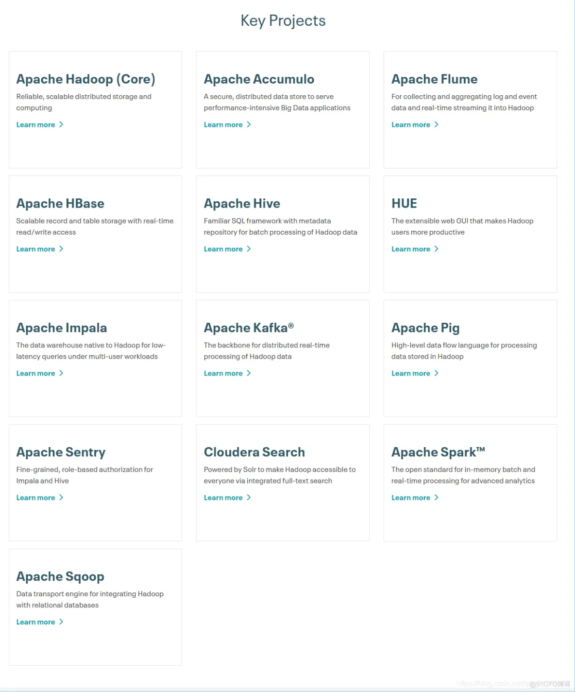
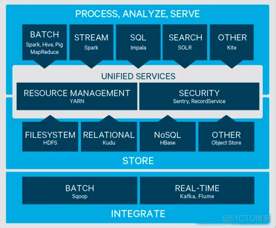
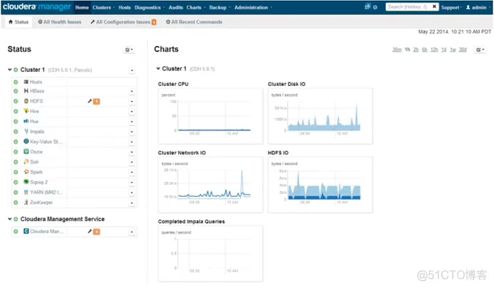
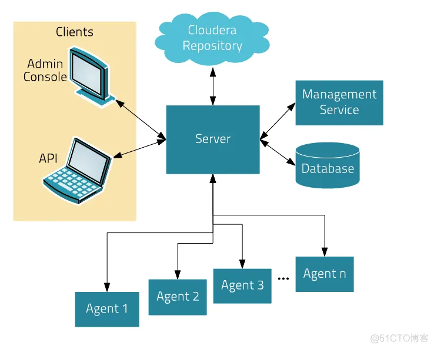

常见的大数据平台由3个：

- Apache Hadoop
- Cloudera DH
- Hortonworks Data Platform

# Apache Hadoop

# Cloudera’s Distribution Including Apache Hadoop（CDH）

CDH是什么，核心组件（ 功能｜组件类型｜工作原理 ）。

1、 CDH 是什么

 CDH是Cloudera的100％开放源代码平台发行版，包括Apache Hadoop，是专门为满足企业需求而构建的。CDH可立即提供企业使用所需的一切。通过将Hadoop与十几个其他关键的开源项目集成在一起，Cloudera创建了功能先进的系统，可以帮助您执行端到端的大数据工作流程。

2、 CDH 的组件

 Hadoop（Core）、Accumulo、Flume、Hbase、Hive、HUE、Impala、Kafka、Pig、Sentry、Spark、Sqoop、CDS

3、 CDH 的功能

 针对于 Apache Hadoop 的不足之处：版本管理混乱、部署过程繁琐、升级过程复杂、兼容性差、安全性低的问题， 通过基于Web的用户界面，支持大多数Hadoop组件，包括HDFS、MapReduce、Hive、Pig、 Hbase、Zookeeper、Sqoop，简化大数据平台的安装和使用难度。

 其具有版本划分清晰、更新速度快、文档清晰、支持多种安装方式、支持Kerberos安全认证的优点。

4、 核心组件CDM（CDH控制台）

CDM（Cloudera Manager），管理CDH端到端的应用。其具有以下功能：

 1、 管理：对集群进行管理，例如添加、删除节点等操作

 2、 监控：监控集群的健康情况，对设置的各种指标和系统的具体运行情况进行全面的监控

 3、 诊断：对集群出现的各种问题进行诊断，并且给出建议和解决方案

 4、 集成：多组件可以进行版本兼容间的整合

 其核心是管理服务器，该服务器承载管理控制台的Web服务器和应用程序逻辑，并负责安装软件，配置，启动和停止服务，以及管理上的服务运行群集。

 其组成部分与功能如下：

 1、 Agent：安装在每台主机上。该代理负责启动和停止的过程，拆包配置，触发装置和监控主机。
 2、 Management Service：由一组执行各种监控，警报和报告功能角色的服务。
 3、 Database：__存储__配置和监视信息。通常情况下，多个逻辑数据库在一个或多个数据库服务器上运行。
 4、 Cloudera Repository：Cloudera管理的分布存储库。
 5、 Clients：是用于与服务器进行交互的接口。
 6、 Admin Console ：基于Web的用户界面与管理员管理集群和Cloudera管理。

 7、 API ：与开发人员创建自定义的Cloudera Manager应用程序的编程接口。

# Hortonworks Data Platform（HDP）