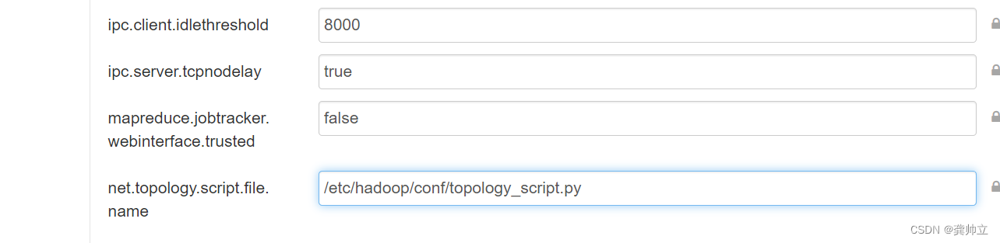
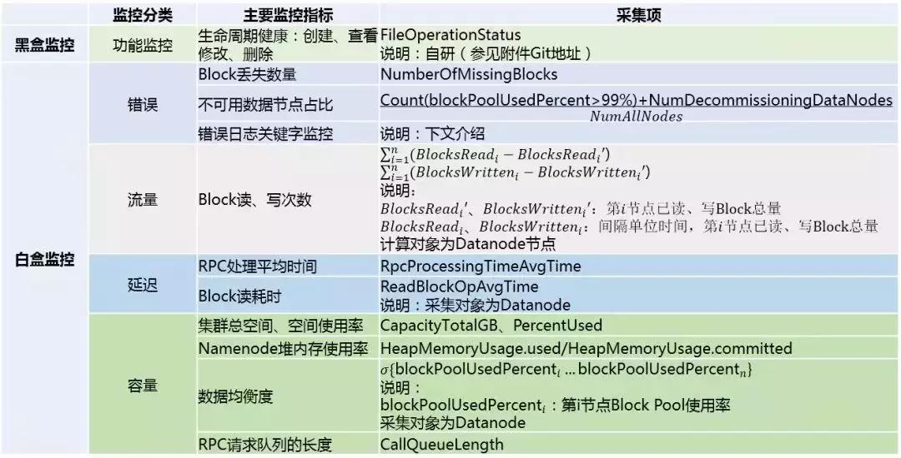
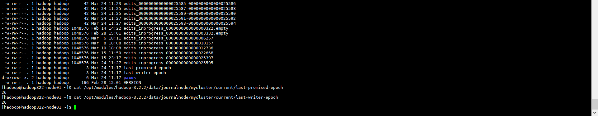
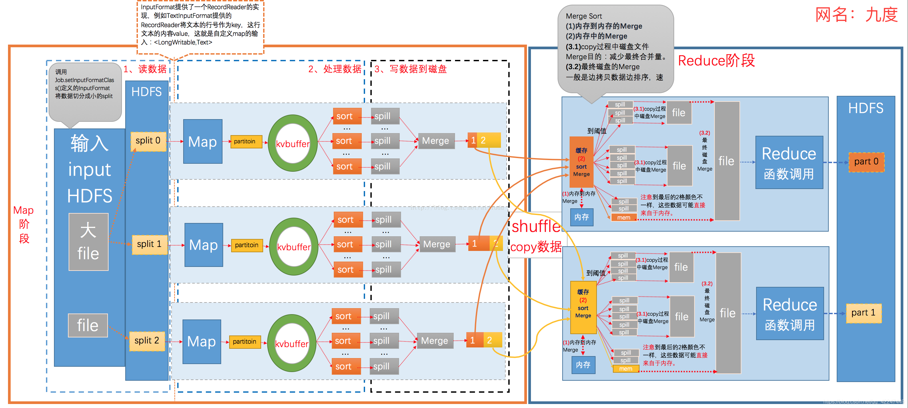
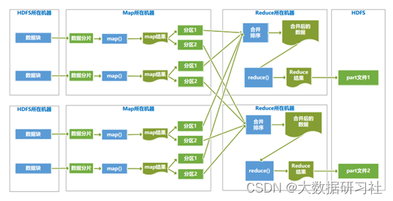
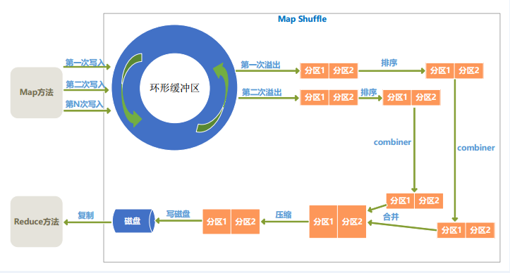
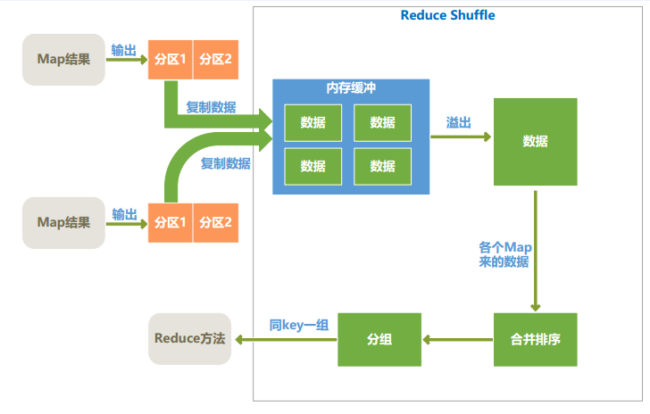
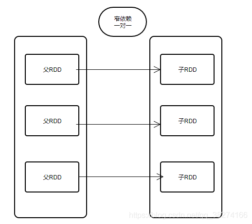
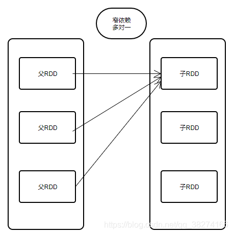
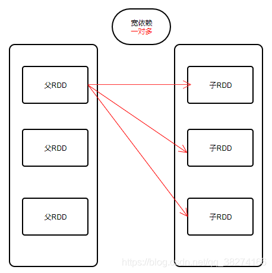

-Q. hdfs/flume/kafka的调优，不仅限于这几个？


Q. hive的查询原理

Q. kafka partition的leader的选举原理


Q. 遇到了什么问题，怎么排查，怎么解决的？

Q. 如果一个flume采数据失败了，如何从之前的offset位置


Q. zk的监听器，当子节点的子节点发生改变会触发通知吗？


# HDFS

Q. hdfs联邦的原理，每一个nn是不是都是单点的，如何解决单点故障的？

**答**：完全分布式+HA+联邦。联邦的nn可以不是单点的，每个都可以配置自己的standby NameNode。联邦和不联邦的不同之处在于，在配置文件中配置了多个namespace，每个namespace有自己的active NN，standby NN。而且解决了单个NN的内存限制了可存储的文件个数的问题。

Q. Hadoop集群如何动态扩容/缩容

**答**：参考：https://www.cnblogs.com/sw-code/p/16388176.html

> - 扩容
>
>   直接新建一个节点（旧的节点需要清空原来的数据目录等），部署上Hadoop，然后hdfs --daemon start xx，yarn --daemon start xx。
>
> - 缩容
>
>   可以通过白名单或黑名单的方式。
>
>   - 白名单，`hdfs-site.xml`中的`dfs.hosts`，表示允许连接到NameNode的DataNode的主机名
>   - 黑名单，`hdfs-site.xml`中的`dfs.hosts.exclude`，表示不允许连接到NameNode的DataNode的主机名
>
> 扩容后需要在`$HADOOP_HOME/etc/hadoop/workers`中添加新的DN的主机名，这样批量启停脚本才能控制到新节点。
>
> 要动态的扩/缩容集群，才有必须要使用到include或exclude方式，来动态上线/下线core节点。

Q. hdfs多租户的权限怎么设置/管理的？

**答**：由sentry，ranger这种组件实现

Q. 如何做到多租户中存储和计算的隔离的？

**答**：存算分离架构，如云上一般都是存储在对象存储中（如OSS、OBS、COS等），然后集群的worker节点只作为计算节点使用，不用考虑存储空间不够用的问题了，只需要根据计算资源的需求进行扩/缩容，升降配等操作。


Q. HDFS是如何解决大规模数据的存储和管理的

TODO

Q. HDFS的架构原理和各核心组件的作用及关系

TODO

Q. HDFS文件系统数据的读写流程

TODO

Q. HDFS的HA的架构原理及核心

TODO

Q. HDFS的Federation机制

TODO

Q. HDSF的HA和Federation的区别
TODO

Q. hdfs中误删数据怎么恢复？除了回收站？

**答**：

> hdfs中要恢复删除的数据有两种方式：
>
> - 如果已开启回收站，可以从回收站里进行恢复
>
> - 如果未开启回收站，但是打过快照，可以通过snapshot进行恢复。参考：https://blog.csdn.net/ywl470812087/article/details/101100937、
>
>   https://help.aliyun.com/document_detail/448522.html
>
> TODO，快照需要具体试验下。


Q. hdfs集群数据迁移怎么做？

**答**：

> 需要看背景。
>
> - 自建集群之间，可以使用开源工具DistCp，
>
> - 如果是云上集群，可以依赖云厂商的产品或工具进行迁移，如腾讯云的COSDistCp、华为云的CDM等。
>
> 通常分为历史（全量）数据迁移和增量数据迁移。


Q. 当前你们公司使用的Hadoop版本是什么

**答**：Apache Hadoop 3.2.2.，Cloudera Hadoop？，云厂商的EMR/MRS等，如腾讯云的EMR-V3.2.1

> hive-3.1.2，spark-3.0.2，ranger-2.1.0， presto-350， flink-1.12.1，sqoop-1.4.7

Q. HDFS常见的数据压缩格式有哪些，介绍其中一种详细的实现方式

**答**：

> 1 gzip压缩
> 优点：压缩率比较高，而且压缩/解压速度也比较快；hadoop本身支持，在应用中处理gzip格式的文件就和直接处理文本一样；有hadoop native库；大部分linux系统都自带gzip命令，使用方便。
> 缺点：不支持split。
> 应用场景：当每个文件压缩之后在130M以内的（1个块大小内），都可以考虑用gzip压缩格式。譬如说一天或者一个小时的日志压缩成一个gzip文件，运行mapreduce程序的时候通过多个gzip文件达到并发。hive程序，streaming程序，和java写的mapreduce程序完全和文本处理一样，压缩之后原来的程序不需要做任何修改。
> 2 lzo压缩
> 优点：压缩/解压速度也比较快，合理的压缩率；支持split，是hadoop中最流行的压缩格式；支持hadoop native库；可以在linux系统下安装lzop命令，使用方便。
> 缺点：压缩率比gzip要低一些；hadoop本身不支持，需要安装；在应用中对lzo格式的文件需要做一些特殊处理（为了支持split需要建索引，还需要指定inputformat为lzo格式）。
> 应用场景：一个很大的文本文件，压缩之后还大于200M以上的可以考虑，而且单个文件越大，lzo优点越明显。
> 3 snappy压缩
> 优点：高速压缩速度和合理的压缩率；支持hadoop native库。
> 缺点：不支持split；压缩率比gzip要低；hadoop本身不支持，需要安装；linux系统下没有对应的命令。
> 应用场景：当mapreduce作业的map输出的数据比较大的时候，作为map到reduce的中间数据的压缩格式；或者作为一个mapreduce作业的输出和另外一个mapreduce作业的输入。
> 4 bzip2压缩
> 优点：支持split；具有很高的压缩率，比gzip压缩率都高；hadoop本身支持，但不支持native；在linux系统下自带bzip2命令，使用方便。
> 缺点：压缩/解压速度慢；不支持native。

Q. HDFS垃圾回收的时间模式是多久，如何修改该时间

**答**：`core-site.xml`中的`fs.trash.interval`，默认为0，修改为360，表示文件在回收站只保留360分钟。`fs.trash.checkpoint.interval`默认为0，修改为60，表示每60分钟做一次checkpoint，表现为.Trash/current目录中的文件移动到时间戳命名的同级目录下。必须小于等于`fs.trash.interval`

Q. HDFS如何生效机架感知，取消机架感知有什么问题

**答**：

> **机架感知（Rack Awareness）的目的**：为了实现容错，HDFS的block management使用机架感知，将block的副本放置在不同的机架。如果取消了机架感知，会导致block的所有副本都放在同一个机架上的机器，容灾效果差一些。
>
> **机架感知配置方式**
>
> Hadoop的主守护进程（我理解就是NameNode）能够通过`core-site.xml`配置文件中配置的脚本或java类来获取worker节点的机架id。
>
> - 外部脚本文件
>
>   如果使用外部脚本，则将在`core-site.xml`配置文件中使用`net.topology.script.file.name`参数指定。与java类不同，Hadoop发行版中不包含外部拓扑脚本，而是由管理员提供。`net.topology.script.number.args`，默认为100，决定每次获取多少个IP的机架id。拓扑脚本的参数就为节点的IP，此配置限制了参数个数。
>
> - java类
>
>   如果使用java类进行拓扑映射，类名由`core-site.xml`配置文件中的`net.topology.node.switch.mapping.impl`参数指定。hadoop发行版中包含一个示例NetworkTopology.java，hadoop管理员可以对其进行自定义。使用Java类而不是外部脚本具有性能优势，因为Hadoop在新的工作节点注册时不需要派生外部进程。
>
> 如果未设置`net.topology.script.file.name`或`net.topologi.node.switch.maping.impl`，则任何IP地址返回的机架id都为`/default rack`。
>
> ```xml
> <name>net.topology.script.file.name</name>
> <value>/etc/hadoop/conf/topology_script.py</value>
> ```
>
> 

Q. HDFS常见的运维操作有哪些，哪些操作是高危的，如果高危操作出现问题，如何解决

**答**：

> hdfs文件夹增改删查
> hdfs用户增改删赋权
>
> `hdfs dfsadmin`
>
> `hdfs haadmin`
>
> hdfs数据均衡
> Kerberos操作最复杂

Q. HDFS常见的故障是什么，如何处理，是否可以给出三种预案来防范大部分常见故障

**答**：

> 定期block全盘扫描，引起dn心跳超时而脱离集群
> ~~namenode迁移裁撤，遇到客户端无法写入~~
> 集群dn不均衡
> namenode设置了HA，但故障时未成功切换
> 集群时间不一致

Q. 你经历过哪些严重的Hadoop故障

**答**：TODO

Q. HDFS常用的IO压力测试工具有哪些

**答**：常用的是Apache JMeter、FIO、Linux的dd命令。TOOD待实操

Q. Hadoop哪些地方依赖于主机名，是否可以全部替换为IP呢（HDFS/YARN/SPARK）

**答**：NameNode、DataNode和SecondaryNameNode都是以hostname启动的了。
使用主机名的作用是为了更快地跳转，如果使用IP可能会走路由，造成访问服务延迟更甚至于报错。TODO待实操

Q. HDFS有哪些核心的指标需要采集和监控，最重要的三个指标是什么

**答**：

- 功能监控

  需要周期性检测HDFS集群能否写入文件，读取文件

- 错误

  - missing block数量
  - 不可用worker节点数量/占比
  - 错误日志关键字监控

- 流量

  block读、写次数

- 延迟

  - RPC处理平均时间
  - block读耗时

- 容量

  - 集群总dfs空间，dfs空间使用率
  - NameNode堆内存使用率
  - 数据均衡度
  - RPC请求队列长度



Q. HDFS节点下线，如何提升其下线速度

**答**：

> 如何让节点快速下线的本质其实就是**提高副本的复制速度**。前提是不影响正常生产任务的进行，不宜调的过高。两个方面考虑。
>
> - **控制namenode任务分发速率**
>
>   在`hdfs-site.xml`中
>
>   ```xml
>   dfs.namenode.replication.max-streams 默认：2 建议： 20。除优先级最高的复制流之外的复制流数量的限制。
>   dfs.namenode.replication.max-streams-hard-limit 默认： 4 建议：40。所有复制流的数量限制。
>   dfs.namenode.replication.work.multiplier.per.iteration 默认： 2 建议：10。这个参数决定了当NN与DN进行心跳（3s）发送任务列表时，告诉每个DN可以进行复制的block数量。比如集群有500个节点，这个值设置为10，那么一次心跳namnode可以发送datanode复制的数据块数量是10*500=5000块。假如一个节点掉线/退役有800000块block需要复制，则namenode需要多长时间可以将待复制块的任务分发完给datanode呢。
>   ```
>
>   修改后重启NameNode。
>
> - **控制datanode之间数据块复制速率**
>
>   在hdfs-site.xml中
>
>   ```xml
>   dfs.datanode.balance.max.concurrent.moves 默认：5 建议： 512。移动数据块的Xceiver的数量上线
>   dfs.datanode.balance.bandwidthPerSec 默认：10485760 建议：524288000。balancer占用的最大带宽
>   ```
>
>   修改后重启DataNode。
>
>   `dfs.datanode.balance.bandwidthPerSec`可以动态设置，如下所示
>
>   ```bash
>   #设置了balancer限流20M，该值可以根据实际情况动态设置，建议不超过100M，以免影响业务
>   hdfs dfsadmin -setBalancerBandwidth 20971520
>   ```

Q. HDFS常见的误删除数据场景，以及如何防止数据被误删除

**答**：

> - HDFS层面开启trash功能（`fs.trash.interval`)
> - 定期作备份操作snapshot

Q. HDFS集群对外提供的访问方式有几种，哪种最为常见，每种方式各自的优缺点和使用场景

**答**：

> 命令行访问
> Web访问–HUE
> Web访问–HDFS的REST API

Q. HDFS你做过哪些性能调优，哪些是通用的，哪些是针对特定场景的

**答**：

| 配置文件      | 配置项                                                 | 维度     | 类型            | 默认值   | 建议值                                                       |
| ------------- | ------------------------------------------------------ | -------- | --------------- | -------- | ------------------------------------------------------------ |
| hdfs-site.xml | dfs.namenode.replication.max-streams                   | 集群维度 | balance相关参数 | 2        | 20                                                           |
| hdfs-site.xml | dfs.namenode.replication.max-streams-hard-limit        | 集群维度 | balance相关参数 | 4        | 40                                                           |
| hdfs-site.xml | dfs.namenode.replication.work.multiplier.per.iteration | 集群维度 | balance相关参数 | 2        | 10                                                           |
| hdfs-site.xml | dfs.datanode.balance.max.concurrent.moves              | 集群维度 | balance相关参数 | 5        | 50                                                           |
| hdfs-site.xml | dfs.datanode.balance.bandwidthPerSec                   | 集群维度 | balance相关参数 | 10485760 | 52428800                                                     |
| hdfs-site.xml | dfs.namenode.handler.count                             | 集群维度 | 运行-性能调优   | 64       | 64-128                                                       |
| hdfs-site.xml | dfs.datanode.max.transfer.threads                      | 集群维度 | 运行-性能调优   | 16480    | 8192                                                         |
| hdfs-site.xml | dfs.datanode.handler.count                             | 集群维度 | 运行-性能调优   | 128      | 128                                                          |
| hdfs-site.xml | dfs.blocksize                                          | 集群维度 | 运行-性能调优   | 128m     | 128-256m                                                     |
|               |                                                        |          |                 |          |                                                              |
| core-site.xml | fs.trash.interval                                      | 集群维度 |                 | 1440     | 1440                                                         |
| core-site.xml | fs.trash.checkpoint.interval                           | 集群维度 |                 | 0        | 0                                                            |
| hdfs-site.xml | dfs.namenode.num.checkpoints.retained                  | 集群维度 |                 | 2        | 2                                                            |
| hdfs-site.xml | dfs.namenode.num.extra.edits.retained                  | 集群维度 |                 | 1000000  | 1000000                                                      |
| hdfs-site.xml | dfs.ha.tail-edits.period                               | 集群维度 |                 | 60s      | 60s                                                          |
| hadoop-env.sh | DNHeapsize                                             | 集群维度 |                 | 2048     | 4096                                                         |
| hadoop-env.sh | Heapsize                                               | 集群维度 |                 | 1024     | 1024                                                         |
| hadoop-env.sh | NamenodeOpts                                           | 集群维度 |                 |          | "-Xms16g -Xmx16g -XX:+UseG1GC -XX:MaxGCPauseMillis=20 -XX:GCPauseIntervalMillis=100 -Dhadoop.security.logger=${HADOOP_SECURITY_LOGGER:-WARN,RFAS} -Dhdfs.audit.logger=INFO,RFAAUDIT" |

Q. Hadoop日常的运维操作有什么管理工具，已经搭建的集群如何使用ambari

**答**：

> 1、HDFS管理操作： hdfs dfsadmin、hdfs haadmin
> 2、文件验证系统：HDFS支持使用fsck命令检测系统故障，fack会反馈各种文件出现的状况，比如文件块丢失、副本数不足等问题。hadoop fsck  
>
> 3、DataNode块扫描任务：每个DataNode都会执行一个块扫描任务，周期性验证所存储块的状态，使得出现问题的块能够容易查找和修复。
> 4、均衡器：hdfs balancer
> 5、Web访问–HUE
>
> 6、ambari、cloudera manager或者云厂商EMR产品对应的管理界面

Q. Hadoop各类角色如何进行扩容，缩容，节点迁移（IP变更）

**答**：现在项目使用的大部分都是集成的大数据集群，角色的扩缩容在界面操作即可。
下面引用其他人的文章https://www.cnblogs.com/sw-code/p/16388176.html

Q. Hadoop各类角色的JVM参数配置如何设定

**答**：TODO

Q. HDFS的block大小如何设置，取决于哪些因素

**答**：

> 我们在HDFS中存储数据是以块（block）的形式存放在DataNode中的，块（block）的大小可以通过设置`dfs.blocksize`来实现；
> 在Hadoop2.x的版本中，文件块的默认大小是128M，1.x老版本中默认是64M；
>
> **HDFS文件块大小设置原理**
> HDFS文件块大小设置主要取决于磁盘传输速率，目前通过Namenode对HDFS元数据进行寻址的时间约为10ms，即查找到目标block的时间为10ms。
> **寻址时间为传输时间的1%时，则为最佳状态**
> 因此，传输时间为10ms/0.01=1000ms=1s
> 目前磁盘的传输速率普遍为100MB/s
> 因此，block大小为1s*100MB/s=100MB
> 因为电脑底层数据采用二进制存储，所以目前的block块官方大小设置为128MB。
>
> 实际项目中可以根据你服务器的网速以及磁盘读写速率来调整:
> 10GE>1GE;
> nvme固态盘>SATA固态盘>机械硬盘

Q. YARN的nodemanager上跑任务的时候，有时候会将磁盘全部打满，如何解决

**答**：

> 在处理问题之前首先要思考一下造成这样问题的原因：
> 1、磁盘太小（扩容）
> 2、YARN参数不合理
> 客户提交任务的操作过于频繁，`yarn.log-aggregation.retain-seconds`参数配置过高，导致汇聚的日志无法在短时时间内释放，从而引起磁盘被占满。还有可能是MR任务有过多的shuffle数据

Q. HDFS集群多个业务方使用时如何提前做好运维规划，如权限，配额，流量突增，数据安全，目录结构

**答**：优先根据哪个项目紧急程度来决定，以及这个业务负责人的难搞程度来决定。TODO

> 容量规划：当前数据量，每日数据增量，一般要保证创建的集群能满足0.5-1年不用扩容，才算合理

Q. HDFS中，小文件的定义是什么，如何对小文件进行统计分析，如何优化该问题

**答**：

> **小文件是指文件size小于HDFS上block大小的文件**。这样的文件会给hadoop的扩展性和性能带来严重问题
>
> hadoop中目录,文件和块都会以对象的形式保存在namenode的内存中, 大概每个对象会占用150bytes. 小文件数量多会大量占用namenode的内存; 使namenode读取元数据速度变慢, 启动时间延长; 还因为占用内存过大, 导致gc时间增加等。
>
> 每隔一段时间对小文件进行merge以便减少小文件数量。
>
> **小文件优化的方向**：
> 准备阶段：
> （1）在数据采集的时候，就将小文件或小批数据合成大文件再上传HDFS；
> （2）在业务处理之前，在HDFS上使用MapReduce程序对小文件进行合并；
> 工作阶段：
> （3）在MapReduce处理时，可采用CombineTextInputFormat提高效率；
> （4）开启uber模式，实现jvm重用；
> 结束阶段：存储方式
> （5）采用Hadoop Archive：一个高效的将小文件放入HDFS块中的文件存档工具，能够将多个小文件打包成一个HAR文件，从而达到减少NameNode的内存使用；
> （6）采用SequenceFile
> SequenceFile是由一系列的二进制k/v组成，如果为key为文件名，value为文件内容，可将大批小文件合并成一个大文件；
>
> （7）如果小文件无可避免, 一般就采用合并的方式解决. 可以写一个MR任务读取某个目录下的所有小文件, 并重写为一个大文件。
>
> 像hive可以使用`insert overwrite`进行读取之后，重写，解决小文件。

Q. HDFS的namenode如何进行主备切换

**答**：`HDFS ZKFC实现NameNode自动切换`

> zkfc的两个功能：NN健康监控和active Namenode选举（ActiveStandbyElectorLock）
>
> fence（隔离）机制
>
> 手动切换namenode的状态
> 适用于当主nemenode节点硬件损坏，需要停机修复时，先手动将状态转移;
> 需要将 namenode1切换为 active 状态的三种方法(namenode1此时为standby)：
> 查看节点状态
> `hdfs haadmin -getServiceState  namenode1`
>
> `hdfs haadmin -getAllServiceState`
>
> 将 active 状态从 namenode2 节点切换到 namenode1 上
>
> (1) `hdfs haadmin -failover namenode2 namenode1`
>
> 将 namenode2 过渡到 Standby；
>
> (2) `hdfs haadmin -transitionToStandby --forcemanual namenode2`
>
> 开启了自动故障转移之后，`-transitionToStandby` 不能使用`--forceactive`来手动故障转移，需要使用`--forcemanual`
>
> ```bash
> [hadoop@hadoop322-node01 ~]$ hdfs haadmin -getAllServiceState
> hadoop322-node01:8020                              standby   
> hadoop322-node02:8020                              standby   
> hadoop322-node03:8020                              active    
> [hadoop@hadoop322-node01 ~]$ hdfs haadmin -transitionToStandby nn3
> Automatic failover is enabled for NameNode at hadoop322-node03/192.168.61.136:8020
> Refusing to manually manage HA state, since it may cause
> a split-brain scenario or other incorrect state.
> If you are very sure you know what you are doing, please 
> specify the --forcemanual flag.
> [hadoop@hadoop322-node01 ~]$ hdfs haadmin -transitionToStandby --forcemanual nn3
> You have specified the --forcemanual flag. This flag is dangerous, as it can induce a split-brain scenario that WILL CORRUPT your HDFS namespace, possibly irrecoverably.
> 
> It is recommended not to use this flag, but instead to shut down the cluster and disable automatic failover if you prefer to manually manage your HA state.
> 
> You may abort safely by answering 'n' or hitting ^C now.
> 
> Are you sure you want to continue? (Y or N) Y
> 2023-03-24 11:16:59,193 WARN ha.HAAdmin: Proceeding with manual HA state management even though
> automatic failover is enabled for NameNode at hadoop322-node03/192.168.61.136:8020
> [hadoop@hadoop322-node01 ~]$ hdfs haadmin -getAllServiceState
> hadoop322-node01:8020                              standby   
> hadoop322-node02:8020                              active    
> hadoop322-node03:8020                              standby   
> ```
>
> 因为将之前的active NameNode切换为了standby，则其他NameNode的ZKFC检测到没有active NameNode了，就会进行再进行选举，选出新的active NameNode，实现了主备切换。
>
> (3) `hdfs haadmin -transitionToActive --forceactive namenode1`
>
> 开启了自动故障转移之后，`-transitionToActive` 不能使用`--forceactive`来手动故障转移，需要使用`--forcemanual`
>
> ```bash
> [hadoop@hadoop322-node01 ~]$ hdfs haadmin -transitionToActive --forceactive nn1
> Automatic failover is enabled for NameNode at hadoop322-node01/192.168.61.129:8020
> Refusing to manually manage HA state, since it may cause
> a split-brain scenario or other incorrect state.
> If you are very sure you know what you are doing, please 
> specify the --forcemanual flag.
> ```
>
> **<font color="red">实际测试过了，开启了自动故障转移之后，这种方式无法手动切换主备。</font>**

Q. 如何防止两个NN都往QJM中写入edits log？

**答**：参考文章：https://www.codenong.com/cs106154575/   https://www.cnblogs.com/lillcol/p/14336425.html

> **隔离双写**
>
> 1.当NameNode 成为active时，都会被赋予一个EpochNumber。
>
> *每个EpochNumber是惟一的，不会有相同的EpochNumber出现。EpochNumber有严格顺序保证，每次NN切换后EpochNumber都会自增1，后面生成的EpochNumber都会大于前面的EpochNumber*
>
> 2.namenode要对edits.log进行修改之前，Namenode会把EpochNumber传递给QuorumJournalManager
>
> 3.QJM把自己的EpochNumber通过newEpoch(N)的方式发送给所有JN结点
>
> 4.当JN收到newEpoch请求后，会把QJM的EpochNumber保存到一个lastPromisedEpoch变量中并持久化到本地磁盘，如下图所示
>
> 
>
> 5.ActiveNameNode同步日志到JN的任何RPC请求（如logEdits(),startLogSegment()等），都必须包含ActiveNameNode的EpochNumber
>
> 6.JN在收到RPC请求后，会将之与lastPromisedEpoch对比，如果请求的EpochNumber小于lastPromisedEpoch,将会拒绝同步请求，反之，会接受同步请求并将请求的EpochNumber保存在lastPromisedEpoch


Q. HDFS的快照原理简要介绍一下，为什么可以确保数据的安全性

**答**：参考：https://xie.infoq.cn/article/297f5bc9cab16afada07d45dd

> - **HDFS snapshot 功能可以创建根目录或指定目录的元数据信息副本，该副本被称为快照；**
> - **由于快照仅是元数据信息，所以具有瞬时创建、只读属性、不影响当前数据的特性；**
> - **快照适用于防止用户误操作、数据备份、灾备恢复及数据测试的应用场景。**


Q. distcp拷贝数据的时候，出现了java.lang.outofmemoryerror:java heap space，如何处理

**答**：参考文章：https://cloud.tencent.com/developer/article/1442329 https://hadoop.apache.org/docs/stable/hadoop-distcp/DistCp.html

**问题原因**：在使用DistCp时，如果copy的文件数/目录数大于100万个，就可能会出现Out Of Memory

**解决方法**：通过如下方式增加DistCp的JVM堆内存。

> ```bash
> export HADOOP_CLIENT_OPTS="-Xms64m -Xmx1024m"
> hadoop distcp /source /target
> ```

Q. 有两个hadoop集群，机器相同，磁盘占用相同，一个集群磁盘的使用率比较均匀，另一个集群磁盘使用率起伏较大（很多写满的，很多使用率很低的），那么第二个集群会有哪些问题？

**答**：

> MR程序无法很好地利用本地计算的优势，机器之间无法达到更好的网络带宽使用率，机器磁盘无法利用等等。
>
> 因为hadoop是移动计算到数据所在节点，如果大多数的数据都在一部分节点上，那么会优先的将计算移动到这些节点，导致这些节点的cpu、内存、磁盘压力都很大，而数据少的节点负载更低，无法充分利用集群的计算和存储
>
> **解决方法**：
> 1、balancer   2、distcp

Q. hdfs namenode启动慢，常见的原因有哪些？如何优化？

**答**：参考文章：https://help.aliyun.com/document_detail/253298.htm

> - 问题现象：NameNode原先正常，重启NameNode过程中非常慢，并且NameNode重启未完成，十几分钟后自动重启了。观察日志时发现正在加载FsImage和EditsLog。
> - 问题原因1：因为NameNode启动过程中加载FsImage和EditsLog会消耗较多的内存。内存不够导致hdfs namenode启动慢
> - 解决方法1：建议调大NameNode HeapSize，详情请参见[调整NameNode JVM内存大小](https://help.aliyun.com/document_detail/266822.htm#section-n1n-0rw-hnv)。
> - 问题原因2：删除大量文件之后立刻重启NameNode（例如删除100万个文件），NameNode启动慢
> - 解决方法2：删除大量文件时，不要立刻重启NameNode，待DataNode删除了对应的Block后重启NameNode，即不会存在这种情况。您可以通过hdfs dfsadmin -report命令来查看磁盘空间，检查文件是否删除完毕。

Q. 为什么NameNode无法响应？

**答**：参考文章：https://help.aliyun.com/document_detail/253298.htm

> 问题现象：NameNode节点长时间满负载，所在节点CPU达到100%，NameNode无法响应。
>
> 问题原因：因为NameNode的内存容量已经无法承担太多的文件，进程在频繁发生FULL GC。
>
> 解决方法：建议调大NameNode HeapSize，详情请参见[调整NameNode JVM内存大小](https://help.aliyun.com/document_detail/266822.htm#section-n1n-0rw-hnv)。

Q. 为什么会有大量的Editslog文件？

**答**：参考文章：https://help.aliyun.com/document_detail/253298.htm

- 问题现象：NameNode节点数据目录占用磁盘空间大，发现有大量的Editslog文件。
- 问题原因：查看Secondary NameNode（非HA集群）或Standby NameNode（HA集群）的健康状态，发现Secondary NameNode或Standby NameNode服务不正常，导致了Editslog文件没有及时合并。服务不正常很可能是内存不够导致的。
- 解决方法：适当调节NameNode的HeapSize，使其正常启动，详情请参见[调整NameNode JVM内存大小](https://help.aliyun.com/document_detail/266822.htm#section-n1n-0rw-hnv)。

Q. 为什么有大量的Under Replicated Blocks？

**答**：参考文章：https://help.aliyun.com/document_detail/253298.htm

- 问题现象：使用`fsck`命令查看，发现有大量Under Replicated Blocks。

- 问题原因：由于Decommission或节点（磁盘）异常下线后，副本数恢复较慢。

- 解决方法：需要恢复副本数，您可以在EMR控制台的HDFS服务的

  配置

  页面，在搜索区域，搜索下表参数并调大参数值。

  | 参数                                                       | 描述                                                         |
  | :--------------------------------------------------------- | :----------------------------------------------------------- |
  | **dfs.namenode.replication.work.multiplier.per.iteration** | 默认值100。建议调大为200，但不超过500。该参数影响NameNode下发给每个DataNode进行副本复制作业任务的并发度，即任务调度速度。该参数是系数值，实际下发任务数为该系数值乘以集群节点个数。 |
  | **dfs.namenode.replication.max-streams**                   | 建议设置为100。该参数负责调节低优先级的块的复制任务的执行并发度。 |
  | **dfs.namenode.replication.max-streams-hard-limit**        | 默认值100。建议调大为200，但不超过500。该参数负责调节所有优先级的块的复制任务的执行并发度，包含最高优先级的块。 |

Q. 如何处理Missing Blocks或Corrupted Blocks问题？

**答**：参考文章：https://help.aliyun.com/document_detail/253298.htm

> 问题现象：使用`fsck`命令查看，提示Missing Blocks或Corrupted Blocks。
>
> 问题原因：可能是DataNode停止了服务，或者是磁盘损坏或异常操作导致数据丢失。
>
> 解决方法：如果之前DataNode停止了服务，请将DataNode重新启动下。 如果是磁盘损坏或异常操作导致数据丢失，需要人工恢复，您可以通过`hdfs fsck / -files`命令扫描损坏的文件，导出文件列表，删除后重新上传。

Q. 如何处理EditsLog不连续导致NameNode启动失败的问题？

**答**：参考文章：https://help.aliyun.com/document_detail/253298.htm

> 问题现象：在JournalNode节点断电，数据目录磁盘占满，网络异常时，重启NameNode失败。
>
> 问题原因：可能是JournalNode上的EditsLog不连续。
>
> 解决方法：某台NameNode EditsLog损坏的情况下，需要手工恢复。
>
> 操作方法如下：
>
> （1）备份NameNode节点元数据的整个目录/mnt/disk1/hdfs，以防误操作的风险。
>
> （2）观察NameNode启动日志，记录加载失败的EditsLog的txid。
>
> （3）登录另外一台NameNode节点，找到并复制相同txid的EditsLog文件，覆盖本节点的同名文件。
>
> （4）重启NameNode，观察是否成功。

Q. hadoop的hdfs、yarn配置的zookeeper，是否可以分开
**答**：

> 不可以，hadoop HA集群中，NameNode和ResourceManager的故障转移都是基于ZooKeeper实现的，其中`core-site.xml`中的`ha.zookeeper.quorum`包含了NameNode和ResourceManager的ZooKeeper连接地址，没有为hdfs或yarn单独配置ZooKeeper连接的地方。

------------------------------------------------------------------------------------------------------------------------------------------------------------------------------

下面几个问题转自：https://mp.weixin.qq.com/s/sbGm6tuENCOv4HnxdZJp6Q

Q. 集群线上扩容如何达到自动化？线上扩容，规模正常都以10+以上，如果都人肉操作，时间投入与产出比不匹配，人力造成很大的不必要浪费，想学习线上集群实际扩容的方案。

**答**：

> 产线环境扩容数量少则几十多则上百，人肉肯定不行，我们公司的运维分为IAAS运维、大数据运维、应用运维，大数据运维工程师在扩容集群时，需要向IAAS运维工程师以工单的方式申请服务器并提出自己的需求，IAAS运维工程师在提供服务器时不管是新采购服务器还是其他集群退役的服务器都需要重装系统，重装系统的镜像是针对大数据定制的，镜像包含了大数据运维工程师的通用需求以及安装操作系统后的网络、磁盘以及其他设置，比如关闭防火墙、时钟同步、同构磁盘挂载、关闭大透明页、关闭SWAP、公用YUM源、禁用SELinux等模式化操作，大数据运维工程师收到服务器后准备工作基本准备完毕了，进行少量准备工作就可以直接进入了CM可视化批量安装模式，比如脚本批量设置hostname、脚本同步/etc/hosts文件等；当然如上所说的IAAS操作，如关闭防火墙、时钟同步、同构磁盘挂载、关闭大透明页、关闭SWAP、公用YUM源、禁用SELinux都可以脚本化，无非就是使用SSH通讯方式设置，这就需要大数据运维同学熟练使用shell了。

Q. 已知一个HDFS的目录，想知道此目录下的文件数，而且存储于哪些DataNode节点上？

**答**：

> 1.查看文件数使用count命令，如下查看/ops目录，目录数为9606，文件数为1353万+，总文件大小为9.7P
>
> 
>
> 
>
> 2.查看/ops/test目录下的文件存储的位置
>
> hdfs fsck /ops/test -files -blocks -locations -racks
>
> 
>
> 
>
> 

Q. DataNode单节点，存储容量大小与当前节点上的CPU，内存硬件之间有什么样的关系，磁盘扩容很容易，但这不意味着单节点上数据盘就可以无限地扩容，因此在这方面，有什么实际线上的经验分享，即这三者间可以遵循怎样合适的关系？

**答**：

> 从我们内部实践来说没有发现三者之间的规律，因为大数据业务每个公司都不一样，有的计算是CPU密集型的，有的计算是内存密集型的、有的计算是IO密集型的；我们的服务器都是中高配置，每个服务器的磁盘是4Tx10、CPU 24core、128G内存。

Q. 老师线上6000+规模集群，抛开一些其它组件集群，仅讨论HDFS数据存储集群，保守理应也在有3000节点左右，想知道这些存储节点只是单集群NameNode集群来维护吗？还是多集群独立维护的，如果是多集群存储数据，它们之间数据是如何打通进行关联的？如果仅是一个集群的话，我想知道这个集群的NameNode上的配置，是如何Hold住这些数据DataNode的？

**答**：

> 我们的集群也是用的Cloudera公司的，我们付了费用，Cloudera没有保障说CM能够纳管1000节点以上的集群，再加上我们的机房有容量限制，所以我们是建了多套集群，最大集群有800+节点，最小集群也有300+节点；800+datanode下，namenode是可以支撑的，像一些互联网大厂，字节跳动、京东等他们的单集群规模有上万节点，此时就需要对hdfs进行深度定制了，他们改了很多源码，而且有200+高级技术维护人员；
>
> 多集群建设要考虑业务情况，比如我们公司有10个以上业务，5大核心集群，按业务相关情况划分集群，不过也难免有跨集群的作业，目前公司内部自研发了大数据采集交换平台，你也可以使用distcp进行数据对拷，目前我们也正在准备自研发多集群并行混算平台。

Q. HDFS存储节点上的数据，存储压缩格式是如何选取的，默认采用哪种文件存储类型与存储格式，冷热数据如何界定的？

**答**：

> 我们产线环境用了gz和snappy压缩格式，gz用于不常用的冷数据，snappy用于热数据；冷热数据是跟业务相关的，后续集群治理的课程中也有冷热数据的区分。


Q. 课堂上看到HDFS集群的DataNode与HBASE是集成在一起部署的，我好奇，HBase面向的都是高频率读写的业务，老师确定部署一起后，线上业务没有出现过问题吗？

**答**：

> 你应该是理解错了，HBase不能跟YARN在一起部署；HBase需要跟HDFS部署在一起的，这样可以利用数据本地性提升IO性能，并且可以降低网络延迟，降低带宽负载。


Q. Yarn集群计算层，目前集群面向用户使用群体少，故白天仅是数据写入，集群CPU资源都较为存在大量冗余状态，但对于凌晨执行集中高频提交跑批作业计算任务时，集群的CPU资源明显不够，甚至引起节点CPU负载过高导致节点的宕机，从而造成集群雪崩。简单来说，白天集群资源使用率在5%，凌晨执行高频跑批作业任务时，资源使用率上到100%，引起集群宕机。在不增加资源的前提下，资源老师会如何划分队列？

**答**：

> 这个划分队列无法解决根本问题，建议将业务划分优先级，错开时间执行。

Q. 某一台CDH物理机12块RAID0硬盘，如果其中有4块RAID0硬盘同时损坏,请问接下来大数据运维人员的详细处理流程是什么？

**答**：

> HDFS有个参数dfs.datanode.failed.volumes.tolerated，值为0的时候表示当有任何盘损坏后datanode则停止服务，如果4快盘同时损坏了，此时datanode进程已经停止了，你可以修改hdfs-site.xml配置文件将损坏的磁盘路径去掉，重启datanode即可，然后进入磁盘报修流程，待磁盘更换后，停止datanode，在hdfs-site.xml配置文件中假如新的磁盘，启动datanode即可。

Q. CDH如果为开发人员提供HIVESERVER2服务，可以让开发人员通过beeline命令访问?

**答**：

> 是的，beeline使用JDBC协议来连接HIVESERVER2。

Q. 在晚高峰期HDFS集群会出现某些datanode不稳定的情况，频繁有datanode脱离节点,该如何处理呢？

**答**：

> 需要找到datanode的具体原因，datanode相对来说还是比较稳定的，需要看下是否是GC问题，如果是的话适当调大内存，再看下最大的打开文件数或进程数的限制是否太小。

Q. CDH集群扩容10台机器后，新加入的Datanode角色数据相对较少，如何处理HDFS的数据分布不均衡的现象呢?

**答**：

> 在内存占用较低的节点上启动balancer脚本，将HDFS中所有节点的存储值中的最低值和平均值的差值设置为5%。
>
> 命令：./start-balancer.sh -threshold 5。

Q. CDH监控项从某种角度来说并不是很细粒度，请问您线上是如何监控的呢，能将详细步骤给我们刨析一下吗?

**答**：

> 目前我们产线环境还是以CDH监控为主，CDH的指标还是挺多的，只不过保留的周期不长，对于排障来说基本够用了，当然我们会推进一些监控工具，后续有Flink监控方面的实战。

Q. 如何基于CDH集群监控大量的小文件的呢？衡量小文件标准，以及出现大量小文件在生产环境该如何解决呢?

**答**：

> CM解决不了大量小文件的监控，需要额外做其他工作，这块在**集群治理**里面我们会详细讲；对于怎么衡量小文件的标准，你可以简单认为小于block size的文件就是小文件，但是在企业真实情况下小文件问题可能更加严重，比如大量10M、几十M以下的文件，单纯技术无法解决问题，需要组织协同，这个在集群治理里面我们会详细讲。

Q. YARN资源调度，生产环境使用CDH如何配置YARN资源队列调度，在咱们后续的课程还会讲吗？

**答**：

>  这个会讲解的，也会讲解我们产线环境是如何划分队列的。

Q. CDH如何对HDFS各级目录做权限管理，目录的配额(即使用HDFS的容量限制)限制呢?

**答**：

> HDFS可通过ACL精细控制目标权限，除了ACL后续我们也会讲sentry；目前我们产线环境没有做容量配额限制，怕影响生产，我们通过**集群治理**来解决容量问题，集群治理是我们的课程内容之一，后续会讲解。


Q. Hdfs,Yarn,MapReduce,Hive,Spark,Storm,Kafka,Flink这些组件您在生产环境的调优参数是如何配置的，后续会为我们分享一些调优参数及说明么?我们也方便对照自己的集群作为参考适当调整。

**答**：

>  这个是会的，我们会讲组件的运维、巡检、监控、参数配置、故障排查等课程内容。


Q. 后期的大数据组件监控项目是针对课上所有的组件进行监控的么？还是只是分享监控思路，代码能给我们学院吗？

**答**：

> 大数据组件监控主要在CM上进行监控，后续有集群治理案例实战，实战代码可以给大家的。

Q.  HDFS集群时时间过程，每次重启都导致40分钟左右才能启动成功，需要调优什么参数让NameNode快一点变为Active呢？为什么调优这些参数后会导致NameNode启动加快呢?

**答**：

> - 降低 BlockReport 时数据规模； NameNode 处理 BR 的效率低主要原因还是每次 BR 所带的 Block 规模过大造成，所以可以通过调整 Block 数量阈值，将一次 BlockReport 分成多盘分别汇报，提高 NameNode 处理效率。可参考的参数为： dfs.blockreport.split.threshold，默认为 1,000,000，当前集群DataNode 上 Block 规模数处于 240,000 ~ 940,000，建议调整为 500,000；
> - 当需要对全集群的 DataNode 重启操作，且规模较大（包括集群规模和数据规模）时，建议在重启 DataNode 进程之后将 NameNode 重启，避免前面的“雪崩”问题；
> - 控制重启 DataNode 的数量；按照当前节点数据规模，如果大规模重启DataNode，可采取滚动方式，以每次 15 个实例, 单位间隔 1min 滚动重启，如果数据规模增长，需要适当调整实例个数；

Q. 生产环境中我们有必要利用 CM 的"图表生成器"来自定义图标形成仪表盘吗?如果有必要，官方提供的度量值太多了，您在是生产环境中都定义了哪些监控图标呢?

**答**：

> 这个我们会在正式课中 CM 监控章节进行讲解，主要是主机以及各个组件的核心指标，当出现问题之后再去查看其他指标即可。

Q. 在录播视频中安装 Spark,Hive 选择依赖是 HDFS，那什么情况下Spark,Hive 需要依赖 HBase 呢?如果 Spark 和 Hive 依赖关系开始选择的是只依赖于 HDFS，后期想要改成依赖 HBase 该如何操作呢?老师您能用大白话给我们解释一下这个依赖关系是干嘛的吗?

**答**：

> 依赖就是想要使用 Spark 和 Hive 分析读取谁的数据，依赖 HDFS 就是使用 Spark 和 Hive 读取 HDFS 数据进行分析，依赖 HBase 就是使用使用 Spark和 Hive 读取 HBase 数据进行分析。
> 在实际的产线环境中很少使用 Spark 和 Hive 依赖 HBase，大多时候都是依赖 HDFS，即读取 HDFS 的数据进行分析，如果后续想要依赖 HBase 再添加第二个 Spark 或 HIve 即可。

Q. 为什么安装 HDFS HA 模式需要自定义一个 nameservice 的名称呢？为什么 apache Hadoop 不直接以 IP 地址来解析呢，而是要在 hdfs-site.xml配置中对 nameservice 通过名称解析成相应的地址，如果采用 IP(比如keepalived)技术不是也可以实现主备切换么,那官方使用 nameservice 的优点在哪呢?

**答**：

> 因为高可用集群中有两个 Na meNode，一个是 Active NameNode，一个是 Standby NameNode，二者可能会发生主从切换，只有 Active NameNode可对外提供服务，所以我们无法确定到底访问哪一个 NameNode，所以需要一个 nameservice 供我们访问，当我们已 nameservice 访问 NameNode 时，客户端会自动判断哪个是 Active NameNode，减轻了用户的成本。
>      IP 应用运维是高可用方案，对 NameNode 还是太简单了， DataNode 要同时跟两个 NameNode 建立连接，上报数据才能快速切换，而且 NameNode主从切换的时候需要校验很多状态，比如 EditLog 是否同步等，使用 IP 的话无法判断这些。

Q. HDFS 的上传和下载都是实际上都是 client 自己完成的，在课堂上老师您说删除并不是 client 自己完成的， client 将需要删除的元数据信息发送给NameNode，而后通过 NameNode 和 DataNode 心跳机制实现，前面的增删查的原理您都说了，那修改 HDFS 文件内容时的原理能帮我们分析一些吗?或者带我们查看一下源码可以吗？

**答**：

> 前面的课程中老师分享过一下源码，同学们觉得太难，后来老师就没有分享，如果大家有这个需求，后边老师可以再给大家查看一下源码，并教大家一些查看分析源码的方法，帮助大家在需要的时候有个更好的理解。本来源码分享不在我们的课程范围内，老师也不是平白无故阅读源码，需要的时候才看，比如修改 HDFS 文件内容老师就没看过。

Q. MapReduce 严格意义上没有组件名称，我理解它只是一个计算思想，那我们可以在 YARN 中看到 MapReduce 的计算过程的身影吗？具体在哪里看呢？

**答**：

> 可以在 YARN 的 WEB UI 中查看运行过程以及运行指标，点进第一列可以查看。

Q. 现在随着云原生技术越来越普及，以 CNCF 组织为首的开源产品Kubernetes 越发火爆，我们后期课程是否会讲解在 Kubernetes 集群中运行大数据组件呢？可以为我们提前爆料一些内容吗？

**答**：

> 目前这期有打算讲解 Flink On Kubernetes 的程序，可能会放到课程后边结合实际的案例进行讲解，便于大家理解。

Q. 生产环境调优 HDFS 集群参数后 CDH 该如何进行平滑重启呢？

**答**：

> ​      （1) 降低 BlockReport 时数据规模； NameNode 处理 BR 的效率低主要原因还是每次 BR 所带的 Block 规模过大造成，所以可以通过调整 Block 数量阈值，将一次 BlockReport 分成多盘分别汇报，提高 NameNode 处理效率。可参考的参数为： dfs.blockreport.split.threshold，默认为 1,000,000，当前集群DataNode 上 Block 规模数处于 240,000 ~ 940,000，建议调整为 500,000；
> ​       （2) 当需要对全集群的 DataNode 重启操作，且规模较大（包括集群规模和数据规模）时，建议在重启 DataNode 进程之后将 NameNode 重启，避免前面的“雪崩”问题；
> ​       （3) 控制重启 DataNode 的数量；按照当前节点数据规模，如果大规模重启DataNode，可采取滚动方式，以每次 15 个实例, 单位间隔 1min 滚动重启，如果数据规模增长，需要适当调整实例个数；

> 

Q. 目前 Hadoop 官方都发布了哪些版本呢?如何区分 Hadoop 所有的发行版本中哪个是稳定版，哪个是测试版，哪个是长期支持版本呢?

**答**：

> 可以查看官方文档的 Latest news，里面有具体说明，见如下方框中的 stable就是稳定的意思，至于是不是长期支持版本需要看版本的特性，这个可能需要联系官方。

Q. `DataXceiver` 这个类的和 `DataNode` 有什么关系呢?网上查阅了相关资料，都说它和文件操作超租期有什么关系，但描述的都模棱两可，老师您能用大白话帮我们解答一下吗？

**答**：

> 首 先 需 要 知 道 DataXceiverServer 是 什 么 ， DataXceiverServer 是DataNode 上一个用于接收数据读写请求的后台工作线程，为每个数据读写请求创建一个单独的线程去处理，这里所说的线程就是 DataXceiver。
>
> 从源码上看 DataXceiver 实现了 Runnable 接口，说明它是一个线程，他包含DataXceiverServer通过查看 DataXceiver 的 run 方法，发现调用的就是 DataXceiverServer 的处理 逻 辑 ， 即 接 收 数 据 读 写 请 求 的 后 台 工 作 线 程 就 是 DataXceiver ，DataXceiverServer 封装了处理逻辑。

Q. 最近大数据运维 JD 上写着"负责公司大数据平台和机器学习平台的运维工作",这两个平台是否就是咱们的 CDH 集群呢？能介绍一下啊机器学习平台的日常运维都有哪些吗?

**答**：

> 按老师的理解都是 hadoop 平台的运维，不过还要具体看企业自身的情况。

Q. 请问一下，可以限制一个队列中 container 的数量吗?

**答**：

> 假如队列中有 1000 核 CPU, 那么该队列最多可以同时运行 1000 个container，可以通过这个简单的转换进行限制。

Q. 老师您遇到 YARN 资源还剩很多(还剩下 50%左右)，但是 MapReduce任务就是卡着不动的场景吗？我把 job 并发度降低就好了。但原因在哪我依旧不知道...

**答**：

> 这个要具体详细查看原因了，卡着不动不代表是整个集群资源的问题，可能是任务本身的数据倾斜，也可能是 GC 问题，也可能是任务所在的服务器负载过高，也可能是所在队列的资源问题。
>
> 并发度越高的话，每个job处理的数据量少，按道理是更不容易出现GC问题。

Q. CDH 是开源的产品，但是 CM 是付费的呀，我们在生产环境中使用 CM 没有向 cloudera 公司交钱是否会收到律师函呢？但是不用 CM 我们又不知道如何管理(搭建，扩容，监控等)CDH 集群了，如果公司不愿意交钱的话我们大数据运维该如何处理呢？

**答**：

> 以后都没有免费的了，不愿意交钱的话可以使用开源社区版，节点不多的话可以人肉运维，自搭建监控平台，节点多的话自己可以写脚本或借助自助化工具运维，比如 ansible 等。

Q. 之前回复得知，线上集群规模是以集群为粒度划分业务线，跨集群间数据也是需要交互，这种业务是如何根据集群来划分？还是说，它们之前数据的交互实时性不高？跨了集群的数据具体是如何能打通的？DistCp跨集群间的数据迁移也觉得它慢。根本无法满足要求。它可配置的参数也配置了。
**答**：

> 实时性要求不好，我们机房有万兆带宽的专线，跨集群同步数据不会同步全量数据，在源端集群会先经过数据过滤，只传输需要的数据。

Q. `HDFS SHELL`命令方式去监控HDFS文件信息这些，如前边就提问的查询文件数，Block块等，对于专业人士偶尔查询，还行，但对于一个外行的人，连如何登录服务器都不知道，但他就是想知道集群的使用情况，老师是如何将这种资讯汇报他们的，或者是收集方案？
**答**：

> 我们将收集的数据写入ES，可以使用kibana制作报表。

Q. DataNode节点间数据均衡这个场景，大规模集群下必定会存在低配置节点，如：CPU/内存/数据盘，这里就仅聊数据盘这个，如：A节点100G，B节点500G，这种情况下，是怎样均衡节点数据的？5%值吗？这里怎么均衡都是无法达到预期的均衡值呀，是直接将A节点下线吗？又比如说同一节点C，挂载了3块数据盘，分别为， /mnt/a/10G,/mnt/b/100G,/mnt/c/500G,这种DataNode节点的均衡数据又应该如何解决的，1000+规模的HDFS应该也不会是3.x版本吧？对于不支持Disk Banancer的2.X版本，解决方案有吗？
**答**：

> 首先异构磁盘确实会带来问题，没有绝对的均衡，存储比率不超过5%算是均衡了；HDFS在写入时有两种选择卷（磁盘）的策略：
>
> - 基于轮询的策（RoundRobinVolumeChoosingPolicy）
>
> - 基于可用空间的策略（AvailableSpaceVolumeChoosingPolicy）
>
>   将这个配置`dfs.datanode.fsdataset.volume.choosing.policy`为`org.apache.hadoop.hdfs.server.datanode.fsdataset.AvailableSpaceVolumeChoosingPolicy`

Q. CDH 是开源的产品，但是 CM 是付费的呀，我们在生产环境中使用 CM 没有向 cloudera 公司交钱是否会收到律师函呢？但是不用 CM 我们又不知道如何管理(搭建，扩容，监控等)CDH 集群了，如果公司不愿意交钱的话我们大数据运维该如何处理呢？

**答**：

> 以后都没有免费的了，不愿意交钱的话可以使用开源社区版，节点不多的话可以人肉运维，自搭建监控平台，节点多的话自己可以写脚本或借助自助化工具运维，比如 ansible 等。

Q. ElasticSearch和HDFS都是分布式文件系统，也都可以做数据存储和检索功能，也都是JAVA开源产品，为什么在大数据领域中HDFS比ES更火呢？
**答**：

> 这两个组件没有可比性，应对的场景不一样，HDFS应用于海量数据存储，ES应用于全文搜索，在电商和搜索引擎用的多

Q. HDFS的数据被删除没法直接被监控，企业中该如何避免开发人员误删除数据免得咱们运维背锅呢？
**答**：

> 打开**审计日志**，并使用filebeat采集然后写入ES中，可以实时查询所有数据的操作。

Q. 大数据安全，权限管理，审计是否有一套完整的解决方案呢？
**答**：

> 目前老师所知，没有一套完整方案，可能商业化产品有，大数据安全可以大概有边界网关的安全，比如云桌面、VPN等，其次是大数据组件自己的安全。
>
> 认证安全：LDAP或Kerberos
>
> 权限管理：sentry或ranger之类的组件实现
>
> 数据传输安全：可以加密

Q. 生产环境中我们有必要利用 CM 的"图表生成器"来自定义图标形成仪表盘吗?如果有必要，官方提供的度量值太多了，您在是生产环境中都定义了哪些监控图标呢?

**答**：

> 这个我们会在正式课中 CM 监控章节进行讲解，主要是主机以及各个组件的核心指标，当出现问题之后再去查看其他指标即可。

Q. 前面我的问题是想了解，冷热数据文件类型与存储压缩，是两个点，老师仅回复了压缩。压缩层，这个细想，它就仅与 CPU 挂钩，没有过多好探讨的，目前 我 好 奇 的 是 对 于 1000 规 模 的 集 群 文 件 存 储 类 型 的 选 择 。ORC,TEXT,Parquert 等这些，都是基于哪方面设计层的。

**答**：

> 我们采集的数据格式是 snappy, 可以认为是 ODS 层；沉淀数据用的 gz;parquet不是不适合数仓，而是对数仓的特定分层来说优势没有体现出来，parquet是当只关注表中的极少的字段的时候优势很明显，在数仓中的ODS、DWD层都是要关注表的几乎所有字段的，这个时候parquet的优势不明显，在DM层和OLAP优势还是比较明显的。

Q. 集群出现故障如何实现自动修复呢?比如一个集群 DataNode 在凌晨 2 点半突然挂了 4 个节点，那时候咱们运维人员已经进入深度睡眠状态，如何让其自动将该节点进程自动拉起呢(此处我们假设进程存放则被成功启动)？

**答**：

> 我们采集了 CDH 的严重事件，更加严重事件盘点是否有 datanode 挂掉了，如果有则调用 CDH API 启动 datanode。此外我们每天都有人轮流值班的。

Q. 缺少大一统的开源监控解决方案，各公司都得自行研发相关的大数据监控平台吗？

**答**：

> 一般是开源加二次开发，很难有完美的方案。

Q. 分布式集群中为什么会有Master？
**答**：

> 在分布式环境中，有些业务逻辑只需要集群中的某一台机器进行执行，其他的机器可以共享这个结果，这样可以大大减少重复计算，提高性能，于是就需要进行leader选举。

Q. 首次启动 HDFS 时，必须对其进行格式化操作的命令？
答：

> ```bash
> bin/hdfs namenode -format或者bin/hadoop namenode –format
> ```

Q. 单独启停HDFS 进程命令？
**答**：

> 1）启停NameNode
>
> ```bash
> bin/hdfs --daemon start namenode
> bin/hdfs --daemon stop namenode
> ```
> 2）启停DataNode
>
> ```bash
> bin/hdfs --daemon start datanode
> bin/hdfs --daemon stop datanode
> ```

Q. NameNode的主要功作用有哪些?
**答**：

> - 管理文件系统文件的元数据信息(包括文件名称、大小、位置、属性、创建时间、修改时间等等)。
>
> - 维护文件到块的对应关系和块到节点的对应关系。
>
> - 维护用户对文件的操作信息(文件的增删改查)。

Q. 一个datanode 宕机,怎么恢复？
**答**：

> Datanode宕机了后，如果是短暂的宕机，可以实现写好脚本监控，将它启动起来。如果是长时间宕机了，那么datanode上的数据应该已经被备份到其他机器了，那这台datanode就是一台新的datanode了，删除他的所有数据文件和状态文件，重新启动。

Q. Hadoop 的 namenode 宕机,怎么解决？
**答**：

> 先分析宕机后的损失，宕机后直接导致client无法访问，内存中的元数据丢失，但是硬盘中的元数据应该还存在，如果只是节点挂了，重启即可。
> 如果是机器挂了，重启机器后看节点是否能重启，不能重启就要找到原因修复了。但是最终的解决方案应该是在设计集群的初期就考虑到这个问题，做namenode的HA。
>
> 提高容错：
>
> - 将持久化存储在本地硬盘的文件系统元数据备份。
>
> - 运行一个辅助的NameNode（Secondary Namenode）。
> - zookeeper提供的高可用（ha）机制。hadoop HA 集群部署。


Q. hadoop出现文件块丢失怎么处理？
**答**：

> 首先需要定位到哪的数据块丢失，可以通过查看日志进行检查和排除，找到文件块丢失的位置后，如果文件不是很重要可以直接删除，然后重新复制到集群上一份即可，如果删除不了，每一个集群都会有备份，需要恢复备份。

Q. 当hdfs小文件数量过多时，如何合并小文件？
**答**：

> （1）当每个小文件数据量比较小的时候，可以通过命令的方式进行小文件的合并如：
>
> ```bash
> hdfs dfs -cat hdfs://mycluster/logs/*.log | hdfs dfs -appendToFile - hdfs://mycluster/logs/largeFile.log。
> ```
>
> （2）当数据量比较大的时候建议使用MR进行小文件的合并。


Q. hdfs 常见的数据压缩算法？
**答**：

> - Gzip 压缩
> - Bzip2 压缩
> - Lzo 压缩
> - Snappy 压缩


Q. 有180M的文件写入HDFS是先写128M 复制完之后再写52M 还是全部写完再复制？
**答**：

> HDFS上在写入数据的时候，首先会对数据切块，然后从客户端到datanode形成一个管道，在至少将一个文件写入hdfs上后，表示文件写入成功，然后进行复制备份操作，所以是全部写完再复制。
>
> **感觉不对吧TODO**


Q. hadoop集群可以运行的3个模式是什么？
**答**：

> - 单机模式
> - 伪分布模式
> - 分布式


Q. 请列出正常的hadoop集群中都分别需要启动哪些进程，他们的作用分别都是什么？请尽量列的详细一些。
**答**：

> - NameNode ：管理hdfs名字空间、数据块映射关系，配置副本策略，接受读写请求。
> - DataNode：存储数据，执行数据的读写操作。
> - ResourceManager：处理客户端请求，启动并监控ApplicationMaster，监控NodeManager，资源分配与调度。
> - NodeManager：单节点资源管理，处理来自ResourceManager和ApplicationMaster的指令。
> - Zookeeper：协调服务，实现NN  RM 高可用 。
> - FailoverController（zkfc ）：不断监听本机NN的状态，然后周期性的向Zookeeper发送心跳，如果当前NN关掉了，重新选举NN Active。
> - journalnode：确保两个NN元数据保持同步。


Q. Hadoop中`libjars`参数的作用及使用？
**答**：

> （1）作用：指定MR第三方jar包
>
> （2）使用：hadoop     jar     wordcount.jar      com.dajiangtai.WordCount   -libjars    $LIBJARS   input  output 注：libjars这个参数一定要放到类名的后面，参数的前面。这样就可以方便使用第三方jar包了。


Q. Hadoop的性能调优从哪些方面着手？
**答**：

> - 硬件方面（网络，多磁盘，多机架）---系统集成人员来做 ，机架分开，节点均匀放置。
>
> - 操作系统参数调优         
>
>   - 多个网卡：多网卡绑定，做负载均衡或者主备
>   - 磁盘：多个磁盘挂载到不同目录下，存放数据做计算的磁盘不要做raid
>   - 增大同时打开的文件数目的上线
>   - 关闭swap 分区，避免内存与磁盘交换数据（内存不足）
>   - 设置合理的预读取缓冲区大小（磁盘I/O是瓶颈，CPU 和 内存配置一般较高）
>   - 文件系统的选择与配置 ：Linux有很多文件系统，比如ext3和ext4，不同文件系统性能有差异。ext4性能可靠性更好
>   - I/O调度器选择：CFQ （Completely Fair Scheduler（完全公平调度器））（cfq）、Noop 调度器（noop）、截止时间调度器（deadline）
>
> - jvm层面  
>
>   - http://www.cnblogs.com/edwardlauxh/archive/2010/04/25/1918603.html
>
>   - 使用最新稳定版jdk
>
>   - gc算法 选择
>
>   - 如何监控jvm
>
>     ```bash
>     jstat -gcutil 12122 1000               
>     jvisualvm+jstatd
>     ```
>
> - hadoop层面性能调优
>
>   - 守护进行内存调优
>
>     - NameNode和DataNode内存调整在hadoop-env.sh文件中 
>
>       NameNode
>
>       ```bash
>       export HADOOP_NAMENODE_OPTS="-Xmx512m -Xms512m -Dhadoop.security.logger=${HADOOP_SECURITY_LOGGER:-INFO,RFAS} -Dhdfs.audit.logger=${HDFS_AUDIT_LOGGER:-INFO,NullAppender} $HADOOP_NAMENODE_OPTS" 
>       ```
>
>       DataNode
>
>       ```bash
>       export HADOOP_DATANODE_OPTS="-Xmx256m -Xms256m -Dhadoop.security.logger=ERROR,RFAS $HADOOP_DATANODE_OPTS"
>       ```
>
>       **注意： `-Xmx`、` -Xms`这两个参数一般保持一致，以避免每次垃圾回收完成后JVM重新分配内存**
>
>     - REsourceManager和NodeManager内存调整在yarn-env.sh文件中 
>
>       REsourceManager： 
>
>       ```bash
>       export YARN_RESOURCEMANAGER_HEAPSIZE=1000  默认 
>       export YARN_RESOURCEMANAGER_OPTS="..........."可以覆盖上面的值   
>       ```
>
>       NodeManager： 
>
>       ```bash
>       export YARN_NODEMANAGER_HEAPSIZE=1000 默认 
>       export YARN_NODEMANAGER_OPTS="";可以覆盖上面的值   
>        
>       ```
>
>       常驻内存经验配置： 
>
>       - namenode:16G 
>
>       - datanode:2-4G 
>
>       - ResourceManager:4G 
>
>       - NodeManager:2G 
>
>       - Zookeeper：4G 
>
>       - Hive Server：2G 
>
>   - mr中间目录要配置多个，分散IO压力
>
>      http://hadoop.apache.org/docs/r2.6.0/ 
>
>     查看yarn-default.xml，分散IO压力
>
>     `yarn.nodemanager.local-dirs`
>     `yarn.nodemanager.log-dirs`
>
>     配置文件`mapred-default.xml`： `mapreduce.cluster.local.dir`
>
>     配置文件`hdfs-default.xml`：提高可靠性 `dfs.namenode.name.dir`、`dfs.namenode.edits.dir`、`dfs.datanode.data.dir`
>
>   - mr中间结果要压缩
>
>     - 配置mapred-site.xml文件中配置
>
>       ```bash
>       mapreduce.map.output.compress      true
>       mapreduce.map.output.compress.codec      org.apache.hadoop.io.compress.SnappyCodec
>       程序运行时指定参数 hadoop jar /home/hadoop/tv/tv.jar MediaIndex                -Dmapreduce.compress.map.output=true                -Dmapreduce.map.output.compression.codec=org.apache.hadoop.io.compress.SnappyCodec                /tvdata /media
>       ```
>
>       
>
>     - 使用合理的压缩算法（cpu和磁盘） 
>
>       cpu：如果是cpu的瓶颈，可以更换速度快的压缩算法
>
>       磁盘：如果是磁盘的瓶颈，可以更换压缩力度大的压缩算法 一般情况我们使用snappy 压缩，比较均衡
>
>   - hdfs文件系统中避免，大量小文件存在。
>
>   - 根据具体情况，在Map节点使用Combiner，减少输出结果。
>
>   - 重用Writable类型，比如 声明一个对象Text word = new Text(); map(),reduce()方法里面重用。
>
>   - 根据集群节点具体情况，调整task的并行度
>
>     设置map和reduce最大任务个数： 
>
>     `mapreduce.tasktracker.map.tasks.maximum `
>
>     `mapreduce.tasktracker.reduce.tasks.maximum`   
>
>     设置map和reduce 单个任务内存大小： 
>
>     `mapreduce.map.memory.mb`   1G 默认 
>
>     `mapreduce.reduce.memory.mb` 1G 默认。

 

Q. 怎样对大数据集群进行有效监控？如何实现预警、报警？
**答**：

> - 可以有很多方式对大数据集群进行监控 
>   - 可以使用Ambari或者CM进行监控。
>   - 也可以购买第三方服务来进行监控，如腾讯的蓝鲸。
>
> - 如何实现预警、告警
>
>   如果使用Ambari或者CM，可以使用alert来实现。

119、Hadoop 特性优点?
**答**：

> - 扩容能力
> - 成本低
> - 高效率
> - 可靠性

Q. Hadoop的核心组件是哪些?
**答**：

> - HDFS
> - MapReduce
> - Yarn

Q. Hadoop目前有几个版本?
**答**：

>  目前hadoop有1.x、2.x、3.x。三个大版本。

Q. 设置主机名在哪一个文件中？
**答**：

> `/etc/sysconfig/network`文件中。

Q. 配置IP、主机名映射的文件是哪一个？
**答**：

> `/etc/hosts`文件。

Q. 安装hadoop3.x时需要配置的文件有哪些?
**答**：

> 假设就hadoop的基础组件, HDFS，MapReduce, YARN
>
> `$HADOOP_HOME/etc/hadoop/hadoop-env.sh`
> `$HADOOP_HOME/etc/hadoop/mapred-env.sh`
> `$HADOOP_HOME/etc/hadoop/yarn-env.sh`
> `$HADOOP_HOME/etc/hadoop/core-site.xml`
> `$HADOOP_HOME/etc/hadoop/hdfs-site.xml`
> `$HADOOP_HOME/etc/hadoop/mapred-site.xml`
> `$HADOOP_HOME/etc/hadoop/yarn-site.xml`
> `$HADOOP_HOME/etc/hadoop/workers`


------------------------------------------------------------------------------------------------------------------------------------------------------------------------------


Q. 一个hadoop集群，hdfs副本数为3，此时存入1G数据。然后修改hdfs配置文件，将副本设置为2，然后重启hadoop集群，此时再存入1G数据。请问此时hdfs集群上数据量一共有多大？

**答**：

> 第一次：存1G数据，`1G * 3=3G` 
>
> 第二次：存入1G数据，`1G*2=2G`（**配置修改重启后，只对后续接入的数据有效，已经存入的数据如果想改副本需要通过命令行来修改**，如`hadoop fs -setrep -w -R 1 /user/hadoop/dir1`） 总数据大小：`3G+2G=5G`

Q. HDFS元数据都会存在于NameNode的内存中，因此NameNode的内存大小直接决定了集群支持的最大容量，那么如何估算NameNode需要的内存大小？比如一个含有200个节点的集群，每个节点有24TB的磁盘，每个Block的大小为128MB，每个块有3个副本，那么请问，在这种场景下需要NameNode的内存大小为多少？前提条件：一般1GB内存可以管理100万个block文件

**答**：

> 每个文件都要在namenode上建立一个索引,这个索引的大小约为*150byte*
>
> 先计算块文件的个数：`200*25165824MB(24TB)/128*3=13107200` 一般1GB内存可以管理100万个block文件 参照该方法计算最终大概需要13.1072GB的内存。除此之外还要基于性万个block文件，所以在选择NameNode内存时要选择一个大于该值的一个合理的整数值

Q. 简述namenode的HA机制。他是如何实现故障切换的？

**答**：

> **1、通过QJM解决NameNode元数据共享存储问题**
>
> NameNode记录了HDFS的目录文件等元数据，客户端每次对文件的增删改等操作，Namenode都会记录一条日志，叫做editlog，而元数据存储在fsimage中。为了保持Stadnby与active的状态一致，standby需要尽量实时获取每条editlog日志，并应用到FsImage中。这时需要一个共享存储存放editlog，standby能实时获取日志。
>
>  有两个关键点需要保证：
>
>  1）**共享存储是高可用的**。 
>
>  2）**需要防止两个NameNode同时向共享存储写数据导致数据损坏**。
>
>  共享存储常用的方式是Qurom Journal Manager，QJM可以认为是包含一些JournalNode的集群，JournalNode运行在不同的机器上，每个JournalNode是一个很轻量的守护进程，所以可以部署在hadoop集群的节点上，QJM中至少要有3个JournalNode，因为edit log必须要写到JournalNodes中大部分节点中，比如运行3,5,7个JournalNode，如果你运行了N个JournalNode，那么系统可以容忍最多(N-1)/2个节点失败。
>
> 
>
> 共享存储实现逻辑：
>
>  1）初始化后，Active NN把editlog写到大多数JN并返回成功（即大于等于N+1）即认定写成功。
>
>  2）Standby NN定期从JN读取一批editlog，并应用到内存中的FsImage中。
>
>  3）NameNode每次写Editlog都需要传递一个编号Epoch给JN，**JN会对比Epoch，如果比自己保存的Epoch大或相同，则可以写**，JN更新自己的Epoch到最新，否则拒绝操作。**在切换时，Standby转换为Active时，会把Epoch+1，这样就防止即使之前的NameNode向JN写日志，即使写也会失败**。
>
> **2、利用Zookeeper实现NameNode故障转移**
>
> **3、HDFS2 NN的主备切换流程**

Q. hdfs数据块的默认大小是多少？过大过小有什么优缺点？

**答**：

> 默认大小在Hadoop2.x版本中是128M，老版本是64M。一般块大小有寻址时间和网络传输时间决定的，寻址时间占网络传输时间的1%。一般寻址时间为10ms。
>
> **块不能设置过大或过小**
>
> - 块过小，会增加寻址时间，程序一直在找块的开始位置。
> - 块过小，会导致NameNode要存储更多的元数据信息，增加NameNode的压力。
> - 块过大，从磁盘传输数据的时间会明显大于寻址时间（定位这个块的开始位置的时间），导致程序在处理这些数据块时非常慢。
>
> - 块过大，mapreduce中 map任务通常一次只处理一个块中的数据,块大则任务数少，少于集群中的节点数,作业的运行速度会比较慢。且每个作业处理的数据量也变大了，也会降低任务执行速度。

Q. 简述hadoop的副本策略？副本过多过少有什么优缺点？

**答**：

> 1、默认的副本策略：**BlockPlacementPolicyDefault**。
>
> - 1st replica. 如果写请求方所在机器是其中一个datanode,则直接存放在本地,否则随机在集群中选择一个datanode。
> - 2nd replica. 第二个副本存放于不同第一个副本的所在的机架。
> - 3rd replica.第三个副本存放于第二个副本所在的机架,但是属于不同的节点。
> - 剩下其它的副本随机选择存储的位置。
>
> 2、副本过多导致存储空间的浪费，增加节点之间数据传输对时间和资源的消耗，副本过少容易导致数据丢失，起不到数据安全可靠的作用。

Q. DataNode副本存储策略？如果Hadoop在保存副本的时候，比如，第二个副本存完毕，向第三个副本存入数据时DataNode挂了，会出现什么情况？

**答**：

> 1、默认的副本策略：**BlockPlacementPolicyDefault**。
>
> - 1st replica. 如果写请求方所在机器是其中一个datanode,则直接存放在本地,否则随机在集群中选择一个datanode。
> - 2nd replica. 第二个副本存放于不同第一个副本的所在的机架。
> - 3rd replica.第三个副本存放于第二个副本所在的机架,但是属于不同的节点。
> - 剩下其它的副本随机选择存储的位置。
>
> 2、数据复制过程中出现问题怎么解决？
>
> - 这个问题其实也是写数据过程，当数据写入DataNode的过程中，当其中一个DataNode挂掉了，会将这个DataNode移除流水线，然后将数据写入到剩余的datanode。
> - 在写入结束后， namenode会收集datanode的信息，发现此文件的数据块的replication没有达到配置的要求（default=3）,然后再选择一个datanode保存副本。

Q. 客户端向HDFS写入数据过程？

**答**：TODO

Q. 客户端从HDFS读数据过程？

**答**：TODO

Q. datanode什么情况下不会备份?

**答**：

> 设置备份数为1时, 就不会备份了。
>
> **延申**：Hadoop中在哪里设置备份数, 是哪个字段?
>
> 在`hdfs-site.xml`中的`dfs.replication`变量。

Q. 三个datanode中当有一个datanode出现错误时会怎样？

**答**：TODO

Q. fsimage和editlogs是做什么用的?

**答**：

> **命名空间镜像(FSlmage)**：HDFS的目录树及文件/目录元信息是保存在内存中的，如果节点停电或进程崩溃，数据将不再存在,必须将上述信息保存到磁盘,Fslmage就是保存某一个时刻元数据的信息的磁盘文件。
>
> **镜像编辑日志(EditLog)**：对内存目录树的修改，也必须同步到磁盘元数据上，但每次修改都将内存元数据导出到磁盘，显然是不现实的，为此，namenode引入了镜像编辑日志，将每次的改动都保存在日志中，如果namenode机器宕机或者namenode进程挂掉后可以使用FSlmage和EditLog联合恢复内存元数据。

Q. Linux中的块大小为4KB, 为什么HDFS中块大小为64MB或128MB?

**答**：

> - 块是存储在文件系统中的数据的最小单元. 如果采用4kb的块大小来存放存储在Hadoop中的数据, 就会需要大量的块, 大大增加了寻找块的时间, 降低了读写效率。
> - 一个map或者一个reduce都是以一个块为单位处理, 如果块很小, mapreduce任务数就会很多, 任务之间的切换开销变大, 效率降低。

Q. 并发写入HDFS文件可行吗?

**答**：

> 不行。因为客户端通过namenode接收到在数据块上写入的许可后, 那个块会锁定直到写入操作完成, 所以不能在同一个块上写入。

Q. 

# YARN

Q. Hadoop如何快速杀死一个job？
**答**：

> 1、执行 `hadoop job -list` 拿到 job-id
> 2、`hadoop job -kill job-id`

Q. yarn的工作流程？

TODO

Q. 在yarn中，一个job 的运行流程是怎样的？
**答**：

> 步骤1：用户向YARN中提交应用程序，其中包括ApplicationMaster程序、启动ApplicationMaster、用户程序等。
> 步骤2：ResourceManager为该应用程序分配第一个Container，并与对应的NodeManager通信，要求它在这个Container中启动应用程序的ApplicationMaster。
> 步骤3：ApplicationMaster首先向ResourceManager注册，这样用户可以直接通过ResourceManager查看应用程序的运行状态，然后它将为各个任务申请资源，并监控他的运行状态，直到运行结束，即要重复步骤4-7。
> 步骤4：ApplicationMaster采用轮询的方式通过RPC协议找ResourceManager申请和领取资源。
> 步骤5：一旦Application申请到资源后，便与对应的NodeManager通信，要求启动任务。
> 步骤6：NodeManager为任务设置好运行环境，包括环境变量、JAR包、二进制程序等，然后将任务启动命令写到另一个脚本中，并通过运行该脚本启动任务。
> 步骤7：各个任务通过RPC协议向ApplicationMaster汇报自己的状态和进度，ApplicationMaster随时掌握各个任务的运行状态，从而可以再任务失败时重新启动任务。在应用程序运行过程中，用户可以随时通过RPC协议ApplicationMaster查询应用程序的当前运行状态。
> 步骤８：应用程序运行完成后，ApplicationMaster向ResourceManager注销并关闭自己。

Q. yarn中的capacity调度器，若一个队列资源使用过大，影响了其他队列中的任务该怎么处理?

TODO

Q. YARN的nodemanager导致机器死机，如何解决

**答**：

> 1、重启服务器
> 2、恢复业务
> 3、查看YARN日志/opt/modules/hadoop-3.2.2/logs/hadoop-hadoop-nodemanager-hadoop322-node01.log

Q. 如何下线YARN的nodemanager节点，假如该节点持续在运行计算任务

**答**：

> 下线服务前需要提前与研发、数仓沟通会不会影响业务计算和运行状态，直接在ambari或者cdh关掉服务即可
> 如该节点持续在运行计算任务，需先停止计算任务或者杀掉任务。
>
> mr任务、spark任务都有自动重试的机制，仅因为下线节点而导致job失败一次，不会导致application失败，而是会重试。
>
> flink任务，需要看该任务是否配置了失败重试机制，没有配置flink任务就会直接失败了。
>
> 可参考：https://blog.csdn.net/u010834071/article/details/114596997

Q. YARN的nodemanager节点，从Active Nodes转为Lost Nodes，有哪些原因，在哪里设置

**答**：

> YARN WEB UI 运行状态查看集群整体情况，发现 LOST 节点
> Yarn 显示资源使用率达到 100%，而集群节点内存，CPU 等资源却使用不是很高。
> Yarn 在配置时，通过设定每个 NodeManager 可以分配的 Container 内存， 以及 CPU，来设定每个节点的资源。目前每个 NodeManager 配置了 120G，CPU 配置了 32VCore。
> 目前集群可能存在的问题是，每个 Container 分配的资源过高，实际任务并不需要这么多资源，从而出现了资源被分配完，但是使用率低的情况。
>
> https://juejin.cn/post/7056610580655767565

Q. YARN的nodemanager节点如果转为Lost Nodes后，该节点上的计算任务是否还会正常继续

**答**：可以

Q. YARN的yarn.nodemanager.local-dirs和yarn.nodemanager.log-dirs参数应该如何设置，有哪些常见的问题

**答**：

> yarn.nodemanager.local-dirs
> 参数解释：中间结果存放位置，类似于1.0中的mapred.local.dir。注意，这个参数通常会配置多个目录，已分摊磁盘IO负载。
> 默认值：${hadoop.tmp.dir}/nm-local-dir
>
> yarn.nodemanager.log-dirs参数解释：日志存放地址（可配置多个目录）。
> 默认值：${yarn.log.dir}/userlogs
>
> 常见问题：磁盘IO过大、日志存放磁盘超限

Q. NodeManager节点会将当前节点的DataNode实时上报给RescourceManager，但您之前说HDFS集群的唯一访问入口是NameNode，那是否每台NodeManager在收集本地的DataNode数据时都得访问NameNode获取呢？如果是的话也太浪费HDFS性能了吧，如果不是那是NodeManager是采用什么机制实现不经过NameNode就能获取一个DataNode的数据呢？
**答**：

> "NodeManager节点会将当前节点的DataNode实时上报给RescourceManager",这个说法是不对的，应该是DataNode上报自己的block给NameNode，RescourceManager和NodeManager管的是资源而不是数据。当作业要读取hdfs数据的时候仅仅从NameNode上获取数据的位置，而不会获取数据本身，得到数据的位置后作业再去找DataNode获取数据本身。

Q. 为什么会产生YARN，它解决了什么问题？有什么优势？
**答**：

> （1）产生原因
>
> MapReduce存在的问题：
>
> - JobTracker 单点故障。
> - JobTracker 承受的访问压力大，影响系统的扩展性。
> - 不支持MapReduce之外的计算框架，比如Storm、Spark、Flink。
>
> （2）解决的问题
>
> - yarn 解决了JobTracker 负载过重的问题， 将MR1中JobTracker的资源管理和作业调度两个功能分开，分别由ResourceManager和ApplicationMaster进程来实现。
> - 支持更多的计算框架，MapReduce、storm、Spark、Flink都可以运行在yarn上面。
>
> （3）优势
>
> - 更快地MapReduce计算。
> - 对多框架支持。
> - 框架升级更容易。

Q. 简述Hadoop有哪些调度器？
**答**：

>  hadoop中常用的调度器有三种：
>
> - **FIFO**：（hadoop2.x之前的默认调度器），它先按照作业的优先级高低，再按照到达时间的先后选择被执行的作业。
> - 计算能力调度器（容量调度器）**Capacity scheduler**：（hadoop2.x之后的默认调度器）支持多个队列，每个队列可配置一定的资源量，每个队列采用FIFO调度策略，为了防止同一个作业独占队列中的资源，该调度器会对同一用户提交的作业所占资源进行限定。调度时，首先按照以下策略选择一个合适队列：计算每个正在运行任务数与其应该分得的计算资源之间的比值，选择一个该比值最小的队列；然后按以下策略选择队列中一个作业，按照作业优先级和提交时间顺序选择，同时考虑用户资源量限制和内存限制。
> - 公平调度器**Fair scheduler** :  同计算能力调度器类似，支持多队列多用户。每个队列的资源量可配置，同一队列中的作业公平共享队列中所有资源。


Q. 我们该如何选择调度器？
**答**：

> 如果你的场景需要先提交的JOB限制性，那就FIFO。
> 如果想着大家都有机会获取到资源，就得用容量调度，公平调度。容量调度不好的地方是多个队列资源不能相互抢占，提前就把资源分走了，哪怕那个队列没有任务，所以一般都是公平调度。
> FIFO调度没人单独用。公平调度支持在某个队列内部选择公平调度还是FIFO。
> 所以可以认为公平调度是一个混合的调度器。


# MapReduce

Q. MapReduce的基本概念

**答**：参考文章：https://blog.csdn.net/weixin_46002001/article/details/124125960

> MapReduce是Hadoop中负责计算部分。主要分为split、map、shuffle、reduce四个阶段，以wordcounter为例解释：
> 1）Split：MapReduce会将输入文件进行切块（默认以128M为单位进行切割），每一份代表每一行。
> 2）Map：解析每一行中的每个单词，并标记1，表示此单词出现了一次
> 3）Shuffle：将每一份中相同的单词分组到一起，并按照字母顺序进行升序排序
> 4）Reduce：将每一组中的单词出现次数进行累加求和。
> 最后将整理好的数据输出到HDFS中。
>
> MapReduce中的split分片只是逻辑分片，根据文件的字节索引进行分割。比如0—1MB位置定义为第一个分片，1MB-2MB定义为为第二个分片，依次类推……而原来的大文件还是原来的大文件，不会受到影响。**因此，输入分片（input split）存储的并非数据本身，而是一个分片长度和一个记录数据的位置的数组。**
>
> 

Q. 分析MapReduce数据处理及shuffle的流程，以及各个阶段的先后顺序。

**答**：参考文章：https://blog.csdn.net/qq_42247449/article/details/111053200

> https://www.bbsmax.com/A/l1dybyAqze/
>
> ```mermaid
> graph TD
> hdfsfile --> 分片+格式化为k,v -->调用map方法 --> partition --> sort --> combine --> map的spill --> map的merge --> map压缩 --> shufflecopy --> mergesort --> reduce的spill --> merge --> 调用reduce方法 --> 写入hdfsfile
> ```
>
> 分片：将hdfs文件逻辑上切分为多个split，每个split由一个mapper处理。
>
> InputFromat：主要是 InputFormat类 来负责划分Split。InputFormat类有2个重要的作用：
>
> - 将输入的数据切分为多个逻辑上的InputSplit，其中每一个InputSplit作为一个map的输入。
>
> - 提供一个RecordReader，用于将InputSplit的内容转换为可以作为map输入的k,v键值对。
>
> FileInputFormat是InputFormat的子类，是使用比较广泛的类，输入格式如果是hdfs上的文件，基本上用的都是FileInputFormat的子类，如TextInputFormat用来处理普通的文件，SequceFileInputFormat用来处理Sequce格式文件。 FileInputFormat类中的getSplits(JobContext job)方法是划分split的主要逻辑。
>
> **默认分片大小与Block分块大小相同的原因是什么？**
>
> 优点就是可以实现分块优化，减少网络传输数据，使用本地数据运行map任务。
>
> 如果分片跨越两个数据块的话，对于任何一个HDFS节点，分片中的另外一块数据就需要通过网络传输到Map任务节点，效率更低！
>
> 每个map任务都有一个环形缓冲区。https://blog.csdn.net/weixin_46002001/article/details/124125960
>
> 
>
> 
>
> （1）MapReduce数据处理流程
>
> 
>
> （2）Map端shuffle过程
>
> 
>
> Mapper中的Kvbuffer（环形缓冲区）的大小默认100M，可以通过`mapreduce.task.io.sort.mb`（default：100）参数来调整。可以根据不同的硬件尤其是内存的大小来调整，调大的话，会减少磁盘spill的次数此时如果内存足够的话，一般都会显著提升性能。spill一般会在Buffer空间大小的80%开始进行spill（因为spill的时候还有可能别的线程在往里写数据，因为还预留空间，有可能有正在写到Buffer中的数据），可以通过`mapreduce.map.sort.spill.percent`（default：0.80）进行调整，Map Task在计算的时候会不断产生很多spill文件，在Map Task结束前会对这些spill文件进行合并，这个过程就是merge的过程。`mapreduce.task.io.sort.factor`（default：10），代表进行merge的时候最多能同时merge多少spill，如果有100个spill个文件，此时就无法一次完成整个merge的过程，这个时候需要调大`mapreduce.task.io.sort.factor`（default：10）来减少merge的次数，从而减少磁盘的操作；
>
> 减少磁盘IO和网络IO还可以进行：压缩，对spill，merge文件都可以进行压缩。
>
> 
>
> （3）Reduce端的shuffle过程
>
> 
>
> reduce端的shuffle，报错shuffle copy、merge sort、spill、merge。
>
> **shuffle copy**
>
> 1、由于job的每一个map都会根据reduce(n)数将数据分成map 输出结果分成n个partition，所以map的中间结果中是有可能包含每一个reduce需要处理的部分数据的。所以，为了优化reduce的执行时间，hadoop中是等job的第一个map结束后，所有的reduce就开始尝试从完成的map中下载该reduce对应的partition部分数据，因此map和reduce是交叉进行的，其实就是shuffle。Reduce任务通过HTTP向各个Map任务拖取（下载）它所需要的数据（网络传输），Reducer是如何知道要去哪些机器取数据呢？一旦map任务完成之后，就会通过常规心跳通知应用程序的Application Master。reduce的一个线程会周期性地向master询问，直到提取完所有数据（如何知道提取完？）数据被reduce提走之后，map机器不会立刻删除数据，这是为了预防reduce任务失败需要重做。**因此map输出数据是在整个作业完成之后才被删除掉的。**
> 2、reduce进程启动数据copy线程(Fetcher)，通过HTTP方式请求maptask所在的TaskTracker获取maptask的输出文件。由于map通常有许多个，所以对一个reduce来说，下载也可以是并行的从多个map下载，那到底同时到多少个Mapper下载数据？？这个并行度是可以通过`mapreduce.reduce.shuffle.parallelcopies`(default5）调整。默认情况下，每个Reducer只会有5个map端并行的下载线程在从map下数据，如果一个时间段内job完成的map有100个或者更多，那么reduce也最多只能同时下载5个map的数据，所以这个参数比较适合map很多并且完成的比较快的job的情况下调大，有利于reduce更快的获取属于自己部分的数据。 在Reducer内存和网络都比较好的情况下，可以调大该参数；
>
> 3、reduce的每一个下载线程在下载某个map数据的时候，有可能因为那个map中间结果所在机器发生错误，或者中间结果的文件丢失，或者网络瞬断等等情况，这样reduce的下载就有可能失败，所以reduce的下载线程并不会无休止的等待下去，当一定时间后下载仍然失败，那么下载线程就会放弃这次下载，并在随后尝试从另外的地方下载（因为这段时间map可能重跑）。reduce下载线程的这个最大的下载时间段是可以通过·mapreduce.reduce.shuffle.read.timeout·（default180000秒）调整的。如果集群环境的网络本身是瓶颈，那么用户可以通过调大这个参数来避免reduce下载线程被误判为失败的情况。一般情况下都会调大这个参数，这是企业级最佳实战。
>
> **merge sort**
>
> 这里的merge和map端的merge动作类似，只是数组中存放的是不同map端copy来的数值。Copy过来的数据会先放入内存缓冲区中，然后当使用内存达到一定量的时候才spill磁盘。这里的缓冲区大小要比map端的更为灵活，它基于JVM的heap size设置。这个内存大小的控制就不像map一样可以通过io.sort.mb来设定了，而是通过另外一个参数 `mapreduce.reduce.shuffle.input.buffer.percent`（default 0.7f 源码里面写死了） 来设置，这个参数其实是一个百分比，意思是说，shuffile在reduce内存中的数据最多使用内存量为：`0.7 × maxHeap of reduce task`。JVM的heapsize的70%。内存到磁盘merge的启动阈值可以通过`mapreduce.reduce.shuffle.merge.percent`（default0.66）配置。也就是说，如果该reduce task的最大heap使用量（通常通过`mapreduce.admin.reduce.child.java.opts`来设置，比如设置为`-Xmx1024m`）的一定比例用来缓存数据。默认情况下，reduce会使用其heapsize的70%来在内存中缓存数据。假设 `mapreduce.reduce.shuffle.input.buffer.percent` 为0.7，reducetask的max heapsize为1G，那么用来做下载数据缓存的内存就为大概700MB左右。这700M的内存，跟map端一样，也不是要等到全部写满才会往磁盘刷的，而是当这700M中被使用到了一定的限度（通常是一个百分比），就会开始往磁盘刷（刷磁盘前会先做sortMerge）。这个限度阈值也是可以通过参数 `mapreduce.reduce.shuffle.merge.percent`（default0.66）来设定。与map 端类似，这也是溢写的过程，这个过程中如果你设置有Combiner，也是会启用的，然后在磁盘中生成了众多的溢写文件。这种merge方式一直在运行，直到没有map端的数据时才结束，然后启动磁盘到磁盘的merge方式生成最终的那个文件。
>

Q. MapReduce优化经验？

**答**：TODO

> **map端优化**
>
> **内存优化** TODO
>
> mapreduce.map.memory.mb
>
> **IO优化**
>
> 尽可能地减少spill的次数，目的是降低磁盘IO次数
>
> 尽可能地减少shuffle的数据量，目的是降低网络IO
>
> - `mapreduce.task.io.sort.mb` 默认值100，表示环形缓冲区的大小。
> - `mapreduce.map.sort.spill.percent` 默认值0.8，表示当环形缓冲区已用空间达80%，则溢写到spill文件中。
> - `mapreduce.task.io.sort.factor` 默认值10，表示每次merge最多可以合并10个spill文件。map和reduce的merge都受此参数的控制。
> - `mapreduce.map.combine.minspills` 默认值3，表示只有当spill文件数>=3才会运行combiner，进行文件合并。
> - `mapreduce.map.output.compress` 默认值true，表示是否压缩map的输出结果
> - `mapreduce.map.output.compress.codec` 默认值`org.apache.hadoop.io.compress.DefaultCodec`，map数据结果的压缩算法。
> - `mapreduce.shuffle.max.threads` 默认值0，表示reduce用来获取map结果文件的线程数量
>
> **reduce端优化**
>
> **内存优化** TODO
>
> mapreduce.reduce.memory.mb
>
> **IO优化**
>
> 在reduce端，如果能够让所有数据都保存在内存中，可以达到最佳的性能。通常情况下，内存都保留给reduce函数，但是如果reduce函数对内存需求不是很高，将`mapreduce.reduce.merge.inmem.threshold`（触发合并的map输出文件数）设为0，`mapreduce.reduce.input.buffer.percent`（用于保存map输出文件的堆内存比例）设为1.0，可以达到很好的性能提升。在2008年的TB级别数据排序性能测试中，Hadoop就是通过将reduce的中间数据都保存在内存中胜利的。
>
> - `mapreduce.reduce.shuffle.parallelcopies` 默认值5，表示拉取map输出结果的copier线程数。
> - `mapreduce.reduce.shuffle.mafetchfailures` 默认值10，表示拉取map输出结果的最大尝试次数，超出后报错。
> - `mapreduce.task.io.sort.factor` 默认值10，表示每次merge最多可以合并10个spill文件。map和reduce的merge都受此参数的控制。
> - `mapreduce.reduce.shuffle.input.buffer.percent` 默认值0.7，表示shuffle copy阶段用于保存map输出的堆内存的比例
> - `mapreduce.reduce.shuffle.merge.percent` 默认值0.66，表示开始spill的缓冲池的比例阈值，达到0.66开始spill。
> - `mapreduce.reduce.merge.inmem.threshold` 默认值1000，表示开始spill的map输出文件数阈值，<=0表示没有阈值，此时只由缓冲池比例来控制。
> - `mapreduce.reduce.input.buffer.percent` 默认值0.0，表示reduce函数开始运行时，内存中的map输出所占的堆内存比例不得高于这个值，默认情况内存都用于reduce函数，也就是map输出都写入到磁盘。

Q. Mapper数量由什么决定？？

**答**：参考文章：https://blog.csdn.net/weixin_46002001/article/details/124125960 

> http://events.jianshu.io/p/5f1796b32ecc
>
> 强烈建议看：https://hero78.blog.csdn.net/article/details/99438121
>
> **Map Task的个数等于split的个数**。 mapreduce在处理大文件的时候，会根据一定的规则，把大文件划分成多个分片，这样能够提高map的并行度。 划分出来的就是InputSplit，每个map处理一个InputSplit，因此，有多少个InputSplit，就有多少个map task。
>
> split的数量有如下三种情况
>
> **文件是否压缩，压缩算法是否支持切分**
>
> - 没压缩或压缩算法支持切分
>
>   - 当hive处理的文件是非压缩或者压缩可切分，且hive.input.format为`HiveInputFormat`时，这个时候决定map个数的参数主要是`splitSize = max{minSize,min{goalSize,blockSize}}` ，只有这个时候一般map的splitsize小于等于blocksize（128Mb）。但其实这种方式现在企业实际开发中已经使用的很少了。
>
>     `minSize`：是`mapreduce.input.fileinputformat.split.minsize`决定的 InputFormat的最小长度。
>
>     `goalSize`：该值由 `totalSize/numSplits`来确定 InputSplit 的长度，它是根据用户的期望的 InputSplit 个数计算出来的。`numSplits` 为用户设定的 Map Task 的个数，默认为1，可通过`mapreduce.job.maps`设置。`totalSize`是hive任务处理的数据量大小。
>
>     `blockSize`：HDFS 中的文件存储块block的大小，可以通过`dfs.blocksize`查看大小。
>
>   - **如果Hive处理的的文件为非压缩格式或者压缩可切分，且inputFormat为`CombineHiveInputFormat`时，则控制map个数是由以下四个参数起作用，关于这四个参数作用优先级与使用注意事项请参考如下。**
>
>   ```bash
>   mapred.min.split.size 或者 mapreduce.input.fileinputformat.split.minsize。
>   mapred.max.split.size 或者 mapreduce.input.fileinputformat.split.maxsize。
>   mapred.min.split.size.per.rack 或者 mapreduce.input.fileinputformat.split.minsize.per.rack。
>   mapred.min.split.size.per.node 或者 mapreduce.input.fileinputformat.split.minsize.per.node。
>   ```
>
> - 压缩且压缩算法不支持切分
>
>    如果hive处理的文件是压缩模式，且压缩模式不支持文件切分，那么这个时候我们**只能通过控制参数来减少map个数，而不能通过配置参数来增加map个数**，**决定map个数的因素主要是文件块实际存储的大小，如果文件块本身很大，比如500Mb左右，那么每个map处理的splitsize至少要是500Mb左右。**所以Hive对于压缩不可切分文件的调优有限。可以首先通过hadoop fs -du -s -h命令查看文件的存储大小结果，然后根据实际进行调优。
>
> mapper数量等于split的数量，而split的数量由如下这三个因素决定。
>
> （1）输入文件数目
>
> （2）输入文件的大小
>
> （3）配置参数
>
> ```bash
> mapreduce.input.fileinputformat.split.minsize 	//启动map最小的split size大小，默认0
> mapreduce.input.fileinputformat.split.maxsize 	//启动map最大的split size大小，默认256M
> dfs.block.size		//block块大小，默认64M
> ```
>
> **计算公式**：`splitSize =  Math.max(minSize, Math.min(maxSize, blockSize));`
>
> 默认情况下：例如一个文件800M，Block大小是128M，那么Mapper数目就是7个。6个Mapper处理的数据是128M，1个Mapper处理的数据是32M；
>
> 再例如一个目录下有三个文件大小分别为：5M10M 150M 这个时候其实会产生四个Mapper处理的数据分别是5M，10M，128M，22M。

Q. Reducer的数量？

**答**：

> - 在client 代码中设置 e.g. `job.setNumReduceTasks(100) ` 即reduce的个数设置为100个
> - 在hive中`set mapreduce.job.reduces=100`。
> - 在`mapred-site.xml`中设置`mapreduce.job.reduces=100`

Q. Partition说明

**答**：

>  对于map输出的每一个键值对，系统都会给定一个partition，partition值默认是通过计算key的hash值后对Reduce task的数量取模获得。如果一个键值对的partition值为1，意味着这个键值对会交给第一个Reducer处理。
>
> **自定义partitioner**的情况：
>
> -  我们知道每一个Reduce的输出都是有序的，但是将所有Reduce的输出合并到一起却并非是全局有序的，如果要做到全局有序，我们该怎么做呢？最简单的方式，只设置一个Reduce task，但是这样完全发挥不出集群的优势，而且能应对的数据量也很受限。最佳的方式是自己定义一个Partitioner，用输入数据的最大值除以系统Reduce task数量的商作为分割边界，也就是说分割数据的边界为此商的1倍、2倍至numPartitions-1倍，这样就能保证执行partition后的数据是整体有序的。
> - 另一种需要我们自己定义一个Partitioner的情况是各个Reduce task处理的键值对数量极不平衡。对于某些数据集，由于很多不同的key的hash值都一样，导致这些键值对都被分给同一个Reducer处理，而其他的Reducer处理的键值对很少，从而拖延整个任务的进度。当然，编写自己的Partitioner必须要保证具有相同key值的键值对分发到同一个Reducer。
> - 自定义的Key包含了好几个字段，比如自定义key是一个对象，包括type1，type2，type3,只需要根据type1去分发数据，其他字段用作二次排序。


Q. 什么是Hadoop分布式缓存？
**答**：

> - Hadoop分布式缓存是Map-Reduce框架提供的用于缓存应用程序所需文件（文本文件、存档文件、Jar文件等）的工具。
> - 当 MapReduce 处理大型数据集间的 join 操作时，此时如果一个数据集很大而另外一个集合很小，以至于可以分发到集群中的每个节点之中。 这种情况下，我们就用到了 Hadoop 的**分布式缓存机制**，它能够在任务运行过程中及时地将文件和存档复制到任务节点以供使用。为了节约网络宽带，在每一个作业中，各个文件通常只需要复制到一个节点一次。

Q. hadoop3.x启动jobHistoryserver服务进程的命令?
**答**：

> `bin/mapred --daemon start historyserver` 启动
> `bin/mapred --daemon stop historyserver` 关闭

Q. 我们在开发分布式计算job的时候，是否可以去掉reduce阶段？

**答**：

> 可以，例如我们的集群就是为了存储文件而设计的，不涉及到数据的计算，就可以将mapReduce都省掉。
>
> 比如，流量运营项目中的行为轨迹增强功能部分


Q. 谈谈你对 Hadoop Streaming的认识？
**答**：

> - Hadoop Streaming框架最大的好处是，让任何语言编写的map, reduce程序能够在hadoop集群上运行；map/reduce程序只要遵循从标准输入stdin读，写出到标准输出stdout即可。 
>
> - Hadoop Streaming容易进行单机调试，通过管道前后相接的方式就可以模拟streaming, 在本地完成map/reduce程序的调试 
>
>   cat inputfile | mapper | sort | reducer > output   。
>
> - streaming框架还提供了作业提交时的丰富参数控制，直接通过streaming参数，而不需要使用java语言修改；很多mapreduce的高阶功能，都可以通过steaming参数的调整来完成。


Q. 简述在combiner和sort分别是发生在map 端还是在reduce端？
**答**：

>  Combiner 发生在map节点；sort排序发生在map和reduce阶段。

Q. 什么是combiner，什么情况下使用combiner,什么情况下不使用?

**答**：

> combiner是发生在map的最后一个阶段，其原理也是一个小型的reducer，主要作用是减少输出到reduce的个数，减少reducer的输入，提高reducer的执行效率。注意：mapper的输出为combiner的输入，reducer的输入为combiner的输出。
>
> 求平均值的时候不用
>
> 聚合的时候用,因为combiner本身就只能做求和的事

Q. 用mr实现怎么实现一个大表和一个小表关联，以及两个大表怎么关联？谈谈你的思路
**答**：

> （1）大小表关联用Reduce join 的分布式缓存。
> （2）两个大表关联：Reduce join + BloomFilter。

Q. 描述一下hadoop生态圈中有哪些地方使用到了缓存机制，作用分别是什么？
**答**：

> （1）MapReduce中的shuffle过程中使用了缓存机制，map task的输出数据需要先写入内存缓冲区中，缓冲区的作用是批量收集map结果，减少磁盘IO的影响。
> （2）Hbase中的缓存分了两层：MemStore 和 BlockCache，MemStore供写数据使用，BlockCache供读数据使用

Q. 假设HDFS数据块blocksize大小为64MB，输入类为FileInputFormat，现在有3个文件，大小分别为64KB, 65MB, 200MB，请问Hadoop框架会把这些文件拆分为多少块？总共有多少个map任务？(假设split的大小等于块的大小)
**答**：

> 文件   数据块数量    map数量
>
> 64kb         1                1
>
> 65MB        2                1
>
> 200MB      4                4

Q. Hadoop中通过拆分任务到多个节点运行来实现并行计算，但某些节点运行较慢会拖慢整个任务的运行，Hadoop采用什么机制应对这个情况？
**答**：

> **`Speculative Execution` 推测执行**
>
> （1）推测执行(Speculative Execution)是指在分布式集群环境下，因为程序BUG，负载不均衡或者资源分布不均等原因，造成同一个job的多个task运行速度不一致，有的task运行速度明显慢于其他task（比如：一个job的某个task进度只有10%，而其他所有task已经运行完毕），则这些task拖慢了作业的整体执行进度，为了避免这种情况发生，Hadoop会为该task启动备份任务，让该speculative task与原始task同时处理一份数据，哪个先运行完，则将谁的结果作为最终结果。
>
> （2）推测执行优化机制采用了典型的以空间换时间的优化策略，它同时启动多个相同task（备份任务）处理相同的数据块，哪个完成的早，则采用哪个task的结果，这样可防止拖后腿Task任务出现，进而提高作业计算速度，但是，这样却会占用更多的资源，在集群资源紧缺的情况下，设计合理的推测执行机制可在多用少量资源情况下，减少大作业的计算时间。


Q. MapReduce二次排序原理?
**答**：

> 1、简述
>
> 什么是MapReduce二次排序？[MapReduce实现二次排序](https://www.jianshu.com/p/89f56ecb88f7)
>
> 在mapreduce操作时，shuffle阶段会多次根据key值排序。但是在shuffle分组后，相同key值的values序列的顺序是不确定的(如下图)。如果想要此时value值也是排序好的，这种需求就是二次排序。
>
> 默认情况下，Map输出的结果会对Key进行默认的排序，但是有时候需要对Key排序的同时还需要对Value进行排序，这时候就要用到二次排序了。
>
> 2、二次排序的实现方式
>
> - 让`Reduce`读取和缓存给定`key`的所有的`value`, 然后在`Reduce`中对这些值完成排序.(例如: 把一个`key`对应的所有`value`放到一个`Array`或`List`中,再排序). 但是这种方式有局限性, 如果数据量较少还可以使用,如果数据量太大,一个`Reduce`中放不下所有的值,就会导致内存溢出(`OutOfMemory`).
> - 在将map端输出的<key,value>中的key和value组合成一个新的key（称为newKey），value值不变。这里就变成<(key,value),value>，在针对newKey排序的时候，如果key相同，就再对value进行排序。
>
> 3、详细过程
>
> - **Map起始阶段**
>   在Map阶段，使用`job.setInputFormatClass()`定义的`InputFormat`，将输入的数据集分割成小数据块split，同时`InputFormat`提供一个`RecordReader`的实现。在这里我们使用的是`TextInputFormat`，它提供的`RecordReader`会将文本的行号作为Key，这一行的文本作为Value。这就是自定 Mapper的输入是的原因。然后调用自定义Mapper的map方法，将一个个键值对输入给Mapper的map方法。
> - **Map最后阶段**
>   在Map阶段的最后，会先调用`job.setPartitionerClass()`对这个Mapper的输出结果进行分区，每个分区映射到一个`Reducer`。每个分区内又调用`job.setSortComparatorClass()`设置的Key比较函数类排序。可以看到，这本身就是一个二次排序。如果没有通过`job.setSortComparatorClass()`设置 Key比较函数类，则使用Key实现的compareTo()方法。
> - **Reduce阶段**
>   在Reduce阶段，`reduce()`方法接受所有映射到这个Reduce的map输出后，也会调用`job.setSortComparatorClass()`方法设置的Key比较函数类，对所有数据进行排序。然后开始构造一个Key对应的Value迭代器。这时就要用到分组，使用 `job.setGroupingComparatorClass()`方法设置分组函数类。只要这个比较器比较的两个Key相同，它们就属于同一组，它们的 Value放在一个Value迭代器，而这个迭代器的Key使用属于同一个组的所有Key的第一个Key。最后就是进入Reducer的 `reduce()`方法，`reduce()`方法的输入是所有的Key和它的Value迭代器，同样注意输入与输出的类型必须与自定义的Reducer中声明的一致。


Q. 怎么解决MapReduce的数据倾斜？
**答**：

> **现象**：Mapreduce程序在运行的时候，运行了大部分，但是还有部分reduce还在运行，甚至长时间运行，最终导致整个程序运行时间很长才结束。 
>
> **产生原因**：reduce程序处理的key的条数比其他key的条数大很多，这也就造成了分配到数据巨大的key的节点长时间运行。本质讲数据倾斜就是数据分布不均。 
>
> **解决办法**：
>
> - 增加reduce 的jvm内存
> - 增加reduce 个数
> - 自定义partition
> - 设定combiner
> - 如果数据倾斜很大的话，将那部分倾斜的数据可以单独过滤出来做计算 或者自定义分区分散倾斜的数据
> - 针对个别key或者少量key数据量特别大的，可以对该key进行改造，生成多个新的key分别处理，然后再进行聚合处理（分而治之）


# Hive

Q. 在hive数据库当中你们的元数据信息是存储在哪里的？

**答**：

> - hive 默认内置元数据库为derby数据库。
>- 生产环境中我们使用mysql 数据库。

Q. 开发人员在hive中创建的元数据表信息该如何实时监控呢？
**答**：

> 可以使用阿里开源的Canal来实时读取Hive的元数据库mysql的binlog数据，达到实时监控表的变更操作。

Q. Hive在select查询数据后，执行insert操作插入ORC表和parquet表操作的过程中，遇到over gc limit、java.lang.OutMemoryError:Java heap space 等字样的错误，大概从哪些地方查找原因解决问题？

**答**：

> （1）可能数据分布不均匀造成的，可以在select阶段加cluster by rand()让数据均匀分布。
> （2）map 和reduce阶段的内存不够，通过hive参数增加内存 `set mapreduce.reduce.memory.mb=16384`;（实际调试的时候，8G内存不够，增加到16G解决问题） `set mapreduce.map.memory.mb=4096;`
> （3）另外在数据格式不统一的情况下，不同格式的insert操作效率奇低。

Q. Hive中的UDF函数有哪几种？你写过哪些？
**答**：

> Hive中有三种UDF:(普通)UDF、用户定义聚集函数（user-defined aggregate function，UDAF）、用户定义表生成函数（user-defined table-generating function，UDTF）。
>
> （1）UDF操作作用于单个数据行，并且产生一个数据行作为输出。大多数函数都属于这一类（比如数学函数和字符串函数）。  
> （2）UDAF 接受多个输入数据行，并产生一个输出数据行。想COUNT和MAX这样的函数就是聚集函数。  
> （3）UDTF 操作作用于单个数据行，并且产生多个数据行-------一个表作为输出 
>
> 只写过普通的UDF和UDAF函数。

Q. Hive中创建表有哪几种方式，其区别是什么？
**答**：

> 1.hive创建表有以下几种方式
>
> 1）create table
> 2）create table as select ...
> 3）create table like tablename1；
>
> 2.不同方式的区别
>
> 1）create table创建表，需要明确指定表结构和索引
> 2）create table as创建表，只有表结构和数据，没有索引。
> 3）create table like  创建出来的新表包含源表的完整表结构及索引信息，但没有数据

Q. Hive中，collect_list()、collect_set()两个函数的区别是什么？参数类型有什么限制？
**答**：

> （1）Hive中collect相关的函数有collect_list和collect_set。 它们都是将分组中的某列转为一个数组返回，不同的是collect_list不去重而collect_set去重。
> （2）collect_list(col)函数只接受基本数据类型，它的主要作用是将某字段的值进行汇总，产生array类型字段。 collect_set(col)函数只接受基本数据类型，它的主要作用是将某字段的值进行去重汇总，产生array类型字段。

Q. hive性能调优的常见方法？
**答**：

> 一、HQL层面优化 
>
> （1）利用分区表优化
> （2）利用桶表优化
> （3）join 优化
> （4)  Group By 数据倾斜优化 解决这个问题的方法是配置一个参数： set hive.groupby.skewindata=true
> （5）Order By 优化
> （6）一次读取多次插入
> （7）Join 字段显示类型转换
>
> 二、Hive架构层面优化
>
> （1）不执行MapReduce
> （2）本地模式执行MapReduce
> （3）JVM重用
> （4）并行化  
>
> 三、底层MapReduce优化
>
> （1）合理设置map数
> （2）合理设置Reduce数


Q. Hive的join有几种方式，怎么实现join的？
**答**：

> - Hive中常见的join方式    
>
> Hive中除了支持和传统数据库中一样的内关联、左关联、右关联、全关联，还支持`LEFT SEMI JOIN`和`CROSS JOIN`，但这两种JOIN类型也可以用前面的代替。
>
> - 如何实现join?
>
>   - **内关联**（JOIN） 只返回能关联上的结果。 
>
>     ```bash
>     SELECT a.id, a.name, b.age  FROM djt_a a  [INNER] join djt_b b  ON (a.id = b.id);
>     ```
>
>   - **左外关联**（LEFT [OUTER] JOIN） 以LEFT [OUTER] JOIN关键字前面的表作为主表，和其他表进行关联，返回记录和主表的记录数一致，关联不上的字段置为NULL。 是否指定OUTER关键字，貌似对查询结果无影响。
>
>     ```bash
>     SELECT a.id, a.name, b.age  FROM djt_a a  left [OUTER] join djt_b b  ON (a.id = b.id);
>     ```
>
>   - **右外关联**（RIGHT [OUTER] JOIN） 和左外关联相反，以RIGTH [OUTER] JOIN关键词后面的表作为主表，和前面的表做关联，返回记录数和主表一致，关联不上的字段为NULL。 是否指定OUTER关键字，貌似对查询结果无影响。
>
>     ```bash
>     SELECT a.id, a.name, b.age  FROM djt_a a  RIGHT OUTER JOIN djt_b b  ON (a.id = b.id);
>     ```
>
>   - **全外关联**（FULL [OUTER] JOIN） 以两个表的记录为基准，返回两个表的记录去重之和，关联不上的字段为NULL。 是否指定OUTER关键字，貌似对查询结果无影响。 注意：FULL JOIN时候，Hive不会使用MapJoin来优化。
>
>     ```bash
>     SELECT a.id, a.name, b.age  FROM djt_a a  FULL [OUTER] JOIN djt_b b  ON (a.id = b.id);
>     ```
>
>   - LEFT SEMI JOIN 以LEFT SEMI JOIN关键字前面的表为主表，返回主表的KEY也在副表中的记录。
>
>     ```bash
>     SELECT a.id, a.name  FROM djt_a a  LEFT SEMI JOIN djt_b b  ON (a.id = b.id);
>     ```
>
>   - **笛卡尔积**关联（CROSS JOIN） 返回两个表的笛卡尔积结果，不需要指定关联键。
>
>     ```bash
>     SELECT a.id, a.name, b.age  FROM djt_a a  CROSS JOIN djt_b b;
>     ```


Q. Hive内部表和外部表的区别？应该如何选择使用哪种表呢？
**答**：

> （1）Hive 向内部表导入数据时，会将数据移动到数据仓库指向的路径；若是外部表，数据的具体存放目录由用户建表时指定，在导入数据到外部表，数据并没有移动到自己的数据仓库目录下，也就是说外部表中的数据并不是由它自己来管理的！而内部表则不一样。
> （2）在删除内部表的时候，Hive将会把属于表的元数据和数据全部删掉；而删除外部表的时候，Hive仅仅删除外部表的元数据，数据是不会删除的！ 那么，应该如何选择使用哪种表呢？在大多数情况没有太多的区别，因此选择只是个人喜好的问题。但是作为一个经验，如果所有处理都需要由Hive完成，那么你应该创建内部表，否则使用外部表！ 外部表相对来说更加安全些，数据组织也更加灵活，方便共享源数据。


Q. hive怎么解决数据倾斜？
**答**：

> **倾斜原因：**
> map输出数据按key Hash的分配到[reduce](https://so.csdn.net/so/search?q=reduce&spm=1001.2101.3001.7020)中，由于key分布不均匀、业务数据本身的特点、建表时考虑不周、等原因造成的reduce 上的数据量差异过大。
> 1)、key分布不均匀;
> 2)、业务数据本身的特性;
> 3)、建表时考虑不周;
> 4)、某些SQL语句本身就有数据倾斜;
> **如何避免：**对于key为空产生的数据倾斜，可以对其赋予一个随机值。
>
> （1）group by
>
> **注**：`group by` 优于 `distinct group`
> **情形**：`group by` 维度过小，某值的数量过多
> **后果**：处理某值的 reduce 非常耗时
> **解决方式**：采用 `sum()` `group by` 的方式来替换 count(distinct)完成计算。
>
> （2）`count(distinct)`
>
> **情形**：某特殊值过多
> **后果**：处理此特殊值的 reduce 耗时；只有一个 reduce 任务
> **解决方式**：`count distinct` 时，将值为空的情况单独处理，比如可以直接过滤空值的行，在最后结果中加 1。如果还有其他计算，需要进行 `group by`，可以先将值为空的记录单独处理，再和其他计算结果进行 union。
>
> （3）不同数据类型关联产生数据倾斜
>
> **情形**：比如用户表中 user_id 字段为 int，log 表中 user_id 字段既有 string 类型也有 int 类型。当按照 user_id 进行两个表的 Join 操作时。
> **后果**：处理此特殊值的 reduce 耗时；只有一个 reduce 任务默认的 Hash 操作会按 int 型的 id 来进行分配，这样会导致所有 string 类型 id 的记录都分配到一个 Reducer 中。
> **解决方式**：把数字类型转换成字符串类型
>
> ```sql
> select * from users a
> left outer join logs b
> on a.usr_id = cast(b.user_id as string)
> ```
>
> （4）开启数据倾斜时负载均衡
>
> `set hive.map.aggr = true`
>
> `set hive.groupby.skewindata=true`
> **思想**：就是先随机分发并处理，再按照 key group by 来分发处理。
> **操作**：当选项设定为 true，生成的查询计划会有两个 MRJob。
> 第一个 MRJob 中，Map 的输出结果集合会随机分布到 Reduce 中，每个 Reduce 做部分聚合操作，并输出结果，这样处理的结果是相同的 GroupBy Key 有可能被分发到不同的Reduce 中，从而达到负载均衡的目的。
> 第二个 MRJob 再根据预处理的数据结果按照 GroupBy Key 分布到 Reduce 中（这个过程可以保证相同的原始 GroupBy Key 被分布到同一个 Reduce 中），最后完成最终的聚合操作。
> **总结**：它使计算变成了两个 mapreduce，先在第一个中在 shuffle 过程 partition 时随机给 key 打标记，使每个 key 随机均匀分布到各个reduce 上计算，但是这样只能完成部分计算，因为相同 key 没有分配到相同 reduce 上。所以需要第二次的 mapreduce,这次就回归正常 shuffle,但是数据分布不均匀的问题在第一次 mapreduce 已经有了很大的改善，因此基本解决数据倾斜。因为大量计算已经在第一次mr 中随机分布到各个节点完成。
>
> （5）控制空值分布
>
> 将为空的 key 转变为字符串加随机数或纯随机数，将因空值而造成倾斜的数据分不到多个 Reducer。
> **注**：对于异常值如果不需要的话，最好是提前在 where 条件里过滤掉，这样可以使计算量大大减少。

Q. hive底层与数据库交互原理？
**答**：

> Hive的查询功能是由hdfs + mapreduce结合起来实现的。
> Hive与mysql的关系：只是借用mysql来存储hive中的表的元数据信息，称为metastore。


Q. 以你的实际经验，说下怎样预防全表扫描？
**答**：

> 1）应尽量避免在where 子句中对字段进行null 值判断，否则将导致引擎放弃使用索引而进行全表扫描。
>
> 2）应尽量避免在 where 子句中使用!=或<>操作符，否则将引擎放弃使用索引而进行全表扫描。
>
> 3）应尽量避免在 where 子句中使用or 来连接条件，否则将导致引擎放弃使用索引而进行全表扫描。
>
> 4）in 和 not in，用具体的字段列表代替，不要返回用不到的任何字段。in 也要慎用，否则会导致全表扫描。
>
> 5）避免使用模糊查询。
>
> 6）任何地方都不要使用select* from t。

Q. Hive为什么要分桶？
**答**：

> Hive分桶通俗点来说就是将表或者分区中的文件分成几个文件去存储。比如表buck文件中本来是1000000条数据，由于在处理大规模数据集时，在开发和修改查询的阶段，如果能在数据集的一小部分数据上试运行查询，会带来很多方便，所以我们可以分4个文件去存储。

Q. Hive与HBase的区别？
**答**：

> （一）使用方面的区别
>
>     Hive
>     （1）Hive是一个构建在Hadoop平台上的数据仓库。
>     （2）Hive数据存放在HDFS之上。
>     （3）Hive数据查询最终被转化为MapReduce。
>    
>     HBase
>     （1）HBase是一个基于HDFS平台的NoSQL数据库。
>     （2）HBase数据存储在HDFS之上。
>     （3）HBase是基于数据库本身的实时查询，而非运行MapReduce。
>
> （二）特点的区别
>
>     Hive
>     （1）Hive方便熟悉SQL的人，快速上手大数据分析。
>     （2）Hive默认计算引擎是MapReduce，所以查询时间比较长。
>     （3）Hive底层计算引擎也可以更换为Spark/Tez。
>     （4）Hive中的表是纯逻辑表，只是表的定义，本身不存储和计算，完全依赖HDFS/MapReduce
>    
>     HBase
>     （1）HBase本身不支持SQL，需要通过集成Phoenix/Hive才支持SQL。
>     （2）HBase基于一级索引Rowkey进行数据查询，所以查询速度比较快。
>     （3）HBase底层基于Scan进行数据扫描，而非基于MapReduce
>     （4）HBase中的表是物理表，有独立的物理数据结构，查询时可以将数据加载到内存，提升后续的查询效率
>
> （三）局限性的区别
>
>     Hive
>     （1）Hive目前仅支持ORCFile文件格式的数据更新操作，还需要提前开启事务支持。
>     （2）Hive的运行依赖HDFS进行数据存储，默认依赖MapReduce进行数据计算。
>    
>     HBase
>     （1）HBase本身不支持SQL查询功能，需要通过与Phoenix集成实现。
>     （2）HBase的运行依赖Zookeeper提供协调服务(配置服务、维护元数据、命名空间服务)，依赖HDFS数据存储。
>
> （四）应用场景的区别
>
>     Hive
>     （1）Hive主要用于构建基于Hadoop平台的数据仓库，离线处理海量数据。
>     （2）Hive提供完整的SQL实现，一般用于历史数据的分析、挖掘。
>    
>     HBase
>     （1）HBase适合用了大数据的实时查询、海量数据的存储。
>     （2）HBase是近实时数据库，支持线上业务的实时查询。
>

Q. 手写连续登入7日的用户SQL？

数据格式

第一列(uid)：用户id

第二列(dt)：登录时间

第三列(status)：用户状态

数据示例

1,2021-05-11,1

1,2021-05-12,1

1,2021-05-13,1

1,2021-05-14,1

1,2021-05-15,1

1,2021-05-16,1

1,2021-05-17,1

1,2021-05-18,1

2,2021-05-11,1

2,2021-05-12,1

2,2021-05-13,0

2,2021-05-14,1

2,2021-05-15,1

2,2021-05-16,0

2,2021-05-17,1

2,2021-05-18,0

3,2021-05-11,1

3,2021-05-12,1

3,2021-05-13,1

3,2021-05-14,0

3,2021-05-15,1

3,2021-05-16,1

3,2021-05-17,1

3,2021-05-18,1

**答**：

> （1）创建表
>
> ```sql
> create table ulogin(
>   id int, 
>   dt date, 
>   status int
> )
> row format delimited fields terminated by ','
> stored as textfile
> location '/user/hive/warehouse/sca.db/ulogin/';
> ```
>
> （2）加载数据
>
> ```sql
> load data local inpath '/home/hadoop/shell/data/userlogin.txt' into table ulogin;
> ```
>
> （3）具体实现
>
> 使用`row_number()`函数在组内给每行数据编号
>
> 使用的`row_number` 给日期排序
>
> [HIVESQL中ROW_NUMBER() OVER语法以及示例](https://www.freesion.com/article/4159271438/)
>
> ```sql
> select uid, dt, row_number() over (partition by uid order by dt) gid from ulogin where status=1;
> ```
>
> （4）具体实现
>
> 日期-rownum = gid，得到结果可以作为连续登录的依据
>
> 通过date_sub函数来获取连续登录的日期
>
> ```sql
> select uid, dt, date_sub(dt, row_number() over (partition by uid order by dt)) gid from ulogin where status=1;
> ```
>
> （5）具体实现
>
> 根据求得的gid作为分组条件，统计最终结果
>
> 通过`group by`, `count`, `having`分组统计，即可获取连续登入7日的用户
>
> ```sql
> select uid,count(gid) from (select uid, dt, date_sub(dt, row_number() over (partition by uid order by dt)) gid from ulogin where status=1) as u group by uid,gid having count(gid)>=7;
> ```


# ZooKeeper

Q. Zookeeper的典型应用场景有哪些？
**答**：

> Zookeeper是一个典型的**发布/订阅**模式的分布式数据管理与协调框架，开发人员可以使用它来进行分布式数据的发布和订阅。
>
> 通过对Zookeeper中丰富的数据节点进行交叉使用，配合**Watcher事件通知机制**，可以非常方便的构建一系列分布式应用中都会涉及的核心功能，如：
>
> - 数据发布/订阅
> - 负载均衡
> - 命名服务
> - 分布式协调/通知
> - 集群管理
> - Master选举
> - 分布式锁
> - 分布式队列

Q. ZooKeeper是什么？
**答**：

> ZooKeeper是一个开放源码的分布式协调服务，它是集群的管理者，监视着集群中各个节点的状态根据节点提交的反馈进行下一步合理操作。最终，将简单易用的接口和性能高效、功能稳定的系统提供给用户。
>
> 分布式应用程序可以基于Zookeeper实现诸如数据发布/订阅、负载均衡、命名服务、分布式协调/通知、集群管理、Master选举、分布式锁和分布式队列等功能。

Q. Zookeeper有哪些特性？
**答**：

> 一致性、原子性、单一视图、可靠性、实时性。    

Q. Zookeeper集群的机制是什么？
**答**：

> 半数机制：集群中半数以上机器存活，集群可用。

Q. Zookeeper服务端处理Watcher实现
**答**：

> - 客户端向服务端注册watcher，服务端接收Watcher并存储。
> - Watcher触发。
> - 调用process方法来触发Watcher。

Q. 如何迁移大数据平台中的Zookeeper集群？

**答**：

>（1）先将新增节点添加到原先的Zookeeper集群中同步数据
>
>（2）然后再将原先Zookeeper集群中的节点关闭掉即可

Q. zookeeper有哪些常用的应用场景？

**答**：

> （1）数据发布订阅
>
> （2）统一命名服务
>
> （3）分布式通知与协调
>
> （4）分布式锁
>
> （5）集群监控
>
> （6）分布式队列
>
> （7）master选举

Q. Zookeeper集群节点数，为什么使用奇数个，而不使用偶数个？

**答**：

> （1）所谓的偶数问题其实是另一个集群优化配置问题，即:集群的容灾数量=集群总节点数/2-1 2）假如集群有5节点，那么最多允许2个节点挂掉，如果有3节点挂了，那么整个集群的选举结果不会满足条件：集群中超过半数的机器拥护。 3）假如集群有6个节点，那么最多也只能挂掉2台，因为挂了3台时，选举结果也不会满足条件:集群中超过半数的机器拥护。
>
> （2）结果可以看出，多那一台用处并不大。所以集群总数推荐为奇数。

Q. Zookeeper 提供了什么来实现各种服务？

**答**：

> （1）文件系统
>
> （2）通知机制

Q. 谈谈你对`ZAB协议`的理解？

**答**：

> `ZAB协议`是为分布式协调服务Zookeeper专门设计的一种支持崩溃恢复的**原子广播协议**。
> `ZAB协议`包括两种基本的模式：**崩溃恢复**和**消息广播**。
> 当整个zookeeper集群刚刚启动或者Leader服务器宕机、重启或者网络故障导致不存在过半的服务器与Leader服务器保持正常通信时，所有进程（服务器）进入崩溃恢复模式，首先选举产生新的Leader服务器，然后集群中Follower服务器开始与新的Leader服务器进行数据同步，当集群中超过半数机器与该Leader服务器完成数据同步之后，退出恢复模式进入消息广播模式，Leader服务器开始接收客户端的事务请求生成事物提案来进行事务请求处理。

Q. Zookeeper包含哪四种类型的数据节点 Znode？

**答**：

> （1）PERSISTENT-持久节点
>
> 除非手动删除，否则节点一直存在于Zookeeper上
>
> （2）EPHEMERAL-临时节点
>
> 临时节点的生命周期与客户端会话绑定，一旦客户端会话失效（客户端与zookeeper连接断开不一定会话失效），那么这个客户端创建的所有临时节点都会被移除。
>
> （3）PERSISTENT_SEQUENTIAL-持久顺序节点
>
> 基本特性同持久节点，只是增加了顺序属性，节点名后边会追加一个由父节点维护的自增整型数字。
>
> （4）EPHEMERAL_SEQUENTIAL-临时顺序节点
>
> 基本特性同临时节点，增加了顺序属性，节点名后边会追加一个由父节点维护的自增整型数字。

Q. 谈谈你对Zookeeper Watcher 机制理解？

**答**：

> Zookeeper允许客户端向服务端的某个Znode注册一个Watcher监听，当服务端的一些指定事件触发了这个Watcher，服务端会向指定客户端发送一个事件通知来实现分布式的通知功能，然后客户端根据Watcher通知状态和事件类型做出业务上的改变。

Q. Zookeeper 服务器有哪些角色？

**答**：

> （1）Leader
>
> 事务请求的唯一调度和处理者，保证集群事务处理的顺序性
> 集群内部各服务的调度者
>
> （2）Follower
>
> 处理客户端的**非事务请求**，转发**事务请求**给Leader服务器
> 参与事务请求Proposal的投票
> 参与Leader选举投票
>
> （3）Observer
>
> 3.3.0版本以后引入的一个服务器角色，在不影响集群事务处理能力的基础上提升集群的**非事务处理能力**处理客户端的非事务请求，转发**事务请求**给Leader服务器**不参与任何形式的投票**。

Q. Zookeeper 下Server工作状态有哪些？

**答**：

> 服务器具有四种状态，分别是LOOKING、FOLLOWING、LEADING、OBSERVING。
>
> （1）LOOKING：寻找Leader状态。当服务器处于该状态时，它会认为当前集群中没有Leader，因此需要进入Leader选举状态。
>
> （2）FOLLOWING：跟随者状态。表明当前服务器角色是Follower。
>
> （3）LEADING：领导者状态。表明当前服务器角色是Leader。
>
> （4）OBSERVING：观察者状态。表明当前服务器角色是Observer。

Q. zookeeper是如何保证事务的顺序一致性的？

**答**：

> zookeeper采用了全局递增的事务Id来标识，所有的proposal（提议）都在被提出的时候加上了zxid，zxid实际上是一个64位的数字，高32位是epoch用来标识leader周期，如果有新的leader产生出来，epoch会自增，低32位用来递增计数。当新产生proposal的时候，会依据数据库的两阶段过程，首先会向其他的server发出事务执行请求，如果超过半数的机器都能执行并且能够成功，那么就会开始执行。

Q. zk节点宕机如何处理？
**答**：

> Zookeeper本身也是集群，推荐配置不少于3个服务器。Zookeeper自身也要保证当一个节点宕机时，其他节点会继续提供服务。
> （1）如果是一个Follower宕机，还有2台服务器提供访问，因为Zookeeper上的数据是有多个副本的，数据并不会丢失；
> （2）如果是一个Leader宕机，Zookeeper会选举出新的Leader。
> ZK集群的机制是只要超过半数的节点正常，集群就能正常提供服务。只有在ZK节点挂得太多，只剩一半或不到一半节点能工作，集群才失效。
> 所以3个节点的cluster可以挂掉1个节点(leader可以得到2票>1.5)，2个节点的cluster就不能挂掉任何1个节点了(leader可以得到1票<=1)。

Q. Zookeeper有哪几种几种部署模式？
**答**：

> 部署模式：单机模式、伪集群模式、集群模式。

Q. 集群最少要几台机器，集群规则是怎样的?
**答**：

> 集群规则为2N+1台，N>0，即3台。

Q. Zookeeper集群支持动态添加机器吗？
**答**：

> 其实就是水平扩容了，有两种方式：
> 全部重启：关闭所有Zookeeper服务，修改配置之后启动。不影响之前客户端的会话。全都关闭了还不影响会话？？！！
> 逐个重启：在过半存活即可用的原则下，一台机器重启不影响整个集群对外提供服务。这是比较常用的方式。3.5版本开始支持动态扩容。

Q. Zookeeper对节点的watch监听通知是永久的吗？为什么不是永久的?
**答**：

> 不是。
> 官方声明：一个Watch事件是一个一次性的触发器，当被设置了Watch的数据发生了改变的时候，则服务器将这个改变发送给设置了Watch的客户端，以便通知它们。
> 为什么不是永久的，举个例子，如果服务端变动频繁，而监听的客户端很多情况下，每次变动都要通知到所有的客户端，给网络和服务器造成很大压力。
> 一般是客户端执行getData(“/节点A”,true)，如果节点A发生了变更或删除，客户端会得到它的watch事件，但是在之后节点A又发生了变更，而客户端又没有设置watch事件，就不再给客户端发送。
> 在实际应用中，很多情况下，我们的客户端不需要知道服务端的每一次变动，我只要最新的数据即可。

Q. Zookeeper的java客户端都有哪些？
**答**：

> java客户端：zk自带的zkclient及Apache开源的Curator。

Q. chubby是什么，和zookeeper比你怎么看？
**答**：

> chubby是google的，完全实现paxos算法，不开源。zookeeper是chubby的开源实现，使用zab协议，paxos算法的变种。

Q. 说几个zookeeper常用的命令。
**答**：

> 常用命令：ls get set create delete等。

Q. ZAB和Paxos算法的联系与区别？
**答**：

> 相同点：
>
> （1）两者都存在一个类似于Leader进程的角色，由其负责协调多个Follower进程的运行。
> （2）Leader进程都会等待超过半数的Follower做出正确的反馈后，才会将一个提案进行提交。
> （3）ZAB协议中，每个Proposal中都包含一个 epoch 值来代表当前的Leader周期，Paxos中名字为Ballot。
>
> 不同点：
>
> ZAB用来构建高可用的分布式数据主备系统（Zookeeper），Paxos是用来构建分布式一致性状态机系统。

# Spark

Q. 对于Spark中的数据倾斜问题你有什么好的方案？

**答**：TODO

Q. Spark RDD是什么?

**答**：TODO

Q. RDD是如何提高数据处理的效率的？

**答**：TODO

Q. 画出RDD的工作原理流程?

**答**：TODO

Q. Spark 中的reduceByKey和groupbyKey的区别？

**答**：TODO

Q. RDD做如下转换流程：RDD A——>RDD B——>RDD C——>RDD D，如果RDD D中的分区数据丢失，是只需要在RDD C的分区上重算？还是需要从 RDD A开始从头重新计算？

**答**：TODO

Q. 谈谈spark中的宽窄依赖？

**答**：TODO

Q. 哪些spark算子会有shuffle？

**答**：TODO

Q. 谈一谈spark scheduler（任务调度）？

**答**：TODO

Q. 讲一下Spark Stage是如何划分的？

**答**：TODO

Q. RDD是弹性数据集，“弹性”体现在哪里呢？你觉得RDD有哪些缺陷？

**答**：TODO

Q. Groupbykey和reducebykey哪个性能更高，为什么？

**答**：TODO

Spark Core面试篇01

随着Spark技术在企业中应用越来越广泛，Spark成为大数据开发必须掌握的技能。前期分享了很多关于Spark的学习视频和文章，为了进一步巩固和掌握Spark，在原有spark专刊基础上，新增《Spark面试2000题》专刊，题集包含基础概念、原理、编码开发、性能调优、运维、源代码以及Spark周边生态系统等。部分题集来源于互联网，由梅峰谷志愿者收集和整理，部分题集由梅峰谷志愿者结合生产实际碰到的问题设计出来，希望能给大家带来帮助。参考文章：https://blog.csdn.net/xuefenxi/article/details/81083727

一、简答题

Q. `Spark master`使用zookeeper进行HA的，有哪些元数据保存在Zookeeper？

**答**：

> spark通过这个参数`spark.deploy.zookeeper.dir`指定master元数据在zookeeper中保存的位置，包括Worker，Driver和Application以及Executors。standby节点要从zk中，获得元数据信息，恢复集群运行状态，才能对外继续提供服务，作业提交资源申请等，在恢复前是不能接受请求的。另外，Master切换需要注意2点
> （1）在Master切换的过程中，所有的已经在运行的程序皆正常运行！因为Spark Application在运行前就已经通过Cluster Manager获得了计算资源，所以在运行时Job本身的调度和处理和Master是没有任何关系的！
> （2） 在Master的切换过程中唯一的影响是不能提交新的Job：一方面不能够提交新的应用程序给集群，因为只有Active Master才能接受新的程序的提交请求；另外一方面，已经运行的程序中也不能够因为Action操作触发新的Job的提交请求；

Q. `Spark master` HA 主从切换过程不会影响集群已有的作业运行，为什么？

**答**：

> 因为程序在运行之前，已经申请过资源了，driver和Executors通讯，不需要和master进行通讯的。

Q. `Spark on Mesos`中，什么是的粗粒度分配，什么是细粒度分配，各自的优点和缺点是什么？

**答**：

> （1）粗粒度：启动时就分配好资源， 程序启动，后续具体使用就使用分配好的资源，不需要再分配资源；
>
> 好处：作业特别多时，资源复用率高，适合粗粒度；
>
> 不好：容易资源浪费，假如一个job有1000个task，完成了999个，还有一个没完成，那么使用粗粒度，999个资源就会闲置在那里，资源浪费。
>
> （2）细粒度分配：用资源的时候分配，用完了就立即回收资源，启动会麻烦一点，启动一次分配一次，会比较麻烦。

Q. 如何配置`spark master`的HA？

**答**：

> （1）配置zookeeper
> （2）修改spark_env.sh文件,spark的master参数不在指定，添加如下代码到各个master节点
> export SPARK_DAEMON_JAVA_OPTS=”-Dspark.deploy.recoveryMode=ZOOKEEPER -Dspark.deploy.zookeeper.url=zk01:2181,zk02:2181,zk03:2181 -Dspark.deploy.zookeeper.dir=/spark”
> （3）将spark_env.sh分发到各个节点
> （4）找到一个master节点，执行./start-all.sh，会在这里启动主master,其他的master备节点，启动master命令: ./sbin/start-master.sh
> （5）提交程序的时候指定master的时候要指定三台master，例如
>
> ``` bash
> ./spark-shell –master spark://master01:7077,master02:7077,master03:7077
> ```

Q. Apache Spark有哪些常见的稳定版本，Spark1.6.0的数字分别代表什么意思？

**答**：

> 常见的大的稳定版本有Spark 1.3,Spark1.6, Spark 2.0 ，Spark1.6.0的数字含义
> （1）第一个数字：1
> major version : 代表大版本更新，一般都会有一些 api 的变化，以及大的优化或是一些结构的改变；
> （2）第二个数字：6
> minor version : 代表小版本更新，一般会新加 api，或者是对当前的 api 就行优化，或者是其他内容的更新，比如说 WEB UI 的更新等等；
> （3）第三个数字：0
> patch version ， 代表修复当前小版本存在的一些 bug，基本不会有任何 api 的改变和功能更新；记得有一个大神曾经说过，如果要切换 spark 版本的话，最好选 patch version 非 0 的版本，因为一般类似于 1.2.0, … 1.6.0 这样的版本是属于大更新的，有可能会有一些隐藏的 bug 或是不稳定性存在，所以最好选择 1.2.1, … 1.6.1 这样的版本。
> 通过版本号的解释说明，可以很容易了解到，spark2.1.1的发布时是针对大版本2.1做的一些bug修改，不会新增功能，也不会新增API，会比2.1.0版本更加稳定。

Q. driver的功能是什么？

**答**： 

> （1）一个Spark作业运行时包括一个Driver进程，也是作业的主进程，具有main函数，并且有SparkContext的实例，是程序的人口点；
>
> （2）功能：负责向集群申请资源，向master注册信息，负责了作业的调度，负责作业的解析、生成Stage并调度Task到Executor上。包括`DAGScheduler`，`TaskScheduler`。

Q. spark的有几种部署模式，每种模式特点？

**答**： 

> （1）**本地模式**
> Spark不一定非要跑在hadoop集群，可以在本地，起多个线程的方式来指定。将Spark应用以多线程的方式直接运行在本地，一般都是为了方便调试，本地模式分三类
>
> - `local`：只启动一个executor
> - `local[k]`:启动k个executor
> - `local[*]`：启动跟cpu数目相同的 executor
>
> （2）**standalone模式**
> 分布式部署集群， 自带完整的服务，资源管理和任务监控是Spark自己监控，这个模式也是其他模式的基础，
> （3）**Spark on yarn模式**
> 分布式部署集群，资源和任务监控交给yarn管理，但是目前仅支持粗粒度资源分配方式，包含cluster和client运行模式，cluster适合生产，driver运行在集群子节点，具有容错功能，client适合调试，dirver运行在客户端
> （4）**Spark on Mesos模式**。官方推荐这种模式（当然，原因之一是血缘关系）。正是由于Spark开发之初就考虑到支持Mesos，因此，目前而言，Spark运行在Mesos上会比运行在YARN上更加灵活，更加自然。用户可选择两种调度模式之一运行自己的应用程序：
>
> - 粗粒度模式（Coarse-grained Mode）：每个应用程序的运行环境由一个Dirver和若干个Executor组成，其中，每个Executor占用若干资源，内部可运行多个Task（对应多少个“slot”）。应用程序的各个任务正式运行之前，需要将运行环境中的资源全部申请好，且运行过程中要一直占用这些资源，即使不用，最后程序运行结束后，回收这些资源。
> - 细粒度模式（Fine-grained Mode）：鉴于粗粒度模式会造成大量资源浪费，Spark On Mesos还提供了另外一种调度模式：细粒度模式，这种模式类似于现在的云计算，思想是按需分配。
>
> （5）**Spark on Kubernetes**

Q. Spark技术栈有哪些组件，每个组件都有什么功能，适合什么应用场景？

**答**：

> 可以画一个这样的技术栈图先，然后分别解释下每个组件的功能和场景
>
> - `Spark core`：是其它组件的基础，spark的内核，主要包含：有向循环图、RDD、Lineage、Cache、broadcast等，并封装了底层通讯框架，是Spark的基础。
> - `SparkStreaming`是一个对实时数据流进行高通量、容错处理的流式处理系统，可以对多种数据源（如Kdfka、Flume、Twitter、Zero和TCP 套接字）进行类似Map、Reduce和Join等复杂操作，将流式计算分解成一系列短小的批处理作业。
> - `Spark sql`：Shark是SparkSQL的前身，Spark SQL的一个重要特点是其能够统一处理关系表和RDD，使得开发人员可以轻松地使用SQL命令进行外部查询，同时进行更复杂的数据分析
> - `BlinkDB` ：是一个用于在海量数据上运行交互式 SQL 查询的大规模并行查询引擎，它允许用户通过权衡数据精度来提升查询响应时间，其数据的精度被控制在允许的误差范围内。
> - `MLBase`是Spark生态圈的一部分专注于机器学习，让机器学习的门槛更低，让一些可能并不了解机器学习的用户也能方便地使用MLbase。MLBase分为四部分：MLlib、MLI、ML Optimizer和MLRuntime。
> - `GraphX`是Spark中用于图和图并行计算

Q. Spark中Worker的主要工作是什么？

**答**：

> 主要功能：管理当前节点内存，CPU的使用状况，接收master分配过来的资源指令，通过ExecutorRunner启动程序分配任务，worker就类似于包工头，管理分配新进程，做计算的服务，相当于process服务。需要注意的是：
>
> （1）worker会不会汇报当前信息给master，worker心跳给master主要只有workid，它不会发送资源信息以心跳的方式给mater，master分配的时候就知道work，只有出现故障的时候才会发送资源。
>
> （2）worker不会运行代码，具体运行的是Executor是可以运行具体appliaction写的业务逻辑代码，操作代码的节点，它不会运行程序的代码的。

Q. Spark为什么比mapreduce快？

**答**：

> （1）基于内存计算，减少低效的磁盘交互；
>
> （2）高效的调度算法，基于DAG；
>
> （3）容错机制Lineage，精华部分就是DAG和Lineage

Q. 简单说一下hadoop和spark的shuffle相同和差异？

**答**：

> （1）从 high-level 的角度来看，两者并没有大的差别。 都是将 mapper（Spark 里是 ShuffleMapTask）的输出进行 partition，不同的 partition 送到不同的 reducer（Spark 里 reducer 可能是下一个 stage 里的 ShuffleMapTask，也可能是 ResultTask）。Reducer 以内存作缓冲区，边 shuffle 边 aggregate 数据，等到数据 aggregate 好以后进行 reduce() （Spark 里可能是后续的一系列操作）。
> （2）从 low-level 的角度来看，两者差别不小。 **Hadoop MapReduce 是 `sort-based`，进入 combine() 和 reduce() 的 records 必须先 sort**。这样的好处在于 combine/reduce() 可以处理大规模的数据，因为其输入数据可以通过外排得到（mapper 对每段数据先做排序，reducer 的 shuffle 对排好序的每段数据做归并）。目前的 Spark 默认选择的是 `HashShuffle`，通常使用 `HashMap` 来对 shuffle 来的数据进行 aggregate，不会对数据进行提前排序。如果用户需要经过排序的数据，那么需要自己调用类似 `sortByKey() `的操作；如果你是Spark 1.1的用户，可以将spark.shuffle.manager设置为sort，则会对数据进行排序。在Spark 1.2中，`Sort Shuffle`将作为默认的Shuffle实现。
> （3）从实现角度来看，两者也有不少差别。 Hadoop MapReduce 将处理流程划分出明显的几个阶段：map(), spill, merge, shuffle, sort, reduce() 等。每个阶段各司其职，可以按照过程式的编程思想来逐一实现每个阶段的功能。在 Spark 中，没有这样功能明确的阶段，只有不同的 stage 和一系列的 transformation()，所以 spill, merge, aggregate 等操作需要蕴含在 transformation() 中。
> 如果我们将 map 端划分数据、持久化数据的过程称为 `shuffle write`，而将 reducer 读入数据、aggregate 数据的过程称为 `shuffle read`。那么在 Spark 中，问题就变为怎么在 job 的逻辑或者物理执行图中加入 shuffle write 和 shuffle read 的处理逻辑？以及两个处理逻辑应该怎么高效实现？
> Shuffle write由于不要求数据有序，shuffle write 的任务很简单：将数据 partition 好，并持久化。之所以要持久化，一方面是要减少内存存储空间压力，另一方面也是为了 fault-tolerance。

Q. Mapreduce和Spark的都是并行计算，那么他们有什么相同和区别

**答**：

> 两者都是用mr模型来进行并行计算:
>
> - hadoop的一个作业称为`job`，job里面分为`map task`和`reduce task`，每个task都是在自己的进程中运行的，当task结束时，进程也会结束。
> - spark用户提交的任务成为`application`，**一个application对应一个sparkcontext**，app中存在多个job，**每触发一次action操作就会产生一个job**。这些job可以并行或串行执行，**每个job中有多个stage**，stage是shuffle过程中DAGScheduler通过RDD之间的依赖关系划分job而来的，**每个stage里面有多个task**，组成taskset有TaskScheduler分发到各个executor中执行，executor的生命周期是和app一样的，即使没有job运行也是存在的，所以task可以快速启动读取内存进行计算。
> - hadoop的job只有map和reduce操作，表达能力比较欠缺而且在mr过程中会重复的读写hdfs，造成大量的io操作，多个job需要自己管理关系。
>   spark的迭代计算都是在内存中进行的，API中提供了大量的RDD操作如join，groupby等，而且通过DAG图可以实现良好的容错。

Q. RDD机制？

**答**：

> rdd分布式弹性数据集，简单的理解成一种数据结构，是spark框架上的通用货币。
> 所有算子都是基于rdd来执行的，不同的场景会有不同的rdd实现类，但是都可以进行互相转换。
> rdd执行过程中会形成dag图，然后形成lineage（血统）保证容错性等。 从物理的角度来看rdd存储的是block和node之间的映射。

Q. spark有哪些组件？

**答**：

> 主要有如下组件：
>
> - `master`：管理集群和节点，不参与计算。
> - `worker`：计算节点，进程本身不参与计算，和master汇报。
> - `Driver`：运行程序的main方法，创建spark context对象。
> - `spark context`：控制整个application的生命周期，包括`dagsheduler`和`task scheduler`等组件。
> - `client`：用户提交程序的入口。
> - `Executor`：执行task。

Q. spark工作机制？

**答**：

> 用户在client端提交作业后，会由Driver运行main方法并创建`spark context`上下文。
> 执行rdd算子，形成dag图输入dagscheduler，按照rdd之间的依赖关系划分stage输入task scheduler。 task scheduler会将stage划分为task set分发到各个节点的executor中执行。

Q. spark的优化怎么做？

**答**： 参考文章：https://www.cnblogs.com/shendeng23/p/15240689.html

> spark调优比较复杂，但是大体可以分为三个方面来进行：
>
> - **应用程序层面的调优**：过滤操作符的优化降低过多小任务，降低单条记录的资源开销，处理数据倾斜，复用RDD进行缓存，作业并行化执行等等。
>   - 避免创建重复RDD
>   - 尽量复用同一个RDD
>   - 多次使用的RDD要持久化
>   - 使用高性能算子
>     - **用reduceByKey替代groupByKey求聚合：**前者是map-side预聚合算子，会在map端预聚合，类似于Combiner；
>     - **用combineByKey代替groupByKey求topN：**前者可以自定义分区内合并和分区间合并的计算逻辑，也是预聚合；
>     - **mapPartition替代map：**一次调用处理一个分区的数据，对于需要在map中创建很多重复对象的场景，最好使用mapPartition，同时注意OOM问题；
>     - **foreachPartition替代foreach：**道理同mapPartition一样；在需要将rdd的数据写入MySQL时，后者是一条一条数据插入，并且每条数据都会创建一次数据库连接；而前者则是一个分区操作一次，性能有很高的提升；
>   - 好习惯
>     - 广播大变量：当需要在算子中使用大变量（1g以内）时，最好将大变量广播到Executor中，例如：rdd1.filter(x=>slant.contains(x))，如果slant在20M~1G之间，就可以将slant广播；
>     - filter后coalesce：由于filter后，各个分区中的数据不再均衡，使用coalesce再平衡一下分区数据；
>     - 优化数据结构：对于算子中的数据结构，能用数组就不要用集合类型，最好使用字符串代替对象，用基本类型代替字符串；
>     - 使用kyro序列化：spark中的三个场景会涉及到序列化，算子中使用外部变量、将自定义对象作为RDD中的类型、可序列化的持久化策略（如MEMORY_ONLY_SER），使用kryo的性能会高很多；
>     - persist后unpersist：unpersist是立即释放缓存，对复用的RDD使用persist缓存后，需要使用行动算子提交job后，才会真正的缓存，然后再使用unpersist释放缓存；所以当persist缓存的RDD不会再使用时，最好是手动unpersist释放缓存；
> - **平台层面的调优**：组件配置参数调优，防止不必要的jar包分发，提高数据的本地性，选择高效的存储格式如parquet。
>   - 资源参数
>     - `--num-executors`
>     - `--executor-memory`
>     - `--executor-cores`
>     - `--driver-memory`
>   - 内存参数
>     - `spark.storage.memoryFraction`，`spark.shuffle.memoryFraction` （`spark 1.6`之前）
>     - `spark.memory.fraction`（`spark 1.6`之后）
>     - `spark.memory.storageFraction`
>     - `spark.kryoserializer.buffer.max`
>     - `dfs.client.block.write.locateFollowingBlock.retries`
>     - `spark.driver.maxResultSize`
>   - shuffle参数
>     - `spark.shuffle.file.buffer`
>     - `spark.shuffle.spill.batchSize`
>     - `spark.shuffle.io.maxRetries`
>     - `spark.shuffle.io.retryWait`
>     - `spark.reducer.maxSizeInFlight`
>     - `spark.reducer.maxReqsInFlight`
>     - `spark.reducer.maxReqSizeShuffleToMem`或`spark.maxRemoteBlockSizeFetchToMem`
>     - `spark.reducer.maxBlocksInFlightPerAddress`
>   - 文件相关
>     - `spark.sql.files.maxPartitionBytes`
>     - `spark.sql.parquet.compression.codec`
>     - `spark.io.compression.codec`
>     - `spark.serializer`
>     - `spark.sql.hive.convertMetastoreParquet`
>     - `spark.sql.parquet.writeLegacyFormat`
> - **JVM层面的调优**：设置合适的资源量，设置合理的JVM，启用高效的序列化方法如kryo，增大off head内存等等
>   - `spark.executor.memoryOverhead=2g`
>   - `spark.core.connection.ack.wait.timeout=300`

Q. 简要描述Spark分布式集群搭建的步骤

**答**： 

> - 准备linux环境，设置集群搭建账号和用户组，设置ssh，关闭防火墙，关闭seLinux，配置host，hostname
> - 配置jdk到环境变量
> - 搭建hadoop集群，如果要做master ha，需要搭建zookeeper集群
>   修改`hdfs-site.xml`,`hadoop_env.sh`,`yarn-site.xml`,`slaves`等配置文件
> - 启动hadoop集群，启动前要格式化namenode
> - 配置spark集群，修改`spark-env.xml`，`slaves`等配置文件，拷贝hadoop相关配置到spark conf目录下
> - 启动spark集群。

Q. 什么是RDD宽依赖和窄依赖？

**答**： 参考文章：https://blog.csdn.net/qq_38274166/article/details/103765590

> RDD和它依赖的parent RDD(s)的关系有两种不同的类型，即窄依赖（narrow dependency）和宽依赖（wide dependency）。
> （1）窄依赖指的是每一个parent RDD的Partition最多被子RDD的一个Partition使用。**父RDD只有一个子RDD（父RDD、子RDD可以是一对一，多对一关系）**
>
> 
>
> 
>
> （2）宽依赖指的是多个子RDD的Partition会依赖同一个parent RDD的Partition。**父RDD有多个子RDD（父RDD、子RDD是一对多关系）**
>
> 
>
> **二者的区别**
>
> 由上面的图我们很容易看出他们的区别，窄依赖父RDD的每个分区只被子RDD的一个分区所使用，宽依赖父RDD的每个分区都可能被多个子RDD分区所使用
>
> 在此将其分为两种模式，一定有其利弊情况，接在来我们简单聊一下。
>
> 首先根据我们上面的理解知道**窄依赖是将其聚合到一起，收拢数据**，这样我们就可以考虑到我们的一些算子就做此功能比如：map, filter, union, join(父RDD是hash-partitioned ), mapPartitions, mapValues；
>
> 而宽依赖则不同，宽**依赖将其数据进行打散分开**，走shuffle机制与mapreduce相同。他主要将一些数据进行洗牌和重新分组发牌。这里也有一些算子做此功能：groupByKey, join(父RDD不是hash-partitioned ), partitionBy，sort

Q. `spark-submit`的时候如何引入外部jar包？

**答**： 

> 方法一：spark-submit –jars
> 根据spark官网，在提交任务的时候指定–jars，用逗号分开。这样做的缺点是每次都要指定jar包，如果jar包少的话可以这么做，但是如果多的话会很麻烦。
> 命令：spark-submit –master yarn-client –jars ***.jar,\***.jar
> 方法二：extraClassPath
> 提交时在spark-default中设定参数，将所有需要的jar包考到一个文件里，然后在参数中指定该目录就可以了，较上一个方便很多：
> spark.executor.extraClassPath=/home/hadoop/wzq_workspace/lib/* spark.driver.extraClassPath=/home/hadoop/wzq_workspace/lib/*
> 需要注意的是,你要在所有可能运行spark任务的机器上保证该目录存在，并且将jar包考到所有机器上。这样做的好处是提交代码的时候不用再写一长串jar了，缺点是要把所有的jar包都拷一遍。

Q. cache和pesist的区别

> 答：1）cache和persist都是用于将一个RDD进行缓存的，这样在之后使用的过程中就不需要重新计算了，可以大大节省程序运行时间；2） cache只有一个默认的缓存级别MEMORY_ONLY ，cache调用了persist，而persist可以根据情况设置其它的缓存级别；3）executor执行的时候，默认60%做cache，40%做task操作，persist最根本的函数，最底层的函数

二、选择题

Q. Spark 的四大组件下面哪个不是 (D )

> A.Spark Streaming B. Mlib
> C Graphx D.Spark R

Q. 下面哪个端口不是 spark 自带服务的端口 (C )

> A.8080 B.4040 C.8090 D.18080
> 备注：8080：spark集群web ui端口，4040：sparkjob监控端口，18080：jobhistory端口

Q. spark 1.4 版本的最大变化 (B )

> A spark sql Release 版本 B .引入 Spark R
> C DataFrame D.支持动态资源分配

Q. Spark Job 默认的调度模式 (A )

> A FIFO B FAIR
> C 无 D 运行时指定

Q. 哪个不是本地模式运行的个条件 ( D)

> A spark.localExecution.enabled=true
> B 显式指定本地运行
> C finalStage 无父 Stage
> D partition默认值

Q. 下面哪个不是 RDD 的特点 (C )

> A. 可分区 B 可序列化 C 可修改 D 可持久化

Q. 关于广播变量，下面哪个是错误的 (D )

> A 任何函数调用 B 是只读的
> C 存储在各个节点 D 存储在磁盘或 HDFS

Q. 关于累加器，下面哪个是错误的 (D )

> A 支持加法 B 支持数值类型
> C 可并行 D 不支持自定义类型

Q. Spark 支持的分布式部署方式中哪个是错误的 (D )

> A standalone B spark on mesos
> C spark on YARN D Spark on local

Q. Stage 的 Task 的数量由什么决定 (A )

> A Partition B Job C Stage D TaskScheduler

Q. 下面哪个操作是窄依赖 (B )

> A join B filter
> C group D sort

Q. 下面哪个操作肯定是宽依赖 (C )

> A map B flatMap
> C reduceByKey D sample

Q. spark 的 master 和 worker 通过什么方式进行通信的？ (D )

> A http B nio C netty D Akka

Q. 默认的存储级别 (A )

> A MEMORY_ONLY B MEMORY_ONLY_SER
> C MEMORY_AND_DISK D MEMORY_AND_DISK_SER

Q. spark.deploy.recoveryMode 不支持那种 (D )

> A.ZooKeeper B. FileSystem
> D NONE D Hadoop

Q. 下列哪个不是 RDD 的缓存方法 (C )

> A persist() B Cache()
> C Memory()

Q. Task 运行在下来哪里个选项中 Executor 上的工作单元 (C )

> A Driver program B. spark master
> C.worker node D Cluster manager

Q. hive 的元数据存储在 derby 和 MySQL 中有什么区别 (B )

> A.没区别 B.多会话
> C.支持网络环境 D数据库的区别

Q. DataFrame 和 RDD 最大的区别 (B )

> A.科学统计支持 B.多了 schema
> C.存储方式不一样 D.外部数据源支持

Q. Master 的 ElectedLeader 事件后做了哪些操作 (D )

> A. 通知 driver B.通知 worker
> C.注册 application D.直接 ALIVE

------

【Spark面试2000题41-70】Spark core面试篇02
这批Spark面试题由志愿者Taffry（某高校研究生）提供，非常感谢志愿者的优质题集，大家如果有好的面试题可以私信给群主（可加入志愿者群QQ群：233864572）。为确保题集质量，志愿者贡献出来的题集，群主及各位梅峰谷平台组成员会审核，个别地方会略加修改，还请志愿者理解。

一、面试30题

Q. cache后面能不能接其他算子,它是不是action操作？

**答**：

> cache可以接其他算子，但是接了算子之后，起不到缓存应有的效果，因为会重新触发cache。
> cache不是action操作

Q. reduceByKey是不是action？

> 答：不是，很多人都会以为是action，reduce rdd是action

Q. 数据本地性是在哪个环节确定的？

> 具体的task运行在那他机器上，dag划分stage的时候确定的

Q. RDD的弹性表现在哪几点？
1）自动的进行内存和磁盘的存储切换；
2）基于Lingage的高效容错；
3）task如果失败会自动进行特定次数的重试；
4）stage如果失败会自动进行特定次数的重试，而且只会计算失败的分片；
5）checkpoint和persist，数据计算之后持久化缓存
6）数据调度弹性，DAG TASK调度和资源无关
7）数据分片的高度弹性，a.分片很多碎片可以合并成大的，b.par

Q. 常规的容错方式有哪几种类型？

> 1）.数据检查点,会发生拷贝，浪费资源
> 2）.记录数据的更新，每次更新都会记录下来，比较复杂且比较消耗性能

Q. RDD通过Linage（记录数据更新）的方式为何很高效？

> 1）lazy记录了数据的来源，RDD是不可变的，且是lazy级别的，且rDD
> 之间构成了链条，lazy是弹性的基石。由于RDD不可变，所以每次操作就
> 产生新的rdd，不存在全局修改的问题，控制难度下降，所有有计算链条
> 将复杂计算链条存储下来，计算的时候从后往前回溯
> 900步是上一个stage的结束，要么就checkpoint
> 2）记录原数据，是每次修改都记录，代价很大
> 如果修改一个集合，代价就很小，官方说rdd是
> 粗粒度的操作，是为了效率，为了简化，每次都是
> 操作数据集合，写或者修改操作，都是基于集合的
> rdd的写操作是粗粒度的，rdd的读操作既可以是粗粒度的
> 也可以是细粒度，读可以读其中的一条条的记录。
> 3）简化复杂度，是高效率的一方面，写的粗粒度限制了使用场景
> 如网络爬虫，现实世界中，大多数写是粗粒度的场景

Q. RDD有哪些缺陷？

> 1）不支持细粒度的写和更新操作（如网络爬虫），spark写数据是粗粒度的
> 所谓粗粒度，就是批量写入数据，为了提高效率。但是读数据是细粒度的也就是
> 说可以一条条的读
> 2）不支持增量迭代计算，Flink支持

Q. 说一说Spark程序编写的一般步骤？

> 答：初始化，资源，数据源，并行化，rdd转化，action算子打印输出结果或者也可以存至相应的数据存储介质，具体的可看下图：
> file:///E:/%E5%AE%89%E8%A3%85%E8%BD%AF%E4%BB%B6/%E6%9C%89%E9%81%93%E7%AC%94%E8%AE%B0%E6%96%87%E4%BB%B6/qq19B99AF2399E52F466CC3CF7E3B24ED5/069fa7b471f54e038440faf63233acce/640.webp

Q. Spark有哪两种算子？

> 答：Transformation（转化）算子和Action（执行）算子。

Q. Spark提交你的jar包时所用的命令是什么？

> 答：spark-submit。

Q. Spark有哪些聚合类的算子,我们应该尽量避免什么类型的算子？

> 答：在我们的开发过程中，能避免则尽可能避免使用reduceByKey、join、distinct、repartition等会进行shuffle的算子，尽量使用map类的非shuffle算子。这样的话，没有shuffle操作或者仅有较少shuffle操作的Spark作业，可以大大减少性能开销。

Q. 你所理解的Spark的shuffle过程？

> 答：从下面三点去展开
> 1）shuffle过程的划分
> 2）shuffle的中间结果如何存储
> 3）shuffle的数据如何拉取过来
> 可以参考这篇博文：http://www.cnblogs.com/jxhd1/p/6528540.html

Q. 你如何从Kafka中获取数据？

> 1)基于Receiver的方式
> 这种方式使用Receiver来获取数据。Receiver是使用Kafka的高层次Consumer API来实现的。receiver从Kafka中获取的数据都是存储在Spark Executor的内存中的，然后Spark Streaming启动的job会去处理那些数据。
> 2)基于Direct的方式
> 这种新的不基于Receiver的直接方式，是在Spark 1.3中引入的，从而能够确保更加健壮的机制。替代掉使用Receiver来接收数据后，这种方式会周期性地查询Kafka，来获得每个topic+partition的最新的offset，从而定义每个batch的offset的范围。当处理数据的job启动时，就会使用Kafka的简单consumer api来获取Kafka指定offset范围的数据

Q. 对于Spark中的数据倾斜问题你有什么好的方案？

> 1）前提是定位数据倾斜，是OOM了，还是任务执行缓慢，看日志，看WebUI
> 2)解决方法，有多个方面
> · 避免不必要的shuffle，如使用广播小表的方式，将reduce-side-join提升为map-side-join
> ·分拆发生数据倾斜的记录，分成几个部分进行，然后合并join后的结果
> ·改变并行度，可能并行度太少了，导致个别task数据压力大
> ·两阶段聚合，先局部聚合，再全局聚合
> ·自定义paritioner，分散key的分布，使其更加均匀
> 详细解决方案参考博文《Spark数据倾斜优化方法》

Q. RDD创建有哪几种方式？

> 1).使用程序中的集合创建rdd
> 2).使用本地文件系统创建rdd
> 3).使用hdfs创建rdd，
> 4).基于数据库db创建rdd
> 5).基于Nosql创建rdd，如hbase
> 6).基于s3创建rdd，
> 7).基于数据流，如socket创建rdd
> 如果只回答了前面三种，是不够的，只能说明你的水平还是入门级的，实践过程中有很多种创建方式。

Q. Spark并行度怎么设置比较合适

> 答：spark并行度，每个core承载2~4个partition,如，32个core，那么64~128之间的并行度，也就是
> 设置64~128个partion，并行读和数据规模无关，只和内存使用量和cpu使用
> 时间有关

Q. Spark中数据的位置是被谁管理的？

> 答：每个数据分片都对应具体物理位置，数据的位置是被blockManager，无论
> 数据是在磁盘，内存还是tacyan，都是由blockManager管理

Q. Spark的数据本地性有哪几种？

> 答：Spark中的数据本地性有三种：
> a.PROCESS_LOCAL是指读取缓存在本地节点的数据
> b.NODE_LOCAL是指读取本地节点硬盘数据
> c.ANY是指读取非本地节点数据
> 通常读取数据PROCESS_LOCAL>NODE_LOCAL>ANY，尽量使数据以PROCESS_LOCAL或NODE_LOCAL方式读取。其中PROCESS_LOCAL还和cache有关，如果RDD经常用的话将该RDD cache到内存中，注意，由于cache是lazy的，所以必须通过一个action的触发，才能真正的将该RDD cache到内存中。

Q. rdd有几种操作类型？

> 1）transformation，rdd由一种转为另一种rdd
> 2）action，
> 3）cronroller，crontroller是控制算子,cache,persist，对性能和效率的有很好的支持
> 三种类型，不要回答只有2中操作
> 19.rdd有几种操作类型？
> 1）transformation，rdd由一种转为另一种rdd
> 2）action，
> 3）cronroller，crontroller是控制算子,cache,persist，对性能和效率的有很好的支持
> 三种类型，不要回答只有2中操作

Q. Spark如何处理不能被序列化的对象？

> 将不能序列化的内容封装成object

Q. collect功能是什么，其底层是怎么实现的？

> 答：driver通过collect把集群中各个节点的内容收集过来汇总成结果，collect返回结果是Array类型的，collect把各个节点上的数据抓过来，抓过来数据是Array型，collect对Array抓过来的结果进行合并，合并后Array中只有一个元素，是tuple类型（KV类型的）的。

Q. Spaek程序执行，有时候默认为什么会产生很多task，怎么修改默认task执行个数？

> 答：1）因为输入数据有很多task，尤其是有很多小文件的时候，有多少个输入
> block就会有多少个task启动；2）spark中有partition的概念，每个partition都会对应一个task，task越多，在处理大规模数据的时候，就会越有效率。不过task并不是越多越好，如果平时测试，或者数据量没有那么大，则没有必要task数量太多。3）参数可以通过spark_home/conf/spark-default.conf配置文件设置:
> spark.sql.shuffle.partitions 50 spark.default.parallelism 10
> 第一个是针对spark sql的task数量
> 第二个是非spark sql程序设置生效

Q. 为什么Spark Application在没有获得足够的资源，job就开始执行了，可能会导致什么什么问题发生?

> 答：会导致执行该job时候集群资源不足，导致执行job结束也没有分配足够的资源，分配了部分Executor，该job就开始执行task，应该是task的调度线程和Executor资源申请是异步的；如果想等待申请完所有的资源再执行job的：需要将spark.scheduler.maxRegisteredResourcesWaitingTime设置的很大；spark.scheduler.minRegisteredResourcesRatio 设置为1，但是应该结合实际考虑
> 否则很容易出现长时间分配不到资源，job一直不能运行的情况。

Q. map与flatMap的区别

> map：对RDD每个元素转换，文件中的每一行数据返回一个数组对象
> flatMap：对RDD每个元素转换，然后再扁平化
> 将所有的对象合并为一个对象，文件中的所有行数据仅返回一个数组
> 对象，会抛弃值为null的值

Q. 列举你常用的action？

> collect，reduce,take,count,saveAsTextFile等

Q. Spark为什么要持久化，一般什么场景下要进行persist操作？
为什么要进行持久化？

> spark所有复杂一点的算法都会有persist身影,spark默认数据放在内存，spark很多内容都是放在内存的，非常适合高速迭代，1000个步骤
> 只有第一个输入数据，中间不产生临时数据，但分布式系统风险很高，所以容易出错，就要容错，rdd出错或者分片可以根据血统算出来，如果没有对父rdd进行persist 或者cache的化，就需要重头做。
> 以下场景会使用persist
> 1）某个步骤计算非常耗时，需要进行persist持久化
> 2）计算链条非常长，重新恢复要算很多步骤，很好使，persist
> 3）checkpoint所在的rdd要持久化persist，
> lazy级别，框架发现有checnkpoint，checkpoint时单独触发一个job，需要重算一遍，checkpoint前
> 要持久化，写个rdd.cache或者rdd.persist，将结果保存起来，再写checkpoint操作，这样执行起来会非常快，不需要重新计算rdd链条了。checkpoint之前一定会进行persist。
> 4）shuffle之后为什么要persist，shuffle要进性网络传输，风险很大，数据丢失重来，恢复代价很大
> 5）shuffle之前进行persist，框架默认将数据持久化到磁盘，这个是框架自动做的。

Q. 为什么要进行序列化

> 序列化可以减少数据的体积，减少存储空间，高效存储和传输数据，不好的是使用的时候要反序列化，非常消耗CPU

Q. 介绍一下join操作优化经验？

> 答：join其实常见的就分为两类： map-side join 和 reduce-side join。当大表和小表join时，用map-side join能显著提高效率。将多份数据进行关联是数据处理过程中非常普遍的用法，不过在分布式计算系统中，这个问题往往会变的非常麻烦，因为框架提供的 join 操作一般会将所有数据根据 key 发送到所有的 reduce 分区中去，也就是 shuffle 的过程。造成大量的网络以及磁盘IO消耗，运行效率极其低下，这个过程一般被称为 reduce-side-join。如果其中有张表较小的话，我们则可以自己实现在 map 端实现数据关联，跳过大量数据进行 shuffle 的过程，运行时间得到大量缩短，根据不同数据可能会有几倍到数十倍的性能提升。
> 备注：这个题目面试中非常非常大概率见到，务必搜索相关资料掌握，这里抛砖引玉。

Q. 介绍一下cogroup rdd实现原理，你在什么场景下用过这个rdd？

> 答：cogroup的函数实现:这个实现根据两个要进行合并的两个RDD操作,生成一个CoGroupedRDD的实例,这个RDD的返回结果是把相同的key中两个RDD分别进行合并操作,最后返回的RDD的value是一个Pair的实例,这个实例包含两个Iterable的值,第一个值表示的是RDD1中相同KEY的值,第二个值表示的是RDD2中相同key的值.由于做cogroup的操作,需要通过partitioner进行重新分区的操作,因此,执行这个流程时,需要执行一次shuffle的操作(如果要进行合并的两个RDD的都已经是shuffle后的rdd,同时他们对应的partitioner相同时,就不需要执行shuffle,)，
> 场景：表关联查询

Q. 下面这段代码输出结果是什么？

```
def joinRdd(sc:SparkContext) {
val name= Array(
Tuple2(1,"spark"),
Tuple2(2,"tachyon"),
Tuple2(3,"hadoop")
)
val score= Array(
Tuple2(1,100),
Tuple2(2,90),
Tuple2(3,80)
)
val namerdd=sc.parallelize(name);
val scorerdd=sc.parallelize(score);
val result = namerdd.join(scorerdd);
result .collect.foreach(println);
}12345678910111213141516
```

答案:
(1,(Spark,100))
(2,(tachyon,90))
(3,(hadoop,80))

------

【Spark面试2000题71-100】Spark core面试篇03
Spark Core是Spark的基石，有很多知识点，面试题集的知识点比较跳跃和分散，建议系统学习了Spark知识再看面试题集。今天继续放送最新整理和设计的《Spark面试2000题》题集，仅供参考学习。本篇博文属于梅峰谷原创，转载请注明出处，如果您觉得对您有帮助，请不要吝啬点赞，你的赞，是志愿者们坚持的动力，是早日做出2000道高质量Spark面试题的动力，如有不准确的地方，请留言说明。

一、面试30题(第71-100题)

Q. Spark使用parquet文件存储格式能带来哪些好处？

> 1) 如果说HDFS 是大数据时代分布式文件系统首选标准，那么parquet则是整个大数据时代文件存储格式实时首选标准
> 2) 速度更快：从使用spark sql操作普通文件CSV和parquet文件速度对比上看，绝大多数情况
> 会比使用csv等普通文件速度提升10倍左右，在一些普通文件系统无法在spark上成功运行的情况
> 下，使用parquet很多时候可以成功运行
> 3) parquet的压缩技术非常稳定出色，在spark sql中对压缩技术的处理可能无法正常的完成工作
> （例如会导致lost task，lost executor）但是此时如果使用parquet就可以正常的完成
> 4) 极大的减少磁盘I/o,通常情况下能够减少75%的存储空间，由此可以极大的减少spark sql处理
> 数据的时候的数据输入内容，尤其是在spark1.6x中有个下推过滤器在一些情况下可以极大的
> 减少磁盘的IO和内存的占用，（下推过滤器）
> 5) spark 1.6x parquet方式极大的提升了扫描的吞吐量，极大提高了数据的查找速度spark1.6和spark1.5x相比而言，提升了大约1倍的速度，在spark1.6X中，操作parquet时候cpu也进行了极大的优化，有效的降低了cpu
> 6) 采用parquet可以极大的优化spark的调度和执行。我们测试spark如果用parquet可以有效的减少stage的执行消耗，同时可以优化执行路径

Q. Executor之间如何共享数据？

> 答：基于hdfs或者基于tachyon

Q. Spark累加器有哪些特点？

> 1）累加器在全局唯一的，只增不减，记录全局集群的唯一状态
> 2）在exe中修改它，在driver读取
> 3）executor级别共享的，广播变量是task级别的共享
> 两个application不可以共享累加器，但是同一个app不同的job可以共享

Q. 如何在一个不确定的数据规模的范围内进行排序？

> 为了提高效率，要划分划分，划分的范围并且是有序的
> 要么有序，要么降序？
> 水塘抽样：目的是从一个集合中选取，集合非常答，适合内存
> 无法容纳数据的时候使用
> 从N中抽取出K个，N是随机数

Q. spark hashParitioner的弊端是什么？

> 答:HashPartitioner分区的原理很简单，对于给定的key，计算其hashCode，并除于分区的个数取余，如果余数小于0，则用余数+分区的个数，最后返回的值就是这个key所属的分区ID；弊端是数据不均匀，容易导致数据倾斜，极端情况下某几个分区会拥有rdd的所有数据

Q. RangePartitioner分区的原理?

> 答:RangePartitioner分区则尽量保证每个分区中数据量的均匀，而且分区与分区之间是有序的，也就是说一个分区中的元素肯定都是比另一个分区内的元素小或者大；但是分区内的元素是不能保证顺序的。简单的说就是将一定范围内的数映射到某一个分区内。其原理是水塘抽样。可以参考这篇博文
> https://www.iteblog.com/archives/1522.html

Q. 介绍parition和block有什么关联关系？

> 答：1）hdfs中的block是分布式存储的最小单元，等分，可设置冗余，这样设计有一部分磁盘空间的浪费，但是整齐的block大小，便于快速找到、读取对应的内容；2）Spark中的partion是弹性分布式数据集RDD的最小单元，RDD是由分布在各个节点上的partion组成的。partion是指的spark在计算过程中，生成的数据在计算空间内最小单元，同一份数据（RDD）的partion大小不一，数量不定，是根据application里的算子和最初读入的数据分块数量决定；3）block位于存储空间、partion位于计算空间，block的大小是固定的、partion大小是不固定的，是从2个不同的角度去看数据。

Q. Spark应用程序的执行过程是什么？

> 1)构建Spark Application的运行环境（启动SparkContext），SparkContext向资源管理器（可以是Standalone、Mesos或YARN）注册并申请运行Executor资源；
> 2).资源管理器分配Executor资源并启动StandaloneExecutorBackend，Executor运行情况将随着心跳发送到资源管理器上；
> 3).SparkContext构建成DAG图，将DAG图分解成Stage，并把Taskset发送给Task Scheduler。Executor向SparkContext申请Task，Task Scheduler将Task发放给Executor运行同时SparkContext将应用程序代码发放给Executor。
> 4).Task在Executor上运行，运行完毕释放所有资源。

Q. hbase预分区个数和spark过程中的reduce个数相同么

> 答：和spark的map个数相同，reduce个数如果没有设置和reduce前的map数相同。

Q. 如何理解Standalone模式下，Spark资源分配是粗粒度的？

> 答：spark默认情况下资源分配是粗粒度的，也就是说程序在提交时就分配好资源，后面执行的时候
> 使用分配好的资源，除非资源出现了故障才会重新分配。比如Spark shell启动，已提交，一注册，哪怕没有任务，worker都会分配资源给executor。

Q. Spark如何自定义partitioner分区器？

> 答：1）spark默认实现了HashPartitioner和RangePartitioner两种分区策略，我们也可以自己扩展分区策略，自定义分区器的时候继承org.apache.spark.Partitioner类，实现类中的三个方法
> def numPartitions: Int：这个方法需要返回你想要创建分区的个数；
> def getPartition(key: Any): Int：这个函数需要对输入的key做计算，然后返回该key的分区ID，范围一定是0到numPartitions-1；
> equals()：这个是Java标准的判断相等的函数，之所以要求用户实现这个函数是因为Spark内部会比较两个RDD的分区是否一样。
> 2）使用，调用parttionBy方法中传入自定义分区对象
> 参考：http://blog.csdn.net/high2011/article/details/68491115

Q. spark中task有几种类型？

> 答：2种类型：1）result task类型，最后一个task，2是shuffleMapTask类型，除了最后一个task都是

Q. union操作是产生宽依赖还是窄依赖？

> 答：窄依赖

Q. rangePartioner分区器特点？

> 答：rangePartioner尽量保证每个分区中数据量的均匀，而且分区与分区之间是有序的，一个分区中的元素肯定都是比另一个分区内的元素小或者大；但是分区内的元素是不能保证顺序的。简单的说就是将一定范围内的数映射到某一个分区内。RangePartitioner作用：将一定范围内的数映射到某一个分区内，在实现中，分界的算法尤为重要。算法对应的函数是rangeBounds

Q. 什么是二次排序，你是如何用spark实现二次排序的？（互联网公司常面）

> 答：就是考虑2个维度的排序，key相同的情况下如何排序，参考博文：http://blog.csdn.net/sundujing/article/details/51399606

Q. 如何使用Spark解决TopN问题？（互联网公司常面）

> 答：常见的面试题,参考博文：http://www.cnblogs.com/yurunmiao/p/4898672.html

Q. 如何使用Spark解决分组排序问题？（互联网公司常面）

> 组织数据形式：
> aa 11
> bb 11
> cc 34
> aa 22
> bb 67
> cc 29
> aa 36
> bb 33
> cc 30
> aa 42
> bb 44
> cc 49
> 需求：
> 1、对上述数据按key值进行分组
> 2、对分组后的值进行排序
> 3、截取分组后值得top 3位以key-value形式返回结果

**代码如下**

```
val groupTopNRdd = sc.textFile("hdfs://db02:8020/user/hadoop/groupsorttop/groupsorttop.data")
groupTopNRdd.map(_.split(" ")).map(x => (x(0),x(1))).groupByKey().map(
x => {
val xx = x._1
val yy = x._2
(xx,yy.toList.sorted.reverse.take(3))
}
).collect12345678
```

Q. 窄依赖父RDD的partition和子RDD的parition是不是都是一对一的关系？

> 答：不一定，除了一对一的窄依赖，还包含一对固定个数的窄依赖（就是对父RDD的依赖的Partition的数量不会随着RDD数量规模的改变而改变），比如join操作的每个partiion仅仅和已知的partition进行join，这个join操作是窄依赖，依赖固定数量的父rdd，因为是确定的partition关系

Q. Hadoop中，Mapreduce操作的mapper和reducer阶段相当于spark中的哪几个算子？

> 答：相当于spark中的map算子和reduceByKey算子，当然还是有点区别的,MR会自动进行排序的，spark要看你用的是什么partitioner

Q. 什么是shuffle，以及为什么需要shuffle？

> shuffle中文翻译为洗牌，需要shuffle的原因是：某种具有共同特征的数据汇聚到一个计算节点上进行计算

Q. 不需要排序的hash shuffle是否一定比需要排序的sort shuffle速度快？

> 答：不一定！！当数据规模小，Hash shuffle快于Sorted Shuffle数据规模大的时候；当数据量大，sorted Shuffle会比Hash shuffle快很多，因为数量大的有很多小文件，不均匀，甚至出现数据倾斜，消耗内存大，1.x之前spark使用hash，适合处理中小规模，1.x之后，增加了Sorted shuffle，Spark更能胜任大规模处理了。

Q. Spark中的HashShufle的有哪些不足？

> 答：1）shuffle产生海量的小文件在磁盘上，此时会产生大量耗时的、低效的IO操作；2）.容易导致内存不够用，由于内存需要保存海量的文件操作句柄和临时缓存信息，如果数据处理规模比较大的化，容易出现OOM；3）容易出现数据倾斜，导致OOM

Q. conslidate是如何优化Hash shuffle时在map端产生的小文件？

> 答：1）conslidate为了解决Hash Shuffle同时打开过多文件导致Writer handler内存使用过大以及产生过多文件导致大量的随机读写带来的低效磁盘IO；2）conslidate根据CPU的个数来决定每个task shuffle map端产生多少个文件，假设原来有10个task，100个reduce，每个CPU有10个CPU
> 那么使用hash shuffle会产生10*100=1000个文件，conslidate产生10*10=100个文件
> 备注：conslidate部分减少了文件和文件句柄，并行读很高的情况下（task很多时）还是会很多文件

Q. Sort-basesd shuffle产生多少个临时文件

> 答：2*Map阶段所有的task数量，Mapper阶段中并行的Partition的总数量，其实就是Mapper端task

Q. Sort-based shuffle的缺陷?

> 1) 如果mapper中task的数量过大，依旧会产生很多小文件，此时在shuffle传递数据的过程中reducer段，reduce会需要同时大量的记录进行反序列化，导致大量的内存消耗和GC的巨大负担，造成系统缓慢甚至崩溃
> 2）如果需要在分片内也进行排序，此时需要进行mapper段和reducer段的两次排序

Q. Spark shell启动时会启动derby?

> 答： spark shell启动会启动spark sql，spark sql默认使用derby保存元数据，但是尽量不要用derby，它是单实例，不利于开发。会在本地生成一个文件metastore_db,如果启动报错，就把那个文件给删了 ，derby数据库是单实例，不能支持多个用户同时操作，尽量避免使用

Q. spark.default.parallelism这个参数有什么意义，实际生产中如何设置？

> 答：1）参数用于设置每个stage的默认task数量。这个参数极为重要，如果不设置可能会直接影响你的Spark作业性能；2）很多人都不会设置这个参数，会使得集群非常低效，你的cpu，内存再多，如果task始终为1，那也是浪费，spark官网建议task个数为CPU的核数*executor的个数的2~3倍。

Q. spark.storage.memoryFraction参数的含义,实际生产中如何调优？

> 答：1）用于设置RDD持久化数据在Executor内存中能占的比例，默认是0.6,，默认Executor 60%的内存，可以用来保存持久化的RDD数据。根据你选择的不同的持久化策略，如果内存不够时，可能数据就不会持久化，或者数据会写入磁盘。2）如果持久化操作比较多，可以提高spark.storage.memoryFraction参数，使得更多的持久化数据保存在内存中，提高数据的读取性能，如果shuffle的操作比较多，有很多的数据读写操作到JVM中，那么应该调小一点，节约出更多的内存给JVM，避免过多的JVM gc发生。在web ui中观察如果发现gc时间很长，可以设置spark.storage.memoryFraction更小一点。

Q. spark.shuffle.memoryFraction参数的含义，以及优化经验？

> 答：1）spark.shuffle.memoryFraction是shuffle调优中 重要参数，shuffle从上一个task拉去数据过来，要在Executor进行聚合操作，聚合操作时使用Executor内存的比例由该参数决定，默认是20%
> 如果聚合时数据超过了该大小，那么就会spill到磁盘，极大降低性能；2）如果Spark作业中的RDD持久化操作较少，shuffle操作较多时，建议降低持久化操作的内存占比，提高shuffle操作的内存占比比例，避免shuffle过程中数据过多时内存不够用，必须溢写到磁盘上，降低了性能。此外，如果发现作业由于频繁的gc导致运行缓慢，意味着task执行用户代码的内存不够用，那么同样建议调低这个参数的值

Q. 介绍一下你对Unified Memory Management内存管理模型的理解？

> 答：Spark中的内存使用分为两部分：执行（execution）与存储（storage）。执行内存主要用于shuffles、joins、sorts和aggregations，存储内存则用于缓存或者跨节点的内部数据传输。1.6之前，对于一个Executor,内存都有哪些部分构成：
> 1）ExecutionMemory。这片内存区域是为了解决 shuffles,joins, sorts and aggregations 过程中为了避免频繁IO需要的buffer。 通过spark.shuffle.memoryFraction(默认 0.2) 配置。
> 2）StorageMemory。这片内存区域是为了解决 block cache(就是你显示调用dd.cache, rdd.persist等方法), 还有就是broadcasts,以及task results的存储。可以通过参数 spark.storage.memoryFraction(默认0.6)。设置
> 3）OtherMemory。给系统预留的，因为程序本身运行也是需要内存的。 (默认为0.2).
> 传统内存管理的不足：
> 1).Shuffle占用内存0.2*0.8，内存分配这么少，可能会将数据spill到磁盘，频繁的磁盘IO是很大的负担，Storage内存占用0.6，主要是为了迭代处理。传统的Spark内存分配对操作人的要求非常高。（Shuffle分配内存：ShuffleMemoryManager, TaskMemoryManager,ExecutorMemoryManager）一个Task获得全部的Execution的Memory，其他Task过来就没有内存了，只能等待。
> 2).默认情况下，Task在线程中可能会占满整个内存，分片数据特别大的情况下就会出现这种情况，其他Task没有内存了，剩下的cores就空闲了，这是巨大的浪费。这也是人为操作的不当造成的。
> 3).MEMORY_AND_DISK_SER的storage方式，获得RDD的数据是一条条获取，iterator的方式。如果内存不够（spark.storage.unrollFraction），unroll的读取数据过程，就是看内存是否足够，如果足够，就下一条。unroll的space是从Storage的内存空间中获得的。unroll的方式失败，就会直接放磁盘。
> 4). 默认情况下，Task在spill到磁盘之前，会将部分数据存放到内存上，如果获取不到内存，就不会执行。永无止境的等待，消耗CPU和内存。
> 在此基础上，Spark提出了UnifiedMemoryManager，不再分ExecutionMemory和Storage Memory,实际上还是分的，只不过是Execution Memory访问Storage Memory，Storage Memory也可以访问Execution Memory，如果内存不够，就会去借。

【Spark面试2000题101-130】Spark on Yarn面试篇04
本篇题集主要是Spark on Yarn相关的面试题，主要涉及Spark on Yarn、Yarn、Mapreduce相关面试题。

一、面试题30题

Q. MRV1有哪些不足？

> 1)可扩展性（对于变化的应付能力）
> a) JobTracker内存中保存用户作业的信息
> b) JobTracker使用的是粗粒度的锁
> 2)可靠性和可用性
> a) JobTracker失效会多事集群中所有的运行作业，用户需手动重新提交和恢复工作流
> 3)对不同编程模型的支持
> HadoopV1以MapReduce为中心的设计虽然能支持广泛的用例，但是并不适合所有大型计算,如storm，spark

Q. 描述Yarn执行一个任务的过程？

> 1）客户端client向ResouceManager提交Application，ResouceManager接受Application
> 并根据集群资源状况选取一个node来启动Application的任务调度器driver（ApplicationMaster）
> 2）ResouceManager找到那个node，命令其该node上的nodeManager来启动一个新的
> JVM进程运行程序的driver（ApplicationMaster）部分，driver（ApplicationMaster）启动时会首先向ResourceManager注册，说明由自己来负责当前程序的运行
> 3）driver（ApplicationMaster）开始下载相关jar包等各种资源，基于下载的jar等信息决定向ResourceManager申请具体的资源内容。
> 4）ResouceManager接受到driver（ApplicationMaster）提出的申请后，会最大化的满足
> 资源分配请求，并发送资源的元数据信息给driver（ApplicationMaster）；
> 5）driver（ApplicationMaster）收到发过来的资源元数据信息后会根据元数据信息发指令给具体
> 机器上的NodeManager，让其启动具体的container。
> 6）NodeManager收到driver发来的指令，启动container，container启动后必须向driver（ApplicationMaster）注册。
> 7）driver（ApplicationMaster）收到container的注册，开始进行任务的调度和计算，直到
> 任务完成。
> 补充：如果ResourceManager第一次没有能够满足driver（ApplicationMaster）的资源请求
> ，后续发现有空闲的资源，会主动向driver（ApplicationMaster）发送可用资源的元数据信息
> 以提供更多的资源用于当前程序的运行。

Q. Yarn中的container是由谁负责销毁的，在Hadoop Mapreduce中container可以复用么？

> 答：ApplicationMaster负责销毁，在Hadoop Mapreduce不可以复用，在spark on yarn程序container可以复用

Q. 提交任务时，如何指定Spark Application的运行模式？

> 1）cluster模式：./spark-submit –class xx.xx.xx –master yarn –deploy-mode cluster xx.jar
> 2) client模式:./spark-submit –class xx.xx.xx –master yarn –deploy-mode client xx.jar

Q. 不启动Spark集群Master和work服务，可不可以运行Spark程序？

> 答：可以，只要资源管理器第三方管理就可以，如由yarn管理，spark集群不启动也可以使用spark；spark集群启动的是work和master，这个其实就是资源管理框架，yarn中的resourceManager相当于master，NodeManager相当于worker，做计算是Executor，和spark集群的work和manager可以没关系，归根接底还是JVM的运行，只要所在的JVM上安装了spark就可以。

Q. Spark中的4040端口由什么功能?

> 答：收集Spark作业运行的信息

Q. spark on yarn Cluster 模式下，ApplicationMaster和driver是在同一个进程么？

> 答：是,driver 位于ApplicationMaster进程中。该进程负责申请资源，还负责监控程序、资源的动态情况。

Q. 如何使用命令查看application运行的日志信息

> 答：yarn logs -applicationId

Q. Spark on Yarn 模式有哪些优点？

> 1)与其他计算框架共享集群资源（eg.Spark框架与MapReduce框架同时运行，如果不用Yarn进行资源分配，MapReduce分到的内存资源会很少，效率低下）；资源按需分配，进而提高集群资源利用等。
> 2)相较于Spark自带的Standalone模式，Yarn的资源分配更加细致
> 3)Application部署简化，例如Spark，Storm等多种框架的应用由客户端提交后，由Yarn负责资源的管理和调度，利用Container作为资源隔离的单位，以它为单位去使用内存,cpu等。
> 4)Yarn通过队列的方式，管理同时运行在Yarn集群中的多个服务，可根据不同类型的应用程序负载情况，调整对应的资源使用量，实现资源弹性管理。

Q. 谈谈你对container的理解？

> 1）Container作为资源分配和调度的基本单位，其中封装了的资源如内存，CPU，磁盘，网络带宽等。 目前yarn仅仅封装内存和CPU
> 2)Container由ApplicationMaster向ResourceManager申请的，由ResouceManager中的资源调度器异步分配给ApplicationMaster
> 3) Container的运行是由ApplicationMaster向资源所在的NodeManager发起的，Container运行时需提供内部执行的任务命令.

Q. 运行在yarn中Application有几种类型的container？

> 1） 运行ApplicationMaster的Container：这是由ResourceManager（向内部的资源调度器）申请和启动的，用户提交应用程序时，可指定唯一的ApplicationMaster所需的资源；
> 2） 运行各类任务的Container：这是由ApplicationMaster向ResourceManager申请的，并由ApplicationMaster与NodeManager通信以启动之。

Q. Spark on Yarn架构是怎么样的？（要会画哦，这个图）

> Yarn提到的App Master可以理解为Spark中Standalone模式中的driver。Container中运行着Executor,在Executor中以多线程并行的方式运行Task。运行过程和第二题相似。

Q. Executor启动时，资源通过哪几个参数指定？

> 1)num-executors是executor的数量
> 2)executor-memory 是每个executor使用的内存
> 3)executor-cores 是每个executor分配的CPU

Q. 为什么会产生yarn，解决了什么问题，有什么优势?

> 1)为什么产生yarn，针对MRV1的各种缺陷提出来的资源管理框架
> 2)解决了什么问题，有什么优势，参考这篇博文：http://www.aboutyun.com/forum.php?mod=viewthread&tid=6785

Q. Mapreduce的执行过程?

> 阶段1：input/map/partition/sort/spill
> 阶段2：mapper端merge
> 阶段3：reducer端merge/reduce/output
> 详细过程参考这个http://www.cnblogs.com/hipercomer/p/4516581.html

Q. 一个task的map数量由谁来决定？

> 一般情况下，在输入源是文件的时候，一个task的map数量由splitSize来决定的，那么splitSize是由以下几个来决定的
> goalSize = totalSize / mapred.map.tasks
> inSize = max {mapred.min.split.size, minSplitSize}
> splitSize = max (minSize, min(goalSize, dfs.block.size))
> 一个task的reduce数量，由partition决定。

Q. reduce后输出的数据量有多大？

> 并不是想知道确切的数据量有多大这个，而是想问你，MR的执行机制，开发完程序，有没有认真评估程序运行效率
> 1）用于处理redcue任务的资源情况，如果是MRV1的话，分了多少资源给map，多少个reduce
> 如果是MRV2的话，可以提一下，集群有分了多少内存、CPU给yarn做计算 。
> 2）结合实际应用场景回答，输入数据有多大，大约多少条记录，做了哪些逻辑操作，输出的时候有多少条记录，执行了多久，reduce执行时候的数据有没有倾斜等
> 3）再提一下，针对mapReduce做了哪几点优化，速度提升了多久，列举1,2个优化点就可以

Q. 你的项目提交到job的时候数据量有多大？

> 答：1）回答出数据是什么格式，有没有采用什么压缩，采用了压缩的话，压缩比大概是多少；2）文件大概多大：大概起了多少个map，起了多少个reduce，map阶段读取了多少数据，reduce阶段读取了多少数据，程序大约执行了多久，3）集群什么规模，集群有多少节点，多少内存，多少CPU核数等。把这些点回答进去，而不是给个数字了事。

Q. 你们提交的job任务大概有多少个？这些job执行完大概用多少时间？

> 还是考察你开发完程序有没有认真观察过程序的运行，有没有评估程序运行的效率

Q. 你们业务数据量多大？有多少行数据？

> 这个也是看你们有没有实际的经验,对于没有实战的同学，请把回答的侧重点放在MR的运行机制上面，
> MR运行效率方面，以及如何优化MR程序（看别人的优化demo，然后在虚拟机上拿demo做一下测试）。

Q. 如何杀死一个正在运行的job

> 杀死一个job
> MRV1：Hadoop job kill jobid
> YARN: yarn application -kill applicationId

Q. 列出你所知道的调度器，说明其工作原理

> a) Fifo schedular 默认的调度器 先进先出
> b) Capacity schedular 计算能力调度器 选择占用内存小 优先级高的
> c) Fair schedular 调肚脐 公平调度器 所有job 占用相同资源

Q. YarnClient模式下，执行Spark SQL报这个错，Exception in thread “Thread-2” java.lang.OutOfMemoryError: PermGen space，但是在Yarn Cluster模式下正常运行，可能是什么原因？

> 1）原因查询过程中调用的是Hive的获取元数据信息、SQL解析，并且使用Cglib等进行序列化反序列化，中间可能产生较多的class文件，导致JVM中的持久代使用较多
> Cluster模式的持久代默认大小是64M，Client模式的持久代默认大小是32M，而Driver端进行SQL处理时，其持久代的使用可能会达到90M，导致OOM溢出，任务失败。
> yarn-cluster模式下出现，yarn-client模式运行时倒是正常的，原来在SPARKHOME/bin/spark−class文件中已经设置了持久代大小：JAVAOPTS=”−XX:MaxPermSize=256mSPARKHOME/bin/spark−class文件中已经设置了持久代大小：JAVAOPTS=”−XX:MaxPermSize=256mOUR_JAVA_OPTS”
> 2）解决方法:在Spark的conf目录中的spark-defaults.conf里，增加对Driver的JVM配置，因为Driver才负责SQL的解析和元数据获取。配置如下：
> spark.driver.extraJavaOptions -XX:PermSize=128M -XX:MaxPermSize=256M

Q. spark.driver.extraJavaOptions这个参数是什么意思，你们生产环境配了多少？

> 传递给executors的JVM选项字符串。例如GC设置或者其它日志设置。注意，在这个选项中设置Spark属性或者堆大小是不合法的。Spark属性需要用SparkConf对象或者spark-submit脚本用到的spark-defaults.conf文件设置。堆内存可以通过spark.executor.memory设置

Q. 导致Executor产生FULL gc 的原因，可能导致什么问题？

> 答：可能导致Executor僵死问题，海量数据的shuffle和数据倾斜等都可能导致full gc。以shuffle为例，伴随着大量的Shuffle写操作，JVM的新生代不断GC，Eden Space写满了就往Survivor Space写，同时超过一定大小的数据会直接写到老生代，当新生代写满了之后，也会把老的数据搞到老生代，如果老生代空间不足了，就触发FULL GC，还是空间不够，那就OOM错误了，此时线程被Blocked，导致整个Executor处理数据的进程被卡住

Q. Combiner 和partition的作用

> combine分为map端和reduce端，作用是把同一个key的键值对合并在一起，可以自定义的。combine函数把一个map函数产生的

# HBase

Q. 每天百亿数据存入HBase，如何保证数据的存储正确和在规定的时间里全部录入完毕，不残留数据？

**答**：TODO

Q. 说一说HBase优化常见手段？

**答**：TODO

Q. 为什么不建议在 HBase 中使用过多的列族?

**答**：TODO

Q. HBase Region分裂的意义是什么

**答**：TODO

Q. 如果发现现有集群出现数据倾斜，生产环境中 HBase 出现数据倾斜了该如何解决呢？出现数据倾斜的原因到底是什么，换句话说，导致数据倾斜的罪魁祸首到底是开发，运维还是软件自身缺陷呢？

**答**：

> 导致数据倾斜的原因是因为 rowkey 设计的不合理，跟 HBase 本身关系不大，这个我们在 HBase 组件运维的时候会讲解。

Q. 老师， CDH6 我们已经按照视频搭建完成了，一个 HDFS,HBase 集群能承担多大的压力如何测试呢?

**答**：

> HBase 有自带的压力测试工具 PerformanceEvaluation，具体后边可以给大家分享一些实用的资料。需要的话也可以安排时间给大家讲解一下。

Q. HBase中的数据存储在哪里？以什么格式存储？和Zookeeper什么关系？
**答**：

> 一、HBase中的所有数据文件都存储在Hadoop HDFS文件系统上。
>
> 二、HBase中数据存储格式：
>
> - **HFile**： 是HBase中KeyValue数据的存储格式。HFile是Hadoop的二进制格式文件。
> - **HLog File**：是HBase中`WAL（Write Ahead Log）·`的存储格式，物理上是Hadoop的Sequence File
>
> 三、HBase与Zookeeper之间的关系
>
> - hbase meta表的位置存储在Zookeeper
> - hbase master 利用Zookeeper选举
> - master与RegionServer通信通过Zookeeper
> - Zookeeper存储hbase元数据信息


Q. 底层数据同样存储在HDFS,HBase为什么比Hive查询速度快？
答：

> （1）Hive
>
> - hive 是基于MapReduce来处理，离线计算速度慢。
> - MapReduce处理数据是基于行的模式，查询数据默认是扫描整个表。
> - hive中的表是纯逻辑表，只是表的定义，本身不存储数据，完全依赖hdfs和MapReduce。
>
> （2）Hbase
>
> - hbase 是物理表，有独立的物理结构，查询的时候将相应的数据加载到内存，提升后续的查询效率。
> - Hbase 是基于列存储的，查询的时候可以只扫描某一个列或者某几列，避免扫描所有数据。
> - Hbase 有一级索引rowkey，根据rowkey查询速度非常快。
> - Hbase 提供了一个超大的内存hash表，搜索引擎通过这个hash表存储索引，提升查询效率。


Q. 如果HBase集群中的节点宕机了，HBase集群内部后续是如何处理的？是否影响线上业务？
**答**：

> 一、如果是Master宕机，通过Zookeeper重新选举另外一个Master提供服务，此短暂期间负载均衡，region迁移，元数据操作无法进行，但不影响数据读写。
> 二、如果是RegionServer宕机，当前RegionServer上面的region会迁移到其他RegionServer。此短暂期间，无法响应region I/O请求以及region切分。
> 三、因为HBase集群是高可用的，故HBase集群中有节点宕机，不影响线上业务运行。


Q. HBase写数据的原理是什么？
**答**：

> 1.客户端
>
> （1）客户端发起Put写请求，将put写入`writeBuffer`，如果是批量提交，写满缓存后自动提交 。
>
> （2）根据`rowkey`将put分发给不同`regionserver` 。
>
> 2.服务端
>
> （1）`Regionserver`将put按rowkey分给不同的`region` 。
>
> （2）`Region`首先把数据写入`wal`。
>
> （3）`wal`写入成功后，把数据写入`memstore`，此时写成功，并返回通知客户端。
>
> （4）`Memstore`写完后，检查`memstore大小`是否达到`flush`阈值。
>
> （5）如果达到flush阈值，将`memstore`写入到`HDFS`，生成`HFile`文件。


Q. Hbase如何设计rowkey？列簇怎么设计比较好？
**答**：

> 1.Rowkey设计
>
> - 业务逻辑简单，同时满足业务查询
> - 数据是连续查询还是随机查询
> - 考虑热点问题，选择不同的高位散列方法
> - 设计原则：长度、散列、唯一 
>
> 2.列簇设计
>
> - 列簇一般2~3个比较合适；
> - 具有相同IO特性的列放在一个列簇，降低IO；
> - 列簇的名称尽可能短。


Q. 怎么实现Hbase的预分区？
**答**：

> 1.首先确定分区个数。
>
> regionNum=数据总量/region大小。
>
> 2.确定rowkey范围。
>
> 	- 可以抽样。
> 	- 可以指定一个范围（如使用java short类型16进制）。
>
> 3.计算参数中的startkey和endkey。
>
> 4.调用Java api分区方法。
>
> admin.createTable(tableDescriptor, Bytes.toBytes(startkey), Bytes.toBytes(endkey), regionNum);


Q. HBase的特点是什么？
**答**：

> 1.大：单表可以数十亿行，数百万列。
>
> 2.无模式：同一个表的不同行可以有截然不同的列。
>
> 3.面向列：存储、权限控制、检索均面向列。
>
> 4.稀疏：空列不占用存储，表是稀疏的。
>
> 5.多版本：每个单元中的数据可以有多个版本，默认情况下版本号自动分配，是单元格插入时的时间戳。
>
> 6.数据类型单一：数据都是字符串，没有类型。


Q. hbase导入数据有哪些方式？
**答**：

> 1.通过HBase API进行批量写入数据。
>
> 2.使用Sqoop工具批量导数到HBase集群。
>
> 3.使用MapReduce批量导入。
>
> 4.HBase BulkLoad的方式。


Q. hbase 的存储结构？
**答**：　　

> Hbase 中的每张表都通过行键(rowkey)按照一定的范围被分割成多个子表（HRegion），默认一个 HRegion 超过 256M 就要被分割成两个，由 HRegionServer 管理，管理哪些 HRegion由 Hmaster 分配。 HRegion 存取一个子表时，会创建一个 HRegion 对象，然后对表的每个列族（Column Family）创建一个 store 实例，每个 store 都会有 0 个或多个 StoreFile 与之对应，每个 StoreFile 都会对应一个 HFile， HFile 就是实际的存储文件，因此，一个 HRegion 还拥有一个 MemStore 实例。

Q. 解释下 hbase 实时查询的原理
**答**：

> 实时查询，可以认为是从内存中查询，一般响应时间在 1 秒内。 HBase 的机制是数据先写入到内存中，当数据量达到一定的量（如 128M），再写入磁盘中， 在内存中，是不进行数据的更新或合并操作的，只增加数据，这使得用户的写操作只要进入内存中就可以立即返回，保证了 HBase I/O 的高性能。

Q. 描述 Hbase 中 scan 和 get 的功能以及实现的异同？
**答**：

> - 按指定RowKey 获取唯一一条记录， get方法（org.apache.hadoop.hbase.client.Get）Get 的方法处理分两种 : 设置了 ClosestRowBefore 和没有设置的 rowlock .主要是用来保证行的事务性，即每个 get 是以一个 row 来标记的.一个 row 中可以有很多 family 和 column。
> - 按指定的条件获取一批记录， scan 方法(org.apache.Hadoop.hbase.client.Scan)实现条件查询功能使用的就是 scan 方式。
>   - scan 可以通过 setCaching 与 setBatch 方法提高速度(以空间换时间)；
>   - scan 可以通过 setStartRow 与 setEndRow 来限定范围([start， end]start 是闭区间， end 是开区间)。范围越小，性能越高。
>   - scan 可以通过 setFilter 方法添加过滤器，这也是分页、多条件查询的基础。
> - 全表扫描，即直接扫描整张表中所有行记录。


# Flink

Q. Flink是如何做到高效的数据交换的？

**答**：TODO

Q. Flink是如何做容错的？

**答**：TODO

Q. Flink是如何保证Exactly-once语义的？

**答**：TODO

Q. Flink中的Window出现了数据倾斜，你有什么解决办法？

**答**：TODO

Q. Flink中在使用聚合函数 GroupBy、Distinct、KeyBy 等函数时出现数据热点该如何解决？

**答**：TODO

Q. Flink任务延迟高，想解决这个问题，你会如何入手？

**答**：TODO

Q. Flink是如何处理反压的？

**答**：TODO

Q. Flink什么情况下才会把Operator chain在一起形成算子链？

**答**：TODO

Q. 说说 Flink 资源管理中 Task Slot 的概念？

**答**：TODO

# 数据仓库

Q. 老师，数据仓库到底是个什么东东呢？能给我们举个例子说明数仓的角色定位及功能吗？还有就是数据仓库是大数据运维工程师搭建还是大数据开发它们自建搭建呢？

**答**：

> 数据仓库主要是大数据开发搭建的，数据仓库主要是根据采集的数据进行清洗、加工、汇总生成多维度的报表数据，给高层领导看到，运维人员不参与数据清洗、加工等工作。

Q. 数据库的三范式？

**答**：TODO

Q. 维度建模常用的模型有哪些？

**答**：TODO

Q. 维度建模一共分为那几步？

**答**：TODO

Q. 数据集市与数据仓库的区别与联系？

**答**：TODO

Q. 数据仓库建模一般用雪花还是星形模式？

**答**：TODO

Q. 数据源表字段和结构经常变化,要建设历史轨迹表怎么设计比较好？ 

**答**：TODO

Q. hive做数仓时，最好建外部表吗？dm层（数据集市）中的数据，面向不同用户时，不会相互影响（不同部门，共用同一份数据）。 dw层、ods层呢？

**答**：TODO

Q. 事实表的概念？

**答**：TODO

Q. 业务数据库表结构发生变更导致数仓任务大面积报错，如何针对这种情况进行监控告警预处理？

**答**：TODO

Q. ORACLE业务系统数据（包括OA系统、生产系统、财务系统。。。）怎么被拉到数仓中的？

**答**：TODO

# Impala

# Presto

# Doris/starrocks

# clickhouse

# ElasticSearch


Q. elasticsearch 了解多少，说说你们公司 es 的集群架构，索引数据大小，分片有多少，以及一些调优手段 。


面试官：想了解应聘者之前公司接触的 ES 使用场景）规模，有没有做过比较大

规模的索引设计）规划）调优。

**答**：TODO

Q. elasticsearch 的倒排索引是什么？


面试官：想了解你对基础概念的认知。

**答**：TODO

Q. elasticsearch 索引数据多了怎么办，如何调优，部署？


面试官：想了解大数据量的运维能力。

**答**：TODO

Q. elasticsearch 是如何实现 master 选举的？


面试官：想了解 ES 集群的底层原理，不再只关注业务层面了。

**答**：TODO

Q. 详细描述一下 Elasticsearch 索引文档的过程？


面试官：想了解 ES 的底层原理，不再只关注业务层面了。

**答**：TODO

Q. 详细描述一下 Elasticsearch 搜索的过程？

**答**：TODO

面试官：想了解 ES 搜索的底层原理，不再只关注业务层面了。

**答**：TODO

Q. Elasticsearch 在部署时，对 Linux 的设置有哪些优化方法？

**答**：TODO

面试官：想了解对 ES 集群的运维能力。

**答**：TODO

Q. Elasticsearch 中的节点（比如共 20 个），其中的 10 个选了一个 master，另外 10 个选了另一个 master，怎么办？

**答**：TODO

Q. Elasticsearch 对于大数据量（上亿量级）的聚合如何实现？

**答**：TODO

Q. 在并发情况下，Elasticsearch 如果保证读写一致？

**答**：TODO

# Kafka

Q. Kafka如何实现高吞吐率？

**答**：TODO

Q. Kafka数据可靠性如何保证？

**答**：TODO

Q. 生产环境中，Kafka如何保证数据不丢失？

**答**：TODO

Q. 生产环境中，Kafka如何保证消息幂等性问题？

**答**：TODO

Q. Kafka 与传统消息系统之间有三个关键区别？

**答**：TODO

Q. Kafka 创建 Topic 时如何将分区放置到不同的 Broker 中？

**答**：TODO

Q. Kafka partition 的数据如何保存到硬盘？

**答**：TODO

Q. 说一说 kafka 的 ack 机制？

**答**：TODO

Q. 说一说消费者负载均衡策略？

**答**：TODO

Q. kafka follower如何与leader同步数据？

**答**：TODO


---------------------------------------------------------------------------------------------------------------

来自：https://blog.csdn.net/qq_28900249/article/details/90346599

1 什么是kafka

Kafka是分布式发布-订阅消息系统，它最初是由LinkedIn公司开发的，之后成为Apache项目的一部分，Kafka是一个分布式，可划分的，冗余备份的持久性的日志服务，它主要用于处理流式数据。

2 为什么要使用 kafka，为什么要使用消息队列

缓冲和削峰：上游数据时有突发流量，下游可能扛不住，或者下游没有足够多的机器来保证冗余，kafka在中间可以起到一个缓冲的作用，把消息暂存在kafka中，下游服务就可以按照自己的节奏进行慢慢处理。

解耦和扩展性：项目开始的时候，并不能确定具体需求。消息队列可以作为一个接口层，解耦重要的业务流程。只需要遵守约定，针对数据编程即可获取扩展能力。

冗余：可以采用一对多的方式，一个生产者发布消息，可以被多个订阅topic的服务消费到，供多个毫无关联的业务使用。

健壮性：消息队列可以堆积请求，所以消费端业务即使短时间死掉，也不会影响主要业务的正常进行。

异步通信：很多时候，用户不想也不需要立即处理消息。消息队列提供了异步处理机制，允许用户把一个消息放入队列，但并不立即处理它。想向队列中放入多少消息就放多少，然后在需要的时候再去处理它们。

3.Kafka中的ISR、AR又代表什么？ISR的伸缩又指什么

ISR:In-Sync Replicas 副本同步队列
AR:Assigned Replicas 所有副本
ISR是由leader维护，follower从leader同步数据有一些延迟（包括延迟时间replica.lag.time.max.ms和延迟条数replica.lag.max.messages两个维度, 当前最新的版本0.10.x中只支持replica.lag.time.max.ms这个维度），任意一个超过阈值都会把follower剔除出ISR, 存入OSR（Outof-Sync Replicas）列表，新加入的follower也会先存放在OSR中。AR=ISR+OSR。

4.kafka中的broker 是干什么的

broker 是消息的代理，Producers往Brokers里面的指定Topic中写消息，Consumers从Brokers里面拉取指定Topic的消息，然后进行业务处理，broker在中间起到一个代理保存消息的中转站。

5.kafka中的 zookeeper 起到什么作用，可以不用zookeeper么

zookeeper 是一个分布式的协调组件，早期版本的kafka用zk做meta信息存储，consumer的消费状态，group的管理以及 offset的值。考虑到zk本身的一些因素以及整个架构较大概率存在单点问题，新版本中逐渐弱化了zookeeper的作用。新的consumer使用了kafka内部的group coordination协议，也减少了对zookeeper的依赖，

但是broker依然依赖于ZK，zookeeper 在kafka中还用来选举controller 和 检测broker是否存活等等。

6.kafka follower如何与leader同步数据

Kafka的复制机制既不是完全的同步复制，也不是单纯的异步复制。完全同步复制要求All Alive Follower都复制完，这条消息才会被认为commit，这种复制方式极大的影响了吞吐率。而异步复制方式下，Follower异步的从Leader复制数据，数据只要被Leader写入log就被认为已经commit，这种情况下，如果leader挂掉，会丢失数据，kafka使用ISR的方式很好的均衡了确保数据不丢失以及吞吐率。Follower可以批量的从Leader复制数据，而且Leader充分利用磁盘顺序读以及send file(zero copy)机制，这样极大的提高复制性能，内部批量写磁盘，大幅减少了Follower与Leader的消息量差。

7.什么情况下一个 broker 会从 isr中踢出去

leader会维护一个与其基本保持同步的Replica列表，该列表称为ISR(in-sync Replica)，每个Partition都会有一个ISR，而且是由leader动态维护 ，如果一个follower比一个leader落后太多，或者超过一定时间未发起数据复制请求，则leader将其重ISR中移除 。

8.kafka 为什么那么快

Cache Filesystem Cache PageCache缓存

顺序写 由于现代的操作系统提供了预读和写技术，磁盘的顺序写大多数情况下比随机写内存还要快。

Zero-copy 零拷技术减少拷贝次数

Batching of Messages 批量量处理。合并小的请求，然后以流的方式进行交互，直顶网络上限。

Pull 拉模式 使用拉模式进行消息的获取消费，与消费端处理能力相符。

9.kafka producer如何优化打入速度

增加线程

提高 batch.size

增加更多 producer 实例

增加 partition 数

设置 acks=-1 时，如果延迟增大：可以增大 num.replica.fetchers（follower 同步数据的线程数）来调解；

跨数据中心的传输：增加 socket 缓冲区设置以及 OS tcp 缓冲区设置。

10.kafka producer 打数据，ack  为 0， 1， -1 的时候代表啥， 设置 -1 的时候，什么情况下，leader 会认为一条消息 commit了

1（默认）  数据发送到Kafka后，经过leader成功接收消息的的确认，就算是发送成功了。在这种情况下，如果leader宕机了，则会丢失数据。
0 生产者将数据发送出去就不管了，不去等待任何返回。这种情况下数据传输效率最高，但是数据可靠性确是最低的。
-1 producer需要等待ISR中的所有follower都确认接收到数据后才算一次发送完成，可靠性最高。当ISR中所有Replica都向Leader发送ACK时，leader才commit，这时候producer才能认为一个请求中的消息都commit了。
11.kafka  unclean 配置代表啥，会对 spark streaming 消费有什么影响

unclean.leader.election.enable 为true的话，意味着非ISR集合的broker 也可以参与选举，这样有可能就会丢数据，spark streaming在消费过程中拿到的 end offset 会突然变小，导致 spark streaming job挂掉。如果unclean.leader.election.enable参数设置为true，就有可能发生数据丢失和数据不一致的情况，Kafka的可靠性就会降低；而如果unclean.leader.election.enable参数设置为false，Kafka的可用性就会降低。

12.如果leader crash时，ISR为空怎么办

kafka在Broker端提供了一个配置参数：unclean.leader.election,这个参数有两个值：
true（默认）：允许不同步副本成为leader，由于不同步副本的消息较为滞后，此时成为leader，可能会出现消息不一致的情况。
false：不允许不同步副本成为leader，此时如果发生ISR列表为空，会一直等待旧leader恢复，降低了可用性。

13.kafka的message格式是什么样的

一个Kafka的Message由一个固定长度的header和一个变长的消息体body组成

header部分由一个字节的magic(文件格式)和四个字节的CRC32(用于判断body消息体是否正常)构成。

当magic的值为1的时候，会在magic和crc32之间多一个字节的数据：attributes(保存一些相关属性，

比如是否压缩、压缩格式等等);如果magic的值为0，那么不存在attributes属性

body是由N个字节构成的一个消息体，包含了具体的key/value消息

14.kafka中consumer group 是什么概念

同样是逻辑上的概念，是Kafka实现单播和广播两种消息模型的手段。同一个topic的数据，会广播给不同的group；同一个group中的worker，只有一个worker能拿到这个数据。换句话说，对于同一个topic，每个group都可以拿到同样的所有数据，但是数据进入group后只能被其中的一个worker消费。group内的worker可以使用多线程或多进程来实现，也可以将进程分散在多台机器上，worker的数量通常不超过partition的数量，且二者最好保持整数倍关系，因为Kafka在设计时假定了一个partition只能被一个worker消费（同一group内）。

15.Kafka中的消息是否会丢失和重复消费？

要确定Kafka的消息是否丢失或重复，从两个方面分析入手：消息发送和消息消费。

1、消息发送

         Kafka消息发送有两种方式：同步（sync）和异步（async），默认是同步方式，可通过producer.type属性进行配置。Kafka通过配置request.required.acks属性来确认消息的生产：

0---表示不进行消息接收是否成功的确认；
1---表示当Leader接收成功时确认；
-1---表示Leader和Follower都接收成功时确认；
综上所述，有6种消息生产的情况，下面分情况来分析消息丢失的场景：

（1）acks=0，不和Kafka集群进行消息接收确认，则当网络异常、缓冲区满了等情况时，消息可能丢失；

（2）acks=1、同步模式下，只有Leader确认接收成功后但挂掉了，副本没有同步，数据可能丢失；

2、消息消费

Kafka消息消费有两个consumer接口，Low-level API和High-level API：

Low-level API：消费者自己维护offset等值，可以实现对Kafka的完全控制；

High-level API：封装了对parition和offset的管理，使用简单；

如果使用高级接口High-level API，可能存在一个问题就是当消息消费者从集群中把消息取出来、并提交了新的消息offset值后，还没来得及消费就挂掉了，那么下次再消费时之前没消费成功的消息就“诡异”的消失了；

解决办法：

        针对消息丢失：同步模式下，确认机制设置为-1，即让消息写入Leader和Follower之后再确认消息发送成功；异步模式下，为防止缓冲区满，可以在配置文件设置不限制阻塞超时时间，当缓冲区满时让生产者一直处于阻塞状态；
    
        针对消息重复：将消息的唯一标识保存到外部介质中，每次消费时判断是否处理过即可。

消息重复消费及解决参考：https://www.javazhiyin.com/22910.html

16.为什么Kafka不支持读写分离？

在 Kafka 中，生产者写入消息、消费者读取消息的操作都是与 leader 副本进行交互的，从 而实现的是一种主写主读的生产消费模型。

Kafka 并不支持主写从读，因为主写从读有 2 个很明 显的缺点:

(1)数据一致性问题。数据从主节点转到从节点必然会有一个延时的时间窗口，这个时间 窗口会导致主从节点之间的数据不一致。某一时刻，在主节点和从节点中 A 数据的值都为 X， 之后将主节点中 A 的值修改为 Y，那么在这个变更通知到从节点之前，应用读取从节点中的 A 数据的值并不为最新的 Y，由此便产生了数据不一致的问题。

(2)延时问题。类似 Redis 这种组件，数据从写入主节点到同步至从节点中的过程需要经 历网络→主节点内存→网络→从节点内存这几个阶段，整个过程会耗费一定的时间。而在 Kafka 中，主从同步会比 Redis 更加耗时，它需要经历网络→主节点内存→主节点磁盘→网络→从节 点内存→从节点磁盘这几个阶段。对延时敏感的应用而言，主写从读的功能并不太适用。

17.Kafka中是怎么体现消息顺序性的？

kafka每个partition中的消息在写入时都是有序的，消费时，每个partition只能被每一个group中的一个消费者消费，保证了消费时也是有序的。
整个topic不保证有序。如果为了保证topic整个有序，那么将partition调整为1.

18.消费者提交消费位移时提交的是当前消费到的最新消息的offset还是offset+1?

offset+1

19.kafka如何实现延迟队列？

Kafka并没有使用JDK自带的Timer或者DelayQueue来实现延迟的功能，而是基于时间轮自定义了一个用于实现延迟功能的定时器（SystemTimer）。JDK的Timer和DelayQueue插入和删除操作的平均时间复杂度为O(nlog(n))，并不能满足Kafka的高性能要求，而基于时间轮可以将插入和删除操作的时间复杂度都降为O(1)。时间轮的应用并非Kafka独有，其应用场景还有很多，在Netty、Akka、Quartz、Zookeeper等组件中都存在时间轮的踪影。

底层使用数组实现，数组中的每个元素可以存放一个TimerTaskList对象。TimerTaskList是一个环形双向链表，在其中的链表项TimerTaskEntry中封装了真正的定时任务TimerTask.

Kafka中到底是怎么推进时间的呢？Kafka中的定时器借助了JDK中的DelayQueue来协助推进时间轮。具体做法是对于每个使用到的TimerTaskList都会加入到DelayQueue中。Kafka中的TimingWheel专门用来执行插入和删除TimerTaskEntry的操作，而DelayQueue专门负责时间推进的任务。再试想一下，DelayQueue中的第一个超时任务列表的expiration为200ms，第二个超时任务为840ms，这里获取DelayQueue的队头只需要O(1)的时间复杂度。如果采用每秒定时推进，那么获取到第一个超时的任务列表时执行的200次推进中有199次属于“空推进”，而获取到第二个超时任务时有需要执行639次“空推进”，这样会无故空耗机器的性能资源，这里采用DelayQueue来辅助以少量空间换时间，从而做到了“精准推进”。Kafka中的定时器真可谓是“知人善用”，用TimingWheel做最擅长的任务添加和删除操作，而用DelayQueue做最擅长的时间推进工作，相辅相成。

参考：https://blog.csdn.net/u013256816/article/details/80697456

20.Kafka中的事务是怎么实现的？

参考：https://blog.csdn.net/u013256816/article/details/89135417

21.Kafka中有那些地方需要选举？这些地方的选举策略又有哪些？

https://blog.csdn.net/yanshu2012/article/details/54894629

-----------------------------------------------------------------------------------------


#  Flume

Q. Flume使用场景（☆☆☆☆☆）

**答**：

> 线上数据一般主要是落地（存储到磁盘）或者通过socket传输给另外一个系统，这种情况下，你很难推动线上应用或服务去修改接口，实现直接向kafka里写数据，这时候你可能就需要flume这样的系统帮你去做传输。

Q. Flume丢包问题（☆☆☆☆☆）

**答**：

> 单机upd的flume source的配置，100+M/s数据量，10w qps flume就开始大量丢包，因此很多公司在搭建系统时，抛弃了Flume，自己研发传输系统，但是往往会参考Flume的Source-Channel-Sink模式。
>   一些公司在Flume工作过程中，会对业务日志进行监控，例如Flume agent中有多少条日志，Flume到Kafka后有多少条日志等等，如果数据丢失保持在1%左右是没有问题的，当数据丢失达到5%左右时就必须采取相应措施。

Q. Flume与Kafka的选取

**答**：

>   采集层主要可以使用Flume、Kafka两种技术。
>   Flume：Flume 是管道流方式，提供了很多的默认实现，让用户通过参数部署，及扩展API。
>   Kafka：Kafka是一个可持久化的分布式的消息队列。
>   Kafka 是一个非常通用的系统。你可以有许多生产者和很多的消费者共享多个主题Topics。相比之下，Flume是一个专用工具被设计为旨在往HDFS，HBase发送数据。它对HDFS有特殊的优化，并且集成了Hadoop的安全特性。所以，Cloudera 建议如果数据被多个系统消费的话，使用kafka；如果数据被设计给Hadoop使用，使用Flume。
>   正如你们所知Flume内置很多的source和sink组件。然而，Kafka明显有一个更小的生产消费者生态系统，并且Kafka的社区支持不好。希望将来这种情况会得到改善，但是目前：使用Kafka意味着你准备好了编写你自己的生产者和消费者代码。如果已经存在的Flume Sources和Sinks满足你的需求，并且你更喜欢不需要任何开发的系统，请使用Flume。
>   Flume可以使用拦截器实时处理数据。这些对数据屏蔽或者过量是很有用的。Kafka需要外部的流处理系统才能做到。
>   Kafka和Flume都是可靠的系统，通过适当的配置能保证零数据丢失。然而，Flume不支持副本事件。于是，如果Flume代理的一个节点奔溃了，即使使用了可靠的文件管道方式，你也将丢失这些事件直到你恢复这些磁盘。如果你需要一个高可靠性的管道，那么使用Kafka是个更好的选择。
>   Flume和Kafka可以很好地结合起来使用。如果你的设计需要从Kafka到Hadoop的流数据，使用Flume代理并配置Kafka的Source读取数据也是可行的：你没有必要实现自己的消费者。你可以直接利用Flume与HDFS及HBase的结合的所有好处。你可以使用Cloudera Manager对消费者的监控，并且你甚至可以添加拦截器进行一些流处理。


Q. 数据怎么采集到Kafka，实现方式

**答**：

> 使用官方提供的flumeKafka插件，插件的实现方式是自定义了flume的sink，将数据从channle中取出，通过kafka的producer写入到kafka中，可以自定义分区等。

Q. flume管道内存，flume宕机了数据丢失怎么解决

**答**：

> （1）Flume的channel分为很多种，可以将数据写入到文件。
> （2）防止非首个agent宕机的方法数可以做集群或者主备。


Q. flume配置方式，flume集群（详细讲解下）

**答**：

> Flume的配置围绕着source、channel、sink叙述，flume的集群是做在agent上的，而非机器上。

Q. flume不采集Nginx日志，通过Logger4j采集日志，优缺点是什么？

**答**：

> 优点：Nginx的日志格式是固定的，但是缺少sessionid，通过logger4j采集的日志是带有sessionid的，而session可以通过redis共享，保证了集群日志中的同一session落到不同的tomcat时，sessionId还是一样的，而且logger4j的方式比较稳定，不会宕机。
> 缺点：不够灵活，logger4j的方式和项目结合过于紧密，而flume的方式比较灵活，拔插式比较好，不会影响项目性能。

Q. flume和kafka采集日志区别，采集日志时中间停了，怎么记录之前的日志？

**答**：

> Flume采集日志是通过流的方式直接将日志收集到存储层，而kafka是将缓存在kafka集群，待后期可以采集到存储层。
>
> Flume采集中间停了，可以采用文件的方式记录之前的日志，而kafka是采用offset的方式记录之前的日志。

Q. flume有哪些组件，flume的source、channel、sink具体是做什么的（☆☆☆☆☆）

**答**：

> 1）source：用于采集数据，Source是产生数据流的地方，同时Source会将产生的数据流传输到Channel，这个有点类似于Java IO部分的Channel。
> 2）channel：用于桥接Sources和Sinks，类似于一个队列。
> 3）sink：从Channel收集数据，将数据写到目标源(可以是下一个Source，也可以是HDFS或者HBase)。
> **注意：要熟悉source、channel、sink的类型**


# [大数据运维方向面试题](https://www.cnblogs.com/feng-bigdata/p/7705083.html)

  **一、基础题**

**1.请写出http和https请求的区别，并写出遇到过的响应状态码.**

 

**一、https协议需要到ca申请证书，一般免费证书很少，需要交费。**

**二、http是超文本传输协议，信息是明文传输，https 则是具有安全性的ssl加密传输协议。 三、http和https使用的是完全不同的连接方式，用的端口也不一样，前者是80，后者是443。**

**四、http的连接很简单，是无状态的；HTTPS协议是由SSL+HTTP协议构建的可进行加密传输、身份认证的网络协议，比http协议安全。**

 

**状态码常用：**

**301 永久重定向**

**403 服务器已经理解请求，但是拒绝执行**

**404 页面丢失**

**500 服务器错误**

 

 

**2.请写出在linux系统上面搭建系统或者产品等大数据平台需要对系统进行哪些检查。**

**从稳定性说：需要检查集群中的每一台服务器的命令安装是否完善，环境变量是否配置完毕，每一台服务器的软件配置是否有问题。**

**扩展性: 能够快速扩展机器，横向扩展条件是否具备**

 

 

**3.请写出使用过的linux系统有哪些版本，如何查看系统信息？（发行版本，内核版本等信息）。**

**Centos 6.5 6.6 x64 1.查看发行版本命令：cat /etc/issue**

 **2.查看内核版本：  cat /proc/version**

 

 

**4.请使用命令在linux系统中创建用户test，用户组为test1，用户目录 /test , 并赋予sudo权限。**

**useradd -d /test -m test -g test1 -G root**

 

**useradd 选项 用户名 其中各选项含义如下：**

**-c comment 指定一段注释性描述。**

**-d 目录 指定用户主目录，如果此目录不存在，则同时使用-m选项，可以创建主目录。**

**-g 用户组 指定用户所属的用户组。**

**-G 用户组，用户组 指定用户所属的附加组。**

**-s Shell文件 指定用户的登录Shell。**

**-u 用户号 指定用户的用户号，如果同时有-o选项，则可以重复使用其他用户的标识号。**

 

**Sudo可以修改文件需要root用户**

**sudo的工作过程如下：**

 **1，当用户执行sudo时，系统会主动寻找/etc/sudoers文件，判断该用户是否有执行sudo的权限**

 **2，确认用户具有可执行sudo的权限后，让用户输入用户自己的密码确认**

 **3，若密码输入成功，则开始执行sudo后续的命令**

**4，root执行sudo时不需要输入密码(eudoers文件中有配置root ALL=(ALL) ALL这样一条规则)**

**5，若欲切换的身份与执行者的身份相同，也不需要输入密码**

 

 

 

**5.写出最少3个监控系统指标的命令（如内存，CPU ，IO，磁盘等）。**

**看内存 ：free**

**看cpu：more /proc/cpuinfo**

**看IO：iostat -x 10**

**看磁盘：fdisk -l**

 

 

**6.请用多种方式在linux系统中设置环境变量，并指出各种方式的区别。**

 

**1、控制台中设置，不赞成这种方式，因为他只对当前的shell 起作用，换一个shell设置就无效了： $PATH="$PATH":/NEW_PATH (关闭shell Path会还原为原来的path)**

 

**2、修改 /etc/profile 文件，如果你的计算机仅仅作为开发使用时推存使用这种方法，因为所有用户的shell都有权使用这个环境变量，可能会给系统带来安全性问题。这里是针对所有的用户的，所有的shell 在/etc/profile的最下面添加： export PATH="$PATH:/NEW_PATH"**

 

**3、修改bashrc文件，这种方法更为安全，它可以把使用这些环境变量的权限控制到用户级别，这里是针对某一特定的用户，如果你需要给某个用户权限使用这些环境变量，你只需要修改其个人用户主目录下的 .bashrc文件就可以了。 在下面添加： Export PATH="$PATH:/NEW_PATH"**

 

 

**7.请在linux系统中添加指定的定时任务。（每月1,15日，1,10点运行 /run.sh）.**

 

*** 1 ,10 1,15 \* \* sh /run.sh**

 

**8.编写个shell脚本将/data目录下大于100k的文件转移到 /tmp 目录下。**

**#! /bin/sh**

 

**directory=/data/\***

**filesize=0**

**for file in $directory**

 **do**

 **filesize=$(wc -c < $(basename $file))**

**if [ $filesize -gt 100\*1024 ]**

 **then**

**mv  $(basename $file)  /tmp**

 

**fi**

**done**

 

**9.请使用命令写出在linux系统中对于文件01.txt ，查找行内容包含“java”关键字，但不包含“bug”关键字的内容，不区分大小写。**

**:set ignorecase 忽略大小写 然后执行命令  /java[^bug]** 

 

**10.请帮我查询出8443端口正在被哪个进程使用？**

**netstat -tunlp|grep 8443**

 

 

**11.请在linxu系统中使用命令快速找出mysql文件的位置。**

 

**rpm -qal |grep mysql**

 

**12.搭建NFS文件共享服务，如共享目录为 /nfs , 如何配置NFS服务，客户端怎么挂载共享目录。**

**1.  yum install nfs-utils rpcbind 安装NFS服务端**

**2.  vi /etc/sysconfig/nfs 搜索和设置如下所示的端口配置：**

 **RQUOTAD_PORT=30001**

**LOCKD_TCPPORT=30002**

 **LOCKD_UDPPORT=30002**

 **MOUNTD_PORT=30003**

**STATD_PORT=30004**

**3.关闭防火墙**

**4.vi /etc/selinux/config 将上述文件中的 SELINUX=enforcing 替换为 SELINUX=permissive 保存上述文件之后，运行以下命令： setenforce 0**

**5、创建共享目录 mkdir /home/nfs-share**

**6、vi /etc/exports 在上述文件的末尾新增一行，如下所示：**

 **/data/nfs_share 192.168.4.212(rw,sync,no_root_squash)**

**/data/nfs_share \*(ro) 这一行表示只有192.168.4.212客户端能够以读写权限挂载共享目录，其他客户端只能以只读权限挂载。**

**7.启动chkconfig nfs on**

​    **chkconfig rpcbind on**

**service nfs start**

**service rpcbind start**

**8. yum install -y nfs-utils**

**9.手动挂载NFS共享目录**

**Step-1：确定挂载点，运行以下命令： showmount -e 192.168.4.211**

**-e选项显示NFS服务端的导出列表。**

**Step-2：创建挂载目录，运行以下命令： mkdir -p /root/remote_dir 其中，/root/remote_dir为共享目录的挂载点目录。**

 **Step-3：挂载共享目录，运行以下命令： mount -t nfs 192.168.4.211:/data/nfs_share /root/remote_dir 其中，-t选项用于指定文件系统的类型为nfs。**

 **Step-4：共享目录使用结束之后，卸载共享目录，运行以下命令： umount /root/remote_dir**

 

 

 

**13.解释以下vi命令的意思，根据意思写出vi命令。**

**1） :s/p1/p2/g   将所有的p1替换成p2**

**2) 显示行号    :set nu**

**3） p       粘贴  对应 nyy复制使用**

**4)  删除光标下6行 6dd**

**5） 将光标移动到最后一行行首  G**

**6） /apple       查找apple字符串**

 

 

**14.是否搭建过大数据组件相关的集群，如果集群之间无法通信了，怎么排查？**

 

**搭建过，应该检查 1. jps查看进程是否停止**

​         **2. 检查ip是否ping通**

 

 

**15.是否安装过mysql源码版本，写出安装流程。**

 

**Mysql5.6安装**

**一 编译环境安装**

**1、安装make编译器**

**2、安装 bison**

**3、安装gcc-c ++**

**4、安装cmake**

**5、安装ncurses**

**6、 yum install gcc gcc-c++**

**yum install -y ncurses-devel**

**yum install -y cmake**

**yum install -y libaio**

**yum install -y bison**

**二 mysql安装**

 **1、解压mysql源码压缩文件**

 **2、编译完成配置mysql服务**

 **3、启动mysql**

 **4、修改root密码（默认为空）**

 

 

 

**16.有下列两表：**

**TAB1**

**C1      C2**              

**------    - -----**

**A       11**

**B       12**

**C       13**

**TAB2**

**CX      CY**

**------     ------**

**A       21**

**C       22**

**D       23**

**要得到一下结果：**

 

**C1   C2   CX    CY**

**-----  -----   ------   ------**

 

**A   11    A     21**

 

**C   13    C     22**

 

**-----  ------   D     23**

 

**请写出具体的sql语句**

 

**SELECT \* from tab1 RIGHT JOIN tab2 on tab1.C1 =tab2.CX**

 

**Union是连接两个查询语句 （select \* from tab1 union all select \* from tab2）**

**Union ALL 连接所有值包括重复  Union不包括重复值**

 

**二、基础题**

**1、请写出mysql数据库的几种备份/恢复方法。并指出其优缺点**

**备份**

**1、linux命令 mysqldump 直接生成.sql文件备份**

**mysqldump -u username -p dbname table1 > /home/BackupName.sql  输出mysql密码后备份**

**2.利用工具备份（Navicat）**

**3.复制整个数据库目录备份 （xcopy 命令）**

**4.使用mysqlhotcopy工具快速备份（热备份）**

**原理：先将需要备份的数据库加上一个读锁，然后用FLUSH TABLES将内存中的数据写回到硬盘上的数据库，最后，把需要备份的数据库文件复制到目标目录。**

**恢复：**

**mysql -u root -p dbname < C:\backup.sql**

 

**优缺点：**

**1.Mysqldump：利用linux或者shell进行备份比较灵活，运行较慢**

**2.利用工具：不好控制，不能自定义**

**3.复制整个data目录 ：这种方法不适用于InnoDB存储引擎的表，而对于MyISAM存储引擎的表很方便。同时，还原时MySQL的版本最好相同。**

**4.mysqlhotcopy：mysqlhotcopy支持不停止MySQL服务器备份。而且，mysqlhotcopy的备份方式比mysqldump快。mysqlhotcopy是一个perl脚本，主要在Linux系统下使用。其使用LOCK TABLES、FLUSH TABLES和cp来进行快速备份。需要安装Perl和DBI支持。**

**2、请解释max_allowed_packet 的用途**

**指代mysql服务器端和客户端在一次传送数据包的过程当中数据包的大小这个是定义mysql服务器端和客户端在一次传送数据包的过程当中数据包的大小定义过大，比如max_allowed_packet=8092，有可能服务器端太忙，来不及接收，或者网络太差，会容易造成丢包定义过小，会因为客户端可能无法快速接收服务器端发过来的包，一般推荐是4096**

 

**3、写出调优过的mysql配置参数（连接数/接收的数据包大小）**

 

**MySQL配置文件my.cnf**

**global max_connections 设置连接数**

**max_allowed_packet  客户端与服务端之间一次传输数据包大小**

**。。。。**

**4、查看linux系统中启动了多少java进程，并获取其中某个java进程的内存使用情况。**

**Jps 查看进程pid**

**jmap -heap pid**

 

**5、指出Nginx支持哪几种负载均衡模式，并指出各模式的应用场景。**

**1.roundrobin 轮询方式，依次将请求分配到各个后台服务器中，默认的负载均衡方式。 适用于后台机器性能一致的情况。 挂掉的机器可以自动从服务列表中剔除。**

 **2.weight 根据权重来分发请求到不同的机器中，适用于后台机器性能不一样的情况。**

 **3.ip_hash 根据请求者ip的hash值将请求发送到后台服务器中，可以保证来自同一ip的请求被打到固定的机器上，可以解决session问题。**

 **4.url_hash 根据请求的url的hash值将请求分到不同的机器中，当后台服务器为缓存的时候效率高。**

 **5.fair 根据后台响应时间来分发请求，响应时间短的分发的请求多。**

 

**三、专项题**

**1.写出hadoop集群常用进程以及进程含义**

**1、Namenode**

**它是Hadoop 中的主服务器，管理文件系统名称空间和对集群中存储的文件的访问。**

**2、Datanode**

**它负责管理连接到节点的存储（一个集群中可以有多个节点）。每个存储数据的节点运行一个 datanode 守护进程。**

**3、secondaryNameNode**

**它不是 namenode 的冗余守护进程，而是提供周期检查点和清理任务。 出于对可扩展性和容错性等考虑，我们一般将SecondaryNameNode运行在一台非NameNode的机器上。**

**4、ResourceManager**

**负责调度 DataNode上的工作。每个 DataNode有一个NodeManager，它们执行实际工作。**

**5、NodeManager**

**负责执行ResourceManager分发的任务**

**HA 模式忽略**

**2.Hadoop安装部署需要修改的配置文件，以及常用端口，举例说明**

**hadoop-env.sh  hadoop jdk配置**

**core-site.xml   hadoop核心文件-配置hadoop的命名服务和tmp目录和zookeeper集群**

**hdfs-site.xml   配置通信端口 http端口等。**

**mapred-site.xml  配置mapreduce的资源调度框架 yarn**

**yarn-site.xml   yarn相关配置**

**Slaves 文件    指定hadoop集群的子节点位置**

**端口：**

**50070  namenode的web访问端口**

**9000  RPC通信端口**

**2181  zookeeper端口** 

**...**

**3.使用过的hadoop shell 命令**

**Hadoop fs -ls /**

**Hadoop fs -mkdir /test**

**Hadoop fs -cat /**

**.......**

作者：牛客817517800号
链接：https://www.nowcoder.com/discuss/718107?source_id=discuss_experience_nctrack&channel=-1
来源：牛客网


### 字节date数据中台 实习一面（8-17，47min） 

 自我介绍 

 [项目]()（两个[项目]()都问了） 

 数据倾斜问题怎么解决 

 MR 过程中有几次[排序]()过程 

 sql：公交车人数最高的时间段 

 [算法]()：[二叉树]()层次遍历 

 一个男孩，一个女孩的概率问题 

 瓶盖换水问题 

 维度建模步骤 

1.  选择业务处理 
2.  定义粒度 
3.  选择维度 
4.  确定事实 

   

###  字节date数据中台 二面（8.20 1h 7min） 

 自我介绍 

 根据自我介绍聊天（聊了很多） 

 离线处理和实时处理的区别 

 主要考察 wordcount 细节 

 Map默认是HashPartitioner 如何自定义分区 

 hadoop 三大组件简介 

 SeconderyNameNode 的作用 

 计算机基础知识系列 

 数据库索引 InnoDB 数据引擎的特点 

 事务的隔离级别 

 数据库 三大范式 

 tcp 为什么是三次握手 

 tcp 如何保证可靠性连接 

 网络7层架构，各个层都是干什么的 

  

 [算法题]() 

 非严格单调递增 查找最靠前的目标数 

 [二叉树]()前序遍历 

###  字节 data数据中台 三面（8.23 50min） 

 主要是对知识的理解深度 

 如何学习的大数据相关的知识 

 介绍一下 YARN 

 YARN 的任务提交流程 

 有没有读过 MapReduce 相关的论文 

 Mapreduce 为什么适合适合大数据存储 

 PB级大数据处理时，比如join操作，如何优化 

 job， task，work 的区别（涉及spark 不会） 

 在集群计算的时候，什么是集群的主要瓶颈（磁盘IO（正解），CPU，内存，网络带宽） 

 MapReduce 处理过程 

 sql （比较简单，但我没转过来） 

 Hive 内部表和外部表的区别 

###  字节数据中台 HR面（8.24 20min）

 自我介绍 

 怎么学习的大数据 

 相对于专业大数据有什么有时 

 业务结合能力强吗 

 办公地地点 

 有没有面过别的地方 

 反问 

 实习时间几点到几点 

 薪资待遇


作者：Richard_$
链接：https://www.nowcoder.com/discuss/732950?source_id=discuss_experience_nctrack&channel=-1
来源：牛客网


一面 电话 50min 

  飞猪数据组 偏向平台建设方向 

  1.自我介绍 

  2.研究生[项目]() 

  3.流计算 

  4.java内存模型 

  5.垃圾回收 

  6.什么时候发生fullGC 

  7.怎么判断是垃圾 

  8.数据结构了解哪些 

  9.[链表]()、数组的区别 

  10.mysql为什么选用B+树 

  11.能否估计下b+树做索引的整个表的大小 

  12.mr、spark的shuffle有什么不同 

  13.宽依赖是什么 

  14.什么情况下需要划分宽依赖，哪些算子，groupby是行动算子吗 

  15.mr里join怎么做（说的spark的join） 

  16.shuffle-join和sort-join使用场景有什么不同 

  17.一千万个整数，在5mb内存里[排序]() 

  反问： 

  1.最后一题不分治怎么解决：用数据压缩计算 

  2.介绍下部门：飞猪数据组，涉及数仓、数据科学家、平开


### 猎豹移动大数据运维面试

Q. 迁移遇到的问题

**答**：

> 问题描述：DDMC迁移项目中，分区表15000+，msck的方式全表修分区十分慢（约7-8小时），影响了每天的迁移进展。
>
> 解决方法：使用alter table [add |drop] partition，十几分钟就能跑完。

Q. 迁移过程中调研、测试、迁移、测试所有的环节都熟悉吗

**答**：

> 熟悉。
>
> 调研：了解客户的大数据集群架构，上游数据如何接入，下游数据如果接入到其他系统的。集群规模、组件信息、数据量规模、调度平台作业类型、作业数量等。
>
> 测试：TODO
>
> 迁移：主要分为数据迁移和作业迁移。
>
> ​	数据迁移=HDFS历史数据迁移、HDFS增量数据迁移、Hive全量元数据迁移、Hive元数据增量迁移。
>
> ​	作业迁移=作业全量迁移、、增量作业迁移、作业适配、作业空跑测试、基于实际数据的作业运行测试。

Q. hadoop的迁移

**答**：

>如上


Q. kafka的迁移，ES的迁移做过吗

**答**：

>TODO

Q. 国外的云熟悉吗，aws、谷歌云

**答**：

>TODO

q. 假如，国外的云的迁移、维护的开端，可能面临的挑战是没有接触过的产品，怎么办呢？

**答**：

> 做没有接触过的云的迁移和维护，面临了挑战，怎么办呢？
>
> 云厂商产品都是类似的，底层都是开源的大数据组件，厂商对组件做过二次开发，封装为paas/saas产品进行出售。
>
> 不同的云厂商之间，基本都有对标产品，更大的不同之处还是产品使用上会有不同，但是底层逻辑摆在那儿，所以这也不是问题。
>
> 当然要熟悉云厂商产品文档，产品文档熟悉好了，使用上不会有太大问题，如遇到产品底层逻辑的问题，可以通过产品工单的形式去向后端咨询。

Q. hadoop之外的数据上下游是怎么接入的

**答**：

>业务数据库（RMDBS) -- datax 等ETL工具--> Hive --作业分析计算--> ODS、DWD、DWS、DWT -->DOris、clickhouse等即席查询，或者RMDBS
>
>业务数据（日志类型）--flume --> kafka --> Flink --> Hive --作业分析计算-->ODS、DWD、DWS、DWT -->DOris、clickhouse等即席查询，或者RMDBS

Q. doris熟吗，clickhouse

**答**：

>TODO
>
>Apache Doris 是一个基于 MPP 架构的高性能、实时的分析型数据库，以极速易用的特点被人们所熟知，仅需亚秒级响应时间即可返回海量数据下的查询结果，不仅可以支持高并发的点查询场景，也能支持高吞吐的复杂分析场景。

Q. kattle熟吗

**答**：

>TODO

Q. ES维护过吗？

**答**：

>TODO

Q. 运维过程中的印象深刻的事情，组件。

**答**：

> 某数仓的库目录的quota满了，导致后序的数据无法写入。对kafka的监控发现了大量堆积出现，消费程序的日志也报错无法成功写入数据，看namenode的日志发现是对应库目录的quota满了。
>
> 解决方法：增加库目录的空间quota，然后根据声明周期管理的规范，清理过期的历史数据，腾出空间。

Q. 为什么想跳槽吗？

**答**：

> TODO


Q. 我想了解的：
    1. 如果能进，我的工作内容是哪些？JD上不够清晰。
    2. 团队组织架构，多少人之类的。
    3. 相同工作内容的同事几个人
    4. 常驻办公地点
    5. 加班频率，加班费或者调休

**答**：

> 也是迁移+运维，主要还是做迁移上aws云。没有迁移时，做猎豹本身的运维。
>
>     1. 海外云，与国内云有很多不一样的地方
>     2. 架构，组件，迁移架构复杂
>     3. 要写很多技术性文档