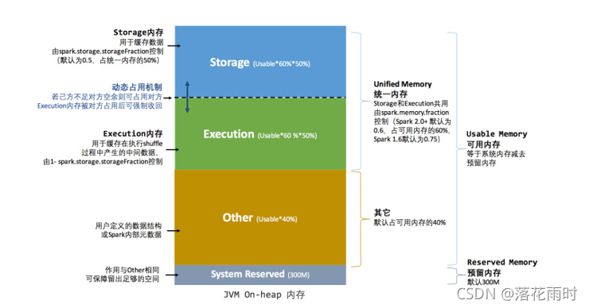

Hadoop相关问题

## HDFS

Q. 在VMWare中搭建了3节点的`Hadoop3.2.2`的**非HA 完全分布式集群**。但是在master节点使用`start-dfs.sh`批量启动集群的HDFS服务时，只在master上启动了`DataNode`、`NameNode`，在一个slave节点启动了`Secondary NameNode`，slave节点上的DataNode都没有启动，这是为什么？

**答**：

>**问题原因**：<font color="red">从`hadoop3.0.0`开始，hadoop的`slaves file`路径由`etc/hadoop/slaves`改为了`etc/hadoop/workers`了。`etc/hadoop/workers`默认内容为`localhost`。如果未修改`etc/hadoop/workers`文件，如，在执行`start-dfs.sh`时，只会在本机启动DataNode，其他worker节点并不会启动。</font>
>
>**解决方案**：在`etc/hadoop/workers`文件中配置所有worker节点的主机名or IP信息（每行一个）。然后在使用`start-dfs.sh`批量启动HDFS服务。

Q. `start-dfs.sh`启动Hadoop3.2.2集群报错xx

**答**：

>
>
>**问题原因**：因为主机名包含了特殊字符，如’.’ '/' '_'等。
>
>**解决方案**：修改主机名，不包含特殊字符。

Q. 执行hdfs namenode -format干了什么事情


**答**：

> 执行了hdfs namenode -format 之后，控制打印如上日志：
>
> - 分配了新的BlockPoolId
> - 格式化了namenode的存储目录${hadoop.tmp.dir}/dfs/name
> - 创建了新的fsimage文件${hadoop.tmp.dir}/dfs/name/current/fsimage.ckpt_0000000000000000000
> - 清除了checkpoint

Q. `hadoop3.2.2`在执行`hadoop jar share/hadoop/mapreduce/hadoop-mapreduce-examples-3.2.2.jar wordcount /user/sjl/test/input /user/sjl/test/output`时，报错`/bin/bash: /bin/java: No such file or directory`

**答**：

> **问题原因**：如报错提示，在worker节点中不存在`/bin/java`。验证发现的确是没有此文件。因为我安装的JDK是解压，然后添加JAVA_HOME, PATH, CLASSPATH到`/etc/profile`中的。
>
> **解决方案**： 创建`/bin/java`的软连接，连接到我们的`JAVA_HOME/bin/java`。命令如下：
>
> ```bash
> ln -s $JAVA_HOME/bin/java /bin/java
> ```

Q. `hadoop3.2.2`在执行`hadoop jar share/hadoop/mapreduce/hadoop-mapreduce-examples-3.2.2.jar wordcount /user/sjl/test/input /user/sjl/test/output`时，报错如下图所示

**答**：

> 
>
> **问题原因**：container没能从nodemanager中继承`HADOOP_MAPRED_HOME`这个环境变量，导致在运行container时，找不到环境变量报错。
>
> **解决方案**：在官网文档 https://hadoop.apache.org/docs/stable/hadoop-project-dist/hadoop-common/ClusterSetup.html 中对此环境变量有解释：表示希望container从nodemanager继承的环境变量。默认值中没有`HADOOP_MAPRED_HOME`，因此需要加上。
>
> 如下图所示，在`yarn-site.xml`中添加`yarn.nodemanager.env-whitelist`配置后，拷贝到所有hadoop节点，并重启yarn服务（nodemanageer，resourcemanager）。
>
> 

Q. `hadoop3.2.2`在`start-dfs.sh`运行报错`ERROR: Cannot set priority of secondarynamenode process `

**答**：

> 
>
> **问题原因**：`start-dfs.sh`时，由于没有配置`secondary NameNode`的地址，导致启动失败。
>
> **解决方案**：在`hdfs-site.xml`中配置`secondary NameNode`的地址
>
> 

Q. Hadoop2.x和Hadoop3.x的区别

**答**：

> etc/hadoop/slaves 变为 etc/hadoop/workers
>
> TODO

Q. 报错`$HADOOP_HOME/data/tmp/hadoop/dfs/journalnode should be an absolute path`

**答**：

> 
>
> **问题原因**：在配置`hdfs-site.xml`中的`dfs.journalnode.edits.dir`配置项时，使用了错误的本地文件系统路径。`$HADOOP_HOME/data/tmp/hadoop/dfs/journalnode`
>
> **解决方案**：配置为正确的本地文件系统的绝对路径即可。

Q. HDFS HA集群的启动顺序

**答**：

> 1. 启动ZK集群。`bin/zkServer.sh start`
>
> 2. 启动JournalNodes。`hdfs --daemon start journalnode`
>
> 3. 格式化主NameNode，并启动。`hdfs --daemon start namenode`
>
> 4. 在备NameNode上执行命令以同步主NameNode的元数据（fsimage）。`hdfs namenode -bootstrapStandby`
>
> 5. 在某NameNode（比如主NameNode）上格式化ZKFC。`hdfs zkfc -formatZK`
>
> 6. 两种选择：
>
>    ​	（1）停掉所有JournalNodes和NameNode，启动HDFS HA集群的所有服务进程。`sbin/start-dfs.sh`
>
>    ​	（2）如下步骤：
>
>    ​			1）启动备NameNode。`hdfs --daemon start namenode`
>
>    ​			2）启动DataNodes。`hdfs --daemon start datanode`
>
>    ​			3）启动ZKFC。`hdfs --daemon start zkfc`
>
>    ​			tips：2）和3）没有严格个先后顺序。

Q. Hadoop jar可以执行HDFS上的jar吗？只能是本地的jar吗?

**答**：TODO

Q. HDFS 写数据流程

**答**：见《HDFS笔记》。

Q. HDFS 读数据流程

**答**：见《HDFS笔记》。

Q. `ZooKeeper`集群挂了，对HDFS集群有什么影响？

答：

>  `ZooKeeper`集群挂了，不会触发故障转移，但自动故障转移无法使用了。这对`HDFS` 集群没有影响。当`ZooKeeper`集群重启后，`ZKFC`会重新与`ZooKeeper`集群建立连接。

Q. HDFS中的`Checkpoint Node`和`Backup Node`是什么？

答：

> 参考：https://blog.csdn.net/zhanyuanlin/article/details/78077977
>
> `Checkpoint Node`和`Backup Node`只在非HA模式下有效，HA模式下无法启动这两个进程。
>
> `Checkpoint Node`可以通过`hdfs namenode -checkpoint`来启动，实际就是启动了一个具有checkpoint功能的NameNode。
>
> `Backup Node`就是在内存中放了一个份`Active NameNode`的副本，实际就是启动了一个具有backup功能的NameNode。
>
> **`Stanby NameNode`，也会做checkpoint，然后将新的fsimage以HTTP的PUT方法传回给`Active NameNode`，目的就是降低NameNode启动时的加载fsimage和edits文件的时间。提高效率。实际上我认为`Standby NameNode`同时做了`Checkpoint Node`和`Backup Node`要做的事情。**
>
> NN主要负责两件事：**文件与块的对应关系**、**块与DN的对应关系**。
>
> fsimage中只记录了文件与块的对应关系，块与DN的对应关系是通过DN发送的块报告来更新的。

Q. 用虚拟机自建的3节点Hadoop3.2.2集群，发现3个节点的DN进程都存在，但是`hdfs dfsadmin -report`发现集群active NN只发现了2个DN，在Active NN的Web UI也是只有2个DN。怎么解决这个问题？

**答**：

>**问题原因**：因为在使用xsync的时候不小心把datanode数据目录下的VERSION给覆盖，如使用node3的datanode的VERSION覆盖了node1的datanode的VERSION文件。导致虽然3个datanode进程都在，但是node1和node3的datanode是同一个UUID。
>
>**解决方法**：
>
>​	（1）将node1上的datanode的VERSION中的UUID修改以下，保证与其他datanode的UUID不一样。重启此datanode。
>
>​	（2）如果（1）不好使，则直接清空datanode的数据目录下的所有内容，然后重启此datanode。**谨慎**

Q. 对`dfs/data/current/VERSION`和`dfs/name/current/VERSION`的理解

**答**：

> `dfs/data/current/VERSION`
>
> ```bash
> [hadoop@hadoop322-node01 current]$ cat VERSION 
> #Fri Mar 24 17:07:20 CST 2023
> storageID=DS-cb730c89-7ba5-4223-868b-f12dd0fc177d
> clusterID=CID-5fee32b2-dbde-4037-980a-f2b2cb8ab4ca
> cTime=0
> datanodeUuid=57c4a077-b49c-4f80-8e63-1b5c99b2c14b
> storageType=DATA_NODE
> layoutVersion=-57
> [hadoop@hadoop322-node01 current]$ pwd
> /opt/modules/hadoop-3.2.2/data/tmp/dfs/data/current
> ```
>
> **storageID**：存储ID，非全局唯一。不同datanode的此值，不一样。
>
> **clusterID**：集群id，全局唯一。
>
> **cTime**：datanode存储系统的创建时间
>
> **datanodeUuid**：datanode的唯一识别码，全局唯一。
>
> **storageType**：存储类型，标识当前节点为datanode还是namenode，还是journalnode。属性说明该存储目录包含的是datanode的数据结构。
>
> **layoutVersion**：是一个负整数。通常只有HDFS增加新特性时才会更新这个版本号。
>
> 
>
> `dfs/name/current/VERSION`
>
> ```bash
> [hadoop@hadoop322-node01 current]$ pwd
> /opt/modules/hadoop-3.2.2/data/tmp/dfs/name/current
> [hadoop@hadoop322-node01 current]$ cat VERSION 
> #Fri Mar 24 16:50:49 CST 2023
> namespaceID=138955932
> clusterID=CID-5fee32b2-dbde-4037-980a-f2b2cb8ab4ca
> cTime=1676022036119
> storageType=NAME_NODE
> blockpoolID=BP-1670134104-192.168.61.129-1676022036119
> layoutVersion=-65
> ```
>
> **namespaceID**：每次`hdfs namenode -format`格式化之后，Namenode都会生成新的namespaceID，但Datanode不会自动修改。不同的命名空间（联邦集群时呢？）
>
> **clusterID**：集群id，全局唯一。每次`hdfs namenode -format`格式化之后，Namenode都会生成新的clusterID，但Datanode不会自动修改。
>
> **cTime**：namenode存储系统的创建时间。
>
> **storageType**：存储类型，标识当前节点为datanode还是namenode，还是journalnode。属性说明该存储目录包含的是namenode的数据结构。
>
> **blockpoolID**：一个 block pool id 标识一个 block pool，并且是跨集群的全局唯一。当一个新的 Namespace 被创建的时候(format过程的一部分)会创建并持久化一个唯一 ID。
>
> **layoutVersion**：是一个负整数。通常只有 HDFS 增加新特性时才会更新这个
>
> 版本号。

Q. 什么是`sticky bit（粘滞位）`？

**答**：

> `sticky bit`只对HDFS的目录生效，当某文件夹开启了`sticky bit`之后，即使其它用户对该文件夹具有`rwx`权限，也只有`superuser`，`文件夹owner`、`文件owner`才能删除/移动目录中的文件。

Q. Hadoop中的proxyuser是干啥的？

**答**：

> 关于hadoop的用户代理介绍：https://www.cnblogs.com/skyrim/p/14268192.html，官方文档：https://hadoop.apache.org/docs/stable/hadoop-project-dist/hadoop-common/Superusers.html
>
> 在`core-site.xml`中与hadoop用户代理相关的配置主要为如下三个，
>
> ```bash
> hadoop.proxyuser.$superuser.hosts  ：超级用户可以在哪些主机上执行代理。
> hadoop.proxyuser.$superuser.groups ：超级用户可以代理哪些组
> hadoop.proxyuser.$superuser.users ： 超级用户可以代理哪些用户。
> ```
>
> **表示：允许`$superuser`在哪些主机上，可以代理哪些组/哪些用户。**
>
> 下面参考自：https://www.jianshu.com/p/a27bc8651533
>
> Hadoop2.0版本开始支持ProxyUser的机制。含义是使用User A的用户认证信息，以User B的名义去访问hadoop集群。对于服务端来说就认为此时是User B在访问集群，相应对访问请求的鉴权（包括HDFS文件系统的权限，YARN提交任务队列的权限）都以用户User B来进行。User A被认为是superuser（这里super user并不等同于hdfs中的超级用户，只是拥有代理某些用户的权限，对于hdfs来说本身也是普通用户），**User B被认为是proxyuser**。
>
> `proxyuser`：即被代理的用户。
>
> `superuser`：这里的superuser，并不是启动NN的用户，而是用来代理某些用户的用户。
>
> 在Hadoop的用户认证机制中，如果使用的是`Simple认证机制`，实际上ProxyUser的使用意义并不大，因为客户端本身就可以使用任意用 户对服务端进行访问，服务端并不会做认证。而在使用了安全认证机制（例如`Kerberos`）的情况下，ProxyUser认证机制就很有作用：
>
> 1. 用户的管理会比较繁琐，每增加一个新的用户，都需要维护相应的认证信息（kerberosKeyTab），使用ProxyUser的话，只需要维护少量superuser的认证信息，而新增用户只需要添加proxyuser即可，proxyuser本身不需要认证信息。
> 2. 通常的安全认证方式，适合场景是不同用户在不同的客户端上提交对集群的访问；而实际应用中，通常有第三方用户平台或系统会统一用户对集群的访问，并 且执行一系列任务调度逻辑，例如Oozie、华为的BDI系统等。此时访问集群提交任务的实际只有一个客户端。使用ProxyUser机制，则可以在这一 个客户端上，实现多个用户对集群的访问。
>
> 
>
> 
>
> **proxyuser下的认证流程**：
>
> 1. **对SuperUser进行认证**，在Simple认证模式下直接通过认证，在Kerberos认证模式下，会验证ticket的合法性。
>
> 2. **代理权限认证**，即认证SuperUser是否有权限代理proxyUser。这里权限认证的逻辑的实现可以通过 hadoop.security.impersonation.provider.class参数指定。在默认实现中通过一系列参数可以指定每个 SuperUser允许代理用户的范围。
>
> 3. **访问请求鉴权**，即*验证proxyUser是否有权限对集群（hdfs文件系统访问或者yarn提交任务到资源队列）的访问*。这里的鉴权只是针对 proxyUser用户而已经与SuperUser用户无关，及时superUser用户有权限访问某个目录，而proxyUser无权限访问，此时鉴权 也会返回失败。
>
> 

Q. HDFS的用户身份认证方式

**答**：

> - `simple`：基于HDFS客户端所在主机的操作系统，客户端使用的用户名为`whoami`的值。
> - `keberos`：客户端进程的身份由其Kerberos凭据确定。
> - `ldap`：如腾讯云的EMR就可以基于LDAP实现集群的用户认证。
> - 不管怎样，用户身份机制对HDFS本身来说只是外部特性。<font color="red">**HDFS并不提供创建用户身份、创建组或处理用户凭证等功能。**</font>

Q. 关于HDFS中的权限管理

**答**：官方文档：https://hadoop.apache.org/docs/stable/hadoop-project-dist/hadoop-hdfs/HdfsPermissionsGuide.html

https://blog.csdn.net/m0_62963408/article/details/128379642

> Hadoop分布式文件系统（HDFS）为共享大部分POSIX模型的文件和目录实现权限模型。每个文件和目录都与一个所有者和一个组相关联。该文件或目录对作为所有者的用户，作为该组成员的其他用户以及对所有其他用户具有单独的权限。对于文件，需要r权限才能读取文件，而w权限才能写入或附加到文件。对于目录，需要r权限才能列出目录的内容，需要w权限来创建或删除文件或目录，并且需要x权限来访问目录的子级。
>
> 有三类权限管理
>
> - **posix模型，UGO权限管理**
>
>   
>
> - **posix ACLs**
>
>   ACL是Access Control List（访问控制列表）的缩写，ACL提供了一种方法，可以**为特定的用户或组设置不同的权限，而不仅仅是文件的所有者和文件的组**。
>
>   **带有ACL的任何文件或目录的权限字符串后附加一个'+'字符**
>
> - **组映射**
>
>   - 基于Linux系统
>
>     当`su root`之后，再访问HDFS，则就是以root用户来访问HDFS。
>
>   - 基于插件，如ldap。Sentry、Ranger 

Q. 对HDFS中snapshot的理解

**答**：参考：https://xie.infoq.cn/article/297f5bc9cab16afada07d45dd

> - **HDFS snapshot 功能可以创建根目录或指定目录的元数据信息副本，该副本被称为快照；**
> - **由于快照仅是元数据信息，所以具有瞬时创建、只读属性、不影响当前数据的特性；**
> - **快照适用于防止用户误操作、数据备份、灾备恢复及数据测试的应用场景。**

Q. 在`hadoop-env.sh`中调整了`export NNHeapsize=16g`，导致NN、MR的JobHistoryServer、yarn的TimelineServer的堆内存都是16g！产品是腾讯云的EMR

**答**：

> **问题原因**：`hadoop-env.sh`中NNHeapsize同时也是MR的JobHistoryServer、yarn的TimelineServer的默认值，简直无语。
>
> **解决方法**：两种方式：TODO，截个对应配置文件的图
>
> - 删除NNHeapsize的配置，通过`NamenodeOpts`来配置NN的堆内存。`-Xms16g -Xmx16g`
> - 分别在`mapred-env.sh`，`yarn-env.sh`中配置`JobHistoryServer`、`TimelineServer`的堆内存大小，用来覆盖NNHeapsize的默认值。

Q. 手动重启集群JournalNode服务导致NameNode挂掉分析

**答**：参考文章：https://blog.csdn.net/weixin_33583401/article/details/113391065

> 在高可用的Hadoop集群中，JN服务至少要有两个（通常QJM集群只有3个节点）在正常运行，否则会导致NameNode服务异常退出。这个异常分析中就出现了**同时重启两个JN服务从而导致NameNode服务异常退出**。

Q. 为什么Standby NameNode的堆内存使用比Active NameNode的堆内存使用率高？

**答**：

> **问题现象**：下面分别是Active NameNode和Standby NameNode的堆内存使用情况。发现Standby NameNode的堆内存使用更高。
>
> 
>
> **问题原因**：TODO
>
> **解决方法**：

Q. Hadoop3.1删除大量文件(清理回收站，程序删除)导致RPC飙高

**答**：

> TODO

Q. 如果一个Active Namenode有两个Standby Namenode，那么是哪个Standby Namenode来做checkpoint呢？随机or都做？

**答**：参考文章：https://www.cnblogs.com/bianqi/p/12183725.html

> 先来回顾一下原先HA机制的元数据同步过程：
>
> **Standby节点周期性的读取JournalNode上的editlog，等到了一次checkpoint周期，然后做一次checkpoint，然后将新的fsimage同步到Active节点。**
>
> 在这个如果是多个Standby节点的情况，这个处理过程就没有那么简单了，下面几个是主要要解决的问题：
>
> - 这么多个Standby节点，每个节点上都有自己的fsimage，该选哪个作为最终上传镜像文件的节点呢？
>   答：选择元数据最新的Standby，评判标准是看当前最新的txid。
> - 如果Active节点当前已经同步了最新fsimage，而Standby节点又将稍老的fsimage同步过去，怎么办？
>   答：Active节点会进行比较，如果的确是老的fsimage，会给出失败的回复应答。

Q. 如果1个active Namenode，2个standby Namenode，其中一个standby Namenode挂了很长时间，该怎么让这个standby namenode重新工作呢？

答：TODO

> 我认为，应该重新从active Namenode获取最新的fsimage，然后从journalNode同步edits日志文件。直接重启这sbn应该是无法获取到最新的fsimage的。
>
> 在挂掉的sbn的主机上使用`hdfs namenode -bootstrapStandby`从active Namenode获取最新的fsimage。

Q. 腾讯云的emr-hadoop集群的Namenode每隔一个小时左右，其JVM内存使用率就会高达89%，频繁告警。

背景: 因为Namenode进程采用的GC算法是G1GC,主要的JVM参数为`-XX:MaxGCPauseMills=20 -XX:GCPauseIntervaMillis=100`

**问题原因**：


如上面两图所示，可以发现每隔1个小时此Namenode的JVM就会达89%左右，而此时会做Young GC，进而降低了JVM堆内存的占用。那么问题来了，为什么需要当堆内存占用到89%之后，才做Young GC呢？

通过`jmap -heap <pid>`之后，发现G1GC的Young Generation的Eden区的内存约为15GB，Survivor区的内存约为64MB，Old区约为9GB。且Old区的内存使用约为6GB。

那么就导致每次当Young区满的时候，即整个JVM内存达15GB+6GB=21GB的时候才会触发Young GC，降低JVM的内存占用。

**解决方法**：

下述需要实际验证，只是我认为的。

我想到的解决方法如下：

（1）增大JVM堆内存

（2）减少新生代的内存，即Young区的内存大小，增加其GC的频率

（3）减小`-XX:MaxGCPauseMills`的值，提高Young GC的频率。

Q. 在hadoop中，配置NameNode的JVM有`HADOOP_NAMENODE_OPTS`和`HDFS_NAMENODE_OPTS`，有什么区别，该用哪个呢？

**答**：

> hadoop 2.x中，要配置NameNode的JVM就使用`HADOOP_NAMENODE_OPTS`。
>
> hadoop 3.x中，要配置NameNode的JVM就使用`HDFS_NAMENODE_OPTS`。
>
> 在hadoop 3.x仍兼容2.x的方式，因此`HADOOP_NAMENODE_OPTS`在hadoop3.x也是可以用的。

## YARN

Q. 日志聚合开启后，运行的应用日志是什么时候触发聚合操作呢？运行中还是结束后？

**答**：yarn.nodemanager.log-aggregation.roll-monitoring-interval-seconds 配置，该配置表示：NodeManager 上传日志文件的频率。默认值为 -1。默认情况下，日志将在应用程序完成时上传。通过设置该配置，可以在应用程序运行时定期上传日志。可以设置的最小滚动间隔秒数为 3600。

Q. 在`bin/hive`中执行SQL，`insert into test values('1001');`失败，查看yarn上的application日志发现报错如下

```bash
2023-02-28 16:54:23,403 ERROR [Listener at 0.0.0.0/42903] org.apache.hadoop.mapreduce.v2.app.client.MRClientService: Webapps failed to start. Ignoring for now:
java.lang.NullPointerException
	......
2023-02-28 16:54:25,466 ERROR [Listener at 0.0.0.0/43901] org.apache.hadoop.mapreduce.v2.app.rm.RMCommunicator: Exception while registering
java.lang.NullPointerException
	......
2023-02-28 16:54:25,467 INFO [Listener at 0.0.0.0/43901] org.apache.hadoop.service.AbstractService: Service RMCommunicator failed in state STARTED
org.apache.hadoop.yarn.exceptions.YarnRuntimeException: java.lang.NullPointerException
```

**问题原因**：否配置了高可用HA， 配置高可用的话 问题大概就是MRClientService的WebApp创建过程出错，导致WebApp对象为null，后边调用了WebApp的getHttpPort()方法，导致空指针。 

**解决方法**：在所有节点的yarn-sitexml中加入如下配置

```xml
<property> 
  <name>yarn.resourcemanager.webapp.address.rm1</name> 
  <value>xxx1:8088</value> 
</property> 
<property> 
  <name>yarn.resourcemanager.webapp.address.rm2</name> 
  <value>xxx2:8088</value> 
</property>
```

重启resourcemanager，nodemanager。

Q. YARN的Timeline Server和MapReduce的JobHistoryServer区别？

**答**：参考文章：[介绍Timeline Server的](https://zhuanlan.zhihu.com/p/366214204)

官方文档：https://hadoop.apache.org/docs/stable/hadoop-yarn/hadoop-yarn-site/TimelineServer.html


> 刚开始Hadoop1.x中没有Timeline Server，只有MR的JobHistoryServer，只支持MR类作业的信息的存储和检索。
>
> 后来呢，Hadoop发展了，YARN变得更为通用了，不仅支持MR作业，还支持Spark作业，Flink作业。那这些类型的作业的信息该如何存储和检索呢。
>
> 因此YARN就引入了一个通用的组件--Timeline Server。
>
> 
>
> Timeline Server
>
> 存储和检索application的当前或历史信息。主要有两个职责：
>
> - 持久化application特定的信息
>
> - 持久化已完成的application的通用信息
>
>   通用信息包括：
>
>   - 队列名
>   - applicationSubmissionContext信息
>   - application运行的application-attempt列表
>   - 每个application-attempt的信息
>   - 每个application-attempt运行的container列表
>   - 每个container的信息
>
>   当启用了Timeline Server后，RM会把这些通用信息推给Timeline Server，由其进行存储。

Q. YarnCoarseGrainedExecutorBackend是干嘛的，ApplicationMaster 我知道是AM的进程

答：

> 参考文章：https://www.cnblogs.com/Diona/p/16638321.html
>
> 
>
> 简单说，YarnCoarseGrainedExecutorBackend是用来运行executor的类。

Q. 客户使用腾讯云emr-3.1.2版本，现在经常会出现计算节点（core）的CPU>90%告警，需要配置调整避免频繁告警，且避免节点CPU占满导致计算机卡死。

腾讯云EMR控制台监控信息。


YARN作业调度，资源分配/使用信息。


共3个core，每个core的硬件配置为32C128G，每个core分配给YARN的资源量为26Vcore，51GB内存。总的资源量为78Vcore、153GB内存。

很明显从YARN WebUI看只有一个default队列，队列中只有一个job，且此job只使用了31Vcore。<font color=red>*那么为什么3个core节点的CPU直接打满了？*</font>

**问题原因**：

> 网上查询资料：
>
> https://www.jianshu.com/p/b9245242472b/
>
> https://dude6.com/article/232432.html
>
> **yarn container 默认不支持对cpu进行资源隔离，一些计算密集型任务甚至可能占满NM节点的cpu资源**，从而影响到其他任务的执行效率。

**解决方法**：

> 2个思路：
>
> （1）在default下新建两个队列，每个队列分配一半的资源，在提交job，观察是否会占满整个core节点的CPU资源；**不确定是否可行**
>
> （2）采用YARN的CPU资源隔离配置（通过cgroup实现）。
>
> 1、使用cgroup需要使用LinuxContainerExecutor，而不是DefaultContainerExecutor。
>
> 2、cgroup限制cpu资源，需要用到3个文件：
>
> - cpu.cfs_period_us：cpu时间周期，默认为100000，单位us。
>
> - cpu.cfs_quota_us：在单位cpu时间周期中，可以使用的cpu时间。默认-1。比如我们要限制一个进程的cpu使用为20%，则此值应为20% * cpu.cfs_period_us
>
> - cpu.shares：cpu.shares 不是限制进程能使用的绝对的 cpu 时间，而是控制各个组之间的cpu使用比例。
>
>   这里的cfs是啥？CFS是CPU的调度器。
>
> 对于CPU的限制逻辑：https://blog.csdn.net/weixin_43631706/article/details/126159562
>
> **cgroup的限制逻辑**如下：
>
> 1. 限制所有pid在tasks中的进程，
> 2. 在 cpu.cfs_period_us 周期内，只能使用最多 cpu.cfs_quota_us 的cpu资源。
> 3.  默认情况下，cpu.cfs_period_us的单位为微秒，默认值为100ms。cpu.cfs_quota_us的值为-1，暨不做限制。
> 4. 例如： 限制在100ms中，只能使用30ms的cpu资源，暨限制cpu占用率为30%
>    echo 30000 > cpu.cfs_quota_us
> 5. 启动测试程序，并添加pid到tasks文件中后，再观察CPU情况，可以清晰的看到被限制在了30%
>    echo pid(loglistener的进程号) > /sys/fs/cgroup/cpu/rocket/test
>
>
> 3、NM相关配置
>
> - `yarn.nodemanager.resource.cpu-vcores`
>
>   表示分配给NM的vcore数。
>
> - `yarn.nodemanager.resource.percentage-physical-cpu-limit`
>
>   表示所有container的cpu占物理机cpu的百分比。
>
> - `yarn.nodemanager.linux-container-executor.cgroups.strict-resource-usage`
>
>   NodeManager管理的所有container使用CPU的硬性比例，默认100%
>   yarn.nodemanager.linux-container-executor.cgroups.strict-resource-usage	对container的CPU使用资源是否严格按照被分配的比例进行控制，即使CPU还有空闲。默认是false，即container可以使用空闲CPU
>
>   为true时：对container的cpu资源的使用是**hard limit**。
>
>   ​	假设，container的vcore数为a；NM节点的物理核数为b；`yarn.nodemanager.resource.percentage-physical-cpu-limit`为c；分配给NM的vcore数为d；
>
>   ​	则，单个container的cpu使用=a * (b * c) / d
>
>   为false时：对container的cpu资源的使用是**soft limit**。
>
>   soft limit和hard limit的区别
>
> ### 根据不同场景选择限制模式
>
> | 一些对比 | soft limit                                                   | hard limit                                |
> | -------- | ------------------------------------------------------------ | ----------------------------------------- |
> | 优点     | nm资源使用率高                                               | 资源限制更严格，运行时间更可控            |
> | 缺点     | 根据机器上运行的Container资源申请情况，资源分配动态变化，可能造成运行时间不稳定 | 低负载场景下不能充分利用空闲的nm资源      |
> | 控制方式 | 控制Container使用的cpu下限                                   | 控制Container使用的cpu上限                |
> | 使用场景 | 对任务运行时间不敏感                                         | 集群上运行多种类型的任务，对SLA有一定要求 |
>
> <font color="red">注意：不论哪个模式，Container 使用的总的 CPU 资源不会超过 `yarn.nodemanager.resource.percentage-physical-cpu-limit` 的配置。</font>
>
> `cgroup`相关配置如下：
>
> ```bash
> # Yarn 是否使用 Linux Container Executor。
> yarn.nodemanager.container-executor.class=org.apache.hadoop.yarn.server
> .nodemanager.LinuxContainerExecutor
> # YARN 是否根据容器创建 cgroup，从而隔离容器的 CPU 使用情况
> yarn.nodemanager.linux-container-executor.resources-handler.class=org.apache.hadoop.yarn.server
> .nodemanager.util.CgroupsLCEResourcesHandler
> # yarn 使用的 cgroup 组，默认为/hadoop-yarn，一般不作修改 
> yarn.nodemanager.linux-container-executor.cgroups.hierarchy=/hadoop-yarn
> # 是否自动挂载cgroup 
> yarn.nodemanager.linux-container-executor.cgroups.mount=true
> # cgroup 挂载目录，centos7 为/sys/fs/cgroup，centos6 为 /cgroup 
> yarn.nodemanager.linux-container-executor.cgroups.mount-path=/sys/fs/cgroup
> # 容器执行组，一般无需设置  
> yarn.nodemanager.linux-container-executor.group=yarn
> # 配置nodemanager使用多少物理cpu资源,比如24核服务器配置90的话,只能使用21.6核  
> yarn.nodemanager.resource.percentage-physical-cpu-limit=90
> # 是否启用严格资源限制，按任务申请的CPU数量控制 / 按core的比率限制   
> yarn.nodemanager.linux-container-executor.cgroups.strict-resource-usage=true
> # 使用 Linux-container-executor时，运行容器的 UNIX 用户，一般不用更改 
> yarn.nodemanager.linux-container-executor.nonsecure-mode.local-user=nobody
> #	设置为false，即以实际提交作业的用户跑作业，否则会使用上面local-user的固定用户来运行作业
> yarn.nodemanager.linux-container-executor.nonsecure-mode.limit-users=false
> ```
>
> TODO待实战。

Q. yarn任务提交任务用户全部变为nobody


**问题原因**：yarn中cgroup的yarn.nodemanager.linux-container-executor.nonsecure-mode.limit-users=true了。

**解决方法**：

> 参考： https://blog.csdn.net/hlq415714067/article/details/83268478
>
> 主要是yarn.nodemanager.linux-container-executor.nonsecure-mode.limit-users配置项应该设为false。

## MapReduce

1. 导包容易出错。尤其Text和CombineTextInputFormat。

2. Mapper中第一个输入的参数必须是LongWritable或者NullWritable，不可以是IntWritable.  报的错误是类型转换异常。

3. java.lang.Exception: java.io.IOException: Illegal partition for 13926435656 (4)，说明Partition和ReduceTask个数没对上，调整ReduceTask个数。

4. 如果分区数不是1，但是reducetask为1，是否执行分区过程。答案是：不执行分区过程。因为在MapTask的源码中，执行分区的前提是先判断ReduceNum个数是否大于1。不大于1肯定不执行。

5. 在Windows环境编译的jar包导入到Linux环境中运行，

   ```shell
   hadoop jar wc.jar com.atguigu.mapreduce.wordcount.WordCountDriver /user/atguigu/ /user/atguigu/output
   
   报如下错误：
   
   Exception in thread "main" java.lang.UnsupportedClassVersionError: com/atguigu/mapreduce/wordcount/WordCountDriver : Unsupported major.minor version 52.0
   
   原因是Windows环境用的jdk1.7，Linux环境用的jdk1.8。
   ```

   解决方案：统一jdk版本。

6. 缓存pd.txt小文件案例中，报找不到pd.txt文件

   原因：大部分为路径书写错误。还有就是要检查pd.txt.txt的问题。还有个别电脑写相对路径找不到pd.txt，可以修改为绝对路径。

7. 报类型转换异常。

   通常都是在驱动函数中设置Map输出和最终输出时编写错误。

   Map输出的key如果没有排序，也会报类型转换异常。

8. 集群中运行wc.jar时出现了无法获得输入文件。

   原因：WordCount案例的输入文件不能放用HDFS集群的根目录。

9. 出现了如下相关异常

   ```shell
   Exception in thread "main" java.lang.UnsatisfiedLinkError: org.apache.hadoop.io.nativeio.NativeIO$Windows.access0(Ljava/lang/String;I)Z
   	at org.apache.hadoop.io.nativeio.NativeIO$Windows.access0(Native Method)
   	at org.apache.hadoop.io.nativeio.NativeIO$Windows.access(NativeIO.java:609)
   	at org.apache.hadoop.fs.FileUtil.canRead(FileUtil.java:977)
   
   java.io.IOException: Could not locate executable null\bin\winutils.exe in the Hadoop binaries.
   	at org.apache.hadoop.util.Shell.getQualifiedBinPath(Shell.java:356)
   	at org.apache.hadoop.util.Shell.getWinUtilsPath(Shell.java:371)
   	at org.apache.hadoop.util.Shell.<clinit>(Shell.java:364)
   ```

   解决方案：拷贝hadoop.dll文件到Windows目录C:\Windows\System32。个别同学电脑还需要修改Hadoop源码。

   方案二：创建如下包名，并将NativeIO.java拷贝到该包名下

    

10. 自定义Outputformat时，注意在RecordWirter中的close方法必须关闭流资源。否则输出的文件内容中数据为空。

```java
@Override
public void close(TaskAttemptContext context) throws IOException, InterruptedException {
		if (atguigufos != null) {
			atguigufos.close();
		}
		if (otherfos != null) {
			otherfos.close();
		}
}
```

Q. 


# Hive相关问题

Q. Hcatalog是什么服务？webhcat是什么服务？

**答**：

> Hcatalog会暴露给其他工具可用的接口，如pig、mr
>
> webhcat是Hcatalog的REST API。

Q. Hive和Hadoop的兼容性关系？

**答**：参考：[Hadoop、Hbase、Hive版本兼容性](https://cloud.tencent.com/developer/article/1084829)，官方文档 https://hive.apache.org/general/downloads/


Q. SELECT COUNT(*) 不执行MR任务的说明。

**问题原因**：

**解决方法**：

TODO

Q. 执行`schematool -initSchema -dbType mysql --verbose`报错，

```bash
Exception in thread "main" java.lang.NoSuchMethodError: com.google.common.base.Preconditions.checkArgument(ZLjava/lang/String;Ljava/lang/Object;)V
```

**问题原因**：hive和hadoop的lib下面的guava.jar版本不一致造成的。

```bash
ll $HIVE_HOME/lib |grep guava
ll $HADOOP_HOME/share/hadoop/common/lib |grep guava
```


**解决方法**：删除hive的lib下面的guava-19.0.jar，然后拷贝hadoop下面的guava-27.0.jar即可。

Q. `内嵌Derby模式`下，执行`bin/hive`报错，

```bash
Caused by: java.net.ConnectException: Call From hadoop322-node01/192.168.61.129 to hadoop322-node01:8020 failed on connection exception: java.net.ConnectException: Connection refused;
```

**问题原因**：8020是HDFS HA集群中NameNode的RPC端口，可能是hadoop322-node01的NameNode挂了

**解决方法**：重启hadoop322-node01的NameNode。

TODO

Q. hive2.X和hive3.X的区别？

答：TODO

> hive3.X中metastore服务可以单独运行，而不依赖于hiveserver2。

Q. hiveserver和hiveserver2的区别？

**答**：

> `hiveserver`的文档：https://cwiki.apache.org/confluence/display/Hive/HiveServer
>
> `hiveserver2`的文档：https://cwiki.apache.org/confluence/display/Hive/Setting+Up+HiveServer2

`hiveserver`也称`hiveserver1`。

`hiveserver1`和`hiveserver2`都是基于`thrift`的，因此这两者都可以叫`thrift server`，为了区分这两者所以加了1,2。

`hiveserver1`的缺点：**不能处理多客户端的并发请求，没有认证机制。**

`hiveserver2`解决了hiveserver1的缺点。

`hiveserver2`没有直接将`HDFS`和`Metastore`暴露给用户。

`hiveserver2`有`HA`机制（`基于ZooKeeper的动态服务发现`）

从`hive 2.0`开始，`hiveserver2`提供了`Web UI`。

`hive 0.11` 开始引入了`hiveserver2`。

`hive 0.14.1`，也称之为`hive 1.0.0`，开始**hiveserver1被移除了**。

hiveserver1 提供了ODBC Driver，但hiveserver2没有提供ODBC Driver。hive的JDBC Driver和ODBC Driver是hive提供的一个library。

在`hive 3.1.2`中发现，`hiveserver`已经不能用了，如下所示：

```bash
[hadoop@hadoop322-node01 apache-hive-3.1.2-bin]$ hive --service hiveserver --help
which: no hbase in (/opt/modules/apache-hive-3.1.2-bin/bin:/usr/local/bin:/usr/bin:/usr/local/sbin:/usr/sbin:/opt/modules/jdk1.8.0_291/bin:/opt/modules/hadoop-3.2.2/bin:/opt/modules/hadoop-3.2.2/sbin)
Service hiveserver not found
Available Services: beeline cleardanglingscratchdir cli fixacidkeyindex help hiveburninclient hiveserver2 hplsql jar lineage llapdump llap llapstatus metastore metatool orcfiledump rcfilecat schemaTool strictmanagedmigration tokentool version 
```


> 当使用`bin/hive`时，实际只是启动了一个hive的客户端，此客户端可以根据`hive-site.xml`配置文件去直接读取hive的元数据库（如Derby，MySQL等）
>
> 当时用`hive --service hivesever2`，是启动一个hiveserver2的服务，此服务可以为客户端提供服务。如用`bin/beeline`来连接`hiveserver2`

Q. 如何实现`Hive Metastore`服务的HA？负载均衡如何实现？

**答**：**实现HA**有两种方式：

- 方式一：在客户端的hive.metastore.uris中配置多个Hive Metastore服务的连接URL
- 方式二：从hive 4.0开始，Hive Metastore支持基于ZooKeeper的服务发现功能。

> **方式一**：
>
> （1）修改hive.metastore.uris=thrift://host1:port,thrift://host2:port
>
> 修改hive.metastore.uri.selection=RANDOM或SEQUENTIAL，默认值为RANDOM。
>
> （2） 启动两个及以上的Hive Metastore服务。
>
> （3）客户端使用hive.metastore.uris=thrift://host1:port,thrift://host2:port此配置来连接Hive Metastore服务。
>
> **方式二**：
>
> 参考官方文档：https://cwiki.apache.org/confluence/display/Hive/AdminManual+Metastore+Administration

*暂不确定zookeeper方式是否可以实现Hive Metastore的负载均衡。*

通过LB（如haproxy、nginx，或者云厂商的Load Balancer产品可以**实现Hive Metastore的HA**，也可以**实现负载均衡**。

Q. HS2的HA如何实现？负载均衡如何实现？

**答**：

从`hive 0.14.0`开始，HS2支持基于ZooKeeper的服务发现，可以**实现HS2的HA**，也可以**实现负载均衡**。

通过LB（如haproxy、nginx，或者云厂商的Load Balancer产品可以**实现HS2的HA**，也可以**实现负载均衡**

Q. 通过基于ZooKeeper的服务发现功能，能够实现HS2的负载均衡吗？

答：能够实现HS2的HA这个是肯定的。下面来测试下：

第一步，在两个节点分别启动一个`Hive Metastore`服务

第二步，在两个节点分别启动一个`HiveServer2`服务

第三步，启动两个beeline客户端，查看是否连接到了两个不同的HS2实例。相关配置如下：

```xml
beeline -u "jdbc:hive2://hadoop322-node01:2181,hadoop322-node02:2181,hadoop322-node03:2181/;serviceDiscoveryMode=zooKeeper;zooKeeperNamespace=hiveserver2_zk" -n sjl ""
```

结果：发现两个beeline分别连接到了两个HS2实例，说明的确是负载均衡的。

结论：**测试发现基于ZooKeeper的服务发现功能是能够实现HS的负载均衡的**。

Q. 如何确认当前Hive Metastore是连接到derby还是MySQL呢？

**答**：查看metastore的日志。若没有配置过metastore的日志，则metastore日志路径为`/tmp/{user.name}/hive.log`。


Q. Hive2.X和Hive3.X中配置文件的名字有所区别

**答**：

> Hive2.X，Hive3.X都有`hive-site.xml`, `hivesever2-site.xml`
>
> Hive2.X中metastore的单独配置文件名为：`hivemetastore-site.xml`, 而在Hive3.X却是`metastore-site.xml`

Q. Hive里面要加一个jar包，但是每次都`add jar`才能运行，有更好的办法吗？

TODO

Q. `bin/hive`会连接`hiveserver2`吗？

**答**：参考文章：https://blog.csdn.net/qq_35440040/article/details/103198542

答案是不会，如下图所示：


> **hive名词介绍**
>
> （1）`metadata`：hive[元数据](https://so.csdn.net/so/search?q=元数据&spm=1001.2101.3001.7020)，即hive定义的表名，字段名，类型，分区，用户这些数据。一般存储关系型书库mysql中，在测试阶段也可以用hive内置Derby数据库。
>
> （2）`metastore `：hivestore服务端。主要提供将DDL，DML等语句转换为[MapReduce](https://so.csdn.net/so/search?q=MapReduce&spm=1001.2101.3001.7020)，提交到hdfs中。
>
> （3）`hiveserver2`：hive服务端。提供hive服务。客户端可以通过beeline，jdbc（即用java代码链接）等多种方式链接到hive。
>
> （4）`beeline`：hive客户端链接到hive的一个工具。可以理解成mysql的客户端。如：navitecat 等。
>
> **连接hive**
>
> （1）`./bin/hive` 
>
> 通过 ./bin/hive 启动的hive服务，第一步会先启动metastore服务，然后在启动一个客户端连接到metastore。此时metastore服务端和客户端都在一台机器上，别的机器无法连接到metastore，所以也无法连接到hive。这种方式不常用，一直只用于调试环节。
>
> （2） `./bin/hive  --service metastore`
> **通过hive --service metastore 会启动一个 hive metastore服务默认的端口号为：9083。metastore服务里面配置metadata相关的配置。此时可以有多个hive客户端在hive-site.xml配置hive.metastore.uris=thrift://ipxxx:9083 的方式链接到hive。motestore 虽然能使hive服务端和客户端分别部署到不同的节点，客户端不需要关注metadata的相关配置。但是metastore只能通过只能通过配置hive.metastore.uris的方式连接，无法通过jdbc的方式访问。**
>
> （3）`./bin/hiveserver2`
> hiveserver2 会启动一个hive服务端默认端口为：10000，可以通过beeline，jdbc，odbc的方式链接到hive。<font color="red">**hiveserver2启动的时候会先检查有没有配置hive.metastore.uris，如果没有会先启动一个metastore服务，然后在启动hiveserver2。如果有配置hive.metastore.uris。会连接到远程的metastore服务。这种方式是最常用的。**</font>

Q. Hive 自定义UDF的编写和使用？

TODO

Q. `hive --service metastore`启动`HiveMetastore`报错Caused by: org.datanucleus.exceptions.NucleusException: Attempt to invoke the "HikariCP" plugin to create a ConnectionPool gave an error : Failed to initialize pool: Unknown database 'metastore'

**问题原因**：Hive的元数据库中没有metastore这个数据库。

**解决方法**：

> 1. 方法一：手动在Hive的元数据库中创建metastore这个库
> 2. 方法二：修改hive-site.xml或者为metastore-site.xml中的`javax.jdo.option.ConnectionURL`添加`?createDatabaseIfNotExist=true`，使之格式为`jdbc:mysql://<host name>/<database name>?createDatabaseIfNotExist=true`

Q. `hive --service metastore`启动`HiveMetastore`报错Caused by: MetaException(message:Version information not found in metastore.)

**问题原因**：没有初始化元数据库

**解决方法**：

> 使用`$HIVE_HOME/bin/schematool -dbType mysql -initSchema -verbose`初始化HIve的元数据库。
>
> 初始化成功之后，会在MySQL的metastore库中创建很多表，这些表就是Hive的元数据信息。

Q. HiveMetastore的三种模式

**答**：详情见文章：https://blog.csdn.net/weixin_45264992/article/details/120883102

https://zhuanlan.zhihu.com/p/473378621

> 1. **内嵌模式**
>
>    直接bin/hive可用。数据库必须是derby，数据库、hiveMetastore、hiveserver2都在一个进程中
>
> 2. **本地模式**
>
>    直接bin/hive可用。数据库可以是derby、MySQL等，数据库是单独的进程，hiveMetastore、hiveServer2都在一个进程中。
>
> 3. **远程模式**
>
> 执行bin/hive会报错，因为`hive-site.xml`中配置了hive.metatore.uris。bin/hive（客户端）会去连接此HiveMetastore服务，没启动就会报错。
>
> 总结：HiveMetastore和HiveServer2在不同的进程中则为远程模式，在相同的进程中则为内嵌/本地模式。
>
> 
>
> 发现：bin/hive依赖HiveMetastore服务，不依赖HiveServer2服务。

Q. `beeline -u jdbc:hive2://192.168.61.129:10000`连接HiveServer2报错No known driver to handle "jdbc:hive://192.168.61.129:10000"

**问题原因**：正确方式为`beeline -u jdbc:hive://192.168.61.129:10000`

**解决方法**：正确使用beeline命令。

Q. `beeline -u jdbc:hive2://192.168.61.129:10000`连接HiveServer2报错org.apache.hadoop.ipc.RemoteException(org.apache.hadoop.security.authorize.AuthorizationException): User: hadoop is not allowed to impersonate anonymous (state=08S01,code=0)

**问题原因**：没有正确配置hadoop的用户代理。

**解决方法**：在hadoop的`core-site.xml`中添加如下：

```xml
<property>
  <name>hadoop.proxyuser.$yourusername.groups</name>
<value>*</value>
</property>
 
<property>
 <name>hadoop.proxyuser.$yourusername.hosts</name>
 <value>*</value>
</property>
```

根据上面的报错，此处的`$yourusername`应该改为`hadoop`。重启hdfs。

关于hadoop的用户代理介绍：https://www.cnblogs.com/skyrim/p/14268192.html，官方文档：https://hadoop.apache.org/docs/stable/hadoop-project-dist/hadoop-common/Superusers.html

```bash
hadoop.proxyuser.$superuser.hosts  ：超级用户可以在哪些主机上执行代理。
hadoop.proxyuser.$superuser.groups ：超级用户可以代理哪些组
hadoop.proxyuser.$superuser.users ： 超级用户可以代理哪些用户。
```

Q. `beeline -u jdbc:hive2://192.168.61.129:10000`连接hiveserver2报错org.apache.hadoop.security.AccessControlException: Permission denied: user=anonymous, access=EXECUTE, inode="/tmp":hadoop:supergroup:drwxrwx---

**问题原因**：为什么`user=anonymous`。这是因为beeline 连接时，没有指定用户名，所以为anonymous，如果使用`beeline -u jdbc:hive2://192.168.61.129:10000 -n sjl`，就会是`user=sjl`了。

**解决方法**：`hdfs dfs -chmod o+rwx /tmp`，增加其他用户对HDFS中`/tmp`目录的`rwx`权限。

Q. 相同的配置在node1和node3可以使用beeline连接HS2，但是在node2无法使用beeline连接到HS2。

报错为：Error: Could not open client transport for any of the Server URI's in ZooKeeper: java.net.ConnectException: Connection refused (Connection refused) (state=08S01,code=0)

在node1和node3都分别启动了Hive Metastore和HS2服务。

`hive-site`中相关配置为：

```xml
<property>
<name>hive.server2.support.dynamic.service.discovery</name>
<value>true</value>
</property>
 
<property>
<name>hive.server2.zookeeper.namespace</name>
<value>hiveserver2_zk</value>
</property>
 
<property>
<name>hive.zookeeper.quorum</name>
<value>hadoop322-node01:2181,hadoop322-node02:2181,hadoop322-node03:2181</value>
</property> 
<property>
<name>hive.zookeeper.client.port</name>
<value>2181</value>
</property> 
<property>
<name>hive.server2.thrift.bind.host</name>
<value>0.0.0.0</value>	<!-- 猜测是这里的问题 -->
</property> 
<property>
<name>hive.server2.thrift.port</name>
<value>10000</value> //两个HiveServer2实例的端口号要一致
</property>
```

beeline命令为：

```bash
beeline -u "jdbc:hive2://hadoop322-node01:2181,hadoop322-node02:2181,hadoop322-node03:2181/;serviceDiscoveryMode=zooKeeper;zooKeeperNamespace=hiveserver2_zk"
```

**问题原因**：配置项`hive.server2.thrift.bind.host=0.0.0.0`的问题，我的理解是如果按此种方式配置，那么在ZK的hiveserver2_zk中znode的值如下所示：

```bash
[zk: hadoop322-node03:2181(CONNECTED) 3] ls /hiveserver2_zk
[serverUri=0.0.0.0:10000;version=3.1.2;sequence=0000000007, serverUri=0.0.0.0:10000;version=3.1.2;sequence=0000000010]
[zk: hadoop322-node03:2181(CONNECTED) 1] ls /hiveserver2_zk/serverUri=0.0.0.0:10000;version=3.1.2;sequence=0000000007
[]
zk: hadoop322-node03:2181(CONNECTED) 2] get /hiveserver2_zk/serverUri=0.0.0.0:10000;version=3.1.2;sequence=0000000007
hive.server2.instance.uri=0.0.0.0:10000;hive.server2.authentication=NONE;hive.server2.transport.mode=binary;hive.server2.thrift.sasl.qop=auth;hive.server2.thrift.bind.host=0.0.0.0;hive.server2.thrift.port=10000;hive.server2.use.SSL=false
```

那么当使用`ZooKeeper自动服务发现`的URI（如serverUri=0.0.0.0:10000）去连接HS2时，客户端拿到的HS2的ip为`0.0.0.0`，**那么客户端只会去连接本机ip:10000端口。如果客户端的本机没有运行HS2服务则会报错了。**

将node1的`HS2`和`HMS`服务都停止之后，再在node1执行上述beeline命令发现也报相同的错误了。

**解决方法**：

修改node1的`hive-site.xml`中的`hive.server2.thrift.bind.host`为如下。

```xml
<property>
<name>hive.server2.thrift.bind.host</name>
<value>hadoop322-node01</value>
</property> 
```

修改node3的`hive-site.xml`中的`hive.server2.thrift.bind.host`为如下。

```xml
<property>
<name>hive.server2.thrift.bind.host</name>
<value>hadoop322-node03</value>
</property> 
```

然后**重启HS2**。

查看腾讯云EMR中的`hive-site.xml`也是如此配置的，而不是配置`0.0.0.0`。


Q. Hive中`set hive.execution.engine=spark`后，执行sql报错

```bash
0: jdbc:hive2://hadoop322-node01:2181,hadoop3> select * from test group by id;
Error: Error while compiling statement: FAILED: SemanticException Failed to get a spark session: org.apache.hadoop.hive.ql.metadata.HiveException: Failed to create Spark client for Spark session 9ca97838-c6f9-405b-9811-ddb6706136f4 (state=42000,code=40000)
```

**问题原因**：猜测是`Hive on Spark`的配置有问题，或者是hive和spark 的兼容性问题。先排查配置是否ok。一般来说spark不用重新编译（只要spark和hadoop是兼容的，然后删除spark中的hive的jar包，因为预编译好的spark3.0.2中的hive是2.3.7版本的，所以这些hive的jar需要删掉。然后把`$HIVE_HOME/lib`中对标的jar包拷贝到`$SPARK_HOME/jars`中）

```bash
Caused by: org.apache.hadoop.hive.ql.parse.SemanticException: Failed to get a spark session: org.apache.hadoop.hive.ql.metadata.HiveException: Failed to create Spark client for Spark session dcdd4785-aa0a-4e5f-96af-18f710b6a14b
	at org.apache.hadoop.hive.ql.optimizer.spark.SetSparkReducerParallelism.getSparkMemoryAndCores(SetSparkReducerParallelism.java:267) ~[hive-exec-3.1.2.jar:3.1.2]
	at org.apache.hadoop.hive.ql.optimizer.spark.SetSparkReducerParallelism.process(SetSparkReducerParallelism.java:170) ~[hive-exec-3.1.2.jar:3.1.2]
```

上述的报错`Failed to create Spark client for Spark session`，很多情况都会导致，应该看是否还有其他的报错，比我的情况是还有如下的报错：

```bah
Caused by: java.lang.RuntimeException: Cancel client '0dd67e1c-d823-48e4-bf5a-022fa7d7360f'. Error: Child process (spark-submit) exited before connecting back with error log SLF4J: Class path contains multiple SLF4J bindings.
SLF4J: Found binding in [jar:file:/opt/modules/hive-3.1.2/lib/log4j-slf4j-impl-2.10.0.jar!/org/slf4j/impl/StaticLoggerBinder.class]
SLF4J: Found binding in [jar:file:/opt/modules/hadoop-3.2.2/share/hadoop/common/lib/slf4j-log4j12-1.7.25.jar!/org/slf4j/impl/StaticLoggerBinder.class]
SLF4J: See http://www.slf4j.org/codes.html#multiple_bindings for an explanation.
SLF4J: Actual binding is of type [org.apache.logging.slf4j.Log4jLoggerFactory]

Exception in thread "main" org.apache.spark.SparkException: Could not load YARN classes. This copy of Spark may not have been compiled with YARN support.
	at org.apache.spark.deploy.SparkSubmit.error(SparkSubmit.scala:936)
```

那这一下就清晰了，原来是**hive和hadoop的日志包冲突了**啊。

**解决方法**：那我们删掉hive的日志包（或者移动到其他目录）。然后**重启HiveServer2和HiveMetastore服务。**

Q. hiveserver2的日志报错

```bash
Caused by: java.lang.RuntimeException: Cancel client '71c033fe-981a-4e12-9e38-6c69c155a5f8'. Error: Child process (spark-submit) exited before connecting back with error log 
Warning: Ignoring non-Spark config property: hive.spark.client.server.connect.timeout
Warning: Ignoring non-Spark config property: hive.spark.client.rpc.threads
Warning: Ignoring non-Spark config property: hive.spark.client.connect.timeout
Warning: Ignoring non-Spark config property: hive.spark.client.secret.bits
Warning: Ignoring non-Spark config property: hive.spark.client.rpc.max.size
Exception in thread "main" org.apache.spark.SparkException: Could not load YARN classes. This copy of Spark may not have been compiled with YARN support.
	at org.apache.spark.deploy.SparkSubmit.error(SparkSubmit.scala:936)
```

**问题原因**：`hive.spark.client.server.connect.timeout`，`hive.spark.client.connect.timeout`设置的超时时长不够，超时了。

**解决方法**：在`$HIVE_HOME/conf/hive-site.xml`中修改如下两个参数如下所示：

```xml
<property>
	<name>hive.spark.client.server.connect.timeout</name>
  <value>90000ms</value>
</property>
<property>
	<name>hive.spark.client.connect.timeout</name>
  <value>10000ms</value>
</property>
```

重启hiveserver2。

Q.  Hive on Spark已经能在YARN 的Web UI中看到hive查询所提交的application，但是查看application的日志报`java.lang.NoSuchMethodError: com.google.common.base.Preconditions.checkArgument(ZLjava/lang/String;I)`

```bash
Caused by: io.netty.handler.codec.EncoderException: java.lang.NoSuchMethodError: com.google.common.base.Preconditions.checkArgument(ZLjava/lang/String;I)V
at io.netty.handler.codec.MessageToByteEncoder.write(MessageToByteEncoder.java:125)
at io.netty.handler.codec.ByteToMessageCodec.write(ByteToMessageCodec.java:108)
at io.netty.channel.AbstractChannelHandlerContext.invokeWrite0(AbstractChannelHandlerContext.java:717)
at io.netty.channel.AbstractChannelHandlerContext.invokeWriteAndFlush(AbstractChannelHandlerContext.java:764)Caused by: io.netty.handler.codec.EncoderException: java.lang.NoSuchMethodError: com.google.common.base.Preconditions.checkArgument(ZLjava/lang/String;I)V
at io.netty.handler.codec.MessageToByteEncoder.write(MessageToByteEncoder.java:125)
at io.netty.handler.codec.ByteToMessageCodec.write(ByteToMessageCodec.java:108)
at io.netty.channel.AbstractChannelHandlerContext.invokeWrite0(AbstractChannelHandlerContext.java:717)
at io.netty.channel.AbstractChannelHandlerContext.invokeWriteAndFlush(AbstractChannelHandlerContext.java:764)
```

**问题原因**：`$HIVE_HOME/lib`和`$HADOOP_HOME/share/hadoop/common/lib`的lib下面的guava-xx.jar版本不一致造成的。hive的为`guava-19.0.jar`，hadoop的为`guava-27.0-jre.jar`

网上查了下都说是guava的版本不对造成的。


但是我看了下hadoop3.2.2和hive3.1.2的guava都是同一个版本的呀？？？

思考一下发现是spark.yarn.jars设置的目录中的guava的jar版本不对


**解决方法**：保持guava都为高版本，因此删除`$HIVE_HOME/lib`中的guava（或者移动到其他位置或改掉后缀为guava-xx.jar.bak只要hive识别不到这个jar就行）。

```bash
[hadoop@hadoop322-node03 softwares]$ hdfs dfs -rm /spark-jars/guava-14.0.1.jar

[hadoop@hadoop322-node03 softwares]$ hdfs dfs -put /opt/modules/hive-3.1.2/lib/guava-27.0-jre.jar /spark-jars

[hadoop@hadoop322-node03 softwares]$ hdfs dfs -ls  /spark-jars |grep guava
-rw-r--r--   3 hadoop supergroup    2747878 2023-03-15 22:12 /spark-jars/guava-27.0-jre.jar
```

问题解决了，困扰了我两天的Hive on Spark终于解决了！

Q. Hive on Spark执行查询sql报错，Caused by: org.apache.hadoop.hive.ql.parse.SemanticException: Failed to get a spark session: org.apache.hadoop.hive.ql.metadata.HiveException: Failed to create Spark client for Spark session dcdd4785-aa0a-4e5f-96af-18f710b6a14b

问题原因：这是个比较泛的报错信息，无法准确定位问题原因。应该仔细查看hiveserver2的日志，应该还要其他报错的。

> 可能原因如下：
>
> - hive 3.1.2 预编译版本不支持spark 3.0.2
> - spark 3.0.2预编译版本不支持hive3.1.2，测试过是支持的，不是此原因。
> - hive-site.xml中spark相关配置有问题
> - 没有配置SPARK_HOME环境变量
> - yarn-site.xml中关于节点的内存配置
> - spark.yarn.jars包含了hive的引用包，而hive on spark又要求上传的spark.yarn.jars目录下不包含hive的包。

解决方法：

# Spark相关问题

https://blog.csdn.net/github_36444580/article/details/117415418

Q1. org.apache.spark.SparkException: Kryo serialization failed: Buffer overflow

原因：kryo序列化缓存空间不足。

解决方法：增加参数，--conf spark.kryoserializer.buffer.max=2047m。

Q2. org.elasticsearch.hadoop.rest.EsHadoopNoNodesLeftException: Connection error

原因：此时es.port可能为9300，因为ElasticSearch客户端程序除了Java使用TCP方式连接ES集群以外，其他语言基本上都是使用的Http方式，ES客户端默认TCP端口为9300，而HTTP默认端口为9200。elasticsearch-hadoop使用的就是HTTP方式连接的ES集群。

解决方法：可以将es.port设置为 9200。

Q3. Error in query: nondeterministic expressions are only allowed in Project, Filter, Aggregate or Window, found

解决方法：如果是SparkSQL脚本，则rand()等函数不能出现在join...on的后面。
Q4. driver端日志中频繁出现：Application report for application_xxx_xxx (stage: ACCEPTED)

解决方法：通过yarn UI左侧的“Scheduler”界面，搜索自己任务提交的yarn队列，查看资源是否用完，与同队列同事协调资源的合理使用，优化资源使用量不合理的任务，如下所示：

Q5. Spark任务数据量过大（如上百亿条记录）跑不过去

原因：数据量过大导致executor内存扛不住那么多数据。

解决方法：增加参数，--conf spark.shuffle.spill.numElementsForceSpillThreshold=2000000，将过量数据写入到磁盘中。

 

Q6. user class threw exeception:ml.dmlc.xgboost4j.java.XGBoostError:XGBoostModel trained failed, caused by Values to assemble cannot be null

原因：机器学习训练数据中有为null的地方。

解决方法：把数据中有null的地方去掉，或对null值先进行预处理再训练。

 

Q7. Caused by: org.apache.spark.sql.catalyst.parser.ParseException: Datatype void is not supported

原因：Spark不支持Hive表中的void字段类型，代码中临时create的Hive表中，如果from的源表中某字段为全空值，则create table时该临时表的这个字段类型就会变成void。

解决方法：如果是上面这种情况，可以用Hive跑任务或者修改该Hive表的字段类型不为void，或将null转换为string等。

 

Q8. ERROR SparkUI: Failed to bind SparkUI java.net.BindException: Address already in use: Service failed after 16 retries

原因：Spark UI端口绑定尝试连续16个端口都已被占用

解决方法：可以把spark.port.maxRetries参数调的更大如128。

 

Q9. Error in Query: Cannot create a table having a column whose name contains commas in Hive metastore

解决方法：查看SparkSQL脚本中是否存在类似于“round(t1.sim_score , 5)”这种以函数结果作为字段值的语句，后面如果没加“as”别名会导致该错误。

 

Q10. Fail to send RPC to ...

原因：数据量过大超出默认参数设置的内存分配阈值，container会被yarn杀掉，其他节点再从该节点拉数据时，会连不上。

解决方法：可以优化代码将过多的连续join语句（超过5个）拆分，每3个左右的连续join语句结果生成一个临时表，该临时表再和后面两三个连续join组合，再生成下一个临时表，并在临时表中提前过滤不必要的数据量，使多余数据不参与后续计算处理。只有在代码逻辑性能和参数合理的前提下，最后才能增加--executor-memory、--driver-memory等资源，不能本末倒置。

Q11. ERROR shuffle.RetryingBlockFetcher: Failed to fetch block shuffle_7_18444_7412, and will not retry

原因：Executor被kill，无法拉取该block。可能是开启AE特性时数据倾斜造成的，其他executor都已完成工作被回收，只有倾斜的executor还在工作，拉取被回收的executor上的数据时可能会拉不到。

解决方法：如果确实是发生了数据倾斜，可以根据这两个链接的方法进行处理：（1）http://www.jasongj.com/spark/skew/；（2）https://www.cnblogs.com/hd-zg/p/6089220.html；

 

还可以参考《SparkSQL内核剖析》第11章第266页的几种SQL层面的处理方法，如下所示：

--广播小表

```SQL
select /*+ BROADCAST (table1) */ * from table1 join table2 on table1.id = table2.id
--分离倾斜数据（倾斜key已知）

select * from table1_1 join table2 on table1_1.id = table2.id

union all

select /*+ BROADCAST (table1_2) */ * from table1_2 join table2 on table1_2.id = table2.id
```


--打散数据（倾斜key未知）

```sql
select id, value, concat(id, (rand() * 10000) % 3) as new_id from A

select id, value, concat(id, suffix) as new_id

from ( 

select id, value, suffix

from B Lateral View explode(array(0, 1, 2)) tmp as suffix

)
```


--打散数据（倾斜key已知）

```sql
select t1.id, t1.id_rand, t2.name

from (

select id ,

case when id = null then concat(‘SkewData_’, cast(rand() as string))

else id end as id_rand

from test1

where statis_date = ‘20200703’) t1

left join test2 t2

on t1.id_rand = t2.id
```

 

同时，适度增大spark.sql.shuffle.partitions参数，通过提高并发度的方式也可缓解数据倾斜。

 

Q12. org.apache.spark.memory.SparkOutOfMemoryError: Unable to acquire 65536 bytes of memory, got 0

原因：代码逻辑或任务参数配置不合理、数据倾斜等导致OOM。分为driver OOM和executor OOM。

 

解决方法：（1）查看代码中是否有coalesce()等函数，该函数相比repartition()不会进行shuffle，处理大分区易造成OOM，如果有则可换成repartition()，尽量减少coalesce()的使用。

 （2）是否使用了将各executor上所有数据拉回到driver的collect()函数，尽量避免或谨慎使用collect()与cache()等函数，让各executor分布式拉数据与执行，多节点分担海量数据负载。

  （3）代码中是否有超过5个连续join或多层嵌套for循环等不合理的代码逻辑，代码解析与相关对象序列化都是在driver端进行，过于冗余复杂不拆分的代码会造成driver OOM，可参考第10点优化。

 （4）代码中是否广播了过大的表，可以合理设置spark.sql.adaptiveBroadcastJoinThreshold参数（以B为单位，默认10485760即10MB）；在业务代码逻辑极复杂、扫描文件数和数据量、task数等极端大（如几十万个）且广播阈值设置的再小也依然OOM，可以设置为-1关闭broadcast join。

 （5）查看任务提交参数中--executor-cores与--executor-memory的比例是否至少为1：4，一个executor上的所有core共用配置的executor内存，如果有类似2core4G等情况存在，在数据量较大的情况下易OOM，至少应是1core4G或者2core8G等。

 （6）个别executor的OOM也是数据倾斜会出现的现象之一，如果是这种情况可参考第11点解决。

 （7）在代码逻辑和参数合理的前提下，最后一步才是适度增加资源，例如--executor-memory=8g、--driver-memory=4g等。

 

Q13. Caused by: Java.lang.ClassCastException:org.apache.hadoop.io.IntWritable cannot be cast to org.apache.hadoop.io.DoubleWritable

原因：下游Hive表在select from上游Hive表时，select的同名字段的类型不同。

解决方法：修改该下游Hive表的对应字段类型与上游表一致，alter table xxx change 原字段名 新字段名(可不变) 类型;

 

Q14. driver端频繁出现“Full GC”字样或“connection refused”等日志内容。

原因：与第12点OOM类似，driver端此时内存压力很大，无力处理与executor的网络心跳连接等其他工作。

 

解决方法：（1）查看是否有过于复杂不拆分不够优化的代码逻辑（如过多连续join），可参考第10点将不合理的代码拆分精简，在临时表中尽早过滤多余数据。

 （2）如果数据量确实十分巨大，并非代码不够合理的原因，可以减小SparkSQL的broadcast join小表阈值甚至禁用该功能，增加参数set spark.sql.autoBroadcastJoinThreshold=2048000或-1等（默认为10M，根据具体数据量调整）。

 （3）由于driver也负责application对应的spark ui网页状态维护，小文件过多会造成task数较多，在维护job执行进度时也会内存压力较大，可通过该博客来判断小文件现象：https://blog.csdn.net/qq_33588730/article/details/109353336

 （4）改过代码也合理调参过了，最后才是增加driver端内存，--driver-memory=4g等。

 

Q15. Caused by: org.apache.spark.SparkException: This RDD lacks a SparkContext. It could happen in the following cases:(1) RDD transformations and actions are NOT invoked by the driver, but inside of other transformations; for example, rdd1.map(x => rdd2.values.count() * x) is invalid because the values transformation and count action cannot be performed inside of the rdd1.map transformation. For more information, see SPARK-5063.(2) When a Spark Streaming job recovers from checkpoint, this exception will be hit if a reference to an RDD not defined by the streaming job is used in DStream operations. For more information, See SPARK-13758.

原因：根据上面英文提示的原因，对RDD的transformation中嵌套transformation或action操作会导致计算失败。

 

解决方法：从报错那一行附近找到嵌套的transformation或action操作，将该嵌套逻辑独立出来。

 

Q16. removing executor 38 because it has been idle for 60 seconds

原因：一般为数据倾斜导致，开启AE特性后空闲下来的executor会被回收。

解决方法：与第11与第12点的解决方法类似，第10、11、12、16、17点的日志现象可能会有某几种同时出现。

 

Q17. Container killed by YARN for exceeding memory limits. 12.4 GB of 11GB physical memory used.

原因：（1）数据倾斜，个别executor内存占用非常大超出限制。

 （2）任务小文件过多，且数据量较大，导致executor内存用光。

 （3）任务参数设置不合理，executor数量太少导致压力负载集中在较少的executor上。

 （4）代码不合理，有repartition(1)等代码逻辑。

 


解决方法：（1）数据倾斜情况可以参考第11、12点。

 （2）数据量很大可参考第10、14点。

 （3）查看是否任务参数设置不合理，例如executor-memory是设的大，但是--num-executors设置的很少才几十个，可以根据集群情况和业务量大小合理增大executor数，数量判断标准是一个executor的CPU core同一时刻尽量只处理一个HDFS block的数据（如128或256M），在没有设置--executor-cores等参数的情况下，默认一个executor包含一个CPU core。

 （4）查看代码中是否有如repartition(1)等明显不合理的逻辑。

 （5）在代码性能与逻辑合理，且参数合理的前提下再增加资源，可增加对外内存：--conf  spark.yarn.executor.memoryOverhead=4096（单位为M，根据业务量情况具体设置）。

 

Q18. Found unrecoverable error returned Bad Request - failed to parse; Bailing out

原因：ES中有历史索引没删除。

解决方法：删除ES中的对应历史索引。

 

Q19. org.apache.spark.shuffle.FetchFailedException: Too large frame

原因：shuffle中executor拉取某分区时数据量超出了限制。

解决方法：（1）根据业务情况，判断是否多余数据量没有在临时表中提前被过滤掉，依然参与后续不必要的计算处理。

 （2）判断是否有数据倾斜情况，如果是则参考第11、12点，或者通过repartition()进行合理重分区，避免某个分区内数据量过大。

 （3）判断--num-executors即executor数量是否过少，可以合理增加并发度，使数据负载不集中于少量executor上，减轻压力。

 

Q20. 读写Hive表时报“Table or view not found”，但实际上Hive表在元数据库与HDFS上都存在。

解决方法：排除不是集群连接地址配置等原因后，查看代码中SparkSession建立时是否有加enableHiveSupport()，没加可能会无法识别到Hive表。

 

Q21. java.io.FileNotFoundException

原因：（1）除文件确实在对应HDFS路径上不存在以外，可能代码中前面有create view但数据来源于最后要insert的目标表，后面insert overwrite 目标表时又from这个view，因为Spark有“谓词下推”等懒执行机制，实际开始执行create view的transformation操作时，因为前面insert overwrite目标表删了目标表上的文件，所以相当于自己查询自己并写入自己，会造成要读的文件不存在。

 （2）由于Spark的内存缓存机制，短时间内该目录下文件有变动但缓存中的元信息未及时同步，依然以为有该文件，Spark会优先读取缓存中的文件元信息，如果和实际该目录下的文件情况不一致也会报错。

 


解决方法：（1）如果是上述的代码逻辑，可以不用create view，而是创建临时表落到磁盘，insert目标表时from临时表就可以了。

 （2）可以在读写代码前面加上refresh table 库名.表名，这样就丢弃了该缓存信息，依然从磁盘实际文件情况来读。

 

Q22. org.apache.shuffle.FetchFailedException: Connect from xxx closed

原因：一般是数据倾斜导致，其他executor工作完成因闲置被回收，个别负载大的executor拉其他executor数据时拉不到。

解决方法：可参考第11点，加上参数，set spark.sql.adaptive.join.enabled=true和set spark.sql.adaptive.enabled=true，并根据业务数据量合理设置spark.sql.adaptiveBroadcastJoinThreshold即broadcast join的小表大小阈值。

 

Q23. caused by:org.apache.hadoop.hbase.client.RetriesExhaustedException: Can't get the locations

原因：如果地址配置等都正确，一般就是大数据平台对HBase组件的连接并发数有限制，导致大量SparkSQL任务连接HBase时有部分任务会连接超时。

解决方法：检查代码与任务中的HBase连接配置等属性是否正确，若正确则直接请教负责HBase组件的平台开发人员。

 

Q24. sparksql在某个stage长时间跑不动，但task很少，数据量也不大，且代码逻辑只是简单的join，如下现象所示：

 

原因：点进该stage的链接查看细节现象，发现stage中各task的shuffle read数据量不大，但shuffle spill数据量大得多，如下所示：

 

可以判定该join操作可能发生了笛卡尔积，join on中的两个字段各自都有很多重复值不唯一，会导致这种情况。

 

解决方法：加上参数，set spark.sql.adaptive.shuffle.targetPostShuffleInputSize=64000000能够缓解这种现象，根本上依然是根据业务逻辑进行字段值去重、避免重复字段值参与join等。

Q25. ERROR:Recoverable Zookeeper: Zookeeper exists failed after 4 attempts baseZNode=/hbase Unable to set watcher on znode (/hbase/...)

原因：Spark任务连接不上HBase，如果不是任务中连接参数和属性等配置的有问题，就是HBase组件限制了连接并发数。

解决方法：可参考第23点的解决方法。

Q26. Parquet record is malformed: empty fields are illegal, the field should be ommited completely instead

原因：数据中有Map或Array数组，其中有key为null的元素。

解决方法：增加处理key为null数据的逻辑（如将key转换为随机数或干脆丢弃该条数据），或使用ORC格式。


Q27. Java.io.IOException: Could not read footer for file

原因：该报错分为两种情况：

（1）虽然建表时，该hive表元信息设置的是parquet格式，但是实际写入后，对应目录里面的文件并不是parquet格式的；

（2）读到的这个文件是个空文件。

解决方法：

（1）如果对应文件在HDFS上查看后发现不是parquet格式，可以重建对应格式的表并把文件移到新表对应目录下，或者正确修改代码配置重跑一次任务，从而删除文件覆盖写入；

（2）如果是空文件，可以直接删掉该文件。


Q28.  com.mysql.jdbc.exceptions.jdbc4.CommunicationsException:Communications link failure

原因：查看报该错误的executor日志上发现有Full GC，Full GC会导致所有其他线程暂停，包括维持MySQL连接的线程，而MySQL在一段时间连接无响应后会关闭连接，造成连接失败。
解决方法：可参考第14点方法解决。

Q29. java.util.concurrent.TimeoutException: Futures timed out after [300 seconds]

原因：数据量比较大，但是各executor负载压力比较大，出现彼此通信超时的状况，有时候也会伴随“Executor heartbeat timed out after xxx ms”的内容。
解决方法：

（1）检查是否有数据倾斜情况，或者是否设置的并发度参数过小，可以根据具体业务量适当增大spark.default.parallelism与spark.sql.shuffle.partitions参数，两者的值设置为一样。

（2）查看报错位置的堆栈信息，如果有下图所示的broadcast join调用：


可以将spark.sql.autoBroadcastJoinThreshold参数设置的更小（数值以B为单位），或者关闭设为-1。

 （3）经过代码优化和前面参数的调整，依然效果不佳，还可以尝试适当增大spark.network.timeout参数如600s，但不宜过大。

Q30. Error communicating with MapOutputTracker

原因：目前遇到的情况是NameNode主备切换导致的短时间服务不可用

解决方法：检查是否HDFS的NM正在主备切换状态，切换好后再次重跑任务即可。

 

Q31.  org.apache.spark.shuffle.FetchFailedException: Connection from xxx closed

原因：数据量较大，过多block fetch操作导致shuffle server挂掉，还会伴随stage中task的失败和重试，对应task的executor上还会有如下的报错内容：“ ERROR shuffle-client-7-2 OneForOneBlockFetcher: Failed while starting block fetches”，或者“Unable to create executor due to Unable to register with external shuffle server due to : java.util.concurrent.TimeoutException: Timeout waiting for task.”。

解决方法：加上--conf spark.reducer.maxReqsInFlight=10和--conf spark.reducer.maxBlocksInFlightPerAddress=10参数（具体数值根据集群情况和业务量判断），来限制block fetch并发数。或者合入Spark3中的remote shuffle service源码特性。


Q32.  Error in query: org.apache.hadoop.hive.ql.metadata.Table.ValidationFailureSemanticException:Partition spec {statis_date=,STATIS_DATE=xxx} contains non-partition column

原因：SparkSQL会把大写SQL语句变为小写，如果用hive建表时分区字段为大写，Spark读大写分区字段名后会报错。

解决方法：将hive表分区字段名改为小写，或者修改spark源码逻辑（AstBuilder.scala），自动将读到的大写分区字段名转为小写再处理。


Q33.  Error: Could not find or load main class org.apache.spark.deploy.yarn.ApplicationMaster

原因：HDFS上未传Spark对应版本的包，Spark程序在客户端机器（安装有spark完整目录）上提交到集群后，集群计算机器上是没有装各计算组件的，而是从HDFS上下载该application需要的Spark jar包后再开始跑，如果HDFS上没有该spark目录，就会因未下到需要的jar包而报错。

解决方法：用hadoop fs -put命令将对应版本的Spark目录上传到HDFS上对应父目录下。


Q34.  ERROR Driver ApplicationMaster: User class threw exception: org.apache.spark.sql.catalyst.analysis.NoSuchDatabaseException: Database 'xxx' not found

原因：有两种情况：

（1）建立SparkSession对象时没有加.enableHiveSupport()；

（2）Spark2开始用SparkSession封装代替SparkContext作为Application程序的入口，只允许初始化一个SparkSession对象然后用sparkSession.sparkContext来获取SparkContext，如果没有初始化SparkSession对象，也只能初始化一个SparkContext对象。这里可能是重复初始化创建了多个SparkContext。

解决方法：

（1）在SparkSession对象初始化位置的.getOrCreate()之前加上.enableHiveSupport()。

（2）删除代码中其他SparkContext初始化语句，只通过sparkSession.sparkContext来获取SparkContext。

Q35. Caused by: java.lang.RuntimeException: Unsupported data type NullType.

原因：使用Parquet格式读写数据时，如果表中某一列的字段值全为null，用create table xxx using parquet as select ...语句建表时，全为null的那一列会被识别为void类型，就会报错，可以参考该链接：https://stackoverflow.com/questions/40194578/getting-java-lang-runtimeexception-unsupported-data-type-nulltype-when-turning。

解决方法：尽量避免一列全为null值，比如代码中加入空值检测逻辑，赋予随机值；如果业务上要求就是要这一列全为null，可以建表时使用using orc as或stored as orc as语句。


Q36. Failed to create local dir in /xxxx

原因：一般是磁盘满了或者磁盘损坏。

解决方法：联系管理者修复磁盘

Q37. Java.lang.IllegalArgumentException:…wholeTextFiles…CharBuffer.allocation…

原因：wholeTextFile不支持一次性读入大于1G的大文件，因为是将整个文件内容变成一个Text对象，而Text对象有长度限制。

解决方法：将单个大文件分割成多个小文件读取。


Q38. Total size of serialized results of 2000 tasks (2048MB) is bigger than spark.maxResultSize(1024.0 MB)

原因：各Executor上的各task返回给driver的数据量超过了默认限制。

解决方法：适当增大参数spark.driver.maxResultSize，且该参数要小于--driver-memory的值。


Q39. Caused by: java.util.concurrent.ExecutionException: java.lang.IndexOutOfBoundsException: Index: 0

原因：查询的Hive表中对应分区或HDFS目录下有空文件。

解决方法：加上参数set spark.sql.hive.convertMetastoreOrc=true;。


Q40. Caused by:java.io.NotSerializableException:org.apache.kafka.clients.producer.KafkaProducer

原因：KafkaProducer对象的初始化代码是在driver端执行的，driver会将相关代码对象序列化后发送给各executor，而KafkaProducer对象不支持序列化。

解决方法：将该对象的初始化代码从通过driver初始化的位置移到让executor初始化的位置，例如如果用了foreachPartition()，就可以将KafkaProducer对象的初始化代码移动到该函数内部，可参考该链接：https://stackoverflow.com/questions/40501046/spark-kafka-producer-serializable

Q41. Hive表某些列的数据错位，字段值显示异常，但SQL中select字段顺序正确

原因：使用HQL或SparkSQL建表时，使用的是create table xxx as select xxx语法而未加建表格式，默认会按读写性能和压缩效率最低的Text格式来建表，且可能会因数据本身的部分特殊内容导致行、列分隔符错位，从而出现列字段值错位异常的现象。

解决方法：建hive表时可使用ORC格式，该格式有编码机制防止内容像Text那样因分隔符等原因错位，同时压缩效率比Text、RCFile高，读写性能也更好：create table xxx stored as orc as select xxx


Q42. java.lang.IllegalArgumentException: Can't zip RDDs with unequal numbers of partitions

原因：

（1）代码中使用了zip()等函数，该函数的要求之一是两个RDD的partition个数相同，不相同时会报错。

（2）使用了参数spark.sql.join.preferSortMergeJoin=false开启了Shuffled Hash Join，该种join会先计算各字段值的哈希值并分发到各partition中，如果两个join的表中的数据量有较大差异，导致各字段值哈希计算后生成的partition数不同，也会报错。

解决方法：

（1）根据具体业务逻辑和数据情况，选择repartition()等其他函数实现对应逻辑，或对数据本身进行针对性的分区处理。

（2）去掉spark.sql.join.preferSortMergeJoin=false这个参数，依然使用SortMergeJoin。


Q. Spark与Hadoop的关系

**答**：

> Spark在Hadoop集群中可以Yarn模式或者Spark Standalone模式运行，能够处理HDFS、HBASE、Cassandra、Hive和其它任何Hadoop InputFormat。Spark支持批处理（类似于MR）、流处理、交互式查询和机器学习等。

Q. Spark节点最大能扩展到多少个

**答**：

> 目前最大的集群有8000多个节点，Spark支持PB级数据规模，与MR相比，排序100TB数据的效率是MR的30倍（2014年比较的结果）。

Q. 使用Spark时，我的数据需要都存储在内存中吗?

**答**：

> 数据过大，内存放不下的话，这些数据集会溢写到磁盘，或者根据RDD的血缘关系重新计算出来。


## Q. 如何知道Spark用的是哪个版本的Scala编译的？

以spark-core为例，当我们开发Spark应用程序时，若要引入spark-core依赖。pom.xml如下：

```xml
<groupId>org.apache.spark</groupId>
<artifactId>spark-core_2.12</artifactId>
<version>3.0.2</version>
```

其中的2.12就表示该组件的Scala版本为2.12。

## Q. 假如我要开发个Spark应用程序，我怎么知道我应该添加哪些依赖？

TODO

## Q. YARN中对container的内存/core有限制，若Spark on YARN模式中，申请的executor内存/core与YARN的配置冲突了，那么以谁为准？

TODO，需要实际测试下。

## Q. Spark 外部变量和BroadCast变量的区别

参考：https://www.cnblogs.com/ExMan/p/14358321.html

https://www.codenong.com/cs106200265/

先说结论：

spark里面算子里面使用外部变量和BroadCast变量的区别：

1、如果在算子里面使用外部变量，spark会将外部变量复制多个副本，通过网络传输到每一个task里面去(也就是说，此时的外部变量是task级别的)

2、BroadCast变量，使用spark的广播功能进行广播，广播之后保障每个executor里面只驻留一份变量，而同一个Executor中的task共享这一份变量(也即是说，BroadCast的变量是Executor级别的)。很显然，第二种方式是更能节省网络资源和内存资源的。

3、能不能将一个RDD使用广播变量广播出去？

不能，因为RDD是不存储数据的。可以将RDD的结果广播出去。

4、广播变量只能在Driver端定义，不能在Executor端定义。

5、在Driver端可以修改广播变量的值，在Executor端无法修改广播变量的值。

6、如果executor端用到了Driver的变量，如果不使用广播变量在Executor有多少task就有多少Driver端的变量副本。

7、如果Executor端用到了Driver的变量，如果使用广播变量在每个Executor中只有一份Driver端的变量副本。


## Q. Spark executor的内存模型

https://blog.csdn.net/wypblog/article/details/104935712/

https://blog.csdn.net/mengxianglong123/article/details/121386933

executor是一个JVM进程，executor的内存管理建立在JVM的内存管理之上。

Spark早期版本采用静态内存管理。Spark1.6后引入了统一内存管理。存储内存和执行内存共享同一块空间，可以动态占用对方的空闲区域。

- **堆内内存（on-head memory）**

  堆内内存的大小，由[Spark](https://so.csdn.net/so/search?q=Spark&spm=1001.2101.3001.7020)应用程序启动时的`–executor-memory`或 `spark.executor.memory` 参数配置。

  

  `--executor-memory` = `on-heap Memory` = `Usable Memory` + `Reserved Memory`

  `Reserved Memory` = 300M

  `Usable Memory` = `Unified Memory` + `Other Memory` = `on-heap Memory` - `Reserved Memory`

  `Unified Memory` = `Storage Meory` + `Execution Memory` = `Usable Memory` * `spark.memory.fraction`

  `Other Memory` = `Usable Memory` * (1-`spark.memory.fraction`)

  `Storage Meory` = `Unified Memory` * `spark.memory.storageFraction`

  `Execution Memory`  = `Unified Memory` * (1 - `spark.memory.storageFraction`)

  - **存储内存（storage memory）**

    主要用于存储 spark 的 cache 数据，例如RDD的缓存、unroll数据

  - **执行内存（execution memory）**

    主要用于存放 Shuffle、Join、Sort、Aggregation 等计算过程中的临时数据

  - **其他/用户内存（other/user memory）**

    主要用于存储 RDD 转换操作所需要的数据，例如 RDD 依赖等信息

  - **预留内存(reserved memory)**

    系统预留内存，会用来存储Spark内部对象

- **堆外内存（off-head memory）**

  djflsjdk

  

  - 存储内存（storage memory）
  - 执行内存（execution memory）

堆内内存受到JVM统一管理，堆外内存是直接向操作系统进行内存的申请和释放。

## Q. RDD、DataFrame和DataSet的区别

https://blog.csdn.net/weixin_39793644/article/details/79050762

https://blog.csdn.net/weixin_43087634/article/details/84398036

https://developer.aliyun.com/article/1087053

Spark RDD、DataFrame和DataSet是Spark的三类API。

DataFrame是spark1.3.0版本提出来的，spark1.6.0版本又引入了DateSet的，但是在spark2.0版本中，DataFrame和DataSet合并为DataSet。

那么你可能会问了：那么，在2.0以后的版本里，RDDs是不是不需要了呢？

答案是：NO！首先，DataFrame和DataSet是基于RDDs的，而且这三者之间可以通过简单的API调用进行无缝切换。

#### RDD

https://www.jianshu.com/p/6411fff954cf

***\**\*RDD\*\**\***

- RDD是一个懒执行的不可变的可以支持Lambda表达式的并行数据集合。
- RDD的最大好处就是简单，API的人性化程度很高。
- RDD的劣势是性能限制，它是一个JVM驻内存对象，这也就决定了存在GC的限制和数据增加时Java序列化成本的升高。

RDD的优点：
1.相比于传统的MapReduce框架，Spark在RDD中内置很多函数操作，group，map，filter等，方便处理结构化或非结构化数据。
2.面向对象编程，直接存储的java对象，类型转化也安全

RDD的缺点：
1.由于它基本和hadoop一样万能的，因此没有针对特殊场景的优化，比如对于结构化数据处理相对于sql来比非常麻烦
2.默认采用的是java序列号方式，序列化结果比较大，而且数据存储在java堆内存中，导致gc比较频繁

#### DataFrame

与RDD类似，DataFrame也是一个分布式数据容器。然而DataFrame更像传统数据库的二维表格，除了数据以外，还记录数据的结构信息，即schema。同时，与Hive类似，DataFrame也支持嵌套数据类型（struct、array和map）。

RDD和DataFrame的图示。


DataFrame 由两部分构成,一是 row 的集合,每个 row 对象表示一个行,二是描述DataFrame 结构的 Schema。


*DataFrame**的优点**：*
1.结构化数据处理非常方便，支持Avro, CSV, elastic search, and Cassandra等kv数据，也支持HIVE tables, MySQL等传统数据表

2.有针对性的优化，如采用Kryo序列化，由于数据结构元信息spark已经保存，序列化时不需要带上元信息，大大的减少了序列化大小，而且数据保存在堆外内存中，减少了gc次数,所以运行更快。

3.hive兼容，支持hql、udf等

*DataFrame**的缺点**：*
1.编译时不能类型转化安全检查，运行时才能确定是否有问题
2.对于对象支持不友好，rdd内部数据直接以java对象存储，dataframe内存存储的是row对象而不能是自定义对象

#### Dataset

是Dataframe API的一个扩展，是Spark最新的数据抽象
用户友好的API风格，既具有类型安全检查也具有Dataframe的查询优化特性。
Dataset支持编解码器，当需要访问非堆上的数据时可以避免反序列化整个对象，提高了效率。
样例类被用来在Dataset中定义数据的结构信息，样例类中每个属性的名称直接映射到DataSet中的字段名称。
Dataframe是Dataset的特例，DataFrame=Dataset[Row] ，所以可以通过as方法将Dataframe转换为Dataset。Row是一个类型，跟Car、Person这些的类型一样，所有的表结构信息我都用Row来表示。
DataSet是强类型的。比如可以有Dataset[Car]，Dataset[Person].

*DateSet**的优点**：*
1.DateSet整合了RDD和DataFrame的优点，支持结构化和非结构化数据
2.和RDD一样，支持自定义对象存储
3.和DataFrame一样，支持结构化数据的sql查询
4.采用堆外内存存储，gc友好

5.类型转化安全，代码友好


new DateSet

自Spark2.0之后，DataFrame和DataSet合并为更高级的DataSet，新的DataSet具有两个不同的API特性：1.非强类型(untyped)，DataSet[Row]是泛型对象的集合，它的别名是DataFrame；2.强类型(strongly-typed)，DataSet[T]是具体对象的集合，如scala和java中定义的类
*注:因为Python和R没有编译阶段，所以只有无类型的API，即DataFrame。*

Q. Spark中使用`sc..textfile('xx.json')`，那么此种方式获得的RDD的分区个数是多少呢？即RDD分区个数和hdfs上文件大小的关系是什么？

TODO


Q. Spark和Hadoop的版本兼容性信息有吗？

答：

> 查阅过官方文档，并没有明确的版本要求。通过Spark源码来编译，可以实现Spark支持不同版本的Hadoop。

# ZooKeeper相关问题

# HBase相关问题

# PrestoSQL/Trino相关问题

# Hue相关问题

Q. 若Hue配置文件中的auth_username没有配置，那么Hue用什么用户去访问hive？

**答**：两个猜想：用登录Hue的账号，或者直接报错无法查询。

# Ranger相关问题

# Flink相关问题

Q. 对Flink的一点理解

答：

> Flink是每次写入时都写出一个新的数据文件，名字是有规律的，能够看出来的。如果部分文件有问题，可以根据文件名替换部分数据文件。--- 看着华为云的人操作过，的确可行。

# Starrocks相关问题

Q. 腾讯云的EMR-starrocks集群如何修改集群密码？

**答**：

> 修改每个节点的CVM的密码即可，starrocks数据库的密码仍为最初创建集群时所设的密码。使用`在线修改密码`对业务无影响。

Q. starrocks中follower能参与查询吗？

**答**：

> FE 是 StarRocks 的前端节点，负责管理元数据，管理客户端连接，进行查询规划，查询调度等工作。每个 FE 节点都会在内存保留一份完整的元数据，这样每个 FE 节点都能够提供无差别的服务。
>
> FE 有三种角色：Leader FE，Follower FE 和 Observer FE。Follower 会通过类 Paxos 的 Berkeley DB Java Edition（BDBJE）协议自动选举出一个 Leader。三者区别如下：
>
> - Leader
>   - Leader 从 Follower 中自动选出，进行选主需要集群中有半数以上的 Follower 节点存活。如果 Leader 节点失败，Follower 会发起新一轮选举。
>   - Leader FE 提供元数据读写服务。只有 Leader 节点会对元数据进行写操作，Follower 和 Observer 只有读取权限。Follower 和 Observer 将元数据写入请求路由到 Leader 节点，Leader 更新完数据后，会通过 BDB JE 同步给 Follower 和 Observer。必须有半数以上的 Follower 节点同步成功才算作元数据写入成功。
> - Follower
>   - 只有元数据读取权限，无写入权限。通过回放 Leader 的元数据日志来异步同步数据。
>   - 参与 Leader 选举，必须有半数以上的 Follower 节点存活才能进行选主。
> - Observer
>   - 主要用于扩展集群的查询并发能力，可选部署。
>   - 不参与选主，不会增加集群的选主压力。
>   - 通过回放 Leader 的元数据日志来异步同步数据。

Q. starrocks有3个FE节点，但是某FE节点的内存远高于其余两个节点，且当前并没有任何查询任务，且此节点当前不为Leader。


连接每个FE节点，执行`show full processlist;`发现无正在执行的查询任务。

**问题原因**：TODO，猜测是缓存了之前的查询结果。

**解决方法**：TODO

Q. emr-starrocks集群监控中发现，3个FE节点的TCP连接数差别很大。但理论上，3个FE前面是一个CLB，应该是负载均衡的。why？


**问题原因**：这是因为其中某个FE是leader，它能处理读写请求，而其余两个FE是follower只能处理读请求。所以就TCP连接而言，Leader FE的TCP连接数肯定是要多余follower的。

**解决方法**：正常现象，无需解决。